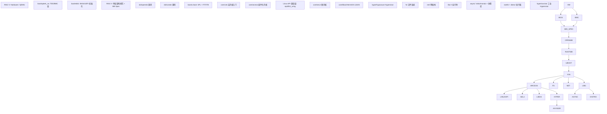

# 学习材料索引

> 本目录覆盖 RISC-V 全栈（从硬件上电到用户态应用）：
>
> 硬件上电 → BMC/BIOS → Bootloader/SPL → SBI → OS 内核 → Hypervisor → HAL → FS/Net/libc → rootfs/distro → async runtime

\---

## 纵向层次总览

```
┌──────────────────────────────────────────────────────┐
│  GUI / 图形栈  (gui/)                                 │
│  ├─ Toolkit (lvgl/slint/sdl)                         │
│  ├─ X11 (xserver/libx11/libxcb)                      │
│  ├─ Wayland (wayland/wlroots/sway/hyprland)          │
│  └─ Userspace driver (mesa/libdrm)                   │
├──────────────────────────────────────────────────────┤
│  User Applications  (user/, libc/, async/)           │
├──────────────────────────────────────────────────────┤
│  Linux API 兼容层（epoll/io\_uring/mmap/signal）       │
│  （DragonOS/StarryOS/Asterinas 等部分 OS 实现）       │
├──────────────────────────────────────────────────────┤
│  Container / cgroup  (others/runc, containerd, lxc)  │
├──────────────────────────────────────────────────────┤
│  OS Kernel  (core/: 宏/微/外核/LibOS/Unikernel        │
│              + freebsd/illumos/reactos/fuchsia)      │
├──────────────────────────────────────────────────────┤
│  Hypervisor  (hyper/: axvisor/xen + qemu/crosvm/...)  │
├──────────────────────────────────────────────────────┤
│  Bootloader / SPL  (boot/u-boot, coreboot)           │
├──────────────────────────────────────────────────────┤
│  SBI Firmware  (sbi/)          ← 起点                │
├──────────────────────────────────────────────────────┤
│  BIOS / UEFI / ACPI  (boot/edk2, grub2, acpica)      │
├──────────────────────────────────────────────────────┤
│  BMC / TEE  (boot/optee\_os)                          │
├──────────────────────────────────────────────────────┤
│  RISC-V Hardware / QEMU / Spike                      │
└──────────────────────────────────────────────────────┘
```

> \*\*层级说明\*\*
> - \*\*BMC（Baseboard Management Controller）\*\*：服务器主板上独立 ARM 核（iLO/iDRAC），在主 CPU 上电前管理硬件（OpenBMC/u-bmc）
> - \*\*BIOS/UEFI\*\*：比 SBI 更早的硬件初始化层，edk2 是 UEFI 的工业参考实现
> - \*\*Linux API 兼容层\*\*：部分 OS 不仅实现 POSIX/libc，还实现 Linux 专有 syscall（epoll/io\_uring/signalfd 等），以支持原生 Linux 应用
> - \*\*Container / cgroup\*\*（2026-05-10 新加）：StarryOS 方案三 cgroup + Docker 挑战任务；OCI 标准 + runtime + 用户态可观测

\---

## sbi/ — SBI 固件层

|项目|语言|Git 地址|说明|
|-|-|-|-|
|opensbi|C|https://github.com/riscv-software-src/opensbi|RISC-V 官方参考实现，工业标准|
|rustsbi|Rust|https://github.com/rustsbi/rustsbi|Rust 实现，含 Prototyper 动态固件|
|riscv-pk|C|https://github.com/riscv-software-src/riscv-pk|极简 M-mode 环境（BBL），含 pk 用户态模拟|

**学习顺序：** opensbi（理解 C 实现，代码最规范）→ rustsbi（Rust 现代实现）→ riscv-pk（理解最简 SBI）

\---

## boot/ — 引导加载层

|项目|语言|Git 地址|说明|
|-|-|-|-|
|u-boot|C|https://github.com/u-boot/u-boot|工业级 Universal Bootloader，含 SPL + FIT/ITB|
|barebox|C|https://git.pengutronix.de/cgit/barebox|嵌入式 bootloader，API 类似 U-Boot，代码更现代|
|grub2|C|https://git.savannah.gnu.org/git/grub.git|GNU GRUB 2，桌面 Linux 主流引导器，支持多种文件系统和协议|
|edk2|C|https://github.com/tianocore/edk2|UEFI 参考实现（TianoCore），工业 UEFI 固件基础|
|optee-os|C|https://github.com/OP-TEE/optee\_os|ARM TrustZone TEE（可信执行环境），安全固件层|
|rboot|Rust|https://github.com/rcore-os/rboot|Rust UEFI 引导器|
|acpica|C|https://github.com/acpica/acpica|ACPI Component Architecture 参考实现（Intel 出，含 iasl AML 编译器 + acpidump）；EDK2 / Linux / FreeBSD 都用|
|pmon||||

**学习顺序：** u-boot（理解 SPL 两阶段启动 + FIT 镜像格式）→ barebox（对比现代设计）→ grub2（理解 UEFI + 多协议引导）→ edk2（深入 UEFI 规范实现）→ optee\_os（安全固件/TEE 视角）→ coreboot（与 EDK2 横向：极简 vs 完整 firmware）→ acpica（ACPI AML 实现，与 EDK2 配合）

以及介绍 OVMF ...

> **本地补充（不在上表）：** `boot/older/` 存 U-Boot 历史考古样本（`u-boot-2002-11` / `u-boot-2008.10` / `u-boot-2014.04`），供 [03-09 U-Boot 演化案例研究](03-09-uboot-evolution-case-study.md) 做跨版本对比；`boot/pmon`（PMON2000，龙芯传统 bootloader）本地目录存在但无公开 git 索引。

\---

## rtos/ — 实时操作系统

|项目|语言|Git 地址|说明|
|-|-|-|-|
|FreeRTOS|C|https://github.com/FreeRTOS/FreeRTOS|最广泛使用的嵌入式 RTOS|
|rt-thread|C|https://github.com/RT-Thread/rt-thread|国产工业 RTOS，生态完整|
|uC-OS2|C|https://github.com/SiliconLabs/uC-OS2|经典教学用 RTOS|
|uC-OS3|C|https://github.com/SiliconLabs/uC-OS3|uC-OS2 的继任者|
|embassy|Rust|https://github.com/embassy-rs/embassy|async Rust 嵌入式运行时，无 RTOS 抽象|
|ariel-os|Rust|https://github.com/ariel-os/ariel-os|安全 / 内存安全 / 低功耗 IoT OS，基于 Rust，支持 32-bit MCU（Cortex-M / RISC-V / Xtensa）|
|RIOT-OS|C|https://github.com/RIOT-OS/RIOT|欧洲学术界（FU Berlin / INRIA）主导的成熟 IoT OS，C 实现，与 ariel-os 同生态位（前者 Rust / 后者 C）；支持 Cortex-M / RISC-V / AVR / MSP430 / Xtensa / native 等多架构|

### Rust embedded-hal 跨硬件 trait 抽象（rust-embedded 系，2026-05-10 加）

|项目|Git 地址|说明|
|-|-|-|
|embedded-hal|https://github.com/rust-embedded/embedded-hal|⭐ Rust 嵌入式生态最广泛 trait 集合（GPIO/I2C/SPI/UART/PWM/ADC）；v1.0 已稳定（2024）；跨 RTOS / 裸机通用，编译期 monomorphization 零开销|
|cortex-m|https://github.com/rust-embedded/cortex-m|Cortex-M 架构 Rust 底层（PAC / register access / semihosting）|
|svd2rust|https://github.com/rust-embedded/svd2rust|把 ARM SVD 寄存器描述自动生成 Rust PAC（Peripheral Access Crate）|
|riscv-embedded|https://github.com/rust-embedded/riscv|RISC-V 嵌入式 Rust 底层（CSR / interrupt / mtvec）|


\---

## core/ — 操作系统内核

### 宏内核 / 教学内核

|项目|语言|Git 地址|说明|
|-|-|-|-|
|xv6|C|https://github.com/mit-pdos/xv6-public|MIT 教学内核，极简宏内核|
|DragonOS|Rust+C|https://github.com/DragonOS-Community/DragonOS|国产**社区驱动** Rust **宏内核**，兼容 Linux ABI，**多架构支持**（x86_64 / riscv64 / loongarch64）|
|StarryOS|Rust|https://github.com/Starry-OS/StarryOS|**宏内核**：**ArceOS 衍生**的宏内核人格（基于 axtask/axfs 等组件组装出 Linux ABI）|
|NoAxiomOS|Rust|https://github.com/NoAxiom/NoAxiom-OS|实验性宏内核|
|TornadoOS|Rust|https://github.com/HUST-OS/tornado-os|异步内核探索|

### 组件化 / 模块化内核

|项目|语言|Git 地址|说明|
|-|-|-|-|
|arceos|Rust|https://github.com/arceos-org/arceos|组件化 Unikernel，可组装成宏内核|
|tg-arceos|Rust|https://github.com/rcore-os/tg-arceos-tutorial|arceos 教学示例集合：15 个 `app-\*` + 5 个 `exercise-\*`，覆盖 unikernel / monolithic kernel / hypervisor 三模式|
|asterinas|Rust|https://github.com/asterinas/asterinas|framekernel（框内核）：**模块化设计**的 Rust 安全内核框架，取**微内核**式隔离 + 宏内核性能折中 — 特权代码收敛进最小可信基(TCB)，其余服务沙箱化|
|Theseus|Rust|https://github.com/theseus-os/Theseus|组件内存安全内核，学术研究|

### 微内核

|项目|语言|Git 地址|说明|
|-|-|-|-|
|seL4|C+Haskell|https://github.com/seL4/seL4|形式化验证微内核|
|Zircon|C++|https://hexang.org/mirrors/fuchsia|Google Fuchsia 微内核|
|zCore|Rust|https://github.com/rcore-os/zCore|Zircon 的 Rust 重实现|

### 外核 (Exokernel) / SASOS (Single Address Space OS)

|项目|语言|Git 地址|说明|
|-|-|-|-|
|jos|C|https://pdos.csail.mit.edu/6.828/2018/jos.git|MIT 6.828 教学外核 — exokernel 经典|
|**BareMetal**|x86\_64 汇编 (FASM)|https://github.com/ReturnInfinity/BareMetal|Return Infinity 极简 OS — **SASOS（单地址空间）+ 外核思想**，无用户/内核分离，HPC 场景；配套 [Pure64](https://github.com/ReturnInfinity/Pure64) bootloader|

> \*\*外核 vs SASOS 区分：\*\*
> - \*\*外核 (jos)\*\*：内核存在但只暴露硬件资源；多进程多地址空间；应用各自实现 OS 抽象
> - \*\*SASOS (BareMetal)\*\*：单一地址空间，无进程隔离；与 unikernel 思想接近但不绑定单一应用
> - \*\*Unikernel (unikraft/HermitOS)\*\*：SASOS + 单应用 + 用主流语言

### Unikernel

|项目|语言|Git 地址|说明|
|-|-|-|-|
|unikraft|C|https://github.com/unikraft/unikraft|工业级 Unikernel 构建框架|
|biscuit|Go|https://github.com/mit-pdos/biscuit|MIT PDOS 研究 OS：Go 写的宏内核，证明 GC+goroutine 可用于内核空间；无染色问题，天然异步，对全异步 OS 有参考价值|
|tamago|Go|https://github.com/usbarmory/tamago|Go 裸金属框架（TamaGo）：让 Go 直接运行在 ARM/RISC-V MCU，无 OS；Unikernel 风格，GC + goroutine 调度全部在裸机上运行|

### LibOS (core/libos/)

|项目|语言|Git 地址|说明|
|-|-|-|-|
|HermitOS|Rust|https://github.com/hermit-os/kernel|Rust LibOS，运行在 Unikernel 上|
|MirageOS/mirage|OCaml|https://github.com/mirage/mirage|OCaml Unikernel 框架|
|MirageOS/mirage-skeleton|OCaml|https://github.com/mirage/mirage-skeleton|MirageOS 示例集合|
|TenonOS/tenon|C|https://gitee.com/tenonos/tenon|国产 LibOS 主体|
|TenonOS/mortise|C|https://gitee.com/tenonos/mortise|Tenon 的宿主/隔离层|
|TenonOS/board-support-package|C|https://gitee.com/tenonos/board-support-package|Tenon BSP|
|TenonOS/app-helloworld|C|https://gitee.com/tenonos-mirror/app-helloworld|Tenon 示例应用|
|rumprun|C|https://github.com/rumpkernel/rumprun|NetBSD rump 内核 Unikernel 化|

### 其它 OS 内核源码（驱动系统设计参考，2026-05-10 加）


|项目|语言|Git 地址|说明|
|-|-|-|-|
|**netbsd**|C|https://github.com/NetBSD/src|NetBSD 完整源码；**rump kernel**（内核子系统打包成用户态 lib）跨"内核态/用户态"驱动复用思想|
|**illumos**|C|https://github.com/illumos/illumos-gate|illumos / OpenSolaris 后裔；DDI/DKI driver framework + **SPL**（Solaris Porting Layer，Linux 风格代码进 illumos）= 反向 source-level 案例|
|**haiku**|C++|https://github.com/haiku/haiku|BeOS R5 复活项目；C++ kit 驱动框架；BeOS R5 ABI 兼容 + 自有驱动；R1/Beta5 已发|
|**android-kernel**|C|https://android.googlesource.com/kernel/common|Android Common Kernel + GKI（Generic Kernel Image）—— Linux KABI 稳定的妥协方案，研究 ABI 稳定性政策的活案例|

\---

## hyper/ — 虚拟化层

|项目|类型|Git 地址|说明|
|-|-|-|-|
|axvisor|Type-1, Rust|https://github.com/arceos-hypervisor/axvisor|ArceOS 基础的 Hypervisor|
|bao-hypervisor|Type-1, C|https://github.com/bao-project/bao-hypervisor|静态分区 Hypervisor，安全关键|
|hypocaust|Type-1, Rust|https://github.com/KuangjuX/hypocaust|RISC-V H 扩展教学 Hypervisor|
|hypocaust-2|Type-1, Rust|https://github.com/KuangjuX/hypocaust-2|hypocaust 改进版|
|RVM1.5|Type-1.5, Rust|https://github.com/rcore-os/RVM1.5|Linux 宿主上的 Type-1.5|
|rHyper|Type-1, Rust|https://github.com/rcore-os/rHyper|rCore 系列 Hypervisor|
|rcore-vmm|Type-2, Rust|https://github.com/rcore-os/rcore-vmm|用户态 VMM|
|rust-hypervisor-firmware|Type-1, Rust|https://github.com/cloud-hypervisor/rust-hypervisor-firmware|Cloud Hypervisor 固件|
|rustyvisor|Type-1, Rust|https://github.com/stemnic/rustyvisor|学习用 Rust Hypervisor|
|kvmtool|工具, C|https://github.com/kvmtool/kvmtool|Linux KVM 轻量级工具|
|rvvm|模拟器, C|https://github.com/LekKit/RVVM|RISC-V 软件模拟器|
|**xen**|Type-1, C|https://github.com/xen-project/xen|经典工业 Type-1 hypervisor（剑桥 2003 起）；含 `xen/arch/{arm,ppc,riscv,x86}` 4 大架构；AWS EC2 早期 / Citrix XenServer / Qubes OS / 国产腾讯云早期 / 阿里云早期都用过；现代云大多迁 KVM 但 Xen 仍在桌面虚拟化 / 安全敏感场景活跃|

### 工业虚拟化栈（AxVisor 方向二明确点名横向对比，2026-05-10 加）

|项目|类型|Git 地址|说明|
|-|-|-|-|
|**qemu** ⭐|模拟器 + Type-2 + KVM 主机, C|https://gitlab.com/qemu-project/qemu|QEMU 完整源码；含 `hw/i386/pc.c`（PC 平台）/ `hw/pci/`（PCI 总线）/ `hw/virtio/`（virtio 设备）/ `hw/intc/`（IOAPIC/GIC/PLIC 中断）；AxVisor 方向一 OVMF / fw\_cfg / ACPI 表实现参考|
|**crosvm**|Type-2, Rust|https://github.com/google/crosvm|Google ChromeOS Rust 虚拟化；rust-vmm 派生；AxVisor 方向二明确点名要对比的 4 项目之一|
|**firecracker**|Type-2 microVM, Rust|https://github.com/firecracker-microvm/firecracker|AWS Lambda 用 microVM（启动 < 125ms）；rust-vmm 派生；AxVisor 方向二点名|
|**cloud-hypervisor**|Type-2, Rust|https://github.com/cloud-hypervisor/cloud-hypervisor|Intel 主导 + 云原生定位；rust-vmm 派生；AxVisor 方向二点名|
|**acrn-hypervisor**|Type-1, C|https://github.com/projectacrn/acrn-hypervisor|Intel 嵌入式/IoT/汽车实时虚拟化；AxVisor 方向二点名|
|vm-memory|crate, Rust|https://github.com/rust-vmm/vm-memory|rust-vmm guest 内存抽象|
|vm-virtio|crate, Rust|https://github.com/rust-vmm/vm-virtio|rust-vmm virtio queue / blk / net / fs / vsock 实现（含 virtio-queue 子 crate）|
|kvm-bindings|crate, Rust|https://github.com/rust-vmm/kvm-bindings|Linux KVM ioctl 自动 bindgen 绑定|
|kvm-ioctls|crate, Rust|https://github.com/rust-vmm/kvm-ioctls|KVM ioctl 安全 wrapper|
|vhost|crate, Rust|https://github.com/rust-vmm/vhost|vhost-user / vhost-net 后端|

> \*\*Hypervisor 学习顺序建议：\*\*
> 1. \*\*概念入门\*\*：\[00-02 § Layer 5 Type 1/1.5/2 对比](00-02-fullstack-vertical.md) + \[00-07 § 5 虚拟化全谱](00-07-os-evolution.md)
> 2. \*\*理解 Type-1（教学最简）\*\*：先读 `hypocaust/` (RISC-V 教学) → `rustyvisor/` (Rust 学习版)
> 3. \*\*理解 Type-1.5（生产主流）\*\*：`RVM1.5/` (rCore Linux 上 Type-1.5) → KVM 源码（不在本仓库，看 Linux drivers/kvm）
> 4. \*\*工业级 Type-1 对照\*\*：`xen/` (200 万行 C，几十年迭代) + `bao-hypervisor/` (静态分区 / 认证)
> 5. \*\*组件化\*\*：`axvisor/` (ArceOS 派生，Rust + 模块化)
> 6. \*\*云原生固件\*\*：`rust-hypervisor-firmware/` (Cloud-Hypervisor 配套)
> 7. \*\*工具与模拟器\*\*：`kvmtool/` (KVM 用户态工具) / `rvvm/` (RISC-V 软件模拟)

\---

## hal/ — 硬件抽象层

|项目|Git 地址|说明|
|-|-|-|
|polyhal|https://github.com/Byte-OS/polyhal|多架构 HAL，供上层内核统一调用|

\---

## fs/ — 文件系统

> \*\*VFS（虚拟文件系统）层\*\* 是 fs 子系统的核心抽象——位于 syscall 与具体 FS 之间，定义统一的 super\_block / inode / dentry / file 4 大对象。Sun 1986 为 NFS 发明，Linus 1992 移植入 Linux，至今所有多 FS 共存系统都基于此模型。详见 \[`05-01-vfs-virtual-filesystem.md`](05-01-vfs-virtual-filesystem.md)。

### VFS 层（虚拟文件系统抽象，无单独项目，落实在内核源码）

|项目|Git 地址|说明|
|-|-|-|
|linux-fs|https://github.com/torvalds/linux|⭐ Linux 内核 sparse checkout（2026-05-10 扩展）—— **fs/ VFS 主战场** + **drivers/{base,bus,pci,usb,i2c,spi,mmc,gpio,clk,dma,iommu,gpu/drm,video,virtio,net}**（驱动模型源码）+ **include/linux/**（内核 ABI 头）+ **kernel/{cgroup,sched,locking,rcu}** + **mm/** + **Documentation/{driver-api,PCI,devicetree,admin-guide}**（含 cgroup-v2 文档）—— 驱动 / 调度 / cgroup / DRM/KMS 一站式|

### 教学型 FS（先读，理解 FS 骨架）

|项目|Git 地址|说明|
|-|-|-|
|easyfs|https://github.com/rcore-os/easyfs|rCore 教学简易 FS（Rust \~1K 行，含独立 vfs.rs trait）|

### 工业型块设备 FS

|项目|Git 地址|说明|
|-|-|-|
|ext2-rs|https://github.com/rcore-os/ext2-rs|Rust ext2 实现（学习 ext 系经典布局）|
|ext4\_rs|https://github.com/yuoo655/ext4\_rs|Rust ext4 完整实现（含 ext4\_defs / ext4\_impls / fuse\_interface）|
|lwext4\_rust|https://github.com/rcore-os/lwext4\_rust|lwext4 的 Rust 绑定（嵌入式 ext4，C 库 + Rust 包装）|
|fatfs|https://github.com/abbrev/fatfs|C FAT 文件系统（FAT12/16/32 + vfat 长名）|
|littlefs|https://github.com/littlefs-project/littlefs|嵌入式掉电安全 FS（NOR Flash 友好，COW + 日志）|

### 用户态 FS 框架

|项目|Git 地址|说明|
|-|-|-|
|libfuse|https://github.com/libfuse/libfuse|FUSE 用户态 C 库（NTFS-3G / sshfs / s3fs / encfs 等数十项目基础）|
|fuse-ext2|https://github.com/alperakcan/fuse-ext2|FUSE 客户端：用户态读写 ext2（macOS 历史方案）|
|spdk|https://github.com/spdk/spdk|Storage Performance Development Kit —— Intel 主导用户态 NVMe driver，绕过内核栈直接 polling NVMe submission queue；DPDK 同体系|

### 现代 OS 内核 VFS 实现（在 core/ 大类下，列于此供对照）

|项目|路径|说明|
|-|-|-|
|arceos axfs|`core/arceos/modules/axfs/`|Rust trait 风现代 VFS（VfsOps / VfsNodeOps + cargo features 选 FS）|
|TornadoOS async-fat32|`core/TornadoOS/async-fat32/` + `tornado-kernel/src/fs/fat32/`|异步 VFS + 异步 FAT32 完整链|
|DragonOS filesystem|`core/DragonOS/kernel/src/filesystem/`|Linux 兼容 VFS（Rust，跑 musl/glibc 二进制）|
|StarryOS axfs 适配|`core/StarryOS/`|基于 arceos VFS 的宏内核人格|
|xv6 fs|`core/xv6/kernel/fs.c + file.c + sysfile.c`|C \~1.5K 行 minimal VFS（教学起点）|

\---

## net/ — 网络栈

|项目|Git 地址|说明|
|-|-|-|
|lwip|https://git.savannah.nongnu.org/git/lwip.git|嵌入式轻量级 TCP/IP 栈|
|smoltcp|https://github.com/smoltcp-rs/smoltcp|Rust 无 alloc 网络栈|
|rustls|https://github.com/rustls/rustls|Rust TLS 实现|
|dpdk|https://dpdk.org/git/dpdk|Data Plane Development Kit —— 用户态网络驱动框架（绕过内核栈直接 polling NIC），云数据中心 / NFV 主流；高性能用户态 driver 设计参考|

\---

## gui/ — 图形界面 / 图形栈（2026-05-10 新建大类）


### X.Org 系（X11 服务器与客户端 lib）

|项目|Git 地址|说明|
|-|-|-|
|xserver|https://gitlab.freedesktop.org/xorg/xserver.git|X.Org server 完整源码（DIX + DDX + extensions），22+ 扩展（GLX / DRI3 / XRender / XComposite / XRandR / XInput2 / XKB 等）|
|libx11|https://gitlab.freedesktop.org/xorg/lib/libx11.git|Xlib 客户端 lib（古老但兼容性广，1.7+ 内部走 xcb 后端）|
|libxcb|https://gitlab.freedesktop.org/xorg/lib/libxcb.git|xcb（X C Binding）—— 现代 X 客户端，异步 + 无内部锁|

### Wayland 系（compositor 协议与 lib）

|项目|Git 地址|说明|
|-|-|-|
|wayland|https://gitlab.freedesktop.org/wayland/wayland.git|libwayland-client + libwayland-server + wayland-scanner 工具|
|wayland-protocols|https://gitlab.freedesktop.org/wayland/wayland-protocols.git|标准协议 XML（xdg-shell / linux-dmabuf / presentation-time / viewporter / pointer-constraints / etc）|
|wlroots|https://gitlab.freedesktop.org/wlroots/wlroots.git|Wayland compositor 框架（C），sway / Hyprland / Wayfire / dwl / labwc 等都基于此|
|sway|https://github.com/swaywm/sway|i3wm 风 Wayland tiling compositor（基于 wlroots）|
|hyprland|https://github.com/hyprwm/Hyprland|tiling + 动画 + 美化 Wayland compositor（基于 wlroots，流行新晋）|

### GPU userspace driver（mesa）+ 内核 UAPI

|项目|Git 地址|说明|
|-|-|-|
|mesa|https://gitlab.freedesktop.org/mesa/mesa.git|OpenGL / Vulkan / OpenCL / VAAPI userspace 实现（Gallium 中间表示 + NIR 着色器 IR + 多后端 radeonsi/iris/anv/radv/turnip/panfrost/lima/v3d/lavapipe/zink/llvmpipe）|
|libdrm|https://gitlab.freedesktop.org/mesa/drm.git|用户态 DRM ioctl 包装库（atomic modeset / GEM/TTM buffer / dma-fence / dma-buf / PRIME 多 GPU）|

### 嵌入式 / 跨平台 GUI

|项目|Git 地址|说明|
|-|-|-|
|lvgl|https://github.com/lvgl/lvgl|C 嵌入式 GUI（\~50KB ROM / \~10KB RAM），裸机 / FreeRTOS / Linux fbdev 通用|
|slint|https://github.com/slint-ui/slint|Rust 嵌入式 GUI + DSL，Skia/OpenGL/软件 多后端，跨 Linux/Windows/macOS/嵌入式 MCU|
|sdl|https://github.com/libsdl-org/SDL|C 跨平台游戏 lib（窗口 / 输入 / 音频 / 渲染 / 网络），Valve / 独立游戏大量用|

> \*\*学习顺序建议：\*\*
> 1. \*\*架构入门\*\*：\[00-23](00-23-graphics-ui-overview.md) §1 纵向 7 层 + §11 关键概念（vsync / VRR / HDR）
> 2. \*\*嵌入式入门（最低门槛）\*\*：lvgl / slint + fbdev 直驱（无 mesa / 无 X / 无 Wayland）
> 3. \*\*桌面 OpenGL\*\*：mesa（先看 src/gallium/auxiliary 通用 + src/gallium/drivers/llvmpipe 软件）
> 4. \*\*X11 协议\*\*：xserver（DIX 部分）+ libxcb（现代客户端）
> 5. \*\*Wayland 协议\*\*：wayland 协议 + libwayland + wlroots / sway / hyprland 任选其一深入
> 6. \*\*DRM/KMS 内核侧\*\*：fs/linux-fs sparse drivers/gpu/drm/

\---


\---

## libc/ — C 运行时库

|项目|Git 地址|说明|
|-|-|-|
|musl|https://git.musl-libc.org/musl|轻量精准 POSIX libc，Linux 静态链接首选|
|relibc|https://gitlab.redox-os.org/redox-os/relibc|Rust 编写的 C 库（Redox）|
|uclibc-ng|https://repo.or.cz/uclibc-ng.git|嵌入式 libc，uClibc 继任|
|picolibc|https://github.com/picolibc/picolibc|超小嵌入式 libc（newlib 分支）|
|baselibc|https://github.com/PetteriAimonen/Baselibc|裸机最小 libc|
|libcxx|https://bitbucket.org/acassis/libcxx|精简 C++ 标准库|
|utf8proc|https://github.com/JuliaStrings/utf8proc|UTF-8 处理库|
|newlib|https://sourceware.org/git/newlib-cygwin.git|极简嵌入式C|
|compiler-rt|https://github.com/llvm/llvm-project.git|LLVM C后端|
|msvc||cl win后端|

之后会附加动态链接+静态链接 with OS + swap 空间等等在OS的实现原理等等

\---

## rootfs/ — 根文件系统构建

|项目|Git 地址|说明|
|-|-|-|
|buildroot|https://github.com/buildroot/buildroot|嵌入式 Linux 根文件系统构建系统|
|busybox|https://git.busybox.net/busybox|单二进制 Unix 工具箱，嵌入式 initramfs 基础|
|tgoskits|https://github.com/rcore-os/tgoskits|rcore-os StarryOS PR 提交目标仓库（dev 分支）；含 `test-suit/starryos/normal/` C/Rust 测例 + `stress/` linux app 配置|
|linux-compat-tests|https://github.com/rcore-os/linux-compatible-testsuit|StarryOS Linux 兼容性测试套件（dev 分支）；syscall 优先级文档 + 测例|

\---

## distro/ — Linux 发行版构建

|项目|Git 地址|说明|
|-|-|-|
|YoctoPoky|https://git.yoctoproject.org/poky|Yocto 参考发行版，工业嵌入式 Linux 标准|
|openwrt|https://github.com/openwrt/openwrt|路由器 Linux 发行版|
|openRuyi|https://github.com/openRuyi-Project/openRuyi|国产嵌入式发行版探索|

\---

## bmc/ — BMC 服务器管理固件（待克隆，远期）

> \*\*BMC（Baseboard Management Controller）\*\* 是服务器主板上独立 SoC（典型 ASPEED AST2600），与主 CPU 完全分离 + 待机供电 always-on，负责远程开关机 / 监控温度风扇 / 接管虚拟键鼠屏 / 重刷主机 BIOS。商业代称：HPE iLO / Dell iDRAC / Lenovo XCC / AMI MegaRAC。
>

|项目|Git 地址|说明|
|-|-|-|
|openbmc|https://github.com/openbmc/openbmc|⭐ Linux Foundation 主推开源 BMC OS（Yocto 元仓 + 多个 phosphor-\* 子仓）|
|bmcweb|https://github.com/openbmc/bmcweb|OpenBMC C++ Redfish HTTPS server|
|phosphor-host-ipmid|https://github.com/openbmc/phosphor-host-ipmid|OpenBMC IPMI handler|
|entity-manager|https://github.com/openbmc/entity-manager|OpenBMC 设备发现（JSON 描述硬件）|
|openbmc-docs|https://github.com/openbmc/docs|OpenBMC 官方架构 / 设计文档|
|u-bmc|https://github.com/u-root/u-bmc|Google 推 Go 实现 BMC（与 OpenBMC 双雄）|

**协议规范（远期可拉文档）：**

* DMTF Redfish spec：https://www.dmtf.org/standards/redfish
* DMTF MCTP/PLDM/SPDM specs：https://www.dmtf.org/standards/pmci
* Intel IPMI 2.0 spec：https://www.intel.com/content/www/us/en/products/docs/servers/ipmi/

\---

## async/ — 异步运行时与协程库（全部已克隆）

### Rust 异步运行时

|项目|本地路径|Git 地址|说明|
|-|-|-|-|
|tokio|async/tokio|https://github.com/tokio-rs/tokio|主流多线程 async 运行时（工作窃取调度器）|
|monoio|async/monoio|https://github.com/bytedance/monoio|字节 io\_uring 单线程运行时，完成式 I/O|
|async-std|async/async-std|https://github.com/async-rs/async-std|API 镜像 std 的 async 运行时|
|smol|async/smol|https://github.com/smol-rs/smol|\~1500 行最小执行器，适合阅读学习|

### Rust 协程库

|项目|本地路径|Git 地址|类型|说明|
|-|-|-|-|-|
|corosensei|async/corosensei|https://github.com/Amanieu/corosensei|有栈协程|跨平台汇编 context\_switch，RISC-V/x86/ARM|
|may|async/may|https://github.com/Xudong-Huang/may|有栈协程|M:N goroutine 风格，类 Go runtime|
|genawaiter|async/genawaiter|https://github.com/whatisaphone/genawaiter|Generator|stable Rust Generator，模拟 Python yield|
|futures-rs|async/futures-rs|https://github.com/rust-lang/futures-rs|无栈协程|futures 0.3.32，定义 Future/Stream/Poll trait|

### Zig 协程库

|项目|本地路径|Git 地址|类型|说明|
|-|-|-|-|-|
|zigcoro|async/zigcoro|https://github.com/rsepassi/zigcoro|有栈协程|汇编 context\_switch，RISC-V/x86/aarch64|
|zap|async/zap|https://github.com/kprotty/zap|有栈纤程|M:N 调度器，已存档，汇编清晰易读|
|libxev|async/libxev|https://github.com/mitchellh/libxev|事件循环|跨平台 io\_uring/kqueue/IOCP，回调式无栈异步|

> \*\*笔记：\*\* 协程原理详见 `notes/01-06-zig-async.md` 第8节，含上下文切换机制图、四种并发模型对比、zigcoro/zap/libxev/Corosensei/May/futures 代码示例。


>
> \*\*学术背景：\*\* 清华（向勇/陈渝/吴一凡/田凯夫/赵方亮/廖东海/周济平）+ 北航（陈渭豪）+ 北理工（廖东海/罗曦）+ 电科大（杨长可/袁子威）+ HUST（江周棋）多校协作 2020-2025；核心思想 = "进程/线程/无栈协程统一调度"+"用户态中断（RISC-V N 扩展）"+"vDSO 调度器"+"Future 状态机内核"+"用户态驱动"。

#### 站点 + 论文 + 静态分析

|项目|本地路径|Git 地址|角色|
|-|-|-|-|
|AsyncOS-site|core/asyncos-refs/AsyncOS-site|https://github.com/AsyncOS/AsyncOS.github.io|设计文档站源码（design overview / microkernel / N-ext usage / spec\_n + 7 篇 discussion）|
|async-kernel/documents|core/asyncos-refs/async-kernel-documents|https://github.com/async-kernel/documents|论文 + 设计 v1-v7（2020-10 → 2023-03 演化）|
|os-checker|core/asyncos-refs/os-checker|https://github.com/os-checker/os-checker|OS 项目静态分析工具（周济平 zjp）|

#### 核心异步内核研究

|项目|本地路径|Git 地址|角色|
|-|-|-|-|
|rCore-N|core/asyncos-refs/rCore-N|https://github.com/zflcs/rCore-N|vDSO 调度器 + 用户态中断 rCore（赵方亮 清华）|
|rel4\_kernel|core/asyncos-refs/rel4\_kernel|https://github.com/reL4team2/rel4\_kernel|seL4 Rust 重写（廖东海 北理工 等）|
|embassy\_preempt|core/asyncos-refs/embassy\_preempt|https://github.com/KMSorSMS/embassy\_preempt|uCOS-II 抢占 + embassy 异步扩展（袁子威 / 石诺辉 电科大）|

#### 用户态中断 / 硬件研究

|项目|本地路径|Git 地址|角色|
|-|-|-|-|
|taic|core/asyncos-refs/taic|https://github.com/taic-repo/taic|Task-aware Interrupt Controller 硬件（赵方亮）|
|uintr|core/asyncos-refs/uintr|https://github.com/U-interrupt/uintr|RISC-V 用户态中断 ISA 扩展（田凯夫 / 陈渭豪）|
|osblog|core/asyncos-refs/osblog|https://github.com/sgmarz/osblog|Stephen Marz RISC-V OS 教程（PLIC 用户态实现参考）|

#### 已在其它大类的关联项目（不重复克隆）

|项目|本地路径|关联|
|-|-|-|
|arceos|core/arceos|jyk 贾越凯 组件化 unikernel —— AsyncOS 设计 overview 引用|
|tornado-os|core/TornadoOS|江周棋 HUST 共享调度器异步内核 —— AsyncOS 同思路样板|
|embassy|rtos/embassy|embassy-rs Rust async 嵌入式 —— embassy\_preempt 上游|

**学习顺序建议（AsyncOS 家族纵向）：**

1. **站点**：先读 `AsyncOS-site/content/{design,discussion}/` 全部 markdown（4 design + 7 discussion，理解项目主线）
2. **论文集**：`async-kernel-documents/` v1 → v7（2020-2023 演化轨迹）
3. **rCore-N**（最直接的 vDSO 调度器实现样板）
4. **TornadoOS**（已存，对照"共享调度器"另一思路）
5. **embassy\_preempt**（uCOS-II + async preempt 角度切入）
6. **uintr / taic**（用户中断硬件 + ISA 扩展双视角）
7. **rel4\_kernel**（Rust 微内核 + capability 系统横向）
8. **os-checker**（静态分析工具横向）
9. **osblog**（PLIC user-mode 实操参考）


\---

## user/ — 用户态运行时垫片

|项目|Git 地址|说明|
|-|-|-|
|compiler-builtins|https://github.com/rust-lang/compiler-builtins|Rust 底层内置函数（memcpy/memset 等）|
|relibc|https://github.com/redox-os/relibc|Rust C 库（与 libc/relibc 为同一项目）|

\---

## others/ — GPGPU / OpenCL / LLVM + 容器 + 可观测性 + 内核测试 + backtrace

### GPGPU / OpenCL 全链路

跨 OS 的"硬件 → 驱动 → 运行时 → 用户代码"实例研究。后续单独一篇笔记（编号待定）从 Vortex 硬件起讲到 OpenCL 程序运行。

|项目|Git 地址|说明|
|-|-|-|
|vortex|https://github.com/vortexgpgpu/vortex|RISC-V 开源 GPGPU（Georgia Tech）— 硬件 RTL + 驱动 + 仿真器|
|pocl-upstream|https://github.com/pocl/pocl|Portable OpenCL 上游 — CPU backend 默认实现，用 LLVM 编译 OpenCL kernel|
|pocl-vortex|https://github.com/vortexgpgpu/pocl|pocl 的 Vortex GPGPU 后端 fork — 把 OpenCL kernel 编到 Vortex 的 RISC-V 指令|

> **本地克隆状态：** 三仓均已 clone（`others/vortex` + `others/pocl-upstream` + `others/pocl-vortex`）。

### 容器运行时 + OCI 标准（cgroup/Docker 挑战任务，2026-05-10 加）

|项目|Git 地址|说明|
|-|-|-|
|runtime-spec|https://github.com/opencontainers/runtime-spec|OCI runtime spec —— 容器运行时标准（process / mounts / hooks / linux namespace / cgroup）|
|image-spec|https://github.com/opencontainers/image-spec|OCI image spec —— 容器镜像标准（manifest / layers / config）|
|distribution-spec|https://github.com/opencontainers/distribution-spec|OCI distribution spec —— 镜像 registry 标准（push/pull HTTP API）|
|runc|https://github.com/opencontainers/runc|OCI runtime 参考实现（Docker / containerd 后端）|
|containerd|https://github.com/containerd/containerd|工业容器运行时（Docker / Kubernetes 默认）|
|lxc|https://github.com/lxc/lxc|Linux container 老牌（早 Docker 几年）|
|podman|https://github.com/containers/podman|Red Hat Docker 替代（无守护进程 / rootless 友好）|
|cri-o|https://github.com/cri-o/cri-o|Kubernetes CRI 实现（OpenShift 用）|

### 可观测性 / eBPF 全栈（2026-05-10 加）

|项目|Git 地址|说明|
|-|-|-|
|bpftrace|https://github.com/iovisor/bpftrace|高级 BPF 追踪语言（DTrace 风）|
|bcc|https://github.com/iovisor/bcc|BPF Compiler Collection（Python wrappers + 大量工具）|
|libbpf|https://github.com/libbpf/libbpf|eBPF 用户态 lib（CO-RE / BTF）|
|aya|https://github.com/aya-rs/aya|Rust eBPF 框架（CO-RE 原生支持）|

### backtrace / unwinding

|项目|Git 地址|说明|
|-|-|-|
|libunwind|https://github.com/libunwind/libunwind|DWARF / .eh\_frame 栈展开标准 lib|

### 内核测试基础设施


（syscall的讲解会以posix/gnu api为主 也会涉及其他补充的api/规范，目的只有linux兼容api，但是也会梨花带雨一些win/mac的独有api的区别+解释）

|项目|Git 地址|说明|
|-|-|-|


> 本目录 clone 后将作为"硬件→驱动→runtime→应用"全栈样本。围绕 OS 的笔记完成后才写（笔记 27 已登记，blocked by 00-08/06/07/08/09）。
>
> - \*\*x-cov + Syzkaller fork\*\* = 覆盖率引导 fuzz，探深路径
> - \*\*SysABI\*\* = 差分测试，扫 Linux ABI 兼容
> - \*\*RusyFuzz\*\*（Rust panic 反馈）= 异常引导，捕崩溃点

\---

## 推荐学习路径




