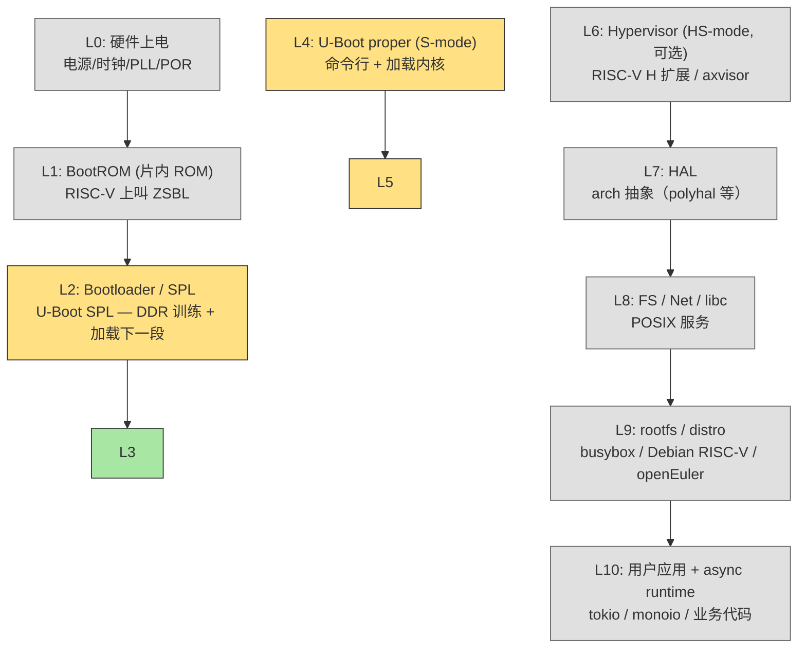
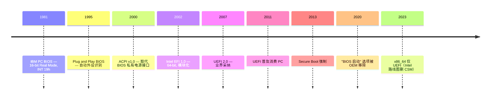
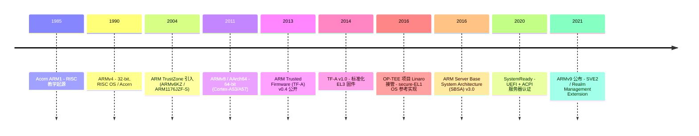
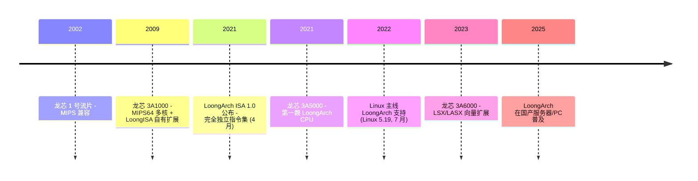
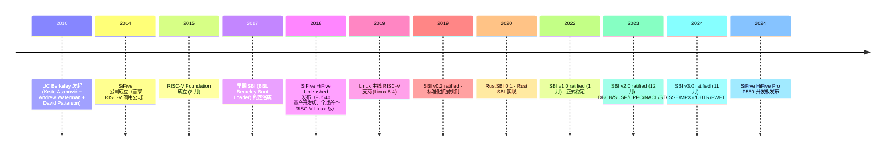
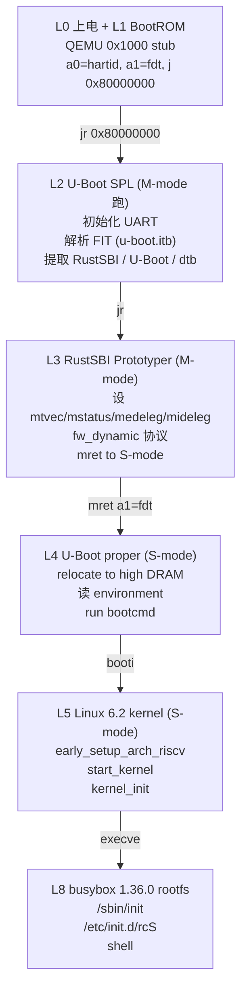
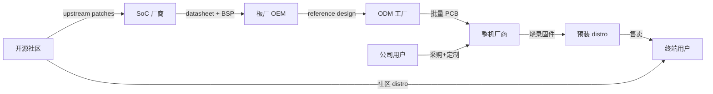

# 00-02 — 全栈垂直分层路线：先 RISC-V 主线，再扩展到 aarch64 / x86 / loongarch

> **核心问题：** 一台计算机从按下电源到运行用户程序之间，"软件"经过了哪些层？每层在做什么？为什么不同 ISA / arch 的层数和层名不一样？为什么 RISC-V 适合入门？
>
> **一句话答案：** 软件栈是**逻辑功能分层**——它在不同架构上落地为**不同名字的具体组件**。RISC-V 用 SBI 做 M-mode 监视器；aarch64 用 TF-A 在 EL3；x86 历史用 SMM；LoongArch 沿用 ARM 套路。**SBI 不是"通用栈层"，而是 RISC-V 特有的 ABI 名称。** 不要混淆 ISA 之间的具体实现——它们解决类似问题但用不同名字、不同特权级、不同启动协议。
>
> **本笔记的策略**：先讲清楚 RISC-V 主线（最少包袱、最干净），再逐步扩展到其他 ISA。不要一上来把所有架构混进一张图。

本笔记是 [`00-01-material-index.md`](00-01-material-index.md) 的姊妹篇，定位"垂直全栈学习路线总图"——从一份"项目目录索引"补到"知识层次地图"。后续每篇笔记按本图逐层下钻。

---

## 1. 主线：RISC-V 软件栈分层

**先把 RISC-V 这一条线讲透，其他架构的对比放第 4 节。**



灰色 = 后续阶段

> **学习习惯说明（来自 [user_learning_style](../CLAUDE.md)）：** 本笔记按"先 RISC-V 主线 → 再横向对比其他 ISA → 内部演化 → 入门 → 进阶 → 收官造轮"展开。下文先把 RISC-V 每层讲清楚，第 4 节才横向对比 aarch64 / x86 / loongarch。
>
> ⚠️ **关键提醒：不要把不同 ISA 的栈混为一谈！** SBI 是 RISC-V 独有的 ABI 名称，aarch64 / x86 / loongarch 没有 SBI 这个名字（它们各有自己的等价物：TF-A SMC / SMM / LoongArch BPI）。学习时一次专注一条线。

---

## 2. RISC-V 主线每层职责详解

> **本节范围：先把 RISC-V 这一条线讲清楚。** aarch64 / x86 / loongarch 的对应层叫什么、用什么项目实现，**统一放到 § 4 横向对比章节**——避免在同一图上混"四条线"造成认知混乱。

### Layer 0 — 硬件上电（Power On）

**做什么：**
- 电源 ramp-up（5V / 3.3V / 1.8V / 0.9V 多电源轨依序上电）
- PLL 锁相，建立时钟（典型 24 MHz xtal → 1.5 GHz CPU）
- POR (Power On Reset) 信号释放 → CPU 解除 reset
- CPU 从 reset vector 开始取指令（各架构具体地址见下表）

**职责：**
- 完全是**纯硬件**层，软件触不到
- 但软件设计要意识到："我的代码运行时，PLL 已锁、电源稳"

**不同架构 reset vector：**

| 架构 | Reset 后 PC | 备注 |
|------|------------|------|
| **x86** | 0xFFFFFFF0 (top of 4GB - 16) | 16-bit Real Mode |
| **ARMv7-A** | 0x00000000 或 0xFFFF0000（SCTLR.V 控制 HIVECS） | 32-bit |
| **AArch64 (ARMv8)** | 由 RVBAR_ELx 配置（厂商烧死，典型 SoC ROM 起始地址）| 64-bit EL3 |
| **LoongArch** | 0x1C000000 (BIOS ROM 起始) | 64-bit |
| **RISC-V** | 实现定义（QEMU virt: 0x1000 / SiFive FU740: 0x1000） | M-mode；mtvec 是 trap vector，与 reset vector 不同 |

**没有"层 0 项目"在本仓库**——这是芯片厂的工作，不在 OS 学习范围。

---

### Layer 1 — BootROM / ZSBL（RISC-V 主线）

**做什么：** SoC 内置的不可改 mask ROM，CPU 复位后从这里开始取指（**入口由 reset vector 决定** —— reset vector 详见 [03-02-boot-overview § 9.4 Reset Vector](03-02-boot-overview.md)，与 trap vector `mtvec` 是两个完全不同的概念）。

**RISC-V 上叫 ZSBL（Zeroth Stage Boot Loader）。**

#### Layer 1.1 — ZSBL 的 5 大职责（必做与可选）

| 职责 | 必做？ | 说明 |
|------|------|------|
| **CPU 早期初始化** | ✅ 必做 | 设 `mtvec` 防异常 / 关中断 / 选 boot hart（hart 0 跑，其他 hart `wfi`）|
| **传 ABI 给下一段** | ✅ 必做 | RISC-V 约定：`a0 = hartid, a1 = FDT 物理地址`，`jr` 跳到 SBI/SPL |
| **boot 设备选择** | 真机 ✅ / QEMU ❌ | 读 GPIO / eFuse / 硬件按键决定从 SD / SPI flash / eMMC / NVMe 加载 |
| **加载下一段（SPL/SBI）** | 真机 ✅ / QEMU ❌（QEMU 用 `-bios` 预加载）| 从 boot 设备读 GPT 分区到 SRAM 或 L2-cache-as-RAM |
| **Verified Boot 验证** | 现代 SoC ✅ / 教学 ❌ | 用 eFuse 中烧死的公钥校验下一段签名（信任链根）|
| **救砖通道** | 现代 SoC ✅ | USB DFU / UART 强制下载模式（按特定 key 触发）|
| **DRAM 训练** | ❌ **通常不做** | 训练在 Layer 2 SPL 完成；ZSBL 没 DRAM，只能用 SRAM/L2-cache 当 RAM |

#### Layer 1.2 — ZSBL 五个真实样本（由简到繁）

ZSBL 内容**随 SoC 差异极大** —— 从 6 条指令到 MB 级代码都有：

| 类别 | 大小 | 例 | 特点 |
|------|------|---|------|
| **教学最简** | 几十字节 | QEMU virt `0x1000` stub | 只传 ABI + 跳下一段 |
| **典型嵌入式** | 几 KB | SiFive FU740 ZSBL（[github.com/sifive/zsbl](https://github.com/sifive/zsbl)）| + boot 设备选择 + L2-cache-as-RAM |
| **现代消费 SoC** | 几十 KB | StarFive JH7110 BROM / Allwinner D1 brom | + Verified Boot + USB DFU 救砖 |
| **超大异构** | MB 级 | Microchip PolarFire SoC HSS（[github.com/polarfire-soc/hart-software-services](https://github.com/polarfire-soc/hart-software-services)）| 包揽 ZSBL+SPL+SBI 三件事 |

**A. QEMU virt — 最小 ZSBL（6 条指令）**

```asm
0x1000:  auipc t0, 0x0          ; t0 = PC = 0x1000
0x1004:  addi  a2, t0, 40       ; a2 = 0x1028 placeholder
0x1008:  csrr  a0, mhartid      ; a0 = hartid（per-hart 唯一）
0x100c:  ld    a1, 32(t0)       ; a1 = FDT 地址（存在 0x1020）
0x1010:  ld    t0, 24(t0)       ; t0 = 0x80000000（SBI 入口）
0x1014:  jr    t0               ; 跳到 SBI / fw_jump

0x1018:  .quad 0x80000000       ; SBI 入口
0x1020:  .quad <FDT addr>       ; QEMU 注入的 FDT 物理地址
```

**全部 = 6 条指令 + 2 个常量**。无 boot 设备选择 / 无 Verified Boot / 无 DDR 训练（QEMU 启动就有完整 RAM）。

**B. SiFive HiFive Unmatched (FU740) — 真机典型 ZSBL**

```c
// 高层伪代码
void zsbl_main(void) {
    if (mhartid != 0) wfi_loop();          // 1. 非 boot hart 等待
    setup_mtvec(panic_handler);             // 2. 防启动期 trap
    clear_clint_msip();                     // 3. 清软中断
    boot_dev = read_gpio_strap();           // 4. 读跳线决定 boot 设备 (MSEL[3:0])
    switch (boot_dev) {
        case BOOT_SD:     mmc_init();   load_sector_to_l2cache(...); break;
        case BOOT_QSPI:   qspi_init();  spi_read_to_l2cache(...);    break;
        case BOOT_LOADER: wait_serial_command(); /* 救砖：UART 等待加载 */
    }
    jump_to(0x08000000);  // 跳到 SPL（在 L2 cache 中）
}
```

特点：**真实硬件初始化 + 多 boot 设备 + UART 救砖**。FU740 没专门 SRAM，**用 L2 cache 当 RAM**（lock 几个 cache way 当临时存储）。

**C. StarFive VisionFive 2 (JH7110) — 几十 KB BROM（闭源）**

特性：USB DFU 强制下载模式（按 boot 按钮）/ 多 boot 设备（SD / eMMC / NOR flash / NVMe）/ DDR pre-init 一部分搬到 BROM / 验证 SPL header 签名 (`STARFIVE` magic)。

**D. Allwinner D1 — 32KB brom + FEL 模式（行业经典）**

```
brom 32KB 内容：
  ├ 启动 logic（选 boot 设备）
  ├ FEL mode handler（USB 强制下载，救砖必备）
  ├ SPL header 校验（magic = "eGON.BT0" / "uboot"）
  ├ 加载 SPL 到 SRAM A1（D1 上是 0x20000）
  └ 跳到 SPL 入口
```

**FEL 模式**：上电时按特定 GPIO key → brom 进 USB device 模式 → host PC 跑 `sunxi-fel` 工具直接灌固件，**完全绕过 SD/Flash**。这是国产嵌入式板"刷砖"的杀手锏，Allwinner 全系（A20 → D1）通用。

**E. Microchip PolarFire SoC HSS — MB 级"超大 ZSBL"**

完全反传统：**不是片内 mask ROM，是用户提供的代码**（自己改自己烧）。跑在 E51 monitor hart（5 核异构：4× U54 application + 1× E51 monitor）。包揽 ZSBL + SPL + SBI **三件事**：
- DDR 初始化（自己里完成，不像 SiFive 推给 SPL）
- PCIe / SerDes 配置 + FPGA bitstream 加载
- 持续跑做 SBI 服务（U54 用 `ecall` 呼叫 E51）

体量 1-2 MB。这是 FPGA + RISC-V 混合架构的特殊解法。

#### Layer 1.3 — ZSBL 设计要点

- **位置**：片内 mask ROM（FU740 / D1 / JH7110）/ 用户自定义可改（HSS 例外）
- **不可改**：典型 ZSBL 出厂烧死，bug 也不能 patch（除非 SoC ECO 改版）
- **Verified Boot 起点**：现代 SoC 必须在 ZSBL 验证 SPL 签名 → 信任链从 ROM 开始
- **救砖通道**：USB DFU / UART 强制下载是消费 SoC 必备

> **其他架构对比放 § 3 / § 4。** 此处只看 RISC-V。

**学习层级：** 不必深读 ZSBL 代码 —— 出厂烧死无开发空间。但要**理解它的 5 大职责 + 边界**，因为 SPL 必须假设 ZSBL 已经做了哪些事（特别是 a0/a1 的 ABI 契约 + boot 设备的选择）。


---

### Layer 2 — U-Boot SPL（RISC-V 主线）

**做什么：** ZSBL 之后跑的"小型 bootloader"，跑在 SoC SRAM / L2-cache-as-RAM 中（几十 KB）。**核心两件事：① DRAM 训练 ② 加载下一段镜像到 DRAM**。

**为什么需要 SPL：**
- ZSBL 容量太小（几 KB - 几十 KB），装不下 DRAM 训练代码（典型 1-5K 行 C / 厂商 lib）
- 但 ZSBL 不可改（mask ROM）
- 两阶段：ZSBL → 加载 SPL → SPL 训练 DRAM → SPL 加载真正 bootloader

**RISC-V 实现：U-Boot SPL**（最常见）—— 详见笔记 [03-06-u-boot-overview.md](03-06-u-boot-overview.md)。

#### Layer 2.1 — DRAM "训练"（training）的真实含义

**关键认知：** "**DRAM 训练" 不是把数据搬进 DRAM**，而是 **调校控制器 ↔ DRAM 颗粒之间的电气信号时序参数**。"加载"是训练完之后才做的事。

| 词 | 对象 | 阶段 |
|----|------|------|
| **training** | **时序 / 电压参数**（控制器 PHY 寄存器值）| **DRAM 能用之前** |
| **loading** | **镜像数据**（kernel / dtb / SBI）| DRAM 训练完之后 |
| **transfer** | 数据流（任意时刻的读写）| DRAM 可用后日常 |

**为什么必须 runtime 训练（电气物理本质）：**

DDR 接口是 **source-synchronous 高速串行总线**：数据线 DQ + strobe 信号 DQS 一起从源端发出，接收端用 DQS 边沿采样 DQ。
- DDR4 速率 3200 MT/s = 每 312.5 ps 采样一次
- DDR5 速率 8400 MT/s = 每 119 ps 采样一次

这种采样窗口（**eye opening** 眼图开度）受太多变量影响**硬件设计时无法预测**：
- PCB trace 长度差异（每多 1 cm 延迟增 ~50 ps）
- DRAM die 个体差异（晶圆厂工艺 spread）
- 温度（±70°C 时序漂移 5-10%）/ 电压波动
- 板上多颗 DRAM 间偏差（DIMM 插座 + skew）
- 信号反射 / 串扰（crosstalk）

**所以必须 runtime "训练"**——试不同时序参数 → 测能否稳定收发 → 收敛到最佳值 → 写回 DDR PHY 寄存器。

**DDR4 典型训练序列（每步都是"扫参数 → 测试 → 收敛"）：**

| 步骤 | 找什么 | 怎么找 |
|------|------|------|
| **CA Training** | Command/Address bus 时序 | 发 cmd 看 DRAM 能否正确响应 |
| **Write Leveling** | 每根 DQS 与 CK 时钟对齐 | 控制器扫描 DQS 延迟，找让 DRAM 报"对齐"的位置 |
| **MPR Read** | DQ 偏移 | 用 DRAM 内置 mode pattern register |
| **Read DQ Training** | 读窗口中心 | 扫各 DQ 延迟，找读 0xAA/0x55 都正确的范围中心（eye center）|
| **Write DQ Training** | 写窗口中心 | 同上反向 |
| **Read/Write Data Eye** | 综合眼图中心 | 多步迭代收敛 |
| **VREF Training** | 最佳参考电压 | 扫 VREF 电压找误码率最低的点 |
| **DBI / CRC Training** | Data Bus Inversion 时序 | DDR4+ 才有 |

每步可能涉及**几百次试探**。最终把校准好的参数写到 DDR 控制器 PHY 寄存器。

**DDR3 → DDR4 → DDR5 训练复杂度演进：**
- DDR3：~几百行 C，只 read leveling + write leveling
- DDR4：~1-3K 行，加 CA / MR / VREF 等
- DDR5：~5K+ 行，**双层训练**（PHY-side + DRAM die-side），LPDDR5 训练步骤数十种

**为什么叫 training 不是 calibration：**
- DDR3 时代部分文档叫 "calibration"
- DDR4+ JEDEC spec 统一叫 "training"
- 强调"反复试错 + 收敛"过程（与 ML training 同源）
- "calibration" 偏静态测量，"training" 偏动态学习
- PHY 厂商（Synopsys / Cadence）IP 文档都叫 training

**形象类比：**
- "**加载**"内存 = 把行李塞进已经停好的卡车
- "**训练**"内存 = 卡车出厂时调校避震 / 轮胎气压 / 方向盘对中——**调校好车本身**

#### Layer 2.2 — SPL 完整工作流

```
1. ZSBL 跳到 SPL（DRAM 还不能用，SPL 跑在 SRAM / L2-cache）
2. SPL 调 DDR 训练代码（厂商 lib，几千行 C）
   ├─ CA training → Write Leveling → Read/Write DQ → VREF → ...
   └─ 收敛到最佳参数，写 DDR PHY 寄存器
3. 训练通过 → DDR 可用
4. SPL 配置 PMP / 内存映射 / 早期串口
   从 SD / SPI flash 复制到 DRAM 中
6. SPL 跳到下一段（在 DRAM 中，物理地址通常 0x80000000）
```

**RISC-V SPL 加载完成后的下一段：**

> 其他架构（aarch64 用 TF-A BL2 / x86 在 UEFI PEI 阶段做 DRAM 训练 / LoongArch 走 LoongBoot 路线）见 § 3 / § 4。

---

### Layer 3 — SBI 固件（RISC-V 主线，M-mode）

**做什么：** OS 启动后**仍然驻留**在 M-mode 的固件，提供 OS 运行期需要的服务：电源管理、跨核 IPI、定时器、TLB 协同 fence、系统重启。

S-mode 的 OS 通过 `ecall` 指令陷入 M-mode，由 SBI 处理后 mret 返回。

**SBI = Supervisor Binary Interface — 这是 RISC-V 的 ABI 名称，aarch64 / x86 / loongarch 都没有这个名字。** 它们各有自己的等价物（ARM SMC / x86 SMM / LoongArch BPI），但**实现机制和细节完全不同**。本节只讲 RISC-V SBI。

**RISC-V SBI 的关键特征：**
- 三特权级线性（M / S / U），无"安全世界"二元隔离
- 17 个标准扩展（BASE / TIME / IPI / DBCN / RFNC / HSM / SRST / SUSP / FWFT / PMU / CPPC / NACL / STA / SSE / MPXY / DBTR / 等）
- 调用约定：`a7=EID, a6=FID, a0-a5=参数`，返回 `a0=err, a1=value`
- 完全开源（v0.1 → v3.0 已发布）

**RISC-V SBI 实现项目（本仓库）：**
- **OpenSBI** — 主流 SBI 实现，C 语言，Western Digital 主导
- **RustSBI** — Rust 实现，RISC-V 中文社区
- **riscv-pk / BBL** — 历史早期 SBI 实现（Berkeley Boot Loader）

> 对应的其他架构组件（不要混为一谈）：
> - **aarch64**：TF-A (BL31) 跑在 EL3，调用 `smc` 指令；附加 OP-TEE (BL32) 实现 secure world OS。设计完全不同。
> - **x86**：SMM (System Management Mode) 跑在 Ring -2，由 BIOS 烧录、OS 看不见、SMI 中断进入。
> - **LoongArch**：使用 UEFI/LoongBoot + GRUB 启动链；无 SBI/SMC 等价的标准化"runtime 监视器层"，电源管理通过 ACPI 表 + `hvcl` 走 hypercall。GRUB 详见 [03-15-grub2-walkthrough](03-15-grub2-walkthrough.md)（GNU GRand Unified Bootloader 2 — 桌面 Linux / LoongArch / 多 OS 启动管理器；本仓库 `boot/grub2/`）。
>
> 详见 § 3 横向对比 + 笔记 [03-02-boot-overview.md](03-02-boot-overview.md) § 9.1（专有名词词典）。

**详细见笔记：** [02-01-boot-chain-and-sbi.md](02-01-boot-chain-and-sbi.md), [02-04-sbi-complete-reference.md](02-04-sbi-complete-reference.md), [02-02-sbi-evolution.md](02-02-sbi-evolution.md)

---

### Layer 4 — OS Kernel

**做什么：** 进程 / 线程调度、虚存管理（MMU + page table）、文件系统、网络栈、设备驱动框架、syscall 接口。

**实现谱系：**

| 类别 | 代表项目 | 复杂度 |
|------|---------|-------|
| **宏内核** | Linux / FreeBSD / xv6 / **rCore** / **NoAxiomOS** / **DragonOS** / **StarryOS** | 高 |
| **微内核** | seL4 / Mach / L4 / Zircon (Fuchsia) / **zCore** | 中 |
| **混合内核** | Windows NT / macOS XNU | 高 |
| **组件化内核** | **arceos** / **asterinas** / **Theseus** | 低-中 |
| **外核** | jos (MIT 6.828) / Exokernel | 中 |
| **Unikernel / LibOS** | HermitOS / MirageOS / TenonOS / rumprun | 中 |

> **Windows NT 归类说明：** Windows NT 历史上是**混合内核**（部分微内核思想 + 大量内核态服务），主流教材分类放"混合"而非"宏"。

**RISC-V 教学内核**（重要！本仓库都有）：
- **xv6-riscv** —— MIT 经典教学 (~9 千行 C + 汇编)
- **rCore-Tutorial** —— 清华 8 章教学
- **NoAxiomOS** —— rCore 衍生
- **DragonOS** —— 中文社区 Linux-like 内核
- **StarryOS** —— 部分 Linux syscall 兼容
- **TornadoOS** —— 异步 Rust 内核


**详细见笔记：** [00-01-material-index.md](00-01-material-index.md) "宏内核" 段

---

### Layer 5 — Hypervisor / 容器

**做什么：** 在物理机上运行多个虚拟机；或在一个 OS 内运行多个隔离环境。

**两条路线：**

#### Type-1 Hypervisor（裸金属）

直接跑在硬件上，OS 是虚拟机。例：

- **Xen** —— 开源 Type-1，老牌
- **VMware ESXi** —— 商业
- **Microsoft Hyper-V** —— Windows Server
- **KVM**（其实是 hybrid）— Linux kernel 模块

#### Type-1.5 Hypervisor（混合 / 内核模块化）

> **非官方分类，行业惯用术语**。介于 Type-1 和 Type-2 之间——**宿主 OS 内核中加载 hypervisor 模块**，让 OS 既是宿主又是 hypervisor。

**核心模式：**

```
┌─────────────────────────────────────────────────────────────┐
│  普通 Linux 应用（Firefox / sshd / ...）                     │
├─────────────────────────────────────────────────────────────┤
│  /dev/kvm + qemu-system-* (用户态 VMM)                      │
├─────────────────────────────────────────────────────────────┤
│  Linux 内核 + KVM 内核模块 (kvm.ko + kvm-intel/kvm-amd.ko)  │
│  ↑ 既调度普通进程，又管 VM 切换                              │
├─────────────────────────────────────────────────────────────┤
│  CPU 硬件虚拟化扩展 (Intel VT-x / AMD-V / ARM EL2 / RISC-V H)│
└─────────────────────────────────────────────────────────────┘
```

**典型实现：**

- **KVM (Linux Kernel-based Virtual Machine)** — 2006 进入 Linux 主线，**Type-1.5 代表**。Linux 内核加载 `kvm.ko` 模块后即可创建 VM，用户态用 QEMU 或 cloud-hypervisor 当 VMM
- **bhyve** — FreeBSD 的 KVM 等价（FreeBSD 内核 + bhyve 工具）
- **NVMM** — NetBSD 的 KVM 等价
- **HVF (Hypervisor.framework)** — macOS 的 KVM 等价（macOS 内核 + 用户态 Hypervisor.framework）
- **WSL2 + Hyper-V** — Windows 上 WSL2 用 Hyper-V 内核组件 + 用户态 Linux runtime（也算 Type-1.5 思路）
- **RVM1.5** — 本仓库 `hyper/RVM1.5/` — 清华 rCore-OS 在 Linux 宿主上的 RISC-V Type-1.5 实现，**名字直接叫 1.5**

**Type-1.5 优势：**
- 用宿主 OS 现成的驱动 / 调度器 / 文件系统（不用从头写完整 OS）
- 性能接近 Type-1（Hypervisor 在 ring 0 / EL2，无应用层切换开销）
- 与宿主 OS 无缝（VM 是宿主进程，可用 Linux cgroup 限资源）

**Type-1.5 劣势：**
- 宿主 OS 体积大（Linux 内核几百 MB），**比纯 Type-1 多很多攻击面**
- 宿主 OS 崩溃 → 所有 VM 一起死
- 安全敏感场景（金融 / 国防）仍倾向纯 Type-1

#### Type 1 vs 1.5 vs 2 三者对比

| 维度 | Type-1（裸金属）| **Type-1.5（内核模块）** | Type-2（应用级）|
|------|----------------|------------------------|-----------------|
| **运行位置** | 直接在硬件上 | 宿主 OS 内核态（ring 0 / EL2） | 宿主 OS 用户态（ring 3）|
| **是否需宿主 OS** | ❌ 自带极简 OS | ✅ 完整 Linux/BSD | ✅ Linux/macOS/Windows |
| **代码量** | 几万行（极简）| 大（依赖宿主 OS）| 中等（QEMU 几百万行）|
| **性能** | ⭐⭐⭐⭐⭐ | ⭐⭐⭐⭐⭐（与 Type-1 相当）| ⭐⭐⭐ |
| **启动速度** | 快 | 较快 | 慢 |
| **典型代表** | Xen / ESXi / Hyper-V Server | **KVM / bhyve / HVF / WSL2** | QEMU / VirtualBox / Parallels |
| **主战场** | 数据中心 / 安全敏感 | **云原生 / 桌面虚拟化（最主流）** | 开发 / 教学 |
| **管理 VM 用什么** | XAPI / vSphere | virt-manager / virsh + libvirt | GUI 应用 |

**为什么 Type-1.5 是云时代主流：** AWS EC2 早期用 Xen（Type-1），后转 KVM（Type-1.5）；阿里云 / Google Cloud / Azure 都基于 KVM。原因：**Linux 内核 + KVM 比 Xen 更容易维护**（社区大 / 驱动多 / 运维熟悉）。

#### Type-2 Hypervisor（应用级）

跑在 OS 上的普通应用程序，通过宿主 OS 的虚拟化框架（macOS 的 Hypervisor.framework / Windows 的 WHV / Linux 的 KVM 用户态接口）创建 VM。

例：QEMU（不带 KVM 时）/ VirtualBox / VMware Workstation / Parallels。

**与 Type-1.5 的区别：** Type-2 完全在用户态，依赖宿主 OS 提供的虚拟化 API；Type-1.5 是内核态 + 用户态协同，**hypervisor 核心在内核**。

#### RISC-V H 扩展（Hypervisor）

- 本仓库：**axvisor** / **bao** / **hypocaust/2** / **RVM1.5** / **rHyper** / **rcore-vmm**
- ARM 对应：KVM (EL2) / Xen on ARM
- x86：KVM / Xen / Hyper-V

**容器（轻量级隔离）：**
- Linux namespace + cgroup + seccomp
- runc / containerd / podman / docker / Kubernetes 节点


**详细见笔记：** [00-01-material-index.md](00-01-material-index.md) "Hypervisor" 段

---

### Layer 6 — HAL（Hardware Abstraction Layer）

**做什么：** 把不同 SoC / 板的硬件细节抽象成统一接口，让上层 OS 代码不必为每个芯片写一份。

**与 BSP 的区别：** BSP 是"针对一块板的具体代码"；HAL 是"跨板的抽象层"。BSP 实现 HAL 接口。

**实现项目（本仓库）：**
- **polyhal** —— 跨架构 Rust HAL（支持 x86_64 / aarch64 / riscv64 / loongarch64）
- ARM CMSIS —— 商业 HAL，覆盖 Cortex-M 系列

**典型 HAL 接口：**
```rust
trait Hal {
    fn console_putchar(c: u8);
    fn console_getchar() -> Option<u8>;
    fn set_timer(deadline: u64);
    fn current_hartid() -> usize;
    fn enable_interrupts();
    fn disable_interrupts();
}
```


---

### Layer 7 — FS / Net / libc（OS 服务）

#### File System

**OS 内建 vs 单独项目：** 大型 FS（ext4 / btrfs / xfs）通常在 kernel 里；小型 FS（fatfs / littlefs）独立项目。

**实现项目（本仓库）：**
- **easyfs** — rCore 教学 FS
- **ext2-rs / ext4_rs / lwext4_rust** —— ext2/4 用户态 / Rust port
- **fatfs / fuse-ext2** —— FAT 文件系统
- **littlefs** — 嵌入式 wear-leveling FS（NOR flash）
- **libfuse** —— 用户态 FS 框架

#### Network

- **lwip** —— 经典 C 嵌入式 TCP/IP
- **smoltcp** —— Rust 嵌入式 TCP/IP
- **rustls** —— Rust TLS 实现

#### libc

C 标准库，不同实现取舍：

| libc | 大小 | 完整度 | 典型用途 |
|------|------|--------|----------|
| **glibc** | 大 | 100% POSIX + GNU | 桌面 Linux |
| **musl** | 中 | 100% POSIX | Alpine Linux / 静态链接 |
| **uclibc-ng** | 小 | 90% | 嵌入式 |
| **picolibc** | 极小 | 50% | RTOS / MCU |
| **baselibc** | 极小 | 30% | 微控制器 |
| **relibc** | 中 | 80% (Rust) | Redox OS |

**Linux API 兼容层：** 一些 OS 项目（StarryOS / Asterinas / DragonOS）选择实现 **Linux syscall 直接兼容**（含 epoll / io_uring / mmap / signal）而不是仅 libc 兼容——这样能跑 unmodified Linux 二进制。


---

### Layer 8 — rootfs / distro

**做什么：** 把 kernel + libc + 用户工具 + 配置文件打包成"完整可用系统"。

**RootFS 构造方式：**

| 工具 | 风格 | 学习曲线 | 输出 |
|------|------|---------|------|
| **busybox** | 单一二进制全工具集 | 简单 | 100KB rootfs |
| **buildroot** | menuconfig + make | 中等 | 几 MB - 几十 MB rootfs |
| **Yocto / OpenEmbedded** | bitbake recipe | 陡峭 | 可定制工业级 |
| **OpenWRT** | LEDE fork 路由器 | 中等 | 路由专用 |
| **openRuyi** | 中文 RISC-V 项目 | 中等 | RISC-V 嵌入式 distro |
| **Debian / Ubuntu / Fedora rootfs** | apt / dnf | — | 通用 GNU/Linux distro |
| **Alpine Linux** | apk + musl | 简单 | 容器/嵌入式 |
| **Arch Linux ARM / RISC-V** | pacman | 中等 | 滚动更新 |


---

### Layer 9 — async runtime（最上层）

**做什么：** 在用户态提供"协程"、"事件循环"、"非阻塞 I/O"等异步抽象，让单线程能并发处理大量 I/O。

**实现：**
- **tokio** —— Rust 主流 async runtime（多线程，work-stealing）
- **monoio** —— 字节跳动单线程 io_uring runtime
- **async-std / smol** —— 小型 async runtime
- **embassy** —— 嵌入式 Rust async（无操作系统也能跑）
- **tokio-uring** —— tokio 的 io_uring backend

**为什么是"最上层"：** runtime 不接触硬件，完全跑在 syscall + libc 之上。

**RISC-V 学习中较少接触**——但本仓库有 tokio / monoio 源码可看（笔记 06 zig-async.md 有详细对比）。

---

## 3. 三大架构垂直栈对比

```mermaid
flowchart TB
    subgraph aarch64
    A0a[BootROM] --> A1a[ARM TF-A BL1]
    A1a --> A2a[BL2 - DDR 训练]
    A2a --> A3a[BL31 EL3 - TF-A 主体]
    A3a --> A4a["BL32 - OP-TEE<br/>(可选)"]
    A4a --> A5a["BL33 - U-Boot<br/>or UEFI"]
    A5a --> A6a[Linux EL1]
    end

    subgraph riscv
    A0r[BootROM/ZSBL] --> A1r[U-Boot SPL]
    A2r --> A3r["U-Boot proper<br/>S-mode"]
    A3r --> A4r[Linux S-mode]
    end

    subgraph loongarch
    A0l[BootROM] --> A1l["LoongBoot<br/>(EDK2 fork)"]
    A1l --> A2l["GRUB or kboot"]
    A2l --> A3l[Linux PLV0]
    end

    subgraph x86_64
    A0x[CPU Reset Vector] --> A1x[UEFI SEC/PEI/DXE]
    A1x --> A2x[UEFI BDS]
    A2x --> A3x[GRUB/systemd-boot]
    A3x --> A4x[Linux Ring 0]
    end
```



### 3.1 特权级数量 / 命名

| 架构 | 数量 | 命名（高 → 低）| 监视器层 |
|------|------|-------------|----------|
| **x86_64** | 4 + SMM | Ring -2 (SMM) / Ring 0 (kernel) / Ring 1-2 (历史 Xen 用过 Ring 1) / Ring 3 (user) | SMM |
| **AArch64** | 4 (× 2 sec) | EL3 / EL2 / EL1 / EL0；ARMv8.4-A 起 secure 与 non-secure 各自有 EL0-EL2，secure-EL3 唯一（共 7 个上下文） | EL3 |
| **LoongArch** | 4 | PLV0 / PLV1 / PLV2 / PLV3 | 无独立监视器层（无 TrustZone 等价）|
| **RISC-V** | 3 (+H 扩展) | M / S（H 扩展引入 HS+VS+VU 子模式）/ U | M-mode |

### 3.2 关键差异

| 维度 | x86_64 | AArch64 | LoongArch | RISC-V |
|------|--------|---------|-----------|--------|
| 启动复杂度 | UEFI 多阶段 | TF-A BL1-BL33 多阶段 | UEFI + 国产化 | SPL + SBI 简单 |
| 安全世界 | SMM + SGX/TDX/SEV（碎片化）| TrustZone（主流）| 无独立 secure world（UEFI Secure Boot + TPM）| 暂无标准（Keystone / WorldGuard / PMP+H）|
| 启动协议 | UEFI BDS | UEFI / TF-A | UEFI | SBI / boot protocol |
| 板移植难度 | 低（PC 通用） | 中（每板 dts + BSP） | 中（国产 IP）| 中（dts + SBI BSP） |
| 服务器市场 | 主流 | 增长 | 中国市场 | 萌芽 |
| 嵌入式市场 | 少 | 主流 | 较少 | 增长 |
| 上手难度 | 高（UEFI）| 中-高 | 中（中文资料）| **低（最少层数）** |

> **"安全世界"详解：** 见笔记 [00-36-security-evolution § 5.0](00-36-security-evolution.md#50-跨架构安全世界横向详解)（横向展开 4 个架构的 secure world 机制 / 入口指令 / 代表 OS / 学习推荐顺序）。

### 3.3 为什么 RISC-V 最适合入门

1. **三特权级线性**：M / S / U，没有"secure 维度"复杂性
2. **无历史包袱**：UEFI / SMM / TrustZone 都没有
3. **SBI 简洁**：只有 17 个扩展，每个几个 FID（vs ARM SMC 服务百多个）
4. **完整开源工具链**：QEMU + LLVM + GCC + OpenSBI + U-Boot 都成熟
5. **教学项目多**：xv6-riscv / rCore / NoAxiom 直接对应每层

→ **学完 RISC-V 全栈后，回头看 ARM/x86 都是"在 RISC-V 基础上加复杂度"**

---

## 4. 各架构历史与演化

### 4.1 x86 的固件演化



**x86_64 学习路径建议：** **从历史一路读到 UEFI 都要看，不跳过 BIOS**——理解 BIOS 限制（1MB Real Mode / INT 中断驱动 / 16-bit / 私有 ACPI 前身）才能理解 UEFI 为什么是当前形态（PE 模块化 / Protocol/GUID / DXE 阶段化 / Secure Boot 可信根）。BIOS 阶段建议浅读（IBM PC BIOS spec / coreboot 旧 SeaBIOS payload 即可），UEFI 阶段深读 EDK2 `OvmfPkg`（QEMU 友好）+ `MdePkg/MdeModulePkg` 核心模块。来龙去脉清楚后写 KuUEFI 才有判断力。

### 4.2 ARM 的固件演化



**AArch64 学习建议：** 从 SystemReady 入手（服务器路线）；嵌入式从 TF-A + U-Boot 入手。

### 4.3 LoongArch 的演化



**LoongArch 特点：**
- 龙芯（中科院 + 龙芯中科）主导，**国产自主指令集**
- ABI 类似 MIPS / RISC-V 混合，BLE 风格
- 4 特权级 PLV0-PLV3
- 启动用 LoongBoot（EDK2 fork）+ GRUB
- 操作系统：Loongnix / openKylin LoongArch / openEuler LoongArch


### 4.4 RISC-V 的演化



**详细见：** [02-02-sbi-evolution.md](02-02-sbi-evolution.md)

### 4.5 演化对比

```
1981 ──────────────────────────────────── 2026
 │
 ├─ x86 BIOS ←──────────┐
 │                     UEFI 替代
 │                       └→ x86 UEFI ✓
 │
 ├─ ARMv4 (1990) ─→ ARMv8 (2011) + TrustZone + TF-A ✓
 │
 ├─ MIPS (1985)   ─→ LoongArch (2020) + LoongBoot ✓
 │
 └─ RISC-V (2010) ─→ SBI v3.0 + 多个 SBI 实现 ✓ ← 最年轻最干净
```

---


```
━━━━━━━━━━━━━━━━━━━━━━━━━━━━━━━━━━━━━━━━━━━━━━━━━━━━━━━━━━━
L0 硬件上电                    (略，硬件层)
L1 BMC + BIOS/UEFI             KuUEFI                    📋 长期目标
L2 Bootloader / SPL            KuBoot                    🚧 下一阶段 ⭐
L5 Hypervisor / 容器           (KuVMM)                   📋 远期
L9 async runtime               (复用 tokio / monoio)     —
```


**学习路线推进策略**（与 user_learning_style 一致）：
- **不严格自顶向下也不严格自底向上**——按"动手最容易先做"
- L3 SBI 因为是 RISC-V 独有 + 体量小，先做 → 建立信心
- L2 SPL 因为承接上层（OS 启动需要），紧接其后 → 形成"能 boot 完整 Linux"
- L1 KuUEFI / L5 KuVMM 是高级目标，先暂缓

---

## 6. 跨架构 全貌（每条路）

### 6.1 RISC-V 嵌入式启动全貌（QEMU virt 单机版）

```
[ QEMU virt machine ]
  │
  ├ 0x1000 BootROM stub: a0=hartid, a1=fdt, j 0x80000000
  │
  │   ├ FDT scan: UART base, CLINT base, hart count
  │   ├ Set mtvec / mstatus / pmpcfg
  │   ├ Add memory reservation [0x80000000..0x80200000)
  │   └ mret → S-mode @ 0x80200000, a1=fdt
  │
  ├ 0x80200000  Linux kernel S-mode
  │   ├ early_setup_arch_riscv
  │   ├ unflatten_device_tree
  │   ├ memblock + page allocator
  │   ├ start_kernel()
  │   ├ rest_init() → init process
  │   └ kernel_init() → execve("/sbin/init")
  │
  ├ /sbin/init = busybox / systemd
  │   ├ mount /proc /sys /dev
  │   ├ start services (从 /etc/init.d)
  │   └ getty on ttyS0 → login prompt
  │
  └ User shell (busybox sh)
```

### 6.1.A 完整可操作示例：RustSBI Prototyper + U-Boot SPL + Linux 6.2 + busybox

> 来源：[rustsbi/rustsbi `prototyper/docs/booting-linux-kernel-in-qemu-using-uboot-and-rustsbi.md`](https://github.com/rustsbi/rustsbi/blob/main/prototyper/docs/booting-linux-kernel-in-qemu-using-uboot-and-rustsbi.md)
>

#### 软件版本（教程标准）

| 软件 | 版本 | 角色 |
|------|------|------|
| `riscv64-linux-gnu-gcc` | 14.1.0 | 交叉编译器 |
| `qemu-system-riscv64` | 9.0.1 | 模拟器 |
| U-Boot | 2024.04 | SPL + proper |
| Linux Kernel | 6.2 | OS |
| busybox | 1.36.0 | rootfs 用户态 |

#### 工作目录约定

```
workshop/
├── rustsbi/        # git clone https://github.com/rustsbi/rustsbi
├── u-boot/         # git clone -b v2024.04 https://github.com/u-boot/u-boot
├── linux/          # git clone -b v6.2 https://git.kernel.org/.../linux.git
├── busybox/        # git clone -b 1_36_0 https://github.com/mirror/busybox
└── linux-rootfs.img  # 1 GB GPT 磁盘镜像
```

#### 关键启动命令

```bash
qemu-system-riscv64 -M virt -smp 1 -m 256M -nographic \
  -bios ./u-boot/spl/u-boot-spl \                                  # ← 把 SPL 当 BIOS
  -device loader,file=./u-boot/u-boot.itb,addr=0x80200000 \        # ← FIT 镜像（含 RustSBI + U-Boot proper + dtb）
  -blockdev driver=file,filename=./linux-rootfs.img,node-name=hd0 \
  -device virtio-blk-device,drive=hd0
```

**这条命令揭示的关键设计：**

1. `-bios u-boot-spl` — QEMU 的 -bios 选项在 RISC-V 上指"M-mode 第一段代码"。这里 SPL 充当此角色（SPL 自己也是 M-mode 跑）
2. `-device loader,file=u-boot.itb,addr=0x80200000` — 让 QEMU 把 FIT 镜像预加载到 0x80200000。SPL 解析时不必从 storage 读
3. **u-boot.itb 的内容**（FIT 镜像）：
   - **RustSBI Prototyper** (M-mode 固件) — 0x80000000
   - **U-Boot proper** (S-mode bootloader) — 0x80200000
   - **dtb** (设备树) — 0x82200000

#### 启动流水线（每一步对应 § 1 大图的层）



#### bootcmd 关键

```
ext4load virtio 0:1 84000000 Image
setenv bootargs root=/dev/vda1 rw console=ttyS0
booti 0x84000000 - ${fdtcontroladdr}
```

逐字段解读：
- `ext4load virtio 0:1 84000000 Image` — 从 virtio-blk 设备 0 的分区 1 上 ext4 文件系统加载 `/Image` 到 0x84000000
- `setenv bootargs ...` — 给 Linux 的 cmdline：root 设备 / rw 挂载 / console
- `booti 0x84000000 - ${fdtcontroladdr}` — 启动 Linux Image 格式镜像
  - `0x84000000` — kernel 地址
  - `-` — 跳过 initrd
  - `${fdtcontroladdr}` — U-Boot 自动管理的 dtb 地址


|------------------|----------------|
| **U-Boot SPL** | **KuBoot SPL**（未来）— 简化版 |
| **U-Boot proper** | **KuBoot proper**（未来）— S-mode |


```bash
zig build -Doptimize=ReleaseSafe

cd ../u-boot
make clean
make qemu-riscv64_spl_defconfig
make -j$(nproc)

# 3. 用同样命令启动
qemu-system-riscv64 -M virt -smp 1 -m 256M -nographic \
  -bios ./u-boot/spl/u-boot-spl \
  -device loader,file=./u-boot/u-boot.itb,addr=0x80200000 \
  -blockdev driver=file,filename=./linux-rootfs.img,node-name=hd0 \
  -device virtio-blk-device,drive=hd0
```


---

### 6.2 RISC-V 嵌入式启动全貌（真硬件 SiFive HiFive Unmatched）

```
[ HiFive Unmatched 上电 ]
  │
  ├ ZSBL (片内 4KB ROM)
  │   ├ 检 GPIO 跳线选 boot 设备 (SD)
  │   └ 加载 GPT 分区 "uboot-spl" 到 L2-cache-as-RAM
  │
  ├ U-Boot SPL (L2 SRAM)
  │   ├ DDR4 controller setup
  │   ├ DDR4 PHY 训练 (~1500 行代码)
  │   ├ 加载 GPT 分区 "uboot.itb" 到 DRAM
  │   ├ 解析 FIT: BL31 (OpenSBI) + BL33 (U-Boot proper) + dtb
  │   └ 跳到 BL31
  │
  ├ OpenSBI (M-mode @ 0x80000000)
  │   ├ Set up M-mode CSRs
  │   ├ fw_dynamic protocol → 把 next_addr=U-Boot proper 0x80200000 写入 a2
  │   └ mret → S-mode
  │
  ├ U-Boot proper (S-mode @ 0x80200000)
  │   ├ Driver model probe: MMC, NVMe, ETH, USB
  │   ├ 读 environment from SPI flash
  │   ├ run distro_bootcmd
  │   ├ scan boot_targets (mmc/nvme/usb/dhcp)
  │   ├ 找到 ESP /EFI/BOOT/BOOTRISCV64.EFI 或 /boot/extlinux/extlinux.conf
  │   ├ 加载 Image + dtb + initramfs
  │   └ booti / bootefi 跳到 Linux
  │
  ├ Linux kernel S-mode
  └ Debian/Fedora RISC-V rootfs (含 systemd / GNOME / etc)
```

**对比 QEMU 的差异：** SPL + DDR 训练（QEMU 不需要）+ 真实 storage（QEMU 用 -drive 模拟）。

### 6.3 AArch64 启动全貌（树莓派 4 + Ubuntu）

```
[ RPi4 上电 ]
  │
  ├ GPU BootROM (VPU 片内, 不可改)
  │   └ 加载 SD 卡 FAT32 第一分区的 bootcode.bin → start4.elf 启动 VPU
  │
  ├ start4.elf (VPU 跑 — RPi 的 VideoCore GPU 是 boot master)
  │   ├ 读 config.txt
  │   ├ 加载 armstub8.bin（树莓派自制小段 EL3 stub，不是完整 TF-A；
  │   │   仅做最小 PSCI 实现 + 把控制权交给 EL2）到 0x0
  │   └ 释放 ARM 核 reset
  │
  ├ armstub8.bin (EL3，~几 KB)
  │   ├ 设置 PSCI 入口
  │   └ ERET to BL33 @ 0x80000 (kernel 或 U-Boot)
  │
  ├ U-Boot proper (EL2)
  │   ├ load /boot/Image
  │   ├ load /boot/bcm2711-rpi-4-b.dtb
  │   └ booti
  │
  └ Linux kernel EL2/EL1 → systemd → Ubuntu Desktop

# 注：RPi 4/5 不使用完整 TF-A（BL1/BL2/BL31 多级），只用一个极简 armstub。
# 这是 RPi 与主流 ARM 服务器板（用 TF-A）的关键差异。
```

### 6.4 x86_64 PC 启动全貌（Linux 桌面）

```
[ PC 上电 ]
  │
  ├ CPU Reset @ 0xFFFFFFF0
  │
  ├ UEFI Firmware (SPI flash)
  │   ├ SEC: cache as RAM, transition to PEI
  │   ├ PEI: DRAM training, recovery
  │   ├ DXE: PCI / USB / NVMe / GPU / network drivers
  │   ├ BDS: read NVRAM BootOrder
  │   └ TSL: 加载 \EFI\Linux\bootx64.efi (或 \EFI\Microsoft\Boot\bootmgfw.efi)
  │
  ├ shim.efi (Microsoft 签名)
  │   └ 验证 grubx64.efi 签名 (用 distro 公钥)
  │
  ├ grubx64.efi (Linux distro 签名)
  │   ├ 读 /boot/grub/grub.cfg
  │   ├ 加载 vmlinuz-6.x.y + initrd.img-6.x.y
  │   └ 跳进 Linux EFI stub
  │
  ├ Linux EFI stub (vmlinuz 头部)
  │   ├ 调 ExitBootServices()
  │   ├ 切到 64-bit kernel mode
  │   └ jump to start_kernel
  │
  └ Linux kernel Ring 0 → systemd → GDM → GNOME
```

### 6.5 LoongArch 桌面启动全貌

```
[ 龙芯 3A6000 PC 上电 ]
  │
  ├ CPU Reset @ 0x1C000000 (BIOS ROM)
  │
  ├ LoongBoot (EDK2 fork, 中文化 UEFI)
  │   ├ 龙芯专用 SEC/PEI/DXE
  │   ├ DDR 训练 (loongson DDR4 controller)
  │   ├ PCIe 初始化
  │   └ 加载 GRUB EFI binary
  │
  ├ GRUB (LoongArch port)
  │   └ 加载 vmlinuz.efi / vmlinux.gz + initrd
  │
  └ Linux kernel PLV0 → systemd → KDE / Loongnix Desktop
```

---

## 7. 工业实践案例

按全栈层次给真实生产部署示例：

### 7.1 服务器侧

| 公司 / 产品 | 架构 | 全栈选型 |
|------------|------|---------|
| **Google Borg / 数据中心** | x86_64 + ARM | coreboot + LinuxBoot + 自定义 Linux + Borg |
| **AWS Graviton** | aarch64 | 自研 Nitro 卡 + AWS 定制 UEFI + Amazon Linux |
| **Apple Silicon (M1/M2)** | aarch64 | 自研 iBoot + macOS XNU + AppleHV |
| **Microsoft Azure** | x86_64 + ARM | UEFI + Hyper-V + Windows Server / Linux |
| **阿里云倚天 710** | aarch64 | 阿里云定制 UEFI + Alibaba Cloud Linux |
| **华为鲲鹏 920** | aarch64 | EDK2 ARM + openEuler |

### 7.2 移动 / 智能终端

| 产品 | 架构 | 全栈 |
|------|------|------|
| **iPhone** | aarch64 | LLB → iBoot → XNU + secureROM |
| **Android 旗舰** | aarch64 | OEM bootloader → LK → Android Linux |
| **特斯拉 Autopilot HW3** | aarch64 | TF-A + U-Boot → 定制 Linux |
| **Steam Deck** | x86_64 | UEFI → systemd-boot → SteamOS Arch |
| **Switch (老 Tegra)** | aarch64 | iROM + Nintendo BootLoader → Horizon OS |

### 7.3 嵌入式 / IoT

| 产品 | 架构 | 全栈 |
|------|------|------|
| **OpenWrt 路由器** | mipsel / aarch64 / RISC-V | U-Boot → Linux + busybox + uci |
| **小米 IoT Hub** | aarch64 | U-Boot → 定制 Linux |
| **STM32 微控制器** | armv7-m | (无 boot loader) → FreeRTOS |
| **ESP32** | xtensa / RISC-V | ROM bootloader → ESP-IDF / FreeRTOS |
| **Raspberry Pi** | aarch64 | start.elf → U-Boot → Linux + Raspbian |
| **SiFive Unmatched** | RISC-V | U-Boot SPL → OpenSBI → U-Boot → Debian RISC-V |

### 7.4 RISC-V 商用案例（重点）

| SoC | 用途 | 全栈 |
|-----|------|------|
| **SiFive FU740** (HiFive Unmatched) | 开发板 | U-Boot SPL → OpenSBI → U-Boot → Debian/Fedora RISC-V |
| **StarFive JH7110** (VisionFive 2) | 开发板 | U-Boot SPL → OpenSBI → U-Boot → Debian/Ubuntu RISC-V |
| **Allwinner D1** (Nezha / MangoPi) | SBC / IoT | brom → SPL → OpenSBI → Linux + Tina/Debian |
| **SpacemiT K1** (Banana Pi BPI-F3) | SBC | U-Boot SPL → OpenSBI → U-Boot → Bianbu/Armbian |
| **Sophgo SG2042** | 服务器 (RVA22 64 核) | U-Boot SPL → OpenSBI → UEFI → openEuler RISC-V |
| **Kendryte K230** | AI 边缘 | brom → U-Boot → RT-Smart |
| **T-Head TH1520** (LicheePi 4A) | SBC | U-Boot → OpenSBI → 自定义 Linux |
| **Microchip PolarFire SoC** | 工业 FPGA + RISC-V | HSS → OpenSBI → Yocto |


---

## 8. 发行版 + 板卡 全部流程（"我有一块板，怎么跑出 Linux"）

按操作顺序，从厂商发货到 user 看 login prompt 完整流程。以 RISC-V SBC 为例。

### 8.1 厂商交付物

收到一块新板（如 VisionFive 2），厂商通常给：
1. SoC datasheet（PDF，描述每个 IP MMIO 地址）
2. Board schematic（电路图）
3. **BSP 源码包**：
   - Linux kernel fork（带板特定补丁）
   - U-Boot fork
   - OpenSBI fork
   - 一个 build script
4. Pre-built 镜像（多数情况下，SD 卡可以直接刷）

### 8.2 用户视角"零到 boot"

```sh
# Step 1: 烧录 vendor 提供的镜像（10 分钟）
sudo dd if=visionfive2-Debian-202405.img of=/dev/sdX bs=4M
sync

# Step 2: 插 SD，串口接 host，上电
picocom -b 115200 /dev/ttyUSB0
# 看 U-Boot banner → Linux dmesg → login prompt

# Step 3: 登录（debian/debian），进入 user 系统
# 接下来跟 PC Linux 一样
```

### 8.3 开发者视角"从源码构造"

```sh
# Step 1: clone vendor BSP（典型 5-10 GB）
git clone https://github.com/starfive-tech/VisionFive2

# Step 2: 装交叉编译工具链
sudo apt install gcc-riscv64-linux-gnu

# Step 3: 编译 OpenSBI
cd opensbi/
make CROSS_COMPILE=riscv64-linux-gnu- PLATFORM=generic FW_PAYLOAD_PATH=...

# Step 4: 编译 U-Boot
cd ../u-boot/
make starfive_visionfive2_defconfig
make CROSS_COMPILE=riscv64-linux-gnu- -j$(nproc) OPENSBI=...

# Step 5: 编译 Linux kernel
cd ../linux/
make ARCH=riscv visionfive2_defconfig
make ARCH=riscv CROSS_COMPILE=riscv64-linux-gnu- -j$(nproc)

# Step 6: 制作 rootfs
# Option A: buildroot
cd buildroot/
make qemu_riscv64_virt_defconfig
make starfive_visionfive2_defconfig    # if exists
make -j$(nproc)
# 产物: output/images/rootfs.ext4

# Option B: debootstrap
sudo debootstrap --arch=riscv64 --foreign sid /tmp/rootfs http://deb.debian.org/debian/
# 跨架构需要 qemu-user-static 模拟

make BR2_DEFCONFIG=visionfive2_defconfig

# Step 7: 组装磁盘镜像
genimage --config genimage.cfg
# 产物: visionfive2.img

# Step 8: 烧录 + 启动
dd if=visionfive2.img of=/dev/sdX
```

### 8.4 distro 发行版的角色

distro 提供"已经 Step 1-7 都做好"的预构建镜像：

| Distro | 风格 | RISC-V 支持 |
|--------|------|------------|
| **Debian RISC-V** | 通用 | ✅ Bullseye/Bookworm RISC-V port |
| **Fedora RISC-V** | 现代化 | ✅ 部分支持 |
| **openSUSE Tumbleweed RISC-V** | 滚动 | ✅ |
| **Ubuntu RISC-V** | LTS | ✅ Server only |
| **Bianbu** | 平头哥 / 中国 | ✅ 针对 K1 |
| **Armbian** | SBC 友好 | ✅ 多板支持 |
| **openEuler RISC-V** | 华为 / 国产 | ✅ |
| **openKylin RISC-V** | 国产 | ✅ |
| **openRuyi** | RISC-V 中文社区 | ✅ |
| **Buildroot 自构** | DIY | ✅ |
| **Yocto 自构** | 工业级 DIY | ✅ |

### 8.5 完整工业生产链路



每个箭头都是工程交付：
- SoC 厂 → 板厂：BSP 源码 + 量产固件
- 板厂 → ODM：电路图 + Pin map + Reference U-Boot
- ODM → 整机厂：物料 + 装配
- 整机厂 → distro：U-Boot env + 默认 grub.cfg + 厂商定制
- distro → 用户：apt/yum/pacman 包仓库


---

## 9. QuickStart / 新手入门 → 熟练 → 非常熟悉

### 9.1 入门（对应学完本笔记后）

练习 1：识别你 PC 的全栈
```sh
# 在你的 Linux PC 上跑：
sudo dmidecode -t bios | head        # BIOS / UEFI 厂商
ls /sys/firmware/efi                # 是否 UEFI 启动
cat /proc/cmdline                    # bootargs
mount | head                          # rootfs 类型
ldd /bin/ls                           # libc 实现
```

练习 2：在 QEMU 跑 RISC-V 全栈
```sh
# 已在笔记 14 § 9.1 详述
```

练习 3：理解 dmesg 启动日志
```sh
sudo dmesg | head -50
# 找出: 哪一行是 BIOS 接管、哪一行是 kernel 第一行、哪一行是 init 启动
```

### 9.2 熟练

练习 4：从 boot 日志反推全栈
- 找一份 SiFive Unmatched / VisionFive 2 完整 boot 日志（网上很多）
- 标注：哪一段是 ZSBL、哪一段是 SPL、哪一段是 OpenSBI、哪一段是 U-Boot、哪一段是 Linux

练习 5：用 buildroot 编一个 RISC-V QEMU 镜像
```sh
git clone --depth=1 https://gitlab.com/buildroot.org/buildroot.git
cd buildroot && make qemu_riscv64_virt_defconfig && make -j$(nproc)
# 看 output/build/ 下都生成了哪些子目录（每层都有！）
```

### 9.3 非常熟悉

每层都能独立 hack：
- L2 SPL：写一个最小 U-Boot SPL 复制内核入 DRAM
- L4 OS：移植 xv6-riscv 到一块陌生 SoC

最高阶——**一块新 SoC 来了，能独立把全栈跑起来**：阅读 datasheet → 写 SPL DDR 训练 → 配 SBI → 移植 U-Boot → 启动 Linux + 自定义 distro。这是 Linux Foundation 嵌入式工程师的标准能力。

---

## 10. 各架构特权级与陷入指令对照

| 架构 | 特权切换指令 | 系统调用指令 | 异常返回指令 |
|------|------------|-------------|-------------|
| **x86_64** | `int 0xN` / `syscall` / `sysenter` | `syscall` | `iretq` / `sysret` |
| **AArch64** | `svc` (EL0→EL1) / `hvc` (→EL2) / `smc` (→EL3) | `svc #0` | `eret` |
| **LoongArch** | `syscall` (→PLV0) / `hvcl` (hypercall) | `syscall 0` | `ertn` |
| **RISC-V** | `ecall` (→S/M) / `ebreak` / `mret` / `sret` | `ecall` (a7=syscall #) | `mret` / `sret` |

**RISC-V 简洁性体现：** `ecall` 一条指令做所有 trap-up 工作，目标特权级由当前模式决定（U → S，S → M）。ARM 需要三条不同指令分别做 svc/hvc/smc。

---

## 11. 名词词典

### 11.1 启动序列术语

| 术语 | 含义 | 见笔记 |
|------|------|--------|
| **POR** | Power On Reset，硬件复位信号 | — |
| **BootROM / ZSBL** | 片内不可改 ROM 启动代码 | 13 |
| **FSBL** | First Stage Boot Loader = SPL | 14 |
| **SPL** | Secondary Program Loader | 14 |
| **BLn** | ARM TF-A 的 Boot Loader 阶段 N | 13 |
| **SEC/PEI/DXE/BDS** | UEFI 阶段名 | 13 |
| **payload** | coreboot 加载的下一段 | 13 |
| **chainload** | bootloader 之间链式加载 | 14 |
| **kexec** | Linux 内启动新 Linux | 14 |

### 11.2 特权级术语

| 术语 | 架构 | 含义 |
|------|------|------|
| **Ring 0/3** | x86 | kernel / user |
| **SMM** | x86 | System Management Mode (Ring -2) |
| **EL0–EL3** | aarch64 | Exception Levels (user → kernel → hypervisor → secure monitor) |
| **PLV0–PLV3** | LoongArch | Privilege Levels |
| **M / S / U** | RISC-V | Machine / Supervisor / User |
| **H 扩展** | RISC-V | Hypervisor 扩展（在 S 上加） |
| **TrustZone** | aarch64 | secure / non-secure 二元世界 |
| **TEE** | 跨架构 | Trusted Execution Environment |

### 11.3 OS 服务接口

| 术语 | 含义 |
|------|------|
| **SBI** | RISC-V Supervisor Binary Interface |
| **SMC** | ARM Secure Monitor Call interface |
| **PSCI** | ARM Power State Coordination Interface (一种 SMC) |
| **UEFI Boot Services** | UEFI 启动期 API |
| **UEFI Runtime Services** | UEFI 运行期 API |
| **ACPI** | 服务器电源管理 + 硬件描述（与 DT 竞争） |
| **DT (Device Tree)** | 嵌入式硬件描述 |
| **syscall** | OS 系统调用 |

### 11.4 项目类别

| 术语 | 含义 |
|------|------|
| **firmware** | resident，常驻服务（BIOS/UEFI/SBI/TF-A） |
| **bootloader** | transient，加载完即退出（GRUB/U-Boot proper） |
| **kernel** | OS 核心（Linux/xv6/...） |
| **hypervisor** | 跑多个 OS 的层（KVM/Xen/VMware）|
| **HAL** | 硬件抽象层（polyhal） |
| **libc** | C 标准库（glibc/musl/picolibc） |
| **distro** | rootfs + 包管理器（Debian/Fedora/Alpine） |
| **runtime** | 用户态执行环境（tokio/.NET CLR/JVM） |

---

## 12. 进一步阅读

### 12.1 本仓库笔记串联

- **[00-01-material-index.md](00-01-material-index.md)** — 横向项目索引（本笔记的姊妹篇）
- **[02-01-boot-chain-and-sbi.md](02-01-boot-chain-and-sbi.md)** — RISC-V 启动链 + SBI 深度（重读建议）
- **[02-04-sbi-complete-reference.md](02-04-sbi-complete-reference.md)** — SBI 全扩展速查
- **[02-02-sbi-evolution.md](02-02-sbi-evolution.md)** — SBI 演化史
- **[03-03-fdt-dts-boot-flow.md](03-03-fdt-dts-boot-flow.md)** — 设备树在 boot 链中的传递
- **[03-02-boot-overview.md](03-02-boot-overview.md)** — boot 层 BIOS/UEFI/coreboot/TF-A/SBI 全景
- **[03-06-u-boot-overview.md](03-06-u-boot-overview.md)** — U-Boot 全局总揽
- **后续笔记 15-19** — U-Boot SPL / DDR 训练 / FIT / Bootflow / KuBoot 设计

### 12.2 跨架构权威资料

- **x86 UEFI**：[UEFI Specification 2.10](https://uefi.org/specifications)
- **ARM**：[Arm Architecture Reference Manual](https://developer.arm.com/documentation/ddi0487/latest)
- **ARM TF-A**：[Trusted Firmware-A docs](https://trustedfirmware-a.readthedocs.io/)
- **LoongArch**：[LoongArch Reference Manual](https://github.com/loongson/LoongArch-Documentation)
- **RISC-V**：[RISC-V Specifications](https://riscv.org/technical/specifications/)

### 12.3 学习路径建议

按 [user_learning_style](../CLAUDE.md) 的 "自顶向下 + 7 阶段" 框架：

1. **总揽**（本笔记 ✅）
2. **每层下钻** —— 笔记 11-14 已开始 RISC-V 路径
3. **横向对比** —— 当 RISC-V 路径走通后，回头看 x86 / ARM 同层

**重要原则：先把 RISC-V 走通，不要分散注意力到 x86 / aarch64。** RISC-V 学完后扩展其他架构是几周的工作；同时学三架构会变成永远做不完的项目。
