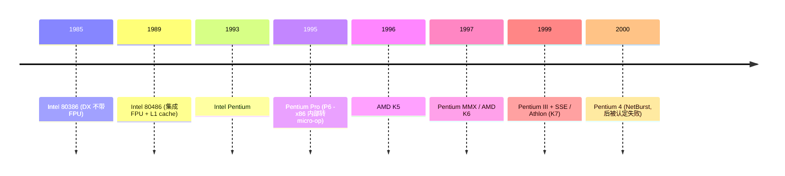
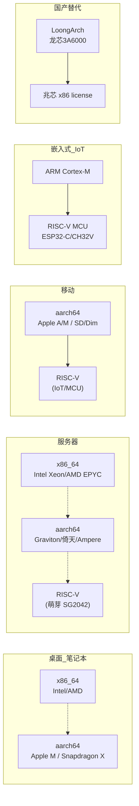

# 00-03 — ISA / 架构演化史：从 1971 年的 4004 到 2026 年的开放 ISA 时代

> **核心问题：** "为什么我面前的电脑是 x86_64？为什么手机是 aarch64？为什么 RISC-V 突然这么火？这些指令集是怎么一路演化过来的？"
>
> **一句话答案：** 计算机用过的指令集架构（ISA）超过 50 种，但活到今天的不到 10 种。每一代都对应当时的技术约束（晶体管多少 / 制造工艺 / 应用场景）。**理解 ISA 史 = 理解 50 年来计算机产业的迁移与权衡**。

本笔记是 [00-01-material-index](00-01-material-index.md) 和 [00-02-fullstack-vertical](00-02-fullstack-vertical.md) 的姊妹篇。三篇合起来构成"全栈认知大框架"——本篇负责"硬件指令层"的全景。

服务的最终目标：**纵揽全局，总观全貌，完善认知大框架，超越计算机的迷雾。**

---

## 1. 一张大图：50 年 ISA 演化全景

```mermaid
timeline
    1971 : Intel 4004 (4-bit) — 第一颗商用微处理器
    1972 : Intel 8008 (8-bit)
    1974 : Intel 8080 / Motorola 6800
    1975 : MOS 6502 (Apple I/II / Commodore 64 / NES)
    1976 : Zilog Z80 (CP/M / Sinclair / Game Boy)
    1978 : Intel 8086 (16-bit, x86 起源) / 8088
    1979 : Motorola 68000 (Mac / Amiga / Atari ST)
    1981 : IBM PC + 8088 ─ 个人电脑普及起点
    1982 : Intel 80286
    1985 : Intel 80386 (32-bit) / ARM1 (Acorn) / MIPS R2000
    1987 : SUN SPARC v1
    1989 : Intel 80486 / DEC Alpha (1989-1992 设计)
    1991 : IBM/Motorola PowerPC
    1993 : Intel Pentium / DEC Alpha 21064
    1995 : Pentium Pro (P6 微架构) / ARM7
    1997 : Intel MMX / AMD K6
    1999 : Intel Pentium III / SSE
    2000 : ARM Cortex-A 系列设计开始
    2001 : Intel Itanium (IA-64, EPIC/VLIW 派生) — 失败的开端
    2003 : AMD Athlon64 (AMD64 = x86_64) ─ 64-bit 普及
    2006 : Intel Core 2 Duo (Conroe) — 移动 CPU 反攻
    2007 : iPhone 1 发布 (ARM11) / NVIDIA CUDA 1.0 (6 月)
    2008 : Intel Atom / iPhone 3G (ARM11)
    2010 : RISC-V 在 UC Berkeley 启动 (Krste Asanović + Patterson)
    2011 : ARMv8 / AArch64 公布
    2013 : Apple A7 (iPhone 5s) — 第一颗消费级 64-bit ARM
    2014 : SiFive 公司成立
    2015 : RISC-V Foundation 成立 (8 月) / Cavium ThunderX (aarch64 服务器)
    2017 : AMD Ryzen Zen ─ x86 重新激活
    2018 : SiFive HiFive Unleashed (FU540) — 第一颗 Linux-class RISC-V 板
    2020 : Apple M1 (5nm aarch64) — Mac 弃 x86
    2021 : LoongArch ISA 1.0 公布 (4 月) / 龙芯 3A5000
    2022 : RISC-V SBI v1.0 (1 月) / 阿里云倚天 710 (aarch64 服务器)
    2023 : Sophgo SG2042 64 核 RISC-V 服务器 SoC / SBI v2.0 (12 月)
    2024 : Apple M4 (3nm) / Snapdragon X Elite (aarch64 PC) / SBI v3.0 (11 月) / SiFive HiFive Pro P550
    2025 : LoongArch 国产桌面普及
```

每一段都有自己的故事——下文按"代际 + 谱系"展开。

---

## 2. 计算机的史前史（1940–1970）

理解 CPU 之前需要看它的前身。

### 2.1 机械与早期电子计算

| 年份 | 系统 | 技术 |
|------|------|------|
| 1822 | Babbage Difference Engine | 纯机械齿轮 |
| 1936 | Turing Machine 概念 | 数学模型 |
| 1941 | Konrad Zuse Z3 | 继电器 |
| 1945 | ENIAC | 18000 真空管，重 30 吨 |
| 1947 | Bell Labs 晶体管发明 | 半导体革命 |
| 1958 | TI / Fairchild 集成电路 | IC 起源 |
| 1969 | Intel 由 Fairchild 离职者创立 | 即将开启微处理器时代 |

### 2.2 大型机时代（1950–1970）

- **IBM 700 / 7000 系列**（1954–）— 真空管，IBM 进入计算机产业
- **DEC PDP-1, PDP-8, PDP-11**（1960s）— 小型机，C 语言诞生在 PDP-7/11 上
- **CDC 6600**（1964）— 第一个超级计算机，Seymour Cray 设计
- **IBM System/360**（1964）— 第一个标准化指令集 + ABI 兼容家族（这是"ISA"概念的起源）

**关键认知：在 IBM/360 之前，每代计算机都换 ISA。System/360 让"软件可移植"成为价值主张——这是后续所有 ISA 的设计目标。**

---

## 3. 第一代微处理器（1971–1979）—— 4-bit / 8-bit

晶体管 IC 工艺让"一片硅上集成所有 CPU 逻辑"变可能。1971 年 Intel 4004 是第一个商用例子（最初是给 Busicom 计算器设计的）。

### 3.1 关键芯片

| 年份 | 芯片 | 厂商 | 位宽 | 注释 |
|------|------|------|------|------|
| 1971 | **4004** | Intel | 4-bit | 第一颗商用微处理器，2300 晶体管，740kHz |
| 1972 | 8008 | Intel | 8-bit | 4004 的接班人 |
| 1974 | **8080** | Intel | 8-bit | 第一颗"通用"8-bit CPU，CP/M 操作系统平台 |
| 1974 | 6800 | Motorola | 8-bit | 8080 的竞争对手 |
| 1975 | **6502** | MOS Tech | 8-bit | $25！Apple I/II / Commodore 64 / Atari 2600 / NES |
| 1976 | **Z80** | Zilog | 8-bit | 8080 的二次方扩展，Game Boy / 各种街机 |
| 1976 | RCA 1802 | RCA | 8-bit | 太空船计算机（旅行者号 / 哈勃望远镜）|
| 1979 | **6809** | Motorola | 8-bit (16-bit ALU) | TRS-80 Color Computer |

### 3.2 厂商格局

- **Intel**：1968 创立，初期做存储；4004/8080 让它成为 CPU 老大
- **Motorola**：电子设备厂，68000 系列后来引领 32-bit
- **MOS Technology**：6502 之父；1976 被 Commodore 收购
- **Zilog**：8080 设计师 Federico Faggin 离开 Intel 创立
- **TI / Fairchild**：早期 IC 玩家，CPU 玩得不深

### 3.3 这一代的特点

- 全部 8-bit 数据 / 16-bit 地址（典型 64KB 寻址）
- 时钟 1-8 MHz
- 几千晶体管，纯 NMOS / CMOS
- **没有 MMU、没有保护模式**——程序直接访问任何内存
- 操作系统：CP/M（8080/Z80 主流）、Apple DOS、Commodore 1541

---

## 4. 16-bit 时代 + IBM PC 决定历史（1978–1985）

### 4.1 关键转折：1981 IBM PC

- **8088** 是 8086 的 8-bit 总线版（更便宜的板）
- IBM 急需对抗 Apple II，挑了 Intel 8088 + Microsoft DOS
- IBM PC 因为**架构开放**（不像 Apple/Commodore 封闭）成为标准
- 兼容机厂涌现 → x86 生态滚雪球
- **微软 + Intel = WinTel 联盟成形**

### 4.2 这一代的 ISA

| 年份 | 芯片 | 厂商 | 注释 |
|------|------|------|------|
| 1978 | **8086** | Intel | 16-bit，x86 起源 |
| 1979 | **68000** | Motorola | 16/32-bit 混合，Mac/Amiga/Atari ST |
| 1982 | **80286** | Intel | 加 protected mode，没人爱用 |
| 1985 | **80386** | Intel | 32-bit，flat memory model，**真正现代 x86 起点** |
| 1985 | **ARM1** | Acorn | 第一颗 ARM 芯片，BBC Micro 协处理器 |
| 1986 | **MIPS R2000** | MIPS Tech | RISC 革命第一波 |

### 4.3 CISC vs RISC 大辩论（1980s）

学术界 Stanford / Berkeley 提出："**少而简单的指令 + 流水线 + 高时钟 > 多而复杂的指令**"。

- **CISC（Complex Instruction Set）**：x86, 68000, VAX
- **RISC（Reduced Instruction Set）**：MIPS, SPARC, ARM, PowerPC, Alpha

理论上 RISC 因为流水线浅、解码简单、应当性能高。但 1990s 之后 CISC 通过**内部转 RISC（micro-op 解码）+ 巨额投资**反而把 RISC 吃了。

赢家是：**x86 主导桌面 / 服务器**（CISC 反胜）；**ARM 主导嵌入式 / 移动**（RISC 胜）。

---

## 5. 32-bit 时代（1985–2000）

### 5.1 桌面 / 服务器战场（CISC）

x86 32-bit 时代的 ISA 演化：
- 80386：32-bit 寄存器、flat memory model、page paging
- 80486：集成 FPU、cache、流水线
- Pentium：超标量、分支预测
- Pentium Pro：**内部 RISC 微架构**——解码器把 x86 翻成 micro-op，乱序执行
- MMX / SSE / SSE2 / SSE3 / SSSE3 / SSE4：SIMD 扩展（媒体加速）

**这一代的赢家：Intel + AMD 双寡头格局形成。**

### 5.2 工作站战场（RISC）

| ISA | 创立者 | 主要应用 | 命运 |
|-----|--------|---------|------|
| **MIPS** | Stanford / MIPS Tech | SGI 工作站 / 索尼 PS1/PS2 / Cisco 路由器 | 萎缩，2010s 卖给 Imagination |
| **SPARC** | Sun Microsystems | 服务器 / Solaris | Oracle 收购后衰退 |
| **PowerPC** | IBM/Motorola/Apple (AIM联盟) | 苹果 Mac / IBM 服务器 / Xbox 360/PS3 | Apple 2006 切到 Intel 后衰退 |
| **DEC Alpha** | DEC | 高端工作站 | 1998 DEC 卖给 Compaq；2002 终结 |
| **HP PA-RISC** | HP | 服务器 | 2000 让位给 Itanium；HP 也失败 |
| **MIPS / SPARC / PowerPC / Alpha / PA-RISC** | 集体 | — | 2010 后基本退出主流 |

**为什么 RISC 工作站全死？**
1. x86 因为兼容 Windows + 软件量大胜
2. Intel + AMD 投资远超任何单一 RISC 厂
3. 1995 Pentium Pro 性能追平甚至超过 RISC

### 5.3 嵌入式 / 移动 RISC（ARM 崛起）

ARM 不与桌面 RISC 竞争，专做嵌入式低功耗：
- 1990 ARM Holdings 成立（Acorn 分拆）
- 1993 ARM 进入诺基亚手机
- 1995 ARM7 普及
- 2003 ARMv6 + Cortex-A 系列设计开始
- 2007 iPhone 让 ARM 成移动垄断

ARM 不卖芯片只卖 IP（设计授权），**降低进入门槛**，让高通 / 三星 / 苹果 / 联发科 / NVIDIA / NXP 都基于 ARM 设计自己的 SoC。

---

## 6. 64-bit 时代（2003–2020）

### 6.1 Intel 押错宝：Itanium / IA-64

1990s Intel 与 HP 合作设计**全新 64-bit ISA**——Itanium（IA-64），用 VLIW（Very Long Instruction Word）。

**理论：编译器把指令打包成 128-bit"束"**，硬件并行执行多个，无需复杂调度逻辑。

**结果：**
- 编译器写不出来高效束（编译器学者多年没解决）
- Intel 完全抛弃 x86 兼容（Itanium 不能跑 x86 二进制）
- 软件生态拒绝迁移
- 2001 发售（Merced），2010 已是僵尸状态
- 2017 Intel 宣布 Itanium 9700 (Kittson) 是最后一代
- 2021 7 月最后一批 Itanium 出货停止

**Itanium 是 Intel 历史上最大的失败之一。**

### 6.2 AMD 救场：x86_64

2003 年 AMD 推出 Athlon64（K8 微架构），首次实现 **AMD64**：

- **64-bit 寄存器扩展**（rax 替代 eax）
- **新增 8 个寄存器**（r8-r15）
- **完全向下兼容 x86 32-bit / 16-bit**
- **REX prefix** 编码新指令空间

**Intel 一开始拒绝**，但 2004 年因 Itanium 失败 + 客户压力，被迫追随，叫 "EM64T"。

**结果：x86_64 = AMD 赢，Intel 跟随**。这是 Intel 第一次在自己赛道被 AMD 反超。

### 6.3 ARMv8 / AArch64（2011）

ARM 在 2011 年宣布 ARMv8——首个 ARM 64-bit ISA。**与 ARMv7 不向下兼容**（CPU 跑两种模式）。

- AArch64：64-bit
- AArch32：兼容旧 32-bit ARM

苹果 2013 抢先量产 A7（iPhone 5s）—— 比 ARM 自己的核心还早一年。

ARMv8 一直主导移动到现在，并扩展到：
- 服务器（Cavium ThunderX / 阿里倚天 / AWS Graviton / Ampere Altra）
- 桌面（Apple M1/M2/M3/M4 / Snapdragon X Elite 2024）

### 6.4 GPU 加速 + 异构计算

1999 NVIDIA 发明 "GPU" 这个词（GeForce 256）。
2006 NVIDIA CUDA 发布——GPGPU 时代开启。
2010s 深度学习爆发让 GPU 成为 AI 计算事实标准。

| GPU 厂商 | 编程模型 | 当前状态 |
|----------|---------|---------|
| **NVIDIA** | CUDA | 主导 AI 训练（H100/B200）|
| **AMD** | ROCm | 追赶（MI300X）|
| **Intel** | oneAPI | 边缘化 |
| **Apple** | Metal | 苹果生态 |
| **Google** | TPU | 自家数据中心 |
| **华为** | 昇腾 (Ascend) | 中国 AI |
| **沐曦 / 摩尔线程 / 壁仞** | 各家私有 | 中国 GPU 萌芽 |

**GPGPU 也算一种 ISA**——CUDA SASS / AMD GCN / Apple AGX 都是各自的指令集，只是不通用。

### 6.5 死掉的 ISA

| ISA | 死亡时间 | 原因 |
|-----|---------|------|
| **DEC Alpha** | 2002 | DEC 被 Compaq 收购，HP 砍 |
| **HP PA-RISC** | 2008 | HP 转 Itanium，自己也失败 |
| **Itanium / IA-64** | 2020 | 兼容性灾难 |
| **SPARC** | 2017 | Oracle 关闭设计团队 |
| **PowerPC 桌面** | 2006 | Apple 转 Intel |
| **MIPS 主流** | 2017 | Imagination 破产 |
| **VAX** | 2000s | DEC 路线没了 |
| **6502 / Z80** | 仍有教学/复古，不再主流 | 性能跟不上 |
| **m68k** | 仍有嵌入式 | ColdFire 还活着但式微 |

---

## 7. 当前主流 ISA（2020–2026）

### 7.1 谁在哪里占什么份额（2026）

| 领域 | x86_64 | aarch64 | RISC-V | LoongArch | 其他 |
|------|--------|---------|--------|-----------|------|
| 数据中心服务器 | 70% | 25% | <1% | <1% | — |
| PC / 笔记本 | 80% | 15% (Apple) | 0% | <1% | — |
| 平板 / 手机 | <1% | 99% | <1% | 0% | — |
| 嵌入式 SBC | 5% | 70% | 25% | 0% | — |
| MCU / IoT | 0% | 50% | 30% | 0% | 20% (8051/AVR) |
| 国产军政 | 已退场 | 部分 | 增长 | 主流（中国部分领域）| — |

数字是粗略估计，趋势：**x86_64 守桌面/服务器；aarch64 主导移动+蚕食服务器；RISC-V 嵌入式增长 + 服务器萌芽；LoongArch 中国国产化路线**。

### 7.2 RISC-V 为什么这么火（2020 后）

1. **完全开源**（无授权费）—— ARM 卖 IP 收高额授权，RISC-V 免费
2. **模块化**（base + 扩展）—— 用什么实现什么，不像 x86 必须背 50 年包袱
3. **学术友好**——Berkeley 同时给学生用作教学
4. **中国推动**——平头哥、阿里、华为都押注
5. **AI 加速 + DSP**——RISC-V 自由扩展指令适合做 domain-specific 加速器

---

## 8. 各大厂商谱系（"谁在做什么"）

### 8.1 半导体设计

| 厂商 | 国 | 主营 | 旗舰产品 |
|------|---|------|---------|
| **Intel** | 美 | x86 CPU + 代工 | Core Ultra / Xeon / Itanium (历史) |
| **AMD** | 美 | x86 CPU + GPU + FPGA | Ryzen / EPYC / Radeon / Xilinx |
| **NVIDIA** | 美 | GPU + 数据中心 + ARM SoC | H100/B200 / GeForce / Jetson |
| **Apple** | 美 | 自研 ARM / Mx / Ax / Sx | M4 / A18 / Vision Pro |
| **Qualcomm** | 美 | 移动 SoC + 调制解调器 | Snapdragon X Elite / 8 Gen 4 |
| **Broadcom** | 美 | 网络芯片 + 收购 VMware | Trident / Tomahawk |
| **Marvell** | 美 | ARM 服务器 + 网络 | OCTEON ThunderX |
| **TI** | 美 | DSP + 模拟 + 微控 | C6000 / MSP430 |
| **NXP** | 荷 | 汽车 + 工控 | i.MX / S32 / Layerscape |
| **Renesas** | 日 | 汽车 + 工控 | R-Car / RX |
| **MediaTek** | 台 | 移动 SoC | Dimensity / Helio |
| **联发科 RISC-V 部门** | 台 | RISC-V MCU | LinkIt |
| **Sony** | 日 | 手机 + 影像 | 自研 Sony / 与 PlayStation |
| **三星** | 韩 | Exynos + 内存 | 自研 ARM core (停了) + Exynos |

### 8.2 ARM 生态

| 厂商 | 特色 |
|------|------|
| **ARM Holdings** | IP 授权方（不造芯片） |
| **Apple** | ARM 架构许可（不用 ARM 自家 core，自己设计 ISA 实现）|
| **Qualcomm** | 高通也是架构许可（早期用 ARM 公版，后自研 Kryo）|
| **Samsung** | Mongoose 自研失败，回归 ARM 公版 |
| **NVIDIA Jetson / Tegra** | ARM 公版 + GPU 整合 |
| **AWS Graviton (Annapurna)** | 自研 64 核 ARM 服务器 |
| **阿里 倚天 710** | 阿里云自研 ARM 服务器 |
| **华为 鲲鹏 920** | 华为自研 ARM 服务器（受美国制裁影响）|
| **Ampere Altra** | 高密度 ARM 服务器 |

### 8.3 RISC-V 生态

| 厂商 | 国 | 旗舰 | 注释 |
|------|---|------|------|
| **SiFive** | 美 | FU740 / P550 | RISC-V 商业化先锋 |
| **Andes** | 台 | AndesCore | 早期 RISC-V IP 厂 |
| **Tenstorrent** | 加 | Wormhole / Black Hole | Jim Keller 创立 AI 芯片 |
| **平头哥（阿里）** | 中 | 玄铁 C910/C920/C908 | 阿里芯片部门 |
| **算能 Sophgo** | 中 | SG2042 64 核 | RISC-V 服务器 |
| **SpacemiT** | 中 | K1 | Banana Pi BPI-F3 |
| **赛昉 StarFive** | 中 | JH7110 | VisionFive 1/2 |
| **嘉楠 Canaan** | 中 | Kendryte K230 | AI 边缘 |
| **芯来 (Nuclei)** | 中 | N100/N300/N900 系列 | 国产 RISC-V MCU IP |
| **乐鑫 Espressif** | 中 | ESP32-C / ESP32-P 系列 | RISC-V WiFi MCU |
| **Microchip** | 美 | PolarFire SoC | FPGA + RISC-V |
| **Western Digital (历史)** | 美 | SweRV core (开源后转给 CHIPS Alliance) | 2018-2022 主推方，2022 砍团队 |

### 8.4 LoongArch 生态

| 厂商 | 产品 | 注释 |
|------|------|------|
| **龙芯中科** | 3A6000 / 3C5000 | LoongArch CPU 唯一商用厂 |
| **Loongnix** | Linux 桌面 distro | 国产桌面 |
| **openKylin** | Linux distro | LoongArch + 其他架构 |
| **统信 UOS** | 商业 Linux distro | 政府 / 国企 |

### 8.5 GPU / AI 加速

| 厂商 | 国 | 产品 | 主战场 |
|------|---|------|-------|
| **NVIDIA** | 美 | H100/B200/RTX | AI 训练 + 推理 |
| **AMD** | 美 | MI300X / Radeon | AI 追赶 + 游戏 |
| **Intel** | 美 | Gaudi / Arc | 数据中心 / 桌面 |
| **Apple** | 美 | M-series neural engine | iOS/macOS 推理 |
| **Google** | 美 | TPU v5 | 自家云 |
| **AWS Trainium / Inferentia** | 美 | 自家芯片 | 云 AI |
| **华为 昇腾** | 中 | Ascend 910C | 中国 AI |
| **沐曦 (Moore Threads)** | 中 | MTT S4000 | 国产 GPU |
| **壁仞** | 中 | BR100 | 国产 AI 芯片 |
| **燧原 (Enflame)** | 中 | i20 | 中国 AI 推理 |
| **寒武纪** | 中 | MLU 系列 | AI ASIC |

### 8.6 软件生态厂商

| 厂商 | 产品 | 与硬件的关系 |
|------|------|-------------|
| **Microsoft** | Windows / Visual Studio / Azure | x86_64 主战场，aarch64 次战场 |
| **Apple** | macOS / iOS / Xcode | 完全控制自家 ARM 生态 |
| **Google** | Android / Chrome OS / GCP | aarch64 主导，RISC-V 实验 |
| **IBM** | AIX / z/OS / mainframe | POWER + System z |
| **Oracle** | Solaris / SPARC | 衰退 |
| **Red Hat / SUSE / Canonical** | 企业 Linux | 多架构支持 |

---

## 9. ISA 设计的核心权衡

理解 ISA 演化必须理解几个**永恒权衡**：

### 9.1 CISC vs RISC

| 维度 | CISC（x86） | RISC（ARM/RISC-V） |
|------|-------------|-------------------|
| 指令数 | 1500+ | 数十 - 数百 |
| 指令长度 | 1-15 字节变长 | 4 字节定长（或 2/4 RVC） |
| 寻址模式 | 多达 8 种 | 1-2 种 |
| 解码复杂度 | 极高 | 简单 |
| 流水线效率 | 通过 micro-op 拆解 | 天然适合 |
| 代码密度 | 高 | 较低（RVC/Thumb 弥补） |
| 历史包袱 | 极大 | 最小 |

**现实：CISC 在内部都"伪 RISC"了**（Pentium Pro 起 x86 解码后是 micro-op）。但 ISA 表面仍然 CISC，编译器和工具链复杂度永远在那。

### 9.2 大端 vs 小端

- **小端（little-endian）**：x86 / ARM 默认 / RISC-V / LoongArch
- **大端（big-endian）**：网络协议 / 老 PowerPC / SPARC / 老 MIPS
- **bi-endian**：PowerPC / ARM / MIPS（运行时切换）
- **现实趋势：小端胜出**，但网络包格式 + 文件格式（如 DTB）仍多大端

### 9.3 寄存器数

| 架构 | 通用寄存器数 |
|------|------------|
| x86 (32-bit) | 8 |
| x86_64 | 16 |
| AArch64 | 31 + zero |
| RISC-V | 32 |
| LoongArch | 32 |

**多寄存器优势：减少 spill/fill，提升性能**。x86_64 寄存器数还是不够，但很难再加（编码空间限制）。

### 9.4 指令集模块化

| 架构 | 模块化能力 |
|------|------------|
| x86_64 | 几乎不可能砍——所有特性都"必须" |
| ARMv8 | 可选扩展（NEON / SVE / PAuth），但 base 仍很大 |
| RISC-V | 极度模块化（base + M + A + F + D + C + V + Zicbom + ...），可任意组合 |
| LoongArch | 比 x86 灵活但比 RISC-V 紧 |

**RISC-V 的杀手锏：嵌入式可以只要 RV32E（16 寄存器）+ M（乘除），其他都不用，硅片极小**。

### 9.5 微架构 vs ISA

**ISA = 指令集 = 软件契约**
**微架构 = 实现 = 硬件如何执行**

同一 ISA 可有完全不同的微架构：
- x86_64 ISA 下：Intel Core / AMD Zen / Sandy Bridge / Skylake / Zen 4 ...
- ARMv8 ISA 下：Cortex-A78 / Apple Firestorm / Qualcomm Oryon / NVIDIA Carmel

ISA 决定"软件能跑"；微架构决定"跑多快多省电"。

---

## 10. 学习路径建议

按 [user_learning_style](../CLAUDE.md) 的"自顶向下 + 7 阶段"框架：

### 10.1 初阶：建立认知地图（这篇笔记 ✅ + 相关）

- 本笔记：ISA 演化全景
- 笔记 [00-01-material-index](00-01-material-index.md)：项目材料地图
- 笔记 [00-02-fullstack-vertical](00-02-fullstack-vertical.md)：全栈分层

→ 看完三篇 00 笔记后，对计算机产业全貌有清晰图。

### 10.2 中阶：选一架构深入（RISC-V）

- 笔记 02-* SBI 系列
- 笔记 03-* boot 系列

→ 一条架构走通后，回头看其他架构是横向迁移。

### 10.3 高阶：横向铺开

- 学一遍 x86_64 boot（UEFI / GRUB）
- 学一遍 aarch64 boot（TF-A / U-Boot）
- 写一个跨架构的 HAL（参考 polyhal）

### 10.4 终阶：理解为什么

- 读 *Computer Architecture: A Quantitative Approach*（Hennessy & Patterson）
- 读 RISC-V Reader（David Patterson 写）
- 读 *Inside the Machine*（x86 微架构）
- 读 *ARM Cortex-A Series Programmer's Guide*

---

## 11. 名词词典

### 11.1 ISA 相关

| 术语 | 含义 |
|------|------|
| **ISA** | Instruction Set Architecture，指令集 |
| **micro-architecture** | 微架构，ISA 的具体实现 |
| **RISC** | Reduced Instruction Set Computer |
| **CISC** | Complex Instruction Set Computer |
| **VLIW** | Very Long Instruction Word（Itanium）|
| **EPIC** | Explicit Parallel Instruction Computing（Itanium 等同）|
| **SIMD** | Single Instruction, Multiple Data（MMX/SSE/NEON/SVE/RVV）|
| **MIMD** | Multiple Instruction, Multiple Data（多核普遍架构）|
| **OoO** | Out-of-Order execution，乱序执行 |
| **superscalar** | 超标量，单周期发射多条指令 |
| **branch prediction** | 分支预测 |
| **speculative execution** | 推测执行 |
| **micro-op (uop)** | 微操作（CPU 内部表示）|
| **ABI** | Application Binary Interface（如 LP64 / ILP32）|

### 11.2 工艺相关

| 术语 | 含义 |
|------|------|
| **半导体工艺节点** | 7nm / 5nm / 3nm — 晶体管栅长 |
| **EUV** | Extreme Ultraviolet 光刻（7nm 以下必需）|
| **chiplet** | 多块小芯片封装一起（AMD Ryzen / Apple M Ultra）|
| **2.5D / 3D 封装** | 互联多块 die |
| **fab** | 半导体制造厂（TSMC / Samsung / Intel Foundry）|
| **fabless** | 无厂模式（设计 + 外包制造，如 NVIDIA / AMD / Apple）|
| **IP core** | 可授权的电路 IP（ARM Cortex / RISC-V SiFive U7）|

### 11.3 历史厂商

| 缩写 / 术语 | 全称 / 含义 |
|------------|-------------|
| **DEC** | Digital Equipment Corporation（小型机老牌；2002 消亡）|
| **Sun** | Sun Microsystems（SPARC + Solaris；2010 被 Oracle 收购）|
| **HP-UX** | Hewlett-Packard Unix（PA-RISC + Itanium；衰退）|
| **VAX** | Virtual Address eXtension（DEC 系列）|
| **CDC** | Control Data Corporation（早期超算）|
| **Cray** | Seymour Cray 创立的超算厂 |
| **Acorn** | ARM 起源的英国公司（BBC Micro）|
| **Apollo** | Apollo Computer，工作站早期厂商 |
| **Silicon Graphics (SGI)** | MIPS + IRIX 工作站，2009 破产 |

---

## 12. 进一步阅读

### 12.1 经典书

- ***Computer Architecture: A Quantitative Approach*** — Hennessy & Patterson — 微架构圣经，必读
- ***The RISC-V Reader*** — David Patterson — RISC-V 设计哲学
- ***Inside the Machine*** — Jon Stokes — x86 微架构史
- ***Computer Organization and Design*** — Patterson & Hennessy — 入门版
- ***Operating Systems: Three Easy Pieces*** — Remzi — OS + 硬件接口

### 12.2 网站 / 博客

- [chips and cheese](https://chipsandcheese.com/) — 现代 CPU 微架构深度文章
- [WikiChip](https://en.wikichip.org/) — 详细 SoC 信息库
- [Anandtech 历史文档](https://www.anandtech.com/) — Intel/AMD/ARM 评测史
- [RealWorldTech](http://www.realworldtech.com/) — David Kanter 微架构分析

### 12.3 视频

- [David Patterson — A New Golden Age for Computer Architecture](https://www.youtube.com/watch?v=3LVeEjsn8Ts)
- [Jim Keller 各种采访] — Apple A 系列 / AMD Zen / Tesla / Tenstorrent 都被他设计过
- [Computer Architecture by Onur Mutlu (ETH)](https://www.youtube.com/playlist?list=PL5Q2soXY2Zi-IXWTT7xoNYpst5-zdZQ6y)

### 12.4 本仓库笔记串联

- **[00-01-material-index](00-01-material-index.md)** — 材料目录
- **[00-02-fullstack-vertical](00-02-fullstack-vertical.md)** — 全栈分层
- **[02-02-sbi-evolution](02-02-sbi-evolution.md)** — SBI 演化（一个具体子领域演化样板）
- **[03-02-boot-overview](03-02-boot-overview.md)** — boot 层演化（同上）

### 12.5 当前格局总结（2026-05-05）

- **桌面 / 笔记本：x86_64 主导 80% + Apple aarch64 15%，国产化 LoongArch 边缘**
- **服务器：x86_64 70% + aarch64 25%（Graviton 等）+ RISC-V 萌芽**
- **移动：aarch64 99%，RISC-V 在 IoT 部分**
- **MCU：ARM Cortex-M 50% + RISC-V 30% + 8051/AVR 20%**
- **AI：NVIDIA CUDA 80% + AMD ROCm 10% + 国产/Google TPU 10%**

**未来 5 年看点：**
1. RISC-V 服务器能否突破（Tenstorrent / SG2042 后续）
2. ARM 在 PC 占比能否突破 30%
3. 国产 LoongArch 能否走出中国
4. AI 芯片格局是否被新 ISA 重新洗牌（Cerebras / Tenstorrent / Groq）
5. RISC-V 在量子计算 / 神经形态 / 光子计算等新计算范式的位置
