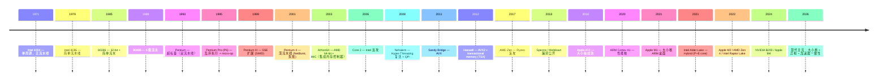

# 00-04 — CPU 微架构演化（流水线 / 乱序 / 缓存 / SMT / 大小核 / ACP / Spectre）

> **核心问题：** 同样的 ISA（如 x86_64 / ARMv8）为什么不同 CPU 性能差几倍？流水线 / 乱序 / 推测执行 / SMT / 大小核异构、缓存一致性协议（MESI / MOESI / MERSI）、ACP（加速器一致端口）、缓存层次怎么影响性能？Spectre / Meltdown 漏洞为什么发生？
>
> **一句话答案：** ISA 是规范（"软件契约"），微架构是实现（"硬件如何执行"）。50 年 CPU 微架构演化围绕"**让指令执行更并行 / 更预测 / 更高效**"——流水线 → 超标量 → 乱序 → 推测 → SMT → 大小核 → 异构（CPU+加速器）。**ISA 不变但微架构性能可差 100×**。


> **本笔记是 [00-03-isa-arch-evolution](00-03-isa-arch-evolution.md) 的"实现层"补充**。00-03 讲指令集（软件契约），本篇讲实现（硬件如何执行）。

---

## 1. 历史时间轴



---

## 2. CPU 流水线

### 2.1 经典 5 级流水（RISC-V / MIPS 教学）

```
IF (Instruction Fetch)
  ↓
ID (Instruction Decode)
  ↓
EX (Execute)
  ↓
MEM (Memory access)
  ↓
WB (Write Back)
```

每周期处理一条新指令 → IPC 接近 1。

### 2.2 现代深流水线

| CPU | 流水线深度 |
|-----|-----------|
| Pentium 4 (NetBurst) | 31 级（极端，失败）|
| Sandy Bridge | 14-19 级 |
| Apple M1 | 8 级（典型现代）|
| ARM Cortex-A78 | 13 级 |

**深流水线代价：** 分支预测失败惩罚大（清空 N 级 → 浪费 N 周期）。

### 2.3 流水线冲突（Hazards）

- **结构 hazard**：硬件资源不够（同时用一个 ALU）
- **数据 hazard**：后指令依赖前指令结果（解决：forwarding）
- **控制 hazard**：分支（解决：分支预测 + 推测执行）

---

## 3. 超标量 + 乱序

### 3.1 超标量（Superscalar）

**一周期发射多条指令**：

| CPU | 发射宽度 |
|-----|---------|
| Pentium | 2 |
| Core 2 | 4 |
| Skylake | 4 |
| Apple M1 / M2 | **8** |
| Apple M4 | 10+ |

### 3.2 乱序执行（Out-of-Order, OoO）

```
程序顺序：    A → B → C → D → E
依赖关系：    A → C, B → D, E independent
执行顺序：    A B E C D（按数据可用执行）
```

实现：
- **Reservation Station** — 等待操作数
- **Reorder Buffer (ROB)** — 维持程序顺序提交
- **Register Renaming** — 消除假依赖

P6 (Pentium Pro 1995) 引入，至今所有高性能 CPU 都用。

### 3.3 micro-op (μop) 译码

x86 内部把 CISC 指令解成 RISC 风格 μop：

```
ADD RAX, [RBX]    →  μop1: load tmp, [RBX]
                     μop2: add RAX, RAX, tmp
```

→ x86 表面 CISC，内部 RISC（自 P6 起）。

---

## 4. 分支预测 + 推测执行

### 4.1 分支预测器演化

```
1980s: Static (always taken / not taken)
1990s: 1-bit predictor
1995: 2-bit saturating counter
1998: 2-level adaptive (Yeh-Patt)
2000s: Hybrid / TAGE
2010s: 神经预测 (PerceptIon)
2020s: TAGE-SC-L / 现代 perceptron
```

现代预测准确率：**95-99%**（关键路径）。

### 4.2 推测执行（Speculative Execution）

CPU 不等分支结果就先执行预测路径。错了就丢弃。

→ **Spectre / Meltdown 攻击根源**（推测的 side effect 留在 cache 中可被探测）。

---

## 5. 缓存层次 + 一致性

### 5.1 现代缓存层次

```
Register file (~ 100 KB)        ← 0.3 ns
   ↓
L1 cache (32-128 KB / core)     ← 1 ns（数据 + 指令分开）
   ↓
L2 cache (256 KB - 1 MB / core) ← 3 ns
   ↓
L3 / LLC (Last Level Cache, 几 MB - 几十 MB) ← 10 ns
   ↓
DRAM (16-128 GB)                ← 80 ns
   ↓
NVMe SSD                         ← 10 μs
```

### 5.2 缓存映射

- **Direct-mapped**：每地址一个固定槽（已弃）
- **Set associative**：N-way（4-way / 8-way / 16-way 主流）
- **Fully associative**：任意地址任意槽（小缓存如 TLB 用）

### 5.3 缓存一致性协议（多核必须）

| 协议 | 状态 | 用 |
|------|------|-----|
| **MESI** | Modified / Exclusive / Shared / Invalid | 经典（Pentium / 多数）|
| **MOESI** | + Owned | AMD |
| **MESIF** | + Forward | Intel QPI |
| **MERSI** | + Recent | IBM |
| **Dragon** | 老 |
| **Firefly** | 老 |

### 5.4 MESI 详解

```
Modified  : 该 cache 持有最新值，与内存不一致
Exclusive : 该 cache 持有唯一副本，与内存一致
Shared    : 多 cache 持有相同值，与内存一致
Invalid   : 无效

状态转换由 bus snooping 触发。
```


ARM SoC（如 Zynq）特性：

```
CPU cluster ←→ snoop control unit (SCU)
                    ↕
          ACP — Accelerator Coherency Port
                    ↕
          GPU / DMA / DSP / 自定义加速器
```

- 让加速器（FPGA 中的 IP / GPU / DMA）**与 CPU 缓存一致**地访问内存
- 无需 cache flush / invalidate
- 提升异构计算效率
- Zynq UltraScale+ 关键 IP

### 5.6 CXL.cache（现代标准）

跨设备缓存一致性（详见 [00-18](00-18-storage-evolution.md) § 3.4）。

---

## 6. SMT / Hyper-Threading

### 6.1 概念

一个物理核**模拟 N 个逻辑核**，共享执行资源。

```
Physical Core
├── Architectural state (registers) × N (N = SMT 度数)
├── Shared: ALU / FPU / cache / decoders
└── Logical CPU 0, 1, ... 都看到独立 state
```

### 6.2 实现

| 厂家 | 名称 | 度数 |
|------|------|------|
| Intel | Hyper-Threading | 2 |
| AMD | SMT | 2 |
| IBM POWER | SMT | 4 / 8 |
| SPARC T 系列 | CMT | 8 |
| ARM | 部分（AmpereOne）| 2 |

### 6.3 优点 + 缺点

- ✅ 利用执行单元空闲（一线程 stall 时另一个跑）
- ✅ 某些工作负载提升 30%
- ❌ Spectre 等侧信道漏洞
- ❌ 最坏情况性能下降（cache 争用）

→ 安全敏感场景禁用 SMT（云 / 政府）。

---


### 7.1 ARM big.LITTLE / DynamIQ

```
Cluster 0 (big cores - 性能):
  Cortex-X1 / X2 / X3 / X4
  Cortex-A78 / A720
  
Cluster 1 (LITTLE cores - 节能):
  Cortex-A55 / A520
```

- 2011 ARM 推出
- DynamIQ (2017) 接班，灵活组合（1+3+4 / 2+2+4 等）

### 7.2 Apple Silicon

| 芯片 | 性能核 | 能效核 |
|------|-------|-------|
| A17 Pro / A18 | 2 | 4 |
| M1 | 4 | 4 |
| M1 Pro / Max | 8 / 8 | 2 |
| M2 / M3 / M4 | 4 / 4 / 4 | 4 / 4 / 6 |
| M3/M4 Ultra | 16 | 8-12 |

### 7.3 Intel Hybrid (Alder Lake 起 2021)

| Intel | P-core | E-core |
|-------|--------|--------|
| Alder Lake (12 代) | 8 | 8 |
| Raptor Lake (13 代) | 8 | 16 |
| Meteor Lake (14 代) | 6 | 16 + 2 LPE |
| Arrow Lake | 8 | 16 |

需要 OS 调度器配合（Intel Thread Director 给 OS 提示）。

### 7.4 调度器适配

```
Linux:
  - Energy-Aware Scheduling (EAS) — 5.x
  - sched_util / cluster scheduling

Windows:
  - Thread Director (Intel)
  
macOS:
  - QoS classes (User-Interactive / Background / ...)
```

→ 任何现代 OS 调度器都需要考虑大小核调度（big.LITTLE / DynamIQ / Hybrid）。

---

## 8. SIMD / Vector 扩展

每代 CPU 加 SIMD 增强吞吐：

| 扩展 | 厂家 | 宽度 |
|------|------|------|
| MMX | Intel | 64-bit |
| SSE / SSE2-4 | Intel | 128-bit |
| AVX / AVX2 | Intel / AMD | 256-bit |
| AVX-512 | Intel | 512-bit |
| ARM NEON | ARM | 128-bit |
| ARM SVE / SVE2 | ARM | 128-2048-bit (可变) |
| RISC-V V 扩展 | RISC-V | 可变 (VLEN) |
| PowerPC AltiVec / VSX | IBM | 128-bit |

### 8.1 ARM SVE 特殊性

**Vector Length Agnostic** — 同二进制在不同硬件上跑（128-bit 到 2048-bit）。

### 8.2 Vortex（RISC-V GPGPU）

详见 [00-24](00-24-gpu-graphics-evolution.md)。RISC-V V + 自定义 SIMT 扩展实现 GPGPU。

---

## 9. MCP（Multi-Core Processor）一般概念

### 9.1 多核拓扑

```
SMP (Symmetric Multi-Processing)
  └─ 所有核对称，共享内存

AMP (Asymmetric Multi-Processing)
  └─ 不同核做不同事（如 Cortex-A + Cortex-M 混合 i.MX RT）

NUMA (Non-Uniform Memory Access)
  └─ 多 socket 服务器，每 socket 有"近"内存

大小核异构 (heterogeneous)
  └─ 同一 ISA 不同微架构（Apple M / Intel Hybrid）
```

### 9.2 互联

| 互联 | 厂家 |
|------|------|
| **Intel QPI / UPI** | Intel 多 socket |
| **AMD Infinity Fabric** | AMD 同上 |
| **NVIDIA NVLink** | GPU 互联 |
| **CXL** | 跨设备一致性 |
| **PCIe** | 通用 |
| **CCIX / TileLink** | 开源互联 |

---

## 10. 侧信道攻击（详见 [00-36](00-36-security-evolution.md) § 9）

### 10.1 Spectre / Meltdown（2018）

- **Spectre**：分支预测器训练 + 推测执行 + cache side channel
- **Meltdown**：用户态推测访问内核地址，cache 留痕

### 10.2 后续变种

- **MDS / TAA / Zombieload / RIDL**（微架构数据采样）
- **L1TF / Foreshadow**（L1 终端故障）
- **RAMBleed / Rowhammer**（DRAM 物理）
- **ÆPIC / Hertzbleed**

### 10.3 缓解

- 微码补丁（Intel / AMD）
- KPTI（页表隔离）
- retpoline（软件分支屏障）
- IBRS / IBPB / STIBP（微码屏障）
- 性能损失 5-30%

---

## 11. 散热 + 封装演化

### 11.1 散热

```
风冷 → 液冷 → 浸没冷却 (immersion)
TDP: 5W (手机) → 30W (笔记本) → 250W (桌面) → 700W (H100) → 1200W (B200)
```

### 11.2 封装

```
Wirebond (老)
DIP / SOP / QFN / BGA (传统)
Flip-chip
Chiplet (多 die 互联) — AMD / Apple
3D stacking (TSV) — HBM / 现代 GPU
2.5D interposer — H100
CoWoS / SoIC — TSMC 先进封装
```

→ 摩尔定律放缓后，**chiplet + 3D 封装是延续路径**。

---


- RISC-V `amoswap.w.aq` 原子抢占（A 扩展）
- `fence.i` 指令屏障
- `mscratch` 寄存器（trap 切换栈）

### 12.2 现代 OS 微架构感知方向（行业通用，不预设具体项目）

- 大小核调度（big.LITTLE / DynamIQ / Hybrid 感知）
- SMT 感知调度
- 向量扩展加速热路径（fs / net 等）
- ACP 集成（如 Zynq SoC FPGA）
- 缓存友好数据结构


---

## 13. 名词词典

| 术语 | 含义 |
|------|------|
| **micro-architecture** | 微架构 |
| **pipeline** | 流水线 |
| **superscalar** | 超标量 |
| **OoO (Out-of-Order)** | 乱序执行 |
| **speculative execution** | 推测执行 |
| **branch prediction** | 分支预测 |
| **micro-op (μop)** | 微操作 |
| **register renaming** | 寄存器重命名 |
| **reorder buffer (ROB)** | 重排序缓冲 |
| **reservation station** | 保留站 |
| **L1/L2/L3 cache** | 三级缓存 |
| **TLB** | Translation Lookaside Buffer |
| **MESI / MOESI / MESIF** | 缓存一致性协议 |
| **snoop / bus snooping** | 总线监听 |
| **ACP** | Accelerator Coherency Port |
| **CXL.cache** | 跨设备一致性 |
| **SMT / Hyper-Threading** | 同时多线程 |
| **big.LITTLE / DynamIQ / Hybrid** | 大小核 |
| **NUMA** | Non-Uniform Memory Access |
| **NVLink / Infinity Fabric / QPI / UPI** | 处理器互联 |
| **chiplet** | 小芯片 |
| **3D stacking / TSV** | 3D 堆叠 |
| **HBM / HBM3E** | High Bandwidth Memory |
| **MCP** | Multi-Core Processor |
| **SIMD / NEON / SSE / AVX / SVE / RVV** | 向量扩展 |
| **side channel** | 侧信道 |
| **Spectre / Meltdown / MDS / RAMBleed** | 侧信道攻击 |
| **KPTI** | Kernel Page Table Isolation |
| **microcode** | 微码 |
| **TDP** | Thermal Design Power |

---

## 14. 进一步阅读

### 14.1 经典书

- ***Computer Architecture: A Quantitative Approach*** (Hennessy / Patterson) — 微架构圣经
- ***Modern Processor Design*** — Shen / Lipasti
- ***Inside the Machine*** — Jon Stokes — x86 微架构史
- ***Reading the RISC-V Reader*** — Patterson

### 14.2 资源

- [chipsandcheese.com](https://chipsandcheese.com/) — 现代微架构深度
- [WikiChip](https://en.wikichip.org/) — SoC 详细
- [Anandtech 评测档案](https://www.anandtech.com/)
- [RealWorldTech](http://www.realworldtech.com/)

### 14.3 本仓库笔记串联

- [00-03-isa-arch-evolution](00-03-isa-arch-evolution.md) — ISA（软件契约）
- [00-18-storage-evolution](00-18-storage-evolution.md) — DRAM / CXL
- [00-36-security-evolution](00-36-security-evolution.md) § 9 — 侧信道
- [00-15-concurrency-sync-evolution](00-15-concurrency-sync-evolution.md) — 内存模型与微架构
- [00-11-interrupt-evolution](00-11-interrupt-evolution.md)（待写）— 中断子系统

### 14.4 本仓库本地资料

- core/seL4 中缓存友好实现
