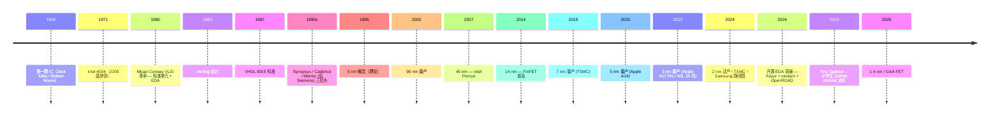

# 00-05 — 芯片设计流水线演化（Verilog → 综合 → P&R → 流片）

>
> **一句话答案：** 芯片设计 = **RTL 设计 → 仿真 → 综合（synthesis）→ 布局布线（P&R）→ DRC/LVS 验证 → 流片（tape-out）→ 封装 → 测试**。每一步用专门 EDA 工具。商业巨头 Synopsys / Cadence / Siemens；开源 OpenLane + Yosys + nextpnr 等正在崛起（Tiny Tapeout 让小学生流片）。


---

## 1. 历史时间轴



---

## 2. 完整设计流水线

```
设计阶段
─────────
1. 规格 / 架构 (SystemVerilog spec)
        ↓
2. RTL 设计 (Verilog / VHDL / Chisel / SpinalHDL / Amaranth)
        ↓
3. RTL 仿真 (Verilator / VCS / Xcelium / Questa)
        ↓
4. RTL 验证 (UVM / cocotb / SystemVerilog assertions)
        ↓
5. 综合 (Synopsys Design Compiler / Cadence Genus / Yosys)
   RTL → gate-level netlist
        ↓
6. STA (静态时序分析) — Synopsys PrimeTime
        ↓
7. DFT (Design For Test) 插入扫描链
        ↓
8. 布局布线 P&R (Cadence Innovus / Synopsys IC Compiler / OpenROAD)
   Floor planning → Placement → Routing
        ↓
9. 验证 DRC (Design Rule Check) / LVS (Layout vs Schematic)
        ↓
10. 后端 — Sign-off STA / Power / IR drop / EM
        ↓
11. 流片 GDSII / OASIS 文件 → fab
        ↓
12. 制造 (TSMC / Samsung / Intel Foundry / SMIC)
        ↓
13. 测试 / 封装
        ↓
14. 应用集成
```

---

## 3. RTL 设计语言

详见 [00-06-aiot-hardware-software-evolution](00-06-aiot-hardware-software-evolution.md) § 6.7.5。

| 语言 | 特点 |
|------|------|
| **Verilog** | 1983，C 风格，工业主流 |
| **SystemVerilog** | Verilog 超集 + 验证 |
| **VHDL** | 1987，Ada 风格，欧洲 / 国防 |
| **Chisel** | 2012 UC Berkeley，Scala-based |
| **SpinalHDL** | 现代 Scala HDL |
| **Amaranth (nMigen)** | Python HDL，开源现代 |
| **Bluespec** | 高级 |
| **MyHDL** | Python，已老 |

### 3.1 Chisel + Rocket Chip

UC Berkeley RISC-V Rocket 用 Chisel 写。生成 Verilog 给传统流程。

### 3.2 高级综合 HLS

C/C++ → Verilog（自动）：
- **Vivado HLS / Vitis HLS** (Xilinx)
- **Catapult** (Siemens)
- **Bambu** (开源)

---

## 4. 综合（Synthesis）

RTL → gate-level netlist：

```
Verilog:
  always @(posedge clk) q <= d;
  
   ↓ synthesis
   
Gate netlist:
  DFF (DataFlipFlop) cell
```

工具：
- **Synopsys Design Compiler** — 商业最强
- **Cadence Genus**
- **Mentor / Siemens Precision**

---

## 5. 布局布线（P&R）

netlist → physical layout：

```
1. Floor planning（芯片划区）
2. Power planning（电源网格）
3. Placement（标准单元放在哪）
4. CTS (Clock Tree Synthesis)
5. Routing（金属层连线）
6. Optimization（时序 / 功耗）
```

工具：
- **Cadence Innovus** — 商业
- **Synopsys IC Compiler / Fusion Compiler**
- **OpenROAD** — 开源

---

## 6. 验证

### 6.1 仿真验证

| 工具 | 厂家 |
|------|------|
| **VCS** | Synopsys |
| **Questa / ModelSim** | Siemens |
| **Xcelium** | Cadence |
| **Verilator** | 开源（最快开源仿真器）|
| **iverilog** | 开源教学 |
| **GHDL** | 开源 VHDL |
| **cocotb** | Python testbench |

### 6.2 形式化验证

- **JasperGold** (Cadence)
- **Synopsys Formality / VC Formal**
- **SymbiYosys** — 开源

详见 [00-31-verification-formal](00-37-verification-formal-evolution.md)。

### 6.3 DRC / LVS

- **DRC**：layout 是否符合 fab 规则（线宽 / 间距 / 密度）
- **LVS**：layout 是否等价于 schematic
- 工具：Synopsys IC Validator / Mentor Calibre / KLayout（开源）

---

## 7. 工艺节点

### 7.1 节点演化

```
1971: 10 µm (Intel 4004)
1980: 3 µm (8086)
1990: 1 µm
2000: 130 nm
2010: 32 nm (Intel)
2015: 14 nm — FinFET 引入
2018: 7 nm (TSMC)
2020: 5 nm (TSMC / Apple A14)
2022: 3 nm (TSMC / Apple M3)
2024: 2 nm 试产
2026: 1.4 nm 路线图
```

注意：现代"nm"是营销名，实际特征尺寸不严格对应（TSMC 5nm ≠ Intel 5nm 物理特征）。

### 7.2 主要 fab

| Fab | 节点能力 | 国家 |
|-----|---------|------|
| **TSMC** | 3nm / 2nm 量产 | 台湾 |
| **Samsung Foundry** | 3nm / 2nm | 韩国 |
| **Intel Foundry** | Intel 4 / 18A | 美国 |
| **GlobalFoundries** | 12nm / 14nm | 美国 |
| **SMIC** | 14nm / 7nm（受限）| 中国大陆 |
| **HuaHong / Hua Hong** | 28nm / 14nm | 中国 |

### 7.3 EUV 光刻

- 7nm 起需要 EUV (Extreme UltraViolet)
- 设备：ASML 唯一供应商（荷兰）
- 出口管制（中国受限）→ 国产化压力

### 7.4 GAA-FET

- FinFET 接班（2nm 起）
- Gate-All-Around，三星先（3nm 部分）
- 性能 / 能效改进

---

## 8. 开源 EDA

### 8.1 突破时刻（2020+）

```
Yosys (RTL synthesis) - Clifford Wolf 起源
nextpnr (P&R) - YosysHQ
OpenROAD (P&R) - DARPA 资助
OpenLane (RTL → GDSII flow) - Efabless
Magic VLSI (布局)
KLayout (DRC)
xdot / Vlsipy
```

### 8.2 Tiny Tapeout（教学革命）

- Matt Venn 主导
- 几百美元让你流片几 mm² 区域
- 130nm SkyWater PDK（开源）
- GitHub commit → 真硅片
- 2022 起每 6 月一波

### 8.3 SkyWater 130nm PDK

- 2020 SkyWater + Google 开源 130nm 工艺设计套件
- 第一个**完全开源**生产工艺
- 让开源 ASIC 流片可能

---

## 9. 国产 EDA

| 公司 | 特长 |
|------|------|
| **华大九天 (Empyrean)** | 模拟 EDA |
| **概伦电子 (ProPlus)** | 仿真 |
| **芯华章** | 仿真 / FPGA |
| **国微集团** | EDA |
| **超捷** | 综合 |
| **行芯科技 / 鸿芯微纳** | 数字 EDA |

→ 受美国制裁影响，国产 EDA 是国家级重点。

---

## 10. 测试 / 封装

### 10.1 测试技术

- **DFT (Design For Test)** — 设计阶段插入扫描链
- **BIST (Built-In Self-Test)** — 芯片自测
- **JTAG boundary scan** — 边界扫描
- **ATE (Automated Test Equipment)** — 量产测试机

### 10.2 封装

| 封装 | 用途 |
|------|------|
| **DIP / SOP / SOIC / QFN / BGA** | 传统 |
| **WLCSP / FOWLP** | 晶圆级 |
| **Flip Chip** | 高密度 |
| **2.5D Interposer** | HBM + GPU |
| **3D Stacking / TSV** | HBM2/3 |
| **Chiplet** | AMD Zen / Apple M Ultra / Intel Foveros |
| **CoWoS / SoIC** | TSMC 先进封装 |

详见 [00-26-micro-architecture](00-04-micro-architecture-evolution.md) § 11。

---

## 11. 摩尔定律 + 替代

### 11.1 摩尔定律放缓

```
1965-2000: 每 18 个月晶体管翻倍（严格）
2000-2010: 每 24 个月（放缓）
2010+: 不严格，靠 chiplet / 3D 维持
2026+: 摩尔定律 "事实终结"
```

### 11.2 替代路线

- **Chiplet** — 多 die 互联
- **3D 堆叠** — TSV / hybrid bonding
- **新型存储** — MRAM / RRAM / PCM
- **量子计算** — 实验
- **神经形态** — IBM TrueNorth / Intel Loihi
- **光子计算** — 实验
- **超导计算** — 实验

---


### 12.1 短期：纯软件


### 12.2 中期：FPGA 软核

- 在 FPGA 上跑 RISC-V 软核（PicoRV32 / VexRiscv / Rocket）

### 12.3 远期：定制 RISC-V SoC

- 自定义 ML 加速 / 加密引擎

---

## 13. 名词词典

| 术语 | 含义 |
|------|------|
| **EDA** | Electronic Design Automation |
| **RTL** | Register Transfer Level |
| **HDL** | Hardware Description Language |
| **HLS** | High-Level Synthesis |
| **synthesis** | 综合 |
| **netlist** | 网表 |
| **P&R** | Place and Route |
| **CTS** | Clock Tree Synthesis |
| **STA** | Static Timing Analysis |
| **DRC** | Design Rule Check |
| **LVS** | Layout vs Schematic |
| **DFT / BIST** | Design For Test |
| **JTAG** | Joint Test Action Group |
| **GDSII / OASIS** | 流片文件格式 |
| **PDK** | Process Design Kit |
| **standard cell** | 标准单元 |
| **macro** | 大块 IP |
| **floorplan** | 布局规划 |
| **tape-out** | 流片 |
| **wafer** | 晶圆 |
| **die** | 裸晶 |
| **yield** | 良率 |
| **chiplet** | 小芯片 |
| **TSV** | Through-Silicon Via |
| **EUV** | Extreme UltraViolet 光刻 |
| **FinFET** | 鳍式场效应晶体管 |
| **GAA-FET** | Gate-All-Around |
| **fab** | 半导体工厂 |
| **fabless** | 无厂模式（设计 + 外包制造）|
| **foundry** | 代工厂 |

---

## 14. 进一步阅读

### 14.1 经典书

- ***Computer Aided Logical Design*** — Mead / Conway VLSI 革命
- ***Digital Integrated Circuits*** — Rabaey
- ***CMOS VLSI Design*** — Weste / Harris
- ***Static Timing Analysis*** — STA 圣经

### 14.2 资源

- [Tiny Tapeout](https://tinytapeout.com/)
- [SkyWater PDK](https://github.com/google/skywater-pdk)
- [Yosys](https://yosyshq.net/yosys/)
- [OpenROAD](https://theopenroadproject.org/)
- [VLSI 课程 (NPTEL India)](https://nptel.ac.in/)

### 14.3 视频

- [Matt Venn YouTube](https://www.youtube.com/@MattVenn) — Tiny Tapeout
- [Tim Edwards / efabless](https://www.youtube.com/@efablesscorp)

### 14.4 本仓库笔记串联

- [00-03-isa-arch-evolution](00-03-isa-arch-evolution.md) — ISA 设计
- [00-06-aiot-hardware-software-evolution](00-06-aiot-hardware-software-evolution.md) § 6.7 — FPGA 板
- [00-24-gpu-graphics-evolution](00-24-gpu-graphics-evolution.md) — GPU 微架构
- [00-04-micro-architecture-evolution](00-04-micro-architecture-evolution.md) — 微架构 + 封装

### 14.5 本仓库本地资料

- `others/vortex/` — RISC-V GPGPU RTL（Verilog / Chisel）
- 远期可看：Rocket Chip / VexRiscv / PicoRV32 等开源软核
