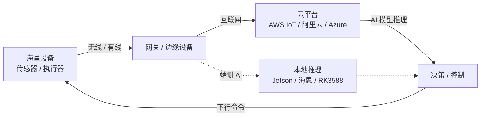
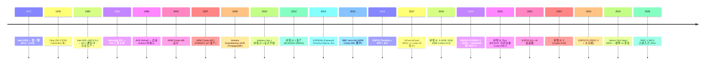
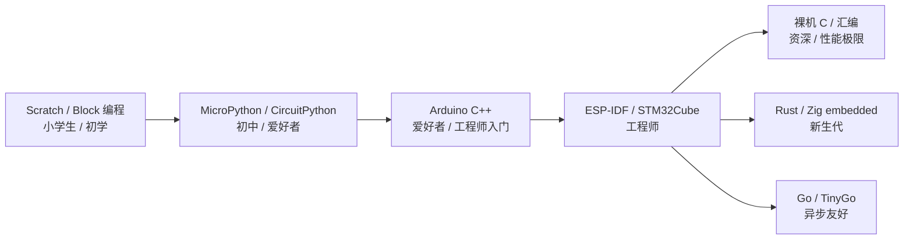
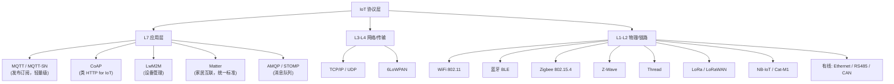
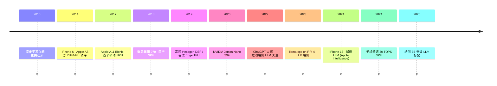
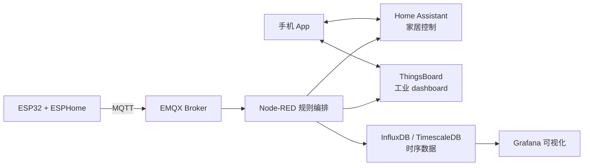
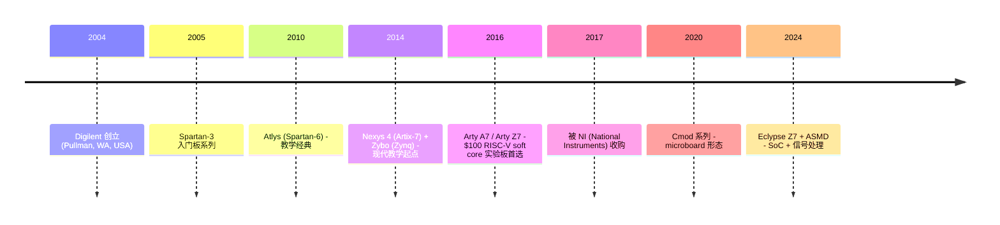
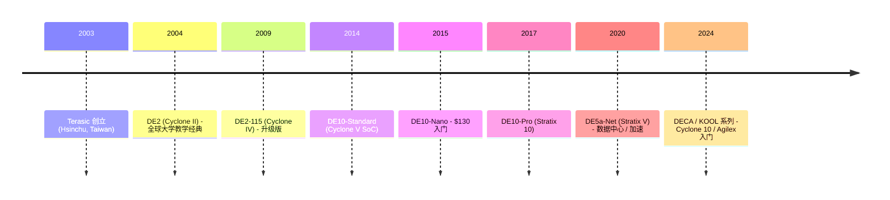
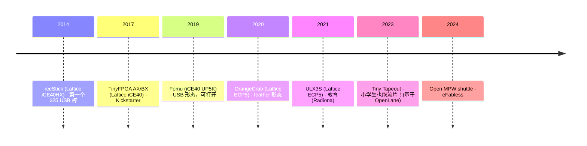

# 00-06 — AIoT 软硬件演化：从 8051 到 ESP32 / 树莓派 / FPGA SoC + 端侧 AI

> **核心问题：** 我家里一个智能灯泡里装着什么？一个 ESP32 跟 STM32 / 树莓派 / FPGA 开发板有什么区别？为什么 IoT 协议这么多（MQTT / CoAP / Matter / Zigbee）？端侧 AI（手机 / 边缘盒子）和云端 AI 的边界在哪？开发 IoT 设备从 Scratch / MicroPython 到 Rust / Zig 这条链是什么样的？
>
> **一句话答案：** AIoT = 海量异构嵌入式设备 + 网络 + 云端协同 + AI 推理。**硬件谱系**从 8 位 MCU（8051）到 32 位 SoC（STM32 / ESP32）再到 SBC（RPi / Jetson）再到 FPGA SoC（Zynq）；**软件谱系**从汇编 / C 到 MicroPython / Rust / Zig；**开发模式**从 Scratch（小学生）到 Arduino（爱好者）到 ESP-IDF / STM32Cube（工程师）；**协议生态**百花齐放但 Matter 在统一。理解这一切就能做"从 PCB 到云端 AI"的全栈 IoT 工程师。


> **学习原则：** "各维度各角度，应用 + 开发，里里外外深深浅浅全看个遍，融会贯通。" 本篇尽量铺满 AIoT 的各方面——硬件 + 软件 + 协议 + 开发流程 + 商业格局。深入度因学习优先级而异：与本仓库主线（RISC-V / Linux / SBI）相关的展开，不相关的提及即可。

---

## 1. 大框架：AIoT 是什么

### 1.1 AIoT = AI + IoT



- **IoT** = 物联网（Internet of Things）—— 让设备联网
- **AI** = 人工智能 —— 让设备"思考"
- **AIoT** = 这两者结合 —— 设备不只联网，还能本地或云端用 AI

### 1.2 三层架构

```
┌──────────────────────────────────────────────────────────┐
│ 端 (Endpoint Device)                                    │
│  传感器 / 执行器 / 微控制器                              │
│  ESP32 / STM32 / Arduino / 8051                         │
└──────────────────────────────────────────────────────────┘
            ↑ Zigbee / BLE / WiFi / LoRa / 5G
            ↓
┌──────────────────────────────────────────────────────────┐
│ 边 (Edge / Gateway)                                     │
│  网关 / 智能路由 / 边缘 AI 盒子                          │
│  树莓派 / 海思 / 高通 / 瑞芯微 / Jetson                  │
└──────────────────────────────────────────────────────────┘
            ↑ MQTT / HTTP / gRPC over TCP/IP
            ↓
┌──────────────────────────────────────────────────────────┐
│ 云 (Cloud)                                              │
│  设备管理 / 数据库 / AI 训练 / Web 控制台                 │
│  AWS IoT Core / 阿里云 IoT / Azure IoT Hub               │
└──────────────────────────────────────────────────────────┘
```

---

## 2. 硬件谱系：从 8 位 MCU 到 SBC + FPGA SoC



### 2.1 MCU vs MPU vs SBC vs FPGA SoC

| 类型 | 例子 | 特点 | 价位 | 跑什么 OS |
|------|------|------|------|----------|
| **MCU**（微控制器）| 8051 / STM32 / ESP32 / Arduino / Cortex-M | 集成 Flash + RAM + 外设；无 MMU | $0.5-$15 | 裸机 / RTOS |
| **MPU**（微处理器）| Cortex-A 单片 | 有 MMU，需要外部 RAM/Flash | $5-$50 | Linux / RTOS |
| **SBC**（单板计算机）| 树莓派 / VisionFive 2 / BeagleBone | MPU + DDR + 网卡 + USB 集成板 | $35-$200 | Linux / Android |
| **SoC FPGA**（半 FPGA 半 MCU/MPU）| Xilinx Zynq / Microchip PolarFire SoC | FPGA + ARM/RISC-V CPU 同片 | $50-$2000 | Linux + 自定义硬件 |
| **AI 加速器板** | Jetson / Coral / RK3588 NPU / 海思昇腾 | MPU + NPU/GPU | $100-$2000 | Linux + AI runtime |

### 2.2 经典 MCU 家族

#### Intel 8051 (1980 至今——史上最长寿 MCU)

- 8-bit / Harvard 架构 / 12 MHz
- 集成 4KB Flash + 128B RAM + UART + 定时器
- 几乎所有大学嵌入式课讲它
- **2026 年仍在生产**——每年出货数十亿颗（家电 / 玩具 / 工业）

#### AVR / ATmega（Arduino 灵魂）

- 8-bit RISC，1996 年 Atmel 推出
- 2008 Arduino 让 AVR 走向爱好者
- ATmega328P @ 16 MHz / 32KB Flash / 2KB RAM
- 2016 Atmel 被 Microchip 收购

#### Microchip PIC

- 8-bit / 16-bit / 32-bit 全谱
- 工控市场霸主（取暖 / 家电 / 汽车）
- MPLAB IDE
- 数十亿装机

#### ARM Cortex-M（现代主流）

| 内核 | 特点 | 例子 |
|------|------|------|
| **Cortex-M0 / M0+** | 极低功耗 | Raspberry Pi Pico (RP2040) |
| **Cortex-M3 / M4** | 主流 | STM32F1 / F4 |
| **Cortex-M7** | 高性能 | STM32H7 / i.MX RT |
| **Cortex-M33 / M55** | 安全（TrustZone）| nRF5340 |
| **Cortex-M85** | AI 增强 | Helium MVE |

**STM32 家族：** ST 公司，全球 Cortex-M 主流。
- STM32F1 (经典) → STM32F4 (高性能) → STM32H7 (480 MHz)
- STM32MP1 (Cortex-A + Cortex-M 混合)
- STM32WB (双核 + BLE)
- STM32WL (LoRa)

#### ESP 系列（Espressif）

ESP 系列改变了 IoT 价位：

| 芯片 | 内核 | 网络 | 价格 |
|------|------|------|------|
| ESP8266 | Tensilica Xtensa L106 | WiFi | $1-2 |
| ESP32 | Tensilica Xtensa LX6 双核 | WiFi + BT | $3-5 |
| ESP32-S2 | Xtensa LX7 | WiFi | $3 |
| ESP32-S3 | Xtensa LX7 + AI | WiFi + BT | $5 |
| ESP32-C3 | **RISC-V**（32-bit） | WiFi + BT | $2 |
| ESP32-C6 | RISC-V | WiFi 6 + BT 5 + Thread / Zigbee | $4 |
| ESP32-H2 | RISC-V | Thread / Zigbee | $2 |
| ESP32-P4 | RISC-V 双核 | (无内置 WiFi)，高性能 | $? |

**Espressif 全面转 RISC-V**——是 RISC-V 最大商用案例之一。

#### RP2040（Raspberry Pi Pico, 2021）

- 树莓派基金会自研
- ARM Cortex-M0+ 双核 @ 133 MHz
- 264KB SRAM + 外置 Flash
- 极便宜（$4），非常适合教学
- **2024 RP2350** (Cortex-M33 + RISC-V Hazard3，可选切换)

### 2.3 SBC 谱系

#### 树莓派系列（2012 至今）

| 型号 | 年份 | SoC | 内存 |
|------|------|-----|------|
| RPi 1 | 2012 | BCM2835 (ARMv6 700MHz) | 512MB |
| RPi 2 | 2015 | BCM2836 (ARMv7 4-core 900MHz) | 1GB |
| RPi 3 | 2016 | BCM2837 (ARMv8 4-core 1.2GHz) | 1GB |
| RPi 4 | 2019 | BCM2711 (Cortex-A72 4-core 1.5GHz) | 1/2/4/8 GB |
| RPi 5 | 2023 | BCM2712 (Cortex-A76 4-core 2.4GHz) | 4/8 GB |
| RPi Zero | 2015 | BCM2835 | 512MB |
| RPi Zero W | 2017 | + WiFi/BT | 512MB |
| RPi Zero 2 W | 2021 | BCM2710A1 4-core | 512MB |
| RPi 400 | 2020 | RPi 4 嵌入键盘 | 4GB |
| **RPi Pico** | 2021 | RP2040 (双 Cortex-M0+) | 264KB SRAM (MCU)  |
| **RPi Pico 2** | 2024 | RP2350 (双 M33 + 双 RISC-V) | 520KB SRAM |

→ 树莓派把"$35 装 Linux 的设备"普及给世界。

#### BeagleBone

- TI Sitara AM3358 (Cortex-A8)
- 2008 起，工控强
- BBB / BBAI64 等型号

#### NVIDIA Jetson（端侧 AI 板王）

| 型号 | 算力 | 价格 |
|------|------|------|
| Jetson Nano | 0.5 TOPS | $99 |
| Jetson Xavier NX | 21 TOPS | $400 |
| Jetson Orin Nano | 40 TOPS | $200 (2024 降价) |
| Jetson Orin NX | 100 TOPS | $700 |
| Jetson AGX Orin | 275 TOPS | $1700 |

→ Jetson + L4T (Linux for Tegra) = 端侧 AI 标配。

#### RISC-V SBC

笔记 [00-03-isa-arch-evolution](00-03-isa-arch-evolution.md) § 8 已列：
- **SiFive HiFive Unmatched** (FU740) — 经典开发板
- **StarFive VisionFive 1/2** (JH7110) — 普及型
- **Banana Pi BPI-F3** (用 SpacemiT K1 SoC) — SpacemiT 公司是平头哥前员工创立的独立 RISC-V 厂
- **Milk-V Mars / Duo** (CV1800B) — Sophgo
- **LicheePi 4A** (TH1520) — T-Head

### 2.4 FPGA / SoC FPGA

#### 纯 FPGA 开发板

| 板 | FPGA | 用途 |
|----|------|------|
| **iCE40 (Lattice)** | 极小 | 开源工具链 (Yosys + nextpnr) |
| **TinyFPGA BX** | iCE40 | 极简 |
| **DE10-Lite (Altera)** | MAX 10 | 教学经典 |
| **Arty A7 (Xilinx)** | Artix-7 | RISC-V soft core 测试 |
| **Sipeed Tang Nano** | Gowin | 国产开源 FPGA |
| **CYC1000** | Cyclone 10 | 低价学习 |

#### SoC FPGA（半 FPGA 半 MCU/MPU）—— 重点

| 板 | FPGA + CPU | 主战场 |
|----|-----------|-------|
| **Xilinx Zynq-7000** | FPGA + dual Cortex-A9 | 工业控制 |
| **Xilinx Zynq UltraScale+** | FPGA + quad Cortex-A53 + dual Cortex-R5 | 高端工控 |
| **Xilinx Versal ACAP** | AI 引擎 + FPGA + ARM | AI 加速 |
| **Intel SoC FPGA (Cyclone V SoC)** | FPGA + ARM | 中端工控 |
| **Microchip PolarFire SoC** | FPGA + 5× RISC-V | RISC-V 工业 |
| **Lattice CrossLink-NX** | FPGA + 小 RISC-V | 边缘 |
| **Sipeed M1s (Bouffalo)** | RISC-V + 小 FPGA | 中国学习 |

→ **本仓库 `boot/u-boot/arch/riscv/cpu/mpfs/` 就是 PolarFire SoC 的 BSP**——这是 RISC-V 学习中最常见的 SoC FPGA。

#### FPGA + RISC-V Soft Core

把 RISC-V 写到 FPGA 里：
- **PicoRV32** — 极简 RV32I
- **VexRiscv** — Spinal HDL 写
- **Rocket Chip** — Berkeley 学术
- **CVA6** — ETH PULP 开源
- **NaxRiscv** — VexRiscv 后继
- **Vortex GPGPU** —— 笔记 [00-01-material-index](00-01-material-index.md) `others/vortex/` 提到的 RISC-V GPGPU

### 2.5 micro:bit（教学奇葩）

- **BBC 主导，2016 年发布**
- ARM Cortex-M0 / 16KB RAM / 256KB Flash
- 25 LED + 按钮 + 加速度计 + 磁力计 + WiFi/BLE（v2）
- 一千万套发给英国小学生
- 推动 Block-based 编程（Scratch 风格）→ Python → JavaScript 渐进

→ 微小 MCU 也能成为现象级教学工具。

### 2.6 树莓派 vs Arduino vs ESP32 vs STM32 vs micro:bit 对比

| 板 | 内核 | RAM | OS | 价位 | 学习曲线 |
|----|------|-----|----|----|---------|
| **micro:bit** | M0 | 16KB | 裸机 | $20 | 最低（小学生）|
| **Arduino Uno** | AVR | 2KB | 裸机 | $25 | 低 |
| **RPi Pico** | M0+ | 264KB | 裸机 / RTOS | $4 | 低 |
| **ESP32** | Xtensa / RISC-V | 320KB+ | ESP-IDF / RTOS | $5 | 中 |
| **STM32F4** | M4 | 192KB | 裸机 / FreeRTOS / Zephyr | $10 | 中 |
| **树莓派 Zero** | A53 | 512MB | Linux | $15 | 高 |
| **树莓派 4/5** | A72/A76 | 4-8GB | Linux | $35-80 | 高 |
| **Jetson Nano** | A57 + GPU | 4GB | Linux + CUDA | $99 | 极高 |

**选择规则：**
- 学编程入门 → micro:bit / Arduino
- 学嵌入式 → STM32 / ESP32
- 学 Linux / 网络 → 树莓派
- 学 AI → Jetson
- 学硬件设计 → FPGA 板

---

## 3. 软件谱系：开发方式 + 编程语言

### 3.1 开发方式从图形化到底层



#### Scratch / Block 编程

- 拖拽块状代码
- 例：MakeCode for micro:bit / mBlock
- 适合 6-12 岁

#### MicroPython / CircuitPython

- Python 的极简版本，跑在 MCU 上
- MicroPython (2014) — 通用嵌入式 Python
- CircuitPython (2017) — Adafruit fork，更友好
- 跑在 ESP32 / RP2040 / STM32 / micro:bit
- REPL 即时反馈
- 性能比 C 慢 50-100x（够大多数 IoT 用）

#### Arduino IDE + C++

- Arduino 框架隐藏 register 细节
- 用简化 API: `digitalWrite()` / `analogRead()`
- 跨多种板（Uno / ESP32 / Nano 33 等）
- "Hello World" 5 行：
  ```cpp
  void setup() { pinMode(13, OUTPUT); }
  void loop() { digitalWrite(13, HIGH); delay(500); digitalWrite(13, LOW); delay(500); }
  ```

#### ESP-IDF / STM32Cube

工程级 SDK：
- **ESP-IDF** — Espressif 的 ESP32 SDK，C + FreeRTOS
- **STM32Cube** — ST 公司的 STM32 SDK，HAL + LL 双层
- **Mbed OS** — ARM 的统一 RTOS + SDK
- **Zephyr** — Linux Foundation 的开放 RTOS

#### 裸机 C / 汇编

- 直接写 register
- 看 datasheet 调寄存器
- 调试用 JTAG / SWD
- 性能 + 控制最大

#### Rust embedded

- **embassy** —— 异步嵌入式 Rust（已在笔记 00-07 § 4 提）
- **probe-rs** —— Rust 的 GDB / OpenOCD 替代
- **HAL crates** —— `stm32-hal` / `nrf-hal` / `esp-hal`
- **RTIC** —— Real-Time Interrupt-driven Concurrency framework

#### Zig embedded

- Zig 的 freestanding 模式（笔记 [01-05-zig-freestanding](01-05-zig-freestanding.md)）
- comptime 让裸机寄存器抽象零成本

#### TinyGo

- Go 的嵌入式编译器
- 支持 micro:bit / RP2040 / STM32 等
- 用 LLVM 后端 → 比正常 Go 小 100×
- 适合"用 Go 写嵌入式"

### 3.2 RTOS 谱系（与 00-07 § 4 呼应）

详细见 [00-07-os-evolution](00-07-os-evolution.md) § 4。

简表：
| RTOS | 主战场 |
|------|-------|
| **FreeRTOS** | 全球嵌入式主流 |
| **uC/OS-II/III** | 教学 + 工业 |
| **Zephyr** | Linux Foundation 旗舰 |
| **RT-Thread** | 中国开源 |
| **embassy** | Rust async |
| **VxWorks** | 高端商业（火星探测器）|
| **QNX** | 汽车 / 医疗 |
| **ThreadX** | 微软 Azure |

---

## 4. IoT 网络协议



### 4.1 应用层 IoT 协议

#### MQTT（Message Queuing Telemetry Transport）

- IBM 1999 年发明，开源化
- 发布/订阅模型：device 发到 broker，订阅者接收
- 轻量（4 字节最小 header）
- TCP 1883（明文）/ 8883（TLS）
- **物联网最主流应用层协议**

```
IoT device:  publish  topic="home/temp"  payload="22.5"
Broker (Mosquitto / EMQX): receive + relay
Subscribers: [home assistant, mobile app, cloud db] receive

```

#### CoAP（Constrained Application Protocol）

- IETF RFC 7252
- 类 HTTP 但运行在 UDP 上
- 用 GET / POST / PUT / DELETE
- 轻量级（minimum 4 byte header）

#### LwM2M（Lightweight M2M）

- OMA 制定的设备管理协议
- 跑在 CoAP 之上
- 设备注册 / 远程更新 / 监控
- 蜂窝 IoT (NB-IoT) 默认

#### Matter（Connectivity Standards Alliance, 2022）

- Apple / Google / Amazon / Samsung 等联合制定
- 目标：**统一智能家居** (取代 Zigbee / Z-Wave / 各家私有协议)
- 跑在 IPv6 上 (Thread / WiFi 6)
- 强制 mDNS 发现 / TLS 加密

→ 2024 年开始普及，**家居物联网终于有标准**。

### 4.2 物理 / 链路层 IoT 协议

| 协议 | 频段 | 范围 | 速率 | 主用 |
|------|------|------|------|------|
| **WiFi** | 2.4/5 GHz | 100m | 几百 Mbps | 高带宽 IoT |
| **BLE 5.x** | 2.4 GHz | 100m | 2 Mbps | 低功耗设备 |
| **Zigbee** | 2.4 GHz | 100m | 250 kbps | 智能家居（旧）|
| **Z-Wave** | 868/908 MHz | 100m | 100 kbps | 美国家居 |
| **Thread** | 2.4 GHz | 100m | 250 kbps | Matter 推荐 |
| **LoRa / LoRaWAN** | 868/915 MHz | 几公里 | 几十 kbps | 远距 IoT |
| **NB-IoT** | 蜂窝 | 几公里 | 几十-数百 kbps | 蜂窝 IoT |
| **Cat-M1 / LTE-M** | 蜂窝 | 几公里 | 几百 kbps | 移动 IoT |
| **Sigfox** | 私有 | 远距 | 极低 | 农业 / 物流 |

---

## 5. 端侧 AI（On-device AI）

### 5.1 演化时间轴



### 5.1.A DSP（数字信号处理器）— 端侧 AI 之前的"加速 IP"

DSP（Digital Signal Processor）专做信号变换：FFT / FIR / IIR 滤波 / 卷积 / DCT。在 NPU 普及之前，DSP 是嵌入式"加速器"主力。

#### 主流 DSP 谱系

| DSP | 厂家 | 主用 |
|-----|------|------|
| **TI TMS320 C6000** | TI | 通信基带 / 工业 |
| **TI C28x** | TI | 电机控制 / 电力电子 |
| **ADI Blackfin / SHARC** | Analog Devices | 音频 / 音响设备 |
| **ADI TigerSHARC** | ADI | 雷达 / 国防 |
| **Qualcomm Hexagon** | 高通 | 手机 SoC（音频 / AI 混合）|
| **CEVA** | CEVA | IP 授权（多家 SoC 内嵌）|
| **Cadence Tensilica HiFi / Vision** | Cadence | 嵌入音频 / 视觉 |
| **NXP DSC**（数字信号控制器）| NXP | 工控混合信号 |

#### "DSP 扩展" 在通用 CPU 里

不是独立芯片，而是加到 CPU 指令集里的信号处理增强：
- **ARM Cortex-M4/M7** — 含 DSP 扩展（saturating add / SMLAD / SIMD8/16）
- **ARM Cortex-M55 / M85** — Helium MVE（128-bit SIMD，专为 ML/DSP 设计）
- **RISC-V Packed/Vector 扩展** — `P` 扩展（packed SIMD）/ `V` 扩展（向量）
- **ESP32 / ESP32-S3** — Tensilica DSP 扩展（音频 + 早期 AI）
- **x86 SSE / AVX** — 桌面级 DSP 化（也算 DSP 演化）

#### DSP vs MCU vs NPU vs CPU 对比

| 维度 | MCU | DSP | NPU | CPU |
|------|-----|-----|-----|-----|
| 通用性 | 高 | 中 | 低（ML 专用）| 高 |
| 数据并行 | 弱 | 强 | 极强 | 中 |
| 控制流 | 强 | 中 | 弱 | 强 |
| 算力密度 | 低 | 高 | 极高 | 中 |
| 编程模型 | C / 汇编 | C + intrinsic | TFLite / ONNX | C / Python |

→ **演化趋势：传统 DSP 萎缩，NPU 接管 ML 部分，CPU 通过 SIMD 扩展接管基础信号处理**。但 DSP 在低功耗音频 / 工控 / 通信基带仍是主力。

#### 与本仓库相关

- 本仓库 `others/vortex/` 是 RISC-V GPGPU，可视为"通用 DSP"演化形态
- AIoT 板上的 NPU（RK3588 / 海思 / 高通）取代了传统 DSP 角色

---

### 5.2 端侧 AI 加速方案

| 方案 | 例子 | 算力 | 用途 |
|------|------|------|------|
| **手机 NPU** | Apple Neural Engine / 高通 Hexagon / 联发科 APU / 海思 NPU | 5-50 TOPS | 拍照 / 语音 / Apple Intelligence |
| **Jetson** | Orin Nano / NX / AGX | 40-275 TOPS | 机器人 / 边缘视觉 |
| **Coral (Google)** | Edge TPU | 4 TOPS | 微型推理 |
| **Hailo** | Hailo-8 | 26 TOPS | 工业 |
| **国产 SoC NPU** | RK3588 (6 TOPS) / 海思昇腾 / 寒武纪 | 1-100 TOPS | 国产边缘 |
| **MCU 加速器** | ARM Cortex-M85 (Helium) / NXP i.MX RT 系列 | 0.05-0.5 TOPS | 极小推理 |

### 5.3 端侧 AI 软件栈

```
应用 (拍照修图 / 语音助手 / 翻译)
    ↓
推理框架 (TensorFlow Lite / ONNX Runtime / NCNN / MNN)
    ↓
NPU 后端 (Apple CoreML / NNAPI / DirectML / SNPE / RKNN)
    ↓
NPU / GPU / CPU 硬件
```

国内主流：
- **NCNN** (腾讯) — 移动 + 嵌入式
- **MNN** (阿里) — 同上
- **MMDeploy** (上海 AI Lab) — 部署工具链
- **OpenMMLab** — 模型库

---

## 6. AIoT 商业 / 国家生态

### 6.1 国际 IoT 平台

| 平台 | 厂商 |
|------|------|
| **AWS IoT Core** | Amazon |
| **Azure IoT Hub** | Microsoft |
| **Google Cloud IoT** | Google |
| **IBM Watson IoT** | IBM |
| **Cisco IoT Operations** | Cisco |
| **Particle** | 创业公司 |
| **Adafruit IO** | 爱好者 |

### 6.2 中国 IoT 平台

| 平台 | 厂商 |
|------|------|
| **阿里云 IoT** | 阿里 |
| **腾讯云物联网** | 腾讯 |
| **华为云 IoTDA** | 华为 |
| **百度天工** | 百度 |
| **京东智联云** | 京东 |
| **海尔 U+** | 海尔 |
| **米家 / 小米 IoT** | 小米 |
| **涂鸦智能** | 涂鸦 |

### 6.3 中国 AIoT 旗舰公司

| 公司 | 主战场 |
|------|------|
| **海康威视** | 智能监控 |
| **大华** | 监控 |
| **小米** | 智能家居 |
| **涂鸦智能** | IoT PaaS |
| **华为** | 工业 + 家居 |
| **乐鑫 (Espressif)** | ESP 系列 MCU |
| **平头哥** | 玄铁 RISC-V SoC |
| **瑞芯微** | RK 系列 SoC + NPU |
| **海思** | 麒麟 / 鸿蒙 |
| **全志 (Allwinner)** | 中端 SoC |

### 6.4 AIoT 协议联盟

| 联盟 | 协议 |
|------|------|
| **CSA (Connectivity Standards Alliance)** | Matter / Zigbee / Thread |
| **OMA (Open Mobile Alliance)** | LwM2M / DM |
| **IETF** | CoAP / 6LoWPAN |
| **OASIS** | MQTT / AMQP |
| **3GPP** | 5G / NB-IoT |
| **Bluetooth SIG** | Bluetooth |
| **WiFi Alliance** | WiFi |

---

## 6.4 SoC 谱系的最底层：从"牛屎芯片"说起

理解 SoC 谱系不能只看高端——**最低端的"牛屎芯片"才是真正出货量最大的"SoC"**。

### 6.4.1 什么是"牛屎芯片"

中国电子工程师文化梗：**COB (Chip-On-Board) 工艺**——一颗裸晶圆 die 直接焊到 PCB 上，然后用**黑色环氧树脂**封装保护。看起来像一坨"牛屎"贴在板子上。

特点：
- 成本：**单颗几分到几角钱**（vs 包装好的 SOP/QFN MCU 几元）
- 引脚：4-8 个 pad（绑定到 die 的少数 pad）
- 程序：ROM 烧死，量产不可改
- 应用：玩具 / 彩灯 / 电子贺卡 / 廉价 LED / 网红小风扇 / 音乐贺卡

### 6.4.2 牛屎芯片常见家族

| 系列 | 厂家 | 用途 |
|------|------|------|
| **HT 系列** | Holtek（合泰）| 玩具 / 家电 8-bit MCU |
| **PT 音乐 IC** | Princeton Technology / 国产替代 | 音乐贺卡 / 门铃 |
| **SA88xx** | 多家 | 节日彩灯 IC |
| **WS28xx** | 世微 | LED 控制 IC（虽然 WS2812B 不算牛屎，但 WS2811 封装很多用 COB） |
| **YS-** | 各种白牌 | 玩具语音 |
| **HT82M / HT24LCxx** | Holtek | EEPROM 等 |

### 6.4.3 牛屎芯片为什么重要

- **出货量极大**：每年几十亿颗（玩具 + 彩灯 + 贺卡）
- **真"嵌入式"**：你日常生活中接触最多的"计算机"反而是这些
- **教育意义**：理解"芯片成本可以低到这种程度"
- **DIY 文化**：替换牛屎芯片为 ATtiny / RP2040 改装玩具（Maker 圈乐趣）

### 6.4.4 SoC 复杂度谱系一图流

```
牛屎芯片 (4-bit MCU, $0.05)
    ↓
8051 / PIC / AVR (8-bit MCU, $0.5-2)
    ↓
ARM Cortex-M / RISC-V MCU (32-bit, $1-15)
    ↓
ESP32 / RP2040 (32-bit MCU + 网络, $2-5)
    ↓
ARM Cortex-A 单片 SoC (Allwinner H3 / 树莓派 BCM, $15-50)
    ↓
高端 SBC SoC (RK3588 / SiFive FU740, $50-200)
    ↓
工业级 + AI (NXP i.MX 9 / Jetson Orin / 海思 / 麒麟, $100-2000)
    ↓
服务器 SoC (Apple M-Ultra / AMD EPYC / 华为鲲鹏, $1000-30000)
    ↓
最尖端：超算 GPU (NVIDIA H100 / B200, $30000-50000)
```

→ **SoC 不是单一概念**——从几分钱到几万美元有 6 个数量级的成本差距，对应不同应用场景。

---

## 6.5 国产 SoC + 开发板补充（重点）

### 6.5.1 瑞芯微（Rockchip）

国产 ARM SoC 主力厂家。

| SoC | 内核 | NPU | 主要开发板 |
|-----|------|-----|-----------|
| **RK3588 / RK3588S** | 4× A76 + 4× A55 + Mali-G610 | 6 TOPS | DC-A588 / 香橙派 5 / OPi 5 Pro / 友善 NanoPC-T6 |
| **RK3576** | 4× A72 + 4× A53 | 6 TOPS | NanoPi M6 |
| **RK3568** | 4× A55 + Mali-G52 | 1 TOPS | OPi 3B / Banana Pi BPI-R2 Pro |
| **RK3399 / RK3399Pro** | 2× A72 + 4× A53 | (Pro 有 NPU) | 经典开发板（Roc-RK3399） |
| **RK3328 / RK3128** | A53 / A7 | 无 | 低端 |
| **RK1808** | A35 | 3 TOPS | AI 棒 |

**DC-A588（迪文 RK3588 板）+ 香橙派 5 系列** 是 2024 年国内 RK3588 SBC 主流——**6 TOPS NPU + 8K 视频解码** 让它成为端侧 AI 性价比之王。

#### 香橙派（Orange Pi）家族

深圳迅龙软件出品，对标树莓派但更便宜：

| 型号 | SoC | 内存 | 价位 |
|------|-----|------|------|
| Orange Pi 5 | RK3588S | 4-32 GB | $80-$200 |
| Orange Pi 5 Plus | RK3588 | 4-32 GB | $130-$280 |
| Orange Pi Zero 3 | H618 | 1-4 GB | $25 |
| Orange Pi 3B | RK3566 | 4-8 GB | $50 |
| Orange Pi RV2 | Ky X1 (8 核 RISC-V) | 4-16 GB | RISC-V SBC |
| Orange Pi PC | H3 | 1 GB | $15 |

→ 香橙派 5 (RK3588) 跑 Linux + 端侧 LLM 推理是当前热门。

### 6.5.2 全志（Allwinner）

| SoC | 内核 | 主板 |
|-----|------|------|
| **H6 / H616 / H618** | A53 4 核 | Orange Pi Zero / 3 |
| **D1 / D1s / D1-H** | **RISC-V (玄铁 C906)** | Nezha / MangoPi |
| **A64** | A53 | Pine64 |
| **R329** | A53 + DSP | XR872 等 |

→ Allwinner D1 是**第一款量产 Linux-class RISC-V SBC**（2021）。

### 6.5.3 平头哥（T-Head, 阿里）+ SpacemiT

| SoC | 厂商 | 内核 |
|-----|------|------|
| **TH1520** | 平头哥 | RISC-V (玄铁 C910) 4 核 + 4 TOPS NPU | LicheePi 4A / Sipeed |
| **K1 (X60)** | SpacemiT | RISC-V (X60) 8 核 | Banana Pi BPI-F3 |
| **C906** | 平头哥 | 单核 RISC-V | Allwinner D1 内 |
| **C910 / C920** | 平头哥 | 多核 RISC-V | TH1520 |

### 6.5.4 嘉楠（Canaan）— K230

- **K230** 双核 RISC-V (玄铁 C908) + 1 TOPS NPU
- AI 视觉边缘（人脸 / 物体识别 / OCR）
- 开发板：CanMV-K230 / DongshanPi K230

**K230 应用谱（横跨工业 → 航天）：**

| 领域 | 用例 | 总线 / 接口 |
|------|------|-----------|
| **AI 视觉** | 人脸 / 物体 / OCR / 拍照美颜 | MIPI CSI / DVP |
| **智能音箱** | 语音识别 / 唤醒词 | I2S / I2C |
| **机器人** | SLAM 视觉 / 激光雷达 | UART / SPI / CAN |
| **工业控制** | 视觉质检 / 机器视觉 | Modbus / EtherCAT / CAN |
| **车载 ADAS** | 驾驶员监控 / 倒车影像 | CAN / CAN-FD / FlexRay |
| **航天 / 星务** | 卫星载荷数据处理 / 视觉导航 | CAN-bus / SpaceWire / RS-485 + 抗辐射加固 |

#### CAN 总线 → 星务的链路

**CAN（Controller Area Network）** 1986 Bosch 发明，原本汽车用：
- 物理层：双绞线差分信号 (CAN_H / CAN_L)
- 速率：1 Mbps（CAN）/ 5-8 Mbps（CAN-FD）/ 10 Mbps（CAN-XL）
- 拓扑：总线，多主仲裁
- 应用：汽车 OBD-II / 工业 PLC / 医疗设备 / **航天器内部总线**

**星务（卫星业务管理系统）** 是航天器的"OS"——管理姿态控制、热控、电源、有效载荷数据：
- **小卫星（cubeSat 1U-12U）**：常用 CAN bus 作为内部总线
- **中型卫星**：MIL-STD-1553 / SpaceWire 主流
- **现代卫星**：渐用 TTEthernet / SpaceFibre

**RISC-V 在航天** 的优势：
- 开源（无 ITAR / EAR 出口管制问题）
- 模块化（可去掉浮点 / 加抗辐射逻辑）
- 工艺可定制（用 65nm / 110nm 抗辐射工艺流片）
- 国产可控（中国航天五院已用 RISC-V）

**典型项目：**
- **NASA HPSC**（High-Performance Spaceflight Computing）— SiFive 中标 RISC-V 处理器
- **欧空局 SMOS / GAIA 后续** — 探索 RISC-V
- **中国天问 / 北斗 / 神舟** 后续型号 — 国产 RISC-V SoC 进入

→ K230 这种"低功耗 + AI 视觉" RISC-V SoC，在 cubeSat 视觉载荷上是有趣应用方向（学术 / 创业项目）。


### 6.5.5 海思（华为）

| SoC | 用途 |
|-----|------|
| **Hi3559A** | 4K 摄像头 |
| **Hi3516** | 监控摄像头 |
| **Hi3798** | 机顶盒 |
| **昇腾 Ascend 310** | AI 推理（被制裁后限量）|
| **昇腾 910** | AI 训练 |
| **麒麟 9000s/9010** | 手机（鸿蒙生态）|

### 6.5.6 飞腾（Phytium）

国产 ARM 服务器 / 桌面 SoC：

| 型号 | 内核 | 用途 |
|-----|------|------|
| **FT-2000** | 64 核 ARMv8 | 服务器 |
| **D2000** | 8 核 ARMv8 | 桌面 |
| **腾锐 D3000** | 8 核 | 桌面 |
| **飞腾派** | E2000Q (4 核 ARMv8) | 开发板（$70）|

→ **飞腾派** 是国产 ARM 教育板，跑统信 UOS / 麒麟 / openEuler。

### 6.5.7 龙芯（LoongArch）

| SoC | 用途 |
|-----|------|
| 3A6000 / 3C6000 | 桌面 / 服务器 |
| 2K1000 / 2K2000 | 嵌入式 |

笔记 [00-03-isa-arch-evolution](00-03-isa-arch-evolution.md) 已详。

### 6.5.8 兆芯 / 海光

| 厂商 | 主营 |
|------|------|
| **兆芯**（VIA fork）| x86 处理器 |
| **海光 (Hygon)**（AMD Zen 授权）| x86 服务器 |

### 6.5.9 紫光展锐 / 紫光国微

- **展锐 Tiger T618 / T606** — 中低端手机 SoC
- 国产手机 SoC 主力之一

### 6.5.10 Sipeed

不是 SoC 厂家但是国产 SBC 头部品牌：

| 板 | SoC | 备注 |
|----|-----|------|
| **LicheePi 4A** | TH1520 | RISC-V 旗舰 |
| **LicheePi Nano** | F1C100s | 极简 RISC-V |
| **Tang Nano 9K / 20K** | Gowin FPGA | 开源 FPGA |
| **MaixCAM** | K230 | AI 视觉 |
| **M1s** | BL808 | RISC-V + WiFi |
| **Maix Bit** | K210 | 早期 RISC-V AI |

### 6.5.11 国产 SBC 总览

| 系列 | 厂家 | 价位 | 主战场 |
|------|------|------|-------|
| 香橙派 | 迅龙 | $25-$280 | 通用 SBC |
| 友善之臂 | 友善电子 | $50-$300 | 工业级 SBC |
| 荔枝派 (LicheePi) | Sipeed | $30-$150 | RISC-V |
| 香蕉派 (BPI) | Sinovoip | $60-$300 | 多种 SoC |
| 飞腾派 | 飞腾科技 | $70 | 国产 ARM 教育 |
| Milk-V (算能) | Sophgo | $9-$200 | RISC-V |
| Banana Pi BPI-F3 | SpacemiT | $80 | RISC-V |
| 风火轮 (FireFly) | 创龙 | $100-$500 | RK3588 工业 |
| 翔升派 | — | — | 通用 |
| DC-A588 | 迪文 | $300+ | RK3588 工业 |
| Khadas | Khadas | $50-$300 | Amlogic 系列 |
| Radxa | 瑞莎 | $30-$200 | 多 SoC |

→ **2024 年国产 SBC 至少 30+ 系列在售**——选择极丰富，但生态散乱。

### 6.5.12 何时选哪种

```
学习入门 → 香橙派 5 (RK3588) — 通用 + 价位适中 + 资料多
端侧 AI → Jetson Orin Nano / DC-A588 (RK3588 NPU)
RISC-V 学习 → VisionFive 2 / LicheePi 4A / BPI-F3
工控 → 友善 / FireFly / DC-A588 工业版
极简 RISC-V → Milk-V Mars / Duo / Sipeed M1s
开源 FPGA → Sipeed Tang Nano / iCE40
国产桌面 → 飞腾派 / 龙芯 3A6000 板
低成本 IoT → ESP32-C3 / RP2040
```

---

## 6.6 IoT 软件平台 / 协议生态（家居 + 工业）

### 6.6.1 家居自动化平台

| 项目 | 语言 | 类型 | 一句话 |
|------|------|------|--------|
| **Home Assistant** | Python | 开源 | 家居自动化王者，支持几千种设备集成 |
| **ESPHome** | C++ + YAML | 开源 | 把 ESP32/ESP8266 一键变 Home Assistant 设备 |
| **HomeBridge** | Node.js | 开源 | 让非 HomeKit 设备接入 Apple HomeKit |
| **OpenHAB** | Java | 开源 | 老牌家居自动化（Eclipse 系）|
| **Domoticz** | C++ | 开源 | 轻量家居自动化 |
| **Tasmota** | C | 开源 | 替代 Sonoff 等设备的开源固件 |
| **WLED** | C | 开源 | LED 灯带控制（ESP32 上跑）|

#### Home Assistant 详细

- 跑在树莓派 / 通用 Linux / Docker / HassOS（独立 distro）
- 支持 1000+ integrations（HomeKit / Zigbee / Z-Wave / MQTT / Modbus / KNX / Tuya / 米家 / Yeelight / ...）
- YAML 配置 / Web UI
- **2024 全球 200 万+ 用户**

#### ESPHome 详细

```yaml
# ESPHome YAML 配置示例
esphome:
  name: my-thermometer
esp32:
  board: esp32dev
wifi:
  ssid: "MyWiFi"
  password: "secret"
sensor:
  - platform: dht
    pin: GPIO5
    temperature:
      name: "Living Room Temperature"
    update_interval: 30s
```

`esphome compile && esphome upload` 一键搞定 → 自动出现在 Home Assistant。

### 6.6.2 MQTT Broker

| Broker | 语言 | 一句话 |
|--------|------|--------|
| **Mosquitto** | C | 轻量、Eclipse 项目，IoT 必备 |
| **EMQX** | Erlang/Elixir | 国产高性能，百万连接，杭州映云科技 |
| **HiveMQ** | Java | 商业版本最成熟 |
| **VerneMQ** | Erlang | 高可用集群 |
| **NanoMQ** | C | 嵌入式 broker |
| **NATS** | Go | 替代 MQTT 的现代消息总线 |

**EMQX 特别说明：** 国产开源 broker 之光。Erlang/Elixir 写的（OTP 平台天然分布式 + 软实时）。**单机百万 MQTT 连接**，集群千万级。被国家电网 / 滴滴 / 货拉拉 / 中国移动等使用。

→ **Erlang/Elixir 在 IoT 后端很重要**——OTP 模型适合"成千上万长连接 + 高可用 + 软实时"。

### 6.6.3 流编排 / 可视化

| 项目 | 语言 | 一句话 |
|------|------|--------|
| **Node-RED** | Node.js | 拖拽式流编程，IBM 出品，IoT 中间件之王 |
| **n8n** | Node.js | 类 Zapier 的流编排（包括 IoT）|
| **Apache NiFi** | Java | 大型数据流 |
| **HuginnAgents** | Ruby | 自动化 agent |

**Node-RED 详细：**
- 浏览器拖拽节点连成 flow
- 几千个 node-red-contrib-* 包扩展（MQTT / Modbus / OPC UA / 各种数据库）
- 跑在树莓派常见
- 整合 Home Assistant、工业 PLC 等

### 6.6.4 IoT 平台（PaaS）

| 项目 | 语言 | 一句话 |
|------|------|--------|
| **ThingsBoard** | Java | 开源 IoT 平台，规则引擎 + Dashboard |
| **ThingSpeak** | Ruby on Rails | MathWorks 实验数据平台（与 MATLAB 集成）|
| **Mainflux** | Go | 云原生 IoT 平台 |
| **Kuiper** (eKuiper) | Go | 边缘流处理（EMQ 出品）|
| **Particle** | 商业 | 端到端 IoT 服务 |

**ThingsBoard 详细：**
- 设备管理 / 规则引擎 / Dashboard / 多租户
- 自部署或云
- 国内不少工业 IoT 项目用

### 6.6.5 工业协议

| 协议 | 用途 | 物理层 |
|------|------|-------|
| **Modbus RTU / TCP** | 工业设备最常见 | RS-485 / Ethernet |
| **OPC UA** | 现代工业 | TCP |
| **Profibus / PROFINET** | 工业 fieldbus | 自定义 / Ethernet |
| **CAN bus / CANopen** | 汽车 / 工业 | CAN 物理层 |
| **EtherCAT** | 实时工业 Ethernet | Ethernet |
| **EtherNet/IP** | 同上 | Ethernet |
| **DNP3** | 电力 / SCADA | 串口 / TCP |
| **BACnet** | 建筑自动化 | BACnet/IP |
| **KNX** | 楼宇控制 | KNX 双绞线 |
| **MQTT-SN** | 传感器 MQTT 子集 | UDP / Zigbee |

**Modbus 详细：** 1979 年 Modicon 发明，几乎所有工业 PLC / 仪表都支持。RTU 跑 RS-485（便宜）/ TCP 跑 Ethernet（现代）。Home Assistant + Node-RED + ESPHome 都有 Modbus 模块——能把现有工业设备接入家居自动化。

### 6.6.6 完整 IoT 后端栈典型组合



**一站式 stack 推荐：**
- 家居：HomeAssistant + ESPHome + Mosquitto + Zigbee2MQTT
- 工业：ThingsBoard + EMQX + Node-RED + Modbus 网关
- DIY：树莓派 + Docker + 上述各组件

### 6.6.7 Elixir 在 IoT 的位置

- **Erlang OTP** —— 1986 爱立信开发，电信行业经典
- **Elixir** —— 2011 José Valim，Erlang VM (BEAM) 上的现代语法
- **Nerves** —— Elixir 嵌入式框架（在树莓派 / BeagleBone 跑）

**为什么 Elixir 在 IoT 重要：**
- BEAM 天然多进程、低延迟、高可用
- 单台机器跑百万 MQTT 连接（EMQX 是证据）
- 热更新（不停机升级）—— 工业系统刚需

---

## 6.7 FPGA 开发板补充（中国教学市场）

### 6.7.1 国内 FPGA 开发板厂家

| 品牌 | 主营 | 网站 |
|------|------|------|
| **正点原子（ALIENTEK）** | 全栈教学板（FPGA + STM32 + ARM 嵌入式 + 树莓派配套）| alientek.com |
| **黑金（AlinX）** | Xilinx 中高端 FPGA + ZYNQ 教学板 | alinx.com |
| **米联客（MiSi）** | Xilinx + Intel FPGA + AI 加速 | misiline.com |
| **特权同学** | 教学视频 + 简单板 | — |
| **Sipeed** | RISC-V + 开源 FPGA + AI | sipeed.com |
| **小梅哥** | 教学视频 + Altera 板 | acuc.cn |
| **野火（Embedfire）** | STM32 + FPGA + 嵌入式 | embedfire.com |
| **正星** | 工业 FPGA 板 | — |

### 6.7.2 正点原子 FPGA 开发板系列（最常见学习板）

| 板 | FPGA | 特点 | 价位 |
|----|------|------|------|
| **战舰 V4** | Xilinx Spartan-6 XC6SLX9 | 入门级 | $80 |
| **达芬奇 Pro** | Xilinx Artix-7 XC7A35T | 中端 | $200 |
| **达芬奇 Plus** | Artix-7 XC7A100T / XC7A200T | 高端教学 | $400-700 |
| **领航者 V2** | Xilinx Zynq XC7Z020 (FPGA + ARM Cortex-A9) | SoC FPGA | $300 |
| **新起点** | Xilinx Spartan-7 / Zynq | 新品 | $200-400 |

→ 正点原子整套学习路径：**STM32 → ARM 嵌入式 → FPGA → SoC FPGA → AI 加速**——教学资源覆盖最全。

### 6.7.3 国外享誉 FPGA 开发板（教学 + 工业历史经典 → 2026 当前）

#### Digilent（美国，全球教学 FPGA 板老大）



| 板 | FPGA | 价位 | 主用 |
|----|------|------|------|
| **Basys 3** | Artix-7 XC7A35T | $150 | 学校最常见入门 |
| **Nexys 4 / Nexys A7** | Artix-7 XC7A100T | $260 | DDR + Ethernet 教学 |
| **Arty A7-35T / 100T** | Artix-7 | $130-200 | RISC-V soft core 实验首选（PicoRV32 / Rocket / VexRiscv 在此跑）|
| **Arty S7** | Spartan-7 | $120 | 入门低成本 |
| **Cmod A7 / S7** | Artix/Spartan-7 | $90 | 拇指大小 microboard |
| **Zybo Z7-10 / Z7-20** | Zynq XC7Z010/020 | $200-300 | SoC FPGA 学习 |
| **Cora Z7** | Zynq | $130 | 入门 SoC FPGA |
| **Eclypse Z7** | Zynq + 高速 ADC/DAC | $700 | 信号处理 |
| **Genesys 2** | Kintex-7 XC7K325T | $1000 | 高端学术研究 |
| **Atlys** | Spartan-6 (停产) | — | 历史经典 |

→ **Arty A7-35T 是 RISC-V 教学界圣坛**——Berkeley / MIT / 清华课程常用，PicoRV32 / Rocket / NaxRiscv 跑得起。

#### Terasic（台湾，Altera/Intel 主力教学板厂）



| 板 | FPGA | 价位 | 主用 |
|----|------|------|------|
| **DE0 / DE0-Nano** | Cyclone IV | $100-160 | 入门 |
| **DE1 / DE1-SoC** | Cyclone V SoC | $250 | 标准教学（含 ARM）|
| **DE2 / DE2-115** | Cyclone II / IV | $300-595 | 大学经典（讲义最多）|
| **DE10-Lite** | MAX 10 | $90 | 入门 + 双 ADC |
| **DE10-Nano** | Cyclone V SoC | $130 | $130 SoC FPGA！MiSTer 项目灵魂 |
| **DE10-Standard** | Cyclone V SoC | $350 | 标准教学 |
| **DE10-Pro** | Stratix 10 | $1000+ | 高端学术 |
| **DE5a-Net DDR4** | Stratix V | $5000 | 加速器 |
| **DE-SoC + AI** | Agilex 系列 | $1000-3000 | AI / 加速 |

→ **DE10-Nano 因 MiSTer 项目（FPGA-based 复古游戏机模拟）出圈**——把 NES/SNES/Genesis/Atari 等老主机用 FPGA 还原，2018 后火遍 retro 圈。

#### Xilinx 官方 / AMD 高端板

| 板 | FPGA | 价位 | 主用 |
|----|------|------|------|
| **ZCU102 / 104 / 106** | Zynq UltraScale+ | $3000-7000 | 学术高端 + AI |
| **ZCU111 / 216 / 1275** | RFSoC | $10K-30K | 5G / 雷达 |
| **VC707 / VC709** | Virtex-7 | $3500 | 高速 |
| **VCU108 / 118 / 128** | Virtex UltraScale+ | $7000-12000 | 高频 / 网络 |
| **VCK190** | Versal AI Core | $10000 | AI 引擎 |
| **Alveo U200 / U250 / U280** | UltraScale+ | $7000-10000 | 数据中心加速器 |
| **Alveo V70 / X3 / X3522** | Versal AI / 网络 | $15K+ | 网络功能 / SmartNIC |
| **KCU105 / KCU116** | Kintex UltraScale+ | $3000 | 中端 |
| **KC705** | Kintex-7 | $1700 | 经典 |
| **AC701 / SP701** | Artix / Spartan-7 | $1200 | 商业入门 |

→ **Alveo 系列**是数据中心 FPGA 加速主力，Vortex GPGPU（本仓库 `others/vortex/`）就支持 Alveo。

#### Intel 官方 / Altera 高端板

| 板 | FPGA | 价位 | 主用 |
|----|------|------|------|
| **Stratix 10 GX / SX dev kit** | Stratix 10 | $7K-15K | HBM / DDR4 |
| **Stratix 10 MX dev kit** | + HBM2 | $20K | 数据中心 |
| **Cyclone 10 GX / LP dev kit** | Cyclone 10 | $1500-3000 | 中端 |
| **Agilex 7 / 9 dev kit** | Agilex (新一代) | $5K-15K | 现代主力 |
| **Arria 10 GX dev kit** | Arria 10 | $4500 | 中高端 |

#### Avnet（AVNET，美国，老牌经销商 + 自研）

| 板 | FPGA | 价位 | 主用 |
|----|------|------|------|
| **ZedBoard** | Zynq XC7Z020 | $500 | Zynq 教学经典（前 Digilent ZYBO 时代）|
| **MicroZed** | Zynq XC7Z010/020 | $250-300 | SoM 形态 |
| **MiniZed** | Zynq XC7Z007S | $90 | 入门 SoC FPGA |
| **Ultra96-V2 / V3** | Zynq UltraScale+ | $250-400 | 96Boards 兼容 |
| **Ultra96-RF** | + RF | $1500 | 5G 实验 |

#### Lattice 官方 / 社区（开源工具链友好）

| 板 | FPGA | 价位 | 备注 |
|----|------|------|------|
| **iCE40 HX1K Breakout** | iCE40 | $60 | 老但完全开源工具链支持 |
| **iCE40 UltraPlus 5K Breakout** | iCE40 UP5K | $50 | 中端开源 |
| **ECP5 Versa** | ECP5 | $200 | 中端开源工具链 |
| **CrossLink-NX Eval** | Nexus | $400 | 新一代低功耗 |
| **MachXO3LF Starter Kit** | MachXO3 | $100 | 低成本 |

→ Lattice 是**开源 FPGA 工具链突破口**（Yosys / nextpnr / Project IceStorm / Trellis 都从 Lattice 开始）。

#### 完全开源 / 社区驱动 FPGA 板



| 板 | FPGA | 价位 | 备注 |
|----|------|------|------|
| **iceStick** | iCE40HX | $25 | USB 棒 |
| **TinyFPGA AX / BX** | iCE40 | $30-40 | Kickstarter 起家 |
| **Fomu** | iCE40 UP5K | $50 | USB 嵌入端口 |
| **OrangeCrab** | ECP5 | $130 | feather 形态 |
| **ULX3S** | ECP5 | $135-200 | 教育板（Croatia Radiona）|
| **icebreaker** | iCE40 UP5K | $70 | 完全开源工具链 |
| **Pano Logic G2** | Spartan-6 | 二手 $20 | 老 thin client 拆解改造 |

#### Microchip / Microsemi（PolarFire）

| 板 | FPGA | 价位 | 备注 |
|----|------|------|------|
| **PolarFire SoC Discovery Kit** | PolarFire SoC + 5× RISC-V | $400 | RISC-V SoC FPGA 入门 |
| **PolarFire SoC Icicle Kit** | PolarFire SoC | $499 | 工业 RISC-V 主力（本仓库 u-boot/arch/riscv/cpu/mpfs/ 对应这块）|
| **SmartFusion2 dev kit** | SmartFusion2 | $200-500 | ARM Cortex-M3 + FPGA |

→ **Icicle Kit** 是**RISC-V SoC FPGA 学术 / 工业首选**。

#### 其他享誉国外品牌

| 厂商 | 国家 | 主营 |
|------|------|------|
| **Trenz Electronic** | 德国 | 工业级 Zynq SoM |
| **Enclustra** | 瑞士 | 工业 Zynq SoM |
| **Mistral Solutions** | 印度 | TI / Xilinx 板 |
| **NumatoLab** | 印度 | 性价比 FPGA 板 |
| **Diligent India** | 印度 | Digilent 印度合作 |
| **Mercury Systems** | 美国 | 国防 FPGA |
| **Annapurna Labs** | 以色列（被 AWS 收购）| 网络 SmartNIC |

#### 历史经典（已停产但仍有人用）

| 板 | 厂家 | 时代 | 备注 |
|----|------|------|------|
| **Spartan-3 Starter Kit** | Xilinx | 2003 | 第一代教学板 |
| **Atlys** | Digilent | 2010 | Spartan-6 经典 |
| **Cyclone II DE2** | Terasic | 2004 | 全球大学经典 |
| **Pano Logic** | Pano | 2007 | thin client 改造 |
| **Spartan-3E Starter Kit** | Xilinx | 2007 | 教学 |
| **Nexys 2 / 3** | Digilent | 2008-2010 | Spartan-3E/6 |

#### 何时选哪个国外板

```
RISC-V soft core 学习 → Arty A7-35T（Digilent）
SoC FPGA 入门 → DE10-Nano (Terasic) / Zybo (Digilent) / MiniZed (Avnet)
开源工具链 → iCE40/ECP5 板（TinyFPGA / Fomu / icebreaker / OrangeCrab）
高端学术 → Genesys 2 / ZCU102 / Stratix 10 dev kit
工业 RISC-V → PolarFire SoC Icicle (Microchip)
数据中心加速 → Alveo U250 / DE5a-Net / Stratix 10 GX
预算 < $100 → iceStick / Fomu / DE10-Lite / Cmod A7
预算 $100-300 → DE10-Nano / Arty A7 / Zybo / Basys 3
预算 $300-1000 → Nexys A7 / Genesys 2 / Eclypse Z7
预算 $1000+ → ZCU 系列 / VC 系列 / Alveo
```

#### 国外 vs 国内 FPGA 板对比

| 维度 | 国外板（Digilent/Terasic 等）| 国内板（正点原子/黑金等）|
|------|---------------------------|------------------------|
| 价格 | 高（$200+）| 低（同等性能 60% 价）|
| 教学资源 | 英文教材丰富、原版教科书配套 | 中文视频教程多、配套贴心 |
| 社区 | Stackoverflow / Xilinx Wiki | 国内论坛 / 微信群 |
| 与课程匹配 | MIT / Stanford / Berkeley 课用 | 国内大学 + 培训机构 |
| 支持 / 售后 | 邮件 / 工单（慢）| 微信 / QQ 即时（快）|
| 配套 | 板 + JTAG + 教学例程 | 同上 + 中文教程 + 视频 |

→ 学习选哪个看预算和语言偏好。**功能上没本质差距**——都是 Xilinx/Altera 标准 FPGA，写 Verilog 都一样跑。

### 6.7.3 FPGA 常用开发实践

#### 入门项目（每个 FPGA 学习者都做过）

1. **流水灯** —— 第一个 Hello World，Verilog/VHDL 学计数器
2. **数码管时钟** —— 计数器 + 七段译码器
3. **按键消抖** —— 状态机入门
4. **VGA 显示** —— 时序信号生成
5. **PS/2 键盘** —— 串行协议
6. **UART 收发** —— 异步串行

#### 中级项目

7. **DDR 控制器** —— 用厂家 IP（MIG）+ 自己写测试
8. **HDMI 输出** —— 高速差分信号
9. **USB 设备** —— UART over USB（用 FX2LP 等）
10. **SD 卡读写** —— SPI / SDIO 协议
11. **以太网 MAC** —— 经典数字电路项目
12. **数字信号处理** —— FIR 滤波器 / FFT

#### 高级项目

13. **RISC-V 软核** —— PicoRV32 / VexRiscv / Rocket / RV32-NaxRiscv 移植
14. **Linux on FPGA** —— Zynq 上跑 Linux + FPGA 加速器
15. **GPGPU** —— Vortex GPGPU on Xilinx U250 / Stratix
16. **AI 加速器** —— 自己实现卷积加速器
17. **网络协议加速** —— TCP/IP 卸载到 FPGA
18. **数字示波器** —— ADC 数据采集 + 分析

#### 与本仓库相关

- **Vortex GPGPU** (others/vortex/) — 本仓库 RISC-V GPGPU，跑在 Xilinx U250 / Intel Stratix 10
- **PoCL on Vortex** (others/pocl-vortex/) — OpenCL kernel → LLVM → Vortex 指令

### 6.7.4 FPGA 工具链

#### 商业（必备）

| 工具 | 厂家 | FPGA |
|------|------|------|
| **Vivado / Vitis** | Xilinx (AMD) | Artix-7 / Zynq / UltraScale / Versal |
| **Quartus Prime** | Intel (Altera) | MAX 10 / Cyclone / Stratix |
| **Libero SoC** | Microchip | PolarFire / SmartFusion |
| **Lattice Diamond / Radiant** | Lattice | iCE40 / ECP5 / CrossLink |
| **Gowin EDA** | Gowin（国产）| Tang Nano / Tang Primer |

#### 开源工具链（突破！）

| 工具 | 支持 FPGA |
|------|----------|
| **Yosys** | iCE40 / ECP5 / Gowin / Xilinx 7-series（部分）|
| **nextpnr** | iCE40 / ECP5 / 通用 |
| **F4PGA / SymbiFlow** | Artix-7 等 |
| **Project IceStorm** | iCE40 完整反向 |
| **Project Trellis** | ECP5 |
| **OpenLane** | ASIC（不是 FPGA 但相关）|

→ **2020 后开源 FPGA 工具链取得突破** —— 让 FPGA 不再依赖商业 EDA。但工业级仍主流商业工具。

### 6.7.5 HDL 语言

| 语言 | 类型 | 适用 |
|------|------|------|
| **Verilog** | 经典 HDL | 工业主流 |
| **SystemVerilog** | Verilog 扩展 | 高级验证 |
| **VHDL** | 经典 HDL | 欧洲 / 国防 |
| **SpinalHDL** | Scala-based | 现代 / VexRiscv |
| **Chisel** | Scala-based | UC Berkeley / Rocket Chip |
| **MyHDL** | Python | 教学 |
| **nMigen / Amaranth** | Python | 现代开源 |
| **Bluespec** | 高级 | 学术 |

**本仓库 PicoRV32 / Rocket / VexRiscv** 都用现代 HDL（Chisel / SpinalHDL）写，比 Verilog 更高级。

### 6.7.6 何时选 FPGA vs MCU

```
固定逻辑、量产 → ASIC（成本最低，但需要百万颗起订）
小批量、复杂数字逻辑 → FPGA（灵活但功耗大）
通用控制、网络 → MCU + 软件（成本最低、最灵活）
高带宽数据流（视频 / 网络 / DSP）→ FPGA + 软核协同
端侧 AI 推理 → 专用 NPU 或 SoC FPGA + AI IP
```

---

## 7. PCB 简单提及（不深入）

PCB（Printed Circuit Board，印刷电路板）是 IoT 硬件的实体载体。本笔记不深入硬件设计，但术语认知不可缺：

- **EDA 工具**：KiCad（开源）/ Altium Designer（商业）/ Eagle / Cadence Allegro
- **PCB 制造**：JLCPCB / PCBWay 等中国工厂主导
- **Layer**：1 / 2 / 4 / 6 / 8 / 12 层（多层用于高频）
- **Via**：通孔 / 盲孔 / 埋孔
- **Stackup**：层叠结构
- **DRC** (Design Rule Check)：设计规则检查
- **Gerber**：制造文件格式
- **BOM** (Bill of Materials)：物料清单
- **SMT**：表面贴装

→ 想做完整 IoT 产品要会 PCB，但**软件工程师起步可以全外包给 PCB 工厂**（JLCPCB 提供从 PCB 到组装一条龙）。

---


### 8.1 短期：教学/实验 RISC-V SBC


### 8.2 中期：嵌入式 Linux 替代

针对小型 IoT 网关（不需要完整 Debian）：
- 内存 32-128 MB
- Flash 32-256 MB
- 定时上报传感器 + 接受云端命令
- 任何 IoT OS 总和 < 2 MB 是合理目标

### 8.3 长期：MCU 形态（行业方向，不预设具体项目）

学 embassy 思路，让 OS 编译为 ESP32-C3 等小 RISC-V MCU 上能跑：
- comptime 把不用的子系统全 elide
- async-first，无 RTOS 调度器（编译期决定任务）

- 应能与 ESP32 + WiFi 协作

### 8.4 与 ROS 2 集成？


---

## 9. QuickStart / 实操路径

### 9.1 入门：闪个灯

#### micro:bit
1. https://makecode.microbit.org/ 拖块
2. 下载 .hex 拖到 micro:bit 盘符

#### Arduino Uno
```c
void setup() { pinMode(13, OUTPUT); }
void loop() { digitalWrite(13, HIGH); delay(500); digitalWrite(13, LOW); delay(500); }
```

#### ESP32 (Arduino)
```c
void setup() { pinMode(2, OUTPUT); }
void loop() { digitalWrite(2, HIGH); delay(500); digitalWrite(2, LOW); delay(500); }
```

#### RPi Pico (MicroPython)
```python
from machine import Pin
from time import sleep
led = Pin(25, Pin.OUT)
while True:
    led.toggle()
    sleep(0.5)
```

### 9.2 熟练：连云

#### ESP32 + MQTT
```c
#include <WiFi.h>
#include <PubSubClient.h>

WiFiClient espClient;
PubSubClient client(espClient);

void setup() {
    WiFi.begin("ssid", "pass");
    while (WiFi.status() != WL_CONNECTED) delay(500);
    client.setServer("broker.hivemq.com", 1883);
    client.connect("ESP32Client");
}

void loop() {
    client.publish("test/temp", "22.5");
    delay(5000);
}
```

### 9.3 非常熟悉：完整 AIoT 项目

完整 IoT 项目通常涉及：
1. 硬件：选 MCU + 设计 PCB + 焊样机
2. Firmware：ESP-IDF / Arduino / Rust embedded
3. 通信：WiFi / BLE / LoRa
4. 协议：MQTT / Matter
5. 后端：云平台（自建或买）
6. 移动端：Flutter / React Native app
7. AI：训练模型 / 端侧推理

→ 这是个跨 5+ 个学科的系统工程。

---

## 10. 名词词典

### 10.1 硬件类别

| 术语 | 含义 |
|------|------|
| **MCU** | Microcontroller Unit（微控制器，集成 Flash+RAM）|
| **MPU** | Microprocessor Unit（微处理器，需外部存储）|
| **SBC** | Single-Board Computer（单板计算机）|
| **SoM** | System on Module（核心板）|
| **SoC** | System on Chip（片上系统）|
| **FPGA** | Field-Programmable Gate Array（可编程逻辑器件）|
| **CPLD** | Complex PLD（小型 FPGA）|
| **ASIC** | Application-Specific Integrated Circuit（专用 IC）|
| **NPU** | Neural Processing Unit |
| **DSP** | Digital Signal Processor |
| **MMU** | Memory Management Unit |

### 10.2 IoT 协议术语

| 术语 | 含义 |
|------|------|
| **MQTT** | 发布订阅协议 |
| **CoAP** | RESTful 类似的 IoT 协议 |
| **LwM2M** | 设备管理协议 |
| **Matter** | 统一智能家居协议 |
| **6LoWPAN** | IPv6 over Low-Power WPAN |
| **Zigbee** | 802.15.4 网状网络 |
| **Z-Wave** | 美国家居协议 |
| **Thread** | 6LoWPAN + 802.15.4 mesh，Matter 推荐 |
| **LoRa / LoRaWAN** | 长距低功耗 |
| **NB-IoT** | 蜂窝 IoT |
| **mDNS / DNS-SD** | 局域网设备发现 |

### 10.3 AI 加速器术语

| 术语 | 含义 |
|------|------|
| **NPU / TPU** | 神经网络处理器 |
| **TOPS** | Tera Operations Per Second |
| **Quantization** | 量化（FP32 → INT8）|
| **Pruning** | 模型剪枝 |
| **Distillation** | 知识蒸馏 |
| **TFLite** | TensorFlow Lite |
| **ONNX** | Open Neural Network Exchange |
| **CoreML** | Apple 推理框架 |
| **NNAPI** | Android 神经网络 API |
| **EdgeAI / OnDeviceAI** | 端侧 AI |

### 10.4 开发流程术语

| 术语 | 含义 |
|------|------|
| **Bare-metal** | 无 OS 直接编程 |
| **HAL (Hardware Abstraction Layer)** | 硬件抽象层 |
| **BSP (Board Support Package)** | 板支持包 |
| **JTAG / SWD** | 调试接口 |
| **OpenOCD / pyOCD** | 开源调试器 |
| **probe-rs** | Rust 调试器 |
| **Bootloader** | 引导程序 |
| **OTA (Over-The-Air)** | 远程升级 |
| **DFU (Device Firmware Upgrade)** | 设备固件升级 |
| **REPL** | Read-Eval-Print Loop |

### 10.5 PCB 术语

| 术语 | 含义 |
|------|------|
| **EDA** | Electronic Design Automation |
| **Schematic** | 电路图 |
| **Layout** | PCB 布线 |
| **Footprint** | 元件封装 |
| **Via** | 过孔 |
| **Stackup** | 层叠 |
| **DRC / ERC** | 设计 / 电气规则检查 |
| **Gerber** | PCB 制造文件 |
| **BOM** | 物料清单 |
| **SMT / DIP** | 表贴 / 直插封装 |

---

## 11. 进一步阅读

### 11.1 经典书

- ***Make: Getting Started with Arduino*** — Massimo Banzi（Arduino 创始人）
- ***The Definitive Guide to ARM Cortex-M3 / M4*** — Joseph Yiu
- ***Internet of Things Programming Cookbook*** — Colin Dow
- ***Designing Embedded Hardware*** — John Catsoulis
- ***Embedded Systems with ARM Cortex-M Microcontrollers*** — Yifeng Zhu
- ***Make: AVR Programming*** — Elliot Williams
- ***Programming Arduino Next Steps*** — Simon Monk
- ***Practical Embedded Linux Bootcamp*** — Bootlin

### 11.2 视频 / 课程

- [GreatScott / EEVblog](https://www.youtube.com/) — 硬件入门
- [Andreas Spiess](https://www.youtube.com/c/AndreasSpiess) — IoT 硬件
- [Hackaday](https://hackaday.com/) — 创客文化
- [DigiKey](https://www.digikey.com/en/maker/learn) — 元件 + 教程
- [Coursera Embedded Systems](https://www.coursera.org/specializations/embedded-systems)
- [edX MITx 6.S081 / 6.828](https://pdos.csail.mit.edu/6.828/)

### 11.3 本仓库笔记串联

- [00-01-material-index](00-01-material-index.md) — `rtos/` 段（FreeRTOS / RT-Thread / embassy / ucos）
- [00-02-fullstack-vertical](00-02-fullstack-vertical.md) — IoT 设备的 boot 链路
- [00-03-isa-arch-evolution](00-03-isa-arch-evolution.md) — MCU ISA（ARM Cortex-M / RISC-V Hazard3）
- [00-07-os-evolution](00-07-os-evolution.md) — RTOS 谱系详
- [00-21-network-stack-evolution](00-21-network-stack-evolution.md) — IoT 网络协议栈
- [00-35-distro-evolution](00-35-distro-evolution.md) — IoT distro（OpenWrt / Buildroot）

### 11.4 本仓库本地资料对应

| 路径 | 用途 |
|------|------|
| `rtos/freertos/` | FreeRTOS 主流 RTOS |
| `rtos/embassy/` | Rust async 嵌入式（如已 clone）|
| `rtos/rt-thread/` | 中国 RTOS |
| `rtos/uC-OS2/`, `rtos/uC-OS3/` | uC/OS 教学 RTOS |
| `boot/u-boot/` | 嵌入式 bootloader |
| `core/` | 各种内核（含教学 / 比赛 OS）|
| `others/vortex/` | RISC-V GPGPU（端侧 AI 加速器开源样本）|
| `others/pocl-upstream/`, `pocl-vortex/` | OpenCL on CPU + Vortex |

→ 拿这些源码对照本笔记的概念，逐步推进：
1. 先在 RPi Pico / ESP32 跑 LED + 串口
2. 再跑 FreeRTOS demo
3. 再加 WiFi + MQTT 上云
4. 再上 Linux SBC（树莓派）
5. 再做端侧 AI（Jetson Nano）

---

## 12. 当前格局简要

**全球嵌入式 / IoT 现状（2026）：**

- **MCU 出货：** ARM Cortex-M 占 60%，RISC-V 30%（Espressif / 国产推动），其他（AVR / 8051 / PIC）10%
- **SBC 主流：** 树莓派 5 / VisionFive 2 / Jetson Orin Nano / RK3588 板
- **RTOS：** FreeRTOS / Zephyr 主导开源；VxWorks / QNX 商业头部
- **IoT 协议：** Matter 开始统一智能家居；MQTT 仍是工业首选
- **端侧 AI：** Apple A18 / 高通 8 Gen 4 / 联发科天玑 9400 都集成 30+ TOPS NPU
- **AIoT 趋势：** LLM 端侧化（手机本地跑 7B 模型 - Apple Intelligence / Google Gemini Nano）
