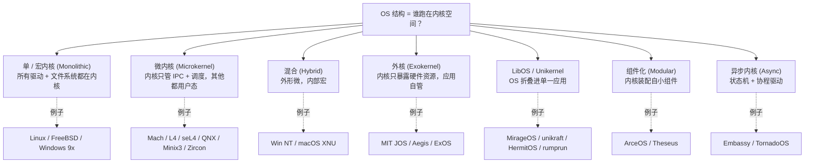
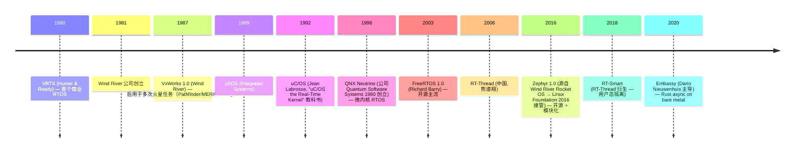
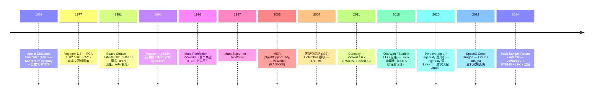
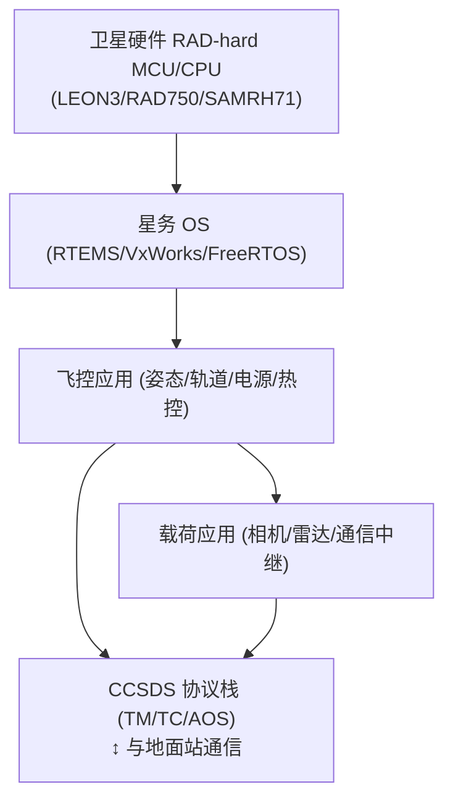
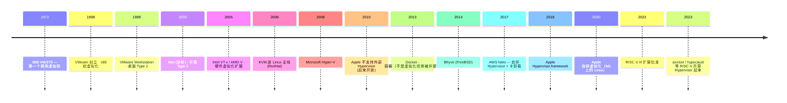
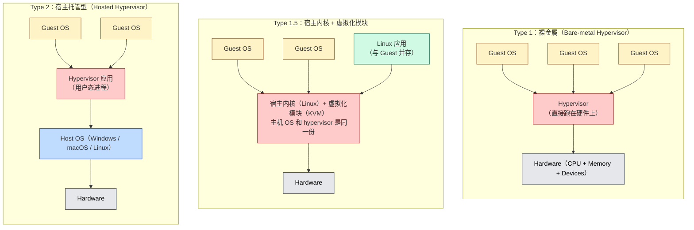

# 00-07 — OS 演化史：从 Multics 到 LibOS / Hypervisor / Async Kernel 全谱

> **核心问题：** 操作系统这个软件类别从哪来？为什么有这么多种"内核形态"（单 / 微 / 宏 / 外 / Lib）？RTOS 与通用 OS 是什么关系？Hypervisor 怎么进来的？为什么近几年又冒出来这么多 RISC-V 学习内核？
>
> **一句话答案：** OS 是 1960s "为多人共享一台机器"诞生的协调层。**60 年间衍生出多条结构范式**——每条范式都是对"权衡之三角（性能 / 安全 / 复杂度）"的不同选择。RTOS 是为实时性砍掉通用功能的子谱系；Hypervisor 是给 OS 上面再叠一层；LibOS 是把 OS 折叠进应用进程；现代教学/研究内核则是这些范式的实验场。

本笔记是 [00-01-material-index](00-01-material-index.md) / [00-02-fullstack-vertical](00-02-fullstack-vertical.md) / [00-03-isa-arch-evolution](00-03-isa-arch-evolution.md) 的延续——**横向看 ISA、纵向看栈、时间看 OS** 三视角合起来构成"全栈认知大框架"。


---

## 1. 大框架：60 年 OS 全景一图流

```mermaid
timeline
    1956 : GM-NAA I/O — IBM 704 上第一个 OS（批处理）
    1961 : CTSS (MIT) — 第一个真正分时系统
    1964 : IBM OS/360 + Multics 项目启动 — 第一个标准化 ISA + OS 家族 / Unix 精神祖师
    1969 : Unix 起步于 PDP-7 (Bell Labs)
    1971 : Unix v1 (PDP-11)
    1973 : Unix v4 用 C 重写
    1978 : 1BSD 发布（Berkeley）
    1981 : MS-DOS — IBM PC 默认 OS
    1985 : Windows 1.0 / Mach 项目启动 (CMU)
    1986 : Mach 1.0 / MIPS R2000
    1987 : Minix (Tanenbaum 教学)
    1989 : NeXTSTEP (Mach + BSD - Mac OS X 祖先)
    1991 : Linux 0.01 (Linus 22 岁)
    1993 : Windows NT 3.1 (Cutler / DEC 团队)
    1996 : QNX Neutrino — 微内核工业标杆 (QNX 公司 1980 创立)
    2001 : Mac OS X 10.0 Cheetah (XNU = Mach + BSD + IOKit) (3 月)
    2003 : FreeRTOS 1.0 (Richard Barry)
    2008 : Android 1.0 (Linux + Java) (9 月) / iPhone 3G
    2009 : seL4 — 第一个形式化验证的微内核 (8 月，NICTA)
    2011 : ChromeOS (Linux + Chrome)
    2016 : Fuchsia / Zircon 在 GitHub 被发现 (Google 微内核) / WSL1 (Win10 1607)
    2018 : xv6-riscv 移植完成 / rCore-Tutorial 教学 OS 兴起
    2019 : HarmonyOS 1.0 (8 月) / openEuler 开源 (12 月) / WSL2
    2020 : Embassy (Rust async on bare metal)
    2022 : ArceOS / NoAxiomOS / Linux 6.1 接受 Rust (12 月)
    2024 : Asterinas 公开 / Linux 6.x Rust 持续扩张
```



OS 60 年浓缩在三句话里：

1. **1960s-1970s：诞生** — 多人分时共享一台机器的协调层（CTSS / Multics / Unix）
2. **1980s-2000s：商业化 + 流派分裂** — 单内核（Linux / BSD / Win NT 部分）vs 微内核（Mach / QNX / L4）vs 混合（Win NT / macOS XNU）；嵌入式分裂出 RTOS
3. **2010s-2020s：研究/教学/特殊化** — 形式化验证（seL4）、Unikernel（MirageOS）、组件化（ArceOS）、异步内核（Embassy）、Rust 系列爆发

---

## 2. OS 是用来解决什么问题的（"为何来"）

理解任何 OS 之前，先记住它要回答的三个问题：

### 2.1 资源仲裁（Resource Arbitration）

CPU / 内存 / I/O 设备只有一份，但多个程序想用——OS 决定谁先用、用多久、怎么回收。
- 解决方案：调度器、内存管理、I/O 栈

### 2.2 抽象简化（Abstraction）

硬件细节复杂（DMA / 中断 / 内存对齐）—— OS 给应用一套统一接口（POSIX / Win32 / WinRT）。
- 解决方案：syscall、device file、网络 socket、文件系统

### 2.3 安全隔离（Isolation）

多个用户 / 多个进程不能互相破坏 —— OS 用 MMU / 特权级强制隔离。
- 解决方案：进程地址空间、capability、用户/内核分离

**几乎所有 OS 设计争议都在"为了 A 多少 B 可以让"上。** 微内核愿意为安全牺牲性能；单内核愿意为性能放弃部分安全；RTOS 愿意为实时性放弃通用功能；Unikernel 愿意为单进程性能放弃多用户隔离。

---

## 3. OS 结构范式：五大流派 + 现代衍生



### 3.1 单内核 / 宏内核（Monolithic Kernel）

**定义：** 所有 OS 服务都跑在内核态——文件系统、网络栈、设备驱动、调度器同住一个特权空间。

**典型：** Linux, FreeBSD, OpenBSD, NetBSD, Windows 95/98/Me, Solaris

**优点：**
- 性能高（无 IPC 开销）
- 实现简单（直接函数调用）
- 与硬件互动直接

**缺点：**
- 任何驱动 bug 都能 crash 整个 OS
- 内核体量大，难以审计
- 难做形式化验证

**演化趋势：** 现代 Linux 通过 `loadable kernel module (LKM)` + namespace + cgroup 部分弥补单内核的死板。BPF / eBPF 让用户态程序能安全注入内核——某种"软微内核化"。

### 3.2 微内核（Microkernel）

**定义：** 内核只管最少功能（IPC / 线程调度 / 内存基本管理），其他全在用户态服务。

**典型：** Mach (1986 v1.0；CMU 1985 项目启动), QNX (Neutrino 1996；公司 1980), Minix3, L4 (1995 Liedtke), seL4 (2009 验证), Zircon (Fuchsia), Symbian

**优点：**
- 任何"驱动"崩溃只死一个进程
- 易于形式化验证（seL4 是首个被证明无 bug 的内核）
- 适合嵌入式实时
- 安全性强（capability 模型）

**缺点：**
- IPC 开销（内核 / 用户切换 + 拷贝）
- 实现复杂
- 历史性能差距（首版 Mach 慢 Linux 2-3 倍）

**现代救赎：** L4 系列通过快速 IPC 把性能差距缩到 10% 以内。**seL4 + L4Re 已用于汽车 / 医疗 / 航天**。

**有名的"理论之争"：** 1992 Tanenbaum vs Linus 在 comp.os.minix 上的论战——Tanenbaum 认为微内核必胜未来，Linus 反驳"微内核还要十年才能赶上单内核"。**Linus 赢了 30 年，但 seL4 + Fuchsia 让微内核在某些场景反扑**。

### 3.3 混合内核（Hybrid）

**定义：** 外形声称是微内核，但实际上很多服务还在内核态运行——为了性能。

**典型：** Windows NT 系列（NT/XP/Vista/7/10/11/Server）、macOS XNU、ReactOS、BeOS、Haiku

**关键设计：**
- Windows NT：HAL + Microkernel layer + Executive layer + 各 subsystem (Win32 / POSIX / OS/2)
- macOS XNU：Mach 内核 + BSD subsystem + IOKit driver framework

**优点：** 兼具微内核的模块性 + 单内核的性能
**缺点：** 名实不符；架构复杂

### 3.4 外核（Exokernel）

**定义：** 内核**几乎不抽象**——直接暴露硬件资源（disk block / page / TLB），让应用自己实现 OS 抽象。

**典型：** MIT Aegis (1995), ExOS, MIT JOS (教学)

**思想：** "OS 抽象本身是开销 / 限制" → 让应用自己定义抽象。

**优点：** 极致性能；应用想做什么就做什么
**缺点：** 应用要重写"OS 一半的代码"；难以维护
**结局：** 学术失败，但思想被 LibOS / DPDK / SPDK 借鉴

### 3.5 LibOS / Unikernel

**定义：** OS 不再是"系统服务"——而是一组**库**，与应用静态链接成单一二进制。一个 unikernel 一次只跑一个应用。

**典型：**
- **MirageOS** (2013) — Cambridge 用 OCaml
- **HermitOS** — Rust 高性能计算 unikernel
- **unikraft** — 模块化 unikernel 框架
- **rumprun** — NetBSD 重打包成 unikernel
- **TenonOS** — 中文社区 LibOS

**优点：**
- 启动 < 10ms
- 镜像小（几 MB）
- 攻击面小（无多用户、无 shell）
- 适合云函数 / 边缘 / 微服务

**缺点：**
- 只能跑一个应用
- 调试难（没 SSH 进去）
- 生态小

**应用场景：** AWS Firecracker（Lambda 后端用 unikernel-style）；Cloudflare Workers；Edge computing

### 3.6 组件化内核（Modular / Component Kernel）

**定义：** 内核由可插拔组件组成 —— 内存管理 / 网络 / 文件系统 / 调度器都可以独立替换。

**典型：**
- **ArceOS** — 国内 Rust 组件化内核研究项目
- **Theseus** — Rust 安全组件化内核
- **Asterinas** — Rust 框架内核

**思想：** "为不同场景组装不同 OS" — 嵌入式只装最小组件，服务器装满。

**与微内核区别：** 微内核组件运行在用户态（IPC 通信），组件化内核组件常运行在内核态（直接调用），界限模糊。

### 3.7 异步内核（Async Kernel）

**定义：** 用 async/await 状态机驱动内核任务，**避免传统线程栈开销**。

**典型：**
- **Embassy** — Rust 异步嵌入式 RTOS
- **TornadoOS** — RISC-V 异步内核
- **NoAxiomOS** — 部分异步设计

**思想：** "内核中绝大多数任务是 I/O bound，状态机比线程更轻量"。

**优点：** 内存占用极小（每任务几百字节）；CPU 利用率高
**缺点：** 调试难；要求语言级 async（Rust / Zig）

### 3.8 各范式深入剖析

#### 3.8a 单/宏内核（Monolithic）— Linux 详解

```
┌─────────────────────────────────────────────────────────┐
│ 用户态（Ring 3 / EL0 / U-mode）                        │
│   bash / firefox / nginx / python / ...                │
└─────────────────────────────────────────────────────────┘
              ↑ syscall (int 0x80 / svc / ecall)
              ↓
┌─────────────────────────────────────────────────────────┐
│ 内核态（Ring 0 / EL1 / S-mode）                        │
│ ┌─────────────────────────────────────────────────────┐ │
│ │ syscall layer (sys_*)                              │ │
│ ├─────────────────────────────────────────────────────┤ │
│ │ VFS / IPC / scheduler / mm / netstack              │ │
│ ├─────────────────────────────────────────────────────┤ │
│ │ ext4 / btrfs / TCP / UDP / IP / netfilter         │ │
│ ├─────────────────────────────────────────────────────┤ │
│ │ block / char / net device drivers                  │ │
│ ├─────────────────────────────────────────────────────┤ │
│ │ arch/<arch>/{boot, mm, irq, syscall}              │ │
│ └─────────────────────────────────────────────────────┘ │
└─────────────────────────────────────────────────────────┘
              ↑ MMIO / IRQ
              ↓
                    硬件
```

**内部结构（看 Linux 源码就一目了然）：**
- `kernel/` —— 调度器 / 时钟 / 中断处理 / lockdep / cgroup
- `mm/` —— 内存管理（page allocator / slab / vmalloc / mmap）
- `fs/` —— VFS + 各文件系统（ext4 / btrfs / nfs / tmpfs）
- `net/` —— 协议栈（TCP/UDP/IP/Bluetooth/can/wireless）
- `drivers/` —— 几十万 driver
- `arch/<arch>/` —— 架构相关代码

**通信机制：** 直接函数调用——无 IPC 开销。比如 read() syscall 直接调用 VFS 层的 vfs_read，再调用 ext4_read_iter，再调用 block layer 的 submit_bio——全在内核空间完成。

**典型 IPC（用户态进程间）：** pipe / socket / shm / signal / msgqueue / unix domain socket。这些都通过 syscall 进入内核完成。

**内存隔离：** 用户进程的虚拟地址空间互相隔离（每个进程一份页表），但内核空间在所有进程的页表中**映射相同**——这样 syscall 进入后无需切换页表。

**优点延伸：**
- 性能极佳（无 IPC 切换）
- 设备驱动直接 inline 函数调用
- 一次 cache miss 就能调到下一层（极少 context switch）

**缺点延伸：**
- 一个 driver 出 bug → kernel panic → 全机宕
- 模块加载（modprobe）后即在 kernel 空间，安全审查难
- 内核 API 不稳定（每个版本 driver 都要适配）

**Linux 自我"软微内核化"的努力：**
- **eBPF** —— 用户态程序经过 verifier 后注入内核，安全运行
- **FUSE** —— 文件系统在用户态实现
- **cuse / vhost-user** —— 字符设备 / 块设备 用户态实现
- **DPDK / SPDK** —— 网络 / 存储栈搬到用户态

#### 3.8b 微内核（Microkernel）— L4 / seL4 详解

```
┌─────────────────────────────────────────────────────────────┐
│ 用户态                                                     │
│ ┌────────────┐ ┌────────────┐ ┌────────────┐ ┌─────────┐  │
│ │ 文件系统   │ │ 网络栈     │ │ 设备驱动   │ │ 应用    │  │
│ │ FS server  │ │ Net server │ │ ATA driver │ │ user prog │
│ └────┬───────┘ └────┬───────┘ └────┬───────┘ └────┬────┘  │
│      └───── IPC msg ┴────────────┴───────────────┘       │
└─────────────────────────────────────────────────────────────┘
                          ↑ IPC (kernel-mediated)
                          ↓
┌─────────────────────────────────────────────────────────────┐
│ 内核态（极少代码，~10K LOC）                              │
│   - Thread scheduling                                      │
│   - IPC primitive (capability + message passing)           │
│   - MMU / address space management                        │
└─────────────────────────────────────────────────────────────┘
                          ↑ MMIO / IRQ
                          ↓
                       硬件
```

**核心思想：把"驱动 + 文件系统 + 网络栈"全推到用户态作为 server 进程**。它们之间通过 IPC（内核辅助）通信。

**L4 系列：** 1995 Liedtke 提出 L4 minimal microkernel，论文 "On Micro-Kernel Construction"。性能突破：IPC < 200 cycle（早期 Mach 是 5000 cycle）。

**L4 衍生：**
- **OKL4** (Open Kernel Labs) — 商业，2020 已用于亿万手机基带
- **NOVA** — 学术
- **Fiasco.OC** — TU Dresden
- **L4Re** — Real-time
- **seL4** — 形式化验证版（NICTA / DSTG）

**seL4 的特殊性：**
- 2009 年首次完全形式化验证（用 Isabelle/HOL 证明实现符合规范）
- Capability-based 安全模型
- 用于 DARPA HACMS 防黑客项目（自动驾驶汽车 / 无人机）
- 商业认证：汽车 / 医疗 / 航空电子

**通信机制详解（capability + IPC）：**
- 进程持有 **capability**（一种引用，可以传给别的进程）
- 用 capability 调用其他进程的"端点"
- 内核保证：没有 capability 就无法调用
- Capability 可被传递、撤销、限制

**如何实现 syscall：** 没有传统 syscall——所有"系统服务"通过 IPC 发送消息给对应 server。比如 read() 不是陷入内核，而是：
1. libc 把 read 请求打包成 IPC 消息
2. 通过 capability 发给 file server
3. file server 调用 disk driver server
4. 结果通过 IPC 返回

**性能 trick：** 现代 L4 把"快速 IPC"在内核中尽量优化——一次 round-trip < 1us。但**仍比单内核函数调用慢**（典型几百 ns）。

**为什么微内核仍是少数派：**
1. Linux 太成熟了（百万级 driver / 主流 distros / 工业支持）
2. 微内核 driver 需要重写
3. 性能差距虽然小但仍存在
4. 调试模型不同（要追多个 process 和 IPC，不是单个 kernel 栈）

**微内核反扑战场：**
- 嵌入式 / 实时（QNX 在汽车 / 医疗）
- 形式化验证（seL4 在国防）
- 可靠性要求高的（火星探测器某些早期用 VxWorks—— RTOS 微内核）
- Apple 内部某些组件（XNU 的 Mach 部分）

#### 3.8c 混合内核（Hybrid）— Windows NT 详解

```
┌──────────────────────────────────────────────────────────┐
│ 用户态                                                  │
│  Win32 / POSIX / OS2 subsystem (separate processes)    │
│   Notepad / Chrome / Office / ...                       │
└──────────────────────────────────────────────────────────┘
            ↑ NT system calls
            ↓
┌──────────────────────────────────────────────────────────┐
│ 内核态（Ring 0）                                         │
│ ┌──────────────────────────────────────────────────────┐ │
│ │ Executive (NTOSKRNL.exe 用户感知层)                 │ │
│ │ - I/O Manager / Object Mgr / Cache Mgr / Plug&Play  │ │
│ │ - Process Mgr / Memory Mgr / Security Reference Mon  │ │
│ ├──────────────────────────────────────────────────────┤ │
│ │ Microkernel layer (NT Kernel)                       │ │
│ │ - Scheduler / interrupt / spinlock / IPC primitive  │ │
│ ├──────────────────────────────────────────────────────┤ │
│ │ HAL.dll                                             │ │
│ │ - 硬件抽象（不同主板 / chipset 隔离）              │ │
│ └──────────────────────────────────────────────────────┘ │
└──────────────────────────────────────────────────────────┘
            ↑ HAL primitives
            ↓
                       硬件
```

**Windows NT 设计目标（David Cutler 1988，从 DEC 跳到 Microsoft）：**
- 多平台（最初要支持 MIPS / Alpha / x86 / PowerPC）
- 模块化（subsystem 隔离 → 可同时跑 Win32 / OS/2 / POSIX 应用）
- 安全（Reference Monitor / ACL）
- 可靠（不重启 99% 时间）

**NT 微内核 vs 混合内核 之争：**
- 1990s 的 NT 设计文档自称"microkernel-based"
- 但实际上 Executive 大量代码（驱动 / 文件系统 / 图形）在内核空间
- 性能优先 → 不是"教科书微内核"

**Windows 各版本演化：**
- NT 3.1 (1993) — 第一版 NT
- NT 4.0 (1996) — 把 GDI 搬进内核（性能）
- 2000 / XP / Vista / 7 / 8 / 10 / 11 — 都是 NT 内核
- Windows 9x (95/98/ME) — 老 DOS 兼容内核，与 NT 不同源（已淘汰）

**学习意义：理解"为何工业界很少用纯微内核"** —— Windows NT 是"理想 vs 现实"的 textbook 案例。

#### 3.8d macOS XNU 详解

XNU = X is Not Unix（递归缩写）。

```
┌──────────────────────────────────────────────────────────┐
│ 用户态                                                  │
│   Cocoa / UIKit / Foundation / 命令行工具              │
│   Safari / Chrome / Terminal / SwiftUI 应用            │
└──────────────────────────────────────────────────────────┘
            ↑ syscall (BSD layer 提供 POSIX)
            ↓
┌──────────────────────────────────────────────────────────┐
│ XNU = Mach + BSD + IOKit                                 │
│ ┌──────────────────────────────────────────────────────┐ │
│ │ BSD layer                                           │ │
│ │ - POSIX syscall / VFS / TCP-IP / process model      │ │
│ │ - 借鉴 FreeBSD 4.4                                  │ │
│ ├──────────────────────────────────────────────────────┤ │
│ │ Mach kernel                                         │ │
│ │ - Task / Thread / Port / IPC                       │ │
│ │ - VM management (写时复制)                         │ │
│ ├──────────────────────────────────────────────────────┤ │
│ │ IOKit (Driver framework, C++)                      │ │
│ │ - 用 Embedded C++ 写 driver (Apple 自己魔改)       │ │
│ └──────────────────────────────────────────────────────┘ │
└──────────────────────────────────────────────────────────┘
```

**XNU 起源：** NeXT 的 Mach 2.5（CMU 微内核）+ BSD 4.4 → NeXTSTEP → 1996 Apple 收购 NeXT → 2001 Mac OS X 10.0。

**特殊设计：**
- BSD 不是用户态服务（与教科书 Mach 不同），而是直接编译进内核 → 实际性能像单内核
- IOKit 用 Embedded C++（不带异常 / 不带 RTTI）写 driver
- 与 Linux/FreeBSD 不同 ABI（macOS 应用用 Mach-O 二进制格式）

**Apple Silicon (M1/M2/M3/M4) 的 XNU 特殊化：**
- 自定义 Apple Silicon driver
- AMX (Apple Matrix Coprocessor) 指令支持
- Hypervisor.framework 让用户态程序能起 VM

**学习意义：** 了解"非 Linux 大型 OS 内核"是什么样子。

#### 3.8e 外核（Exokernel）详解

```
┌──────────────────────────────────────────────────────────┐
│ 应用 + LibOS                                             │
│ ┌────────────┐ ┌────────────┐                          │
│ │ App A      │ │ App B      │  每个应用带自己的 LibOS  │
│ │ + libExA.a │ │ + libExB.a │  可以是不同设计的 OS     │
│ │ - file: A  │ │ - file: B  │  抽象：自定义文件系统    │
│ │ - sched: A │ │ - sched: B │  自定义调度策略          │
│ └────────────┘ └────────────┘                          │
└──────────────────────────────────────────────────────────┘
            ↑ "暴露资源" 而不是抽象
            ↓
┌──────────────────────────────────────────────────────────┐
│ Exokernel                                                │
│   - Disk block / page / TLB / network packet 暴露给应用 │
│   - 只做：Allocation + Multiplexing + Protection        │
│   - 没有传统的 read/write/open 抽象                     │
└──────────────────────────────────────────────────────────┘
```

**核心思想：** 操作系统的抽象（process / file / socket）是"一刀切"——对一些应用太重，对另一些不够灵活。**让应用自己定义抽象**。

**MIT 6.828 JOS 是教学外核**——简化版本，让学生体会"应用可以自管 OS"。

**实际产品几乎无：** 工业界应用程序员不愿意写 OS 抽象。但思想被借鉴：
- **DPDK** —— 应用直接用 NIC，绕过内核 net stack
- **SPDK** —— 应用直接用 NVMe 队列
- **AWS Firecracker MicroVM** —— 极简 Hypervisor + LibOS-like guest

#### 3.8f LibOS / Unikernel 详解

```
┌──────────────────────────────────────────────────────────┐
│ 单一应用进程                                            │
│ ┌──────────────────────────────────────────────────────┐ │
│ │ 业务逻辑代码 (Rust / OCaml / Go / C++)             │ │
│ ├──────────────────────────────────────────────────────┤ │
│ │ "OS" 库（与业务静态链接）                          │ │
│ │ - 调度器 / 内存分配器                              │ │
│ │ - 网络栈 / 文件系统                                │ │
│ │ - device driver                                    │ │
│ └──────────────────────────────────────────────────────┘ │
└──────────────────────────────────────────────────────────┘
            ↑ 直接 MMIO（运行在 ring 0 / EL1 / S-mode）
            ↓
                       硬件 / VM
```

**关键区别于传统 OS：**
- 没有用户态 / 内核态切换（一个特权级跑到底）
- 没有进程概念（一次只跑一个 app）
- 没有 fork / exec
- 整个系统 = 一个二进制
- 镜像 1-10 MB 典型

**典型 unikernel 项目：**

| 项目 | 语言 | 起源 | 主战场 |
|------|------|------|-------|
| **MirageOS** | OCaml | Cambridge 2013 | 学术 + 实验 web 服务 |
| **HermitOS** | Rust + C | RWTH Aachen | HPC |
| **rumprun** | C | NetBSD 2014 | NetBSD 包重打包 |
| **unikraft** | C | NEC Labs 2017 | 模块化 |
| **OSv** | C++ | Cloudius 2014 | 云端 Java/JS |
| **IncludeOS** | C++ | 2014 | C++ 服务 |
| **Nanos** | C | NanoVMs | 商业 unikernel |

**部署形式：**
1. **AWS Firecracker** —— Lambda 后端，~125ms 启动
2. **Cloudflare Workers** —— Edge 函数，<5ms 启动
3. **Fly.io 边缘容器** —— 不是 unikernel 但思想类似

**优势 quanto：**
- 启动快（<10ms），适合 serverless 冷启动
- 镜像小（几 MB），便宜传输
- 攻击面小（无 shell / 无多用户）
- 与硬件距离短，性能好

**劣势：**
- 一次只一个 app（多 app 要多 VM）
- 调试难（没法 SSH 进去）
- 生态小（包不多）
- 编译时间长（整个系统要重新链接）

#### 3.8g 组件化内核（Modular Kernel）详解

```
[ Kconfig 选定组件 ]
   ├── boot loader interface
   ├── memory: buddy / slab / virtio-mem
   ├── scheduler: simple / preemptive / async
   ├── filesystem: fat / ext4 / 9p
   ├── network: smoltcp / lwip
   └── drivers: virtio / pci / e1000

[ 编译时组装 ]
   ↓
[ 单一 OS 镜像，定制完成 ]
```

**与传统单内核区别：** 单内核是"动态加载模块"（modprobe），而组件化是"编译时组装"——选什么进，就只编进去什么。

**与 LibOS 区别：** LibOS 与应用绑定，组件化内核仍是独立 OS（可以跑多 app，有用户态）。

**主要项目：**

| 项目 | 起源 | 语言 |
|------|------|------|
| **ArceOS** | 清华 2022 | Rust |
| **Theseus** | Rice University | Rust |
| **Asterinas** | 蚂蚁集团 2023 | Rust |

**ArceOS 的"unikernel modular"结构：**
- 可编译为 unikernel（单一 app）
- 也可编译为传统 OS（带 multitask）
- 一套代码两种用法 —— 看 Kconfig


#### 3.8h 异步内核（Async Kernel）详解

```
                      Event Loop
                          ↑
    ┌──────────────┬──────────────┬──────────────┐
    │              │              │              │
async syscall   async file IO  async net IO   async timer
   (Future)       (Future)        (Future)       (Future)
    │              │              │              │
    └──────────────┴──────────────┴──────────────┘
                          ↑
                      Polling
```

**核心思想：** 不用线程栈，用状态机 + 事件循环驱动一切。

**为什么这样能省资源：**
- 传统线程：每个线程一个栈（2-8 MB），1000 个连接 = 几 GB 栈
- 异步：每个任务一个状态机（几百字节），10 万连接 = 几 MB

**Embassy 实例（Rust 嵌入式 async）：**

```rust
#[embassy_executor::main]
async fn main(_spawner: Spawner) {
    loop {
        Timer::after_secs(1).await;   // 不阻塞，让出 CPU
        led.toggle();
    }
}
```

整个 OS 没有"线程" —— 一切是 future + state machine。

**TornadoOS（RISC-V 异步内核教学）：**
- 单内核 + async syscall
- 每个 syscall 返回 Future
- 用户态 await syscall

**优势：** 内存占用极小、CPU 利用率高（无 spin / sleep）
**劣势：** 调试难、要求语言级 async（Rust / Zig）、生态新

### 3.10 范式对比表

| 范式 | 内核态服务 | IPC | 性能 | 安全 | 复杂度 | 代表 |
|------|------------|-----|------|------|-------|------|
| 单内核 | 全部 | 函数调用 | ⭐⭐⭐⭐⭐ | ⭐⭐ | ⭐⭐⭐ | Linux |
| 微内核 | 极少 | 消息 | ⭐⭐⭐ | ⭐⭐⭐⭐⭐ | ⭐⭐⭐⭐ | seL4 |
| 混合 | 大部分 | 函数+消息 | ⭐⭐⭐⭐ | ⭐⭐⭐ | ⭐⭐⭐⭐⭐ | Windows NT |
| 外核 | 资源驱动 | syscall | ⭐⭐⭐⭐ | ⭐⭐ | ⭐⭐ | JOS |
| LibOS | 库 | 函数调用 | ⭐⭐⭐⭐⭐ | ⭐ (单进程) | ⭐⭐ | unikraft |
| 组件化 | 可装配 | 函数调用 | ⭐⭐⭐⭐ | ⭐⭐⭐ | ⭐⭐⭐ | ArceOS |
| 异步 | 状态机 | 协程切换 | ⭐⭐⭐⭐ | ⭐⭐⭐ | ⭐⭐⭐ | Embassy |

---

## 4. RTOS（实时操作系统）谱系

### 4.1 RTOS 与通用 OS 区别

**RTOS 的核心承诺：响应时间可预测**——给定输入，最大延迟 < N 毫秒（typically 微秒级）。
通用 OS 的承诺：吞吐量大、调度公平。

为达到 RT，RTOS 通常：
- 静态优先级 + 抢占式调度
- 没有内存交换（swap）
- 中断服务例程（ISR）极短
- 有界系统调用时间
- 通常单地址空间（无 MMU 或不用 MMU）

### 4.2 RTOS 主要项目时间线



### 4.3 RTOS 项目对比

| RTOS | 语言 | 大小 | 调度 | MMU | 商业 | 主战场 |
|------|------|------|------|-----|------|-------|
| **FreeRTOS** | C | 6-10KB | 优先级抢占 | 无 | MIT | 全球嵌入式主流 |
| **uC/OS-II** (1992) | C | 6-24KB | 优先级 | 无 | 商业 + 教育免费 | 教学 + 工业 |
| **uC/OS-III** (2009) | C | 14-24KB | 优先级 (256 级) | 无 | 商业 | 工业 |
| **VxWorks** | C | 几 MB | 复杂 | 可选 | 商业 (Wind River) | 航天 / 军工 / 火星 |
| **QNX** | C | 中 | 微内核 | 是 | 商业 (Blackberry) | 汽车 IVI / 医疗 |
| **RT-Thread** | C | 1-3KB (Nano) | 优先级 + 时间片 | 可选 | Apache 2.0 | 中国 IoT |
| **Zephyr** | C | 8-20KB | 多策略 | 可选 | Apache 2.0 | Linux Foundation 旗舰 |
| **embassy** | Rust | 几 KB | 异步 (no_std) | 无 | MIT | Rust 嵌入式 |
| **Mbed OS** | C++ | 中 | RTX | 可选 | Apache 2.0 (ARM) | Cortex-M |
| **NuttX** | C | 中 | POSIX | 可选 | Apache 2.0 | Sony PlayLink |
| **Threadx** (Microsoft) | C | 小 | 优先级 | 可选 | MIT (从 Express Logic) | 工业 + Azure |

### 4.4 RTOS 现代趋势

1. **Rust 入侵**：embassy / drone-os / Tock
2. **AI 实时性**：用 RTOS 跑边缘 AI 推理
3. **Linux RT 替代**：PREEMPT_RT 让 Linux 接近 RTOS（但仍硬实时差）
4. **混合栈**：Cortex-A 跑 Linux + Cortex-M 跑 RTOS（NXP i.MX 8 / STM32MP1 是这种 AMP 配置）

### 4.5 航天 / 星务 OS 谱系（极端场景）

> **航天 OS 是 RTOS 的"硬核版"** —— 容错（位翻转 / 单粒子 SEU）、可靠（不能重启）、确定（响应窗口微秒级）、辐射加固硬件。

#### 4.5.1 航天软硬件演化时间线



#### 4.5.2 航天 OS 选型对照

| OS | 太空使用案例 | 特点 |
|----|-------------|------|
| **VxWorks** | 火星探测（Pathfinder/Spirit/Opportunity/Curiosity/Perseverance）| 确定性 + 长期支持 + Wind River 商业认证 |
| **RTEMS** | ISS Columbus / 多颗 ESA 卫星 / NASA 部分任务 | 开源 + GPL + POSIX 子集 |
| **Linux (RT/PREEMPT_RT)** | Ingenuity 直升机 / SpaceX Dragon / Starlink | COTS 思路 + 三机冗余表决 |
| **VRTX / pSOS** | 早期航天（已被 VxWorks 吞并）| 历史 |
| **HAL/S** | 航天飞机 GPC（不是 OS 是语言+RT）| PL/I 派生 |
| **OS-RTAI / Xenomai** | 部分实验任务 | Linux 实时分支 |
| **HelenOS / minix** | 学术研究 | 微内核思路 |

#### 4.5.3 星务系统（卫星总线管理）

**星务 = Satellite OBC (On-Board Computer) 的总线管理 OS**：负责姿态控制、电源管理、热控、载荷调度、数传、星地链路。



**关键技术：**
- **CCSDS（Consultative Committee for Space Data Systems）** — 国际空间数据系统协议族（TM 遥测 / TC 遥控 / AOS 高级在轨系统 / SLE 空间链路扩展）
- **抗辐射 (rad-hard) 处理器**：RAD750（PowerPC，Curiosity 用）/ LEON3-FT（SPARC，ESA 主推）/ SAMRH71（ARM Cortex-M7 抗辐）/ 国产 BM3803（SPARC）
- **三机冗余 + 表决**：3 台计算机同时算，多数表决，单 SEU 不影响
- **存储器 EDAC**：错误检测纠正码硬件级
- **看门狗 + 自重启**：万一卡死，硬件 reset

**国际星务平台：**
| 平台 | 国家 | OS | 用途 |
|------|------|-----|------|
| **NASA cFS (core Flight System)** | 美 | VxWorks/RTEMS/Linux | 开源星务框架，GitHub |
| **ESA Spacecraft Operations Manual** | 欧 | RTEMS / Xtratum hypervisor | LEON3 标准平台 |
| **JAXA OBSP / DIO Series** | 日 | TRON 派生 RTOS | 隼鸟 / Akatsuki |
| **航天五院 SAST/SECM 星务** | 中 | 自研 RTOS | 神舟 / 天宫 / 嫦娥 / 北斗 |
| **天数 SpaceTai / OpenSatKit** | 中 | 开源星务（rt-thread 改造）| 教学/商业小卫星 |

**国产化要点：**
- **天宫空间站**：自主 RTOS（神舟系列继承），配合鸿蒙/openEuler 在科学实验机柜
- **北斗导航**：星上 OBC 用国产 SPARC（BM3803/BM3823）+ 自研星务
- **商业卫星**：吉利星座 / 银河航天 / 长光卫星 — 多用 RT-Thread / FreeRTOS / Linux 改造

#### 4.5.4 太空 Linux：从科幻到现实

**Ingenuity 火星直升机（2021-2024）** — 首个在火星跑的 Linux：
- Snapdragon 801（消费级 SoC，非抗辐版）
- Linux + F' (F-Prime) 飞控框架（NASA JPL 开源）
- 92 次飞行，远超原计划 5 次
- 证明 **COTS（Commercial Off-The-Shelf）+ 软件冗余**可替代部分专用抗辐硬件

**SpaceX Dragon / Starship**：
- x86_64 + Linux + C++（自研飞控）
- 三机冗余 + actor 模型表决
- 大量自动化测试 + 在轨 OTA 更新


---

## 5. 虚拟化 / Hypervisor 全谱

### 5.1 虚拟化历史



### 5.2 三种 Hypervisor 类型



**典型代表：**
- **Type 1**（裸金属）：VMware ESXi / Xen / Microsoft Hyper-V Server / 阿里云神龙 / xen-on-ARM / **axvisor / bao-hypervisor / hypocaust** (RISC-V)
- **Type 1.5**（宿主内核含虚拟化）：**Linux KVM** / FreeBSD bhyve / Windows Hyper-V（桌面版被认为偏 1.5，因 Windows 仍是 host）/ **rcore-vmm / RVM 1.5** (RISC-V)
- **Type 2**（用户态托管）：VMware Workstation / VMware Fusion / VirtualBox / Parallels Desktop / QEMU 用户模式 / UTM

| 类型 | 特点 | 性能 | 启动速度 | 主战场 |
|------|------|------|---------|--------|
| Type 1 | 裸金属 | ⭐⭐⭐⭐⭐ | ⭐⭐⭐⭐⭐ | 数据中心 |
| Type 1.5 | Linux + KVM | ⭐⭐⭐⭐ | ⭐⭐⭐⭐ | 云 + 桌面虚拟化 |
| Type 2 | OS 上的应用 | ⭐⭐⭐ | ⭐⭐ | 开发 / 学习 |

### 5.3 RISC-V 开源 Hypervisor 全清单（本仓库相关）

| 项目 | 类型 | 语言 | 特点 |
|------|------|------|------|
| **axvisor** | Type 1 | Rust | ArceOS 系列衍生，组件化 |
| **bao-hypervisor** | Type 1 | C | 葡萄牙 Univ. of Minho，静态分区/认证型轻量 |
| **hypocaust** | Type 1 | Rust | 教学型，Tsinghua |
| **hypocaust-2** | Type 1 | Rust | hypocaust 重写版 |
| **kvmtool** | 工具 | C | KVM 配套用户态工具 |
| **rHyper** | Type 1 | Rust | RISC-V H 扩展实验 |
| **rcore-vmm** | Type 1.5 | Rust | rCore 衍生 VMM |
| **rust-hypervisor-firmware** | Firmware | Rust | Cloud-Hypervisor 用 |
| **rustyvisor** | Type 1 | Rust | Rust 教学 hypervisor |
| **rvvm** | Type 2 | C | RISC-V 仿真器（实际是 emulator）|
| **RVM1.5** | Type 1.5 | Rust | Tsinghua RVM 的 RISC-V port |

**RISC-V H 扩展** （Hypervisor 扩展，2022 批准）让 S-mode 之上加 HS-mode（hypervisor），下面有 VS / VU mode（虚拟化的 S/U）。让 RISC-V 真正具备硬件虚拟化能力。

### 5.4 Hypervisor 与容器的区别

| 维度 | 虚拟机 (VM) | 容器 (Container) |
|------|------------|-----------------|
| 隔离粒度 | 整个 OS | 进程组 |
| 启动时间 | 秒级 | 毫秒级 |
| 内存开销 | 几百 MB+ | 几 MB |
| 安全 | 强 | 弱（共享 kernel）|
| 用户感知 | 像独立机器 | 像加重的进程 |
| 实现 | KVM / Hyper-V / Xen | Docker / containerd / runc |
| 能跑不同 OS | ✅ | ❌（只能跑相同 kernel ABI）|

**演化趋势**：MicroVM（Firecracker / cloud-hypervisor / qemu microvm）—— 容器的轻量 + VM 的安全。

---

## 6. 异步运行时 / Async Runtime

异步运行时严格说不是 OS，但**常与 OS / RTOS 接壤**。它们跑在用户态或裸机，替代传统线程模型。

### 6.1 主流异步运行时

| 运行时 | 语言 | 后端 | 调度 | 主战场 |
|--------|------|------|------|-------|
| **tokio** | Rust | epoll / kqueue / IOCP | 多线程 work-stealing | 服务器 |
| **monoio** | Rust | io_uring | 单线程线程绑核 | 高性能服务器 (Bytedance) |
| **async-std** | Rust | epoll | 多线程 | 通用 |
| **smol** | Rust | epoll | 简化 | 嵌入式 + 学习 |
| **embassy** | Rust | bare-metal | no_std 协作 | 嵌入式 RTOS 替代 |
| **node.js libuv** | C | epoll/kqueue | 单线程 | JS 服务器 |
| **Python asyncio** | C/Python | epoll | 单线程 | 通用 |
| **Go runtime** | Go | epoll/kqueue | M:N goroutine | 通用 |
| **C++ Boost.Asio** | C++ | epoll | 多线程 | 通用 |
| **Rust 标准库 future**（`std::future::Future`） | Rust | runtime-agnostic | 框架 | 抽象 |

#### Rust async 谱系演化（2014→2020+）

| 时间 | 事件 |
|------|------|
| 2014-2018 | `futures` 0.1（外部 crate）—— 早期实验，与 tokio 0.1 配套 |
| 2018 | Rust 1.31 引入 async/await 语法（unstable） |
| 2019-05 | `futures` 0.3 设计完成 + `Future` trait 进入 `std::future`（unstable） |
| 2019-07 | **Rust 1.36 stable 化 `std::future::Future` + `Pin`**（标志性事件——核心 trait "入库"）|
| 2019-11 | Rust 1.39 stable 化 async/await 语法 |
| **2020+** | **`futures` 0.3 crate 退化成"std 之外的扩展工具集"，核心 trait 已"入库"** |

→ 所以本节表中"Rust 标准库 future"指 `std::future::Future`。`futures` crate（crates.io）提供组合子 / Stream/Sink / `block_on` / `LocalPool` 等扩展工具，建在 std 之上。

详见笔记 [01-06-zig-async](01-06-zig-async.md)。

### 6.2 Bare-metal Runtime（裸机运行时）

不依赖 OS 直接跑在硬件上的运行时：
- **embassy** - Rust 嵌入式 async（最有名）
- **drone-os** - Rust HAL + RTOS
- **Tock** - Rust 安全 OS
- **Zephyr** - C 模块化嵌入式
- **NuttX** - POSIX 风格嵌入式

---

## 7. 教学 / 比赛 OS 谱系（本仓库材料速览）

> 注：这些项目大多是 **OS 比赛** 或 **学校教学** 作品。点开任何一个仓库的 README 就能看到课程归属、贡献者、获奖情况。本节**只列出谁是谁**，不深入展开（除非未来某篇专题笔记需要）。

### 7.1 RISC-V 教学/比赛内核

| 项目 | 范式 | 起源 | 一句话定位 |
|------|------|------|-----------|
| **xv6-riscv** | 单内核 | MIT 6.828 | RISC-V 教学经典 |
| **JOS** | 外核 | MIT 6.828 | 外核研究 |
| **rCore-Tutorial** | 单内核 | Tsinghua | 8 章渐进式教学（不展开）|
| **rCore** | 单内核 | Tsinghua | rCore-Tutorial 完整版（不展开）|
| **aCore** | 单内核 + 异步 | Tsinghua | rCore 衍生 |
| **zCore** | 微内核 | Tsinghua | Zircon 的 Rust port |
| **tg-rcore** | 单内核 | 教学 | rCore 衍生（不展开）|
| **DragonOS** | 单内核 | 中文社区 | Linux 兼容 + Rust |
| **NoAxiomOS** | 单内核 | 比赛 | rCore 衍生 |
| **StarryOS** | 单内核 | 比赛 | Linux syscall 兼容 |
| **TornadoOS** | 异步内核 | 比赛 | RISC-V 异步实验 |
| **Theseus** | 组件化 | Rice University | Rust 安全组件化 |
| **ArceOS** | 组件化 | Tsinghua | 模块化 unikernel-or-OS |
| **Asterinas** | 组件化 | 蚂蚁集团 | Rust + 框架内核 |
| **unikraft** | LibOS | NEC Labs | unikernel 框架 |

### 7.2 LibOS / Unikernel

| 项目 | 语言 | 一句话 |
|------|------|--------|
| **HermitOS** | Rust | HPC unikernel |
| **MirageOS** | OCaml | 学术起源 |
| **TenonOS** | C | 中文 LibOS |
| **rumprun** | C | NetBSD 重打包 |
| **unikraft** | C | 模块化 |
| **libos** (rcore-os) | Rust | rCore 系列 LibOS |
| **biscuit** | Go | 用 Go 写整个 OS（学术）|
| **tamago** | Go | F-Secure 安全 unikernel |

### 7.3 商业 / 主流 OS

| 项目 | 类型 | 一句话 |
|------|------|--------|
| **Linux** | 单内核 | 最大开源 OS，主线 50000+ 贡献者 |
| **FreeBSD/NetBSD/OpenBSD** | 单内核 | BSD 三剑客 |
| **Windows NT** | 混合 | 微软主力（NT/XP/Vista/7/8/10/11/Server）|
| **macOS / iOS XNU** | 混合 | Apple 平台 (Mach + BSD + IOKit) |
| **Android** | 单内核（Linux）+ Java 用户态 | Google 移动 |
| **HarmonyOS** | 多核兼容 | 华为 |
| **Fuchsia / Zircon** | 微内核 | Google 实验性 |
| **seL4** | 微内核 | 形式化验证 |
| **QNX** | 微内核 RTOS | BlackBerry 工业 |
| **Plan 9** | 单内核 | Bell Labs 实验性 Unix 后继 |

---

## 7.5 广义 OS / 硬件之上的资源管理平台

> **核心认知：** "OS" 这个词在工业里被泛化使用——任何"管理硬件资源、提供统一接口"的系统都被叫 OS。下面这些**严格说不是传统 kernel**（不管 CPU 调度、不直接陷入特权级），但它们填补了"在传统 OS 之上做更高层资源管理"的空缺。理解它们扩展认知边界。

### 7.5.1 网络设备 OS（路由器 / 交换机控制系统）

跑在网络设备硬件上的专用 OS——管理 ASIC / FPGA / TCAM 转发表，提供 CLI 配置 + 协议栈（OSPF / BGP / MPLS）。

| 项目 | 厂商 | 起源 | 当前 |
|------|------|------|------|
| **Cisco IOS** | Cisco | 1986 (William Yeager) | 大部分 Cisco 设备 |
| **Cisco CatOS** | Cisco | 1990s (收购 Crescendo) | Catalyst 老款，已淘汰 |
| **Cisco NX-OS** | Cisco | 2008 | Nexus 数据中心交换机，Linux 内核基础 |
| **Cisco IOS XR** | Cisco | 2004 | 高端运营商路由器 |
| **Junos** | Juniper | 1998 | Juniper 路由器，FreeBSD 内核 |
| **VRP** | 华为 | 1990s | 华为路由器 / 交换机 (Versatile Routing Platform) |
| **EOS** | Arista | 2008 | 数据中心交换机，Linux 内核 + Python 扩展 |
| **SONiC** | Microsoft / Linux Foundation | 2016 | 开源云级交换机 OS |
| **OpenWrt** | 社区 | 2003 | 消费级路由器（Linux 内核基础）|
| **VyOS** | 社区 | 2013 | 商业 Brocade Vyatta fork，路由器 |
| **DD-WRT** | 社区 | 2005 | Linksys / 通用路由 |

**这些"OS"的特点：**
- 大多基于 Linux / BSD 内核（NX-OS / EOS / SONiC / OpenWrt 都是 Linux）
- 真正"OS 性"在于：**控制平面 + 数据平面分离** + 大型协议栈（不是 CPU 调度）
- 配置语言重要（IOS CLI / Junos hierarchy / NETCONF / YANG）
- API：CLI / SNMP / NETCONF / gNMI / RESTCONF

**学习意义：** 理解"OS = 硬件抽象 + 资源管理 + 用户接口"的更广义定义。

### 7.5.2 机器人中间件（叫 OS 但其实不是）

| 项目 | 起源 | 性质 |
|------|------|------|
| **ROS (Robot Operating System)** | Stanford 2007 / OSRF | 进程间通信 + 节点 + topic（pub/sub）|
| **ROS 2** | OSRF 2014 起 | DDS-based，实时友好 |
| **Apex.OS** | Apex.AI | ROS 2 商业认证版 |
| **YARP** | iCub 项目 | 类 ROS 中间件 |
| **OROCOS** | 欧洲 | 实时机器人组件框架 |

**ROS 不是 OS——它跑在 Linux 之上。** 但提供"机器人系统级"抽象：
- **节点（node）** —— 进程
- **topic** —— pub/sub 消息
- **service** —— RPC
- **action** —— 长任务带反馈
- **parameter** —— 配置中心
- **TF (transform)** —— 坐标系变换树

**为什么叫 "Operating System"：** 它对机器人开发者来说扮演 OS 的角色——就像 Linux 对应用开发者一样。这是术语的泛化。

**ROS 1 vs ROS 2：**
- ROS 1：单 master，集中式，不实时
- ROS 2：DDS（Data Distribution Service），分布式无 master，实时友好，安全（DDS-Security）

**学习路径：** 想做机器人 / 自动驾驶 / 无人机 → ROS 2 必学。

### 7.5.3 分布式资源管理（Cluster OS）

跑在多台物理机器上，把它们抽象成"一个大计算机"。

| 项目 | 起源 | 目标 |
|------|------|------|
| **Borg** | Google 2003 | 内部，Kubernetes 前身 |
| **Apache Mesos** | UC Berkeley 2010 | 第一个开源分布式资源管理 |
| **Marathon** | Mesosphere | Mesos 上的长服务调度 |
| **Kubernetes** | Google 2014 | Borg 开源，主流容器编排 |
| **Apache YARN** | Hadoop 2.x | Hadoop 资源管理 |
| **Apache Airflow** | Airbnb 2014 | 工作流调度 |
| **OpenStack** | NASA + Rackspace 2010 | 私有云全栈（替代 AWS）|
| **Slurm** | LLNL 2003 | HPC 集群作业调度 |
| **HTCondor** | UW Madison 1988 | 高吞吐计算调度 |
| **Nomad** | HashiCorp 2015 | 简化版集群调度 |
| **Cloudify** | GigaSpaces | 云编排 |
| **Diego** | Cloud Foundry | PaaS 调度 |

**Apache Mesos 的关键贡献：** "two-level scheduler" — Mesos 把资源 offer 给 framework，framework 决定要不要用。让多种计算框架（Spark / Hadoop / Marathon）共享集群。

**Kubernetes 取代 Mesos 原因：**
- 集中式 API server 更易理解
- 强类型 declarative（YAML manifest 描述目标态）
- Google 推动 + CNCF 生态

**OpenStack vs Kubernetes：**
- OpenStack 管"虚拟机 + 网络 + 存储"（IaaS）
- Kubernetes 管"容器 + 服务 + 流量"（PaaS）
- 两者常组合：OpenStack 上跑 Kubernetes

**学习路径：**
- 数据中心 / 云原生 → Kubernetes 必学
- 私有云 / IaaS → OpenStack
- HPC / 科学计算 → Slurm

### 7.5.4 IDE / 应用框架 也叫 "OS"？

类比再泛化一步：

- **Emacs** —— 自称"Emacs operating system"（半玩笑）
- **Smalltalk** —— 整个开发环境像 OS
- **Squeak** —— Smalltalk 衍生
- **Pharo** —— 现代 Smalltalk
- **WebOS / ChromeOS / FirefoxOS** —— 浏览器作 OS

**学习意义：** 这些边缘 case 让你看清"OS"概念的弹性——只要"管理资源 + 提供接口"，都可以挂 OS 名号。

### 7.5.5 广义 OS 总结表

| 层 | 例子 | 真 OS 还是泛化 |
|----|------|-------------|
| 内核 | Linux / Windows NT / macOS XNU | 真 |
| RTOS | FreeRTOS / Zephyr | 真 |
| Hypervisor | KVM / Xen | 真 |
| 网络设备 OS | Cisco IOS / VRP | 真（Linux 基础 + 大量 specialty）|
| 机器人 OS | ROS 2 | 假（中间件，跑在 Linux 上）|
| Cluster OS | Kubernetes / Mesos | 假（应用层调度器）|
| Cloud OS | OpenStack | 假（IaaS 控制平面）|
| 浏览器 OS | ChromeOS / WebOS / FirefoxOS | 真（Linux 基础 + 浏览器 shell）|


---

## 8. 当前格局（2026）

### 8.1 桌面 / 笔记本

| 平台 | 份额 | OS |
|------|------|---|
| Windows | 70% | Windows 10/11 |
| macOS | 15% | macOS Sequoia |
| Linux desktop | 4% | Ubuntu / Fedora / Arch / ChromeOS |
| 国产 | <1% | UOS / openKylin / Loongnix |

### 8.2 服务器

| 平台 | 份额 | OS |
|------|------|---|
| Linux | 90% | RHEL / Ubuntu Server / Debian / SUSE / openEuler |
| Windows Server | 8% | Windows Server 2022/2025 |
| 其他 | 2% | FreeBSD / Solaris (legacy) / AIX |

### 8.3 移动

| 平台 | 份额 | OS |
|------|------|---|
| Android | 70% | AOSP + 厂商定制（MIUI / OneUI / EMUI / ColorOS / Funtouch / Smartisan / ...）|
| iOS | 28% | iOS / iPadOS |
| **HarmonyOS NEXT（鸿蒙原生 / 纯血鸿蒙）** | 中国快速增长 | **华为完全自研，非 AOSP 套壳**：OpenHarmony 内核（自研微/宏混合内核）+ ArkUI + 方舟编译器（ArkCompiler）+ ArkTS 语言；**2024+ 起完全脱离 AOSP，不兼容 Android APK**，应用必须用 HAP 包重新开发 |
| 其他 | 2% | KaiOS / Tizen / 各小众 |

> **HarmonyOS 演化澄清（不跳过历史）：**
> - **HarmonyOS 1.0（2019）** —— 起步即声明非 Android，初期 IoT 场景用自家 LiteOS 内核
> - **HarmonyOS 2.0-4.x（2020-2023）** —— 手机版**确实带 AOSP 兼容层**（"双框架"：兼容 Android APK + 自研 ArkUI），这阶段被外界质疑为"AOSP 套壳"
> - **HarmonyOS NEXT / 鸿蒙原生（2024+）** —— **彻底剥离 AOSP**，完全自研全栈（内核 / 编译器 / 语言 / 框架 / 应用包格式 HAP）；**当前确实不再是套壳，是真正的独立操作系统**
> - 上面表格修订前误把 HarmonyOS 列在 "AOSP + 厂商定制" 行——已纠正

### 8.4 嵌入式 / IoT

| 平台 | OS |
|------|---|
| 高端 SBC | Linux (Ubuntu / Debian / Armbian) |
| 中端模组 | Linux (Buildroot / Yocto / OpenWrt) |
| 低功耗 IoT | FreeRTOS / Zephyr / RT-Thread / Embassy |
| MCU | FreeRTOS / Zephyr / Arduino / 裸机 |

### 8.5 数据中心 / 云

| 层 | 实现 |
|----|------|
| Hypervisor | KVM (Linux 主流) / Xen (AWS 历史) / Hyper-V / VMware ESXi / Apple Virtualization / Apple Hypervisor.framework |
| 微 VM | Firecracker / cloud-hypervisor |
| 容器 runtime | containerd / runc / podman |
| 编排 | Kubernetes / Nomad / OpenShift |

---


### 9.1 范式选择

候选：
- **组件化（ArceOS 风格）** —— 编译时可装配，零开销抽象，适合 Zig comptime
- **混合（NT 风格）**—— 内核模块化但保持单内核性能
- **异步（Embassy 风格）**—— 状态机驱动，适合 IoT

**当前倾向：组件化 + 部分异步** —— 与 ArceOS / Theseus 同生态位，借鉴二者长处。

### 9.2 借鉴清单

| 来自 | 借鉴什么 |
|------|---------|
| **Linux** | syscall 兼容（部分）、driver framework 灵感 |
| **xv6-riscv** | 教学风格代码可读性 |
| **rCore-Tutorial** | 渐进式开发节奏 |
| **ArceOS** | 组件化 + features 装配 |
| **Theseus** | crate 模式 + 安全边界 |
| **seL4** | 形式化验证目标（远期）|
| **Embassy** | async 在 bare-metal 上的实现 |
| **Asterinas** | Rust 框架内核思想 |

### 9.3 不做的

- ❌ 完整 POSIX 兼容（太大）
- ❌ X11 / Wayland（无 GUI 目标）
- ❌ 数据中心规模特性（K8s 等）
- ❌ 形式化验证（短期，远期可能）

---

## 10. 名词词典

### 10.1 OS 结构概念

| 术语 | 含义 |
|------|------|
| **Kernel** | OS 核心（在内核态运行的代码）|
| **Monolithic Kernel** | 单内核 / 宏内核（所有 OS 服务在内核态）|
| **Microkernel** | 微内核（最少功能在内核态）|
| **Macro Kernel** | "宏内核"中文译法，等同 Monolithic |
| **Hybrid Kernel** | 混合内核（外形微，内部宏）|
| **Exokernel** | 外核（最少抽象）|
| **Library OS / LibOS** | OS 折叠为库 |
| **Unikernel** | 单一应用 + 库化 OS |
| **Modular Kernel** | 组件化内核 |
| **Async Kernel** | 异步内核（基于 async/await 状态机）|
| **Bare-metal Runtime** | 裸机运行时（无 OS 直接跑在硬件） |

### 10.2 虚拟化术语

| 术语 | 含义 |
|------|------|
| **Hypervisor / VMM** | Virtual Machine Monitor，虚拟机管理器 |
| **Type 1** | 裸金属 hypervisor（直接跑硬件）|
| **Type 1.5** | 主机 OS 的内核模块（KVM 模式）|
| **Type 2** | 主机 OS 上的应用（VirtualBox 模式）|
| **VM** | Virtual Machine，虚拟机 |
| **Guest OS** | VM 内运行的 OS |
| **Host OS** | 跑 hypervisor 的 OS（仅 Type 1.5/2）|
| **Paravirtualization** | 修改 Guest OS 让它感知虚拟化 |
| **HVM (Hardware VM)** | 硬件辅助虚拟化（VT-x/AMD-V/H 扩展）|
| **Container** | 进程组隔离（不是 VM）|
| **MicroVM** | 极简 VM（Firecracker）|

### 10.3 RISC-V H 扩展术语

| 术语 | 含义 |
|------|------|
| **HS-mode** | Hypervisor-extended Supervisor mode |
| **VS-mode** | Virtualized S-mode（Guest kernel）|
| **VU-mode** | Virtualized U-mode（Guest user）|
| **hgatp** | Hypervisor G-stage 地址转换寄存器 |
| **vsatp** | Virtualized S-mode atp |
| **two-stage translation** | 两阶段地址翻译（VA → GPA → HPA）|

### 10.4 教学/比赛 OS 项目缩写

| 缩写 | 含义 |
|------|------|
| **xv6** | MIT 教学 OS（C 版 + RISC-V Rust 版）|
| **JOS** | MIT 6.828 lab kit（exokernel）|
| **rCore** | Tsinghua Rust + RISC-V 教学 |
| **tg-rcore** | rCore 衍生比赛版本 |
| **arceos** | 模块化内核（"星辰"）|
| **Asterinas** | "asterism" - 蚂蚁集团框架内核 |
| **DragonOS** | 中文社区 Linux 兼容内核 |
| **NoAxiomOS** | 比赛作品 |
| **StarryOS** | 比赛作品 |
| **Theseus** | Rice Univ. 安全组件化 |
| **TornadoOS** | 异步内核比赛 |
| **Zircon** | Google Fuchsia 微内核 |
| **zCore** | Zircon 的 Rust 移植 |
| **HermitOS** | HPC unikernel |
| **MirageOS** | Cambridge OCaml unikernel |
| **TenonOS** | 中文 LibOS |
| **rumprun** | NetBSD-as-unikernel |
| **unikraft** | NEC unikernel 框架 |
| **seL4** | 形式化验证微内核 |

### 10.5 RTOS 项目缩写

| 缩写 | 含义 |
|------|------|
| **uC/OS-II / III** | "Micro C/OS"，发音"micro see oh ess"|
| **FreeRTOS** | Real Lock 公司开源 RTOS |
| **VxWorks** | Wind River 商业 RTOS |
| **QNX** | Quantum Software Systems Neutrino |
| **RT-Thread** | 中国开源 RTOS |
| **Zephyr** | Linux Foundation RTOS |
| **embassy** | Rust async embedded |
| **NuttX** | POSIX 风格嵌入式 |
| **Mbed OS** | ARM Cortex-M RTOS |
| **ThreadX** | Microsoft Azure RTOS |

### 10.6 主流 OS 缩写

| 缩写 | 含义 |
|------|------|
| **POSIX** | Portable OS Interface (Unix 标准 API) |
| **POSIX.1** | 系统调用 |
| **POSIX.2** | shell + utilities |
| **GNU** | "GNU's Not Unix"（自由软件运动）|
| **LGPL / GPL** | 各类开源协议 |
| **NT** | New Technology（Windows NT）|
| **XNU** | "X is Not Unix"（macOS 内核）|
| **AOSP** | Android Open Source Project |
| **HMS** | Huawei Mobile Services |
| **GMS** | Google Mobile Services |
| **HCL** | Hardware Compatibility List |
| **HAL** | Hardware Abstraction Layer |
| **TLB** | Translation Lookaside Buffer |
| **MMU** | Memory Management Unit |
| **PMU** | Performance Monitoring Unit |
| **NUMA** | Non-Uniform Memory Access |

---

## 11. 进一步阅读

### 11.1 经典书

- ***Operating Systems: Three Easy Pieces*** — Remzi Arpaci-Dusseau — **强烈推荐**
- ***Modern Operating Systems*** — Andrew Tanenbaum — 经典教材
- ***Operating System Concepts*** — Silberschatz "Dinosaur Book"
- ***Linux Kernel Development*** — Robert Love
- ***Understanding the Linux Kernel*** — Bovet & Cesati
- ***Windows Internals*** — Mark Russinovich — Windows 内核圣经
- ***Mac OS X Internals*** — Singh — macOS 内核
- ***The Design and Implementation of the FreeBSD OS*** — McKusick

### 11.2 论文

- "The UNIX Time-Sharing System" — Ritchie & Thompson (1974)
- "Microkernel Operating System Architecture" — Liedtke (1995, L4)
- "Exokernel: An Operating System Architecture for Application-Level Resource Management" — MIT (1995)
- "seL4: Formal Verification of an OS Kernel" — NICTA (2009)
- "Unikernels: Library Operating Systems for the Cloud" — Madhavapeddy (2013)

### 11.3 视频

- [Linus Torvalds 演讲合集](https://www.youtube.com/results?search_query=linus+torvalds)
- [QNX, Bell Labs, Tanenbaum vs Linus 论战回顾]
- [Casey Muratori — The Big OOPs](https://www.youtube.com/watch?v=wo84LFzx5nI) (历史观)
- [seL4 形式化验证介绍](https://www.youtube.com/results?search_query=sel4)

### 11.4 本仓库笔记串联

- [00-01-material-index](00-01-material-index.md) — 横向材料地图
- [00-02-fullstack-vertical](00-02-fullstack-vertical.md) — 纵向 10 层栈
- [00-03-isa-arch-evolution](00-03-isa-arch-evolution.md) — ISA 50 年史
- 后续：[00-08-lang-evolution](00-08-lang-evolution.md) — 编程语言史
- 后续：[00-21-network-stack-evolution](00-21-network-stack-evolution.md) — 网络协议栈
- 后续：[00-12-device-driver-evolution](00-12-device-driver-evolution.md) — 设备 + 驱动
- 后续：[00-35-distro-evolution](00-35-distro-evolution.md) — 发行版
- 后续：[00-06-aiot-hardware-software-evolution](00-06-aiot-hardware-software-evolution.md) — AIoT
