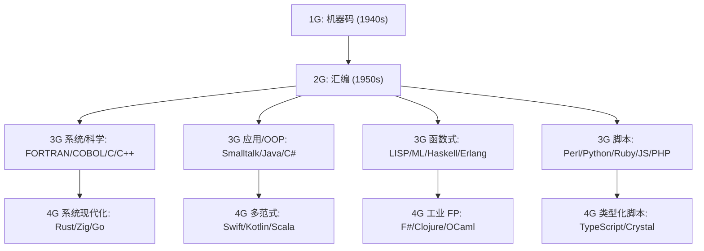
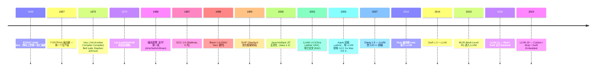
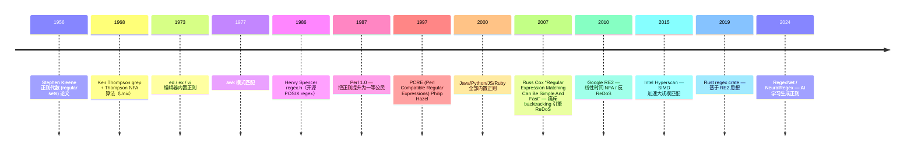
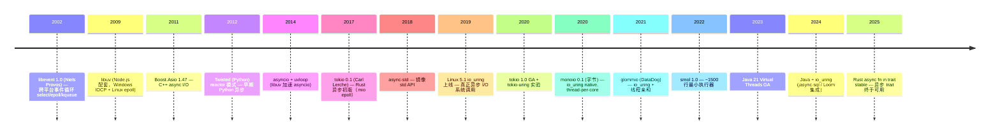

# 00-08 — 编程语言 + 编译原理演化史：从 FORTRAN 到 LLVM / JIT / Comptime

> **核心问题：** 编程语言为什么有这么多代？为什么 C 还活着，但 Pascal / Fortran 退场了？编译器是怎么从"手写 LR 表"演化到"LLVM 前后端架构"的？解释器、字节码、JIT、AOT、Comptime 这些到底是什么关系？
>
> **一句话答案：** 编程语言是"对人友好"和"对机器友好"之间的协调层。70 年间它从汇编→FORTRAN→C→ML→Java→Rust，**每一代都对应当时的硬件容量和工程规模**。编译器架构与语言演化平行——从单体 → Bison/Yacc → LLVM 前后端 → MLIR；编译形态从 AOT → 解释器 → 字节码 + JIT → Comptime metaprogramming。**理解这两条平行历史，才能理解为什么 Rust + LLVM 成了 2020s 的事实标准、Zig 选择 comptime 而不是 macros**。


---

## 1. 大框架：两条平行的演化时间线

```mermaid
timeline
    1957 : FORTRAN — 第一个高级语言
    1958 : LISP — 函数式 + 元编程鼻祖
    1959 : COBOL — 商业应用
    1964 : BASIC — 教学语言
    1970 : Pascal (Wirth) 设计 / Bell Labs B 语言
    1972 : C 语言 (Ritchie) + Smalltalk-72 (面向对象)
    1973 : ML (Robin Milner) — 类型推导
    1975 : Yacc (Stephen Johnson) / Lex (Lesk/Schmidt) — 编译器构造工具
    1983 : C++ (Bjarne Stroustrup) / Ada 83
    1984 : Common Lisp 推出（ANSI 标准 1994）
    1986 : 编译原理"龙书"第一版 (Aho/Sethi/Ullman)
    1987 : GCC 1.0 (RMS)
    1989 : C++ template 引入
    1990 : Haskell / Python 0.9 (1991-02)
    1995 : Java 1.0 / JavaScript / PHP / Ruby
    1998 : Stackless Python (Christian Tismer)
    2000 : Java HotSpot JIT 主流化
    2002 : C# 1.0 / Scala 设计开始
    2003 : LLVM 1.0 (Chris Lattner UIUC, 当时硕士)
    2005 : F# 公布 (Don Syme MS Research) / Lattner 加入 Apple
    2007 : Clojure (Rich Hickey)
    2009 : Go 公开 (Google)
    2010 : Rust 公开 (Graydon Hoare → Mozilla)
    2011 : Dart / Crystal
    2012 : TypeScript / C# 5.0 async/await (.NET 4.5) / Go 1.0
    2014 : Swift 1.0 公开 / Apple Swift
    2015 : Rust 1.0 (5 月) / Zig 0.1 (Andrew Kelley)
    2016 : Kotlin 1.0 (2 月)
    2017 : LLVM 5.0 / WebAssembly 1.0 标准
    2019 : MLIR 引入 LLVM / Rust 1.39 async/await stable
    2020 : Rust for Linux 提案
    2022 : Carbon (Google) 公布 / Mojo / Linux 6.1 接受 Rust (12 月)
    2023 : Java 21 Virtual Threads GA (Loom)
    2024 : LLVM 18 / Swift Embedded
```



**两条线必须分开看：**

1. **语言谱系**（FORTRAN → C → C++ → Java → Rust）— 应用工程师看的
2. **编译器架构**（手写 → Yacc → GCC → LLVM → MLIR）— 编译器工程师看的

它们紧密相关但并行。本笔记前半（§ 2-5）讲语言，后半（§ 6-9）讲编译。

---

## 2. 编程语言的诞生与早期分裂（1957-1972）

### 2.1 为什么需要"高级语言"

1950s 计算机靠汇编/机器码编程：
- 一位程序员一天只能写几十行指令
- 硬件升级 → 所有程序重写
- 复杂程序无法维护

**问题出现 → 解决方案：** 让程序员写"接近自然语言"的代码，由编译器翻成机器码。

### 2.2 1957 FORTRAN — 第一个高级语言

- John Backus（IBM）领导
- 设计目标：科学计算（physics、engineering）
- 关键创新：用编译器生成的代码**比手写汇编还快**（这是 1957 年最重要的事——证明高级语言不一定慢）
- **后果：** 高级语言可行；FORTRAN 主导科学计算到今天（HPC / 数值库底层仍 FORTRAN）

### 2.3 1958 LISP — 函数式 + 元编程鼻祖

- John McCarthy（MIT）
- 设计目标：AI 研究、符号计算
- 关键创新：**代码即数据**（程序自身可被程序操作）→ 元编程
- **后果：** Lisp 启发了 Smalltalk / Scheme / ML / Haskell / Clojure；现代很多 IDE 思想（autocomplete / refactor）来自 Lisp 环境

### 2.4 1972 C — 系统编程的胜利

- Dennis Ritchie（Bell Labs）
- 设计目标：写 Unix 的语言（不是为应用程序员设计的）
- 关键创新：**贴近硬件 + 抽象适度** — 指针、结构体、无 GC
- **后果：** C 几乎是所有后续语言的"汇编"——Linux / FreeBSD / Windows / macOS 内核都是 C；甚至 Rust / Zig 都需要 C ABI 兼容

### 2.5 1972 Smalltalk — 面向对象的起源

- Alan Kay（Xerox PARC）
- 设计目标：让小孩也能编程的"个人计算机"语言
- 关键创新：**一切皆对象**、消息传递、动态类型
- **后果：** 启发 Objective-C → iOS；启发 Java；启发 Python / Ruby；OOP 范式至今统治应用编程

### 2.6 1973 ML — 类型推导的起源

- Robin Milner（Edinburgh）
- 设计目标：定理证明的元语言（Meta-Language）
- 关键创新：**Hindley-Milner 类型推导**（写 `let x = 1` 不用写 `int x = 1`，编译器推断）
- **后果：** Haskell / OCaml / F# / Scala / Rust 全部继承 HM 类型推导；现代静态类型语言的"自动类型推导"都是它的孙子

---

## 3. 主流语言代际划分（1980s-2020s）



### 3.1 系统编程谱系（C → C++ → Rust / Zig / Go）

| 年份 | 语言 | 范式 | 特征 | 当前地位 |
|------|------|------|------|---------|
| 1972 | **C** | 过程式 | 手动内存 / 贴硬件 | 仍是 OS / 嵌入式王者 |
| 1983 | **C++** | OOP + 过程 + 模板 | 复杂、超大语言 | 浏览器 / 游戏 / 高性能 |
| 1991 | **Ada 95** | OOP + 强类型 + 实时 | 国防 / 航天 | 小众但仍活 |
| 2009 | **Go** | 过程 + GC + goroutine | 简单、并发友好 | 云原生 / 服务器 |
| 2015 | **Rust** | 系统 + 所有权 + 无 GC | 安全 + 高性能 | 内核 / 嵌入式 / 浏览器 |
| 2022 | **Carbon** | C++ 接班 | 还在设计 | 萌芽 |
| 2023 | **Mojo** | Python 兼容 + AI 加速 | AI 编程 | 萌芽 |

**关键转折：2015 年 Rust 1.0** —— 第一次真正"无 GC + 内存安全"的系统语言。**安全性是 Rust 的杀手锏**，让它进入 Linux 内核（2023）和 Chromium（2024）。


### 3.2 应用编程谱系（Java → C# → Kotlin / Swift）

| 年份 | 语言 | 范式 | 特征 |
|------|------|------|------|
| 1995 | **Java** | OOP + JVM + GC | 跨平台、企业 |
| 2000 | **C#** | OOP + CLR + GC | Windows 主力，后跨平台 |
| 2009 | **Scala** | OOP + FP | JVM / Spark |
| 2011 | **Kotlin** | OOP + FP + null safe | Android 官方语言 |
| 2014 | **Swift** | OOP + 协议 | iOS 取代 Objective-C |
| 2017 | **TypeScript** | 静态类型 JS | 主流 web 前端 |

**关键认知：JVM / CLR 平台跨语言生态化** — 一种 VM 上运行多种语言（Java / Scala / Kotlin / Clojure 共享 JVM；C# / F# / VB.NET 共享 CLR）。

### 3.3 脚本 / 动态语言（Python / JS / Ruby / Lua）

| 年份 | 语言 | 起源动机 |
|------|------|---------|
| 1990 | **Python** | Guido：教学友好、ABC 后继 |
| 1993 | **Lua** | 巴西 PUC-Rio：游戏 / 嵌入 |
| 1995 | **JavaScript** | Brendan Eich 10 天：Netscape 浏览器 |
| 1995 | **Ruby** | Matsumoto：让程序员快乐 |
| 1995 | **PHP** | Rasmus Lerdorf：服务器模板 |
| 2009 | **Node.js** | Ryan Dahl：JS 跑服务器 |

**关键趋势：脚本语言静态类型化** — TypeScript / Python type hints / Sorbet (Ruby) / Hack (PHP)。

### 3.4 函数式语言谱系

```
Lisp (1958) ─┬─ Scheme (1975) ─── Racket / Clojure (2007) JVM
             │
             ├─ Common Lisp (1984) — 工业 LISP
             │
             └─ ML (1973) ─┬─ SML (1990)
                           ├─ OCaml (1996) ── ReasonML / ReScript
                           ├─ F# (2005, .NET)
                           ├─ Haskell (1990) — 纯函数式 + 惰性
                           └─ Scala (2003, JVM)

Erlang (1986, Ericsson) — 分布式 + 软实时 ─── Elixir (2011)
```

函数式语言一直是"小众但深刻影响主流"——Rust 的 trait / Option / Result / pattern matching 全来自 Haskell / OCaml。

---

## 4. 语言谱系的横向对比（"为何这么多语言"）

### 4.1 设计权衡矩阵

| 维度 | C | Rust | Go | Zig | Java | Python | Haskell |
|------|---|------|----|----|------|--------|---------|
| 内存管理 | 手动 | 借用检查 | GC | 手动 | GC | GC | GC |
| 类型 | 静态弱 | 静态强 | 静态强 | 静态强 | 静态强 | 动态 | 静态强 |
| 元编程 | 宏 (textual) | macro | go generate | comptime | reflection | metaclasses | TH (TemplateHaskell) |
| 并发 | pthread | async + Send/Sync | goroutine | async (实验) | thread + Future | asyncio | STM/Software TM |
| GC 暂停 | N/A | N/A | 1ms | N/A | 10ms | 不暂停 (CPython) | 几 ms |
| 学习曲线 | 中 | 陡 | 平 | 中 | 中 | 平 | 陡 |
| 主战场 | OS / 嵌入式 | 系统 + 浏览器 | 服务器 / DevOps | 嵌入式 + 系统 | 企业 | AI / 数据 / 教学 | 学术 + 部分金融 |

### 4.2 几个永恒权衡

**(a) 安全 vs 控制：** Rust 站在"安全"一极（borrow checker 强制），C 站在"控制"一极（你想做什么都行）。Zig 寻找中间——比 C 安全，比 Rust 简单。

**(b) GC vs 手动：** Java/Go/Python 选 GC（开发效率），C/Rust/Zig 不要 GC（性能可预测、嵌入式可用）。

**(c) 静态 vs 动态类型：** TS/Rust 静态（IDE 帮你抓 bug），Python/JS 动态（写得快、错得快）。**主流回归静态类型**（TypeScript 火爆是证据）。

**(d) 元编程：textual macro vs hygienic macro vs comptime：**
- C 的 `#define` 是文本替换（textual）—— 危险但极简
- Rust / Lisp 的 macro 是 hygienic（语法层）—— 安全但语法复杂
- Zig 的 comptime 是**用语言自身**做编译时计算 —— 强大且统一


---

## 5. 为何这些语言活下来 / 那些死掉

### 5.1 还活着的（2026 仍主流）

```
C / C++ / Rust / Zig — 系统
Java / C# / Kotlin / Swift — 企业 + 移动
Python / JavaScript / TypeScript — 通用 + 前端
Go — 服务器
Haskell / OCaml / F# — 学术 / 金融 (小众)
```

### 5.2 衰落但未死（仍有 legacy 维护）

| 语言 | 当前状态 |
|------|---------|
| **Pascal / Delphi** | Embarcadero RAD Studio 还在卖 |
| **Visual Basic** | Microsoft 维护 .NET 上的 VB.NET |
| **Perl** | 有用户，但被 Python 抢市场 |
| **PHP** | 仍占 web 后端但份额下降 |
| **Erlang** | WhatsApp 等核心，但程序员少 |
| **Ada** | 国防 / 航天 |
| **COBOL** | 银行 mainframe（"COBOL 程序员稀缺"段子）|

### 5.3 死掉的

| 语言 | 死亡原因 |
|------|---------|
| **ALGOL** | 没有标准化和工业支持，被 Pascal/C 取代 |
| **PL/I** | IBM 设计但太复杂 |
| **APL** | 符号语言不通用，被 Python (numpy) 替代 |
| **Eiffel** | OOP 完美主义，工业拒绝 |
| **D 语言（早期）** | 后追 Rust 不及，找不到差异化 |
| **CoffeeScript** | TypeScript 后被遗忘 |
| **Dart 1.x** | Flutter 让 Dart 复活，但纯 web 已死 |

### 5.4 语言为什么"死"

总结模式：
1. **没有杀手级应用**（CoffeeScript 无锚定场景）
2. **被更好的方案取代**（CoffeeScript ← TypeScript / Pascal ← C）
3. **生态 + 包管理崩塌**（D 语言无包仓库）
4. **设计太理想主义**（Eiffel）
5. **被收购方关闭**（Sun Solaris 上的 Visual Java）

---

## 6. 编译器架构演化（从手写到 LLVM）



### 6.1 经典 monolithic 编译器（1957-2000）

老 GCC 是单体设计——前端 + 中间 + 后端紧耦合。问题：
- 加新语言要改全部（Pascal 上 GCC 困难）
- 加新硬件要重做优化器
- 难以共享工具

### 6.2 LLVM 革命（2003 至今）

Chris Lattner 在 UIUC 博士论文提出三件事：

1. **统一 IR (Intermediate Representation)** — LLVM IR 是 SSA-form 中间码，所有前端编译到同一种 IR
2. **前端 / 后端解耦** — 前端写一次（Clang for C, rustc for Rust），所有目标 CPU 自动支持
3. **库化 (library)** — 编译器作为库，可被 IDE / 调试器 / JIT 嵌入

**架构：**

```
源代码 (.c / .rs / .swift / .zig)
    │
    ▼
[ 前端 ]  Clang (C/C++) / rustc / swiftc / zig / flang ...
    │
    ▼  LLVM IR (.ll / .bc — 文本 / 二进制)
    │
[ 中间优化 ]  pass manager — 几百个 pass (constant folding, inline, vectorize, ...)
    │
    ▼
[ 后端 ]  llc — 选目标 (x86_64 / aarch64 / riscv64 / wasm32 / ...)
    │
    ▼
[ 目标代码 ]  汇编 / 目标文件 / 可执行
```

**LLVM 的胜利原因：**
- 模块化（前后端解耦）
- 工业级（Apple 投资 + Google 投资）
- 协议友好（Apache 2.0）
- 现代设计（IR 不背 C 历史包袱）

**LLVM 受益者：** Clang / rustc / swiftc / zig / flang / Mojo / Carbon / Crystal / Julia / Pony / Pure / V / Odin / WebAssembly toolchain ...

→ **2026 年 80% 的新语言以 LLVM 为后端**。这是事实标准。

### 6.3 GCC 仍存在的理由

- 历史 (Linux 默认 + 老 codebase 用 GCC)
- 一些目标 LLVM 不支持（旧嵌入式 ISA）
- License (GPL，某些项目偏好)

但**新项目几乎都选 LLVM**。

### 6.4 MLIR — LLVM 的下一代

2019 Google 在 LLVM 加 MLIR (Multi-Level IR)：
- 多层 IR（不只一种 IR）
- 适合 AI / DSL（TensorFlow / TPU / GPGPU）
- 让编译器更易扩展到非传统硬件

→ Mojo（2023）就是 MLIR-first 的语言。

### 6.5 编译器构造工具谱系

| 年份 | 工具 | 类型 | 主战场 |
|------|------|------|-------|
| 1976 | **Lex** | 词法生成器 | 老编译器 |
| 1975 | **Yacc** | LALR(1) 文法生成器 | 老编译器 |
| 1990 | **Bison** | GNU Yacc | GCC + 多数老项目 |
| 1990 | **Flex** | GNU Lex | 多数项目 |
| 1989 | **ANTLR** | LL(*) 文法生成器 | 现代多数项目 |
| 2004 | **PEG (Parsing Expression Grammar)** | 类型 PEG | 现代脚本语言 |
| 2008 | **PEG.js** | JS PEG | Web |
| 2010 | **Tree-sitter** | 增量解析 | IDE / GitHub |
| 现代 | **手写 recursive-descent parser** | 直接 C/Rust | rustc / Clang / Zig 自己写 |

**现代趋势：手写 recursive descent + LLVM** — 不再依赖 Yacc/ANTLR 等生成器。原因：
- 生成的代码难调试
- 自己写 parser 更灵活（错误恢复、IDE friendly）
- 现代 PC 性能足够（不像 1970s 必须 LR(1)）

### 6.6 形式语言层级 + 正则表达式（编译原理基础）

> **核心认知：正则表达式 = 正则文法 = Chomsky 层级最低一级 = 编译器 lexer 的数学基础**。

#### 6.6.1 Chomsky 文法层级（1956）

Noam Chomsky 1956 论文 *Three Models for the Description of Language* 提出 4 级：

| 级别 | 文法类型 | 接受机 | 表达力 | 例子 |
|------|---------|--------|-------|------|
| **Type-0** | 无限制（任意 production） | Turing Machine | 任意可计算 | 编程语言完全语义 |
| **Type-1** | 上下文相关（context-sensitive）| Linear Bounded Automaton | 自然语言 | aⁿbⁿcⁿ |
| **Type-2** | 上下文无关（CFG）| Pushdown Automaton（栈）| 大部分编程语言语法 | aⁿbⁿ / 嵌套括号 |
| **Type-3** | 正则（regular）| **Finite Automaton（FA）** | 模式匹配 | a* / [0-9]+ |

**关键洞察：** 编译器的 **lexer（词法分析）= 正则文法 + DFA**；**parser（语法分析）= CFG + 下推自动机**。

#### 6.6.2 正则表达式实现演化



#### 6.6.3 两大引擎流派

| 流派 | 算法 | 特点 | 实现 |
|------|------|------|------|
| **Thompson NFA / DFA** | 编译为 FA，线性时间 O(n) | 无 backref / lookahead，但快且安全 | grep / awk / **RE2 / Hyperscan / Rust regex** |
| **Backtracking** | 递归回溯 | 支持 backref / lookahead，但最坏 O(2ⁿ) ReDoS | Perl / PCRE / **Python re / JS / Java** |

**ReDoS 攻击（2010s 频发）：** 用户输入精心构造的 `(a+)+b` 类正则，让 backtracking 引擎卡死。CloudFlare 2019 全球宕机就是因为一条正则 ReDoS。**RE2 / Rust regex 不受影响**——这是 Russ Cox 2007 论文的现实意义。

#### 6.6.4 正则表达式语法谱系

| 方言 | 来源 | 关键差异 |
|------|------|---------|
| **POSIX BRE** | grep/sed 默认 | `\(...\)` `\+` 等需转义 |
| **POSIX ERE** | egrep/awk | `(...)` `+` 直接用 |
| **PCRE** | Perl + libpcre | 最丰富（lookahead/lookbehind/named group/recursion）|
| **JS RegExp** | ECMAScript | 接近 PCRE 但少几个特性 |
| **Python re** | CPython | PCRE 子集 + verbose mode |
| **RE2** | Google | 删除 backref / lookahead 换线性时间 |

#### 6.6.5 与编译器的具体连接

```
源代码 "let x = 1 + 2;"
    │
    ▼  Lexer（用正则 / DFA 实现）
[Token(let), Token(ident "x"), Token(=), Token(num "1"), Token(+), Token(num "2"), Token(;)]
    │
    ▼  Parser（CFG / 下推自动机）
AST: Let(name=x, value=Add(1, 2))
    │
    ▼  Codegen
机器码
```

**经典例子：C 语言 lexer 的正则表达式：**
- 标识符：`[a-zA-Z_][a-zA-Z0-9_]*`
- 整型字面量：`0[xX][0-9a-fA-F]+|0[0-7]*|[1-9][0-9]*`
- 浮点字面量：`[0-9]+\.[0-9]+([eE][+-]?[0-9]+)?`
- 字符串字面量：`"([^"\\]|\\.)*"`

**Lex/Flex 直接吃这种正则**，生成 C 代码 DFA → 编译进 lexer。

#### 6.6.6 正则的应用全谱（不止编译器）

| 场景 | 用法 |
|------|------|
| **编译器 lexer** | 源码 → tokens |
| **grep / ripgrep / ack** | 文本搜索 |
| **sed / awk** | 流文本编辑 |
| **vim / VSCode 查找替换** | 编辑器 |
| **Web 表单验证** | email / 手机号 / URL |
| **日志分析** | nginx access.log → 字段提取 |
| **WAF / IDS** | Snort / Suricata 规则匹配 |
| **蛋白质序列匹配** | 生物信息学 PROSITE |
| **配置文件 grammar** | INI / YAML 子集 |

#### 6.6.7 正则文法的局限

正则文法**不能匹配嵌套结构**——HTML / JSON / 编程语言括号要用 CFG。

经典段子："Don't parse HTML with regex" — Stack Overflow 上一个传奇答案，因为 HTML 不是正则文法。

→ **Lexer 用正则，Parser 用 CFG。这是编译器构造的分工铁律**。

#### 6.6.8 三视角速懂："正则 = 文法 = Chomsky 最低 = lexer 数学基础"

> 这句话精炼概括了正则的理论地位与工程应用 —— **4 个概念描述同一件事，从 4 个角度看**：

| 概念 | 角度 | 一句话 |
|------|------|--------|
| **正则表达式** | 用户记号 | 你写的 `[a-z]+@\w+\.com` |
| **正则文法** | 数学生成 | 产生式规则 `S → aS \| b`（右线性 / 左线性）|
| **Chomsky 3 型** | 能力分类 | 4 层级的最底层（最弱）|
| **lexer 数学基础** | 工程实现 | 编译器词法分析的理论根 |

4 者**计算能力完全等价**（同属"正则语言"集合），但视角不同。

##### 三视角对比表

| 视角 | 正则表达式 | 正则文法 | Chomsky 层级 | lexer |
|------|-----------|---------|-------------|-------|
| **用户** | 最高级（直接书写）| 看不见 | 决定能力天花板（看不见，但限制了正则不能匹配嵌套括号）| 间接受益（IDE 高亮 / grep）|
| **代码** | 调库 `re.compile(...)`| 不直接写 | 决策框架（简单词法→正则 / 嵌套→Parser+CFG）| Lex/Flex 工具生成 / 手写 DFA 循环 |
| **状态机/文法** | 等价 FA（描述）| 等价 FA（生成）| 定义边界（FA + 0 额外内存）| FA 优化实现（DFA 状态压表）|

##### 弱能力 = 强保障（关键洞察）

正则在 Chomsky 层级**最弱** —— 但这"弱"反而是 lexer 的优势：

| 限制 | 优势 |
|------|------|
| 0 额外内存 | DFA 纯状态跳转，无栈、无回溯 |
| 线性时间 O(n) | 字符流扫一遍即可 |
| 空间 O(1) | 状态压成查表 |
| 无嵌套能力 | 把嵌套问题甩给 Parser |

**编译器分工铁律：** Lexer 用 3 型正则（最弱最快，切 token）+ Parser 用 2 型 CFG（更强需栈，建语法树）。

##### Chomsky 4 层级的实现底座

| 层级 | 文法类型 | 识别机 | 额外内存 |
|------|---------|--------|---------|
| **0 型** | 无限制 | 图灵机 | 无限磁带 |
| **1 型** | 上下文有关 | 线性有界自动机 | 输入长度的有限磁带 |
| **2 型** | 上下文无关（CFG）| 下推自动机（PDA）| ⭐ **栈** |
| **3 型** | 正则 | 有限自动机（FA）| ⭐ **0** |

→ **3 型 → 2 型 的本质跳跃 = 加一个栈**（解锁嵌套能力）。

##### 工程实现链（Lex/Flex 内部做的事）

```
正则表达式（用户写）
   ↓ 编译
NFA（非确定有限自动机，可能多状态同时活跃）
   ↓ 子集构造
DFA（确定有限自动机，每输入 1 字符精确 1 状态）
   ↓ 状态最小化
Min-DFA（最少状态版）
   ↓ 转表
状态转换表（一维数组 / 二维 [state][char]）
   ↓ 驱动
DFA 引擎运行时（while 循环 + 查表）
```

##### 一句话钉死

> 你写的每个正则模式，**数学本质 = Chomsky 层级最低的正则文法 = 等价于一个无栈无回溯线性扫描的有限自动机** —— 这"弱能力"恰好是 lexer 高效的原因。

### 6.7 上下文无关文法（CFG）+ BNF / EBNF / ABNF / PEG（2026-05-10 加，task #41 融入）

> **核心认知：BNF/EBNF/ABNF/PEG 都是描述编程语言语法的"元语法"** —— 它们本身不是编程语言，而是描述编程语言的形式化语言。CFG（Chomsky Type-2）是数学概念，BNF 等是 CFG 的具体写法。

#### 6.7.1 BNF（Backus-Naur Form）—— ALGOL 60 报告的礼物（1959）

**起源：** John Backus（FORTRAN 之父）为 ALGOL 58 起草元语法（1959）；Peter Naur 整理为 ALGOL 60 报告（1960）；ALGOL 60 后被命名 BNF。**它是计算机科学第一个工业级形式化语法描述语言**。

**典型 BNF：**
```
<assignment> ::= <variable> "=" <expression>
<variable>   ::= <letter> | <variable> <letter> | <variable> <digit>
<expression> ::= <term> | <expression> "+" <term> | <expression> "-" <term>
<term>       ::= <factor> | <term> "*" <factor> | <term> "/" <factor>
<factor>     ::= <number> | <variable> | "(" <expression> ")"
```

**4 个核心元符号：**
- `<...>` 非终结符（可继续展开）
- `::=` 定义为
- `|` 或
- `"..."` / `'...'` 终结符（实际字符）

**设计哲学：** "递归 + 选择" 即可描述任意 CFG。

#### 6.7.2 EBNF（Extended BNF）—— Wirth 1977 / ISO 14977

**起源：** Niklaus Wirth（Pascal / Modula / Oberon 之父）1977 提出，1996 ISO 14977 标准化。

**扩展（核心 5 项）：**
- `[...]` optional（0 或 1 次）
- `{...}` repetition（0 或多次）
- `(...)` group
- `|` alternation
- `,` concatenation（显式）

**EBNF 例：**
```
assignment = variable, "=", expression ;
variable   = letter, { letter | digit } ;
expression = term, { ("+" | "-"), term } ;
term       = factor, { ("*" | "/"), factor } ;
factor     = number | variable | "(", expression, ")" ;
```

**与 BNF 对比：** 同样的语法，EBNF 更紧凑（用 `{...}` 替代左递归）。**编程语言书 / 标准文档 / RFC 几乎都用 EBNF**（不写"裸" BNF）。


#### 6.7.3 ABNF（Augmented BNF）—— RFC 5234（IETF 标准）

**起源：** IETF 互联网协议标准用的元语法（RFC 5234，2008，更早 RFC 822 用过）。

**特征：**
- 内置 ASCII / 数字字符规则（`%x41` = 'A'）
- 重复用前缀 `n*m`（n 到 m 次）
- 没有 EBNF 的 `{...}` `[...]`

**ABNF 例（HTTP/1.1 RFC 7230 摘）：**
```
HTTP-message  = start-line *( header-field CRLF ) CRLF [ message-body ]
start-line    = request-line / status-line
request-line  = method SP request-target SP HTTP-version CRLF
header-field  = field-name ":" OWS field-value OWS
```

**用途：** 几乎所有 IETF RFC（HTTP / SMTP / IMAP / DNS / TLS / WebSocket / ...）都用 ABNF 描述协议语法。

#### 6.7.4 PEG（Parsing Expression Grammar）—— Bryan Ford 2004

**起源：** MIT Bryan Ford 2004 论文 *Parsing Expression Grammars: A Recognition-Based Syntactic Foundation*。

**与 CFG/BNF 的核心差异：**

| | CFG / BNF | PEG |
|--|----------|-----|
| 选择 | `\|` 是非确定（无序）| `/` 是有序（先匹配先赢）|
| 歧义 | 可能歧义需 disambiguate | **永不歧义** |
| 算法 | LR/LALR/LL 等多种 | Packrat（线性时间）|
| 无限前瞻 | 不支持 | `&` `!` 支持 |

**PEG 例：**
```
Expression  <- Term (("+" / "-") Term)*
Term        <- Factor (("*" / "/") Factor)*
Factor      <- Number / "(" Expression ")"
Number      <- [0-9]+
```

**实施工具：**
- **PEG.js** / **peggy.js** —— JavaScript
- **pest**（Rust）—— `*.pest` 文件 + macro
- **lpeg**（Lua）—— 嵌入 Lua
- **PyPEG / parsimonious** —— Python
- **TatSu** —— Python EBNF + PEG 混合

**优势：** 写编译器 / DSL parser 比 CFG 更直观（无 left-recursion 痛苦 / 无 dangling-else 歧义）。

**用途：** Python 3.9+ parser 用 PEG（取代 LL(1) 旧 parser）；Lua LPeg；Rust pest；GitHub semantic 分析。

#### 6.7.5 Parser Generator 工具谱系

| 工具 | 语言 | 算法 | 元语法 | 状态 |
|------|------|------|--------|------|
| **Yacc** (1975) | C | LALR(1) | BNF-like | Unix 经典 |
| **Bison** (1985, GNU) | C/C++ | LALR(1) / GLR | BNF-like | Yacc 后裔 + 主流 |
| **lex/flex** | C | NFA→DFA | regex | 配 yacc/bison |
| **ANTLR** (1989, Terence Parr) | Java/C++/Python/Go/JS/Swift | LL(*) → ALL(*) | BNF-like + 谓词 | 工业 |
| **Tree-sitter** (2018, GitHub) | C + DSL | GLR + 增量 | JavaScript DSL | 主流编辑器 syntax 高亮 |
| **nom**（Rust） | Rust | parser combinator | Rust trait | 嵌入式协议解析主流 |
| **chumsky**（Rust） | Rust | parser combinator + Pratt | Rust DSL | 现代 Rust DSL 推荐 |
| **lalrpop**（Rust） | Rust | LALR(1) | DSL | rustc 风格 |
| **PEG.js / peggy** | JS | Packrat | PEG DSL | Web |
| **PEST**（Rust） | Rust | Packrat | PEG DSL | Rust DSL |
| **menhir**（OCaml） | OCaml | LR(1) | BNF-like | OCaml 编译器内 |
| **happy**（Haskell） | Haskell | LR(1) | BNF-like | GHC 用 |

#### 6.7.6 主流编程语言文法描述

| 语言 | 元语法 | 文档位置 |
|------|--------|---------|
| **C** (ISO C23) | BNF | ISO 9899:2024 Annex A |
| **C++** (ISO C++23) | BNF（ISO 风）| ISO/IEC 14882:2024 Appendix A |
| **Java** (JLS 21) | BNF | Java Language Spec Ch.19 |
| **Python** (3.12+) | **PEG**（3.9 起） | `Grammar/python.gram` 仓库内 |
| **Rust** (2024) | EBNF + 注解 | rust reference + 不正式 spec |
| **Zig** (0.16+) | PEG | `doc/langref.html.in` 内嵌 |
| **Go** (1.22) | EBNF | spec.html § 词法 / 句法 |
| **JavaScript** (ES2024) | BNF + 引用 | ECMA-262 Annex A |
| **Lua** (5.4) | BNF | manual.html § 9 |
| **Haskell** (2010) | BNF | report-2010 |


#### 6.7.7 元语法的层级关系

```
┌─ Chomsky 文法层级（理论）─────────────┐
│  Type-3 正则文法 → DFA / NFA          │
│  Type-2 上下文无关文法 (CFG) → PDA   │
│  Type-1 上下文相关文法 → LBA          │
│  Type-0 无限制文法 → TM               │
└──────────┬───────────────────────────┘
           │
   ┌───────┴────────┐
   ▼                ▼
正则表达式（regex） CFG 描述工具
（§6.6 已讲）       (§6.7 本节)
                        │
        ┌───────────────┼──────────────┐
        ▼               ▼              ▼
    BNF (1959)    EBNF (1977)     ABNF (RFC 5234)
                      │                │
                      ▼                ▼
                  Yacc/ANTLR       IETF RFC 协议
                                       │
        ┌──────────────────────────────┘
        ▼
      PEG（CFG 子集 + 有序 + 无歧义）
        │
        ▼
   pest / nom / Python 3.9+
```

---

## 7. 编译形态：AOT / 解释器 / 字节码 + JIT / Comptime

理解"代码如何变成能跑的"必须理解四种执行模式。

### 7.1 AOT（Ahead-of-Time）—— 编译到机器码

```
源码 → 编译器 → 机器码 → 执行
```

例：C / C++ / Rust / Zig / Swift / Go

**优点：** 启动快、性能可预测、不需要运行时
**缺点：** 编译时间长、产物绑定 CPU 架构

### 7.2 解释器（Interpreter）—— 直接执行 AST 或字节码

```
源码 → 解析器 → AST → 解释器逐句执行
```

例：早期 Python / Bash / R

**优点：** 即时反馈、易调试、跨平台
**缺点：** 性能差（每次都解析）

### 7.3 字节码 + 虚拟机（Bytecode + VM）—— 中间方案

```
源码 → 编译器 → 字节码 → VM 执行
```

例：Java (JVM) / C# (.NET CLR) / Python (CPython 字节码) / Lua / Erlang BEAM

**优点：** 编译一次到字节码，多平台运行
**缺点：** 运行时性能不如 AOT，启动比解释器慢

### 7.4 JIT（Just-in-Time）—— 运行时编译热路径

```
源码 → 字节码 → VM 跑 + JIT 把热代码编译到机器码
```

例：Java HotSpot / V8 (JavaScript) / LuaJIT / .NET CoreCLR / PyPy

**优点：** 启动比 AOT 快、热路径性能逼近 AOT、支持运行时反射
**缺点：** 内存占用大、首次执行慢（warmup）

**JIT 的革命：1999 Java HotSpot** —— 第一次让"VM 语言"性能赶上 C++（在某些场景）。后来 V8 让 JS 引擎成为浏览器最复杂的软件。

### 7.5 Comptime（编译时计算）—— Zig 的杀手锏

```
源码（含 comptime 块）→ 编译器执行 comptime 块 → 生成专门化代码 → 编译到机器码
```

例：Zig / Rust const fn（部分）/ C++ constexpr / Lisp macro

**优点：**
- **零运行时开销**（计算在编译期完成）
- **类型驱动元编程**（用类型本身作参数）
- **简化 C 宏**（不再需要 `#define`）


### 7.6 五种形态对比

| 形态 | 启动 | 运行时性能 | 跨平台 | 内存 | 代表 |
|------|------|----------|--------|------|------|
| AOT | ⭐⭐⭐⭐⭐ | ⭐⭐⭐⭐⭐ | ❌ (per arch) | ⭐⭐⭐⭐⭐ | C / Rust / Zig |
| 解释器 | ⭐⭐⭐⭐⭐ | ⭐ | ⭐⭐⭐⭐⭐ | ⭐⭐⭐⭐ | Bash / 早期 Python |
| 字节码 + VM | ⭐⭐⭐ | ⭐⭐⭐ | ⭐⭐⭐⭐⭐ | ⭐⭐⭐ | Python / Lua |
| JIT | ⭐⭐ | ⭐⭐⭐⭐ | ⭐⭐⭐⭐⭐ | ⭐⭐ | Java / V8 |
| Comptime | ⭐⭐⭐⭐ | ⭐⭐⭐⭐⭐ | ❌ (per arch) | ⭐⭐⭐⭐⭐ | Zig / C++ template |

---

## 8. 编译时计算 / 元编程演化

```
1963 LISP macro (defmacro 等) — 第一个元编程系统（代码即数据）
1972 C #define — 文本宏
1989 C++ template 引入（Turing 完备 1994 年才被发现）
2007 D 语言 mixin / static if — 系统语言元编程改进
2011 C++11 constexpr — 限定子集的编译期函数
2015 Rust 1.0 macro_rules! — hygienic macro
2017 Zig comptime 进入主线 — 用语言自身做编译时
2020 Rust 1.46 const fn 大幅扩展 — 扩展 constexpr 思路
2023 Zig 0.11 builtin reflection — @typeInfo / @hasField / @hasDecl
```

**演化方向：从"特殊语法"到"用语言自身"。**

C 的 `#define` 是另一套语言（textual replacement），易出错。
C++ template 是另一套语言（functional + Turing complete）。
Lisp macro 是同一套语言（同形 syntax）—— 这是 Lisp 的天然优势。
Zig comptime 也是同一套语言（直接用 `const x = comptime expensiveCalc()`）—— 借鉴 Lisp 思想到系统语言。


```zig
const MySbi = sbi.Sbi(.{
    .version = SBI_SPEC_VER,
    .Platform = platform,
    .enable_dbcn = build_options.enable_dbcn orelse base.enable_dbcn,
});
// MySbi 是 zero-sized type，dispatch 是 comptime switch
// 没用的扩展整个 arm 在编译时被消除
const ret = MySbi.dispatch(eid, fid, args);
```

→ 用一种语法在编译期 + 运行时统一表达。这是 Zig 的核心吸引力。

---

## 9. 协程 / 异步并发模型演化史

> **核心问题：** "线程太重，回调太丑，async 满天飞" —— 这一切是怎么演化来的？为什么 Go 选有栈、Rust 选无栈、Zig 走了第三条路？
>
> **一句话答案：** 并发模型的演化是从"OS 提供线程"到"语言/运行时提供轻量任务"的历史。每一代解决前一代的痛点：线程太重 → 协程；回调地狱 → Promise；Promise 嵌套 → async/await；async 函数染色 → 有栈协程 / Zig 颜色无关方案。

### 9.1 概念时间线（67 年并发演化）

```mermaid
timeline
    1958 : Melvin Conway 论文首次提出 coroutine 概念（汇编实现）
    1962 : Simula I 协程（OOP + 协程同源；Simula 67 是 1967）
    1968 : Knuth《TAOCP》卷 1 第一版详解 coroutine
    1979 : UNIX V7 setjmp/longjmp 标准化（C 实现协程的基础原语）
    1986 : Erlang 设计起步（爱立信 Joe Armstrong）
    1992 : Erlang BEAM VM — 内置 actor + 软实时调度，"百万绿色进程"
    1993 : Lua 1.0（2003 Lua 5.0 加 coroutine.create — 现代脚本协程典范）
    1996 : Windows NT 3.51 SP3 引入 Fiber API（用户态有栈协程）
    1998 : Stackless Python (Christian Tismer)
    2001 : Python 2.2 generator (PEP 255) — yield 关键字 / POSIX.1 makecontext
    2005 : C# 2.0 yield return / Python 2.6 PEP 342 generator 双向通信
    2009 : Go 公开 (Google) — goroutine + channel（CSP 模型实战）
    2009 : Node.js 0.1 — libuv + 单线程事件循环
    2010 : C# async/await CTP（Concurrency CTP）
    2012 : C# 5.0 (.NET 4.5) 发布 async/await — 首个语言级 async/await
    2012 : Go 1.0 GA (3 月)
    2014 : Python 3.4 asyncio + @coroutine 装饰器 (PEP 3156)
    2015 : Python 3.5 async/await 关键字 (PEP 492)
    2016 : Kotlin 1.0（coroutines 实验性）/ Rust async/await 早期讨论
    2017 : tokio 0.1 (Carl Lerche)
    2018 : Kotlin 1.3 coroutines stable / Rust async/await RFC 2394
    2019 : Rust 1.39 async/await stable / Linux io_uring (5.1)
    2020 : tokio 1.0 GA (12 月)
    2020 : Zig 0.7 — async/await 实验性 (后期 0.11+ 移除)
    2021 : monoio 0.0.1 (字节, io_uring)
    2022 : Loom JEP 425 — JVM 虚拟线程预览 (Java 19)
    2023 : Java 21 Virtual Threads GA（有栈协程 OS 线程级 API）
    2024 : Zig 0.13 — async 已移除等 IO 重设计 / monoio 1.0
    2025 : Zig 0.15 async I/O 设计草案 std.Io 接口
    2026 : Rust async fn in trait 稳定持续推进 / Java 21 LTS 普及
```



### 9.2 第一阶段：协程的史前史（1958-1990）

**Conway 1958** 论文 *"Design of a Separable Transition-Diagram Compiler"* 第一次定义 coroutine：**两个 routine 互相 yield，对称对等**（不同于 caller/callee 不对称）。

**Knuth 1965**《计算机程序设计艺术》卷 1 把 coroutine 收入正典，给出汇编级实现（保存恢复 PC + SP）。

**Simula-67**（OOP 鼻祖语言）的 `class` 同时也是 coroutine —— OOP 与协程在同一个语言里同源诞生，后来才被 OOP 主流（Smalltalk/Java）抛弃了协程语义。

**C 的 setjmp/longjmp（1973）+ POSIX ucontext（1999）** 提供"非局部跳转"原语，是用 C 实现用户态协程的基础。Lua / Python / Ruby 早期都基于 ucontext。

```c
// 协程的本质：保存/恢复执行上下文（PC + SP + 寄存器）
ucontext_t ctx_main, ctx_co;
makecontext(&ctx_co, co_func, 0);
swapcontext(&ctx_main, &ctx_co);  // 切到 co_func，main 挂起
// co_func 内部 swapcontext(&ctx_co, &ctx_main) 切回
```

**Windows Fiber API（1996）** 把 ucontext 思想 OS 化 —— `CreateFiber / SwitchToFiber`，第一次把"有栈用户态协程"做成标准 OS API。

### 9.3 第二阶段：脚本语言带火协程（1993-2010）

**Lua coroutine（2003）** —— 现代脚本协程的范本。极简 4 个 API：

```lua
co = coroutine.create(function() ... coroutine.yield(v) ... end)
ok, val = coroutine.resume(co)
coroutine.status(co)  -- suspended / running / dead
coroutine.wrap(f)     -- 返回普通函数，自动 resume
```

特点：**对称协程 + 单线程**，无抢占，确定性。游戏脚本的标配（魔兽世界、星际 2、Roblox）。

**Python generator（2001 PEP 255）→ 协程（2005 PEP 342）→ asyncio（2014 PEP 3156）**：

```python
# 2001 generator：单向 yield
def gen():
    yield 1
    yield 2

# 2005 enhanced generator：双向 send/yield，构成"协程"
def co():
    x = yield 1   # yield 既输出 1 也接收 send 的值
    print(x)

# 2014 asyncio + 2015 async/await
async def fetch():
    data = await aiohttp.get(url)
    return data
```

Python 走了"generator → @asyncio.coroutine → async/await 关键字"三步。是**渐进改造**的典型，代价是历史包袱（asyncio API 复杂）。

**JavaScript Promise（2009 → 2012 jQuery → 2015 ES6）→ async/await（2017 ES8）**：

```javascript
// 2010s 早期：回调地狱
fs.readFile(a, (e, dataA) => {
  fs.readFile(b, (e, dataB) => {
    fs.readFile(c, (e, dataC) => {
      // ...
    });
  });
});

// 2015 Promise — 链式
fs.promises.readFile(a)
  .then(dataA => fs.promises.readFile(b))
  .then(dataB => /*...*/);

// 2017 async/await — 像同步代码
async function main() {
  const a = await fs.promises.readFile(a);
  const b = await fs.promises.readFile(b);
}
```

Node.js / 浏览器都是**单线程事件循环**（libuv / V8 microtask queue），async/await 是 Promise 的语法糖。

### 9.4 第三阶段：Go 与 Erlang 的"百万协程"（1986-2010）

**Erlang BEAM（1986）** 第一次把"轻量进程 + 消息传递"做工业级。每个进程几百字节栈、独立堆、抢占式调度，单机几百万进程。**爱立信电话交换机：99.9999999%（9 个 9）可用性**。

**Go goroutine（2009）** 把 BEAM 思想搬到系统语言：

```go
go func() {           // 启动一个 goroutine（初始栈 2KB，动态增长）
    msg := <-ch       // CSP channel 通信
    fmt.Println(msg)
}()
```

特征：
- **有栈协程**（segmented stack 1.4 → contiguous growable stack 1.5+）
- **M:N 调度**（GOMAXPROCS 个 OS 线程上跑 N 个 goroutine）
- **协作 + 部分抢占**（1.14+ 基于信号的真抢占）
- **CSP**（Communicating Sequential Processes）模型 — Tony Hoare 1978

Go 是"协程 + 通信 + GC"组合的代表，让 web 服务器编程范式被云原生（k8s/Docker）固化。

### 9.5 第四阶段：async/await 全面化（2012-2020）

**C# 5.0（2012）** 是第一个**语言级 async/await** —— 把 `async` 函数编译为状态机：

```csharp
async Task<int> Fetch() {
    var data = await httpClient.GetAsync(url);  // 编译器改写为延续传递
    return data.Length;
}
// 编译后 ≈ 状态机：每个 await 是一个状态切换点
```

**核心创新：编译器改写** —— 不需要 OS / 运行时支持，async 函数变成"返回 Task 的状态机"。这是后续 Python / Rust / Kotlin / TypeScript 的范本。

**Rust async/await（2019 stable）** 借鉴 C# 范式，但走得更远：

```rust
async fn fetch() -> Result<Vec<u8>, Error> {
    let resp = client.get(url).await?;
    Ok(resp.bytes().await?.to_vec())
}
// 编译为 impl Future<Output = ...> 的匿名状态机，零运行时开销
```

特点：
- **零成本抽象** — async fn 编译为零分配状态机（与手写状态机一样高效）
- **运行时分离** — 语言只定义 `Future` trait，调度器是库（tokio / async-std / smol / monoio）
- **无栈协程**（stackless coroutine）— Future 本身就是状态机数据结构，没有独立栈

Rust 选无栈是为了：① 嵌入式可用（无栈不占 RAM）② 零分配（栈分配在父 Future 内）③ 与 borrow checker 兼容。

### 9.6 第五阶段：函数颜色之争与 Zig 的探索（2020-）

**问题："函数颜色"（What Color is Your Function, Bob Nystrom 2015）**：

`async fn` 与普通 `fn` 是**两种颜色** —— async 函数只能在 async 上下文调用，普通函数无法直接 `await` 异步函数。结果：库要写两份（sync 版 + async 版），生态分裂。

```rust
fn read_sync(path: &str) -> String { ... }
async fn read_async(path: &str) -> String { ... }
// 上层 async fn 用 .await，sync fn 用直接调用，两条平行生态
```

**Go / Java Loom 路线：有栈协程 + 颜色无关**

Go 的 goroutine 没有 `async` 关键字，所有函数都能在 goroutine 里跑，I/O 自动 yield。**代价是必须有运行时 + 栈复制 + GC**。

**Java Virtual Threads (Loom, JEP 444, Java 21 GA, 2023)** 把 goroutine 思想塞进 JVM：

```java
// 普通线程代码，但跑在虚拟线程上 — 颜色无关，无需 async
Thread.startVirtualThread(() -> {
    var resp = httpClient.send(req);  // 阻塞，但虚拟线程会 unmount
    System.out.println(resp.body());
});
```

JVM 的字节码改写 + ForkJoinPool 调度器，让"看起来像阻塞 I/O 的代码"实际上是协程。

**Zig 的尝试：colorblind async（2020-2024 → 重设计中）**

Andrew Kelley 2020 提出："async 函数与普通函数应该用同一个调用语法"：

```zig
// 假设 readFile 是 async fn
const data = readFile(path);  // 同步上下文：阻塞等待
const data = await async readFile(path);  // 异步上下文：suspend
```

实现思路：编译器生成两份 —— 同步版（顺序执行）+ 异步版（状态机）。问题：① 实现复杂 ② 与 LLVM coroutine intrinsic 集成困难。

**2024 Zig 0.13 移除 stage1 async**，等待 I/O 系统重设计后再回归。**Andrew Kelley 2025 设计草案**：用 `std.Io` 接口抽象，调用者传入 `Io` 实例决定是阻塞还是 async（**显式依赖注入式异步**）。

### 9.7 各语言协程/异步实现横向对比

| 语言 | 模型 | 调度 | 颜色 | 栈 | 运行时 | 代表用例 |
|------|------|------|------|-----|--------|---------|
| **Erlang** | actor | 抢占 BEAM | 无色 | 微栈每进程 | BEAM VM | 电话交换机 / WhatsApp |
| **Go** | CSP | 协作 + 信号抢占 | 无色 | 可增长栈 | Go runtime + GC | k8s / Docker / 云原生 |
| **Java (Loom)** | 虚拟线程 | 协作 unmount | 无色 | 堆上栈帧链 | JVM + JIT | 企业 web |
| **C# async** | 状态机 | 任务调度器 | 染色 | 无栈 | .NET Task | Windows / web |
| **Rust async** | 状态机 Future | 由 runtime 决定 | 染色 | 无栈 | tokio / monoio | 嵌入式 / 浏览器 |
| **Python asyncio** | 状态机 + generator | event loop | 染色 | 无栈 | asyncio / uvloop | 后端 / 爬虫 |
| **JS / Node.js** | Promise + microtask | libuv event loop | 染色 | 无栈 | V8 + libuv | web 前后端 |
| **Kotlin coroutines** | suspend continuation | Dispatchers | 染色 (suspend) | 无栈 (CPS) | kotlinx.coroutines | Android |
| **Lua coroutine** | 对称协程 | 协作 | 无色 | 有栈 | Lua VM | 游戏 |
| **Zig (历史)** | colorblind 状态机 | 任 frame | 无色 | 无栈 | 用户提供 | (实验) |
| **Zig (未来)** | std.Io 注入 | runtime 决定 | 无色 | 栈/无栈可选 | 用户提供 | (设计中) |

**两条路线总结：**

| 维度 | 有栈（goroutine / Loom / Lua） | 无栈（Rust async / C# Task） |
|------|------------------------------|---------------------------|
| 调用语法 | 普通函数调用 | 必须 `await` |
| 颜色 | 无色 | 染色 |
| 内存 | 每协程独立栈 (KB-MB) | 状态机 (字节级) |
| 嵌入式 | ❌ (栈占内存) | ✅ |
| GC 友好 | 需要 GC / runtime | ✅ 零运行时 |
| 调试 | 看到普通栈 | async 栈不直观 |
| 生态分裂 | ❌ 不分裂 | ✅ sync/async 两份 |
| 性能（JIT） | 相当 | 略高 (状态机扁平) |

### 9.8 协程的底层：上下文切换四种实现

不论哪种语言，"协程切换"最终都落到 4 种实现之一：

1. **汇编手写 context switch**（最快，无依赖）
   - `corosensei` (Rust) / `zigcoro` (Zig) / Go runtime / Lua

2. **POSIX ucontext / Windows Fiber**（API 标准但慢，glibc 实现差）
   - Boost.Coroutine 早期 / Lua 早期

3. **setjmp/longjmp + 栈复制**（兼容性最好，性能差）
   - Stackless Python / 部分嵌入式 RTOS

4. **CPS / 状态机改写**（编译器变换，无独立栈）
   - C# Task / Rust Future / Kotlin suspend / JS async

**详细原理：** 见 [01-06-zig-async](01-06-zig-async.md) 第 8 节，含 RISC-V/x86 汇编 context switch 完整实现。

### 9.9 异步运行时演化（Runtime 层）

语言只定义"协程怎么挂起"，**调度 + I/O reactor 在 runtime 层**。runtime 的演化：



**两个范式：**

- **Reactor + 多线程窃取**（tokio / async-std / Java ForkJoinPool）—— 通用，任意工作分布
- **Thread-per-core + 无锁**（monoio / glommio / Seastar）—— 数据库 / 高吞吐网络（避免跨核同步开销）

### 9.10 颜色无关性的未来：std.Io 注入式（Zig 草案）

Andrew Kelley 2025 草案（在 Zig 0.15+ 探索）：

```zig
// 函数接受 Io 接口，由调用者决定阻塞还是异步
pub fn readFile(io: Io, path: []const u8) ![]u8 {
    return io.read(path);  // io 决定是 blocking syscall 还是 io_uring
}

// 调用方：阻塞
var io = std.Io.blocking;
const data = try readFile(io, "/etc/hostname");

// 调用方：io_uring 异步
var io = try std.Io.uring.init();
const data = try readFile(io, "/etc/hostname");  // 同样的函数！
```

**核心洞察：** "异步性"不是函数的属性，而是 **I/O 上下文的属性**。把 I/O 实现外包给参数，函数自身是颜色无关的。

这思路与 OCaml 5 effect handler、Roc lang platform 类似 —— **2026 年前沿语言都在逃离 async/await 染色泥潭**。

### 9.11 现代 OS 的协程/异步选型考量（不预设具体项目）

| 决策点 | 行业可选方向 |
|--------|------|
| **M-mode 固件** | 同步无并发 —— trap handler 本身就是真正的"协程切换"形式 |
| **OS 内核态** | 有栈纤程 / 无栈 task / 混合 —— 各有取舍，参考 ArceOS / TornadoOS / NoAxiomOS |
| **OS 用户态** | 暴露 io_uring 等价物给 libc —— 让用户既可阻塞 syscall 也可 async |
| **distro / 工具链** | 按需提供 Rust / Zig / Go 等多种 toolchain |


**学习路径：**
1. [01-06-zig-async](01-06-zig-async.md) — 协程原理 + zigcoro/zap 实现
2. `async/smol/` 本地源码 — 1500 行读最小 Rust 执行器
3. `async/tokio/` — 工业级 reactor + 工作窃取
4. `async/monoio/` — io_uring native 单线程
5. `async/may/` — Rust 实现 goroutine 风格

---

## 10. 当前编译器生态（2026）

### 10.1 主流编译器

| 编译器 | 语言 | 后端 | 主战场 |
|--------|------|------|-------|
| **GCC** | C/C++/Fortran/Ada/D/Go | 自有 | Linux 内核默认 |
| **Clang/LLVM** | C/C++/ObjC | LLVM | Apple 平台默认、Windows、新项目 |
| **rustc** | Rust | LLVM (主) + Cranelift (实验) | Rust 唯一编译器 |
| **swiftc** | Swift | LLVM | Apple 平台 |
| **MSVC (cl.exe)** | C/C++ | 自有 | Windows |
| **TCC** | C | 自有 | 极简 / 教学 |
| **flang** | Fortran | LLVM | HPC |
| **javac → JVM** | Java | JVM 字节码 | Java 生态 |
| **Roslyn** | C#/F#/VB | .NET CLR | Microsoft |
| **Babel + tsc** | TS/JS | JavaScript | Web |
| **CPython** | Python | 字节码解释 | Python 主流 |
| **PyPy** | Python | RPython JIT | 性能 Python |
| **GraalVM** | 多语言 | LLVM + 自有 | Oracle 多语言 VM |

### 10.2 LLVM 生态项目

```
LLVM/
├── llvm/        ← 核心：IR + 优化器 + 后端
├── clang/       ← C/C++ 前端
├── lld/         ← 链接器（替代 GNU ld）
├── lldb/        ← 调试器（替代 gdb）
├── compiler-rt/ ← 运行时（builtin 函数 / sanitizer）
├── libcxx/      ← C++ 标准库实现
├── flang/       ← Fortran 前端
├── mlir/        ← Multi-Level IR（AI / DSL）
├── polly/       ← polyhedral loop 优化
└── ...
```

→ **本仓库已有 `libc/libcxx`** 是 LLVM 子项目。

### 10.3 编译时间对比（编译 1MLOC 项目）

| 编译器 | 时间 | 内存 |
|--------|------|------|
| TCC | 1s | 100 MB |
| GCC | 30s | 1 GB |
| Clang | 25s | 1.5 GB |
| rustc + LLVM | 5min | 8 GB |
| Zig + LLVM | 4min | 6 GB |

→ Rust 编译慢是 borrow checker + LLVM optimization 综合的代价。

---


### 11.1 各 Ku* 项目用什么语言

| 项目 | 语言 | 编译器 | 理由 |
|------|------|-------|------|
| **KuUEFI** | Zig 或 Rust | LLVM | UEFI 应用需要 PE 格式 |

### 11.2 本仓库已有的语言相关学习资料

| 路径 | 项目 | 角色 |
|------|------|------|
| `boot/u-boot/` | U-Boot | C 系统编程范例 |
| `core/asterinas/` | Asterinas | Rust 框架内核 |
| `core/arceos/` | ArceOS | Rust 组件化 OS |
| `core/Theseus/` | Theseus | Rust 安全组件化 |
| `sbi/rustsbi/` | RustSBI | Rust SBI 实现 |
| `sbi/opensbi/` | OpenSBI | C SBI 实现 |
| `libc/relibc/` | Redox 的 Rust C 库 | C ABI + Rust 实现 |
| `libc/musl/` | musl libc | 标杆 C libc |
| `libc/picolibc/` | picolibc | 嵌入式 C libc |
| `libc/libcxx/` | LLVM C++ 标准库 | 编译器配套库 |
| `async/tokio/` | tokio Rust runtime | async 实现 |
| `async/monoio/` | monoio Rust runtime | io_uring 实现 |
| `others/vortex/` | Vortex GPGPU | 硬件 + LLVM 后端定制 |
| `others/pocl-upstream/` | pocl | OpenCL CPU 实现，用 LLVM 编译 kernel |
| `others/pocl-vortex/` | pocl-vortex | pocl 的 Vortex 后端 fork |

### 11.3 编译原理 / 元编程实战路径

按你的学习路线建议顺序读：

1. **Zig 基础** [01-01-zig-basics](01-01-zig-basics.md) - 语言入门
2. **Zig comptime** [01-04-zig-comptime](01-04-zig-comptime.md) - 编译时计算实战
3. **Zig stdlib** [01-03-zig-stdlib](01-03-zig-stdlib.md) - 看 Zig 怎么实现常用结构
4. **Zig freestanding** [01-05-zig-freestanding](01-05-zig-freestanding.md) - 裸机编程
5. **Zig build** [01-02-zig-build](01-02-zig-build.md) - build.zig 也是 Zig 代码

→ 6 篇 Zig 笔记串起来 = 一个 LLVM 后端语言的完整使用图谱。

---

## 12. 名词词典

### 12.1 编译器术语

| 术语 | 含义 |
|------|------|
| **AST (Abstract Syntax Tree)** | 抽象语法树 |
| **IR (Intermediate Representation)** | 中间表示 |
| **SSA (Static Single Assignment)** | 静态单赋值（LLVM IR 的形式）|
| **CFG (Control Flow Graph)** | 控制流图 |
| **DAG (Directed Acyclic Graph)** | 有向无环图 |
| **pass** | 编译器优化阶段 |
| **inlining** | 函数内联 |
| **dead code elimination** | 死代码消除 |
| **constant folding** | 常量折叠 |
| **constant propagation** | 常量传播 |
| **loop unrolling** | 循环展开 |
| **vectorization** | 向量化（SIMD）|
| **register allocation** | 寄存器分配（图染色 / 线性扫描）|
| **codegen** | 代码生成 |
| **linker** | 链接器 |
| **loader** | 加载器 |
| **sym table** | 符号表 |
| **ABI** | Application Binary Interface |

### 12.2 执行形态术语

| 术语 | 含义 |
|------|------|
| **AOT** | Ahead-of-Time compilation |
| **JIT** | Just-in-Time compilation |
| **AOT + JIT (Tiered)** | 启动用 AOT，热路径用 JIT (Java 11+) |
| **interpreter** | 解释器 |
| **bytecode** | 字节码（介于源码和机器码之间）|
| **VM** | Virtual Machine（执行字节码的虚拟机）|
| **runtime** | 运行时（GC / 调度器 / 反射等）|
| **comptime** | Zig 的编译时计算 |
| **constexpr** | C++ 的编译时函数 |
| **const fn** | Rust 的编译时函数 |
| **macro** | 宏（textual / hygienic）|
| **template** | C++ 模板（参数化类型）|
| **generic** | 泛型（Rust / Java / TypeScript）|
| **monomorphization** | 单态化（泛型展开成具体类型）|

### 12.3 LLVM 子项目

| 项目 | 含义 |
|------|------|
| **LLVM** | 整个项目伞 |
| **LLVM IR** | 中间表示 |
| **Clang** | C/C++/ObjC 前端 |
| **lld** | 链接器 |
| **lldb** | 调试器 |
| **compiler-rt** | 运行时 builtin |
| **libcxx** | C++ 标准库 |
| **libunwind** | 异常 / stack unwind |
| **flang** | Fortran 前端 |
| **MLIR** | Multi-Level IR |
| **Polly** | polyhedral 优化 |

### 12.4 主流语言缩写

| 缩写 | 含义 |
|------|------|
| **GCC** | GNU Compiler Collection |
| **MSVC** | Microsoft Visual C++ |
| **TCC** | Tiny C Compiler |
| **CPython** | C 实现的 Python |
| **PyPy** | Python 自托管 + JIT |
| **CPython** | C 实现的 Python（"CPython" vs "Python" 区分实现 vs 语言）|
| **JVM** | Java Virtual Machine |
| **CLR** | Common Language Runtime (.NET) |
| **BEAM** | Erlang VM |
| **V8** | Google JavaScript engine |
| **SpiderMonkey** | Mozilla JavaScript engine |
| **JavaScriptCore** | Apple JavaScript engine (Safari) |
| **HotSpot** | Oracle JVM 实现 |
| **GraalVM** | Oracle 多语言 VM |

---

## 13. 进一步阅读

### 13.1 经典书

- ***Compilers: Principles, Techniques, and Tools*** (龙书) — Aho/Sethi/Ullman/Lam — 编译器圣经
- ***Engineering a Compiler*** — Cooper & Torczon — 现代教材
- ***Crafting Interpreters*** — Robert Nystrom — **强烈推荐**，免费在线
- ***Modern Compiler Implementation in ML/Java/C*** — Andrew Appel — 三种语言版本
- ***LLVM Cookbook*** — 实战 LLVM
- ***Programming Language Pragmatics*** — Michael Scott — 语言设计百科
- ***Types and Programming Languages*** (TAPL) — Pierce — 类型系统圣经
- ***Structure and Interpretation of Computer Programs*** (SICP) — Sussman/Abelson — 经典 Scheme 教材

### 13.2 论文

- "The Design of an Optimizing Compiler" - Frances Allen / John Cocke (1972)
- "LLVM: A Compilation Framework for Lifelong Program Analysis & Transformation" - Lattner/Adve (2004)
- "MLIR: A Compiler Infrastructure for the End of Moore's Law" - Lattner et al. (2020)

### 13.3 视频

- [Crafting Interpreters book lectures](https://craftinginterpreters.com/)
- [CMU 15-411 Compiler Design](https://www.cs.cmu.edu/~janh/courses/411/)
- [Stanford CS 143 Compilers](https://web.stanford.edu/class/cs143/)
- [Andrew Kelley — Zig comptime explained](https://www.youtube.com/results?search_query=zig+comptime)

### 13.4 本仓库笔记串联

- [00-01-material-index](00-01-material-index.md) — 材料地图
- [00-02-fullstack-vertical](00-02-fullstack-vertical.md) — 软件栈分层
- [00-03-isa-arch-evolution](00-03-isa-arch-evolution.md) — ISA 演化（CPU 是编译目标）
- [00-07-os-evolution](00-07-os-evolution.md) — OS 演化
- 后续 [00-21-network-stack-evolution](00-21-network-stack-evolution.md) — 协议栈
- 后续 [00-12-device-driver-evolution](00-12-device-driver-evolution.md) — 驱动模型
- 后续 [00-35-distro-evolution](00-35-distro-evolution.md) — 发行版
- 后续 [00-06-aiot-hardware-software-evolution](00-06-aiot-hardware-software-evolution.md) — AIoT
- Zig 6 篇 (01-01..06) — 一种 LLVM 后端语言完整学习
- 远期 [00-N-vortex-pocl-llvm-opencl](00-N-...md) — Vortex GPGPU + PoCL + OpenCL 通过 LLVM 链路
