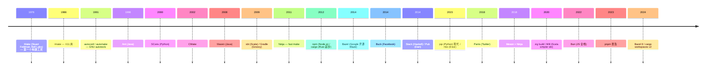

>
> **一句话答案：** 构建系统 = "源码 → 制品" 的可重复脚本；包管理器 = "依赖 → 安装" 的元数据 + 工具。两者**解决可重复性 / 依赖管理 / 增量编译 / 跨平台 / 签名验证**。现代趋势：**编译系统融合包管理**（cargo / npm / go mod / zig build）。


---

## 1. 历史时间轴



---

## 2. 构建系统三代分类

### 2.1 第一代：Make 系列（1976+）

```makefile
%.o: %.c
    gcc -c $<

main: main.o util.o
    gcc -o $@ $^
```

- **Make / GNU make** —— 最经典
- **NMake** — Microsoft 版
- **BSD make / pmake** — BSD 版
- **Imake** — X11 风格

特点：
- ✅ 通用、文件依赖驱动
- ❌ 跨平台差，依赖手写
- ❌ 难以增量
- ❌ 难以处理复杂依赖

### 2.2 第二代：autotools / 元构建（1991+）

```sh
./configure  # 探测系统
make         # 真正构建
make install # 安装
```

- **autoconf / automake / libtool** — GNU autotools，老但仍用
- **CMake** — 跨平台元构建（生成 make / ninja / VS / Xcode）
- **SCons** — Python-based，无 make
- **Meson** — 现代元构建（Python DSL）+ Ninja 后端
- **qmake** — Qt
- **Premake** — Lua-based

特点：
- ✅ 跨平台
- ❌ 仍要写脚本

### 2.3 第三代：现代构建系统（2014+）

```
Bazel / Buck / Pants — Google / Facebook 大规模单仓
  ✅ 全链路依赖图 (BUILD 文件)
  ✅ 远程缓存 / 远程执行
  ✅ 真增量
  ❌ 学习陡 / 配置量大
```

- **Bazel** (2014) — Google Blaze 开源
- **Buck / Buck2** (2014/2022) — Facebook
- **Pants** (2018) — Twitter / Stripe
- **Please** — Bazel 替代品

特点：
- ✅ 大规模 monorepo
- ✅ 远程缓存
- ✅ 严格依赖
- ❌ 启动慢 / 配置巨型

### 2.4 第四代：语言原生（2010+）

- **cargo** (Rust) — 编译 + 包管理 + 发布一体
- **go build / go mod** (Go)
- **npm / yarn / pnpm / bun** (JS)
- **pip / Poetry / uv** (Python)
- **dotnet** (.NET)
- **swift build** (Swift)

特点：
- ✅ 一个工具搞定所有
- ✅ 配置简单（Cargo.toml / package.json）
- ❌ 跨语言依赖难（如 Rust 调 C 仍需手工）

---

## 3. JVM 系语言构建工具


### 3.1 Maven（2002+，Apache）

- 标准化 Java 构建
- pom.xml（XML 配置）
- 中央仓库 Maven Central
- 主流 Java 项目

```xml
<dependency>
    <groupId>org.springframework</groupId>
    <artifactId>spring-core</artifactId>
    <version>6.1.0</version>
</dependency>
```

### 3.2 Gradle（2007 起，2012 1.0）

- Groovy / Kotlin DSL
- 比 Maven 灵活
- Android 官方默认
- Spring Boot 推荐

```kotlin
dependencies {
    implementation("org.springframework:spring-core:6.1.0")
}
```

### 3.3 Ant（1999+，已老）

- Apache 老牌
- XML 任务驱动
- 现在主要在 legacy 项目

### 3.4 sbt（2009+）

- **Simple Build Tool / Scala Build Tool**
- Scala / Java 主流
- 增量编译强
- DSL（Scala 子集）

```scala
libraryDependencies += "org.typelevel" %% "cats-core" % "2.10.0"
```

### 3.5 Mill（2018+，Li Haoyi）

- 简化 sbt
- 极快启动
- Scala 现代项目

```scala
object foo extends ScalaModule {
  def scalaVersion = "3.3.0"
}
```

### 3.6 其他 JVM 语言

- **Bazel** — Google Java 大型项目
- **Buck2** — Meta Java 项目
- **Bloop** — Scala 编译服务器

---

## 4. 包管理器谱系

详见 [00-35-distro-evolution](00-35-distro-evolution.md) § 3.1。

### 4.1 系统级（OS distro）

| 包格式 | 包管理器 | distro |
|--------|---------|--------|
| .deb | apt / dpkg | Debian / Ubuntu |
| .rpm | yum / dnf | RHEL / Fedora |
| .pkg.tar.zst | pacman | Arch |
| .apk | apk | Alpine |
| .ebuild | portage | Gentoo |

### 4.2 跨 distro

| 项目 | 一句话 |
|------|--------|
| **Snap** | Canonical 容器化 |
| **Flatpak** | 桌面应用 sandbox |
| **AppImage** | 单文件可执行 |
| **Nix / Guix** | 函数式可复现 |
| **Homebrew** | macOS 主流（也 Linux）|
| **MacPorts** | macOS 老牌 |

### 4.3 语言级

| 语言 | 包管理 |
|------|--------|
| Rust | **cargo + crates.io** |
| Go | **go mod** |
| JS / TS | **npm / yarn / pnpm / bun** |
| Python | **pip / Poetry / uv / Conda** |
| Java | **Maven / Gradle** |
| Scala | **sbt / Mill** |
| Ruby | **gem / Bundler** |
| PHP | **Composer** |
| .NET | **NuGet** |
| Haskell | **Stack / Cabal** |
| Erlang | **rebar3 / Hex** |
| Elixir | **mix + Hex** |
| Lua | **luarocks** |
| Perl | **CPAN** |
| Dart | **pub** |
| Swift | **Swift Package Manager** |
| Kotlin | **Gradle** |
| Crystal | **shards** |
| Nim | **nimble** |

### 4.4 容器 / K8s

- Docker Hub / Quay / Harbor / GHCR
- Helm Charts（K8s 包管理）

### 4.5 学术 / HPC

- **Spack** — HPC 集群包管理
- **EasyBuild** — 同上
- **conda-forge** — 科学计算

### 4.6 嵌入式

- **west**（Zephyr）
- **Buildroot 包**（自带 .mk）
- **Yocto recipe**（.bb）
- **PlatformIO**（Arduino / ESP-IDF / STM32 跨厂家）

---


```
├── Kconfig                ← 顶层菜单（选哪些 Ku 组件）
├── packages/
│   ├── kusbi.mk           ← 各 Ku 组件构建规则
│   ├── kuboot.mk
│   ├── kunikos.mk
│   ├── kufs.mk
│   ├── kusched.mk
│   ├── kualloc.mk
│   ├── kudrv.mk
│   └── kunet.mk
├── boards/                ← 板配置
│   ├── qemu-virt/
│   ├── visionfive2/
│   └── ...
├── target/
└── output/
    ├── images/{kusbi.bin, u-boot.itb, kunikos.elf, rootfs.img, disk.img}
    └── build/
```


```sh
ku-poky menuconfig         # Kconfig 选组件
ku-poky build              # 构建所选 Ku 组件
ku-poky package            # 打包 distro
ku-poky deploy --board=qemu-virt
```

未来可能：

```sh
ku get <pkg>               # 从远端拉
ku install <pkg>           # 安装到 rootfs
ku update                  # 升级
ku list                    # 列出已装
```

但**短期不做**——先用 busybox app + 自己刷 SD 卡。

### 5.3 借鉴清单

| 来自 | 借鉴 |
|------|------|
| **Buildroot** | menuconfig + package/.mk + 完整 toolchain |
| **Yocto** | layer 化 / bitbake recipe（远期）|
| **Nix** | 函数式可复现（远期高级目标）|
| **Cargo** | 单文件 manifest + crates.io 风格远端 |
| **Helm** | 模板 + 配置叠加思路 |

---


简表：
```
build.zig          ← Zig build script
build.zig.zon      ← 依赖 manifest
Kconfig            ← 配置树
scripts/menuconfig.sh   ← if mconf else py kconfiglib
scripts/build.sh        ← parse .config → zig build -D...
scripts/save-defconfig.sh / load-defconfig.sh
```


---

## 7. 跨语言构建工具

| 工具 | 一句话 |
|------|--------|
| **Bazel** | Google 大型 monorepo |
| **Buck2** | Meta 同上 |
| **Pants** | Twitter / Stripe |
| **CMake** | C/C++ 跨平台 |
| **Meson** | 现代 CMake 替代 |
| **Ninja** | 后端 builder |
| **Nix** | 函数式跨语言 |
| **Guix** | GNU Nix |
| **PlatformIO** | 嵌入式跨平台 |

---

## 8. 名词词典

| 术语 | 含义 |
|------|------|
| **build system** | 构建系统 |
| **package manager** | 包管理器 |
| **dependency** | 依赖 |
| **transitive dependency** | 间接依赖 |
| **dependency hell** | 依赖地狱（版本冲突）|
| **lockfile** | 依赖版本锁定（Cargo.lock / package-lock.json）|
| **monorepo** | 单一大仓库 |
| **polyrepo** | 多仓库 |
| **incremental build** | 增量构建 |
| **hermetic build** | 密封构建（输入完全声明）|
| **reproducible build** | 可复现（bit-for-bit）|
| **vendoring** | 依赖打包进仓库 |
| **bootstrapping** | 自举（编译器编译自己）|
| **cross compilation** | 交叉编译 |
| **toolchain** | 工具链 |
| **artifact** | 构建产物 |
| **registry** | 包仓库（crates.io / npm registry）|
| **remote cache** | 远程缓存（Bazel）|

---

## 9. 进一步阅读

### 9.1 书 / 资料

- ***Software Build Systems*** — Peter Smith
- ***Effective Cargo*** — Rust 官方手册
- ***The Linux Build System Book***
- ***Mastering Bazel***
- ***Buildroot Manual***

### 9.2 本仓库笔记串联

- [01-02-zig-build](01-02-zig-build.md) — Zig build 详细
- [00-08-lang-evolution](00-08-lang-evolution.md) — 编译器与构建关系
- [00-35-distro-evolution](00-35-distro-evolution.md) — distro 包管理 / 嵌入式构建（Buildroot/Yocto）
- [00-10-devops-evolution](00-10-devops-evolution.md) — CI/CD 中的构建

### 9.3 本仓库本地资料

| 路径 | 用途 |
|------|------|
| `rootfs/buildroot/` | Buildroot 经典构建 |
| `distro/YoctoPoky/` | Yocto 工业级 |
