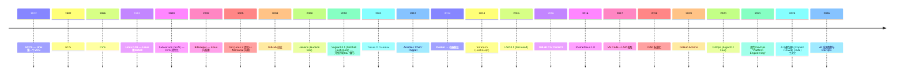

# 00-10 — DevOps + 工程化工具演化（Git/SVN/CI/CD/LSP/DAP/IaC/嵌入式调试）

> **核心问题：** 软件工程从"打 zip 发版"演化到"GitHub Actions 自动构建签名发 Release"经历了什么？Git 怎么打败 SVN/Mercurial？LSP / DAP 协议为什么改变了 IDE 生态？IaC（Terraform / Ansible）解决了什么？嵌入式开发的调试工具链是什么？
>
> **一句话答案：** 现代 DevOps = **版本控制（Git）+ CI/CD（GitHub Actions）+ 编辑器协议（LSP/DAP）+ 基础设施即代码（IaC）+ 监控（Prometheus）+ 包管理器**。这一切让"一个人能管百万级代码 + 千节点集群"成为可能。


---

## 1. 历史时间轴



---

## 2. 版本控制系统（VCS）

### 2.1 三代 VCS

| 代 | 特征 | 代表 |
|---|------|------|
| 1 集中式（本地）| 单文件历史 | RCS / SCCS |
| 2 集中式（网络）| 客户端 / 服务器，单中心仓库 | CVS / **SVN** / Perforce |
| 3 分布式 (DVCS)| 每个 clone 都是完整仓库 | **Git** / Mercurial / Bazaar / Fossil |

### 2.2 Git vs SVN

| 维度 | Git | SVN |
|------|-----|-----|
| 模型 | 分布式 | 集中式 |
| 离线工作 | ✅ | ❌ |
| 分支 | 极轻量 | 重 |
| 学习曲线 | 陡 | 平 |
| 大文件 | 弱（需 LFS）| 强 |
| 历史 | 有向无环图 (DAG) | 线性 |
| 主流 | ✅ 全球 90%+ | 政府 / 国企 / 老项目 |

### 2.3 Git 关键概念

- **commit** — 不可变快照
- **branch** — 指针
- **HEAD** — 当前位置
- **merge / rebase** — 合并
- **tag** — 不动的指针
- **remote** — 远程仓库
- **push / pull / fetch** — 同步
- **worktree** — 同 clone 多分支
- **stash** — 临时保存
- **reflog** — 安全网（误删可恢复）
- **bisect** — 二分查 bug commit

### 2.4 现代 Git 平台

| 平台 | 特长 |
|------|------|
| **GitHub** | 全球最大开源 |
| **GitLab** | DevOps 一体（GitLab CI 内置）|
| **Gitea** | 自托管轻量 |
| **Bitbucket** | Atlassian / Jira 集成 |
| **Codeberg** | 社区开源（非营利）|
| **Sourcehut** | 极简（邮件流程）|
| **Gerrit** | 代码审查 |
| **Gitee (码云)** | 中国主流 |
| **Coding** | 腾讯 |
| **Phabricator** | Facebook 开源（停维护）|

### 2.5 其他 DVCS

| VCS | 特长 |
|-----|------|
| **Mercurial (hg)** | Mozilla / Facebook 内部用 |
| **Bazaar (bzr)** | Ubuntu Launchpad 用，已淡出 |
| **Fossil** | SQLite 作者写，自带 wiki / bug tracker |
| **Pijul** | 数学正确的 patch theory |
| **Sapling** | Meta 开源（Mercurial fork）|
| **Jujutsu (jj)** | 现代 Git 兼容 + 更易用 |

---

## 3. CI/CD（持续集成 / 持续部署）

### 3.1 演化时间轴

```
1990s : 手动测试 + 手动部署
2007 : Jenkins (Hudson) — 第一个流行 CI
2011 : Travis CI / Heroku — SaaS CI
2013 : CircleCI / GitLab CI
2019 : GitHub Actions — VCS 内置 CI 革命
2024 : AI 辅助 CI / 自愈
```

### 3.2 主流 CI/CD 工具

| 工具 | 类型 | 一句话 |
|------|------|--------|
| **GitLab CI** | 内置 GitLab | DevOps 一站式 |
| **Jenkins** | 自托管 | 老牌（仍主流企业内）|
| **CircleCI** | 云 | SaaS 老牌 |
| **Travis CI** | 云 | 老牌（衰退）|
| **Drone** | 自托管 | 容器原生 |
| **TeamCity** | JetBrains | 商业 |
| **Bamboo** | Atlassian | 商业 |
| **Tekton** | K8s 原生 | CNCF |
| **Argo Workflows** | K8s 原生 | 流程编排 |
| **GitHub Actions self-hosted runner** | 自托管 | 私有部署 |
| **AWS CodePipeline** | AWS | AWS 集成 |
| **Azure Pipelines** | Microsoft | Azure 集成 |

### 3.3 CI/CD 概念

```
Pipeline (流水线)
  ├── Commit → trigger
  ├── Build (lint + compile)
  ├── Test (unit / integration / e2e)
  ├── Security scan (SAST / DAST / SCA)
  ├── Artifact upload
  ├── Deploy staging
  ├── Smoke test
  ├── Deploy production (canary / blue-green / rolling)
  └── Monitoring + rollback
```

### 3.4 GitOps（声明式部署）

- 2019 Weaveworks 提出
- Git 作 single source of truth
- 集群状态由 Git 中 YAML 决定
- 工具：**ArgoCD** / **Flux** / **Jenkins X**

---

## 4. 编辑器 / IDE 协议

### 4.1 LSP（Language Server Protocol，2015）

**问题：** 每个 IDE × 每个语言 = N×M 实现，维护噩梦。
**解决：** 标准 JSON-RPC 协议，把"语言智能"抽到一个 server，IDE 作 client。

```
VSCode / Vim / Emacs / Helix / IntelliJ ← LSP client
        ↕  JSON-RPC over stdio / TCP
rust-analyzer / clangd / pyright / gopls / zls ← LSP server
```

→ **LSP 改变了 IDE 生态**：写一个 LSP server 就能在 30+ IDE 工作。

### 4.2 主流 LSP servers

| Server | 语言 |
|--------|------|
| **rust-analyzer** | Rust |
| **clangd** | C / C++ |
| **pyright / pylsp** | Python |
| **gopls** | Go |
| **zls** | Zig |
| **vtsls / typescript-language-server** | TypeScript |
| **lua-language-server** | Lua |
| **jdtls** | Java |
| **kotlin-language-server** | Kotlin |
| **nil / nixd** | Nix |
| **haskell-language-server** | Haskell |
| **clojure-lsp** | Clojure |
| **rime / fcitx5-lsp** | （非语言）输入法相关 |

### 4.3 DAP（Debug Adapter Protocol，2018）

- LSP 是"语义"，DAP 是"调试"
- 同思路：标准协议让 IDE 通用调试
- 主用：VSCode / Helix / nvim-dap


简提：VSCode / IntelliJ / Vim / Neovim / Emacs / Helix / Zed / Cursor / Sublime / Notepad++。

---

## 5. IaC（基础设施即代码）

### 5.1 演化

| 代 | 工具 | 特征 |
|---|------|------|
| 0 | shell scripts | 命令式，不可重复 |
| 1 | Puppet (2005) / Chef (2009) | 状态管理 |
| 2 | Ansible (2012) | YAML，agent-less |
| 3 | Terraform (2014) | 声明式云资源 |
| 4 | Pulumi (2018) | 用通用语言（TS/Python/Go）|
| 5 | Crossplane / OpenTofu | K8s 风格 + Terraform fork |

### 5.2 主流 IaC 工具对比

| 工具 | 语言 | 主用 |
|------|------|------|
| **Ansible** | YAML | 配置管理 / 部署 |
| **Terraform** | HCL | 云资源（AWS / Azure / GCP）|
| **OpenTofu** | HCL | Terraform 开源 fork |
| **Pulumi** | TS / Python / Go | 程序员友好 |
| **CloudFormation** | YAML / JSON | AWS 专属 |
| **Bicep** | DSL | Azure 专属 |
| **CDK** | TS / Python / Java | AWS / Terraform 后端 |
| **Crossplane** | K8s YAML | K8s 原生云资源 |
| **Helm** | YAML 模板 | K8s 应用部署 |
| **Kustomize** | YAML overlay | K8s 配置定制 |
| **Puppet** | DSL | 老牌配置 |
| **Chef** | Ruby DSL | 老牌配置 |
| **SaltStack** | YAML / Python | 大规模配置 |

---

## 6. 可观测性（Observability）

### 6.1 三大支柱

| 支柱 | 数据 | 工具 |
|------|------|------|
| **Logs** | 文本日志 | Loki / Elasticsearch / Splunk |
| **Metrics** | 时序数据 | Prometheus / VictoriaMetrics / InfluxDB |
| **Traces** | 调用链 | Jaeger / Zipkin / Tempo |

### 6.2 OpenTelemetry（统一标准，2019）

把 Logs / Metrics / Traces 三者用一个 SDK 收集。CNCF 主推。

### 6.3 监控可视化

- **Grafana** — 主流 dashboard
- **Kibana** — Elastic 配套
- **Datadog** — 商业一体
- **New Relic** — 商业 APM
- **Sentry** — 错误追踪

### 6.4 Profiling

| 工具 | 用途 |
|------|------|
| **gprof** | 老 C/C++ |
| **perf** | Linux 内核 |
| **eBPF / bcc / bpftrace** | 现代低开销 |
| **Tracy** | 游戏 / 实时系统 |
| **flamegraph** | Brendan Gregg 工具 |
| **pprof** | Go / Python |
| **CPU Profiler** | Intel VTune / AMD μProf |

---


### 7.1 硬件调试接口

| 接口 | 引脚 | 用途 |
|------|------|------|
| **JTAG** | 4-5 (TCK/TMS/TDI/TDO/TRST) | 通用，老 |
| **SWD** | 2 (SWDIO/SWCLK) | ARM Cortex 主流 |
| **SBA** | 类 SWD | RISC-V |
| **CMSIS-DAP** | 标准 | ARM 调试桥接器 |
| **ST-Link** | ST 自家 | STM32 |
| **J-Link** | Segger | 商业最强大 |

### 7.2 软件调试

| 工具 | 一句话 |
|------|--------|
| **GDB** | GNU Debugger，老牌 |
| **LLDB** | LLVM 调试器 |
| **OpenOCD** | 开源 JTAG/SWD 服务器（GDB 后端）|
| **probe-rs** | Rust 写的现代调试器（替代 OpenOCD）|
| **pyOCD** | Python 实现 |
| **Tracealyzer** | RTOS 实时分析（Percepio）|
| **Ozone** | Segger 商业调试 GUI |
| **Saleae Logic** | 逻辑分析仪软件 |


```sh
zig build qemu-gdb              # QEMU 等待 GDB on :1234
  -ex "target remote :1234" \
  -ex "set arch riscv:rv64"
```

CONFIG_START_HANG=y 让 _start 开头加 wfi 循环 → GDB 早期附着。

---

## 8. 包管理器谱系（已在 00-35 distro / 00-09 build-pkg 涉及）

简表：

| 类别 | 包管理器 |
|------|----------|
| Linux distro | apt / dpkg / yum / dnf / pacman / apk / portage |
| 跨 distro | snap / flatpak |
| 语言 | cargo (Rust) / npm (JS) / pip (Python) / go mod / Maven (Java) / Gradle / sbt (Scala) / mill |
| 云原生 | Helm |
| 嵌入式 | west (Zephyr) / Buildroot / Yocto |
| Mac | Homebrew / MacPorts |
| Windows | scoop / chocolatey / winget |
| 学术 | Spack (HPC) / EasyBuild |
| 函数式 | Nix / Guix |


---


| 操作 | Git | SVN |
|------|-----|-----|
| 初始化 | `git init` | `svnadmin create repo` |
| 克隆 | `git clone <url>` | `svn checkout <url>` |
| 状态 | `git status` | `svn status` |
| 添加 | `git add <file>` | `svn add <file>` |
| 提交 | `git commit -m` | `svn commit -m` |
| 拉 | `git pull` | `svn update` |
| 推 | `git push` | （无需，commit 即推到中心）|
| 查看历史 | `git log` | `svn log` |
| 分支 | `git checkout -b feat` | `svn copy ^/trunk ^/branches/feat` |
| 合并 | `git merge` | `svn merge` |
| 回滚 | `git revert / reset` | `svn revert` |
| 标签 | `git tag` | `svn copy ^/trunk ^/tags/v1.0` |

---

## 10. AI 辅助 DevOps（2024+）

| 工具 | 用途 |
|------|------|
| **GitHub Copilot** | 代码补全（OpenAI Codex / GPT-4）|
| **Claude Code** | Anthropic CLI agent |
| **Cursor** | AI-native IDE |
| **Aider** | Terminal AI pair programming |
| **Continue** | VSCode AI 扩展 |
| **Copilot Workspace** | 整 issue → PR |
| **Sweep / Codium** | AI 自动 PR |
| **Snyk Code** | AI 安全扫描 |

→ 2026 现状：写代码 30-50% 由 AI 完成，DevOps 流程被 AI 重塑。

---


- ✅ Git + GitHub（Kunik-OS 组织 + 私有仓库）
- ✅ GitHub Actions CI（4×4 build 矩阵 + Linux/rCore boot smoke）
- ✅ 子模块（specs / plats）+ 月度自动 bump
- ✅ Kconfig + kconfiglib（Python uv 优先 + C mconf 备选）
- ✅ Zig build + zon 包管理
- ✅ GPG 签名 commits
- ✅ docs/ 完整（DESIGN / CONFIGURATION / DEVELOPMENT / PORTING）

### 11.2 未来（远期）

- 🚧 LSP server for Zig（zls 已存在）

---

## 12. 名词词典

| 术语 | 含义 |
|------|------|
| **VCS** | Version Control System |
| **DVCS** | Distributed VCS |
| **CI** | Continuous Integration |
| **CD** | Continuous Deployment / Delivery |
| **GitOps** | Git-driven ops |
| **DevOps** | 开发 + 运维一体 |
| **Platform Engineering** | 给开发者搭"内部 PaaS" |
| **SRE** | Site Reliability Engineering |
| **MTTR / MTBF** | 平均恢复 / 失效间隔 |
| **SLO / SLA / SLI** | Service Level Objective / Agreement / Indicator |
| **LSP** | Language Server Protocol |
| **DAP** | Debug Adapter Protocol |
| **IaC** | Infrastructure as Code |
| **GitOps** | 同上 |
| **OCI** | Open Container Initiative |
| **OPA** | Open Policy Agent |
| **SAST / DAST / SCA** | Static / Dynamic / Composition Analysis |
| **OpenTelemetry** | 统一可观测性标准 |

---

## 13. 进一步阅读

### 13.1 经典书

- ***Pro Git*** — Scott Chacon — 免费在线
- ***The DevOps Handbook*** — Kim / Humble / Debois
- ***Continuous Delivery*** — Humble / Farley
- ***SRE: How Google Runs Production Systems***
- ***Infrastructure as Code*** — Kief Morris

### 13.2 视频 / 课程

- [Pro Git book](https://git-scm.com/book/en/v2)
- [Linux Foundation DevOps Bootcamp](https://training.linuxfoundation.org/)
- [Coursera Google IT Automation with Python](https://www.coursera.org/professional-certificates/google-it-automation)

### 13.3 本仓库笔记串联

- [00-08-lang-evolution](00-08-lang-evolution.md) — 编程语言（与 LSP 紧密关联）
- [00-35-distro-evolution](00-35-distro-evolution.md) § 系统裁剪 — 包管理 / IaC
- [00-34-container-cloud-evolution](00-34-container-cloud-evolution.md) — K8s + GitOps
- [00-09-build-pkg-evolution](00-09-build-pkg-evolution.md) — 构建系统 / 包管理器深入

### 13.4 本仓库本地资料对应


