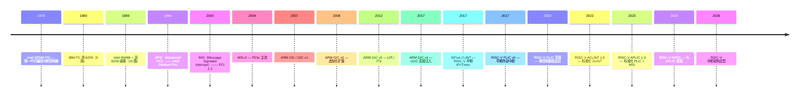

# 00-11 — 中断 + 异常机制演化（PIC → APIC → GIC → PLIC → APLIC / CLINT → ACLINT / CLIC）

>
> **一句话答案：** 中断 = "硬件异步通知 CPU"。50 年从 8259A PIC（8 路）演化到 MSI-X（数千路） / GIC v3+（虚拟化）/ APLIC + IMSIC（RISC-V 现代）。**RISC-V 中断架构 2020+ 全面重构** —— 旧 PLIC + SiFive CLINT 被 APLIC + ACLINT 标准化替代。


---

## 1. 中断 vs 异常

```
异常（exception, synchronous）
   - 由当前指令引发
   - 例：除零 / 缺页 / 非法指令 / 系统调用 / 断点

中断（interrupt, asynchronous）
   - 由外部事件引发
   - 例：定时器 / 网卡数据到 / 键盘按下 / IPI
```

CPU 都通过同一个 trap 入口处理，但通过 cause register 区分。

---

## 2. 历史时间轴



---

## 3. x86 中断架构

### 3.1 8259A PIC（1976）

- 8 路输入
- 主从级联（8+8-1 = 15 路）
- 寄存器配置：ICW1-4 / OCW1-3
- IO 端口 0x20/0x21（主）/ 0xA0/0xA1（从）

```
PC IRQ map (legacy):
  IRQ0 - timer
  IRQ1 - keyboard
  IRQ2 - 级联从片
  ...
  IRQ12 - 鼠标
  IRQ14 - IDE 主
```

### 3.2 APIC（Advanced PIC）

#### Local APIC（LAPIC，每核一个）

- 私有于每核
- 处理：timer / IPI / thermal / performance counter

#### IO APIC（IOAPIC，全局）

- 24-256 路外部中断
- 通过 system bus 投递给 LAPIC

### 3.3 MSI / MSI-X（消息中断）

- PCI 2.2 (1999) 引入 MSI
- PCIe 2.0 (2007) MSI-X 标准
- 设备**写一个特定地址**触发中断（不是连一根线）
- 更多路数（MSI-X 最多 2048 / 设备）
- 现代 PCIe 设备（NVMe / 网卡）默认用

### 3.4 现代 x86 中断流

```
PCIe 设备 → MSI-X 写内存
         ↓
LAPIC 收到
         ↓
CPU 中断 → IDT (Interrupt Descriptor Table)
         ↓
ISR (Interrupt Service Routine)
```

---

## 4. ARM 中断架构（GIC）

### 4.1 GIC v1（2007）

- ARM Generic Interrupt Controller
- 1023 路 SPI（Shared Peripheral Interrupts）
- 32 路 PPI / SGI（Per-CPU / Software-Generated）

### 4.2 GIC v2（2011）

- 加虚拟化支持
- vGIC — VM 直接收虚拟中断
- ARM Cortex-A 普及

### 4.3 GIC v3（2013）

- LPI（Locality-specific Peripheral Interrupts）— MSI 风格
- ITS（Interrupt Translation Service）
- 适配大规模服务器

### 4.4 GIC v4（2017）

- vSGI 直接注入
- 进一步虚拟化优化

### 4.5 GIC 寄存器接口

```
GICD (Distributor) - 全局
GICR (Redistributor, v3+) - 每核
GICC (CPU Interface) - v2 老风格
ICC_xxx_ELn - v3+ 系统寄存器风格
```

---


### 5.1 早期：SiFive CLINT + PLIC（2017+）

#### CLINT（Core Local Interruptor）— SiFive 私有

- MSIP[N]：每核软件中断
- MTIMECMP[N]：每核 timer compare
- MTIME：全局 timer 计数器
- 起源：SiFive U54，2017
- **不是标准** — 各厂家 CLINT 差异大

#### PLIC（Platform-Level Interrupt Controller）

- 处理外部设备中断
- 早期 RISC-V 各家自有变体
- 优先级 + 阈值

### 5.2 现代标准化：ACLINT（2022+）

**Advanced Core Local Interruptor** — 拆分 CLINT 为多个独立组件：

```
ACLINT 子组件：
  MSWI (Machine Software Interrupt) - 取代 CLINT MSIP
  MTIMER (Machine Timer) - 取代 CLINT MTIMECMP/MTIME
  SSWI (Supervisor Software Interrupt) - 新增 S-mode 软中断
```

**优势：**
- 模块化（按需实现）
- 标准化（互操作）
- 更易支持虚拟化

### 5.3 现代标准化：APLIC（2023+）

**Advanced Platform-Level Interrupt Controller** — 接班 PLIC：

- 支持 MSI（与 IMSIC 配合）
- 直接虚拟化（VS-mode 中断分发）
- 与 H 扩展协同
- 更灵活（线模式 / MSI 模式）

### 5.4 IMSIC（Incoming MSI Controller）

- 与 APLIC 配套
- 每核接收 MSI 写入
- 支持虚拟化

### 5.5 CLIC（Core-Local Interrupt Controller，微控制器）

- 微控制器友好
- 低延迟 / 简化优先级
- 抢占式
- 类似 ARM NVIC
- RISC-V MCU 主推（ESP32-C3 等）


```zig
const CLINT_BASE = 0x02000000;
const MSIP_OFFSET = 0;        // IPI
const MTIMECMP_OFFSET = 0x4000; // Timer compare
const MTIME_OFFSET = 0xBFF8;    // 全局 timer

// 远期适配 ACLINT / APLIC
```


---

## 6. 中断处理流程（通用）

```
1. 中断触发（外设线 / MSI / 软件 IPI）
   ↓
2. 中断控制器分发（决定哪个 CPU / 哪个特权级）
   ↓
3. CPU 进入 trap
   - 保存 PC → mepc / pc / RIP
   - 保存原 mode → mstatus.MPP / SPSR
   - 切到 trap mode
   - PC = trap vector
   ↓
4. trap handler
   - 读 cause register（判断是中断还是异常）
   - 保存寄存器
   - 调具体 handler
   ↓
5. handler 处理完
   - EOI（End Of Interrupt）告诉控制器完成
   - 恢复寄存器
   - 返回（mret / eret / iretq）
```

---

## 6.5 虚拟化中断（hypervisor 必懂知识点）

> **加入背景：** AxVisor 方向一（x86_64 UEFI 客户机）+ 方向二（设备/中断框架重构）涉及的"如何把物理中断控制器虚拟化呈现给 guest"的核心知识。

### 6.5.1 中断虚拟化 4 个层次

```
物理 → guest 看到中断 的 4 道关口：
┌────────────────────────────────────────────┐
│ 1. 物理设备 → 物理中断控制器（LAPIC/GIC/PLIC）│
│    硬件层面，不变                            │
├────────────────────────────────────────────┤
│ 2. 物理中断控制器 → hypervisor 拦截 vmexit   │
│    硬件辅助 vmexit / trap                  │
├────────────────────────────────────────────┤
│ 3. hypervisor 重路由到目标 vCPU            │
│    软件层面"虚拟 IRQ 路由"                  │
├────────────────────────────────────────────┤
│ 4. hypervisor 注入 vIRQ 给 guest           │
│    "写虚拟中断控制器寄存器" 让 guest 看到中断  │
└────────────────────────────────────────────┘
```

第 4 步即"中断注入"——是 hypervisor 设备模型最高频的工作。

### 6.5.2 x86 中断虚拟化（vLAPIC + vIOAPIC + APICv）

**vLAPIC** — 每 vCPU 一个，含完整 LAPIC 寄存器镜像：
| 关键寄存器 | 作用 |
|:--|:--|
| `IRR[256]` | Interrupt Request Register — pending IRQ 位图（256 vector）|
| `ISR[256]` | In-Service Register — 正在处理的 IRQ |
| `TMR[256]` | Trigger Mode Register — 边沿/电平触发 |
| `EOI` | End Of Interrupt — guest 写后清当前 ISR 最高 bit |
| `ICR` | Interrupt Command Register — IPI 发送 |
| `LVT` | Local Vector Table — 本地中断源（timer/thermal/perf/LINT0-1）|
| `TPR` | Task Priority Register — 屏蔽低优先级中断 |
| `Timer Initial Count` | 本地 timer 初值 |

**注入流程：**
```
设备发 IRQ → hypervisor 设 vLAPIC.IRR[vec]=1
  ↓
vCPU 下次 entry 检查 IRR & ~ISR & enable
  ↓ 找到最高优先级
deliver → guest 看到中断 → 跳转 IDT[vec]
  ↓ guest 写 ISR[vec]=1, IRR[vec]=0
guest handler ...
  ↓ guest 写 EOI MMIO
hypervisor 清 ISR[vec]
```

**vIOAPIC** — 全局一个，24 个 redirection entry：每根 INTx 线 → 路由表项（vector / dest CPU / 触发模式 / mask）→ vLAPIC.IRR。

**APICv (APIC virtualization, Intel Nehalem+)：** 硬件加速 vLAPIC —— guest 读写大部分 vLAPIC 寄存器不再 vmexit，硬件直接维护 vAPIC-page；只有 ICR (IPI) 等"跨 vCPU" 操作才 vmexit。**减少中断密集 workload 的 vmexit 开销**。

**Posted Interrupts (Intel SDM Vol 3 §29.6)：** 设备 IRQ 直接 post 到 vLAPIC 的 PIR (Posted Interrupt Request) 位图 → 用 IPI 唤醒目标 vCPU → 在 vmentry 自动 swap PIR → IRR。**完全绕过 hypervisor** ——VFIO 直通 + SR-IOV 必用。

### 6.5.3 ARM 中断虚拟化（VGIC + List Register）

**GIC v2 虚拟化扩展（GICH）：**
```
hypervisor (EL2) 写 ICH_LR_EL2<n>:
  intid (32-bit IRQ 号) + priority + state (Pending/Active)
  + group + HW (硬件还是 virtual)

硬件下次回 guest (EL1) → 自动按优先级 deliver 到 vCPU
```

**LR 数量：** GIC v2 = 4 / GIC v3 = 4-16（实现可变）。**LR 满时**：hypervisor 把多余 vIRQ 留软队列；打开 `ICH_HCR_EL2.LRENPIE` (Empty Notify) → 硬件下次有 LR 空闲触发 EL2 maintenance interrupt → hypervisor 补 LR。

**GICv3 ITS (Interrupt Translation Service, GIC v3+)：** MSI 重定向硬件 —— guest 写 MSI → ITS 翻译 EventID → vLPI → 投递到对应 vCPU 的 vPE。

### 6.5.4 RISC-V 中断虚拟化（AIA + IMSIC vfile）

**经典：** vPLIC + hvip / vsip CSR
- hvip = HS 向 VS 注入的 virtual interrupt pending
- guest 读 vPLIC claim register → hypervisor MMIO 拦截 → 返回最高优先级 IRQ + 清 pending
- guest 写 vPLIC complete → hypervisor 清 ISR

**AIA (Advanced Interrupt Architecture) 虚拟化：**
- **IMSIC virtualization** — 每核 IMSIC 含 nGuest "interrupt file" → 一个 vCPU 用一个 vfile（256 / 2048 / 4096 entries）→ guest 直接读写 vfile MMIO 无需 vmexit（类似 APICv）
- **APLIC msi-mode** — APLIC 翻译 wired IRQ → MSI 写 guest vfile → 走 IMSIC 路径

### 6.5.5 LoongArch 中断虚拟化（GCSR）

**GCSR** = S-mode CSR 的 guest 镜像 ESTAT/EENTRY/ECFG 等。hypervisor 写 GCSR.ESTAT 直接触发 guest 中断。LoongArch 虚拟化中断模型相对最简单。

### 6.5.6 中断重映射（IOMMU + 安全直通必备）

```
设备 ───────→ MSI 写 0xFEE0xxxx
                  ↓ Intel VT-d / AMD-Vi / ARM SMMU
                IOMMU 中断重映射表 (IRT/IRTE)
                  ↓ 查 IRTE: dest_vCPU + vector
                vLAPIC.IRR (posted) / Send IPI
                  ↓
                目标 vCPU
```

**作用：**
- 防止恶意 DMA 设备伪造 MSI 写任意 vector
- 直通设备给 guest 时强制走 IRT 翻译，安全隔离
- Posted Interrupts 必须配合 IRTE 才能"直接 post 到 vLAPIC"

### 6.5.7 知识点速查表（虚拟化中断 6 关键）

| 知识点 | x86 | ARM | RISC-V | LoongArch |
|:--|:--|:--|:--|:--|
| **per-vCPU 中断控制器** | vLAPIC (256 vec) | GICv3 vCPU interface | IMSIC vfile (AIA) / vPLIC ctx | GCSR |
| **注入机制** | 写 IRR / Posted PIR | 写 List Register | hvip / vsip CSR / IMSIC MMIO | 写 GCSR.ESTAT |
| **硬件加速读取** | APICv vAPIC-page | GICv3 SystemReg (sysreg trap-free) | IMSIC vfile MMIO direct | GCSR direct |
| **完全无 vmexit 注入** | Posted Interrupts | GICv4 ITS direct injection | AIA MSI to vfile | — |
| **MSI 路由翻译** | Interrupt Remapping (VT-d) | ITS | AIA APLIC msi-mode | (无标准) |
| **中断 deliver 时刻** | vmentry | guest entry (LR 自动) | vmentry | guest entry |

### 6.5.8 进一步阅读

- Intel SDM Vol 3 Ch 29 "APIC Virtualization and Virtual Interrupts"
- ARM ARM G8 "GIC Virtualization"
- RISC-V AIA spec Ch 5 "IMSIC virtualization"
- [04-10 § 5.9](04-10-hypervisors-walkthrough.md) hypervisor 设备/中断框架横向

---

## 7. 中断优先级 + 嵌套

### 7.1 优先级

```
不可屏蔽中断（NMI）— 最高，不能屏蔽
高优先级中断 — 调度紧急
低优先级中断 — 后台
异常 — 跟着触发指令
```

### 7.2 嵌套中断

中断处理中允许更高优先级中断打断：
- 实时性好
- 但栈深度增加
- 嵌入式系统典型支持

### 7.3 ARM NVIC（Cortex-M）

NVIC = Nested Vectored Interrupt Controller
- 256 优先级
- 自动嵌套
- 极低延迟（12 周期）

---

## 8. 中断处理风格

### 8.1 顶半 / 底半（top half / bottom half）

```
中断到达：
  Top half（中断上下文，关中断）
    - 极短 ack + 唤醒任务
  Bottom half（任务上下文，开中断）
    - softirq / tasklet / workqueue 处理
```

### 8.2 线程化中断（threaded IRQ）

Linux 现代：
- IRQ handler 跑在专用 kernel thread
- 优先级可调
- 实时性 (PREEMPT_RT) 关键

### 8.3 MSI vs Wired

```
Wired IRQ（线中断）：
  设备 ─ wire ─ IRQ controller ─ CPU
  ❌ 共享线（共享 IRQ）
  ❌ 路数有限
  ❌ 中断风暴

MSI/MSI-X：
  设备 ─ memory write ─ MSI handler
  ✅ 不共享
  ✅ 路数多
  ✅ 队列友好
```

---


- 支持 RISC-V mtvec / mip / mie / medeleg / mideleg
- 委托大部分异常到 S-mode
- 处理 M-mode 时钟（CLINT）+ 软件中断 + ecall


```
Kernel 中断子系统层次：
1. Arch-specific trap entry（保存寄存器）
2. 通用 IRQ subsystem（注册 / 启用 / 屏蔽）
3. driver IRQ handler（driver 注册）
4. softirq / threaded IRQ（推迟工作）
```

### 9.3 借鉴

| 来自 | 借鉴 |
|------|------|
| Linux IRQ subsystem | 通用 API |
| ARM NVIC | 嵌入式低延迟 |
| seL4 | 验证安全模型 |
| Embassy | async IRQ |

### 9.4 RISC-V 中断生态适配

```
  qemu_virt → SiFive CLINT + 老 PLIC
  
  ACLINT 板（2024+ 新 SoC）
  APLIC + IMSIC 板（虚拟化 / 服务器）
  CLIC 板（MCU）
```

---

## 10. 名词词典

| 术语 | 含义 |
|------|------|
| **interrupt** | 中断（异步） |
| **exception / fault / trap** | 异常（同步） |
| **NMI** | Non-Maskable Interrupt |
| **IRQ** | Interrupt Request |
| **IDT** | Interrupt Descriptor Table（x86）|
| **PIC** | Programmable Interrupt Controller |
| **APIC / LAPIC / IOAPIC** | Advanced PIC |
| **MSI / MSI-X** | Message Signaled Interrupt |
| **GIC** | ARM Generic Interrupt Controller |
| **VIC** | ARM Vectored IC（老）|
| **NVIC** | ARM Cortex-M Nested VIC |
| **PLIC** | RISC-V Platform-Level IC |
| **APLIC** | RISC-V Advanced PLIC |
| **CLINT** | SiFive Core Local Interruptor |
| **ACLINT** | RISC-V Advanced CLINT |
| **CLIC** | RISC-V Core-Local IC（MCU） |
| **IMSIC** | RISC-V Incoming MSI Controller |
| **EOI** | End Of Interrupt |
| **vector** | 中断向量 |
| **ISR** | Interrupt Service Routine |
| **top half / bottom half** | 中断处理两阶段 |
| **softirq / tasklet / workqueue** | Linux 推迟工作 |
| **threaded IRQ** | 线程化中断 |
| **IPI** | Inter-Processor Interrupt |
| **SGI / PPI / SPI / LPI** | ARM GIC 中断类型 |

---

## 11. 进一步阅读

### 11.1 资源 / 规范

- [RISC-V ACLINT Spec](https://github.com/riscv/riscv-aclint)
- [RISC-V APLIC Spec](https://github.com/riscv/riscv-aia)
- [RISC-V CLIC Spec](https://github.com/riscv/riscv-fast-interrupt)
- [ARM GIC Architecture Spec](https://developer.arm.com/documentation/ihi0069/latest)
- [Intel APIC](https://www.intel.com/content/www/us/en/architecture-and-technology/64-ia-32-architectures-software-developer-vol-3a-part-1-manual.html)

### 11.2 经典书

- ***Linux Kernel Development*** — Robert Love — IRQ 章
- ***Understanding the Linux Kernel*** — Bovet 同上
- ***Embedded Systems Architecture*** — Daniele Lacamera

### 11.3 本仓库笔记串联

- [00-07-os-evolution](00-07-os-evolution.md) — RTOS 中断
- [00-12-device-driver-evolution](00-12-device-driver-evolution.md) — IRQ 驱动
- [00-04-micro-architecture-evolution](00-04-micro-architecture-evolution.md) — 中断 / SMT 关系

### 11.4 本仓库本地资料

| 路径 | 用途 |
|------|------|
| `core/asterinas/` / `core/arceos/` | Rust 内核 IRQ |
| `boot/u-boot/drivers/irqchip/` | bootloader IRQ driver |
