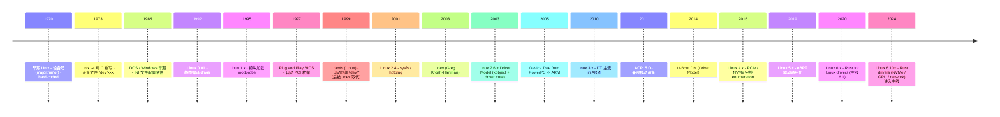
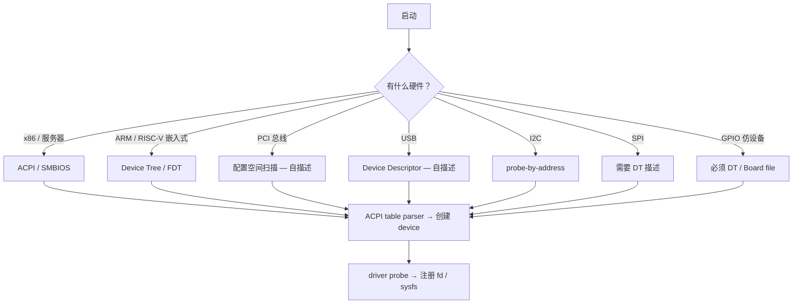

# 00-12 — 设备 + 驱动模型演化：从硬件描述到驱动 probe 全链路

> **核心问题：** 一块板子上有几十种外设（UART / I2C / 摄像头 / 网卡 / GPU），OS 怎么知道它们都在哪、怎么用？为什么 Linux 有 `compatible` 字符串？U-Boot DM 与 Linux DM 关系？为什么"设备树"取代了"硬编码的 board file"？
>
> **一句话答案：** **设备模型 = 描述硬件 + 匹配驱动 + 生命周期管理**。50 年间从"硬编码"演化到"设备树/ACPI 描述 + driver framework probe"。RISC-V/ARM 用设备树 (DT)，x86 服务器用 ACPI。理解这条链路就能从"看见一个 PCI 设备 ID"追到"应用拿到 /dev/sda 的 read 调用"。


---

## 1. 大框架：设备 + 驱动是什么

### 1.1 三个分离的概念

```
┌────────────────────────────────────────────────────────────┐
│                      设备 (Device)                         │
│  物理硬件 (UART / NIC / GPU) 或虚拟硬件 (loop / null)     │
│  特征：MMIO 地址、IRQ 号、PCIe BDF / I2C addr              │
└────────────────────────────────────────────────────────────┘
                          ↑ 描述
                          ↓
┌────────────────────────────────────────────────────────────┐
│                    硬件描述 (Description)                  │
│  Device Tree (.dts/.dtb) / ACPI / 厂商 SDP                │
│  说明：哪些设备存在、各自属性、互联关系                  │
└────────────────────────────────────────────────────────────┘
                          ↑ 匹配
                          ↓
┌────────────────────────────────────────────────────────────┐
│                     驱动 (Driver)                          │
│  代码：知道怎么操作这种设备                              │
│  注册：声明自己能处理哪些 compatible / vendor:device     │
└────────────────────────────────────────────────────────────┘
                          ↑
                          ↓
┌────────────────────────────────────────────────────────────┐
│              Driver Framework / Driver Model               │
│  - 扫描描述 → 匹配 driver → probe() → 注册 fd / sysfs    │
│  - 生命周期：probe → bind → suspend / resume → remove   │
└────────────────────────────────────────────────────────────┘
```

理解这四层 + 它们如何串起来 = 理解整个 driver 体系。

### 1.2 设备 vs 总线 vs 驱动

```
设备 (Device) — 一个具体硬件
   ↓ "挂在哪条总线上"
总线 (Bus) — PCIe / USB / I2C / SPI / SDIO / virtio
   ↓ "用哪个驱动"
驱动 (Driver)
```

**总线扮演关键角色：**
- 提供枚举机制（PCIe 配置空间 / USB descriptor / I2C 探测）
- 提供 ID 匹配规则（PCIe 用 vendor:device，USB 用 VID:PID）
- 提供热插拔事件（USB / Thunderbolt）

**总线本身也是设备**——管理总线的 driver 叫 "bus driver"。

---

## 2. 历史演化：从硬编码到驱动模型（1970-2026）



### 2.1 早期 Unix（1970-1990）—— 设备号

最初设备就是"特殊文件"：
```
/dev/tty   - major=4, minor=0  (terminal)
/dev/sda   - major=8, minor=0  (SCSI disk 1)
/dev/sda1  - major=8, minor=1  (partition 1)
```

- **major number** —— 选哪个驱动
- **minor number** —— 同 driver 内选哪个具体设备
- 用 `mknod /dev/foo c 8 0` 手动创建

**问题：** 设备号需要静态分配，硬件多了不够用 + 容易冲突。

### 2.2 Plug and Play 时代（1990s-2000s）

PCI / USB 总线让"自动发现设备"成为可能：

- BIOS 在启动时枚举 PCI bus
- 把每个设备的 vendor:device ID 列表给 OS
- OS 装载匹配的 driver

**Linux 演化：**
- Linux 0.01：内核里直接 `printk("My driver init")`，写死
- Linux 2.0：模块系统 `insmod` / `modprobe`
- Linux 2.4：sysfs / hotplug
- Linux 2.6：**统一 driver model** (kobject)

### 2.3 Device Tree 兴起（2005 起）

ARM / PowerPC 嵌入式没有 PCI 那种自描述总线 —— 怎么知道板上有什么设备？

**早期方案：board file** — 每块板子写一个 C 文件，硬编码所有 device + 地址：
```c
// linux/arch/arm/mach-omap2/board-foo.c
static struct platform_device foo_uart = {
    .name = "foo-serial",
    .resource = (struct resource[]) {
        { .start = 0x10000000, .end = 0x10000FFF, .flags = IORESOURCE_MEM },
        { .start = 32, .end = 32, .flags = IORESOURCE_IRQ },
    },
};
platform_add_devices(&foo_uart);
```

**问题：** Linux 内核里堆了几千个 board file。新板就要重新编内核。

**Device Tree 解决方案：** 把硬件描述抽到二进制 dtb 文件，运行时加载：
```dts
soc {
    serial@10000000 {
        compatible = "vendor,foo-uart";
        reg = <0x10000000 0x1000>;
        interrupts = <32>;
    };
};
```

→ 一个内核镜像 + 多个 dtb = 跨板支持。

详见笔记 [03-03-fdt-dts-boot-flow](03-03-fdt-dts-boot-flow.md)。

### 2.4 ACPI 路线（x86 / 服务器）

ACPI = Advanced Configuration and Power Interface（1996 起）—— 用 ASL (ACPI Source Language) 描述硬件 + 字节码 (AML) 让 OS 解释执行。

- 1996 ACPI 1.0 — Intel/Microsoft/Toshiba 联合
- 2000 ACPI 2.0 — 64-bit / 服务器
- 2011 ACPI 5.0 — 加入移动 / 嵌入式特性
- 2024 ACPI 6.x — 当前

**ACPI vs DT 对比：**

| 维度 | ACPI | DT |
|------|------|---|
| 来源 | x86 / 服务器 | 嵌入式 / ARM 嵌入式 |
| 表示 | 字节码 AML | 静态二进制 DTB |
| 包含逻辑 | 是（OS 跑 AML 解释器）| 不（仅描述）|
| 大小 | KB-MB | KB |
| 灵活性 | 高（OEM 可写代码）| 低（仅 reg/属性） |
| 当前 | x86 PC / 服务器 主流 | 嵌入式 / ARM-嵌入式 主流 |

**RISC-V 的策略：** 嵌入式用 DT（继承 ARM 经验），服务器用 ACPI（继承 x86 经验）。两套并存。

### 2.5 现代驱动模型（2003 至今）—— Linux Driver Model

Linux 2.6 引入 **kobject + driver core**：

```
sysfs (/sys/) 树
├── /sys/devices/        ← 物理设备拓扑
├── /sys/bus/            ← 按总线分类（pci / usb / i2c / spi / virtio）
├── /sys/class/          ← 按类别分类（net / block / sound / input）
└── /sys/firmware/       ← 固件（DT / ACPI / EFI）
```

每个 driver 注册时声明：
- 属于哪条总线（bus_type）
- 能处理哪些设备（compatible / vendor:device）
- probe() 回调（match 后调用，初始化设备）
- remove() 回调（设备拔出 / 模块卸载）

匹配后：driver core 调用 driver->probe() 把 device 和 driver 绑定。

---

## 3. Linux Driver Model 详解

### 3.1 关键数据结构

```c
struct device {              // 设备
    const char *init_name;
    struct device *parent;
    struct bus_type *bus;
    struct device_driver *driver;
    void *driver_data;
    ...
};

struct device_driver {       // 驱动
    const char *name;
    struct bus_type *bus;
    int (*probe)(struct device *dev);
    int (*remove)(struct device *dev);
    void (*shutdown)(struct device *dev);
    int (*suspend)(struct device *dev, pm_message_t state);
    int (*resume)(struct device *dev);
    const struct of_device_id *of_match_table;   // DT 匹配
    const struct acpi_device_id *acpi_match_table; // ACPI
    ...
};

struct bus_type {            // 总线
    const char *name;
    int (*match)(struct device *dev, struct device_driver *drv);
    int (*probe)(struct device *dev);
    ...
};
```

### 3.2 probe 流程（重点）

```
1. 启动时：driver framework 扫描 DT / ACPI / PCI bus
2. 对每个发现的设备：在 device list 注册 struct device
3. 对每个 driver：在 bus->drivers 注册
4. driver core 遍历：device × driver → 调 bus->match
5. 匹配成功 → driver->probe(dev)
   - 申请 IRQ
   - ioremap MMIO
   - 注册 char/block/network device
   - 创建 sysfs entry
6. 失败 → 解绑，下一个 driver
```

### 3.3 总线驱动（Bus Driver）

每条总线一个 bus driver，负责：
- 枚举设备（PCI bus → 配置空间 / USB → descriptor / I2C → 探测）
- 创建 device 实例
- 调用 driver framework 触发 probe

**Linux 主要 bus driver：**

| 总线 | 路径 | 枚举方式 |
|------|------|---------|
| platform | drivers/base/platform.c | DT / ACPI 描述 |
| PCI | drivers/pci/ | 配置空间扫描 |
| PCI Express | 同上 | 同 + extended config space |
| USB | drivers/usb/core/ | host controller + device descriptor |
| I2C | drivers/i2c/ | 主控制器 + 客户端 probe |
| SPI | drivers/spi/ | 同 I2C |
| MMC/SD | drivers/mmc/ | host + card response |
| virtio | drivers/virtio/ | virtio device probe |
| MMIO platform | drivers/of/ | DT 节点直接 |

### 3.4 字符 / 块 / 网络设备分类

probe 完成后注册到对应的 subsystem：

| 类型 | 主要操作 | 例子 |
|------|---------|------|
| **字符设备 (char)** | open / read / write / ioctl | tty / serial / input / sound |
| **块设备 (block)** | submit_bio / 块级 I/O | sda / nvme / mmcblk |
| **网络设备 (network)** | netdev_ops / NAPI | eth0 / wlan0 |
| **input** | sysfs + evdev | keyboard / mouse / touchscreen |
| **iio (industrial I/O)** | sensor 抽象 | accelerometer / ADC |
| **misc** | 杂项字符设备 | hwrng / kvm / tun |

### 3.5 实例：UART 驱动 probe（伪代码）

```c
// drivers/tty/serial/foo_uart.c
static int foo_uart_probe(struct platform_device *pdev) {
    struct foo_uart *port = devm_kzalloc(...);
    
    port->base = devm_platform_ioremap_resource(pdev, 0);  // ioremap MMIO
    port->irq = platform_get_irq(pdev, 0);                  // 取 IRQ
    
    devm_request_irq(&pdev->dev, port->irq, foo_uart_isr, ...);
    
    return uart_add_one_port(&foo_uart_driver, &port->port);
}

static const struct of_device_id foo_uart_of_match[] = {
    { .compatible = "vendor,foo-uart" },
    { },
};
MODULE_DEVICE_TABLE(of, foo_uart_of_match);

static struct platform_driver foo_uart_driver = {
    .probe = foo_uart_probe,
    .driver = {
        .name = "foo-uart",
        .of_match_table = foo_uart_of_match,
    },
};
module_platform_driver(foo_uart_driver);
```

启动时：
1. DT 扫到 `compatible = "vendor,foo-uart"` 节点 → 创建 platform_device
2. driver core 匹配 → 调 foo_uart_probe
3. 注册到 tty subsystem → 创建 /dev/ttyS0
4. 用户态 cat /dev/ttyS0 → 进 driver→read → MMIO 读 UART RX FIFO

---

## 4. U-Boot Driver Model（DM）

U-Boot 2014 引入 DM，简化版的 Linux Driver Model。

### 4.1 三层抽象

```
uclass (类，如 UCLASS_SERIAL)
   ↓
udevice (实例)
   ↓
driver (代码)
```

### 4.2 注册示例

```c
static const struct udevice_id ns16550_serial_ids[] = {
    { .compatible = "ns16550a" },
    { }
};

U_BOOT_DRIVER(ns16550_serial) = {
    .name = "ns16550_serial",
    .id = UCLASS_SERIAL,
    .of_match = ns16550_serial_ids,
    .probe = ns16550_serial_probe,
    .ops = &ns16550_serial_ops,
};
```

详见笔记 [03-06-u-boot-overview](03-06-u-boot-overview.md) § 4.3。

### 4.3 与 Linux DM 区别

| 维度 | Linux DM | U-Boot DM |
|------|---------|-----------|
| bus_type | 是 | 简化（uclass 替代）|
| 模块加载 | 是 | 否（编译时确定）|
| sysfs | 是 | 否 |
| 热插拔 | 是 | 部分（USB / SD）|
| Driver 数量 | ~30000 | ~1000 |

→ U-Boot DM 是 Linux DM 的"嵌入式简化版"。

---

## 5. 现代驱动趋势

### 5.1 用户态驱动

不在内核空间运行 driver，而是用户态：

| 框架 | 用途 |
|------|------|
| **DPDK** | 用户态网络驱动（NIC PMD） |
| **SPDK** | 用户态 NVMe / VFIO |
| **uio** | 通用用户态 IRQ + MMIO |
| **vfio** | 设备 passthrough 给 VM |
| **fuse** | 用户态文件系统 |
| **cuse** | 用户态字符设备 |

**优点：** 调试易、性能高（轮询 + zero-copy）、不影响内核稳定
**缺点：** 不是所有设备都能用户态化（IRQ 处理仍需内核辅助）

### 5.2 eBPF 驱动注入

eBPF 让用户态程序经 verifier 后注入内核：
- XDP（eXpress Data Path）—— L3 之前 hook
- BPF kprobes / tracepoints —— 调试 / 监控
- BPF LSM —— 安全模块

→ "软微内核化"的另一种实现。

### 5.3 Rust for Linux Drivers

2023 Linux 6.1 主线接受 Rust（部分）。当前进展：

| Driver | 状态 |
|--------|------|
| NVMe (Asahi Mojo) | 进度中 |
| Asahi Linux GPU | Apple Silicon 支持 |
| eBPF helpers | 部分 Rust |
| 9P file system | Rust port |

→ 趋势：高安全性 / 高性能 driver 用 Rust 写。

### 5.4 GPU / Accelerator Driver

现代 GPU 驱动复杂度爆炸：

| 驱动 | 行数 | 注释 |
|------|------|------|
| **i915 (Intel)** | ~1.5M LOC | 旧 Intel iGPU |
| **xe (Intel)** | 接班 i915 | 新一代 |
| **AMDGPU** | ~3M LOC | AMD GPU |
| **nouveau** | ~600K LOC | 开源 NVIDIA（功能落后）|
| **NVIDIA proprietary** | 闭源 | 当前 AI 主力 |
| **Asahi (Apple Silicon)** | 几十万 | M1/M2/M3 |

GPU driver 还包括用户态部分（mesa / Vulkan loader / CUDA driver / OpenCL ICD）。

→ 笔记 [00-07-os-evolution](00-07-os-evolution.md) 提到 Vortex GPGPU + PoCL 全链路是这层的极简学习样本。

### 5.5 PCIe / Hot-plug

PCIe 设备热插拔：
- PCIe 控制器汇报 hot-add 事件
- 内核 driver core 触发 probe
- 系统态从无到有自动加 driver

NVMe / Thunderbolt / external GPU 都依赖这套机制。

---

## 6. 横向对比：Linux DM / Windows / macOS / U-Boot

| 维度 | Linux DM | Windows WDM | macOS IOKit | U-Boot DM |
|------|----------|-------------|-------------|-----------|
| 语言 | C (+ Rust) | C / C++ | Embedded C++ | C |
| OOP | 模拟（kobject 继承） | 显式 (IRP / queue) | 真 OOP（C++ 限制版）|
| 模块加载 | modprobe | INF + setup | kext signing | 编译时 |
| 驱动签名 | 可选 | 强制 | 强制 + Apple ID | 不需 |
| 用户态接口 | sysfs + ioctl | DeviceIoControl | matched dictionary | env vars |
| 热插拔 | uevent | PnP manager | IOService | 部分 |
| 教学难度 | 中 | 难 | 中-难 | 易 |

### Windows WDM (Windows Driver Model)

- 1998 引入，Windows 2000 起
- IRP (I/O Request Packet) 链式处理
- 复杂度高（一个简单 driver 都要几百行）
- 后衍生 KMDF (Kernel Mode Driver Framework) / UMDF (User Mode) 简化

### macOS IOKit

- NeXT 起源（1989）
- C++ 类继承（IOService → IOPCIDevice → MyDeviceDriver）
- Matching dictionary 决定哪个 driver 装
- kext (kernel extension) 签名机制

### U-Boot DM（前面已讲）

更简化、编译时静态。

---

## 7. 设备发现机制对比



**关键认知：** 自描述总线（PCI/USB）vs 需要外部描述（platform/I2C/SPI/GPIO）—— 这决定了"系统是否需要 DT/ACPI"。

---


按 [user_learning_style](../CLAUDE.md) 第 5 步"自己造"：

### 8.1 设计目标

- 受 Linux DM 启发，但简化（一开始 ~1000 LOC 框架）
- Zig comptime 优势：driver 注册可全编译期完成（无运行时哈希）
- 支持 DT-based 描述（必备）
- 支持简单 PCI 枚举（可选，远期）
- 不做 ACPI（短期）

### 8.2 大致架构

```zig
pub const Device = struct {
    name: []const u8,
    compatible: []const []const u8,    // DT compatible 列表
    base: usize,
    irq: ?u32,
    parent: ?*Device,
    driver: ?*Driver,
    private: ?*anyopaque,
};

pub const Driver = struct {
    name: []const u8,
    matches: []const []const u8,        // compatible 匹配
    probe: fn(*Device) anyerror!void,
    remove: ?fn(*Device) void,
    suspend_: ?fn(*Device) void,
    resume_: ?fn(*Device) void,
};

pub fn registerDriver(comptime drv: Driver) void { ... }
pub fn matchAndProbe(devs: []Device, drvs: []Driver) void { ... }
```

### 8.3 借鉴要点

| 来自 | 借鉴 |
|------|------|
| Linux DM | sysfs / device 拓扑 / probe 流程 |
| U-Boot DM | uclass 简化 / 编译时注册 |
| ArceOS components | Kconfig 选 driver 集 |
| Asterinas | Rust 框架内核启发，类型安全 |

### 8.4 第一阶段实现优先级

```
P0: platform device (DT-based, 单总线) — UART/ console
P1: GPIO + clock (基础 IP)
P2: I2C / SPI bus driver
P3: virtio bus driver (block / net)
P4: PCI bus driver (远期)
P5: 热插拔事件 + suspend/resume (远期)
```

---

## 9. QuickStart / 实操路径

### 9.1 入门：在 Linux 看 device 拓扑

```sh
# 设备树（ARM/RISC-V）
ls /sys/firmware/devicetree/base/
cat /sys/firmware/devicetree/base/compatible

# ACPI（x86）
ls /sys/firmware/acpi/

# 所有设备（按总线分）
ls /sys/bus/
cat /sys/bus/pci/devices/0000:00:00.0/uevent

# driver 与 device 匹配
ls /sys/bus/pci/drivers/
cat /sys/bus/pci/drivers/nvme/bind   # 触发绑定

# 用 dtree 命令查看 DT（如果安装）
dtree /proc/device-tree
```

### 9.2 熟练：写一个 platform driver

```c
// /usr/src/linux-headers/linux/Documentation/driver-api/driver-model
// 参考：Documentation/driver-api/serial/driver.rst
```

最小 driver：
```c
static int my_probe(struct platform_device *pdev) {
    pr_info("My driver probed\n");
    return 0;
}

static const struct of_device_id my_of_match[] = {
    { .compatible = "test,my-device" },
    {},
};

static struct platform_driver my_driver = {
    .probe = my_probe,
    .driver = { .name = "mydev", .of_match_table = my_of_match },
};
module_platform_driver(my_driver);
MODULE_LICENSE("GPL");
```

```sh
# 编译模块（需要 kernel headers）
make -C /lib/modules/$(uname -r)/build M=$PWD modules
sudo insmod my_driver.ko
dmesg | tail
```

### 9.3 非常熟悉：业界最佳实践

- 所有新 driver 用 device tree（不要 board file）
- 用 devm_* 系列函数（自动释放，无内存泄漏）
- 注册到正确的 subsystem（serial / block / netdev / mtd ...）
- 支持 suspend/resume 是必备
- 用 dev_info / dev_err 而不是 printk
- 模块要支持 unload（remove() 回调正确）
- 新驱动用 Rust 写（如果项目接受）

---

## 10. 名词词典

### 10.1 设备 / 驱动术语

| 术语 | 含义 |
|------|------|
| **device** | 一个具体设备实例 |
| **driver** | 知道怎么操作某类设备的代码 |
| **driver model / framework** | 设备 + 驱动 + 总线的统一管理 |
| **bus** | 设备互联的方式（PCI/USB/I2C）|
| **probe** | driver 与 device 匹配后初始化 |
| **bind / unbind** | 把 driver 与 device 关联 / 解关联 |
| **hot-plug** | 热插拔 |
| **suspend / resume** | 挂起 / 恢复 |
| **MMIO** | Memory-Mapped I/O |
| **DMA** | Direct Memory Access |
| **IRQ** | Interrupt Request |
| **MSI / MSI-X** | Message Signaled Interrupt |
| **ioremap** | 把物理 MMIO 映射到内核虚拟地址 |
| **devm_*** | 自动管理资源的 driver 函数族 |

### 10.2 描述机制术语

| 术语 | 含义 |
|------|------|
| **DT (Device Tree)** | 设备树（嵌入式硬件描述）|
| **DTB / DTS / DTSI / DTBO** | DT binary / source / include / overlay |
| **FDT** | Flattened Device Tree（同 DTB）|
| **ACPI** | Advanced Configuration and Power Interface |
| **ACPI ASL / AML** | ACPI Source / Machine Language |
| **SMBIOS / DMI** | System Management BIOS table |
| **EFI variable** | UEFI 持久变量 |
| **board file** | 老式硬编码板支持 |

### 10.3 Linux Driver subsystem 术语

| 术语 | 含义 |
|------|------|
| **kobject** | Linux 设备模型基础对象 |
| **kset / ktype** | kobject 集合 / 类型 |
| **sysfs** | /sys/ 文件系统 |
| **udev** | 用户态设备管理（创建 /dev/）|
| **uevent** | 内核到用户态的设备事件 |
| **netlink** | 内核 - 用户态消息通道（uevent 用）|
| **char device** | 字符设备（/dev/tty 等）|
| **block device** | 块设备（/dev/sda 等）|
| **misc device** | 杂项字符设备 |
| **netdev** | 网络设备 |

---

## 11. 进一步阅读

### 11.1 经典书

- ***Linux Device Drivers, 3rd Edition*** — Corbet/Rubini/Kroah-Hartman — 经典（虽然旧）
- ***Linux Kernel Development*** — Robert Love — 全面
- ***Essential Linux Device Drivers*** — Sreekrishnan Venkateswaran
- ***Writing Windows WDM Device Drivers*** — Chris Cant
- ***macOS Internals Vol 2 — IOKit and Drivers*** — Singh

### 11.2 内核文档

- `linux/Documentation/driver-api/` — driver 编写指南
- `linux/Documentation/devicetree/bindings/` — DT bindings
- `linux/Documentation/PCI/` — PCI 子系统
- `linux/Documentation/usb/` — USB

### 11.3 实战项目

- `boot/u-boot/drivers/` — U-Boot driver 集
- 本仓库 `boot/u-boot/doc/develop/driver-model/index.rst`
- Linux mainline drivers/

### 11.4 本仓库笔记串联

- [00-01-material-index](00-01-material-index.md) — 材料地图
- [00-02-fullstack-vertical](00-02-fullstack-vertical.md) — 全栈中 driver 在哪
- [00-07-os-evolution](00-07-os-evolution.md) — OS 演化中 driver 角色
- [03-03-fdt-dts-boot-flow](03-03-fdt-dts-boot-flow.md) — DT 详解
- [03-06-u-boot-overview](03-06-u-boot-overview.md) § 4.3 — U-Boot DM
- 后续 [00-35-distro-evolution](00-35-distro-evolution.md) — distro 怎么打包 driver

### 11.5 本仓库本地资料对应

| 路径 | 用途 |
|------|------|
| `boot/u-boot/drivers/` | U-Boot DM 实现 + 大量 driver |
| `core/asterinas/` | Rust 框架内核 driver |
| `core/arceos/` | 组件化内核 driver |
| `core/seL4/` | 微内核 driver server |
| `hal/polyhal/` | 跨架构 HAL |
| `hyper/*` | hypervisor 设备 passthrough（VFIO 类）|

→ 拿这些源码对照本笔记的概念走，能从"理解 driver model"过渡到"读懂任何 driver"再到"写自己的 driver"。
