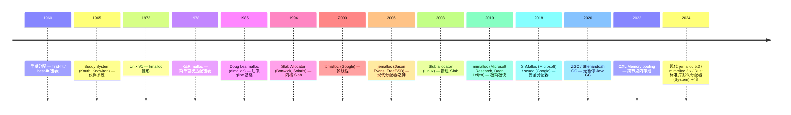

# 00-14 — 内存管理 + 分配器演化（早期 / 伙伴 / 链表 / Slab / GC / CXL）

> **核心问题：** 内存怎么从 1960s "整片划分"演化到现代多层 (page allocator + slab + tcmalloc)？伙伴系统、链表、Slab、自由列表是什么？为什么 jemalloc / mimalloc / tcmalloc 比系统 malloc 快？GC 算法演化（mark-sweep → 现代 ZGC）？KuAlloc 怎么做？
>
> **一句话答案：** 分配器演化遵循"**碎片**↔**速度**↔**并发**"三角权衡。70 年从 K&R 简单链表到现代多层 + lock-free + thread-local + size class。**伙伴系统**管粗粒度（page 级），**slab / freelist** 管细粒度（对象级）。GC 演化从 stop-the-world 到并发 / 无暂停。


---

## 1. 历史时间轴



---

## 2. 内存管理分层

```mermaid
flowchart TB
    A[应用 (malloc/free / new/delete)] --> B[用户态分配器<br/>jemalloc / tcmalloc / mimalloc / glibc]
    B --> C[syscall<br/>mmap / brk / sbrk]
    C --> D[内核虚拟内存<br/>page allocator]
    D --> E[内核物理内存<br/>buddy system]
    E --> F[内核 slab/slub/slob<br/>对象 cache]
    
    G[kernel 用户] -.-> F
    G -.-> D
```

每一层都是分配器 — 但解决不同粒度的问题。

---


### 3.1 简单链表 + 首次适配（First Fit）

```c
// K&R malloc 风格（简化）
struct header {
    size_t size;
    struct header *next;  // 自由链表
};

void *malloc(size_t n) {
    struct header *p, *prev;
    for (prev = freelist, p = prev->next; p; prev = p, p = p->next) {
        if (p->size >= n) {
            // 找到，切分
            if (p->size > n + sizeof(*p)) {
                struct header *new_p = (char *)p + n + sizeof(*p);
                new_p->size = p->size - n - sizeof(*p);
                new_p->next = p->next;
                prev->next = new_p;
            } else {
                prev->next = p->next;
            }
            return (char *)p + sizeof(*p);
        }
    }
    return sbrk(n);  // 没找到，向 OS 要
}
```

**问题：** 大量碎片。

### 3.2 最佳适配（Best Fit）

遍历所有空闲块找最小够用的 → 减少碎片，但更慢。

### 3.3 最差适配（Worst Fit）

每次都用最大块 → 几乎没人用（碎片更糟）。

### 3.4 下次适配（Next Fit）

从上次结束位置开始找 → 速度比 first fit 略快，但碎片相似。

### 3.5 三种基本策略对比

| 策略 | 速度 | 碎片 | 实现 |
|------|------|------|------|
| First Fit | 快 | 中 | 链表头扫 |
| Next Fit | 略快 | 中 | 同上加指针 |
| Best Fit | 慢 | 小 | 全扫 |
| Worst Fit | 慢 | 大 | 反向 |

---

## 4. 伙伴系统（Buddy System）

### 4.1 概念

Knuth + Knowlton 1965 提出。**所有块都是 2^k 大小**。

```
初始：一块 1024 KB
请求 100 KB：
  1024 拆成 512 + 512（伙伴）
  其中 512 拆成 256 + 256
  256 拆成 128 + 128
  分配一个 128 KB（>= 100 KB）

释放：
  归还 128 KB
  如果伙伴 128 也是空闲，合并成 256 KB
  继续合并...
```

### 4.2 优势

- ✅ 快速分配（O(log N) 找适合块）
- ✅ 快速合并（伙伴地址是计算的）
- ✅ 内部碎片可控（最多 50%）

### 4.3 劣势

- ❌ 内部碎片（请求 100KB 给 128KB，浪费 28KB）

### 4.4 应用

- **Linux 内核 page allocator** — 4KB 页面级伙伴
  - 阶（order）0-10：4KB / 8KB / 16KB / ... / 4MB
  - `__get_free_pages(GFP_KERNEL, order)` 接口
- **FreeBSD / Solaris 物理内存管理**
- **嵌入式 OS 通用粗粒度分配**

### 4.5 变体

- **Lazy Buddy** — 延迟合并
- **Binary Buddy** — 标准 2^k
- **Fibonacci Buddy** — Fibonacci 数列大小
- **Weighted Buddy** — 加权

---

## 5. Slab 分配器（对象级）

### 5.1 概念

Jeff Bonwick (Solaris 1994) 发明：

```
Cache (per object type)
  └── Slab (一组连续页)
       ├── Object 1
       ├── Object 2
       ├── Object 3
       └── ...
```

每个 Cache 专门一种对象（如 `task_struct`、`inode`）。

### 5.2 优势

- ✅ 同类对象 cache 局部性好
- ✅ 构造 / 析构开销摊销（先 init 一次，反复用）
- ✅ 减少碎片
- ✅ 与 CPU cache 配合

### 5.3 Linux 演化

| 版本 | 实现 |
|------|------|
| Linux 2.2+ | **SLAB** — 经典 Bonwick |
| Linux 2.6.22 | **SLUB** — 简化（Christoph Lameter 2008）|
| Linux 嵌入式 | **SLOB** — 极简（小内存设备）|

→ **现代 Linux 默认 SLUB**（更简单 + 更快）。

---

## 6. 自由链表（Free List）变体

### 6.1 隐式自由链表

每个 block 头部有 size + free 标志，通过 size 跳到下一个。

### 6.2 显式自由链表

只在空闲块中存 next 指针。

### 6.3 分离自由链表（Segregated Free Lists）

按大小分桶（size class），每个桶一个链表：

```
8 byte  → [free, free, ...]
16 byte → [free, ...]
32 byte → [free, free, free, ...]
64 byte → [free, ...]
128 byte → ...
```

- ✅ 快速找到合适大小
- ✅ 减少碎片
- ✅ 现代 malloc 主流（jemalloc / tcmalloc / mimalloc 都用）

---

## 7. 现代用户态分配器

### 7.1 dlmalloc / ptmalloc / glibc malloc

- **dlmalloc**（Doug Lea 1985）— 经典
- **ptmalloc** — dlmalloc 多线程版
- **ptmalloc2** — glibc 默认（Wolfram Gloger）

特点：
- bin（多个分桶）
- arena（每线程独立堆）
- chunked allocation

### 7.2 jemalloc（FreeBSD / Facebook）

- 2006 Jason Evans
- 现代分配器**事实标准**
- 多 arena（按 thread 哈希）
- size class 分离
- 大块用 mmap，小块用 chunk
- 主用：FreeBSD / Facebook / Redis / Rust 老版本

### 7.3 tcmalloc（Google）

- **Thread-Caching malloc**
- 每线程本地 cache
- 中央 heap 协调
- 主用：Google / Chromium / TCMalloc 在 Bazel

### 7.4 mimalloc（Microsoft Research）

- 2019 起，Daan Leijen
- 极简（11K LOC）
- 极快（比 jemalloc 快 1.5×）
- 主用：现代项目偏爱

### 7.5 SnMalloc / scudo

- **SnMalloc**（Microsoft）— 安全 + 性能
- **scudo**（Google）— 加固反 UAF

### 7.6 现代分配器对比

| 分配器 | 一句话 |
|--------|--------|
| **glibc malloc** | 标准但老 |
| **jemalloc** | 现代主流 |
| **tcmalloc** | Google 主推 |
| **mimalloc** | 简单极快 |
| **mmap / brk** | syscall 层 |
| **Rust System** | 默认（一般包装系统 malloc）|
| **Rust mimalloc / jemallocator** | Rust 第三方 |
| **Zig std.heap.GeneralPurposeAllocator** | Zig 标准 |
| **Zig std.heap.page_allocator** | Zig 直接 page |

---

## 8. 垃圾回收（GC）算法演化

### 8.1 主要 GC 算法

| 算法 | 特点 | 代表 |
|------|------|------|
| **Reference Counting** | 引用计数 | CPython / Swift / Rust Arc |
| **Mark-Sweep** | 标记-清扫 | 早期 LISP / Python(辅助) |
| **Mark-Compact** | 标记-压缩（消除碎片）| Java 老 |
| **Copying** | 半空间复制 | LISP 经典 |
| **Generational** | 分代（新生代 / 老年代）| Java / V8 |
| **Incremental** | 增量（小步执行）| Go / Lua |
| **Concurrent** | 并发（与 mutator 同时）| ZGC / Shenandoah |
| **Pauseless** | 无暂停 | Azul C4 / ZGC |
| **Region-based** | 区域 / RAII | Rust / Cyclone |
| **Reference Counting + Cycle Collector** | RC + 环收集 | CPython |

### 8.2 现代 Java GC 演化

```
Serial GC (单线程，小堆)
  ↓
Parallel GC (多线程，吞吐优先)
  ↓
CMS (Concurrent Mark Sweep) — 已弃 Java 14
  ↓
G1 GC (Region-based, JDK 9+ 默认)
  ↓
ZGC (无暂停 < 1ms, JDK 11+)
  ↓
Shenandoah (Red Hat 无暂停, JDK 12+)
```

### 8.3 Go GC

- 三色标记 + 并发
- 1ms STW 目标
- Go 1.5 起重写

### 8.4 V8 GC

- 分代（new + old space）
- 并发标记
- 增量压缩

---

## 9. 内核内存管理

### 9.1 Linux 内存子系统

```
┌────────────────────────────────────────┐
│ User space                             │
│  malloc / mmap / brk                   │
└────────────────────────────────────────┘
            ↕ syscall
┌────────────────────────────────────────┐
│ Linux Kernel mm/                      │
│ ┌────────────────────────────────────┐ │
│ │ VM (vmalloc / 虚拟内存)            │ │
│ ├────────────────────────────────────┤ │
│ │ SLUB / SLAB / SLOB (对象 cache)   │ │
│ ├────────────────────────────────────┤ │
│ │ Buddy Allocator (page level)      │ │
│ ├────────────────────────────────────┤ │
│ │ Page Frame Manager                 │ │
│ ├────────────────────────────────────┤ │
│ │ NUMA / Memory Hotplug / CXL       │ │
│ └────────────────────────────────────┘ │
└────────────────────────────────────────┘
            ↕
   物理 DRAM / NVDIMM / CXL
```

### 9.2 关键概念

- **page**（4KB / 大页 2MB / 1GB）
- **page table**（多级页表）
- **TLB**（translation lookaside buffer）
- **swap**（交换分区）
- **mmap**（文件 / 匿名映射）
- **OOM killer**（内存不足时杀进程）
- **memcg / cgroup memory**（容器内存限制）
- **NUMA**（非一致内存访问）

---

## 10. CXL / 持久内存（现代趋势）

详见 [00-18-storage-evolution](00-18-storage-evolution.md) § 3.3。

CXL 让"远程内存"看起来像本地内存，重塑分配器：
- CXL.mem — 内存扩展
- CXL.cache — 缓存一致性
- 内存池化（数据中心共享 RAM）

---

## 11. KuAlloc 设计借鉴


### 11.1 子仓库变体规划

| 变体 | 用途 | 借鉴 |
|------|------|------|
| **KuAlloc-buddy** | 物理 page 级 | Linux buddy |
| **KuAlloc-slab** | 对象级 cache | Linux SLUB |
| **KuAlloc-bump** | 简单 bump（嵌入式 / 一次分配多）| arena allocator |
| **KuAlloc-freelist** | 链表分配 | 教学 |
| **KuAlloc-jemalloc-like** | 现代多线程 | jemalloc 风格 |
| **KuAlloc-async** | 异步分配 | 实验性 |

### 11.2 KuAlloc 抽象接口

```zig
pub const Allocator = struct {
    pub fn alloc(self: *@This(), n: usize, alignment: usize) ?[]u8;
    pub fn realloc(self: *@This(), old: []u8, n: usize) ?[]u8;
    pub fn free(self: *@This(), buf: []u8) void;
};
```

主仓库定义 trait，子仓库各自实现。

### 11.3 KuMonOS / KuACOS / KuRTOS 各选不同变体


```
  Memory Allocator
    [*] KuAlloc-buddy (物理 page 级)
    [*] KuAlloc-slab (对象 cache)
    ( ) KuAlloc-jemalloc-like (用户态)
```

---

## 12. 名词词典

| 术语 | 含义 |
|------|------|
| **allocator** | 分配器 |
| **fragmentation** | 碎片 |
| **internal / external fragmentation** | 内部 / 外部碎片 |
| **first / best / worst / next fit** | 适配策略 |
| **buddy system** | 伙伴系统 |
| **slab / SLUB / SLOB** | Linux 内核分配器 |
| **size class** | 大小桶 |
| **arena** | 分配区域 |
| **chunk** | 块 |
| **bin** | 桶 |
| **page** | 页（典型 4KB）|
| **huge page / transparent huge pages** | 大页 |
| **NUMA** | Non-Uniform Memory Access |
| **TLB** | Translation Lookaside Buffer |
| **swap / paging** | 交换 / 分页 |
| **mmap / brk / sbrk** | 系统调用 |
| **garbage collection** | 垃圾回收 |
| **mark-sweep / mark-compact / copying / generational** | GC 算法 |
| **stop-the-world (STW)** | GC 暂停 |
| **concurrent / incremental GC** | 并发 / 增量 GC |
| **reference counting** | 引用计数 |
| **RAII** | Resource Acquisition Is Initialization |
| **borrow checker** | Rust 借用检查 |
| **ownership** | 所有权 |
| **CXL / persistent memory** | 现代内存 |

---

## 13. 进一步阅读

### 13.1 经典书 / 论文

- ***The C Programming Language*** (K&R) — 简单 malloc
- ***The Art of Computer Programming Vol 1*** (Knuth) — 分配算法
- ***Linux Kernel Development*** — Robert Love — kernel mm 章
- ***Understanding the Linux Virtual Memory Manager*** — Mel Gorman（免费）
- ***The Slab Allocator: An Object-Caching Kernel Memory Allocator*** — Bonwick 1994
- ***A Scalable Concurrent malloc(3)*** — Jason Evans (jemalloc 论文)
- ***mimalloc: Free List Sharding in Action*** — Microsoft 论文
- ***The Garbage Collection Handbook*** — Jones / Hosking / Moss

### 13.2 视频 / 资源

- [Linux MM Documentation](https://www.kernel.org/doc/html/latest/mm/)
- [jemalloc Wiki](https://github.com/jemalloc/jemalloc/wiki)
- [Andrei Alexandrescu C++ Allocators 演讲](https://www.youtube.com/results?search_query=alexandrescu+allocator)

### 13.3 本仓库笔记串联

- [00-07-os-evolution](00-07-os-evolution.md) — 内核 mm
- [00-18-storage-evolution](00-18-storage-evolution.md) § 3 — DRAM / 持久内存
- [00-15-concurrency-sync-evolution](00-15-concurrency-sync-evolution.md) — 多线程内存模型
- [00-04-micro-architecture-evolution](00-04-micro-architecture-evolution.md) — 缓存层次

### 13.4 本仓库本地资料

| 路径 | 用途 |
|------|------|
| `core/arceos/` | 组件化内核（含 allocator 模块）|
| `core/asterinas/` | Rust framework kernel allocator |
| `libc/musl/src/malloc/` | musl malloc（mallocng） |
| `libc/picolibc/` | picolibc malloc |

→ KuAlloc 实现时直接对照 musl mallocng + Linux buddy + SLUB。
