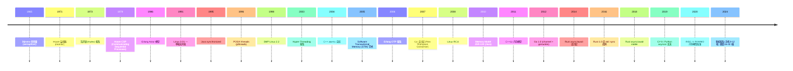
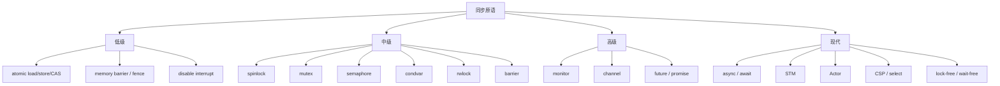

# 00-15 — 并发 + 同步原语 + 内存模型演化

>
> **一句话答案：** 并发 = **多 thread / 协程 / 任务交错执行**；同步 = **协调它们的工具**。50 年从锁 → 信号量 → 原子操作 → channel → STM → actor → async/await 演化。**内存模型**是硬件层 + 编译器层共同的"happens-before"约定 — x86 强（TSO）/ ARM-RISCV 弱。

按 [user_learning_style](../CLAUDE.md) 5 步：① 大框架 → ② 历史 → ③ 同步原语 → ④ 内存模型 → ⑤ 设计要点归纳（具体项目设计由用户学完后自定）。

---

## 1. 历史时间轴



---

## 2. 同步原语谱系



---

## 3. 低级原语

### 3.1 原子操作（atomic）

最基础的同步：硬件保证操作不可分割。

```c
// C11
#include <stdatomic.h>
atomic_int x = 0;
atomic_fetch_add(&x, 1);  // x++ 原子

// CAS (Compare-And-Swap)
int expected = 0;
atomic_compare_exchange_strong(&x, &expected, 1);
```

硬件实现：
- **x86**：`LOCK` 前缀 + `XADD / CMPXCHG`
- **ARM**：`LDREX / STREX` 或 `LSE` 扩展
- **RISC-V**：`A 扩展` (LR/SC + AMO)

### 3.2 内存屏障 / fence

```c
atomic_thread_fence(memory_order_acquire);
atomic_thread_fence(memory_order_release);
```

- **acquire**：读屏障，之后的访问不能提前
- **release**：写屏障，之前的访问不能延后
- **seq_cst**：全顺序（最强）

---

## 4. 中级原语

### 4.1 Spinlock

```c
while (atomic_test_and_set(&lock)) { /* spin */ }
// critical section
atomic_clear(&lock);
```

- ✅ 极快（无 syscall）
- ❌ 长时间持有浪费 CPU
- 用：内核短临界区 / RTOS

### 4.2 Mutex（互斥锁）

```c
pthread_mutex_t m = PTHREAD_MUTEX_INITIALIZER;
pthread_mutex_lock(&m);
// critical section
pthread_mutex_unlock(&m);
```

- 短期 spin + 长期 sleep（hybrid）
- futex (fast userspace mutex) — Linux 2.6+ 高效实现
- 实现：内核辅助 + 用户态 fast path

### 4.3 Semaphore（信号量）

Dijkstra 1965。计数信号量，支持多个槽位。

```c
sem_t sem;
sem_init(&sem, 0, 5);  // 5 个槽
sem_wait(&sem);  // 占一个
// ...
sem_post(&sem);  // 还一个
```

### 4.4 Condvar（条件变量）

配合 mutex 的"等待 - 通知"：

```c
pthread_mutex_lock(&m);
while (!condition) pthread_cond_wait(&cv, &m);
// 满足条件，做事
pthread_mutex_unlock(&m);

// 别处：
pthread_mutex_lock(&m);
condition = true;
pthread_cond_signal(&cv);
pthread_mutex_unlock(&m);
```

### 4.5 RWLock（读写锁）

```c
pthread_rwlock_rdlock(&rw);  // 多个 reader
pthread_rwlock_wrlock(&rw);  // 单个 writer
```

读多写少场景。

### 4.6 Barrier（屏障）

所有线程到达屏障才继续：

```c
pthread_barrier_wait(&barrier);
```

---

## 5. 高级原语

### 5.1 Monitor（监视器）

Hoare 1971 提出 — 类似 mutex 但更高级抽象（Java synchronized）。

```java
public synchronized void deposit(int amount) {
    balance += amount;
    notifyAll();
}
```

### 5.2 Channel（CSP / Go）

```go
ch := make(chan int, 10)  // 缓冲 channel
go func() { ch <- 42 }()
v := <-ch
```

来自 Hoare CSP（1978）。Go 主推："**Don't communicate by sharing memory; share memory by communicating.**"

### 5.3 Future / Promise

```rust
let fut = async_operation();
let result = fut.await;
```

Rust / JS / Python / C++ / Java CompletableFuture。

### 5.4 Actor 模型

Erlang / Akka / Rust Actix。
- 每个 actor 一个邮箱
- 消息传递不共享
- 容错（"let it crash" 哲学）

---

## 6. 现代异步原语

### 6.1 async / await

```python
async def fetch():
    response = await aiohttp.get(url)
    return await response.json()
```

支持语言：
- C# 5+ (2012)
- JavaScript ES2017
- Python 3.5 (2015)
- Rust 1.39 (2019)
- C++ 20 (2020)
- Swift 5.5 (2021)
- Zig 0.x（多次设计变更）

### 6.2 STM（Software Transactional Memory）

```haskell
atomically $ do
  x <- readTVar account_a
  writeTVar account_a (x - 100)
  y <- readTVar account_b
  writeTVar account_b (y + 100)
```

- ✅ 组合性好（多个事务复合）
- ❌ 性能差
- 主用：Haskell / Clojure

---

## 7. 内存模型（核心难点）

### 7.1 各架构内存模型

| 架构 | 模型 | 强度 |
|------|------|------|
| **x86 / x86_64** | TSO (Total Store Ordering) | 强（store-load 重排）|
| **ARM v7** | Weak | 弱（多种重排）|
| **AArch64** | Weak (改进) | 弱-中 |
| **RISC-V** | RVWMO (RISC-V Weak Memory Order) | 弱 |
| **POWER** | Weak | 极弱 |
| **Alpha** | 极弱（已死）| 极弱 |
| **GPU** | Scoped | 独特 |

### 7.2 happens-before 关系

任何并发模型都基于 happens-before：
- A happens-before B → A 的写对 B 可见
- 同 thread 程序顺序 hb
- mutex unlock hb 下次 lock
- thread create hb 新 thread 第一个动作
- atomic release-acquire 配对建立 hb

### 7.3 C++ / Rust 内存序

```c++
std::atomic<int> x;
x.store(1, std::memory_order_relaxed);   // 无顺序约束
x.store(1, std::memory_order_release);   // 释放
x.load(std::memory_order_acquire);       // 获取
x.store(1, std::memory_order_seq_cst);   // 全序（默认）
```

### 7.4 RVWMO（RISC-V Weak Memory Order）

- 2020 批准
- 类 ARM weak 模型
- 读写可重排（除非 fence）
- `fence rw,rw` 全屏障
- `fence r,r` / `fence w,w` 部分

```asm
fence.i        // instruction fence
fence rw, rw   // 全 memory fence
```

---

## 8. Lock-Free 数据结构

### 8.1 概念

- **Wait-free**：每个操作有界步内完成
- **Lock-free**：至少一个 thread 取得进展
- **Obstruction-free**：单 thread 在隔离条件下进展

### 8.2 经典 lock-free 数据结构

| 结构 | 实现 |
|------|------|
| **Lock-free queue** | Michael-Scott queue / LCRQ |
| **Lock-free stack** | Treiber stack |
| **Lock-free hash table** | Cliff Click / Java ConcurrentHashMap |
| **Lock-free skip list** | Java ConcurrentSkipListMap |
| **RCU** (Read-Copy-Update) | Linux kernel |
| **hazard pointers** | 安全内存回收 |
| **epoch-based reclamation** | 同上替代 |

### 8.3 RCU（Linux 内核标志）

```c
rcu_read_lock();
ptr = rcu_dereference(global);
// 读 ptr...
rcu_read_unlock();

// 写者：
new = ...;
rcu_assign_pointer(global, new);
synchronize_rcu();  // 等所有读者完成
free(old);
```

- 读者无开销（只是 lock disable preempt）
- 写者承担同步成本
- Linux 内核大量用

---

## 9. 各语言并发模型对比

| 语言 | 并发原语 |
|------|---------|
| **C** | pthreads + atomic |
| **C++** | std::thread / std::atomic / coroutine (C++20) |
| **Java** | Thread + synchronized + CompletableFuture + Virtual Threads (Loom) |
| **Go** | goroutine + channel + sync |
| **Rust** | thread + Mutex + RwLock + channel + async/await + Send/Sync |
| **Python** | threading + multiprocessing + asyncio |
| **JS** | Promise + async/await + Worker |
| **Erlang / Elixir** | Actor + message |
| **Haskell** | STM + threads + async |
| **Kotlin** | coroutine + Channel |
| **Swift** | actor + async/await + Task |
| **Zig** | async（设计变更中）+ std.Thread |
| **Clojure** | atom / agent / ref / STM |

### 9.1 Rust Send / Sync

```rust
// Send: T 可跨 thread 发送
// Sync: &T 可跨 thread 共享
unsafe impl Send for MyType {}
unsafe impl Sync for MyType {}
```

编译时检查并发安全 → Rust "无数据竞争"承诺基础。

---

## 10. 调度器与同步原语的设计要点（不预设具体项目）


### 10.1 调度器设计可考虑的子变体（行业通用分类）

- FIFO 时间片调度器
- 优先级调度器
- 异步原生调度器（有栈协程）
- 异步原生调度器（无栈协程）
- 混合调度器
- 网络调度器（**未决**）
- 后续可加：deadline / EDF / CFS / O(1) / lottery / stride 等

→ 具体仓库命名 / API / 实施路径等用户学完后由用户自定，本节不预设具体名字。

### 10.2 各类设计可学之处（不预设具体项目）

| 来自 | 可学的设计 |
|------|-----------|
| Linux RCU | 读多写少快路径 |
| Embassy | Rust async-on-bare-metal |
| Go runtime | M:N 调度 |
| Rust tokio | work-stealing |
| seL4 | 形式化锁 |

---

## 11. 名词词典

| 术语 | 含义 |
|------|------|
| **concurrency** | 并发（交错） |
| **parallelism** | 并行（同时） |
| **race condition** | 竞态 |
| **data race** | 数据竞争 |
| **deadlock** | 死锁 |
| **livelock** | 活锁 |
| **starvation** | 饿死 |
| **atomic** | 原子操作 |
| **CAS / DCAS** | Compare-And-Swap |
| **memory barrier / fence** | 内存屏障 |
| **memory model** | 内存模型 |
| **TSO / RVWMO / weak / sequential consistency** | 内存模型类型 |
| **happens-before** | hb 关系 |
| **monitor** | 监视器 |
| **mutex / lock** | 互斥锁 |
| **semaphore** | 信号量 |
| **condvar** | 条件变量 |
| **rwlock** | 读写锁 |
| **barrier** | 屏障 |
| **futex** | 快速 userspace mutex |
| **spinlock** | 自旋锁 |
| **RCU** | Read-Copy-Update |
| **hazard pointer / epoch GC** | lock-free 内存回收 |
| **lock-free / wait-free** | 无锁 / 无等待 |
| **STM** | Software Transactional Memory |
| **CSP** | Communicating Sequential Processes |
| **actor model** | actor 模型 |
| **goroutine / coroutine / fiber** | 协程类 |
| **channel** | 通道 |
| **future / promise** | 期物 |
| **async / await** | 异步关键字 |
| **green threads / virtual threads** | 用户态线程 |

---

## 12. 进一步阅读

### 12.1 经典书

- ***The Art of Multiprocessor Programming*** — Herlihy / Shavit
- ***C++ Concurrency in Action*** — Anthony Williams
- ***Java Concurrency in Practice*** — Brian Goetz
- ***Concurrent Programming on Windows*** — Joe Duffy
- ***Programming Erlang*** — Joe Armstrong（Actor）

### 12.2 论文

- "A Memory Model for Concurrent Programming" (Linux MM doc)
- "C++ memory model" — Hans Boehm
- "RVWMO" RISC-V 规范 ch. 14
- "Read-Copy-Update" — Paul McKenney

### 12.3 本仓库笔记串联

- [00-07-os-evolution](00-07-os-evolution.md) § 6 异步内核
- [00-14-memory-allocator-evolution](00-14-memory-allocator-evolution.md) — 多线程分配
- [00-04-micro-architecture-evolution](00-04-micro-architecture-evolution.md) — 缓存一致性

### 12.4 本仓库本地资料

| 路径 | 用途 |
|------|------|
| `core/seL4/` | 微内核同步原语 |
| `async/tokio/` | Rust runtime work-stealing |
| `async/monoio/` | io_uring runtime |
| `core/asterinas/` | Rust framework concurrency |
