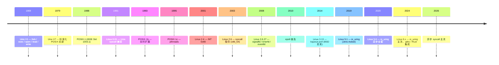

# 00-16 — 系统调用 + ABI 演化（POSIX / glibc / Linux API / io_uring）

>
> **一句话答案：** syscall = **OS 内核 ABI**——固定 calling convention 让用户态进入内核。50 年从软中断（INT）演化到专用指令（syscall / svc / ecall）。**POSIX = Unix 标准 API**，**Linux API ⊃ POSIX**（多 io_uring / signalfd / inotify 等扩展）。glibc / musl 是 C 库实现 POSIX，包装 syscall。


---

## 1. 历史时间轴



---

## 2. syscall 机制各架构

### 2.1 x86 演化

```
Linux 2.0-2.4 (1990s): INT 0x80
  EAX = syscall number
  EBX, ECX, EDX, ESI, EDI, EBP = args
  INT 0x80 → 内核
  → return in EAX

Linux 2.6+ (x86_64): syscall instruction
  RAX = syscall number
  RDI, RSI, RDX, R10, R8, R9 = args (注意 R10 不是 RCX)
  syscall → 内核
  → return in RAX
```

### 2.2 ARM

```
ARM AArch32: SVC (supervisor call, 旧 SWI)
  R7 = syscall number
  R0-R5 = args
  SVC #0
  → return in R0

AArch64: SVC #0
  X8 = syscall number
  X0-X5 = args
  SVC #0
  → return in X0
```

### 2.3 RISC-V

```
ecall instruction
  a7 = syscall number
  a0-a5 = args
  ecall → 进 S-mode (or M-mode if from S)
  → return in a0
```

### 2.4 LoongArch

```
syscall 0
  a7 = syscall number
  a0-a5 = args
```

### 2.5 PowerPC / SPARC / MIPS

各有 sc / ta / syscall 指令，但都已退出主流。

---

## 3. POSIX 标准

### 3.1 POSIX 历史

| 标准 | 内容 |
|------|------|
| **POSIX.1** (1988) | 系统接口（fork / exec / open / ... ）|
| **POSIX.1b** (1993) | 实时扩展（aio / timer / message queue）|
| **POSIX.1c** (1995) | 线程（pthreads）|
| **POSIX.2** | shell + utilities |
| **POSIX:2001 / 2008 / 2024** | 整合更新 |
| **SUS (Single UNIX Specification)** | POSIX 超集，The Open Group |

### 3.2 POSIX 核心接口

| 类别 | 函数 |
|------|------|
| 进程 | fork / exec / wait / kill / exit |
| 文件 | open / close / read / write / lseek / stat |
| 目录 | opendir / readdir / mkdir |
| 内存 | mmap / munmap / mprotect |
| 信号 | signal / sigaction / sigprocmask |
| 线程 | pthread_create / pthread_mutex / cond / ... |
| Socket | socket / bind / listen / accept / connect |
| IPC | pipe / msgget / shmget / semget |
| 时间 | clock_gettime / nanosleep |
| 用户/组 | getuid / setuid / getgid |

### 3.3 POSIX vs Linux API

```
POSIX = 标准（Unix 通用）
Linux API = Linux kernel 提供的全部接口

Linux API ⊃ POSIX
        ↑
      Linux 独有：
      - epoll / signalfd / timerfd / eventfd / inotify
      - io_uring
      - clone (POSIX fork 超集)
      - mmap MAP_HUGETLB / MAP_POPULATE
      - prctl
      - perf_event_open
      - bpf
      - landlock
      - ...
```

### 3.4 macOS / FreeBSD / Solaris API

- **macOS**：BSD + Mach 风格 + IOKit + CoreFoundation
- **FreeBSD**：POSIX + kqueue + jail + capsicum
- **Solaris**：POSIX + zones + DTrace
- **Windows**：完全不 POSIX（NT API），WSL 提供兼容层

---

## 4. C 库（glibc / musl）作 syscall 中介

```
应用 → C 库函数（如 read()） → syscall 指令 → 内核
```

### 4.1 主流 C 库

| 库 | 主用 |
|----|------|
| **glibc** | 多数 Linux distro |
| **musl** | Alpine / Buildroot / 静态链接 |
| **uclibc / uclibc-ng** | 嵌入式 |
| **picolibc** | 微控制器 |
| **bionic** | Android |
| **newlib** | 嵌入式 / Cygwin |
| **dietlibc** | 极小 |
| **klibc** | Linux 早期启动 |
| **relibc** | Redox（Rust）|
| **MSVCRT / UCRT** | Windows |

### 4.2 glibc vs musl 对比

| 维度 | glibc | musl |
|------|-------|------|
| 大小 | ~20 MB | ~600 KB |
| 性能 | 各操作很快 | 一般 |
| 静态链接 | 不友好 | 完美 |
| POSIX | 100% + GNU 扩展 | 100% |
| 线程 | NPTL | 自己实现 |
| 主用 | Debian / Fedora | Alpine / 嵌入式 |

### 4.3 C 库怎么调 syscall（musl 实例）

```c
// musl src/unistd/read.c
ssize_t read(int fd, void *buf, size_t count) {
    return syscall(SYS_read, fd, buf, count);
}

// syscall macro 展开：
// AArch64:
asm volatile("svc #0" : "=r"(x0) : ...);
// RISC-V:
asm volatile("ecall" : "=r"(a0) : ...);
// x86_64:
asm volatile("syscall" : "=r"(rax) : ...);
```

### 4.4 libc 全谱系：POSIX / GNU / musl / Linux API 关系

#### 4.4.1 概念分层（容易混的 4 个名字）

```
┌──────────────────────────────────────────────────────────────────┐
│  Application (your code)                                         │
└──────────────────────────────────────────────────────────────────┘
              ↓ 调 fopen/printf/fork/pthread_create
┌──────────────────────────────────────────────────────────────────┐
│  ① ANSI C / ISO C (语言标准库 — stdio/stdlib/string/math)        │
│     C89 (1989) / C99 (1999) / C11 (2011) / C17 / C23             │
│     约 200 个函数，与 OS 无关，纯算法 / 字符串 / IO              │
└──────────────────────────────────────────────────────────────────┘
              ↓ 涉及 OS 服务时（fopen 内部调 open）
┌──────────────────────────────────────────────────────────────────┐
│  ② POSIX.1 (IEEE Std 1003.1, "Portable Operating System")       │
│     约 1300 个函数 — fork/exec/pipe/signal/pthread/... 跨 Unix    │
│     POSIX.1-2017 是当前最新主流版本（前身 1988/1993/1995/2008）  │
└──────────────────────────────────────────────────────────────────┘
              ↓ POSIX 不够时调平台扩展
┌──────────────────────────────────────────────────────────────────┐
│  ③ Platform-specific API（每平台不同，POSIX 之外的扩展）         │
│  ┌────────────────┬──────────────────┬──────────────────────────┐│
│  │  Linux API     │  GNU 扩展         │  BSD / macOS 扩展        ││
│  │  - epoll       │  - getline()      │  - kqueue                ││
│  │  - inotify     │  - asprintf()     │  - sendfile (BSD 派生)   ││
│  │  - signalfd    │  - tee()          │  - waitid extras         ││
│  │  - timerfd     │  - sync_file_range│  - vfork extras          ││
│  │  - eventfd     │  - statfs() 扩展  │                          ││
│  │  - io_uring    │  - qsort_r()      │                          ││
│  │  - mmap MAP_*  │  - strndupa()     │                          ││
│  │  - clone()     │  - mempcpy()      │                          ││
│  │  - prctl()     │                   │                          ││
│  └────────────────┴──────────────────┴──────────────────────────┘│
└──────────────────────────────────────────────────────────────────┘
              ↓ 这些都靠 libc 实现
┌──────────────────────────────────────────────────────────────────┐
│  ④ libc 实现（glibc / musl / uClibc-ng / picolibc / ...）        │
└──────────────────────────────────────────────────────────────────┘
              ↓ 最终通过 syscall 进入内核
┌──────────────────────────────────────────────────────────────────┐
│  Kernel (Linux / FreeBSD / macOS XNU / Windows NT)               │
└──────────────────────────────────────────────────────────────────┘
```

#### 4.4.2 ANSI C / POSIX / GNU / Linux API — 是什么 + 谁定 + 关系

| 层 | 标准制定方 | 数量 | 跨平台？ | 例子 |
|----|----------|------|---------|------|
| **ANSI C / ISO C** | ANSI X3J11 / ISO WG14（1989 起）| ~200 函数 | ✅ 完全跨平台（任何 C 编译器都有）| `printf` / `malloc` / `strcpy` / `fopen` |
| **POSIX.1** | IEEE Std 1003.1 (Portable Operating System Interface for uniX) | ~1300 函数 | ✅ 跨 Unix-like（Linux/macOS/FreeBSD/Solaris/AIX）| `fork` / `exec` / `pipe` / `signal` / `pthread_create` / `open` |
| **GNU 扩展** | GNU 项目 / FSF（Stallman 1984+）| 数百函数 | ❌ 只在 glibc | `getline()` / `asprintf()` / `qsort_r()` / `mempcpy()` |
| **Linux API** | Linus + 社区，无标准化 | 数百 syscall | ❌ 只在 Linux | `epoll` / `inotify` / `clone()` / `io_uring` / `signalfd` |
| **BSD 扩展** | UC Berkeley + 各 BSD | 数百函数 | ❌ 只在 BSD | `kqueue` / `sendfile`（早于 Linux）|
| **macOS / Darwin** | Apple | 自家扩展 | ❌ macOS only | `dispatch_*` / `kqueue`（macOS 沿用 BSD）|
| **Windows API** | Microsoft | 数千 API | ❌ Windows only | Win32 / WinRT / UWP / WinAPI |

**关键关系：**

- **ANSI C ⊂ POSIX**：POSIX 包含完整 ISO C + 新增 OS 接口
- **POSIX ⊂ glibc API（Linux 上）**：glibc 实现 POSIX + GNU 扩展 + Linux 特有
- **POSIX ⊂ macOS API**：macOS 也实现 POSIX，但加 BSD/Darwin 扩展
- **musl ⊂ glibc API**：musl 严格只实现 POSIX + 少量 Linux API，**不实现 GNU 扩展** → 这是 musl/glibc 不兼容的源头
- **Bionic（Android）**：实现部分 POSIX + Android 特有；**不完整** POSIX

#### 4.4.3 全 libc 详细对比（10+ 实现）

| libc | 主用 | 大小 | POSIX 完整度 | GNU 扩展 | Linux API | C++ 标准库 | 协议 | 启动 |
|------|------|------|-------------|---------|----------|----------|------|------|
| **glibc** | Debian / Fedora / RHEL / SUSE / Ubuntu | ~20 MB | 100% | ✅ 全 | ✅ 全 | libstdc++ 配合 | LGPL-2.1+ | crt0/_init/_fini |
| **musl** | Alpine / Buildroot / 嵌入式 / 静态链接 | ~600 KB | 100% | ❌ 故意不实现 | 部分 | 自带 | MIT | crt1 简单 |
| **uClibc** | 早期嵌入式（已不维护，2012 后转 uClibc-ng）| ~400 KB | ~80% | 部分 | 部分 | 配合 | LGPL | 简单 |
| **uClibc-ng** | 嵌入式现代化（uClibc fork，活跃）| ~400 KB | ~85% | 部分 | 部分 | 配合 | LGPL | 同上 |
| **picolibc** | 微控制器 / RTOS 集成 | ~50 KB | ~50% (最小子集) | ❌ | ❌ | 不带 | BSD | 极简 |
| **newlib** | 嵌入式 / Cygwin / 教学 | ~200 KB | ~70% | ❌ | ❌ | 部分 | BSD-style | 简单 |
| **bionic** | Android 全平台 | ~1 MB | ~80% | ❌ | 部分 | 自带 libc++ | BSD | Android 特定 |
| **dietlibc** | 极小静态链接（已少用）| ~70 KB | ~60% | ❌ | 部分 | 不带 | GPL-2 | 极简 |
| **klibc** | Linux 早期 init / initramfs | ~100 KB | ~40% | ❌ | 部分 | 不带 | BSD | initramfs 用 |
| **baselibc** | 裸机 MCU 最小 | ~10 KB | ~30% | ❌ | ❌ | 不带 | MIT | 自定义 |
| **relibc** | Redox OS（Rust 写）| ~1 MB | ~80% | ❌ | 部分 | C++ 不兼容 | MIT | Rust runtime |
| **wasi-libc** | WebAssembly WASI | ~500 KB | WASI 子集 | ❌ | ❌ | 不带 | Apache | wasm 入口 |
| **MSVCRT** | Windows 老经典 | 系统自带 | ❌（Windows 风）| ❌ | ❌ | MSVC | 闭源 | Win32 启动 |
| **UCRT** | Windows 10+ 现代 | 系统自带 | ❌ | ❌ | ❌ | MSVC | 闭源 | Win32 |
| **mingw-w64** | Windows + MinGW GCC | 几 MB | 部分 POSIX | 部分 | ❌ | libstdc++ | MIT/PD | Win32 |
| **Cygwin newlib** | Cygwin POSIX 兼容层 | 几 MB | 95% | 部分 | ❌ | libstdc++ | LGPL | POSIX 模拟 |
| **Apple libSystem** | macOS / iOS（POSIX 子集 + Darwin）| 系统自带 | 100% | ❌ | ❌（用 Darwin）| libc++ | APSL | dyld 启动 |

#### 4.4.4 musl vs glibc 实战差异（最频繁踩坑点）

| 行为 | glibc | musl | 后果 |
|------|-------|------|------|
| `getline()` | ✅ GNU 扩展 | ❌ 不实现 | musl 上代码 link 失败 |
| `qsort_r()` | ✅ + BSD 不同签名 | 部分 | 跨 libc 移植要 #ifdef |
| 默认线程栈大小 | 8 MB | 128 KB | musl 上深递归易爆栈 |
| DNS 解析 | NSS（可插件）| 简单 stub | musl 上某些容器 DNS 异常 |
| iconv | 完整 | 子集 | musl 上某些字符集不支持 |
| Unicode 排序 | locale 完整 | C locale only | 国际化软件可能报错 |
| Lazy binding | ✅ PLT/GOT 完整 | 简化 | musl 启动稍快 |
| `printf("%n")` | ✅ | 默认禁（安全）| 老代码可能编译失败 |
| Backtrace | `backtrace()` 函数有 | ❌ | 调试体验差 |
| 二进制兼容性 | ABI 稳定 | ABI 演进 | musl 升版可能要重编译 |

→ Alpine Linux 用 musl 是 **故意选择极简**；如果你跑 oracle / nodejs / chromium 这种依赖 glibc 扩展的软件，可能要装 glibc 兼容层（`apk add gcompat`）。

### 4.5 Linux noMMU + uClibc-ng 专题

#### 4.5.1 没 MMU 的 CPU 怎么跑 Linux？

**uClinux** (1998 起，2003 主线合并) 让 Linux 跑在**没有 MMU 的 CPU** 上（CONFIG_MMU=n）：
- ARM Cortex-M3/M4/M7（小 MCU）
- BlackFin / ColdFire / 老 m68k
- Xtensa LX6 / RISC-V RV32E 无 MMU
- 8-bit AVR（极限尝试）

**关键认知**：noMMU Linux **不是软件模拟 MMU**（性能不可用），**也不是退化为 RTOS**（仍是完整 Linux 内核 + VFS + 网络栈）。是**真的没 MMU + ABI 妥协 + 工具链魔法**。

#### 4.5.2 6 个核心妥协

| 维度 | 有 MMU 的 Linux | noMMU Linux |
|------|----------------|-------------|
| **地址空间** | 每进程独立虚地址 | **所有进程共享物理地址** |
| **fork()** | COW 复制页表 | **不可用** — 没 page table 没法 COW |
| **替代** | fork + exec | **vfork() + execve()** 或 **clone()** |
| **mmap** | 全套 | 只 MAP_SHARED / MAP_FIXED |
| **可执行格式** | ELF | **FDPIC ELF** 或 **bFLT (binary Flat)** |
| **内存碎片** | VM 隔离不影响 | **物理内存碎片化**（长跑可能 alloc 失败）|
| **进程隔离** | 强（写别人内存 SEGV）| **零** — 任何进程能写任何地址 |
| **安全** | userspace 不能毁内核 | **一个 buggy 进程能 panic 整机** |

#### 4.5.3 FDPIC ELF（位置无关 + 段独立重定位）

普通 ELF 假设进程独享虚地址。FDPIC 让每个段（text/data/rodata/bss）**独立分配 + 独立重定位**：

```c
// noMMU 上：函数指针不再是单一地址
//   void (*fp)() 实际是 struct { void *code; void *data; }
// 调用 fp() 编译为：
//   load r0, fp.data    # 设 GOT 基地址（这个进程的 data 段位置）
//   load pc, fp.code    # 跳转
```

GCC `-mfdpic` flag 启用。**只有 FDPIC + uClibc-ng 才能跑多进程**——传统 ELF 在 noMMU 上只能跑单进程。

#### 4.5.4 noMMU 上 libc 选择

| libc | noMMU 支持 | 备注 |
|------|----------|------|
| **uClibc-ng** | ✅ 主流 | 专为嵌入式 / noMMU 设计，FDPIC 支持完整 |
| **musl** | 部分 | 不支持 FDPIC，只能跑单进程 noMMU 系统 |
| **picolibc** | ✅ 但功能少 | 更适合裸机 RTOS，noMMU Linux 也能用 |
| **glibc** | ❌ | 强依赖 MMU，不能 noMMU |

**典型组合：** Linux noMMU + uClibc-ng + busybox + FDPIC ELF。

#### 4.5.5 noMMU vs RTOS 选型

| 维度 | Linux noMMU | FreeRTOS / RTOS |
|------|-------------|-----------------|
| 内核结构 | 完整 Linux 宏内核 | 微/单内核简版 |
| 文件系统 | VFS + ext4/jffs2/squashfs | 通常无（要加 FATfs）|
| 网络栈 | 完整 BSD socket + TCP/IP | 通常需 lwIP |
| 进程模型 | POSIX 多进程（共享地址）| 任务（线程）模型 |
| shell / 工具 | busybox 全套 | 需自己实现 |
| 实时性 | 软实时 | **硬实时** |
| 代码体积 | 1-2 MB+ kernel + rootfs | 几 KB - 几十 KB |
| 学习曲线 | 平滑（与桌面 Linux 同 API）| 陡（每家 API 不同）|

**互补不替代：** noMMU Linux 适合"想要 POSIX + 工具集 + 网络栈"但芯片小的场景；RTOS 适合"硬实时 + 极小 footprint"场景。中间地带（既要硬实时又要 POSIX）有 RT-Smart / Zephyr / NuttX。

#### 4.5.6 noMMU 历史里程碑

- **1998** uClinux 项目启动（Greg Ungerer + D. Jeff Dionne）
- **2000** uClibc 0.9 发布（专配 uClinux）
- **2003** uClinux patch 合并 Linux 2.5/2.6 主线（CONFIG_MMU=n）
- **2010s** ARM Cortex-M 兴起，noMMU Linux 重新流行
- **2012** uClibc-ng 从 uClibc fork（uClibc 不维护后接班）
- **2020s** RISC-V 32E / 无 MMU 嵌入式让 noMMU Linux 在新架构延续

→ noMMU Linux 是 **"我有 4MB RAM 但又想用 Linux 工具链"** 的妥协解。不优雅但实用。

---

## 5. 异步 I/O 演化

### 5.1 select (1983) → poll (1986)

```c
// select - 老
fd_set rfds;
select(maxfd+1, &rfds, NULL, NULL, &timeout);

// poll - 改进
struct pollfd fds[N];
poll(fds, N, timeout);
```

问题：每次都要扫所有 fd（O(N)）。

### 5.2 epoll (Linux 2.6, 2003)

```c
int ep = epoll_create1(0);
struct epoll_event ev;
ev.events = EPOLLIN;
ev.data.fd = sock;
epoll_ctl(ep, EPOLL_CTL_ADD, sock, &ev);

while (1) {
    int n = epoll_wait(ep, events, MAX, -1);
    for (int i = 0; i < n; i++) { /* handle */ }
}
```

- O(1) 注册 / O(只活跃 fd) 等待
- 支持 edge-triggered / level-triggered
- 主导 Linux 高性能服务器

### 5.3 kqueue (FreeBSD 2000)

类似 epoll 但更早 + 支持更多事件类型（文件 / 信号 / 进程 / timer）。

### 5.4 IOCP (Windows)

I/O Completion Port — Windows 异步标准。

### 5.5 io_uring（Linux 5.1, 2019，革命性）

```c
struct io_uring ring;
io_uring_queue_init(QUEUE_DEPTH, &ring, 0);

// 提交 read
struct io_uring_sqe *sqe = io_uring_get_sqe(&ring);
io_uring_prep_read(sqe, fd, buf, len, 0);
io_uring_submit(&ring);

// 收 completion
struct io_uring_cqe *cqe;
io_uring_wait_cqe(&ring, &cqe);
ssize_t result = cqe->res;
io_uring_cqe_seen(&ring, cqe);
```

特点：
- **零 syscall 提交**（共享内存 ring）
- 真异步（任何 syscall）
- 比 epoll 快 2-3×
- 主用：高性能数据库 / 监控 / Rust monoio

→ 详见笔记 [01-06-zig-async](01-06-zig-async.md) / [00-07-os-evolution](00-07-os-evolution.md) § 6。

---


### 6.1 fd 风格 API

让一切是 file descriptor，便于 epoll / select：

| API | 用途 |
|-----|------|
| **signalfd** | signal 当 fd |
| **timerfd** | timer 当 fd |
| **eventfd** | 事件 fd |
| **inotify** | 文件系统事件 |
| **memfd** | 匿名内存 fd |
| **userfaultfd** | 用户态缺页处理 |
| **pidfd** | 进程 fd |

### 6.2 现代特性

| 特性 | 用途 |
|------|------|
| **clone3** | 进程创建（fork 超集）|
| **prctl** | 进程控制 |
| **bpf / eBPF** | 内核可编程 |
| **Landlock** (5.13+) | 用户态自管沙箱 |
| **Pidfd** | 进程引用安全 |
| **futex2** | 现代 futex |
| **io_uring** | 异步 I/O |
| **userfaultfd** | 用户态 page fault |
| **BPF LSM** | BPF 安全模块 |

---

## 7. ABI（Application Binary Interface）

ABI 比 API 更严：包括寄存器约定 / 栈布局 / 符号修饰 / 异常处理。

### 7.1 主流 ABI

| ABI | 平台 |
|-----|------|
| **System V AMD64 ABI** | Linux / macOS x86_64 |
| **Microsoft x64 ABI** | Windows x64 |
| **AAPCS / AAPCS64** | ARM Procedure Call |
| **RISC-V LP64 / LP64D** | RISC-V 64-bit |
| **PowerOpen ABI / ELFv2** | PowerPC |
| **Solaris SPARCv9 ABI** | SPARC |

### 7.2 ABI 关键约定

- **calling convention**：参数怎么传（寄存器 / 栈）
- **return convention**：返回值怎么传
- **callee-saved / caller-saved**：哪些寄存器谁负责保存
- **stack alignment**：典型 16 字节
- **vararg handling**：va_list 实现
- **exception handling**：DWARF / SEH / Itanium ABI

---

## 8. 跨平台抽象

### 8.1 POSIX 兼容层

- **WSL** (Windows Subsystem for Linux) — Linux syscall 在 Windows
- **Cygwin** — POSIX on Windows
- **MinGW** — 仅编译时
- **Cosmopolitan** — 单文件可执行多平台
- **WASI** — WebAssembly System Interface

### 8.2 ABI 兼容（语言级）

- C ABI 是事实跨语言标准（FFI 必经）
- Rust extern "C"
- Zig export fn
- C++ name mangling 麻烦（不直接 C++ ABI 兼容）

---


按 [user_learning_style](../CLAUDE.md) 第 5 步：


```
阶段 1：Linux 部分兼容
  - 实现 read / write / open / close / mmap / fork / exec
  - 让 busybox / glibc 静态可跑

阶段 2：Linux 完整兼容
  - 实现 epoll / signalfd / timerfd / clone3
  - 让 systemd 风格 init 跑

阶段 3：现代异步原生
  - 引入 io_uring 风格
```


```
ecall 指令
a7 = syscall number  
a0-a5 = args (最多 6 个)
返回 a0 = result，错误时 a0 = -errno
```

与 Linux RISC-V ABI 兼容 → musl / glibc 可直接跑。

### 9.3 借鉴

| 来自 | 借鉴 |
|------|------|
| Linux | syscall numbering |
| musl | C 库简洁实现 |
| io_uring | 异步设计 |
| seL4 | capability-based syscall |

---

## 10. 名词词典

| 术语 | 含义 |
|------|------|
| **syscall** | 系统调用 |
| **API** | Application Programming Interface |
| **ABI** | Application Binary Interface |
| **calling convention** | 调用约定 |
| **POSIX** | Portable Operating System Interface |
| **SUS** | Single UNIX Specification |
| **glibc / musl / uclibc / picolibc / bionic** | C 库实现 |
| **system call** = syscall |
| **trap / fault** | 异常类 |
| **TLS (thread-local storage)** | 线程局部 |
| **errno** | 错误号 |
| **fd / file descriptor** | 文件描述符 |
| **select / poll / epoll / kqueue / IOCP / io_uring** | I/O 多路复用 |
| **AIO (POSIX aio)** | 异步 I/O |
| **clone / fork / vfork** | 进程创建 |
| **exec / execve** | 进程替换 |
| **wait / waitpid** | 子进程等待 |
| **signal / sigaction** | 信号 |
| **mmap / munmap** | 内存映射 |
| **inotify / signalfd / timerfd / eventfd** | fd 风格 |
| **bpf / eBPF** | 内核可编程 |
| **prctl** | 进程控制 |
| **clone3** | 现代 clone |
| **landlock** | 用户态沙箱 |
| **futex** | fast userspace mutex |

---

## 11. 进一步阅读

### 11.1 经典书

- ***The Linux Programming Interface*** — Michael Kerrisk — **Linux API 圣经**
- ***Advanced Programming in the UNIX Environment*** (APUE) — Stevens
- ***UNIX Network Programming*** — Stevens
- ***Linux Kernel Development*** — Robert Love
- ***Understanding the Linux Kernel*** — Bovet / Cesati

### 11.2 视频 / 资源

- [Brendan Gregg — eBPF / Linux 性能](https://www.brendangregg.com/)
- [Jens Axboe io_uring 演讲](https://www.youtube.com/results?search_query=io_uring+jens+axboe)
- [POSIX 在线](https://pubs.opengroup.org/onlinepubs/9699919799/)
- [man-pages on linux.die.net](https://linux.die.net/man/)

### 11.3 本仓库笔记串联

- [00-07-os-evolution](00-07-os-evolution.md) § 6 异步内核
- [00-21-network-stack-evolution](00-21-network-stack-evolution.md) — socket API
- [00-15-concurrency-sync-evolution](00-15-concurrency-sync-evolution.md) — 同步原语
- [01-06-zig-async](01-06-zig-async.md) — async runtime + io_uring

### 11.4 本仓库本地资料

| 路径 | 用途 |
|------|------|
| `libc/musl/src/` | musl 完整实现 |
| `libc/picolibc/` | 嵌入式 C 库 |
| `libc/relibc/` | Rust C 库 |
| `core/StarryOS/` | Linux syscall 兼容内核 |
| `core/DragonOS/` | 同上 |
| `async/tokio/` / `async/monoio/` | io_uring runtime |

