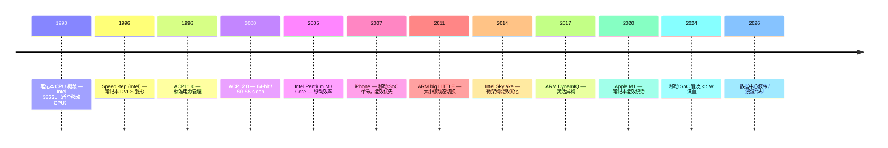

# 00-17 — 能耗管理 + 时钟树 + WFI 演化

>
> **一句话答案：** 能耗 = **频率 × 电压² × 切换率**。CPU 通过**降频（DVFS）+ 关时钟（gating）+ 关电源（power gating）+ 进 sleep state**省电。**WFI（Wait For Interrupt）**是 ARM/RISC-V 上"暂停 CPU 等中断"的指令。**时钟树**是 SoC 把一个 PLL 输出分发到所有外设的网络。


---

## 1. 历史时间轴



---

## 2. 能耗基础

### 2.1 功耗公式

```
P = α × C × V² × f + P_static

α: 切换率
C: 电容
V: 电压
f: 频率
P_static: 静态泄漏功耗
```

**关键：** 电压平方关系 → 降压比降频更省电。

### 2.2 P-state（性能状态）

```
P0  : 最高性能 / 最高电压（如 5 GHz @ 1.4V）
P1
P2
...
Pn  : 最低性能 / 最低电压（如 800 MHz @ 0.8V）
```

OS 调度器根据负载选 P-state（DVFS = Dynamic Voltage and Frequency Scaling）。

### 2.3 C-state（空闲状态）

```
C0  : 运行（执行指令）
C1  : 暂停时钟（HALT / WFI），快速恢复
C2  : 关闭部分缓存
C3  : 关 L1 cache
C6  : 关核心电源（保留状态）
C7  : 同上 + 更深
C10 : 极深休眠（手机用）
```

进入越深的 C-state，省电越多但唤醒延迟越大。

### 2.4 S-state（系统状态）— ACPI

```
S0  : 工作中
S1  : 暂停 CPU（保 RAM）
S3  : 挂起到 RAM (Suspend-to-RAM)
S4  : 挂起到磁盘 (Hibernate)
S5  : 软关机
G3  : 物理关电
```

现代笔记本主要用 S0ix（modern standby）+ S3 / S4。

---


### 3.1 ARM WFI / WFE

```assembly
// ARMv7 / AArch64
WFI   // Wait For Interrupt
WFE   // Wait For Event (信号量风格)
```

CPU 进入低功耗状态，时钟可关，等中断 / 事件唤醒。

### 3.2 RISC-V WFI

```assembly
wfi   // Wait For Interrupt
```

- 实现：暂停取指 + 关时钟（实现可选）
  ```zig
  while (true) { asm volatile ("wfi"); }  // panic 后死循环
  ```

### 3.3 x86 HLT / MWAIT

```asm
HLT       // 暂停直到中断
MWAIT     // 等待 monitor 触发（更精细）
```

### 3.4 WFI 的层次

```
WFI (CPU 核心暂停) → C1
   + cache flush → C3
   + power gate → C6/C7
```

更深 sleep 由 OS 通过 PSCI / SBI / ACPI 触发。

---


### 4.1 SoC 时钟分发

```
External crystal (24 MHz)
  ↓
PLL (锁相环) — 倍频到 1.5 GHz
  ↓
分频器
  ↓ ↓ ↓ ↓ ↓ ↓
CPU clock (1500 MHz)
GPU clock (600 MHz)  
DDR clock (1066 MHz)
PCIe clock (100 MHz)
USB clock (480 MHz)
UART clock (24 MHz)
... 几十个时钟域
```

### 4.2 时钟门控（Clock Gating）

不需要的模块**关时钟**省电：

```
设备空闲 → 关其时钟域
设备唤醒 → 重新使能时钟（几个周期）
```

Linux clk subsystem（drivers/clk/）管理这些。

### 4.3 PLL 调整 = DVFS 实现

```
负载低 → 降低 PLL 倍频 → CPU 频率降
负载低 → 降低核心电压 → V² 项降
```

现代 SoC 几十毫秒切换。

### 4.4 时钟域 + 复位域

```
SoC
├── Clock Domain 1 (CPU cluster)
│   └─ 复位域 1
├── Clock Domain 2 (GPU)
├── Clock Domain 3 (Display)
├── Clock Domain 4 (Network)
└── Clock Domain 5 (Always-on AON)
```

每个域可独立**门控时钟 / 电源 / 复位**。

### 4.5 always-on 域（AON）

不能完全关电的部分（如 RTC / wake source / 唤醒控制器）。

---

## 5. ACPI（x86 / 服务器电源管理）

详见 [03-02-boot-overview](03-02-boot-overview.md) § 9.2。

### 5.1 ACPI 提供的服务

- P-state / C-state / S-state 控制
- 温度监控
- 风扇调节
- USB / PCI 电源
- battery 状态
- 唤醒源

### 5.2 ACPI vs DT 在能耗管理

| 维度 | ACPI | DT |
|------|------|------|
| 主用 | x86 / ARM 服务器 | 嵌入 ARM / RISC-V |
| 含字节码 | ✅ AML | ❌ |
| 灵活 | 高 | 低 |
| 复杂 | 高 | 中 |

---

## 6. ARM PSCI（Power State Coordination Interface）

ARM 标准电源管理接口（SMC 风格）：

```c
// PSCI 调用
HVC #0 / SMC #0
  X0 = function ID (CPU_ON / CPU_OFF / CPU_SUSPEND / SYSTEM_OFF / SYSTEM_RESET)
  X1 = target CPU
  X2 = entry point
```

OS 通过 PSCI 让 TF-A（EL3）做实际功率切换。

---

## 7. RISC-V 电源管理

### 7.1 SBI HSM 扩展（Hart State Management）

- `sbi_hart_start(hartid, addr, opaque)` — 启动 hart
- `sbi_hart_stop()` — 停 hart
- `sbi_hart_get_status(hartid)` — 查状态
- `sbi_hart_suspend(suspend_type)` — 挂起

详见笔记 [02-04-sbi-complete-reference](02-04-sbi-complete-reference.md)。

### 7.2 SBI SUSP 扩展（System Suspend）

- `sbi_system_suspend(sleep_type, resume_addr, opaque)`

### 7.3 RISC-V 实现细节

WFI 实现可选：
- 简单实现：NOP（不省电）
- 中级：暂停取指
- 高级：进入 C-state（关时钟 / 电源）


---

## 8. Linux cpufreq / cpuidle 子系统

### 8.1 cpufreq

```
governors:
- performance: 永远 P0
- powersave: 永远 Pn
- ondemand: 按负载动态切
- conservative: ondemand 平缓版
- userspace: 用户态控制
- schedutil (现代): 与调度器集成
```

### 8.2 cpuidle

进入哪个 C-state 由 cpuidle governor 决定：
- menu (基于历史预测)
- ladder (从浅到深尝试)
- teo (Timer Events Oriented)

---

## 9. 嵌入式超低功耗

### 9.1 STM32 低功耗模式

| 模式 | 电流 | 唤醒 |
|------|------|------|
| Run | mA 级 | 即时 |
| Sleep | < 1 mA | μs |
| Stop | μA 级 | ms |
| Standby | < 1 μA | ms-s |
| Shutdown | nA 级 | 秒-冷启动 |

### 9.2 现代 MCU 节能技巧

- DMA 在 CPU sleep 中处理 I/O
- 中断驱动而非轮询
- 时钟门控未用外设
- 调低系统时钟（按需提）
- 选低功耗 codec / 传感器
- 使用低功耗 RTC 唤醒源

### 9.3 IoT 设备能耗目标

```
节点 IoT 传感器 + LoRa → 5-10 年纽扣电池
智能手表 → 1-2 天充电
笔记本 → 8-15 小时
手机 → 1 天
```

---

## 10. 数据中心能耗

### 10.1 PUE（Power Usage Effectiveness）

```
PUE = 总能耗 / IT 能耗
理想 PUE = 1.0
现代数据中心 PUE = 1.1-1.5
旧数据中心 PUE = 2.0+
```

### 10.2 散热演化

```
风冷 (传统)
  ↓
液冷 (现代高密度)
  ↓
浸没冷却 (immersion) — 矿机 / AI 服务器
```

### 10.3 现代数据中心趋势

- 直接用风（自然冷却 / Free cooling）
- 液冷板（NVIDIA H100 / B200 强制液冷）
- 浸没（PFC fluid 全浸 GPU）

---


- WFI 等中断（panic 时）
- HSM hart 启动 / 停止
- 准备 SUSP 系统挂起


```
1. cpuidle - WFI 接入
2. cpufreq - 通过 SBI 调 PLL（如果板支持）
3. clock gating - 设备 driver 通过 clk subsystem
4. tickless kernel - 空闲时不打 tick
5. 大小核调度 - 调度器适配 P+E core（任何现代调度器都需要）
```

### 11.3 借鉴

| 来自 | 借鉴 |
|------|------|
| Linux cpufreq / cpuidle | 接口设计 |
| RTOS tickless | 空闲不打 tick |
| ARM PSCI | SMC 风格电源 |
| Apple Silicon E-core | 异构调度 |

---

## 12. 名词词典

| 术语 | 含义 |
|------|------|
| **DVFS** | Dynamic Voltage and Frequency Scaling |
| **P-state / C-state / S-state** | 性能 / 空闲 / 系统状态 |
| **WFI / WFE** | Wait For Interrupt / Event |
| **HLT / MWAIT** | x86 暂停指令 |
| **clock gating** | 时钟门控 |
| **power gating** | 电源关断 |
| **always-on (AON)** | 不能关电的域 |
| **PLL** | Phase-Locked Loop |
| **PMIC** | Power Management IC |
| **PMU** | Power Management Unit |
| **ACPI** | Advanced Configuration and Power Interface |
| **PSCI** | Power State Coordination Interface (ARM) |
| **SBI HSM / SUSP** | RISC-V 电源 SBI 扩展 |
| **TDP** | Thermal Design Power |
| **PUE** | Power Usage Effectiveness |
| **cpufreq / cpuidle** | Linux 子系统 |
| **tickless kernel** | 无周期 tick 内核 |
| **Modern Standby / S0ix** | 笔记本现代待机 |
| **DPM** | Dynamic Power Management |

---

## 13. 进一步阅读

### 13.1 资源

- [ACPI 规范](https://uefi.org/specifications)
- [ARM PSCI 规范](https://developer.arm.com/documentation/den0022/latest)
- [Linux Power Management 文档](https://www.kernel.org/doc/html/latest/power/)
- [Brendan Gregg's CPU performance](https://www.brendangregg.com/)

### 13.2 经典书

- ***Energy-Efficient Computing*** — 学术
- ***Linux Power Management Architecture***

### 13.3 本仓库笔记串联

- [00-07-os-evolution](00-07-os-evolution.md) — 调度器与节能
- [00-06-aiot-hardware-software-evolution](00-06-aiot-hardware-software-evolution.md) — 嵌入式低功耗
- [00-04-micro-architecture-evolution](00-04-micro-architecture-evolution.md) — 大小核
- [02-04-sbi-complete-reference](02-04-sbi-complete-reference.md) — SBI HSM/SUSP
- [03-02-boot-overview](03-02-boot-overview.md) § 9.2 — ACPI

### 13.4 本仓库本地资料

| 路径 | 用途 |
|------|------|
| Linux drivers/clk/ | 时钟驱动 |
| Linux drivers/cpufreq/ | DVFS |
| ESP-IDF light_sleep / deep_sleep | 嵌入式参考 |
