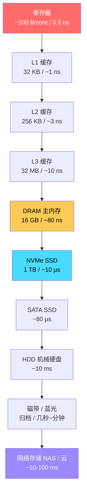
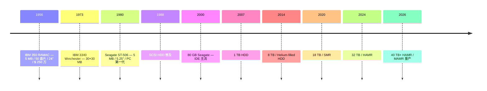
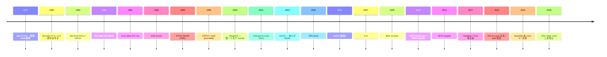

# 00-18 — 存储演化：从磁芯到 CXL，从 FAT 到分布式对象存储

> **核心问题：** 数据存哪里？硬盘 / SSD / 内存条 / 内存卡 / NAS / 云存储——这些怎么分层？为什么有 SDR / DDR / DDR2/3/4/5？NAND vs NOR Flash 区别？文件系统从 FAT 到 ZFS / btrfs 演化了什么？S3 / LakeFS 这些"对象存储"和文件系统是什么关系？
>


> **本地资料对应（来自 [00-01-material-index](00-01-material-index.md) `fs/` 段）：**  easyfs / ext2-rs / ext4_rs / fatfs / fuse-ext2 / libfuse / linux-fs / littlefs / lwext4_rust。本笔记每讲一个 FS 都会指向本仓库对应源码，便于动手。

---

## 1. 大框架：存储金字塔



**核心权衡：** 速度 ↔ 容量 ↔ 价格 ↔ 易失性。每一层填补上一层"更便宜更大但更慢"的位置。

### 1.1 易失 vs 持久（Volatile vs Non-Volatile）

| 易失（断电丢失）| 持久（断电保留）|
|---------------|---------------|
| 寄存器 | NOR Flash |
| SRAM (cache) | NAND Flash (SSD/eMMC/SD) |
| DRAM (主内存) | HDD |
| | 磁带 |
| | 光盘 (CD/DVD/Blu-ray) |

**例外：持久内存（PMem / NVDIMM）** 兼具 DRAM 速度 + 持久——介于两者之间，2017+ Intel Optane 推动，2022 砍。

---

## 2. 历史时间轴（1956-2026）

```mermaid
timeline
    1956 : IBM 350 — 第一个商业硬盘 (5MB / 50 个 24" 盘片)
    1968 : 磁芯存储器 — 早期主内存（每位一个磁芯）
    1970 : Intel 1103 — 第一个商业 DRAM (1 KB)
    1971 : Intel 1702 — 第一个 EPROM (256 byte)
    1971 : 8" 软盘 (IBM)
    1976 : 5.25" 软盘
    1980 : 1 MB DDR 总线 / 1 GB 硬盘 (IBM)
    1984 : 3.5" 软盘
    1988 : 1.4 MB 软盘普及
    1989 : NAND Flash (东芝)
    1991 : SanDisk SSD 实验性
    1995 : Compact Flash (SanDisk)
    1997 : SDRAM (PC100/PC133)
    2000 : DDR SDRAM (PC1600/2100/2700/3200)
    2001 : SD 卡
    2003 : DDR2 SDRAM
    2005 : eMMC (嵌入式 MMC)
    2006 : SATA SSD 商用 (Samsung)
    2007 : DDR3 SDRAM
    2008 : 3D NAND 实验
    2011 : NVMe 1.0 / DDR4 标准
    2013 : NVMe SSD 量产
    2014 : 3D NAND 量产 (Samsung V-NAND)
    2017 : Intel Optane (3D XPoint) / NVDIMM
    2020 : DDR5 / PCIe 4.0 NVMe
    2022 : Intel 砍 Optane / CXL 1.1
    2024 : DDR5-7200 / PCIe 5.0 NVMe / CXL 3.0
    2026 : DDR5 主流 / CXL 普及 / HBM 进入消费 (Apple M4 Ultra)
```



---

## 3. DRAM 演化：从 SDR 到 DDR5 + HBM + CXL

DRAM (Dynamic RAM) 是主内存——CPU 直接寻址的"工作区"。

### 3.1 SDRAM 系列演化

| 代 | 年份 | 频率 | 速率 | 电压 | 主战场 |
|----|------|------|------|------|-------|
| **SDR SDRAM** | 1996 | 100/133 MHz | 100/133 MT/s | 3.3V | Pentium II/III |
| **DDR** | 2000 | 100-200 MHz | 200-400 MT/s | 2.5V | Pentium 4 / Athlon XP |
| **DDR2** | 2003 | 200-400 MHz | 400-1066 MT/s | 1.8V | Core 2 |
| **DDR3** | 2007 | 400-1066 MHz | 800-2133 MT/s | 1.5V | Core i 系列前期 |
| **DDR3L** | 2010 | 同 DDR3 | | 1.35V | 笔记本 |
| **DDR4** | 2014 | 1066-1600 MHz | 2133-3200 MT/s | 1.2V | Core i 后期 / Ryzen |
| **DDR5** | 2020 | 1600-3600 MHz | 3200-7200 MT/s | 1.1V | Alder Lake / Zen 4 |
| **DDR5 EU** | 2024 | 同 DDR5 | 8000+ MT/s | | 高端 |
| **DDR6** | 2027? | TBD | 12800+ MT/s | TBD | 起草中 |

**关键术语：**
- **SDR** = Single Data Rate：每时钟周期传一次（上升沿）
- **DDR** = Double Data Rate：每时钟周期传两次（上升沿+下降沿）
- **n MT/s** = 每秒传 n 兆次（DDR4-3200 = 3200 MT/s = 25.6 GB/s 单 channel 64-bit）

### 3.2 SDRAM Controller 关键概念

DRAM 控制器是 SoC 内的 IP，负责：
1. **刷新（Refresh）** — DRAM 每行需周期性读出再写回，否则数据丢失
2. **Row / Column 寻址** — 行地址 + 列地址分两步发（BANK + ROW + COL）
3. **Bank Group** — 现代 DDR 把 bank 进一步分组并行
4. **训练（Training）** — 上电时校准 DQS / DQ 时序 (笔记 [03-06-u-boot-overview](03-06-u-boot-overview.md) § 3.3 详)
5. **ZQ Calibration** — 输出阻抗校准
6. **ECC** — 错误纠正（服务器 RDIMM/RDIMM ECC vs 桌面 non-ECC）

#### Bank Group（DDR4+ 引入）

```
DDR3：每芯片 8 Bank
DDR4：每芯片 16 Bank（2 Bank Group × 8 Bank）
DDR5：每芯片 32 Bank（4 Bank Group × 8 Bank 或 8 BG × 4 Bank）
```

**Bank Group 之间能并行 access** → 等效"内部多 channel"，提升随机访问吞吐。

#### 8-Bank Group SDRAM Controller 含义

DDR5 的"8-Bank Group / 32-bank" 是把 32 个 bank 分成 8 个 group，每 group 4 bank。让 controller 能调度同时访问不同 group → 减少同 BG 的 tCCD_L 限制。

### 3.3 DRAM 模块形态

| 形态 | 用途 |
|------|------|
| **DIMM** | 桌面 / 服务器内存条（200/240/288 pin）|
| **SO-DIMM** | 笔记本（半高 DIMM）|
| **MicroDIMM / Mini-DIMM** | 嵌入式 |
| **RDIMM** | Registered DIMM（寄存）— 服务器 |
| **LRDIMM** | Load-Reduced（缓冲）— 高密度服务器 |
| **UDIMM** | Unbuffered DIMM — 桌面 |
| **NVDIMM** | Non-Volatile DIMM — 持久内存 |
| **HBM** | High Bandwidth Memory — GPU/AI 芯片 3D 堆叠 |

#### HBM（High Bandwidth Memory）

- 2013 标准化（JEDEC HBM1 / HBM2 / HBM2E / HBM3 / HBM3E / HBM4）
- 3D 堆叠（多个 die 垂直叠 + TSV 互联）
- 带宽极高（HBM3E 单 stack 1.2 TB/s vs DDR5 50 GB/s）
- 主用：NVIDIA H100/B200 / AMD MI300 / Apple M4 Ultra / 国产 GPU

#### CXL（Compute Express Link）

- 2019 推出 CXL 1.0
- 基于 PCIe 物理层，加协议（CXL.io / CXL.cache / CXL.mem）
- 让 CPU、GPU、加速器、内存池共享一致内存
- 2024 CXL 3.1，开始有商品 CXL Memory Expander（NVDIMM 的接班）

---

## 4. SRAM / 缓存 / 寄存器（高速短距）

### 4.1 SRAM vs DRAM

| 维度 | SRAM | DRAM |
|------|------|------|
| 单元 | 6T (6 个晶体管) | 1T1C (1 晶体管 + 1 电容) |
| 速度 | 极快 (1-3 ns) | 中 (~80 ns) |
| 密度 | 低 | 高 |
| 价格 | 贵 | 便宜 |
| 用途 | CPU cache / 寄存器 / TCM | 主内存 |

### 4.2 缓存层次

```
寄存器 (CPU 内, ~100 个 64-bit)
    ↓ ~0.3 ns
L1 (cache 32-64 KB / core, 数据 + 指令分开)
    ↓ ~1 ns
L2 (256 KB - 1 MB / core)
    ↓ ~3 ns
L3 / LLC (Last Level Cache, 几 MB - 几十 MB, 多 core 共享)
    ↓ ~10 ns
DRAM
```

### 4.3 缓存一致性协议（多核必须）

- **MESI**（Modified / Exclusive / Shared / Invalid）— 经典
- **MESIF** — Intel 加 Forward 状态
- **MOESI** — AMD 加 Owned 状态
- **MERSI** — IBM
- **CXL.cache** — 跨设备一致性

详见笔记 00-04 (micro-architecture, 待写) + 00-15 (concurrency-sync, 待写)。

---

## 5. Flash 存储

Flash 是非易失存储——断电保留。两种主要技术：

### 5.1 NOR Flash vs NAND Flash

| 维度 | NOR Flash | NAND Flash |
|------|-----------|------------|
| 单元 | 一个晶体管 + 一个 control gate | 一个晶体管 + 一个 floating gate |
| 读 | 直接随机访问（XIP, eXecute In Place）| 块读（page）|
| 写 | 慢，按字节写后擦除 | 快，page 写 |
| 擦除 | 慢（block，毫秒级）| 快（block）|
| 容量 | 小（几 MB - 几百 MB）| 大（几 GB - 几 TB）|
| 寿命 | 高（10 万 - 100 万 次）| 低（3 千 - 10 万 次 typical）|
| 接口 | SPI / SPI-NOR / Parallel | ONFi / SPI-NAND / eMMC / UFS / NVMe |
| 价格 | 贵 | 便宜 |
| 主用 | bootloader / 配置 / 关键代码 | 大容量存储（SSD / SD / U盘）|

**RISC-V 启动场景：**
- ZSBL 在片内 ROM
- SPL 通常加载自 **NOR Flash**（XIP 直接执行）或 **SD/eMMC**
- 大 rootfs 通常在 **NAND Flash** 或 **eMMC** 或 **SD 卡**

### 5.2 NAND Flash 类型（按 cell 编码）

| 类型 | 全称 | bits/cell | 寿命 (P/E cycles) | 用途 |
|------|------|----------|------------------|------|
| **SLC** | Single-Level Cell | 1 bit | 100K | 工业 / 服务器 |
| **MLC** | Multi-Level Cell | 2 bits | 3-10K | 桌面 SSD（已淘汰）|
| **TLC** | Triple-Level Cell | 3 bits | 1-3K | 消费 SSD 主流 |
| **QLC** | Quad-Level Cell | 4 bits | 100-1000 | 大容量低端 |
| **PLC** | Penta-Level Cell | 5 bits | 50? | 实验性 |

**3D NAND（V-NAND）**：把单元 3D 堆叠，1 die 232+ 层（2024）。

### 5.3 Flash 文件系统 / FTL

NAND Flash 不能像硬盘那样随写——需要：
- **磨损均衡（wear leveling）** — 让擦除均匀分布到所有 block
- **垃圾回收（GC）**
- **bad block management**

实现位置：
- **FTL (Flash Translation Layer)** — 在 SSD/eMMC 控制器内，让 NAND 看起来像块设备
- **嵌入式直接管理** — 用 littlefs / JFFS2 / YAFFS2 等"原生 NAND 文件系统"

→ **本仓库 `fs/littlefs/`** 是嵌入式直接管理 NAND/NOR 的最佳实例。

### 5.4 SSD 接口演化

| 接口 | 速率 | 备注 |
|------|------|------|
| **PATA / IDE** | 133 MB/s | 已淘汰 |
| **SATA I / II / III** | 1.5 / 3 / 6 Gb/s | 主流 SATA SSD |
| **mSATA / M.2 SATA** | 6 Gb/s | 笔记本 |
| **NVMe over PCIe 3.0 x4** | 32 Gb/s | NVMe 主流 |
| **NVMe over PCIe 4.0 x4** | 64 Gb/s | 现代主流 |
| **NVMe over PCIe 5.0 x4** | 128 Gb/s | 高端 / 服务器 |
| **NVMe-oF** | 网络 | 远程 NVMe |
| **eMMC 5.1** | 3.2 Gb/s | 嵌入式 |
| **UFS 3.1 / 4.0** | 23.2 / 46.4 Gb/s | 手机 / 平板 |

---

## 6. 机械硬盘 / 磁带 / 光盘

### 6.1 HDD 演化



**接口演化：** ST-506 → ESDI → SCSI → IDE/PATA → SATA → SAS。

**密度技术：**
- **PMR** (Perpendicular Magnetic Recording, 2005)
- **SMR** (Shingled MR, 2014) — 写慢但密度高
- **HAMR** (Heat-Assisted MR, 2024 量产) — 激光辅助
- **MAMR** (Microwave-Assisted MR) — 微波辅助

→ 2024 年 HDD 仍是大容量存储性价比之王（数据中心 / NAS / 视频监控）。

### 6.2 磁带 / 光盘

- **磁带**：LTO-9 (2021, 18 TB / 45 TB 压缩) — 长期归档
- **CD / DVD / Blu-ray** — 几乎已被流媒体淘汰，仍有归档用途

---

## 7. 生活化对应：你常见的存储

### 7.1 内存条

```
DDR4 / DDR5 + DIMM 形态 + (R)DIMM / SODIMM
↓
品牌：金士顿 (Kingston) / 海盗船 (Corsair) / 三星 / 美光 / 国产光威 / 阿斯加特
↓
规格：16/32/64 GB / 频率 3200/4800/6400 MT/s
```

### 7.2 内存卡

| 类型 | 大小 | 速率 | 用途 |
|------|------|------|------|
| **CompactFlash (CF)** | 大 | ~150 MB/s | 老相机 |
| **SD / SDHC / SDXC** | 24×32mm | UHS-I 100MB/s, UHS-II 312MB/s | 通用 |
| **microSD / TF** | 11×15mm | 同上 | 手机 |
| **CFexpress** | CF 物理形态 | PCIe NVMe (~1700 MB/s) | 专业相机 |
| **xD / Memory Stick / SM** | 各种 | — | 已淘汰 |

### 7.3 U 盘

- 闪存 + USB 控制器 + USB 接口
- USB 2.0 (480 Mb/s) / USB 3.x (5/10/20 Gb/s)
- 内部多用 NAND TLC + 简易 FTL
- 寿命较短（消费级 NAND + 简单磨损均衡）

### 7.4 移动硬盘

- **机械移动硬盘**：2.5" SATA HDD + USB 桥接（SATA-USB IC）
- **移动 SSD**：M.2 SSD + USB 3.2 / Thunderbolt 桥接
- 现代消费：Samsung T7 / SanDisk Extreme / WD My Passport

### 7.5 SSD（电脑内置）

- M.2 NVMe 主流（笔记本 / 台式机）
- 2.5" SATA SSD（老机器升级用）
- 服务器：U.2 NVMe / EDSFF / Add-in Card

### 7.6 eMMC / UFS（手机 / 嵌入式）

- **eMMC** = embedded MMC，焊死在板上
- **UFS** = Universal Flash Storage（现代手机标准，比 eMMC 快）
- iPhone / 高端安卓用 UFS 3.1 / 4.0
- 树莓派 5 用 eMMC 选项

---

## 8. 文件系统演化（FS Evolution）


### 8.1 时间轴



### 8.2 主要 FS 详解

#### FAT12 / FAT16 / FAT32 / exFAT（微软 / 嵌入式）

- **FAT** = File Allocation Table，整个 FS 由一张表组成
- **FAT12**：12-bit cluster index，最大 32 MB
- **FAT16**：16-bit，最大 2 GB
- **FAT32**：32-bit，最大单文件 4 GB / 卷 2 TB
- **exFAT**：64-bit，无大小限制，2006 年微软专利后 2019 开源

**用途：** SD 卡 / U 盘 / UEFI ESP / 嵌入式
**本地资料：** 本仓库 `fs/fatfs/` 是 C 实现 FATFS

#### ext2 / ext3 / ext4（Linux 主流）

```
ext  (1992) — 第一版，无 inode 复杂度
ext2 (1993) — 加 inode + 直接块/间接块 + Berkeley FFS 风格
ext3 (1999) — 加 journal（写前日志，crash 后能恢复）
ext4 (2007) — 加 extent（连续块描述）+ delayed alloc + 更大文件 / 更多文件
```

**结构：**
- Superblock（FS 元信息）
- Block Group（每组：inode bitmap + block bitmap + inode table + data blocks）
- Inode（每文件元数据 + 数据块指针）
- Directory entries

**本地资料：**
- `fs/ext2-rs/` — Rust ext2 实现
- `fs/ext4_rs/` — Rust ext4 实现
- `fs/lwext4_rust/` — lwext4 的 Rust 绑定
- `fs/fuse-ext2/` — FUSE 挂载 ext2
- `fs/linux-fs/fs/ext2`、`fs/ext4` — Linux 内核源码（sparse checkout）

#### XFS（IRIX → Linux）

- SGI 1993 设计，2001 port to Linux
- 64-bit 元数据，超大文件 + 超多文件友好
- 现代用：RHEL 默认 / 大型存储

#### Btrfs（Oracle 2009）

- **B-tree File System** —— B-tree 索引一切
- 特性：snapshot / RAID / 压缩 / 子卷 / 校验
- 主用：openSUSE / SUSE / Synology NAS

#### ZFS（Sun 2004）

- 混合 volume manager + FS
- 特性：copy-on-write / snapshot / RAID-Z / 校验 / 重复数据删除 / 加密
- License 之争（CDDL 与 GPL 不兼容）—— Linux 上用 OpenZFS 第三方
- 主用：FreeBSD / TrueNAS / 高端 NAS

#### F2FS（Samsung 2010）

- **Flash-Friendly FS** — 为 NAND Flash SSD 优化
- 主用：Android / Chromebook
- 减少擦写次数 + 适配 SSD GC

#### APFS（Apple 2017）

- 替代 HFS+
- copy-on-write / 加密 / snapshot
- 苹果全平台（iOS / macOS / iPadOS / tvOS / watchOS）

#### NTFS（Windows）

- 1993 NT 引入
- 现代 Windows 默认
- 特性：journal / ACL / 压缩 / EFS 加密 / Reparse Point / VSS

#### bcachefs（2024 Linux 主线）

- **基于 bcache（块层缓存）演化**
- 设计：现代化 + 简单 + COW + 多 device 原生
- Kent Overstreet 主导
- Linux 6.7 主线

### 8.3 嵌入式 / 特殊 FS

#### littlefs（嵌入式 NAND/NOR 直接管理）

- ARM 主导，2017 起
- 掉电安全（power-loss resilient）
- 磨损均衡 + bad block
- 几 KB RAM 可运行
- **本地资料：** `fs/littlefs/`

#### YAFFS / YAFFS2

- 早期嵌入式 NAND FS
- Android 早期默认，后被 ext4/F2FS 取代

#### JFFS / JFFS2

- Linux 嵌入式 NOR/NAND
- 现代 logfs 已部分替代

#### squashfs

- 只读压缩 FS（xz / lz4 / zstd）
- 主用：Live CD / OpenWrt / Docker base layer
- 详见笔记 [00-35-distro-evolution](00-35-distro-evolution.md)

#### overlayfs

- 叠加 FS（lower 只读 + upper 可写）
- 主用：Docker / 容器 / immutable distro

#### tmpfs

- RAM 中的 FS（断电丢失，但极快）
- /tmp / /run 默认

### 8.4 教学 FS（本仓库 `fs/easyfs/`）

- rCore 教学简易 FS
- 5 区段：Superblock / Inode bitmap / Inode area / Data bitmap / Data area
- ~500 行 Rust

### 8.5 FUSE（用户态 FS 框架）

- 让用户态程序实现 FS（无需内核模块）
- 主用：sshfs / s3fs / mount-zip / 实验性 FS
- **本地资料：** `fs/libfuse/` + `fs/fuse-ext2/`

### 8.6 网络 FS

| FS | 协议 | 用途 |
|----|------|------|
| **NFS v3 / v4** | RPC over TCP/UDP | Unix 网络共享（经典）|
| **SMB / CIFS** | Microsoft | Windows 网络共享 |
| **9P** | Plan 9 | 现代轻量（virtio-9p）|
| **CephFS** | Ceph cluster | 分布式 |
| **GlusterFS** | Gluster cluster | 分布式 |
| **Lustre** | HPC | 超算并行 FS |

---

## 9. 网络存储与对象存储

### 9.1 NAS（网络附加存储）

- 本质：**专用 Linux 盒子 + RAID + 文件共享协议（NFS/SMB）**
- 商业：Synology / QNAP / 群晖 / 威联通
- 自建：FreeNAS / TrueNAS / OpenMediaVault
- 接入：家庭 / 小企业局域网

### 9.2 SAN（存储区域网）

- 块级存储 over 网络（不是文件级）
- 协议：iSCSI / Fibre Channel / NVMe-oF
- 主用：企业数据中心

### 9.3 对象存储（Object Storage）

文件 / 块存储之外的**第三种存储模型**——以"对象"为单位（key-value）：

| 平台 | 厂商 | 一句话 |
|------|------|--------|
| **AWS S3** | Amazon | 2006 年发明对象存储概念 |
| **Azure Blob Storage** | Microsoft | Azure 对象存储 |
| **Google Cloud Storage** | Google | GCP 对象存储 |
| **MinIO** | MinIO Inc. | 自建开源 S3 兼容 |
| **Ceph RGW** | Red Hat | 开源分布式 S3 |
| **OpenStack Swift** | OpenStack | 私有云对象 |
| **阿里云 OSS** | 阿里 | 中国主流 |
| **腾讯云 COS** | 腾讯 | 中国 |

**S3 API 已成事实标准**——MinIO / Ceph / 阿里 OSS 都兼容 AWS S3 API。

### 9.4 LakeFS（数据湖版本控制）

- **Treeverse 公司开源 (2020)**
- 在对象存储上加"Git-like"版本控制
- 用于：数据科学 / ML 数据管理
- 模式：commit / branch / merge 数据集

### 9.5 现代云存储格局

```
本地 SSD / HDD
    ↓
NAS（家庭 / 小企业）
    ↓
SAN（企业数据中心）
    ↓
分布式存储（Ceph / GlusterFS / HDFS）
    ↓
对象存储（S3 / OSS）
    ↓
对象存储 + 元数据层（LakeFS / Iceberg / Delta Lake）
    ↓
"数据湖" — 巨型对象存储 + 多引擎查询
```

---


### 10.1 起步：仿 easyfs

- 5 区段简单结构
- Superblock / Inode bitmap / Inode / Data bitmap / Data
- ~1000 行 Zig

### 10.2 中期：兼容 ext4 读

- 用 `ext4_rs` / `lwext4_rust` 思路 port 到 Zig

### 10.3 远期：现代特性

- COW（写时复制）
- snapshot
- 校验（Blake3）
- 嵌入式优先（小代码 + 低 RAM）

### 10.4 借鉴清单

| 来自 | 借鉴 |
|------|------|
| **ext2/3/4** | inode + extent + journal 思路 |
| **overlayfs** | 叠加挂载，容器 / 升级用 |

---

## 11. QuickStart

### 11.1 入门：识别你机器的存储

```sh
# 块设备
lsblk
sudo fdisk -l

# 文件系统
df -hT

# 内存
free -h
sudo dmidecode -t memory     # DIMM 信息

# 缓存
lscpu | grep -i cache

# SSD/HDD 详情
sudo smartctl -a /dev/sda

# NAND/eMMC（嵌入式）
cat /proc/mtd
ls -l /dev/mmcblk*
```

### 11.2 熟练：玩 ext4

```sh
# 制作 ext4 image
dd if=/dev/zero of=test.img bs=1M count=100
mkfs.ext4 test.img
sudo mount test.img /mnt/test
echo "hello" > /mnt/test/foo
sudo umount /mnt/test

# 查看结构
dumpe2fs test.img | head
debugfs test.img -R 'ls -l /'

# 转 sparse 节省空间
fallocate -d test.img
```

### 11.3 非常熟悉：实现一个 mini FS


---

## 12. 名词词典

### 12.1 介质术语

| 术语 | 含义 |
|------|------|
| **DRAM** | Dynamic Random-Access Memory |
| **SRAM** | Static RAM（更快但更贵的 RAM）|
| **SDRAM** | Synchronous DRAM |
| **DDR** | Double Data Rate |
| **HBM** | High Bandwidth Memory |
| **CXL** | Compute Express Link |
| **NAND / NOR** | Flash 类型 |
| **eMMC** | embedded MultiMediaCard |
| **UFS** | Universal Flash Storage |
| **NVMe** | Non-Volatile Memory Express |
| **PMem / NVDIMM** | Persistent Memory |
| **3D NAND / V-NAND** | 3D 堆叠 NAND |
| **HDD** | Hard Disk Drive |
| **SSD** | Solid State Drive |
| **DIMM / SO-DIMM** | DIMM 形态 |
| **RDIMM / LRDIMM** | Registered / Load-Reduced DIMM |

### 12.2 控制器术语

| 术语 | 含义 |
|------|------|
| **Memory Controller** | DRAM 控制器 |
| **Bank / Bank Group** | DRAM 内部分组 |
| **Refresh** | DRAM 刷新 |
| **DQS / DQ** | DRAM Data Strobe / Data |
| **CL / tCL** | CAS Latency |
| **ECC** | Error Correcting Code |
| **FTL** | Flash Translation Layer |
| **GC** | Garbage Collection (SSD)|
| **Wear Leveling** | 磨损均衡 |
| **TRIM / DISCARD** | SSD 释放命令 |

### 12.3 文件系统术语

| 术语 | 含义 |
|------|------|
| **inode** | 文件元数据节点 |
| **block** | 数据块 |
| **superblock** | FS 头部信息 |
| **journal** | 日志 / 写前记录 |
| **COW** | Copy-On-Write |
| **snapshot** | 快照 |
| **extent** | 连续块描述 |
| **sparse file** | 稀疏文件 |
| **hard link / symlink** | 硬链接 / 软链接 |
| **ACL** | Access Control List |
| **xattr** | 扩展属性 |
| **fsync / fdatasync** | 持久化系统调用 |
| **mmap** | 内存映射文件 |

### 12.4 网络存储术语

| 术语 | 含义 |
|------|------|
| **NAS** | Network Attached Storage |
| **SAN** | Storage Area Network |
| **NFS** | Network File System |
| **SMB / CIFS** | Microsoft 网络共享 |
| **iSCSI** | IP-based SCSI |
| **FC / FCoE** | Fibre Channel / FC over Ethernet |
| **NVMe-oF** | NVMe over Fabrics |
| **Object Storage** | 对象存储 |
| **S3** | AWS Simple Storage Service |
| **Bucket** | S3 概念 |
| **Data Lake** | 数据湖 |
| **Lakehouse** | 湖 + 仓融合 |

---

## 13. 进一步阅读

### 13.1 经典书

- ***Operating Systems: Three Easy Pieces*** § Storage 章节
- ***Database Internals*** — Alex Petrov（虽是 DB 但讲存储底层）
- ***Designing Data-Intensive Applications*** — Martin Kleppmann
- ***ZFS Implementation*** — Sun
- ***Linux File Systems*** — Robert Love

### 13.2 视频 / 课程

- [CMU 15-445 Database Systems](https://15445.courses.cs.cmu.edu/) — 含存储底层
- [SNIA Tutorial Library](https://www.snia.org/educational-library) — 存储行业标准
- [JEDEC DRAM 标准](https://www.jedec.org/)

### 13.3 本仓库笔记串联

- [00-01-material-index](00-01-material-index.md) `fs/` 段
- [00-02-fullstack-vertical](00-02-fullstack-vertical.md) L7 FS/Net/libc
- [00-07-os-evolution](00-07-os-evolution.md) — VFS 在内核中的位置
- [00-12-device-driver-evolution](00-12-device-driver-evolution.md) — 块设备 driver
- [00-35-distro-evolution](00-35-distro-evolution.md) — distro rootfs
- [03-03-fdt-dts-boot-flow](03-03-fdt-dts-boot-flow.md) — 启动时存储识别
- [03-06-u-boot-overview](03-06-u-boot-overview.md) § 3.3 — DRAM 训练

### 13.4 本仓库本地资料对应

| 路径 | 主题 | 与本笔记关系 |
|------|------|-------------|
| `fs/ext2-rs/` | Rust ext2 | § 8.2 ext2/3/4 |
| `fs/ext4_rs/` | Rust ext4 | 同上 |
| `fs/lwext4_rust/` | lwext4 Rust 绑定 | 同上 |
| `fs/fatfs/` | C FAT | § 8.2 FAT |
| `fs/littlefs/` | 嵌入式 NAND/NOR | § 8.3 |
| `fs/libfuse/` + `fs/fuse-ext2/` | FUSE 框架 + ext2 实现 | § 8.5 用户态 FS |
| `fs/linux-fs/` | Linux 内核 fs/ | 全谱参考 |
| `boot/u-boot/drivers/mtd/` | U-Boot Flash driver | NOR/NAND 驱动 |
| `boot/u-boot/drivers/mmc/` | U-Boot MMC | eMMC/SD 驱动 |
| `boot/u-boot/drivers/nvme/` | U-Boot NVMe | NVMe 驱动 |

→ 完整学习路径：
1. 先读 `fs/easyfs/` 理解 FS 5 区段
2. 再读 `fs/fatfs/` 理解 FAT12/16/32
3. 再读 `fs/ext2-rs/` 理解 inode + bitmap + data
4. 再读 `fs/littlefs/` 理解嵌入式 NAND 直接管理
