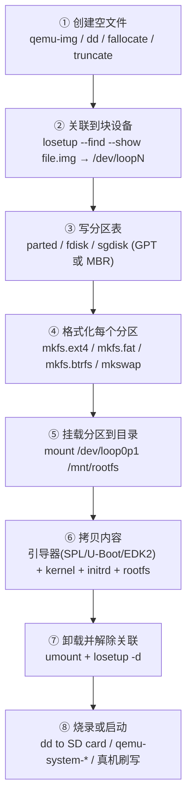
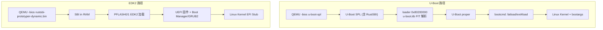

# 00-19 — 镜像制作 + 分区 + 文件系统 + 启动全流程实战大满贯

> **核心问题：** 我有一台空机（QEMU 虚拟机或 RISC-V 真板），怎么从零做出"插上电就能进入 Linux 命令行"的可启动镜像？这中间涉及哪些工具（dd / losetup / parted / mkfs / mount / qemu-img / mkimage / U-Boot / EDK2）？loop / swap / devfile 究竟是什么原理？
>

按 [user_learning_style](../CLAUDE.md) 9 阶段递归分形大纲：① 总大纲 → ② 横向对比 → ③ 单个细化 → ④ QuickStart → ⑤ 熟练 → ⑥ 全 API 大纲 → ⑦ 精通对比 → ⑧ 子功能细化 → ⑨ 设计与实现。

---

## 1. 总大纲：从空文件到可启动镜像的全流程



**关键认知：** 整条流水线的"魔法"在于 **loop device** —— Linux 用一个内核驱动把普通文件假装成块设备，让 parted / mkfs / mount 等本来只能操作 `/dev/sda` 的工具也能操作 `file.img`。这是几乎所有镜像制作的基础。

---

## 2. 横向对比：每一步都有几种工具可选

### 2.1 ① 创建空文件

| 工具 | 原理 | 大小写法 | 速度 | 备注 |
|------|------|---------|------|------|
| `dd if=/dev/zero of=img bs=1M count=1024` | 实写 0 | count×bs | 慢（要写盘）| 经典，兼容性好 |
| `qemu-img create -f raw img 1G` | 稀疏文件 / qcow2 | `1G` | 极快 | 支持 qcow2/vmdk/vdi 等格式 |
| `truncate -s 1G img` | 稀疏文件（仅设大小，不分配块）| `1G` | 极快 | 简单，但是稀疏 — 写入时才分配 |
| `fallocate -l 1G img` | 预分配真实磁盘块 | `1G` | 快 | ext4/btrfs 支持，性能最好 |

**何时用哪个：**
- 测试/学习 → `qemu-img create -f raw` 或 `truncate`
- 性能基准 → `fallocate`
- 需要 qcow2 压缩/快照 → `qemu-img create -f qcow2`
- 远古教程 → `dd`

### 2.2 ② loop device 关联

```bash
# 关联（让 file.img 变成 /dev/loop0）
sudo losetup --find --show img.raw
# /dev/loop0    ← 输出此设备路径，记下

# 或显式指定
sudo losetup /dev/loop0 img.raw

# 列出所有 loop
losetup -a

# 解除关联
sudo losetup -d /dev/loop0

# 让 loop 自动扫描分区表（创建 /dev/loop0p1 /dev/loop0p2 ...）
sudo losetup -P /dev/loop0 img.raw
# 或修改后用 partprobe /dev/loop0 强制扫描
```

**loop 设备是什么？** 内核 `loop.ko` 模块把 `read(file, ...)` 包装成块设备 `read(blkdev, ...)`。它读你磁盘上一个普通文件，但暴露成 `/dev/loopN`，让所有"操作块设备"的工具不需要改写就能用。

### 2.3 ③ 分区表

| 工具 | 表类型 | 交互 | 推荐场景 |
|------|-------|------|---------|
| `parted` | GPT / MBR | 命令行/脚本友好 | 自动化脚本首选 |
| `fdisk` | MBR (新版支持 GPT) | 交互 | 手动操作 |
| `sgdisk` (gdisk) | GPT 专用 | 命令行 | 纯 GPT 场景 |
| `cfdisk` | MBR / GPT | 全屏 TUI | 新手友好 |

**GPT vs MBR：**
- **MBR**：1983 IBM PC 起，主分区 4 个 + 扩展，最大 2TB
- **GPT**：2002 UEFI 引入，最多 128 分区，2^64 扇区（实际 ZB 级），现代默认

**parted 脚本式建分区：**
```bash
sudo parted --script /dev/loop0 \
  mklabel gpt \
  mkpart primary fat32 1MiB 100MiB \
  set 1 esp on \
  mkpart primary ext4 100MiB 100%

sudo partprobe /dev/loop0   # 让内核扫描新分区
ls /dev/loop0*               # /dev/loop0  /dev/loop0p1  /dev/loop0p2
```

### 2.4 ④ 文件系统格式化

| 工具 | 文件系统 | 主战场 |
|------|---------|-------|
| `mkfs.ext4` | ext4 | Linux 主流根分区 |
| `mkfs.btrfs` | btrfs | 新一代 CoW 文件系统 |
| `mkfs.xfs` | xfs | 大文件 / 数据库 |
| `mkfs.fat -F32` | FAT32 | UEFI ESP 必用 / SD 卡 |
| `mkfs.exfat` | exFAT | 大容量移动盘 |
| `mkfs.f2fs` | F2FS | 闪存优化（手机内置）|
| `mkfs.squashfs` | squashfs | 只读压缩（OpenWrt rootfs）|
| `mkswap` | swap | 交换分区 |
| `mksquashfs dir img.sqsh` | 把目录打包成 squashfs |

**例：**
```bash
sudo mkfs.fat -F 32 -n EFI /dev/loop0p1   # ESP 分区
sudo mkfs.ext4 -L rootfs /dev/loop0p2     # 根分区
sudo mkswap -L swap /dev/loop0p3          # swap 分区
```

### 2.5 ⑤ 挂载

```bash
sudo mkdir -p /mnt/rootfs /mnt/efi
sudo mount /dev/loop0p2 /mnt/rootfs
sudo mount /dev/loop0p1 /mnt/efi

# 看挂载状态
mount | grep loop
df -h /mnt/rootfs

# 卸载
sudo umount /mnt/efi /mnt/rootfs
```

**fstab 持久化挂载：** 编辑 `/etc/fstab` 加一行 `UUID=... /mnt/data ext4 defaults 0 2`，开机自动挂。

---

## 3. 14 个 distros 启动矩阵（来自 RustSBI Prototyper 官方 docs）

> **来源：** `/home/heke/tgln/stage2/material/sbi/rustsbi/prototyper/docs/`，本仓库已 clone。是学习 RISC-V 全栈最好的"实战目录"。

### 3.1 综合矩阵（14 个 distro × 引导器 × SBI）

| # | OS | 引导器 | SBI | QEMU 版本 | Kernel | U-Boot | 启动方式 | 关键差异 |
|---|----|------|-----|----------|--------|--------|---------|---------|
| 1 | Arch Linux | EDK2 | RustSBI | 9.0.1+ | 6.15.9 | — | UEFI + EFI Stub | PFLASH 32M, 直接启动内核 |
| 2 | Arch Linux | U-Boot | RustSBI | 9.0.1 | — | 2024.04 | SPL + FIT | RustSBI 注入 SPL |
| 3 | Fedora 40 | U-Boot | RustSBI | 9.0.1 | 6.8.7 | 2024.04 | SPL + FIT | bootargs 含 UUID/subvol |
| 4 | FreeBSD 14.1 | U-Boot | RustSBI | 9.1.1 | — | 2024.04 | SPL + loader | loader 直接到 0x80200000 |
| 5 | **VisionFive2 真机** | U-Boot | RustSBI | — | — | 官方 SDK | SPL+Payload FIT | DDR 训练 + SD/Flash 烧录 |
| 6 | Linux | U-Boot | OpenSBI | 9.0.1 | 6.2 | 2024.04 | fw_payload/jump/dynamic | 三种 OpenSBI 模式对比 |
| 7 | Linux | U-Boot | RustSBI | 9.0.1 | 6.2 | 2024.04 | SPL + FIT | 与 #6 等价但用 RustSBI |
| 8 | openEuler 23.09 | U-Boot | RustSBI | 9.0.1 | — | 2024.04 | SPL + FIT | bootargs 含 btrfs/selinux |
| 9 | OpenWrt | U-Boot | RustSBI | 9.0.1 | — | 2024.04 | SPL + FIT | scsi scan + fatload + patch |
| 10 | PolyOS (OpenHarmony) | U-Boot | RustSBI | — | — | 2024.04 | SPL + FIT | 多设备挂载 + extlinux.conf |
| 11 | Test Kernel | U-Boot | RustSBI | 9.0.1 | 6.2 | 2024.04 | SPL only / SPL+FIT | 两种模式对比 |
| 12 | Ubuntu 24.04.1 | EDK2 | OpenSBI | 9.2.0 | — | — | UEFI + fw_dynamic | OpenSBI 1.6 |
| 13 | Ubuntu 24.04.1 | U-Boot | RustSBI | 9.0.1 | — | 2024.04 | SPL + FIT | 标准路径 + USB/VGA 外设 |
| 14 | Ubuntu 24.04.3 | EDK2 | RustSBI | 10.1.0 | — | — | UEFI + fw_dynamic | RustSBI dynamic + GCC 15.1 |

**关键发现：**
- **U-Boot 路径（9 文档）**：都用 SPL+FIT，SBI 通过 `OPENSBI=...` 环境变量注入到 SPL 编译期
- **EDK2 路径（4 文档）**：都需要 PFLASH 固件（32M），SBI 由 QEMU `-bios` 直接加载
- **稳定组合**：RustSBI + U-Boot 2024.04 是 11/14 文档的"标准模板"

### 3.2 通用启动链（Mermaid）



### 3.3 通用 QEMU 命令骨架

**U-Boot + RustSBI（最常用）：**
```bash
qemu-system-riscv64 -M virt -smp 1 -m 256M -nographic \
  -bios ./u-boot/spl/u-boot-spl \
  -device loader,file=./u-boot/u-boot.itb,addr=0x80200000 \
  -blockdev driver=file,filename=./linux-rootfs.img,node-name=hd0 \
  -device virtio-blk-device,drive=hd0
```

**EDK2 + SBI（运行完整 distro）：**
```bash
qemu-system-riscv64 \
  -M virt,pflash0=pflash0,pflash1=pflash1,acpi=off \
  -m 4G -smp 4 -nographic \
  -bios rustsbi-prototyper-dynamic.bin \
  -blockdev node-name=pflash0,driver=file,read-only=on,filename=edk2/.../RISCV_VIRT_CODE.fd \
  -blockdev node-name=pflash1,driver=file,filename=edk2/.../RISCV_VIRT_VARS.fd \
  -drive file=ubuntu.img,format=raw,id=hd0,if=none \
  -device virtio-blk-device,drive=hd0
```

### 3.4 通用 bootcmd 模式

```bash
# 模式 A: 标准 ext4 加载
ext4load virtio 0:1 84000000 Image
setenv bootargs root=/dev/vda1 rw console=ttyS0
booti 0x84000000 - ${fdtcontroladdr}

# 模式 B: UEFI 路径（EDK2 + EFI Stub kernel）
fatload virtio 0:1 84000000 EFI/Linux/Image.efi
setenv bootargs root=UUID=... rw
bootefi 0x84000000 - ${fdtcontroladdr}
```

### 3.5 各 distro 特殊参数（精选）

| Distro | 关键 bootargs 片段 | 来源 doc |
|--------|----------------|---------|
| openEuler | `swiotlb=1 loglevel=7 selinux=0 highres=off` | 8 |
| Fedora | `rhgb LANG=en_US.UTF-8 earlycon=sbi` | 3 |
| PolyOS | 多行 `ohos.required_mount.xxx=` + ramdisk.img | 10 |
| Ubuntu (EDK2) | 全自动 GRUB2 → `/sys/firmware/efi/fw_platform_size` 验证 | 12,14 |

---

## 4. QuickStart：5 分钟跑出 Linux 6.2（Doc 7 完整复刻）

```bash
# 0. 准备工作目录
mkdir -p ~/workshop && cd ~/workshop

# 1. clone 必要源码（已在本仓库 sbi/rustsbi 和 boot/u-boot 下）
ln -s /home/heke/tgln/stage2/material/sbi/rustsbi rustsbi
ln -s /home/heke/tgln/stage2/material/boot/u-boot u-boot
git clone --depth 1 -b v6.2 https://git.kernel.org/pub/scm/linux/kernel/git/torvalds/linux.git linux
git clone --depth 1 -b 1_36_0 https://github.com/mirror/busybox

# 2. 编译 RustSBI Prototyper
cd rustsbi
cargo prototyper                      # 输出 target/.../rustsbi-prototyper.bin

# 3. 编译 U-Boot（把 RustSBI 注入 SPL）
cd ../u-boot
export OPENSBI=$(realpath ../rustsbi/target/riscv64gc-unknown-none-elf/release/rustsbi-prototyper.bin)
export ARCH=riscv
export CROSS_COMPILE=riscv64-linux-gnu-
make qemu-riscv64_spl_defconfig
make -j$(nproc)
# 产物: spl/u-boot-spl + u-boot.itb

# 4. 编译 Linux + busybox（略，参考各 doc 详细步骤）

# 5. 制作 1GB rootfs.img（本节核心）
cd ~/workshop
qemu-img create -f raw linux-rootfs.img 1G

sudo parted --script linux-rootfs.img mklabel gpt
sudo losetup --find --show linux-rootfs.img    # 假设输出 /dev/loop0
sudo parted --align minimal /dev/loop0 mkpart primary ext4 0 100%
sudo parted /dev/loop0 print
ls -l /dev/loop0*                              # /dev/loop0p1 出现
sudo mkfs.ext4 /dev/loop0p1
sudo parted /dev/loop0 set 1 boot on

# 拷贝内核 + busybox rootfs
sudo mkdir /mnt/rootfs && sudo mount /dev/loop0p1 /mnt/rootfs
sudo cp linux/arch/riscv/boot/Image /mnt/rootfs/
sudo cp -r busybox/_install/* /mnt/rootfs/
# ... 加 init / etc / proc / sys 等

sudo umount /mnt/rootfs
sudo losetup -d /dev/loop0

# 6. 启动
qemu-system-riscv64 -M virt -smp 1 -m 256M -nographic \
  -bios ./u-boot/spl/u-boot-spl \
  -device loader,file=./u-boot/u-boot.itb,addr=0x80200000 \
  -blockdev driver=file,filename=./linux-rootfs.img,node-name=hd0 \
  -device virtio-blk-device,drive=hd0

# U-Boot 命令行手动启动
=> ext4load virtio 0:1 84000000 Image
=> setenv bootargs root=/dev/vda1 rw console=ttyS0
=> booti 0x84000000 - ${fdtcontroladdr}
# → 看到 Linux 启动 → busybox login prompt
```

---

## 5. 熟练：常用命令套路 + 奇技淫巧

### 5.1 一行制作可启动 SD 卡（VisionFive2）

```bash
# 假设 SD 卡是 /dev/sdb
sudo dd if=visionfive2-debian-202405.img of=/dev/sdb bs=4M conv=fsync status=progress
sync
```

`status=progress` 显示进度；`conv=fsync` 写完才返回；`bs=4M` 提速 50 倍。

### 5.2 快速验证镜像可启动（无 dd）

```bash
qemu-system-riscv64 -drive file=img.raw,format=raw -...
# 直接挂磁盘镜像，免烧录
```

### 5.3 在已有镜像里改文件

```bash
sudo losetup -P --find --show img.raw   # 含分区扫描
sudo mount /dev/loop0p1 /mnt
sudo vim /mnt/etc/fstab
sudo umount /mnt
sudo losetup -d /dev/loop0
```

### 5.4 swap：是文件还是分区

**两种 swap 形式：**

```bash
# A. swap 分区（性能稍好，需要预留分区）
sudo mkswap /dev/loop0p3
sudo swapon /dev/loop0p3

# B. swap 文件（灵活，可动态调整）
sudo dd if=/dev/zero of=/swapfile bs=1M count=2048 status=progress
sudo chmod 600 /swapfile
sudo mkswap /swapfile
sudo swapon /swapfile

# 查看
swapon -s
free -h

# 关闭 + 删
sudo swapoff /swapfile
sudo rm /swapfile
```

**写入 /etc/fstab：** `/swapfile none swap sw 0 0`

### 5.5 FIT 镜像组装（U-Boot 标准）

```bash
# 1. 写 .its 描述文件
cat > image.its << 'EOF'
/dts-v1/;
/ {
    description = "U-Boot+SBI+kernel+dtb FIT";
    images {
        opensbi { ... };
        u-boot { ... };
        kernel { ... };
        fdt { ... };
    };
    configurations {
        default = "conf-1";
        conf-1 { ... };
    };
};
EOF

# 2. mkimage 打包
mkimage -f image.its image.itb

# 3. 验证
mkimage -l image.itb
```

### 5.6 在 Windows 上做镜像

| 工具 | 用途 | 备注 |
|------|------|------|
| **balenaEtcher** | 烧录 .img/.iso 到 SD/USB | 跨平台 GUI 首选 |
| **Rufus** | 烧录可启动 USB | Windows-only，老牌 |
| **Win32 Disk Imager** | 简单 dd 等价物 | 经典工具 |
| **WSL2** | 跑 dd / parted / mkfs | 直接在 Win 用 Linux 工具 |
| **VirtualBox / VMware** | 挂 .vdi/.vmdk 当虚拟磁盘 | 也能挂载 .img |

WSL2 内推荐：
```powershell
# Windows PowerShell
wsl --mount \\.\PhysicalDrive2 --bare    # 挂载 SD 卡到 WSL
wsl                                       # 进 WSL
sudo dd if=img.raw of=/dev/sdc bs=4M     # 用 Linux 工具烧录
```

---

## 6. 全 API / 选项大纲

### 6.1 dd 关键选项

```
dd if=in of=out bs=4M count=N seek=N skip=N
   conv=fsync (写完同步) | conv=notrunc (不截断 of)
   conv=sync,noerror (跳过坏块)
   status=progress (显示进度)
   iflag=fullblock (不要被 fragmented stream 截断)
```

### 6.2 losetup 关键选项

```
losetup --find --show file       # 自动找空闲 loop 关联
losetup -P file                  # 关联并扫描分区表
losetup -d /dev/loopN            # 解除
losetup -a                       # 列所有
losetup -j file                  # 查 file 关联到哪个 loop
losetup -o offset file           # 从偏移开始（嵌入分区）
losetup --sizelimit N            # 限定可访问大小
```

### 6.3 parted 关键命令

```
mklabel gpt | msdos              # 建分区表
mkpart name fs-type start end    # 建分区
set N flag on | off              # 设标志（boot/esp/lvm）
print                            # 显示
rm N                             # 删分区
unit s|MiB|GiB                   # 单位
align-check optimal N            # 对齐检查
```

### 6.4 mkfs 系列

```
mkfs.ext4 -L LABEL -U UUID -O metadata_csum,64bit /dev/X
mkfs.fat -F 32 -n LABEL /dev/X
mkfs.btrfs -L LABEL /dev/X
mkfs.xfs -L LABEL /dev/X
mkfs.f2fs -l LABEL /dev/X
mkfs.exfat -L LABEL /dev/X
```

### 6.5 mount — 挂载全系（磁盘 / 文件 / 镜像 / 网络 / 特殊 fs）

#### 6.5.1 mount 命令骨架

```
mount [-t TYPE] [-o OPTIONS] SOURCE TARGET
mount                                    # 列出所有挂载（同 cat /proc/mounts）
mount | column -t                        # 美化列表
findmnt                                  # 树状显示挂载（更现代）
findmnt /                                # 看根挂载点详情
findmnt -t ext4                          # 只看 ext4 挂载
findmnt --target /home                   # 看哪个 fs 在 /home
findmnt -fn -o SOURCE /                  # 仅输出根挂载的源设备
```

#### 6.5.2 块设备挂载（分区 / 整盘 / RAID / LVM）

```bash
# 普通分区
mount /dev/sda1 /mnt
mount -t ext4 /dev/sda1 /mnt             # 显式 fs 类型（可选，auto-detect）
mount -o ro,noatime /dev/sda1 /mnt       # 只读 + 不更新 atime
mount -o rw,noatime,nodiratime,commit=60 /dev/sda1 /mnt  # 性能调优
mount -L mylabel /mnt                    # 按 LABEL
mount -U 12345678-... /mnt               # 按 UUID

# 整盘（无分区）
mount /dev/sdb /mnt                      # 部分 fs 支持（btrfs subvolume / squashfs）

# RAID / LVM 设备
mount /dev/md0 /mnt                      # software RAID
mount /dev/mapper/vg-lv /mnt             # LVM
mount /dev/mapper/cryptdev /mnt          # LUKS 加密卷
```

#### 6.5.3 文件 / 镜像挂载（loop device）

```bash
# 现代 mount 自动 loop，旧版本要 -o loop
mount -o loop disk.img /mnt              # 自动找空闲 loop device
mount -o loop,offset=1048576 disk.img /mnt  # 跳过 MBR + 第一 partition entry
mount -o loop,offset=$((512*2048)) disk.img /mnt  # 第一分区 (LBA 2048 起)

# 显式 losetup + mount（精细控制）
sudo losetup -P --find --show disk.img   # -P 自动扫分区，输出 /dev/loopN
sudo mount /dev/loop0p1 /mnt             # 挂第一分区
sudo umount /mnt
sudo losetup -d /dev/loop0               # 释放

# qcow2 / vmdk / vdi（QEMU 格式镜像）— 需要 qemu-nbd
sudo modprobe nbd max_part=8
sudo qemu-nbd --connect=/dev/nbd0 disk.qcow2
sudo mount /dev/nbd0p1 /mnt
sudo umount /mnt
sudo qemu-nbd --disconnect /dev/nbd0

# ISO 镜像
mount -o loop ubuntu.iso /mnt            # 老写法
mount -t iso9660 -o loop,ro ubuntu.iso /mnt  # 显式

# squashfs（OpenWrt rootfs / docker layer）
mount -t squashfs -o loop,ro rootfs.sqsh /mnt

# initramfs (cpio.gz) — 用 cpio 解，不能直接 mount
zcat initrd.cpio.gz | (cd /tmp/initrd && cpio -idmv)

# UBIFS / JFFS2（嵌入式 NAND fs）— 通过 ubi 子系统
modprobe ubi
ubiattach -m 0
mount -t ubifs ubi0:rootfs /mnt
```

#### 6.5.4 bind mount（把目录挂到另一处）

```bash
mount --bind /src /dst                   # /dst 反映 /src 内容（同 inode）
mount --rbind /src /dst                  # 递归 bind（含子挂载点）
mount -o bind,ro /src /dst               # ⚠️ 旧版 ro 不生效
mount -o bind,ro,bind /src /dst          # 旧 workaround
mount --bind /src /dst && mount -o remount,bind,ro /dst  # 旧版正确
mount --bind -o ro /src /dst             # util-linux 2.31+ 直接支持

# 应用：
# - chroot / container 共享主机目录
# - 同一目录用不同选项呈现（一份 ro 一份 rw）
# - /etc 配置注入（容器 image + 单独 etc bind 上）
```

#### 6.5.5 remount（在线改挂载选项）

```bash
mount -o remount,rw /                    # 把 / 从 ro 改 rw（救急）
mount -o remount,ro /home                # 改 ro（备份前冻结）
mount -o remount,nodev,nosuid /tmp       # 加安全选项
mount -o remount,noexec /var/tmp         # 防止 /var/tmp 跑可执行（防 webshell）

# 紧急救援：root fs 起不来时
mount -o remount,rw /                    # 改 rw 修复 fstab
```

#### 6.5.6 特殊 / 虚拟文件系统（kernel 内置）

```bash
# tmpfs — 内存文件系统（断电消失）
mount -t tmpfs -o size=512M tmpfs /mnt
mount -t tmpfs -o size=50%,mode=1777 tmpfs /tmp  # 默认 50% RAM

# proc / sysfs / devtmpfs / debugfs / configfs
mount -t proc proc /proc                 # 内核状态
mount -t sysfs sysfs /sys                # 设备模型
mount -t devtmpfs devtmpfs /dev          # 设备节点
mount -t debugfs debugfs /sys/kernel/debug
mount -t configfs configfs /sys/kernel/config

# cgroup v1 / v2
mount -t cgroup2 none /sys/fs/cgroup
mount -t cgroup -o memory cgroup_memory /sys/fs/cgroup/memory  # v1

# fusefs — 用户态文件系统
mount -t fuse.sshfs user@host:/path /mnt
fusermount -u /mnt                       # 用户态卸载
fusermount3 -u /mnt                      # FUSE 3

# overlayfs — 容器分层文件系统
mount -t overlay overlay -o lowerdir=/lower,upperdir=/upper,workdir=/work /merged

# bpf / pstore / mqueue
mount -t bpf bpf /sys/fs/bpf
mount -t pstore pstore /sys/fs/pstore    # crash log 持久化
```

#### 6.5.7 网络文件系统挂载

```bash
# NFS
mount -t nfs server:/export /mnt
mount -t nfs4 -o sec=sys,vers=4.2,hard,intr server:/export /mnt
mount -t nfs -o ro,noatime,bg,soft,timeo=30,retrans=3 server:/export /mnt

# SMB / CIFS（Windows 共享）
mount -t cifs //server/share /mnt -o username=u,password=p,vers=3.0
mount -t cifs //server/share /mnt -o credentials=/etc/cifs.creds,uid=1000,gid=1000
# /etc/cifs.creds 内容：username=...\npassword=...

# SSHFS（基于 FUSE）
sshfs user@host:/remote /mnt -o reconnect,ServerAliveInterval=15
sshfs user@host:/remote /mnt -o ssh_command="ssh -p 2222 -i /key"
fusermount -u /mnt

# WebDAV
mount -t davfs https://example.com/dav /mnt

# Plan 9 9P（QEMU host ↔ guest 共享）
mount -t 9p -o trans=virtio hostshare /mnt -oversion=9p2000.L

# AFS / iSCSI / Ceph / GlusterFS / s3fs / rclone mount ...
```

#### 6.5.8 fstab 持久挂载（开机自动）

`/etc/fstab` 6 字段格式：

```
# <device>          <mountpoint>  <fstype>  <options>                <dump>  <pass>
UUID=abc-123        /             ext4      defaults,noatime         0       1
LABEL=swap          none          swap      defaults                 0       0
/dev/sda2           /home         ext4      defaults,noatime         0       2
//srv/share         /mnt/share    cifs      credentials=/etc/cifs    0       0
192.168.1.10:/data  /mnt/nfs      nfs       defaults,bg,_netdev      0       0
tmpfs               /tmp          tmpfs     size=512M,mode=1777      0       0
/swapfile           none          swap      sw                       0       0
```

各字段：
- **device**：设备路径 / UUID= / LABEL= / 网络源
- **mountpoint**：挂载点（swap 用 `none`）
- **fstype**：fs 类型 (`ext4`/`xfs`/`btrfs`/`tmpfs`/`nfs`/`cifs`/`auto`)
- **options**：挂载选项（同 mount -o）
- **dump**：dump backup 频率（一般 0）
- **pass**：fsck 顺序（root=1 / 其他=2 / 不检=0）

常用 fstab 选项：
- `defaults` = `rw,suid,dev,exec,auto,nouser,async`
- `noatime`：不更新 atime（性能）
- `_netdev`：网络 fs 必须，等网络就绪后再挂
- `nofail`：挂载失败不阻塞 boot
- `x-systemd.automount`：systemd 自动挂载（按需）
- `x-systemd.idle-timeout=60`：60s 无访问自动 umount

操作：
```bash
mount -a                                 # 挂载 fstab 中所有未挂的
mount -a -t nfs                          # 只挂载 nfs
mount /home                              # 用 fstab 中的配置挂载 /home
findmnt --verify                         # 验证 fstab 语法
```

#### 6.5.9 systemd .mount unit（fstab 替代 / 补充）

```ini
# /etc/systemd/system/mnt-data.mount
[Unit]
Description=Mount /mnt/data

[Mount]
What=/dev/disk/by-label/DATA
Where=/mnt/data
Type=ext4
Options=defaults,noatime

[Install]
WantedBy=multi-user.target
```

```bash
systemctl daemon-reload
systemctl enable --now mnt-data.mount
systemctl status mnt-data.mount
```

**配套 .automount unit**（按需挂载）：
```ini
# /etc/systemd/system/mnt-data.automount
[Unit]
Description=Automount /mnt/data

[Automount]
Where=/mnt/data
TimeoutIdleSec=60

[Install]
WantedBy=multi-user.target
```

#### 6.5.10 卸载 / 强制卸载

```bash
umount /mnt                              # 正常 umount
umount /dev/sda1                         # 用源设备指定
umount -l /mnt                           # **lazy umount**（立刻断开命名空间引用，等 IO 结束后释放）
umount -f /mnt                           # **force**（NFS 等"挂死"时用）

# 卸载失败诊断
lsof +f -- /mnt                          # 谁打开着 /mnt 上的文件
fuser -mv /mnt                           # 谁在用 /mnt（含 cwd）
fuser -km /mnt                           # 杀掉所有用 /mnt 的进程（核武器）
ps aux | grep -v grep | awk '$NF ~ /^\/mnt/'  # CWD 在 /mnt 的进程
```

#### 6.5.11 mount namespace（容器 / 沙箱基础）

```bash
# unshare 创建新 mount namespace
unshare -m bash                          # 进入新 ns 的 shell
mount -t tmpfs none /mnt                 # 这个 mount 只在新 ns 可见
exit                                     # 退出 ns，mount 消失

# mount propagation（共享 / 私有 / 从属）
mount --make-shared /mnt                 # 共享：子 ns 改动会传回父 ns
mount --make-private /mnt                # 私有：子 ns 改动不传播（默认）
mount --make-slave /mnt                  # 从属：父→子 单向传播
mount --make-rshared /                   # 递归 shared

# pivot_root（容器 root 切换基础）
pivot_root /new_root /new_root/old_root
```

#### 6.5.12 用户态自动挂载（GUI 桌面）

```bash
# udisks2 — 桌面 GUI 文件管理器用的
udisksctl mount -b /dev/sdb1
udisksctl unmount -b /dev/sdb1
udisksctl power-off -b /dev/sdb         # 弹出 USB 安全断电

# autofs — 按需挂载（NFS 主页目录场景）
# /etc/auto.master:
# /home /etc/auto.home --timeout=60
# /etc/auto.home:
# *  -fstype=nfs4,rw,soft  server:/home/&
```

#### 6.5.13 readonly / read-write 切换技巧

```bash
# 启动时 root 是 ro，要改 rw
mount -o remount,rw /

# 备份前临时 ro（避免备份中数据变化）
mount -o remount,ro /home
rsync -aHAX /home/ backup/
mount -o remount,rw /home

# 测试软件不破坏 root（只读 root + 其他 ro overlay）
mount -t overlay overlay -o lowerdir=/,upperdir=/tmp/upper,workdir=/tmp/work /test_root

# 嵌入式 squashfs ro root + tmpfs overlay rw（OpenWrt 风格）
mount -t squashfs /dev/mtdblock0 /rom -o ro
mount -t tmpfs tmpfs /overlay
mount -t overlay overlay -o lowerdir=/rom,upperdir=/overlay /
```

#### 6.5.14 chroot / pivot_root（root 切换）

```bash
# chroot — 切换 root 看到的文件系统
mount --bind /dev   /target/dev
mount --bind /proc  /target/proc
mount --bind /sys   /target/sys
mount --bind /run   /target/run
chroot /target /bin/bash

# 现代封装：systemd-nspawn（轻量容器）
systemd-nspawn -D /var/lib/machines/debian
```

#### 6.5.15 mount 选项速查表（最常用）

| 选项 | 作用 |
|------|------|
| `ro` / `rw` | 只读 / 读写 |
| `noatime` | 不更新文件访问时间（性能 +10%）|
| `nodiratime` | 不更新目录访问时间 |
| `relatime` | 智能 atime（mtime 后才更新 atime）|
| `sync` / `async` | 写穿 / 异步写（默认 async）|
| `dirsync` | 目录操作同步 |
| `nodev` | 禁止设备节点（安全）|
| `nosuid` | 禁止 suid bit 生效（安全）|
| `noexec` | 禁止执行二进制（防 /var/tmp 攻击）|
| `user` / `users` | 普通用户可挂 / 任意用户可卸 |
| `auto` / `noauto` | mount -a 自动挂 / 手动 |
| `defaults` | rw,suid,dev,exec,auto,nouser,async |
| `loop` | 自动 loop device |
| `offset=N` | 跳过 N 字节再挂（从 image 里第二分区起）|
| `data=ordered/journal/writeback` | ext4 日志策略 |
| `discard` | SSD TRIM（fstab 中加上 SSD 寿命延长）|
| `commit=N` | ext4 提交间隔（秒）|
| `barrier=0/1` | 写屏障（关闭快但断电丢数据风险）|
| `usrquota,grpquota` | 启用配额 |

### 6.6 mkimage（U-Boot）

```
mkimage -A riscv -O linux -T kernel -C gzip -a 0x84000000 -e 0x84000000 -n "Linux" -d Image uImage
mkimage -f image.its image.itb           # FIT 模式
mkimage -l image.itb                     # 列内容
```

### 6.7 qemu-img

```
qemu-img create -f raw img.raw 1G
qemu-img create -f qcow2 img.qcow2 10G
qemu-img convert -O raw img.qcow2 img.raw
qemu-img info img.raw
qemu-img resize img.raw +1G
```

### 6.8 磁盘 / 分区 / 设备查看

```bash
lsblk                        # 树状显示所有块设备 + 分区 + 挂载点
lsblk -f                     # 加 fs 类型 / UUID / LABEL
lsblk -d                     # 只看磁盘（不分区）
lsblk -o NAME,SIZE,TYPE,FSTYPE,MOUNTPOINTS,UUID,LABEL  # 自定义列

blkid                        # 列所有块设备的 UUID + fs 类型
blkid /dev/sda1              # 单个设备
blkid -L LABEL               # 按 LABEL 找设备路径
blkid -U UUID                # 按 UUID 找

fdisk -l                     # 列所有磁盘的分区表（需 root）
fdisk -l /dev/sda            # 单磁盘
sfdisk -l /dev/sda           # 脚本友好版本
parted /dev/sda print        # parted 打印分区
parted /dev/sda print free   # 含未分配空间
gdisk -l /dev/sda            # GPT 专用

cat /proc/partitions         # 内核视角的分区列表
cat /proc/mounts             # 内核视角的挂载（mount 命令是其用户态包装）
cat /proc/swaps              # swap 列表

ls -la /dev/disk/by-id/      # 按硬件 ID（厂商+序列号）的稳定符号链接
ls -la /dev/disk/by-uuid/    # 按 UUID
ls -la /dev/disk/by-label/   # 按 LABEL
ls -la /dev/disk/by-path/    # 按 PCI/USB 路径（机箱位置稳定）
```

### 6.9 磁盘 / 文件占用统计

```bash
# 文件 / 目录占用 (du = disk usage)
du -h file                   # 人类可读（1K/2.3M/4.5G）
du -sh *                     # 当前目录每个项总和（不递归显示子项）
du -sh /var/log              # 单目录
du -ah --max-depth=2 /       # 深度限制
du -h --time file            # 加修改时间
du -shx /                    # 只统计同一文件系统（-x 不跨 mount point）
du --apparent-size           # 表观大小（不算 sparse 节省）

# 文件系统占用 (df = disk free)
df -h                        # 所有挂载点 free space
df -h /                      # 单挂载点
df -i                        # inode 占用（小文件多时常 inode 先满）
df -hT                       # 加 fs 类型列
df -h -t ext4                # 只看 ext4

# 排序 + top N
du -sh * | sort -hr | head -10               # 当前目录最大 10 个
find / -size +100M 2>/dev/null               # 找大于 100MB 的文件
ncdu /                                        # 交互式 TUI 占用浏览器（推荐！）

# inode 占用
df -i /                      # 看 inode 总 / 已用 / 可用
find / -xdev -printf '%h\n' 2>/dev/null | sort | uniq -c | sort -rn | head  # 哪个目录文件最多
```

### 6.10 文件元数据 / 属性

```bash
# 基本元数据
ls -la file                  # 权限 / owner / size / mtime
ls -li file                  # 加 inode 号
ls -laR /path                # 递归
stat file                    # 详细：inode/权限/atime/mtime/ctime/btime
stat -c '%s %n' file         # 仅大小 + 名（脚本友好）
stat -f /                    # 文件系统的 stat（block size / total blocks）

# 文件类型探测
file img.raw                 # "DOS/MBR boot sector" 等
file -b *.bin                # brief 输出
file --mime-type a.png       # 输出 MIME

# Linux 扩展属性 (chattr / lsattr)
chattr +i file               # immutable（连 root 都不能改 / 删，反入侵小招）
chattr -i file               # 取消 immutable
chattr +a logfile            # append-only（log 文件保护，只能尾部追加）
chattr +A file               # 不更新 atime（性能）
lsattr file                  # 看 chattr 标志

# xattr（POSIX 扩展属性）
getfattr -d file             # 列所有 xattr
setfattr -n user.note -v "deploy 2026" file
```

### 6.11 权限 / 用户 / 所有权

```bash
chmod 755 file               # rwxr-xr-x
chmod u+x,g-w file           # 符号模式
chmod -R 755 dir             # 递归

chown user:group file        # 改属主 + 属组
chown -R user:group dir
chgrp group file

# ACL（POSIX ACL — 比 chmod 细粒度）
getfacl file
setfacl -m u:alice:rwx file  # 给 alice 单独权限
setfacl -m g:devs:r-- file
setfacl -x u:alice file      # 删
setfacl -d -m ... dir        # default ACL（新建文件继承）

# umask
umask                        # 查看 (typical 0022)
umask 0077                   # 严格 (新文件 600 / 新目录 700)

# capabilities (POSIX capabilities — 细分 root 权限)
getcap /usr/bin/ping         # 看 cap
setcap cap_net_raw+ep ./mytool  # 给 raw socket 不用 root
```

### 6.12 同步 / 缓存

```bash
sync                         # 全局 fsync（所有 dirty page 写盘）
sync /mount/point            # 单挂载点 sync
sync file                    # 单文件 fsync（util-linux 2.31+）

# fsfreeze — 文件系统级暂停 IO（备份镜像必备）
fsfreeze -f /mnt             # 冻结（buffer 进入 stable state）
# ... 此时做 LVM snapshot / 备份 ...
fsfreeze -u /mnt             # 解冻

# /proc/sys/vm 观察 / 控制
cat /proc/meminfo | grep -i dirty  # 看脏页量
echo 3 > /proc/sys/vm/drop_caches  # 清 page/dentry/inode cache（debug 用）
```

### 6.13 文件系统调优 / 检查 (ext4 主)

```bash
# 检查
fsck /dev/sda1               # 通用 fsck
fsck.ext4 -f /dev/sda1       # ext4 强制检查
e2fsck -fp /dev/sda1         # auto repair (panic-safe)

# 调优
tune2fs -l /dev/sda1         # 列 ext4 superblock 信息（标签/UUID/挂载次数/...）
tune2fs -L NEWLABEL /dev/sda1
tune2fs -U $(uuidgen) /dev/sda1
tune2fs -c 0 -i 0 /dev/sda1  # 禁用周期 fsck（云盘常做）
tune2fs -O has_journal /dev/sda1  # 开启 journal
tune2fs -O ^has_journal /dev/sda1 # 关 journal（嵌入式 wear）

# 调试 / dump
dumpe2fs /dev/sda1           # 完整 superblock + group desc dump
debugfs /dev/sda1            # 交互式 fs 探索（unmount 状态）

# resize
resize2fs /dev/sda1          # ext4 在线扩容到分区大小
e2image -r /dev/sda1 img.bin # ext4 镜像（仅元数据，比 dd 小）

# btrfs / xfs / f2fs 各自
btrfs filesystem show
xfs_info /mountpoint
xfs_growfs /mountpoint
xfs_repair /dev/sda1
f2fs.fsck /dev/sda1
```

### 6.14 软硬链接 / 复制 / 移动

```bash
ln file hardlink             # 硬链接（同 inode）
ln -s file softlink          # 符号链接（路径引用）
readlink softlink            # 看符号链接指向
readlink -f softlink         # 解析所有 symlink 到绝对路径

cp file dest                 # 普通复制
cp -a src dst                # 完整保留属性 + 递归（最常用）
cp --reflink=auto src dst    # COW 复制（btrfs/xfs 支持，瞬间 0 字节）
cp --sparse=always src dst   # 保持 sparse hole

mv src dst                   # 同 fs 上是 rename（瞬间）；跨 fs 是 cp+rm

rsync -av src/ dst/          # 增量同步（最强大）
rsync -av --delete src/ dst/ # 镜像（删 dst 中 src 没的）
rsync -aHAX src/ dst/        # 含硬链接 + ACL + xattr
rsync -av --exclude='.git/' src/ dst/  # 排除
```

### 6.15 压缩 / 归档

```bash
# tar
tar cf out.tar dir/                   # 仅打包不压缩
tar czf out.tar.gz dir/               # gzip
tar cjf out.tar.bz2 dir/              # bzip2
tar cJf out.tar.xz dir/               # xz（慢/小）
tar caf out.tar.zst dir/              # 自动按扩展名 (zstd)
tar xf in.tar.xz                      # auto-detect 解压
tar tf in.tar.xz                      # 列内容不解
tar --strip-components=1 -xf in.tar   # 解时去掉一层目录

# 单文件压缩
gzip / gunzip / zcat                  # .gz
bzip2 / bunzip2 / bzcat               # .bz2
xz / unxz / xzcat                     # .xz（高压缩 / 慢）
zstd / unzstd / zstdcat               # .zst（现代快 + 接近 xz）
lz4                                    # 极快但压缩低

# 与 dd 配合
dd if=/dev/sda | xz -9 > backup.xz   # 备份并压缩
xz -d < backup.xz | dd of=/dev/sda   # 还原
```

### 6.16 find / xargs / locate（找文件）

```bash
find / -name "*.conf"                 # 按名找
find . -type f -size +100M            # 大文件
find . -type f -mtime -7              # 7 天内修改
find . -type f -newer reference_file  # 比 reference_file 更新的
find . -type f -delete                # 边找边删（小心！）
find . -type f -exec chmod 644 {} +   # 批量 chmod

# 与 xargs
find . -name "*.bak" | xargs rm        # 危险（含空格名会出错）
find . -name "*.bak" -print0 | xargs -0 rm  # NUL 分隔（安全）
find . -name "*.bak" -delete           # 内置 delete 最安全

locate file                            # 用 mlocate.db 极快（要先 updatedb）
which cmd                              # PATH 中找命令
type cmd                               # 含 alias / function
whereis cmd                            # 二进制 + man + src
```

### 6.17 free / vmstat / iostat（资源监控）

```bash
free -h                              # 内存 + swap
free -hs 2                           # 每 2s 刷新
cat /proc/meminfo                    # 详细

vmstat 1                             # 每秒 cpu/mem/io/swap
vmstat -d                            # 磁盘统计
vmstat -p /dev/sda1                  # 分区统计

iostat -x 1                          # 详细 IO 统计 / 每秒
iotop                                # 进程级 IO（要 root）

# 磁盘读写速度
hdparm -t /dev/sda                   # 顺序读速度
dd if=/dev/zero of=test bs=1M count=1024 conv=fdatasync  # 写速度
fio --rw=randwrite --bs=4k --size=1G --name=test --direct=1  # 随机 IOPS
```

### 6.18 时间戳类（备份恢复 / 取证）

```bash
touch file                           # 创建空文件 / 更新 mtime
touch -d "2 days ago" file           # 设旧时间
touch -t 202401010000 file           # 设具体时间
touch -r ref file                    # 复制 ref 的时间到 file

stat file                            # 看四个时间：access/modify/change/birth
                                     #   atime - 访问时间
                                     #   mtime - 内容修改
                                     #   ctime - inode 修改（权限/属主等）
                                     #   btime - 创建（btrfs/ext4/xfs 才有）
```

### 6.19 块设备测速 / 校验

```bash
# 校验和（验证 dd 写入完整性）
md5sum file
sha256sum file
sha512sum -c checksums.sha512        # 验证

# 块对比
cmp file1 file2                      # 字节对比
diff -q file1 file2                  # 是否相同
xxd file | head                      # hex dump
hexdump -C file | head
od -A x -t x1z -v file               # 经典 octal dump

# 测试块设备坏块
badblocks /dev/sda                   # 只读测试
badblocks -w /dev/sda                # 破坏性写测试（会清空！）
```

---

## 7. 精通：U-Boot 路径 vs EDK2 路径 深度对比

| 维度 | U-Boot 路径 | EDK2 路径 |
|------|------------|----------|
| **SBI 位置** | 编译期注入到 SPL | QEMU `-bios` 直接加载 |
| **注入方式** | `export OPENSBI=...`，make 时链接 | 不链接，SBI 先于 EDK2 启动 |
| **SBI 版本** | RustSBI 0.0.0 prototyper | OpenSBI 1.4/1.6 或 RustSBI dynamic |
| **固件类型** | fw_dynamic（默认）| fw_dynamic 或 ELF |
| **启动顺序** | SPL → SBI → U-Boot proper | SBI → EDK2 (PFLASH) → GRUB/kernel |
| **bootcmd 来源** | U-Boot 配置文件（menuconfig）| GRUB2 / EFI boot manager |
| **内核格式** | Image (raw)| Image with EFI Stub |
| **加载方式** | `ext4load virtio 0:1 ...` | UEFI 自动 / `bootefi` |
| **bootargs** | `setenv bootargs ...` | GRUB menu / EFI vars |
| **设备路径** | `virtio 0:1` | `\EFI\Linux\...` |
| **PFLASH 需求** | 无 | 必需，32M |
| **优势** | 灵活、体积小、可定制 bootcmd | 标准 UEFI、易跑通用 distro |
| **劣势** | 需懂 U-Boot 配置 | PFLASH 大、启动慢、调试复杂 |
| **典型场景** | 嵌入式、自定义 boot | 跑标准 Ubuntu/Fedora |

### 7.1 SBI 编译注入对比

**U-Boot（Doc 7）：**
```bash
cd rustsbi && cargo prototyper        # 出 rustsbi-prototyper.bin
cd ../u-boot
export OPENSBI=$(realpath ../rustsbi/target/.../rustsbi-prototyper.bin)
make qemu-riscv64_spl_defconfig && make -j$(nproc)
# 产物: spl/u-boot-spl（含 RustSBI）+ u-boot.itb
```

**EDK2（Doc 14）：**
```bash
cd rustsbi && cargo prototyper        # 出 rustsbi-prototyper-dynamic.bin
cd ../edk2
source edksetup.sh
build -a RISCV64 -b RELEASE -p OvmfPkg/RiscVVirt/RiscVVirtQemu.dsc -t GCC5
# 产物: Build/RiscVVirtQemu/RELEASE_GCC5/FV/RISCV_VIRT_CODE.fd + VARS.fd
# 注：EDK2 编译完全独立于 SBI，运行时由 QEMU 串起来
```

---

## 8. 子功能细化：dev file / udev / loop driver 原理

### 8.1 /dev 是什么

`/dev` 不是普通目录，而是 **devtmpfs**（kernel 启动后由内核挂载）。每个文件代表一个内核暴露的设备：

```bash
ls -la /dev | head
# crw-r--r-- 1 root root      1, 3 May  6 00:00 null
# brw-rw---- 1 root disk      8, 0 May  6 00:00 sda
# brw-rw---- 1 root disk      8, 1 May  6 00:00 sda1
# crw-rw-rw- 1 root tty       5, 0 May  6 00:00 tty
```

文件类型：
- `b` = **block device**（块设备，如硬盘 / loop / SD 卡）
- `c` = **character device**（字符设备，如 tty / null / serial）
- 数字 `8, 0` = **major, minor**（主次设备号，内核用来路由 read/write）

### 8.2 udev 怎么动态创建 /dev 节点

**演化：**
- **静态 /dev（古代）**：发行版烧死几千个 devfile，绝大多数没用
- **devfs（2000 早期）**：内核根据驱动自动建，但管理不够灵活
- **udev（2003 起）**：用户态守护，监听 kernel uevent，按规则建 /dev 节点
- **devtmpfs + udev（现代）**：kernel 先建基本节点，udev 应用规则（命名 / 权限 / 软链接）

**例：udev 规则**
```bash
# /etc/udev/rules.d/99-mydrive.rules
SUBSYSTEM=="block", KERNEL=="sd*", ATTRS{idVendor}=="0951", SYMLINK+="mydrive%n"
# 插入特定 USB 时自动创建 /dev/mydrive、/dev/mydrive1 等软链接
```

### 8.3 loop driver 内部机制

**Linux kernel `drivers/block/loop.c`：**
```c
struct loop_device {
    int lo_number;
    struct file *lo_backing_file;   // 关联的普通文件
    struct block_device *lo_device; // 暴露的块设备
    ...
};

// 当 mount/dd/parted 等读 /dev/loop0 时:
loop_handle_request() {
    pos = blk_rq_pos(rq) << 9;            // 块号 → 字节偏移
    kernel_read(lo->lo_backing_file, ...) // 实际读后端文件
}
```

→ 完美的 "假装成块设备的文件"。

### 8.4 swap 机制原理

**Linux swap：** 物理内存不够时，把某些 page 写到 swap，腾出 RAM。需要时再换回。

**关键流程：**
1. `mkswap /dev/X` 写一个魔数 + 标识到分区/文件头
2. `swapon /dev/X` 告诉内核"这个块设备可以用作 swap"
3. 内核 vmscan 在 LRU 上选 anonymous page → 写到 swap
4. 进程触碰被换出的 page → page fault → 内核从 swap 读回

**zswap / zram：** 现代方案——把 swap 的 page 先压缩在 RAM 里再决定是否真的写盘。Android / 嵌入式常用。

---


```bash
# 假想的 ku build 流程
ku init my-kunikos-image
ku config menuconfig                    # Kconfig：选 SBI / boot / kernel / rootfs / FS
ku fetch                                # clone / 下载所有源
ku build                                # 编译 SBI + U-Boot/EDK2 + kernel + rootfs
ku image --format=raw --size=1G \
        --partition gpt \
        --part 100M:fat32:esp \
        --part 100%:ext4:rootfs        # 自动 losetup + parted + mkfs
ku flash --target=/dev/sdX             # 自动 dd
ku qemu                                # 直接 qemu 启动测试
```

**借鉴：**
- **Buildroot**：menuconfig 风格 + .mk 描述包
- **Yocto**：bitbake recipe（更复杂但更工业）
- **OpenWrt**：单源码树 + feeds
- **mkimage / genimage**：镜像组装工具
- **debootstrap**：从二进制包构建 rootfs


---

## 10. 名词词典

### 10.1 镜像 / 文件系统术语

| 术语 | 含义 |
|------|------|
| **image / .img** | 一个普通文件，内容是磁盘字节级镜像 |
| **raw image** | 1:1 字节复制（无压缩 / 无元数据）|
| **qcow2** | QEMU Copy-on-Write 2，支持稀疏 / 快照 / 压缩 |
| **vmdk / vdi / vhd** | VMware / VirtualBox / Hyper-V 虚拟磁盘格式 |
| **ISO 9660** | 光盘文件系统格式（.iso）|
| **loop device** | 把文件假装成块设备的 kernel 驱动 |
| **block device** | 按块（512B/4KB）读写的设备（硬盘/SSD/loop）|
| **character device** | 按字节流读写（tty/serial）|
| **partition table** | 描述磁盘分区布局的元数据（MBR/GPT）|
| **MBR** | Master Boot Record（1983, IBM PC, 限 2TB）|
| **GPT** | GUID Partition Table（2002, UEFI 引入，最多 128 分区）|
| **ESP** | EFI System Partition（FAT32 启动分区）|
| **bootable flag** | MBR/GPT 中的 boot 标志位 |
| **superblock** | 文件系统元数据头（fs 大小 / 块大小 / 目录入口）|
| **UUID** | 全局唯一标识符（标记分区 / 文件系统）|
| **rootfs** | 根文件系统（mount 到 /）|
| **initrd / initramfs** | 启动早期临时根（cpio.gz）|

### 10.2 启动 / 引导器术语

| 术语 | 含义 |
|------|------|
| **SPL** | Secondary Program Loader（U-Boot 第一阶段，做 DDR 训练）|
| **U-Boot proper** | U-Boot 主体（SPL 之后，命令行 + bootcmd）|
| **FIT image (.itb)** | Flattened Image Tree（U-Boot 标准镜像格式，含 kernel + dtb + ramdisk）|
| **.its** | FIT 描述源文件（dts 风格）|
| **payload** | SBI/Bootloader 加载的下一段二进制 |
| **bootcmd** | U-Boot 启动时执行的命令字符串 |
| **bootargs** | 传给 Linux 的 cmdline |
| **distro_bootcmd** | 通用启动序列（自动找 boot/extlinux.conf 等）|
| **EFI Stub** | Linux kernel 内嵌的 UEFI loader 头 |
| **PFLASH** | UEFI 用的"持久 Flash"（QEMU 中是 .fd 文件）|
| **fw_dynamic / fw_jump / fw_payload** | OpenSBI 三种打包模式 |

### 10.3 Linux 设备 / 内核术语

| 术语 | 含义 |
|------|------|
| **devtmpfs** | kernel 启动时挂在 /dev 的内存 fs |
| **udev / systemd-udevd** | 用户态守护，处理 uevent，应用 /dev 规则 |
| **uevent** | kernel → 用户态的设备事件（add/remove/change）|
| **major / minor** | 设备号（major 选驱动，minor 选实例）|
| **vmscan** | Linux 内存回收子系统 |
| **swap** | 把 anonymous page 写出 RAM 的机制 |
| **zswap / zram** | 压缩 swap |
| **mount namespace** | mount 视图隔离（容器基础）|
| **bind mount** | 把一个目录挂到另一处 |
| **fstab** | 持久挂载配置 |

---

## 11. 进一步阅读

### 11.1 本仓库相关

- **本地实战源**：`/home/heke/tgln/stage2/material/sbi/rustsbi/prototyper/docs/` — 14 个端到端教程
- **OpenSBI 对比**：`/home/heke/tgln/stage2/material/sbi/opensbi/`
- **U-Boot 源码**：`/home/heke/tgln/stage2/material/boot/u-boot/`
- **EDK2 源码**：`/home/heke/tgln/stage2/material/boot/edk2/`

### 11.2 跨笔记串联

- **[00-02-fullstack-vertical](00-02-fullstack-vertical.md)** § 6.1.A — 单一 RustSBI 启动示例（本笔记是其扩展版）
- **[00-35-distro-evolution](00-35-distro-evolution.md)** — Linux 发行版生态
- **[00-18-storage-evolution](00-18-storage-evolution.md)** — 存储介质 + 文件系统演化
- **[02-03-sbi-implementations](02-03-sbi-implementations.md)** — SBI 实现对比
- **[03-02-boot-overview](03-02-boot-overview.md)** — boot 层全景
- **[03-06-u-boot-overview](03-06-u-boot-overview.md)** — U-Boot 详解（含 FIT/Driver Model）
- **[03-03-fdt-dts-boot-flow](03-03-fdt-dts-boot-flow.md)** — DTB 在启动链中的传递

### 11.3 官方文档

- **RustSBI Prototyper docs（本仓库）**：`sbi/rustsbi/prototyper/docs/`
- **U-Boot docs**：https://docs.u-boot.org/
- **EDK2 RiscV**：https://github.com/tianocore/edk2/tree/master/OvmfPkg/RiscVVirt
- **VisionFive2 SDK**：https://doc-en.rvspace.org/VisionFive2/

### 11.4 工具速查

| 任务 | 命令 |
|-----|------|
| 创建 1G raw 镜像 | `qemu-img create -f raw img 1G` |
| 关联 loop | `sudo losetup -P --find --show img` |
| 写 GPT + ext4 分区 | `sudo parted --script /dev/loop0 mklabel gpt mkpart p ext4 1MiB 100%` |
| 格式化 | `sudo mkfs.ext4 /dev/loop0p1` |
| 挂载 | `sudo mount /dev/loop0p1 /mnt` |
| 卸载 | `sudo umount /mnt` |
| 解除 loop | `sudo losetup -d /dev/loop0` |
| 烧录到 SD | `sudo dd if=img of=/dev/sdX bs=4M conv=fsync status=progress` |
| 制作 swap 文件 | `sudo dd if=/dev/zero of=/swap bs=1M count=2048; sudo mkswap /swap; sudo swapon /swap` |
| 制 FIT 镜像 | `mkimage -f image.its image.itb` |

---

