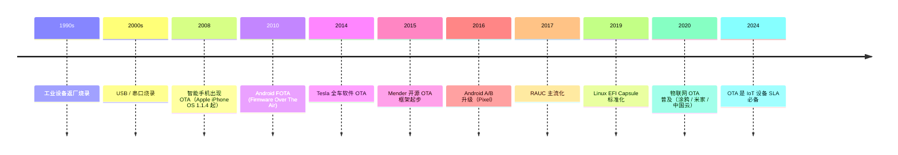

# 00-20 — 固件 OTA + A/B 升级 + Verified Boot 链路演化

>


---

## 1. 历史时间轴



---

## 2. 升级模式分类

### 2.1 Single-image（单分区）

```
flash:
  └─ rootfs (200 MB)

升级流程：
  1. 下载新镜像
  2. 停止服务
  3. 写入 flash（覆盖旧镜像）
  4. 重启
  5. 跑新镜像
```

❌ 升级中断 → 砖
❌ 升级失败 → 砖（无回滚）
✅ 简单 / 占空间少

### 2.2 A/B 双分区（工业级）

```
flash:
  ├─ bootloader (固定，不升级)
  ├─ partition A (200 MB) ← 当前运行
  ├─ partition B (200 MB) ← 待升级
  └─ data (持久数据)

升级流程：
  1. 下载新镜像
  2. 写入 B 分区
  3. 设 boot count = 0, next = B
  4. 重启
  5. bootloader 检 next = B → 跳 B
  6. B 启动成功 → 设 success flag, current = B
  7. （或失败重启 N 次后 bootloader 切回 A）
```

✅ 升级中断不砖（A 仍可用）
✅ 自动回滚
✅ 升级时设备仍运行 A
❌ 占双倍空间

### 2.3 Atomic Update（原子）

A/B 一种特殊形式 —— 升级要么完全成功要么不变。

### 2.4 Delta Update（增量）

只下载差异部分，节省带宽。
- bsdiff
- xdelta
- VCDIFF (RFC 3284)
- HDiffPatch（中国常用）

### 2.5 OS 级 vs 应用级 OTA

```
OS 级：整个 rootfs 替换（A/B）
应用级：单个 app 替换（容器 / 包管理 / Snap）
混合：immutable distro（Fedora Silverblue）
```

---

## 3. 主流 OTA 框架

### 3.1 Mender（开源 + 商业）

- 2015 起，Mender.io
- A/B 升级标准
- 断网恢复
- 灰度发布
- 商业云端管理 + 自部署
- 主用：工业 IoT / 工厂 / 智能家居
- 支持 Yocto / Buildroot / Debian

### 3.2 RAUC（Robust Auto-Update Controller）

- 2014 起，由德国嵌入式公司 Pengutronix 主导
- 轻量 OSS
- 适配 Yocto / Buildroot
- A/B + 流式更新
- 主用：工业嵌入式

### 3.3 SWUpdate

- 意大利 DENX 出品
- 老牌嵌入式 OTA
- 主用：工业 / 老项目

### 3.4 OSTree / libostree

- "git for OS"
- atomic upgrade + rollback
- 主用：Fedora Silverblue / Endless OS / RHEL Edge

### 3.5 Android A/B (Treble)

- 2017 Pixel 起
- AVB (Android Verified Boot)
- vbmeta + chained partitions
- 详见 [00-35-distro-evolution](00-35-distro-evolution.md) § 8.4

### 3.6 iOS OTA

- Apple 闭源
- 增量 deltatool
- 强制签名 + 信任链

### 3.7 ChromeOS

- A/B 标杆（Verified Boot 5 阶段）
- 原子升级 + 自动回滚
- 详见 [00-36-security-evolution](00-36-security-evolution.md) § 4.3

### 3.8 EFI Capsule（UEFI 标准）

- 2017+ 标准化
- BIOS / 主板固件升级
- Linux fwupd 工具
- LVFS（Linux Vendor Firmware Service）— Red Hat 主推

---

## 4. OTA 关键技术

### 4.1 Bootloader 集成

bootloader 负责：
- 选择启动分区（next_boot 标志）
- 维护启动计数器
- 失败自动回滚

```
U-Boot env:
  next_boot=B
  boot_count=0
  upgrade_available=1

启动序列：
  1. 读 env，next_boot = B
  2. boot_count++（写回 env）
  3. boot_count > 3 → 切 next_boot = A（失败回滚）
  4. 加载 B 分区
  5. 应用启动成功 → 应用调 fw_setenv 设 boot_count=0 / upgrade_available=0
```

### 4.2 启动签名验证

每段升级 image 签名（详见 00-36 Verified Boot）：
- 私钥签发布
- 设备硬编公钥验证
- 签名失败拒绝启动 / 通知服务器

### 4.3 断网恢复

```
下载到一半断网：
  → 本地保留进度（state 文件）
  → 重连后继续 / 重试
  → 完整后再校验整体哈希

完整下载完才标记可启动 → 中断不破坏 B 分区。
```

### 4.4 灰度发布（Canary / Phased Rollout）

```
1% 用户 → 24h 监控 → 异常率 OK
  ↓
10% → 24h
  ↓
50% → 24h
  ↓
100%
```

后端 cohort / target group 控制。

### 4.5 持久数据保留

```
A/B 切换不能影响用户数据：
  partition A / B → 系统镜像
  partition data → 用户数据（OTA 不动）
  partition cache → 升级临时（OTA 用）
```

---

## 5. OTA 服务器端

### 5.1 商业云

- **Mender Hosted**
- **Balena Cloud**
- **Particle Cloud**
- **Zephyr Cloud**
- **AWS IoT Device Management**
- **Azure Device Update**
- **阿里云 / 腾讯云物联网 OTA**

### 5.2 自部署

- Mender Server（self-hosted）
- hawkBit (Eclipse 基金会)
- LVFS 自托管

### 5.3 服务器关键功能

- 设备注册 / 认证
- 镜像上传 / 签名
- 灰度调度
- 升级状态收集
- 失败诊断
- 回滚指令

---

## 6. 移动 / 汽车 OTA

### 6.1 移动 OTA

```
Android: AVB + A/B + delta
iOS: 闭源 OTA
HarmonyOS: 类 Android A/B
```

特点：
- 用户可选择延迟
- 自动夜间安装
- 强制安全更新

### 6.2 汽车 OTA

```
Tesla: 全车 ECU OTA（FSD / autopilot / infotainment）
GM / Ford / 大众: 渐进 OTA（多 ECU）
小鹏 / 蔚来 / 理想: 中国电动车标配 OTA
```

汽车 OTA 难点：
- 多 ECU 协调（几十个）
- 安全关键功能不能升级失败
- 法规：UNECE R155 / R156（信息安全 + OTA）

### 6.3 工业 / 医疗 OTA

- 法规更严（FDA / IEC 62304）
- 必须可回滚
- 完整审计日志
- 升级前后验证测试

---


### 7.1 短期：手动烧录

- 用户 dd 到 SD 卡
- 无 OTA

### 7.2 中期：A/B 双分区

```
  partition 1: kusbi.bin (固定)
  partition 2: u-boot-A.itb
  partition 3: u-boot-B.itb
  partition 4: data
  
```

### 7.3 远期：完整 OTA

```
ku-ota CLI:
  ku-ota check    # 检查更新
  ku-ota download # 下载到 B
  ku-ota apply    # 标记 B 启动
  ku-ota rollback # 回滚到 A
```


### 7.4 借鉴清单

| 来自 | 借鉴 |
|------|------|
| **Mender** | A/B + 服务器架构 |
| **RAUC** | 嵌入式简化 |
| **OSTree** | atomic + rollback |
| **Android AVB** | 链式签名 |
| **fwupd / LVFS** | 标准化更新流程 |

---

## 8. 名词词典

| 术语 | 含义 |
|------|------|
| **OTA** | Over-The-Air |
| **FOTA** | Firmware OTA |
| **SOTA** | Software OTA |
| **A/B partition** | 双分区升级 |
| **rollback** | 回滚 |
| **delta update** | 增量更新 |
| **canary release** | 金丝雀（灰度）|
| **phased rollout** | 分阶段推送 |
| **cohort** | 用户组 |
| **fwupd** | Linux 固件更新工具 |
| **LVFS** | Linux Vendor Firmware Service |
| **EFI Capsule** | UEFI 固件升级 |
| **AVB** | Android Verified Boot |
| **Mender / RAUC / SWUpdate** | 开源 OTA 框架 |
| **OSTree** | git-like OS 升级 |
| **immutable rootfs** | 只读根 |
| **dm-verity** | 块设备完整性 |
| **vbmeta** | AVB 元数据 |

---

## 9. 进一步阅读

### 9.1 资源

- [Mender 文档](https://docs.mender.io/)
- [RAUC 文档](https://rauc.readthedocs.io/)
- [SWUpdate 文档](https://sbabic.github.io/swupdate/)
- [LVFS](https://fwupd.org/)
- [OSTree](https://ostreedev.github.io/ostree/)
- [Android A/B Updates](https://source.android.com/docs/core/ota/ab)

### 9.2 经典书 / 论文

- ***Embedded Linux Primer*** — OTA 章
- ***Linux for Embedded and Real-time Applications*** — Doug Abbott

### 9.3 本仓库笔记串联

- [00-35-distro-evolution](00-35-distro-evolution.md) — Android 移植 / OpenHarmony OTA
- [00-36-security-evolution](00-36-security-evolution.md) § 4 — Verified Boot 链
- [03-06-u-boot-overview](03-06-u-boot-overview.md) § 9.3 — Mender / RAUC 实战
- 远期 [03-N+ KuBoot 设计文档](task #23) — KuBoot OTA 集成

### 9.4 本仓库本地资料

| 路径 | 用途 |
|------|------|
| `boot/u-boot/` | bootloader OTA env 支持 |
| `rootfs/buildroot/` | Buildroot OTA 包 |
| `distro/YoctoPoky/` | Yocto OTA layer |
