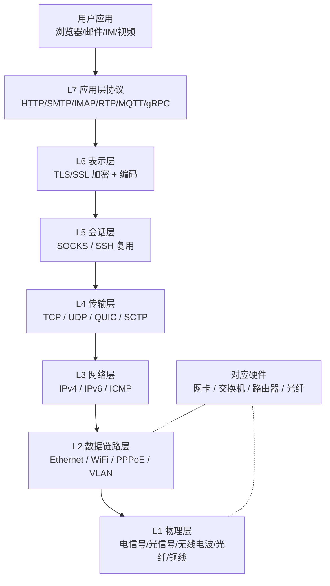
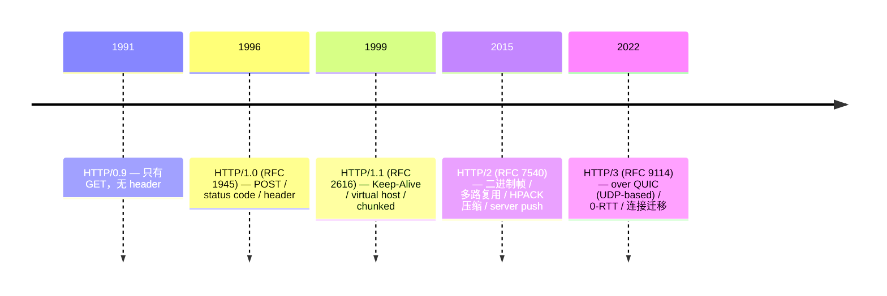
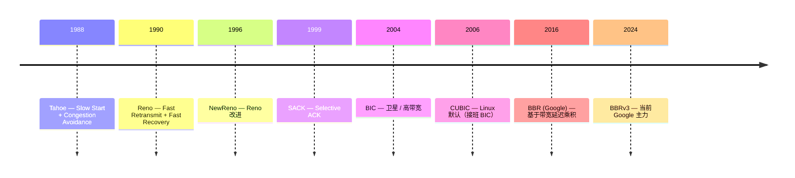
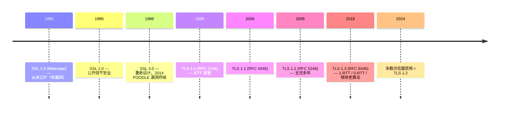
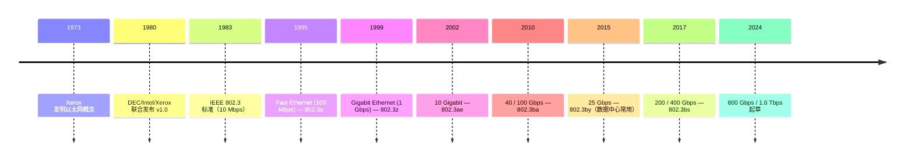
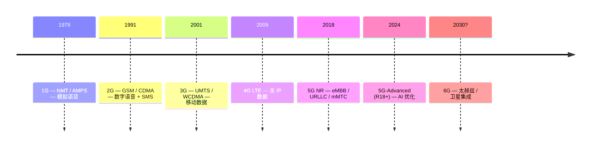
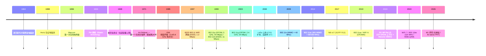
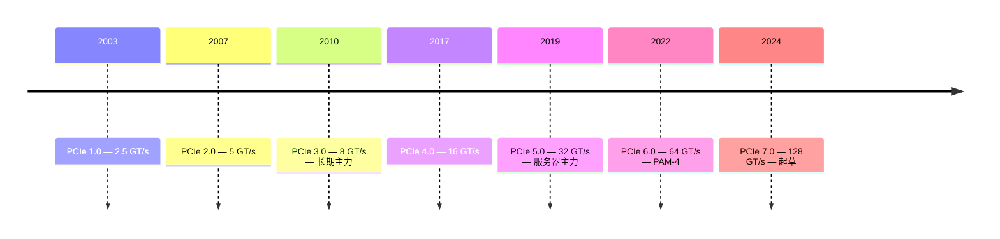

# 00-21 — 网络协议栈 + 总线协议演化：从 ARPANET 到 HTTP/3 / 5G / Thunderbolt 5

> **核心问题：** 为什么"网络"和"总线"看起来不一样但本质是同一件事——传字节？OSI 七层 / TCP/IP 四层这些划分到底有什么用？HTTP/1 → HTTP/2 → HTTP/3 是什么逻辑？为什么 USB / PCIe / Thunderbolt 越来越像？
>
> **一句话答案：** **凡是"两端传字节"的东西都是协议栈**——网络（互联网协议）和总线（机内 IO 协议）是**同一套思想在不同尺度上的应用**。OSI 七层是教科书理想，TCP/IP 四层是工业现实。50 年的演化路径都是"分层 + 标准化 + 性能优化"——每代都试图在"延迟、吞吐、安全、能耗"四角中重新平衡。

按 [user_learning_style](../CLAUDE.md) 5 步框架：① 大框架 → ② 横向对比 → ③ 对比消化 → ④ 细节填充 → ⑤ 自己造（KuNet 设计借鉴）。

> **核心提醒：** "网络协议栈"和"总线协议"在术语和实现细节上不同，但本质都是**分层协议设计**。本笔记把两者放在一起讲——先互联网协议栈，再机内总线，最后讨论它们的共性。

---

## 1. 大框架：协议栈是什么

### 1.1 一图看懂



### 1.2 OSI 七层 vs TCP/IP 四层

理论上 OSI 七层（物理 / 链路 / 网络 / 传输 / 会话 / 表示 / 应用），实际工业用 TCP/IP 四层（链路 / 网络 / 传输 / 应用）—— **OSI 是教科书理想，TCP/IP 是工业现实**。

| OSI | TCP/IP | 协议代表 | 实现位置 |
|-----|--------|---------|---------|
| L7 应用 | 应用层 | HTTP / SMTP / DNS / MQTT | 用户态 |
| L6 表示 | (合并入应用) | TLS / SSL / Base64 | 用户态库 |
| L5 会话 | (合并入应用) | SSH / SOCKS | 用户态 |
| L4 传输 | 传输层 | TCP / UDP / QUIC | 内核（TCP/UDP）/ 用户态（QUIC）|
| L3 网络 | 网际层 | IP / ICMP / ARP | 内核 |
| L2 链路 | 链路层 | Ethernet / WiFi / PPP | 内核 / 网卡固件 |
| L1 物理 | 链路层 | 1000BASE-T / 802.11ax / 5G NR | 网卡硬件 |

**关键认知：** L7 协议常自带 L6/L5 功能（HTTPS = HTTP + TLS + 自管会话）。所以现代实践中只剩 **应用 / 传输 / 网络 / 链路** 四层。

---

## 2. 互联网史：50 年的架构演化（1969-2026）

```mermaid
timeline
    1969 : ARPANET 第一个节点 (UCLA - Stanford 之间)
    1973 : TCP 设计 (Cerf & Kahn) — "Internet" 概念诞生
    1981 : RFC 791 IPv4 标准
    1981 : RFC 793 TCP 标准
    1983 : ARPANET 切换到 TCP/IP
    1984 : DNS 设计 (Mockapetris)
    1989 : Tim Berners-Lee 提出 WWW (CERN)
    1991 : HTTP/0.9 / HTML 1.0 / 第一个网页
    1995 : SSL 1.0 (Netscape) — 后退
    1996 : SSL 3.0 / HTTP/1.0 / IPv6 概念
    1997 : IEEE 802.11 原始标准 (1-2 Mbps)
    1999 : 802.11b WiFi (11 Mbps)
    1998 : RFC 2460 IPv6
    1999 : HTTP/1.1 (RFC 2616) — 持久连接、虚拟主机
    2000 : 802.11a/g
    2008 : 802.11n
    2010 : SPDY (Google) — HTTP/2 前身
    2013 : 802.11ac
    2014 : QUIC 设计 (Google)
    2015 : HTTP/2 (RFC 7540) — 二进制帧、多路复用、HPACK
    2016 : 5G 标准 R15
    2018 : TLS 1.3 (RFC 8446) — 1-RTT 握手 / 0-RTT 重连
    2019 : 802.11ax (WiFi 6)
    2020 : QUIC v1 (RFC 9000)
    2022 : HTTP/3 (RFC 9114) — over QUIC
    2024 : 802.11be (WiFi 7) / 5G-Advanced
    2026 : Web 仍以 HTTP/2 + HTTP/3 混合为主
```



### 2.1 关键里程碑解读

**1969 ARPANET：** DARPA 资助 UCLA / Stanford / UCSB / Utah 互联，4 个节点。第一个数据包从 UCLA → Stanford："LO"（要发"LOGIN"，崩溃了）。这就是互联网的开端。

**1973 TCP 设计：** Vinton Cerf + Bob Kahn 写《A Protocol for Packet Network Intercommunication》，提出"分层互联网" — 不同物理网络通过 IP 互联。设计目标：异构网络互联 / 容错 / 端到端原则。

**1989 WWW：** Tim Berners-Lee 在 CERN 提出 World Wide Web — HTTP + HTML + URL 三件套。原本只为物理学家共享论文，1991 年开放给全世界。

**1995 SSL → 2018 TLS 1.3：** 23 年从"对加密一无所知"到"1-RTT 完全前向保密"。每代都在性能和安全间权衡。

**2014-2022 QUIC + HTTP/3：** 把 TCP + TLS 合并到一个 UDP-based 协议，绕过内核 TCP 协议栈在用户态实现——延迟更低、连接迁移（手机切 WiFi 不断连）。

---

## 3. 应用层协议（L7）

### 3.1 HTTP 演化全景



| 版本 | 关键特性 | 性能影响 |
|------|---------|---------|
| 0.9 | 单行 GET | 一连接一请求 |
| 1.0 | header + status code | 仍是一连接一请求 |
| 1.1 | Keep-Alive + chunked | 多请求复用连接，但有队头阻塞 |
| 2 | 多路复用 + 二进制 | TCP 队头阻塞仍存在 |
| 3 | over QUIC (UDP) | 完全消除队头阻塞，1-RTT 握手 |

**实战感知：** 浏览器开发者工具看 Protocol 列——h2 是 HTTP/2，h3 是 HTTP/3。

### 3.2 其他应用层协议

| 协议 | RFC / 标准 | 用途 | 特点 |
|------|-----------|------|------|
| **DNS** | RFC 1035 | 域名解析 | UDP 主，TCP backup；递归 / 迭代 |
| **DoT / DoH / DoQ** | RFC 7858 / 8484 / 9250 | 加密 DNS | over TLS / HTTPS / QUIC |
| **SMTP** | RFC 5321 | 邮件发送 | TCP 25/587 |
| **IMAP / POP3** | RFC 3501 / 1939 | 邮件接收 | TCP 143/110 |
| **FTP / SFTP** | RFC 959 | 文件传输 | TCP 21+20，已半弃 |
| **SSH** | RFC 4251 | 远程 shell + 隧道 | TCP 22 + 加密 |
| **MQTT** | OASIS | IoT 消息 | TCP，发布/订阅 |
| **CoAP** | RFC 7252 | IoT 受限设备 | UDP，类 HTTP |
| **gRPC** | Google | RPC | over HTTP/2 + Protobuf |
| **WebSocket** | RFC 6455 | 双向通信 | over HTTP upgrade |
| **WebRTC** | W3C | P2P 音视频 | UDP + DTLS + SRTP |
| **RTMP** | Adobe | 流媒体（旧）| TCP，已被 HLS / DASH 替代 |
| **HLS / DASH** | Apple / ISO | 流媒体（新）| over HTTP |
| **SIP / RTP** | RFC 3261 / 3550 | VoIP | 信令 + 媒体 |
| **NTP** | RFC 5905 | 时间同步 | UDP 123 |
| **SNMP** | RFC 1157 | 网络监控 | UDP，已半弃 |
| **LDAP** | RFC 4511 | 目录服务 | TCP 389 |

### 3.3 数据序列化格式

应用层 payload 用什么格式编码？

| 格式 | 类型 | 大小 | 特点 |
|------|------|------|------|
| **JSON** | 文本 | 大 | 通用，浏览器原生 |
| **XML** | 文本 | 极大 | 老 SOAP / 配置 |
| **YAML** | 文本 | 中 | 配置文件 |
| **TOML** | 文本 | 中 | Cargo / 现代配置 |
| **Protobuf** | 二进制 | 小 | gRPC / 高性能 |
| **MessagePack** | 二进制 | 小 | 类 JSON 二进制 |
| **CBOR** | 二进制 | 小 | RFC 7049，物联网 |
| **Avro** | 二进制 | 小 | 大数据 (Hadoop) |
| **Thrift** | 二进制 | 小 | Facebook 旧 RPC |
| **FlatBuffers** | 二进制 | 中 | 0-copy 反序列化 |
| **Cap'n Proto** | 二进制 | 中 | 0-copy + RPC |
| **BSON** | 二进制 | 中 | MongoDB |

---

## 4. 传输层（L4）

### 4.1 TCP / UDP / QUIC / SCTP 对比

| 维度 | TCP | UDP | QUIC | SCTP |
|------|-----|-----|------|------|
| 可靠性 | ✅ | ❌ | ✅ | ✅ |
| 顺序 | ✅ | ❌ | ✅ | 可选 |
| 流控 | ✅ | ❌ | ✅ | ✅ |
| 拥塞控制 | ✅ | ❌ | ✅ | ✅ |
| 头部 | 20+ B | 8 B | 1+ B (短头) | 12+ B |
| 多流 | ❌ | ❌ | ✅ | ✅ |
| 连接迁移 | ❌ | N/A | ✅ | ❌ |
| 加密 | 需 TLS | N/A | 内置 | 需 DTLS |
| 内核 vs 用户 | 内核 | 内核 | 用户态 | 内核（少用）|
| 主战场 | 通用 | DNS / 游戏 / 视频 | HTTP/3 / 现代 web | 电信信令 |

### 4.2 拥塞控制算法演化



**Linux 实战：**
```sh
sysctl net.ipv4.tcp_congestion_control      # 当前算法
sysctl net.ipv4.tcp_available_congestion_control  # 可选
echo bbr > /proc/sys/net/ipv4/tcp_congestion_control  # 切到 BBR
```

### 4.3 TLS 演化



**TLS 1.3 主要变化：**
- 握手从 2-RTT 减到 1-RTT
- 0-RTT 早期数据（重连免握手）
- 强制前向保密（PFS）
- 移除老的密码套件（RSA / SHA-1 / RC4 / 3DES）
- 简化协议状态机

---

## 5. 网络层（L3）

### 5.1 IPv4 vs IPv6

| 维度 | IPv4 | IPv6 |
|------|------|------|
| 地址 | 32-bit | 128-bit |
| 地址数 | 4.3 × 10^9 | 3.4 × 10^38 |
| 表示 | 192.168.1.1 | 2001:db8::1 |
| 头部 | 变长 | 固定 40 B |
| 分片 | 路由器可分片 | 仅源端分片 |
| NAT | 必需（地址不够）| 不需要 |
| Auto config | DHCP | SLAAC + DHCPv6 |
| 主流 | 仍主流 | 增长但慢 |

**IPv6 进展（2026）：**
- 全球 IPv6 流量约 45%
- 中国移动 / 美国 T-Mobile 几乎纯 IPv6
- 大多数云服务双栈
- 完全切到 IPv6 可能要再 10 年

### 5.2 路由协议

| 协议 | 范围 | 类型 |
|------|------|------|
| **RIP** | 内部 | 距离向量（已淘汰）|
| **OSPF** | 内部 | 链路状态 |
| **IS-IS** | 内部 | 链路状态（电信常用）|
| **BGP** | 全球 | 路径向量（互联网骨干）|
| **MPLS** | 内部 | 标签交换（电信主流）|

---

## 6. 链路层（L2）

### 6.1 以太网演化



**接口类型：**
- RJ45 (Cat5/5e/6/6a/7/8) — 铜双绞线
- SFP / SFP+ / SFP28 / QSFP+ / QSFP28 / OSFP — 光模块插槽
- 光纤模块：SR / LR / ER（短/长/超长距离）

### 6.2 WiFi 演化

| 年份 | 标准 | 商品名 | 速率峰值 |
|------|------|-------|---------|
| 1997 | 802.11 | — | 2 Mbps |
| 1999 | 802.11b | — | 11 Mbps |
| 2003 | 802.11g | — | 54 Mbps |
| 2009 | 802.11n | WiFi 4 | 600 Mbps |
| 2013 | 802.11ac | WiFi 5 | 6.9 Gbps |
| 2019 | 802.11ax | WiFi 6 / 6E | 9.6 Gbps |
| 2024 | 802.11be | WiFi 7 | 46 Gbps |
| 2028? | 802.11bn | WiFi 8 | 100+ Gbps |

### 6.3 蓝牙演化

| 版本 | 关键 | 速率 |
|------|------|------|
| 1.0 (1999) | 起步 | 1 Mbps |
| 2.0 (2004) | EDR | 3 Mbps |
| 3.0 (2009) | High Speed | 24 Mbps |
| 4.0 (2010) | LE (低功耗) | 1 Mbps |
| 5.0 (2016) | LE 增强 | 2 Mbps + 4× 范围 |
| 5.4 (2023) | LE Audio | — |
| 6.0 (2024 起草) | Channel Sounding | — |

### 6.4 5G / 移动网络



**5G 三大场景：**
- **eMBB** (enhanced Mobile Broadband) — 高带宽（VR/AR）
- **URLLC** (Ultra-Reliable Low Latency) — 工业控制 / 无人驾驶
- **mMTC** (massive Machine Type) — 万物互联

---

## 7. 物理层（L1）

物理层一般 OS 学习者不深入，但要知道是哪些技术：

### 7.1 有线传输介质

| 介质 | 用途 |
|------|------|
| **铜双绞线 (UTP/STP)** | 100Base-T / 1000Base-T 短距离 |
| **同轴电缆** | 早期以太网（已淘汰）/ 有线电视 |
| **光纤** | 长距离 + 高带宽 (单模/多模) |

### 7.2 无线传输介质

| 频段 | 用途 |
|------|------|
| **HF (3-30 MHz)** | 远距离短波 |
| **VHF/UHF** | 电视广播 / 对讲机 |
| **2.4 GHz** | WiFi / 蓝牙 / 微波炉 |
| **5 GHz** | WiFi 5/6 |
| **6 GHz** | WiFi 6E/7 |
| **24-100 GHz** | 5G mmWave / 6G |
| **可见光** | LiFi (实验性) |

### 7.3 编码 / 调制

物理层常见技术（不展开）：
- NRZ / PAM-4 / PCM —— 数字信号
- QAM / OFDM / OFDMA —— 现代调制
- Reed-Solomon / Turbo / LDPC —— 前向纠错码

### 7.4 无线物理层（PHY）演化简史



**PHY 三大支柱：**

#### 7.4.1 调制（Modulation）

把比特 → 电磁波形：
- **AM/FM**（模拟调幅/调频）— 广播
- **PSK / QPSK / 8PSK**（相位偏移）— 蓝牙 / 早期 WiFi
- **QAM (Quadrature Amplitude Modulation)** — 振幅 + 相位组合，4-QAM/16-QAM/64-QAM/256-QAM/1024-QAM/4096-QAM（WiFi 7）
- **GFSK**（高斯频率偏移）— 经典蓝牙
- **CSS (Chirp Spread Spectrum)** — LoRa（远距离低功耗 IoT）
- **OFDM (Orthogonal FDM)** — 把数据分成几百个正交子载波并行发送，抗多径反射；WiFi/4G/5G 全用
- **OFDMA** — OFDM 的多用户分配版本（一个 OFDM symbol 同时承载多用户数据）；WiFi 6 / 5G

#### 7.4.2 多天线技术（MIMO）

- **SISO / SIMO / MISO** — 单 / 多发 / 多收 单一组合
- **MIMO** — 多收多发，通过空间分集提升吞吐
- **MU-MIMO** — Multi-User MIMO，AP 同时与多终端通信
- **Massive MIMO** — 5G 基站百根天线，beam-forming 精准指向用户

#### 7.4.3 前向纠错（FEC）

- **Hamming / Reed-Solomon** — 经典分组码
- **Convolutional + Viterbi** — GSM/2G
- **Turbo Code** — 3G/4G
- **LDPC (Low-Density Parity Check)** — WiFi 6 / 5G NR
- **Polar Code** — 5G 控制信道（华为主推）

**PHY 关键参数：**

| 标准 | 频段 | 调制 | 信道宽度 | 峰值速率 | MIMO 流 |
|------|------|------|---------|---------|---------|
| 802.11b (1999) | 2.4 GHz | DSSS | 22 MHz | 11 Mbps | 1 |
| 802.11g (2003) | 2.4 GHz | OFDM (64-QAM) | 20 MHz | 54 Mbps | 1 |
| 802.11n (2009) | 2.4/5 | OFDM (64-QAM) | 40 MHz | 600 Mbps | 4 |
| 802.11ac (2014) | 5 GHz | OFDM (256-QAM) | 160 MHz | 6.9 Gbps | 8 (MU-MIMO) |
| 802.11ax (2019) | 2.4/5/6 | OFDMA (1024-QAM) | 160 MHz | 9.6 Gbps | 8 |
| 802.11be (2024) | 2.4/5/6 | OFDMA (4096-QAM) | 320 MHz | 46 Gbps | 16 |
| LTE Cat.4 | 多频段 | OFDMA (64-QAM) | 20 MHz | 150 Mbps | 2 |
| 5G NR (sub-6) | 0.4-7 GHz | CP-OFDM (256-QAM) | 100 MHz | 5 Gbps | 4 |
| 5G NR (mmWave) | 24-52 GHz | CP-OFDM (256-QAM) | 400 MHz | 20 Gbps | 8 |
| LoRa | sub-1 GHz | CSS | 125-500 kHz | 50 kbps | 1 |
| 蓝牙 5.0 | 2.4 GHz | GFSK / 8PSK | 2 MHz | 2 Mbps | 1 |

#### 7.4.4 软件无线电（SDR）+ PHY 开源化

传统 PHY 是 ASIC（硬件实现），现代趋势：**软件无线电（Software Defined Radio）** 把调制/解调/FEC 用 CPU/GPU/FPGA 跑。

| 项目 | 平台 | 说明 |
|------|------|------|
| **GNU Radio** | x86 + USRP/HackRF/RTL-SDR | 开源 SDR 框架，可视化 GRC |
| **srsRAN** | x86 | 开源 4G/5G 协议栈（含 PHY）|
| **OpenAirInterface (OAI)** | x86 | EURECOM 主导 5G 实现 |
| **Magma Core** | x86 | Facebook → Linux Foundation 5G 核心网 |
| **HackRF / BladeRF / LimeSDR** | USB SDR 硬件 | 业余 / 研究 |
| **GR-LoRa** | GNU Radio | 开源 LoRa PHY 实现 |


---

## 8. 机内总线协议（与网络协议是同一思想不同尺度）

### 8.1 PCIe 演化



PCIe 也是分层协议：
- **物理层**：PAM-4 / NRZ 信号
- **数据链路层**：DLLP（DLL Packet）+ 流控 + ACK/NAK
- **事务层**：TLP（Transaction Layer Packet）+ 内存读写 / 配置 / 消息

→ 与网络协议栈结构惊人相似：分层 / 标准化 / 性能优化。

### 8.2 USB 演化

| 版本 | 速率 | 接口 |
|------|------|------|
| 1.0 (1996) | 12 Mbps | Type-A/B |
| 2.0 (2000) | 480 Mbps | 同上 |
| 3.0 (2008) | 5 Gbps | 蓝色 USB-A |
| 3.1 Gen 2 (2013) | 10 Gbps | Type-C |
| 3.2 Gen 2x2 (2017) | 20 Gbps | Type-C |
| 4 Gen 3x2 (2019) | 40 Gbps | Type-C / 兼容 Thunderbolt 3 |
| 4 Gen 4x2 (2022) | 80 Gbps | Type-C |

USB 也是分层（物理 + 链路 + 协议层）。

### 8.3 Thunderbolt（USB 4 化）

| 版本 | 速率 |
|------|------|
| TB1 (2011) | 10 Gbps |
| TB2 (2013) | 20 Gbps |
| TB3 (2015) | 40 Gbps（Type-C 接口）|
| TB4 (2020) | 40 Gbps + 兼容 USB4 |
| TB5 (2024) | 80 Gbps + 120 Gbps "Bandwidth Boost" |

→ Thunderbolt 4+ 是 USB 4 的超集。Apple 推动 → 现在 PC 主流接口。

### 8.4 短距离低速总线

| 总线 | 速率 | 主战场 |
|------|------|-------|
| **I2C** | 100 kHz - 5 MHz | 传感器 / EEPROM |
| **SPI** | 1-50 MHz | Flash / Display |
| **UART** | 115200 bps - 几 Mbps | 串口 / 调试 |
| **CAN** | 1 Mbps | 汽车（OBD-II）|
| **SMBus** | 100 kHz | PC 主板传感器 |
| **I3C** | 12.5 MHz | 新一代低速 |
| **MIPI CSI/DSI** | Gbps | 摄像头 / 显示 |
| **JTAG** | MHz | 调试 / 烧录 |


### 8.5 存储总线

| 总线 | 速率 | 协议 |
|------|------|------|
| **SATA** | 6 Gb/s | AHCI |
| **NVMe** | 通过 PCIe 4.0 x4 = 64 Gb/s | NVMe over PCIe |
| **NVMe-oF** | 跨网络 | 远程存储 |
| **eMMC** | UFS 3.1 = 23.2 Gb/s | 嵌入式 |
| **SD / microSD** | UHS-III = 4 Gb/s | 移动设备 |

### 8.6 显示 / 图形总线

| 总线 | 速率 | 主战场 |
|------|------|-------|
| **HDMI 2.1** | 48 Gb/s | 电视 / 游戏机 |
| **DisplayPort 2.1** | 80 Gb/s | PC 显示器 |
| **VGA** | (analog) | legacy |
| **DVI** | 几 Gb/s | legacy |

---

## 9. 网络与总线的共性（"协议思想"）

### 9.1 所有协议栈共同特征

1. **分层**：每层只解决一个问题
2. **封装**：上层 payload 加下层 header
3. **错误检测**：CRC / checksum 在每层
4. **流控**：避免接收方溢出
5. **错误恢复**：重传或丢弃
6. **协商**：握手 / 容量探测
7. **加密**（现代必备）

### 9.2 网络协议 ↔ 总线协议对应

| 概念 | 网络（Ethernet/TCP/IP）| 总线（PCIe）|
|------|---------------------|-------------|
| 物理层 | 网线 / WiFi 信号 | PCIe lane (PAM-4)|
| 链路层 | Ethernet frame | PCIe DLLP |
| 网络层 | IP packet | (PCIe 单一域，无路由)|
| 传输层 | TCP segment | PCIe TLP |
| 应用 | HTTP | NVMe / GPU command |

→ **理解了 TCP/IP 后再看 PCIe，所有概念都对得上**。这是为什么"协议栈"是统一抽象。

---

## 10. 操作系统中的网络栈

### 10.1 Linux 网络栈

```
用户态
  socket() / bind() / listen() / accept() / send() / recv()
       ↓
内核态 (Linux net/)
  socket layer
       ↓
  L7 协议（部分内核实现：netfilter/iptables hook）
       ↓
  L4: TCP (net/ipv4/tcp.c) / UDP (net/ipv4/udp.c) / QUIC (用户态 + kernel UDP)
       ↓
  L3: IP (net/ipv4/ip_input.c, ip_output.c)
       ↓
  L2: net/ethernet/eth.c
       ↓
  net/core/dev.c — 设备无关层
       ↓
  drivers/net/ — 网卡 driver
       ↓
硬件 (NIC)
```

### 10.2 嵌入式网络栈

| 实现 | 语言 | 大小 | 特点 |
|------|------|------|------|
| **lwip** | C | 80-100 KB | 经典嵌入式 TCP/IP（本仓库 net/lwip） |
| **smoltcp** | Rust | 类似 | Rust 嵌入式（本仓库 net/smoltcp） |
| **uIP** | C | 几 KB | 极简，已被 lwip 取代 |
| **Zephyr Net** | C | 中 | Zephyr OS 内置 |


### 10.3 用户态网络栈（绕过内核）

| 项目 | 用途 |
|------|------|
| **DPDK** | 数据中心高性能（Intel）|
| **VPP** | 用户态网络函数 |
| **mTCP** | 用户态 TCP |
| **F-Stack** | 腾讯用户态 BSD 网络栈 |
| **XDP** | Linux eBPF 早期 hook |
| **io_uring + AF_XDP** | Linux 现代零拷贝 |

→ 现代趋势：把内核网络栈推到用户态，提升性能、降低延迟。

---

## 11. QuickStart / 实操路径

### 11.1 入门：识别你 PC 的网络栈

```sh
# 物理层
ip link                    # 看接口
ethtool eth0                # 看网卡能力（速率 / 介质）

# 数据链路 / 网络层
ip addr                    # 看 IP 地址
ip route                    # 看路由表
ip neigh                    # 看 ARP 表

# 传输层
ss -tunap                   # 看所有 TCP/UDP 连接 + 进程

# 协议测试
ping -c 4 8.8.8.8           # ICMP
mtr -c 10 google.com        # traceroute + ping 综合
nc -v google.com 80         # 测试端口
curl -v https://google.com  # HTTP/2 / HTTP/3 / TLS 详情
```

### 11.2 熟练：抓包分析

```sh
sudo tcpdump -i any -w /tmp/cap.pcap port 443
# Wireshark 打开 /tmp/cap.pcap 分析

# 命令行分析：
sudo tcpdump -i any -X -nn 'host 8.8.8.8'
# -X 显示十六进制 + ASCII
# -nn 不解析名字
```

### 11.3 非常熟悉：写自己的协议

练习：用 Python / Rust 写一个最小 HTTP 服务器，理解：
- socket / bind / listen / accept
- HTTP 请求解析（request line + headers + body）
- HTTP 响应构造
- Content-Length / chunked encoding
- HTTP/1.1 keep-alive

→ 写过这个之后，再读 nginx / lwip 源码就有语言。

### 11.4 业界最佳实践

- **CDN 加速**（Cloudflare / Akamai）：用 Anycast + edge cache
- **HTTP/3 部署**：通常由 CDN（Cloudflare / Akamai / 阿里云）边缘自动 enable QUIC + HTTP/3；自建场景需要 nginx-quic / Caddy（原生支持）/ HAProxy 较新版本——理解 QUIC 端口（UDP 443）、Alt-Svc header 协商机制后，自起也完全可行
- **TLS termination**：放 reverse proxy 上（Nginx / Traefik）而不是应用进程
- **零信任网络**（Zero Trust）：Tailscale / Cloudflare Access 等
- **Service Mesh**（Istio / Linkerd）：sidecar 处理服务间网络

---

## 12. 跨产业 / 国家 / 应用领域

### 12.1 中国互联网协议生态特色

- **国内 DNS 主要用 114.114.114.114 / 阿里 223.5.5.5**（Google 8.8.8.8 不可达）
- **GFW 干扰** TLS SNI / DPI / IP block
- **HTTPS over QUIC** 部分被干扰（QUIC 不稳定）
- **微信 / 支付宝**：自有协议（mmproto / aliproto）over TCP
- **ip6tables / 国内电信 IPv6** 覆盖率高

### 12.2 国际互联网协议厂商

| 公司 | 角色 |
|------|------|
| **Cloudflare** | CDN + DNS + DDoS 保护 |
| **Akamai** | CDN 老牌 |
| **AWS CloudFront** | Amazon CDN |
| **Cisco** | 路由器 / 交换机 |
| **华为** | 路由器 + 5G 设备 |
| **Juniper** | 数据中心交换机 |
| **Arista** | 数据中心交换机 |
| **Mikrotik** | 中端 SOHO 设备 |

### 12.3 中国通讯设备厂商

| 公司 | 主营 |
|------|------|
| **华为** | 5G / 路由器 / 服务器 |
| **中兴** | 5G / 光网络 |
| **大华 / 海康** | 网络监控 |
| **TP-Link** | 消费路由 |
| **小米** | 智能家居路由 |

---

## 13. 名词词典

### 13.1 协议层术语

| 术语 | 含义 |
|------|------|
| **OSI** | Open Systems Interconnection（七层模型）|
| **TCP/IP** | 工业事实四层模型 |
| **L1-L7** | 协议层数 |
| **encapsulation** | 协议封装 |
| **MTU** | Maximum Transmission Unit（典型 1500 B for Ethernet）|
| **MSS** | Maximum Segment Size（TCP payload 最大）|
| **PMTUD** | Path MTU Discovery |
| **fragmentation** | IP 分片 |
| **NAT** | Network Address Translation |
| **CIDR** | Classless Inter-Domain Routing（如 192.168.0.0/16）|
| **subnet mask** | 子网掩码 |
| **broadcast / multicast / anycast** | 广播 / 组播 / 任播 |

### 13.2 TCP 术语

| 术语 | 含义 |
|------|------|
| **3-way handshake** | SYN → SYN-ACK → ACK |
| **4-way teardown** | FIN → ACK → FIN → ACK |
| **TIME_WAIT** | 关闭后等 2MSL 状态 |
| **SACK** | Selective Acknowledgment |
| **slow start** | 拥塞窗口指数增长 |
| **congestion avoidance** | 线性增长 |
| **fast retransmit** | 快重传 |
| **HoL blocking** | 队头阻塞 |
| **Nagle algorithm** | 减少小包 |
| **delayed ACK** | 延迟确认 |
| **sliding window** | 滑动窗口 |

### 13.3 安全术语

| 术语 | 含义 |
|------|------|
| **TLS / SSL** | Transport Layer Security |
| **HTTPS** | HTTP over TLS |
| **PKI** | Public Key Infrastructure |
| **CA (Certificate Authority)** | 证书颁发机构 |
| **Root CA** | 根 CA |
| **OCSP** | 在线证书状态协议 |
| **HSTS** | HTTP Strict Transport Security |
| **CSP** | Content Security Policy |
| **CORS** | Cross-Origin Resource Sharing |
| **CSRF** | Cross-Site Request Forgery |
| **MITM** | Man-In-The-Middle |
| **Forward Secrecy (PFS)** | 前向保密 |
| **Diffie-Hellman** | 密钥交换 |
| **AES / ChaCha20** | 对称加密 |
| **RSA / ECDSA / Ed25519** | 非对称签名 |
| **SHA-256 / Blake3** | 哈希 |

### 13.4 总线术语

| 术语 | 含义 |
|------|------|
| **PCIe lane** | 1 对差分信号线 |
| **TLP / DLLP** | PCIe Transaction / Data Link Layer Packet |
| **MMIO** | Memory-Mapped I/O |
| **DMA** | Direct Memory Access |
| **MSI / MSI-X** | Message Signaled Interrupt |
| **bus master** | 设备能发起 DMA |
| **enumeration** | 总线枚举（PCI 扫描）|
| **hot-plug** | 热插拔 |
| **HBM** | High Bandwidth Memory |
| **DDR** | Double Data Rate (DDR4/DDR5)|
| **NVDIMM** | Non-Volatile DIMM |

---

## 14. 进一步阅读

### 14.1 经典书

- ***TCP/IP Illustrated, Vol 1-3*** — W. Richard Stevens — 网络圣经
- ***UNIX Network Programming*** — Stevens — socket 编程必读
- ***Computer Networks*** — Andrew Tanenbaum — 教材
- ***High Performance Browser Networking*** — Ilya Grigorik — 现代 web 网络（免费在线）
- ***BPF Performance Tools*** — Brendan Gregg — eBPF
- ***PCI Express System Architecture*** — MindShare — PCIe 圣经

### 14.2 RFC

- RFC 791 — IPv4
- RFC 793 — TCP
- RFC 2616 / 7230 — HTTP/1.1
- RFC 7540 — HTTP/2
- RFC 9114 — HTTP/3
- RFC 9000 — QUIC
- RFC 8446 — TLS 1.3

### 14.3 视频

- [Stanford CS 144 Networking Lab](https://cs144.github.io/) — 实现自己的 TCP
- [Computer Networks by David Wetherall](https://www.youtube.com/playlist?list=PLAB1lCNi_lhEhjG0OqB2H_eMfBDLjMl_F)
- [WireShark Tutorials](https://www.youtube.com/results?search_query=wireshark+tutorial)

### 14.4 本仓库笔记串联

- [00-01-material-index](00-01-material-index.md) — 看 `net/` 目录有什么
- [00-02-fullstack-vertical](00-02-fullstack-vertical.md) — 网络栈是 OS 的一部分
- [00-07-os-evolution](00-07-os-evolution.md) — 网络栈在 OS 哪里
- 后续 [00-12-device-driver-evolution](00-12-device-driver-evolution.md) — 网卡是设备
- 后续 [00-35-distro-evolution](00-35-distro-evolution.md) — distro 怎么配网络

### 14.5 本仓库本地资料对应

| 路径 | 内容 | 与本笔记关系 |
|------|------|-------------|
| `net/lwip/` | C 嵌入式 TCP/IP | 学 § 4 / § 6 / § 10 实现 |
| `net/smoltcp/` | Rust 嵌入式 TCP/IP | KuNet 借鉴对象 |
| `net/rustls/` | Rust TLS | 学 § 4.3 实现 |
| `boot/u-boot/net/` | U-Boot DHCP/TFTP/PXE | bootloader 时期网络 |

→ 拿这些源码对照本笔记的概念走，几周内能从"理解网络栈"过渡到"读懂网络栈实现"再到"修改网络栈"。
