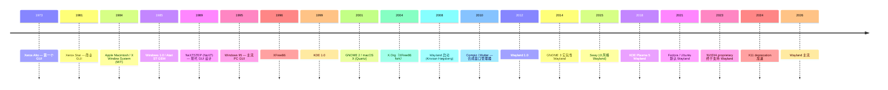
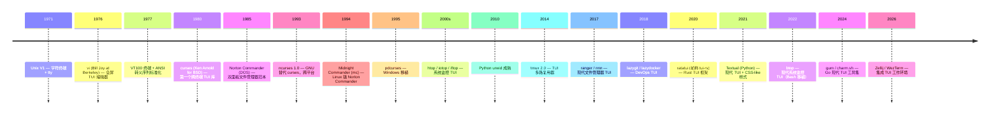

# 00-22 — 显示 / 窗口系统演化（X11 → Wayland → Windows DWM → Quartz）

>
> **一句话答案：** 显示系统 = **窗口管理（哪个 app 在哪个矩形）+ 合成（多窗口叠加 + 透明度 / 阴影）+ 渲染（GPU 加速）+ 输入分发（哪个 app 收键鼠事件）**。X11 用 40 年（1984+），现代被 Wayland 替代；Windows 用 DWM；macOS 用 Quartz；嵌入式直接用 framebuffer 或自定义 GUI lib。


---

## 1. 历史时间轴



---

## 2. 桌面显示栈分层

```
应用 (Firefox / GIMP / Terminal)
   ↕ GUI toolkit (GTK / Qt / Tk / wxWidgets)
   ↕ display protocol (X11 / Wayland)
   ↕ display server (Xorg / Sway / Mutter / KWin)
   ↕ kernel DRM / KMS / framebuffer
   ↕ GPU driver
   ↕ Hardware
```

每一层都可独立替换。

---

## 3. X Window System（X11，1984+）

### 3.1 X11 设计

- **网络透明**：客户端 / 服务器协议（X protocol over TCP / Unix socket）
- 客户端 = 应用，服务器 = 显示
- → "我可以在远程机器跑应用，用本地显示"
- 1984 设计，2024 已 40 年

### 3.2 X11 现实问题

- 安全：客户端能截屏 / 抓键 → 现代不可接受
- 复杂：协议巨型，3000+ 函数
- 网络透明实际很少用（用 SSH X forwarding 慢）
- 合成窗口管理（透明 / 阴影）后加，hack 状态
- 撕裂、卡顿（vsync 难做）

### 3.3 X11 实现

| 实现 | 当前 |
|------|------|
| **MIT X** (1984) | 历史 |
| **XFree86** (1992) | 已停 |
| **X.Org** (2004 fork) | 当前主流 X11 实现 |
| **Xwayland** | Wayland 上跑 X11 应用 |
| **Cygwin/X / VcXsrv** | Windows 上跑 X11 |

### 3.4 X11 窗口管理器

```
窗口管理器（WM）—— 决定窗口怎么排
├── 平铺式（Tiling）：i3 / dwm / awesome / xmonad / bspwm
├── 浮动式：Mutter (GNOME) / KWin (KDE) / Openbox / Fluxbox
└── 复合式（Compositing）：Compiz / Mutter / KWin
```

---

## 4. Wayland（X11 接班，2008+）

### 4.1 Wayland 设计哲学

> "every frame is perfect"

- 协议简单（约 100 函数 vs X11 3000+）
- 合成器（compositor）= WM + display server 一体
- 直接 OpenGL / Vulkan 渲染
- 强安全（应用不能监视别的窗口）
- 无缝多 GPU 切换

### 4.2 Wayland 合成器

| 合成器 | 风格 | 主用 |
|--------|------|------|
| **Mutter** | GNOME | GNOME 桌面 |
| **KWin** | KDE | KDE Plasma |
| **Sway** | i3 风格平铺 | Wayland 主流平铺 |
| **wlroots** | 库 | Sway / Hyprland 等基于此 |
| **Hyprland** | 现代花哨平铺 | 极客圈火爆 |
| **Niri** | scrolling tile | 创新设计 |
| **river** | dynamic tile | 实验 |
| **Weston** | 参考实现 | 嵌入式 / 开发 |
| **Cage** | kiosk single-app | 数字标牌 |
| **Mir** | Canonical | Ubuntu Touch / 嵌入式 |

### 4.3 X11 vs Wayland 对比

| 维度 | X11 | Wayland |
|------|-----|---------|
| 设计年代 | 1984 | 2008 |
| 协议大小 | 巨型 | 极简 |
| 网络透明 | ✅ 内置 | ❌（用 waypipe / VNC 替代）|
| 安全 | 弱 | 强 |
| 合成 | 后加 hack | 内置 |
| 撕裂 | 经常 | 几乎无 |
| 性能 | 中 | 高 |
| 截屏 | 任何 X 客户端可做 | 显式 portal |
| 多 GPU | 复杂 | 内置 |
| 兼容性 | 极广 | 现代普及中（Xwayland 兼容旧）|

### 4.4 XWayland

- Wayland 合成器内嵌 X 服务器
- 老 X11 应用透明可跑
- 性能 / 安全略差但兼容性好

---

## 5. Windows 显示栈

```
Windows app (Win32 / UWP / WinUI)
   ↕ GDI / Direct2D / Direct3D / DirectComposition
   ↕ DWM (Desktop Window Manager) — 合成器
   ↕ DirectX kernel mode
   ↕ NVIDIA / AMD / Intel display driver
   ↕ Hardware
```

历史：
- Windows 1-3.x：GDI 平面绘制
- Windows 95-XP：GDI + GDI+
- Windows Vista：DWM 引入（硬件合成）
- Windows 7+：DWM 强制
- Windows 10+：Composition API

---

## 6. macOS 显示栈

```
macOS app (Cocoa / SwiftUI / Metal)
   ↕ Core Animation / Core Graphics (Quartz)
   ↕ WindowServer
   ↕ IOKit display driver
   ↕ Apple GPU
```

特点：
- **Core Animation** 自 2007 iPhone 引入，回流 macOS
- WindowServer 是合成器
- Quartz Compositor = 苹果版 DWM
- Metal 后端硬件加速

---

## 7. GUI Toolkit（应用层）

### 7.1 跨平台

| Toolkit | 语言 | 一句话 |
|---------|------|--------|
| **GTK** | C / GObject | GNOME 系，Linux 主流 |
| **Qt** | C++ | KDE 系，跨平台商业 |
| **Tk / Tkinter** | Tcl / Python | 老但简单 |
| **wxWidgets** | C++ | 原生外观跨平台 |
| **FLTK** | C++ | 极简 |
| **Iced** | Rust | Elm 风格 |
| **egui** | Rust | 即时模式 |
| **Tauri** | Rust + WebView | 跨平台 desktop |
| **Electron** | Node + Chromium | 跨平台（重）|
| **Flutter Desktop** | Dart | 跨移动 + 桌面 |
| **Avalonia** | .NET | 跨平台 .NET UI |

### 7.2 平台原生

| Toolkit | 平台 |
|---------|------|
| **Cocoa / AppKit** | macOS |
| **UIKit / SwiftUI** | iOS |
| **Win32 / UWP / WinUI 3 / WPF / WinForms** | Windows |
| **AndroidUI / Jetpack Compose** | Android |

---

## 7.5 TUI（终端 UI）演化简史

> **TUI = Text/Terminal User Interface** —— 不用图形栈，纯字符 + ANSI 转义码在 80×24 终端里画 UI。介于 CLI 和 GUI 之间，**至今活跃**（vim / htop / lazygit 等）。

### 7.5.1 时间线



### 7.5.2 TUI 工作原理

```
┌──────────────────────────────────────┐
│ 应用程序                              │
│   ↓ 调用 curses API                  │
│ curses / ncurses 库                  │
│   ↓ 生成 ANSI 转义序列                │
│ termcap / terminfo 数据库             │
│   ↓ 通过 PTY 写入                    │
│ 终端模拟器 (xterm/alacritty/wezterm) │
│   ↓ 解析 ANSI                        │
│ GPU 渲染字符 + 颜色                   │
└──────────────────────────────────────┘
```

**ANSI 转义序列示例：**
```
\033[2J          清屏
\033[H           光标到 (0,0)
\033[31m         前景红
\033[1;33;44m    粗体 + 黄字 + 蓝底
\033[?25l        隐藏光标
\033[?1049h      切到备用屏幕（vim 退出后恢复 shell）
```

### 7.5.3 主流 TUI 库横向对比

| 库 | 语言 | 特点 | 代表应用 |
|----|------|------|---------|
| **(n)curses** | C | 老牌、跨平台、API 庞杂 | vim / htop / mc / tmux |
| **termbox / termbox2** | C | 极简（一文件） | nsxiv / 部分 Go 项目 |
| **blessed** | Node.js | 类 jQuery 链式 API | 各种 Node TUI |
| **urwid** | Python | event loop 友好 | mtv / wicd |
| **prompt_toolkit** | Python | 现代 REPL 库（IPython 用）| ptpython / pgcli |
| **Textual** | Python | CSS 样式 + async + reactive | textual-paint / posting |
| **rich** | Python | 富文本（颜色/表格/Markdown）| pip / poetry / 各种 CLI |
| **ratatui** | Rust | 不可变状态 + immediate-mode 渲染 | gitui / bottom / yazi |
| **crossterm** | Rust | 跨平台终端原语（ratatui 后端）| 多种 |
| **bubbletea** | Go | Elm 风格架构（Model-View-Update）| gh / glow / lazygit |
| **lipgloss** | Go | 终端 CSS-like 样式 | bubbletea 配套 |
| **gum** | Go (charm.sh) | shell 脚本里调 TUI 组件 | DevOps 脚本 |
| **FTXUI** | C++ | 现代 C++ + functional | 部分 C++ TUI 项目 |
| **Notcurses** | C | 不局限 ncurses 兼容、支持图片/视频 | 实验性强 |

### 7.5.4 现代经典 TUI 应用

| 类别 | 应用 |
|------|------|
| **编辑器** | vim / neovim / emacs (TUI mode) / nano / micro / helix |
| **文件管理** | mc / ranger / nnn / yazi / lf / vifm |
| **系统监控** | top / htop / btop / glances / nvtop / nload / iftop |
| **终端复用** | tmux / screen / zellij / abduco |
| **Git** | tig / lazygit / gitui |
| **Docker / K8s** | lazydocker / k9s |
| **数据库** | mycli / pgcli / litecli / harlequin |
| **音乐** | cmus / ncmpcpp / spotify-tui |
| **聊天** | weechat / irssi / gomuks |
| **浏览器** | w3m / lynx / browsh / carbonyl |
| **邮件** | mutt / aerc / neomutt |
| **DevOps** | gh / glow / posting / atac |
| **AI 助手** | aichat / mods / shellgpt |

### 7.5.5 为什么 TUI 至今活跃

1. **服务器登录场景**：SSH 进生产机器，没图形栈，TUI 是唯一选择
2. **键盘党生产力**：vim/emacs 用户拒绝鼠标
3. **资源占用极低**：几 MB 内存，适合 VPS
4. **可脚本化 + 可远程**：tmux + ssh 持久会话
5. **现代复兴**：Rust/Go 让 TUI 开发体验大幅改善

### 7.5.6 任何 OS 早期阶段的 UI 选择

任何 OS 早期没有图形栈时，TUI 是唯一 UI 形式：
- 命令行 shell + 基础 TUI 库 = 早期管理界面
- 现代 Rust 项目可借鉴 ratatui 的 immediate-mode 渲染（与 async 友好）
- Kconfig / menuconfig 本身就是 TUI（kconfiglib + 终端绘制）


---

## 8. 嵌入式 / 简化 GUI

### 8.1 嵌入式 GUI 库

| 库 | 一句话 |
|----|--------|
| **LVGL** | C 嵌入式 GUI 主流（STM32 / ESP32 / Linux）|
| **SDL2 / SDL3** | 简单跨平台 2D + GameDev |
| **DirectFB** | Linux 直接 framebuffer |
| **MicroUI** | Mu 微 GUI |
| **TouchGFX** | ST 商业（STM32）|
| **emWin** | Segger 商业 |
| **MiniGUI** | 中国老牌嵌入式 |
| **Slint** | Rust 嵌入式 GUI |
| **Crank Storyboard** | 商业 |

### 8.2 framebuffer / DRM / KMS

```
应用
  ↓ /dev/fb0 (framebuffer 老接口)
  ↓ 或 /dev/dri/card0 (DRM 现代)
KMS (Kernel Mode-Setting)
  ↓
GPU driver (i915 / amdgpu / nouveau / panfrost)
  ↓
Hardware
```

→ Linux 嵌入式可不跑 X / Wayland，直接 framebuffer 或 DRM。

### 8.3 RTOS GUI

- **FreeRTOS + LVGL** — 经典组合
- **Zephyr + LVGL** — 主流嵌入式

---

## 9. 桌面环境（DE）

DE = 窗口管理 + 文件管理器 + 任务栏 + 系统设置 + 默认应用 一体。

| DE | 风格 | 资源 |
|----|------|------|
| **GNOME** | 现代极简 | 重 |
| **KDE Plasma** | 类 Windows + 高度可定制 | 中 |
| **Xfce** | 轻量传统 | 轻 |
| **MATE** | GNOME 2 fork | 轻 |
| **Cinnamon** | Mint 出品 | 中 |
| **LXQt / LXDE** | 极轻 | 极轻 |
| **Pantheon** | elementary OS | 中 |
| **Budgie** | Solus 出品 | 中 |
| **deepin / UKUI** | 国产 | 中 |

---


学完 OS 层后才考虑：


- **第一阶段**：仅文本 console（serial / framebuffer）—— 无 GUI
- **中期**：framebuffer + LVGL 风格 mini GUI（嵌入式应用）
- **远期**：Wayland 风格简化合成器 → 桌面级（如果走桌面路线）

### 10.2 借鉴

| 来自 | 借鉴 |
|------|------|
| Wayland 协议 | 极简 + 安全 |
| LVGL | 嵌入式实现 |
| Mir | Canonical 嵌入式合成器思路 |
| wlroots | Wayland 合成器库 |

---

## 11. 名词词典

| 术语 | 含义 |
|------|------|
| **display server** | 显示服务器（管理屏幕）|
| **window manager (WM)** | 窗口管理器 |
| **compositor** | 合成器（合并多窗口）|
| **framebuffer** | 显存映射 |
| **DRM** | Direct Rendering Manager（Linux）|
| **KMS** | Kernel Mode Setting |
| **vsync** | 垂直同步 |
| **tearing** | 撕裂 |
| **GPU acceleration** | GPU 加速 |
| **toolkit** | GUI 库 |
| **widget** | UI 组件 |
| **desktop environment (DE)** | 桌面环境 |
| **Wayland protocol** | 现代协议 |
| **X protocol** | 老协议 |
| **Xwayland** | X11 兼容层 |
| **wlroots** | Wayland 合成器库 |
| **DPI / HiDPI** | 像素密度 |

---

## 12. 进一步阅读

### 12.1 经典书

- ***The Wayland Book*** — drewdevault — 免费在线
- ***X Window System*** — Robert Scheifler — 老但权威
- ***Programming with Qt*** — Matthias Kalle Dalheimer
- ***GTK+ Programming***

### 12.2 本仓库笔记串联

- [00-08-lang-evolution](00-08-lang-evolution.md) — toolkit 与语言绑定
- [00-24-gpu-graphics-evolution](00-24-gpu-graphics-evolution.md) — GPU 加速合成
- [00-25-audio-evolution](00-25-audio-evolution.md) — 配套音频
- [00-29-font-rendering-evolution](00-29-font-rendering-evolution.md) — 字体渲染

### 12.3 本仓库本地资料

- LVGL 等可作为远期参考下载
