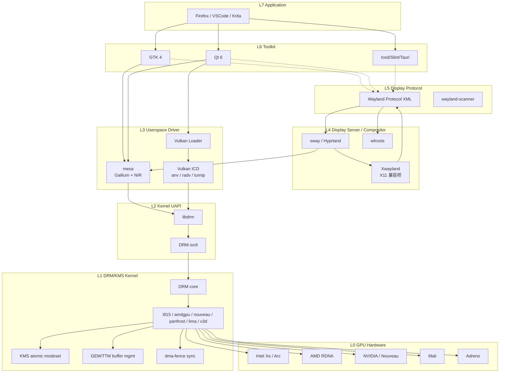
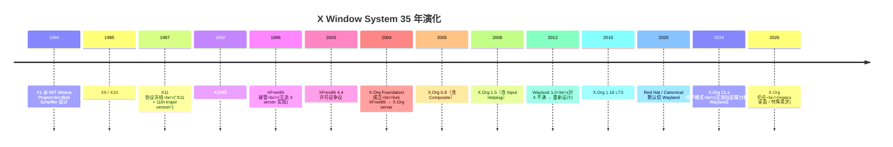
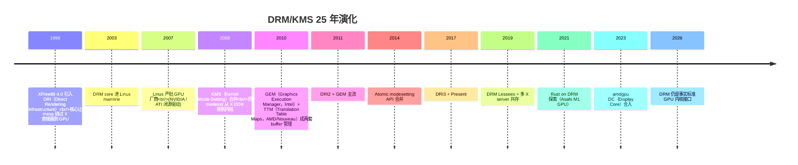

# 00-23 图形界面 / 图形栈纵向架构概览

> **本文位置：** 00 大类总览 / 设计维度（图形栈架构纵向）
>
>
> **与其他笔记的关系：**
> - **互补**：[00-22 显示窗口系统演化](00-22-display-evolution.md)（演化维度，写 X11→Wayland 历史 + DWM/Quartz 横向）；本文写"纵向架构"（结构 + 数据流 + 对接接口）
> - **互补**：[00-24 GPU + 图形 + GPGPU + CUDA/pyCUDA](00-24-gpu-graphics-evolution.md)（GPU 硬件演化）；本文写 GPU 之上的软件栈
> - **配套**：[00-13 驱动系统设计 + 兼容策略全谱](00-13-driver-system-design-and-compat.md)（驱动系统全谱）；本文是 GPU/显示驱动作为驱动系统的具体使用案例
> - **互补**：[00-29 字体渲染演化](00-29-font-rendering-evolution.md)（字体）+ [00-28 输入法演化](00-28-input-method-evolution.md)（输入法）
> - **下游**：未来 H 系列深度精读笔记（H1 X.Org server 精读 / H2 Wayland + wlroots / H3 DRM/KMS / H4 mesa / H5 嵌入式 GUI 横向 等）
>

---

## §0 总览：为什么需要这篇笔记


"兼容 x11"在工程上至少 3 种解读：
1. **协议级兼容**：实现 X11 wire protocol，跑 X 客户端（Xterm / xeyes / Firefox-X11 / VSCode-X11 等）
2. **API 级兼容**：实现 Xlib / xcb 函数库 ABI，重编 X 应用即可跑
3. **整套图形栈**：含 DRM/KMS 内核 + mesa userspace + X server + toolkit（GTK/Qt）—— 让 Linux 桌面应用直接跑


### §0.2 图形栈的 7 层纵向架构

任何现代 OS 的图形栈都可以拆为 7 层：

```
┌─────────────────────────────────────────────┐
│  L7  Application (Firefox / VSCode / etc)   │
├─────────────────────────────────────────────┤
│  L6  Toolkit (GTK / Qt / Iced / Slint / ...) │
├─────────────────────────────────────────────┤
│  L5  Display Protocol (X11 / Wayland)        │
├─────────────────────────────────────────────┤
│  L4  Display Server / Compositor             │
│      (X.Org server / sway / Hyprland / ...)  │
├─────────────────────────────────────────────┤
│  L3  Userspace Driver (mesa / Vulkan loader) │
├─────────────────────────────────────────────┤
│  L2  Kernel UAPI (libdrm / DRM ioctl)        │
├─────────────────────────────────────────────┤
│  L1  DRM/KMS Kernel Subsystem (in-kernel)    │
├─────────────────────────────────────────────┤
│  L0  GPU Hardware (Intel / AMD / Mali / ...) │
└─────────────────────────────────────────────┘
```


### §0.3 全文结构（15 节）

| 节 | 主题 | 关键词 |
|----|------|--------|
| §1 | 纵向 7 层架构（含数据流向）| 各层职责 + 数据流 + Mermaid |
| §2 | X11 完整谱 | X.Org / DIX / DDX / Xlib / xcb / 22 扩展 / wire protocol |
| §3 | Wayland 完整谱 | libwayland / wlroots / Smithay / 主流 compositor / Xwayland |
| §4 | DRM/KMS 内核子系统 | DRM master / atomic modeset / GEM / TTM / fences / 25+ driver |
| §5 | userspace driver / mesa / Vulkan | Gallium / NIR / ICD / 各 GPU backend |
| §6 | 嵌入式 / 无 GPU 路径 | fbdev / LVGL / Slint / SDL2 / Skia / Cairo |
| §7 | 远程桌面 | RDP / VNC / SPICE / xrdp / wayvnc / xpra / ssh-X / RustDesk |
| §8 | macOS / Windows 对照 | Quartz / Core Graphics / Metal / DWM / Direct3D |
| §9 | 本地项目图形栈现状 | StarryOS / arceos / asterinas / 板卡 GPU |
| §10 | 跨层级图形支持参考 | Bootloader 图形（U-Boot splash / EDK2 GOP / GRUB graphical menu / VBE）|
| §11 | 关键概念深入 | 双缓冲 / vsync / VRR / HDR / 色彩空间 |
| §13 | 词典 | 50+ 关键术语速查 |
| §14 | 练习题 | 4 题 |
| §15 | H 系列深度精读规划 | H1-H5 后续笔记 |

---

## §1 纵向 7 层架构

### §1.1 完整数据流图（典型 Linux Wayland 桌面）



### §1.2 各层职责

| 层 | 职责 | 关键 API/协议 | 工程实施 |
|----|------|--------------|---------|
| **L7 应用** | 业务逻辑 + UI | Toolkit API | C/C++/Rust/Python/JS |
| **L6 Toolkit** | 控件库 + 布局 + 主题 + 字体 | GTK / Qt / Iced / Slint | 开发者写应用时直接用 |
| **L5 协议** | client ↔ server 通信 | X11 wire / Wayland XML | 二进制协议（X11 socket / Wayland UDS）|
| **L4 Server / Compositor** | 输入路由 + 窗口管理 + 合成 | X.Org server / wlroots / mutter | 守护进程 + IPC |
| **L3 userspace driver** | 把 OpenGL/Vulkan/Vulkan API 翻译为 GPU 命令 | mesa Gallium / Vulkan loader+ICD | 用户态共享库 |
| **L2 Kernel UAPI** | 系统调用层 + DMA buffer 管理 + sync | libdrm + ioctl | C 库 |
| **L1 DRM/KMS** | 内核驱动 + 命令队列 + 抢占 + 内存 | drm/* in linux kernel | 内核模块 |
| **L0 GPU 硬件** | 实际渲染 + 显示输出 | (硬件)| 物理芯片 |

### §1.3 三种典型客户端 → 显示路径

**A. 现代 Wayland 应用（Firefox-Wayland 直接）：**
```
Firefox →(GTK4)→(Wayland)→ sway →(EGL)→ mesa →(libdrm)→ DRM →(GPU)→ 显示器
```

**B. X11 应用（Xeyes 跑在 Wayland 桌面）：**
```
Xeyes →(Xlib)→(X11 protocol)→ Xwayland →(Wayland)→ sway →(EGL)→ mesa →(libdrm)→ DRM →(GPU)→ 显示器
                                  ↑
                                  把 X 协议翻译为 Wayland 协议
```

**C. 嵌入式无 GPU（LVGL on framebuffer）：**
```
LVGL app →(LVGL API)→(framebuffer mmap)→ /dev/fb0 →(fbdev kernel driver)→(LCD controller)→ 屏幕
```


---

## §2 X11 完整谱

### §2.1 X.Org server 历史 + 架构

**历史时间线（35 年）：**



**X.Org server 架构（DIX + DDX + Extensions）：**

```
X.Org server binary (Xorg)
├── DIX (Device Independent X)        ← 协议解析 + 窗口管理 + 像素操作
│   └── 与硬件无关的核心逻辑
├── DDX (Device Dependent X)          ← 设备特定驱动
│   ├── xf86-video-intel / amdgpu / ati / nouveau / fbdev / vesa
│   ├── xf86-input-libinput / evdev / synaptics
│   └── xf86 framework
├── Extensions                         ← 22+ 扩展（XRender / Composite / DRI / RandR / ...）
└── XCB / Xtrans                      ← 网络/IPC 层
```

**当前状态（2026-05）：**
- X.Org 主版本：21.1（2022 发布，至今维护中）
- 主流 Linux distro：Wayland 默认，X.Org 退为兼容层（GNOME / KDE Plasma 桌面）
- 仍活跃用 X.Org：i3wm / Awesome / xfce / lxde 用户 + 部分商业 CAD/EDA

### §2.2 Xlib + xcb 客户端 lib

**Xlib（古老）：**
```c
#include <X11/Xlib.h>
int main() {
    Display *dpy = XOpenDisplay(NULL);
    Window root = DefaultRootWindow(dpy);
    Window win = XCreateSimpleWindow(dpy, root, 0, 0, 200, 100, 1,
                                     BlackPixel(dpy, 0), WhitePixel(dpy, 0));
    XSelectInput(dpy, win, ExposureMask | KeyPressMask);
    XMapWindow(dpy, win);
    XEvent e;
    while (1) {
        XNextEvent(dpy, &e);
        if (e.type == Expose) XDrawString(dpy, win, DefaultGC(dpy, 0), 50, 50, "Hello", 5);
        if (e.type == KeyPress) break;
    }
    XCloseDisplay(dpy);
    return 0;
}
```

**问题：** Xlib 同步阻塞 + 内部隐藏锁 + 难以多线程

**xcb（X C Binding，2001）—— 现代 X 客户端 lib：**
```c
#include <xcb/xcb.h>
int main() {
    xcb_connection_t *c = xcb_connect(NULL, NULL);
    xcb_screen_t *screen = xcb_setup_roots_iterator(xcb_get_setup(c)).data;
    xcb_window_t win = xcb_generate_id(c);
    xcb_create_window(c, XCB_COPY_FROM_PARENT, win, screen->root, 0, 0, 200, 100, 1,
                      XCB_WINDOW_CLASS_INPUT_OUTPUT, screen->root_visual, 0, NULL);
    xcb_map_window(c, win);
    xcb_flush(c);
    /* ... */
    xcb_disconnect(c);
    return 0;
}
```

**xcb 优势：** 异步 + 无内部锁 + 直接二进制协议（不像 Xlib 含大量胶水代码）

**现代分层：**
```
应用 → Xlib（旧 API）→ libX11 (1.7+ 版用 xcb 后端) → xcb 协议层 → X.Org server
应用 → xcb（新 API）→ xcb 协议层 → X.Org server  (绕过 Xlib)
```

### §2.3 DDX driver（设备特定 X driver）

**DDX = Device Dependent X** —— X.Org 的"驱动"层，每个 GPU 一个 .so：

| 驱动 | 支持 | 状态（2026-05）|
|------|------|---------------|
| `xf86-video-intel` | Intel HD Graphics | 维护模式（mesa modesetting 接管）|
| `xf86-video-amdgpu` | AMD GPU（GCN+）| 通用 modesetting（薄）|
| `xf86-video-ati` | AMD/ATI Radeon（老）| legacy |
| `xf86-video-nouveau` | NVIDIA（开源）| modesetting |
| `xf86-video-modesetting` ⭐ | 通用（任何 KMS GPU）| **主流默认**（依赖 mesa GLAMOR）|
| `xf86-video-fbdev` | 通过 framebuffer | 老硬件 |
| `xf86-video-vesa` | 通过 VESA BIOS | 应急（pre-DRM）|
| `xf86-video-vmware` | VMware SVGA | VM |
| `xf86-video-qxl` | QEMU QXL | VM |

**modesetting + GLAMOR 现代默认：**
- modesetting driver 直接调 KMS ioctl（不写 GPU 命令）
- 2D 绘制由 GLAMOR 通过 OpenGL（mesa）做
- 结果：**X.Org DDX 几乎不再需要 GPU 特定驱动** —— 所有 GPU 都走 KMS + mesa

### §2.4 X 扩展全清单（22+）

X 协议设计为可扩展 —— 客户端通过 `XQueryExtension` 查询 server 是否支持：

| 扩展 | 全称 | 用途 | 现状 |
|------|------|------|------|
| **GLX** | OpenGL X Extension | 把 OpenGL 命令通过 X 协议传 | 仍用 |
| **DRI / DRI2 / DRI3 / Present** | Direct Rendering Infrastructure | 客户端绕过 X server 直接画到 GPU | 现代默认 DRI3+Present |
| **XRender** | 现代 2D 绘图（aa 抗锯齿 / alpha 混合）| Cairo / Pango 用 | 仍用 |
| **XComposite** | 把窗口渲染到 offscreen | Compiz / Compton 等 compositor 用 | 仍用 |
| **XDamage** | 通知 server 哪部分窗口变了 | compositor 优化 | 仍用 |
| **XFixes** | 鼠标光标管理 + 区域操作 | | 仍用 |
| **XRandR** | Resize and Rotate（多显示器/旋转/缩放）| `xrandr` 命令 | 仍用 |
| **XInput / XInput2** | 高级输入设备（多触点 / pressure）| 触屏 / 数位板 | 仍用 |
| **XKB** | X Keyboard Extension（多布局）| 中日韩输入法基础 | 仍用 |
| **XSHM** | shared memory pixmap（client + server 共享内存）| 加速大图传输 | 仍用 |
| **XSync** | 客户端 ↔ server 同步原语 | | 仍用 |
| **XTest** | 模拟输入（自动化测试）| xdotool / autotools | 仍用 |
| **DPMS** | Display Power Management | 屏保 / 节能 | 仍用 |
| **MIT-SHM** | (= XSHM) | | 同上 |
| **XF86-VidMode** | gamma / 频率切换 | redshift / 颜色管理 | 仍用 |
| **XSelinux** | SELinux 标签 | 安全桌面 | 限定场景 |
| **XEvIE** | Event Interception Extension（无障碍）| 已弃 | legacy |
| **DBE** | Double Buffer Extension | 替代方案多 | legacy |
| **Generic Event Extension (GE)** | 扩展事件框架 | XInput2 用 | 仍用 |
| **XF86-Misc** | 杂项 | legacy | legacy |
| **TOG-CUP** | Color Utilization Policy | 已弃 | legacy |
| **XKEYBOARD** | (= XKB) | | 同上 |

### §2.5 X 协议 wire format

**X 协议是二进制 + 异步 + 请求/响应/事件/错误 4 类消息：**

```
Client → Server:  Request (1-byte opcode + 1-byte data + 2-byte length + payload)
Server → Client:  Reply   (异步，对应 request 序号)
Server → Client:  Event   (键盘按下 / 鼠标移动 / 窗口暴露 / etc)
Server → Client:  Error   (BadRequest / BadValue / BadWindow / etc)
```

**示例（CreateWindow 请求）：**
```
Opcode  Length   wid       parent
1       8        0x100001  0x000020
x       y        width     height
0       0        200       100
border  class    visual    value-mask
1       1        0         0
```

**核心设计原则：**
- 客户端发请求**不等响应**（异步流水线）
- 大量请求合并发出（X round-trip 是性能杀手）
- 错误异步回报

### §2.6 X 远程协议（透明网络化）

X 设计天生支持网络透明 —— 客户端和 server 可以在不同主机：

```bash
# 服务器跑 X 应用，显示在客户端电脑
ssh -X user@server
# 然后跑 xeyes / firefox / etc，画面回传到本地 X server
```

**协议：** TCP 6000+display 端口，或 UNIX socket `/tmp/.X11-unix/X<display>`

**安全：** xauth + cookies / SSH X11Forwarding 加密通道

**性能问题：** 大量小请求 + 缺少压缩 → 远程比同机慢 100 倍 → NoMachine NX / X2Go 等做 X 协议压缩

### §2.7 X 已知缺陷 + 为什么 Wayland 替代

**X11 6 大缺陷：**

| 缺陷 | 后果 |
|------|------|
| 1. **核心渲染过时**（XPolyLine / XDrawText 等）| 现代应用全用 client-side rendering（Cairo / Skia），X 核心渲染冗余 |
| 2. **server 信任所有 client** | 任何 X 应用可截屏 / 录键 / 模拟输入（xdotool） → 安全弱 |
| 3. **input/redraw 路径长**（client → server → compositor → KMS）| 高延迟 + tearing |
| 4. **vsync 困难** | 在 X 协议里说"等帧同步"语义模糊 |
| 5. **多显示器 HiDPI 不支持** | XRandR 仅整数 DPI / 不支持每显示器独立缩放 |
| 6. **触屏 / 多手势 后加** | XInput2 是 hack 加上的，不原生 |

**Wayland 的回答（2008 起设计）：**
- 没有"server"概念，只有 "compositor"（合成器即 server）
- compositor = window manager = display server 三合一
- client 自己渲染（client-side rendering 强制）
- 协议精简 + 严格 vsync + HiDPI 原生 + 触屏原生 + 安全沙箱

**但 X 不会消失：**
- 大量 legacy X 应用 → Xwayland 兼容
- 远程桌面 X11 forwarding 仍主流（Wayland 远程未成熟）
- 部分 CAD/EDA 商业软件只支持 X
- 网络透明在 X 是一等公民，Wayland 后补

---

## §3 Wayland 完整谱

### §3.1 Wayland 协议设计（XML + scanner）

**Wayland 协议用 XML 定义** —— 不像 X11 用文档（natural language）：

```xml
<!-- protocol/wayland.xml 节选 -->
<interface name="wl_surface" version="6">
    <description summary="an onscreen surface"/>
    <request name="destroy" type="destructor"/>
    <request name="attach">
        <arg name="buffer" type="object" interface="wl_buffer" allow-null="true"/>
        <arg name="x" type="int"/>
        <arg name="y" type="int"/>
    </request>
    <request name="damage">
        <arg name="x" type="int"/>
        <arg name="y" type="int"/>
        <arg name="width" type="int"/>
        <arg name="height" type="int"/>
    </request>
    <request name="commit"/>
    <event name="enter">
        <arg name="output" type="object" interface="wl_output"/>
    </event>
    <event name="leave">
        <arg name="output" type="object" interface="wl_output"/>
    </event>
</interface>
```

**wayland-scanner 工具** 把 XML 编译成 C 头文件 + 桩函数：
```bash
wayland-scanner client-header wayland.xml > wayland-client-protocol.h
wayland-scanner public-code   wayland.xml > wayland-protocol.c
```

**好处：**
- 协议机器可读 → 自动生成绑定（Rust / Python / Go / Zig 都有 wayland scanner）
- 版本演化清晰（每个 interface 有 version 字段）
- 可扩展（厂商扩展用独立 XML：`zwlr_*` Wlroots 系 / `kde_*` KDE 系 / `ext_*` 跨厂商）

### §3.2 libwayland 客户端 / 服务端 lib

**libwayland 提供：**
- `libwayland-client.so`：客户端连接 / 序列化 / 反序列化
- `libwayland-server.so`：compositor 接受连接 / 派发请求
- `libwayland-cursor.so`：标准光标加载

**典型客户端：**
```c
struct wl_display *display = wl_display_connect(NULL);
struct wl_registry *registry = wl_display_get_registry(display);
wl_registry_add_listener(registry, &registry_listener, NULL);
wl_display_dispatch(display);
/* 通过 registry 找到 compositor / shm / seat / output 等全局对象 */
struct wl_compositor *compositor = ...;
struct wl_surface *surface = wl_compositor_create_surface(compositor);
/* 创建 buffer + attach + commit */
wl_surface_attach(surface, buffer, 0, 0);
wl_surface_damage(surface, 0, 0, w, h);
wl_surface_commit(surface);
```

**通信通道：** UNIX domain socket `$XDG_RUNTIME_DIR/wayland-0`，**不支持网络透明**（设计取舍）

### §3.3 wlroots / Smithay / mutter compositor lib

**3 大 compositor 框架：**

| 框架 | 语言 | 主要使用 | 特征 |
|------|------|---------|------|
| **wlroots** | C | sway / Hyprland / Wayfire / dwl / labwc / Cosmic（部分）| 轻量 + 模块化 + tiling-friendly |
| **Smithay** | Rust | COSMIC / niri / Anvil（demo）| Rust 生态 + 类型安全 |
| **mutter** | C（GNOME 内）| GNOME Shell | 复杂但功能全 |
| **kwin** | C++（KDE 内）| KDE Plasma | 复杂 + Qt 风 |
| **mir** | C++（Canonical）| Ubuntu touch / 嵌入式 | Canonical 主推 |

**wlroots 架构：**
```
wlroots
├── backend/          ← drm / fbdev / x11（嵌套）/ wayland（嵌套）/ headless
├── render/           ← gles2 / vulkan / pixman 软件渲染
├── types/            ← 协议对象类型（wlr_compositor / wlr_seat / wlr_output / ...）
├── desktop/          ← 高层桌面概念（toplevel / popup / decoration）
├── interfaces/       ← Wayland 协议绑定
└── util/
```

### §3.4 主流 compositor

| Compositor | 框架 | 类型 | 主要特征 |
|-----------|------|------|---------|
| **Weston** | 自实现 | 参考实现 | Wayland 项目官方 |
| **GNOME Shell / mutter** | mutter | 桌面 | GNOME 默认 |
| **KDE Plasma / kwin** | kwin | 桌面 | KDE 默认 |
| **sway** | wlroots | tiling WM | i3wm 替代 |
| **Hyprland** | wlroots | tiling + 动画 | 美化 / 流行新晋 |
| **Wayfire** | wlroots | 桌面 | 3D 特效 / Compiz 风 |
| **dwl** | wlroots | tiling 极简 | dwm（X）的 Wayland 版 |
| **labwc** | wlroots | stacking | Openbox 风 |
| **river** | 自实现 | tiling | Zig 写 / 函数式风 |
| **niri** | Smithay | scrolling tiling | Rust 写 / PaperWM 风 |
| **COSMIC** | Smithay | 桌面 | Pop!_OS 自研 |
| **mir-shell** | mir | 嵌入式 / 桌面 | Canonical |
| **Cage** | wlroots | 单应用 kiosk | digital signage |
| **Cosmic-comp** | Smithay | 桌面 | System76 |

### §3.5 Xwayland 桥接（X11 client on Wayland）

**Xwayland = X.Org server + 输出到 Wayland surface 的 patch**：

```
Xeyes (X11 client) →(X protocol)→ Xwayland (X server)
                                    ↓ 把 X 渲染窗口 → Wayland surface
                                  Wayland compositor (sway)
                                    ↓
                                  显示
```

**关键设计：**
- Xwayland 是 X.Org server 的特殊配置（启动参数 `-wayland-rootful`）
- 每个 X11 窗口对应一个 Wayland surface
- 输入由 compositor 派发到 Xwayland，再派发到 X client
- DRM 加速：X client 通过 DRI3 + Present 直接画到 dma-buf，Xwayland 把 dma-buf 给 Wayland compositor

**结果：** Linux 上所有 X 应用在 Wayland 桌面"无感运行"

### §3.6 Wayland 协议扩展全清单

**Core 协议：**
- `wl_compositor` / `wl_surface` / `wl_buffer` / `wl_shm` / `wl_seat` / `wl_pointer` / `wl_keyboard` / `wl_output` / `wl_registry`

**Stable 扩展（wayland-protocols 仓库）：**
- `xdg-shell` —— 应用窗口管理（替代 wl_shell）
- `xdg-decoration` —— server-side decoration 协商
- `xdg-output` —— 输出几何
- `linux-dmabuf` —— GPU buffer 共享
- `presentation-time` —— 严格 vsync
- `viewporter` —— 缩放
- `tablet` —— 数位板
- `pointer-constraints` —— 鼠标约束（FPS 游戏）
- `relative-pointer` —— 相对位移
- `xdg-foreign` —— 跨进程 surface 引用
- `idle-inhibit` —— 阻止屏保
- `single-pixel-buffer` —— 一像素 buffer

**Staging 扩展（即将稳定）：**
- `ext-screencopy` —— 屏幕录制
- `ext-data-control` —— 剪贴板编程访问
- `cursor-shape` —— 标准光标
- `tearing-control` —— 主动 tearing（游戏）
- `security-context` —— 沙箱
- `fractional-scale` —— 分数缩放（HiDPI 1.5x）
- `xwayland-shell` —— Xwayland surface

**wlroots 系（zwlr_*）：**
- `wlr-output-management` —— 输出配置（kanshi / shikane）
- `wlr-screencopy` —— 截屏
- `wlr-virtual-keyboard` —— 虚拟键盘
- `wlr-virtual-pointer` —— 虚拟鼠标
- `wlr-foreign-toplevel-management` —— taskbar / dock
- `wlr-data-control` —— 剪贴板（已并入 ext-）
- `wlr-input-inhibit` —— 屏锁

**KDE 系（kde_*）/ GNOME 系（org.gnome_*）：**
- 各自厂商私有

---

## §4 DRM/KMS 内核子系统

### §4.1 DRM 历史



### §4.2 DRM master / lessee

**DRM master：** 一个 KMS 设备同时只有一个进程是 master，可以做 modeset。

```c
// 老式：X.Org server / Wayland compositor 启动时 drmSetMaster
int fd = open("/dev/dri/card0", O_RDWR);
drmSetMaster(fd);  // 接管 modeset 权
/* ... 做 modeset ... */
drmDropMaster(fd);
```

**Lessees（Linux 4.15+）：** master 可以"租"部分输出给另一个进程：
```c
drmModeCreateLease(fd, num_objects, object_ids, 0, &lessee_fd);
// lessee_fd 现在能 modeset 它租到的 connector / crtc
```

**用途：** 一个 X server 跑桌面 + VR headset 单独跑 VRdriver，两者共存。

### §4.3 atomic modeset

**老式（已废弃）：**
```c
drmModeSetCrtc(fd, crtc, fb, 0, 0, &connector, 1, &mode);  // 一行设置整个 pipeline
```

问题：失败回滚困难 + 多输出原子性差 + 不能 vblank 边界

**Atomic modeset（2014+）：**
```c
drmModeAtomicReq *req = drmModeAtomicAlloc();
drmModeAtomicAddProperty(req, plane_id, "FB_ID", new_fb);
drmModeAtomicAddProperty(req, plane_id, "CRTC_ID", crtc_id);
drmModeAtomicAddProperty(req, plane_id, "SRC_X", 0);
drmModeAtomicAddProperty(req, plane_id, "SRC_Y", 0);
drmModeAtomicAddProperty(req, plane_id, "SRC_W", w << 16);
drmModeAtomicAddProperty(req, plane_id, "SRC_H", h << 16);
drmModeAtomicAddProperty(req, plane_id, "CRTC_X", 0);
/* ... 更多属性 ... */
int ret = drmModeAtomicCommit(fd, req, DRM_MODE_ATOMIC_NONBLOCK | DRM_MODE_PAGE_FLIP_EVENT, NULL);
drmModeAtomicFree(req);
```

**优势：**
- 全有/全无（atomic）
- 多输出原子（4 显示器同时切分辨率）
- vblank 同步（DRM_MODE_PAGE_FLIP_EVENT）
- TEST_ONLY 模式预检（不实际改）

**3 大对象：**
```
CRTC（CRT Controller）   ← 控制扫描时序 + 输出到一个 connector
└── PLANE（图层）         ← primary / cursor / overlay 多 plane 合成
└── CONNECTOR             ← HDMI / DP / eDP / DSI / DVI / LVDS
```

### §4.4 GEM / TTM buffer

**GEM（Graphics Execution Manager，Intel 2008）：**
- 简单 buffer 对象 + handle
- shared between user space and kernel
- 通过 `drmIoctl(DRM_IOCTL_GEM_OPEN/CREATE/CLOSE)` 操作
- mmap 直接访问

**TTM（Translation Table Maps，AMD 2007）：**
- 复杂 buffer 管理 + 跨设备迁移（VRAM ↔ GTT ↔ system RAM）
- 适合独立显卡
- amdgpu / nouveau / radeon 用

**dma-buf（跨子系统）：**
- 把 GEM/TTM buffer 导出为通用 fd → 跨进程 / 跨设备共享
- 用例：摄像头 → V4L2 buffer → dma-buf fd → GPU 直接渲染

### §4.5 fences / sync

**问题：** GPU 命令异步执行 → CPU 知道何时显示？何时下一帧？

**dma-fence（Linux 内核同步原语）：**
```c
struct dma_fence {
    spinlock_t *lock;
    u64 context;       // fence context（同一 GPU queue 一个 context）
    u64 seqno;         // 序列号（context 内单调递增）
    const struct dma_fence_ops *ops;
    /* ... */
};
```

**用法：**
- 提交 GPU 命令时 attach fence → fence signal 时表示 GPU 完成
- 用户态用 `drmSyncObj` / `EGL_KHR_fence_sync` 等待

**explicit sync（现代）：**
- Vulkan 用 `VkSemaphore` / `VkFence` 显式
- Wayland 协议正在加 explicit sync（`wp_linux_drm_syncobj`）

### §4.6 主要 DRM ioctl

```
DRM_IOCTL_VERSION             — 查 driver 信息
DRM_IOCTL_GET_CAP             — 查能力位
DRM_IOCTL_SET_MASTER          — 接管 modeset 权
DRM_IOCTL_DROP_MASTER         — 释放
DRM_IOCTL_MODE_GETRESOURCES   — 查 connector/crtc/plane 资源
DRM_IOCTL_MODE_GETCONNECTOR   — 查特定 connector 的 modes
DRM_IOCTL_MODE_GETENCODER     — 查 encoder 信息
DRM_IOCTL_MODE_CREATE_DUMB    — 创建简单 buffer
DRM_IOCTL_MODE_MAP_DUMB       — mmap simple buffer
DRM_IOCTL_MODE_DESTROY_DUMB   — 销毁 buffer
DRM_IOCTL_MODE_ADDFB / ADDFB2 — 把 buffer 注册为 framebuffer
DRM_IOCTL_MODE_PAGE_FLIP      — vblank 边界翻页
DRM_IOCTL_MODE_ATOMIC         — atomic modeset commit
DRM_IOCTL_GEM_OPEN/CLOSE      — GEM 对象操作
DRM_IOCTL_PRIME_HANDLE_TO_FD  — GEM → dma-buf fd
DRM_IOCTL_PRIME_FD_TO_HANDLE  — dma-buf fd → GEM
DRM_IOCTL_SYNCOBJ_*           — 同步对象操作
```

### §4.7 GPU command submission

**典型流程：**
```
userspace mesa
  ↓ 构造 GPU 命令缓冲区（IB - Indirect Buffer）
  ↓ ioctl DRM_IOCTL_<DRIVER>_GEM_USERPTR or 类似
  ↓ 把 IB 注册为 GEM buffer
  ↓ ioctl DRM_IOCTL_<DRIVER>_CS（Command Submission）
kernel GPU driver
  ↓ 验证命令（防止内核漏洞）
  ↓ 把 IB 写到 GPU 的环形缓冲（ring buffer）
GPU
  ↓ 执行命令（着色器 / 渲染管线 / etc）
  ↓ DMA 写完成位
kernel
  ↓ IRQ 处理 / fence signal
userspace
  ↓ 等 fence / 提交下一帧
```

### §4.8 DRM driver 列表（25+）

| Driver | 支持硬件 | 维护者 | 状态 |
|--------|---------|-------|------|
| **i915** | Intel HD / Iris / Xe（老）| Intel | 主线 |
| **xe** | Intel Xe（新独立显卡 Arc）| Intel | 主线（取代 i915 部分）|
| **amdgpu** | AMD GCN+（HD7000+）| AMD | 主线 |
| **radeon** | AMD pre-GCN（HD2000-HD6000）| AMD | legacy 维护 |
| **nouveau** | NVIDIA（开源逆向）| 社区 | 主线，性能弱 |
| **nvidia** | NVIDIA（闭源）| NVIDIA | out-of-tree（Linux 内核 6.8+ 部分开源）|
| **panfrost** | ARM Mali（Bifrost / Valhall）| 社区 | 主线 |
| **panthor** | ARM Mali（CSF 命令流前端）| 社区 | 主线 |
| **lima** | ARM Mali Utgard（老）| 社区 | 主线 |
| **v3d** | Broadcom VideoCore V/VI（树莓派 4/5）| 社区 | 主线 |
| **vc4** | Broadcom VideoCore IV（树莓派 1-3）| 社区 | 主线 |
| **etnaviv** | Vivante GC（ARM SoC 常见）| 社区 | 主线 |
| **msm** | Qualcomm Adreno | Qualcomm + 社区 | 主线 |
| **freedreno** | (= msm 用户态)| 社区 | mesa |
| **rockchip** | Rockchip 显示控制器 | 社区 | 主线 |
| **mediatek** | MediaTek 显示控制器 | MediaTek | 主线 |
| **sun4i-drm** | Allwinner 显示控制器 | 社区 | 主线 |
| **imx** | NXP i.MX 显示控制器 | NXP + 社区 | 主线 |
| **tegra** | NVIDIA Tegra（嵌入式）| NVIDIA | 主线 |
| **vmwgfx** | VMware SVGA | VMware | 主线 |
| **qxl** | QEMU QXL（VM）| Red Hat | 主线 |
| **virtio_gpu** | virtio GPU（VM 通用）| Red Hat | 主线 |
| **udl** | DisplayLink USB 显示 | 社区 | 主线 |
| **vkms** | Virtual KMS（无硬件 testing）| 社区 | 主线 |
| **simpledrm** | UEFI GOP / 简单 framebuffer | 社区 | 主线 |
| **bochs** | QEMU bochs | Red Hat | 主线 |
| **cirrus** | QEMU cirrus（极简）| Red Hat | 主线 |
| **ofdrm** | OpenFirmware 显示 | 社区 | 主线 |
| **asahi**（待主线）| Apple M1/M2/M3 GPU | Asahi Linux 团队 | drm-misc 准备进 |

### §4.9 PRIME（多 GPU 协同）

**问题：** 笔记本同时有 Intel iGPU + NVIDIA dGPU，应用如何选？

**PRIME（DRM 多 GPU 框架）：**
- 一个进程可同时打开多个 `/dev/dri/cardN`
- 用 dma-buf 在 GPU 间传 buffer
- iGPU 渲染轻量任务 / dGPU 渲染游戏
- offload mode：`DRI_PRIME=1 glxgears` 让特定应用用 dGPU

---

## §5 userspace driver / mesa / Vulkan

### §5.1 mesa 历史 + 架构

**Mesa 时间线：**
```
1993 : Brian Paul 起手 — 软件 OpenGL 实现
1996 : OpenGL 1.1 完整软件实现
2008 : Gallium3D 引入（中间表示重构）
2012 : LLVMpipe（基于 LLVM 的高性能软件 OpenGL）
2016 : Vulkan loader + 第一个 Vulkan driver（anv = Intel）
2018 : ACO 着色器编译器（AMD，绕过 LLVM）
2020 : Zink（OpenGL on Vulkan）
2024 : Mesa 24.x（OpenGL 4.6 / Vulkan 1.3 / OpenCL 3.0 完整）
2026 : Mesa 25.x（VKD3D-Proton / DXVK 跨栈合作 / 分布式渲染）
```

**mesa 架构：**
```
应用 (OpenGL / Vulkan / OpenCL / OpenMAX / VAAPI)
   ↓
mesa frontend
   ├── OpenGL state tracker (mesa main)
   ├── Vulkan loader (libvulkan.so)
   ├── EGL（OpenGL on X / Wayland / GBM）
   └── GLX（OpenGL on X11）
   ↓
Gallium3D（OpenGL 中间表示）
   ↓
NIR（着色器中间表示，OpenGL + Vulkan 共用）
   ↓
backend driver
   ├── radeonsi（AMD GCN+，OpenGL）
   ├── radv（AMD GCN+，Vulkan）
   ├── iris（Intel Gen8+，OpenGL）
   ├── anv（Intel，Vulkan）
   ├── nouveau（NVIDIA，OpenGL）
   ├── nvk（NVIDIA，Vulkan）
   ├── turnip（Adreno，Vulkan）
   ├── freedreno（Adreno，OpenGL）
   ├── panfrost（Mali，OpenGL）
   ├── panvk（Mali，Vulkan）
   ├── lima（Mali Utgard，OpenGL）
   ├── v3d / v3dv（Broadcom，OpenGL/Vulkan）
   ├── softpipe / llvmpipe（CPU 软件）
   ├── lavapipe（Vulkan 软件）
   ├── zink（OpenGL on Vulkan，跑在任何 Vulkan driver 上）
   └── d3d12 / venus（虚拟化 / DirectX）
   ↓
libdrm / DRM ioctl
```

### §5.2 Gallium 中间表示

Gallium3D 是 mesa 内部的 OpenGL → 硬件命令的"中间表示"：
- 标准化 driver interface（pipe_context）
- 抽象顶点 / 片元 / 几何 shader
- 简化新 driver 实现

**pipe_context 关键 callback：**
```c
struct pipe_context {
    void (*draw_vbo)(struct pipe_context *, const struct pipe_draw_info *, ...);
    void (*clear)(struct pipe_context *, unsigned buffers, ...);
    void (*flush)(struct pipe_context *, struct pipe_fence_handle **fence);
    void (*set_vertex_buffers)(struct pipe_context *, unsigned start_slot, ...);
    void (*set_index_buffer)(struct pipe_context *, const struct pipe_index_buffer *);
    /* ... 100+ callbacks ... */
};
```

### §5.3 NIR 着色器中间表示

**NIR（New Intermediate Representation）** 是 mesa 内部 shader 中间表示，OpenGL / Vulkan / OpenCL 都可以下降到 NIR：

```
GLSL（OpenGL Shader Language）→ NIR
HLSL（DirectX Shader Language）→ DXIL → NIR (via SPIR-V)
SPIR-V（Vulkan Shader Format）→ NIR
OpenCL C → NIR (via clspv)
   ↓
NIR optimization passes（dead code / 常量折叠 / loop unroll / register allocation）
   ↓
backend specific lowering
   ↓
hardware ISA（AMD GCN3 / Intel Xe-HPG / Mali Bifrost / etc）
```

### §5.4 backend driver 横向

| Backend | OpenGL | Vulkan | OpenCL | 编码 | 解码 |
|---------|--------|--------|--------|------|------|
| **radeonsi** | ✅（AMD GCN+）| - | ✅ | ✅（VAAPI / VDPAU）| ✅ |
| **radv** | - | ✅（AMD GCN+）| - | - | - |
| **iris** | ✅（Intel Gen8+）| - | ✅ | ✅ | ✅ |
| **anv** | - | ✅（Intel Gen8+）| - | - | - |
| **nouveau** | ✅（NVIDIA 开源）| - | - | - | ✅ |
| **nvk** | - | ✅（NVIDIA 开源）| - | - | - |
| **turnip** | - | ✅（Adreno）| - | - | - |
| **freedreno** | ✅（Adreno）| - | - | - | - |
| **panfrost** | ✅（Mali Bifrost+）| - | - | - | - |
| **panvk** | - | ✅（Mali Bifrost+）| - | - | - |
| **v3d** | ✅（VC5/6）| - | - | - | - |
| **v3dv** | - | ✅（VC5/6）| - | - | - |
| **llvmpipe** | ✅（CPU JIT）| - | - | - | - |
| **lavapipe** | - | ✅（CPU JIT）| - | - | - |
| **zink** | ✅（on Vulkan）| - | - | - | - |
| **venus** | - | ✅（virtio-gpu）| - | - | - |

### §5.5 Vulkan loader + ICD

**Vulkan 设计原则：** 应用只 link `libvulkan.so` （loader），实际驱动（ICD = Installable Client Driver）由 loader 加载。

**ICD 发现机制：**
```
$VK_ICD_FILENAMES   ← env 变量
/etc/vulkan/icd.d/  ← 系统配置
~/.config/vulkan/icd.d/

icd.d/intel_icd.x86_64.json：
{
    "file_format_version": "1.0.0",
    "ICD": {
        "library_path": "libvulkan_intel.so",
        "api_version": "1.3.0"
    }
}
```

**多 ICD 共存：** Intel iGPU + NVIDIA dGPU 同时存在，loader 自动枚举两者，应用通过 `vkEnumeratePhysicalDevices` 选。

### §5.6 Vulkan 主流 driver

| ICD | GPU | mesa? | 状态 |
|-----|-----|-------|------|
| anv | Intel | mesa | 主线 |
| radv | AMD | mesa | 主线 |
| nvk | NVIDIA 开源 | mesa | 2024 主线 |
| nvidia（闭源）| NVIDIA | 否 | NVIDIA 自己分发 |
| turnip | Qualcomm Adreno | mesa | 主线 |
| panvk | ARM Mali Bifrost+ | mesa | 实验 |
| v3dv | Broadcom VC5/6 | mesa | 主线 |
| lavapipe | CPU 软件 | mesa | 主线 |
| MoltenVK | Apple Metal 桥接 | 否 | macOS |
| dxvk | DirectX 9/10/11 → Vulkan | 否 | Wine / Proton |
| vkd3d-proton | DirectX 12 → Vulkan | 否 | Wine / Proton |

### §5.7 OpenGL ES 在 mesa

OpenGL ES（嵌入式简化版 OpenGL）也由 mesa 实现，与 desktop OpenGL 共享 backend。Android 主推 GLES + Vulkan。

---

## §6 嵌入式 / 无 GPU 路径

### §6.1 framebuffer / fbdev 直驱

**fbdev 模型（最简）：**
```c
int fb = open("/dev/fb0", O_RDWR);
struct fb_var_screeninfo vinfo;
ioctl(fb, FBIOGET_VSCREENINFO, &vinfo);
size_t size = vinfo.xres * vinfo.yres * vinfo.bits_per_pixel / 8;
uint8_t *fbmem = mmap(NULL, size, PROT_READ | PROT_WRITE, MAP_SHARED, fb, 0);
/* 直接写 fbmem 像素 */
fbmem[0] = 0xff;  // 第一个像素
```

**当前状态：**
- Linux fbdev API 仍存（`/dev/fb0`），但 driver 多数已切到 DRM/KMS（DRM_FBDEV_EMULATION）
- 嵌入式 / 单板 SoC 仍常见 fbdev 直驱

### §6.2 LVGL（C 嵌入式 GUI）

**LVGL（Light and Versatile Graphics Library）：**
- C 实现，~50KB ROM / ~10KB RAM
- 无 OS 依赖（裸机 / FreeRTOS / Linux fbdev / Windows / macOS）
- 控件丰富（按钮 / label / 列表 / 滚动条 / 图表 / 动画）
- 已被 NXP / STM32 / ESP32 等 MCU 大量用

**典型用法：**
```c
lv_init();
lv_disp_drv_t disp_drv;
lv_disp_drv_init(&disp_drv);
disp_drv.flush_cb = my_disp_flush;  // 把 buffer 写到屏幕
disp_drv.draw_buf = &buf;
disp_drv.hor_res = 320;
disp_drv.ver_res = 240;
lv_disp_drv_register(&disp_drv);

lv_obj_t *btn = lv_btn_create(lv_scr_act());
lv_obj_add_event_cb(btn, btn_event_cb, LV_EVENT_CLICKED, NULL);

while (1) {
    lv_timer_handler();  // 主循环驱动
    delay_ms(5);
}
```


### §6.3 Slint（Rust 嵌入式 GUI）

**Slint** —— Rust 写的现代嵌入式 GUI：
- Rust API + DSL（描述 UI）
- 后端：Skia / OpenGL / 软件渲染 / fbdev
- 跨平台：Linux / Windows / macOS / Android / iOS / 嵌入式 MCU
- 商业模式：开源 GPL + 商业许可证

**DSL 例：**
```slint
import { Button, VerticalBox } from "std-widgets.slint";

export component HelloWindow inherits Window {
    VerticalBox {
        Text { text: "Hello, World!"; }
        Button {
            text: "Click";
            clicked => { self.text = "Clicked"; }
        }
    }
}
```

### §6.4 SDL2 / SDL3（跨平台游戏）

**SDL（Simple DirectMedia Layer）：**
- C API
- 提供：窗口 / 输入 / 音频 / 渲染（OpenGL / Vulkan / Metal / D3D / 软件）/ 网络
- 跨平台：Linux / Windows / macOS / iOS / Android / WebAssembly / 主机
- 大量游戏用（Valve / 独立游戏）

**典型：**
```c
SDL_Init(SDL_INIT_VIDEO);
SDL_Window *win = SDL_CreateWindow("Hello", 100, 100, 640, 480, 0);
SDL_Renderer *r = SDL_CreateRenderer(win, -1, SDL_RENDERER_ACCELERATED);
SDL_RenderClear(r);
/* ... draw stuff ... */
SDL_RenderPresent(r);
```

### §6.5 Iced / Tauri / Egui（Rust 桌面）

| 框架 | 特征 |
|------|------|
| **Iced** | Elm 风（消息驱动）/ wgpu 后端 / 跨平台 |
| **Tauri** | Rust + Web 前端（HTML/CSS/JS）/ 系统 webview / 跨平台桌面应用 |
| **Egui** | immediate mode（每帧重绘）/ 简单游戏调试 GUI / wgpu/glow 后端 |
| **Druid** | data-driven（已弃维护）|
| **floem** | Vue 风响应式 / 早期 |
| **gpui** | Zed editor 自研 / GPU 加速 immediate mode |
| **Xilem** | data-driven 新派 / 接 Druid 衣钵 |
| **Yew** | Rust → Wasm web GUI（不是桌面）|

### §6.6 DirectFB（已弃但思路保留）

**DirectFB（2002-2018）：**
- 无 X server 直接到 framebuffer
- 提供加速 + alpha blending + 多窗口（在 fbdev 之上自己实现）
- 现已基本死亡（被 Wayland + DRM/KMS 替代）
- **历史作用：** 证明"无 X server 也能做现代图形栈"思路 → 启发 Wayland

### §6.7 Skia / Cairo 渲染库

**Skia：** Google 跨平台 2D 渲染（Chrome / Android / Flutter 用）
- C++ API
- 后端：CPU / GPU（OpenGL / Vulkan / Metal）

**Cairo：** GNOME 系统的 2D 渲染（GTK 用）
- C API
- 后端：CPU / OpenGL / X11 XRender / Win32 GDI / Quartz
- 矢量图形（PostScript 风模型）

**现状：** Skia 在 Web / 移动 占主导；Cairo 在 GTK 桌面用

---

## §7 远程桌面

### §7.1 RDP（Remote Desktop Protocol，Microsoft）

**RDP：** Microsoft 1996 开始的远程桌面协议
- TCP 3389
- 协议：server 推像素 + 客户端发输入
- 现代 RDP 含图形加速（H.264 / NVENC GPU 编码）
- 客户端：xfreerdp（Linux）/ mstsc（Windows）/ rdesktop（老）

### §7.2 VNC（Virtual Network Computing）

**VNC：** 1998 起 AT&T 实验室开源
- TCP 5900+display
- 协议：framebuffer 推像素（RFB - Remote Framebuffer）+ 客户端发输入
- 简单但带宽消耗大
- 客户端：tigervnc / realvnc / tightvnc / remmina
- server：x11vnc / wayvnc / TigerVNC server

### §7.3 SPICE

**SPICE（Simple Protocol for Independent Computing Environments）：**
- Red Hat 开发，QEMU/KVM 集成
- 比 VNC 更高级（多通道：display / cursor / inputs / audio / USB redirection）
- 客户端：virt-viewer / remote-viewer

### §7.4 主流远程桌面客户端 / server

| 工具 | 协议 | server | 客户端 |
|------|------|--------|--------|
| **xrdp** | RDP | 把 RDP 转 X / Wayland | mstsc / xfreerdp |
| **wayvnc** | VNC | wlroots Wayland → VNC | TigerVNC / Remmina |
| **xpra** | xpra（X 改进 + 压缩）| X.Org server | xpra client |
| **NoMachine NX** | NX | X 协议压缩 | nxclient |
| **X2Go** | NX 派生 | X.Org server | x2goclient |
| **ssh -X** | SSH X11 forwarding | 任何 X server | 任何 SSH 客户端 |
| **RustDesk** | 自有 | Rust 重写 TeamViewer | 跨平台 |
| **Apache Guacamole** | RDP/VNC/SSH on HTTPS | Java | 浏览器 |
| **Chrome Remote Desktop** | WebRTC | Chrome 扩展 | 任何浏览器 |

---

## §8 macOS / Windows 对照

### §8.1 macOS Quartz / Core Graphics / Metal

**macOS 图形栈：**
```
应用
├── AppKit (Objective-C / Swift) / SwiftUI
├── UIKit (iOS) / Catalyst (iPad apps on macOS)
   ↓
Core Animation（合成 + 动画）
   ↓
Quartz Compositor（窗口合成器，类似 Wayland compositor）
   ↓
Core Graphics（2D 矢量绘图）/ Core Image / Metal（GPU API）
   ↓
Metal driver（per GPU）
   ↓
GPU Hardware（Apple Silicon GPU / AMD Radeon Pro / etc）
```

**关键差异：**
- 没有 X 风 client/server 分离 —— 应用直接渲染到 Core Animation 层
- Quartz 1.x 软件合成 → 2.x GPU 合成（Mac OS X 10.5+）
- Metal（2014）替代 OpenGL（macOS 10.14 弃用 OpenGL）
- 文件级集成：app bundle / Info.plist / Mach-O

### §8.2 Windows DWM / DirectComposition / Direct3D

**Windows 图形栈：**
```
应用
├── Win32 GDI（老）/ GDI+（C++）
├── WPF / WinForms / UWP / WinUI 3 / .NET MAUI
├── WPF DirectX（GPU 加速）
   ↓
DWM（Desktop Window Manager，Vista+，强制开启）
   ↓
DirectComposition（Win 8+，原生 GPU 合成）
   ↓
DXGI（DirectX Graphics Infrastructure）
   ↓
Direct3D 11/12 / D2D / DirectWrite / DXVA（视频解码）
   ↓
WDDM driver（Windows Display Driver Model）
   ↓
GPU Hardware
```

**关键差异：**
- WDDM 是稳定 ABI（GPU 驱动跨 Windows 版本兼容）
- Direct3D 12 + DXR（光线追踪）领先 Vulkan
- DirectStorage（直接 NVMe → GPU bypass CPU）

---

## §9 本地项目图形栈现状对照

### §9.1 StarryOS

**位置：** `core/StarryOS/`

**现状（2026-05）：**
- 基于 arceos monolithic 人格
- 复用 arceos display feature（如启用）
- 主要做 Linux syscall 兼容，**图形栈基本无**
- 跑命令行 Linux 二进制 (busybox / coreutils) 为主


### §9.2 arceos display feature

**位置：** `core/arceos/modules/axdisplay/`

**核心：**
- trait `DisplayDriverOps`（基于 axdriver）
- 后端：framebuffer / virtio-gpu
- 与 axdriver crate 同 cargo features 体系

**功能限：** 仅基础 framebuffer 输出，无窗口系统 / 无 Wayland 协议 / 无 X11

### §9.3 asterinas / Theseus

**asterinas：**
- framekernel 驱动模型
- 当前焦点是核心 OS 功能（mm / sched / fs）
- 图形栈未深入

**Theseus：**
- intralingual cell 思想
- 学术研究为主，无 Linux 桌面生态对接

### §9.4 板卡视角

**rk3588（Rockchip）：**
- Mali GPU（G610 MP4）
- mainline Linux 用 panfrost / panvk
- vendor BSP 用 Rockchip 自己的 RKNN（NPU）+ 部分 Mali blob

**sg2002（SophGo CV180x）：**
- Cortex-A53 + RISC-V C906
- **无 GPU**（仅 2D 显示控制器 + VPU 视频）
- 适合 fbdev / LVGL 嵌入式路径

**Allwinner D1（早期 RISC-V SBC）：**
- 有 PowerVR GPU（无开源驱动）
- mainline 仅 fbdev 支持

**VisionFive 2：**
- IMG BXE-4-32 GPU
- mainline 部分支持（through pvr-gpu DRM driver 出 tree）

---

## §10 跨层级图形支持参考


### §10.1 BIOS 时代 VGA + VESA / VBE

**老 BIOS：**
- 16-bit Real Mode
- INT 10h 视频中断（画字符 / 简单图形）
- VGA 分辨率最高 640×480 256 色
- VESA（Video Electronics Standards Association）扩展 BIOS（VBE）支持高分辨率

**VBE 接口：**
```
INT 10h, AX=4F00h —— Get VBE Info
INT 10h, AX=4F01h —— Get Mode Info
INT 10h, AX=4F02h —— Set Mode（含分辨率/颜色深度）
INT 10h, AX=4F08h —— Get/Set DAC Palette Format
```

**用途：** Linux kernel `vga=ask` 引导参数 + Plymouth boot splash + GRUB 老版本菜单

### §10.2 现代 EDK2 EFI_GRAPHICS_OUTPUT_PROTOCOL（GOP）

**GOP 协议：**
```c
typedef struct _EFI_GRAPHICS_OUTPUT_PROTOCOL EFI_GRAPHICS_OUTPUT_PROTOCOL;

struct _EFI_GRAPHICS_OUTPUT_PROTOCOL {
    EFI_GRAPHICS_OUTPUT_PROTOCOL_QUERY_MODE     QueryMode;
    EFI_GRAPHICS_OUTPUT_PROTOCOL_SET_MODE       SetMode;
    EFI_GRAPHICS_OUTPUT_PROTOCOL_BLT            Blt;
    EFI_GRAPHICS_OUTPUT_PROTOCOL_MODE          *Mode;
};

// Mode info
struct _EFI_GRAPHICS_OUTPUT_PROTOCOL_MODE {
    UINT32                                  MaxMode;
    UINT32                                  Mode;
    EFI_GRAPHICS_OUTPUT_MODE_INFORMATION   *Info;
    UINTN                                   SizeOfInfo;
    EFI_PHYSICAL_ADDRESS                    FrameBufferBase;
    UINTN                                   FrameBufferSize;
};
```

**核心：**
- BIOS GOP = 在 UEFI 时代取代 VBE
- 提供 framebuffer 物理地址 → OS Loader 直接写像素
- 支持多种模式（800×600 / 1024×768 / 1920×1080 / 4K）
- 简单 Blt（block transfer）操作

**应用：**
- UEFI Setup 界面用 GOP
- Windows / Linux / FreeBSD bootloader 通过 GOP 显示 splash
- Linux kernel 启动后通过 GOP 拿到 framebuffer 物理地址（efifb / simpledrm 内核驱动）

### §10.3 U-Boot splash + bmp_display

**U-Boot 图形支持（详见 03-07 / 03-08）：**
- 2 个图形子系统：老 LCD / 现代 video（通过 DM）
- 命令：`bmp display <addr>` 显示 BMP 图片
- 启动 splash 屏：从 SPI/MMC 读 `splash.bmp` 显示
- 不支持窗口系统 / 仅 framebuffer 像素

### §10.4 GRUB grub_video（FB / VBE / EFI_GOP）

**GRUB 2 图形栈（详见 03-15）：**
- `grub_video` 提供 framebuffer / VBE / EFI_GOP 抽象
- `gfxterm` 终端模拟（图形界面下的字符终端）
- `gfxmenu` 图形菜单（含主题 / 背景图 / 鼠标）
- 字体：UNICODE TTF 转 GRUB 自有 .pf2

**典型 grub.cfg：**
```
insmod gfxterm
insmod png
loadfont (hd0,gpt2)/boot/grub2/fonts/unicode.pf2
set gfxmode=auto
terminal_output gfxterm
background_image /boot/grub2/themes/manjaro/background.png
```

### §10.5 Linux early framebuffer（efifb / simpledrm / vesafb）

**efifb（已 legacy）：** Linux 在 EFI 启动时拿 GOP 给的 framebuffer，直接当 fbdev `/dev/fb0`

**simpledrm（现代）：** Linux 6.0+ 推荐，把 efifb 的 framebuffer 包装成 minimal DRM driver，让 Wayland compositor / X server 启动早期就能用

**vesafb（BIOS 时代）：** 通过 VBE 拿 framebuffer，BIOS 时代等价

### §10.6 启动 splash 全栈案例

**Linux 桌面启动 splash 全程：**
```
1. UEFI Setup（EDK2 用 GOP 自绘）
2. Bootloader（GRUB gfxmenu + 背景图，通过 EFI_GOP 输出）
3. Kernel boot（efifb / simpledrm 接管 GOP framebuffer）
4. Plymouth（用户态 boot splash daemon，写 framebuffer）
5. systemd（启动 X.Org / Wayland）
6. Display Manager（gdm / sddm 登录界面）
7. 桌面环境（GNOME / KDE / sway / 等）
```


---

## §11 关键概念深入

### §11.1 双缓冲 / 三缓冲

**单缓冲（撕裂）：**
```
CPU 写 framebuffer ──→ 显示器扫描
            ↑同时发生 → 上半屏新内容 / 下半屏旧内容（撕裂 tearing）
```

**双缓冲：**
```
CPU 写 backbuffer ──→ 等显示完成 ──→ 翻页（page flip）──→ frontbuffer
                                                          ↓显示器扫描
```

**三缓冲（避免阻塞）：**
```
3 个 buffer 循环：1 显示中 / 1 等待显示 / 1 CPU 写
GPU 无需等显示器完成即可开始下一帧
```

**Linux 实现：** DRM page flip API（`DRM_IOCTL_MODE_PAGE_FLIP` / atomic + `DRM_MODE_PAGE_FLIP_EVENT`）

### §11.2 vsync / FreeSync / G-Sync / VRR

**vsync（垂直同步）：** 等显示器扫描到行 0 时再翻页 → 完美无撕裂，但锁帧率到刷新率

**FreeSync（AMD）/ G-Sync（NVIDIA）/ VRR（VESA Adaptive-Sync）：** 可变刷新率
- 显示器主动调刷新率匹配 GPU 帧率
- 100Hz GPU 帧率 → 显示器 100Hz
- 60Hz GPU 帧率 → 显示器 60Hz
- 消除 vsync 卡顿和无 vsync 撕裂的两难

**Linux 支持：** DRM atomic property `VRR_ENABLED` per connector + `tearing-control-v1` Wayland 协议

### §11.3 帧缓冲格式

**像素格式：**
| Format | 位 / 像素 | 用途 |
|--------|----------|------|
| RGB565 | 16 | 老嵌入式 / 节省 |
| BGR888 | 24 | 老 fbdev |
| XRGB8888 / ARGB8888 | 32 | 桌面主流 |
| RGBA16161616 (FP16) | 64 | HDR |
| YUV420 / NV12 | 12 (planar) | 视频解码输出 |
| P010 | 15 | HDR 视频 |

**buffer 排列：**
- linear（行连续）—— 简单但 GPU 命中差
- tiled（块状，如 X-tiled / Y-tiled）—— GPU 友好
- compressed（amd dcc / nvidia nv12）—— 带宽节省

**modifiers：** Linux dma-buf 用 64-bit modifier 字段描述格式（fourcc + tiling + compression）

### §11.4 HDR / 色彩空间

**色彩空间：**
- **sRGB**：标准 web / 显示器（gamma 2.2，色域窄）
- **Display-P3**：苹果 Wide Color Gamut（覆盖 99% sRGB + 25% 更广）
- **Rec.709**：HDTV
- **Rec.2020**：UHD（4K HDR）
- **Adobe RGB**：印刷
- **DCI-P3**：电影院

**HDR 标准：**
- **HDR10**（开放，static metadata）
- **HDR10+**（dynamic metadata）
- **Dolby Vision**（专有 dynamic）
- **HLG**（Hybrid Log-Gamma，广播）

**Linux HDR 支持（2026 进度）：**
- KMS 已加 HDR property（PQ / HLG / linear）
- Wayland 协议 `color-management-v1` 接近稳定
- mesa / X.Org / Wayland compositor 配合

### §11.5 字体渲染（与 00-29 互补）

**字体渲染栈：**
```
应用 (Toolkit)
   ↓
fontconfig（字体查找配置）
   ↓
HarfBuzz（shaping：字符 → 字形索引 + 位置）
   ↓
FreeType（字形 → 像素位图，支持 antialiasing / hinting）
   ↓
Cairo / Skia（合成到目标 surface）
   ↓
显示
```

**详细字体渲染：见 [00-29 字体渲染演化](00-29-font-rendering-evolution.md)**

---


### §12.2 "兼容 x11"的 4 条工程路径

| 路径 | 含义 | 工程量 | 案例 |
|------|------|--------|------|
| ③ **重新实现 X 协议子集** | 自己写一个 minimal X server | 中（仅核心协议）| Y window system / 学术 |

### §12.3 兼容 x11 的底层栈依赖


|------|------|-----------|
| L1 DRM/KMS | 内核驱动 + atomic modeset | 自己写 / 借鉴 Linux drm/* |
| L2 libdrm | 用户态库 + ioctl 包装 | 自己写或移植 |
| L3 mesa | userspace OpenGL/Vulkan | 移植（mesa 已多 OS 支持）|
| L4 server | X server 或 Wayland compositor | 自己写或移植 |
| L5 协议 | X11 wire / Wayland | 实现解析器 |
| L6 Toolkit | GTK / Qt | 移植（依赖 Cairo / Pango / fontconfig）|

### §12.4 5 路径选型清单

（与 00-13 §13.3 兼容驱动 5 路径同源）

| 路径 | 应用到图形 | 工业案例 |
|------|----------|---------|
| ① ABI 加载 .ko | 加载 Linux DRM .ko 二进制 | 几乎无（KABI 不稳）|
| ② source-level | 重编 Linux DRM driver source | FreeBSD drm-kmod ⭐ |
| ⑤ VFIO 透传 | GPU 直通给 VM 跑 Linux 桌面 | KVM + libvirt 主流 |

### §12.5 嵌入式无 GPU 路径（最低门槛）

- L0：fbdev 写 framebuffer
- L1：LVGL / Slint / SDL2 渲染
- 无需 X11 / Wayland / mesa / DRM
- 工程量极低（LVGL ~50KB ROM）


- 选定主路径（① ② ③ ④ ⑤ 或组合）
- 选定参考样板（X.Org / Wayland + wlroots / Smithay / mesa / LVGL / Slint）
- 设计与 00-13 驱动系统的接口（L1-L2 DRM/KMS 和 libdrm 是驱动系统的一部分）

---

## §13 词典（关键术语速查）

| 术语 | 全称 / 含义 | 出现章节 |
|------|------------|---------|
| **DIX** | Device Independent X | §2.1 |
| **DDX** | Device Dependent X（X 驱动）| §2.3 |
| **GLX** | OpenGL X Extension | §2.4 |
| **DRI** | Direct Rendering Infrastructure | §2.4, §4.1 |
| **DRI3** | DRI 第 3 代（dma-buf based）| §2.4, §4.1 |
| **Present** | X 协议扩展（vsync 翻页）| §2.4 |
| **XRender** | 现代 2D 绘图扩展 | §2.4 |
| **XComposite** | 窗口合成扩展 | §2.4 |
| **XDamage** | 窗口变化通知扩展 | §2.4 |
| **XRandR** | 多显示器/旋转/缩放扩展 | §2.4 |
| **XInput2** | 高级输入设备扩展（多触点）| §2.4 |
| **XKB** | X Keyboard Extension | §2.4 |
| **XSHM** | shared memory pixmap | §2.4 |
| **XWayland** | X server 输出到 Wayland surface | §3.5 |
| **wlroots** | Wayland compositor 框架（C）| §3.3 |
| **Smithay** | Wayland compositor 框架（Rust）| §3.3 |
| **mutter** | GNOME compositor | §3.3 |
| **kwin** | KDE compositor | §3.3 |
| **DRM** | Direct Rendering Manager（内核 GPU）| §4.1 |
| **KMS** | Kernel Mode-Setting | §4.1 |
| **GEM** | Graphics Execution Manager（Intel）| §4.4 |
| **TTM** | Translation Table Maps（AMD）| §4.4 |
| **dma-buf** | 跨子系统 buffer 共享 fd | §4.4 |
| **dma-fence** | GPU 同步原语 | §4.5 |
| **PRIME** | DRM 多 GPU 协同 | §4.9 |
| **mesa** | OpenGL/Vulkan/OpenCL userspace 实现 | §5.1 |
| **Gallium3D** | mesa OpenGL 中间表示 | §5.2 |
| **NIR** | New Intermediate Representation（mesa shader IR）| §5.3 |
| **ICD** | Installable Client Driver（Vulkan）| §5.5 |
| **anv / radv / nvk / turnip / panvk** | Vulkan ICD 实现 | §5.6 |
| **softpipe / llvmpipe / lavapipe** | CPU 软件 OpenGL/Vulkan | §5.4 |
| **zink** | OpenGL on Vulkan | §5.4 |
| **fbdev** | Linux framebuffer 设备 | §6.1 |
| **LVGL** | Light and Versatile Graphics Library | §6.2 |
| **Slint** | Rust 嵌入式 GUI | §6.3 |
| **SDL** | Simple DirectMedia Layer | §6.4 |
| **Skia** | Google 跨平台 2D 渲染 | §6.7 |
| **Cairo** | GNOME 2D 渲染（GTK 用）| §6.7 |
| **HarfBuzz** | text shaping 库 | §11.5 |
| **FreeType** | 字体渲染库 | §11.5 |
| **fontconfig** | 字体查找配置 | §11.5 |
| **RDP** | Remote Desktop Protocol（Microsoft）| §7.1 |
| **VNC** | Virtual Network Computing | §7.2 |
| **SPICE** | Simple Protocol for Independent Computing Environments | §7.3 |
| **xrdp / wayvnc / xpra** | 远程桌面 server | §7.4 |
| **Quartz Compositor** | macOS 窗口合成器 | §8.1 |
| **DWM** | Desktop Window Manager（Windows）| §8.2 |
| **WDDM** | Windows Display Driver Model | §8.2 |
| **GOP** | EFI Graphics Output Protocol | §10.2 |
| **VBE** | VESA BIOS Extensions | §10.1 |
| **simpledrm** | Linux 简单 DRM driver（包装 efifb / GOP fb）| §10.5 |
| **vsync** | 垂直同步 | §11.1 |
| **VRR** | Variable Refresh Rate（FreeSync / G-Sync）| §11.2 |
| **HDR10 / HDR10+ / Dolby Vision / HLG** | HDR 标准 | §11.4 |
| **sRGB / Display-P3 / Rec.2020** | 色彩空间 | §11.4 |

---

## §14 练习题

### 题 1：纵向 7 层定位

下列工具/项目在 7 层架构哪一层？

| 工具 | 层 |
|------|----|
| Firefox | ? |
| GTK 4 | ? |
| Wayland | ? |
| sway | ? |
| mesa | ? |
| libdrm | ? |
| amdgpu (kernel) | ? |
| AMD Radeon GPU | ? |

**参考答案：** L7 / L6 / L5 / L4 / L3 / L2 / L1 / L0

### 题 2：兼容 x11 路径取舍


**参考答案（部分）：**
- **Wayland compositor + Xwayland**：实现 Wayland compositor + 移植 Xwayland，让 Firefox 通过 Xwayland 跑。代价：写 Wayland compositor 中等 + Xwayland 移植较大但有 mainline 参考
- **完整 X.Org server**：移植 X.Org server，Firefox 直接跑。代价：极大（X.Org ~150 万行 + 大量过时机制）

### 题 3：嵌入式无 GPU 路径


**参考答案：**
- 无需 X11 / Wayland / mesa / Vulkan / DRM
- LVGL（C，~50KB ROM）+ fbdev（写 framebuffer 物理地址）+ touchscreen driver
- 跑在裸机 / FreeRTOS / Embassy 都可

### 题 4：跨层级图形启动链

Linux 桌面从开机到登录界面，经过几层图形输出？每层用什么协议/接口？

**参考答案：**
1. UEFI Setup（EDK2 → GOP）
2. Bootloader（GRUB → EFI_GOP）
3. Kernel early（efifb / simpledrm 接管 GOP framebuffer）
4. Plymouth（用户态 splash → /dev/fb0 或 /dev/dri）
5. systemd 启动 Display Server（X.Org or Wayland compositor）
6. Display Manager（gdm/sddm）
7. 用户桌面（GNOME / KDE / sway）

每层接口：GOP → EFI_GOP → fbdev/DRM → DRM ioctl → X protocol or Wayland protocol → toolkit API

---


| 笔记 | 主题 | 本地仓库 |
|------|------|---------|
| H1 | X.Org server 精读（Xlib/xcb/DDX/extensions/protocol）| gui/xserver（✅ 已 clone）|
| H2 | Wayland + wlroots / Smithay 精读（compositor 实现）| gui/wayland + gui/wlroots（✅ 已 clone）|
| H3 | DRM/KMS 内核子系统精读（atomic modeset / GEM / TTM / fences / 25+ driver）| fs/linux-fs（sparse drivers/gpu/drm ✅ 已扩展）|
| H4 | mesa Gallium / NIR 精读（userspace OpenGL/Vulkan driver）| gui/mesa（✅ 已 clone）|
| H5 | 嵌入式 GUI 横向（LVGL / Slint / SDL2 / Iced / Tauri / Egui）| gui/lvgl + gui/slint + gui/sdl + Rust 生态（✅ 已 clone）|
| H6 | DRI/Present/dma-buf 跨子系统协同 | linux + libdrm 联读 |
| H7 | mesa Vulkan ICD 横向精读（anv / radv / turnip / nvk / panvk / v3dv / lavapipe）| gui/mesa |


---

