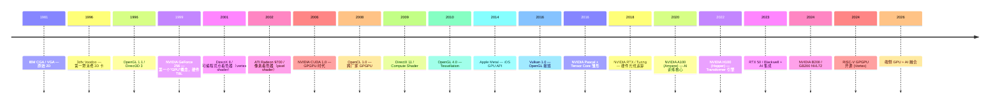
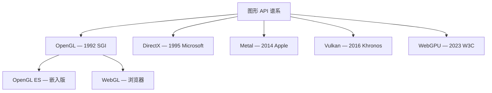
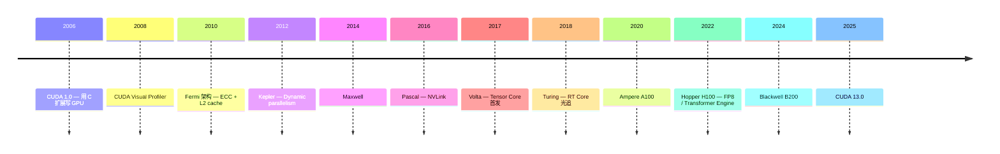
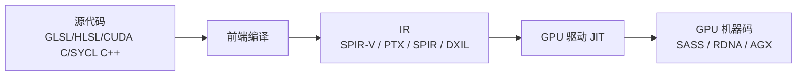

# 00-24 — GPU + 图形 + GPGPU 演化（含 CUDA / pyCUDA）

>
> **一句话答案：** GPU 起源于"硬件加速 2D/3D 渲染"，2006 NVIDIA CUDA 让"通用计算"（GPGPU）成型。**SIMT（单指令多线程）**是 GPU 微架构核心。OpenGL 是开源跨平台图形 API；Vulkan 是它的现代接班；Metal 是 Apple 自家；DirectX 是微软；CUDA 是 NVIDIA 私有但事实标准 GPGPU。pyCUDA 让 Python 直接写 kernel。


---

## 1. GPU 演化时间轴



---

## 2. GPU 微架构核心概念

### 2.1 SIMT（Single Instruction Multiple Thread）

GPU 核心范式 — 一条指令同时驱动数十个线程：

```
warp (NVIDIA, 32 threads) / wavefront (AMD, 64 threads)
    ↓
所有 thread 同步执行同一指令（不同数据）
    ↓
数千 warp 并行 → 数万线程同时跑
```

**SIMT 与 SIMD 区别：**
- SIMD（CPU SSE/AVX）：一条指令处理向量，**程序员看得见向量**
- SIMT（GPU）：每个 thread 写"标量"代码，**硬件自动 SIMD 化**

### 2.2 GPU 硬件层次

```
GPU
├── SM (Streaming Multiprocessor) / CU (Compute Unit) — 几十个
│   ├── warp scheduler
│   ├── ALU / FPU / Tensor Core
│   ├── shared memory (L1 cache)
│   └── register file (大！每 SM 几万个 32-bit 寄存器)
└── HBM / GDDR memory — 全局
```

NVIDIA H100：132 SM × 128 CUDA core = 16896 CUDA cores + 528 Tensor cores。

### 2.3 GPU 编程层次

```
Grid (网格)
  └── Block / Workgroup (块) — 多个 warp 组成
       └── Thread (线程) — 实际执行单元
```

CUDA 中：`<<<num_blocks, threads_per_block>>>` 启动 kernel。

---

## 3. 图形 API 横向对比



| API | 厂家 | 特点 | 当前 |
|-----|------|------|------|
| **OpenGL** | Khronos | 跨平台，1992 起，老 | 维护态 |
| **OpenGL ES** | Khronos | 嵌入 / 移动 | Android / 旧 iOS |
| **WebGL** | Khronos | 浏览器 OpenGL ES | 主流 web 3D |
| **Direct3D** | Microsoft | Windows 专属 | DirectX 12 主流 |
| **Metal** | Apple | iOS / macOS | 苹果生态 |
| **Vulkan** | Khronos | OpenGL 接班，低级 | 现代 Linux / Android / Windows |
| **WebGPU** | W3C | Vulkan/Metal/D3D12 web 包装 | 浏览器现代 |
| **Mantle** | AMD | Vulkan 前身 | 已并入 Vulkan |
| **OpenGL SC** | Khronos | 安全关键（航空电子）| 小众 |

### 3.1 Vulkan vs OpenGL

| 维度 | OpenGL | Vulkan |
|------|--------|--------|
| 抽象级别 | 高（隐藏 GPU 细节）| 低（显式控制）|
| 多线程 | 单线程 | 多线程友好 |
| 性能 | 中 | 极高 |
| 学习曲线 | 平 | 陡 |
| 代码量 | 几十行 hello triangle | 1000+ 行 |
| 主战场 | 教学 / 兼容 | 生产 / 现代游戏 / VR |

### 3.2 着色器语言演化

| 语言 | 来源 | 当前 |
|------|------|------|
| **GLSL** | OpenGL | 主流跨平台 |
| **HLSL** | DirectX | Windows |
| **MSL (Metal Shading Language)** | Apple | macOS / iOS |
| **WGSL** | WebGPU | 浏览器 |
| **SPIR-V** | Khronos | 通用 IR（Vulkan / OpenGL / OpenCL）|
| **Cg** | NVIDIA | 已弃 |
| **PSSL** | PlayStation | 索尼 |
| **slang** | 现代跨平台 | 学术 / 实验 |

**SPIR-V** 是着色器界的"LLVM IR"——GLSL/HLSL/MSL 编译到 SPIR-V，硬件驱动转 GPU native。

---

## 4. GPGPU 演化（CUDA + OpenCL + ROCm + oneAPI）

### 4.1 CUDA（NVIDIA 私有，事实标准）



**CUDA 编程基础：**

```cpp
// kernel.cu
__global__ void add(float *a, float *b, float *c, int n) {
    int idx = blockIdx.x * blockDim.x + threadIdx.x;
    if (idx < n) c[idx] = a[idx] + b[idx];
}

int main() {
    float *d_a, *d_b, *d_c;
    cudaMalloc(&d_a, n * sizeof(float));
    // ... copy from host ...
    add<<<(n + 255) / 256, 256>>>(d_a, d_b, d_c, n);  // launch
    cudaDeviceSynchronize();
}
```

CUDA 工具链：
- **nvcc** — CUDA 编译器（前端 + LLVM 后端）
- **PTX** — CUDA 中间汇编（架构无关）
- **SASS** — 实际 GPU 机器码（架构特定）
- **CUDA Driver API** — 低级
- **CUDA Runtime API** — 高级
- **cuBLAS / cuDNN / cuFFT / NCCL** — 高性能库

### 4.2 pyCUDA（Python 调 CUDA，最新版本）

```python
import pycuda.autoinit
import pycuda.driver as drv
import numpy as np
from pycuda.compiler import SourceModule

mod = SourceModule("""
__global__ void add(float *a, float *b, float *c) {
    int idx = blockIdx.x * blockDim.x + threadIdx.x;
    c[idx] = a[idx] + b[idx];
}
""")

add = mod.get_function("add")
a = np.random.randn(1024).astype(np.float32)
b = np.random.randn(1024).astype(np.float32)
c = np.empty_like(a)
add(drv.In(a), drv.In(b), drv.Out(c), block=(256,1,1), grid=(4,1))
```

### 4.3 现代 Python GPU 调用替代方案

| 库 | 厂家 | 一句话 |
|----|------|--------|
| **pyCUDA** | 社区 | 直接 CUDA C 嵌入 Python |
| **cupy** | Preferred Networks | numpy-like 但跑在 GPU |
| **numba.cuda** | Anaconda | 装饰器 `@cuda.jit` |
| **PyTorch** | Meta | 主流深度学习（背后 cuBLAS/cuDNN）|
| **JAX** | Google | numpy + autograd + XLA |
| **Triton** | OpenAI | Python kernel DSL（编 PTX）|
| **TensorRT-LLM** | NVIDIA | LLM 推理优化 |

→ **现代趋势：直接写 PyTorch / cupy，pyCUDA 仅在自定义 kernel 时用**。

### 4.4 OpenCL（跨厂家 GPGPU）

- 2008 Khronos 标准
- 跑在 NVIDIA / AMD / Intel / Mali / Adreno
- 比 CUDA 通用但比 CUDA 弱（API 老 + NVIDIA 不积极支持）
- 现代多让位给 SYCL / Vulkan Compute

→ **本仓库 `others/pocl-upstream/`** 是 OpenCL 的 CPU 实现（Portable OpenCL）。

### 4.5 ROCm（AMD GPU）

- AMD 对标 CUDA 的开源栈
- HIP（CUDA-compatible API）— "C++ Heterogeneous-Compute Interface for Portability"
- ROCm 6.x 主流（2024）
- 主战场：MI300X / Instinct（数据中心 AI）

### 4.6 oneAPI（Intel）

- 2019 推出
- SYCL-based（C++）
- DPC++ 编译器
- 跨 CPU / GPU / FPGA
- 主战场：Intel Arc / Gaudi / Habana Labs

### 4.7 SYCL（C++ 跨平台 GPGPU）

- Khronos 标准
- 现代 C++ 单源代码
- 后端：OpenCL / CUDA / HIP / Level Zero
- 主用：Intel oneAPI / hipSYCL / AdaptiveCpp

---

## 5. 现代 GPU 微架构特性

### 5.1 NVIDIA 架构演化

| 架构 | 年 | 关键 |
|------|---|------|
| Tesla | 2006 | CUDA 起源 |
| Fermi | 2010 | ECC + L2 |
| Kepler | 2012 | Dynamic parallelism |
| Maxwell | 2014 | 能效大幅提升 |
| Pascal | 2016 | NVLink + FP16 |
| Volta | 2017 | **Tensor Core**（4×4 MMA）|
| Turing | 2018 | **RT Core**（光追）|
| Ampere | 2020 | Tensor Core 第三代 + Sparsity |
| Hopper | 2022 | **Transformer Engine** + FP8 |
| Ada Lovelace | 2022 | 消费 RT 加强 |
| Blackwell | 2024 | B200 / GB200 NVL72 |
| Rubin | 2026? | 下一代 |

### 5.2 AMD 架构演化

| 架构 | 年 | 关键 |
|------|---|------|
| GCN | 2012 | 计算 + 图形统一 |
| RDNA | 2019 | 图形优先重写 |
| RDNA 2 / 3 / 4 | 2020-2024 | 消费 / 游戏 |
| CDNA | 2020 | 计算专用（MI100）|
| CDNA 2 / 3 | 2021-2023 | MI200 / MI300 |

### 5.3 GPU 现代特性

- **Tensor Core / Matrix Core** — 4×4 矩阵乘加（AI 加速）
- **RT Core / Ray Accelerator** — 光线追踪硬件
- **NVLink / Infinity Fabric** — GPU 间高速互联
- **Multi-Instance GPU (MIG)** — 一卡分多虚拟 GPU
- **GPUDirect Storage** — GPU 直接访问 NVMe
- **DMA Engine** — 异步内存拷贝

---

## 6. 端侧 / 嵌入式 GPU

| GPU | 厂家 | SoC |
|-----|------|-----|
| **Mali** | ARM | 联发科 / Exynos / 海思 |
| **Adreno** | Qualcomm | Snapdragon |
| **PowerVR** | Imagination | 老 iPhone / 长城等 |
| **Apple GPU** | Apple | A 系列 / M 系列 |
| **Intel Iris / Arc** | Intel | iGPU |
| **AMD Radeon Vega / RDNA APU** | AMD | Ryzen iGPU |
| **NVIDIA Tegra** | NVIDIA | Switch / Jetson |

### 6.1 国产 GPU

| 公司 | 产品 |
|------|------|
| **沐曦 (Moore Threads)** | MTT S4000 |
| **壁仞** | BR100 |
| **燧原** | Enflame i20 |
| **景嘉微** | 桌面图形 |
| **芯动 (Innosilicon)** | Fantasy 系列 |
| **海光 / 寒武纪** | AI 加速器 |

### 6.2 RISC-V GPGPU — Vortex（**本仓库 `others/vortex/`**）

- Georgia Tech 开源 GPGPU
- RV32IMAFD 多核 + 自定义 SIMT 扩展
- 跑在 Xilinx U250 / Intel Stratix 10
- **OpenCL 后端：本仓库 `others/pocl-vortex/`**

---

## 7. 着色器 / 计算 kernel 流水



→ **本仓库 `others/pocl-vortex/`**：OpenCL → LLVM → Vortex SIMT 指令的完整路径。

---


学完 OS 层后才考虑：

### 8.1 GPU/图形/AI 方向值得探索的领域（不预设具体项目）


1. 简化 Vulkan 驱动框架方向
2. PoCL on 自家 OS（CPU 后端起步）方向
3. 基于 Vortex 硬件的 SIMT 后端方向
4. Tensor 抽象 + 算子库方向（端侧 AI）

### 8.2 借鉴清单

| 来自 | 借鉴 |
|------|------|
| **Vulkan** | 显式 GPU API 设计 |
| **PoCL** | OpenCL 实现思路 |
| **Vortex** | RISC-V SIMT 硬件 |
| **CUDA Runtime** | 高级 API 设计 |
| **TFLite** | 推理框架 |

---

## 9. 名词词典

| 术语 | 含义 |
|------|------|
| **GPU** | Graphics Processing Unit |
| **GPGPU** | General-Purpose computing on GPU |
| **CUDA** | NVIDIA Compute Unified Device Architecture |
| **OpenCL** | Open Computing Language（Khronos）|
| **HIP** | Heterogeneous-Compute Interface for Portability（AMD）|
| **SYCL** | C++ 跨厂家 GPGPU |
| **SIMT** | Single Instruction Multiple Thread |
| **SIMD** | Single Instruction Multiple Data |
| **warp** | NVIDIA 32-thread 组 |
| **wavefront** | AMD 64-thread 组 |
| **SM / CU** | Streaming Multiprocessor / Compute Unit |
| **shared memory / LDS** | GPU 内 L1-like 共享 |
| **PTX** | NVIDIA CUDA IR |
| **SASS** | NVIDIA GPU 机器码 |
| **SPIR-V** | Khronos 着色器 IR |
| **GLSL / HLSL / MSL / WGSL** | 着色器语言 |
| **Tensor Core** | NVIDIA AI 矩阵单元 |
| **RT Core** | NVIDIA 光追单元 |
| **Vulkan** | 现代 GPU API |
| **Vortex** | RISC-V GPGPU |
| **PoCL** | Portable OpenCL |

---

## 10. 进一步阅读

### 10.1 经典书

- ***GPU Gems 1/2/3*** — NVIDIA 经典图形系列
- ***Real-Time Rendering*** — Akenine-Möller — 图形圣经
- ***Programming Massively Parallel Processors*** — Kirk / Hwu — CUDA 教科书
- ***Vulkan Programming Guide*** — Sellers
- ***GPGPU Programming for Games*** — Cebenoyan

### 10.2 视频 / 教程

- [LearnOpenGL](https://learnopengl.com/) — 免费 OpenGL 教程
- [Vulkan Tutorial](https://vulkan-tutorial.com/) — 免费 Vulkan
- [NVIDIA Developer Blog](https://developer.nvidia.com/blog) — CUDA 实战
- [The Cherno YouTube](https://www.youtube.com/@TheCherno) — 现代 C++ 图形

### 10.3 本仓库笔记串联

- [00-06-aiot-hardware-software-evolution](00-06-aiot-hardware-software-evolution.md) § 5 — 端侧 AI 加速
- [00-33-ai-ml-evolution](00-33-ai-ml-evolution.md) — AI 推理框架
- 远期 [00-N-vortex-pocl-llvm-opencl] — Vortex 全链路（task #27）

### 10.4 本仓库本地资料

| 路径 | 内容 |
|------|------|
| `others/vortex/` | RISC-V GPGPU 开源 RTL + 仿真器 |
| `others/pocl-upstream/` | Portable OpenCL（CPU + Vortex backend）|
| `others/pocl-vortex/` | PoCL 的 Vortex fork |

→ 远期实战：**用 PoCL 在 Vortex GPGPU 上跑 OpenCL kernel**——这是笔记 task #27 的核心内容。
