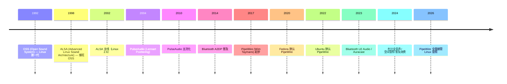

# 00-25 — 音频系统演化（OSS → ALSA → PulseAudio → PipeWire）

>
> **一句话答案：** Linux 音频经历了 30 年 4 代标准（OSS → ALSA → PulseAudio → PipeWire）。**PipeWire（2017+）统一了音频 + 视频 + 蓝牙**，是现代 Linux 主流。Windows / macOS 各有专属栈。嵌入式直接用 I2S / I2C 配 codec。空间音频 / 杜比全景声是商业标准 + 软件混音。


---

## 1. 历史时间轴



---

## 2. Linux 音频栈四代

### 2.1 OSS（1992-2002，第一代）

- 第一个 Unix 音频 API
- 基于 `/dev/dsp` 字符设备
- read/write 写音频数据
- 已被 ALSA 取代（但 FreeBSD 仍用 OSS4）

### 2.2 ALSA（1998 起，主线 2002）

- **Advanced Linux Sound Architecture**
- 内核驱动 + 用户态库 (alsa-lib)
- 提供低级 API
- 仍是 Linux 内核音频驱动层（PipeWire / PulseAudio 都跑在它上面）

```
应用 → ALSA lib → ALSA kernel driver → codec
```

### 2.3 PulseAudio（2004 起）

**问题：** ALSA 一次只能一个应用用音频。**多应用混音**怎么办？

PulseAudio 是用户态守护进程，做软件混音：

```
多个应用
   ↓
PulseAudio daemon (混音 / 重采样 / 路由)
   ↓
ALSA → kernel → codec
```

特点：
- 多应用并存
- 蓝牙音频
- 网络音频转发

但缺点：延迟高、复杂、专业音频人嫌弃。

### 2.4 PipeWire（2017 起，现代主流）

**目标：** 替代 PulseAudio + JACK + GStreamer，统一音频 / 视频 / 蓝牙。

```
多应用（Firefox / GIMP / OBS / DAW）
   ↓
PipeWire (Multimedia daemon)
   ↓
ALSA / V4L2 / 蓝牙 → kernel
```

特点：
- **同时支持普通音频（PulseAudio API）和专业音频（JACK API）**
- 低延迟
- 视频流路由（替代 GStreamer 部分）
- 蓝牙音频原生
- 现代 distro 默认（Fedora 35+ / Ubuntu 22.10+ / Arch / openSUSE）

### 2.5 JACK（专业音频）

- **Jack Audio Connection Kit**（2003+）
- 低延迟（< 5 ms 可达）
- 跨应用音频路由
- 主用：Audacity / Ardour / 音乐制作（DAW）
- 现代 PipeWire 模拟 JACK 协议 → JACK 应用直接跑

### 2.6 GStreamer（多媒体框架）

- 不是音频栈，是媒体处理框架
- pipeline 模型（source → filter → sink）
- 支持音视频解码 / 编码 / 流
- 主用：GNOME 媒体应用

---

## 3. Windows 音频栈

```
应用 (DirectSound / WASAPI / ASIO)
   ↓
Windows Audio Session (WASAPI) — Vista+
   ↓
Windows Audio Engine (mixer)
   ↓
audio driver (HDAudio / USB / Bluetooth)
   ↓
Hardware codec
```

历史：
- Win 3.x：MCI
- Win 9x：DirectSound
- Win XP：DirectSound + WaveOut
- **Vista+：WASAPI（取代之前所有）**
- 专业：**ASIO**（Steinberg 私有协议，低延迟）

---

## 4. macOS / iOS 音频栈

```
应用 (AVFoundation / Core Audio / AudioUnit)
   ↓
Core Audio HAL
   ↓
audio driver
   ↓
Apple T1 / T2 audio chip
```

特点：
- Core Audio 1999 起，统一栈（macOS / iOS / tvOS）
- AudioUnit 插件框架（专业音频普及）
- 苹果空间音频（2021+）原生集成

---

## 5. 蓝牙音频

### 5.1 蓝牙音频协议

| 协议 | 用途 |
|------|------|
| **HFP** (Hands-Free Profile) | 通话（单声道，低质）|
| **HSP** (Headset Profile) | 老款，简化 HFP |
| **A2DP** (Advanced Audio Distribution Profile) | 立体声音乐 |
| **AVRCP** (Audio/Video Remote Control) | 暂停 / 切歌 / 音量控制 |
| **LE Audio** (BT 5.2+, 2020) | 低功耗 + LC3 codec |
| **Auracast** (LE Audio) | 公共广播音频（机场 / 体育馆）|

### 5.2 编解码器（codec）

| Codec | 特点 |
|-------|------|
| **SBC** | A2DP 强制，质量一般 |
| **AAC** | Apple 主流，比 SBC 好 |
| **aptX / aptX HD / aptX Adaptive** | Qualcomm 高质 |
| **LDAC** | Sony，无损级（990 kbps）|
| **LHDC** | 中国华为联盟主推 |
| **LC3** (LE Audio) | 现代低带宽高效率 |

---

## 6. 嵌入式音频

### 6.1 硬件层

```
DAC (Digital → Analog 转换)  —— I2S / TDM 数据线
ADC (麦克风) —— I2S
codec chip (TI / Wolfson / Realtek) —— I2C 控制 + I2S 数据
amp / speaker
```

### 6.2 嵌入式音频 OS 集成

- **ALSA + Mixer** — 嵌入 Linux
- **PipeWire** — 嵌入 Linux 现代
- **TinyALSA** — Android 简化 ALSA
- **OpenAL Soft** — 跨平台游戏音频
- **portaudio** — 跨平台 audio I/O

### 6.3 嵌入 RTOS 音频

- **FreeRTOS + I2S DMA** — 直接驱动 codec
- **CMSIS-DSP** — DSP 算子库（FFT / FIR / 滤波）
- **MicroPython audio module** — 简化 API

### 6.4 ESP32 音频开发

- ESP-IDF I2S / I2S-PDM / DAC
- ESP-ADF (Audio Development Framework)
- 应用：智能音箱 / 录音笔 / 蓝牙音箱

---

## 7. 空间音频 / 多声道

### 7.1 多声道格式

| 格式 | 声道 |
|------|------|
| **Mono** | 1 |
| **Stereo** | 2 |
| **5.1** | 6（前左右中 + 后左右 + 低音）|
| **7.1** | 8 |
| **Dolby Atmos** | 64+ 对象式 |
| **DTS:X** | 同 Atmos 风格 |
| **Sony 360 Reality Audio** | 对象式 |
| **Apple Spatial Audio** | 头部追踪 |

### 7.2 编码标准

| Codec | 特点 |
|-------|------|
| **PCM** | 无压缩 |
| **MP3** | MPEG-1 Layer 3，老牌 |
| **AAC** | 现代有损 |
| **Opus** | 现代低延迟有损（WebRTC 默认）|
| **FLAC** | 无损 |
| **ALAC** | Apple 无损 |
| **Vorbis** | 开源有损（已老）|
| **WMA** | 微软 |
| **DTS** | 影院 |
| **AC-3 / EAC-3** | 杜比 |

---

## 8. 音频处理软件

### 8.1 DAW（Digital Audio Workstation）

| DAW | 平台 |
|-----|------|
| **Pro Tools** | Mac / Win 商业最强 |
| **Logic Pro** | Mac 苹果 |
| **Ableton Live** | 跨平台 |
| **Cubase** | 跨平台 |
| **FL Studio** | Win / Mac |
| **Reaper** | 跨平台 |
| **Ardour** | Linux 开源 |
| **LMMS** | Linux 开源 |
| **Audacity** | 跨平台简单 |

### 8.2 音频效果器 / VST

- VST 2 / 3（Steinberg 标准）
- AU（Apple Audio Unit）
- LADSPA / LV2（Linux 开源）
- AAX（Pro Tools）

---


### 9.1 起步路线

1. **第一阶段**：无音频
2. **嵌入式应用**：直接 I2S DMA → codec（无 mixer）
3. **远期**：实现简化 PipeWire 风格 daemon

### 9.2 借鉴

| 来自 | 借鉴 |
|------|------|
| ALSA | 内核驱动模型 |
| PipeWire | daemon 架构 |
| TinyALSA | 嵌入式简化 |
| ESP-ADF | DSP + I2S 实战 |

---

## 10. 名词词典

| 术语 | 含义 |
|------|------|
| **OSS** | Open Sound System |
| **ALSA** | Advanced Linux Sound Architecture |
| **PulseAudio** | 用户态混音 daemon |
| **PipeWire** | 现代多媒体 daemon |
| **JACK** | 专业低延迟音频 |
| **WASAPI** | Windows Audio Session API |
| **Core Audio** | macOS / iOS |
| **codec** | 编解码器（硬件芯片或软件算法）|
| **DAC / ADC** | 数模 / 模数转换 |
| **I2S** | 数字音频总线（codec ↔ SoC）|
| **TDM** | 时分复用音频总线 |
| **PDM** | Pulse Density Modulation（数字麦克风）|
| **PCM** | Pulse Code Modulation（无压缩）|
| **A2DP / HFP / LE Audio** | 蓝牙音频协议 |
| **Atmos / DTS:X** | 空间音频 |
| **DAW** | Digital Audio Workstation |
| **VST / AU** | 音频插件标准 |
| **MIDI** | Musical Instrument Digital Interface |
| **Latency** | 延迟（音乐制作关键指标）|

---

## 11. 进一步阅读

### 11.1 经典书 / 资料

- ***Audio Processing for Linux*** — 各种 wiki
- ***The Audio Programming Book*** — Boulanger / Lazzarini
- ***Designing Audio Effect Plugins in C++*** — Will Pirkle
- ***Programming Sound with Pure Data*** — Tony Hillerson

### 11.2 本仓库笔记串联

- [00-06-aiot-hardware-software-evolution](00-06-aiot-hardware-software-evolution.md) — DSP 在嵌入式
- [00-22-display-evolution](00-22-display-evolution.md) — 配套显示

### 11.3 本仓库本地资料

- ESP-ADF（Espressif 音频框架，开源）
- TinyALSA（Android 简化 ALSA）
- LVGL 不含音频但 GUI 配套
