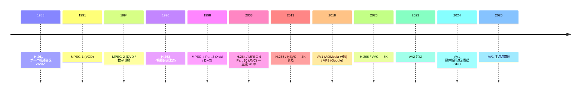

# 00-26 — 多媒体编解码演化（H.264 / AV1 / Opus / FLAC / WebP）

>
> **一句话答案：** 编解码（codec）= **压缩**（编）+ **解压**（解）。30 年视频从 MPEG-1（1.5 Mbps）演化到 AV1（同质量 0.3 Mbps）—— 5× 效率。**软件实现负责通用**（FFmpeg 包揽），**硬件加速负责实时**（GPU/NPU/VPU）。

---

## 1. 历史时间轴

---

## 2. 视频编解码

### 2.1 主流视频 codec 对比

| Codec | 年份 | 厂家 | 压缩率 | 专利 | 主用 |
|-------|------|------|-------|------|------|
| **MPEG-1** | 1991 | ISO | 1× | 已过期 | VCD |
| **MPEG-2** | 1994 | ISO | 2× | 已过期 | DVD / 数字电视 |
| **H.263** | 1996 | ITU-T | 2× | 已过期 | 视频会议 |
| **MPEG-4 P2** | 1998 | ISO | 3× | 部分过期 | Xvid / DivX |
| **H.264 / AVC** | 2003 | ITU-T + ISO | 4× | 仍有专利 | YouTube / 蓝光 / 几乎所有 |
| **VP8 / VP9** | 2010/2012 | Google | 4-5× | 开源（专利避免）| YouTube / WebRTC |
| **H.265 / HEVC** | 2013 | ITU-T + ISO | 6× | 高昂专利 | 4K 蓝光 / Apple |
| **AV1** | 2018 | AOMedia（Google + Netflix + Microsoft + ...）| 7× | 免版税开源 | YouTube / Netflix / Twitch |
| **H.266 / VVC** | 2020 | ITU-T + ISO | 9× | 仍有专利 | 8K |
| **AV2** | 2026? | AOMedia | 10× | 同 AV1 | 起草中 |

### 2.2 H.264 仍是 2024 主流

为什么 H.264 用 20 年还活：
- 硬件解码无处不在（手机 / 电视 / 相机）
- 兼容性极强
- 专利费用稳定
- AV1 / HEVC 普及慢

→ 2024 年新设备用 H.265 或 AV1，但 H.264 流媒体仍占大头。

### 2.3 视频容器格式

视频文件 = 容器（封装） + codec（视频流 + 音频流 + 字幕）

| 容器 | 一句话 |
|------|--------|
| **MP4 (.mp4 / .m4v)** | 主流 |
| **MKV (.mkv)** | 开源 Matroska，灵活 |
| **WebM** | Google，开源（VP9/AV1 + Opus）|
| **MOV** | Apple QuickTime |
| **AVI** | 老 Microsoft |
| **FLV** | Adobe Flash 流（已死）|
| **MPEG-TS / MPEG-PS** | 广播流 |
| **3GP** | 移动 |

### 2.4 流媒体协议

| 协议 | 一句话 |
|------|--------|
| **HLS** (HTTP Live Streaming) | Apple，主流自适应码率 |
| **DASH** (MPEG-DASH) | ISO 标准，类 HLS |
| **RTMP** | Adobe 老流（OBS 推流仍用）|
| **WebRTC** | 浏览器实时 |
| **SRT** | 现代低延迟 |
| **RTSP** | 监控老协议 |

### 2.5 现代视频处理

- **FFmpeg** — 最通用 codec 库，几乎所有项目用
- **GStreamer** — pipeline 模型
- **VLC libVLC** — 全格式播放
- **ExoPlayer / AVPlayer** — Android / iOS 内置
- **mpv / yt-dlp** — 开源播放 / 下载

---

## 3. 音频编解码

详见 [00-25-audio-evolution](00-25-audio-evolution.md) § 7.2 已列。简表：

| Codec | 类型 | 主用 |
|-------|------|------|
| **PCM / WAV** | 无压缩 | 录音原始 |
| **FLAC** | 无损压缩 | 高质量音乐 |
| **ALAC** | Apple 无损 | iTunes |
| **MP3** | 有损 | 老牌主流 |
| **AAC** | 有损 | Apple / YouTube / 现代主流 |
| **Opus** | 有损 | WebRTC / Discord / Zoom 主流 |
| **Vorbis** | 有损开源 | OGG 容器 |
| **WMA** | 有损 | Windows |
| **AC-3 / EAC-3** | 杜比 | 电影 |
| **DTS** | 影院 | 蓝光 |
| **MQA** | 高解析 | Tidal |

### 3.1 Opus 详解

- 2012 IETF 标准化
- 6-510 kbps 范围
- 极低延迟（5-66 ms）
- 比 AAC + Vorbis 都好
- 现代默认（WebRTC / Discord / Telegram）

---

## 4. 图像编解码

| 格式 | 类型 | 主用 |
|------|------|------|
| **BMP** | 无压缩 | Windows 老 |
| **PNG** | 无损 | UI / 截图 |
| **GIF** | 调色板 | 动图 |
| **JPEG / JPG** | 有损 | 照片主流 |
| **WebP** | 有损 + 无损 | Google，web 友好 |
| **AVIF** | 有损 + 无损（AV1 派生）| 现代 web |
| **HEIF / HEIC** | HEVC 派生 | iPhone 默认 |
| **JPEG XL** | 现代 JPEG | 新（2022 起，普及中）|
| **TIFF** | 多用途 | 印刷 / 扫描 |
| **RAW (CR2/NEF/ARW/DNG)** | 相机原始 | 摄影师 |
| **SVG** | 矢量 | UI / 图标 |

### 4.1 JPEG XL（新一代图像）

- 2022 标准化
- 比 JPEG 60% 更小同质量
- 比 WebP / AVIF 编码更快
- Chrome 一度支持后撤回（2022 政治）
- Safari / Firefox 渐支持

---

## 5. 字幕格式

| 格式 | 一句话 |
|------|--------|
| **SRT** | 文本简单时间码 |
| **ASS / SSA** | 高级特效（动漫常用）|
| **WebVTT** | HTML5 标准 |
| **PGS** | 蓝光图像字幕 |

---

## 6. 硬件加速

### 6.1 GPU 视频引擎

每个现代 GPU 都有专用视频引擎：
- **NVIDIA NVENC / NVDEC** — 编 / 解
- **AMD VCE / VCN** — 同上
- **Intel Quick Sync** — iGPU 主力
- **Apple VideoToolbox** — Metal 后端

### 6.2 移动 SoC VPU

- **高通 Adreno + Hexagon** 视频协处理器
- **Apple A 系列 ISP** — 拍照 / 解码
- **海思 / 全志 / 瑞芯微 VPU** — 国产 SoC 都集成

### 6.3 嵌入式硬件解码

| 板 | 能力 |
|----|------|
| 树莓派 4 | H.264 解码 / 4K |
| 树莓派 5 | H.265 解码 |
| Jetson Orin | 全 codec + AV1 |
| RK3588 | 8K H.265 / AV1 解码 |
| 海思 SoC | 监控视频专精 |

---

### 7.1 优先级

2. 集成硬件加速（VPU driver）
3. 简单 PCM / WAV 播放（嵌入式）

### 7.2 借鉴

| 来自 | 借鉴 |
|------|------|
| FFmpeg | 全格式参考 |
| dav1d | AV1 软件解码（VLC 出品）|
| libvpx | VP8/9 |
| libopus | Opus |

---

## 8. 名词词典

| 术语 | 含义 |
|------|------|
| **codec** | Coder + Decoder |
| **lossy / lossless** | 有损 / 无损 |
| **bitrate** | 比特率（bps）|
| **CBR / VBR** | Constant / Variable Bitrate |
| **CRF** | Constant Rate Factor（H.264 质量参数）|
| **GOP** | Group of Pictures |
| **I-frame / P-frame / B-frame** | 关键帧 / 预测 / 双向 |
| **chroma subsampling** | 色度二次采样（4:2:0 等）|
| **bit depth** | 位深（8/10/12-bit）|
| **HDR** | High Dynamic Range |
| **HEVC / AVC / VVC** | H.265 / H.264 / H.266 别名 |
| **container / muxer / demuxer** | 容器 / 复用 / 解复用 |
| **transcoding** | 转码 |
| **streaming** | 流媒体 |
| **HLS / DASH** | 自适应流协议 |
| **VPU / NPU** | Video / Neural Processing Unit |

---

## 9. 进一步阅读

### 9.1 经典书 / 资料

- ***Video Codec Design*** — Iain Richardson
- ***FFmpeg 官方文档***
- ***Digital Video and HD*** — Charles Poynton
- ***JPEG: Still Image Data Compression Standard***

### 9.2 本仓库笔记串联

- [00-24-gpu-graphics-evolution](00-24-gpu-graphics-evolution.md) — GPU VPU
- [00-25-audio-evolution](00-25-audio-evolution.md) — 音频 codec
- [00-06-aiot-hardware-software-evolution](00-06-aiot-hardware-software-evolution.md) — 国产 SoC VPU

### 9.3 本仓库本地资料

- dav1d / libvpx / libopus
