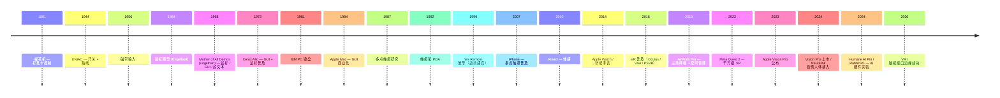

# 00-27 — 人机交互（HCI）演化：从打孔卡到脑机接口

> **核心问题：** 人和计算机之间怎么传消息？1940s 打孔卡 → 1980s 鼠标 → 2007 触摸 → 2024 VR/AR / 脑机接口——下一代是什么？OS 怎么处理输入事件？
>
> **一句话答案：** HCI = 人输入（输给电脑）+ 输出（电脑给人）的双向通道。70 年从开关 / 打孔卡 → 键盘 / 鼠标 → 触屏 / 语音 → VR/AR / 脑机演化。OS 在中间做"事件分发 + 设备抽象"。


---

## 1. 历史时间轴



---

## 2. 输入设备演化

### 2.1 物理输入

| 设备 | 主用 |
|------|------|
| **开关 / 跳线** | ENIAC 时代 |
| **打孔卡 / 纸带** | 1950-70s 大型机 |
| **键盘** | 1960s 起 |
| **鼠标** | 1964 发明，1980s 普及 |
| **轨迹球 / 触控板** | 笔记本 |
| **手柄 / 摇杆** | 游戏 / 工业 |
| **触摸屏** | 1980s 起，2007 iPhone 普及 |
| **手写笔 (stylus)** | iPad / Surface / Wacom |
| **数位板 / Wacom** | 设计师 |
| **键鼠组合（机械键盘 / 客制化）** | 现代极客 |

### 2.2 自然交互

| 设备 / 技术 | 主用 |
|-----------|------|
| **语音识别（麦克风）** | Siri / Alexa / Google Assistant |
| **手势识别（摄像头）** | Kinect / Leap Motion / Vision Pro |
| **眼动追踪** | Vision Pro / Tobii / Magic Leap |
| **运动感应（IMU）** | Wii Remote / Switch Joy-Con / VR 控制器 |
| **触觉反馈（haptic）** | iPhone Taptic / Switch HD Rumble / VR 手套 |

### 2.3 脑机接口（BCI）

| 项目 | 一句话 |
|------|--------|
| **EEG（脑电图）** | 非侵入，低分辨率 |
| **fMRI** | 非侵入，需大型设备 |
| **侵入式电极** | Neuralink / Synchron / Blackrock |
| **Neuralink (Elon Musk)** | 2024 首例人体植入 |
| **Synchron** | 血管内电极，已 FDA 批 |
| **OpenBCI** | 开源消费级 EEG |

---

## 3. 输出设备演化

### 3.1 视觉输出

| 设备 | 主用 |
|------|------|
| **CRT 显示器** | 1940-2000s |
| **LCD** | 1990s 起 |
| **OLED** | 2010+ 高端手机 / 电视 |
| **MicroLED** | 苹果 Vision Pro / 顶级电视 |
| **E-ink** | Kindle / 阅读器 |
| **投影仪** | 商务 / 家庭影院 |
| **HUD / AR 眼镜** | Vision Pro / Quest 3 / HoloLens |
| **VR 头盔** | Quest / Vive / PSVR / Pico |
| **盲文显示器（盲人辅助）** | 触觉显示 |

### 3.2 听觉输出

详见 [00-25-audio-evolution](00-25-audio-evolution.md)。

### 3.3 触觉输出（Haptic）

- 振动马达 → 线性马达 (Apple Taptic) → 高分辨率触觉
- VR 手套 / 全身触感衣
- 超声波触觉（无接触）

### 3.4 嗅觉 / 味觉（实验）

- VAQSO（VR 嗅觉）
- 早期实验，未商业化

---

## 4. OS 中的输入事件分发

```
硬件中断（键盘 IRQ / 鼠标 USB HID）
   ↓
内核 driver（input subsystem / HID）
   ↓
/dev/input/event* 字符设备
   ↓
用户态读取（X11 / Wayland / evdev）
   ↓
窗口系统分发到聚焦窗口
   ↓
应用接收事件（onclick / onkey）
```

### 4.1 Linux input 子系统

```
/dev/input/event0  → 键盘
/dev/input/event1  → 鼠标
/dev/input/event2  → 触摸屏
...
```

每个设备发 `struct input_event`：type / code / value（如 `KEY_A pressed`）。

### 4.2 HID（Human Interface Device）

- USB / 蓝牙标准
- 描述符（descriptor）声明设备能力
- OS 通用驱动可处理（无需厂家 driver）

### 4.3 Wayland / X11 输入分发

- 合成器知道哪个窗口在前
- 鼠标点击 → 找到窗口 → 发事件
- 输入法（IME）拦截键盘事件做拼音

详见 [00-28-input-method-evolution](00-28-input-method-evolution.md)。

---

## 5. 嵌入式 HCI

### 5.1 嵌入式输入

- GPIO 按钮
- 旋转编码器
- 触摸传感器（电容 / 电阻）
- 摄像头 + CV
- 麦克风 + KWS
- 加速度计 / 陀螺仪 / 磁力计

### 5.2 嵌入式输出

- LED 灯
- LCD / OLED 小屏（SSD1306 等）
- 蜂鸣器 / 扬声器
- 振动马达
- 七段数码管

### 5.3 LVGL / 触摸屏组合

- LVGL（[00-22](00-22-display-evolution.md)）+ 电容触屏 = 嵌入 GUI
- ESP32 / STM32 + LCD + LVGL = 智能音箱触屏 / 电子相框 / 工业 HMI

---

## 6. 现代 HCI 趋势（2026）

### 6.1 多模态交互

- 同时用语音 + 手势 + 眼动 + 触摸
- AI 辅助理解意图
- Apple Vision Pro 实例：眼动选 + 手指点

### 6.2 AI 助理

- ChatGPT / Claude / Gemini
- 自然语言成为新的"鼠标"
- AI 硬件（Humane AI Pin / Rabbit R1）实验

### 6.3 空间计算

- Vision Pro 推出"空间计算"概念
- 眼动 + 手势 + 沉浸式 3D
- visionOS 设计模式

### 6.4 脑机接口未来

- 短期（5 年）：医疗（瘫痪患者）
- 中期（10 年）：消费级 EEG（专注度监控）
- 远期（20+ 年）：高带宽脑机（思维输入）

---


### 7.1 优先级

1. 串口 console（基础）✅ 已实现
2. PS/2 / USB 键盘
3. 帧缓冲文本显示
4. 嵌入式：GPIO 按钮 + LCD
5. 远期：完整 GUI

### 7.2 借鉴

| 来自 | 借鉴 |
|------|------|
| Linux input subsystem | input event 模型 |
| LVGL | 嵌入式 GUI |
| Wayland 协议 | 现代输入分发 |

---

## 8. 名词词典

| 术语 | 含义 |
|------|------|
| **HCI** | Human-Computer Interaction |
| **HID** | Human Interface Device（USB/BT 标准）|
| **GUI** | Graphical User Interface |
| **TUI** | Terminal User Interface |
| **CLI** | Command-Line Interface |
| **NUI** | Natural User Interface（语音 / 手势）|
| **IME** | Input Method Editor（输入法）|
| **DPI / PPI** | Dots / Pixels Per Inch |
| **Refresh rate** | 刷新率（Hz）|
| **Latency** | 延迟（输入到响应）|
| **Haptic** | 触觉反馈 |
| **VR / AR / MR / XR** | 虚拟 / 增强 / 混合 / 扩展现实 |
| **HMD** | Head-Mounted Display |
| **HUD** | Heads-Up Display |
| **BCI / BMI** | Brain-Computer / Machine Interface |
| **EEG** | Electroencephalogram |
| **6DoF / 3DoF** | 6 / 3 自由度（VR 追踪）|
| **inside-out / outside-in** | VR 追踪方式 |
| **eye tracking** | 眼动追踪 |
| **gaze** | 视线 |

---

## 9. 进一步阅读

### 9.1 经典书

- ***The Design of Everyday Things*** — Don Norman — HCI 设计圣经
- ***Designing Interfaces*** — Jenifer Tidwell
- ***About Face*** — Alan Cooper
- ***Universal Principles of Design***

### 9.2 视频 / 资源

- [Engelbart 1968 Mother of All Demos](https://www.youtube.com/results?search_query=engelbart+1968+demo)
- [Vision Pro 设计指南](https://developer.apple.com/visionos/)

### 9.3 本仓库笔记串联

- [00-22-display-evolution](00-22-display-evolution.md) — 显示输出
- [00-25-audio-evolution](00-25-audio-evolution.md) — 听觉输出
- [00-28-input-method-evolution](00-28-input-method-evolution.md) — 输入法（特殊 HCI）
- [00-29-font-rendering-evolution](00-29-font-rendering-evolution.md) — 字体（视觉 HCI 关键）

### 9.4 本仓库本地资料

