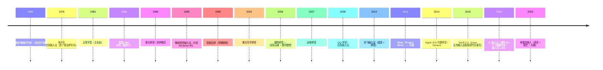

# 00-28 — 输入法软件演化（从字母到中文 + 选词 + UI 悬浮工具栏）

>
> **一句话答案：** 输入法 = **键码序列 → 候选词 → 用户选 → 上屏 Unicode 文字**。中文输入法 1980s 起为解决"汉字不在键盘"问题，演化出**字形码（五笔 / 仓颉）+ 字音码（拼音）+ 智能（联想 / 云）**。UI 从 DOS 内嵌 → Win9X 浮动条 → 现代输入法面板。


> **本笔记是 [00-30-charset-i18n-evolution](00-30-charset-i18n-evolution.md) 的姊妹篇**。00-30 讲"字符怎么编码"，本篇讲"字符怎么输入"。

---

## 1. 历史时间轴



---

## 2. 中文输入方案分类

### 2.1 字音码（基于发音）

| 方案 | 一句话 |
|------|--------|
| **全拼** | 全拼拼音（zhongguo → 中国）|
| **双拼** | 双键代表声 + 韵（自然码 / 微软双拼 / 小鹤）|
| **简拼** | 取首字母（zg → 中国）|
| **整句拼音** | 整句输入 + 联想（搜狗 / 微软）|
| **声调拼音** | 加声调（罕见）|

### 2.2 字形码（基于字形）

| 方案 | 一句话 |
|------|--------|
| **五笔字型** | 王永民 1983，根据笔画拆字（输入快，难学）|
| **仓颉** | 朱邦复 1976，台湾流行 |
| **行列 30** | 仓颉简化 |
| **大易** | 朱邦复 |
| **郑码** | 郑易里 |
| **二笔 / 三笔** | 简化字形码 |

### 2.3 混合 / 形声

| 方案 | 一句话 |
|------|--------|
| **形音输入法** | 拼音 + 形 |
| **小鹤双拼 + 形码辅助** | 双拼 + 笔画辅助 |

### 2.4 速记 / 速录

- **亚伟速录** — 类钢琴键盘
- 法庭 / 会议速录员

### 2.5 手写 / 语音 / OCR

- 手写：iPad / 手机 / 数位板
- 语音：讯飞 / Siri / Google Voice
- OCR：拍照识别

---


```
键序列输入：n i h a o
   ↓
拼音引擎匹配：
   候选 1: 你好
   候选 2: 你号
   候选 3: 泥嚎
   候选 4: 拟好
   ...
   ↓
显示候选窗口 → 用户按数字选 → 上屏
```

### 3.1 候选词排序

- **词频**（最常用排前）
- **上下文**（前文后文相关）
- **用户习惯**（学习用户选择）
- **云同步**（用户多设备词频）
- **AI 预测**（理解语义）

### 3.2 联想

- 输入"中国"后，候选自动出"政府 / 制造 / 共产党 / 梦"
- 整句预测：输入"今天"自动接"天气怎么样"

### 3.3 智能 ABC → 搜狗演化

```
1990s: 简单词库（几万词）
2000s: 几十万词
2006 搜狗: 整句拼音 + 互联网词库（百万级）
2010+: 云输入法（实时同步词库 + 用户行为）
2024: AI 大模型加持（理解语义）
```

### 3.4 词库技术

- **静态词库**：编译时打包
- **个人词库**：用户输入累积
- **网络流行词**：每日更新（社会 / 娱乐 / 新词）
- **专业词库**：医学 / 法律 / 编程 / 游戏

---


### 4.1 DOS 时代（1980s-1990s）

- 输入法**与 DOS / 应用集成**
- 没有"工具栏"，按 Ctrl+Space 切换
- 候选窗口在屏幕底部
- 例：UCDOS / WPS DOS / DOS 6.22

### 4.2 Windows 3.1 / 9X（1993-2001）

- **悬浮工具栏**首次出现！
- 通常贴在屏幕底部 / 任务栏旁
- 按钮：中/英 / 全/半角 / 中/英标点 / 软键盘 / 设置
- 紫光 / 智能 ABC / 微软拼音

```
[中] [全] [，] [软键盘] [设置]
```

### 4.3 Windows 2000 / XP / Vista / 7（2000s）

- 浮动条更精致
- 拖动到屏幕任意位置
- 任务栏托盘图标
- 候选窗口跟随光标位置

### 4.4 Windows 8 / 10 / 11（2010+）

- TSF (Text Services Framework) 现代 IME 接口
- 候选窗口 Acrylic 半透明
- 触屏支持 / 滑动选词
- 工具栏可隐藏

### 4.5 macOS / iOS

- macOS 输入法菜单在右上角菜单栏
- 候选窗口设计极简
- iOS 系统输入法面板（屏幕下半部）

### 4.6 Linux 输入法（fcitx / ibus）

- **fcitx**：旗舰开源输入法框架（中文社区主力）
- **ibus**：GNOME 默认
- **SCIM**：老 Smart Common Input Method

UI：
- 状态栏图标 + 候选窗口
- 现代支持 Wayland 输入法面板协议
- KIM Panel / fcitx5 panel

### 4.7 触屏 IME（移动）

```
屏幕下半部 = 虚拟键盘
键盘上方 = 候选词条
长按字符 = 备选符号
滑动 = 翻页 / 切换
```

### 4.8 现代 AI IME（2024+）

- 整句改写 / 意图理解
- 多模态（图片 → 描述上屏）
- 与 AI 助理融合

---

## 5. 输入法引擎（IME）

### 5.1 主流引擎

| 引擎 | 一句话 |
|------|--------|
| **fcitx 4 / 5** | Linux 主流（C++ + Qt）|
| **ibus** | GNOME 默认（C / glib）|
| **SCIM** | 老（Smart Common Input Method）|
| **Mozc** | Google Japanese IME 开源 |
| **Rime / 中州韵** | 跨平台，可定制 |
| **微软 IME** | Win 内置 |
| **macOS Input Method Kit** | Apple 框架 |
| **Android Input Method Service** | Android |
| **iOS UIKeyboard** | iOS |

### 5.2 fcitx 5 详解

- C++ 重写
- 支持 Wayland / X11
- 模块化（dim 风格）
- 桌面 IME 主流（中文 Linux）

### 5.3 Rime / 中州韵

- 开源跨平台（fcitx-rime / iBus-rime / Squirrel macOS / Weasel Windows）
- 极度可定制（YAML 配置）
- 双拼 / 五笔 / 仓颉 / 行列 / 自定义全支持
- 程序员 / 极客最爱

```yaml
# Rime 自定义双拼方案 schema
schema:
  schema_id: double_pinyin_flypy
  name: 小鹤双拼
algebra:
  - 'derive/^([jqxy])u$/$1v/'
  ...
```

### 5.4 商业输入法

- **搜狗输入法** — 中国大陆 #1
- **百度输入法**
- **讯飞输入法**（语音 + 拼音）
- **QQ 拼音** — 老但仍存
- **Gboard / Google 输入法**
- **Microsoft IME**
- **Apple IME**

---

## 6. 输入法协议

### 6.1 Linux IME 协议

| 协议 | 用途 |
|------|------|
| **XIM** | X 输入法（老）|
| **GTK IM Module** | GTK 应用 |
| **Qt Input Method** | Qt 应用 |
| **Wayland text-input-v3** | 现代 Wayland 标准 |
| **Wayland input-method-v2** | IME 端协议 |

### 6.2 Windows TSF（Text Services Framework）

- 取代老 IMM (Input Method Manager)
- 现代 IME 标准

### 6.3 macOS Input Method Kit

- Apple 框架
- 输入法 = NSObject 子类

### 6.4 Android Input Method Service

- Java / Kotlin
- 第三方 IME 满 Play Store

---

## 7. 编码 + IME 交互

```
用户按 'n' 'i' 'h' 'a' 'o'
   ↓
IME 引擎：拼音 → 候选汉字（"你好" / "拟好" / ...）
   ↓
用户按数字 / Space 选第 1 个
   ↓
IME 把"你好"通过 IME 协议发给应用
   ↓
应用收 Unicode（U+4F60 U+597D）= "你好"
   ↓
应用显示
```

→ IME 是字符编码（[00-30](00-30-charset-i18n-evolution.md)）的"输入端"。

---


### 8.1 短期：英文 console

- ASCII 键盘输入（PS/2 / USB HID）
- 无 IME

### 8.2 中期：基本 UTF-8 console

- 支持复制粘贴 UTF-8（外部输入法粘贴中文）
- 不内置 IME

### 8.3 远期：Wayland-style IME

- 借鉴 fcitx 5
- 候选窗口 + 浮动工具栏

### 8.4 借鉴

| 来自 | 借鉴 |
|------|------|
| **fcitx 5** | 模块化引擎设计 |
| **Rime** | YAML 配置 + 多方案 |
| **Wayland input-method-v2** | 现代协议 |

---

## 9. 名词词典

| 术语 | 含义 |
|------|------|
| **IME** | Input Method Editor |
| **input method engine** | 输入法引擎 |
| **candidate window** | 候选窗口 |
| **toolbar / 状态栏 / 浮动条** | 输入法 UI |
| **commit** | 上屏（候选词送应用）|
| **preedit** | 候选未提交状态 |
| **拼音 / 双拼 / 简拼** | 字音码 |
| **五笔 / 仓颉 / 大易 / 郑码** | 字形码 |
| **联想 / 云输入** | 智能预测 |
| **fcitx / ibus / SCIM** | Linux IME 框架 |
| **Rime** | 跨平台开源 IME |
| **TSF** | Windows Text Services Framework |
| **XIM** | X Input Method |
| **input-method-v2** | Wayland IME 协议 |

---

## 10. 进一步阅读

### 10.1 资源

- [Rime 项目](https://rime.im/)
- [fcitx 文档](https://fcitx-im.org/)
- [Wayland input-method-v2 协议](https://wayland.app/protocols/input-method-unstable-v2)

### 10.2 经典书

- ***中文信息处理*** — 多版
- ***输入法设计*** — 朱邦复

### 10.3 本仓库笔记串联

- [00-30-charset-i18n-evolution](00-30-charset-i18n-evolution.md) — 字符编码 + i18n
- [00-22-display-evolution](00-22-display-evolution.md) — Wayland / X11
- [00-27-hci-evolution](00-27-hci-evolution.md) — 输入设备
- [00-29-font-rendering-evolution](00-29-font-rendering-evolution.md) — 中文字形

### 10.4 本仓库本地资料

- libutf8proc（[`libc/utf8proc/`](../libc/utf8proc/)）
