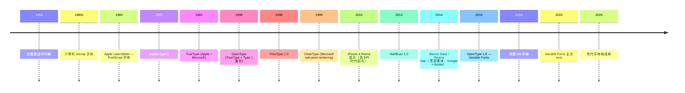

# 00-29 — 字体 + 渲染引擎演化（bitmap → TrueType → OpenType / Variable / FreeType / HarfBuzz）

>
> **一句话答案：** 字体技术 = **字形定义 + 形状 / shaping + 渲染 / rasterization**。50 年从 bitmap → TrueType（贝塞尔曲线）→ OpenType（高级排版）→ Variable Fonts（一文件多字重）。**FreeType（栅格化）+ HarfBuzz（shaping）+ Skia/Cairo（合成）**是开源字体栈三巨头。


---

## 1. 历史时间轴



---

## 2. 字体格式演化

### 2.1 Bitmap 字体

```
每字符 = 一个像素矩阵
缺点：放大锯齿
优点：渲染极快
```

例：BDF / PCF / FON / .fnt
现代：仍用于嵌入式 LCD（Cozette / Cocoa-bitmap）

### 2.2 PostScript / Type 1（Adobe，1985）

- 矢量字体（曲线描述）
- Adobe 私有
- 印刷工业标准

### 2.3 TrueType（Apple + Microsoft，1991）

- 矢量 + hinting
- 二次贝塞尔曲线
- Apple 给 Mac OS，授权给 Microsoft 给 Windows
- 文件 .ttf

### 2.4 OpenType（1996）

- TrueType + Type 1 整合
- 加高级排版特性：
  - 连字（ligatures）
  - 字体替代（substitutions）
  - 多语言切换
- 文件 .otf / .ttf
- **现代主流**

### 2.5 Variable Fonts / OpenType 1.8（2016）

```
一个 .ttf 文件包含多个 axis：
  weight: 100 (Thin) → 900 (Black)
  width: 50 (Condensed) → 200 (Expanded)
  italic / slant
  optical size
  自定义 axis
```

- 一个文件 = 多种字重
- 文件大小变小
- web 加载快
- Apple / Google / Adobe 推

### 2.6 WOFF / WOFF2

- Web Open Font Format
- TrueType / OpenType 压缩 + web 友好
- WOFF2 用 Brotli（小 30%）

### 2.7 SVG 字体 / Color 字体

- SVG-in-OpenType（emoji 用）
- COLR / CPAL 表（多色字体）
- Apple SBIX / Google CBDT

### 2.8 SDF（Signed Distance Field）

- 现代游戏 / GUI 用
- 矢量风格但 GPU 友好
- 任意缩放无锯齿

---

## 3. 字体渲染流水线

```
1. 字符 → glyph 选择
   - U+4F60 ('你') → glyph index 1234 in 思源黑体

2. Shaping（关键，HarfBuzz 做）
   - 阿拉伯：连字 / 字母位置（initial / medial / final）
   - 印地语：字组重排
   - CJK：标点 / 间距
   - emoji：ZWJ 序列（👨‍👩‍👧）

3. Layout（排版）
   - 行布局 / 段落 / 对齐 / 换行
   - kerning（字间距）
   - 框架：Pango / ICU / Apple TextKit

4. Rasterization（FreeType 做）
   - 贝塞尔曲线 → 像素
   - hinting（小尺寸字体清晰）
   - sub-pixel rendering（ClearType）
   - anti-aliasing

5. Composition（Skia / Cairo）
   - 字符像素 → 图层
   - 颜色 / 阴影 / 滤镜
   - GPU 加速

6. 上屏（Display server）
   - X11 / Wayland 合成
```

---

## 4. 字体渲染开源栈

### 4.1 FreeType（栅格化）

- 1996 起，David Turner
- 把矢量字体转像素
- 几乎所有 Linux / Android / iOS 用
- 核心栅格化器

### 4.2 HarfBuzz（shaping）

- 2010s 起，独立项目
- 处理复杂脚本（阿拉伯 / 印地语 / 藏文 / emoji）
- Linux / Android / Firefox / Chrome / LibreOffice

### 4.3 Pango（layout）

- GNOME 用
- 文本布局 + 段落
- 与 HarfBuzz / FreeType 配合

### 4.4 ICU（Unicode 库）

- Microsoft / IBM 主推
- 大型多语言库
- BiDi（双向）/ collation / break iterator

### 4.5 Skia（合成 + 2D 图形）

- Google 主导
- Chrome / Android / Flutter 默认 2D
- 支持 GPU 加速（Vulkan / Metal / OpenGL）

### 4.6 Cairo（2D 图形）

- 老 GTK / Mozilla 用
- 跨平台 vector 2D
- 现代渐淘汰（GNOME 转 Skia）

### 4.7 fontconfig（字体匹配）

- Linux 字体管理
- "系统装了哪些字体 / 选哪个匹配请求"

### 4.8 完整栈示例

```
应用文本 "Hello 你好"
   ↓ ICU BiDi + break
   ↓ HarfBuzz shape (Latin + CJK)
   ↓ FreeType raster (Source Sans + 思源黑)
   ↓ Skia / Cairo 合成
   ↓ 显示
```

---

## 5. CJK 字体特殊性

### 5.1 字数

- 拉丁字符：~200
- 日文假名 + 常用汉字：~3000-5000
- 中文 GB2312：6,763 字
- 中文 GBK：21,003
- Unicode CJK 统一汉字：~95,000+
- CJK 字体文件：10-30 MB（巨大）

### 5.2 主流 CJK 字体

| 字体 | 来源 | 特点 |
|------|------|------|
| **思源黑体 (Source Han Sans)** | Google + Adobe 2014 | 开源，多语言 |
| **思源宋体 (Source Han Serif)** | 同 | 开源 serif |
| **鸿蒙 Sans (HarmonyOS Sans)** | 华为 2019 | 鸿蒙系统字体 |
| **OPPO Sans** | OPPO | 商业 |
| **小米兰亭** | 小米 | 商业 |
| **苹方 (PingFang)** | Apple | iOS / macOS 中文 |
| **微软雅黑** | Microsoft + 方正 | Windows 中文 |
| **Noto CJK** | Google | 同思源（不同名）|
| **方正 / 汉仪 / 文鼎** | 商业字库 | 印刷 |

### 5.3 Han Unification

Unicode 把中日韩相同汉字合并到一个码点 → 字体需要按 locale 显示不同字形。

```
U+8FBA  
- ja: 辺
- ko: 邊  
- zh-TW: 邊
- zh-CN: 边
```

→ 字体文件中带"locl"特性区分 (OpenType locale)。

### 5.4 中文字体文件大小

- 单字重思源黑：~16 MB
- 7 字重思源黑系列：~100+ MB
- Variable Font 优化后：~30 MB

→ Web 加载是挑战，常做子集化（subset）。

---

## 6. 现代渲染特性

### 6.1 Sub-pixel Rendering

- **ClearType (Microsoft)** — 用 RGB 子像素提清晰度
- **CoolType (Adobe)** — Adobe 同类
- **现代 4K/Retina 屏幕需求降低**

### 6.2 字体 hinting

- 小尺寸（10-14 px）让字形更清晰
- 自动 hint（autohinter）vs 手工（TrueType bytecode）
- macOS 不用 hinting（Retina + 抗锯齿即可）

### 6.3 GPU 字体渲染

- SDF（Signed Distance Field）
- Slug / Pathfinder 等 GPU 字体引擎
- WebGL / Metal / Vulkan 直接渲染

### 6.4 Variable Fonts 优化

- web font 大小减少 50-80%
- 动画字体（weight 平滑变化）
- 平台支持（Chrome 62+ / Firefox 62+ / Safari 11+ / iOS 11+）

---

## 7. 嵌入式字体

### 7.1 LCD 字体（嵌入 Linux）

- LVGL 内置字体（[00-16-display](00-22-display-evolution.md)）
- bitmap 字体（小尺寸快）
- TrueType 子集（够用即可）

### 7.2 LCD 段码 / 七段数码管

- 不算字体，硬编码图样

### 7.3 终端字体

- VT100 风格 ASCII bitmap
- 现代 framebuffer console（Linux fbcon）

---


### 8.1 短期：text console

- VGA-style bitmap 字体
- ASCII 优先
- 可选 UTF-8 + 简化字符集

### 8.2 中期：framebuffer + bitmap

- 嵌入式 fbcon
- 内置一两个 bitmap 字体（如 Cozette + Cocoa-bitmap）
- 支持基本 UTF-8

### 8.3 远期：完整字体栈

```
  应用
   ↓
  utf8proc（已在 libc/）
   ↓
  HarfBuzz (移植)
   ↓
  FreeType (移植)
   ↓
  Skia 简化版 / 自研 (远期)
   ↓
  显示层（具体项目设计由用户学完后自定）
```

### 8.4 借鉴

| 来自 | 借鉴 |
|------|------|
| FreeType | 字体栅格化 |
| HarfBuzz | shaping |
| LVGL | 嵌入式字体集成 |
| Skia | 现代合成 |

---

## 9. 名词词典

| 术语 | 含义 |
|------|------|
| **glyph** | 字形（字符的视觉表现）|
| **typeface** | 字体（设计风格）|
| **font** | 字体文件 |
| **font family** | 字体家族（Regular/Bold/Italic）|
| **weight** | 字重（100-900）|
| **style** | 风格（normal/italic/oblique）|
| **width** | 宽度（condensed/regular/expanded）|
| **kerning** | 字间距调整 |
| **ligature** | 连字（fi → fi）|
| **shaping** | 字形重排（HarfBuzz 工作）|
| **rasterization** | 栅格化（vector → pixel）|
| **hinting** | 提示（小尺寸清晰）|
| **anti-aliasing** | 抗锯齿 |
| **sub-pixel rendering** | 子像素渲染 |
| **TrueType / OpenType** | 字体格式 |
| **Variable Font** | 可变字体 |
| **WOFF / WOFF2** | Web 字体 |
| **SDF** | Signed Distance Field |
| **FreeType / HarfBuzz / Pango / ICU / Skia / Cairo** | 字体栈库 |
| **fontconfig** | Linux 字体匹配 |
| **CJK** | 中日韩 |
| **Han unification** | 汉字统一编码 |
| **subset** | 字体子集化 |
| **font hinting / instructions** | 字形提示 |

---

## 10. 进一步阅读

### 10.1 经典书 / 资源

- ***Designing for Print*** — 字体设计
- ***Thinking with Type*** — Ellen Lupton
- [FreeType 官网](https://freetype.org/)
- [HarfBuzz 官网](https://harfbuzz.github.io/)
- [Variable Fonts](https://variablefonts.io/)

### 10.2 视频

- [The Tao of Variable Fonts](https://www.youtube.com/results?search_query=variable+fonts)

### 10.3 本仓库笔记串联

- [00-30-charset-i18n-evolution](00-30-charset-i18n-evolution.md) — 字符编码（与字形不同）
- [00-22-display-evolution](00-22-display-evolution.md) — 显示系统
- [00-28-input-method-evolution](00-28-input-method-evolution.md) — 输入法（输入端）
- [00-24-gpu-graphics-evolution](00-24-gpu-graphics-evolution.md) — GPU 字体加速

### 10.4 本仓库本地资料

| 路径 | 用途 |
|------|------|
| `libc/utf8proc/` | UTF-8 字符处理 |

