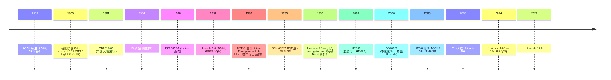
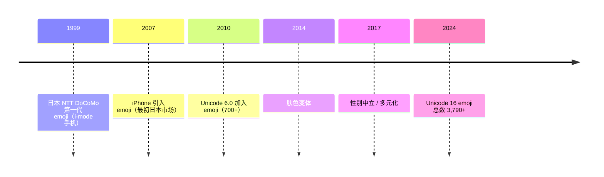

# 00-30 — 字符编码 + 国际化（i18n）演化

>
> **一句话答案：** 字符编码 = **字符集（哪些字符）+ 编码方式（怎么变字节）**。50 年从 ASCII（128 字符）演化到 Unicode（150K+ 字符）+ UTF-8（变长 1-4 字节）。**所有现代 OS / web / 文件系统都应用 UTF-8**。


---

## 1. 历史时间轴



---

## 2. 字符编码三要素

```
1. 字符集（Character Set）— 哪些字符存在
   例：ASCII / Unicode / GB2312 / Big5

2. 码点（Code Point）— 字符 → 数字
   例：'A' = U+0041 / '中' = U+4E2D / '😀' = U+1F600

3. 编码（Encoding）— 数字 → 字节序列
   例：UTF-8 / UTF-16 / UTF-32 / GBK
```

**关键认知：** 字符集和编码**是两件事**——同一个字符集（如 Unicode）可有多种编码（UTF-8 / UTF-16 / UTF-32）。

---

## 3. ASCII（1963）

- 7-bit，128 字符
- 控制字符（0-31）+ 可打印（32-126）+ DEL（127）
- 美国信息交换标准 — 主导英文世界

```
'A' = 0x41 = 65
'a' = 0x61 = 97
'0' = 0x30 = 48
'\n' = 0x0A = 10
```

---

## 4. 8-bit 扩展（各国百花齐放，1980s）

ASCII 只够英语，各国加 128-255 字节扩展：

| 编码 | 用途 |
|------|------|
| **ISO 8859-1 / Latin-1** | 西欧（法德西意）|
| **ISO 8859-5** | 西里尔（俄）|
| **ISO 8859-7** | 希腊 |
| **Windows-1252** | Windows 西欧 |
| **GB2312** (1981) | 中文简体（6,763 个汉字）|
| **GBK** (1995) | GB2312 扩展（21,003 字符）|
| **GB18030** (2000) | 国标全 Unicode 兼容 |
| **Big5** (1984) | 中文繁体（13,053 汉字）|
| **Shift-JIS** | 日文 |
| **EUC-KR** | 韩文 |
| **EUC-JP** | 日文（Unix）|

**问题：** 多语言混合时谁是谁？发邮件 / 网页跨境频繁乱码。

---

## 5. Unicode（1991+）

### 5.1 设计目标

> 一个字符集统一全世界所有文字。

- 1.0 (1991)：16-bit，65,536 字符
- 2.0 (1996)：surrogate pair 突破 16-bit
- 当前 (2024)：154,998 字符

### 5.2 Unicode 平面（Plane）

```
Plane 0 (BMP)：U+0000 - U+FFFF — 大多数现代文字
Plane 1 (SMP)：U+10000 - U+1FFFF — 历史文字 / emoji
Plane 2-13: 历史 / 私用
Plane 14: 标签 / 选择器
Plane 15-16: 私用区
```

总码点空间：U+0000 - U+10FFFF（17 平面 × 65536）。

### 5.3 重要范围

| 范围 | 内容 |
|------|------|
| U+0020-007E | ASCII 可打印 |
| U+4E00-9FFF | CJK 统一汉字（基本）|
| U+3400-4DBF | CJK 扩展 A |
| U+20000-2A6DF | CJK 扩展 B |
| U+1F600-1F64F | Emoji 表情 |
| U+0080-00FF | Latin-1 补充 |
| U+0400-04FF | 西里尔 |
| U+0590-05FF | 希伯来 |
| U+0600-06FF | 阿拉伯 |

### 5.4 中文相关 Unicode 区

CJK = 中日韩统一汉字（Han Unification 争议）：
- U+4E00 - U+9FFF：常用 20,992 字
- U+3400 - U+4DBF：扩展 A
- U+20000 - U+2A6DF：扩展 B
- 持续增加（生僻字 / 异体字）

---

## 6. UTF 编码方案

### 6.1 UTF-8（变长 1-4 字节）

**Ken Thompson + Rob Pike 1993 餐巾纸设计**：

```
U+0000  - U+007F   : 1 byte  0xxxxxxx (兼容 ASCII)
U+0080  - U+07FF   : 2 bytes 110xxxxx 10xxxxxx
U+0800  - U+FFFF   : 3 bytes 1110xxxx 10xxxxxx 10xxxxxx
U+10000 - U+10FFFF : 4 bytes 11110xxx 10xxxxxx 10xxxxxx 10xxxxxx
```

特点：
- ✅ 兼容 ASCII（1 字节）
- ✅ 自同步（10xxxxxx 是后续字节）
- ✅ 不区分大端小端
- ✅ web / Linux / macOS / 现代主流
- ❌ 中文 3 字节（占用比 GBK 多 1 字节）

### 6.2 UTF-16（2 或 4 字节）

```
BMP (U+0000 - U+FFFF)：直接 2 字节
SMP (U+10000+)：surrogate pair，4 字节
```

- Java / Windows / JavaScript 内部用
- 大端 / 小端 区分（带 BOM 0xFEFF）

### 6.3 UTF-32（固定 4 字节）

- 简单：每个字符固定 32 位
- 浪费空间
- 较少使用

### 6.4 BOM（字节顺序标记）

```
UTF-8 BOM:    EF BB BF
UTF-16 LE BOM: FF FE
UTF-16 BE BOM: FE FF
```

UTF-8 不需要 BOM 但 Windows Notepad 喜欢加（导致 Linux 工具识别问题）。

---

## 7. 中文编码细节

### 7.1 GB18030（中国国标）

- 2000 年推出
- 1 / 2 / 4 字节变长
- 兼容 GBK + 包含 Unicode 补充
- **中国软件法定支持**（信创）

### 7.2 中文乱码常见原因

```
GBK 文本被当 UTF-8 解 → 乱码
UTF-8 文本被当 GBK 解 → 乱码
缺 BOM 时编辑器猜错
Windows-1252 被当 UTF-8
邮件 MIME 头错
HTTP Content-Type 缺 charset
HTML <meta charset> 错
```

### 7.3 现代解决：全 UTF-8

- 文件内容 UTF-8
- 文件名 UTF-8（NTFS / ext4 主流）
- HTTP 头 Content-Type: text/html; charset=utf-8
- HTML <meta charset="UTF-8">
- 数据库 utf8mb4（MySQL，覆盖 emoji）

---

## 8. Emoji 演化



技术细节：
- **基础 emoji**：单码点 U+1F600 etc.
- **修饰**：肤色 = ZWJ (Zero-Width Joiner) U+200D + 修饰符
- **复合**：👨‍👩‍👧 = 👨 ZWJ 👩 ZWJ 👧（3 个 ZWJ 序列）
- **国旗**：U+1F1E6 + U+1F1E8 = 🇨🇨（两个 regional indicator）

---

## 9. 国际化（i18n）/ 本地化（l10n）

### 9.1 概念

- **i18n** (internationalization) = 18 个字母，让软件**支持**多语言
- **l10n** (localization) = 10 个字母，**翻译到**特定语言
- **g11n** (globalization) = 整体策略

### 9.2 i18n 关键问题

1. **字符串外置**（不硬编码）— gettext / ICU
2. **日期 / 时间格式**（YYYY-MM-DD vs DD/MM/YYYY）
3. **数字格式**（1,000.00 vs 1.000,00）
4. **货币**（$ vs ¥ vs €）
5. **方向**（LTR 拉丁 vs RTL 阿拉伯 / 希伯来）
6. **复数规则**（英语 1 个 / 多个 / 俄语 1/2-4/5+ 三种 / 阿拉伯 6 种）
7. **排序**（中文按笔画 / 拼音 / Unicode）
8. **大小写**（土耳其的 i / I 特殊）
9. **字体**（CJK / Arabic 字体兼容）

### 9.3 主流 i18n 库

| 库 | 语言 |
|----|------|
| **GNU gettext** | C / 各语言 |
| **ICU** (International Components for Unicode) | C++ / Java |
| **Boost.Locale** | C++ |
| **fluent** (Mozilla) | 现代 |
| **i18next** | JS |
| **fluent_rs / sys-locale** | Rust |
| **Java Locale + ResourceBundle** | Java |

### 9.4 locale

```
en_US.UTF-8       — 美国英语
zh_CN.UTF-8       — 中国简体
zh_TW.UTF-8       — 中国台湾繁体
ja_JP.UTF-8       — 日本
en_GB.UTF-8       — 英国英语
de_DE.UTF-8       — 德国
ar_SA.UTF-8       — 沙特阿拉伯（RTL）
```

### 9.5 时区

- IANA tzdata（每年几次更新）
- /etc/localtime / /etc/timezone
- 历史时区（夏令时 / 历史变更）— 数据量惊人

详见 [00-38-time-sync-evolution](00-38-time-sync-evolution.md)。

---


### 10.1 现代 OS 起步默认 UTF-8（行业共识）

- 内核：UTF-8 处理路径名 / 文件内容
- shell：UTF-8 输入 / 输出
- console：UTF-8 输出（VT100 兼容）


### 10.2 库选择

| 用途 | 库 |
|------|---|
| 字符串处理 | **utf8proc**（本仓库 `libc/utf8proc/`）|
| Unicode 数据库 | utf8proc |
| 排序 / collation | ICU（远期）|
| 字体渲染 | HarfBuzz（[00-29](00-29-font-rendering-evolution.md)）|

### 10.3 远期 i18n

- gettext 风格 .po 文件
- locale 数据嵌入 / 外置
- RTL 支持（远期）
- 输入法（[00-28](00-28-input-method-evolution.md)）

---

## 11. 名词词典

| 术语 | 含义 |
|------|------|
| **character set** | 字符集 |
| **encoding** | 编码 |
| **code point** | 码点 |
| **glyph** | 字形（字符的视觉表现）|
| **grapheme cluster** | 字素簇（用户视为单字符的多码点组合）|
| **ASCII** | American Standard Code for Information Interchange |
| **Unicode** | 通用字符集 |
| **UTF-8 / 16 / 32** | Unicode 编码方案 |
| **BMP** | Basic Multilingual Plane |
| **SMP** | Supplementary Multilingual Plane |
| **CJK** | 中日韩统一汉字 |
| **surrogate pair** | UTF-16 突破 16-bit 机制 |
| **BOM** | Byte Order Mark |
| **emoji** | 表情符号 |
| **ZWJ** | Zero-Width Joiner |
| **i18n / l10n / g11n** | 国际化 / 本地化 / 全球化 |
| **locale** | 区域设置 |
| **gettext** | GNU 翻译框架 |
| **ICU** | International Components for Unicode |
| **collation** | 排序规则 |
| **RTL / LTR** | 右向左 / 左向右 |
| **tzdata** | 时区数据库 |

---

## 12. 进一步阅读

### 12.1 经典书 / 资料

- ***Unicode Explained*** — Jukka Korpela
- ***Programming with Unicode*** — Victor Stinner（免费在线）
- [Unicode 官网](https://unicode.org/)
- [UTF-8 设计 1993 餐巾纸故事](https://www.cl.cam.ac.uk/~mgk25/ucs/utf-8-history.txt)

### 12.2 本仓库笔记串联

- [00-08-lang-evolution](00-08-lang-evolution.md) — 语言中字符串处理
- [00-28-input-method-evolution](00-28-input-method-evolution.md) — 输入法
- [00-29-font-rendering-evolution](00-29-font-rendering-evolution.md) — 字体 / 字形

### 12.3 本仓库本地资料

| 路径 | 用途 |
|------|------|
| `libc/musl/src/locale/` | musl locale 实现 |
