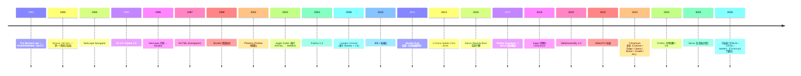

# 00-31 — Web 与浏览器演化（Mosaic → Chromium / Firefox / WebKit）

> **核心问题：** Mosaic → Netscape → IE → Chromium / Firefox / Safari 演化中浏览器从"看 HTML"变成"运行 SPA + WebGPU"。三大引擎（Blink / Gecko / WebKit）什么区别？JS 引擎 V8 / SpiderMonkey / JavaScriptCore 怎么演化？WebAssembly 是什么？
>
> **一句话答案：** 浏览器是**当代最复杂软件之一**——HTML 解析 + CSS 渲染 + JS 引擎 + 网络栈 + 沙箱 + 硬件加速 + DRM + ...。30 年从 Mosaic 1MB 演化到 Chromium 30M+ LOC。三大渲染引擎（Blink / Gecko / WebKit）+ 三大 JS 引擎（V8 / SpiderMonkey / JavaScriptCore）。

按 [user_learning_style](../CLAUDE.md) 5 步：① 大框架 → ② 历史 → ③ 引擎对比 → ④ JS 引擎 → ⑤ WebAssembly + 现代 web。

---

## 1. 历史时间轴



---

## 2. 三大渲染引擎

### 2.1 Blink（Chromium / Chrome / Edge / Opera）

- 2013 Google 从 WebKit fork
- C++，30M+ LOC
- 主导浏览器市场（占比 75%+）
- 项目：Chromium / Chrome / Edge / Opera / Brave / Vivaldi / Arc / Comodo / Yandex / 国产 360 / QQ / 搜狗 / UC

### 2.2 Gecko（Firefox）

- Mozilla 主导
- C++ + 渐进 Rust 化
- Firefox / Thunderbird / Tor Browser
- 市场份额下滑（< 3%）

### 2.3 WebKit（Safari / iOS WebView）

- Apple 主导
- 1998 KHTML fork → WebKit
- Safari / iOS Safari / WebView (UIWebView/WKWebView)
- 苹果生态主力

### 2.4 三引擎对比

| 维度 | Blink | Gecko | WebKit |
|------|-------|-------|--------|
| 厂家 | Google | Mozilla | Apple |
| 代码 | C++ | C++ + Rust | C++ |
| LOC | ~30M | ~25M | ~15M |
| 市场份额 | 75% | 3% | 18% (iOS 强制) |
| 开源 | ✅ | ✅ | ✅ |
| iOS 强制 | iOS 上 Chrome 用 WebKit | 同 | 同 |

→ **iOS 上所有浏览器都强制用 WebKit**（Apple 政策，欧盟正在打破）。

---

## 3. JavaScript 引擎

### 3.1 主流 JS 引擎

| 引擎 | 浏览器 | 厂家 |
|------|--------|------|
| **V8** | Chrome / Edge / Opera / Node.js / Deno | Google |
| **SpiderMonkey** | Firefox | Mozilla |
| **JavaScriptCore (JSC) / Nitro** | Safari / Bun | Apple |
| **Hermes** | React Native | Meta |
| **QuickJS** | 嵌入式 | Fabrice Bellard |
| **Duktape** | 嵌入式 | 开源 |
| **ChakraCore** | 老 IE / Edge Legacy | Microsoft（已弃）|

### 3.2 JS 引擎演化（V8 为例）

```
2008 V8 1.0 — JIT 编译（Crankshaft）
2017 V8 6 — TurboFan + Ignition (interpreter + 优化 JIT)
2018 V8 7 — Liftoff (Wasm baseline JIT)
2020 V8 8 — Sparkplug (中间 JIT) + Maglev
2024 V8 12 — Maglev 主流，性能逼近 C
```

**多层 JIT 架构（V8 现代）：**

```
源码
  ↓
Ignition (interpreter) — 启动快
  ↓ (热代码)
Sparkplug (baseline JIT) — 简单 JIT
  ↓
Maglev (mid-tier JIT) — 中等优化
  ↓
TurboFan (optimizing JIT) — 极致优化
```

详见 [00-08-lang-evolution](00-08-lang-evolution.md) § 7.4 JIT。

### 3.3 Node.js / Deno / Bun

JS 引擎 + 系统层 = 服务器 JS：

| 项目 | 引擎 | 一句话 |
|------|------|--------|
| **Node.js** | V8 | 主流（2009+，Ryan Dahl）|
| **Deno** | V8 | TypeScript 原生 + 安全（Ryan Dahl 重做）|
| **Bun** | JavaScriptCore | 极快（2022，Jarred Sumner）|
| **Cloudflare Workers** | V8 isolate | 边缘函数 |

---

## 4. Web 标准与历史

### 4.1 HTML 演化

```
HTML 1.0 (1991) — Tim Berners-Lee
HTML 2.0 (1995)
HTML 4.01 (1999) — 统治多年
XHTML 1.0 (2000) — XML 化（失败）
HTML5 (2014) — 现代 web 起点
HTML Living Standard (WHATWG, 2014+) — 持续更新
```

### 4.2 CSS 演化

```
CSS 1 (1996)
CSS 2 (1998) — 主流
CSS 3 (2009+ 模块化) — 渐进
CSS Grid (2017)
Container Queries (2022)
:has() (2023)
CSS Nesting (2023)
View Transitions (2024)
```

### 4.3 JavaScript / ECMAScript

```
ES1 (1997)
ES3 (1999) — IE 主流
ES5 (2009)
ES6 / ES2015 — 大改版（class / arrow / let / const / Promise / module）
ES2016+ — 每年一版
```

### 4.4 现代 Web API（部分）

- WebGL / WebGPU — 图形
- WebRTC — 实时通信
- WebSocket / Server-Sent Events
- Service Worker / PWA — 离线
- WebAssembly — 沙箱字节码
- Web Audio / Web MIDI
- WebUSB / WebSerial / WebBluetooth — 硬件
- IndexedDB / WebStorage — 存储
- Web Animations API
- Fetch API / Streams API
- Web Share / Push API

---

## 5. WebAssembly（Wasm）

### 5.1 概念

- 2015 起设计，2017 1.0 标准
- 浏览器中跑**沙箱化二进制**（不限于 JS）
- 可从 C / C++ / Rust / Go / Zig 编译
- 性能逼近 native（比 JS 快 1.5-3×）

### 5.2 演化

```
2017 Wasm 1.0 — 基础
2019 Multi-value / 引用类型
2020 SIMD
2022 Threads
2023 GC / Tail calls
2024 Wasm 2.0 起草
2024 Component Model — 模块化
```

### 5.3 WASI（WebAssembly System Interface）

- 让 Wasm 跑在浏览器外
- 提供 syscall 抽象（filesystem / network / clock）
- 替代轻量容器趋势

### 5.4 Wasm 运行时

| 运行时 | 一句话 |
|--------|--------|
| **Wasmtime** | Bytecode Alliance 官方 |
| **WasmEdge** | CNCF，云原生 Wasm |
| **Wasmer** | 商业 + 开源 |
| **wazero** | Go 实现，无外部依赖 |
| **wasm3** | 极小解释器（嵌入式）|
| **WAMR** | Intel WebAssembly Micro Runtime |

---

## 6. 浏览器架构（现代多进程）

```
┌─────────────────────────────────────────────┐
│ Browser Process (主)                       │
│  — UI / 网络 / 存储 / 设置                 │
└─────────────────────────────────────────────┘
       ↕ IPC
┌─────────────────────────────────────────────┐
│ Renderer Process (每 site/tab 一个)         │
│  — HTML/CSS/JS                            │
│  — 沙箱化（无文件 / 网络访问）             │
└─────────────────────────────────────────────┘
       ↕
┌─────────────────────────────────────────────┐
│ GPU Process — 硬件加速渲染                  │
│ Network Process — 共享网络栈                │
│ Plugin Process — 插件                       │
│ Audio Service — 共享音频                    │
└─────────────────────────────────────────────┘
```

→ Site Isolation（Chromium）每 site 独立进程，安全 + 内存隔离。

---

## 7. 服务端 web 框架（简提）

### 7.1 后端

| 语言 | 框架 |
|------|------|
| Node.js | Express / Fastify / NestJS |
| Python | Django / Flask / FastAPI |
| Ruby | Rails |
| PHP | Laravel / Symfony |
| Java | Spring Boot |
| Go | Gin / Echo / Fiber |
| Rust | actix-web / axum / Rocket |
| Elixir | Phoenix |
| .NET | ASP.NET Core |

### 7.2 前端

| 框架 | 一句话 |
|------|--------|
| **React** | Meta，主流 |
| **Vue** | 中国 + 全球开发者欢迎 |
| **Angular** | Google 企业 |
| **Svelte / SvelteKit** | 编译时框架 |
| **Solid** | 细粒度响应 |
| **Qwik** | Resumability |
| **HTMX** | 无 JS 异端 |
| **Astro** | 内容站 |
| **Next.js** | React + SSR 全栈 |
| **Nuxt.js** | Vue 全栈 |
| **Remix** | React 全栈 |

---


### 8.1 短期：无浏览器


### 8.2 远期可选

- 移植 **lynx / w3m / elinks** 文本浏览器（低优先）
- 移植 **NetSurf**（轻量浏览器）
- 移植 **Firefox / Chromium**（远期，需要完整 Linux ABI 兼容）

---

## 9. 名词词典

| 术语 | 含义 |
|------|------|
| **DOM** | Document Object Model |
| **CSSOM** | CSS Object Model |
| **Render Tree** | 渲染树 |
| **Layout / Reflow** | 布局 |
| **Paint** | 绘制 |
| **Compositing** | 合成 |
| **GPU rasterization** | GPU 光栅化 |
| **JIT** | Just-in-Time compilation |
| **ECMAScript / ES** | JS 标准名 |
| **WHATWG** | Web Hypertext Application Technology Working Group |
| **W3C** | World Wide Web Consortium |
| **PWA** | Progressive Web App |
| **SPA** | Single Page Application |
| **SSR / SSG** | Server-Side Rendering / Static Site Generation |
| **WebAssembly / Wasm** | 浏览器字节码 |
| **WASI** | WebAssembly System Interface |
| **CORS** | Cross-Origin Resource Sharing |
| **CSP** | Content Security Policy |
| **HSTS** | HTTP Strict Transport Security |

---

## 10. 进一步阅读

### 10.1 经典书

- ***High Performance Browser Networking*** — Ilya Grigorik（免费）
- ***JavaScript: The Good Parts*** — Crockford
- ***You Don't Know JS*** — Kyle Simpson
- ***Eloquent JavaScript*** — Marijn Haverbeke

### 10.2 视频 / 资源

- [Chrome 官方架构介绍](https://developer.chrome.com/docs/extensions/mv3/architecture-overview/)
- [Servo 项目](https://servo.org/) — Mozilla Rust 浏览器
- [Mozilla Hacks Blog](https://hacks.mozilla.org/)

### 10.3 本仓库笔记串联

- [00-21-network-stack-evolution](00-21-network-stack-evolution.md) — HTTP/3
- [00-08-lang-evolution](00-08-lang-evolution.md) — JS / TypeScript / Wasm
- [00-24-gpu-graphics-evolution](00-24-gpu-graphics-evolution.md) — WebGL / WebGPU
- [00-34-container-cloud-evolution](00-34-container-cloud-evolution.md) — Wasm vs 容器

### 10.4 本仓库本地资料

