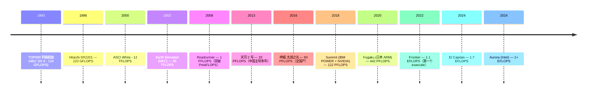

# 00-32 — 科学计算 + HPC + 数学计算库 + 信创超算演化

>
> **一句话答案：** 科学计算 = **数值算法 + 高性能编程 + 并行硬件**。70 年从 FORTRAN + IBM 大型机演化到 Python NumPy + GPU 集群。**BLAS / LAPACK** 是几乎所有数值库的底层；**MPI + OpenMP** 是并行编程标准；**TOP500 超算**演化映射半导体技术演化。


---

## 1. 历史时间轴

```mermaid
timeline
    1957 : FORTRAN — 第一个高级语言（专为科学计算）
    1960 : ALGOL 60 — 数学符号化
    1972 : LINPACK — 数值线性代数库（Cleve Moler）
    1979 : BLAS Level 1
    1988 : LAPACK — 接班 LINPACK
    1984 : MATLAB（基于 LINPACK）
    1989 : NumPy 前身 numarray
    1991 : Python 1.0
    1993 : MPI 1.0 标准
    1995 : ATLAS — 自动调优 BLAS
    1995 : Fortran 95
    1996 : OpenMP — 多核并行
    2002 : MATLAB → MATLAB 7
    2006 : NumPy 1.0
    2007 : Cython
    2007 : CUDA
    2009 : TOP500 - Cray Jaguar
    2010 : Intel MKL 普及
    2012 : Julia 0.1 (MIT)
    2013 : 天河 2 号 (中国 #1)
    2016 : 神威·太湖之光（全国产）— 国产超算 #1
    2018 : Frontier 设计 (Cray + AMD)
    2020 : Fugaku（日本 ARM 超算）
    2022 : Frontier — 第一个 exascale (10^18 FLOPS)
    2024 : El Capitan — 第二台 exascale
    2024 : MindOpt（阿里）/ JuML 等国产 / Julia 框架
    2026 : 中国 Aurora 衍生 / 太湖后续
```



---

## 2. 数值计算库谱系

### 2.1 BLAS（Basic Linear Algebra Subprograms）

**最底层 — 几乎所有数值库都依赖 BLAS。**

```
Level 1: 向量操作（dot / axpy / scale）— 1979
Level 2: 矩阵-向量（gemv）— 1984
Level 3: 矩阵-矩阵（gemm）— 1988
```

实现：

| 实现 | 厂家 | 一句话 |
|------|------|--------|
| **Reference BLAS** | Netlib | 慢但正确 |
| **OpenBLAS** | 社区 | 开源，常用 |
| **Intel MKL** | Intel | 商业最快（Intel CPU）|
| **BLIS** | UT Austin | 现代高性能 |
| **ATLAS** | UTK | 自动调优（已老）|
| **Apple Accelerate** | Apple | macOS / iOS |
| **AMD AOCL** | AMD | AMD 优化 |
| **NVIDIA cuBLAS** | NVIDIA | GPU 上 BLAS |
| **AOCL / KMKL** | 阿里 / 华为 | 国产优化 |

### 2.2 LAPACK（Linear Algebra PACKage）

基于 BLAS 的高阶算法：
- 矩阵求逆 / 求解线性方程组
- 特征值 / 奇异值分解
- QR / LU / Cholesky 分解

实现：Reference / Intel MKL / OpenBLAS（含 LAPACK）/ ScaLAPACK（分布式）

### 2.3 FFTW（Fastest Fourier Transform in the West）

- MIT 1997
- 自动选最优算法
- FFT 之事实标准

### 2.4 主流数值库（基于 BLAS / LAPACK / FFTW）

| 库 | 语言 | 一句话 |
|----|------|--------|
| **NumPy** | Python | Python 数值之神 |
| **SciPy** | Python | 科学算法 |
| **MATLAB** | 私有 | 商业老牌 |
| **GNU Octave** | C++ | MATLAB 开源替代 |
| **Julia** | Julia | 现代科学计算语言 |
| **R** | R | 统计 |
| **Eigen** | C++ | 模板元编程 |
| **Armadillo** | C++ | 类 MATLAB API |
| **xtensor** | C++ | 类 NumPy |
| **JuML** | Julia | Julia ML 包合集 |
| **MindOpt** | 阿里 | 优化求解器 |

---

## 3. 数学求解器（Optimization）

### 3.1 商业求解器

| 求解器 | 厂家 | 一句话 |
|--------|------|--------|
| **CPLEX** | IBM | 老牌 LP / MIP |
| **Gurobi** | Gurobi Inc. | 现代最快 |
| **MOSEK** | MOSEK | 凸优化强 |
| **Xpress** | FICO | 经典 LP |
| **MindOpt** | 阿里达摩院 | 国产，2024 取得 LP 世界第一 |
| **COPT** | 杉数 | 国产新秀 |

### 3.2 开源求解器

| 求解器 | 一句话 |
|--------|--------|
| **GLPK** | GNU LP solver |
| **CBC / CLP** | COIN-OR |
| **HiGHS** | 现代开源 LP/MIP |
| **SCIP** | 开源 MIP（学术）|
| **Ipopt** | 非线性 |
| **OSQP** | QP 二次规划 |

### 3.3 建模语言

| 语言 | 一句话 |
|------|--------|
| **AMPL** | 经典商业 |
| **GAMS** | 同 |
| **Pyomo** | Python 开源 |
| **JuMP** | Julia 开源 |
| **CVXPY** | Python 凸优化 |
| **Gekko** | 动态优化 |

---

## 4. 并行编程模型

### 4.1 共享内存：OpenMP

```c
#pragma omp parallel for
for (int i = 0; i < N; i++) {
    a[i] = b[i] + c[i];
}
```

- 1996 起，多 CPU 多线程
- C / C++ / Fortran
- 编译器实现（GCC / Clang / Intel / IBM）

### 4.2 分布式：MPI（Message Passing Interface）

```c
MPI_Send(&data, count, MPI_INT, dest_rank, tag, MPI_COMM_WORLD);
MPI_Recv(&data, count, MPI_INT, src_rank, tag, MPI_COMM_WORLD, &status);
```

- 1993 标准
- 跨节点（千节点级超算）
- 实现：OpenMPI / MPICH / Intel MPI / Cray MPI

### 4.3 加速器：CUDA / OpenCL / SYCL / HIP

详见 [00-24-gpu-graphics-evolution](00-24-gpu-graphics-evolution.md)。

### 4.4 高级框架

- **Kokkos / Raja** — 性能可移植
- **OpenACC** — 类 OpenMP for GPU
- **OpenMP target offloading** — 现代 OpenMP GPU 支持

---

## 5. HPC 系统演化

### 5.1 TOP500 简史



### 5.2 中国信创超算

| 超算 | 单位 | 关键 |
|------|------|------|
| **银河 1 号** (1983) | 国防科大 | 第一个国产亿次 |
| **银河 2 号** (1992) | 同 | 10 亿次 |
| **天河 1 号** (2009) | 同 | TOP500 #5（混合 CPU+GPU）|
| **天河 2 号** (2013) | 同 | TOP500 #1 多年 |
| **神威·蓝光** (2011) | 国家并行计算机工程技术研究中心 | 申威 SW 系列 CPU |
| **神威·太湖之光** (2016) | 同 | **全国产**（申威 26010）TOP500 #1 |
| **天河三号 E 级** (2024) | 同 | 飞腾 / Matrix-3000 |
| **神威·海洋之光** (2021+) | 同 | 申威 后续 |

→ **国产超算谱系：神威（申威 SW）+ 天河（飞腾 ARM / Matrix）**。

### 5.3 国产超算软件栈

- **xMath** — 申威专用数值库
- **Sunway OpenACC** — 申威异构加速
- **国家超算中心 OpenSCH** — 国产 OS / 工具链
- **OpenEuler HPC 版本** — 信创 Linux

---

## 6. 现代 HPC 软件栈

```
应用 (LAMMPS / OpenFOAM / GROMACS / CESM)
   ↓
数值库 (PETSc / Trilinos / SLEPc)
   ↓
BLAS / LAPACK / FFTW (单节点高性能)
   ↓
MPI + OpenMP / CUDA (并行)
   ↓
作业调度 (Slurm / PBS / LSF)
   ↓
集群 OS (Linux + InfiniBand)
   ↓
硬件 (CPU + GPU + RDMA 网络)
```

### 6.1 主流应用领域

- **CFD（流体动力学）**：OpenFOAM / ANSYS Fluent
- **分子动力学**：GROMACS / LAMMPS / NAMD
- **气候模拟**：CESM / WRF
- **量子化学**：VASP / Gaussian / Q-Chem
- **天文 / 宇宙学**：GADGET / RAMSES
- **AI 训练**（HPC + AI 融合）

### 6.2 作业调度

| 调度器 | 主用 |
|--------|------|
| **Slurm** | 主流开源 |
| **PBS / TORQUE / OpenPBS** | 老牌 |
| **LSF** | IBM 商业 |
| **HTCondor** | UW Madison 高吞吐 |
| **Kubernetes (HPC mode)** | 现代尝试 |

---

## 7. 数值计算 ↔ AI / ML 融合

2020+ HPC 与 AI 高度融合：
- 训练 LLM 需要 HPC 级网络（NVLink / InfiniBand）
- 数据中心 GPU = HPC GPU（H100 / B200 同时跑科学计算 + AI）
- 数值优化是 ML 训练核心
- **JuML / MindOpt 跨界**

详见 [00-33-ai-ml-evolution](00-33-ai-ml-evolution.md)。

---

## 8. 通用 OS 走 HPC 方向时的考量（不预设具体项目）


任何通用 OS 想做 HPC 方向都要考虑：
1. **作为单节点高性能 OS** —— 强化调度 / 内存 / 网络栈
2. 集成 OpenMPI / MPICH（用户态库，移植）
3. RDMA driver
4. distro 配 HPC profile

### 8.2 借鉴

| 来自 | 借鉴 |
|------|------|
| Cray Linux Environment | 极简 HPC OS 设计 |
| 神威 OS | 国产 HPC 启发 |
| Slurm | 作业调度 |

---

## 9. 名词词典

| 术语 | 含义 |
|------|------|
| **HPC** | High-Performance Computing |
| **FLOPS** | Floating-point Operations Per Second |
| **GFLOPS / TFLOPS / PFLOPS / EFLOPS** | 千亿 / 万亿 / 千万亿 / 百亿亿 FLOPS |
| **TOP500 / Green500** | 超算榜单 |
| **BLAS / LAPACK** | 数值线性代数库 |
| **FFT / FFTW** | 快速傅里叶变换 |
| **MPI** | Message Passing Interface |
| **OpenMP** | 共享内存并行 |
| **OpenACC** | GPU 指令并行 |
| **CUDA / OpenCL / HIP / SYCL** | GPU 编程 |
| **InfiniBand / RDMA** | HPC 网络 |
| **MTBF** | Mean Time Between Failures |
| **Slurm** | 作业调度 |
| **scratch space** | 临时高速存储 |
| **Lustre / GPFS / BeeGFS** | HPC 并行文件系统 |
| **exascale** | 10^18 FLOPS |
| **数值线性代数** | numerical linear algebra |
| **凸优化 / 整数规划** | convex / mixed integer programming |
| **求解器** | optimization solver |

---

## 10. 进一步阅读

### 10.1 经典书

- ***Numerical Recipes*** — Press 等（多版本）
- ***Matrix Computations*** — Golub / Van Loan
- ***Parallel Programming in MPI / OpenMP*** — Quinn
- ***High Performance Scientific Computing***
- ***Convex Optimization*** — Boyd / Vandenberghe（免费）

### 10.2 视频 / 资源

- [TOP500.org](https://www.top500.org/)
- [Cleve Moler MATLAB 历史演讲](https://www.youtube.com/results?search_query=cleve+moler+matlab)
- [Julia Computing](https://juliacomputing.com/)

### 10.3 本仓库笔记串联

- [00-33-ai-ml-evolution](00-33-ai-ml-evolution.md) — HPC + AI 融合
- [00-24-gpu-graphics-evolution](00-24-gpu-graphics-evolution.md) — CUDA / cuBLAS
- [00-03-isa-arch-evolution](00-03-isa-arch-evolution.md) — 申威 / 飞腾国产 ISA

### 10.4 本仓库本地资料

- musl libc 中数学函数
- libcxx 中 `<cmath>`
