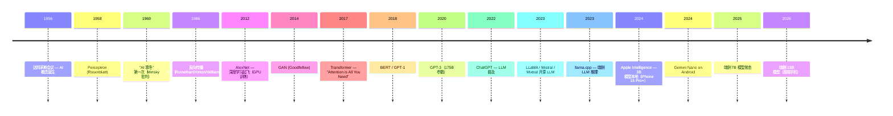
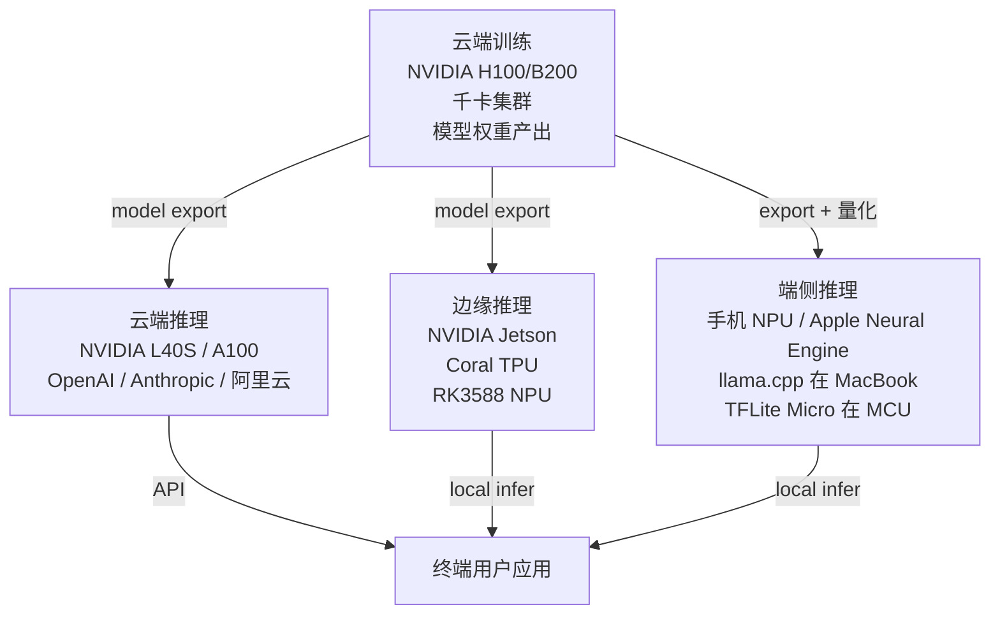

>

按 [user_learning_style](../CLAUDE.md) 5 步：① 大框架 → ② 历史速览 → ③ 端侧推理详解 → ④ TinyML → ⑤ 自己造（KuAI 远期）。

---





---

## 2. AI 计算分层（云 → 边 → 端）




---

## 3. 端侧 AI 加速器（硬件层）

详见 [00-06-aiot-hardware-software-evolution](00-06-aiot-hardware-software-evolution.md) § 5.2。

简表：

| 加速器 | 算力 | 端侧场景 |
|--------|------|---------|
| Apple Neural Engine | 38 TOPS (A18) | iPhone 系统 ML |
| 高通 Hexagon NPU | 45 TOPS (8 Gen 4) | 安卓旗舰 |
| 联发科 APU | 30+ TOPS (D9400) | 安卓旗舰 |
| 海思 NPU | 20-40 TOPS | 海思 SoC |
| Jetson Orin Nano | 40 TOPS | 边缘 AI 板 |
| Coral Edge TPU | 4 TOPS | 微型推理 |
| RK3588 NPU | 6 TOPS | 国产 SBC |
| K230 NPU | 1 TOPS | 嵌入式 AI 视觉 |
| Cortex-M55 / M85 | 0.05-0.5 TOPS | MCU 级 ML（Helium MVE）|

---

## 4. 端侧推理框架

按"重量级"排：

### 4.1 重量级框架（Linux + 大算力）

| 框架 | 发起 | 主战场 |
|------|------|-------|
| **TensorFlow Lite** | Google | Android / iOS / 嵌入 Linux |
| **ONNX Runtime** | Microsoft | 跨平台通用 |
| **PyTorch Mobile / ExecuTorch** | Meta | iOS / Android |
| **CoreML** | Apple | iOS / macOS |
| **MNN** | 阿里 | 移动 / 嵌入 |
| **NCNN** | 腾讯 | 移动 / 嵌入（无第三方依赖）|
| **TNN** | 腾讯 | NCNN 升级版 |
| **Paddle Lite** | 百度 | 国产 / 移动 |
| **MMDeploy** | 商汤 / 上海 AI Lab | 部署工具链 |
| **mlc-llm** | CMU + 业界 | 端侧 LLM 编译 |
| **Ollama** | 开源 | 本地 LLM 一键启动 |
| **llama.cpp** | Georgi Gerganov | 端侧 LLM 推理之神 |
| **llamafile** | Justine Tunney | 单文件可执行 LLM |

### 4.2 中量级（嵌入式 Linux）

| 框架 | 主战场 |
|------|-------|
| **TFLite for MCU** | Cortex-M / RISC-V MCU |
| **Edge Impulse** | TinyML 商业平台 |
| **ARM CMSIS-NN** | Cortex-M 优化算子 |
| **CMix-NN / CMSIS-DSP** | DSP 内核优化 |

### 4.3 微量级（TinyML / MCU）

详见 § 6 TinyML。

---

## 5. 模型格式

| 格式 | 主用 | 特点 |
|------|------|------|
| **ONNX** | 跨框架交换 | 工业标准 |
| **TFLite (.tflite)** | TF 生态 | FlatBuffers，量化友好 |
| **CoreML (.mlmodel)** | Apple | iOS 原生 |
| **PyTorch (.pt / .pth)** | PyTorch | 训练原生 |
| **SafeTensors** | HuggingFace | 安全（无 Python pickle 漏洞）|
| **GGUF** | llama.cpp | 量化 LLM 主流 |
| **GGML** | llama.cpp（旧）| 已被 GGUF 替代 |
| **MNN / NCNN 私有格式** | 各自框架 | 移动优化 |
| **OpenVINO IR** | Intel | OpenVINO 推理 |
| **Paddle (.pdmodel)** | 百度 | 国产 |

### 5.1 GGUF 详细（端侧 LLM 关键）

- 2023 年 llama.cpp 提出，替代 GGML
- 单文件 + metadata + quantized weights
- 文件名典型：`llama-3-7b.Q4_K_M.gguf`
- `Q4_K_M` = 4-bit 量化 + K-quants + medium variant

---

## 6. 量化 / 剪枝 / 蒸馏（模型压缩三大技）

### 6.1 量化（Quantization）

把 FP32 权重压到 INT8 / INT4 / 甚至 1-bit：

| 量化级别 | 存储 | 速度 | 精度损失 | 用途 |
|---------|------|------|---------|------|
| FP32 | 1× | 1× | 0% | 训练 |
| FP16 / BF16 | 0.5× | 2× | <0.5% | 推理 |
| INT8 | 0.25× | 4× | 1-2% | 端侧主流 |
| INT4 | 0.125× | 8× | 3-5% | LLM 端侧 |
| INT2 / 1-bit | 极小 | 极快 | 大 | 实验 |

**量化方法：**
- **PTQ (Post-Training Quantization)** — 训练后量化，最常见
- **QAT (Quantization-Aware Training)** — 训练时考虑量化
- **GPTQ / AWQ / GGML K-quants** — LLM 专用算法

### 6.2 剪枝（Pruning）

去掉不重要的权重 → 模型变小。
- 结构化剪枝（删整个 channel）
- 非结构化剪枝（删单个权重）

### 6.3 蒸馏（Distillation）

大模型（teacher）训练小模型（student）。
- DistilBERT / TinyBERT
- LLaMA → TinyLlama

---

## 7. TinyML（MCU / 嵌入式 ML）

**定义：** 在功耗 < 1mW 的微控制器上跑 ML。

### 7.1 主流 TinyML 框架

| 框架 | 平台 |
|------|------|
| **TFLite for Microcontrollers** | Cortex-M / RISC-V，最主流 |
| **Edge Impulse** | 商业，可视化训练 + 部署 |
| **CMSIS-NN** | ARM Cortex-M 优化算子 |
| **uTensor** | 学术 / 实验 |
| **microTVM** | 编译器路径 |

### 7.2 TinyML 典型应用

- **关键词唤醒**（"OK Google" / "Hey Siri" 后端的常驻小模型）
- **传感器异常检测**（工业 IoT）
- **手势识别**（手表）
- **语音命令**（智能家居）
- **物体检测**（猫狗识别 / 门禁）
- **预测维护**（电机振动分析）

### 7.3 TinyML 硬件最低要求

- Cortex-M0+：勉强（KWS 关键词）
- Cortex-M4 + DSP：典型（一般推理）
- Cortex-M7 / M55 + Helium：充裕（小型 CNN）
- ESP32-S3：充裕（含 SIMD 加速）


---

## 8. 端侧 LLM（2023+ 大火）

### 8.1 关键里程碑

| 时间 | 项目 | 大小 | 设备 |
|------|------|------|------|
| 2023.03 | llama.cpp 首版 | LLaMA-7B 4-bit | M1 Mac / RPi 4 |
| 2023.07 | LLaMA 2 公开 | 7B / 13B / 70B | 各种 |
| 2024.02 | Mistral 7B / Mixtral 8x7B | 强悍开源 | 端侧主流 |
| 2024.04 | LLaMA 3 8B / 70B | 现代 SOTA | 端侧 |
| 2024.06 | Apple Intelligence (3B 端侧) | iPhone 15 Pro+ |
| 2024.08 | Gemini Nano on Pixel | 安卓系统 ML |
| 2024.12 | DeepSeek-V3 671B (混合专家) | 数据中心 |
| 2025.04 | 端侧 13B 常态化 | 高端手机 |

### 8.2 llama.cpp 详细

- 创始：Georgi Gerganov（保加利亚）
- 语言：纯 C/C++
- 后端：CPU / CUDA / Metal / Vulkan / SYCL / OpenCL
- 量化：Q2 ~ Q8 + K-quants
- 入口：`./main -m model.gguf -p "Hello"`
- **端侧 LLM 事实标准**

### 8.3 Ollama / llamafile / mlc-llm

- **Ollama**：基于 llama.cpp，一键启动
- **llamafile**：单文件 .llamafile 可执行（Cosmopolitan libc）
- **mlc-llm**：编译器路径，TVM 后端

---

## 9. 量化感知部署案例

### 9.1 一个完整端侧推理流程（典型）

```
1. PyTorch 训练 FP32 model
2. 转 ONNX
3. 用 onnx-runtime quantizer / NCNN tools 量化到 INT8
4. 部署到 Android（TFLite）/ iOS（CoreML）/ 嵌入 Linux（TFLite / NCNN）
5. 端侧应用 load + 推理
```

### 9.2 端侧 LLM 流程

```
1. HuggingFace 下 LLaMA-3-8B safetensors
2. llama.cpp convert_hf_to_gguf.py → llama-3-8b.gguf
3. quantize → llama-3-8b.Q4_K_M.gguf
4. ./main -m llama-3-8b.Q4_K_M.gguf -p "你好" -n 100
5. 在 RPi 5 / Jetson / MacBook 跑（每秒 5-30 token）
```

---

## 10. KuAI 远期设计借鉴


### 10.1 定位

- 不做训练（云端职责）
- 重点：端侧 / 嵌入式推理
- 支持 ONNX 子集 + GGUF（LLM）

### 10.2 借鉴清单

| 来自 | 借鉴 |
|------|------|
| **TFLite Micro** | 嵌入式架构 |
| **NCNN** | 极简依赖（无第三方）|
| **llama.cpp** | 量化 + Metal/Vulkan 后端 |
| **MNN** | 模型压缩 |
| **CMSIS-NN** | ARM 优化算子 |

### 10.3 时机


---

## 11. 名词词典

| 术语 | 含义 |
|------|------|
| **AI / ML / DL** | Artificial Intelligence / Machine Learning / Deep Learning |
| **NPU / TPU** | Neural / Tensor Processing Unit |
| **TOPS** | Tera Operations Per Second |
| **inference / training** | 推理 / 训练 |
| **quantization** | 量化 |
| **PTQ / QAT** | Post-Training / Quantization-Aware Training |
| **pruning** | 剪枝 |
| **distillation** | 蒸馏 |
| **ONNX** | Open Neural Network Exchange |
| **TFLite** | TensorFlow Lite |
| **CoreML** | Apple 推理 |
| **GGUF / GGML** | llama.cpp 模型格式 |
| **SafeTensors** | HuggingFace 安全格式 |
| **KWS** | Keyword Spotting（关键词唤醒）|
| **Edge AI** | 边缘 AI |
| **TinyML** | MCU 级 ML |
| **LLM** | Large Language Model |
| **MoE** | Mixture of Experts |
| **RAG** | Retrieval-Augmented Generation |

---

## 12. 进一步阅读

### 12.1 经典书 / 论文

- ***Deep Learning*** — Goodfellow / Bengio / Courville
- ***Hands-On Machine Learning*** — Aurélien Géron
- ***TinyML*** — Pete Warden / Daniel Situnayake
- "Attention is All You Need" (Vaswani 2017) — Transformer
- "Language Models are Few-Shot Learners" (Brown 2020) — GPT-3
- "QLoRA" (Dettmers 2023) — 4-bit 微调
- "GPTQ" (Frantar 2023) — LLM 量化

### 12.2 视频 / 课程

- [3Blue1Brown 神经网络系列](https://www.youtube.com/playlist?list=PLZHQObOWTQDNU6R1_67000Dx_ZCJB-3pi)
- [Andrej Karpathy 教学](https://www.youtube.com/@AndrejKarpathy) — Transformer / GPT 从零写
- [TinyML at Harvard](https://harvard-edge.github.io/cs249r_book/)

### 12.3 本仓库笔记串联

- [00-06-aiot-hardware-software-evolution](00-06-aiot-hardware-software-evolution.md) § 5 — 端侧 AI 硬件
- [00-24-gpu-graphics-evolution](00-24-gpu-graphics-evolution.md) — CUDA + GPU 加速（next）

### 12.4 本仓库本地资料对应

| 路径 | 内容 |
|------|------|
| `others/vortex/` | RISC-V GPGPU — KuAI 远期硬件参考 |
| `others/pocl-upstream/` | OpenCL on CPU — 推理后端 |
| `others/pocl-vortex/` | OpenCL on Vortex |

→ KuAI 远期可基于 PoCL + Vortex 路径实现 RISC-V 端侧推理。
