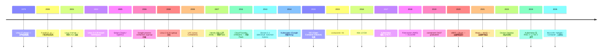

# 00-34 — 容器 + 云原生演化：从 chroot 到 Kubernetes

>


---

## 1. 历史时间轴



---

## 2. 容器 ≠ 虚拟机（核心认知）

```
虚拟机（VM）                                 容器
┌─────────────────────────────────┐          ┌──────────────────────────────┐
│  App A    │ App B    │ App C    │          │  App A   │ App B   │ App C  │
│  bins/lib │ bins/lib │ bins/lib │          │  bins/lib│ bins/lib│ bins/lib│
│  Guest OS │ Guest OS │ Guest OS │          ├──────────┴─────────┴──────────┤
│  Hypervisor                     │          │   Container Runtime          │
│  Host OS                        │          │   Host OS Kernel (共享)       │
│  Hardware                       │          │   Hardware                    │
└─────────────────────────────────┘          └──────────────────────────────┘
  独立 OS / 强隔离 / 启动慢            共享 kernel / 弱隔离 / 启动快（毫秒）
```

**容器 = 共享 kernel 的进程组隔离**：
- 文件系统：mount namespace + overlayfs
- 进程：pid namespace
- 网络：net namespace
- 用户：user namespace
- IPC：ipc namespace
- 主机名：uts namespace
- 资源限制：cgroup（CPU / memory / IO）
- 安全：capabilities + seccomp + LSM（SELinux / AppArmor）

---

## 3. Linux 容器原语

### 3.1 namespace（隔离）

```bash
# 进入新 namespace
unshare --pid --mount --uts --ipc --net --fork bash
# 在新 namespace 里看
ps aux        # 只看到自己
hostname new  # 不影响外部
```

7 种 namespace（Linux 6.x）：
- **mount** (CLONE_NEWNS) — 文件系统挂载
- **uts** (CLONE_NEWUTS) — hostname / domain
- **ipc** (CLONE_NEWIPC) — System V IPC + POSIX message queues
- **pid** (CLONE_NEWPID) — 进程 ID
- **net** (CLONE_NEWNET) — 网络栈
- **user** (CLONE_NEWUSER) — UID/GID 映射
- **cgroup** (CLONE_NEWCGROUP) — cgroup 视图
- **time** (CLONE_NEWTIME, 5.6+) — boot time 偏移

### 3.2 cgroup（资源限制）

cgroup v1（旧）/ v2（现代，Linux 4.5+）：

```bash
# v2 创建限制 50% CPU
mkdir /sys/fs/cgroup/mygroup
echo "50000 100000" > /sys/fs/cgroup/mygroup/cpu.max
echo $$ > /sys/fs/cgroup/mygroup/cgroup.procs
```

控制器：`cpu` / `memory` / `io` / `pids` / `cpuset` / `blkio` / `devices` / `freezer`...

#### 3.2.X cgroup 架构知识点全谱（容器底层必懂）

> **加入背景：** StarryOS 挑战任务"cgroup 支持 + 启动 Docker"涉及的核心知识。Linux cgroup 是容器/systemd/microVM 的硬依赖；不懂 cgroup = 写不出能跑 runc 的内核。

**实现三要素（缺一不可）：**
| 要素 | 内容 |
|:--|:--|
| **资源控制器（subsystem）** | 真正"限制资源"的内核子系统模块。每控制器一个独立实现 |
| **cgroupfs（虚拟文件系统）** | 用户态控制接口 —— `mkdir /sys/fs/cgroup/foo` 即创建 cgroup，echo 写文件即下发限制 |
| **层次化进程分组（hierarchy）** | 树形组织：父 cgroup 限制子 cgroup；进程属于唯一叶子节点 |

**控制器全谱（Linux 6.x 主要 11 个）：**
| 控制器 | 限制内容 | v1 | v2 |
|:--|:--|:--|:--|
| **cpu** | CPU 时间片（cpu.shares / cpu.max / cpu.weight）| ✅ | ✅ |
| **cpuset** | CPU 亲和性 + NUMA 节点 | ✅ | ✅ |
| **memory** | RAM + swap + kmem（memory.max / memory.high / memory.low） | ✅ | ✅ |
| **io (blkio)** | 块设备 I/O 带宽 / IOPS | ✅ blkio | ✅ io |
| **pids** | 进程数（fork bomb 防御）| ✅ | ✅ |
| **devices** | 允许/禁止访问设备号 | ✅ | ✅ (BPF) |
| **freezer** | 冻结整个 cgroup（容器迁移 / Checkpoint）| ✅ | ✅ |
| **net_cls** | 标记网络包（tc filter 用）| ✅ | — |
| **net_prio** | 网络优先级 | ✅ | — |
| **hugetlb** | HugeTLB 页数限制 | ✅ | ✅ |
| **perf_event** | perf 事件采集范围 | ✅ | ✅ |
| **rdma** | RDMA verbs / hca 资源 | ✅ | ✅ |
| **misc** | 杂项资源（如 SEV-SNP ASID）| — | ✅ |

**v1 vs v2 关键差异（重点）：**
| 维度 | v1 | v2（unified hierarchy） |
|:--|:--|:--|
| **层次结构** | 每控制器独立树 → 进程可在不同树不同 cgroup 中 | **单一统一树**，进程在树里只有一个位置 |
| **挂载** | `mount -t cgroup -o cpu cgroup /sys/fs/cgroup/cpu` 每控制器单独挂 | `mount -t cgroup2 cgroup2 /sys/fs/cgroup` 一次挂全部 |
| **控制器开关** | 编译期 + mount 时 | 运行时 `echo "+cpu +memory" > cgroup.subtree_control` |
| **进程位置** | `tasks` (thread) + `cgroup.procs` (process) 分离 | 仅 `cgroup.procs`，统一 process-level |
| **CPU 控制器** | shares (相对权重) + cpu.cfs_*_us | weight (相对) + max (绝对 quota/period) |
| **memory 限制** | memory.limit_in_bytes (硬限) | memory.max (硬限) + memory.high (软限带回压) + memory.low (保护) |
| **PSI (Pressure Stall Info)** | ❌ | ✅ `cpu.pressure / memory.pressure / io.pressure` 资源压力指标 |
| **delegated** | ❌ | ✅ `cgroup.subtree_control` 把控制权委托给非 root user |

**cgroup namespace (CLONE_NEWCGROUP, Linux 4.6+)：**
- 隔离 `/proc/<pid>/cgroup` 视图 —— 容器内 process 只看到容器根 cgroup 路径
- 防止容器知道自己被 cgroup 限制（信息泄露）+ 容器嵌套（systemd in container）

**cgroupfs 关键文件（v2 实例）：**
```
/sys/fs/cgroup/
├── cgroup.controllers            ← 可用控制器列表
├── cgroup.subtree_control        ← 启用哪些控制器到子 cgroup
├── cgroup.procs                  ← 本 cgroup 包含的进程 PID
├── cgroup.events                 ← populated/frozen 等事件
├── cpu.max                       ← CPU quota (写"50000 100000" = 50%)
├── cpu.weight                    ← CPU 相对权重 (1-10000)
├── memory.max                    ← memory 硬限
├── memory.high                   ← memory 软限（带回压）
├── memory.low                    ← memory 保护下限
├── memory.current                ← 当前用量
├── memory.events                 ← OOM 计数等
├── io.max                        ← 块设备 IOPS / bps 限制
├── pids.max                      ← 最大进程数
└── <subgroup>/                   ← 子 cgroup 递归同结构
```

**PSI (Pressure Stall Information, v2 only)：**
```
some / full × cpu / memory / io 6 个指标
some: 至少一个 task 因资源等待 stall
full: 所有 task 都因资源等待 stall
```
形如 `some avg10=0.45 avg60=0.20 avg300=0.10 total=12345678`。**K8s 用 PSI 决定 pod eviction**。

**与 namespace 协同（容器隔离全套）：**
```
container = cgroup (资源) + namespace (视图) + capabilities (权限) + seccomp (syscall 白单) + rootfs (FS)
                ↓
         cgroup 只限制"用多少"
         namespace 只隔离"看到啥"
         二者正交
```

**为什么"启动 Docker"必须支持 cgroup：** runc 启动容器时强制设 cgroup limits（CPU / memory / pids），无 cgroup → runc 报错 `failed to write cpu.max`。Docker / containerd / Kubernetes 全链路硬依赖。

**StarryOS 当前状态（详见 [04-05 § 4](04-05-monolithic-kernels-walkthrough.md) + 项目目标 memory）：**
- 仅 procfs `0::/\n` 硬编码占位（防 ENOENT 崩溃）
- 无控制器实现 / 无 cgroupfs / 无层次化分组
- 走向 Docker 必须从这 3 要素全实现起

### 3.3 OverlayFS（镜像分层）

```
upperdir/  ←  容器写
lowerdir/  ←  只读（镜像层）
merged/    ←  union view 给应用看
```

Docker 镜像 = 多层 lowerdir 叠加 + 一层 upperdir。

---

## 4. 容器运行时 + 镜像

### 4.1 OCI 标准（2015 起）

| 标准 | 内容 |
|------|------|
| **OCI Runtime Spec** | 容器如何启动（runc 实现）|
| **OCI Image Spec** | 镜像格式（manifest / config / layers） |
| **OCI Distribution Spec** | registry HTTP 协议 |

### 4.2 容器运行时

| 运行时 | 层级 | 一句话 |
|--------|------|--------|
| **runc** | 低层 | OCI runtime 参考实现（Go）|
| **crun** | 低层 | C 实现的 runc（更快）|
| **runsc (gVisor)** | 低层 | 用户态 kernel 实现，强安全 |
| **kata-containers** | 低层 | 每容器一个 microVM |
| **containerd** | 高层 | Docker 提取的 daemon，CNCF |
| **CRI-O** | 高层 | K8s 直接的容器运行时 |
| **Docker Engine** | 高层 | 用户态 daemon + CLI |
| **Podman** | 高层 | Docker 兼容，无 daemon，rootless |
| **nerdctl** | 高层 | containerd 的 Docker-like CLI |

### 4.3 镜像构建

| 工具 | 一句话 |
|------|--------|
| **docker build** | 经典（Dockerfile）|
| **buildah** | 无 daemon，OCI 标准 |
| **kaniko** | 容器内构建（K8s 友好）|
| **BuildKit** | 现代构建后端，支持并发 |
| **Nix** | 函数式构建可复现镜像 |

---

## 5. Kubernetes 生态

### 5.1 K8s 核心组件

```
┌─ Control Plane ──────────────────────────────┐
│ kube-apiserver  ← API 入口                  │
│ etcd            ← 状态存储                   │
│ kube-scheduler  ← 调度                       │
│ kube-controller-manager ← 状态调谐           │
└──────────────────────────────────────────────┘

┌─ Node ────────────────────────────────────────┐
│ kubelet  ← 节点 agent                       │
│ kube-proxy  ← 网络代理                       │
│ container runtime (containerd / CRI-O)       │
└──────────────────────────────────────────────┘
```

### 5.2 K8s 资源对象

| 资源 | 含义 |
|------|------|
| **Pod** | 一组容器（共享 net/pid namespace）|
| **Deployment** | 多 Pod 滚动升级 |
| **Service** | 虚拟 IP / DNS 入口 |
| **Ingress** | HTTP 入口 + TLS |
| **ConfigMap / Secret** | 配置 / 密钥 |
| **PersistentVolume / PVC** | 持久存储 |
| **StatefulSet** | 有状态服务 |
| **DaemonSet** | 每节点一个（如 logging）|
| **CronJob** | 定时任务 |

### 5.3 CNCF 生态

CNCF（Cloud Native Computing Foundation）100+ 项目：

| 类 | 代表 |
|----|------|
| 编排 | Kubernetes / Nomad |
| 服务网格 | Istio / Linkerd / Cilium Service Mesh |
| 网络 | Cilium / Calico / Flannel / Weave |
| 监控 | Prometheus / Grafana / Thanos |
| 日志 | Fluentd / Loki / OpenSearch |
| trace | Jaeger / OpenTelemetry / Zipkin |
| Ingress | nginx-ingress / Traefik / Contour |
| 包管理 | Helm |
| GitOps | ArgoCD / Flux |
| 数据库 | etcd / TiKV |
| Serverless | Knative / OpenFaaS |
| CI/CD | Tekton / Argo Workflows |
| 安全 | Falco / OPA / Vault |

---

## 6. 容器变体（现代）

### 6.1 microVM（容器 + VM 折中）

| 项目 | 厂家 |
|------|------|
| **Firecracker** | AWS — Lambda / Fargate 后端 |
| **Cloud Hypervisor** | Intel + 业界 |
| **kata-containers** | OpenStack / Intel |
| **gVisor** | Google — 用户态 kernel |

→ 每容器一个微 VM，启动 100ms 级，比容器安全。

### 6.2 Unikernel（极简单进程 OS）

详见 [00-07-os-evolution](00-07-os-evolution.md) § 3.5：
- MirageOS / HermitOS / unikraft / OSv


### 6.3 WebAssembly + WASI

- Wasm 模块 = 沙箱化二进制
- WASI = WebAssembly System Interface（系统调用抽象）
- 启动 < 1ms
- 跨架构（x86 / ARM / RISC-V）
- 工具：Wasmtime / WasmEdge / Wasmer / Krustlet（Wasm K8s）

→ 2024+ 替代轻量容器趋势。

---

## 7. 私有云 / 公有云

### 7.1 公有云

| 云 | 厂商 | 特长 |
|----|------|------|
| **AWS** | Amazon | 全球 #1，服务最多 |
| **Azure** | Microsoft | Windows / 企业 |
| **GCP** | Google | K8s 起源 + AI |
| **阿里云** | 阿里 | 中国 #1 |
| **腾讯云** | 腾讯 | 中国 #2 |
| **华为云** | 华为 | 中国 #3 + 海外 |
| **百度云** | 百度 | 国内 |
| **IBM Cloud** | IBM | 企业混合 |

### 7.2 私有云 / 开源 IaaS

| 项目 | 一句话 |
|------|--------|
| **OpenStack** | 老牌私有云，模块化 |
| **CloudStack** | Apache 私有云 |
| **Proxmox** | 中小企业虚拟化 |
| **oVirt** | RHEV 上游 |
| **OpenNebula** | 简化私有云 |

### 7.3 PaaS

| 项目 | 一句话 |
|------|--------|
| **Kubernetes** | 事实标准（不只是 PaaS）|
| **Cloud Foundry** | 老 PaaS（IBM / SAP / SUSE）|
| **OpenShift** | Red Hat K8s + dev tools |
| **Rancher** | 多 K8s 集群管理 |
| **Heroku** | 商业 PaaS 经典 |

---


→ 与容器同生态位（"轻量隔离 + 快速启动"），但路线不同：
- **容器**：共享 kernel + 应用层隔离

### 8.2 Hypervisor 与容器协同（行业现状）

→ 行业实践：Firecracker / Cloud Hypervisor 上跑 unikernel（每个 OS 实例 = 一个 microVM 内核），与容器栈互补。任何项目都可借鉴。

### 8.3 容器化方向

→ 任何 distro builder 输出的镜像都可打包成 OCI 镜像，跑在 K8s 上做 system container。


---

## 9. 名词词典

| 术语 | 含义 |
|------|------|
| **container** | Linux namespace + cgroup 隔离的进程组 |
| **OCI** | Open Container Initiative |
| **runc / crun** | OCI runtime |
| **containerd** | 容器 daemon |
| **K8s / kubernetes** | 容器编排 |
| **Pod** | K8s 最小调度单元 |
| **Service / Ingress** | K8s 网络抽象 |
| **CNI** | Container Network Interface |
| **CSI** | Container Storage Interface |
| **CRI** | Container Runtime Interface |
| **Helm** | K8s 包管理 |
| **Operator** | K8s 自定义资源控制器 |
| **CRD** | Custom Resource Definition |
| **GitOps** | Git as source of truth for ops |
| **Service Mesh** | 服务间网络 + 安全层 |
| **Sidecar** | 容器内辅助容器 |
| **eBPF** | Linux 内核可编程 |
| **microVM** | 极简 VM（Firecracker）|
| **Unikernel** | 单应用迷你 OS |
| **WASI** | WebAssembly System Interface |
| **Cilium** | eBPF 网络 / Service Mesh |
| **etcd** | K8s 状态存储 |

---

## 10. 进一步阅读

### 10.1 经典书

- ***Kubernetes in Action*** — Marko Lukša
- ***Docker Deep Dive*** — Nigel Poulton
- ***The Kubernetes Book*** — 同上
- ***Production Kubernetes*** — Josh Rosso 等
- ***Container Security*** — Liz Rice
- ***Cloud Native Patterns*** — Cornelia Davis

### 10.2 视频 / 课程

- [Kubernetes 官方教程](https://kubernetes.io/docs/tutorials/)
- [TechWorld with Nana YouTube](https://www.youtube.com/@TechWorldwithNana) — K8s 入门
- [Liz Rice 容器内部演讲](https://www.youtube.com/results?search_query=liz+rice+container+from+scratch)

### 10.3 本仓库笔记串联

- [00-07-os-evolution](00-07-os-evolution.md) § 5 — Hypervisor / 容器 / VM 对比
- [00-35-distro-evolution](00-35-distro-evolution.md) — distro 容器化（Alpine 在 Docker 火爆）
- [00-36-security-evolution](00-36-security-evolution.md) § 7 — 容器安全（namespace / seccomp / Landlock）
- 后续 [00-10-devops-evolution](00-10-devops-evolution.md) — K8s GitOps

### 10.4 本仓库本地资料

- 看 ArceOS / Asterinas 时理解 unikernel 与容器关系
- 看 Buildroot / Yocto 时理解镜像 vs 容器镜像
