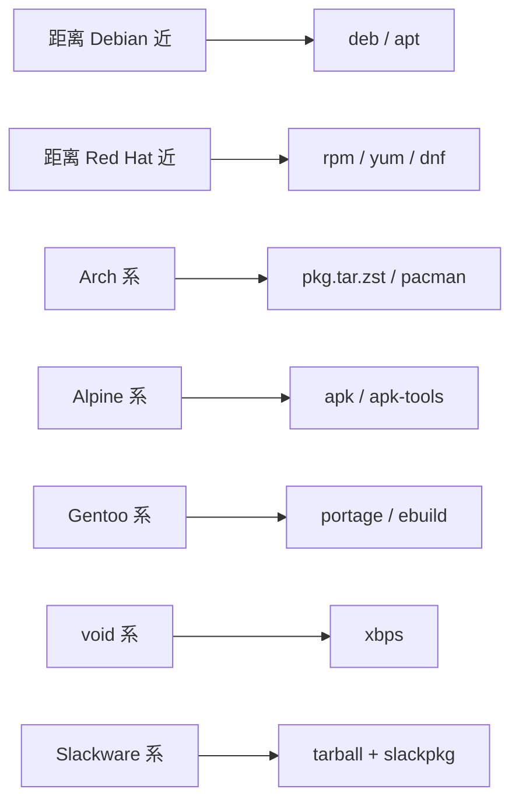

# 00-35 — Linux 发行版演化 + 系统裁剪 / 移植 / BSP / Android 移植

> **核心问题：** "Linux distro" 这个词到底是什么？为什么 Debian / Ubuntu / Arch / Alpine 看起来这么不一样？嵌入式系统怎么从"通用 Linux"裁出几 MB 的 rootfs？拿到一块新板怎么把 distro 移过去？Android 的"移植"和 Linux 的"移植"有什么不同？
>
> **一句话答案：** **distro = kernel + libc + 用户工具 + 包管理器 + 配置约定**。50 年间从单一 Bell Labs Unix 分裂成几百个 distro。**核心差异在包管理 + init 系统 + 默认配置**——技术差异其实不大，社区文化和用例差异更大。嵌入式领域从"全 distro"裁成"buildroot/Yocto 工程"，本质就是"主动去除 90% 不需要的部分"。Android 移植则是另一套体系（HAL + zygote + Dalvik/ART）。


> **第一篇笔记关联：** 本笔记主要 distro 项目对应 [00-01-material-index](00-01-material-index.md) `rootfs/` 和 `distro/` 段（buildroot / busybox / Yocto Poky / openwrt / openRuyi）。其他 distro（Ubuntu / Debian / Alpine / Armbian / OpenHarmony / Bianbu）作为认知大框架的补充——**简写但不缺席**。

---

## 1. 大框架：distro 是什么

### 1.1 distro = 内核 + 用户态 + 包管理 + 集成约定

```
┌────────────────────────────────────────────────────────────┐
│ distro = kernel + libc + utils + pkg manager + 集成约定   │
└────────────────────────────────────────────────────────────┘
   │
   ├── kernel — Linux / FreeBSD / Hurd / 其他
   │
   ├── libc — glibc / musl / uclibc / bionic (Android)
   │
   ├── core utils — coreutils / busybox / toybox
   │
   ├── shell — bash / dash / zsh / fish
   │
   ├── init system — systemd / SysV init / OpenRC / runit / s6
   │
   ├── package manager — apt / yum / pacman / apk / portage / xbps
   │
   ├── pre-installed apps — GNOME / KDE / X11 / Wayland / firmware
   │
   └── 集成约定 — 文件位置 / 配置规则 / 升级策略 / 版本节奏
```

**核心认知：** 内核的差异在 distro 间往往很小（多数是同 LTS Linux）；**真正决定 distro 性格**的是后面那几条（包管理 + init + 哲学）。

### 1.2 distro 的家族关系

```mermaid
flowchart TD
    A["Bell Labs Unix (1969)"] --> B[BSD - 1977]
    A --> C[System V - 1983]
    
    B --> B1[FreeBSD]
    B --> B2[OpenBSD]
    B --> B3[NetBSD]
    B --> B4[macOS / Darwin]
    
    Z["Linux Kernel (1991)"] --> Z1["Slackware (1993)"]
    Z --> Z2["Debian (1993)"]
    Z --> Z3["Red Hat (1995)"]
    Z --> Z4["S.u.S.E (1994)"]
    Z --> Z5["Gentoo (2000)"]
    Z --> Z6["Arch (2002)"]
    Z --> Z7["Alpine (2005)"]
    
    Z2 --> Z21[Ubuntu]
    Z2 --> Z22[Knoppix]
    Z2 --> Z23[Kali]
    Z2 --> Z24["Armbian (针对 ARM SBC)"]
    
    Z21 --> Z211[Linux Mint]
    Z21 --> Z212[Pop!_OS]
    Z21 --> Z213[Lubuntu / Xubuntu]
    
    Z3 --> Z31[CentOS / Rocky]
    Z3 --> Z32[Fedora]
    Z32 --> Z321[RHEL]
    Z3 --> Z33["openEuler (华为 fork)"]
    
    Z4 --> Z41[openSUSE]
    
    Z6 --> Z61[Manjaro]
    Z6 --> Z62[EndeavourOS]
    Z6 --> Z63["Arch Linux ARM / RISC-V"]
    
    Z --> M1["嵌入式构建系统"]
    M1 --> M11[Buildroot]
    M1 --> M12[Yocto / OpenEmbedded]
    M1 --> M13[OpenWrt]
    M1 --> M14[Bianbu - 平头哥 RISC-V]
    M1 --> M15[openRuyi - RISC-V 中文]
    
    Z --> Mob1["Android (基于 Linux 但是非 GNU)"]
    Mob1 --> Mob11[AOSP]
    Mob11 --> Mob12[各 OEM ROM]
    
    Z --> Hua1["HarmonyOS / OpenHarmony (华为)"]
```



每个箭头代表"fork + 调整"——但底层 Linux kernel 几乎都共享。

---

## 2. 历史时间轴（1991-2026）

```mermaid
timeline
    1969 : Unix v1 - 起源
    1983 : GNU 项目启动 (RMS) — 缺少 kernel
    1991 : Linux 0.01 (Linus 21 岁)
    1993 : Slackware 1.0 — 第一个广泛 distro
    1993 : Debian 0.01 — 自由软件 distro
    1994 : Red Hat 1.0 / S.u.S.E.
    1995 : RPM 包格式
    1996 : Linux 2.0
    1998 : KDE 1.0 / GNOME 1.0
    2000 : Gentoo 1.0 — 源码 portage
    2002 : Arch 0.1 — 滚动更新
    2003 : Fedora Core 1 (RHEL 替代品)
    2004 : Ubuntu 4.10 (Canonical) — Linux 桌面普及
    2005 : Alpine — musl + busybox 为基底
    2008 : Android 1.0 (HTC Dream) — Linux 移动
    2010 : Yocto Project / OpenEmbedded
    2010 : Buildroot 重写为 menuconfig
    2011 : openSUSE Tumbleweed (滚动)
    2004 : OpenWrt 首版（路由器）
    2016 : LEDE 从 OpenWrt fork
    2018 : LEDE 与 OpenWrt 重新合并
    2013 : CoreOS — 容器优先 distro
    2015 : Alpine 在 Docker 火爆
    2017 : Snap / Flatpak 应用打包
    2018 : openEuler (华为 fork)
    2019 : openKylin / UnionTech UOS
    2020 : Steam OS 3 (Arch-based) / Bianbu (平头哥)
    2021 : Fedora Silverblue (immutable distro)
    2022 : OpenHarmony 3.x (华为开源)
    2024 : Debian 12 with RISC-V Tier 1
    2026 : 大多数主流 distro 都有 RISC-V port
```



---

## 3. distro 分类（多维度）

### 3.1 按"包管理 + 文件格式"



| 包格式 | 包管理器 | 代表 distro | 哲学 |
|--------|---------|------------|------|
| `.deb` | apt / dpkg | Debian / Ubuntu / Mint / Kali / Pop!_OS / Armbian | 二进制 / 稳定 |
| `.rpm` | yum / dnf / zypper | RHEL / Fedora / openSUSE / CentOS / openEuler / Rocky | 二进制 / 企业 |
| `.pkg.tar.zst` | pacman | Arch / Manjaro / EndeavourOS | 二进制 / 滚动 |
| `.apk` | apk-tools | Alpine | 二进制 / 极简 |
| `.ebuild` | portage | Gentoo / Funtoo | 源码 / 极致定制 |
| `.xbps` | xbps | Void | 二进制 / 滚动 |
| `.snap` | snapd | Ubuntu 等（跨 distro）| 容器化 |
| `.flatpak` | flatpak | 跨 distro | 桌面应用沙盒 |

### 3.2 按 init 系统

| init | 代表 | 特点 |
|------|------|------|
| **systemd** | 多数现代主流 | 全功能、复杂、binary log |
| **SysV init** | 老 distro / busybox | shell 脚本、简单 |
| **OpenRC** | Gentoo / Alpine | shell + parallel |
| **runit** | Void / Devuan 部分 | 极简 |
| **s6** | musl 系 / 部分 Alpine | 嵌入式友好 |
| **upstart** | Ubuntu 历史 | 已废 |
| **launchd** | macOS | Apple 私有 |
| **busybox init** | 嵌入式 | 单二进制 |

**systemd 之争**：2010s "systemd 是好是坏"是 Linux 社区最大政治议题。Devuan 等 distro 从 Debian fork 出来就是为了拒绝 systemd。但工业上 systemd 已是事实标准。

### 3.3 按更新模式

| 模式 | 含义 | 代表 |
|------|------|------|
| **Point release** | 每 2-6 个月一个版本 | Debian / Ubuntu / Fedora |
| **Rolling release** | 持续滚动 | Arch / openSUSE Tumbleweed / Gentoo |
| **Long Term Support (LTS)** | 5-10 年支持 | Ubuntu LTS / RHEL / Debian Stable |
| **Atomic / Immutable** | rootfs 只读，原子升级 | Fedora Silverblue / SteamOS 3 / NixOS |
| **Kiosk** | 嵌入设备固定版本 | OpenWrt / Yocto |

### 3.4 按用途定位

| 类别 | 代表 |
|------|------|
| **桌面 / 通用** | Ubuntu / Fedora / Mint / Pop!_OS / Manjaro |
| **服务器 / 企业** | RHEL / Ubuntu Server / Debian / SLES / openEuler / Rocky / Alma |
| **滚动 / 极客** | Arch / Gentoo / Void |
| **极简 / 容器** | Alpine / Distroless / Wolfi |
| **路由 / 网络** | OpenWrt / pfSense / VyOS |
| **嵌入式构建** | Buildroot / Yocto / openRuyi / Bianbu |
| **教学 / Live** | Knoppix / Live USB |
| **国产化** | openKylin / UOS / Loongnix / Anolis / openEuler |
| **SBC / ARM 板** | Armbian / Raspberry Pi OS / DietPi |
| **移动** | Android / Sailfish / postmarketOS |
| **AI / 数据科学** | Lambda Stack / Pop!_OS CUDA |
| **安全测试** | Kali / Parrot / BlackArch |

---

## 4. 主流 distro 详解（以 RISC-V 视角）

### 4.1 Debian

- **起源：** 1993 Ian Murdock，命名 "Deb (女友) + Ian"
- **哲学：** 100% 自由软件，社区驱动，慎重稳定
- **版本：** Stable（约 2 年）/ Testing / Unstable / Experimental
- **包：** apt + dpkg
- **RISC-V 支持：** Bookworm 12 (2023) Tier 2，Trixie 13 (2025) Tier 1
- **安装：** debian-installer 经典文本 / Calamares 图形

→ **Debian 是嵌入式 RISC-V 板的常用首选**（VisionFive 2 / SpacemiT K1 / SiFive Unmatched 都有 Debian image）。

### 4.2 Ubuntu

- **起源：** 2004 Mark Shuttleworth (Canonical)
- **哲学：** "Linux for human beings"，桌面友好
- **版本：** LTS (5 年) / 中间版 (9 个月)
- **包：** apt + Snap
- **RISC-V 支持：** 22.04+ Server only
- **特点：** GNOME 桌面 / 大量预装

### 4.3 Fedora

- **起源：** 2003，Red Hat 社区发行版
- **哲学：** "First, Best, Friend"，新技术先驱
- **包：** dnf + rpm + Flatpak
- **RISC-V：** Fedora 40+ 部分支持
- **变体：** Workstation / Server / Silverblue (atomic) / Kinoite

### 4.4 Arch

- **起源：** 2002 Judd Vinet
- **哲学：** "KISS" - Keep It Simple Stupid
- **版本：** 滚动 (无版本号)
- **包：** pacman + AUR (用户仓库)
- **RISC-V：** Arch Linux RISC-V port
- **难度：** 安装陡（手动），用稳定后极其灵活

### 4.5 Alpine

- **起源：** 2005 from LEAF (router distro)
- **哲学：** musl + busybox，极小，安全
- **包：** apk
- **大小：** 5 MB 基础 (vs Ubuntu Server 几百 MB)
- **主战场：** Docker 容器基础镜像（Alpine 在 Docker Hub 排前几）
- **RISC-V：** edge port 早期支持

### 4.6 openEuler

- **起源：** 2019 华为 fork CentOS
- **哲学：** 国产化、企业、信创
- **包：** dnf + rpm
- **架构：** x86_64 / aarch64 / RISC-V / LoongArch（全覆盖）
- **变体：** Server / Embedded / Edge

### 4.7 openKylin

- **起源：** 2022，国产桌面 Linux 联合
- **哲学：** 麒麟系，国产化
- **架构：** x86_64 / aarch64 / RISC-V / LoongArch / SW-64
- **桌面：** UKUI
- **关联开源项目（Gitee 托管）：**
  - **x-kernel**（gitee.com/openkylin/x-kernel）—— OpenKylin 社区下的 Rust 操作系统内核研究

### 4.8 Loongnix / UOS

- 龙芯 / 统信主推的国产 Linux
- LoongArch 优先
- 政府 / 国企用

### 4.9 Bianbu (平头哥)

- 平头哥 RISC-V SoC（玄铁 K1 / C910）专用
- 基于 Debian-like
- 针对 BPI-F3 等 SBC

### 4.10 Armbian

- **起源：** 2013，针对 ARM SBC（树莓派外的板子）
- **哲学：** "Armed Linux"，给 ARM SBC 一个统一 distro
- **覆盖：** Allwinner / Rockchip / NXP / Marvell / SiFive 等几百块板
- **包：** Debian / Ubuntu base + 大量 board-specific kernel
- **特点：** 比每板厂家自己的 distro 通用 + 滚动更新好

### 4.11 ArmDebian（即 Debian for ARM）

- 不是独立 distro，是 Debian 的 ARM port
- 与 Armbian 区别：Debian Foundation 官方 vs 第三方 SBC 友好
- 当前 Debian 12 完整支持 armel / armhf / arm64

### 4.12 Raspberry Pi OS

- Debian fork（"Raspbian"）
- 针对 RPi 系列
- 32-bit (armhf) + 64-bit (aarch64)

### 4.13 SteamOS

- Arch fork (Valve)
- 针对 Steam Deck 游戏
- KDE Plasma + Gaming Mode

### 4.14 NixOS

- 函数式声明配置（configuration.nix）
- 原子升级 + 回滚
- 重塑 distro 设计

### 4.15 当前 RISC-V distro 全景表

| Distro | RISC-V 支持等级 | 主用 SBC |
|--------|---------------|---------|
| Debian | Tier 1 (Trixie 13+) | 通用 |
| Ubuntu | Server 6+ | SiFive Unmatched / VisionFive 2 |
| Fedora | 部分 | 通用 |
| openSUSE | Tumbleweed | 通用 |
| openEuler | 完整 | 服务器 |
| openKylin | 部分 | 桌面 |
| Bianbu | 主力 | BPI-F3 / K1 |
| Armbian | 多板 | 几十块 RISC-V SBC |
| Buildroot | 完整 | 自构 |
| Yocto / Poky | 完整 | 工业 |
| openRuyi | 早期 | 中文社区 |
| Arch Linux RISC-V | 第三方社区 | 极客 |

---

## 5. 嵌入式 distro 构建（rootfs 工程）

桌面 / 服务器 distro 太大（几 GB），嵌入式只要几 MB rootfs。专门有几个工具构建：

### 5.1 Buildroot

- **起源：** 2001 (Erik Andersen, BusyBox 作者)
- **哲学：** 简单、makefile-based、单一 .config
- **大小：** rootfs 可低至 5 MB
- **流程：**
  ```
  make menuconfig         # 选 board / 包
  make -j$(nproc)         # 编译
  → output/images/{Image, rootfs.ext4, fw_jump.bin}
  ```
- **优势：** 学习曲线平、debug 容易
- **劣势：** 增量构建差（改一个包要重编很多）

→ 笔记 [03-06-u-boot-overview](03-06-u-boot-overview.md) § 9.1 练习 5 用过 Buildroot。

### 5.2 Yocto Project / OpenEmbedded

- **起源：** 2010 Linux Foundation
- **哲学：** layered metadata，工业级，可定制
- **核心：** bitbake recipe (.bb / .bbappend) + meta-layer
- **特点：**
  - layer 化（meta-vendor 包含板支持）
  - 增量构建（sstate cache）
  - 完整 SDK 生成（toolchain + sysroot）
- **学习曲线：** 陡（recipe 语言 + 多层抽象）
- **采用：** Tesla / 福特 / NXP 工控 / SiFive 官方

### 5.3 OpenWrt

- **起源：** 2003，针对 Linksys WRT54G 路由器
- **哲学：** 路由器优化，模块化包
- **特点：**
  - opkg 包管理器
  - LuCI web UI
  - UCI 配置系统
- **fork：** LEDE 2016-2018 后又回流
- **用：** 全球 90% 路由器固件
- **RISC-V：** 部分 SoC（Allwinner D1 等）

### 5.4 openRuyi

- 中文 RISC-V 社区
- 类似 openEuler 但更嵌入式向
- 尚在早期

### 5.5 选哪个

```
小项目 / 快速验证 → Buildroot
工业级产品 / 可维护性 → Yocto
路由器 / 网络设备 → OpenWrt
RISC-V 国产化 → openEuler / Bianbu / openRuyi
```

---

## 6. 系统裁剪（Distro Slimming）

把通用 distro "瘦身"到嵌入式可用。

### 6.1 三种思路

**(a) 从大到小裁剪**（"减法"）：
- 拿 Debian Server 标准镜像
- `dpkg --get-selections` 查看已装
- `apt remove` 不需要的（GUI / 文档 / 测试工具）
- 删掉 `/usr/share/doc` / `/var/cache/apt/`
- 重打包为 squashfs 镜像

**(b) 从小到大堆砌**（"加法"）：
- 用 Buildroot / Yocto 从零选包
- 只编需要的 busybox subset
- 静态链接而非动态

**(c) 从模板派生**：
- 用 Alpine 作基底（5 MB）
- `apk add` 加包

### 6.2 典型裁剪目标

| 用途 | 大小 | 方法 |
|------|------|------|
| 路由器 | 4-32 MB | OpenWrt / Buildroot |
| 工控 | 16-256 MB | Yocto / Buildroot |
| 智能家居 | 32-128 MB | Buildroot |
| 数字标牌 | 256 MB - 1 GB | Yocto |
| 边缘 AI | 1-4 GB | Ubuntu Core / Yocto |
| 容器 base | 5 MB | Alpine / Distroless |

### 6.3 裁剪技巧

- **busybox** 替代 coreutils + bash + grep + sed + ...（一个二进制几百 KB 抵几十个工具）
- **musl** 替代 glibc（小 50%+）
- **静态链接**（无动态加载器）
- **stripped binary**（去 debug 符号）
- **squashfs** 压缩 rootfs（read-only + xz/lz4）
- **initramfs cpio.gz**（启动早期 rootfs）
- **没人看的文档全删**（`/usr/share/man` / `/usr/share/doc` / `/usr/share/info`）
- **Locale 只留 en_US.UTF-8**（删 `/usr/lib/locale/` 几十 MB）
- **kernel modules** 只装实际 driver

---

## 7. 系统移植：从 distro 到新板

拿到一块新 RISC-V SoC 板（如自己设计的或新 SBC），怎么把 distro 跑起来？

### 7.1 移植 checklist

```
1. SoC 厂家有 BSP 吗？
   ├── 是 → 用 BSP 起步（最简）
   └── 否 → 必须自己写 BSP
   
2. 上游 Linux 主线是否支持 SoC？
   ├── 是 → 用 mainline kernel
   └── 否 → 需打 vendor patch 或贡献到 mainline

3. U-Boot 是否支持？
   ├── 是 → make $board_defconfig
   └── 否 → 写新 board

   ├── 是 → 用 generic platform

5. distro rootfs：
   ├── 用 Buildroot 自构
   ├── 用 Debian/Fedora 现成镜像（要适配）
   └── 用 vendor 提供镜像
```

### 7.2 流程示例（新 RISC-V SBC）

详细步骤见 [00-02-fullstack-vertical](00-02-fullstack-vertical.md) § 8 "板卡到 distro 全流程"。

### 7.3 BSP（Board Support Package）

板支持包是 SoC / 板厂家给的"让 OS 跑起来的最小代码"：

| BSP 内容 | 详细 |
|---------|------|
| **SPL DRAM 训练代码** | DDR controller 寄存器序列 |
| **U-Boot board file** | board init / ENV 默认 |
| **Linux kernel patch** | 板特定 driver / dts |
| **设备树** | .dts/.dtsi 描述硬件 |
| **bootloader image** | u-boot.bin / fw_dynamic.bin |
| **rootfs example** | demo distro |
| **toolchain** | 交叉编译器 |
| **文档** | 接口 / 烧录步骤 |

→ 笔记 [03-06-u-boot-overview](03-06-u-boot-overview.md) § 6.4 详细讲了 U-Boot BSP 体系。


- 每板一个 `bsp.zig` + 可选 `defconfig`

---

## 8. Android 移植（与 Linux 移植完全不同）

### 8.1 Android 系统结构

```
┌──────────────────────────────────────────────────────────┐
│ Apps (Java/Kotlin) — runs in Dalvik/ART VM               │
└──────────────────────────────────────────────────────────┘
            ↑ Binder IPC + JNI
            ↓
┌──────────────────────────────────────────────────────────┐
│ Application Framework (Java/Kotlin)                      │
│  Activity Manager / Window Manager / Notification        │
└──────────────────────────────────────────────────────────┘
            ↑ Binder
            ↓
┌──────────────────────────────────────────────────────────┐
│ HAL (Hardware Abstraction Layer)                         │
│  audio.hal / camera.hal / wifi.hal / sensors.hal         │
└──────────────────────────────────────────────────────────┘
            ↑ HIDL / AIDL
            ↓
┌──────────────────────────────────────────────────────────┐
│ Native libraries (C/C++) + bionic libc                  │
│  libc / libstdc++ / libpng / SQLite / SurfaceFlinger    │
└──────────────────────────────────────────────────────────┘
            ↑ syscall (bionic libc 包装)
            ↓
┌──────────────────────────────────────────────────────────┐
│ Linux Kernel (modified — 加了 Binder / wakelock 等)     │
└──────────────────────────────────────────────────────────┘
```

### 8.2 Android 与 GNU/Linux 区别

| 维度 | GNU/Linux | Android |
|------|----------|---------|
| libc | glibc / musl | bionic |
| 默认 shell | bash / zsh | mksh + minimal |
| init | systemd | init.rc + zygote |
| 包管理 | apt / yum | APK + Play Store |
| GUI | X11 / Wayland | SurfaceFlinger |
| IPC | Unix socket / pipe / shm | Binder |
| 应用 | ELF native | DEX + ART |
| 用户 | 多用户 | 单用户（多个 app sandbox）|

→ Android 用了 Linux kernel 但**用户态完全自成体系**——所以"Android 移植" ≠ "Linux 移植"。

### 8.3 AOSP（Android Open Source Project）

```
aosp/
├── bootable/         ← bootloader 部分
├── bionic/           ← Android libc
├── frameworks/       ← Java/Kotlin framework
├── system/           ← native services (Surface, Audio, ...)
├── vendor/           ← OEM 私有
├── device/           ← 板特定
├── kernel/           ← Linux fork
├── packages/         ← apps
└── build/            ← Soong / Bazel
```

### 8.4 Android 移植到新 SoC

1. 上游 Linux kernel + Android patch
2. 写 device/<vendor>/<board>/ 配置
3. 实现 HAL（audio / camera / wifi / sensors / GPS）
4. 写 init.rc 启动序列
5. 集成 Treble (Android 8+) — 让 system / vendor 分离
6. 烧入 boot.img / system.img / vendor.img
7. fastboot flash / OTA

**Android 移植的"重头戏"是 HAL** —— Linux driver 之外还要写 HAL .so 让 Java framework 调用。

### 8.5 OpenHarmony（华为）

- **起源：** 2019 华为公开
- **目标：** 跨设备统一（手机 / 平板 / 电视 / 手表 / IoT）
- **架构：**
  - **L0 内核**：LiteOS-A (M-class) 或 Linux (A-class)
  - **L1 系统服务**：分布式软总线 / 数据管理
  - **L2 应用框架**：ArkTS / ArkUI
  - **L3 应用**：HAP 包

| 维度 | OpenHarmony | Android |
|------|------------|---------|
| 内核 | 多内核（LiteOS / Linux / Zephyr）| Linux only |
| 编程 | ArkTS（基于 TS）| Java / Kotlin |
| 应用包 | HAP | APK |
| 跨设备 | 分布式软总线（原生）| Nearby Share |
| 国家 | 中国 | 全球 |

→ HarmonyOS NEXT (2024+) 完全去 Android 化，纯 OpenHarmony。

### 8.6 移动 Linux distro

不是 Android 但跑在手机上：

| Distro | 状态 |
|--------|------|
| **postmarketOS** | Alpine fork，专注老旧 Android 设备 |
| **Sailfish OS** | Jolla（前诺基亚）|
| **Ubuntu Touch** | UBports 社区 |
| **PureOS** | Librem 5 |
| **Mobian** | Debian on PinePhone |

---


### 9.1 目标

- Buildroot 风格（简单 menuconfig）
- 输出可烧录的 disk image

### 9.2 架构选择

```
├── Kconfig                  ← 顶层菜单
├── packages/                ← 各组件 .mk
│   ├── kusbi.mk
│   ├── kuboot.mk
│   ├── kuos.mk
│   ├── kulibc.mk
│   ├── kufs.mk
│   └── kunet.mk
├── target/                  ← 通用文件
└── output/                  ← 构建产物
    ├── images/
    │   ├── kusbi.bin
    │   ├── u-boot.itb
    │   ├── kuos.bin
    │   ├── rootfs.ext4
    │   └── disk.img
    └── build/
```

### 9.3 借鉴清单

| 来自 | 借鉴 |
|------|------|
| **Buildroot** | menuconfig + .mk + sstate 缓存 |
| **Yocto** | layer 化 (远期) |
| **OpenWrt** | LuCI 风格 admin（远期）|
| **Armbian** | 多 SBC 统一 distro 思路 |

### 9.4 第一阶段目标

只做最小路径：
1. 选板 + 基础 Kconfig
3. 拼 disk.img
4. 一键 QEMU 启动

不做：包管理 / OTA / 多 distro variant。

---

## 10. QuickStart / 实操路径

### 10.1 入门：装一个 distro

```sh
# 在 PC 上：
sudo dd if=ubuntu-24.04.iso of=/dev/sdX bs=4M
# 启动 USB 安装

# 在 RISC-V 板上：
sudo dd if=visionfive2-Debian-12.img of=/dev/sdX bs=4M
# 插 SD 启动
```

### 10.2 熟练：用 Buildroot 自构

```sh
git clone https://gitlab.com/buildroot.org/buildroot.git
cd buildroot
make qemu_riscv64_virt_defconfig
make menuconfig    # 加 ssh / vim 等
make -j$(nproc)
# output/images/ 下就是镜像
```

### 10.3 非常熟悉：自定义 distro

- 写 Buildroot custom package（参考 `package/` 目录已有 .mk 模板）
- 写 Yocto recipe（meta-layer）
- 修改 OpenWrt LuCI 添加自定义页面
- 给现有 distro 加 RISC-V 支持（debootstrap + 交叉编译）

---

## 11. 名词词典

### 11.1 distro 概念

| 术语 | 含义 |
|------|------|
| **distro** | distribution（发行版）|
| **rolling release** | 滚动更新 |
| **point release** | 阶段性发版 |
| **LTS** | Long Term Support |
| **immutable / atomic** | 只读根文件系统 + 原子升级 |
| **upstream** | 上游（被 fork 的源）|
| **downstream** | 下游（fork 出来的）|
| **vendor patch** | 厂商补丁 |
| **mainline kernel** | 上游 Linux 主线 |
| **rebase** | fork 重新对齐 upstream |

### 11.2 包管理

| 术语 | 含义 |
|------|------|
| **package** | 软件包（含元信息 + 文件）|
| **dependency** | 依赖关系 |
| **repository / repo** | 包仓库 |
| **mirror** | 仓库镜像（地理分布）|
| **PPA** | Personal Package Archive（Ubuntu）|
| **AUR** | Arch User Repository |
| **BIN package** | 二进制包 |
| **SRC package** | 源码包 |
| **flatpak / snap** | 容器化应用包（跨 distro）|

### 11.3 init / 启动

| 术语 | 含义 |
|------|------|
| **PID 1** | 系统第一个用户态进程 |
| **runlevel** | 运行级别（SysV）|
| **target** | systemd 目标（multi-user / graphical / rescue）|
| **service** | 系统服务（unit file）|
| **getty** | 登录终端 |
| **login shell** | 登录 shell |
| **rc.d / init.d** | 老式启动脚本目录 |

### 11.4 嵌入式 distro

| 术语 | 含义 |
|------|------|
| **rootfs** | 根文件系统 |
| **initramfs** | 早期 RAM 文件系统 |
| **squashfs** | 只读压缩 fs |
| **overlayfs** | 上层可写覆盖 fs |
| **BSP** | Board Support Package |
| **bitbake** | Yocto 构建工具 |
| **recipe (.bb)** | Yocto 包定义 |
| **meta-layer** | Yocto 层 |
| **defconfig** | 预设配置 |

### 11.5 Android

| 术语 | 含义 |
|------|------|
| **AOSP** | Android Open Source Project |
| **Bionic** | Android libc |
| **Dalvik / ART** | Android 字节码 VM |
| **APK / AAB** | Android 包 |
| **HAL** | Hardware Abstraction Layer |
| **HIDL / AIDL** | Android Interface Definition Language |
| **Binder** | Android IPC |
| **zygote** | Android 进程模板 |
| **Treble** | Android 8+ vendor / system 分离 |
| **GKI** | Generic Kernel Image |
| **GMS** | Google Mobile Services |
| **HMS** | Huawei Mobile Services |

### 11.6 OpenHarmony

| 术语 | 含义 |
|------|------|
| **L0** | 内核层（LiteOS / Linux / Zephyr）|
| **L1** | 系统服务层 |
| **L2** | 应用框架层 |
| **L3** | 应用层 |
| **HAP** | OpenHarmony 应用包 |
| **ArkTS** | TS 扩展 |
| **ArkUI** | 声明式 UI |
| **分布式软总线** | 跨设备 IPC |

---

## 12. 进一步阅读

### 12.1 经典文档

- [Debian Policy Manual](https://www.debian.org/doc/debian-policy/)
- [Linux Standard Base (LSB)](https://refspecs.linuxfoundation.org/lsb.shtml)
- [Filesystem Hierarchy Standard (FHS)](https://refspecs.linuxfoundation.org/FHS_3.0/)
- [Buildroot manual](https://buildroot.org/downloads/manual/manual.html)
- [Yocto Project Reference Manual](https://docs.yoctoproject.org/)

### 12.2 视频 / 教程

- [Bootlin Embedded Linux Training](https://bootlin.com/training/embedded-linux/) — 嵌入式 Linux 综合
- [Buildroot 入门视频](https://www.youtube.com/results?search_query=buildroot+tutorial)
- [Yocto in 100 minutes](https://www.youtube.com/results?search_query=yocto+tutorial)

### 12.3 本仓库笔记串联

- [00-01-material-index](00-01-material-index.md) — `rootfs/` 与 `distro/` 段
- [00-02-fullstack-vertical](00-02-fullstack-vertical.md) § 8 — 板卡到 distro 全流程
- [00-07-os-evolution](00-07-os-evolution.md) — OS 内核与 distro 的关系
- [00-12-device-driver-evolution](00-12-device-driver-evolution.md) — distro 怎么打包 driver
- 后续 [00-06-aiot-hardware-software-evolution](00-06-aiot-hardware-software-evolution.md) — IoT distro 特殊性

### 12.4 本仓库本地资料对应

| 路径 | 用途 |
|------|------|
| `rootfs/buildroot/` | Buildroot 构建系统 |
| `rootfs/busybox/` | 嵌入式 utils |
| `distro/YoctoPoky/` | Yocto 参考 |
| `distro/openwrt/` | OpenWrt |
| `distro/openRuyi/` | RISC-V 中文 distro |

---

## 13. 当前格局简要补充

| distro | 当前定位（2026）|
|--------|---------------|
| **Ubuntu** | 桌面 / 云 / 教育 主流 |
| **Debian** | 服务器 / 嵌入式（Trixie 13 RISC-V Tier 1）|
| **Fedora** | 红帽实验场 |
| **RHEL / Rocky / Alma** | 企业服务器 |
| **Arch / Manjaro** | 极客 / SBC |
| **Alpine** | 容器基础镜像首选 |
| **NixOS** | 函数式声明 distro 兴起 |
| **openEuler / openKylin / UOS** | 中国信创 |
| **Bianbu / Loongnix / openRuyi** | 国产 RISC-V/LoongArch |
| **Armbian** | ARM SBC 万金油 |
| **Buildroot / Yocto** | 工程构建 |
| **OpenWrt** | 网络设备 |
| **Android / OpenHarmony** | 移动主战场 |

→ 新装系统时基本就在上面这堆里挑。
