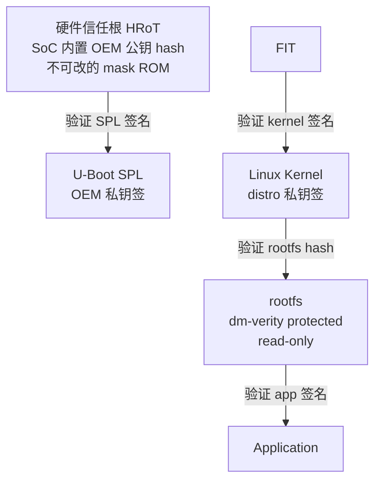

# 00-36 — 安全 + 加密学演化：从凯撒密码到后量子 / Verified Boot / TEE

> **核心问题：** 加密为什么有这么多算法？为什么 RSA 老了 ECDSA 又来 / Ed25519 又来？TLS 1.3 比 1.2 好在哪？Verified Boot 怎么把"硬件信任根"链下来到 OS？TEE / TrustZone / SGX 这些"安全飞地"是什么？为什么 RISC-V 没有 TrustZone？后量子加密为什么现在就要准备？
>


---

## 1. 大框架：安全 = 加密 + 信任根 + 隔离

```mermaid
flowchart TB
    A["安全三柱"] --> B[加密学<br/>(数学)]
    A --> C[信任根<br/>(硬件)]
    A --> D[隔离机制<br/>(特权 + 内存)]

    B --> B1[对称: AES / ChaCha20]
    B --> B2[非对称: RSA / ECDSA / Ed25519]
    B --> B3[哈希: SHA-256 / Blake3]
    B --> B4[KEX: DH / X25519]
    B --> B5[后量子: Kyber / Dilithium]

    C --> C1[硬件信任根 HRoT]
    C --> C2[Verified Boot 链]
    C --> C3[TPM / Secure Element]
    C --> C4[OEM 公钥固化]

    D --> D1[特权级 Ring/EL/M-S-U]
    D --> D2[MMU 页保护]
    D --> D3[TEE: TrustZone / SGX / TDX]
    D --> D4[Capability: seL4 / RISC-V CHERI]
    D --> D5[沙箱: 容器 / V8 / WebAssembly]
```

**这三柱缺一不可**：
- 只有加密 → 没人验证签名（攻击者改了你的代码也不知道）
- 只有信任根 → OS 跑起来后被代码注入直接绕过
- 只有隔离 → 攻击者能拿到密钥（无加密保护）

---

## 2. 加密学历史（1900-2026）

```mermaid
timeline
    1900 BC : 凯撒密码（古代）— 字母位移
    1466 : Vigenère cipher — 多表替换
    1854 : Babbage 破解 Vigenère
    1918 : Vernam — 一次一密 OTP（理论完美）
    1944 : 图灵 + Bletchley 破解 Enigma
    1949 : Shannon "Communication Theory of Secrecy"
    1976 : Diffie-Hellman 公钥交换 — 革命性
    1977 : RSA (Rivest/Shamir/Adleman)
    1977 : DES (NIST 标准, 56-bit, 已弱)
    1985 : ECDSA 椭圆曲线提出 (Koblitz/Miller)
    1991 : SSH 1.0 / PGP 1.0
    1995 : SSL 1.0 (Netscape)
    1995 : SHA-1
    1998 : AES 竞赛启动
    2001 : AES (Rijndael) 选定为 NIST 标准
    2002 : SHA-2 (SHA-256/512)
    2004 : ECDSA 标准化
    2008 : Bitcoin 用 ECDSA + SHA-256
    2014 : Ed25519 (Bernstein) — 现代签名
    2014 : ChaCha20-Poly1305 (Bernstein) — 移动友好对称
    2016 : SHA-3 (Keccak) 标准
    2018 : TLS 1.3
    2019 : Blake3 — 极快哈希
    2022 : NIST 后量子第一波 — Kyber (KEM) / Dilithium (签名) / Falcon / SPHINCS+
    2024 : NIST FIPS 203/204/205 后量子标准发布
    2026 : TLS / SSH 开始混合后量子 + ECC
```



### 2.1 加密学三大类

#### 对称加密（同一密钥加解密）

| 算法 | 密钥长度 | 速度 | 当前评价 |
|------|---------|------|---------|
| **DES** | 56-bit | 中 | 已破解（暴力可破，1998 EFF）|
| **3DES** | 168-bit | 慢 | 弱（已弃用）|
| **AES-128/192/256** | 128/192/256-bit | 快（硬件 AES-NI）| **当前主流**，未发现实质攻击 |
| **ChaCha20** | 256-bit | 极快（无硬件加速也快）| **现代选择**，移动设备 |
| **SM4** | 128-bit | 中 | 中国国密 |

**主流对称加密用法：** AES-GCM / AES-CCM / ChaCha20-Poly1305（带认证 AEAD）。

#### 非对称加密（公钥 / 私钥）

| 算法 | 安全 | 速度 | 当前评价 |
|------|------|------|---------|
| **RSA-2048** | 大数分解难度 | 慢 | 仍主流（兼容老系统）|
| **RSA-4096** | 极难分解 | 极慢 | 高安全场景 |
| **ECDSA P-256** | 椭圆曲线离散对数 | 快 | TLS / Bitcoin / SSH 主流 |
| **Ed25519** | Edwards 曲线 | 极快 | 现代 SSH / TLS / Git 签名 |
| **X25519** | DH 密钥交换 | 极快 | 现代 TLS 1.3 |
| **SM2** | 中国 ECC | 快 | 国密 |
| **后量子 Kyber** | 格密码 (KEM) | 中 | 2024 NIST 标准 |
| **后量子 Dilithium** | 格密码 (签名) | 中 | 同上 |

#### 哈希函数

| 算法 | 输出 | 评价 |
|------|------|------|
| **MD5** | 128-bit | 已破解，仅校验完整性 |
| **SHA-1** | 160-bit | 弱（2017 谷歌制造碰撞）|
| **SHA-256 / SHA-512** | 256/512-bit | 主流 |
| **SHA-3 (Keccak)** | 多种 | NIST 备份 |
| **Blake2 / Blake3** | 多种 | 极快，现代 |
| **SM3** | 256-bit | 中国国密 |
| **xxHash** | 64/128-bit | 极快但非加密 |

### 2.2 后量子加密（PQC）—— 为什么现在就要准备

**威胁：** 量子计算机用 Shor 算法能在多项式时间破解 RSA / ECDSA。

**进展：** 2024 年量子计算机最大约 1000 qubits（IBM Condor），破解 RSA-2048 需要约 4000 logical qubits（含纠错）→ 还差 100×。

**但 2024 NIST 已发布 PQC 标准：**
- **CRYSTALS-Kyber** (FIPS 203) — KEM
- **CRYSTALS-Dilithium** (FIPS 204) — 签名
- **SPHINCS+** (FIPS 205) — 哈希签名

**为什么现在就要部署：** "Harvest now, decrypt later" — 攻击者今天截获 TLS 数据，等量子计算机 10 年后破解。**敏感数据现在就该用 PQC**。

**混合模式：** 现实部署混合 ECC + PQC（Cloudflare 已部署 X25519+Kyber）。

---

## 3. 协议层加密：TLS / SSH / IPsec

### 3.1 TLS 演化（已在 [00-21-network-stack-evolution](00-21-network-stack-evolution.md) § 4.3 详）

简表：
- SSL 1.0/2.0 — 不安全
- SSL 3.0 — 2014 POODLE
- TLS 1.0 (1999) — 已弃
- TLS 1.1 (2006) — 已弃
- TLS 1.2 (2008) — 仍兼容
- **TLS 1.3 (2018)** — 1-RTT / 0-RTT / 强制 PFS / **当前主流**

### 3.2 SSH 演化

| 版本 | 年 | 关键 |
|------|---|------|
| SSH-1 | 1995 | Tatu Ylönen 原型，已不安全 |
| SSH-2 | 2006 (RFC 4251) | 主流 |
| OpenSSH | 1999 → 现在 | 主流实现 |

**SSH 密钥类型：**
- RSA-2048（兼容性）
- ECDSA P-256
- **Ed25519（现代推荐）**
- ssh-dss（已弃）

### 3.3 IPsec / WireGuard

- **IPsec** (1998+) — 老牌 VPN，复杂
- **OpenVPN** (2001) — 用户态，简单
- **WireGuard** (2018) — Jason Donenfeld，1000 行 C，简洁，性能极佳
- **Tailscale** (2019) — WireGuard + 自动配置

---


### 4.1 完整链路



每一段用上一段提供的公钥验证下一段。**私钥永远不在设备上**。

### 4.2 各层实现

| 层 | 技术 |
|----|------|
| 硬件根 | OEM 公钥 hash 固化在 SoC eFuse / ROM |
| Bootloader 验签 | SPL 内嵌 RSA / ECDSA 公钥，验证下一段 ELF / FIT |
| Kernel 验签 | 通过 FIT 签名机制 |
| Rootfs 完整性 | dm-verity（hash tree on read-only fs）|
| App 签名 | distro 包管理（rpm sigs / dpkg sigs / Android APK signature）|

### 4.3 现实生产例

#### Google ChromeOS Verified Boot

- 5 阶段：RO firmware → RW firmware → kernel → rootfs (dm-verity) → user data (encrypted)
- 任何一段被改 → 红色"重启进恢复模式"提示
- **开源详细文档：[chromium.org Verified Boot](https://www.chromium.org/chromium-os/chromiumos-design-docs/verified-boot/)**

#### Android Verified Boot (AVB)

- 类似 ChromeOS
- vbmeta partition 含所有 hash + 签名
- AVB 2.0 + chained partitions（vendor / system 各自验证）
- **绿/黄/橙/红** 启动状态分级（红 = 拒绝启动）

#### iOS Secure Boot

- BootROM → LLB (Low-Level Bootloader) → iBoot → kernel → SecureROM 校验链
- Apple 私钥签 → 用户无法解锁（除非 jailbreak）

#### Windows Secure Boot

- UEFI Secure Boot（PK / KEK / db / dbx）
- 微软签 shim → distro 签 grub → distro 签 kernel
- 详见 [00-21](00-21-network-stack-evolution.md) 部分内容（实际应该在 boot 层笔记）


参考笔记 [03-06-u-boot-overview](03-06-u-boot-overview.md) § 9.3。

4. 用户态：dm-verity rootfs

---

## 5. 硬件信任执行环境（TEE）

让"加密 / 签名 / 密钥"操作在硬件隔离区运行——OS 也看不见。

### 5.0 跨架构"安全世界"横向详解

> **入口动机：** 笔记 [00-02-fullstack-vertical](00-02-fullstack-vertical.md) § 3.2 横向表格里"安全世界"一行只给了 4 个短词（SMM / TrustZone / 国产 / 暂无），看上去 4 个架构走的路完全不一样。这一节展开它——把"安全世界"作为一个**通用概念**先讲清楚，再对比 4 个架构各自的具体落地方式。

#### 5.0.1 什么是"安全世界"

操作系统已经把"用户态 vs 内核态"分开了，为什么还要"安全世界"？

**因为内核也可能被攻破。** 一旦攻击者拿到 ring0 / S-mode / EL1，OS 自身的隔离就全部失效——文件系统密钥 / TLS 私钥 / 指纹模板 / DRM 解码密钥 全暴露。"安全世界"是在 OS 之外**再加一层**隔离区：

| 性质 | 含义 |
|------|------|
| **更高特权** | 安全世界运行在比 OS 内核**更高的特权级**（如 ARM EL3、x86 SMM、RISC-V M-mode），OS 无法访问其内存/CSR |
| **专属 OS** | 安全世界跑独立的迷你 OS（OP-TEE / iTrustee / QSEE / SEPOS / Titan），与 Linux 完全隔离 |
| **专门用途** | 仅做密钥保管 / 加解密 / 指纹 / 启动签名 / 远程证明 / 反盗版——**不跑通用应用** |
| **小代码量** | OP-TEE 约 100 K 行 vs Linux 30 M 行——攻击面小 1000 倍 |
| **硬件强制** | 物理上 CPU 切到不同状态，缓存/DMA/IOMMU 都参与隔离 |

可视化：

```
   普通世界 (Normal World)              安全世界 (Secure World)
   ┌──────────────────────┐            ┌──────────────────────┐
   │  User App            │            │  Trusted App         │
   │   ├─ Browser         │            │   ├─ Fingerprint     │
   │   ├─ Wallet          │            │   ├─ DRM             │
   │   └─ Game            │            │   └─ Keystore        │
   ├──────────────────────┤            ├──────────────────────┤
   │  Linux / Windows     │            │  OP-TEE / SEPOS      │
   │  Kernel              │  ←─SMC──→  │  (small TEE OS)      │
   ├──────────────────────┤            ├──────────────────────┤
   │  Hypervisor          │            │  Secure Monitor      │
   │  (KVM / Hyper-V)     │            │  (BL31 / TF-A)       │
   └──────────────────────┘            └──────────────────────┘
            ↑                                   ↑
            └────── 同一颗 CPU ─────────────────┘
                  通过模式切换共享物理硬件
```

切换由专门指令触发：ARM 的 `smc` / x86 的 `INT 0x01` (SMI) / RISC-V 的 `ecall` + M-mode trap。

#### 5.0.2 x86_64：SMM → ME/PSP → SGX/TDX/SEV 的曲折演化

x86 没有"一个统一的安全世界"，而是 **4 套机制叠加**：

```
┌──────────────────────────────────────────────────────────────┐
│   x86_64 安全世界栈                                           │
├──────────────────────────────────────────────────────────────┤
│ Layer 1  SMM (1990)         BIOS 用，电源管理 + ECC + 修补    │
│                             "ring -2" — 比 ring0 更高         │
│                             SMI 中断进入；OS 完全不可见         │
│                             安全争议：BIOS 厂商滥用，攻击面大  │
├──────────────────────────────────────────────────────────────┤
│ Layer 2  Intel ME (2008)    独立 ARC/Quark 微控制器 (PCH 内)  │
│         AMD PSP (2013)      运行 MINIX (ME) / TrustZone (PSP) │
│                             永远开机，OS 无法关闭             │
│                             功能：远程管理 / DRM / 启动签名   │
│                             "ring -3" — 在 SMM 之下           │
├──────────────────────────────────────────────────────────────┤
│ Layer 3  SGX (2015)         用户态 enclave                    │
│                             OS 也看不见 enclave 内存          │
│                             2022 消费级 CPU 移除 (Tiger Lake+)│
│                             仅服务器版 (Xeon SP) 保留          │
├──────────────────────────────────────────────────────────────┤
│ Layer 4  TDX (2023)         整 VM 加密 (Trust Domain)        │
│         SEV (2017)          AMD 同类 (Secure Encrypted VM)   │
│                             Sapphire Rapids / EPYC 服务器     │
└──────────────────────────────────────────────────────────────┘
```

**关键分歧：** "SMM (历史)" 这个标签是因为 SMM 设计初衷是 BIOS 维护，不是为 TEE 而生。后来 Intel/AMD 觉得需要"真正的 TEE"才有了 SGX/TDX/SEV。所以 x86 的 secure world 是"**碎片化、商业化、争议大**"的。

> **资料：**
> - SMM 内幕：Cape's *"Attacks on UEFI Security"* (CanSecWest 2014)
> - Intel ME：[mejabuse 项目](https://github.com/corna/me_cleaner)（社区清理工具）
> - SGX SDK：[intel/linux-sgx](https://github.com/intel/linux-sgx)
> - TDX：[Intel Trust Domain Extensions Whitepaper](https://www.intel.com/tdx)

#### 5.0.3 AArch64：TrustZone（最成熟、最普及）

```
┌─────────────────────────────────────────────────┐
│   AArch64 异常等级 + 世界划分                    │
├─────────────────────────────────────────────────┤
│ EL3   Secure Monitor (TF-A BL31, 唯一 EL3)      │
│       ↑↓ smc                                    │
│ EL2   Hypervisor (Xen / KVM / Hyper-V)          │  ← Normal World
│ EL1   Linux / Windows kernel                    │
│ EL0   User App                                  │
├═════════════════════════════════════════════════┤
│ S-EL2 Secure Hypervisor (RME / OP-TEE 远期)     │
│ S-EL1 OP-TEE / Trusty / iTrustee / QSEE        │  ← Secure World
│ S-EL0 Trusted App (TA)                          │
└─────────────────────────────────────────────────┘
```

**TrustZone 关键特性：**
- 每个 CPU 寄存器（包括 cache / TLB）都标有 NS 位（Non-Secure）
- 物理内存可分 secure / non-secure 区域，硬件强制访问检查
- 设备总线（AXI）也带 NS 位，secure 设备只能从 Secure World 访问
- 只有 EL3 的 Secure Monitor 能切换世界，OS 无法跨越

**真实部署：**
| 厂商 | 安全 OS | 应用 |
|------|---------|------|
| 高通骁龙 | **QSEE** (Qualcomm Secure Execution Environment) | 指纹 / DRM / 远程证明 |
| 华为麒麟 | **iTrustee** | 银行 App / 国密签名 |
| 三星 Exynos | **Knox / Trusty** | 三星支付 / 企业管理 |
| Apple A/M 系列 | **SEPOS** (Secure Enclave Processor OS) | Touch ID / Face ID / 加密钥匙串 |
| Google Pixel | **Trusty** + Titan M | Android Keystore / Verified Boot |
| 一般 Cortex-A | **OP-TEE** (开源参考) | 详见笔记 [03-17-optee-walkthrough](03-17-optee-walkthrough.md) |

**Armv9 新增 RME (Realm Management Extension)：**
- 第 5 级"Realm World" — 不在 Normal/Secure 之内
- 给云租户用：连云厂商内核都看不见你的 VM 内存
- 类比 Intel TDX

> **资料：** TF-A 源码 `material/trusted-firmware-a/`、OP-TEE 源码 `boot/optee_os/`。

#### 5.0.4 LoongArch：实际没有"独立安全世界"（00-02 表格需要更正）

> **修正说明：** [00-02 § 3.2](00-02-fullstack-vertical.md) 横向表格里 LoongArch 一栏写"LASX 安全扩展"——这是**笔误**。LASX 全称 **Loongson Advanced SIMD Extension**，是 256 位向量指令扩展，与 SIMD/AI 计算相关，与"安全"无关（同 ARM NEON / x86 AVX）。

LoongArch (3A6000) 实际的安全机制：

| 机制 | 描述 |
|------|------|
| **特权级 PLV0-PLV3** | 类比 x86 ring0-3，但**没有比 PLV0 更高的"安全特权级"**（无 SMM 等价物） |
| **UEFI Secure Boot** | 沿用 x86 那套：EDK2 + 龙芯固件签名 → grub2 → kernel |
| **TPM 2.0** | 部分主板带 TPM 芯片，提供 RoT 和 PCR |
| **国密 SM2/3/4** | 国密算法在 OpenSSL / 内核 / 龙芯 BIOS 中支持，详见 § 10 |
| **LoongSec** | 龙芯固件的可信启动签名链（厂商方案，不公开） |
| **不在 SoC** | 龙芯 3A6000 不带类 TrustZone / 类 ME 的"独立安全世界"——**安全世界这一行严格说应填"无（依赖软件 + UEFI Secure Boot + TPM 外挂）"** |

LoongArch 走的是"软件 + 国密 + 外挂 TPM"路线，没把"硬件隔离的 secure world"做进 ISA 里。这是国产化路径的**保守选择**——优先稳定 + 国密合规，TEE 能力等社区/未来 ISA 扩展再说。

> **资料：**
> - LoongArch Reference Manual Vol.1 § 第 4 章 特权架构（无 secure mode 描述）
> - 龙芯中科开放固件：[loongson-community/firmware-loongarch64](https://github.com/loongson-community)（部分公开）
> - 国密算法库：[Tongsuo](https://github.com/Tongsuo-Project)（铜锁，OpenSSL 国密 fork）

#### 5.0.5 RISC-V：暂无标准，多家方案竞争

RISC-V 设计哲学是"**最小核 + 模块化扩展**"，TEE 不在 base ISA。社区在探索：

| 方案 | 路线 | 特点 | 状态 |
|------|------|------|------|
| **Keystone** (UC Berkeley) | M-mode SM (Security Monitor) + PMP 隔离 enclave | 学术项目，参考实现 | 论文 + 原型 |
| **Penglai** (蚂蚁集团 / 上交大) | 扩展 Keystone，per-task 多 enclave | 中国研究 | 论文 + 代码 |
| **Sanctum** (MIT) | RISC-V on FPGA + 自定 PMP 风格 | 早期学术 | 论文 |
| **MultiZone** (Hex-Five) | 商业 multi-zone 隔离 | 嵌入式产品 | 商业产品 |
| **SiFive WorldGuard** | World ID 标记每个 master/transaction，AXI 强制检查 | 商业 SoC IP | SiFive 部分核 |
| **CHERI** (Cambridge) | Capability-based memory，不是 TEE 而是更细粒度的隔离 | Morello SoC 已流片 | 实验性 |
| **PMP / sPMP / Smepmp** | 物理内存保护，是 TEE 的**必需基础**而非完整 TEE | 标准 ISA 已有 | 已 ratified |
| **未来 H-ext + Smcdeleg** | H 扩展 + 委托可能拼出 TEE | 草案 | 讨论中 |

**RISC-V 为什么"暂无标准"？**

ISA 联盟决策慢，且各家诉求不同：
- 嵌入式厂商要 lightweight（MultiZone 风）
- 数据中心要 confidential VM（SEV/TDX 风）
- 学术界要可证明（CHERI/Sanctum 风）
- 中国厂商要国密合规

短期内不会有"RISC-V TrustZone 标准"，更可能是 PMP+H+Domain 多扩展拼出来的解决方案。

> **资料：**
> - Keystone 论文：[Lee et al. EuroSys 2020](https://keystone-enclave.org)
> - Penglai：[Wang et al. ATC 2021](https://github.com/Penglai-Enclave)
> - SiFive WorldGuard：SiFive [WorldGuard whitepaper](https://www.sifive.com/blog/worldguard)
> - CHERI / Morello：[cheri-cpu.org](https://www.cheri-cpu.org)
> - 本仓库本地 `material/keystone/`（如已 clone）

#### 5.0.6 横向对比一图流（00-02 § 3.2 表格的展开版）

| 维度 | x86_64 | AArch64 | LoongArch | RISC-V |
|------|--------|---------|-----------|--------|
| **是否有独立"安全世界"** | 部分（SMM + SGX/TDX，不统一）| **是**（TrustZone）| **否**（依赖 UEFI + TPM）| **暂无标准**（社区 Keystone/SiFive WorldGuard 等）|
| **隔离机制** | 模式（SMM）+ 内存加密（SGX/TDX/SEV）| EL3 + S-EL1/S-EL0 + AXI NS bit | 软件 + 外挂 TPM | M-mode + PMP + （未来）H + Domain |
| **入口指令** | `smi`（SMM）/ `enclu`（SGX）| `smc` / `hvc` | `ecall` 到 PLV0 | `ecall` 到 M-mode trap |
| **代表 Secure OS** | （SMM 无 OS）/ Intel ME 跑 MINIX | OP-TEE / Trusty / iTrustee / SEPOS / QSEE | 无 | Keystone SM / Penglai |
| **标准化** | 厂商专有 + Intel/AMD 各搞各 | **Arm 官方** + GP TEE Spec | 无（厂商各搞）| **正在制定**（PMP+H 草案）|
| **典型 OS 集成** | Intel SGX SDK / TDX guest kernel | Linux Trusty driver / OP-TEE supplicant | （N/A）| keystone-driver |
| **远程证明** | Intel SGX Quote / TDX Quote / DCAP | TF-A + OP-TEE attestation | 无 | Keystone attestation |
| **生产规模** | Intel 服务器 + AMD 服务器 | **几乎所有现代手机** | 龙芯电脑 / 服务器 | 早期产品（Hex-Five / SiFive 部分）|


| 阶段 | 安全世界设计 |
|------|-------------|
| **远期 (KuVisor)** | 跟踪 RISC-V 联盟 Domain / WorldGuard 进展，可能直接用标准化方案 |

**与笔记 [03-17-optee-walkthrough](03-17-optee-walkthrough.md) 的关系：** OP-TEE 是 ARM 阵营**已经成熟 20 年**的 TEE OS 实现——读它能学到 TEE OS 的内部架构（TA / supplicant / GP API / 加密原语），即便 RISC-V 阵营暂无对标，**架构经验完全可迁移**。读 OP-TEE 是学 TEE 的最高 ROI 路径。

---

### 5.1 ARM TrustZone

```
┌─────────────────────────────────────┐
│  Normal World (Linux)              │
│  ┌──────────────┐                 │
│  │ Linux + apps │                 │
│  └──────────────┘                 │
└─────────────────────────────────────┘
         │ SMC instruction
         ↓
┌─────────────────────────────────────┐
│  Secure World (TEE)                │
│  ┌──────────────┐                 │
│  │ OP-TEE       │ ← TEE OS       │
│  │ + TAs        │   trusted apps │
│  └──────────────┘                 │
└─────────────────────────────────────┘
```

详见笔记 [00-07-os-evolution](00-07-os-evolution.md) § 5（虚拟化）+ [00-02-fullstack-vertical](00-02-fullstack-vertical.md) § 9 / [03-02-boot-overview](03-02-boot-overview.md) § 9.1（专有名词）。

### 5.2 Intel SGX（Software Guard Extensions）

- 2015 Intel 推出
- "enclave"：进程内安全飞地（即使 OS 也看不见 enclave 内存）
- 用：DRM / 区块链 / 数据库加密
- **2022 Intel 在消费级 CPU 移除 SGX**（Tiger Lake+），仅服务器留
- 安全争议：多次侧信道攻击（Foreshadow / SGAxe / ÆPIC）

### 5.3 Intel TDX（Trust Domain Extensions）

- SGX 的"VM 级"接班：保护整个虚拟机
- 2023 Sapphire Rapids 起服务器有

### 5.4 AMD SEV（Secure Encrypted Virtualization）

- 类 TDX 但 AMD 阵营
- 加密 VM 内存
- 服务器 EPYC 主流

### 5.5 RISC-V CHERI（剑桥 / Capability Hardware）

- 不是 TEE 而是**capability-based memory protection**
- 每个指针带 capability tag（界限 + 权限）
- 硬件强制检查
- 实验性（Morello SoC）

### 5.6 RISC-V H 扩展 + 可能的 PMP

- RISC-V 标准：PMP（Physical Memory Protection）+ ePMP
- H 扩展加 G-stage 翻译
- 暂无标准化 TEE，社区在探索 Keystone / Penglai / Sanctum

---

## 6. TPM 与硬件加密模块

### 6.1 TPM（Trusted Platform Module）

- 独立芯片或 firmware（fTPM）
- 保存加密密钥 / 测量值（PCR）/ 签名
- TPM 1.2（2003）/ TPM 2.0（2015 起，主流）
- Windows 11 强制要求
- Linux 用 tpm2-tools 操作

### 6.2 HSM（Hardware Security Module）

- 数据中心级独立硬件加密设备
- 网络加密 / CA 私钥保护 / 金融行业
- 商品：Thales Luna / AWS CloudHSM

### 6.3 Secure Element

- 手机 / 银行卡内的安全芯片
- Apple Secure Enclave / Google Titan M
- 存指纹 / Face ID / 支付密钥

---

## 7. 操作系统级安全机制

### 7.1 进程隔离（基础）

- MMU 页表
- 用户/内核分离
- syscall 边界
- ASLR (Address Space Layout Randomization)
- DEP / NX (Data Execution Prevention)
- W^X 内存权限

### 7.2 强制访问控制 (MAC)

- **SELinux** (NSA / RHEL)
- **AppArmor** (Ubuntu / SUSE)
- **TOMOYO** (NTT)

### 7.3 沙箱

- **chroot** — 老
- **namespace + cgroup** — Linux 容器基础
- **seccomp / seccomp-bpf** — syscall 过滤
- **Landlock** (Linux 5.13+) — 用户态自管沙箱
- **Apple Sandbox** (Seatbelt)
- **WebAssembly** — 浏览器 / 边缘 sandbox

### 7.4 内存安全语言

- **C / C++** — 不安全（buffer overflow / use-after-free）
- **Rust** — 借用检查器消除
- **Zig** — Bounds 检查 + 显式安全
- **Go** — GC + bounds check
- **WebAssembly** — Sandbox by design

→ Rust for Linux / Rust for Chromium 都是为了内存安全推动。

### 7.5 容器安全

详见 00-34（待写）：seccomp / capabilities / unprivileged user namespaces / gVisor / Firecracker。

---

## 8. 软件供应链安全

### 8.1 攻击面

- 恶意依赖包（npm / pip / cargo / Go modules）
- 编译器后门（Reflections on Trusting Trust，1984）
- 仓库 hijack（log4j / SolarWinds）
- 上游 patch 注入

### 8.2 防御工具

- **SBOM (Software Bill of Materials)** — SPDX / CycloneDX 格式
- **Sigstore** — 开源软件签名
- **in-toto** — 供应链 attestation
- **SLSA framework** — Supply-chain Levels for Software Artifacts
- **Reproducible builds** — bit-for-bit 重现编译

---

## 9. 侧信道攻击演化

不直接破密钥，从"侧面"提取信息：

| 攻击 | 通过什么提取 |
|------|------------|
| **Timing** | 操作时间长短（如 RSA 解密时间和密钥位有关）|
| **Power** | 功耗变化（智能卡破解经典手法）|
| **Cache** | L1/L2 cache 状态泄露 |
| **Spectre / Meltdown** (2018) | CPU 推测执行 |
| **Rowhammer** | DRAM 物理翻转 |
| **TempSensor** | 温度变化 |
| **Sound / EM** | 声音 / 电磁辐射 |
| **AI 侧信道** | 用 ML 学功耗模式 |

### 9.1 Spectre / Meltdown 影响

- 2018 公开 → 全球 CPU 漏洞
- 修复：KPTI（页表隔离）/ retpoline / IBPB
- 性能损失 5-30%（取决于工作负载）
- 后续变种：MDS / TAA / Zombieload / RIDL / Foreshadow / RAMBleed / ÆPIC ...

### 9.2 防御

- 微架构：禁用 SMT / 安全 Spectre 补丁
- 软件：constant-time 算法（不随密钥分支）
- 硬件：CHERI / 硬件强制隔离

---

## 10. 国密算法

中国密码标准：

| 算法 | 类型 | 用途 |
|------|------|------|
| **SM2** | 椭圆曲线（256-bit）| 签名 / 加密 / KEX，对标 ECDSA |
| **SM3** | 哈希（256-bit）| 对标 SHA-256 |
| **SM4** | 对称（128-bit）| 分组加密，对标 AES-128 |
| **SM9** | 标识密码（IBC）| 基于身份的加密（标识=公钥）|
| **ZUC（祖冲之）** | 流密码 | 5G / 4G 通信 |

**用途：** 政府 / 国企 / 金融 / 信创设备强制要求支持。

---


按 [user_learning_style](../CLAUDE.md) 第 5 步"自己造"：

### 11.1 起步：FIT signing


### 11.2 中期：硬件根

利用 SoC eFuse 存 OEM 公钥 hash。SPL 把自己 hash 与之对比。

### 11.3 远期：完整链 + dm-verity


### 11.4 借鉴清单

| 来自 | 借鉴 |
|------|------|
| **U-Boot Verified Boot** | FIT 签名机制 + key embedded in DT |
| **ChromeOS** | 5 阶段链路 |
| **Android AVB 2.0** | vbmeta + chained partitions |
| **OP-TEE** | 后期 TEE 集成（远期）|
| **Sigstore** | 用户态包签名 |

---

## 12. QuickStart

### 12.1 入门：日常加密操作

```sh
# SSH 密钥生成（用现代 Ed25519）

gpg --gen-key
git config user.signingkey <key-id>
git commit -S -m "..."

# OpenSSL 文件加密
openssl enc -aes-256-cbc -salt -in plain.txt -out cipher.bin
openssl enc -aes-256-cbc -d -in cipher.bin -out plain.txt

# 哈希验证
sha256sum file
b3sum file       # Blake3
```

### 12.2 熟练：本地 CA + TLS 测试

```sh
# 自签 CA + 服务器证书
openssl req -x509 -newkey rsa:4096 -keyout ca.key -out ca.crt -days 365 -nodes -subj "/CN=My CA"
openssl req -newkey rsa:2048 -keyout server.key -out server.csr -nodes -subj "/CN=server.local"
openssl x509 -req -in server.csr -CA ca.crt -CAkey ca.key -CAcreateserial -out server.crt -days 90

# nginx 配置测试 + curl --cacert ca.crt https://server.local
```

### 12.3 非常熟悉：实现自己的 TLS 1.3 客户端

参考 `net/rustls/` 学习。或者读 mbedTLS / WolfSSL（嵌入式 TLS）。

---

## 13. 名词词典

### 13.1 加密学

| 术语 | 含义 |
|------|------|
| **AES / DES / 3DES** | 对称分组加密 |
| **RSA / ECDSA / Ed25519** | 非对称签名 / 加密 |
| **DH / X25519** | 密钥交换 |
| **AEAD** | Authenticated Encryption with Associated Data (GCM/Poly1305) |
| **SHA-256 / Blake3** | 哈希 |
| **HMAC** | Hash-based MAC |
| **PBKDF2 / scrypt / Argon2** | 密码派生 |
| **PFS / Forward Secrecy** | 前向保密 |
| **PKI / CA / X.509** | 公钥基础设施 |
| **PQC** | Post-Quantum Cryptography |
| **Kyber / Dilithium** | 后量子算法 |

### 13.2 信任根 / 启动

| 术语 | 含义 |
|------|------|
| **HRoT** | Hardware Root of Trust |
| **eFuse** | 一次性可编程熔丝 |
| **Verified Boot** | 验证签名启动 |
| **Measured Boot** | 测量哈希存 TPM |
| **dm-verity** | 块设备完整性 |
| **secure boot** | UEFI 验证启动 |
| **chain of trust** | 信任链 |
| **TPM** | Trusted Platform Module |
| **HSM** | Hardware Security Module |

### 13.3 TEE

| 术语 | 含义 |
|------|------|
| **TEE** | Trusted Execution Environment |
| **TrustZone** | ARM secure world |
| **OP-TEE** | 开源 TEE OS |
| **SGX** | Intel Software Guard Ext |
| **TDX** | Intel Trust Domain Ext |
| **SEV** | AMD Secure Encrypted Virtualization |
| **CHERI** | Capability Hardware Enhanced RISC |
| **Keystone** | RISC-V TEE 学术项目 |
| **Penglai** | RISC-V TEE 中国研究 |
| **Sanctum** | RISC-V TEE MIT |
| **enclave** | SGX 概念 |

### 13.4 OS 安全

| 术语 | 含义 |
|------|------|
| **ASLR** | Address Space Layout Randomization |
| **DEP / NX / W^X** | 数据执行保护 |
| **CFI** | Control Flow Integrity |
| **PAuth** | ARM Pointer Authentication |
| **CET** | Intel Control-flow Enforcement |
| **MAC** | Mandatory Access Control |
| **DAC** | Discretionary Access Control |
| **SELinux / AppArmor / TOMOYO** | MAC 实现 |
| **seccomp** | syscall 过滤 |
| **namespace / cgroup** | Linux 容器 |
| **Landlock** | Linux 5.13+ 自管沙箱 |

### 13.5 侧信道

| 术语 | 含义 |
|------|------|
| **side channel** | 侧信道 |
| **timing attack** | 时间攻击 |
| **power analysis** | 功耗分析 |
| **Spectre / Meltdown** | CPU 推测执行漏洞 |
| **Rowhammer** | DRAM 翻转 |
| **constant-time** | 恒定时间算法 |
| **KPTI** | Kernel Page Table Isolation |

---

## 14. 进一步阅读

### 14.1 经典书

- ***Applied Cryptography*** — Bruce Schneier — 加密学圣经
- ***Cryptography Engineering*** — Schneier / Ferguson / Kohno
- ***Introduction to Modern Cryptography*** — Katz / Lindell
- ***Security Engineering*** — Ross Anderson — **强烈推荐**（免费在线第 3 版）
- ***The Architecture of Privacy*** — Trevor Hughes
- ***The Web Application Hacker's Handbook*** — Stuttard / Pinto

### 14.2 视频 / 课程

- [Stanford Cryptography 1 (Dan Boneh) on Coursera](https://www.coursera.org/learn/crypto)
- [LiveOverflow YouTube](https://www.youtube.com/c/LiveOverflow) — 漏洞 / CTF 教学
- [SANS Cyber Aces](https://cyberaces.org/) — 入门
- [Pwn College](https://pwn.college/) — 实战训练

### 14.3 RFC / 标准

- [RFC 8446 — TLS 1.3](https://datatracker.ietf.org/doc/html/rfc8446)
- [RFC 8439 — ChaCha20-Poly1305](https://datatracker.ietf.org/doc/html/rfc8439)
- [RFC 8032 — Ed25519](https://datatracker.ietf.org/doc/html/rfc8032)
- [NIST FIPS 203/204/205 — 后量子标准](https://csrc.nist.gov/publications/fips)

### 14.4 本仓库笔记串联

- [00-01-material-index](00-01-material-index.md) — 项目地图
- [00-02-fullstack-vertical](00-02-fullstack-vertical.md) — 安全在全栈中的位置
- [00-07-os-evolution](00-07-os-evolution.md) § 5 — Hypervisor / TEE
- [00-21-network-stack-evolution](00-21-network-stack-evolution.md) § 4.3 — TLS 1.3 详
- [00-12-device-driver-evolution](00-12-device-driver-evolution.md) — 驱动安全
- [03-02-boot-overview](03-02-boot-overview.md) § 9 — TrustZone / OP-TEE / SMM 名词
- [03-06-u-boot-overview](03-06-u-boot-overview.md) § 9.3 — Verified Boot 实战

### 14.5 本仓库本地资料对应

| 路径 | 主题 |
|------|------|
| `boot/optee_os/` | OP-TEE OS 实现 |
| `net/rustls/` | Rust TLS 实现 |
| `core/seL4/` | 形式化验证微内核 |
| `boot/edk2/CryptoPkg/` | UEFI Secure Boot 加密 |
| `boot/edk2/SecurityPkg/` | UEFI 安全特性 |
| `libc/musl/src/crypt/` | C libc 加密原语 |

→ 学习路径：
1. **加密理论** — 读 Schneier 书
2. **协议层** — 读 TLS 1.3 RFC 8446
3. **OS 隔离** — 跑 LXC + SELinux 实验
4. **TEE** — 读 OP-TEE 文档 + 跑 ARM 模拟器
6. **侧信道** — 读 Spectre 论文 + 跑 PoC
