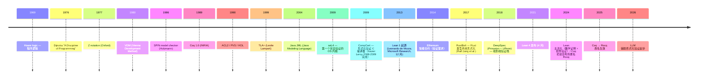
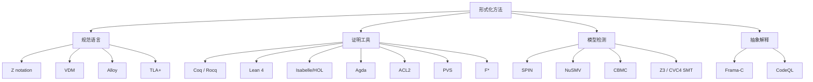

# 00-37 — 形式化验证演化（TLA+ / Coq / Lean / seL4 / 智能合约）

>
> **一句话答案：** 形式化验证 = **数学证明软件 / 硬件符合规范**。70 年从手工证明 → 自动定理证明（Coq / Lean）→ 模型检测（TLA+ / SPIN）→ 实际系统应用（seL4 / 智能合约 / CompCert）。**比测试更强但成本极高**——只用在最关键场景。


---

## 1. 历史时间轴



---

## 2. 形式化方法分类



---

## 3. 主要形式化工具详解

### 3.1 TLA+（Lamport）

- 1999 起，Leslie Lamport 主导
- 描述并发系统行为
- AWS 用于 S3 / DynamoDB 设计
- 学习曲线相对平
- TLC 模型检测器 + TLAPS 证明器

```tla
VARIABLES counter
Init == counter = 0
Next == counter' = counter + 1
Spec == Init /\ [][Next]_counter
```

### 3.2 Coq / Rocq

- 1989 INRIA
- 基于构造演算（CIC）
- **CompCert / seL4 / 智能合约验证用**
- 2024 改名 Rocq（避免 c0q 玩笑）

### 3.3 Lean 4

- Microsoft Research / 现独立基金会
- 现代依赖类型论
- 数学证明（Mathlib）+ 软件验证
- 元编程极强
- **2020s 起爆（Terence Tao 等数学家用）**

### 3.4 Isabelle/HOL

- Cambridge / Munich
- HOL（高阶逻辑）
- **seL4 用 Isabelle 验证**
- ML 元语言

### 3.5 Agda

- 现代依赖类型论
- 与 Coq 同生态位
- 学术研究主用

### 3.6 ACL2 / PVS / F*

- **ACL2**：CPU 验证（Intel / AMD 用）
- **PVS**：NASA 验证
- **F***：Microsoft（项目 Everest 验证 TLS / HTTPS）

### 3.7 SPIN（模型检测）

- Gerard Holzmann
- 检查并发协议
- 用 PROMELA 描述系统
- NASA / 太空船验证

---

## 4. 实际系统应用

### 4.1 seL4 — 形式化验证微内核

- 2009 NICTA 完成（澳大利亚）
- 7000+ 行 C
- Isabelle/HOL 证明 13 万行
- 证明：实现符合规范 + 隔离 + 终止 + 无 panic

证明覆盖：
- ✅ 函数正确性
- ✅ 完整性（信息流）
- ✅ 机密性
- ✅ 可用性

应用：DARPA HACMS（自动驾驶 / 无人机抗黑客）+ 商用航空电子。

### 4.2 CompCert — 形式化验证 C 编译器

- INRIA Xavier Leroy
- Coq 证明：编译保留语义
- 比 GCC / Clang 慢，但**保证无 miscompilation**
- 用：航空 / 核电站 / 国防

### 4.3 智能合约验证

- 区块链合约 bug = 资金损失（DAO 事件 6000 万美元）
- 验证工具：
  - **K Framework**
  - **Certora**
  - **Move Prover**（Sui / Aptos）
  - **Coq + 智能合约 DSL**

### 4.4 AWS 大规模 TLA+ 应用

- DynamoDB / S3 / IAM 设计验证
- "Use of Formal Methods at Amazon Web Services" (Newcombe et al. 2014)
- 业内推动 TLA+ 普及

### 4.5 Project Everest（Microsoft）

- F* 验证整个 TLS 1.3 栈
- mitls / vale assembler
- 输出可证明无漏洞 TLS 实现

### 4.6 RustBelt

- Rust 类型系统形式化
- Coq 证明 Rust 无 UB
- 学术 + 工业意义

---

## 5. 模型检测 vs 定理证明

| 维度 | 模型检测 | 定理证明 |
|------|---------|---------|
| 自动化 | 高（自动）| 低（交互）|
| 状态空间 | 有限 / 抽象 | 无限可处理 |
| 难度 | 低-中 | 极高 |
| 性能 | 可能爆炸 | 一旦证完任意输入都成立 |
| 工具 | SPIN / NuSMV / TLC | Coq / Lean / Isabelle |

→ **模型检测：找具体反例**；**定理证明：证明全集合**。

---

## 6. 软件 vs 硬件验证

### 6.1 硬件形式化

- **EDA 工具**：JasperGold / VC Formal
- **SystemVerilog Assertions (SVA)**
- **属性规范语言 (PSL)**
- 主用：CPU 验证（Intel / AMD / Apple）

Intel Pentium FDIV bug (1994) 损失 4.75 亿美元 → 推动硬件形式化。

### 6.2 软件形式化

- 关键系统：航空（DO-178C）/ 核电（IEC 60880）
- 工业普及度：低（成本高）
- 兴起场景：智能合约 / 自动驾驶 / 加密协议

---

## 7. 形式化的代价

```
传统软件：
  设计 30%, 编码 30%, 测试 40%
  
形式化软件：
  设计 50%, 形式化 30%, 编码 10%, 测试 10%
  
seL4 数据：
  C 代码：7000 行
  形式化证明：130000 行 (19× 比例)
  时间：12 人年
```

→ **每行代码 ~5000 美元成本**，只用最关键场景。

---

## 8. 现代趋势

### 8.1 LLM 辅助形式化

- 2024 起，GPT-4 / Claude / Gemini 帮忙写 Coq 证明
- AlphaProof (DeepMind 2024) 国际数学奥林匹克银牌
- 趋势：交互式 + AI hint

### 8.2 Lean 数学库 Mathlib

- 100+ MB 形式化数学
- Tao / Buzzard 等数学家推动
- 2024 4 万定理 + 80 万行证明

### 8.3 端到端验证

- DeepSpec — 验证整个软件栈（编译器 + OS + 应用）
- 远期：从规范到硅片全证明

---


### 9.1 短期：不验证

- 用 Zig comptime + 单元测试

### 9.2 中期：关键路径

- 加密 / Verified Boot 链路（用 F* 风格）
- 核心 IPC（参 seL4）
- 边界检查（用 Zig 内置）

### 9.3 远期：seL4 风格

- 用 Lean 4 或 Isabelle/HOL
- 工程量 = 几个博士的工作

### 9.4 借鉴

| 来自 | 借鉴 |
|------|------|
| seL4 | 微内核完整验证 |
| RustBelt | 类型安全证明 |
| TLA+ | 设计规范 |

---

## 10. 名词词典

| 术语 | 含义 |
|------|------|
| **formal verification** | 形式化验证 |
| **theorem proving** | 定理证明 |
| **model checking** | 模型检测 |
| **abstract interpretation** | 抽象解释 |
| **SAT / SMT solver** | 可满足性求解 |
| **proof assistant** | 证明助手 |
| **Coq / Rocq / Lean / Isabelle / Agda** | 主流证明工具 |
| **TLA+** | Lamport 时序逻辑 |
| **SPIN / NuSMV** | 模型检测器 |
| **CIC** | Calculus of Inductive Constructions |
| **HOL** | Higher-Order Logic |
| **dependent types** | 依赖类型 |
| **Curry-Howard** | 类型即命题 |
| **assertion** | 断言 |
| **invariant** | 不变量 |
| **liveness / safety** | 活性 / 安全性 |
| **temporal logic** | 时序逻辑 |
| **CTL / LTL** | 计算树逻辑 / 线性时序逻辑 |
| **state explosion** | 状态空间爆炸 |
| **property-based testing** | 基于性质测试（QuickCheck）|

---

## 11. 进一步阅读

### 11.1 经典书

- ***Software Foundations*** (Pierce 等) — Coq 入门，免费在线
- ***Specifying Systems*** — Leslie Lamport — TLA+
- ***Concrete Semantics*** — Isabelle/HOL
- ***Theorem Proving in Lean 4*** — Mathlib 团队
- ***Certified Programming with Dependent Types*** — Adam Chlipala — Coq
- ***seL4: Formal Verification of an OS Kernel*** (论文)

### 11.2 资源

- [Coq / Rocq 官网](https://rocq-prover.org/)
- [Lean 4 mathlib](https://leanprover-community.github.io/)
- [TLA+ Toolbox](https://lamport.azurewebsites.net/tla/toolbox.html)
- [seL4](https://sel4.systems/)

### 11.3 本仓库笔记串联

- [00-07-os-evolution](00-07-os-evolution.md) — seL4 微内核
- [00-36-security-evolution](00-36-security-evolution.md) — Verified Boot 与形式化
- [00-08-lang-evolution](00-08-lang-evolution.md) — 类型系统

### 11.4 本仓库本地资料

| 路径 | 用途 |
|------|------|
