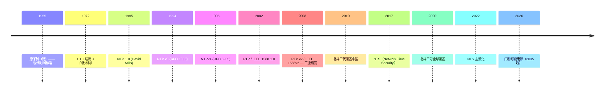

# 00-38 — 时间同步演化（NTP / PTP / GPS / 原子钟 / 北斗）

>
> **一句话答案：** 时间 = **本地振荡（晶振 / 原子钟）+ 网络同步（NTP / PTP）+ 卫星定时（GPS / 北斗 / GLONASS）+ 闰秒处理**。NTP 毫秒级 / PTP 微秒级 / GPS 纳秒级 / 原子钟皮秒级 — 越精越贵。


---

## 1. 历史时间轴



---

## 2. 时间标准

### 2.1 时间尺度

| 标准 | 定义 |
|------|------|
| **TAI** | International Atomic Time — 原子时（无闰秒）|
| **UTC** | Coordinated Universal Time — TAI + 闰秒 |
| **UT1** | Universal Time — 基于地球自转 |
| **GPS time** | TAI - 19 秒（GPS 自定）|
| **Unix time / epoch** | 自 1970-01-01 00:00:00 UTC 秒数 |

### 2.2 闰秒

地球自转减慢 → 偶尔加 1 秒让 UTC 跟上 UT1：
- 1972 起累计加了 27 个闰秒
- IT 基础设施大麻烦（系统挂、bug 满天飞）
- **2022 决议：2035 起废除闰秒**

---

## 3. NTP（Network Time Protocol）

### 3.1 NTP 概念

```
client → 4 个时间戳与 server 交换：
  T1: 客户端发送时间
  T2: 服务器接收时间  
  T3: 服务器发送时间
  T4: 客户端接收时间
  
计算：
  offset = ((T2 - T1) + (T3 - T4)) / 2
  delay  = (T4 - T1) - (T3 - T2)
```

### 3.2 NTP 层级

```
Stratum 0: 参考时钟（GPS / 原子钟）
Stratum 1: 直连参考的 server（pool.ntp.org primary）
Stratum 2: 同步 stratum 1
Stratum 3+: 公网普通用户
```

### 3.3 公开 NTP 池

| pool | 用途 |
|------|------|
| **pool.ntp.org** | 全球 |
| **time.cloudflare.com** | Cloudflare |
| **time.google.com** | Google（含闰秒平滑）|
| **time.apple.com** | Apple |
| **ntp.aliyun.com** | 阿里云 |
| **ntp1.aliyun.com** | 同 |

### 3.4 NTP 实现

| 实现 | 特点 |
|------|------|
| **ntpd / NTP 参考** | 老牌 |
| **chrony** | 现代默认（Fedora/RHEL/Arch）|
| **systemd-timesyncd** | systemd 内置 |
| **OpenNTPD** | OpenBSD |
| **ntimed** | Poul-Henning Kamp 简化版 |

### 3.5 NTP 精度

```
LAN: 1-10 ms
WAN: 10-100 ms
质量好的 stratum-2 server: 1-2 ms
```

### 3.6 NTS（Network Time Security）

- 2017 RFC 8915
- NTP 加密 + 认证
- 防止 server 假冒攻击
- Cloudflare 主推

---

## 4. PTP（Precision Time Protocol，IEEE 1588）

### 4.1 PTP 概念

NTP 软件级，PTP 硬件辅助 → 高得多精度。

### 4.2 PTP 精度

```
NTP: ms 级
PTP v1: μs 级
PTP v2: 100 ns 级（硬件时间戳）
精确版 White Rabbit: ps 级
```

### 4.3 PTP 应用

- 5G 基站同步
- 工业自动化
- 金融 HFT（高频交易，法规要求 100 μs）
- 电力系统
- 数据中心

### 4.4 PTP 实现

- **ptp4l** (Linux PTP)
- **PTPd**
- 商业：FSMLabs / Meinberg

---

## 5. GNSS（卫星定时定位）

### 5.1 主要 GNSS

| 系统 | 国家 | 卫星数 |
|------|------|-------|
| **GPS** | 美国 | 31+ |
| **GLONASS** | 俄罗斯 | 24+ |
| **Galileo** | 欧盟 | 30 |
| **北斗** | 中国 | 35 |
| **QZSS** | 日本（区域）| 4 |
| **NavIC / IRNSS** | 印度（区域）| 7 |

### 5.2 GPS 定时

- 卫星携原子钟
- 接收器接收 4 颗卫星信号 → 解算位置 + 时间
- 时间精度：<100 ns
- PPS（Pulse Per Second）信号给参考时钟

### 5.3 北斗特点

- 双向通信（独有）
- 短报文（紧急救援）
- 中国区域增强
- 2020 全球覆盖

---

## 6. 原子钟

### 6.1 类型

| 类型 | 精度 | 用途 |
|------|------|------|
| **石英晶振** | 10⁻⁶ | 普通设备 |
| **温补晶振 (TCXO)** | 10⁻⁷ | 工业 |
| **OCXO** | 10⁻⁸ | 通信基站 |
| **铷原子钟** | 10⁻¹¹ | GPS 卫星 |
| **铯原子钟** | 10⁻¹³ | 时间标准 |
| **氢脉泽** | 10⁻¹⁵ | 实验室参考 |
| **光钟** | 10⁻¹⁸ | 最尖端 |

### 6.2 NIST / NIM

- 美国 NIST F-1 / F-2 — 国家时间标准
- 中国 NIM5 / NIM6 — 中国国家计量院

---

## 7. 时区数据库（tzdata）

### 7.1 IANA tzdata

- 全球 600+ 时区
- 历史变更（夏令时 / 时区改革）
- 每年 4-6 次更新
- 例：`Asia/Shanghai` / `America/New_York`

### 7.2 各 OS 时区文件

```
Linux / macOS: /usr/share/zoneinfo/
Windows: 注册表 + ICU
```

### 7.3 时区难题

- 历史时区（俄罗斯多次改）
- DST 切换（春进秋退）
- 政治：朝鲜 2015 改时区
- 政治：委内瑞拉 / 萨摩亚等多次跳

---

## 8. 嵌入式 RTC（Real-Time Clock）

### 8.1 RTC 硬件

```
独立芯片 / SoC 内部
  ├─ 32.768 kHz 石英晶振
  ├─ 计数器（秒）
  ├─ 备份电池（CR2032）
  └─ I2C / SPI 接口

掉电不丢，开机读出
```

### 8.2 主流 RTC IC

| RTC | 厂家 |
|-----|------|
| **DS1307 / DS3231** | Maxim |
| **PCF8523 / PCF8563** | NXP |
| **MCP7940** | Microchip |
| **RX8025** | Epson |

### 8.3 SoC 内置 RTC

- STM32 内置 RTC（带 backup domain）
- ESP32 内置 RTC
- 树莓派 5 终于有内置 RTC（之前 Zero/3/4 都无）

### 8.4 嵌入式时间同步

```
启动：
  1. 读 RTC（粗时间）
  2. 联网后 NTP / SNTP 同步（精时间）
  3. 写回 RTC（持久化）
  4. 长期：偶尔同步保持精度
```

---

## 9. 操作系统中的时间

### 9.1 Linux 时钟源

```
clocksource:
  - tsc (x86 timestamp counter)
  - hpet (High Precision Event Timer)
  - acpi_pm
  - jiffies (老)
  - arch_sys_counter (ARM 系统计数器)
```

### 9.2 各种 clock_id

```c
clock_gettime(CLOCK_REALTIME, &ts);     // 墙时（可被 NTP 改）
clock_gettime(CLOCK_MONOTONIC, &ts);    // 单调（不会倒退，启动起算）
clock_gettime(CLOCK_BOOTTIME, &ts);     // 含 sleep 时间
clock_gettime(CLOCK_PROCESS_CPUTIME_ID, &ts);  // 进程 CPU 时间
clock_gettime(CLOCK_THREAD_CPUTIME_ID, &ts);   // 线程 CPU 时间
```

### 9.3 常见接口

```c
time(NULL);              // 1970 起秒数
gettimeofday(&tv, NULL); // 微秒
clock_gettime(...);      // 纳秒（推荐）
nanosleep(...);          // 纳秒级 sleep
```

### 9.4 SoC tickless 内核

- 不打周期 tick（节能）
- 设备空闲时关 timer
- Linux NO_HZ_FULL（甚至运行时也不打）
- 详见 [00-28-power-energy](00-17-power-energy-evolution.md)

---


```zig
// SBI TIME 扩展
sbi_set_timer(deadline)  // S-mode 设定下次中断
mtime / mtimecmp 寄存器

// CLINT-based timer (qemu_virt)
TIMER_FREQ_HZ = 10_000_000  // 10 MHz
```


```
1. 高精度 monotonic clock（mtime + frequency）
2. wall time（启动后用 RTC 初始化）
3. NTP 客户端（内核 / 用户态）
4. PTP（远期，工业用）
5. 时区数据库（内嵌 tzdata 子集）
```

### 10.3 借鉴

| 来自 | 借鉴 |
|------|------|
| Linux clocksource | 时钟源抽象 |
| chrony | NTP 客户端 |
| ARM Generic Timer | 硬件抽象 |
| RISC-V Zicntr | mtime 标准化 |

---

## 11. 名词词典

| 术语 | 含义 |
|------|------|
| **NTP** | Network Time Protocol |
| **NTS** | Network Time Security |
| **PTP / IEEE 1588** | Precision Time Protocol |
| **PPS** | Pulse Per Second |
| **GPS / GLONASS / Galileo / 北斗 / GNSS** | 卫星定位 |
| **TAI / UTC / UT1** | 时间标准 |
| **leap second** | 闰秒 |
| **epoch / Unix time** | 1970-01-01 起秒数 |
| **stratum** | NTP 层级 |
| **chrony / ntpd / systemd-timesyncd** | NTP 实现 |
| **ptp4l** | Linux PTP |
| **RTC** | Real-Time Clock |
| **TCXO / OCXO** | 温补 / 恒温晶振 |
| **atomic clock** | 原子钟 |
| **tzdata** | 时区数据库 |
| **DST** | Daylight Saving Time |
| **CLOCK_REALTIME / MONOTONIC / BOOTTIME** | Linux 时钟 |
| **clocksource** | Linux 时钟源 |
| **tickless** | 无周期 tick |

---

## 12. 进一步阅读

### 12.1 资源

- [NTP RFC 5905](https://datatracker.ietf.org/doc/html/rfc5905)
- [IEEE 1588 (PTP)](https://standards.ieee.org/ieee/1588/4355/)
- [tzdata 时区数据库](https://www.iana.org/time-zones)
- [NIST 时间网](https://tf.nist.gov/)

### 12.2 经典书 / 文章

- ***Computer Network Time Synchronization*** — David Mills (NTP 之父)
- ***Falsehoods Programmers Believe About Time*** — 经典文章
- ***Time, Clocks, and the Ordering of Events*** — Lamport (论文)

### 12.3 本仓库笔记串联

- [00-07-os-evolution](00-07-os-evolution.md) — RTOS timer
- [00-21-network-stack-evolution](00-21-network-stack-evolution.md) — NTP 在网络栈
- [00-06-aiot-hardware-software-evolution](00-06-aiot-hardware-software-evolution.md) — 嵌入式 RTC
- [00-15-concurrency-sync-evolution](00-15-concurrency-sync-evolution.md) — Lamport 时间排序
- [00-17-power-energy-evolution](00-17-power-energy-evolution.md) — tickless
- [02-04-sbi-complete-reference](02-04-sbi-complete-reference.md) — SBI TIME 扩展

### 12.4 本仓库本地资料

| 路径 | 用途 |
|------|------|
| `libc/musl/src/time/` | musl time 函数 |
