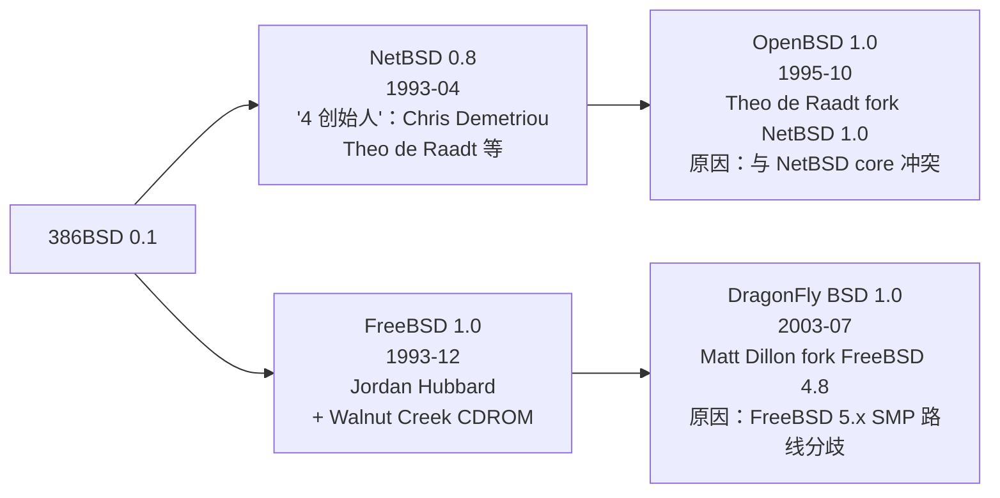

# 00-39 BSD 家族演化与横向对比

> **本文位置：** 00 大类总览 / OS 演化分支专题（与 [00-07 OS 60 年演化史](00-07-os-evolution.md) 互补，专写 BSD 这一支）
>
> - 1980 年代 BSD 是 Unix 的**主要工程演进路径**（vi / csh / sendmail / TCP-IP 栈 / Sockets API 都来自 BSD）
> - 1990 年代 386BSD 是**第一个能在 PC 上跑的免费 Unix**（早于 Linux 0.01 半年）
> - 现代 BSD 与 Linux 是**两条互不替代的工程范式**：BSD 走"完整 OS = 内核 + userland + 文档一体设计"；Linux 走"内核 + GNU userland 拼装 + distro 各自打包"
> - macOS / iOS / PS4 / PS5 / Netflix CDN / Junos 等**当今工业大动脉都跑 BSD 内核或 BSD 代码**
> - BSD 安全/虚拟化原创（jail / pledge / unveil / Capsicum / bhyve / ZFS-on-FreeBSD）反向影响 Linux（namespaces / seccomp / KVM 的设计参照点）
>
> **与其他笔记的关系：**
> - **互补**：[00-07 OS 演化](00-07-os-evolution.md) — 60 年 OS 全谱中 BSD 只占数行，本文展开
> - **互补**：[00-35 Linux 发行版演化](00-35-distro-evolution.md) — 那里写 Linux distro，本文写 BSD（BSD 自身就是发行版，无 distro 概念）
> - **互补**：[00-13 驱动系统设计 + 兼容策略](00-13-driver-system-design-and-compat.md) — §7.4 BSD devfs / NetBSD rump kernel / FreeBSD LinuxKPI 在那已经讲过驱动接口；本文写 BSD 整体而非单驱动子系统
> - **互补**：[00-16 syscall / ABI 演化](00-16-syscall-abi-evolution.md) — BSD socket API 是 POSIX 网络栈的起源
> - **互补**：[00-36 Security 演化](00-36-security-evolution.md) — jail/pledge/W^X/Capsicum 在那处简略，本文展开
> - **配套本地资料**：`core/freebsd/`（完整源码，含 `sys/riscv/`）、`core/netbsd/`（完整源码，70+ 架构端口），见 [00-01 § core/](00-01-material-index.md)
>
> **写作约束（per `feedback_no_skip.md` / `feedback_no_kuos_speculation.md`）：**
> 1. 不写"跳过 X / 不必读 / 没必要" — 任何分支都讲完来龙去脉，非常不重要的可一行带过
> 3. 不推断未署名作者身份 — GitHub username / 邮箱字段字面收录，不映射真实姓名
>
> **本文结构（20 节）：** §1 BSD 是什么 → §2 完整演化时间线（1977→2026）→ §3 AT&T USL 诉讼与四大 BSD 分裂始末 → §4 FreeBSD 深入 → §5 OpenBSD 深入 → §6 NetBSD 深入 → §7 DragonFly BSD 深入 → §8 BSD 衍生（XNU/Darwin/Junos/PS4/PS5/PfSense/TrueNAS）→ §9 BSD vs Linux 设计哲学对比 → §10 内核结构对照 → §11 Ports / pkgsrc / pkg(8) 包系统 → §12 安全原创（jail/pledge/unveil/W^X/Capsicum/Veriexec）→ §13 文件系统（UFS/UFS2/FFS/ZFS/HAMMER/HAMMER2）→ §14 网络栈与 socket API 起源 → §15 RISC-V 在各 BSD 上的现状 → §16 文档传统（Handbook / man / RFC 风格）→ §17 工业部署横向 → §18 本地源码导航（core/freebsd, core/netbsd）→ §19 词典 → §20 练习题

---

## §1 BSD 是什么 — 三种解读

"BSD" 在不同语境下含义不同，先厘清：

| 层面 | 含义 | 举例 |
|:-----|:-----|:-----|
| **历史项目** | Berkeley Software Distribution — UC Berkeley CSRG 维护的 Unix 发布版（1977-1995）| 1BSD / 2BSD / 3BSD / 4.0BSD / 4.4BSD-Lite |
| **现代 OS 家族** | 由 4.4BSD-Lite 派生出的一组完整 OS | FreeBSD / OpenBSD / NetBSD / DragonFly BSD |
| **代码许可证** | 一类极简宽松许可（原始 4-clause → 现代 2/3-clause）| BSD License vs GPL |

本文涵盖三层，重点在**现代 OS 家族**。

**核心区别于 Linux：**
- BSD = **整套 OS**（内核 + libc + userland + 工具 + 文档由同一组人统一开发）
- Linux = **内核**（Linus 团队）+ **userland**（GNU / busybox / systemd / 各 distro 各自集成）

这一根本差异决定了 BSD vs Linux 几乎所有工程实践分歧（包括 ports vs distro、man 完整性、ABI 稳定性、release 节奏等），后文 §9 展开。

---

## §2 BSD 演化完整时间线（1977 → 2026，无省略）

```mermaid
timeline
    title BSD 50 年演化完整线
    1969 : AT&T Bell Labs Unix V1 (Thompson / Ritchie)
    1973 : Unix V4 用 C 重写
    1974 : Berkeley 拿到 Unix V6 源码（学术许可，AT&T 收 100 美元）
    1977 : 1BSD — Bill Joy 编 vi / Pascal 编译器，发行 30 份磁带
    1978 : 2BSD — 加 csh / 6 个工具，发行 75 份
    1979 : 3BSD — 移植到 VAX，含 swap 虚存
    1980 : 4.0BSD — DARPA 资助，目标"美国国防部 Unix"
    1981 : 4.1BSD — 性能调优，避免 AT&T 起诉版本号 5
    1983 : 4.2BSD — TCP-IP 栈 + sockets API + FFS + 长文件名 (Sam Leffler)
    1985 : 4.3BSD — 性能 + NFS
    1986 : 4.3BSD-Tahoe — 厂商无关化（Tahoe = CCI Power 6-32 工作站）
    1988 : 4.3BSD-Net-1 — 第一次只含 BSD 原创代码（无 AT&T 代码）的网络协议栈发布
    1989 : NeXTSTEP 1.0 (Mach 2.5 + BSD 4.3) — Steve Jobs NeXT
    1991 : 4.3BSD-Net-2 — 整套 OS 中无 AT&T 代码部分发布；Bill Jolitz 接力做完剩余 6 个文件
    1991 : 386BSD 0.0 — Bill 和 Lynne Jolitz；第一个免费可在 PC 上跑的 Unix
    1992 : USL v. BSDi 诉讼（AT&T 子公司告 BSDi 含 AT&T 代码）
    1993 : NetBSD 0.8 (4 月) — 第一个 386BSD 派生，4 创始人合并修补
    1993 : FreeBSD 1.0 (12 月) — 第二个 386BSD 派生，目标 x86 易用
    1994 : USL 诉讼和解 — 4.4BSD-Lite2 删除 3 文件后免诉
    1995 : 4.4BSD-Lite Release 2 — CSRG 正式解散，最后版本
    1995 : OpenBSD 1.0 — Theo de Raadt 从 NetBSD 1.0 fork (Theo 与 NetBSD core 冲突)
    1996 : OpenBSD 2.0 — 加 ssh 雏形 (OpenSSH 来源)
    1999 : OpenSSH 1.0 — OpenBSD 项目衍生，至今几乎所有 Linux 都用
    2000 : Apple Darwin 0.1 — XNU = Mach 微内核 + FreeBSD 4.x BSD layer + IOKit
    2001 : Mac OS X 10.0 — Darwin 公开
    2003 : DragonFly BSD 1.0 — Matt Dillon 从 FreeBSD 4.8 fork，SMP 路线不同意见
    2003 : OpenBSD 3.3 — W^X (write XOR execute) 首发，比 PaX 晚但商业首发
    2005 : Sun OpenSolaris 含 DTrace / ZFS — 后被 BSD 大量借鉴
    2007 : FreeBSD 7.0 — 引入 ZFS（从 OpenSolaris CDDL）
    2007 : NetBSD 4.0 — rump kernel 原型出现（Antti Kantee 博士论文）
    2008 : DragonFly 2.0 — HAMMER FS 发布
    2010 : Sony PS3 → PS4 准备 — FreeBSD 9 作为 PS4/PS5 内核（2013/2020 上市）
    2011 : FreeBSD 9.0 — Capsicum capability framework
    2011 : NetBSD 6.0 — rump kernel 正式集成
    2014 : bhyve 加入 FreeBSD 10.0 — Type-2 hypervisor，与 KVM 对标
    2015 : OpenBSD 5.9 — pledge(2) 首发（最小特权系统调用过滤）
    2017 : OpenBSD 6.4 — unveil(2) 首发（文件系统视图限制）
    2018 : DragonFly 5.4 — HAMMER2 稳定
    2020 : FreeBSD 13.0 — RISC-V 64 升 Tier 2 支持
    2022 : NetBSD 9.3 — riscv64 港集成（still Tier 2）
    2024 : FreeBSD 14.0 — OpenZFS 2.x 集成 + RISC-V 板增加
    2026 : 当前 — FreeBSD 14.x / OpenBSD 7.6 / NetBSD 10.x / DragonFly 6.4
```



**关键事件叙事（按 [00-07 § 3.3] 笔法补叙事）：**

### §2.1 起源：1974 Berkeley 拿到 Unix V6

1974 年 AT&T 在反垄断协议下不准卖软件，所以把 Unix V6 以学术许可发给大学，每份磁带 100 美元，含完整 C 源码。Berkeley 计算机系学生 Bill Joy（后来 Sun 联合创始人）接触到，做了一系列改进（vi 编辑器从 ex 演化、Pascal 编译器、Bourne shell 改进版 csh）。

### §2.2 1BSD-3BSD（1977-1979）：磁带分发的"补丁包"

最初的 1BSD/2BSD **不是完整 OS**，是 AT&T Unix V6/V7 的**附加包**：Berkeley 把自己的工具打包发给申请者。3BSD 才开始包含 VAX 移植的内核改动（来自 32V Unix）。

### §2.3 4.0-4.3BSD（1980-1988）：DARPA 钱 + Unix 工程标杆

1980 年 DARPA（美国国防部高级研究计划局）选 Berkeley 做"标准国防 Unix"，注入大笔资金。成果：
- **4.1BSD** — 内核虚存性能调优；版本号本想叫 5BSD 但 AT&T 因 V5 商标威胁起诉，改成 4.1。这是 BSD 第一次因法律改名。
- **4.2BSD** — **奠定现代 Unix 网络栈基础**：
  - TCP/IP 协议栈（Sam Leffler 主导，第一个工业级实现）
  - **sockets API**（`socket() / bind() / listen() / accept() / connect() / send() / recv()`）— 今天全世界包括 Linux/Windows/macOS 都用这套 API
  - FFS (Fast File System) — 引入 cylinder group、长文件名（255 chars）、symlinks
- **4.3BSD-Tahoe** — 把厂商相关代码（VAX）和厂商无关代码分离 → 后来移植到任何架构的基础

### §2.4 AT&T 代码去除战（1988-1991）：4.3BSD-Net-1 / Net-2

到 1988 年大学界出现矛盾：BSD 已经几乎是新 OS，但仍混着 AT&T Unix V7 的几百个文件，使用者必须先买 AT&T Unix 源码许可。Keith Bostic（Berkeley CSRG）发起"AT&T 代码替换运动"，目标是让 BSD 完全自由发布：
- **4.3BSD-Net-1**（1988）— 网络部分（kernel TCP/IP + libc 网络 API + 工具）剥离出来单独发布，无 AT&T 代码 → 任何人可自由使用
- **4.3BSD-Net-2**（1991）— **整个 OS 减去 6 个仍含 AT&T 代码的内核文件**（主要在 vm/ swap/ 部分），其余全部 BSD License 发布
- 剩 6 个文件由 Bill Jolitz 接力重写 → 1991 年 12 月 **386BSD 0.0** 诞生：**第一个能在 PC 上跑的免费 Unix**

时序对照（重要！理解为什么 Linux 后来居上）：
| 日期 | 事件 |
|:----|:----|
| 1991-08-25 | Linus Torvalds 在 comp.os.minix 发"作为业余爱好搞 OS" |
| 1991-09 | Linux 0.01 发布 |
| 1991-12 | 386BSD 0.0 发布 |

如果没有下一节的诉讼，BSD 可能成为今天的"开源 Unix 主流"。

### §2.5 USL v. BSDi 诉讼（1992-1994）：BSD 黄金期的拦截

1992 年 BSDi（Berkeley Software Design Inc., 商业卖 386BSD 的公司）打广告"BSD/386 比 Unix 便宜，电话号码 1-800-ITS-UNIX"。AT&T 子公司 USL（Unix System Laboratories）起诉 BSDi 和 UC Berkeley，理由是 386BSD 仍含 AT&T Unix 代码 + 商标侵权。

诉讼持续两年，结果（1994 年和解）：
- USL 撤诉商标问题
- 4.4BSD 中**有 3 个文件**确认含 AT&T 代码，由 Berkeley 删除或替换 → 称 **4.4BSD-Lite Release 1**（1994）
- USL 在 Net-2 之后的 BSD 不得索赔
- **4.4BSD-Lite Release 2**（1995）— CSRG 解散前的最终版本

诉讼的工业代价：1992-1994 期间公司和开发者不敢用 BSD（怕被牵连），转而拥抱 **Linux**（当时 Linux 已涨到 1.0，无法律风险，GPL 明确）→ **Linux 借 USL 诉讼上位**，BSD 错过 Web 兴起的 1993-1996 窗口。

这是 BSD 历史**最大的"如果"**：如果没有诉讼，今天可能是 BSD 主导服务器市场，而不是 Linux。

### §2.6 三大 BSD 分裂（1993-1995）

386BSD 项目本身因 Jolitz 夫妇精力分散而停滞，但 patchkit 用户活跃。三波分裂：



四个项目从此各自演化 30 年，工程哲学逐步分化（§4-§7 展开）。

### §2.7 Apple 收购 NeXT（1996）→ Darwin / macOS 起源

1985 年 Steve Jobs 被 Apple 赶走，1985-1996 创办 NeXT 公司做工作站 OS **NeXTSTEP**：
- 内核 = **Mach 2.5**（CMU 微内核）+ **BSD 4.3 layer**
- userland = 全 BSD
- GUI = 全新 Display PostScript + Interface Builder + Objective-C

1996 Apple 危机，收购 NeXT（Jobs 带回 Apple），NeXTSTEP 改名 **Rhapsody → Mac OS X**：
- 内核保留 NeXTSTEP 的 Mach + BSD 结构，加 IOKit（driver framework，C++）→ **XNU** kernel
- BSD layer 同步到 **FreeBSD 4.x → 5.x**（直接拿 FreeBSD 代码用，至今仍在同步，但有 5-7 年滞后）
- 2000 年 Apple 开源 XNU 部分（Darwin 项目）

详见 [00-07 § 6 macOS XNU](00-07-os-evolution.md)。

### §2.8 PS4/PS5 → FreeBSD 隐形王者

2013 年 Sony PS4 上市，内核为 **FreeBSD 9.0** 高度定制版（保密多年，黑客逆向才公开）。2020 PS5 → **FreeBSD 11**（含 ZFS 块层）。
- 估算装机量 1 亿+（PS4）+ 4 千万+（PS5）= 现存 **1.4 亿台** FreeBSD 设备在玩家手里
- 这是工业规模最大的 BSD 部署，但 Sony 极少公开
- 选 BSD 而非 Linux 的核心理由：**许可证**（GPL 病毒性会污染 Sony 闭源 GPU/IO 驱动）

---

## §3 AT&T USL 诉讼细节与四大 BSD 分裂深入

§2.5 已概述事件，本节补技术细节，因为这场诉讼**直接决定了今天 BSD vs Linux 的格局**。

### §3.1 诉讼焦点：3 个文件

诉讼细查的核心是 4.4BSD 内核中 **3 个仍含 V7 Unix 代码**的文件（vfs / kern / vm 部分）。CSRG 同意删除/重写后免诉。这 3 个文件之后被 NetBSD/FreeBSD 各自独立重写，至今未恢复原始 AT&T 实现。

### §3.2 BSD-License 4-clause → 3-clause → 2-clause

原始 BSD License 含 "advertising clause"（"广告条款"）—— 任何提到本软件的广告必须注明"本产品含 UC Berkeley 开发的软件"。问题：当软件含 N 个不同作者的 BSD 代码时，广告里要列 N 行声明，操作不可行。

- 1999 年 UC Berkeley 主动删除 advertising clause → **BSD 3-clause License** = 当代主流
- 后又有简化版本去掉"非作者背书"条款 → **BSD 2-clause License** = 最简
- 详见 [00-36 § 加密学 / 许可证](00-36-security-evolution.md)

### §3.3 4 BSD 项目起步技术分歧

四个项目都从 4.4BSD-Lite 或 386BSD 派生，但**初始目标**就不同：

| 项目 | 创始原因 | 起步目标 | 首要面向 |
|:----|:--------|:--------|:--------|
| NetBSD | 4 创始人觉得 386BSD 维护停滞 | 移植到尽可能多架构 | 学术 / 嵌入式 / 任何硬件 |
| FreeBSD | Jordan Hubbard 觉得 386BSD 在 x86 上需要优化 | x86 易用 + 性能 | 桌面 / x86 服务器 |
| OpenBSD | Theo de Raadt 与 NetBSD core 沟通冲突 | 代码审计 + 安全 | 高安全场景 |
| DragonFly BSD | Matt Dillon 反对 FreeBSD 5.x 用细粒度锁做 SMP | 一种不同的 SMP 思路（lwkt / token） | x86_64 服务器 |

这些起始基因决定了各自 30 年走向，§4-§7 展开。

---

## §4 FreeBSD 深入

### §4.1 项目定位与基本数字

| 项目 | https://github.com/freebsd/freebsd-src |
|:----|:----|
| 起源 | 1993-12 from 386BSD 0.1 + 4.4BSD-Lite |
| 当前版本（2026） | 14.2 / 13.5（LTS）|
| 内核 | 单内核（monolithic）|
| 默认 FS | UFS2（FFS 改进版）+ 可选 OpenZFS |
| 主架构 Tier 1 | amd64 / arm64 / i386 |
| Tier 2 | riscv64 / powerpc / powerpc64 |
| Tier 3 | 实验港（如 mips64）|
| 包管理 | ports（源码）+ pkg(8)（二进制）|
| 文档 | FreeBSD Handbook（最完整开源 OS 文档之一）+ man |

### §4.2 内核结构（与 Linux 对比）

FreeBSD 内核结构整体很像 Linux（都是 monolithic + module），但有关键差异：

| 维度 | FreeBSD | Linux |
|:----|:--------|:-----|
| **VFS** | 经典 Sun-style + vnode | dentry/inode 双层（[00-13 § 7.4] 见对比）|
| **驱动模型** | newbus（`device_t / driver_t / devclass_t`） | Device Model（`kobject / device / bus`）|
| **加载模块** | KLD（`kldload foo.ko`）| `insmod foo.ko` |
| **设备文件** | devfs（动态，类似 Linux 的 udev 但在内核内）| /dev + udev 用户态守护 |
| **调度器** | ULE（Jeff Roberson, 4BSD 替代）| CFS → EEVDF（[00-15 § 调度] 见对比）|
| **同步原语** | mutex / sx (shared-exclusive) / rmlock | spinlock / mutex / rwlock / RCU |
| **网络协议栈** | netmap / pf / ipfw / dummynet 等多家共存 | iptables → nftables 单一栈 |
| **容器** | jail（1999 内置）| namespaces + cgroups（2008 起拼接）|
| **虚拟化** | bhyve（FreeBSD 10.0, 2014）| KVM（2.6.20, 2007）|
| **内存分配** | UMA (Universal Memory Allocator) | slab / slub / slob |
| **eBPF** | 部分支持（pf 等子系统）| 全栈核心 |
| **二进制兼容层** | Linuxulator（用户态 Linux syscall 转 FreeBSD syscall）| 单一 ABI |
| **驱动复用** | **LinuxKPI**（编译 Linux 驱动源到 FreeBSD .ko）| N/A |

### §4.3 ⭐ LinuxKPI — FreeBSD 复用 Linux 驱动的工程

**位置：** `core/freebsd/sys/compat/linuxkpi/`（本地源码可读）

**机制：** FreeBSD 在 `sys/compat/linuxkpi/` 下实现一组 **Linux kernel API 的 FreeBSD 适配**（即"实现 Linux 的 `struct device / kobject / sysfs / dma_buf` 等结构"），然后**编译 mainline Linux 驱动源码到 FreeBSD .ko**。

**成功案例：**
- DRM-KMS GPU 驱动（drm-kmod 项目）— 跟随 Linux drm-tip，Intel/AMD/Nouveau 都能用
- iwlwifi WiFi 驱动
- mlx4 / mlx5 Mellanox 网卡
- USB host controller 大部分

**代价：**
- 需要持续追 Linux 上游 API 变更（Linux 内核 API 不稳定，每个版本都有 break）
- 部分 Linux-only 子系统（如完整 eBPF / io_uring）无法跨


### §4.4 FreeBSD 经典工程

| 特性 | 引入版本 / 年份 | 含义 |
|:----|:-------------|:----|
| **jail** | 4.0 / 1999 | 进程级隔离 + 文件系统视图 + 网络命名空间（比 Linux namespaces 早 9 年；docker 等容器思想的直接前驱）|
| **GEOM** | 5.0 / 2003 | 模块化块设备栈（条带、RAID、加密层堆叠）|
| **ZFS** | 7.0 / 2007 | 从 OpenSolaris 移植，文件系统 + 卷管理一体 |
| **DTrace** | 7.1 / 2008 | 从 OpenSolaris 移植，动态追踪 |
| **Capsicum** | 9.0 / 2011 | 进程能力 sandbox（[00-36 § Capsicum]）|
| **bhyve** | 10.0 / 2014 | Type-2 hypervisor（amd64 / arm64 / 实验 riscv64）|
| **OpenZFS** | 12.0 / 2018 | ZFS-on-FreeBSD 合并入 OpenZFS 统一上游 |

### §4.5 FreeBSD RISC-V 状态

本地 `core/freebsd/sys/riscv/` 结构：
```
allwinner/   — Allwinner D1 等 SoC 平台
cvitek/      — Sophgo SG200x（M1s/Milk-V Duo）
eswin/       — ESWIN EIC7700 平台
include/     — 通用 RISC-V 内核头文件
riscv/       — 核心架构代码（trap / vmm / pmap / mp_machdep 等）
sifive/      — SiFive Unmatched / Unleashed
starfive/    — StarFive VisionFive2 / JH7110
thead/       — 平头哥 TH1520（LicheePi 4A 等）
vmm/         — bhyve RISC-V 后端（实验）
```

支持等级 **Tier 2**：可启动 + 大部分功能正常，但**不保证每次 release 通过完整测试**。当前可在 QEMU virt / SiFive Unmatched / VisionFive2 / 平头哥 TH1520 启动。

### §4.6 重要工业部署

- **Netflix CDN**：所有 Open Connect 缓存机器跑 FreeBSD，全球 99% 视频流量来自 FreeBSD。原因：网络栈极致优化（kTLS / sendfile / netmap）+ ZFS
- **Sony PS4 / PS5**：内核 FreeBSD 9 / 11（[§2.8]）
- **WhatsApp**（Erlang on FreeBSD，被 Facebook 收购前）
- **Juniper Junos**：路由器 OS，FreeBSD 内核 + 自家 userland（[00-07 § 网络设备]）
- **NetApp ONTAP**（部分组件）
- **macOS XNU**（间接，BSD layer 从 FreeBSD 4-5 同步）

### §4.7 FreeBSD 文档传统

`docs.freebsd.org` 含三大支柱：
1. **Handbook** —— 上千页用户/管理员/开发者手册，覆盖安装、网络、安全、ZFS、jail 全部
2. **man pages** —— `man 9 device` 等内核 API 都有，"man 完整性"是 BSD 招牌
3. **Porter's Handbook** —— ports 维护者指南

---

## §5 OpenBSD 深入

### §5.1 项目定位与基本数字

| 项目 | https://www.openbsd.org / https://github.com/openbsd/src（镜像）|
|:----|:----|
| 起源 | 1995-10 from NetBSD 1.0 fork |
| 创始人 | Theo de Raadt（卡尔加里）|
| 当前版本（2026）| 7.6（半年发一版，1995 起从无延期）|
| 内核 | 单内核 |
| 默认 FS | FFS（不要 ZFS — 不接 CDDL 代码，许可证洁癖）|
| 包管理 | ports + pkg_add |
| Slogan | "Only two remote holes in the default install, in a heck of a long time!" |

### §5.2 ⭐ OpenBSD 的"安全工程独家创新"

OpenBSD 是**全球安全研究的工程实验场**，许多今天习以为常的特性来自这里：

| 特性 | 引入年份 | 含义 | 影响 |
|:----|:--------|:----|:----|
| **OpenSSH** | 1999 | 从 ssh-1.2.12 fork（原作者关闭源码）| 全世界 Linux/macOS/Windows 都用（OpenSSH 占 ssh 部署 99%+）|
| **W^X (write XOR execute)** | 2003 (3.3) | 每个内存页要么可写要么可执行不能同时；首个商业 OS 实现 | macOS / iOS / Android 后跟进 |
| **stack-protector (`-fstack-protector`)** | 2003 | gcc/clang `-fstack-protector` flag 起源 | 现在所有 Linux distro 默认开 |
| **arc4random(3)** | 1996 | 系统强随机数 libc API（基于 RC4，后改 ChaCha20）| FreeBSD/macOS 都用；Linux 用 getrandom(2) |
| **pledge(2)** | 2015 (5.9) | 进程主动声明"我只用这些 syscall 类别"，越界即杀；比 seccomp 早设计 4 年但功能更人性化 | OpenSSH / 浏览器都用 |
| **unveil(2)** | 2017 (6.4) | 进程主动声明"我只看这些路径"，其他路径 invisible | pledge 配套 |
| **strlcpy / strlcat** | 1998 | 替代 strncpy 边界正确版本 | 已入 POSIX 2024 |
| **doas(1)** | 2015 | 极简 sudo 替代（300 行 vs sudo 50000 行）| 用户可选 |
| **httpd(8) / relayd(8)** | 2014 | OpenBSD 自家 web 服务器（极简，~ 5000 行）| 单仓库内 |
| **LibreSSL** | 2014 | OpenSSL fork（Heartbleed 后），大幅删代码（OpenSSL 50 万行 → LibreSSL 20 万行）| macOS / FreeBSD 用，Linux distro 各家有取舍 |

### §5.3 OpenBSD 的代码审计制度

OpenBSD 历史最独特做法 —— **从 1996 年起对整个源码树做系统化人工审计**：
- 每个 release 周期会有专门的"审计员"逐文件读源码
- 寻找 buffer overflow / format string / TOCTOU / integer overflow / use-after-free
- 不只 fix bug，**找到模式后改一类**（"Bug rooting"）
- 例：1996 发现一处 strcpy 越界 → 全树替换 strcpy → 引入 strlcpy

这是为什么 OpenBSD 默认安装"only two remote holes in a heck of a long time"（1995 起，默认开启服务的远程漏洞总共只有 2 个）。

### §5.4 ⭐ pledge + unveil — 现代沙盒模型

**pledge(2) 例：**
```c
#include <unistd.h>
int main(void) {
    pledge("stdio rpath inet dns", NULL);  // 声明：只用 stdio/读文件/网络/DNS
    /* 业务代码 */
    pledge("stdio", NULL);                  // 收紧：现在只能 stdio
    /* 后续代码 */
}
```

**unveil(2) 例：**
```c
unveil("/etc/hosts", "r");      // 声明：可读 /etc/hosts
unveil("/var/log/myapp", "rw"); // 声明：可读写 /var/log/myapp
unveil(NULL, NULL);             // 锁定：之后任何其他路径 invisible
```

**对比 Linux seccomp/Landlock：**
| 特性 | OpenBSD pledge+unveil | Linux seccomp-bpf | Linux Landlock |
|:----|:--------------------|:----------------|:-------------|
| 心智成本 | 极低（人类可读名字）| 高（要懂 BPF / 写过滤器）| 中（ruleset API）|
| 系统级支持 | 内核 + 100% 基础 userland 都接入 | 仅高敏感程序接入 | 仅 docker / sandboxer 接入 |
| 路径粒度 | unveil 是默认正交特性 | seccomp 不管路径 | Landlock 管路径 |
| 引入年份 | 2015 / 2017 | 2012 / 2.6.23 | 2021 / 5.13 |
| 应用范围 | 普通应用 | 仅高敏感（chrome / docker / firefox-content）| 仅容器 / sandbox 框架 |

**核心哲学差异：** OpenBSD 让开发者**主动声明意图**（应用知道自己只需要什么）；Linux 倾向于"管理员/平台声明限制"（外部约束）。pledge 设计更接近"诚实声明 + 越界惩罚"，匹配开发者心智模型。

### §5.5 OpenBSD 移植版图

OpenBSD 不追求最多架构（NetBSD 那是）也不追求 x86 极致（FreeBSD 那是），定位"够多且都审计过"。当前支持：
- amd64 / arm64 / i386 / mips64 / powerpc / powerpc64 / riscv64 / sparc64 / hppa / loongson 等

**RISC-V 状态：** OpenBSD 7.0（2021）首发 riscv64 支持，初期仅 SiFive Unmatched。当前在 QEMU virt 完整工作，可启动到 Xfce。

### §5.6 OpenBSD 工业用途

- **OpenSSH** 来自这里 → 几乎所有 Linux/macOS/BSD 用它
- **路由器 / 防火墙**：pf 是 OpenBSD 原创防火墙（[00-21 § pf]），1999 年从 IPFilter fork 后大改 → FreeBSD/macOS/NetBSD 也用
- **vmm(4)** hypervisor — Type-2，2017 起内置，仅 amd64
- **嵌入式安全网关**：pfSense / OPNsense / Netgate 等基于 FreeBSD pf 不是 OpenBSD pf
- **Theo de Raadt 立场：** "我不在乎商业用户，我只关心代码质量" —— OpenBSD 不接 corporate 赞助大单

---

## §6 NetBSD 深入

### §6.1 项目定位与基本数字

| 项目 | https://github.com/NetBSD/src |
|:----|:----|
| 起源 | 1993-04 from 386BSD + 4.4BSD-Lite |
| Slogan | "Of course it runs NetBSD" |
| 当前版本（2026）| 10.x |
| 支持架构 | **70+**（最多的 OS 之一）|
| 内核 | 单内核 + ⭐ **rump kernel**（独家）|
| 默认 FS | FFS / FFSv2 |
| 包管理 | ⭐ **pkgsrc**（跨平台，可在 Linux/macOS/Solaris 上用）|

### §6.2 ⭐ 70+ 架构端口（无省略列表）

本地 `core/netbsd/sys/arch/` 完整目录（部分）：
```
aarch64 / acorn32 / algor / alpha / amd64 / amiga / amigappc / arc / arm / atari
bebox / cats / cesfic / cobalt / dreamcast / emips / epoc32 / evbarm / evbcf
evbmips / evbppc / evbsh3 / evbsh5 / ews4800mips / hp300 / hpc / hpcarm / hpcmips
... (continues 50+ more)
```

涵盖：
- **桌面 / 服务器**：amd64, arm64, i386, sparc64, alpha, powerpc, riscv
- **历史小机**：amiga, atari, hp300, acorn32, mac68k, vax, m68k
- **嵌入式 / SBC**：evbarm（Raspberry Pi 等）, evbmips, evbppc
- **游戏机 / 特殊**：dreamcast (Sega), playstation2, xbox, hpcarm (掌上 PC)
- **大型机**：sparc64, sgimips, sh3 (Hitachi)

**为什么这么多？** NetBSD 项目把"架构无关代码"和"架构相关代码"严格分离（`sys/` 通用 + `sys/arch/<port>/` 隔离），加上鼓励"任何人贡献一个新端口只需补全 arch/<新>/"。

### §6.3 ⭐ rump kernel — 独家创新

NetBSD 2007 起由 **Antti Kantee**（博士论文）开发的 **rump kernel** 概念：

**核心想法：** 把 NetBSD 内核的子系统（文件系统、网络栈、驱动）打包成**用户态库**，用户态程序可以直接 link，调用 `mount(...)` 等内核 API 就能在用户态跑文件系统逻辑。

**应用：**
- **rumprun** — NetBSD rump kernel 打包成 unikernel（详见 [00-07 § Unikernel]）
- **NetBSD 自身测试**：内核驱动可在 sandbox 用户态单元测试，CI 跑速大幅提升
- **驱动复用思想**：[00-13 § 7.4](00-13-driver-system-design-and-compat.md) 把 rump kernel 列为"跨内核态/用户态驱动复用"工业范例

**与 Linux 对比：** Linux 一直把"内核 only / 用户态 only"看作不可逾越。rump kernel 提出"内核子系统是一组库，可以用户态用"，这一思想在 unikraft / Mirage 等后续项目里被进一步发扬。

### §6.4 ⭐ pkgsrc — 跨平台包系统

**pkgsrc** = NetBSD ports 系统的"OS 无关版"。原本 NetBSD ports（1997），后改造成可在任意 Unix-like 上用。

| 维度 | NetBSD pkgsrc | Linux distro pkg | Homebrew |
|:----|:------------|:--------------|:--------|
| 平台 | 任何 Unix-like（Linux, macOS, Solaris, AIX, HP-UX, MINIX, Haiku）| 单一 distro | macOS / Linux |
| 包数量 | 22000+ | apt 60000+ / pacman 12000+ | 7000+ |
| 编译方式 | 源码 + 二进制（pkgin）| 二进制为主 | 源码 + bottle |
| 维护方 | NetBSD 项目（统一仓库）| 各 distro | Homebrew 团队 |

**使用场景：**
- 在没有 root 的 HPC 集群上装软件（pkgsrc bootstrap 到 ~/pkg）
- 跨 Unix 维护一致开发环境
- 嵌入式 cross-build

### §6.5 NetBSD 工业用途

NetBSD 的工业部署相对低调（不像 FreeBSD 大公司用），主要场景：
- **嵌入式系统** — 因为 70+ 架构，常见于工业控制 / 网络设备 / 老硬件
- **学术研究** — 因为代码干净 + rump kernel 启发性
- **NASA New Horizons 探测器**（冥王星探测）—— NetBSD 上跑
- **Internet Initiative Japan (IIJ)** 路由器
- **Helsinki Open WLAN** 接入点

---

## §7 DragonFly BSD 深入

### §7.1 项目定位

| 项目 | https://www.dragonflybsd.org / https://github.com/DragonFlyBSD/DragonFlyBSD |
|:----|:----|
| 起源 | 2003-07 from FreeBSD 4.8 fork |
| 创始人 | Matt Dillon |
| 当前版本（2026）| 6.4.x |
| 内核 | 单内核 + ⭐ **lwkt / token-based SMP**（独家）|
| 默认 FS | ⭐ **HAMMER / HAMMER2**（Matt Dillon 原创）|

### §7.2 为什么 fork — SMP 路线分歧

2003 年 FreeBSD 5.x 准备多核重构，用 **细粒度锁（fine-grained mutex）** 法 —— 把巨锁拆成无数小锁。Matt Dillon（FreeBSD 资深开发者）反对，认为细粒度锁会带来：
- 锁的死锁难调
- 缓存行竞争激烈
- 代码复杂度爆炸

他提出 **lwkt (Light Weight Kernel Thread) + token** 方案：每 CPU 一个调度器，线程绑定 CPU，跨 CPU 用消息传递 + token 协议。FreeBSD core team 否决，他 fork → DragonFly BSD。

20 年后回看：FreeBSD 5-12 的细粒度锁路线确实经历了 10 年痛苦稳定期；DragonFly 的 lwkt 方案在中等并发下表现优秀但极高核心数（128 核+）下不如细粒度锁。两条路线各有代价。

### §7.3 ⭐ HAMMER / HAMMER2 文件系统

**HAMMER**（2008）和 **HAMMER2**（2018 稳定）是 Matt Dillon 原创的文件系统，核心特性：
- 64-bit pseudo-filesystem（每文件 / 目录都是 B-tree）
- **历史快照**：每个 inode 有"创建时间", 可指定时间戳访问历史版本
- **数据 + 元数据 CRC** 校验
- **去重**（HAMMER2）
- **集群文件系统** 设计（HAMMER2 路线图，未完）

**对比 ZFS / btrfs：**
| 特性 | HAMMER2 | ZFS | btrfs |
|:----|:-------|:---|:-----|
| 快照 | 内置 | 内置 | 内置 |
| CRC | 内置 | 内置 | 内置 |
| 去重 | 内置 | 内置（耗内存）| 离线 |
| 集群 | 路线图 | 无（zpool 不是集群）| 无 |
| 代码量 | ~ 5 万行 | ~ 30 万行（OpenZFS）| ~ 16 万行 |
| 许可 | BSD | CDDL | GPL |
| 工业部署 | 极小 | Netflix / Lawrence Livermore / 大量企业 | Fedora 默认 / SUSE 用 |

### §7.4 DragonFly BSD 当前状态

- **架构：** amd64 only（不像其他 BSD 多架构）
- **用户基数：** 比 FreeBSD/OpenBSD/NetBSD 小一个数量级
- **影响力：** lwkt 思想反向影响 FreeBSD（如 turnstile 调度）+ HAMMER2 思想影响 bcachefs

---

## §8 BSD 衍生 OS — 工业大动脉

### §8.1 Apple Darwin / XNU（macOS / iOS / iPadOS / tvOS / watchOS / visionOS）

[00-07 § 6](00-07-os-evolution.md) 已写大框架，此处补 BSD 视角细节：

**XNU 组成：**
```
┌─────────────────────────────────────┐
│  Foundation / Cocoa / UIKit         │ ← 应用层
├─────────────────────────────────────┤
│  libSystem.dylib (libc 等价物)       │ ← syscall 入口
├─────────────────────────────────────┤
│  ╔═══════════════════════════════╗  │
│  ║ XNU Kernel                    ║  │
│  ║ ┌─────────────────────────┐   ║  │
│  ║ │ BSD layer               │   ║  │ ← FreeBSD 4-12 滚动同步
│  ║ │ - syscall table         │   ║  │
│  ║ │ - VFS / fs              │   ║  │
│  ║ │ - sockets / network     │   ║  │
│  ║ │ - 进程模型              │   ║  │
│  ║ └─────────────────────────┘   ║  │
│  ║ ┌─────────────────────────┐   ║  │
│  ║ │ Mach core               │   ║  │
│  ║ │ - 进程 / 线程 / IPC    │   ║  │ ← Mach 3 微内核（编译进 XNU）
│  ║ │ - 虚存 / port           │   ║  │
│  ║ └─────────────────────────┘   ║  │
│  ║ ┌─────────────────────────┐   ║  │
│  ║ │ IOKit                   │   ║  │ ← Apple 原创 C++ 驱动框架
│  ║ │ - 设备驱动              │   ║  │
│  ║ └─────────────────────────┘   ║  │
│  ╚═══════════════════════════════╝  │
└─────────────────────────────────────┘
```

- **BSD layer 不是 BSD 完整 OS**，而是借用 FreeBSD 的 `sys/kern` / `sys/vfs` / `sys/net` / `bsd/` 部分代码 + 大量 Apple 定制
- 同步频率：每 5-7 年大同步一次，每年小补丁
- 当前 XNU 的 BSD layer 大约对应 FreeBSD 11-12（2026 评估）

### §8.2 Juniper Junos

- Juniper 路由器/交换机 OS
- 内核 FreeBSD（约 5-10 年滞后版）
- userland 完全 Juniper 定制
- 路由市场份额 #2（思科 #1 跑 IOS-XR 也含 BSD 影子）

### §8.3 Sony PS4 / PS5

[§2.8] 已写。补：
- PS4 OS = "Orbis OS"，FreeBSD 9.0 内核
- PS5 OS = FreeBSD 11.0 内核 + 高度定制图形栈（Vulkan / RHIv2）
- 估装机量 1.4 亿+，是 BSD 最大工业 deployment

### §8.4 NeXTSTEP（已 EOL，意义巨大）

- 1989-1996 NeXT 公司商业 OS
- Mach + BSD 4.3 + Display PostScript + Objective-C / Interface Builder
- 用户数小（卖给大学和金融），但成为 Apple OS X 起源
- Tim Berners-Lee 1991 写第一个 web browser/server 时用 NeXTSTEP

### §8.5 pfSense / OPNsense / Netgate

- 开源防火墙 distro，基于 FreeBSD + pf
- 全球大量中小企业 / 家用 NAT / VPN 用
- pfSense 商业版 Netgate（公司），OPNsense 是 pfSense 2014 fork

### §8.6 TrueNAS / TrueNAS CORE / TrueNAS SCALE

- iXsystems 公司 NAS distro
- **TrueNAS CORE** = 基于 FreeBSD + OpenZFS（产品系正名 FreeNAS → TrueNAS CORE，2020 改名）
- **TrueNAS SCALE** = 2022 起基于 Debian Linux + OpenZFS（产品线分化）
- 工业 NAS 重要参考实现

### §8.7 GhostBSD / NomadBSD / MidnightBSD

桌面友好的 FreeBSD distro，预装桌面环境 / 易安装：
- GhostBSD — 基于 FreeBSD，MATE 桌面
- NomadBSD — USB 即插即用 FreeBSD
- MidnightBSD — 2007 fork FreeBSD 6，目标更友好的桌面

### §8.8 OPNsense / HardenedBSD

- HardenedBSD = FreeBSD fork 加 PaX/ASLR 等安全加固

---

## §9 BSD vs Linux 设计哲学全面对比

| 维度 | BSD 家族 | Linux |
|:----|:--------|:-----|
| **范围** | 完整 OS（内核 + libc + userland + 文档）由同一组人 | 内核（Linus 团队），libc/userland/distro 由别人组合 |
| **代码同源性** | 内核与 userland 在同一仓库 | 内核独立，glibc/coreutils/systemd 各自项目 |
| **release 节奏** | 项目级（FreeBSD 半年发，OpenBSD 半年发，NetBSD 不定）| 内核 ~ 70 天/版本，distro 各自 |
| **ABI 稳定性** | 内核 ABI 在 major 版本内稳定（驱动可跨 minor）| 内核内部 ABI 不稳定（每版 break）|
| **包系统** | ports（源码）+ pkg（二进制），项目自家维护 | apt / dnf / pacman 各 distro 自家，外加 flatpak/snap/AppImage |
| **文档** | man 100% 覆盖（含内核函数），Handbook 千页 | man 完整度参差，distro 文档各自 |
| **驱动加载** | KLD (.ko)；驱动作者通常需要重编 | .ko；mainline 后内核 自动 build |
| **驱动签名** | 部分支持 | 主流 distro 强制 |
| **许可证** | BSD 2/3-clause 极简宽松（可闭源用）| GPLv2（病毒性，闭源不可）|
| **公司参与度** | 中（FreeBSD Foundation / Apple / Netflix 赞助）| 极高（数千公司贡献）|
| **代码审计制度** | OpenBSD 有；FreeBSD/NetBSD 项目级 review | 各子系统 maintainer 自查 |
| **嵌入式市场** | NetBSD / 部分 FreeBSD | 主导（Yocto / OpenWrt / Buildroot 都基于 Linux）|
| **桌面市场** | 边缘（GhostBSD 等小众）| Ubuntu / Fedora 等主流 |
| **服务器市场** | Netflix / Junos 等局部统治 | 主导（90%+）|
| **手机市场** | iOS（XNU 间接）| Android |
| **路由器市场** | Junos / pfSense / OPNsense | OpenWrt / DD-WRT / Cumulus |

### §9.1 整体性 vs 拼装

最深层差异是"完整 OS"还是"零件拼装"。BSD 项目即 OS，没有 "FreeBSD distro" 这个概念。Linux 里 "Ubuntu vs Fedora" 是同一内核 + 不同 userland + 不同包管理 + 不同默认配置的组合，而 BSD 里 "FreeBSD vs OpenBSD" 是不同内核 + 不同 userland + 不同设计哲学，根本不是 distro 关系。

### §9.2 ABI 稳定哲学

- BSD：major 版本内 KBI（内核二进制接口）稳定 → 第三方驱动可发布 .ko 二进制（如 NVIDIA 驱动给 FreeBSD）
- Linux：每个内核版本都可能 break 内部 ABI → NVIDIA 驱动需要为每个内核版本重编译；这是 LinuxKPI 在 FreeBSD 上能成功而反过来"FreeBSDKPI on Linux"几乎没人做的原因

### §9.3 许可证策略 — BSD vs GPL 的真实工程后果

- BSD License 允许闭源派生 → 厂商喜欢（Sony / Apple / Juniper / Netflix 都改了源码但不开源细节）
- GPL 强制开源派生 → 推动了 Linux 生态共享，但企业有时绕开（如 Sony 选 BSD 而非 Linux for PS4 是为了 GPU 闭源驱动）

### §9.4 容器化思想 — 谁先谁后

- 1979：UNIX V7 加 chroot
- 1999：FreeBSD 4.0 加 jail（首个完整进程隔离系统，比 Linux namespaces 早 9 年）
- 2002：Solaris Zones（参考 jail）
- 2002：Linux namespaces (mnt) 第一个；后续陆续加 PID/Net/User/IPC/UTS/Cgroup ns
- 2008：cgroups 加入 Linux
- 2013：Docker 1.0 — 包装 namespaces + cgroups + AUFS

BSD jail 是现代容器思想的**直接前驱**，但 Linux 通过 namespaces+cgroups+Docker 把它工业化推广了。

---

## §10 内核结构对照（FreeBSD 与 Linux 一一对应）

| 子系统 | FreeBSD 路径 | Linux 路径 | 备注 |
|:------|:-----------|:----------|:----|
| 调度器 | `sys/kern/sched_ule.c` | `kernel/sched/` | ULE vs CFS/EEVDF |
| VFS | `sys/kern/vfs_*.c` | `fs/` | vnode vs dentry/inode |
| 网络栈 | `sys/net*/` | `net/` | sockets API 同根但实现独立 |
| 进程 / 线程 | `sys/kern/kern_proc.c` | `kernel/fork.c` | 类似 |
| 虚存 | `sys/vm/` | `mm/` | UMA vs slab |
| 设备 | `sys/dev/` | `drivers/` | newbus vs Device Model |
| ARCH | `sys/<arch>/` | `arch/<arch>/` | 类似分层 |
| 模块 | `sys/modules/` | `*.ko` 散在 `drivers/` | FreeBSD modules 顶层目录 |
| 系统调用 | `sys/kern/syscalls.master` | `arch/<arch>/entry/syscalls/syscall_64.tbl` | FreeBSD 用 awk 生成；Linux 表格 |
| 启动 | `sys/<arch>/<plat>/locore.S` | `arch/<arch>/boot/` + `arch/<arch>/kernel/head_64.S` | 类似 |

本地 `core/freebsd/` 完整可读，建议精读顺序：
1. `sys/kern/init_main.c`（启动入口，对应 Linux start_kernel）
2. `sys/kern/syscalls.master`（syscall 表 DSL）
3. `sys/kern/sched_ule.c`（调度器）
4. `sys/kern/vfs_subr.c`（VFS 核心）
5. `sys/sys/proc.h`（进程结构）

---

## §11 Ports / pkgsrc / pkg(8) 包系统

BSD 家族**包管理两轨**：源码 build（ports/pkgsrc）+ 二进制装（pkg(8) / pkgin）。

### §11.1 FreeBSD ports / pkg(8)

**ports** 在 `/usr/ports/` 是 30000+ 个软件的"配方树"：
```
/usr/ports/
├── audio/
│   ├── ardour/
│   │   ├── Makefile        # build 规则
│   │   ├── distinfo        # 源 tarball 哈希
│   │   ├── pkg-descr       # 包描述
│   │   ├── pkg-plist       # 文件清单
│   │   └── patches/        # FreeBSD 端补丁
│   ├── ...
├── editors/
├── lang/
├── www/
└── ...
```

build：`cd /usr/ports/editors/vim && make install`（自动下载 + 验证 + 编译 + 装）

**pkg(8)** 是二进制装：`pkg install vim` — 直接装 FreeBSD 项目预编译好的二进制（每周更新一批）

### §11.2 OpenBSD ports / pkg_add

类似 FreeBSD 但树更精简（仅 ~ 14000 包，因为 OpenBSD 拒绝大量"不审计过"的包）。

### §11.3 NetBSD pkgsrc

[§6.4] 已述。pkgsrc 唯一跨平台 BSD-origin 包系统。

### §11.4 与 Linux distro 包系统对比

| 维度 | FreeBSD ports + pkg | Linux apt/dnf/pacman | macOS Homebrew |
|:----|:-----------------|:-----------------|:-------------|
| 源码 build | ✅ ports 默认 | 边缘（Gentoo emerge 是；其他要 deb-src）| brew install --build-from-source |
| 二进制 | ✅ pkg(8) 默认 | ✅ 主流 | ✅ bottle 主流 |
| 包数 | 30000+ ports | 60000+ deb / 12000 pacman | 7000+ |
| 维护 | 单一 maintainer 模型（FreeBSD 项目）| 各 distro 维护 | brew 项目 |
| 选项编译 | ports tree 内置 (`make config`)| 困难（要自己拉 deb-src）| 较好 |
| 升级 | `pkg upgrade` | `apt upgrade` / `pacman -Syu` | `brew upgrade` |

---

## §12 BSD 安全原创集大成

[00-36 § 安全演化](00-36-security-evolution.md) 有大框架，这里专门把 BSD 原创独家特性集中列：

| 特性 | 来源 BSD | 年份 | Linux 是否有对应 |
|:----|:--------|:----|:---------------|
| W^X | OpenBSD 3.3 | 2003 | 部分（PaX / 后入 mainline）|
| stack-protector flag | OpenBSD | 2003 | ✅ gcc -fstack-protector |
| arc4random | OpenBSD | 1996 | getrandom(2) 不同实现 |
| chroot 扩展（jail）| FreeBSD 4.0 | 1999 | namespaces 拼接 |
| Capsicum | FreeBSD 9.0 | 2011 | Landlock 5.13（部分对应）|
| pledge | OpenBSD 5.9 | 2015 | seccomp-bpf 不同设计 |
| unveil | OpenBSD 6.4 | 2017 | Landlock 路径维度 |
| Veriexec | NetBSD 2.0 | 2004 | IMA (Integrity Measurement Architecture) |
| GEOM ELI 透明加密 | FreeBSD 5.0 | 2003 | dm-crypt/LUKS |
| ZFS native encryption | FreeBSD 12（OpenZFS）| 2018 | ZFS-on-Linux 同源 |
| LibreSSL | OpenBSD | 2014 | Linux distro 可选 |
| OpenSSH | OpenBSD | 1999 | Linux 99% 用此 |
| signify | OpenBSD | 2014 | minisign 是 fork |

---

## §13 文件系统总览（BSD 家族）

| FS | 来源 | 主用 BSD | 特性 |
|:--|:----|:--------|:----|
| FFS / UFS | 4.2BSD 1983 | 所有 BSD | 经典 Berkeley 文件系统 |
| UFS2 | FreeBSD 5.0 | FreeBSD | 64-bit inode / extended attrs / ACLs |
| FFSv2 | NetBSD | NetBSD | 类似 UFS2 |
| OpenZFS | OpenSolaris 移植 | FreeBSD / TrueNAS / OmniOS / Proxmox | 卷管理 + 快照 + 校验 + 去重 |
| HAMMER / HAMMER2 | DragonFly BSD | DragonFly | 历史快照 + B-tree + 集群（未完）|
| msdosfs / cd9660 | 通用 | 所有 BSD | FAT / ISO9660 兼容 |
| NFS v3/v4 | Sun → 各 BSD 实现 | 所有 | 网络文件系统 |
| ext2 / ext4 | Linux 移植 | FreeBSD / NetBSD | 只读 / 受限写 |
| tmpfs / mfs | 通用 | 所有 | 内存文件系统 |

详见 [05-01 VFS 笔记](05-01-vfs-virtual-filesystem.md) 与 [05-02 磁盘镜像 / 分区表 / 文件系统全格式](05-02-disk-image-partition-fs-formats.md)。

---

## §14 网络栈与 socket API 起源

BSD 4.2 (1983) 的 socket API 是当代所有网络编程的基础：

```c
int sockfd = socket(AF_INET, SOCK_STREAM, 0);
struct sockaddr_in addr = { .sin_family = AF_INET, .sin_port = htons(80) };
inet_pton(AF_INET, "127.0.0.1", &addr.sin_addr);
connect(sockfd, (struct sockaddr*)&addr, sizeof(addr));
write(sockfd, "GET / HTTP/1.0\r\n\r\n", 18);
```

这套 API 之后被 POSIX 标准化，Linux / Windows (Winsock) / macOS 全部继承。

**网络栈现代演进路径：**
- 1983: BSD 4.2 TCP/IP + sockets API
- 1990s: Linux 从头实现自己的 stack（架构相似，代码不同）
- 2002: netmap（FreeBSD 高性能用户态收包，[00-21]）
- 2010s: pf / pfsync 路由器栈成熟
- 2013: Linux DPDK / XDP / eBPF 接管极致路径
- 2020s: Linux io_uring 网络 — FreeBSD 暂未对应

详见 [00-21 网络栈演化](00-21-network-stack-evolution.md)。

---

## §15 RISC-V 在各 BSD 上的现状（2026-05）

| BSD | RISC-V 支持 | 状态 | 板卡 |
|:----|:----------|:----|:----|
| **FreeBSD** | riscv64 Tier 2 | QEMU virt ✅ / SiFive Unmatched ✅ / VisionFive2 ✅ / 平头哥 TH1520 部分 / Sophgo SG2002 进行中 / Allwinner D1 ✅ | 见 `sys/riscv/` 子目录 |
| **NetBSD** | riscv (Tier 2) | QEMU virt ✅ / 部分 SBC ✅ | `sys/arch/riscv/` |
| **OpenBSD** | riscv64 | QEMU virt ✅ / SiFive Unmatched ✅ / VisionFive2 (社区) | `sys/arch/riscv64/` |
| **DragonFly BSD** | ❌ amd64 only | 无 RISC-V 计划 | — |


---

## §16 BSD 文档传统

### §16.1 man pages — "完整性是宗教"

BSD 文化认为**所有公开 API 都必须有 man**，包括内核函数（`man 9 device`）：
```
man 1  user commands (cp, ls)
man 2  system calls (open, read)
man 3  library functions (printf, strcpy)
man 4  devices / drivers (man 4 ahci)
man 5  file formats (man 5 fstab)
man 6  games
man 7  miscellaneous
man 8  system administration (man 8 ifconfig)
man 9  kernel functions (man 9 mutex_lock)
```

OpenBSD 的 man 是质量标杆 —— 内核里几乎每个函数都有 man，文档与代码同步更新。

### §16.2 FreeBSD Handbook

`docs.freebsd.org/en/books/handbook/` 含上千页用户/管理员手册，比绝大多数 Linux distro 文档完整。涵盖：
- 安装 / 初学者引导
- 网络配置 / firewall / VPN
- ZFS / GEOM / 磁盘管理
- jail / bhyve 虚拟化
- ports / pkg 包管理
- Linuxulator 跑 Linux 应用
- 高级安全 / Capsicum / MAC framework

中文版本部分维护。

### §16.3 RFC 风格写作

BSD 项目内部用 RFC 风格（精确 / 编号 / 引用）写设计文档，类似 IETF。例：
- FreeBSD Architecture Handbook
- NetBSD `dev/<bus>/*` 都有 description 注释
- OpenBSD `style(9)` 严格 C 编码规范

---

## §17 工业部署横向

| 公司 / 场景 | BSD | 设备数 | 备注 |
|:----------|:---|:------|:----|
| **Sony PS4 / PS5** | FreeBSD 9 / 11 | 1.4 亿+ | 工业最大 BSD 部署 |
| **Apple macOS / iOS** | XNU (BSD layer = FreeBSD 4-12) | 数十亿设备 | 间接 |
| **Netflix CDN** | FreeBSD | 数万机 | 全球视频流量 99%+ 来自 |
| **Juniper Junos** | FreeBSD | 数百万路由器 | 路由器市场 #2 |
| **WhatsApp**（早期）| FreeBSD | 大量 | 后期迁 Linux |
| **NetApp ONTAP** | FreeBSD 内核（部分组件）| 工业 NAS | 高端存储 |
| **pfSense / OPNsense** | FreeBSD + pf | 千万级中小企业 | 防火墙 distro |
| **TrueNAS CORE** | FreeBSD + OpenZFS | 数十万 | 家用 / SMB NAS |
| **HP ProCurve / OpenSwitch** | 部分 | — | 网络设备 |

---

## §18 本地 BSD 源码导航（按 00-01 → ls 约定）


**先看 [00-01 § core/ 其它 OS 内核源码](00-01-material-index.md)**：
- `core/freebsd` — FreeBSD 完整源 + LinuxKPI
- `core/netbsd` — NetBSD 完整源 + rump kernel

**然后 ls 验证关键子目录：**
```sh
ls /home/heke/tgln/stage2/material/core/freebsd/
# COPYRIGHT  MAINTAINERS  Makefile  README.md  bin  cddl  contrib  crypto  etc  gnu  include  kerberos5
# lib  libexec  release  rescue  sbin  secure  share  stand  sys  targets  tests  tools  usr.bin  usr.sbin
ls /home/heke/tgln/stage2/material/core/freebsd/sys/riscv/
# allwinner conf cvitek eswin include riscv sifive starfive thead vmm
```

**FreeBSD 精读核心路径（按学习顺序）：**

| 路径 | 用途 | 行数级 |
|:----|:----|:------|
| `sys/kern/init_main.c` | 内核入口 / mi_startup | ~600 |
| `sys/kern/subr_kdb.c` | 内核调试器 | ~1500 |
| `sys/kern/sched_ule.c` | ULE 调度器 | ~3500 |
| `sys/kern/vfs_*.c` | VFS 核心 | ~50000（多文件）|
| `sys/kern/syscalls.master` | syscall DSL 表 | ~3000 |
| `sys/sys/proc.h` | 进程结构 | ~1000 |
| `sys/compat/linuxkpi/` | LinuxKPI 全 | ~80000 |
| `sys/dev/drm/` | DRM 兼容层（与 drm-kmod 共用）| 大量 |
| `sys/riscv/riscv/locore.S` | RISC-V 启动汇编 | ~500 |
| `sys/riscv/riscv/trap.c` | RISC-V trap 处理 | ~800 |
| `sys/riscv/sifive/` | SiFive 板支持 | — |

**NetBSD 精读核心：**

| 路径 | 用途 |
|:----|:----|
| `sys/kern/init_main.c` | 内核入口 |
| `sys/rump/` | rump kernel 子系统 |
| `sys/arch/<port>/` | 70+ 架构端口 |
| `sys/arch/riscv/` | RISC-V 端口 |
| `external/bsd/` | 第三方 BSD-licensed 软件 |
| `external/gpl3/` | 第三方 GPL 软件（gcc 等）|

**OpenBSD / DragonFly 因本地未克隆，推荐 github 在线读：**
- OpenBSD: https://github.com/openbsd/src （非官方镜像，官方在 cvsweb）
- DragonFly BSD: https://github.com/DragonFlyBSD/DragonFlyBSD

---

## §19 词典（40 项）

| 术语 | 含义 |
|:----|:----|
| **CSRG** | Computer Systems Research Group（Berkeley，1977-1995，BSD 总部）|
| **4BSD** | 4th Berkeley Software Distribution（1980 起的版本系列）|
| **4.4BSD-Lite** | 1994 删除 AT&T 代码后免诉版本（含 Lite 1 / Lite 2）|
| **386BSD** | 1991 Bill 和 Lynne Jolitz 第一个免费 PC Unix |
| **USL** | Unix System Laboratories — AT&T 子公司，1992 起诉 BSDi |
| **BSDi** | Berkeley Software Design Inc.（商业 BSD/386 公司，1991-2000）|
| **vi** | 1976 Bill Joy 写的可视编辑器（BSD 起源） |
| **csh** | C shell（Bill Joy 写）|
| **FFS** | Fast File System（4.2BSD 引入）|
| **UFS / UFS2** | Unix File System（FFS 的另一称谓，UFS2 = 64-bit 版）|
| **sockets API** | 4.2BSD 引入的网络编程 API |
| **vnode** | BSD VFS 核心抽象（Sun 1986 引入，BSD 后采纳）|
| **devfs** | 动态设备文件系统（内核内）|
| **newbus** | FreeBSD 驱动模型（`device_t / driver_t / devclass_t`）|
| **KLD** | Kernel Loadable Module（FreeBSD .ko 等价）|
| **jail** | FreeBSD 进程隔离机制（1999）|
| **bhyve** | FreeBSD 原生 hypervisor（2014）|
| **GEOM** | FreeBSD 模块化块设备栈 |
| **ZFS / OpenZFS** | Sun 文件系统，BSD 移植 |
| **DTrace** | Sun 动态追踪，FreeBSD 移植 |
| **Capsicum** | FreeBSD capability sandbox（2011）|
| **LinuxKPI** | FreeBSD 实现 Linux 内核 API 以复用 Linux 驱动源 |
| **Linuxulator** | FreeBSD 用户态 Linux binary 兼容层 |
| **ports** | BSD 源码包系统 |
| **pkg(8)** | FreeBSD 二进制包管理 |
| **pkgsrc** | NetBSD 跨平台包系统 |
| **W^X** | OpenBSD 写或执行不能同时 |
| **pledge** | OpenBSD syscall 沙盒（2015）|
| **unveil** | OpenBSD 路径沙盒（2017）|
| **OpenSSH** | OpenBSD 衍生的 SSH 实现 |
| **LibreSSL** | OpenBSD 衍生的 OpenSSL fork |
| **rump kernel** | NetBSD 内核子系统可在用户态跑（Antti Kantee）|
| **rumprun** | NetBSD rump 打包成 unikernel |
| **lwkt** | DragonFly BSD 轻量内核线程 |
| **HAMMER / HAMMER2** | DragonFly BSD 原创 FS |
| **XNU** | Apple macOS / iOS kernel（Mach + BSD + IOKit）|
| **Darwin** | XNU 开源版本 |
| **Mach** | CMU 微内核（XNU 用）|
| **IOKit** | Apple 驱动框架（C++）|
| **Junos** | Juniper 路由器 OS（FreeBSD 内核）|
| **Veriexec** | NetBSD 完整性校验 |
| **pf** | OpenBSD 防火墙（FreeBSD / macOS 移植）|

---

## §20 练习题

### Q1（历史 / 法律）
1992 USL v. BSDi 诉讼对开源生态最深的影响是什么？为什么 1993-1996 期间 Linux 借诉讼上位？答案要点：诉讼让 BSD 被视为法律风险高的方案，公司转用 Linux；Linus 在 1991-08 同期推 Linux 0.01，1993-1994 Linux 1.0 没有任何 AT&T 法律风险，GPL 完全明确 → Web 兴起的 1993-1996 窗口 Linux 抢占。

### Q2（设计哲学）
为什么 BSD 项目内部不存在"distro"概念，而 Linux 有？答案要点：BSD 项目本身就是完整 OS（内核 + libc + userland 同仓库），不存在"内核 + userland 不同组合"；Linux 内核单独维护，userland 由 GNU/systemd/coreutils 等独立项目组成，组合出来的就是 distro。

### Q3（安全）
对比 OpenBSD pledge+unveil 和 Linux seccomp+Landlock 的设计哲学差异。答案要点：OpenBSD 让程序"主动声明意图"（"我只需要 stdio rpath inet"），人类可读；Linux seccomp 让外部"声明限制"（要写 BPF 过滤器）。pledge 对开发者心智更友好；seccomp 更适合管理员 / 平台。

### Q4（实操 — 本地 freebsd 源码）
在 `core/freebsd/` 找到 RISC-V SiFive Unmatched 的板卡支持文件（提示：`sys/riscv/sifive/`），列出至少 3 个文件并说明用途。再找 LinuxKPI 中对应 `struct device` 的实现位置。

### Q5（横向）
对比 FreeBSD jail / Linux namespaces+cgroups / Solaris Zones / Docker 四者历史顺序与各自核心创新点。答案要点：FreeBSD jail 1999 首次完整进程隔离；Solaris Zones 2002 借鉴 jail 加资源管理；Linux namespaces 2002 起逐步加（mnt/pid/net/user/ipc/uts）+ cgroups 2008 资源管理；Docker 2013 包装 namespaces+cgroups+AUFS 给开发者用户友好接口。

---

**修订记录：**
