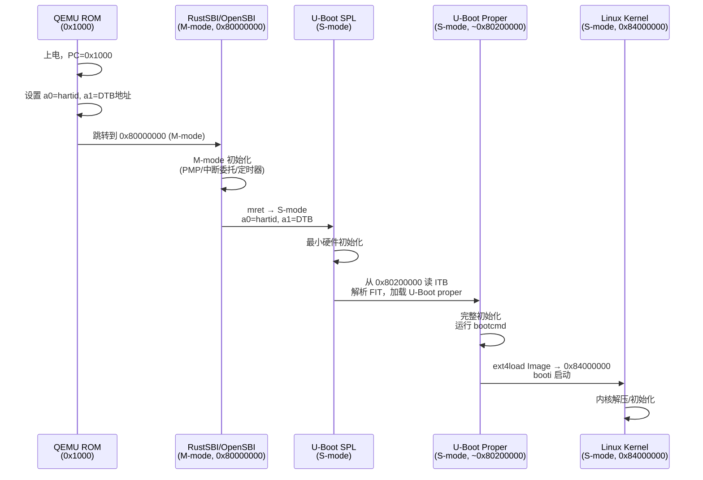

# RISC-V 全栈启动链与 SBI 深度解析

> 目标：彻底理解从上电到用户态的每一条汇编指令背后发生了什么
> 对应源码：`sbi/opensbi`、`sbi/rustsbi`、`boot/u-boot`

---

## 第一部分：RISC-V 特权架构基础

### 1.1 三个特权级

```
┌──────────────────────────────────────────────────────┐
│  U-mode (User)       用户态程序 / Shell              │
│  ── ecall ──────────────────────────────────────── ↓ │
│  S-mode (Supervisor) OS 内核 / Bootloader            │
│  ── ecall ──────────────────────────────────────── ↓ │
│  M-mode (Machine)    SBI 固件 (OpenSBI/RustSBI)      │
│  ── 直接操作硬件寄存器 ──────────────────────────── ↓ │
│  Hardware            CPU / CLINT / PLIC / UART       │
└──────────────────────────────────────────────────────┘
```

- **M-mode**：最高权限，复位后 CPU 直接进入此模式。可以访问所有 CSR，直接读写物理内存。
- **S-mode**：OS 内核运行的特权级。不能直接访问 M-mode CSR，通过 SBI ecall 请求 M-mode 服务。
- **U-mode**：用户程序。通过系统调用 ecall 进入 S-mode。

### 1.2 关键 CSR 寄存器速查

| CSR | 所在模式 | 作用 |
|:--|:--|:--|
| `mstatus` | M | 全局状态（MIE/SIE/MPP/SPP 等）|
| `mtvec` | M | M-mode 中断/异常向量基地址 |
| `mepc` | M | M-mode 异常返回地址（`mret` 跳回的 PC）|
| `mcause` | M | 异常/中断原因 |
| `mscratch` | M | M-mode 暂存寄存器 |
| `mhartid` | M | 当前 hart（硬件线程）ID |
| `mideleg` | M | 将哪些中断委托给 S-mode 处理 |
| `medeleg` | M | 将哪些异常委托给 S-mode 处理 |
| `stvec` | S | S-mode 中断/异常向量 |
| `sepc` | S | S-mode 异常返回地址 |
| `satp` | S | 页表根地址 + 分页模式（Bare/Sv39/Sv48）|
| `scause` | S | S-mode 异常原因 |
| `sscratch` | S | S-mode 暂存寄存器 |

### 1.3 ecall 指令机制

```
S-mode 代码执行 ecall
        │
        ▼
CPU 把 PC 保存到 mepc（如果未委托）或 sepc（如果委托给 S-mode）
CPU 把原因写入 mcause = 0x9 (Environment call from S-mode)
CPU 跳转到 mtvec 指向的地址（M-mode trap handler）
        │
        ▼
M-mode trap handler（SBI 固件）：
  - 读 a7 (寄存器) → Extension ID (EID)
  - 读 a6 (寄存器) → Function ID (FID)
  - 分发到对应 SBI 扩展处理函数
  - 将返回值写入 a0（错误码）, a1（返回值）
  - 执行 mret → CPU 恢复 PC = mepc，回到 S-mode
```

---

## 第二部分：SBI 规范精要

### 2.1 SBI 是什么

**SBI = Supervisor Binary Interface**，是 S-mode 软件调用 M-mode 固件服务的标准接口。
规范文档：https://github.com/riscv-non-isa/riscv-sbi-doc

类比：
- U-mode → S-mode：系统调用（syscall）
- S-mode → M-mode：SBI 调用（SBI ecall）

### 2.2 SBI 扩展列表

| EID（十六进制）| 扩展名 | 核心功能 |
|:--|:--|:--|
| `0x10` | Base | 获取 SBI 版本、探测扩展支持 |
| `0x54494D45` ("TIME") | Timer | 设置下次定时器中断时间（`set_timer`）|
| `0x735049` ("sPI") | IPI | 发送核间中断（`send_ipi`）|
| `0x52464E43` ("RFNC") | RFENCE | 远程 TLB/fence 操作 |
| `0x48534D` ("HSM") | Hart State Management | 启动/停止/挂起 hart |
| `0x53525354` ("SRST") | System Reset | 系统重启/关机 |
| `0x504D55` ("PMU") | PMU | 性能监控单元 |
| `0x4442434E` ("DBCN") | Debug Console | 调试控制台输入输出 |

### 2.3 调用约定

```c
// C 伪代码形式
struct sbiret {
    long error;  // a0
    long value;  // a1
};

struct sbiret sbi_call(long eid, long fid,
                       long a0, long a1, long a2, long a3, long a4, long a5) {
    // a7=eid, a6=fid, a0-a5 为参数
    // 执行 ecall 指令
    // 返回 a0=error, a1=value
}

// 示例：设置定时器（Timer 扩展，FID=0）
sbi_call(0x54494D45, 0, next_time, 0, 0, 0, 0, 0);
```

错误码：`SBI_SUCCESS=0`，`SBI_ERR_FAILED=-1`，`SBI_ERR_NOT_SUPPORTED=-2` 等。

---

## 第三部分：QEMU 完整启动链

### 3.0 ZSBL — 第零阶段引导（启动链的真起点）

> ZSBL = **Zeroth Stage Boot Loader** — RISC-V 上 SBI 之前的更早一段，**SBI 不是真正的 boot 起点**。

**ZSBL 是什么：** SoC 内置的不可改 mask ROM，几 KB 代码，**出厂烧死**。CPU 复位后从 reset vector 取的第一段指令就在 ZSBL。

**为什么需要 ZSBL：**
- CPU reset 时无 RAM、无外设初始化、不知道 boot 设备
- ZSBL 完成最早期初始化（PLL / 选 boot 设备 / 加载下一段到 SRAM 或 DRAM）
- 然后才把控制权交给 SPL → SBI → ...

**ZSBL 在不同平台的形态：**

| 平台 | ZSBL 形式 | 大小 | 行为 |
|------|---------|------|------|
| **SiFive FU540 / FU740 (HiFive Unmatched)** | 片内 mask ROM | ~32 KB | 检测 GPIO 选 boot 设备 → 从 SD/SPI 加载 SPL 到 L2 cache-as-RAM |
| **StarFive JH7110 (VisionFive 2)** | 片内 BootROM (BROM) | 几十 KB | 选 SD/Flash → 加载 SPL（含 dpts 和 OpenSBI） |
| **Allwinner D1** | brom (Boot ROM) | ~32 KB | FEL 模式 / 加载 SPL |
| **SpacemiT K1** | 片内 BootROM | 几十 KB | 加载 SPL |
| **Microchip PolarFire SoC** | HSS (Hart Software Services) | ~MB 级（不是 mask ROM 是用户自定义）| 比典型 ZSBL 复杂得多 |
| **QEMU virt** | `0x1000` 处的 stub | ~10 条指令 | 设 a0=hartid, a1=fdt, jr 0x80000000 |

**QEMU 上 ZSBL 等价物（最小完整代码）：**

```asm
# QEMU virt 在 0x1000 处烧的 stub（reverse-engineered from QEMU source）
0x1000:    auipc t0, 0x0          # t0 = 0x1000
0x1004:    addi  a2, t0, 40       # a2 = 0x1028 (FDT 地址 placeholder)
0x1008:    csrr  a0, mhartid      # a0 = hartid
0x100c:    ld    a1, 32(t0)       # a1 = FDT 地址 (0x82200000 typically)
0x1010:    ld    t0, 24(t0)       # t0 = 0x80000000 (SBI 入口)
0x1014:    jr    t0               # 跳到 SBI
```

→ **这就是 ZSBL 全部职责**：传递 hartid (a0) + FDT 地址 (a1) 给 SBI，然后跳走。

**真机 ZSBL 复杂得多：**
- 时钟 PLL 初始化
- 选 boot 设备（GPIO/eFuse/USB DFU/串口下载模式）
- 校验下一段签名（Verified Boot 起点）
- 错误恢复（boot 失败时回退）
- DDR 训练前的最小 SRAM 设置

**与 SBI 关系：** ZSBL → SPL → SBI → U-Boot → kernel。SBI 跑在 ZSBL 之后。本笔记接下来讲 SBI 是 ZSBL 把控制权交过来的。

**与 03-02 § 9 区别：** 03-02 讲 ZSBL 在 boot 全景中的位置；本节讲 ZSBL **作为 SBI 上游**的具体责任和数据传递（a0/a1 寄存器约定）。

---

### 3.1 全局流程图



### 3.2 QEMU virt 机器内存布局

```
物理地址           内容
─────────────────────────────────────────────
0x0000_0000       QEMU ROM（少量复位代码）
0x0000_1000       复位向量入口（ROM 中）
0x0200_0000       CLINT（核间中断 + mtimecmp）
0x0C00_0000       PLIC（外部中断控制器）
0x1000_0000       UART0（串口）
0x8000_0000       DRAM 起始 ← SBI/U-Boot SPL 加载位置
0x8020_0000       U-Boot ITB 预加载（-device loader）
0x8400_0000       Linux Image 加载目标地址（bootcmd 中指定）
```

### 3.3 QEMU 命令解析

```shell
qemu-system-riscv64 \
  -M virt \                    # 使用 virt 虚拟机器
  -smp 1 \                     # 1 个 hart
  -m 256M \                    # 256 MB DRAM
  -nographic \                 # 无图形，串口输出到终端
  -bios ./u-boot/spl/u-boot-spl \   # 加载到 0x80000000，作为 M-mode 固件起点
  -device loader,file=./u-boot/u-boot.itb,addr=0x80200000 \  # 将 ITB 预置到内存
  -blockdev driver=file,filename=./linux-rootfs.img,node-name=hd0 \  # 磁盘镜像
  -device virtio-blk-device,drive=hd0   # virtio 块设备（/dev/vda）
```

**关键理解：**
- `-bios` 不等于 UEFI BIOS，它只是 QEMU 将该文件加载到 `0x80000000` 并将初始 PC 指向那里
- `u-boot-spl` 构建时设置了 `OPENSBI=rustsbi.bin`，因此 SPL 的包装脚本会先调用 RustSBI 完成 M-mode 初始化，再以 S-mode 身份运行 SPL 本体
- `-device loader` 是 QEMU 的通用设备加载器，绕过存储 IO 直接写内存，模拟"固化在 flash 中的固件"

---

### 3.4 各阶段地址 deep-dive（每个数字从哪来）

> 看到 RustSBI Prototyper 教程的命令——`-bios u-boot-spl` + `-device loader,file=u-boot.itb,addr=0x80200000` + 内核 0x84000000 + dtb 0x82200000——会想：**这些地址为什么偏偏是这些数值？谁规定的？换一个会怎样？** 这一节按时间顺序讲清楚每个地址的设计来源、写在哪里、由谁传给谁。

#### 3.4.1 全栈地址流图

```
═══════════ QEMU virt + SPL+RustSBI+U-Boot+Linux 教程链 ═══════════

时间 →

  T0  CPU 复位            PC = 0x0000_1000
                           │ ROM 预置代码：
                           │   csrr a0, mhartid       ; a0 = 当前 hart ID
                           │   auipc a1, 0x0          ; a1 = 0x1000+offs
                           │   addi  a1, a1, +offs    ; a1 = dtb 地址（QEMU 自动放）
                           │   ld    t0, 24(a1)       ; 加载跳转目标 = 0x8000_0000
                           │   jr    t0
                           ▼
  T1  M-mode 入口         0x8000_0000  ← SPL 在这里（-bios 加载）
                           │ SPL 自检 / DDR 训练 / 拷贝 .data
                           │ SPL 找 FIT 镜像 → 0x8020_0000（QEMU loader 已预置）
                           │ SPL 解析 FIT 三个 part：
                           │   ① RustSBI  → 拷到 0x8000_0000（覆盖 SPL 自己）
                           │   ② U-Boot proper → 拷到 0x8020_0000
                           │   ③ dtb     → 拷到 0x8220_0000
                           │ SPL 跳到 0x8000_0000
                           ▼
  T2  M-mode 接力         0x8000_0000  ← RustSBI 在这里
                           │ RustSBI 设 mideleg/medeleg/PMP
                           │ 准备 mret 跳 S-mode：
                           │   mepc = 0x8020_0000     （目标地址）
                           │   mstatus.MPP = S        （目标特权级）
                           │   a0 = hartid，a1 = 0x8220_0000（dtb 物理地址）
                           │ mret
                           ▼
  T3  S-mode bootloader   0x8020_0000  ← U-Boot proper 在这里
                           │ 从 a1 读 dtb → 解析硬件
                           │ 跑 bootcmd：
                           │   load virtio 0:1 0x8400_0000 Image
                           │   booti 0x8400_0000 - 0x8220_0000
                           │ 通过 SBI ecall 切回 M-mode 处理 timer/console
                           ▼
  T4  S-mode kernel       0x8400_0000  ← Linux Image 加载（U-Boot 决定）
                           │ Image 头部 head.S 自重定位（page-aligned）
                           │ 读 a1 = 0x8220_0000 dtb → unflatten_device_tree
                           │ kernel 主循环跑起来 → init / busybox / login
```

#### 3.4.2 各地址的"硬度"和来源

| 地址 | 硬度 | 来源 / 规定者 | 是否可改 |
|------|------|--------------|---------|
| `0x0000_1000` | **ISA + QEMU 板** | RISC-V Privileged Spec 没硬规定，但 QEMU virt 板把 reset_vector 固定到 ROM 的 `0x1000`；SiFive E51/U54 真硬件也用类似低地址 ROM | 不可改（QEMU virt 写死）|
| `0x8000_0000` | **板硬连** | QEMU virt 模拟板的 DRAM 起始；ROM 里那条 `jr` 也跳到这里。SiFive HiFive Unleashed/Unmatched / VisionFive2 / SpacemiT K1 真硬件都用这个 | 不可改（板级硬件描述）|
| `0x8220_0000` | **教程作者选** | 教程作者从 `0x8020_0000` 后留 32 MiB 给 U-Boot proper，把 dtb 放 `0x8220_0000`。**不是规范** | **可改**：FIT image 的 `load = <0x82200000>` 改任意 page-aligned 地址 |
| `0x8400_0000` | **教程作者选** | U-Boot bootcmd 里 `load ... 0x84000000 Image` — 留 64 MiB 给 U-Boot relocation 和 dtb 之后再放 kernel | **可改**：bootcmd / `bootargs` 改 |
| `mret 时 a0/a1` | **SBI ABI 硬规定** | a0 = mhartid，a1 = dtb 物理地址。**所有** RISC-V firmware → kernel 接力都遵守 | 不可改（违反就启动不了 Linux）|

#### 3.4.3 0x80000000 — 为什么所有 RISC-V 板都在这里？

不是规范要求，是**事实标准**：
- SiFive 早期 SoC（HiFive Unleashed FU540）把 DRAM 映到 `0x8000_0000`
- QEMU virt 板抄 SiFive 布局
- 后续 RISC-V 板（VisionFive / VisionFive2 / SpacemiT K1 / Allwinner D1 / 双核 P550）几乎全部沿用
- 32-bit RV32 也用 `0x8000_0000`：因为 Sv32 高半区是 kernel space，DRAM 必须在 `[0x80000000, 0xFFFFFFFF]`

ARM 阵营对比：ARM 板 DRAM 起点五花八门（`0x0000_0000` / `0x4000_0000` / `0x8000_0000` / `0x4000_0000_0000`），靠 dtb 描述。RISC-V 几乎只有 `0x8000_0000` 一个。

#### 3.4.4 0x80200000 — "M-mode 固件 2 MiB 配额"的历史

**OpenSBI 链接脚本 `fw_base.ldS`**：

```
. = 0x80000000;
.text : { *(.text) }
. = ALIGN(0x200000);              /* 2 MiB 对齐 → 0x80200000 */
fw_payload_offset_dummy:
. = 0x80200000;
```

OpenSBI 留 2 MiB 给自己（`0x8000_0000` ~ `0x8020_0000`），后续接力地址自然是 `0x8020_0000`。

为什么是 **2 MiB 而不是 1 MiB / 4 MiB**？

- RISC-V Sv39 大页是 **2 MiB**——OpenSBI 用一个 2 MiB megapage 把自己 map 进 M-mode，简化页表
- 早期 OpenSBI 实现已 ~1.5 MiB（含 platform code），1 MiB 不够
- 2 MiB 是甜点，沿用至今


#### 3.4.5 dtb 地址（0x82200000 在教程里）

**dtb 必须 page-aligned**（ARM/RISC-V 通用约束），但**具体值是上一级 firmware 自己决定的**：

| 阶段 | dtb 地址来源 |
|------|------------|
| QEMU 直接 `-bios opensbi.bin -kernel Image` | QEMU virt 自动生成 dtb 放到 RAM 末尾，物理地址通过 a1 传 |
| 用 `-dtb file.dtb` | QEMU 加载到固定位置（早期是 RAM 顶 - 1 MiB），通过 a1 传 |
| 教程用 SPL+FIT 链 | FIT 的 `fdt-1` 节点 `load = <0x82200000>` 决定（作者选定）|
| 真硬件 U-Boot | U-Boot 在 RAM 高端选一段，bootcmd 跑 `bootm` 时由 U-Boot 把 dtb 放到那里 |
| Linux 进入后 | Linux 把 dtb 拷到内核管理的内存（`__init_dtb`），物理地址 a1 不再用 |

**dtb 物理地址通过 a1 寄存器（永远）**：从 ROM → SPL → SBI → U-Boot proper → Linux，**a1 一路传递**，每级可以选择把 dtb 搬到新地址（更新 a1），或保持不动。

#### 3.4.6 kernel 地址（0x84000000 在教程里）

**Linux Image 没有"必须的加载地址"**：
- `arch/riscv/boot/Image` 是裸内核映像，头部含 64 字节 header（`code0/code1/text_offset/image_size/...`）
- 加载到任意 **2 MiB 对齐的物理地址**都能跑（Image header 含自重定位代码）
- U-Boot 选 `0x84000000` 只是**离 dtb 隔够远**（dtb 在 `0x82200000`，留 32 MiB 缓冲给 U-Boot relocation）

如果是 **vmlinux 而非 Image** —— 不能加载到任意位置，链接地址固定，必须按 `vmlinux.lds` 指定地址。RISC-V 主线一律用 Image。

**FIT 镜像里 kernel 节点的 `load` 字段**示例：

```dts
images {
    kernel-1 {
        data = /incbin/("Image");
        type = "kernel";
        arch = "riscv";
        os = "linux";
        compression = "none";
        load = <0x84000000>;       /* ← U-Boot 拷到这里 */
        entry = <0x84000000>;       /* ← booti 跳这里 */
    };
};
```

#### 3.4.7 SPL 在哪儿跑（QEMU `-bios u-boot-spl` 时）

**真硬件**上 SPL 跑在芯片片上 SRAM（不是 DRAM），因为：
- 上电时 DRAM 控制器还没初始化
- SPL 的核心任务就是 DDR training（详见笔记 [03-06 § 3.3](03-06-u-boot-overview.md)）

**QEMU virt** 不用 DDR training（DRAM 已初始化），所以 `-bios u-boot-spl` 把 SPL 放进 `0x8000_0000` DRAM 直接跑。这是 QEMU 简化，**不代表真硬件 SPL 启动地址**。

真硬件示例：
- SiFive Unmatched FU740：SPL 在 ZSBL（mask ROM）后跳到 L2 LIM cache `0x0800_0000`（不是 DRAM）
- VisionFive2 JH7110：SPL 在芯片片上 SRAM `0x0801_0000` 跑
- SpacemiT K1：BootROM → SPL on SRAM → U-Boot proper on DDR

**学习建议：** QEMU 是简化模型，不是真机。读完笔记 [03-06 § 3.3](03-06-u-boot-overview.md) DDR training 后，再回来看真硬件 SPL 在 SRAM 跑这一点会更清晰。


```
方案 A：教程链（SPL+FIT，真硬件类比）
═════════════════════════════════════════════════════════════
  QEMU ROM
     ↓ jr 0x80000000
  SPL (M-mode @ 0x80000000)
     ↓ 解析 FIT @ 0x80200000，搬运 RustSBI/U-Boot proper/dtb
     ↓ jr 0x80000000
  RustSBI (M-mode @ 0x80000000)
     ↓ mret，mepc=0x80200000，a1=0x82200000
  U-Boot proper (S-mode @ 0x80200000)
     ↓ load Image @ 0x84000000；booti
  Linux (S-mode @ 0x84000000)

方案 B：直接 OpenSBI 链（无 SPL，无 U-Boot）
═════════════════════════════════════════════════════════════
  qemu-system-riscv64 -bios fw_jump.bin -kernel Image
  QEMU ROM
     ↓ jr 0x80000000
  OpenSBI (M-mode @ 0x80000000)
     ↓ mret，mepc=0x80200000，a1=QEMU 自动 dtb
  Linux (S-mode @ 0x80200000)        ← QEMU 自动加载到这里

═════════════════════════════════════════════════════════════

方案 D：U-Boot 不带 SPL 链（OpenSBI 当 BIOS）
═════════════════════════════════════════════════════════════
  qemu-system-riscv64 -bios fw_jump.bin -kernel u-boot.bin
  QEMU ROM → OpenSBI → mret → U-Boot proper @ 0x80200000
                                  ↓ load Image @ 0x84000000
                                  Linux @ 0x84000000
```

**结论：**
- A 是真硬件最完整链（SPL→SBI→bootloader→kernel）
- B/C 是开发常用（省略 SPL 和 U-Boot，CI 用）
- D 是中间形态（有 bootloader 但跳过 SPL）

教程选 A 是教学完整性优先。学习时**先掌握 B**（理解 SBI ↔ kernel 接力），再上 D（加 bootloader），最后 A（加 SPL）。

#### 3.4.9 a0/a1 ABI（必须记牢）

```
  a0 = mhartid          # 当前 hart 的硬件 ID
  a1 = dtb_phys_addr    # device tree blob 物理地址
  其他寄存器内容不保证

进入 Linux Image header 时：
  a0 = hartid
  a1 = dtb_phys
  pc = Image 加载地址
```

破坏 a0/a1 = Linux 启动失败 / kernel panic。任何替代 SBI 的实现都必须遵守。

> **跨引用：**
> - 各 firmware 实现源码：[02-03-sbi-implementations](02-03-sbi-implementations.md)
> - U-Boot SPL 详解：[03-06-u-boot-overview](03-06-u-boot-overview.md) § 3
> - dtb 在各阶段如何流转：[02-05-fdt-runtime-detection](02-05-fdt-runtime-detection.md) § 6.5
> - FIT 镜像格式：[03-02-boot-overview](03-02-boot-overview.md) + 本文 § 6.2

---

## 第四部分：OpenSBI 源码导读

### 4.1 目录结构

```
opensbi/
├── firmware/           ← 固件入口汇编
│   ├── fw_base.S       ★ 最重要：M-mode 启动汇编
│   ├── fw_jump.S       跳转固件（指定 S-mode 入口地址）
│   ├── fw_dynamic.S    动态固件（从 previous stage 获取入口）
│   └── fw_payload.S    内嵌载荷固件（打包 U-Boot/kernel）
├── lib/
│   └── sbi/
│       ├── sbi_init.c  ★ C 入口：sbi_init()
│       ├── sbi_ecall.c ★ ecall 分发器
│       ├── sbi_trap.c  ★ trap 处理总入口
│       ├── sbi_timer.c  定时器扩展
│       ├── sbi_ipi.c    IPI 扩展
│       ├── sbi_hsm.c    HSM 扩展（hart 启动/停止）
│       └── sbi_ecall_*.c  各扩展的 ecall 实现
├── include/
│   └── sbi/
│       └── sbi_ecall_interface.h  ★ EID/FID 常量定义
└── platform/
    └── generic/
        └── platform.c  ★ QEMU/通用平台适配
```

### 4.2 启动汇编 fw_base.S 关键步骤

```asm
; 文件：firmware/fw_base.S
; 这是 M-mode 的第一条指令

_start:
    ; 1. 关闭所有中断
    csrw    mie, zero

    ; 2. 设置 M-mode 栈（每个 hart 有独立栈）
    la      a3, _fw_end
    ...

    ; 3. 清零 BSS 段

    ; 4. 设置 M-mode trap 向量（指向 _trap_handler）
    la      t0, _trap_handler
    csrw    mtvec, t0

    ; 5. 调用 sbi_init()（C 入口）
    call    sbi_init
    ; sbi_init 内部会调用 sbi_hart_switch_mode() → mret 进入 S-mode
    ; 正常流程不会从这里返回
```

### 4.3 C 初始化 sbi_init.c

```c
// lib/sbi/sbi_init.c

void sbi_init(struct sbi_scratch *scratch) {
    // 阶段1：每个 hart 都执行
    sbi_heap_init(scratch);       // 初始化堆
    sbi_domain_init(scratch);     // 初始化 domain（内存保护区域）
    sbi_hart_init(scratch);       // 初始化 hart（PMP 配置）
    sbi_console_init(scratch);    // 初始化串口
    sbi_platform_init(scratch);   // 平台特定初始化（如 QEMU 的 PLIC）
    sbi_timer_init(scratch);      // 定时器初始化（CLINT）
    sbi_ipi_init(scratch);        // IPI 初始化

    // 阶段2：只有 boot hart（hart 0）执行额外初始化
    if (hartid == boot_hartid) {
        sbi_ecall_init();         // 注册所有 SBI 扩展的 ecall handler
    }

    // 最终：跳转到下一阶段（U-Boot SPL 或 Linux）
    sbi_hart_switch_mode(hartid, scratch->next_arg1,
                         scratch->next_addr,      // 下一阶段入口地址
                         scratch->next_mode,      // 目标特权级（S-mode）
                         false);
    // 此函数调用 mret，不返回
}
```

### 4.4 ecall 处理流程 sbi_ecall.c

```c
// lib/sbi/sbi_ecall.c

// trap 入口调用此函数（当 mcause = 环境调用时）
int sbi_ecall_handler(struct sbi_trap_regs *regs) {
    unsigned long eid = regs->a7;  // Extension ID
    unsigned long fid = regs->a6;  // Function ID

    // 遍历已注册的扩展列表
    struct sbi_ecall_extension *ext = sbi_ecall_find_extension(eid);
    if (!ext) {
        regs->a0 = SBI_ERR_NOT_SUPPORTED;
        return 0;
    }

    // 调用该扩展的 handler
    ret = ext->handle(eid, fid, regs, &out_val, &trap);
    regs->a0 = ret.error;
    regs->a1 = ret.value;

    // 将 mepc 向后移 4 字节（跳过 ecall 指令，避免死循环）
    regs->mepc += 4;
    return 0;
}
```

### 4.5 源码阅读建议

阅读顺序：
1. `include/sbi/sbi_ecall_interface.h` — 先看所有 EID/FID 常量，建立全局认知
2. `firmware/fw_base.S` — 理解汇编启动，逐行对照 RISC-V 特权规范
3. `lib/sbi/sbi_trap.c` — trap 总入口，理解控制流
4. `lib/sbi/sbi_init.c` — C 初始化流程
5. `lib/sbi/sbi_ecall.c` + 任意一个 `sbi_ecall_*.c` — 理解一个完整的扩展
6. `platform/generic/platform.c` — QEMU 平台特化，理解平台抽象

---

## 第五部分：RustSBI 源码导读

### 5.1 目录结构

```
rustsbi/
├── sbi/                ← 核心 SBI 库（no_std）
│   └── src/
│       ├── lib.rs      ★ SBI trait 定义和 ecall 分发
│       ├── base.rs     Base 扩展
│       ├── timer.rs    Timer 扩展 trait
│       ├── ipi.rs      IPI 扩展 trait
│       └── hsm.rs      HSM 扩展 trait
├── prototyper/         ← 可运行的参考固件（对应 OpenSBI 的 fw_dynamic）
│   └── src/
│       ├── main.rs     ★ M-mode 入口（Rust 版 fw_base.S）
│       ├── platform/   平台抽象（QEMU/各开发板）
│       └── sbi/        各扩展的具体实现
└── Cargo.toml
```

### 5.2 设计哲学（与 OpenSBI 对比）

| 特性 | OpenSBI | RustSBI |
|:--|:--|:--|
| 语言 | C | Rust |
| 扩展实现 | 静态编译进固件 | 通过 Trait 对象动态注入 |
| 平台适配 | `platform/` 目录 + 编译时选择 | 运行时 trait dispatch |
| 安全性 | 依赖 C 编程规范 | Rust 所有权+借用检查 |
| 入口 | `fw_base.S` 汇编 | `#[naked] fn _start()` |

### 5.3 Rust 入口 main.rs 核心逻辑

```rust
// prototyper/src/main.rs（伪代码，展示结构）

#![no_std]
#![no_main]

#[naked]
#[link_section = ".text.entry"]
unsafe extern "C" fn _start() -> ! {
    // 汇编：设置栈指针，清 BSS，跳到 rust_main
    core::arch::asm!("...", options(noreturn))
}

fn rust_main(hartid: usize, opaque: usize) -> ! {
    // opaque = DTB 地址（由 QEMU 传入）
    
    // 1. 初始化 M-mode 硬件
    init_bss();
    platform::init(hartid, opaque);
    
    // 2. 设置 SBI 扩展的 trait 实现
    let sbi_impl = MySbiImpl { /* ... */ };
    
    // 3. 设置委托：把 S-mode 的中断/异常都委托给 S-mode 自己处理
    //    只保留 ecall from S-mode 留在 M-mode
    mideleg::write(/* 所有中断 */);
    medeleg::write(/* 除 ecall 外的所有异常 */);
    
    // 4. 设置 PMP（物理内存保护）：允许 S-mode 访问所有内存
    
    // 5. 跳转到下一阶段（U-Boot SPL）
    // 设置 mepc = next_stage_addr，mstatus.MPP = S-mode
    // 执行 mret
}
```

### 5.4 Trait 驱动的扩展系统

```rust
// sbi/src/timer.rs
pub trait Timer {
    fn set_timer(&self, stime_value: u64);
}

// sbi/src/lib.rs  
pub fn handle_ecall(eid: usize, fid: usize, args: [usize; 6]) -> SbiRet {
    match eid {
        EID_TIMER => {
            // 调用注册的 Timer trait 实现
            TIMER.set_timer(args[0] as u64);
            SbiRet::success(0)
        }
        EID_HSM => { /* ... */ }
        // ...
    }
}
```

---

## 第六部分：U-Boot SPL 与 FIT/ITB 格式

### 6.1 U-Boot 两级加载架构

```
┌──────────────────────────────────────────────────────────┐
│  Stage 1: SPL (Secondary Program Loader)                 │
│  - 极小，必须放进片上 SRAM（通常 < 128KB）               │
│  - 只做最少初始化：DDR 控制器、最基本时钟                │
│  - 唯一目的：加载 U-Boot proper                          │
│  源文件：common/spl/spl.c, arch/riscv/lib/spl.c         │
└────────────────────┬─────────────────────────────────────┘
                     │ 加载并跳转
                     ▼
┌──────────────────────────────────────────────────────────┐
│  Stage 2: U-Boot Proper                                  │
│  - 完整功能：网络/USB/存储/命令行/脚本/设备树            │
│  - 最终加载操作系统                                      │
│  源文件：common/main.c, boot/bootm.c                     │
└──────────────────────────────────────────────────────────┘
```

### 6.2 FIT (Flattened Image Tree) / ITB 格式

ITB 是 ITS (Image Tree Source) 编译后的二进制，本质是一个 FDT（设备树二进制）。

ITS 源文件示例（生成 `u-boot.itb` 用的模板）：

```dts
/dts-v1/;

/ {
    description = "U-Boot FIT image for QEMU RISC-V";

    images {
        uboot {
            description = "U-Boot";
            data = /incbin/("u-boot-nodtb.bin");  // U-Boot proper 二进制
            type = "standalone";
            arch = "riscv";
            os = "u-boot";
            compression = "none";
            load = <0x80200000>;
            entry = <0x80200000>;
        };

        fdt-1 {
            description = "QEMU DTB";
            data = /incbin/("qemu.dtb");           // 设备树
            type = "flat_dt";
            arch = "riscv";
            compression = "none";
        };
    };

    configurations {
        default = "conf-1";
        conf-1 {
            description = "QEMU RISC-V config";
            firmware = "uboot";    // SPL 加载 "uboot" 这个 image
            fdt = "fdt-1";
        };
    };
};
```

生成命令：`mkimage -f u-boot.its u-boot.itb`

### 6.3 SPL 解析 ITB 的代码路径

```
spl_load_simple_fit()           // common/spl/spl_fit.c
  └─ fit_image_get_node()       // libfdt：找到 images/uboot 节点
  └─ fit_image_get_data()       // 取出 .data 属性（二进制）
  └─ fit_image_load_offset()    // 将 U-Boot proper 拷贝到 load 地址
  └─ spl_fit_get_entry()        // 取出 entry 地址
  └─ jump_to_image()            // 跳转
```

关键源文件：
- `common/spl/spl_fit.c` — FIT 解析
- `common/spl/spl.c` — SPL 主循环 `board_init_r()`
- `arch/riscv/lib/spl.c` — RISC-V 专用跳转逻辑

### 6.4 U-Boot bootcmd 解析

```bash
# 在本教程中配置的 bootcmd：
ext4load virtio 0:1 84000000 Image
# ↑ 从 virtio 设备 0 的第 1 个分区加载 ext4 文件 Image 到物理地址 0x84000000

setenv bootargs root=/dev/vda1 rw console=ttyS0
# ↑ 设置 Linux 内核命令行参数

booti 0x84000000 - ${fdtcontroladdr}
# ↑ booti: 启动 arm64/riscv Image 格式内核
#   0x84000000: 内核地址
#   -: 无 initrd
#   ${fdtcontroladdr}: U-Boot 维护的 DTB 地址（传给内核）
```

`booti` 调用链：
```
booti()
  └─ bootm_find_images()      // 找到 kernel + fdt
  └─ do_bootm_states()
       └─ boot_jump_linux()   // arch/riscv/lib/bootm.c
            └─ kernel_entry(hartid, fdt_addr)  // 跳转到 Linux 入口
```

---

## 第七部分：从 RustSBI 到 U-Boot 的 M→S 跳转

这是 SBI 固件最关键的一步，理解它需要精确掌握 `mret` 指令语义。

### 7.1 mret 指令的作用

```
执行 mret 时，CPU 做以下操作（硬件自动，无法拦截）：

1. PC ← mepc                  // 跳转到保存的异常返回地址
2. privilege ← mstatus.MPP    // 恢复特权级（MPP=01 → S-mode）
3. mstatus.MIE ← mstatus.MPIE // 恢复中断使能
4. mstatus.MPIE ← 1
5. mstatus.MPP ← U-mode       // 清除 MPP（安全策略）
```

### 7.2 RustSBI 跳转代码（等效逻辑）

```rust
// 设置目标特权级为 S-mode
// mstatus.MPP = 0b01 (S-mode)
let mstatus_val = mstatus::read();
mstatus::set_mpp(MPP::Supervisor);

// 设置跳转地址
// mepc = next_stage_entry（U-Boot SPL 的 S-mode 入口）
mepc::write(next_stage_entry);

// 准备传参：a0=hartid, a1=DTB地址（RISC-V 启动约定）
// 这两个值将被 U-Boot SPL / Linux 内核读取

// 跳转！
asm!("mret");
// CPU 此后运行在 S-mode，PC = U-Boot SPL 入口
```

### 7.3 Linux 内核如何接收 DTB

RISC-V Linux 启动约定（来自 Linux Documentation/riscv/boot.rst）：
- `a0` = hartid（当前 hart 的硬件 ID）
- `a1` = DTB 物理地址（设备树，描述硬件信息）

U-Boot `booti` 会将这两个参数设置好后跳转到内核。内核入口 `_start` 读取 `a1` 获得设备树地址。

---

## 第八部分：自主阅读路线图

```mermaid
graph LR
    A[阅读 RISC-V 特权规范<br/>riscv-privileged.pdf<br/>重点：第3章 M-mode CSR] --> B

    B[opensbi: firmware/fw_base.S<br/>逐行理解汇编启动] --> C

    C[opensbi: lib/sbi/sbi_init.c<br/>理解 C 初始化流程] --> D

    D[opensbi: lib/sbi/sbi_trap.c<br/>理解 trap 分发] --> E

    E[opensbi: lib/sbi/sbi_ecall.c<br/>+ sbi_ecall_timer.c<br/>理解一个完整扩展] --> F

    F[rustsbi: prototyper/src/main.rs<br/>对比 Rust 实现] --> G

    G[u-boot: arch/riscv/cpu/start.S<br/>SPL 的 S-mode 入口] --> H

    H[u-boot: common/spl/spl_fit.c<br/>理解 ITB 解析] --> I

    I[u-boot: arch/riscv/lib/bootm.c<br/>理解 booti 跳转到 Linux]
```



---

## 附录：常见疑问

### Q: OpenSBI 和 RustSBI 可以互换吗？

可以。它们都实现同一套 SBI 规范，对上层（U-Boot / Linux）完全透明。替换时只需改 `-bios` 参数或 U-Boot 构建时的 `OPENSBI=` 变量。

### Q: riscv-pk 和 OpenSBI 的区别？

`riscv-pk`（Berkeley Boot Loader, BBL）是 SBI 规范成形前的前身，功能更简单，主要用于 Spike 模拟器。现代项目都用 OpenSBI 或 RustSBI。`riscv-pk` 中仍有 `pk` 模块可以在 M-mode 模拟运行用户程序，用于教学。

### Q: fw_jump / fw_dynamic / fw_payload 什么区别？

| 固件类型 | 下一阶段入口 | 使用场景 |
|:--|:--|:--|
| `fw_jump` | 编译时固定地址 | 简单 QEMU 测试 |
| `fw_dynamic` | 运行时从 previous stage 读取（推荐）| 生产环境（U-Boot 传入） |
| `fw_payload` | 打包进固件本身 | 单文件部署，不需要 bootloader |

### Q: ITB 和 DTB 是什么关系？

DTB（Device Tree Blob）是描述硬件信息的二进制文件（板子有哪些外设、内存大小等）。ITB（Image Tree Blob）复用了 DTB 的二进制格式（FDT），但用来打包多个二进制镜像（内核 + DTB + U-Boot）。两者都用 `libfdt` 解析。

### Q: SPL 为什么需要 OPENSBI 支持？

在真实硬件上（如 SiFive、全志、StarFive 等板子），CPU 上电后先跑 ROM 中的极简代码，再跳到 SRAM 中的 SPL。SPL 没有足够空间嵌入完整 SBI，所以 SPL 运行在 S-mode，依赖 M-mode 已经有 SBI 固件运行。在 QEMU 中，U-Boot 构建系统通过将 RustSBI 打包进来解决了这个问题。
