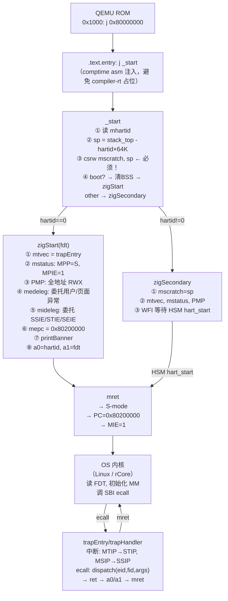

# SBI 完整参考手册 — v0.1 到 v3.0 一文讲明

> 目标：不查 PDF，凭此笔记可还原所有扩展、所有函数、M-mode 初始化全流程。

---

## 0. 全局总览 — 一览无余

> **SBI 规范定义的扩展就是下面这些，再多不可能了。**

### 0.1 所有扩展速查表

|-----|------|------|-------|----------|-------|---------|---------|-------|
| — | Legacy | — | 9 | v0.1 | v0.x中是 | ✅ | ✅ | ⚠️ 仅 putchar |
| 0x10 | Base | BASE | 7+2* | v1.0-rc1 | **必须** | ✅ | ✅ | ✅ |
| 0x54494D45 | Timer | TIME | 1 | v1.0-rc1 | 否† | ✅ | ✅ | ✅ |
| 0x735049 | IPI | IPI | 1 | v1.0-rc1 | 否 | ✅ | ✅ | ✅ |
| 0x52464E43 | Remote Fence | RFNC | 7 | v1.0-rc1 | 否 | ✅ | ✅ | ✅ |
| 0x48534D | Hart State Mgmt | HSM | 4 | v1.0-rc1 | 否 | ✅ | ✅ | ✅ |
| 0x53525354 | System Reset | SRST | 1 | v1.0-rc1 | 否 | ✅ | ✅ | ✅ |
| 0x504D55 | Perf Monitor | PMU | 8 | v1.0-rc3 | 否 | ✅ | ✅ | ❌ |
| 0x4442434E | Debug Console | DBCN | 3 | v2.0-rc1 | 否 | ✅ | ✅ | ✅ |
| 0x53555350 | Suspend | SUSP | 1 | v2.0-rc1 | 否 | ✅ | ✅ | ✅ |
| 0x43505043 | CPPC | CPPC | 4 | v2.0-rc2 | 否 | ✅ | 部分 | ❌ |
| 0x4E41434C | Nested Accel | NACL | 5 | v2.0-rc3 | 否 | ✅ | ❌ | ❌ |
| 0x535441 | Steal-time Acct | STA | 1 | v2.0-rc5 | 否 | ✅ | ❌ | ❌ |
| 0x535345 | Supervisor Events | SSE | 11 | v3.0-rc2 | 否 | 实验 | ❌ | ❌ |
| 0x4D505859 | Message Proxy | MPXY | 6 | v3.0-rc3 | 否 | 实验 | ❌ | ❌ |
| 0x44425452 | Debug Triggers | DBTR | 8 | v3.0-rc4 | 否 | 实验 | ❌ | ❌ |
| 0x46574654 | FW Features | FWFT | 2 | v3.0-rc5 | 否 | 实验 | ❌ | ✅ |

> *BASE FID 7=sbi_get_mhartid (v2.0新增), FID 8=sbi_get_features (v3.0新增)
> †TIME 在 v1.0+ 被强烈推荐；Linux 优先用 TIME，fallback 到 Legacy set_timer

**统计：** 17 个扩展定义（含 Legacy），v1.0-rc1 一次引入 6 个主力扩展，v2.0 新增 5 个高级特性，v3.0 新增 4 个实验性扩展。


- **Kconfig 21 个 SBI spec 版本变体可选**（v0.1 / v0.2 / v0.3-rc1 / v0.3 / v1.0-rc1/rc2/rc3 / v1.0 / v2.0-rc1..rc8 / v2.0 / v3.0-rc2..rc8 / v3.0）
- **扩展按 spec 版本自动启用**（`src/spec/ext_versions.zig` + `cfg.version.ge(EV.X)` comptime dispatch）—— 配 v1.0-rc1 自动禁用 PMU/DBCN 等后版本扩展

---

### 0.2 所有函数全表（按扩展）

```
Legacy (v0.x)          │ BASE (EID=0x10)        │ TIME (0x54494D45)
─────────────────────────┼───────────────────────┼──────────────────
a7=0  set_timer          │ F0 get_spec_version    │ F0 set_timer
a7=1  console_putchar    │ F1 get_impl_id         │
a7=2  console_getchar    │ F2 get_impl_version    │ IPI (0x735049)
a7=3  clear_ipi          │ F3 probe_extension     │ F0 send_ipi
a7=4  send_ipi           │ F4 get_mvendorid       │
a7=5  remote_fence_i     │ F5 get_marchid         │ SRST (0x53525354)
a7=6  remote_sfence_vma  │ F6 get_mimpid          │ F0 system_reset
a7=7  remote_sfence_vma_asid│ F7 get_mhartid(v2) │
a7=8  shutdown           │ F8 get_features(v3)   │

RFNC (0x52464E43)      │ HSM (0x48534D)         │ DBCN (0x4442434E)
─────────────────────────┼───────────────────────┼──────────────────
F0 remote_fence_i        │ F0 hart_start          │ F0 console_write
F1 remote_fence_vma      │ F1 hart_stop           │ F1 console_read
F2 remote_fence_vma_asid │ F2 hart_get_status     │ F2 console_write_byte
F3 remote_fence_vma_gvma │ F3 hart_suspend        │
F4 remote_fence_vma_gvma_vmid│                   │ SUSP (0x53555350)
F5 remote_sfence_vma_asid│                       │ F0 system_suspend
F6 remote_sfence_vma_gvma│                       │
                         │                       │

PMU (0x504D55)         │ CPPC (0x43505043)      │ NACL (0x4E41434C)
─────────────────────────┼───────────────────────┼──────────────────
F0 num_counters          │ F0 probe               │ F0 probe_feature
F1 counter_get_info      │ F1 read                │ F1 set_shmem
F2 counter_config_match  │ F2 write               │ F2 sync_csr
F3 counter_start         │ F3 write_fw_reg        │ F3 sync_hfence
F4 counter_stop          │                       │ F4 sync_sret
F5 counter_fw_read       │ STA (0x535441)         │
F6 counter_fw_read_hi    │ F0 steal_time_setaddr  │
F7 snapshot_set_shmem    │                       │

SSE (0x535345)         │ MPXY (0x4D505859)      │ DBTR (0x44425452)
─────────────────────────┼───────────────────────┼──────────────────
F0 read_attrs            │ F0 get_channel_ids     │ F0 num_triggers
F1 write_attrs           │ F1 read_attrs          │ F1 read_trigger
F2 register_event        │ F2 write_attrs         │ F2 write_trigger
F3 unregister_event      │ F3 send_message_with_  │ F3 read_trig_info
F4 enable_event          │    response_port       │ F4 install_trigger
F5 disable_event         │ F4 send_message_with_  │ F5 uninstall_trigger
F6 complete_event        │    posted_output       │ F6 enable_trigger
F7 inject_event          │ F5 get_message_with_   │ F7 disable_trigger
F8 set_shmem             │    direct_output       │
F9 force_disable_event   │                       │ FWFT (0x46574654)
F10 inquiry_event_status │                       │ F0 set_feature
                         │                       │ F1 get_feature
```

---

### 0.3 OpenSBI / RustSBI 实现范围说明

**OpenSBI（C，riscv-software-src/opensbi）：**
- 实现所有 ratified 扩展（v1.0+v2.0），v3.0扩展（SSE/MPXY/DBTR/FWFT）标记为实验性
- 三种固件变体：`fw_dynamic`（通用，QEMU默认）、`fw_jump`（固定跳转）、`fw_payload`（内含OS）
- 平台支持：FDT自动发现（generic platform）+ 手写board driver（platform/）
- 每个版本发布 `opensbi-riscv64-generic-fw_dynamic.bin` 等预编译二进制

**RustSBI（Rust，rustsbi/rustsbi）：**
- 实现 BASE/TIME/IPI/RFNC/HSM/SRST/DBCN/PMU(部分)
- 核心库（rustsbi crate）+ 平台用 trait 适配
- 生态：每个板子在独立 crate 里实现 trait（如 rustsbi-qemu/rustsbi-k210/rustsbi-d1）
- RustSBI-Prototyper：动态固件（类似 fw_dynamic），用于通用 RISC-V 板

- 实现 BASE/TIME/IPI/RFNC/HSM/SRST/DBCN（7个，QEMU virt验证）
- Comptime ZST设计：未用扩展零字节、编译期 dispatch
- 板级适配：Route B（Kconfig地址），后续 Route A（BSP包）、Route C（FDT可选）

---

## 1. SBI 是什么，为什么需要它

RISC-V 特权架构定义三个模式：

```
U-mode（用户态）
S-mode（操作系统内核）
M-mode（机器模式，最高特权）
```

**问题**：每块板子的 CLINT（定时器）、UART、复位寄存器地址都不同。如果 OS 内核直接操作这些寄存器，内核就要为每块板写一份。

**解法**：在 M-mode 放一个薄固件（SBI firmware），对 S-mode 暴露统一 ecall 接口。OS 只调 ecall，固件完成实际硬件操作。

```
OS 内核（S-mode）  ──ecall──→  SBI 固件（M-mode）  ──→  CLINT/UART/...
                  ←──mret──
```


---

## 2. ecall 调用约定

### 调用（S-mode → M-mode）

```
a7 = EID  (Extension ID，哪个扩展)
a6 = FID  (Function ID，扩展里哪个函数)
a0–a5 = 参数（最多6个，按序）
ecall
```

### 返回（M-mode → S-mode，通过 mret）

```
a0 = error  (SbiError)
a1 = value  (返回值，仅 error==0 时有意义)
```

### SbiError 枚举

| 值 | 名称 | 含义 |
|---|---|---|
| 0 | SUCCESS | 成功 |
| -1 | ERR_FAILED | 通用失败 |
| -2 | ERR_NOT_SUPPORTED | 扩展/函数不存在 |
| -3 | ERR_INVALID_PARAM | 参数非法 |
| -4 | ERR_DENIED | 权限不足 |
| -5 | ERR_INVALID_ADDRESS | 地址无效/不可访问 |
| -6 | ERR_ALREADY_AVAILABLE | 资源已存在 |
| -7 | ERR_ALREADY_STARTED | 已启动 |
| -8 | ERR_ALREADY_STOPPED | 已停止 |
| -9 | ERR_NO_SHMEM | 共享内存未设置（v2.0+）|
| -10 | ERR_INVALID_STATE | 状态非法（v3.0+）|
| -11 | ERR_BAD_RANGE | 范围错误（v3.0+）|
| -12 | ERR_TIMEOUT | 超时（v3.0+）|
| -13 | ERR_IO | I/O 错误（v3.0+）|

### v0.x Legacy 特殊约定

v0.x 没有 EID/FID 概念，a7 直接是函数编号 0–8，**返回值只用 a0**（无 a1，无统一错误码）。

### HartMask（v1.0+，多核广播用）

```
a0 = hart_mask      (位图，bit N=1 表示包含 hart N)
a1 = hart_mask_base (hart_mask 的起始偏移，-1UL = 所有 hart)
```

---

## 3. 版本历史与扩展引入时间线

```
v0.1 (2019)  → Legacy：9 个 legacy ecall，无 EID 概念
v0.2         → Legacy 扩展小修订
v0.3         → Legacy 最终版

v1.0-rc1     → EID 体系建立；BASE/TIME/IPI/RFNC/HSM/SRST 正式化
v1.0-rc3     → PMU 引入
v1.0 (2022)  → 正式规范

v2.0-rc1     → DBCN / SUSP
v2.0-rc2     → CPPC
v2.0-rc3     → NACL
v2.0-rc5     → STA
v2.0 (2024-02-01) → 正式规范

v3.0-rc2     → SSE（Supervisor Software Events）
v3.0-rc3     → MPXY（Message Proxy）
v3.0-rc4     → DBTR（Debug Triggers）
v3.0-rc5     → FWFT（Firmware Features）
v3.0 (2025)  → 正式规范
```

---

## 4. Legacy 扩展（v0.x，EID 无意义）

> Linux 靠 `sbi_spec_version < (1 << 24)` 检测 legacy 模式，退化为兼容路径。

| 函数号（a7）| 函数名 | 功能 |
|---|---|---|
| 0 | sbi_set_timer | 设置定时器（写 mtimecmp）；不清 STIP，由调用方管 |
| 1 | sbi_console_putchar | 输出一个字节到调试串口（阻塞） |
| 2 | sbi_console_getchar | 从调试串口读一个字节，无数据返回 -1 |
| 3 | sbi_clear_ipi | 清除本 hart 的软件中断（清 SSIP）|
| 4 | sbi_send_ipi | 向位图指定的 hart 发 IPI（写 MSIP 寄存器）|
| 5 | sbi_remote_fence_i | 向指定 hart 发 fence.i（指令缓存刷新）|
| 6 | sbi_remote_sfence_vma | 向指定 hart 发 sfence.vma（TLB 刷新）|
| 7 | sbi_remote_sfence_vma_asid | 向指定 hart 发带 ASID 的 sfence.vma |
| 8 | sbi_shutdown | 关机（power down）|

---

## 5. BASE 扩展（EID=0x10，v1.0+，**强制必须**）

> 唯一不可 probe 就一定存在的扩展。BASE 函数永远不返回 NOT_SUPPORTED。

| FID | 函数名 | 返回 | 功能 |
|---|---|---|---|
| 0 | sbi_get_spec_version | `value = (major<<24)\|minor` | SBI 规范版本（wire 格式）|
| 2 | sbi_get_impl_version | impl_version | 实现自定义版本号 |
| 3 | sbi_probe_extension(eid) | 0=不支持，非0=支持 | 探测某扩展是否存在 |
| 4 | sbi_get_mvendorid | mvendorid | 厂商 ID（同 CSR mvendorid）|
| 5 | sbi_get_marchid | marchid | 架构 ID（同 CSR marchid）|
| 6 | sbi_get_mimpid | mimpid | 实现 ID（同 CSR mimpid）|
| 7 | sbi_get_mhartid | hartid | 当前 hart ID（v2.0 新增）|
| 8 | sbi_get_features | features | 固件特性位图（v3.0 新增）|

**版本号 wire 格式**（spec §3.1）：

```
bit[31]     = 0（保留）
bits[30:24] = major（7 bit）
bits[23:0]  = minor（24 bit）

v3.0 → (3 << 24) | 0 = 0x03000000
v2.0 → 0x02000000
v1.0 → 0x01000000
v0.1 → 0x00000001  ← Linux 见到 < 0x01000000 触发 legacy 模式
```

---

## 6. TIME 扩展（EID=0x54494D45，v1.0-rc1+）

> 替代 legacy sbi_set_timer；**自动清 STIP**（这是与 legacy 的关键区别）。

| FID | 函数名 | 参数 | 功能 |
|---|---|---|---|
| 0 | sbi_set_timer | stime_value: u64 | 设置本 hart 的 mtimecmp；自动清 STIP；若 stime_value=u64::MAX 则只清 STIP 不设新 deadline |

**timer 中断流向**：

```
M-mode: mtimecmp 到期 → MTIP 置位
  → 固件捕获（mtvec）→ 设 STIP（mip.STIP=1）→ mret
  → S-mode 看到 STIP → 调用 OS timer handler
  → OS handler 结束，调 sbi_set_timer 设下次 deadline → 固件清 STIP，更新 mtimecmp
```

**Sstc 扩展优化**（硬件支持时）：

```
menvcfg.STCE=1 → S-mode 可直接写 stimecmp CSR
→ 跳过整个 ecall 路径，OS 自管 timer
→ 即使 SBI v0.x，只要硬件支持 Sstc，Linux 也会走此路径
```

---

## 7. IPI 扩展（EID=0x735049，v1.0-rc1+）

| FID | 函数名 | 参数 | 功能 |
|---|---|---|---|
| 0 | sbi_send_ipi | hart_mask, hart_mask_base | 向指定 hart 集合发软件中断；固件写目标 hart 的 MSIP → 目标 hart 看到 SSIP |

**中断流向**：

```
Hart A 调 sbi_send_ipi(mask) → 固件写 CLINT.MSIP[B]=1
→ Hart B 的 MSIP 置位 → 中断触发（M-mode）
→ 固件 trapEntry：清 MSIP，设 SSIP（mip.SSIP=1）→ mret
→ Hart B S-mode 看到 SSIP → 处理 IPI（TLB shootdown 等）
```

---

## 8. RFNC 扩展（EID=0x52464E43，v1.0-rc1+）

> Remote FencE Notify — 通过 IPI 触发远程 hart 执行 fence/sfence 指令。

| FID | 函数名 | 参数 | 功能 |
|---|---|---|---|
| 0 | sbi_remote_fence_i | hart_mask, base | 通知目标 hart 执行 fence.i（指令缓存/流水线同步）|
| 1 | sbi_remote_sfence_vma | hart_mask, base, start, size | 通知目标 hart 执行 sfence.vma（TLB 全刷或范围刷）|
| 2 | sbi_remote_sfence_vma_asid | hart_mask, base, start, size, asid | 带 ASID 的 sfence.vma（精确刷指定进程 TLB）|
| 3 | sbi_remote_hfence_gvma_vmid | hart_mask, base, start, size, vmid | H 扩展：G-stage TLB 刷新（带 VMID）|
| 4 | sbi_remote_hfence_gvma | hart_mask, base, start, size | H 扩展：G-stage TLB 刷新（全部 VMID）|
| 5 | sbi_remote_hfence_vvma_asid | hart_mask, base, start, size, asid | H 扩展：VS-stage TLB 刷新（带 ASID）|
| 6 | sbi_remote_hfence_vvma | hart_mask, base, start, size | H 扩展：VS-stage TLB 刷新 |

**FID 3–6 需要 H 扩展（Hypervisor 扩展）**，普通 OS 只用 FID 0–2。

---

## 9. HSM 扩展（EID=0x48534D，v1.0-rc1+）

> Hart State Management — 多核启动/停止/挂起。Linux SMP bring-up 的基础。

| FID | 函数名 | 参数 | 功能 |
|---|---|---|---|
| 0 | sbi_hart_start | hartid, start_addr, opaque | 启动 hartid 的 hart，从 start_addr 开始执行（S-mode）；opaque 放入 a1 |
| 1 | sbi_hart_stop | — | 停止本 hart（不返回）；hart 进入 Stopped 状态 |
| 2 | sbi_hart_get_status | hartid | 查询 hart 当前状态 |
| 3 | sbi_hart_suspend | suspend_type, resume_addr, opaque | 挂起本 hart；resume 时从 resume_addr 继续 |

**Hart 状态机**：

```
                   hart_start()
Stopped ──────────────────────────────→ Start_pending → Started
   ↑                                                       │
   │                             hart_stop() ↓             │ hart_suspend()
   └──── Stop_pending ←──────────────────────         Suspend_pending
                                                           │
                        resume_addr ←── Suspended ←────────┘
```

| 状态值 | 名称 |
|---|---|
| 0 | Started |
| 1 | Stopped |
| 2 | Start_pending |
| 3 | Stop_pending |
| 4 | Suspended |
| 5 | Suspend_pending |
| 6 | Resume_pending |

**suspend_type**：

| 值 | 类型 | 说明 |
|---|---|---|
| 0 | Retentive | 保留寄存器/缓存（resume 继续当前上下文）|
| 1 | Non-retentive | 不保留（resume_addr 重新初始化）|
| ≥0x80000000 | 平台自定义 | 厂商扩展挂起类型 |

---

## 10. SRST 扩展（EID=0x53525354，v1.0-rc1+）

> System ReSeT — 替代 legacy sbi_shutdown，提供完整的重启/关机控制。

| FID | 函数名 | 参数 | 功能 |
|---|---|---|---|
| 0 | sbi_system_reset | reset_type, reset_reason | 执行系统重置（成功时不返回）|

**reset_type**：

| 值 | 含义 |
|---|---|
| 0 | Shutdown（关机断电）|
| 1 | Cold reboot（冷重启，完整硬件复位）|
| 2 | Warm reboot（温重启，跳过 POST）|
| 0xF0000000–0xFFFFFFFF | 平台自定义 |

**reset_reason**：

| 值 | 含义 |
|---|---|
| 0 | No reason（正常关机）|
| 1 | System failure（panic/故障）|
| 0xE0000000–0xEFFFFFFF | 平台自定义 |

---

## 11. PMU 扩展（EID=0x504D55，v1.0-rc3+）

> Performance Monitor Unit — 硬件性能计数器（hpmcounter）的 SBI 接口。

| FID | 函数名 | 功能 |
|---|---|---|
| 0 | sbi_pmu_num_counters | 返回计数器总数（硬件 + 固件）|
| 1 | sbi_pmu_counter_get_info(idx) | 获取计数器详情（type/csr/width）|
| 2 | sbi_pmu_counter_config_matching(...) | 按事件类型找一个可用计数器并配置 |
| 3 | sbi_pmu_counter_start(idx_base, idx_mask, flags, ival) | 启动计数器 |
| 4 | sbi_pmu_counter_stop(idx_base, idx_mask, flags) | 停止计数器（可选清零）|
| 5 | sbi_pmu_counter_fw_read(idx) | 读固件计数器值（低32位）|
| 6 | sbi_pmu_counter_fw_read_hi(idx) | 读固件计数器值（高32位，v2.0+）|
| 7 | sbi_pmu_snapshot_set_shmem(lo, hi, flags) | 设置 PMU 快照共享内存（v2.0+）|

---

## 12. DBCN 扩展（EID=0x4442434E，v2.0-rc1+）

> Debug Console — 替代 legacy sbi_console_putchar/getchar；支持批量传输。

| FID | 函数名 | 参数 | 功能 |
|---|---|---|---|
| 0 | sbi_debug_console_write | num_bytes, base_lo, base_hi | 从内存缓冲区批量写到调试控制台；返回实际写入字节数 |
| 1 | sbi_debug_console_read | num_bytes, base_lo, base_hi | 从调试控制台批量读到内存缓冲区；返回实际读取字节数 |
| 2 | sbi_debug_console_write_byte | byte | 写单个字节（无需内存缓冲区，最简单）|

> `base_lo/base_hi` 是物理地址的低32位和高32位，支持 >4GB 寻址。

---

## 13. SUSP 扩展（EID=0x53555350，v2.0-rc1+）

> System sUSPend — 整系统级别挂起（S2RAM，Suspend to RAM）。

| FID | 函数名 | 参数 | 功能 |
|---|---|---|---|
| 0 | sbi_system_suspend | sleep_type, resume_addr, opaque | 挂起整个系统；唤醒后 boot hart 从 resume_addr 继续 |

**sleep_type**：

| 值 | 含义 |
|---|---|
| 0 | Suspend to RAM（DRAM 保电，CPU 断电）|
| ≥0x80000000 | 平台自定义 |

---

## 14. CPPC 扩展（EID=0x43505043，v2.0-rc2+）

> Collaborative Processor Performance Control — ACPI CPPC 寄存器的 SBI 接口，服务器性能调频用。

| FID | 函数名 | 功能 |
|---|---|---|
| 0 | sbi_cppc_probe(reg_id) | 检查寄存器 reg_id 是否存在 |
| 1 | sbi_cppc_read(reg_id) | 读 CPPC 寄存器值（低32位）|
| 2 | sbi_cppc_read_hi(reg_id) | 读 CPPC 寄存器值（高32位）|
| 3 | sbi_cppc_write(reg_id, val) | 写 CPPC 寄存器值 |

---

## 15. NACL 扩展（EID=0x4E41434C，v2.0-rc3+）

> Nested Acceleration — 虚拟化场景优化，通过共享内存减少 VM-exit 次数。

| FID | 函数名 | 功能 |
|---|---|---|
| 0 | sbi_nacl_probe_feature(feature_id) | 查询 NACL 某特性是否支持 |
| 1 | sbi_nacl_set_shmem(lo, hi, flags) | 设置每 hart 的 NACL 共享内存区 |
| 2 | sbi_nacl_sync_csr(csr_num) | 同步指定 CSR 到/从共享内存 |
| 3 | sbi_nacl_sync_hfence(entry_idx) | 同步 hfence 操作记录 |
| 4 | sbi_nacl_sync_sret | 批量同步并执行 sret（减少 ecall 次数）|

---

## 16. STA 扩展（EID=0x535441，v2.0-rc5+）

> Steal Time Accounting — 虚拟化场景下向 Guest 汇报被偷走的 CPU 时间（steal time）。

| FID | 函数名 | 参数 | 功能 |
|---|---|---|---|
| 0 | sbi_steal_time_set_shmem | lo, hi, flags | 设置 steal time 共享内存；固件周期写入 steal_time 字段，Guest OS 周期读取 |

---

## 17. v3.0 四大新扩展（完整函数表）

### SSE（EID=0x535345，v3.0-rc2+）

> Supervisor Software Events — M-mode 向 S-mode 注入软件定义事件（类似 UNIX signal，但从 M-mode 发起）。

**核心模型**：S-mode 注册处理函数 → M-mode（或硬件）触发事件 → CPU 直接跳转到处理函数（不走 interrupt controller）→ 处理完调 `sse_complete` 返回。

**预定义事件 ID**：

| 事件 ID | 名称 | 触发来源 |
|---|---|---|
| 0x00000000 | LOCAL_RAS | 本地 RAS（可靠性/可用性/可维护性）错误 |
| 0x00000001 | LOCAL_DOUBLE_TRAP | 双重陷阱（nested trap） |
| 0x00008000 | LOCAL_PMU_OVF | 本地 PMU 溢出 |
| 0x00010000–0x0001FFFF | 平台自定义 LOCAL | 平台厂商本地事件 |
| 0x40000000 | GLOBAL_RAS | 全局 RAS 错误 |
| 0x40010000–0x4001FFFF | 平台自定义 GLOBAL | 平台厂商全局事件 |

**函数表**：

| FID | 函数名 | 参数 | 功能 |
|---|---|---|---|
| 0 | sbi_sse_read_attrs | event_id, base_attr_id, attr_count, phys_lo, phys_hi | 批量读事件属性到共享内存 |
| 1 | sbi_sse_write_attrs | event_id, base_attr_id, attr_count, phys_lo, phys_hi | 批量写事件属性 |
| 2 | sbi_sse_register | event_id, handler_entry_pc, handler_stack_pc | 注册处理函数（entry PC + 独立栈顶）|
| 3 | sbi_sse_unregister | event_id | 注销处理函数 |
| 4 | sbi_sse_enable | event_id | 使能事件（允许触发）|
| 5 | sbi_sse_disable | event_id | 禁用事件 |
| 6 | sbi_sse_hart_mask | event_id, hart_mask, hart_mask_base | 设置 GLOBAL 事件的目标 hart 掩码 |
| 7 | sbi_sse_hart_unmask | event_id | 恢复默认 hart 掩码 |
| 8 | sbi_sse_inject | event_id, hartid | 软件注入事件（调试/测试用）|
| 9 | sbi_sse_complete | event_id, outcome, arg | 处理函数执行完毕，通知固件恢复 |
| 10 | sbi_sse_resume | resume_addr, opaque | 从 SSE 处理函数恢复到被打断的 S-mode 上下文 |

**主要属性（attr_id）**：

| attr_id | 名称 | 读写 | 含义 |
|---|---|---|---|
| 0 | STATUS | R | 事件状态（Unused/Registered/Enabled/Running）|
| 1 | PRIORITY | RW | 事件优先级（数字小=高）|
| 2 | CONFIG | RW | 配置位（ONE_SHOT=bit0，LOCAL=bit1）|
| 3 | PREFERRED_HART | RW | GLOBAL 事件首选 hart |
| 4 | ENTRY_PC | RW | 处理函数 PC |
| 5 | ENTRY_ARG | RW | 处理函数 a1 参数 |
| 6 | INTERRUPTED_FLAGS | R | 被打断时的 mstatus 等标志 |
| 7 | INTERRUPTED_SEPC | R | 被打断时的 sepc |
| 8 | INTERRUPTED_A6 | R | 被打断时的 a6 |
| 9 | INTERRUPTED_A7 | R | 被打断时的 a7 |

---

### MPXY（EID=0x4D505859，v3.0-rc3+）

> Message Proxy — S-mode 通过带外消息通道与 M-mode 服务（TEE、TF-M、PLDM 等）通信；统一替代零散 ecall，类似 IPC 机制。

**核心模型**：固件开放若干"通道"（channel）→ S-mode 发消息到通道 → 固件转发给对应 M-mode 服务 → 收到响应。

| FID | 函数名 | 参数 | 功能 |
|---|---|---|---|
| 0 | sbi_mpxy_set_shmem | phys_lo, phys_hi, flags | 设置本 hart 的 MPXY 共享内存（消息缓冲区）|
| 1 | sbi_mpxy_get_channel_info | channel_id, base_attr_id, attr_count, phys_lo, phys_hi | 查询通道属性（支持的消息类型、最大消息大小等）|
| 2 | sbi_mpxy_set_channel_info | channel_id, base_attr_id, attr_count, phys_lo, phys_hi | 设置通道属性 |
| 3 | sbi_mpxy_send_message_with_response | channel_id, msg_id, tx_len | 发送消息并等待响应（同步）|
| 4 | sbi_mpxy_send_message_without_response | channel_id, msg_id, tx_len | 发送消息不等响应（异步/fire-and-forget）|
| 5 | sbi_mpxy_get_notification_events | channel_id, events_state_phys_lo, phys_hi | 拉取通道的异步通知事件列表 |

**通道属性（channel attr_id）**：

| attr_id | 名称 | 含义 |
|---|---|---|
| 0 | CHANNEL_ID | 通道唯一 ID |
| 1 | PROTOCOL_ID | 协议类型（0=SCMI, 1=PLDM, ...）|
| 2 | MAX_MSG_SEND_TRANSACTION | 最大发送消息大小（字节）|
| 3 | MAX_MSG_RECV_TRANSACTION | 最大接收消息大小（字节）|
| 4 | NOTIFICATION_SUPPORT | 是否支持异步通知 |

---

### DBTR（EID=0x44425452，v3.0-rc4+）

> Debug Triggers — 通过 SBI 管理 RISC-V Debug Spec 的硬件触发器（断点/监视点/触发链），避免 S-mode 直接访问 M-mode 调试寄存器。

**触发器类型**（对应 RISC-V Debug Spec mcontrol6）：

| 类型 | 含义 |
|---|---|
| 执行断点 | PC 匹配时触发（传统断点）|
| 数据监视点 | 内存读/写地址匹配时触发 |
| 触发链 | 多个触发器组合（AND 条件）|

**函数表**：

| FID | 函数名 | 参数 | 功能 |
|---|---|---|---|
| 0 | sbi_debug_num_triggers | trigger_type | 查询指定类型触发器的数量 |
| 1 | sbi_debug_set_shmem | phys_lo, phys_hi, flags | 设置 DBTR 共享内存（批量读写触发器用）|
| 2 | sbi_debug_read_triggers | idx, count | 批量读取触发器配置到共享内存 |
| 3 | sbi_debug_install_triggers | count | 批量安装触发器（从共享内存读配置）|
| 4 | sbi_debug_uninstall_triggers | idx, count | 批量卸载触发器 |
| 5 | sbi_debug_enable_triggers | idx, count | 批量使能触发器 |
| 6 | sbi_debug_disable_triggers | idx, count | 批量禁用触发器（保留配置）|
| 7 | sbi_debug_update_triggers | count | 批量更新触发器配置 |

**触发器配置结构**（共享内存布局）：

```
每个触发器占 64 字节：
  offset 0: tdata1（mcontrol6：type/dmode/action/match/...）
  offset 8: tdata2（地址/数据匹配值）
  offset 16: tdata3（仅 mcontrol6 触发链用）
  offset 24: textra（平台扩展）
  offset 32: state（当前状态：Unused/Available/Installed/Enabled）
```

---

### FWFT（EID=0x46574654，v3.0-rc5+）

> FirmWare Feature Toggle — 运行时动态开关固件行为特性（无需重新编译固件）。

| FID | 函数名 | 参数 | 功能 |
|---|---|---|---|
| 0 | sbi_fwft_set | feature_id, value, flags | 设置特性值（flags bit0=LOCK：锁定后不可修改）|
| 1 | sbi_fwft_get | feature_id | 读取特性当前值 |

**标准特性 ID**：

| feature_id | 名称 | 值含义 |
|---|---|---|
| 0x00000000 | MISALIGNED_EXC_DELEG | 0=M处理非对齐，1=委托给S-mode |
| 0x00000001 | LANDING_PAD | 0=关闭 Zicfilp landing pad，1=开启 |
| 0x00000002 | SHADOW_STACK | 0=关闭 Zicfiss shadow stack，1=开启 |
| 0x00000003 | DOUBLE_TRAP | 0=双重陷阱致命，1=向 S-mode 报告（配合 SSE）|
| 0x00000004 | PTE_AD_HW_UPDATING | 0=软件管理 PTE A/D bit，1=硬件自动更新 |
| 0x00000005 | POINTER_MASKING_PMLEN | 0=禁用指针屏蔽，N=屏蔽高 N 位 |
| 0x80000000–0xFFFFFFFF | 平台自定义 | 厂商特性 |

---

## 18. 扩展必要性与 Linux 依赖关系

```
必须（无则 Linux 无法启动）:
  BASE     ← Linux 第一个 ecall 就是 sbi_get_spec_version

强烈需要（无则功能缺失）:
  TIME     ← Linux scheduler 的心跳；无则无法调度
  IPI      ← SMP 核间通信；无则 SMP 无法工作
  RFNC     ← 进程 TLB 刷新；无则 MM 错误
  HSM      ← 非 boot hart 启动；无则单核运行

推荐:
  SRST     ← kernel panic / reboot；无则无法正常关机
  DBCN     ← 早期控制台；无则 earlycon 失效（可用 legacy 替代）

可选（高级功能）:
  PMU      ← perf 工具；无则 perf 不可用
  SUSP     ← S2RAM 休眠；无则无 suspend
  CPPC     ← 服务器调频；嵌入式不需要
  NACL     ← 虚拟化优化；非 Hypervisor 不需要
  STA      ← 虚拟化 steal time；非 VM 不需要

v3.0 扩展（前沿特性）:
  SSE      ← 高级事件通知
  MPXY     ← TEE/安全固件通信
  DBTR     ← 硬件调试器
  FWFT     ← 固件特性开关
```

---

## 19. M-mode 初始化全流程（_start → mret 到 0x80200000）

### 19.1 汇编入口：`_start`

```
_start (callconv(.naked)):

  ① 读 mhartid CSR → a0（hart 编号）

  ② 设置本 hart 的 M-mode 栈：

  ③ csrw mscratch, sp
     ← 关键！trapEntry 用 csrrw sp, mscratch, sp 原子换栈
     ← 不做这步：首次 S-mode ecall 时 M-mode sp = S-mode 虚拟 sp → 崩溃

  ④ 判断 hartid：
       hartid == 0 → boot hart → 清 BSS → call zigStart(a1=fdt)
       hartid != 0 → secondary → call zigSecondary()
```

### 19.2 BSS 清零（boot hart）

```zig
// __bss_start 和 __bss_end 来自链接脚本
var p = __bss_start;
while (p < __bss_end) : (p += @sizeOf(usize)) {
    @as(*usize, @ptrFromInt(p)).* = 0;
}
```

### 19.3 `zigStart(fdt)` — 核心初始化

```
① mtvec = &trapEntry
   ← 设置 M-mode 异常/中断入口；QEMU virt 用 direct 模式（最低2位=00）

② mstatus 设置：
   MPP  = 01（S-mode）← mret 后进入 S-mode
   MPIE = 1          ← mret 后使能 S-mode 中断
   FS   = 01（Initial）← FPU 可用

③ PMP（物理内存保护）设置：
   pmpaddr0 = 0x3FFFFFFFFFFFFF（TOR 模式，覆盖全部 64-bit 地址空间）
   pmpcfg0  = 0x0F（A=TOR, R=1, W=1, X=1）← S-mode 可访问全部内存
   ← 不做这步：S-mode 访问任何内存都会触发 PMP 故障

④ medeleg — 异常委托给 S-mode：
   委托（S-mode 自处理）：
     Instruction misaligned    (bit 0)
     Load access fault         (bit 5)
     Store/AMO access fault    (bit 7)
     U-mode ecall             (bit 8)  ← 用户态 syscall
     Instruction page fault   (bit 12)
     Load page fault          (bit 13)
     Store page fault         (bit 15)
   不委托（M-mode 处理）：
     S-mode ecall             (bit 9)  ← SBI 调用！必须留在 M-mode

⑤ mideleg — 中断委托给 S-mode：
   委托：SSIE（软件中断）, STIE（定时器中断）, SEIE（外部中断）
   不委托：MSIE, MTIE, MEIE（M-mode 中断留给固件自用）

⑥ mepc = 0x80200000
   ← 告诉 CPU：mret 后跳这里（OS 内核入口）

⑦ printBanner(fdt)

⑧ a0 = mhartid
   a1 = fdt   ← 传给 OS（Linux/rCore 从这里读设备树）

⑨ mret
   ← CPU 行为：PC = mepc = 0x80200000
                mstatus.MIE = MPIE = 1（使能中断）
                当前模式 = MPP = S-mode
   → 执行权交给 OS
```

### 19.4 `zigSecondary()` — 从核等待

```
① csrw mscratch, sp   ← 同 boot hart，设好 M-mode 栈

② mstatus:
   MPP  = S-mode
   MPIE = 1

③ mtvec = &trapEntry  ← 从核也需要处理 SBI ecall

④ PMP 同 boot hart   ← 每个 hart 的 PMP 独立

⑤ 循环等待：
   loop {
     wfi          ← 低功耗等待中断
     // HSM sbi_hart_start() 收到后会设好 mepc/a0/a1 并触发 mret
   }
```

### 19.5 各扩展对初始化的影响

```
选了 TIME：
  → 无需额外初始化；timer ecall 在 trapHandler 里处理
  → 如果硬件支持 Sstc：
       menvcfg.STCE = 1   ← zigStart 里设置，允许 S-mode 直接写 stimecmp

选了 IPI：
  → 无需额外初始化；MSIP 中断在 trapHandler 里清 MSIP、设 SSIP

选了 HSM：
  → 固件维护每个 hart 的状态表（Stopped/Started/...）
  → boot hart zigStart：状态设为 Started
  → secondary hart zigSecondary：状态初始化为 Stopped，等待 hart_start ecall
  → hart_start ecall 到达时：
       设 target_hart.mepc = start_addr
       设 target_hart.a1   = opaque
       设 target_hart.状态 = Start_pending
       发 IPI 给 target hart（唤醒 wfi）
       target hart 从 wfi 醒来 → trapEntry → 恢复寄存器 → mret → start_addr

选了 RFNC：
  → 依赖 IPI 子系统；RFNC ecall 收到后，发 IPI 给目标 hart
  → 目标 hart 从 wfi 醒来 → 执行 fence.i / sfence.vma → mret

选了 SRST：
  → 无需初始化；reset ecall 在 trapHandler 里直接操作复位寄存器（QEMU sifive_test）

选了 DBCN：
  → 无需初始化；调用 platform.consolePutByte() → UART THR 寄存器
```

---

## 20. 陷阱处理循环（trapEntry/trapHandler）

```
S-mode 发出 ecall：
  │
  ▼
trapEntry (callconv(.naked)):
  csrrw sp, mscratch, sp  ← 原子换：M-mode sp ↔ S-mode sp（放入 mscratch）
  [保存 31 个寄存器到 TrapFrame（栈上）]
  call trapHandler(frame, mepc, mcause)
    │
    ├─ mcause[63]=1（中断）：
    │    MTIP: 清 mtimecmp=MAX → 设 mip.STIP=1 → 通知 S-mode timer
    │    MSIP: 清 MSIP → 设 mip.SSIP=1 → 通知 S-mode IPI
    │
    └─ mcause=9（S-mode ecall）：
         eid = frame.a7
         fid = frame.a6
         args = [a0..a5]
         ret = MySbi.dispatch(eid, fid, args)
         frame.mepc += 4        ← 跳过 ecall 指令
         toRegs(ver, ret, &frame.a0, &frame.a1)

  [恢复 31 个寄存器]
  csrrw sp, mscratch, sp  ← 换回 S-mode sp
  mret                    ← 回 S-mode，PC = frame.mepc+4
```

---

## 21. 一图总结



---


### OpenSBI 的方式

OpenSBI 用**三层结构 + FDT 自动发现**：

```
lib/sbi/          ← 核心 SBI 逻辑（与硬件无关）
lib/utils/        ← 通用驱动库（按型号分类）
  timer/clint.c
  ipi/aclint_mswi.c
  serial/uart8250.c
platform/         ← 板级适配层
  generic/        ← 通用平台：启动时扫 FDT，自动匹配驱动 ← 最重要
  qemu/virt/      ← QEMU 专用（已被 generic 覆盖）
  sifive/fu540/   ← SiFive 板专用
```

**generic 平台的工作原理**：

```c
// 启动时遍历 FDT，找到 compatible 字符串，绑定对应驱动
// FDT: compatible = "riscv,clint0"    → clint_driver
// FDT: compatible = "ns16550a"        → uart8250_driver
// FDT: compatible = "sifive,test1"    → sifive_test_driver（reset）
// 地址从 FDT reg 属性读取，无需编译期硬编码
```

**适配新板只需**：提供正确的 FDT，OpenSBI generic 自动工作。

**代价**：所有驱动全部编译进固件（clint/aclint/uart8250/... 都在），二进制较大。

**板专用平台的地址配置**（Makefile 变量）：

```makefile
# platform/myboard/config.mk
FW_TEXT_START      = 0x80000000
FW_JUMP_ADDR       = 0x80200000
PLATFORM_CLINT_ADDR = 0x2000000
PLATFORM_UART_ADDR  = 0x10000000
```

### RustSBI 的方式

RustSBI 用 **Rust trait + crate 组合**，板级适配即实现 trait：

```rust
// BSP crate: rustsbi-bsp-hifive1
struct HiFiveClint;
impl rustsbi::Timer for HiFiveClint {
    fn set_timer(&self, stime_value: u64) {
        // 写 0x2004000（HiFive1 的 CLINT mtimecmp）
    }
}

// 使用 BSP：
let sbi = RustSBI::builder()
    .timer(HiFiveClint)
    .console(HiFiveUart)
    .build();
```

**优点**：BSP 可发布为独立 crate（生态友好），地址封装在 BSP 里，上层 SBI 代码不变。

**RustSBI Prototyper**：类似 OpenSBI generic，FDT 动态发现，编译进所有驱动。


**现状**：纯 comptime duck-typing，`platform/qemu_virt.zig` 硬编码所有地址。

```zig
// src/platform/qemu_virt.zig
const CLINT_BASE: usize = 0x0200_0000;
const UART_BASE:  usize = 0x1000_0000;
// 编译期常量，Zig 优化器完全内联，零运行时开销
```

**设计方向：三路并行**

```
路线 A — BSP 包（优先推荐）
  用户写 platform/my_board.zig，实现 duck-typing 接口
  地址硬编码在 BSP 文件里
  BSP 可打包为 Zig 包发布（ku-bsp-fu740.zig 等）
  → 生态友好，零运行时开销，comptime 完全裁剪

路线 B — Kconfig 配置地址（适合简单板）
  Kconfig 里 config CLINT_BASE = hex
  build.zig 把地址传为 comptime 常量
  → 不需要写 Zig，但地址配置在 .config 里
  → 本质仍是编译期绑定，不是 FDT 动态

路线 C — 可选 FDT 自动发现（运行时，代码量增加）
  Kconfig: CONFIG_FDT_DISCOVERY=y
  编译进 FDT 解析器 + 所有支持的驱动
  启动时扫 FDT → 运行时绑定驱动
  → 最灵活，但全部驱动编译入，二进制变大
  → 与 comptime ZST 设计有冲突（运行时绑定 ≠ 编译期 ZST）
```


```
CONFIG_FDT_DISCOVERY=y 时：
  Platform 类型变为包含函数指针的结构体（非 ZST）
  编译时知道"所有可能的驱动集合"，链接时裁剪实际未用的
  FDT 运行时只做"选哪个驱动"，不做"驱动本身是否存在"

CONFIG_FDT_DISCOVERY=n 时（默认）：
  Platform 是 comptime type，ZST，完全内联
  保持现有设计
```

**推荐实现顺序**：
1. **路线 A（BSP）先行**：支持用户写 `platform/xxx.zig`，地址自由配置
2. **路线 B（Kconfig 地址）跟进**：为不懂 Zig 的用户提供 menuconfig 配置地址
3. **路线 C（FDT 发现）可选**：CONFIG_FDT_DISCOVERY，作为高级特性后期实现

### OpenSBI fw_dynamic 与地址的关系

OpenSBI Release 提供三种固件类型：

```
fw_dynamic.bin  ← 最通用
  地址由 bootloader（U-Boot SPL）在运行时通过 a2 传入
  FDT 提供设备地址，generic 平台自动发现
  → 适配所有有正确 FDT 的 RISC-V 板（真正通用）

fw_jump.bin     ← 中等通用
  编译时硬编码跳转地址（FW_JUMP_ADDR=0x80200000）
  不包含 payload，跳到固定地址
  → QEMU 默认用这个，地址布局固定的板用这个

fw_payload.bin  ← 最不通用
  编译时打包 payload（Linux Image / U-Boot）
  一体化镜像，完全硬编码
  → 只适配一种硬件+软件组合
```

**QEMU `-bios default` 实际加载的是**：
```
/usr/share/qemu/opensbi-riscv64-generic-fw_dynamic.bin
                           ↑              ↑
                     generic 平台    fw_dynamic 类型
```

**真实硬件启动链**（BeagleV / StarFive / HiFive）：
```
BootROM → U-Boot SPL（初始化 DDR）
  → 加载 fw_dynamic.bin 到 0x80000000
  → 加载 U-Boot proper 到 0x80200000
  → a2 = &dynamic_info{ next_addr=0x80200000, next_mode=S }
  → 跳到 fw_dynamic

fw_dynamic（OpenSBI M-mode）：
  → FDT 发现设备，初始化驱动
  → 读 a2.next_addr → mepc = 0x80200000
  → mret → U-Boot proper / Linux
```

---

## 23. Kconfig 工具选择：kconfiglib（推荐）

### 策略：不向项目内部移植任何 C Kconfig 工具

不复制 `scripts/kconfig/`（Linux kernel 的 C 实现），原因：
- 维护负担（需要跟 upstream 同步 bug fix）
- 污染项目目录
- 不是必要的（kconfiglib 100% 覆盖固件场景）

### 工具检测顺序（Makefile）

```makefile
# Makefile — 纯外部工具检测，不依赖项目内部 scripts/kconfig/

MENUCONFIG_CMD := $(shell \
    if command -v mconf >/dev/null 2>&1; then \
        echo "mconf"; \
    elif python3 -m menuconfig --version >/dev/null 2>&1; then \
        echo "python3 -m menuconfig"; \
    else \
        echo "MISSING"; \
    fi)

.PHONY: menuconfig guiconfig oldconfig defconfig savedefconfig

menuconfig:
ifeq ($(MENUCONFIG_CMD),MISSING)
	@echo "Installing kconfiglib..."
	@pip3 install kconfiglib -q
	python3 -m menuconfig Kconfig
else ifeq ($(MENUCONFIG_CMD),mconf)
	mconf Kconfig
else
	$(MENUCONFIG_CMD) Kconfig
endif

guiconfig:
	python3 -m guiconfig Kconfig      # kconfiglib 独有，C 版无等价物

oldconfig:
	python3 -m oldconfig Kconfig      # 更新 .config 中的新增选项

defconfig:
	python3 -m defconfig Kconfig      # 恢复默认值

savedefconfig:
	python3 -m savedefconfig --out defconfig Kconfig  # 只保存非默认项
```

### 各命令功能

| 命令 | 功能 | 适用场景 |
|------|------|----------|
| `menuconfig` | ncurses TUI 配置 | 交互式配置 |
| `guiconfig` | Tkinter GUI 窗口 | 有桌面环境时更直观（kconfiglib 独有）|
| `oldconfig` | 非交互更新 | 新版本新增选项时自动填默认值 |
| `defconfig` | 全部恢复默认 | 重置配置 |
| `savedefconfig` | 最小化 .config | 版本控制 / 发布 defconfig |
| `alldefconfig` | 所有选项用默认值 | CI 无人值守构建 |
| `allnoconfig` | 所有 bool/tri 选 n | 最小化构建测试 |
| `allyesconfig` | 所有 bool/tri 选 y | 全功能构建测试 |

### C kconfig 安装方式（用户可选，系统级，不污染项目）

```bash
# Arch Linux
yay -S kconfig-frontends    # 提供 mconf/nconf/qconf

# 从源码构建 kconfig-frontends（任意发行版）
git clone https://salsa.debian.org/philou/kconfig-frontends
cd kconfig-frontends && ./configure && make && sudo make install
# 之后 mconf 在 PATH 里，make menuconfig 自动走 C 版
```

### 推荐工作流

```sh
# 首次配置
make menuconfig          # 或 python3 -m menuconfig Kconfig

# 修改后构建
make                     # 或 ./scripts/build.sh

# 保存 defconfig 到版本控制
make savedefconfig       # 生成最小化 defconfig 文件

# CI（无 TUI）
make alldefconfig        # 全部默认
make                     # 直接构建
# 或直接：
zig build -Dsbi-version=v3_0 -Dpreset=full -Doptimize=ReleaseSafe
```

---

## 24. 速查：EID 数字对照

| EID（hex）| 名称 | 引入版本 |
|---|---|---|
| legacy (无 EID) | Legacy 0–8 | v0.x |
| 0x10 | BASE | v1.0-rc1（强制）|
| 0x54494D45 | TIME | v1.0-rc1 |
| 0x735049 | IPI | v1.0-rc1 |
| 0x52464E43 | RFNC | v1.0-rc1 |
| 0x48534D | HSM | v1.0-rc1 |
| 0x53525354 | SRST | v1.0-rc1 |
| 0x504D55 | PMU | v1.0-rc3 |
| 0x4442434E | DBCN | v2.0-rc1 |
| 0x53555350 | SUSP | v2.0-rc1 |
| 0x43505043 | CPPC | v2.0-rc2 |
| 0x4E41434C | NACL | v2.0-rc3 |
| 0x535441 | STA | v2.0-rc5 |
| 0x535345 | SSE | v3.0-rc2 |
| 0x4D505859 | MPXY | v3.0-rc3 |
| 0x44425452 | DBTR | v3.0-rc4 |
| 0x46574654 | FWFT | v3.0-rc5 |

---


### 设计原则

保持编译期 ZST（零大小类型）设计：硬件地址在编译期注入，不引入任何运行时分支或指针间接层。

### 数据流

```
Kconfig (menuconfig/allyesconfig)
    → .config (CONFIG_UART_BASE=0x10000000 等)
    → scripts/build.sh 读取 CONFIG_*
    → zig build -Duart-base=0x10000000 -Dclint-base=0x2000000 ...
    → build.zig: b.option([]const u8, "uart-base", ...) → std.fmt.parseInt
    → build_opts.addOption(usize, "uart_base", uart_base)
    → src/platform/qemu_virt.zig: const UART_BASE = build_options.uart_base
                                   (编译期常量，被 comptime inlined)
```


| Config | 类型 | 默认值（QEMU virt） | 说明 |
|--------|------|---------------------|------|
| `UART_BASE` | hex | 0x10000000 | NS16550A UART THR/LSR |
| `CLINT_BASE` | hex | 0x2000000 | ACLINT MSIP+MTIMECMP+MTIME |
| `TEST_DEV_BASE` | hex | 0x100000 | SiFive test device（SRST） |
| `MAX_HARTS` | int | 8 | 静态数组大小（hart_ctrl[]） |
| `TIMER_FREQ_HZ` | int | 10000000 | mtime 频率（Hz） |
| `HAS_SSTC` | bool | y | Sstc 扩展（stimecmp CSR 0x14D） |

### CLI 等效方式（CI / 脚本，免 TUI）

```sh
# QEMU virt（默认，无需指定）
zig build

# HiFive Unmatched（U74 核，CLINT 不同基地址）
zig build -Dclint-base=0x2000000 -Duart-base=0x10010000 -Dhas-sstc=false

# PolarFire SoC（MMUART0）
zig build -Duart-base=0x20000000 -Dclint-base=0x02000000 -Dhas-sstc=false

# 自定义地址（十六进制或十进制均可）
zig build -Duart-base=0x09000000   # hex
zig build -Duart-base=150994944    # decimal 等价
```

### build.zig 技术细节


```zig
const uart_base = std.fmt.parseInt(usize,
    b.option([]const u8, "uart-base", "...") orelse "0x10000000", 0)
    catch @panic("-Duart-base: invalid address");
```

`std.fmt.parseInt(..., 0)` 中的 `0` 表示自动检测进制（`0x` → hex，其他 → decimal）。

### 三路方案对比（已定型）

| 方案 | 实现方式 | 适用场景 | ZST 保留 |
|------|----------|----------|----------|
| Route A：BSP | 新建 `platform/my_board.zig` | 硬件差异大（不同 IP） | ✅ |
| **Route B：Kconfig 地址** | Kconfig→build_options→编译期常量 | 同类 IP，不同地址（90% 场景）| ✅ |
| Route C：FDT 自动发现 | 运行时解析 FDT，动态 dispatch | 通用固件（OpenSBI 风格）| ❌（全编译）|


---

## SBI 扩展 ↔ RISC-V 硬件设备对应（2026-05-11 加）

> **核心问题：** 每个 SBI 扩展背后依赖什么物理硬件？一个能跑 Linux 的最简 RISC-V SoC 至少要装哪些外设？

### 扩展 → 硬件依赖表

| SBI 扩展 | 对应硬件 | 单核必需 | 多核必需 |
|---------|---------|---------|---------|
| **BASE** | CPU CSR（mvendorid / marchid / mimpid / misa）| ✅ | ✅ |
| **TIME** | mtimer（CLINT 或 ACLINT mtimer）/ 或 `Sstc` CSR 扩展直接进 S-mode | ✅ | ✅ |
| **IPI** | mswi（CLINT 或 ACLINT mswi，machine software interrupt）| ❌（单核无需 IPI）| ✅ |
| **RFNC** | `sfence.vma` / `hfence.*` 指令 + IPI 广播触发其它 hart | ❌（单核 sfence 即可）| ✅ |
| **HSM** | mswi（拉起其它 hart）+ WFI/clint | ❌ | ✅ |
| **SRST** | reset 控制器（sifive_test / syscon-reboot / GPIO restart）| ✅ | ✅ |
| **DBCN** | UART（uart8250 / sifive_uart / shakti / cadence 等）| ✅ | ✅ |
| **SUSP** | suspend 控制器 + retentive memory | ✅ | ✅ |
| **FWFT** | `envcfg` CSR（v2.0+）| ✅ | ✅ |
| **PMU** | HPM CSR + perf counter（mhpmevent / mhpmcounter）| ✅ | ✅ |
| **CPPC** | CPPC MMIO 寄存器（厂商自定义）| ✅ | ✅ |
| **NACL** | H 扩展 CSR + shared memory | （HS-mode 虚拟化才需）| 同 |
| **STA** | shared memory（per-hart 64-byte 对齐）| ✅（虚拟化下用）| ✅ |
| **SSE** | trap/interrupt 路径 + per-hart 事件表 | ✅ | ✅ |
| **MPXY** | shared memory + RPMI/MM proxy 目标 | ✅ | ✅ |
| **DBTR** | trigger CSR（tdata1 / tdata2 / tselect）| ✅ | ✅ |
| **Legacy 0x00..0x08** | 同上各扩展硬件 | ✅ | ✅ |

### 硬件 → 反向映射（看一个设备给谁用）

| 硬件 | 服务的 SBI 扩展 | Linux 直接管？ |
|------|---------------|---------------|
| CLINT mtimer / ACLINT mtimer | TIME | 部分（Sstc 后可绕 SBI 直接读 stimecmp）|
| CLINT mswi / ACLINT mswi | IPI / HSM / RFNC 广播 | ❌（必须经 SBI）|
| PLIC | （SBI 不涉，Linux 直接管 S-mode 外部中断）| ✅ |
| APLIC（AIA 新）| （同上）| ✅ |
| IMSIC（AIA per-hart 消息中断）| NACL 虚拟化场景 / Linux 直接 | ✅ |
| UART | DBCN（v2.0+）/ Legacy 0x01 putchar / 0x02 getchar | ✅（Linux earlycon 也直接用）|
| Reset 控制器 | SRST | ❌（必须经 SBI 拿到 reset 权限）|
| HPM perf counter | PMU | 部分（Smcntrpmf 后可绕 SBI）|
| Suspend 控制器 | SUSP | ❌ |
| Trigger CSR | DBTR | ❌（M-mode 拥有）|

### 一个能启动 Linux 的最简 RISC-V SoC 外设清单

#### 单核 SoC（最小集）

| # | 组件 | 作用 |
|---|------|------|
| 1 | **CPU** | RV64GC = RV64I + M + A + F + D + C + Zicsr + Zifencei（启动 Linux 至少 IMA + Zicsr，FD 可省但少有）|
| 2 | **MMU** | Sv39（推荐）/ Sv48 / Sv57 —— 启动 Linux 必需虚拟内存 |
| 3 | **DRAM** | 通常 ≥ 512 MB（含 kernel + initramfs + 用户空间）|
| 4 | **Boot ROM / Mask ROM** | 上电首跑代码（厂商烧死，加载 SPL）|
| 5 | **Boot Flash**（NOR/eMMC/SD）| 存固件 + kernel + rootfs |
| 6 | **Timer** | CLINT mtimer / ACLINT mtimer / Sstc → SBI TIME / Linux clock |
| 7 | **UART** | 至少一个 console → DBCN + Linux console |
| 8 | **PLIC 或 APLIC** | S-mode 外部中断分发（Linux 用）|
| 9 | **Reset 控制器** | 关机 / 重启（SRST 用）|
| 10 | **Storage 控制器** | virtio-blk / sdhci / spi-nor / SATA / NVMe（rootfs 来源）|
| 11 | **Device Tree** | 描述以上硬件 + 传给 Linux |

可选但常见：MMC / RTC / GPIO / I2C（PMIC）/ SPI / DMA / IOMMU。

#### 多核 SoC（在单核基础上 +）

| # | 组件 | 作用 |
|---|------|------|
| 1 | **mswi**（CLINT/ACLINT） | per-hart machine software interrupt → IPI / HSM 拉起 / RFNC 广播必需 |
| 2 | **per-hart mtimecmp** | 每个 hart 独立 timer compare（CLINT/ACLINT mtimer 内部）|
| 3 | **per-hart PLIC/APLIC context** | 每 hart 一个 IRQ 上下文（threshold / claim/complete）|
| 4 | **IMSIC**（AIA 现代选项，可选）| per-hart 消息中断，替代 PLIC 的扩展性瓶颈 |
| 5 | **A 扩展（atomic）** | LR/SC / AMO 指令族 → 内核锁 / RCU 必需 |
| 6 | **cache coherency** | 硬件 MESI/MOESI 自动保证多核共享 DRAM 一致 |
| 7 | **hart-id 编号** | mhartid CSR / DT cpu 节点 reg → SBI HSM 用 |

### 启动 Linux 的协同流程（硬件 ↔ SBI ↔ Linux）

```
[上电]
   ↓
CPU 复位 → Boot ROM（mvendorid/marchid 等 CSR 可读）
   ↓
ZSBL / FSBL（SPL）— 初始化 DRAM 控制器 + 加载 fw_payload
   ↓
   ├─ 扫描 DT 探测：
   │    CLINT/ACLINT → 启用 TIME / IPI 扩展服务
   │    PLIC/APLIC   → 把控制权委托给 S-mode
   │    UART         → 提供 DBCN console putc
   │    reset ctrl   → 提供 SRST 关机重启
   └─ 跳 S-mode（Linux Image entry）
   ↓
Linux S-mode：
   ├─ 解析 DT → 知道哪些设备在哪
   ├─ 直接驱动 PLIC / APLIC / IMSIC / UART / virtio-blk / mmc 等
   ├─ 调 SBI 系统接口：
```

### 单核 vs 多核 的核心差异

| 维度 | 单核 | 多核 |
|------|------|------|
| IPI 扩展 | 用不到（自己没必要发自己）| ⭐ 必需（Linux SMP / RCU / scheduler 用）|
| RFNC 扩展 | 用不到（自己 sfence 直接做）| ⭐ 必需（同步其它 hart 的 TLB）|
| HSM 扩展 | 用不到（只有 boot hart）| ⭐ 必需（boot hart 拉起其它 hart）|
| mswi 硬件 | 不需要 | ⭐ 必需 |
| PLIC context | 1 个 | 每 hart 1 个 |
| atomic 指令 | 偶尔用（用户态锁）| ⭐ 必需（内核锁 / RCU）|
| cache coherency | N/A | ⭐ 必需 |

### QEMU virt 板对应

QEMU `riscv64 virt` 是最小可启动 Linux 的标准参考板，外设：
- 1-8 hart（`-smp N` 可配），RV64GC + H 扩展
- ACLINT（mtimer + mswi）= CLINT 风
- PLIC（默认）/ APLIC + IMSIC（`-machine virt,aia=aplic-imsic` 后）
- 16550 UART（`0x10000000`）
- syscon-poweroff / syscon-reboot
- virtio-mmio（多个）—— virtio-blk / virtio-net / virtio-rng
- pcie host bridge（用于 virtio-pci）
- FDT 通过 a1 寄存器传给 SBI


### 真实板卡对比（参考）

| 板卡 | CPU | Timer | IPI | Intc | UART | Reset | 备注 |
|------|-----|-------|-----|------|------|-------|------|
| **QEMU virt** | 1-8 hart RV64GC + H | ACLINT mtimer | ACLINT mswi | PLIC / APLIC+IMSIC | 16550 | syscon | 学习/CI |
| **SiFive Unmatched (FU740)** | 5 hart (1 small + 4 U74) | CLINT | CLINT | PLIC | sifive_uart | hifive | 桌面 |
| **VisionFive 2 (JH7110)** | 4 hart U74 | CLINT | CLINT | PLIC | 16550 | starfive_reset | SBC |
| **Allwinner D1 (C906)** | 1 hart | CLINT | CLINT（自身）| PLIC（魔改）| 16550 | sun20i | SBC |
| **SpacemiT K1** | 8 hart X60 | ACLINT | ACLINT | PLIC + AIA | UART | spacemit_reset | 桌面/SBC |

→ **真实板大多还是 CLINT + PLIC + 16550 UART 老三件** —— AIA（APLIC+IMSIC）+ ACLINT + Sstc 是新硬件，渐进采纳。
