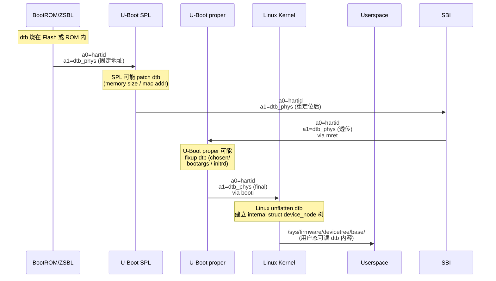

> **核心问题：** SBI 固件刚启动时，怎么知道当前板子有几个 hart、UART 在哪、CLINT 在哪、是否支持 sstc？硬编码不行（同一份二进制要支持多板）。**答案：** 在 mret 之前**扫描 FDT (Flattened Device Tree)** 把硬件地址 / 设备 compatible / 频率 / hart count 等运行时检测出来。
>
> **一句话答案：** FDT 是 bootloader 传给 SBI 的"设备信息打包文件"（来自 a1 寄存器）。SBI 一次性 walk 这棵树，提取自己关心的字段，存到本地变量，banner 显示出来 + setTimer / consolePutByte 等 fn 用这些值访问 MMIO。**不是 OS 才用 FDT — SBI 也用**，只是 OS 用得更深（设备驱动）。

按 [user_learning_style](../CLAUDE.md) 9 阶段：本笔记是 SBI 视角的 FDT 检测原理 + 实战。OS 视角见 [03-03-fdt-dts-boot-flow](03-03-fdt-dts-boot-flow.md)。

---

## 1. 大框架：SBI 为什么需要 FDT

### 1.1 没有 FDT 的世界（写死）

最早的 RISC-V SBI 实现（BBL 时代）没 FDT 检测。每个板子单独编译：
- `bbl-fu540` 硬编码 SiFive FU540 的 UART = 0x10010000
- `bbl-virt` 硬编码 QEMU virt 的 UART = 0x10000000
- 换板就要重新编译 + 烧录

**问题：** 一份 SBI 二进制只能在一种板上跑。

### 1.2 FDT 检测的世界（一份二进制 N 块板）

bootloader (U-Boot SPL / opensbi-payload-from-uboot) 把当前板的设备树（DTB）放在内存某处，地址通过 `a1` 寄存器传给 SBI。SBI 启动时扫 FDT 拿到所有 MMIO 地址 / 频率 / 设备名，**一份二进制跑所有合规板子**。


### 1.3 mret 接力链中 a1 = FDT 地址

```
ZSBL stub:
    a0 = mhartid
    a1 = FDT 物理地址  ← QEMU 注入；真机 SPL 加载到 SRAM
    j  0x80000000  → SBI 入口

    把 a1 保存为参数 → zigStart(fdt: usize)
    scanFdt(fdt) ← 扫描入口
    填充 _uart_base / _clint_base / _model_buf / ...
    
SBI mret:
    csrw mepc, OS_ENTRY (e.g. 0x80200000)
    a0 = mhartid (透传)
    a1 = fdt 物理地址（透传，OS 也要用）
    mret → S-mode (Linux/U-Boot proper)
```

**关键：** SBI 扫完 FDT 后 **不修改 FDT**（除了添加 memreserve 区域，见下文）— OS 拿到的 FDT 与 SBI 看到的几乎一样。

---

## 2. FDT 二进制结构（DTB 文件格式）

DTB = Device Tree Blob，是 DTS 编译产物。**纯二进制 + 大端字节序**。

```
┌─────────────────────────────────────────────────┐
│ FDT Header (40 bytes, magic + offsets + sizes)  │
├─────────────────────────────────────────────────┤
│ Memory Reservation Block (entries of 16B each)  │  ← 内核保护内存
├─────────────────────────────────────────────────┤
│ Structure Block (token stream)                  │  ← 树形数据
├─────────────────────────────────────────────────┤
│ Strings Block (NUL-terminated property names)   │  ← 属性名池
└─────────────────────────────────────────────────┘
```

### 2.1 FDT Header（40 字节，固定布局）

| 偏移 | 长度 | 字段 | 含义 |
|------|------|------|------|
| 0 | 4 | `magic` | 必须是 `0xD00DFEED`（大端） |
| 4 | 4 | `totalsize` | DTB 总大小 |
| 8 | 4 | `off_dt_struct` | structure block 起始偏移 |
| 12 | 4 | `off_dt_strings` | strings block 起始偏移 |
| 16 | 4 | `off_mem_rsvmap` | memory reservation block 起始偏移 |
| 20 | 4 | `version` | 当前 17 |
| 24 | 4 | `last_comp_version` | 最低兼容版本 16 |
| 28 | 4 | `boot_cpuid_phys` | boot hart ID（可选）|
| 32 | 4 | `size_dt_strings` | strings block 大小 |
| 36 | 4 | `size_dt_struct` | structure block 大小 |

**所有字段大端字节序**（big-endian），需手动 swap。

### 2.2 Structure Block（token 流）

5 种 32-bit token，每个对齐到 4 字节：

| Token | 值 | 含义 |
|-------|---|------|
| `FDT_BEGIN_NODE` | 1 | 节点开始；后跟 NUL-terminated 节点名（不含 / 前缀） |
| `FDT_END_NODE` | 2 | 节点结束 |
| `FDT_PROP` | 3 | 属性；后跟 prop_len(4B) + name_off(4B) + data(prop_len bytes) |
| `FDT_NOP` | 4 | 空操作（dtc 编译时填充用） |
| `FDT_END` | 9 | 整棵树结束 |

### 2.3 例：QEMU virt FDT 简化结构

```
FDT_BEGIN_NODE  ""                    ← root /
  FDT_PROP      compatible "riscv-virtio"
  FDT_PROP      model "riscv-virtio,qemu"
  FDT_PROP      #address-cells 2
  FDT_PROP      #size-cells 2
  
  FDT_BEGIN_NODE  "cpus"               ← /cpus
    FDT_PROP    timebase-frequency 10000000
    
    FDT_BEGIN_NODE "cpu@0"             ← /cpus/cpu@0
      FDT_PROP  device_type "cpu"
      FDT_PROP  riscv,isa "rv64imafdc_sstc_..."
      FDT_PROP  reg 0x0
    FDT_END_NODE
  FDT_END_NODE
  
  FDT_BEGIN_NODE  "soc"                ← /soc
    FDT_BEGIN_NODE "uart@10000000"
      FDT_PROP   compatible "ns16550a"
      FDT_PROP   reg 0x0 0x10000000 0x0 0x100
    FDT_END_NODE
    
    FDT_BEGIN_NODE "clint@2000000"
      FDT_PROP   compatible "sifive,clint0"
      FDT_PROP   reg 0x0 0x2000000 0x0 0x10000
    FDT_END_NODE
    
    FDT_BEGIN_NODE "test@100000"
      FDT_PROP   compatible "sifive,test1"
      FDT_PROP   reg 0x0 0x100000 0x0 0x1000
    FDT_END_NODE
  FDT_END_NODE
FDT_END_NODE
FDT_END
```

### 2.4 Strings Block

所有属性名（"compatible" / "reg" / "model" 等）集中存在 strings block，节省空间。FDT_PROP 中 `name_off` 是这个 block 内的偏移。

---


源码：`src/platform/fdt_generic.zig`

### 3.1 入口

```zig
fn scanFdt(fdt: usize) void {
    if (fdt == 0) return;                              // a1 == 0 兜底
    const base: [*]const u8 = @ptrFromInt(fdt);
    if (fdtBe32(base, 0) != 0xD00DFEED) return;        // magic 不对就放弃

    const off_struct: usize = fdtBe32(base, 8);        // header.off_dt_struct
    const off_strings: usize = fdtBe32(base, 12);      // header.off_dt_strings
    const strings: [*]const u8 = base + off_strings;
    const dt: [*]const u8 = base + off_struct;

    var pos: usize = 0;          // 当前 dt 偏移
    var depth: i32 = 0;          // 当前节点深度（root = 1）
    var cpus_depth: i32 = -1;    // 进入 /cpus 时记下深度
    var soc_depth: i32 = -1;     // 进入 /soc 时记下深度
    var cpu_count: usize = 0;
    var cur_node: []const u8 = "";
    var in_cpu_node: bool = false;

    while (true) {
        const token = fdtBe32(dt, pos);
        pos += 4;
        switch (token) {
            1 => /* BEGIN_NODE */,
            2 => /* END_NODE */,
            3 => /* PROP */,
            4 => /* NOP */,
            9 => break,    // END
            else => break,
        }
    }
}
```

### 3.2 大端字节序辅助

```zig
inline fn fdtBe32(ptr: [*]const u8, off: usize) u32 {
    const b = ptr + off;
    return (@as(u32, b[0]) << 24) | (@as(u32, b[1]) << 16) |
           (@as(u32, b[2]) << 8)  |  @as(u32, b[3]);
}
```

RISC-V CPU 是小端，FDT 是大端 → 每个 4 字节字段都要手动 swap。

### 3.3 BEGIN_NODE 处理

```zig
1 => {  // FDT_BEGIN_NODE
    depth += 1;
    const ns = pos;
    while (dt[pos] != 0) : (pos += 1) {}  // 找节点名 NUL 结尾
    const full = dt[ns..pos];
    pos += 1;                              // 跳过 NUL
    pos = (pos + 3) & ~@as(usize, 3);      // 4 字节对齐

    // 节点名去掉 '@xxx' 后缀
    var at: usize = 0;
    while (at < full.len and full[at] != '@') : (at += 1) {}
    cur_node = full[0..at];

    // 检测进入 /cpus 或 /soc
    if (cpus_depth < 0 and std.mem.eql(u8, cur_node, "cpus")) {
        cpus_depth = depth;
    }
    if (soc_depth < 0 and std.mem.eql(u8, cur_node, "soc")) {
        soc_depth = depth;
    }
    // 是否在 cpu@N 节点
    if (cpus_depth >= 0 and depth == cpus_depth + 1 and
        full.len >= 3 and std.mem.eql(u8, full[0..3], "cpu")) {
        cpu_count += 1;
        in_cpu_node = true;
    }
},
```

**关键技巧：** `cur_node` 去掉 `@addr` 后缀（节点 fullname 是 `cpu@0`，但我们用 `cpu` 做匹配）。

### 3.4 PROP 处理（核心）

```zig
3 => {  // FDT_PROP
    const prop_len = fdtBe32(dt, pos);
    const name_off = fdtBe32(dt, pos + 4);
    const data_off = pos + 8;
    pos += 8 + ((prop_len + 3) & ~@as(usize, 3));  // 跳过整个 prop

    // 从 strings block 读属性名
    var pname_end: usize = name_off;
    while (strings[pname_end] != 0) : (pname_end += 1) {}
    const prop_name = strings[name_off..pname_end];

    // 各种 prop 处理 ↓
    
    // (a) /cpus/cpu@N/timebase-frequency → _timer_freq_hz
    if (std.mem.eql(u8, prop_name, "timebase-frequency") and
        cpus_depth >= 0 and depth == cpus_depth + 1) {
        if (prop_len == 4) {
            _timer_freq_hz = fdtBe32(dt, data_off);
        } else if (prop_len == 8) {
            _timer_freq_hz = fdtBe64(dt, data_off);
        }
    }

    // (b) cpu 节点 riscv,isa 字符串中是否含 "sstc"
    if (std.mem.eql(u8, prop_name, "riscv,isa") and in_cpu_node) {
        var si: usize = data_off;
        while (si + 4 < data_off + prop_len) : (si += 1) {
            if (dt[si] == 's' and dt[si+1] == 's' and
                dt[si+2] == 't' and dt[si+3] == 'c') {
                _has_sstc = true;
                break;
            }
        }
    }

    // (c) root /model → 平台名（depth == 1 = root）
    if (depth == 1 and std.mem.eql(u8, prop_name, "model") and prop_len > 0) {
        copyOut(&_model_buf, &_model_len, dt, data_off, prop_len);
    }

    // (d) 各设备节点的 compatible 第一个字符串 → 设备 label
    if (std.mem.eql(u8, prop_name, "compatible") and soc_depth >= 0 and
        depth == soc_depth + 1 and prop_len > 0) {
        if (std.mem.eql(u8, cur_node, "uart") or
            std.mem.eql(u8, cur_node, "serial")) {
            copyOut(&_uart_compat_buf, &_uart_compat_len, dt, data_off, prop_len);
        } else if (std.mem.eql(u8, cur_node, "clint")) {
            copyOut(&_clint_compat_buf, &_clint_compat_len, dt, data_off, prop_len);
        } else if (std.mem.eql(u8, cur_node, "test")) {
            copyOut(&_test_compat_buf, &_test_compat_len, dt, data_off, prop_len);
        }
    }

    // (e) 各设备节点的 reg → MMIO base 地址
    if (std.mem.eql(u8, prop_name, "reg") and soc_depth >= 0 and
        depth == soc_depth + 1 and prop_len >= 8) {
        const addr64 = fdtBe64(dt, data_off);
        const base_addr: usize = @truncate(addr64);
        if (std.mem.eql(u8, cur_node, "uart") or
            std.mem.eql(u8, cur_node, "serial")) {
            _uart_base = base_addr;
        } else if (std.mem.eql(u8, cur_node, "clint")) {
            _clint_base = base_addr;
        } else if (std.mem.eql(u8, cur_node, "test")) {
            _test_dev_base = base_addr;
        }
    }
},
```

### 3.5 字符串复制策略（copyOut）

```zig
inline fn copyOut(dst: *[STR_CAP]u8, dst_len: *usize,
                  src: [*]const u8, off: usize, max: usize) void {
    var i: usize = 0;
    while (i < max and i < STR_CAP and src[off + i] != 0) : (i += 1) {
        dst[i] = src[off + i];
    }
    dst_len.* = i;
}
```

**为什么不用 slice 直接保存 FDT 内地址？**
- Banner 打印发生在 mret 之前 → 此时 FDT 还在 → slice 也对
- **但 init() 阶段保存指针风险大**：以防万一某次 banner 重打或 secondary hart 启动晚于 OS 改 FDT


---

## 4. compatible 字符串解析

FDT compatible 是 **NUL-separated stringlist**（不是单一字符串）：

```
compatible = "sifive,fu740-c000-uart0", "sifive,uart0";
```

二进制布局：
```
73 69 66 69 76 65 2C 66 75 37 34 30 2D 63 30 30 30 2D 75 61 72 74 30 00
73 69 66 69 76 65 2C 75 61 72 74 30 00
```


`copyOut` 自动到第一个 NUL 截断 → 第一个字符串就是结果。

---

## 5. 启动场景对照

### 5.1 QEMU virt（最典型，开发学习首选）

**FDT 来源：** QEMU 自动生成。

```bash
qemu-system-riscv64 -M virt -smp 2 -m 256M -nographic \
  -kernel /path/to/Linux/Image
```

**FDT 内容（QEMU 9.0+ 默认）：**
- `/model` = `"riscv-virtio,qemu"`
- `/cpus` 含 N 个 `cpu@i` 节点（按 `-smp` 数）
- `/cpus/cpu@i/riscv,isa` = `"rv64imafdc_sstc_..."`
- `/cpus/timebase-frequency` = `10000000` (10 MHz)
- `/soc/uart@10000000` compatible = `"ns16550a"`
- `/soc/clint@2000000` compatible = `"sifive,clint0"`
- `/soc/test@100000` compatible = `"sifive,test1"`

**a1 寄存器值：** QEMU 默认把 FDT 加载到 RAM 高端（约 0x8FE00000，依赖 `-m`）。

```
Platform Name             : riscv-virtio,qemu  (← FDT /model)
Platform IPI Device       : sifive,clint0
Platform Timer Device     : sifive,clint0 @ 10000000Hz
Platform Console Device   : ns16550a
Platform Reboot Device    : sifive,test1
Platform Shutdown Device  : sifive,test1
```

### 5.2 SiFive HiFive Unmatched / Unleashed (FU740/FU540)

**FDT 来源：** U-Boot SPL 加载 FIT 镜像时把 dtb 提取到内存，解析后跳到 SBI 时 a1 = dtb 物理地址。

**FDT 内容差异（vs QEMU virt）：**
- `/model` = `"SiFive HiFive Unmatched A00"`
- CLINT：`compatible = "sifive,fu540-c000-clint", "sifive,clint0"`
- timebase-frequency = 1000000 (1 MHz)

```
Platform Name             : SiFive HiFive Unmatched A00
Platform IPI Device       : sifive,fu540-c000-clint
Platform Timer Device     : sifive,fu540-c000-clint @ 1000000Hz
Platform Console Device   : sifive,fu540-c000-uart0
```


### 5.3 StarFive VisionFive 2 (JH7110)

**FDT 来源：** OpenSBI/RustSBI 上游或 U-Boot 携带 dtb。

**特殊：**
- 8 个 hart（SiFive U74 + Monitor）
- `/cpus/cpu@0/status = "disabled"`（Monitor hart 不启动 OS）
- 多 UART：8 个 `serial@N`，需要选 chosen/stdout-path 指定的那个


### 5.4 Allwinner D1 / SpacemiT K1

**FDT 来源：** U-Boot SPL 编译时打包 dtb 到 FIT。

**特殊：**
- D1 有特殊 thead C906 ISA 扩展（`riscv,isa` 含 `xthead*` 前缀）
- K1 (Banana Pi BPI-F3) 8 hart + RVA22


---


|------|---------|---------------------|-------|
| **FDT parser** | libfdt（来自 dtc 项目）| 自实现 + serde-style | 自实现单 walk |
| **代码量** | ~3000 行（libfdt）| ~500 行 Rust | ~200 行 Zig |
| **多 platform** | 几十个 platform 子目录 | 同 | FDT Generic + plats/ submodule |
| **fully scan FDT** | 是（建立 nodes/props 数据库）| 同 | **一次 walk**（不建数据库，找完即扔）|
| **string buffer** | 静态 + 部分动态 | static buffer | **复制到 .bss 固定 buffer** |
| **memreserve** | libfdt 操作 | 同 | 自实现添加 M-mode 区域 |
| **alpha order** | 不保证 | 不保证 | 不保证 |
| **chosen/stdout-path** | ✅ 解析 | 部分 | ❌ 暂未实现 |

- 不建 node tree（OpenSBI 是先 unflatten 再用）
- single-pass walk，遇到关心的 prop 就直接处理
- 字符串 copy out，不存 FDT 内的指针
- 适合"教学 + 嵌入式"场景，不适合复杂多 console 板

---

## 6.5 FDT 全链路传递：从 BootROM 到 OS userspace

> 一棵 FDT 在启动链各阶段被谁加载、谁修改、谁消费？这是 RISC-V boot 流程的关键脉络。

### 6.5.1 完整传递链（按时间顺序）



### 6.5.2 各阶段对 FDT 的操作

| 阶段 | 谁加载 dtb | 谁可能修改 dtb | 加载位置 | 传给下一段方式 |
|------|----------|-------------|---------|--------------|
| **BootROM/ZSBL** | 烧在 Flash 或硬编码地址 | ❌（mask ROM 不可改）| Flash 或 SRAM | a1 = dtb 物理地址（直接） |
| **U-Boot SPL** | 从 FIT 镜像中提取 | 可能 patch（内存大小 / MAC 地址 / 板版本号）| L2-cache-as-RAM 或 SRAM 临时 | a1 透传 |
| **U-Boot proper** | 不重新加载 | **fixup `chosen` 节点**（添加 bootargs / initrd 范围 / RNG seed）| 同 SBI 阶段 | a1 透传（booti / bootefi） |
| **Linux Kernel** | 从 a1 读 | unflatten 后内部用 struct device_node，**原 dtb 可丢可保留** | 内核保留区 | 通过 `/sys/firmware/devicetree/base/` 暴露给用户态 |
| **userspace** | 从 sysfs 读 | 通常只读 | / | overlay 应用可改（device tree overlay）|

### 6.5.3 关键传递机制详解

#### A. ZSBL → SPL：a1 是怎么"约定"为 dtb 地址的？

ZSBL 是硬件烧死代码，**SoC 厂商规定 ABI**：
- SiFive FU740：ZSBL 把 dtb 嵌在 Flash 偏移 X，启动时 a1 = X 物理地址
- QEMU virt：QEMU 自动把 dtb 加载到 DRAM 高端（约 0x8FE00000），并在 0x1000 stub 设 `ld a1, ...` 加载该地址
- StarFive JH7110：BROM 把 dtb 加载到 SRAM，SPL 接管前设 a1

**统一约定（事实标准）**：a0=hartid, a1=dtb_phys；mret 时透传。**不是 RISC-V spec 强制，是 OpenSBI/RustSBI/U-Boot 共同遵守的事实 ABI**。

#### B. SPL → SBI：可能重定位 dtb

SPL 工作期间用 SRAM/L2-cache，DRAM 训练完后**可能把 dtb 重定位到 DRAM 高地址**（避免被 OS 覆盖）。

OpenSBI 的 fw_dynamic 模式有专门 struct 描述这个：

```c
// OpenSBI fw_dynamic info struct (passed via a2 in fw_dynamic mode)
struct fw_dynamic_info {
    u64 magic;
    u32 version;
    u64 next_addr;       // OS 入口地址
    u64 next_mode;       // 0=U / 1=S / 3=M
    u64 options;
    u64 boot_hart;
    u64 dtb;             // dtb 物理地址 ← SBI 可能重定位
};
```


#### C. SBI → OS：a1 透传 + memreserve 保护

```zig
csrw mepc, OS_ENTRY     // e.g. 0x80200000
a0 = mhartid             // 透传
a1 = fdt                 // 透传（SBI 不改地址）
fdtAddMemReservation(fdt, dram_base, fw_size)  // 在 dtb 内添加 memreserve
csrw mstatus, MPP=S MPIE=1 FS=Initial
mret                     // → S-mode @ OS_ENTRY
```

**为什么需要 memreserve：** Linux unflatten dtb 后建立 page allocator，会把所有"未保留"内存交给 user / 内核 heap。SBI 的 .text/.bss/.stack 区域如果没在 dtb memreserve 里声明，**Linux 可能把这块物理地址给 userspace** → SBI 函数被踩 → 下一次 ecall 跳到垃圾代码 → kernel panic。

memreserve 是"OS 友好告知 SBI 占用区域"的唯一方式。

#### D. OS unflatten + 暴露 sysfs

Linux 启动后：
```c
// arch/riscv/kernel/setup.c
void __init setup_arch(...) {
    early_init_dt_verify(dtb_phys);   // a1 给的 dtb_phys
    early_init_dt_scan_nodes(...);    // 扫 root + /memory + /chosen
    unflatten_device_tree();          // 建 struct device_node 树
    init_machine_from_dt();           // platform driver 匹配
    // 之后整个内核生命周期都用 struct device_node
}
```

`/sys/firmware/devicetree/base/` 是 dtb 的 sysfs 镜像，**用户态可直接读**：
```bash
cat /sys/firmware/devicetree/base/model     # = "riscv-virtio,qemu"
cat /sys/firmware/devicetree/base/cpus/cpu@0/riscv,isa
hexdump /sys/firmware/devicetree/base/chosen/bootargs
```

### 6.5.4 谁会修改 dtb（严格列表）

绝大多数阶段**只读** dtb；只有 4 个明确会**修改**：

1. **U-Boot SPL** — 板特定 patches（内存 size / MAC / fab revision），不常用
2. **U-Boot proper `bootcmd` 期间** — 添加 `chosen/bootargs` / `chosen/linux,initrd-start` / `chosen/linux,initrd-end` / `chosen/rng-seed`
4. **Linux runtime overlay** — 用户用 `dtoverlay` 工具叠加（不在启动链）


**接收**（src/main.zig _start 入口）：
```zig
// _start callconv(.naked) — 收到 a0/a1 后保存：
asm volatile (
    \\la t0, BOOT_FDT_PTR
    \\sd a1, 0(t0)        # 保存 a1 = fdt_phys 到全局
    : ...
);
// zigStart 用全局 BOOT_FDT_PTR 调 scanFdt(fdt) + 后续透传
```

**透传**（src/main.zig zigStart 末尾 mret 前）：
```zig
fdtAddMemReservation(fdt, build_options.dram_base, build_options.fw_size);
csrw("mepc", build_options.os_entry);
asm volatile (
    \\mv a0, %[hartid]
    \\mv a1, %[fdt]
    \\mret
    :
    : [hartid] "r"(hartid), [fdt] "r"(fdt)
);
// → Linux _start: 看到 a0=hartid, a1=fdt_phys（与 SBI 收到的同一个值）
```


---

## 7. memreserve 添加（SBI 写 FDT 唯一动作）

SBI 启动后**保护自己的 M-mode 内存区域不被 OS 覆盖**：在 FDT memory reservation block 添加一个 entry。


```zig
pub fn fdtAddMemReservation(fdt: usize, addr: u64, size: u64) void {
    if (fdt == 0) return;
    const base: [*]u8 = @ptrFromInt(fdt);
    if (fdtBe32(base, 0) != 0xD00DFEED) return;
    
    const off_rsvmap = fdtBe32(base, 16);  // header.off_mem_rsvmap
    
    // 找到 reservation block 末尾的 (0, 0) terminator
    var i: usize = off_rsvmap;
    while (true) : (i += 16) {
        const a = fdtBe64(base, i);
        const s = fdtBe64(base, i + 8);
        if (a == 0 and s == 0) break;  // terminator
    }
    
    // 在 terminator 处覆盖写入 (addr, size)；新 terminator 后移 16B
    fdtWriteBe64(base, i, addr);
    fdtWriteBe64(base, i + 8, size);
    fdtWriteBe64(base, i + 16, 0);
    fdtWriteBe64(base, i + 24, 0);
}
```

```zig
fdtAddMemReservation(fdt, build_options.dram_base, build_options.fw_size);
// → OS unflatten dt 时看到这个 reserved 区域 → 不分配给 page allocator
```


---

## 8. 实战调试技巧

### 8.1 看 QEMU 实际生成的 FDT

```bash
qemu-system-riscv64 -M virt -smp 2 -machine dumpdtb=virt.dtb
dtc -I dtb -O dts virt.dtb -o virt.dts
cat virt.dts | head -50
```

### 8.2 真机看 OS 看到的 FDT（Linux)

```bash
# Linux 启动后
ls /sys/firmware/devicetree/base
cat /sys/firmware/devicetree/base/model           # = "riscv-virtio,qemu"
hexdump -C /sys/firmware/devicetree/base/cpus/cpu@0/riscv,isa
```

或 `dtc /sys/firmware/devicetree/base -o running.dts` 把活着的设备树 dump 出来。

### 8.3 SBI 阶段看 FDT 内容


### 8.4 FDT corrupt 的快速验证

- 检查 a1 寄存器到达 `_start` 时是否非零
- 检查 a1 指向地址前 4 字节是否 `D00DFEED`（用 GDB `x/4xb $a1`）
- 检查 QEMU 是否给了 `-bios` 而非 `-kernel`（-kernel 模式 a1 行为不同）

---


- 整棵树 unflatten 成内存对象
- 按 compatible 字符串匹配 driver
- 中断号 / DMA channel / clock / pin 控制器多级引用解析
- overlay 应用（device tree overlay）


---

## 10. 进一步阅读

- **DTSpec**：https://www.devicetree.org/specifications/ — 官方规范（200+ 页）
- **OpenSBI fdt_helper.c**：https://github.com/riscv-software-src/opensbi/tree/master/lib/utils/fdt
- **libfdt 文档**：https://git.kernel.org/pub/scm/utils/dtc/dtc.git/tree/libfdt
- **本仓库相关笔记**：
  - [02-01 § 3.0 ZSBL](02-01-boot-chain-and-sbi.md) — a1 寄存器 ABI
  - [03-03 fdt-dts-boot-flow](03-03-fdt-dts-boot-flow.md) — DTB 在启动链各阶段的传递
  - [00-02 § Layer 1 ZSBL](00-02-fullstack-vertical.md) — ZSBL 5 大职责，传 a0/a1
  - [00-19 § 3 14 distros 矩阵](00-19-image-and-bootflow-quickstart.md) — RustSBI Prototyper 真实场景
