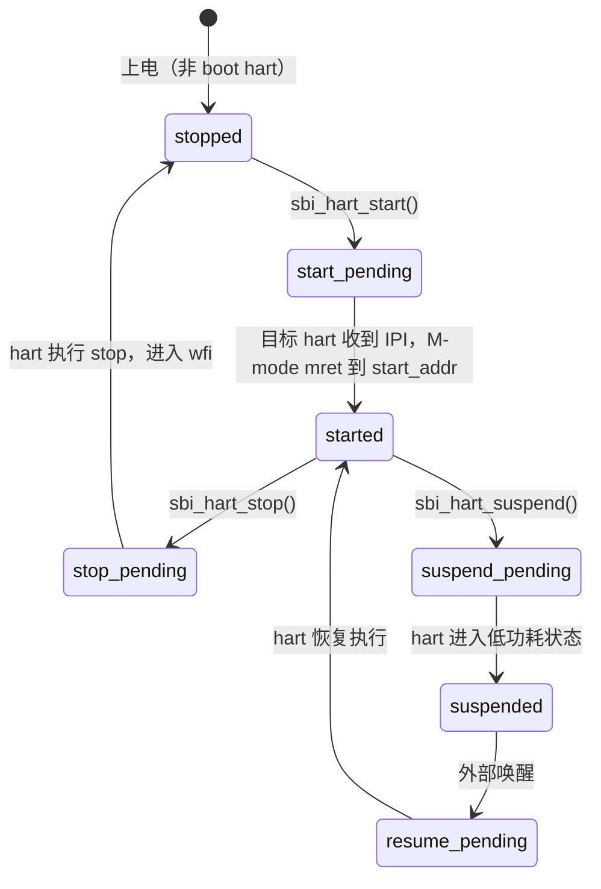
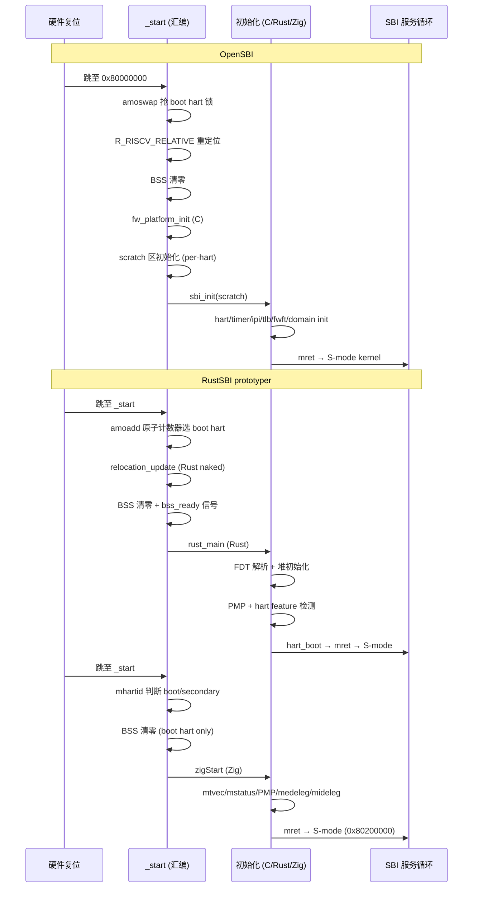

> 参考实现：BBL（riscv-pk）、OpenSBI、RustSBI

---

## 目录

1. [M-mode 启动：`_start` → `zigStart` → ecall 陷阱](#1-m-mode-启动)
2. [SBI 演化史：从 Legacy 到 v3.0](#2-sbi-演化史)
   - [v0.x — Legacy 时代（BBL era）](#21-v0x--legacy-时代bbl-era)
   - [v1.0 — 第一个正式规范](#22-v10--第一个正式规范2022)
   - [v2.0 — 调试控制台与状态统计](#23-v20--调试控制台与状态统计2024)
   - [v3.0 — 最新版](#24-v30--最新版2025)
3. [完整扩展参考表](#3-完整扩展参考表)
4. [最小 SBI 等级](#4-最小-sbi-等级)
5. [ku-sbi 实现要点](#5-ku-sbi-实现要点)

---

## 1. M-mode 启动

### 1.1 执行流总图

```mermaid
flowchart TD
    ROM["固件 ROM / QEMU reset vector\n(0x1000)"] --> _start

    subgraph _start["_start (naked)"]
        S1["csrr t0, mhartid\n读取 hart ID"] --> S2
        S2["sp = __stack_top − hartid × 0x10000\n每 hart 独立 64KiB 栈"] --> S3
        S3{hartid == 0?}
        S3 -- 是 boot hart --> BSS["清 BSS\n__bss_start..__bss_end 写零"] --> zigStart
        S3 -- 是次级 hart --> zigSecondary
    end

    subgraph zigStart["zigStart (Zig noreturn)"]
        Z1["csrw mtvec, &trapEntry\n(直接模式，低2位=0)"] --> Z2
        Z2["mstatus: MPP=01(S), MPIE=1"] --> Z3
        Z3["PMP: pmpaddr0=全地址空间\npmpcfg0=0x1f (RWX+NAPOT+L)"] --> Z4
        Z4["medeleg=0xFFFF & ~(1<<9)\n(保留 ecall-from-S 在 M-mode)"] --> Z5
        Z5["mideleg=0x0222\n(SSIE/STIE/SEIE → S-mode)"] --> Z6
        Z6["hart_ctrl[0].state = started"] --> Z7
        Z7["打印 banner via UART"] --> Z8
        Z8["mepc = 0x80200000\nmret → S-mode 内核"]
    end

    subgraph zigSecondary["zigSecondary (Zig noreturn)"]
        SC1["mtvec/mstatus/PMP 同 zigStart"] --> SC2
        SC2["csrs mie, MSIE\n使能 M-mode 软件中断"] --> SC3
        SC3["wfi 循环\n等待 IPI 唤醒"]
    end

    subgraph trapEntry["trapEntry (naked)"]
        T1["addi sp, sp, -256\n保存 31 个通用寄存器 (sd x,n*8(sp))"] --> T2
        T2["a0=sp, a1=mepc, a2=mcause\ncall trapHandler"] --> T3
        T3["csrw mepc, a0 (返回值=新mepc)"] --> T4
        T4["恢复所有寄存器\nmret"]
    end

    subgraph trapHandler["trapHandler (Zig)"]
        H1{mcause[63]?} -- 中断 --> H2
        H2{code?}
        H2 -- 7=MTIMER --> H3["delegateTimerToS:\ncsrc mie, MTIE\ncsrs mip, STIP"]
        H2 -- 3=MSOFT(IPI) --> H4["clearIpi()\nhandlePendingRfnc()\ncheckHsmIpi()"]
        H4 -- 有 HSM start --> H5["修改 frame.a0/a1\n返回 info.addr → mret 跳入 S-mode"]
        H1 -- 同步陷阱 --> H6{code=8/9/10/11?}
        H6 -- ecall --> H7["eid=a7, fid=a6\nMySbi.dispatch(eid,fid,args)\n返回 mepc+4"]
        H6 -- 其他 --> H8["返回 mepc (不跳过)\nS-mode 陷阱处理接管"]
    end

    zigStart -. mret .-> trapEntry
    zigSecondary -. IPI .-> trapEntry
    trapEntry --> trapHandler
    trapHandler --> trapEntry
```

### 1.2 `_start`：per-hart 栈计算

```
// ku-sbi src/main.zig _start 汇编
csrr t0, mhartid
la   sp, __stack_top
li   t1, 0x10000           // 每 hart 64 KiB
mul  t1, t0, t1
sub  sp, sp, t1            // hart 0 → __stack_top, hart 1 → __stack_top - 0x10000
```

关键点：
- `__stack_top` 在链接脚本中定义，栈向低地址增长
- hart 0 在最高地址（紧接 `__stack_top`），hart N 在 `__stack_top - N*0x10000`
- 对比 BBL（`riscv-pk/machine/mentry.S`）：`sp = stacks + RISCV_PGSIZE - MENTRY_FRAME_SIZE + hartid * RISCV_PGSIZE`，同样是 per-hart 偏移

### 1.3 BSS 清零（仅 boot hart）

```
bnez t0, .Lsecondary      // 非 hart 0 直接跳到 zigSecondary
la   t1, __bss_start
la   t2, __bss_end
.Lbss_loop:
beq  t1, t2, .Lbss_done
sd   zero, 0(t1)
addi t1, t1, 8
j    .Lbss_loop
```

次级 hart 不清 BSS——它们启动时 BSS 已经被 hart 0 清完，且 hart 0 的初始化（包括 `hart_ctrl` 数组）已经完成。次级 hart 直接进入 `wfi` 等待 IPI。

### 1.4 `zigStart`：M-mode 初始化序列

| 步骤 | CSR | 值 | 含义 |
|------|-----|----|------|
| 1 | `mtvec` | `&trapEntry & ~3` | 直接模式陷阱入口，4字节对齐 |
| 2 | `mstatus` | `(1<<11)\|(1<<7)` | MPP=01(S-mode), MPIE=1 |
| 3 | `pmpaddr0` | `~0 >> 10` | NAPOT 覆盖全 4GiB |
| 4 | `pmpcfg0` | `0x1f` | RWX + NAPOT + Locked |
| 5 | `medeleg` | `0xFFFF & ~(1<<9)` | 委托所有同步异常给 S-mode，**保留 ecall-from-S（cause=9）** |
| 6 | `mideleg` | `0x0222` | SSIE(bit1)+STIE(bit5)+SEIE(bit9) → S-mode |

**为什么 ecall-from-S 不委托？**  
ecall-from-S 就是 S-mode 内核调用 SBI 服务的方式。如果委托出去，ecall 会在 S-mode 被当成普通异常，永远不会进 M-mode 的 `trapHandler`，SBI 服务完全失效。

**mret 语义**：`mret` 执行时，处理器将 `mstatus.MPP` 填入当前特权级，`mstatus.MPIE` 填入 `MIE`，然后跳到 `mepc`。以上设置使 `mret` 后进入 S-mode，中断使能。

### 1.5 `trapEntry`：寄存器保存与恢复

ku-sbi 在**当前栈**上分配 `TrapFrame`（256字节，31个寄存器 × 8字节），不使用 `mscratch`：

```
addi sp, sp, -256
sd ra,   0*8(sp)
sd sp,   1*8(sp)   // 保存陷阱前的 sp（此时 sp 已经是减后的值！）
...
sd t6,  30*8(sp)
// 传参
mv   a0, sp        // a0 = &TrapFrame
csrr a1, mepc
csrr a2, mcause
call trapHandler
// 返回值 a0 = 新 mepc
csrw mepc, a0
// 恢复（sp 最后恢复）
ld ra,   0*8(sp)
...
ld sp,   1*8(sp)   // 最后恢复 sp（跳过 t6，t6 用于最后恢复）
mret
```

注意：`sd sp, 1*8(sp)` 保存的是 **trapEntry 执行 `addi sp, sp, -256` 之后**的 sp 值，而非陷阱发生时的 sp。这是为了简化实现；若需要精确还原陷阱前 sp，需要先暂存到临时寄存器。

BBL 的做法不同：BBL 用 `mscratch` 保存 HLS（Hart-Local Storage）指针，通过 `csrrw sp, mscratch, sp` 切换到 M-mode 栈，从而保存了完整的陷阱前 sp。

### 1.6 `trapHandler`：三条路径

```
mcause[63] == 1（中断）:
  code=7 (M-timer)  → delegateTimerToS()
                       csrc mie, MTIE   // 关 M-mode timer 中断使能
                       csrs mip, STIP   // 手动置 S-mode timer 挂起位
                       return mepc      // 返回原 PC

  code=3 (M-软件中断/IPI):
    clearIpi()            // 清 CLINT MSIP
    handlePendingRfnc()   // 执行挂起的 fence 操作
    checkHsmIpi()         // 检查是否为 HSM start IPI
      → 若是：修改 frame.a0/a1，return info.addr（mret 跳入新 hart 的 start_addr）
      → 若否：return mepc

mcause[63] == 0（同步陷阱）:
  code=8/9/10/11 (ecall from U/S/VS/M):
    eid = frame.a7
    fid = frame.a6
    MySbi.dispatch(eid, fid, args) → ret
    frame.a0 = ret.err
    frame.a1 = ret.val
    return mepc + 4      // 跳过 4 字节 ecall 指令

  其他：return mepc（委托给 S-mode）
```

**计时器中断的代理链**：
```
S-mode 调用 sbi_set_timer(T)
  → ecall → trapHandler → Time.setTimer()
  → 写 CLINT.mtimecmp[hartid] = T
  → csrc mip, STIP（清旧挂起）
  → csrs mie, MTIE（使能 M-mode timer）
mtime 到达 T：
  → M-mode timer 中断（code=7）
  → delegateTimerToS(): csrc mie MTIE, csrs mip STIP
  → mret 返回 S-mode（STIP 已置，S-mode 的 timer 中断处理器被调用）
```

---

## 2. SBI 演化史

### 2.1 v0.x — Legacy 时代（BBL era）

**背景**：2010年代中期，RISC-V 生态刚起步。Berkeley Boot Loader（BBL，位于 `riscv-pk` 仓库）是唯一的"SBI"提供者。没有正式规范 PDF，只有一个头文件 `machine/mcall.h`，9 个 `#define`。

**核心设计**（来自 `riscv-pk/machine/mtrap.c`）：
- trap 分发由 `mcall_trap()` 完成
- 读 `regs[17]`（即 a7）获取调用号，读 `regs[10]`（a0）获取参数
- 返回值写回 `regs[10]`（a0），**只有 a0**，无错误码概念
- 所有 hart 共享一个 M-mode 栈（通过 HLS，Hart Local Storage）

**9 个 Legacy SBI 调用**（来自实际源码 `mcall.h` + `mtrap.c`）：

| EID | 宏名 | BBL 实现函数 | a0 参数 | 返回值（a0） | 说明 |
|-----|------|------------|---------|------------|------|
| 0x00 | `SBI_SET_TIMER` | `mcall_set_timer(uint64_t when)` | 截止时间（RV64：a0；RV32：a0+a1） | 0 | 写 `mtimecmp`，清 STIP，置 MTIE |
| 0x01 | `SBI_CONSOLE_PUTCHAR` | `mcall_console_putchar(uint8_t ch)` | 字节值 | 0 | 输出到 UART/HTIF |
| 0x02 | `SBI_CONSOLE_GETCHAR` | `mcall_console_getchar()` | — | 字节或 -1 | 非阻塞读，无字符返回 -1 |
| 0x03 | `SBI_CLEAR_IPI` | `mcall_clear_ipi()` | — | 清前的 SSIP | 清 `mip.SSIP`，已废弃 |
| 0x04 | `SBI_SEND_IPI` | `send_ipi_many((uintptr_t*)arg0, IPI_SOFT)` | 指向 bitmask 的物理地址指针 | 0 | 通过 CLINT MSIP 发 IPI |
| 0x05 | `SBI_REMOTE_FENCE_I` | `send_ipi_many(arg0, IPI_FENCE_I)` | 同上 | 0 | IPI 通知目标 hart 执行 fence.i |
| 0x06 | `SBI_REMOTE_SFENCE_VMA` | `send_ipi_many(arg0, IPI_SFENCE_VMA)` | 同上（a1=start, a2=size 被忽略） | 0 | IPI 通知目标执行 sfence.vma |
| 0x07 | `SBI_REMOTE_SFENCE_VMA_ASID` | `send_ipi_many(arg0, IPI_SFENCE_VMA)` | 同上 | 0 | 与 0x06 实现相同，ASID 未使用 |
| 0x08 | `SBI_SHUTDOWN` | `mcall_shutdown()` → `poweroff(0)` | — | — | 写 tohost=1 / HTIF poweroff |

**返回约定**：仅 a0，无 a1。Linux 的早期调用方式：
```c
// arch/riscv/include/asm/sbi.h (早期)
static inline long sbi_call(long which, long arg0, ...)
{
    register long a0 asm("a0") = arg0;
    register long a7 asm("a7") = which;
    asm volatile("ecall" : "+r"(a0) : "r"(a7) : "memory");
    return a0;
}
```

**BBL 的局限**：
- 无 hart 状态机，次级 hart 只能 IPI 通知，无 start/stop 概念
- fence 操作简化：IPI 通知远端执行，不等待完成（`send_ipi_many` 有等待逻辑，但实现较粗糙）
- CONSOLE_GETCHAR 单字节读写，高频 I/O 需要多次陷阱
- 无版本查询，OS 无法检测 SBI 能力

**线上 ASCII 表示**：Linux `include/asm/sbi.h` 使用数字常量，对应 ASCII 值没有含义——这是 v1.0 规范才引入 ASCII EID 编码的原因。

### 2.2 v1.0 — 第一个正式规范（2022）

**关键变化**：

1. **正式 PDF 规范**（`riscv-sbi-spec/riscv-sbi-v1.0.0.pdf`），EID 使用 ASCII 编码（`"TIME"` → `0x54494D45`）
2. **返回值结构化**：`struct sbiret { long error; long value; }`，a0=error code，a1=value
3. **BASE Extension（EID=0x10）强制要求**：最小实现必须响应 7 个 BASE 查询
4. **EID 命名空间划分**：
   - `0x00–0xFF`：legacy（向后兼容）
   - `0x10`：BASE（特殊，不是 ASCII 编码）
   - `0x54494D45`–...: 正式扩展（ASCII）
   - `0x09000000–0x09FFFFFF`：厂商扩展
   - `0x0A000000–0x0AFFFFFF`：固件定义扩展
5. **FID 概念**：同一扩展内用 a6 区分功能，不再是一个 EID 一个功能

**错误码**（v1.0 定义，v3.0 扩展至 15 个）：

| 值 | 名称 | 含义 |
|----|------|------|
| 0 | SUCCESS | 成功 |
| -1 | FAILED | 通用失败 |
| -2 | NOT_SUPPORTED | 扩展/功能不支持 |
| -3 | INVALID_PARAM | 参数无效 |
| -4 | DENIED | 拒绝（权限） |
| -5 | INVALID_ADDRESS | 地址无效 |
| -6 | ALREADY_AVAILABLE | 已存在/可用 |
| -7 | ALREADY_STARTED | 已启动 |
| -8 | ALREADY_STOPPED | 已停止 |
| -9 | NO_SHMEM | 共享内存未设置（v2.0+） |
| -10 | INVALID_STATE | 非法状态（v2.0+） |
| -11 | BAD_RANGE | 范围错误（v2.0+） |
| -12 | TIMEOUT | 超时（v2.0+） |
| -13 | IO | I/O 错误（v2.0+） |
| -14 | NO_DATA | 无数据（v2.0+） |
| -15 | NO_RESOURCE | 资源不足（v3.0） |

**最小实现（Minimum SBI）**：仅实现 BASE Extension。符合规范但无任何实际功能。S-mode 可以查询版本、探测扩展可用性，但无法输出、无法使用计时器。在实践中毫无意义，但合法。

v1.0 引入的扩展（全部须平台提供相应硬件支持）：

| 扩展 | EID | ASCII | 必须/可选 | 功能 |
|------|-----|-------|----------|------|
| BASE | 0x10 | 非ASCII | **强制** | 版本查询、扩展探测、硬件信息 |
| TIME | 0x54494D45 | "TIME" | 可选 | 计时器设置 |
| IPI | 0x00735049 | "sPI" | 可选 | 处理器间中断 |
| RFNC | 0x52464E43 | "RFNC" | 可选 | 远端 fence 操作 |
| HSM | 0x0048534D | "HSM" | 可选 | Hart 状态机 |
| SRST | 0x53525354 | "SRST" | 可选 | 系统复位/关机 |
| PMU | 0x00504D55 | "PMU" | 可选 | 性能计数器 |

### 2.3 v2.0 — 调试控制台与状态统计（2024）

**新增扩展**：

| 扩展 | EID | ASCII | 替代/新增 |
|------|-----|-------|---------|
| DBCN | 0x4442434E | "DBCN" | 替代 Legacy 0x01/0x02 |
| SUSP | 0x53555350 | "SUSP" | 新增：系统挂起 |
| CPPC | 0x43505043 | "CPPC" | 新增：ACPI CPPC（CPU 性能控制） |
| NACL | 0x4E41434C | "NACL" | 新增：嵌套加速（Hypervisor 用） |
| STA | 0x00005354 | "STA" | 新增：窃取时间统计 |

**DBCN vs Legacy 控制台**：

| 特性 | Legacy 0x01/0x02 | DBCN |
|------|-----------------|------|
| 写协议 | 单字节 ecall，每字节一次陷阱 | 物理缓冲区（num_bytes + base_addr），批量写 |
| 读协议 | 单字节，无字符返回 -1 | 物理缓冲区，非阻塞批量读 |
| 性能 | 差（每字符一次陷阱） | 好（一次陷阱写N字节） |
| 错误反馈 | 无（只有 a0 返回值） | 结构化 SbiRet |
| WRITE_BYTE | 不支持 | FID=2，单字节写（用于调试） |

ku-sbi 的实现（`src/ext/dbcn.zig`）：
- `CONSOLE_WRITE`（FID=0）：`a0=num_bytes, a1=base_addr(低32位), a2=base_addr(高32位 RV32用)`，返回实际写入字节数
- `CONSOLE_READ`（FID=1）：`a0=num_bytes, a1=base_addr`，非阻塞读，返回实际读取字节数
- `CONSOLE_WRITE_BYTE`（FID=2）：`a0=byte`，单字节同步写

### 2.4 v3.0 — 最新版（2025）

**新增扩展**：

| 扩展 | EID | ASCII | 功能 |
|------|-----|-------|------|
| SSE | 0x00535345 | "SSE" | 监督软件事件（Supervisor Software Events）：异步事件注入到 S-mode |
| MPXY | 0x4D505859 | "MPXY" | M-mode 到 S-mode 的消息传递代理 |
| DBTR | 0x44425452 | "DBTR" | 硬件断点触发器管理（Debug Triggers）|
| FWFT | 0x46574654 | "FWFT" | 固件特性表（Firmware Features Table）：运行时控制硬件安全特性 |
| PMU (扩展) | 0x00504D55 | "PMU" | 新增 FID=7 (SNAPSHOT_SET_SHMEM) 和 FID=8 (EVENT_GET_INFO) |

**FWFT 特性 ID**（`src/spec/eid.zig` 中定义）：

| 特性 ID | 名称 | 说明 |
|--------|------|------|
| 0 | MISALIGNED_EXC_DELEG | 非对齐访问异常委托给 S-mode |
| 1 | LANDING_PAD | CFI Landing Pad 支持 |
| 2 | SHADOW_STACK | CFI Shadow Stack 支持 |
| 3 | DOUBLE_TRAP | 双重陷阱处理 |
| 4 | PTE_AD_HW_UPDATING | 页表项 A/D 位硬件更新 |
| 5 | POINTER_MASKING_PMLEN | 指针掩码 PMLEN 设置 |

---

## 3. 完整扩展参考表

### BASE（EID=0x10，强制，v1.0+）

平台要求：无（纯软件查询）

| FID | 函数 | 入参 | 返回 a1 | 说明 |
|-----|------|------|---------|------|
| 0 | `sbi_get_spec_version` | — | `(major<<12)\|minor` | 线上编码，RC 标记不出现 |
| 1 | `sbi_get_impl_id` | — | 实现 ID | ku-sbi=`0x6B757362`("kusb") |
| 2 | `sbi_get_impl_version` | — | 实现版本 | ku-sbi=`0x00000001` |
| 3 | `sbi_probe_extension` | a0=EID | 1=可用, 0=不可用 | BASE 自身始终返回 1 |
| 4 | `sbi_get_mvendorid` | — | `mvendorid` CSR | 硬件厂商 ID |
| 5 | `sbi_get_marchid` | — | `marchid` CSR | 架构 ID |
| 6 | `sbi_get_mimpid` | — | `mimpid` CSR | 硬件实现 ID |

ku-sbi 实现：`src/ext/base.zig`，probe 函数由 `sbi.zig` 在 comptime 注入。

---

### TIME（EID=0x54494D45 "TIME"，可选，v1.0+）

平台要求：`Platform.setTimer(deadline: u64) void`

| FID | 函数 | 入参 | 返回 | 说明 |
|-----|------|------|------|------|
| 0 | `sbi_set_timer` | a0=截止时间低32位（RV64：完整64位）；RV32 时 a1=高32位 | `{err=0, val=0}` | 写 `mtimecmp`，清 STIP，置 MTIE |

**代理流程**：`set_timer(T)` → 写 CLINT mtimecmp → 使能 MTIE → 当 mtime≥T：M-mode timer 中断 → 清 MTIE + 置 STIP → mret → S-mode timer ISR

ku-sbi 实现：`src/ext/time.zig`，同时支持 Legacy 0x00 向后兼容。

QEMU virt 平台实现：
```
CLINT_MTIMECMP_BASE = 0x02004000
mtimecmp[hartid] @ CLINT_MTIMECMP_BASE + hartid * 8
```

---

### IPI（EID=0x00735049 "sPI"，可选，v1.0+）

平台要求：`Platform.sendIpi(mask: HartMask) void`

| FID | 函数 | 入参 | 返回 | 说明 |
|-----|------|------|------|------|
| 0 | `sbi_send_ipi` | a0=hart_mask（bitmask 值），a1=hart_mask_base（基准 hart ID） | `{err=0, val=0}` | 对目标 hart 集合发送 S-mode 软件中断（通过 M-mode MSIP → 转发为 SSIP） |

**HartMask 语义**：目标 hart 集合 = `{base + i | bit i of mask == 1}`。`mask=0, base=0xFFFF...` 表示所有 hart。

**IPI 路径**：S-mode 发 `sbi_send_ipi` → M-mode 写 `CLINT.MSIP[target_hart]=1` → target hart 的 M-mode 软件中断 → M-mode IPI 处理器检查 HSM/RFNC 后置 `mip.SSIP` → target hart S-mode 的软件中断 ISR

ku-sbi 实现：`src/ext/ipi.zig`；QEMU virt：`CLINT_MSIP_BASE = 0x02000000`，每 hart 4字节。

**Legacy 0x04 差异**：a0 是指向 bitmask 的**物理地址指针**（64位机器上是 uintptr_t*），而非直接的 mask 值。

---

### RFNC（EID=0x52464E43 "RFNC"，可选，v1.0+）

平台要求：`remoteFenceI`、`remoteSfenceVma`、`remoteSfenceVmaAsid`（H-extension FID 可选）

| FID | 函数 | 入参 | 返回 | 说明 |
|-----|------|------|------|------|
| 0 | `sbi_remote_fence_i` | a0=mask, a1=base | `{0,0}` | 目标 hart 执行 `fence.i` |
| 1 | `sbi_remote_sfence_vma` | a0=mask, a1=base, a2=start_addr, a3=size | `{0,0}` | 目标 hart 执行 `sfence.vma` |
| 2 | `sbi_remote_sfence_vma_asid` | a0=mask, a1=base, a2=start, a3=size, a4=asid | `{0,0}` | 带 ASID 的 sfence.vma |
| 3 | `sbi_remote_hfence_gvma_vmid` | a0=mask, a1=base, a2=start, a3=size, a4=vmid | `{0,0}` | H-ext: hfence.gvma（VMID 过滤） |
| 4 | `sbi_remote_hfence_gvma` | a0=mask, a1=base, a2=start, a3=size | `{0,0}` | H-ext: hfence.gvma（无 VMID） |
| 5 | `sbi_remote_hfence_vvma_asid` | a0=mask, a1=base, a2=start, a3=size, a4=asid | `{0,0}` | H-ext: hfence.vvma（ASID 过滤）|
| 6 | `sbi_remote_hfence_vvma` | a0=mask, a1=base, a2=start, a3=size | `{0,0}` | H-ext: hfence.vvma（无 ASID） |

**依赖关系**：ku-sbi 中 `has_rfnc = has_ipi AND @hasDecl(P, "remoteFenceI") AND ...`，即 RFNC 依赖 IPI 基础设施。原因是远端 fence 通过 IPI 通知目标 hart 在本地执行 fence，必须能发送 IPI。

ku-sbi 实现：`src/ext/rfnc.zig`；QEMU virt：本地执行 fence 后，通过 `rfncRequest()` 设置 per-hart pending 结构体，再发 IPI；目标 hart 的 IPI 处理器调用 `handlePendingRfnc()`。

---

### HSM（EID=0x0048534D "HSM"，可选，v1.0+）

平台要求：`hartStart`、`hartStop`、`hartGetStatus`（`hartSuspend` 可选）

**Hart 状态机**：



| FID | 函数 | 入参 | 返回 | 说明 |
|-----|------|------|------|------|
| 0 | `sbi_hart_start` | a0=hartid, a1=start_addr, a2=opaque | `{0,0}` 或错误 | 启动停止状态的 hart，mret 跳到 start_addr，a0=hartid, a1=opaque |
| 1 | `sbi_hart_stop` | — | 不返回 | 当前 hart 停止，进入停止状态 |
| 2 | `sbi_hart_get_status` | a0=hartid | a1=HartState enum | 查询 hart 当前状态 |
| 3 | `sbi_hart_suspend` | a0=suspend_type, a1=resume_addr, a2=opaque | `{0,0}` 或错误 | 挂起当前 hart，恢复后跳到 resume_addr |

**HartState 枚举值**：

| 值 | 名称 | 含义 |
|----|------|------|
| 0 | started | 正常运行 |
| 1 | stopped | 停止 |
| 2 | start_pending | 启动中（等待 IPI 到达） |
| 3 | stop_pending | 停止中 |
| 4 | suspended | 挂起（低功耗） |
| 5 | suspend_pending | 挂起过渡中 |
| 6 | resume_pending | 恢复过渡中 |

**hart_start 的 ku-sbi 实现路径**：
```
sbi_hart_start(1, 0x80200000, fdt_addr)
  → trapHandler → MySbi.dispatch(HSM, HART_START, ...)
  → hsm.hartStart(): CAS stopped→start_pending，记录 start_addr/priv
  → sendIpi(mask={1, base=1})（给 hart 1 发 MSIP）
  → hart 1 的 M-mode IPI handler：
      clearIpi()
      checkHsmIpi(): CAS start_pending→started，返回 {addr, opaque}
      修改 frame.a0=hartid, frame.a1=opaque
      return info.addr（覆盖 mepc）
  → mret 进入 hart 1 的 S-mode，PC=start_addr，a0=hartid, a1=opaque
```

---

### SRST（EID=0x53525354 "SRST"，可选，v1.0+）

平台要求：`Platform.systemReset(reset_type: u32, reset_reason: u32) noreturn`

| FID | 函数 | 入参 | 返回 | 说明 |
|-----|------|------|------|------|
| 0 | `sbi_system_reset` | a0=reset_type, a1=reset_reason | 不返回（成功）/ 错误 | 系统复位或关机 |

**reset_type**：

| 值 | 名称 | QEMU 行为 |
|----|------|----------|
| 0 | SHUTDOWN | 写 test_dev 0x5555（PASS） |
| 1 | COLD_REBOOT | 写 test_dev 0x7777（RESET） |
| 2 | WARM_REBOOT | 写 test_dev 0x7777（RESET） |

**reset_reason**：0=NO_REASON，1=SYSTEM_FAIL，其他为平台自定义

**Legacy 0x08 关系**：`handleLegacyShutdown()` 等价于 `systemReset(SHUTDOWN, 0)`

---

### PMU（EID=0x00504D55 "PMU"，可选，v1.0+，v3.0 扩展）

平台要求：依赖硬件性能计数器（`hpmcounter`/`mcycle`/`minstret`）

| FID | 函数 | 引入版本 | 说明 |
|-----|------|---------|------|
| 0 | `sbi_pmu_num_counters` | v1.0 | 返回计数器数量 |
| 1 | `sbi_pmu_counter_get_info` | v1.0 | 查询计数器信息 |
| 2 | `sbi_pmu_counter_config_matching` | v1.0 | 配置事件匹配 |
| 3 | `sbi_pmu_counter_start` | v1.0 | 启动计数 |
| 4 | `sbi_pmu_counter_stop` | v1.0 | 停止计数 |
| 5 | `sbi_pmu_counter_fw_read` | v1.0 | 读取固件计数器（低32位） |
| 6 | `sbi_pmu_counter_fw_read_hi` | v1.0 | 读取固件计数器（高32位，RV32） |
| 7 | `sbi_pmu_snapshot_set_shmem` | v2.0 | 设置快照共享内存 |
| 8 | `sbi_pmu_event_get_info` | v3.0 | 获取事件信息 |

ku-sbi 当前未实现 PMU（`sbi.zig` 中无 `ext_pmu`）。

---

### DBCN（EID=0x4442434E "DBCN"，可选，**v2.0+**）

详见 2.3 节。ku-sbi 实现：`src/ext/dbcn.zig`。

| FID | 函数 | 入参 | 返回 a1 | 说明 |
|-----|------|------|---------|------|
| 0 | `sbi_debug_console_write` | a0=num_bytes, a1=base_addr(低32), a2=base_addr(高32) | 写入字节数 | 批量写物理缓冲区 |
| 1 | `sbi_debug_console_read` | a0=num_bytes, a1=base_addr(低32), a2=base_addr(高32) | 读取字节数 | 非阻塞批量读 |
| 2 | `sbi_debug_console_write_byte` | a0=byte | 0 | 单字节同步写 |

---

### FWFT（EID=0x46574654 "FWFT"，可选，**v3.0+**）

平台要求：依赖具体特性（如 Zicfilp/Zicfiss 扩展用于 CFI）

| FID | 函数 | 入参 | 返回 | 说明 |
|-----|------|------|------|------|
| 0 | `sbi_fwft_set` | a0=feature_id, a1=value, a2=flags | `{0,0}` 或错误 | 设置固件特性值 |
| 1 | `sbi_fwft_get` | a0=feature_id | a1=当前值 | 查询固件特性当前值 |

**flags 字段**：bit 0=LOCK（锁定，锁后不可再修改）

---

### SSE / MPXY / DBTR（v3.0+）

ku-sbi 当前未实现这三个扩展（`sbi.zig` 中无对应 ext_* 模块）。EID 常量已在 `src/spec/eid.zig` 中定义。

| 扩展 | EID | 用途 | 说明 |
|------|-----|------|------|
| SSE | 0x00535345 | Supervisor Software Events | Hypervisor 向 S-mode 注入异步事件，无需 VSIP 轮询 |
| MPXY | 0x4D505859 | M-mode Proxy | M-mode 和 S-mode 之间的消息传递通道，用于 TEE 等场景 |
| DBTR | 0x44425452 | Debug Triggers | S-mode 管理硬件断点触发器（mcontrol/mcontrol6 寄存器） |

---

## 4. 最小 SBI 等级

| 等级 | 扩展集 | 规范符合度 | 可运行系统 |
|------|--------|----------|-----------|
| **Level 0** — BASE only | BASE（0x10） | v1.0 合法最小集 | S-mode 可查询版本和 probe 扩展，但无 timer、无控制台、无复位。无法运行任何有意义的内核。 |
| **Level 1** — Legacy 可用 | BASE + Legacy 0x00/0x01/0x02/0x08 | v1.0 兼容 | 能输出字符，能设置 timer，能 shutdown。裸机 demo、tg-rcore 最小版本。无多核支持。 |
| **Level 2** — 现代单核 | BASE + TIME + DBCN + SRST | v2.0 现代最小集 | 批量控制台输出，计时器，系统复位。适合跑单核 Unikernel、DragonOS 早期、裸机 OS 教学。 |
| **Level 3** — 多核标准 | Level 2 + IPI + RFNC + HSM | v1.0 全集（无 PMU） | Linux SMP（需要 IPI 和 remote fence）、多核 RTOS。这是 OpenSBI 的默认配置。 |
| **Level 4** — v2.0 全集 | Level 3 + PMU + SUSP + CPPC + NACL + STA | v2.0 | 现代 Linux 完整功能：性能计数、系统挂起、CPU 频率控制、嵌套加速（KVM）、窃取时间统计。 |
| **Level 5** — v3.0 全集 | Level 4 + SSE + MPXY + DBTR + FWFT | v3.0（当前规范最新） | 未来特性：CFI/Shadow Stack、硬件断点管理、TEE 消息传递、控制流完整性。生产环境尚未普及。 |

**实践中的最小可用集**（2025 年 Linux 启动）：Level 3（TIME + IPI + RFNC + HSM + SRST），其中 DBCN 建议加上以支持 early console。

---

## 5. ku-sbi 实现要点

### 5.1 Preset 系统

```zig
// src/sbi.zig
pub const Preset = enum {
    base_only,  // 仅 BASE，合规但无用
    minimal,    // BASE + TIME + DBCN + IPI + SRST（关 RFNC/HSM），tg-rcore 风格
    standard,   // BASE + TIME + DBCN + SRST（关 IPI/RFNC/HSM），单核
    smp,        // 全集（自动门控）
    full,       // 全集（自动门控），与 smp 相同
};

// 使用方式：
const MySbi = sbi.Sbi(sbi.preset(.full, spec.SbiVersion.v3_0, platform));

// 等价手写 Config：
const MySbi = sbi.Sbi(.{
    .version  = SbiVersion.v3_0,
    .Platform = MyPlatform,
    // 全部 enable_* 默认 null → 自动门控
});
```

四种典型配置：

```zig
// 最小可用（tg-rcore 风格，单核，有 console + timer）
const MySbi = sbi.Sbi(sbi.preset(.minimal, SbiVersion.v1_0, MyPlatform));
// 等价：enable_rfnc=false, enable_hsm=false，其他自动

// 标准单核（v2.0，现代 OS 单核启动）
const MySbi = sbi.Sbi(sbi.preset(.standard, SbiVersion.v2_0, MyPlatform));
// 等价：enable_ipi=false, enable_rfnc=false, enable_hsm=false

// 多核（v1.0，Linux SMP 最小集）
const MySbi = sbi.Sbi(sbi.preset(.smp, SbiVersion.v1_0, MyPlatform));

// 全集 v3.0（ku-sbi 默认）
const MySbi = sbi.Sbi(sbi.preset(.full, SbiVersion.v3_0, MyPlatform));

// 手工裁剪：强制关闭 HSM（嵌入式单核场景）
const MySbi = sbi.Sbi(.{
    .version    = SbiVersion.v3_0,
    .Platform   = MyPlatform,
    .enable_hsm = false,
});
```

### 5.2 双重门控机制

ku-sbi 用三重条件决定每个扩展是否编译进来：

```zig
// src/sbi.zig 中的 comptime 布尔
const has_timer = @hasDecl(P, "setTimer")          // 平台能力
              and ver.ge(EV.TIME)                   // 规范版本要求
              and want.get(cfg.enable_time);        // 用户开关

const has_console = @hasDecl(P, "consolePutByte")
                and ver.ge(EV.DBCN)                 // DBCN 引入于 v2.0！
                and want.get(cfg.enable_dbcn);

// RFNC 额外依赖 IPI
const has_rfnc = has_ipi
             and @hasDecl(P, "remoteFenceI")
             and ver.ge(EV.RFNC)
             and want.get(cfg.enable_rfnc);
```

**自动禁用的场景**：

| 配置 | 被自动禁用的扩展 | 原因 |
|------|---------------|------|
| `version = v1_0` | DBCN、SUSP、CPPC... | `ver.ge(EV.DBCN)` = `v1_0.ge(v2_0)` = false |
| Platform 无 `setTimer` | TIME | `@hasDecl(P, "setTimer")` = false |
| Platform 无 `sendIpi` | IPI 和 RFNC | has_ipi=false → has_rfnc=false |
| `enable_hsm = false` | HSM | 用户强制关闭 |

**零大小类型（ZST）优化**：被禁用的扩展类型为 `void`，不产生任何代码和数据：

```zig
const Time = if (has_timer)   ext_time.Time(cfg) else void;
// void 类型的字段在 struct 中不占空间
// if (comptime has_timer) ... else Ret.notSupported() 在编译期展开
```

整个 `MySbi` 类型是 ZST（零大小类型），不占运行时内存。`dispatch()` 是一个纯函数，所有分支在编译期确定。

### 5.3 版本线上编码

```zig
// src/spec/version.zig
pub fn toWire(comptime self: SbiVersion) u32 {
    return (@as(u32, self.major) << 12) | @as(u32, self.minor);
}
// v3.0 → (3 << 12) | 0 = 0x3000
// v2.0 → 0x2000
// v1.0 → 0x1000
```

`sbi_get_spec_version` 返回此编码，RC 标记不出现在线上格式（OS 无需感知 RC 版本）。

### 5.4 SbiRet 版本参数化

```zig
// src/spec/ret.zig
pub fn SbiRet(comptime ver: SbiVersion) type {
    return switch (true) {
        comptime ver.major == 0 => extern struct {  // Legacy：仅 val
            val: usize,
            pub fn success(val: usize) @This() { ... }
        },
        else => extern struct {                      // v1.0+：err + val
            err: i64,
            val: usize,
            pub fn success(val: usize) @This() { ... }
            pub fn fail(e: SbiError) @This() { ... }
            pub fn notSupported() @This() { ... }
        },
    };
}
```

设计意图：若未来 v4.0 引入第三个字段（如 flags 或异步句柄），只需在此 switch 中添加分支，所有调用方代码无需修改——版本决策在编译期完成。

### 5.5 ecall 调用约定（完整寄存器映射）

| 寄存器 | 方向 | 含义 |
|--------|------|------|
| a7 | 入 | EID（扩展 ID） |
| a6 | 入 | FID（功能 ID） |
| a0 | 入 | 参数 0（出：error code，i64） |
| a1 | 入 | 参数 1（出：返回值，usize） |
| a2 | 入 | 参数 2 |
| a3 | 入 | 参数 3 |
| a4 | 入 | 参数 4 |
| a5 | 入 | 参数 5 |

ku-sbi 的 `trapHandler` 中：
```zig
const eid: u32 = @intCast(frame.a7);
const fid: u32 = @intCast(frame.a6);
const args = spec.SbiArgs{ .a0=frame.a0, .a1=frame.a1, ... };
const ret = MySbi.dispatch(eid, fid, args);
frame.a0 = @bitCast(ret.err);   // 写回 a0
frame.a1 = ret.val;              // 写回 a1
return mepc + 4;                 // 跳过 ecall 指令
```

### 5.6 三层对照矩阵（以 SET_TIMER 为例）

| 层次 | 实体 | 代码位置 | 关键细节 |
|------|------|---------|---------|
| **规范** | `sbi_set_timer` | SBI spec v1.0 §5 | EID=TIME, FID=0, a0=stime_value（RV64）/ a0+a1（RV32），返回 {err=0,val=0} |
| **BBL** | `mcall_set_timer` | `machine/mtrap.c:94` | EID=0x00，a7=0，无 FID 概念，只写 mtimecmp，返回 a0=0 |
| **OpenSBI** | `sbi_timer_event_start()` | `lib/sbi/sbi_timer.c` | 支持 ACLINT/CLINT，timer_event_start 回调，SMP 安全 |
| **RustSBI** | `SetTimer::handle()` | `library/src/extensions/time.rs` | trait-based，平台实现 `timer::set_timer()` |
| **ku-sbi** | `Time.setTimer()` | `src/ext/time.zig:32` | comptime P.setTimer(time_val)，同时处理 RV32 a1 高位，清 STIP 置 MTIE |

---

## 附录：EID 速查表

| EID (hex) | ASCII | 扩展名 | 引入版本 | ku-sbi 状态 |
|-----------|-------|--------|---------|------------|
| 0x00 | — | Legacy SET_TIMER | v0.x | 实现（via Time） |
| 0x01 | — | Legacy CONSOLE_PUTCHAR | v0.x | 实现（via Dbcn） |
| 0x02 | — | Legacy CONSOLE_GETCHAR | v0.x | 实现（via Dbcn） |
| 0x03 | — | Legacy CLEAR_IPI | v0.x | 未实现（已废弃） |
| 0x04 | — | Legacy SEND_IPI | v0.x | 实现（via Ipi） |
| 0x05 | — | Legacy REMOTE_FENCE_I | v0.x | 实现（via Rfnc） |
| 0x06 | — | Legacy REMOTE_SFENCE_VMA | v0.x | 实现（via Rfnc） |
| 0x07 | — | Legacy REMOTE_SFENCE_VMA_ASID | v0.x | 实现（via Rfnc） |
| 0x08 | — | Legacy SHUTDOWN | v0.x | 实现（via Srst） |
| 0x10 | — | BASE | v1.0 | **强制实现** |
| 0x54494D45 | TIME | TIME | v1.0 | 实现 |
| 0x00735049 | sPI | IPI | v1.0 | 实现 |
| 0x52464E43 | RFNC | RFNC | v1.0 | 实现 |
| 0x0048534D | HSM | HSM | v1.0 | 实现 |
| 0x53525354 | SRST | SRST | v1.0 | 实现 |
| 0x00504D55 | PMU | PMU | v1.0 | 未实现 |
| 0x4442434E | DBCN | DBCN | v2.0 | 实现 |
| 0x53555350 | SUSP | SUSP | v2.0 | 未实现 |
| 0x43505043 | CPPC | CPPC | v2.0 | 未实现 |
| 0x4E41434C | NACL | NACL | v2.0 | 未实现 |
| 0x00005354 | STA | STA | v2.0 | 未实现 |
| 0x00535345 | SSE | SSE | v3.0 | 未实现 |
| 0x4D505859 | MPXY | MPXY | v3.0 | 未实现 |
| 0x44425452 | DBTR | DBTR | v3.0 | 未实现 |
| 0x46574654 | FWFT | FWFT | v3.0 | 未实现 |

---

## 6. 三大 SBI 实现启动流程对比

### 6.1 _start 对比矩阵

|--|----------------|---------|----------------------|-------|
| **语言** | C + 汇编 | C + 汇编 | Rust (`naked_asm!`) | Zig (`callconv(.naked)`) |
| **Boot hart 选取** | 硬编码 hart 0 | `fw_boot_hart()` 函数 + `amoswap.w` 抢占锁 | `amoadd.w` 原子计数器，第一个 hart 赢 | `csrr mhartid` + `bnez t0, .Lsecondary` |
| **重定位** | 无（非 PIC） | `R_RISCV_RELATIVE` 表扫描 | `relocation_update()` 同样扫描 `.rel_dyn` | 无（固定加载地址 0x80000000） |
| **BSS 清零** | boot hart 清 | boot hart 清 | boot hart 清，有 `bss_ready` 信号字 | boot hart 清，次级 hart 等 `zigStart` 设 ready |
| **栈初始化** | `sp = stack_top` 固定 | 每 hart 从 scratch 区计算 | `locate_stack()` 函数 | `__stack_top - hartid * 0x10000` |
| **次级 hart 等待** | `wfi` 自旋 | `_wait_for_boot_hart` 自旋 + HSM 状态机 | 自旋等 `PLATFORM.ready()` | `wfi` + MSIE 等 IPI |
| **trap 向量设置** | 简单 `csrw mtvec` | 先设临时 `_start_hang`，init 后换正式 | `mtvec::write()` | `csrw mtvec, trapEntry` |
| **PMP 配置** | 无 | `sbi_hart_pmp_configure()` | `firmware::set_pmp()` | `pmpaddr0 = TOR ALL + pmpcfg0 = 0x1f` |
| **平台抽象** | 无（硬编码） | `struct sbi_platform` vtable | `PLATFORM` 全局静态对象 | `Platform: type`（comptime duck-typing） |
| **入 S-mode** | `mret` to 0x80200000 | `sbi_hsm_hart_start_finish()` mret | `trap::boot::boot` mret | `csrw mepc, 0x80200000; mret` |

### 6.2 OpenSBI 详细启动序列

```
fw_base.S _start
  │
  ├─ fw_boot_hart()           ← 平台决定 boot hart（默认 -1 = 抢锁）
  │   └─ amoswap.w _boot_lottery   ← 原子抢占，只有一个 hart 赢
  │
  ├─ [boot hart only]
  │   ├─ R_RISCV_RELATIVE 重定位    ← 支持 PIC（位置无关代码）
  │   ├─ _reset_regs               ← 清零所有通用寄存器
  │   ├─ BSS 清零
  │   ├─ stack guard (Zkr CSR)     ← 栈溢出保护随机种子
  │   ├─ 临时 trap → _start_hang   ← 调试时 GDB 可挂上
  │   ├─ fw_platform_init()        ← 平台早期初始化（FDT 解析等）
  │   └─ scratch 区初始化           ← 每 hart 独立 sbi_scratch 结构
  │       包含：fw_start, fw_size, next_addr, next_arg1, next_mode
  │
  ├─ [所有 hart]
  │   └─ _scratch_init             ← 设置 mscratch = &hart_scratch
  │       → tp = scratch 区基地址
  │       → sp = scratch 区 - STACK_SIZE
  │
  └─ sbi_init(scratch)             ← C 层初始化
      │
      ├─ [cold boot hart]
      │   ├─ sbi_hart_init()           ← 检测 ISA 扩展、配置 PMP
      │   ├─ sbi_timer_init()          ← 注册 timer 设备
      │   ├─ sbi_ipi_init()            ← 注册 IPI 设备（CLINT/APLIC）
      │   ├─ sbi_tlb_init()            ← TLB 射击协调（用于 RFNC）
      │   ├─ sbi_fwft_init()           ← FWFT 特性表
      │   ├─ sbi_mpxy_init()           ← MPXY 消息代理
      │   ├─ sbi_domain_finalize()     ← 域隔离（多 FW domain）
      │   ├─ sbi_platform_final_init() ← 平台最终初始化
      │   ├─ sbi_hsm_init()            ← HSM 状态机（hart 开/停/挂起）
      │   ├─ wake_coldboot_harts()     ← 唤醒所有次级 hart 进 HSM
      │   └─ → kernel entry (mret)
      │
      └─ [warm boot / secondary hart]
          ├─ sbi_hart_init()           ← 同 cold，但 cold=false
          ├─ sbi_timer_init()
          ├─ HSM 状态机等待            ← 等 hartStart SBI call
          └─ → S-mode kernel (mret)
```

**关键设计：scratch 区**

OpenSBI 在 firmware 末尾为每个 hart 分配一个 `struct sbi_scratch`（4KB），存放：
- `next_addr`：下一阶段地址（S-mode kernel / U-Boot）
- `next_arg1`：传给下一阶段的参数（通常是 FDT 地址）
- `next_mode`：进入下一阶段的特权级（S/U）
- `fw_start`/`fw_size`：固件自身地址范围
- `heap_offset`/`heap_size`：动态堆（用于 domain、PMU 等）
- `options`：调试输出开关等

`mscratch` 寄存器始终指向当前 hart 的 scratch 区，陷阱处理可通过 `csrrw sp, mscratch, sp` 切换到固件栈。

### 6.3 RustSBI (prototyper) 详细启动序列

```
_start  (naked Rust fn，.text.entry 段)
  │
  ├─ csrw mie, zero           ← 关中断
  │
  ├─ amoadd.w t0, t1, 0(t0)  ← 原子抢占：t0=0 的 hart 是 boot hart
  │   ├─ [boot hart: t0==0]
  │   │   ├─ relocation_update()  ← 扫描 .rel_dyn，更新 GOT
  │   │   ├─ BSS 清零
  │   │   └─ bss_ready.store(1)   ← 信号字，通知次级 hart
  │   └─ [次级 hart: t0!=0]
  │       └─ spin until bss_ready != 0
  │
  ├─ trap_stack::locate()     ← 按 hartid 计算栈地址
  ├─ call rust_main()         ← 进 Rust 主函数
  └─ hart_boot()              ← mret 跳入 S-mode

rust_main(hart_id, opaque, nonstandard_a2)
  │
  ├─ firmware::get_work_hart()  ← 从 FDT/nonstandard_a2 找 boot hart ID
  │
  ├─ [boot hart]
  │   ├─ sbi_heap_init()         ← 初始化 Rust allocator（裸机堆）
  │   ├─ PLATFORM.init(fdt_addr) ← 解析 FDT（内存范围、控制台、timer）
  │   ├─ PLATFORM.print_board_info()
  │   ├─ firmware::set_pmp()     ← PMP 直通配置
  │   ├─ hart_features_detection() ← 探测 ISA 扩展（Sscofpmf 等）
  │   └─ PLATFORM.sbi_cpu_init_with_feature()
  │
  └─ [次级 hart]
      ├─ hart_features_detection()
      ├─ trap_stack::prepare_for_trap()
      └─ while !PLATFORM.ready() { spin_loop() }

hart_boot()   (naked fn)
  ├─ 设置 mstatus（MPP = S-mode）
  ├─ 设置 mepc = next_addr
  └─ mret → S-mode kernel
```

**RustSBI 特色：**
- 无全局 scratch 结构，改用 Rust `static` 和堆分配
- `Extension` 枚举在运行时探测（非 comptime），由 `PLATFORM` 驱动
- `local_remote_hsm()` 返回当前 hart 的 HSM 操作句柄（线程安全）
- 通过 FDT 动态发现设备，不需要硬编码 MMIO 地址


```
_start  (Zig naked fn)
  │
  ├─ csrr t0, mhartid
  ├─ sp = __stack_top - hartid * 0x10000   ← 简单线性栈分配
  │
  ├─ [boot hart: t0==0]
  │   ├─ BSS 清零（无信号字，次级 hart 不读 BSS）
  │   └─ call zigStart()
  │
  └─ [次级 hart]
      └─ call zigSecondary()
           └─ csrs mie, MSIE; wfi   ← 等 IPI（不轮询标志位）

zigStart()
  ├─ csrw mtvec, &trapEntry
  ├─ mstatus: MPP=01(S), MPIE=1
  ├─ pmpaddr0 = ~0>>10; pmpcfg0 = 0x1f   ← NAPOT 全地址空间直通
  ├─ medeleg = 0xFFFF & ~(1<<9)           ← 保留 ecall-from-S 在 M-mode
  ├─ mideleg = 0x0222                     ← SSIE/STIE/SEIE → S-mode
  ├─ hart_ctrl[0].state = started
  ├─ banner 打印
  └─ csrw mepc, 0x80200000; mret

trapHandler()   (Zig fn，由 trapEntry 汇编调用)
  ├─ [中断]
  │   ├─ timer (code=7): 关 MTIE, 置 STIP   ← 转发给 S-mode
  │   └─ IPI (code=3): clearIpi()
  │       ├─ handlePendingRfnc()            ← fence.i / sfence.vma
  │       └─ checkHsmIpi()                  ← CAS start_pending→started
  │           → 修改 frame.a0/a1, 返回 start_addr（mret 跳入新核）
  └─ [同步]
      └─ ecall: MySbi.dispatch(eid, fid, args)  ← ZST comptime 分发
          → frame.a0=err, frame.a1=val; return mepc+4
```


|------|---------|---------|-------|
| 内存占用 | ~128KB（含堆） | ~200KB（含 Rust 运行时） | Debug ~350KB，RelSmall 目标 <32KB |
| 平台抽象 | C vtable (`struct sbi_platform`) | Rust trait object (`dyn Platform`) | Zig comptime duck-typing（零运行时） |
| 扩展选择 | 编译时 `#ifdef` + 运行时注册 | `cfg` feature gate + 运行时注册 | comptime `@hasDecl` + 版本门控，零运行时分支 |
| 类型安全 | 弱（void* + 手动强转） | 强（Rust 类型系统） | 强（Zig 编译期类型检查） |
| scratch 区 | 有（`sbi_scratch`，4KB/hart） | 无（Rust static） | 无（寄存器 + BSS 直接访问） |
| 动态设备发现 | 支持（FDT + platform vtable） | 支持（FDT 解析） | 不支持（固定 MMIO，适合嵌入） |
| 目标场景 | 生产用，支持所有 RISC-V 开发板 | 生产用，Rust 生态集成 | 教学 / 小型系统 / 组件库 |

### 6.5 Mermaid：三者启动路径对比


