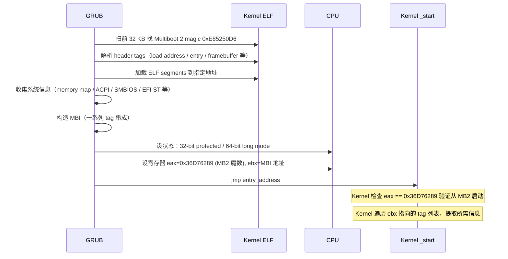

# 03-01 — Bootloader 们都做了什么：从 BootROM/ZBL 到 BIOS/UEFI 再到 boot/ 全谱

> **核心问题：** 当你按下电源键，从 CPU 第一条指令到 OS 跑起来，**期间到底有多少个"bootloader"参与？每一个具体做什么？哪些是硬件厂商写的、哪些是开源社区写的？x86 / ARM / RISC-V 这条链的差异在哪里？**
>
> **一句话答案：** 现代系统启动是一条**多级接力**：硬件 BootROM/ZBL（mask ROM 内嵌）→ FSBL（First Stage，做 DDR 训练）→ Secure Monitor / TEE 启动（TF-A / OP-TEE）→ SSBL（Second Stage，如 U-Boot proper / UEFI BDS）→ OS Loader（GRUB / rboot / Linux EFI stub）→ OS 内核。**每一级都有明确的"该做什么、不该做什么"边界**——本笔记按 6 级 + boot/ 6 项目 + ZBL/BIOS 历史阶段全谱覆盖。
>
> **本笔记定位：** 03 大类 boot 第 15 篇 —— **跨级别 / 跨项目 / 跨架构横向汇总**视角。配 [`03-02 boot overview`](03-02-boot-overview.md) 的 boot/ 项目深度精读 + [`03-05 boot 6 项目对比`](03-05-boot-domain-comparison.md) 横向 + 各项目专项 walkthrough。

---

## 0. 一图看穿：现代系统启动 6 级接力

```mermaid
flowchart TB
    Power["按电源键 / 接通电源"]
    Power --> L0

    subgraph L0["L0 BootROM / ZBL（硬件内嵌，不可改）"]
        L0_x86["x86: SEC + Reset Vector @ 0xFFFFFFF0"]
        L0_arm["ARM: SoC Mask ROM（厂商烧死）"]
        L0_rv["RISC-V: Reset Vector @ 0x1000 / SoC Boot ROM"]
    end

    L0 --> L1

    subgraph L1["L1 FSBL（First Stage Boot Loader）"]
        L1_x86["x86: BIOS POST 或 UEFI PEI"]
        L1_arm["ARM: BL1 (TF-A) + BL2"]
        L1_rv["RISC-V: U-Boot SPL / OpenSBI fw_payload"]
        L1_job["职责: DDR 训练 + 时钟初始化 + 加载 SSBL 到 DRAM"]
    end

    L1 --> L2

    subgraph L2["L2 安全世界初始化（可选，仅安全场景）"]
        L2_arm["ARM: TF-A BL31（Secure Monitor，EL3）+ OP-TEE（BL32, secure-EL1）"]
    end

    L2 --> L3

    subgraph L3["L3 SSBL（Second Stage Boot Loader）"]
        L3_x86["x86: BIOS INT19h / UEFI DXE+BDS"]
        L3_arm["ARM: U-Boot proper / EDK2"]
        L3_rv["RISC-V: U-Boot proper / EDK2"]
        L3_job["职责: 用户菜单 + 选择 boot media + 加载 OS Loader"]
    end

    L3 --> L4

    subgraph L4["L4 OS Loader / Boot Manager"]
        L4_g["GRUB / rboot / shim+grub / systemd-boot / Limine"]
        L4_efi["Linux EFI stub / Windows Boot Manager / macOS boot.efi"]
        L4_job["职责: 加载内核 ELF/PE + initramfs + 设 kernel cmdline + 准备 BootInfo"]
    end

    L4 --> L5

    subgraph L5["L5 OS Kernel"]
        L5_k["Linux / Windows / macOS / FreeBSD / 教学 OS"]
        L5_job["职责: 接管硬件 / 启动用户态进程 / 跑 init"]
    end

    classDef rom fill:#fee2e2,stroke:#991b1b
    classDef fw fill:#fed7aa,stroke:#9a3412
    classDef sec fill:#fde68a,stroke:#854d0e
    classDef ssbl fill:#bbf7d0,stroke:#14532d
    classDef loader fill:#bfdbfe,stroke:#1e40af
    classDef os fill:#e9d5ff,stroke:#581c87
    class L0 rom
    class L1 fw
    class L2 sec
    class L3 ssbl
    class L4 loader
    class L5 os
```



→ **不是每个系统都有所有 6 级**：嵌入式可能 L0+L1+L5（U-Boot SPL → 直接跑 Linux），桌面 PC 是 L0+L1+L3+L4+L5（UEFI BIOS 阶段 + GRUB + Linux），高安全场景才有 L2。

---

## 1. L0 — BootROM / ZBL（硬件内嵌，几乎不可改）⭐ 不跳过

### 1.1 ZBL 是什么？术语澄清

| 术语 | 含义 | 出处 |
|------|------|------|
| **BootROM / Mask ROM** | SoC 内部 ROM 区域，**芯片厂商在流片时烧死**的代码 | 通用 |
| **ZBL (Zero-Stage Boot Loader)** | 同 BootROM 别名，强调"零阶段"（在 FSBL 之前）| RISC-V / 嵌入式社区 |
| **Reset Vector** | CPU 上电后第一条指令地址 | x86 / ARM / RISC-V 通用 |
| **Boot Strap** | 极早期"自举"代码 | 历史术语 |
| **First Boot Stage** | 有时与 ZBL 通用 | 模糊 |

**关键：ZBL = BootROM = 厂商烧死的"宇宙第一段代码"**，无人能改（除非重新流片）。

### 1.2 各架构 BootROM 实例

#### x86：Reset Vector + BIOS/UEFI 引导

- **Reset Vector：** `0xFFFFFFF0`（4 GB - 16 字节）—— Intel/AMD x86 复位时 CPU 跳到这里
- **跳转后：** 该地址映射到 BIOS / UEFI 固件 ROM 的最后 16 字节
- **第一条指令：** 通常是 `jmp` 跳到固件主入口
- **没有"独立 BootROM"概念** —— x86 把"boot ROM"和"固件"合一（都是 BIOS/UEFI flash）

#### ARM：SoC Mask ROM

- **位置：** SoC 内部，地址因 SoC 而异（如 i.MX 7 的 `0x00100000`）
- **职责：** 检测启动设备（eMMC / SD / SPI Flash / USB / UART）→ 加载 BL1（如 TF-A 阶段一）到 SRAM → 跳转
- **Mask ROM 一旦流片就不可改** —— 修 bug 只能下一版芯片
- **典型 SoC：**
  - **Allwinner D1**：BootROM 固定支持 SPI NOR / NAND / SD / UART/USB FEL
  - **NXP i.MX**：可配置 BOOT_MODE 引脚选启动源
  - **Qualcomm**：BootROM → SBL1 → SBL2 → ABOOT（所有都厂商签名）
  - **Apple A/M 系列**：BootROM → iBoot 1 → iBoot 2（全部签名链）
- **典型尺寸：** 几 KB - 几十 KB（128 KB 是上限）

#### RISC-V：Reset Vector + 平台决定

- **Reset Vector：** `0x1000`（QEMU virt 默认）/ `0x4000` / 平台专属
- **QEMU virt：** 内置 BootROM 在 0x1000，跑 8 条指令 → 跳到 `0x80000000`（SBI 固件）
- **真实硬件：**
  - **SiFive Unleashed/Unmatched**：ZSBL（Zero-Stage Boot Loader）在内部 ROM
  - **K210**：ROM 启动 → SPI Flash 加载
  - **VisionFive 2 (StarFive JH7110)**：BootROM → SPL → U-Boot
  - **PolarFire SoC**：HSS（HART Software Services，Microchip 自家）替代 BootROM 角色

### 1.3 BootROM 共同 8 个职责

无论架构，BootROM 几乎都做这 8 件事（按顺序）：

```
1. CPU 复位状态初始化（清寄存器/设异常向量基地址）
2. 启动模式检测（读 BOOT_MODE 引脚 / strap pin）
3. 检测启动源（eMMC / SD / SPI / UART / USB / 网络 / OTP）
4. 极小驱动初始化（仅启动源那一个）
5. 从启动源读 FSBL 到内部 SRAM
   （注意：此时 DDR 还没初始化！只能用 SRAM，几 KB-几百 KB）
6. (可选) 校验 FSBL 签名（Secure Boot 第一环）
7. 跳到 FSBL 入口
8. 永远不返回（FSBL 接管）
```

**为什么 BootROM 不做 DDR 训练？** —— DDR 训练代码 几十 KB，超出 BootROM 容量上限。BootROM 只能"加载下一阶段代码"。

### 1.4 BootROM 的"恢复模式"（救砖）

如果 FSBL 损坏 / 签名错误 / 启动失败，**BootROM 通常进入恢复模式**：
- **NXP i.MX**：进入 USB Serial Download 模式（PC 用 `imx_usb_loader` 灌固件）
- **Allwinner**：FEL 模式（USB OTG，`sunxi-fel` 工具）
- **Qualcomm**：EDL 模式（Emergency Download，`qfil` / `qpst` 工具）
- **STM32**：UART/USB DFU 模式（`dfu-util` / `STM32CubeProgrammer`）
- **Apple**：DFU 模式

→ **救砖能力来自 BootROM** —— 这是嵌入式工程师的命门。

---

## 2. L1 — FSBL（First Stage Boot Loader）

### 2.1 FSBL 核心职责（全架构通用）

```
1. 从 BootROM 接手（栈/异常向量已被 BootROM 设好极简版）
2. ⭐⭐ DDR 训练（DRAM 控制器配置 + 训练 + 校验）⭐⭐ 最关键
3. 时钟树初始化（PLL 配置 / 总线频率）
4. 必要的 PMIC（电源管理芯片）配置
5. 加载 SSBL（U-Boot proper / EDK2 / OS）到 DDR
6. (可选) 验证 SSBL 签名（Secure Boot 第二环）
7. 跳到 SSBL 入口
```

**核心 = DDR 训练**：
- DDR4/DDR5 需要 **写电平校准 / 读 DQ 训练 / VRef 训练 / write leveling** 等
- 每条 DIMM / 每个温度 / 每个电压都要重新训练
- 训练失败 = 系统不能用 DDR = 不能跑 Linux 内核（initramfs 不够大）

### 2.2 各架构 FSBL 实例

| 架构 | FSBL 实例 | 代码量 | 跑在 |
|------|----------|--------|------|
| **x86 (BIOS)** | Award/Phoenix/AMI BIOS POST | 几 MB | Real Mode |
| **x86 (UEFI)** | EDK2 SEC + PEI 阶段 | 几十万行 C | 32/64-bit |
| **ARM (Cortex-A)** | **TF-A BL1 + BL2**（ARM 标准）| ~几万行 C | EL3 → EL1 |
| **ARM (Xilinx Zynq)** | **Xilinx FSBL**（Vivado 生成）| ~10K 行 | Cortex-A9 |
| **RISC-V (SiFive)** | **U-Boot SPL** | ~5K-10K 行 | M-mode |
| **RISC-V (Microchip PolarFire)** | **HSS (HART Software Services)** | ~30K 行 | M-mode |
| **RISC-V (BeagleV / SiPeed)** | **U-Boot SPL** + **OpenSBI** | ~10K 行 | M-mode |

### 2.3 U-Boot SPL 详解（RISC-V/ARM 主流 FSBL）

详见 [`03-10 U-Boot SPL 源码精读`](03-10-u-boot-spl-source-walkthrough.md)。要点：
- start.S → board_init_f（in SRAM）→ DDR init → relocate to DRAM → board_init_r → spl_load_image → jump
- FIT 镜像加载（同时含 SBI + U-Boot proper + DTB）
- 多 boot media 后端（SD/SPI/NOR/NET/YMODEM）

### 2.4 TF-A 详解（ARM Cortex-A 标准 FSBL + Secure Monitor）

**ARM Trusted Firmware-A**（前身 ARM Trusted Firmware）—— ARM 公司主导的 ARM Cortex-A 标准 boot framework：

```
BL1 (BootROM trampoline)
  ↓
BL2 (Trusted Boot, EL3 → 加载下游)
  ↓
BL31 (EL3 Secure Monitor，always resident)
  ↓ 同时加载：
BL32 (secure-EL1，OP-TEE OS)  + BL33 (non-secure firmware = U-Boot/UEFI)
  ↓ BL31 既调用 BL32 也跳 BL33
```

→ **TF-A 把 ARM 启动的"L1 + L2 + L3"层全包了**。详见 [`03-17 OP-TEE walkthrough`](03-17-optee-walkthrough.md) 的 TF-A 协作部分。

---

## 3. L2 — 安全世界初始化（可选）

### 3.1 ARM：TF-A BL31 + OP-TEE BL32

- **TF-A BL31** (Secure Monitor) —— 永驻 EL3，处理 SMC（Secure Monitor Call）路由
- **OP-TEE BL32** (TEE OS) —— 跑 secure-EL1，提供 GP TEE API
- **典型场景：** Android 手机（指纹 / Widevine DRM / 银行 SE）/ 汽车（ECU 安全）/ 工业（fTPM）

详见 [`03-17 OP-TEE walkthrough`](03-17-optee-walkthrough.md)。

### 3.2 RISC-V：SBI 固件 + Keystone（实验）

- **Keystone Enclave** —— S-mode 软件模拟双世界（PMP-based）
- **Penglai** —— 中国版 enclave，蚂蚁链/平头哥用
- **CoVE（Confidential VM Extension）** —— 机密计算 spec（draft），RustSBI 2026-05 已实现

详见 [`02-03 SBI 实现对比`](02-03-sbi-implementations.md) + [`02-04 SBI 完整参考`](02-04-sbi-complete-reference.md)。

### 3.3 x86：SMM + Intel SGX / TDX / AMD SEV

- **SMM (System Management Mode)** = ring -2，BIOS/UEFI 时代就有
- **Intel SGX / TDX** = 机密计算扩展
- **AMD SEV / SEV-SNP** = 加密 VM
- 这些 L2 安全初始化通常在 UEFI PEI/DXE 阶段做

---

## 4. L3 — SSBL（Second Stage Boot Loader）

### 4.1 SSBL 核心职责

```
1. 在 DDR 中接手（FSBL 已把硬件初始化好）
2. 完整设备初始化（USB / PCIe / NVMe / 网卡 / SATA / 显卡 GOP）
3. 文件系统驱动（FAT / ext4 / squashfs / NFS / TFTP）
4. (UEFI) 加载所有 DXE driver / 启动 EFI Shell
5. 用户交互菜单（按键选择启动项、修改启动参数）
6. boot order 处理（NVRAM Boot#### / U-Boot env）
7. 加载 OS Loader 或 OS 内核
8. 跳到 OS Loader / Kernel
9. (UEFI) ExitBootServices 一刀切（hand off）
```

### 4.2 各架构 SSBL 实例

| 架构 / 场景 | SSBL 实例 | 笔记 |
|-------------|----------|------|
| **x86 BIOS** | INT19h Boot Loader | 已退役 |
| **x86 UEFI** | EDK2 DXE + BDS | [`03-12`](03-12-edk2-walkthrough.md) |
| **ARM 嵌入式** | U-Boot proper | [`03-11`](03-11-u-boot-proper-source-walkthrough.md) |
| **ARM 服务器** | EDK2 (UEFI) | 同 x86 |
| **RISC-V 嵌入式** | U-Boot proper | [`03-11`](03-11-u-boot-proper-source-walkthrough.md) |
| **RISC-V 服务器** | EDK2 (UEFI) | 渐起 |
| **嵌入式替代** | barebox（Pengutronix）| [`03-14`](03-14-barebox-walkthrough.md) |

### 4.3 U-Boot proper vs UEFI BDS 对比

| 维度 | U-Boot proper | UEFI BDS |
|------|--------------|----------|
| 用户菜单 | autoboot 倒计时 + interactive shell | BDS 菜单（图形/文本）|
| boot 配置 | env / `bootcmd` / `distro_bootcmd` / Bootflow | NVRAM Boot#### 变量 |
| 文件系统 | 内置 FAT/ext4/squashfs/btrfs | FAT32 ESP（强制）|
| 协议 | bootm / booti / bootefi / bootflow | UEFI Boot Services |
| 复杂度 | 中（U-Boot ~150 万行）| 高（EDK2 ~200 万行）|

---

## 5. L4 — OS Loader / Boot Manager

### 5.1 OS Loader 核心职责

```
1. 跑在 SSBL 之上（UEFI 应用 或 U-Boot bootcmd 调用）
2. 解析自家配置（grub.cfg / rboot.conf / loader.conf）
3. 列出可启动 OS（菜单 / 默认项 / 倒计时）
4. 加载所选 OS 内核（ELF / PE / 自家格式）
5. 加载 initramfs / initrd
6. 准备 boot args（cmdline）+ 设备树（DTB）+ ACPI 等
7. 构造 OS 期望的 BootInfo 结构
8. (UEFI) ExitBootServices
9. 跳到 kernel entry
```

### 5.1.1 ⭐ Multiboot / Multiboot2 协议详解（GRUB 灵魂）

> Multiboot 是由 GNU/FSF 维护的**OS Loader ↔ Kernel 接口规范**，**GRUB 的核心抽象之一**。它定义"GRUB 怎么把控制权交给 Kernel"——参数怎么传、内存映射怎么给、模块怎么放。

#### A. 三个版本

| 版本 | 年份 | 维护者 | 兼容性 |
|------|------|--------|--------|
| **Multiboot 1** (Multiboot Specification) | 1995 | FSF / Bryan Ford | 32-bit only，最初为 GNU Hurd 设计 |
| **Multiboot 2** (Multiboot2 Specification) | 2010+ | FSF | 64-bit + UEFI / EFI 兼容 + 模块化 tag 系统 |
| **(规划中的 Multiboot 1.6)** | 中间产物 | 未稳定 | 历史 |

→ **现代用 Multiboot 2** —— Multiboot 1 仅 32-bit 老 OS 还在用。

#### B. Multiboot 1 协议核心

**OS Kernel 必须做的事：**
1. 在 ELF 文件最前 8 KB **嵌入 Multiboot Header**（魔数 + flags + checksum + 可选 entry point）
2. 在 ELF 中导出 `_start` 入口

**GRUB 加载时做的事：**
1. 扫描 ELF 找 Multiboot magic `0x1BADB002`
2. 验证 checksum
3. 加载 ELF 到 spec 指定的虚拟地址
4. 设 CPU 状态为 32-bit protected mode（无分页）
5. 准备 Multiboot Information (MBI) 结构
6. 跳到 entry，传 `eax = 0x2BADB002`（魔数确认） + `ebx = MBI 结构地址`

**Multiboot Header 结构（在 kernel 里）：**

```c
// 嵌入 kernel ELF 的 .multiboot 段
struct multiboot_header {
    uint32_t magic;          // 0x1BADB002
    uint32_t flags;          // 控制位
    uint32_t checksum;       // -(magic + flags) 让三者和为 0
    // 后续字段按 flags 决定（可选）：
    // - 镜像加载地址（无 ELF 信息时用）
    // - 视频模式偏好
    // - ...
};
```

**Multiboot Information (MBI) 结构（GRUB 给 Kernel 的）：**

```c
struct multiboot_info {
    uint32_t flags;              // 哪些字段有效
    uint32_t mem_lower;          // 1 MB 以下内存（KB）
    uint32_t mem_upper;          // 1 MB 以上内存（KB）
    uint32_t boot_device;        // 启动设备
    uint32_t cmdline;            // kernel cmdline 字符串地址
    uint32_t mods_count;         // 加载的 module 数量
    uint32_t mods_addr;          // module 数组地址
    union { ... } u;             // ELF 段头 / a.out symbols
    uint32_t mmap_length;        // memory map 长度
    uint32_t mmap_addr;          // memory map 地址
    uint32_t drives_length;      // BIOS 驱动器信息
    uint32_t drives_addr;
    uint32_t config_table;       // BIOS ROM 配置表
    uint32_t boot_loader_name;   // GRUB 字符串
    uint32_t apm_table;          // APM 表
    uint32_t vbe_*;              // VBE 视频模式
    uint32_t framebuffer_*;      // framebuffer 信息
};
```

**典型场景：**
- 教学 OS（xv6 / ToaruOS / Plan 9 / Haiku）—— 复刻 Multiboot 是入门必经
- Linux 32-bit 早期支持（现代 Linux 用 EFI stub 或 boot protocol，不再 Multiboot）

#### C. Multiboot 2 协议核心（推荐）

**改进点：**
- **64-bit 支持** —— Multiboot 1 仅 32-bit
- **UEFI 兼容** —— GRUB 可以从 UEFI BDS 启动 + 用 Multiboot 2 加载内核 + 保留 UEFI Boot Services 入口
- **模块化 Tag 系统** —— Header 和 MBI 都用 TLV (Tag-Length-Value) 而非固定字段
- **更丰富的信息** —— ACPI/SMBIOS/EFI MMAP/EFI System Table 都能传给 Kernel
- **更好的 framebuffer 描述** —— RGB mask / EDID 等

**Multiboot 2 Header 魔数：** `0xE85250D6`

**Header tag 类型（部分）：**
| Tag Type | 含义 |
|----------|------|
| 0 | END (header 结束) |
| 1 | Information request（OS 想要哪些信息）|
| 2 | Address (load address) |
| 3 | Entry point |
| 4 | Console flags |
| 5 | Framebuffer 偏好 |
| 6 | Module alignment |
| 7 | EFI Boot Services（保留 UEFI BS 给 OS 用，UEFI ExitBootServices 不会被 GRUB 调用）|
| 8 | Entry address (EFI i386) |
| 9 | Entry address (EFI amd64) |
| 10 | Relocatable header |

**MBI tag 类型（GRUB 给 Kernel 的）：**
| Tag Type | 含义 |
|----------|------|
| 0 | END |
| 1 | Boot command line |
| 2 | Boot loader name (GRUB 2.x.x) |
| 3 | Modules（多个）|
| 4 | Basic memory info |
| 5 | BIOS boot device |
| 6 | Memory map |
| 7 | VBE info |
| 8 | Framebuffer info |
| 9 | ELF symbols |
| 10 | APM table |
| 11 | EFI 32-bit system table pointer |
| 12 | EFI 64-bit system table pointer |
| 13 | SMBIOS tables |
| 14 | ACPI old RSDP (1.0) |
| 15 | ACPI new RSDP (2.0+) |
| 16 | Networking info |
| 17 | EFI memory map |
| 18 | EFI Boot Services not terminated（与 Header tag 7 配套） |
| 19 | EFI 32-bit image handle pointer |
| 20 | EFI 64-bit image handle pointer |
| 21 | Image load base physical address |

#### D. 协议交接的真实流程（GRUB → Kernel）



#### E. Multiboot vs UEFI vs Linux Boot Protocol

| 维度 | Multiboot 1 | Multiboot 2 | UEFI | Linux Boot Protocol |
|------|-------------|-------------|------|---------------------|
| 出生 | 1995 FSF | 2010+ | 2007 UEFI Forum | 1990s Linus |
| 32/64-bit | 32 only | 32 + 64 | 32 + 64 | 32 + 64 |
| 维护者 | FSF | FSF | UEFI Forum | Linux 自己 |
| 主使用者 | xv6 / 教学 OS | Limine / 现代业余 OS | 主流 OS | Linux 主流 |
| GRUB 支持 | ✅ | ✅ | ✅（chainload）| ✅（grub.cfg `linux` 命令）|
| 标准化程度 | 中（GNU 文档）| 中（GNU 文档）| 高（UEFI Forum 完整 spec）| 内 Linux 文档 |
| 兼容 UEFI | ❌ | ✅（tag 7/11/12/17）| 自身就是 | ✅ EFI stub |

→ **现代选型：业余 / 教学 OS 用 Multiboot 2 或 Limine；生产 Linux 用 EFI stub 或 boot protocol；任何 .efi 应用用 UEFI**。

#### F. xv6 / 教学 OS 的 Multiboot 实现示例

```asm
# xv6-style Multiboot 1 Header (in entry.S)
.section .multiboot
.align 4
multiboot_header:
    .long 0x1BADB002              # magic
    .long 0x00000003              # flags (page align + memory info)
    .long -(0x1BADB002 + 0x00000003)  # checksum

# entry point (跑在 32-bit protected mode)
.globl _start
_start:
    # eax = 0x2BADB002, ebx = MBI*
    movl %ebx, %edi               # 第一个参数: MBI*
    movl $kernel_stack_top, %esp
    call kmain                    # 跳进 C
```

```c
// xv6-style kmain
void kmain(uint32_t multiboot_magic, multiboot_info_t *mbi) {
    if (multiboot_magic != 0x2BADB002) panic("not multiboot!");
    
    // 用 mbi->mmap_addr 拿 memory map
    multiboot_memory_map_t *mmap = (void *)mbi->mmap_addr;
    while ((uint32_t)mmap < mbi->mmap_addr + mbi->mmap_length) {
        printf("[%llx +%llx] %s\n", mmap->addr, mmap->len,
               mmap->type == MULTIBOOT_MEMORY_AVAILABLE ? "RAM" : "RESERVED");
        mmap = (void *)((uint32_t)mmap + mmap->size + sizeof(mmap->size));
    }
    
    // 用 mbi->cmdline 拿命令行
    // 用 mbi->mods_addr 拿 initramfs 等模块
    // ...
}
```


→ 详细 GRUB 中 Multiboot 实现源码精读见 [`03-15 § 10` Multiboot 1/2 协议 + Loader 实现](03-15-grub2-walkthrough.md#10-multiboot-12-协议--loader-实现)。

### 5.2 OS Loader 实例

| Loader | 实现 | 平台 | 协议 | 笔记 |
|--------|------|------|------|------|
| **GRUB 2** | C / Lua-like script | 全 | 自家 + Multiboot | [`03-15`](03-15-grub2-walkthrough.md) |
| **rboot** | Rust 527 行 | UEFI 上 | 简单配置文件 | [`03-16`](03-16-rboot-walkthrough.md) |
| **shim + GRUB** | C + GRUB | UEFI Linux | Microsoft 签名链 | [`03-15`](03-15-grub2-walkthrough.md) |
| **systemd-boot** | C ~3K 行 | UEFI | 简化 grub.cfg | 简介 |
| **Limine** | C / Rust | UEFI/BIOS | Limine Boot Protocol | 业余 OS 主流 |
| **Linux EFI Stub** | C in vmlinuz | UEFI | Linux 内嵌 .efi | kernel 自己作 EFI app |
| **Windows Boot Manager** | bootmgr.efi | UEFI | BCD | Microsoft 闭源 |
| **macOS boot.efi** | 闭源 | Mac UEFI | Apple 协议 | Apple 闭源 |
| **iPXE** | C | 网络 | HTTP/iSCSI/PXE | 数据中心 PXE 部署 |
| **GRUB legacy** | C | BIOS | Multiboot | 已弃 |
| **LILO** | asm | BIOS | 老式 | 历史 |
| **syslinux / ISOLINUX / PXELINUX** | asm/C | BIOS | 简单 | Live USB / PXE |

详见 [`03-05 boot 6 项目对比`](03-05-boot-domain-comparison.md) + [`03-13 UEFI 演化`](03-13-uefi-evolution-case-study.md)。

---

## 6. boot/ 6 项目逐个职责定位

本仓库 `boot/` 目录对应的 6 项目各自处于哪一级：

| 项目 | 路径 | L0 | L1 | L2 | L3 | L4 | 笔记 |
|------|------|----|----|----|----|----|------|
| **u-boot** | `boot/u-boot/` | — | ✅ SPL | — | ✅ proper | (含 EFI loader 时) | [`03-06`](03-06-u-boot-overview.md)/[`03-10`](03-10-u-boot-spl-source-walkthrough.md)/[`03-11`](03-11-u-boot-proper-source-walkthrough.md) |
| **barebox** | `boot/barebox/` | — | ✅ | — | ✅ | — | [`03-14`](03-14-barebox-walkthrough.md) |
| **edk2** | `boot/edk2/` | — | ✅ PEI | — | ✅ DXE+BDS | — | [`03-12`](03-12-edk2-walkthrough.md) |
| **rboot** | `boot/rboot/` | — | — | — | — | ✅ UEFI app | [`03-16`](03-16-rboot-walkthrough.md) |
| **grub2** | `boot/grub2/` | — | — | — | — | ✅ multi-OS | [`03-15`](03-15-grub2-walkthrough.md) |
| **optee_os** | `boot/optee_os/` | — | — | ✅ TEE | — | — | [`03-17`](03-17-optee-walkthrough.md) |

→ **6 项目恰好覆盖 L1 / L2 / L3 / L4 全谱**（L0 不在源码层面 — 是 SoC ROM）。

---

## 7. 历史阶段：BIOS / Firmware 演化

> **不跳过历史** —— 现代 UEFI 是从 1981 IBM PC BIOS 一路演化到今天。

### 7.1 BIOS 时代（1981-2010s）

```
1981 : IBM PC BIOS 1.0 - 16-bit Real Mode, INT 中断驱动, 1MB 内存上限
1984 : IBM PC AT BIOS - 加 EISA 支持
1995 : Award / AMI / Phoenix BIOS 三家鼎立
1995 : Plug and Play BIOS - 自动外设识别
2000 : ACPI 1.0 - 取代 BIOS 私有电源接口
2002 : Intel EFI 1.0 (Itanium 服务器)
2007 : UEFI 2.0 标准化（详见 03-13）
2011 : Win 8 强推 UEFI Secure Boot → x86 PC 大规模 UEFI 化
2020 : Intel 路线图删 CSM（Compatibility Support Module，UEFI 兼容老 BIOS 的最后桥梁）
2026 : 现代 PC 100% UEFI，BIOS 基本退役
```

**BIOS 做了什么？** —— 与 UEFI 类似（POST + 启动设备检测 + 加载 MBR/VBR），但功能弱、API 老、安全差。详见 [`00-07 OS 演化`](00-07-os-evolution.md)。

### 7.2 嵌入式 / IoT 启动方案演化

| 年代 | 主流方案 |
|------|---------|
| 1990s | 各 SoC 自家 BootROM + 自家 boot loader |
| 2000s | 专有 BIOS / 嵌入式 BIOS |
| 2002+ | **U-Boot 兴起**（PPCBoot+ARMboot 合并），跨架构标准 |
| 2010s | TF-A（ARM）/ HSS（PolarFire）等架构特定 |
| 2014+ | OpenSBI（RISC-V 标准 SBI）|

---

## 8. 完整启动链对照（4 平台）

### 8.1 x86 PC（UEFI 时代）

```
按电源 → CPU 复位
  → Reset Vector @ 0xFFFFFFF0 (jmp 到 UEFI 固件)
  → UEFI SEC (Security Phase)            ← L0/L1
  → UEFI PEI (Pre-EFI Initialization)    ← L1（DDR/CPU/内存初始化）
  → UEFI DXE (Driver eXecution Env)      ← L3（加载所有 .efi driver）
  → UEFI BDS (Boot Device Selection)     ← L3（用户菜单 / NVRAM 处理）
  → 加载 \EFI\BOOT\BOOTX64.EFI 或 NVRAM Boot#### 指定的 .efi
  → GRUB / shim+GRUB / systemd-boot      ← L4
  → 加载 Linux vmlinuz + initramfs
  → ExitBootServices
  → Linux Kernel _start                  ← L5
```

### 8.2 ARM Cortex-A 服务器（带 TF-A）

```
按电源 → SoC Mask ROM                     ← L0
  → 加载 TF-A BL1 到 SRAM
  → BL1 → BL2 (DDR 训练)                 ← L1
  → BL31 (Secure Monitor, EL3 永驻)      ← L2
  → BL32 (OP-TEE) + BL33 (UEFI/U-Boot)   ← L2 + L3
  → UEFI BDS / U-Boot Bootflow           ← L3
  → grub.efi 加载                         ← L4
  → Linux Kernel                          ← L5
```

### 8.3 RISC-V SBC（如 VisionFive 2，无 TF-A）

```
按电源 → JH7110 BootROM                   ← L0
  → 加载 U-Boot SPL 到 SRAM
  → SPL 初始化 DDR + 加载 FIT 镜像        ← L1
  → FIT 含 OpenSBI + U-Boot proper + DTB
  → OpenSBI 在 M-mode 跑                  ← L2
  → mret → S-mode → U-Boot proper         ← L3
  → distro_bootcmd / Bootflow → 加载 Linux
  → grub.efi (可选) / 直接 booti          ← L4 (可选)
  → Linux Kernel                          ← L5
```

### 8.4 嵌入式 IoT（极简：U-Boot SPL 直跳 Linux）

```
按电源 → SoC Mask ROM                     ← L0
  → U-Boot SPL（DDR 训练）                ← L1
  → SPL Falcon Mode（跳过 proper）         ← L1 直接启 L5
  → Linux Kernel                          ← L5
```

→ **极简方案省 L3 + L4**，启动时间能到 < 1s。

---

## 9. "做什么"vs"不做什么"边界

每一级有明确的"该做的事"和"绝对不能做的事"：

| 级 | 该做 | 不该做（绝不） |
|----|------|--------------|
| **L0 ZBL** | 加载 FSBL；恢复模式 | DDR 训练（容量不够）；解析 fs（太复杂）|
| **L1 FSBL** | DDR 训练；加载 SSBL | 用户交互（menubar）；fs 完整解析 |
| **L2 SecMon/SBI** | 永驻提供 SMC/SBI 服务 | 加载 OS（那是 SSBL/Loader 的事）|
| **L3 SSBL** | 用户菜单；boot 配置；调用 OS Loader | 提供 runtime services 给 OS（UEFI Runtime Services 例外）|
| **L4 OS Loader** | 加载内核；准备 BootInfo | 自己运行 OS 服务 |
| **L5 OS Kernel** | 接管硬件；运行用户进程 | 重新初始化 DDR / SoC（已被 L1 做完）|

→ **越界 = bug 来源**。例如：U-Boot SPL 试图做 user menu = SRAM 不够；UEFI BDS 试图做 DDR 训练 = 阶段错位。

---

## 10. 横向对比：x86 / ARM / RISC-V 启动链差异

| 维度 | x86 (Intel/AMD PC) | ARM Cortex-A | RISC-V |
|------|-------------------|--------------|--------|
| L0 BootROM | 内嵌 BIOS/UEFI flash | SoC Mask ROM | SoC ROM / 平台决定 |
| L0 容量 | 几 MB（flash）| 几十-几百 KB | 几 KB-几十 KB |
| L1 DDR 训练 | UEFI PEI | TF-A BL2 / Xilinx FSBL | U-Boot SPL / HSS |
| L3 SSBL | UEFI DXE+BDS / 老 BIOS | U-Boot proper / EDK2 | U-Boot proper / EDK2 |
| L4 OS Loader | GRUB / shim / Win Boot Mgr | GRUB / U-Boot Bootflow | GRUB / U-Boot Bootflow |
| 标准化 | UEFI Forum 主导 | ARM 主导（TF-A / SBSA）| RISC-V Foundation 主导（SBI / AIA）|
| 开源固件 | EDK2 / coreboot | TF-A + EDK2 + U-Boot | OpenSBI + U-Boot + EDK2 |
| 闭源比例 | 高（OEM BIOS）| 中 | 低（社区为主）|

---

## 11. 学到的设计要点（任何 boot 项目都通用）

1. **多级接力是必然** —— 单一 boot loader 试图做所有事 = 体量爆炸 + 难维护
2. **每级容量决定能做什么** —— L0 几 KB 不能解析 fs，L1 几十 KB 可以训 DDR，L3 几 MB 可以跑 menu
3. **DDR 训练必须独立一级** —— 不能在 ROM 做（容量），也不能在 SSBL 做（已经在 DDR 跑）
4. **签名链早做早安全** —— L0 验 L1，L1 验 L2/L3，L3 验 L4，L4 验 L5（Verified Boot 全链）
5. **救砖能力来自 BootROM** —— 厂商烧死 USB DFU / UART 救砖路径，是嵌入式工程师救命稻草
6. **每级"不要越界"** —— 该 L1 做的别让 L0 做（容量）、该 L3 做的别让 L1 做（复杂度）
7. **BootROM 不可改** —— 设计 SoC 时 ZBL 代码必须极保守（多家厂商有 BootROM bug 影响产品周期）
8. **新 SoC 一定要支持 USB DFU 救砖** —— 否则任何 FSBL bug 都意味着送修
9. **现代 boot 链都走 FIT 镜像**（FAT32 ESP / itb 文件）—— 多 payload 一包走天下
10. **Secure Boot 不要拒绝用户控制** —— 让用户能换 PK/KEK/db（如 PCs 提供 BIOS Setup → Secure Boot → 自己导入 key）

---

## 12. 专有名词词典

| 术语 | 含义 |
|------|------|
| **BootROM** | SoC 内嵌不可改的初始代码 |
| **ZBL** | Zero-Stage Boot Loader（同 BootROM）|
| **Mask ROM** | 流片时烧死的 ROM（同 BootROM）|
| **FSBL** | First Stage Boot Loader |
| **SSBL** | Second Stage Boot Loader |
| **TSBL** | Tertiary Stage Boot Loader（极少用）|
| **TPL** | Tertiary Program Loader（U-Boot 三段式）|
| **VPL** | Verifier Program Loader（U-Boot v2022+ 验证器）|
| **SPL** | Secondary Program Loader（U-Boot 标准说法）|
| **POST** | Power-On Self-Test（BIOS 时代术语）|
| **Reset Vector** | CPU 复位后第一条指令地址 |
| **BL1/BL2/BL31/BL32/BL33** | TF-A 5 阶段 |
| **BIOS** | Basic Input/Output System（1981-2020s）|
| **UEFI** | Unified Extensible Firmware Interface（2007+）|
| **CSM** | Compatibility Support Module（UEFI 兼容 BIOS 桥梁，2020+ 弃）|
| **DDR 训练** | DRAM 控制器电气校准 |
| **PMIC** | Power Management IC |
| **Secure Boot** | 验签启动链 |
| **DFU** | Device Firmware Upgrade（USB 救砖协议）|
| **FEL** | Allwinner 救砖模式 |
| **EDL** | Qualcomm 救砖模式（Emergency Download）|
| **HSS** | HART Software Services（Microchip PolarFire 自家 SBI 替代）|
| **SBI** | Supervisor Binary Interface（RISC-V 标准）|
| **TF-A** | ARM Trusted Firmware-A |
| **TEE** | Trusted Execution Environment |
| **SMC** | Secure Monitor Call (ARM) |
| **SMM** | System Management Mode (x86 ring -2) |
| **PE/COFF** | UEFI 可执行格式 |
| **ELF** | Linux/Unix 可执行格式 |
| **MBR** | Master Boot Record（446 字节启动代码 + 4 主分区表）|
| **GPT** | GUID Partition Table（UEFI 时代分区方案）|
| **ESP** | EFI System Partition（详见 [`03-13 § 3.4.5`](03-13-uefi-evolution-case-study.md#345--esp-efi-system-partition-详解)）|
| **FIT** | Flattened Image Tree（U-Boot 多 payload 镜像）|
| **DTB** | Device Tree Blob（详见 [`03-04`](03-04-dts-dtb-fdt-syntax-reference.md)）|
| **BootInfo** | Loader 传给 Kernel 的元信息结构 |
| **Multiboot** | GRUB 实现的 OS 加载协议 |
| **Bootflow** | U-Boot 现代 boot 框架（v2020.10+，取代 distro_bootcmd）|

---

## 13. 实操：观察自己机器的启动链

```sh
# Linux 桌面（UEFI 启动）
sudo dmesg | grep -i "efi\|boot\|loaded\|grub" | head -30
sudo efibootmgr -v          # 看 NVRAM 启动项 + DevicePath
ls /boot/efi/EFI/           # 看 ESP 内容
ls /boot                    # vmlinuz + initramfs

# 嵌入式 RISC-V (VisionFive 2)
# 串口看 boot log:
#   [Boot]: BootROM 输出
#   [SPL]: U-Boot SPL 输出
#   [OpenSBI v0.x]: SBI 阶段
#   [U-Boot 2024.04]: U-Boot proper 阶段
#   [Linux 6.x]: kernel 接管

# QEMU virt RISC-V
qemu-system-riscv64 -M virt -bios fw_jump.bin -kernel Image -initrd rootfs.cpio.gz -nographic
# 看 boot 链：QEMU ROM → OpenSBI → Linux

# Apple M 系列 dump boot ROM 信息（macOS）
ioreg -p IODeviceTree -n "iboot" | grep -i "version\|build"
```

---

## 14. 本地资料对应

### boot/ 6 项目（已克隆）
- `boot/u-boot/` — L1 (SPL) + L3 (proper) → [`03-10`](03-10-u-boot-spl-source-walkthrough.md) [`03-11`](03-11-u-boot-proper-source-walkthrough.md)
- `boot/barebox/` — L1 + L3 → [`03-14`](03-14-barebox-walkthrough.md)
- `boot/edk2/` — L1 (PEI) + L3 (DXE+BDS) → [`03-12`](03-12-edk2-walkthrough.md)
- `boot/rboot/` — L4 (UEFI app) → [`03-16`](03-16-rboot-walkthrough.md)
- `boot/grub2/` — L4 (multi-OS) → [`03-15`](03-15-grub2-walkthrough.md)
- `boot/optee_os/` — L2 (TEE) → [`03-17`](03-17-optee-walkthrough.md)
- `boot/older/` — U-Boot 历史考古样本 → [`03-09`](03-09-uboot-evolution-case-study.md)

### sbi/ 项目（L2 RISC-V SBI 固件）
- `sbi/opensbi/` — OpenSBI 主流
- `sbi/rustsbi/` — RustSBI Rust 实现
- → [`02-03`](02-03-sbi-implementations.md) [`02-04`](02-04-sbi-complete-reference.md) [`02-02`](02-02-sbi-evolution.md)

### 已有相关笔记
- [`03-02 boot overview`](03-02-boot-overview.md) — boot/ 6 项目深度精读
- [`03-05 boot 6 项目对比`](03-05-boot-domain-comparison.md) — 横向矩阵
- [`03-09 U-Boot 演化`](03-09-uboot-evolution-case-study.md) — 24 年代码考古
- [`03-13 UEFI 演化`](03-13-uefi-evolution-case-study.md) — UEFI 标准 + EDK2 ↔ rboot 对比 + ESP 详解
- [`02-03 SBI 实现对比`](02-03-sbi-implementations.md)
- [`02-04 SBI 完整参考`](02-04-sbi-complete-reference.md)
- [`02-02 SBI 演化`](02-02-sbi-evolution.md)
- [`03-04 DTS/DTB/FDT`](03-04-dts-dtb-fdt-syntax-reference.md) — DT 在 boot 链中的传递
- [`00-20 firmware OTA`](00-20-firmware-ota-evolution.md) — A/B 双分区升级

---

## 15. 进一步阅读

- **TF-A 文档：** [trustedfirmware-a.readthedocs.io](https://trustedfirmware-a.readthedocs.io/)
- **U-Boot 文档：** [docs.u-boot.org](https://docs.u-boot.org/)
- **UEFI Specification 2.10：** [uefi.org/specifications](https://uefi.org/specifications)
- **OpenSBI 文档：** [github.com/riscv-software-src/opensbi/tree/master/docs](https://github.com/riscv-software-src/opensbi/tree/master/docs)
- **Boot Loader Specification (BLS)：** [systemd.io/BOOT_LOADER_SPECIFICATION](https://systemd.io/BOOT_LOADER_SPECIFICATION/)
- **Coreboot 文档：** [doc.coreboot.org](https://doc.coreboot.org/)
- **iBoot 论文 / 演讲：** Apple iBoot reverse engineering 社区

---

**回到学习路线：** 读完本笔记后你已经能：
- ✅ 列出 6 级 boot 接力（L0 BootROM/ZBL → L5 Kernel）每级职责
- ✅ 解释为什么 DDR 训练在 L1 做（不是 L0 / L3）
- ✅ 区分 BIOS / UEFI / TF-A / OpenSBI / U-Boot SPL / EDK2 / GRUB / rboot 各自所在的级别
- ✅ 列举 ZBL 救砖模式（FEL/EDL/DFU 等厂商方案）
- ✅ 跟踪 x86 / ARM / RISC-V 三平台的完整启动链差异
- ✅ 知道 boot/ 6 项目（u-boot/barebox/edk2/rboot/grub2/optee_os）每个负责哪一级

