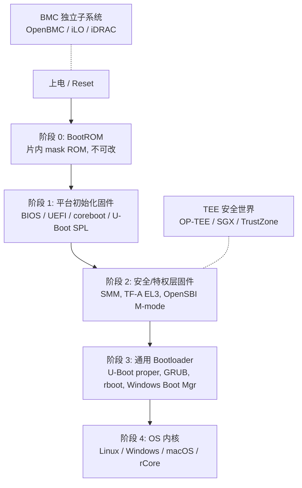
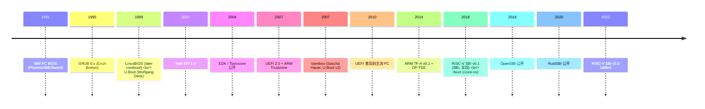
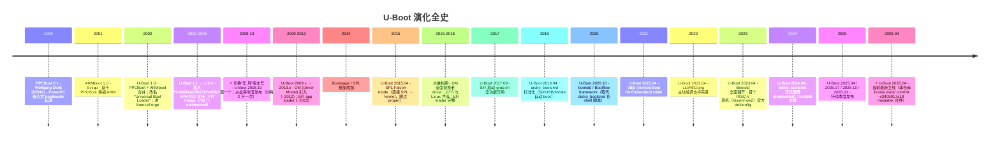

# 03-02 — Boot 层概览：BIOS / UEFI / SPL / TF-A / SBI 历史渊源、对比与定位

> **核心问题：** "上电到 OS"中间这段是谁、做什么、为什么这么多名字？
>
> **一句话答案：** 不同年代、不同架构、不同安全模型对"加载下一阶段"这件事各自给出了一套实现，名字混杂但角色一致——**初始化硬件 + 加载下一段代码**。

本篇先把 *谁负责什么* 的全景立起来，然后逐项展开历史与差异，最后落到本仓库 `boot/` 下每一个克隆项目的定位。

---

## 1. 全景：上电到内核五个阶段



**每一个阶段都有"加载下一阶段"的责任 + "初始化某些硬件"的责任**。差别在于：

- 谁先获得 CPU 控制权
- 在哪个特权级别运行
- 是否要做硬件训练（DRAM、PCIe link training）
- 是否需要后续自己继续存在（resident，e.g. SMM、TF-A、SBI）还是用完即弃（transient，e.g. SPL）

---

## 2. 名字消歧

| 名字 | 时代 | 架构 | 角色 | 是否 resident |
|------|------|------|------|---------------|
| **BIOS** | 1981 → 2010s | x86 | 阶段 1 + 阶段 3，传统单体 | resident（INT 服务）|
| **UEFI** | 2002 → 现在 | x86, ARM, RISC-V | 阶段 1+2+3 模块化 | partial（runtime services）|
| **EDK2 / Tianocore** | 2004 → 现在 | 同上 | UEFI 的 Intel 主流参考实现 | 同上 |
| **coreboot** | 1999（原 LinuxBIOS）→ 现在 | x86, ARM, RISC-V | 阶段 1（取代 BIOS），调用 payload | 不 resident（结束就交给 payload）|
| **payload** | coreboot 术语 | 跨架构 | 阶段 3，由 coreboot 调用（SeaBIOS / U-Boot / GRUB / Linux 都可作 payload） | — |
| **U-Boot SPL** | 2010s → | ARM, RISC-V, MIPS | 阶段 1，DRAM 训练，加载 U-Boot proper | 不 resident |
| **U-Boot proper** | 1999 → | 同上 | 阶段 3 通用 bootloader | 不 resident |
| **TF-A**（ARM Trusted Firmware-A）| 2014 → | ARM(v8) | 阶段 2 EL3 安全监视器 | resident（SMC 服务）|
| **OP-TEE** | 2014 → | ARM | TEE 安全世界 OS | resident |
| **OpenSBI** | 2018 → | RISC-V | 阶段 2 M-mode | resident（SBI 服务）|
| **GRUB / GRUB2** | 1995 / 2005 → | 跨架构 | 阶段 3 multi-OS 选单 | 不 resident |
| **rboot** | 2018 → | x86_64 UEFI | 阶段 3，rCore-OS 用的极简 UEFI 加载器 | 不 resident |
| **barebox** | 2007 → | ARM/RISC-V/x86 | U-Boot 的现代化重写（"U-Boot v2"） | 不 resident |
| **systemd-boot / Windows Boot Manager** | 2010s → | UEFI | 阶段 3 OS 选单 | 不 resident |
| **BootROM** | 永久 | 各家 SoC | 阶段 0，片上 mask ROM | 不 resident |

> **关键：** "BIOS" 和 "Bootloader" **不是同一回事**——BIOS 是固件（管硬件），Bootloader 是 OS 加载器（管 OS）。它们在历史上常被一个程序合并实现，但概念上要分清。

---

## 3. 三大流派：x86 BIOS / UEFI / RISC-V SBI

每个 CPU 架构发展出自己的"固件协议栈"。理解三派各自的解决方案，能一眼看清设计取舍。

### 3.1 x86 BIOS 派（1981–2010s）

```
Reset → 0xFFFFFFF0 (top of 4GB) → BIOS ROM
   ↓
BIOS POST + INT 19h boot sequence
   ↓
读 MBR (LBA 0) 加载到 0x7C00 → 跳转
   ↓
Bootloader stage 1 → stage 1.5 → stage 2 (GRUB 多阶段)
   ↓
load kernel + initrd, jump to entry
```

**特点：**
- 16-bit real mode 运行 → 现代 OS 必须切到 protected/long mode
- BIOS 服务通过软中断 INT 10h/13h/15h 访问，OS 启动后通常不再用
- 配置在 BIOS Setup（按 DEL/F2 进入），存 CMOS RAM
- 限制：MBR 4 个主分区、2TB 容量上限、单线程

### 3.2 UEFI 派（2002 至今，已替代 BIOS）

```
Reset → SEC (security phase, 早期 RAM 设置)
   ↓
PEI (Pre-EFI Initialization, DRAM 训练，依赖 SPI flash)
   ↓
DXE (Driver Execution Environment, 大部分 UEFI 驱动)
   ↓
BDS (Boot Device Selection, 读 NVRAM 启动顺序)
   ↓
launch UEFI application (OS Loader: rboot / GRUB EFI / bootmgfw.efi)
   ↓
ExitBootServices() 后 OS 接管
```

**特点：**
- **64-bit long mode**（在 PEI 之后）
- 模块化：driver 分为 Boot Services（启动后释放）和 Runtime Services（OS 运行时仍可调用）
- GUID Partition Table (GPT) 取代 MBR：分区数量无限，2^64 块
- ESP（EFI System Partition）FAT32 文件系统，存放 `\EFI\<vendor>\bootx64.efi`
- Secure Boot：用 PK / KEK / db 公钥链验证 EFI 应用签名
- **EDK2 / Tianocore** 是 Intel 主导的开源参考实现；OEM（Insyde/AMI/Phoenix）基于此商业化
- ARM SystemReady-IR 和 RISC-V Server EBC 都把 UEFI 作为标准

> ⚠️ **重要概念澄清**（防混淆）：
> - **UEFI** = **规范 / 标准**（UEFI Forum 维护的文档）
> - **Tianocore** = **开源项目代号 / 社区**（Intel 2004 发起，托管在 tianocore.org）
> - **EDK II** = Tianocore 项目下的**主力产品**（UEFI 规范的 C 语言参考实现）
> - **EDK** = EDK II 的旧版（2008-2010）
> - **UDK** = EDK II 的"定期发布版"（类似 Ubuntu LTS 之于 Debian）
>
> 一句话：**UEFI Forum 写规范，Tianocore 项目下的 EDK II 是参考实现，AMI/Insyde/Phoenix 在 EDK II 基础上二改卖给 OEM**。详见 [03-12 EDK2 § 0](03-12-edk2-walkthrough.md#0-先把-5-个名字厘清uefi-spec--tianocore--edk2--edk--udk-的关系) + [03-13 UEFI 演化 § 0](03-13-uefi-evolution-case-study.md#0-先讲清楚u-boot--grub--uefi-三者作为标准的根本不同)。

### 3.3 RISC-V SBI 派（2018 至今）

```
Reset → ZSBL (Zeroth Stage Boot Loader, 片内 ROM, 大约 4KB)
   ↓
FSBL (First Stage Boot Loader, U-Boot SPL on SiFive Unmatched)
   ↓
   ↓
mret → S-mode
   ↓
S-mode bootloader (U-Boot proper) 或直接 kernel
```

**特点：**
- 三特权级：M-mode（Machine, 最高）/ S-mode（Supervisor, kernel）/ U-mode（User）
- M-mode 固件作为 *runtime service provider*，OS 通过 `ecall` 进入 M-mode 请求服务（time、IPI、reset 等）
- 类似 ARM TF-A：但 RISC-V 没有"安全世界 vs 普通世界"区分，只有特权级别
- SBI = Supervisor Binary Interface，规范化 S→M 调用约定

### 3.4 ARM TrustZone 派

ARM 在 UEFI 之外还有一套独立的"安全世界"概念：

```
Reset → BL1 (BootROM)
   ↓
BL2 (Trusted Boot Firmware, DRAM init, 验证后续 BL)
   ↓
BL31 (EL3 Runtime, 安全监视器, 提供 SMC 服务) ← TF-A 主体
   ↓
BL32 (Secure-EL1 Trusted OS) ← OP-TEE
   ↓
BL33 (Non-secure firmware, U-Boot 或 UEFI)
   ↓
Linux kernel (Non-secure EL1)
```

EL3 是最高特权，TF-A 在那里 resident，提供电源管理、SMC 调用接口（Linux 通过 SMC 进入 EL3）。OP-TEE 是 EL3 调用的"另一个 OS"，跑在安全世界，handles fingerprint / DRM / 密钥存储。

> **类比**：RISC-V M-mode 之于 SBI，相当于 ARM EL3 之于 TF-A。但 ARM 多了 secure / non-secure 隔离维度。

---

## 4. 历史时间轴



---

## 5. boot/ 目录下每个项目的定位

```
material/boot/
├── u-boot/        ← 通用 bootloader (SPL + proper), C/asm
├── barebox/       ← U-Boot 的现代化重写, C
├── edk2/          ← Tianocore UEFI 参考实现, C
├── rboot/         ← rCore-OS 的极简 UEFI loader, Rust
├── grub2/         ← 多 OS 启动管理器, C
└── optee_os/      ← TEE 安全世界 OS, C
```

### 5.1 `u-boot/` —— 主线学习目标

```
u-boot/arch/riscv/         ← RISC-V 移植代码（含 SPL）
u-boot/board/sifive/       ← HiFive Unleashed/Unmatched 板支持
u-boot/configs/qemu-riscv64_smode_defconfig  ← QEMU 默认配置（用 OpenSBI）
u-boot/configs/sifive_unmatched_defconfig    ← 真硬件配置
u-boot/cmd/                ← bootm/booti/load/save/env 等命令
u-boot/common/spl/         ← SPL 框架（DRAM 训练后的通用代码）
u-boot/dts/                ← 设备树源码（与 Linux dts 共享）
u-boot/boot/               ← FIT 镜像加载/解析
u-boot/drivers/            ← 驱动模型（dm/）+ 各类外设驱动
u-boot/lib/                ← libc / FDT / crypto
u-boot/include/configs/    ← 板级 macro 配置（旧式）
```

**作用：** 在 RISC-V 上做两件事：
1. **SPL** 阶段：从 SRAM 启动，初始化 DDR 控制器（DDR 训练），把自己 + OpenSBI + U-Boot proper 加载到 DRAM，跳转到 OpenSBI
2. **U-Boot proper** 阶段（在 S-mode 跑）：交互式命令行，从 SD/MMC/SPI/NVMe/网络加载内核 + dtb + initramfs，构造 boot args 跳转 Linux


#### 5.1.1 U-Boot 历史 / 版本演化 / 社区 fork（不跳过任何阶段）



**版本号约定：**
- **1999-2008 早期**：1.0 / 1.1 / ... / 1.3.4 经典三段式
- **2008.10 起**：**`YYYY.MM`** 年月格式（学 Ubuntu / openSUSE 风格），每季度一发：
  - `01` / `04` / `07` / `10` 4 个固定窗口
  - 例：2024.01 / 2024.04 / 2024.07 / 2024.10
  - 偶尔 RC：`v2026.04-rc1` / `-rc2` / `-rc3` 测试版
- **从无 LTS 概念**——每个季度版都是 stable，但发行版（如 OpenWrt / Yocto / Buildroot）通常锁定某季度版本

**当前状态：**
- 上游主线：`https://source.denx.de/u-boot/u-boot.git`（**主仓在 DENX GitLab，不在 GitHub**）
- GitHub 镜像：`https://github.com/u-boot/u-boot`
- 维护者：**Tom Rini**（自 2014 起，接 Wolfgang Denk）+ 各 custodian（每子系统一名）
- 主线代码量：~150 万行 C + asm（2026 年）
- License：GPL-2.0-or-later

**本地 commit:** `e3405917a18 Merge tag 'mediatek-for-master-2026-04-17'` (2026.04 版本周期)

#### 5.1.2 U-Boot 社区重构 / 衍生 fork（"U-Boot v2" 阵营）

社区对 U-Boot 的批评长期存在：**老的 `make` 系统、自家 driver 模型、命令行不像 POSIX shell、测试薄弱、SPL/proper 分离繁琐**。多个项目尝试"重做"：

| 项目 | 起源 | 与 U-Boot 关系 | 当前状态 |
|------|------|----------------|---------|
| **barebox** | 2007 Sascha Hauer (Pengutronix) | 完全重写，借 Linux 设计 | 活跃，工业用（Pengutronix/TQ/Phytec），详见 [03-14](03-14-barebox-walkthrough.md) |
| **U-Boot SPL Falcon mode** | 2015 主线 | U-Boot 内部精简 | 主线特性，跳过 proper 直接启动 kernel |
| **Coreboot 替换** | 2010s | x86/嵌入式可用 coreboot 替代整个 U-Boot | 活跃，详见 03-XX coreboot 节 |
| **LinuxBoot** | 2017 | 把 U-Boot/UEFI 替换为"小 Linux + kexec" | 活跃，Facebook/Google 部署 |
| **LK (Little Kernel)** | 2008 PalmOS / Travis Geiselbrecht | 高通主推，Android bootloader 基础 | 高通 SoC 主流（aboot 即 LK 衍生）|
| **MultiBoot / iPXE** | 2003 / 2010 | 网络启动专用，与 U-Boot 互补 | 数据中心 PXE 部署 |
| **EDK2 + UEFI on ARM/RISC-V** | 2010s+ | 走 UEFI 标准（Tianocore）替代 U-Boot | 服务器 ARM / RISC-V Pro 等高端用，详见 [03-12](03-12-edk2-walkthrough.md) |
| **systemd-boot / sd-boot** | 2012 Lennart Poettering | 用户态 EFI app 替代 GRUB（不替 U-Boot 本身） | 桌面 Linux 部分用 |
| **Limine** | 2019 | 现代 multiboot 协议 | 业余 OS 项目主流 |
| **HSS (HART Software Services)** | Microchip 2020 | PolarFire SoC 专用 SPL 替代 | 仅 PolarFire SoC 平台 |
| **OpenSBI fw_payload** | RISC-V 生态 | 直接 OpenSBI 携带 OS（无 U-Boot proper）| 嵌入式精简方案 |


#### 5.1.3 U-Boot 关键里程碑（每个值得读源码看）

| 年份 | 里程碑 | 影响 |
|------|--------|------|
| 2002 | PPCBoot + ARMboot 合并成 U-Boot | 跨架构基石 |
| 2008.10 | 切换年月版本号 | 工程化升级 |
| 2010 | Kconfig 全面引入（学 Linux） | 配置体系标准化 |
| 2012 | DM (Driver Model) 引入 | 驱动现代化 |
| 2014 | DTS 与 Linux 共享 | 生态统一 |
| 2017 | EFI loader 完整 | 跨 BIOS/UEFI 统一启动 |
| 2019 | distro_bootcmd 标准化 | 可插拔 boot media 自动检测 |
| 2020 | bootstd / Bootflow framework | 替代 shell 脚本式启动逻辑 |
| 2024 | distro_bootcmd deprecated | 进入 bootstd 时代 |

→ 详细源码精读见 [`03-06 U-Boot 全局总揽`](03-06-u-boot-overview.md) / [`03-10 SPL 源码`](03-10-u-boot-spl-source-walkthrough.md) / [`03-11 proper 源码`](03-11-u-boot-proper-source-walkthrough.md)。

### 5.2 `barebox/` —— U-Boot 替代品（"U-Boot v2" 思想验证项目）

#### 5.2.1 起源与定位

**Sascha Hauer（Pengutronix 工程师）2007 年启动** —— 当时 U-Boot 的痛点：
- `mkconfig` shell 脚本配置（无 Kconfig，要 v2014.07 才引入）
- 自家 driver 模型（无 DM，要 v2012 才引入）
- 命令行像 BIOS Setup（不像 POSIX shell）
- 单元测试薄弱（无沙箱）

Sascha 决定**完全重写**，按 Linux 内核风格重构。**"barebox" 字面意思是 "bare box"（裸机盒子）**，强调"轻量、可控、像 Linux"。

**仓库：** https://www.barebox.org/git/barebox.git
**License：** GPL-2.0-only
**当前主线：** 持续活跃（每月发布，与 U-Boot 类似 YYYY.MM 版本号）
**主要维护者：** Pengutronix（Hannover, Germany）+ 工业贡献者 TQ Systems / Phytec / Holger Schurig 等

#### 5.2.2 与 U-Boot 关键设计对比

| 维度 | U-Boot 早期（2007 时）| barebox（一开始就有）|
|------|---------|----------|
| **配置系统** | `mkconfig` shell + `include/configs/<board>.h` | **Kconfig**（直接抄 Linux）|
| **driver model** | 自家 dm/（v2012+ 才有）| **Linux DM 风**（一开始就有）|
| **命令行** | BIOS Setup 风 | **POSIX shell 风**（含 `if/then/else/while`）|
| **单元测试** | 几乎无 | **Sandbox 模式**（barebox 可在 host x86_64 上跑测试）|
| **build 系统** | 自家 makefile（旧）| **Kbuild** 风（直接抄 Linux）|
| **多平台支持** | cpu/<cpu> + lib_<arch>（v2014 才 arch/）| **arch/<arch>** 一开始就有 |
| **DTS 共享** | v2014.04 才主线 | 一开始就主线 |
| **fs 模块化** | drivers/ 散乱 | **fs/** 顶层独立目录 |
| **shell 命令多寡** | 几百个（散乱）| **177 个**（精挑细选）|
| **代码量** | 那时 50 万行 | **~15 万行**（轻量 3 倍） |

→ **barebox 是"如果 U-Boot 从头设计会怎样"的答案**。许多 barebox 早期想法被后来的 U-Boot 借鉴（DM / Kbuild / Kconfig）。

#### 5.2.3 当前工业部署

虽然市场份额远小于 U-Boot，barebox **在德国工业界** 站稳脚跟：

| 用户 | 场景 |
|------|------|
| **Pengutronix** | 自己客户的工业网关 / IoT |
| **TQ Systems** | 工控机 + 嵌入式产品线 |
| **Phytec** | i.MX / Cortex-A 嵌入式板 |
| **Garz & Fricke** | HMI 工业人机界面 |
| **国内** | 部分 RK / NXP 嵌入式产品 |


> "我可能真的会在了解 UBOOT UEFI GRUB 以及 boot/ 下项目的所有功能后，重新设计自己的类 uboot bootloader：KuBoot"


→ 详细 barebox 源码精读见 [`03-14 barebox-walkthrough`](03-14-barebox-walkthrough.md)（51 driver / 18 fs / 177 命令 / multi_v8 多板共用镜像 / 工业实践 Pengutronix/TQ/Phytec）。

### 5.3 `edk2/` —— UEFI 标准参考实现 + 学习 rboot 的"母平台"

#### 5.3.1 EDK2 在 UEFI 生态中的根本定位

⭐ **关键认识：UEFI 是一份开放规范（UEFI Forum 维护，2007 起），EDK2 是这份规范的"官方参考实现"**。

详细的 UEFI 标准 vs U-Boot vs GRUB 三者对比、UEFI 25 年演化（EFI 1.0 → UEFI 2.10）、EDK2 ↔ rboot 极致体量对比 见 [`03-13 UEFI 演化案例研究`](03-13-uefi-evolution-case-study.md)。

**UEFI Forum 标准 + EDK2 实现的关系：**
- **UEFI 规范** = "接口契约"（约 2700 页 PDF，定义 BS/RS/Protocol/Variable/GUID/PE 等）
- **EDK2** = Tianocore 项目维护的"参考实现"（200 万行 C，Intel/Microsoft 等贡献）
- 商业 OEM（**AMI Aptio**（PC 主流，~50% 市占）/ **Insyde H2O**（笔记本/移动）/ **Phoenix SecureCore Tiano**（服务器）/ **HPE iLO + 自家 BIOS** / **Apple boot.efi**（闭源 fork）/ **国产 Byosoft 百敖** / **昆仑固件**）几乎都基于 EDK2 二改

#### 5.3.2 EDK2 实际规模

```
boot/edk2/ (本地)
├── 27 个 *Pkg 子目录
├── 8,356 源文件（.c/.h/.asm/.S/.nasm/.dsc/.fdf/.inf/.dec）
├── 2,191,556 C/H 代码行
├── 167 MB 仓库大小
└── BaseTools/ ← 构建工具（Python + nmake + DSC/FDF/INF/DEC 4 种元数据）
```

#### 5.3.3 27 个 Pkg 按职责分组

```
edk2/
├── 核心规范层
│   ├── MdePkg/             ← UEFI 规范基础库（1809 文件 / 419K 行）
│   └── MdeModulePkg/       ← UEFI 规范模块实现（1426 文件 / 595K 行 ← 最大）
├── CPU/平台特定
│   ├── ArmPkg/ ArmPlatformPkg/ ArmVirtPkg/  ← ARM/QEMU ARM
│   ├── IntelFsp2Pkg/ IntelFsp2WrapperPkg/   ← Intel FSP
│   ├── PcAtChipsetPkg/ UefiCpuPkg/          ← x86 PC AT
│   ├── EmulatorPkg/                          ← Host 上跑（开发利器）
│   └── OvmfPkg/                              ← ⭐ QEMU x86 完整 UEFI（rboot 测试母平台）
├── 子系统模块
│   ├── NetworkPkg/         ← 完整 TCP/IP 栈 + iSCSI + HTTP + PXE（199K 行）
│   ├── CryptoPkg/          ← OpenSSL 包装 + Secure Boot 加解密（118K 行）
│   ├── SecurityPkg/        ← Secure Boot / TPM / Measured Boot（87K 行）
│   ├── ShellPkg/           ← UEFI Shell（130K 行）
│   ├── FatPkg/             ← FAT12/16/32 文件系统
│   ├── RamDiskPkg/ FmpDevicePkg/ DynamicTablesPkg/ ManageabilityPkg/ ...
│   └── 7-8 个其他模块包
└── 工具 / 文档
    └── BaseTools/ Conf/ License.txt / Maintainers.txt / ReadMe.rst
```

#### 5.3.4 学习路径（从浅到深）

**第 1 步（先学 rboot，看清"UEFI 应用"长什么样）：**
- 读 [`03-16 rboot walkthrough`](03-16-rboot-walkthrough.md)（527 行 Rust）
- 跑 `boot/rboot/` 在 OVMF 上的 demo
- 理解：EFI Application 入口签名 / SystemTable / BS/RS / Protocol / ExitBootServices

**第 2 步（学 UEFI 标准 + EDK2 在生态中的位置）：**
- 读 [`03-13 UEFI 演化案例研究`](03-13-uefi-evolution-case-study.md)
- 读 UEFI Specification §1-3（约 100 页，了解整体）
- 看 `boot/edk2/MdePkg/Include/Uefi/UefiSpec.h`（标准头文件）

**第 3 步（深入 EDK2 实现）：**
- 读 [`03-12 EDK2 walkthrough`](03-12-edk2-walkthrough.md)（27 Pkg 完整精读 / SEC→PEI→DXE→BDS 5 阶段 / Protocol/Handle/GUID 体系 / DSC/FDF/INF 4 元数据）
- 优先精读 OvmfPkg（QEMU x86）+ MdePkg（标准基础）
- 跑 `OvmfPkgX64.dsc` 编译完整 OVMF.fd

**第 4 步（写自己的 UEFI 应用）：**
- 用 `uefi-rs`（Rust）或 EDK2 自己的 `MdePkg` C SDK
- 编 `xxxx.efi` → 放 ESP `\EFI\Boot\BOOTX64.EFI` → QEMU `-bios OVMF.fd`
- 参考 rboot 的 4 文件结构

#### 5.3.5 EDK2 是 rboot 的"母平台"

**rboot 不能脱离 EDK2 跑** —— rboot 调用的所有 UEFI 服务都来自底层 EDK2/OVMF：

```
QEMU
  ├── -bios OVMF.fd       ← EDK2 编出的完整 UEFI 固件
  └── -drive ESP          ← 含 \EFI\Boot\BOOTX64.EFI = rboot.efi
       
启动流程：
  QEMU → OVMF (EDK2) 跑 SEC/PEI/DXE/BDS
       → BDS 找到 \EFI\Boot\BOOTX64.EFI（rboot）
       → LoadImage + StartImage 启动 rboot
       → rboot 用 OVMF 提供的 BS/RS 加载 ELF kernel
       → rboot 调 ExitBootServices → 跳进 kernel
```

→ **学 rboot 必须先理解 EDK2 提供了什么**，才能知道 rboot "免费"用了哪些服务。


- KuBoot 必须等学完 6 项目（UEFI / rboot / EDK2 / U-Boot / barebox / GRUB / OP-TEE）后才动

→ 详细 EDK2 源码精读见 [`03-12 EDK2 walkthrough`](03-12-edk2-walkthrough.md)。

### 5.4 `rboot/` —— Rust UEFI loader

rcore-os 项目的极简 UEFI 应用（< 1000 行 Rust），作用是从 ESP 加载 ELF 内核。代码量小，是看 *"UEFI 应用如何写"* 的最佳样本。

**核心 API**：
```rust
fn efi_main(image_handle: Handle, mut st: SystemTable<Boot>) -> Status {
    let bs = st.boot_services();
    let kernel = load_file(bs, "\\efi\\kernel.elf")?;
    let elf = elf_parse(kernel)?;
    let entry = elf.entry();
    st.exit_boot_services();
    unsafe { jump_to_kernel(entry); }
}
```

**对比 GRUB EFI：** GRUB 是配置驱动的（`grub.cfg` 决定启动哪个 OS），rboot 是硬编码的（启动 `\efi\kernel.elf`）。rboot 更像"嵌入式 UEFI 引导"，GRUB 更像"通用启动管理器"。

**学习价值：** Zig/Rust 写 UEFI 应用的工程模板。KuUEFI 的代码结构会非常类似。

### 5.5 `grub2/` —— 多 OS 启动管理器

历史最悠久的开源 bootloader（1995 起）。**与 firmware 不同——它运行在 firmware（BIOS/UEFI）之上**。

**部署形式：**
- **legacy BIOS** 模式：MBR 中放 stage1 (446 字节)，stage1 加载 stage1.5 (FAT/ext 文件系统驱动)，stage1.5 加载 stage2（grub 主体）
- **UEFI** 模式：编译为 `grubx64.efi`，从 ESP 启动（最常见）
- **网络** 模式：通过 PXE / TFTP 加载

**核心能力：**
- 文件系统驱动（ext2/3/4/btrfs/xfs/ntfs/iso9660/squashfs）— 这样可以从任意 fs 读 kernel，比 UEFI 应用强
- Lua-like 脚本（grub.cfg）配置启动菜单
- 加密分区支持（LUKS）


### 5.6 `optee_os/` —— TEE 安全世界

ARM TrustZone 的开源 TEE OS。**不是 boot 序列的一部分**——它在 BL31 (TF-A) 之后启动，并且**与 normal world OS（Linux）并行运行**。Linux 通过 SMC 调用进入 TEE 请求加密 / 密钥操作。

为什么放在 `boot/` 下：因为 TEE OS 的加载是 boot 序列的一部分（BL32 阶段），并且 OP-TEE 自己有一个 mini-OS 启动流程。

**学习价值（次要）：**
- 看 secure / non-secure 切换 (SMC instruction)
- 看 TEE 应用（Trusted Application）的隔离 ABI

---

## 6. 各项目"何时学"建议

| 阶段 | 项目 | 重点 | 时长建议 |
|------|------|------|---------|
| **现在** | u-boot | SPL DRAM 训练 + FIT 加载 + dts 集成 | 1–2 周 |
| **接着** | rboot | 看 200 行 Rust UEFI 应用如何启动 ELF | 1–2 天 |
| **再之后** | edk2 OvmfPkg | UEFI 启动序列（SEC→PEI→DXE→BDS）实现 | 1 周 |
| **可选** | barebox | 对比 U-Boot 的设计取舍 | 1–2 天 |
| **可选** | grub2 boot/grub-core/* | multiboot2 协议 + ext4 fs driver | 1 周 |
| **延后** | optee_os | 仅当做 ARM TEE 时 | — |

---


```mermaid
flowchart LR
    subgraph 上电
    A[BootROM<br/>SiFive/QEMU 自带]
    end
    C -->|mret S-mode| D[KuUEFI<br/>EDK2/rboot 角色, optional]
    
    F -. 编排 .- C
    F -. 编排 .- D
    F -. 编排 .- E
    end
    A --> B
```


**核心原因：RISC-V 特权级层次** —— SBI 是 M-mode（最高），UEFI 是 S-mode（次高）。**SBI 必须先跑**，给 S-mode 的 firmware/OS 提供 runtime services（trap 委托 / IPI / fence / HSM 等）。

```
RISC-V 特权级（从高到低）：
    ↓ mret
  HS-mode ← Hypervisor-extended Supervisor（虚拟化用）
    ↓
  S-mode  ← Supervisor Mode（OS / bootloader）    ← KuUEFI 跑这里
    ↓
  U-mode  ← User Mode
```

**启动时序：**
```
上电 → BootROM (M-mode)
     → KuBoot SPL (M-mode, 做 DDR 训练)
     → mret 切到 S-mode
     → KuUEFI 或 KuBoot proper (S-mode)      ← 跑在 SBI 之上
```

**类比 ARM Cortex-A 系统**：
```
ARM 特权级（从高到低）：
  EL3  ← TF-A BL31 (Secure Monitor，永驻)         ← 类比 SBI
  EL2  ← Hypervisor / 虚拟化
  EL1  ← UEFI / OS                                ← 类比 KuUEFI 位置
  EL0  ← User
```


**为什么 UEFI 不能先于 SBI 跑？**
- UEFI 期望跑在"已经能正常 trap、能调用 IPI/fence、能管 hart 状态"的 S-mode 环境
- 这些能力**必须由 M-mode 固件（SBI）先提供**
- 如果 UEFI 直接跑 M-mode，那它就是 SBI 的角色，不再是 UEFI（UEFI spec 不定义 M-mode 行为）

**对比 x86：** x86 没有 SBI 那一层（也没有 ARM 的 EL3），UEFI 直接管硬件——所以 x86 上 UEFI 是"最早的固件"。**RISC-V / ARM 因为有特权级分层，UEFI 必须在底层固件之上跑**。

### 7.2 KuUEFI 和 KuBoot 是否"同级"？

**部分同级，部分错位 —— 关键看是 SPL 角色还是 proper 角色：**

| 项目 | 跑在 | 角色 |
|------|------|------|
| **KuBoot SPL 阶段** | M-mode (在 SBI 之前) | DDR 训练 + 加载 SBI/UEFI/Kernel |
| **KuBoot proper 阶段** | S-mode (在 SBI 之后) | 用户菜单 + 选 OS + 加载 OS |
| **KuUEFI** | S-mode (在 SBI 之后) | UEFI 标准实现 + 加载 .efi 应用 |

**结论：**
- **KuBoot SPL ≠ 同级**（M-mode）
- **KuBoot proper ≈ 与 KuUEFI 同级**（都 S-mode，都是"启动 OS 之前的 firmware"）

**两条等价路径（任选其一）：**

```
路径 A（嵌入式 / 简单）：

路径 B（服务器 / 标准 UEFI）：

路径 C（混合）：
```

→ **U-Boot v2017+ 加了 EFI loader 后**，U-Boot proper 自己也能跑 .efi 应用（路径 C），让 KuBoot 和 KuUEFI 边界模糊。


### 7.3 UEFI 是什么的缩写？历史 + 含义详解

**UEFI = Unified Extensible Firmware Interface**

逐词解释：
- **U**nified —— **统一**：UEFI Forum 多厂商联合维护（Intel/AMD/Apple/AMI/IBM/HP/Microsoft/Dell/Lenovo/Phoenix/Insyde 等 11 家创始 + 后续加入）
- **E**xtensible —— **可扩展**：通过 Protocol（GUID 标识）模块化扩展，不像 BIOS 写死
- **F**irmware —— **固件**：跑在 OS 之前的代码
- **I**nterface —— **接口**：定义 boot loader / OS 与固件之间的 ABI（不是具体实现）

**演化简史（"U" 的来源）：**

| 年份 | 名称 | 由谁 |
|------|------|------|
| 1998 | **EFI** (Extensible Firmware Interface) | **Intel 私有项目**（Itanium 服务器用）|
| 2002 | EFI 1.0 | Intel 自家发布 |
| 2005 | EFI 1.10 | Intel 加 driver model |
| 2005 | UEFI Forum 成立（11 厂商） | 多厂商接管 |
| 2007 | **UEFI 2.0** | UEFI Forum 标准化（**加 "U" = Unified**）|

→ "**U** 字加上去就是为了强调'不再是 Intel 私有，而是行业联盟统一'**"。

**今天 EFI vs UEFI 用法：**
- 正式文档 / spec：用 **UEFI**
- 文件名 / 路径 / 协议名：仍用 **EFI**（如 `.efi` 后缀 / `\EFI\BOOT\` 目录 / `EFI_BLOCK_IO_PROTOCOL` / `EFI_SYSTEM_TABLE`）
- 操作系统术语：混用（macOS `boot.efi` / Windows EFI partition / Linux EFI Stub）
- ESP = "EFI System Partition"（**不是 UEFI System Partition**，沿用老名）

→ **EFI 和 UEFI 在今天指同一个东西**，"E" 是技术名（沿用 1998），"U" 是组织化标识（2007 加上的）。

详见 [`03-13 § 1 UEFI 标准 25 年演化`](03-13-uefi-evolution-case-study.md#1-顶层视野uefi-标准演化25-年简史) 和 [`03-13 § 0 三者标准辨析`](03-13-uefi-evolution-case-study.md#0--先讲清楚u-bootgrubuefi-三者作为标准的根本不同)。

### 7.4 项目可以命名为 **KuEFI** 吗？


#### 选 **KuEFI**（短，和 .efi 文件一致）

**优点：**
- ✅ **更短** —— 4 字符 vs KuUEFI 5 字符
- ✅ **与 `.efi` 文件后缀一致** —— 任何编译产物 `kuefi.efi` 自然
- ✅ **与 `\EFI\BOOT\` 目录命名一致** —— 用户体验整齐
- ✅ **与 ESP（EFI System Partition）一致** —— ESP 不叫 USP
- ✅ **macOS 用 `boot.efi`** —— 苹果生态延续 "EFI" 命名
- ✅ **Apple "EFI Firmware Lock"** —— Apple 用 EFI 不用 UEFI
- ✅ **历史先到** —— EFI 1998 比 UEFI 2007 早 9 年
- ✅ **口语顺** —— "ku-efi" 比 "ku-u-efi" 顺口

**缺点：**
- ⚠️ 略弱化"遵守 UEFI Forum 标准"的工程含义

#### 选 **KuUEFI**（正式，与 spec 一致）

**优点：**
- ✅ **明确指 UEFI Forum 标准** —— 工程意图清晰
- ✅ **与现代文档一致** —— UEFI Spec / UEFI 论坛 / 商业文档都用 UEFI

**缺点：**
- ⚠️ 略长 5 字符 + 双 U 念起来拗口
- ⚠️ 与文件 `.efi` / `\EFI\BOOT\` / ESP 等业界命名不一致

#### 业界 / 开源 .efi 项目命名先例

| 项目 | 命名风格 | 全名解读 |
|------|---------|----------|
| **rboot** | 不带 EFI 字 | rcore-os 出品的 boot |
| **systemd-boot** | 不带 EFI 字 | sd-boot |
| **shim** | 不带 EFI 字 | Microsoft 签名链中间层 |
| **Limine** | 不带 EFI 字 | 现代业余 OS bootloader |
| **GNU GRUB** | 不带 EFI 字 | 通用名 |
| **rEFInd** | "rEFI" + nd | 含 "EFI" 但不双 U |
| **rEFIt** | "rEFI" + t | 同上，已停 |
| **gummiboot** | "boot" 后缀 | systemd-boot 前身 |

→ **业界倾向不强调 "U"**，"EFI" 已足够标识。


- KuACOS / KuMonOS / KuMicOS / KuHybOS / KuExoOS / KuLibOS / KuRTOS / KuType1/2/1.5


#### claude 不替决定

**4 项考虑：**
1. 工程一致性（与文件名 / 路径一致）→ KuEFI 略胜
2. 标准化清晰度 → KuUEFI 略胜
4. 个人偏好 / 顺口程度 → 主观


**如果选 KuEFI**，需要更新：
- 记忆：`project_kunikos_naming.md` § 4 变体表 / § 5 子项目命名
- 笔记：所有引用 KuUEFI 的地方（00-02 / 03-02 / 03-05 / 03-12 / 03-16 / 03-15 / 03-09 / 03-13 / 03-01 等）
- CLAUDE.md 学习路线段
- 备选：`KuEFI` 也可以是 KuUEFI 的"昵称"，正式名仍 KuUEFI


---

## 8. 常见混淆澄清

| 误解 | 实际 |
|------|------|
| "UEFI 是 BIOS 的新名字" | UEFI 是规范，BIOS 是实现/产品。两者实现思路完全不同。 |
| "GRUB 是 BIOS" | GRUB 是 bootloader，BIOS 是固件。GRUB 在 BIOS 或 UEFI 之上运行。 |
| "U-Boot 取代 OpenSBI" | 不取代——RISC-V 上 U-Boot SPL → OpenSBI → U-Boot proper 是串联，不是替代。 |
| "Coreboot 取代 BIOS 之后还需要 SeaBIOS" | Coreboot 需要 *payload* 来给 OS 提供 INT 服务接口。SeaBIOS / TianoCore / GRUB / U-Boot 都可作 payload。 |
| "TF-A 等于 OP-TEE" | TF-A 是固件框架（BL1/BL2/BL31），OP-TEE 是跑在 BL32 的 TEE OS。两者是搭配关系。 |
| "OpenSBI 是 bootloader" | OpenSBI 是 *runtime service provider*。它在系统运行期间一直存在，提供 ecall 服务。Bootloader（U-Boot proper）是把 OS 加载完就退出的。 |
| "SBI 是 RISC-V 的 BIOS" | 形似而神不同。BIOS 主要在启动时跑，SBI 全程驻留。SBI 更接近 ARM TF-A 而不是 BIOS。 |

---

## 8.X ⭐ UEFI / GRUB / U-Boot SPL / U-Boot proper 详细功能对比


### 8.X.1 总览：4 角色定位

| 角色 | 跑在 | 阶段 | 主代表 | 体量 | 本笔记标识 |
|------|------|------|--------|------|----------|
| **U-Boot SPL** | M-mode (RISC-V) / EL3 / EL2 (ARM) | L1 FSBL | u-boot/spl/ | ~10K-50K 行 | "FSBL/SPL 角色"|
| **UEFI 固件** | M+S 多层（含 PEI/DXE/BDS）| L1+L3 | EDK2 | 200 万行 | "完整 UEFI 实现"|
| **U-Boot proper** | S-mode / EL2 | L3 SSBL | u-boot/cmd + drivers + boot | ~150 万行 | "SSBL 角色" |
| **GRUB** | S-mode（运行在 UEFI/BIOS 之上）| L4 OS Loader | grub-core/ | ~20 万行 | "OS Loader 角色"|

### 8.X.2 U-Boot SPL 详细功能（FSBL 角色）

> **本质：** 极小的"加载下一阶段"代码，跑在 SRAM（不是 DDR），主要任务是**初始化 DDR + 加载真 U-Boot**。

#### 完整功能清单（按执行顺序）

| # | 功能模块 | 详细职责 | 代码位置（u-boot） |
|---|---------|---------|-------------------|
| 1 | **start.S** (汇编入口) | CPU 复位状态初始化 / 设栈顶 / 设异常向量 / 跳 board_init_f | `arch/<arch>/cpu/<cpu>/start.S` |
| 2 | **board_init_f** (in flash/SRAM) | 早期 board 初始化序列（在 DDR 不可用前）| `common/board_f.c` + `board/<vendor>/<board>/<board>.c` |
| 3 | **DRAM 控制器初始化 / DDR 训练** ⭐ 核心 | 配置 DRAM controller、DDR PHY 校准（write leveling / read DQ / VRef）| `drivers/ram/` 各 SoC 子目录（如 `drivers/ram/k210/`）|
| 4 | **时钟树初始化** | 配 PLL / 各总线频率（CPU clock / AXI clock / DDR clock / UART clock）| `arch/<arch>/cpu/<cpu>/clk.c` 或 board-specific |
| 5 | **PMIC 配置（可选）** | 设 CPU 核心电压 / DDR 电压 | `drivers/power/pmic/` |
| 6 | **early console (UART) 初始化** | 让 SPL 能 printf 调试 | `drivers/serial/` |
| 7 | **SPL 主控逻辑** (`board_init_r`) | 决定从哪个 boot media 加载下游 | `common/spl/spl.c` |
| 8 | **boot media 驱动**（按需） | SD/MMC / SPI Flash / NOR Flash / NAND / NET / YMODEM / USB / ... | `common/spl/spl_*.c` + `drivers/<media>/` |
| 9 | **FIT 镜像解析** | 解析 FIT (.itb) 多 payload 容器 | `common/spl/spl_fit.c` |
| 10 | **签名验证（可选 Verified Boot）**| RSA / ECDSA 验签下游镜像 | `common/spl/spl_image.c` + `lib/rsa/` |
| 11 | **加载到 DRAM** | 从 boot media 把 SBI/U-Boot proper/Kernel 加载到 DRAM | 同上 spl_*.c |
| 12 | **跳转下游** (`jump_to_image`) | 切栈 / 设 a0=hartid, a1=dtb / mret 或 jr | `common/spl/spl.c` |
| 13 | **(可选) Falcon mode** | 跳过 U-Boot proper，直接跳 Linux | `common/spl/spl.c` falcon path |

详细源码精读见 [`03-10 U-Boot SPL 源码精读`](03-10-u-boot-spl-source-walkthrough.md)（1546 行）。

**SPL 不做的事（边界）：**
- ❌ 用户交互菜单（SRAM 不够，等 proper）
- ❌ 完整文件系统（仅 raw / 简化 FAT）
- ❌ 网络栈（仅 BOOTP/TFTP 极简）
- ❌ EFI services（那是 UEFI 的事）

### 8.X.3 U-Boot proper 详细功能（SSBL 角色）

> **本质：** 跑在 DDR 中的"完整 boot loader + interactive shell"，提供数百命令、多 fs、多协议、driver 模型、EFI loader。

#### 12 大子系统

| # | 子系统 | 详细职责 | 代码位置 |
|---|-------|---------|---------|
| 1 | **interactive shell + autoboot** | 倒数自启动 + 用户按键进 shell 改启动 | `common/main_loop.c` + `common/cli.c` + `cmd/` |
| 2 | **command framework (`U_BOOT_CMD`)** | 数百命令注册（详见 §3）| `cmd/*.c` 几百文件 |
| 3 | **driver model (DM)** | uclass + udevice + driver 树形结构 | `drivers/core/` |
| 4 | **device tree (DTB) 处理** | 加载 + 解析 + 修改 + 传给 OS | `drivers/core/of_*.c` + `lib/libfdt/` |
| 5 | **environment (env) 三件套** | `getenv` / `setenv` / `saveenv`，存 NVRAM/SPI flash | `env/*.c` |
| 6 | **boot framework** | 老 distro_bootcmd / 新 Bootflow（详见 §4）| `boot/` 顶层目录（v2020.10+）|
| 7 | **filesystem 完整支持** | FAT/ext2/ext4/squashfs/btrfs/iso9660/cramfs/jffs2/ubifs/zfs/erofs | `fs/` 顶层目录 |
| 8 | **block device + 分区表** | MBR / GPT / Apple / BSD 解析 | `disk/part_*.c` |
| 9 | **网络栈 + 协议** | DHCP / BOOTP / TFTP / NFS / HTTP / HTTPS / wget / PXE | `net/*.c` + `net/lwip/` (新)|
| 10 | **EFI loader（v2017+）** | 内置 UEFI app 加载器，能跑 grub.efi / Linux EFI stub | `lib/efi_loader/` |
| 11 | **bootefi/booti/bootm 命令** | 根据镜像类型选合适加载方式 | `cmd/bootefi.c` / `cmd/booti.c` / `cmd/bootm.c` |
| 12 | **FIT image + 签名验证** | 多 payload 容器 + 完整 verified boot | `boot/image-fit.c` + `boot/image-fit-sig.c` |

详细源码精读见 [`03-11 U-Boot proper 源码精读`](03-11-u-boot-proper-source-walkthrough.md)（1731 行）。

**proper 不做的事（边界）：**
- ❌ DDR 训练（SPL 已做完）
- ❌ Secure Monitor 服务（那是 SBI/TF-A 的事）
- ❌ 自己跑用户态进程（那是 OS 的事）

### 8.X.4 UEFI 固件详细功能（L1+L3 综合，EDK2 视角）

> **本质：** **UEFI 同时承担 L1 FSBL 和 L3 SSBL** 两阶段（Intel/Microsoft 路线把这两阶段融合）。详见 [`03-13 UEFI 演化案例研究`](03-13-uefi-evolution-case-study.md) 完整分析。

#### 5 阶段 + 子系统全谱

| 阶段 | 全名 | 跑在 | 主要职责 |
|------|------|------|---------|
| **SEC** | Security Phase | reset vector | CPU/缓存初始化 / 临时栈 / 测量启动根 |
| **PEI** | Pre-EFI Initialization | CAR (Cache as RAM) | DRAM 训练（**承担 L1 FSBL 角色**）/ HOB 链构造 / PEIM 加载 |
| **DXE** | Driver Execution Environment | DDR | 加载所有 .efi driver / Protocol 注册 / 设备发现 |
| **BDS** | Boot Device Selection | DDR | 用户菜单 + NVRAM Boot#### 处理 / 加载 OS Loader |
| **RT** | Runtime | DDR | OS 启动后 RS 仍可用（GetVariable / SetTime / ResetSystem）|

#### UEFI 提供的核心服务（spec 强制）

| 类别 | 服务 / 协议 | 用途 |
|------|------------|------|
| **Boot Services (BS)** | `AllocatePages` / `LocateProtocol` / `LoadImage` / `StartImage` / `ExitBootServices` | OS 启动前 API |
| **Runtime Services (RS)** | `GetVariable` / `SetVariable` / `GetTime` / `SetTime` / `ResetSystem` / `UpdateCapsule` | 启动前 + 启动后 |
| **核心 Protocol（100+）** | `EFI_BLOCK_IO_PROTOCOL` / `EFI_SIMPLE_FILE_SYSTEM_PROTOCOL` / `EFI_GRAPHICS_OUTPUT_PROTOCOL` (GOP) / `EFI_PXE_BASE_CODE_PROTOCOL` / ... | 模块化接口 |
| **System Table** | 唯一入口结构（`EFI_SYSTEM_TABLE`）| 暴露 BS/RS/Configuration tables |
| **Configuration Tables** | ACPI 1.0/2.0 RSDP / SMBIOS / Device Tree / Random Seed | 给 OS 的元数据 |
| **PE/COFF Image Format** | EFI Application / Driver / Runtime Driver | 跨架构镜像格式 |
| **Variable Services** | NVRAM 持久存储（`Boot####` / `BootOrder` / `PK`/`KEK`/`db`/`dbx`）| 启动配置 + Secure Boot |
| **Device Path** | `PciRoot(0x0)/Pci(...)/Sata(...)/HD(...)/File(...)` | 设备唯一标识 |
| **GUID 体系** | 128-bit 全球唯一标识每 protocol/image/variable | 模块化基础 |
| **HII** | Human Interface Infrastructure（设置界面框架）| BIOS Setup 替代 |
| **Network Stack** | 完整 TCP/IP + HTTP/HTTPS Boot + iSCSI + PXE | 网络启动 |
| **Secure Boot (UEFI 2.3.1+)** | PE 验签 + PK/KEK/db/dbx 数据库 | 信任链 |
| **TCG2 Protocol (TPM 2.0)** | Measured Boot / 密钥派生 | 可信计算 |
| **Capsule Update** | OS 触发的固件更新协议 | 在线升级 |
| **EFI Shell** | UEFI 应用：交互式命令行 | 调试 / 救援 |

详细完整对照见 [`03-13`](03-13-uefi-evolution-case-study.md) + [`03-12 EDK2 walkthrough`](03-12-edk2-walkthrough.md)。

### 8.X.5 GRUB 详细功能（OS Loader 角色）

> **本质：** **跑在 UEFI/BIOS 之上的"通用 OS 选择器 + 加载器"**，本身不是固件，是一个 EFI 应用 / MBR/VBR 启动代码。

#### 10 大子系统

| # | 子系统 | 详细职责 | 代码位置（grub-core/） |
|---|-------|---------|----------------------|
| 1 | **kernel-launcher** | 主入口 / 命令解释器 / 模块加载 | `kern/main.c` + `kern/dl.c` |
| 2 | **mini shell + grub.cfg 解析器** | 内置 mini shell（Bash 子集），含 `if/then/else/while/for/function/menuentry` | `script/parser.y` (Bison) + `script/lexer.c` (Flex) + `script/execute.c` |
| 3 | **menu UI** | 文本 / 图形菜单 + 倒数 + 默认项 + 编辑功能 | `normal/menu.c` + `term/gfxterm.c` |
| 4 | **loader 协议表 + 实现** | OS 加载抽象层（`grub_loader_set` + boot/unload 双钩）| `loader/*.c`（详见 [03-15](03-15-grub2-walkthrough.md)）|
| 5 | **支持的 boot 协议** | Linux / Multiboot 1+2 / EFI chainload / FreeBSD / NetBSD / OpenBSD / xnu (macOS) / illumos / ... | `loader/`各 .c |
| 6 | **40+ 文件系统驱动** | ext2/3/4 / FAT / NTFS / exFAT / btrfs / xfs / iso9660 / squashfs / cramfs / hfs / hfsplus / jfs / minix / odc / reiserfs / sfs / udf / ufs / xfs / zfs / ... | `fs/*.c` |
| 7 | **磁盘 / 分区表驱动** | disk vtable + partmap vtable（GPT / MBR / Apple / BSD / sun / ... 12+ 种）| `disk/*.c` + `partmap/*.c` |
| 8 | **网络栈 + 协议** | TFTP / HTTP / HTTPS（mbedtls）+ PXE/iSCSI（在 UEFI 下）| `net/*.c` |
| 9 | **加密 / Verified Boot** | LUKS / cryptodisk / GPG 签名验证 grub.cfg | `disk/cryptodisk.c` + `commands/verify*.c` |
| 10 | **100+ 内置命令** | `ls / cat / search / set / probe / linux / initrd / chainloader / boot / source / insmod / lsmod / configfile / hashsum / ...` | `commands/*.c` |

详见 [`03-15 GRUB walkthrough`](03-15-grub2-walkthrough.md)。

### 8.X.5b barebox 详细功能（U-Boot v2 风，L1+L3 综合）

> **本质：** 与 U-Boot 同生态位（L1 SPL 类 + L3 proper 类二合一），但**全程按 Linux 内核风格设计** —— 详见 [`03-14 barebox walkthrough`](03-14-barebox-walkthrough.md)。

#### 6 大子系统（vs U-Boot 关键差异）

| # | 子系统 | barebox 做法 | vs U-Boot 差异 |
|---|-------|-------------|---------------|
| 1 | **multi_v8 多板共享镜像** | 一个二进制能跑 N 个 ARM/RISC-V 板（启动时探测） | U-Boot 一板一镜像 |
| 2 | **driver model（一开始就有）** | Linux DM 风（uclass + udevice） | U-Boot 2012+ 才加 DM |
| 3 | **POSIX 风 shell** | 完整 `if/then/else/while/for/case/function` | U-Boot 是 BIOS Setup 风 cmd |
| 4 | **51 driver / 18 fs** | 主力 driver / fs 框架完整 | U-Boot 数量多但散乱 |
| 5 | **177 命令** | 精挑细选 | U-Boot 数百个但参差 |
| 6 | **sandbox 测试** | barebox 可在 host x86_64 跑（pytest）| U-Boot v2014+ 才有 sandbox |

#### barebox 功能定位
- L1 (SPL) ✅
- L3 (proper) ✅
- L4 (含 EFI loader) ✅
- 工业用户：Pengutronix / TQ Systems / Phytec / Garz & Fricke

### 8.X.5c rboot 详细功能（极简 OS Loader，L4）

> **本质：** **完整 EFI 应用，527 行 Rust** —— 详见 [`03-16 rboot walkthrough`](03-16-rboot-walkthrough.md) + [`03-13 § 2.3 rboot 4 文件全目录`](03-13-uefi-evolution-case-study.md)。

#### 4 文件做的事

| 文件 | 行 | 职责 |
|------|----|------|
| `src/lib.rs` | 40 | `BootInfo` / `GraphicInfo` 数据结构（kernel 接收的 ABI 契约）|
| `src/config.rs` | 75 | 解析 `\EFI\Boot\rboot.conf` 文本配置 |
| `src/page_table.rs` | 175 | x86_64 4-level / 5-level 页表建立 |
| `src/main.rs` | 237 | UEFI 入口 `efi_main` + 8 步主流程 |

#### 主流程 8 步（精简版，对应 [`03-13 § 4.1`](03-13-uefi-evolution-case-study.md)）

1. `uefi::helpers::init()` 初始化 uefi-rs runtime
2. 读 `\EFI\Boot\rboot.conf` 配置
3. `init_graphic` 初始化 GOP（Graphics Output Protocol）
4. 从 UEFI ConfigurationTable 拿 ACPI / SMBIOS 地址
5. 加载 ELF kernel
6. 加载 initramfs（可选）
7. **`ExitBootServices`** —— 关键交接
8. 建立 4-level 页表 + 跳进 kernel entry，传 `BootInfo*`

#### rboot 不做的事
- ❌ 用户菜单（rboot.conf 硬编码 + 单 entry）
- ❌ 多 OS 选择（用 GRUB 才行）
- ❌ Secure Boot（依赖底层 EDK2/OVMF）
- ❌ 网络启动 / iSCSI（不在 527 行内）
- ❌ chainloader（仅加载 ELF kernel，不加载其他 .efi）

#### rboot 定位
- L4 OS Loader ✅
- 跑在哪：EDK2/OVMF 之上的 EFI Application
- 主要场景：教学（zCore/rCore）/ 研究 / 自家 OS 启动 / Live USB 极简

### 8.X.5d OP-TEE 详细功能（TEE OS，L2 安全世界）

> **本质：** **不是 boot loader**，是 secure-EL1 上的 **TEE 操作系统** —— 详见 [`03-17 OP-TEE walkthrough`](03-17-optee-walkthrough.md)。

#### 与其他 boot 项目根本不同

| 维度 | U-Boot/UEFI/GRUB/rboot | OP-TEE |
|------|------------------------|--------|
| 是 boot loader 吗？ | ✅ 是 | ❌ 不是（是 TEE OS）|
| 跑在哪 | M/EL3/S/EL2/EL1 各阶段 | secure-EL1（与 normal world 并行）|
| 主要任务 | 启动 OS | 提供安全服务（加密 / 密钥 / DRM / 指纹）|
| 启动后还在吗 | ❌（启动后退出，UEFI RS 例外）| ✅ 永驻（与 normal OS 共存）|
| 标准化 | UEFI / Multiboot 等 | GlobalPlatform TEE API |
| 来自 | 历史演化 | TrustZone 硬件 + GP 标准 |

#### OP-TEE 4 大子系统

| 子系统 | 职责 |
|-------|------|
| **TEE OS Core** | secure-EL1 内核（thread / scheduler / mm / SMC handler）|
| **TA (Trusted Applications)** | 用户态 TA，跑在 secure-EL0，类似普通进程 |
| **PTA (Pseudo Trusted Applications)** | 内置 TA（system / device / RNG / SCMI 等）|
| **GP TEE API** | GlobalPlatform 标准接口（约 200 个函数）|

#### RISC-V 移植现状

⚠️ **RISC-V 短期没有硬件 TrustZone 等价物**：
- ARM TrustZone 是硬件双世界（4 个世界 EL0/EL1/EL2/EL3 × Secure/Normal）
- RISC-V H 扩展只做虚拟化，不做安全双世界
- RISC-V N 扩展（用户中断）已废弃
- RISC-V Smmtt（多 TLB 域）2024 仍 draft
- 当前 RISC-V "TEE" 是 enclave 风（PMP-based 软件模拟）：**Keystone**（MIT/UC Berkeley）/ **Penglai**（蚂蚁链/平头哥）

**OP-TEE 在 RISC-V 状态：**
- `boot/optee_os/core/arch/riscv/` 已有基础移植
- `core/arch/riscv/plat-virt/` (QEMU virt 87 行)
- 仅作为 academic / experimental 用，**生产场景几乎无**
- **OP-TEE 主战场仍是 ARM Cortex-A**

- 如果只关注 RISC-V → OP-TEE 学习仅作 TEE 概念参考，**不必移植**
- 如果未来扩 ARM 平台 → OP-TEE 必学
- 远期 RISC-V 多世界标准化（Smmtt ratified）→ 自家 TEE 设计可借 OP-TEE 11 架构经验（详见 [`03-17 § 16.1`](03-17-optee-walkthrough.md)）

#### OP-TEE 定位
- L2 安全世界 ✅
- 与其他 5 个 boot/ 项目（u-boot/barebox/edk2/rboot/grub2）**不在同一维度**

### 8.X.6 ⭐ boot/ 6 项目 + UEFI 综合横向功能矩阵

| 功能维度 | U-Boot SPL | U-Boot proper | barebox | UEFI (EDK2) | rboot | GRUB | OP-TEE |
|---------|-----------|---------------|---------|-------------|-------|------|--------|
| **DDR 训练** | ✅ 核心 | ❌ | ✅ | ✅ PEI 阶段 | ❌ | ❌ | ❌ |
| **CPU/SoC 初始化** | ✅ 早期 | ❌ | ✅ | ✅ SEC | ❌ | ❌ | secure 部分 |
| **interactive shell** | ❌ | ✅ autoboot+cli | ✅ POSIX 风 | ✅ EFI Shell | ❌ | ✅ grub shell | ❌（TEE 命令通过 SMC）|
| **命令系统** | ❌ | ✅ 数百 U_BOOT_CMD | ✅ 177 命令 | ✅ Shell cmds | ❌ | ✅ 100+ | ❌ |
| **driver model** | 部分 | ✅ DM (2012+) | ✅ Linux 风 DM (一开始就有)| ✅ Driver Binding | ❌（不需要）| 简化 vtable | secure driver |
| **fs 支持** | 极少（FAT 简版）| ✅ 15+ | ✅ 18 | ✅ FAT 强制 + 可扩 | ❌（用 UEFI 的）| ✅ 40+ | ✅ Trusted Storage |
| **分区表** | 部分 | ✅ MBR/GPT/Apple/BSD | ✅ MBR/GPT | ✅ GPT 标准 | ❌（用 UEFI 的）| ✅ 12+ | ❌ |
| **网络** | TFTP 极简 | ✅ DHCP/TFTP/NFS/HTTP/HTTPS/PXE | ✅ TFTP/HTTP/PXE | ✅ HTTP Boot/iSCSI/PXE | ❌ | ✅ TFTP/HTTP/HTTPS | ❌（TEE 不联网）|
| **OS 加载方式** | FIT 常用 | ✅ booti/bootm/bootefi/bootflow | ✅ booti/bootm | LoadImage/StartImage | ELF kernel only | linux/multiboot/chainloader | TA loader（ldelf）|
| **多 OS 选择** | ❌ | 部分（Bootflow）| ✅ Bootflow | ✅ NVRAM Boot#### | ❌（单 entry）| ✅ menuentry | ❌ |
| **runtime 服务** | ❌ | ❌ | ❌ | ✅ Runtime Services 永驻 | ❌ | ❌ | ✅ ⭐ secure 永驻 |
| **Secure Boot** | 部分（FIT 签名）| ✅ FIT 签名 | ✅ FIT 签名 | ✅ 完整（PK/KEK/db/dbx）| 不实现（依赖 OVMF）| ✅ 配合 shim | ✅ TA 验签 + Measured Boot |
| **EFI 应用支持** | ❌ | ✅（v2017+）| ✅ | ✅ 自身就是 | ✅ 自身是 EFI 应用 | ❌（自己是 EFI 应用）| ❌ |
| **Multiboot 协议** | ❌ | ❌ | ❌ | ❌ | ❌ | ✅ Multiboot 1+2 实现者 | ❌ |
| **GP TEE API** | ❌ | ❌ | ❌ | ❌ | ❌ | ❌ | ✅ ⭐ GlobalPlatform 标准 |
| **TA (Trusted App) 模型** | ❌ | ❌ | ❌ | ❌ | ❌ | ❌ | ✅ ⭐ |
| **TPM/Measured Boot** | 弱 | 弱 | 弱 | ✅ TCG2 Protocol | ❌ | ✅ 配合 | ✅ 与 TPM 配合 |
| **BootInfo 给 OS** | dtb (a1) | dtb / EFI / 自家 | dtb / EFI | EFI System Table | EFI ST + 自家 BootInfo struct | dtb / Multiboot MBI / EFI | RPC 通道 |
| **代码量** | ~10K-50K | ~150 万 | ~15 万 | ~200 万 | **527 行 Rust** ⭐ | ~20 万 | ~5 万 |
| **跑在哪一级** | L1 FSBL | L3 SSBL | L1+L3 | L1+L3 综合 | L4 OS Loader | L4 OS Loader | L2 ⭐ secure world |
| **跑在哪个特权级** | M-mode (RV) / EL3 (ARM) | S-mode (RV) / EL2 (ARM) | 同 U-Boot | 多层 | S-mode / EL1 | S-mode / EL1 | secure-EL1 (ARM) / 实验 (RV) |
| **是否永驻** | ❌（启动后释放）| ❌（启动后退出）| ❌ | ✅ Runtime Services | ❌ | ❌ | ✅ ⭐ |
| **典型部署** | 嵌入式 / RV / ARM SBC 必备 | 嵌入式 / RV / ARM SBC 主流 | 工业德国（Pengutronix/TQ/Phytec）| x86 PC + 服务器 + ARM 服务器 | 教学/研究/极简 | 桌面 Linux 双系统 | Android/汽车/IoT (ARM) |
| **RISC-V 支持** | ✅ 主流 | ✅ 主流 | ✅ 实验 | ✅ 加 RV binding (UEFI 2.8+) | x86 主，aa64/rv 实验 | ✅ 已支持 | ⚠️ 实验（plat-virt only），生产几乎无 |


**判断结论：** OP-TEE **当前不必单独投入大力气**，理由：
1. RISC-V 没有硬件 TrustZone 等价物
2. RISC-V 多世界标准（Smmtt）2024 仍 draft，未来不确定
3. OP-TEE 在 RISC-V 上仅 plat-virt 实验，生产场景几乎无
4. 现有 Keystone / Penglai 等 RISC-V enclave 方案与 OP-TEE 架构差异较大

**仍值得读 OP-TEE 的理由：**
1. 其 GP TEE API 是事实标准（任何安全 OS 都该兼容这个 API）
2. 11 架构经验（thread pool / RPC / mobj / PTA / TA loader / 签名验证）通用，详见 [`03-17 § 16.1`](03-17-optee-walkthrough.md)

→ **学但不移植**：阅读 [`03-17 OP-TEE walkthrough`](03-17-optee-walkthrough.md) 学概念 + 不写 RISC-V OP-TEE port。

### 8.X.7 功能切分维度（供未来 KuSPL/KuBoot/KuLoad 切分参考）


#### 可能的功能切分 5 条思路（仅理论参考，**不预设具体设计**）

**思路 A：** 按"DDR 之前 vs 之后"切分
- KuSPL = U-Boot SPL 角色（DDR 训练 + 加载下游）
- KuBoot = U-Boot proper 角色（shell + cmd + 加载 OS）

**思路 B：** 按"固件 vs 用户菜单"切分
- KuBoot = SPL + proper 全功能（U-Boot 整体）
- KuLoad = OS Loader（GRUB / rboot 风，基于 EFI 应用）

**思路 C：** 按"是否实现 UEFI"切分
- KuBoot = U-Boot 风格（自家协议）
- KuEFI = UEFI 实现（EDK2 风）
- KuLoad = OS Loader（跑在 KuEFI 之上的 .efi 应用）

**思路 D：** 三段式切分
- KuSPL = SPL（DDR）
- KuBoot = proper（cmd shell）
- KuLoad = OS Loader（grub.efi 等价）

**思路 E：** 极简单一项目
- KuBoot = 全功能（SPL + proper + 可选 EFI loader），自家 vendor name 风（与 U-Boot 对应）

→ **每种切分有不同复杂度 / 模块化程度 / 对照对象（U-Boot 整体 / U-Boot 拆 / barebox 风 / GRUB 风 / rboot 风）**。


### 8.X.8 跨引用

- 详细源码精读：[`03-06 U-Boot 全局总揽`](03-06-u-boot-overview.md) / [`03-10 SPL 源码`](03-10-u-boot-spl-source-walkthrough.md) / [`03-11 proper 源码`](03-11-u-boot-proper-source-walkthrough.md)
- UEFI 标准 + EDK2 ↔ rboot 对比：[`03-13`](03-13-uefi-evolution-case-study.md)
- EDK2 27 Pkg 详解：[`03-12`](03-12-edk2-walkthrough.md)
- GRUB 完整精读：[`03-15`](03-15-grub2-walkthrough.md)
- barebox 现代风设计：[`03-14`](03-14-barebox-walkthrough.md)
- rboot 极简 UEFI 应用：[`03-16`](03-16-rboot-walkthrough.md)
- 6 级 boot 接力总览：[`03-01`](03-01-bootloader-responsibilities-survey.md)
- U-Boot 24 年代码考古：[`03-09`](03-09-uboot-evolution-case-study.md)

---

## 9. 专有名词词典（按主题分组）

笔记前文出现的术语，按"概念家族"展开。每条按"是什么 / 解决什么问题 / 哪里见过 / 与什么对照"四元结构讲。

---

### 9.1 特权级与运行模式

#### CPU 特权级（Privilege Level）

CPU 把指令分级，高特权能做的低特权不能做（比如改 MMU 配置）。每个架构有自己的命名：

| 架构 | 等级（高 → 低）| 用途 |
|------|---------------|------|
| **x86** | Ring 0 / Ring 1 / Ring 2 / Ring 3 | Ring 0 = kernel；Ring 3 = userspace；Ring 1/2 几乎没人用 |
| **x86 + 虚拟化** | Ring -1 (VMX root) / Ring 0 / Ring 3 | Ring -1 = hypervisor (Intel VT-x / AMD-V) |
| **x86 + SMM** | SMM (Ring -2) / Ring 0 / Ring 3 | SMM = System Management Mode，BIOS 用 |
| **ARM (旧)** | SVC / IRQ / FIQ / ABT / UND / USR | 模式切换 |
| **ARMv8** | EL3 / EL2 / EL1 / EL0 | EL = Exception Level；EL3 = TF-A，EL2 = hypervisor，EL1 = kernel，EL0 = user |
| **RISC-V** | M / H / S / U | M = Machine（最高），H = Hypervisor 扩展（在 S 之上），S = Supervisor (kernel)，U = User |

**换名同义**：x86 Ring 0 ≈ ARM EL1 ≈ RISC-V S-mode（kernel 跑的地方）。x86 SMM ≈ ARM EL3 ≈ RISC-V M-mode（固件 runtime 跑的地方）。

#### x86 实模式 / 保护模式 / 长模式（Real / Protected / Long Mode）

x86 的"运行宽度"演化：

- **Real Mode**（16-bit）：1981 年 8086 留下的兼容性遗产。寻址 1 MB（segment:offset）。BIOS 启动时 CPU 在这模式。
- **Protected Mode**（32-bit）：80286 引入，80386 完善。MMU、4 GB 寻址、特权环、分页。Linux 32-bit 在这。
- **Long Mode**（64-bit）：AMD64 / Intel 64。寻址 ≥ 48 位（典型 256 TB）。现代 64-bit OS 在这。

启动时 CPU 永远是 Real Mode → BIOS 跑 → bootloader 切到 Protected 再切到 Long。UEFI 启动时直接给 Long Mode（更现代）。

#### "安全世界" 与 "普通世界"（Secure World / Normal World）

ARM TrustZone 的核心概念。**把 CPU 的所有资源（CPU 寄存器、内存、外设）划分为两个并行宇宙**：

```
                    SCR.NS bit
                  /            \
        Secure World          Normal World
        (NS = 0)               (NS = 1)
        ┌─────────────┐       ┌─────────────┐
        │   EL3 ←————————→  EL3                │
        │   ↓                  ↓               │
        │  EL1 (TEE OS)        EL1 (Linux)     │
        │   ↓                  ↓               │
        │  EL0 (TA)            EL0 (App)       │
        └─────────────┘       └─────────────┘
```

- **EL3 是安全监视器**（Secure Monitor），唯一能切换两个世界的特权级
- 普通世界（Linux）通过 `SMC` 指令陷入 EL3，请求安全世界服务
- 安全世界存放：TEE OS（OP-TEE）、密钥、指纹模板、DRM 解密、移动支付

**不是"加密"或"沙箱"，是 CPU 层面的二元隔离**。普通世界即使是 Ring 0（EL1 kernel）也无法读安全世界的内存——TZASC 控制器在物理总线上挡住。

**RISC-V 没有这个概念**。RISC-V 用的是 PMP（Physical Memory Protection）做内存保护，但没有"另一个世界"的隔离维度。

#### TEE（Trusted Execution Environment）

"可信执行环境"——**安全世界里跑的整个软件栈**：

```
TEE 硬件根（HRoT）：CPU 引导时验证的不可改 ROM 公钥
   ↓
TEE OS（OP-TEE / Trusty / Qualcomm SecureMSM）：跑在 EL1-secure
   ↓
Trusted Application（TA）：跑在 EL0-secure，处理具体业务（指纹/支付/DRM）
```

普通世界用户态 → 系统调用 → kernel → SMC → EL3 → 安全世界 EL1 → TA。一次 SMC 切换大约 1000+ cycles。

**真实例子：**
- Apple iPhone 的 Secure Enclave
- Google Pixel 的 Titan M
- Android 的 Widevine DRM L1 / Knox
- Samsung Pay 的 token 存储

TEE 与 TPM 不是同一回事——TPM 是独立芯片，TEE 是 CPU 内的运行环境。

#### OP-TEE（Open Portable TEE）

Linaro 主导的开源 TEE OS。代码组织：

```
optee_os/
├── core/      ← TEE OS kernel（在 EL1-secure 跑）
├── ldelf/     ← TA loader（动态加载 TA ELF）
├── ta/        ← 内置 Trusted Application 示例
└── lib/       ← libutee（TA 用的 libc）
```

TA 是用 GP TEE Internal API 写的 ELF。普通世界用 GP TEE Client API（libteec）发请求。OP-TEE OS 处理请求，调度 TA 执行。

- 读 ARM 服务器固件（很多 BL31 + BL32 配置）
- 看 RISC-V 厂商对"等价 TrustZone"的探索（如 IOPMP 提案）

#### SMM（System Management Mode）— x86

x86 的"另一种 EL3"，但出现得早得多（1990 年代）。BIOS 用 SMM 做硬件管理任务（电源、风扇、ECC 报警）。

特点：
- **优先级高于一切**（包括 hypervisor）
- **OS 看不见**——SMI 中断后 OS 时钟"暂停"
- 跑在专用内存区域 SMRAM（CPU 锁定，OS 不能读写）
- 进入靠 SMI（System Management Interrupt）触发

SMM 一直是恶意软件的目标（"环 -2 rootkit"）—— Intel BootGuard、SMM Transfer Monitor (STM)、Boot Guard、Intel CET 都是缓解。

#### SMC（Secure Monitor Call）— ARM

ARM 的特殊指令，触发陷阱进 EL3。Linux 调 SMC 请求 TF-A（在 BL31）做电源管理（PSCI 接口）：

```c
// Linux 中
register x0 asm("x0") = SMCCC_FN_CPU_ON;   // function id
register x1 asm("x1") = mpidr;             // target cpu
asm volatile("smc #0" :: "r"(x0), "r"(x1));
// 陷入 EL3 → TF-A BL31 处理 → 上电 cpu → 返回 EL1 Linux
```

PSCI = Power State Coordination Interface，ARM 标准。

---

### 9.2 BIOS / UEFI 启动阶段

#### POST（Power-On Self-Test）

BIOS 上电第一件事——自检：CPU、RAM 大小、显卡、键盘、硬盘。失败时通过 PC 喇叭蜂鸣（不同次数表示不同部件故障）或显示屏 POST 码。完成后才轮到 INT 19h boot。

#### INT 19h 启动序列（Legacy BIOS）

```
按下电源键
  ↓
BIOS 0xFFFF0 跳转 → POST → 设置硬件
  ↓
执行 INT 19h（Bootstrap Loader）
  ↓ 依 BIOS Setup 中的 Boot Order
读 boot 设备的 LBA 0（512 字节，MBR）
  ↓
检查 0x55AA 签名（最后 2 字节）
  ↓
加载 MBR 到 0x7C00，跳转执行
  ↓
MBR 中的 stage1 (446 字节代码) 加载下一段
```

#### MBR（Master Boot Record）

512 字节，硬盘第一扇区：

```
偏移 0x000 - 0x1BD : 引导代码 (446 字节)
偏移 0x1BE - 0x1FD : 4 个分区表项 (16 字节 × 4)
偏移 0x1FE - 0x1FF : 0x55 0xAA 签名
```

限制：
- 4 个主分区（用扩展分区凑更多但麻烦）
- 32-bit LBA → 2 TB 容量上限
- 签名易被恶意软件改写

UEFI 用 GPT 替代。

#### GPT（GUID Partition Table）

128 个分区 / 18 EB 容量上限 / 校验和保护 / 头尾各一份（冗余）。每个分区有 GUID 类型标记（不是 MBR 的单字节类型号）。

最常见的分区类型 GUID：
- `C12A7328-F81F-11D2-BA4B-00A0C93EC93B` = ESP（EFI System Partition）

#### ESP（EFI System Partition）

UEFI 启动盘上必须有的分区。FAT32 文件系统（FAT16 也允许）。结构：

```
ESP 根
└── EFI/
    ├── BOOT/
    │   └── BOOTX64.EFI    ← 默认启动文件（fallback）
    ├── Microsoft/
    │   └── Boot/
    │       └── bootmgfw.efi  ← Windows
    ├── ubuntu/
    │   └── shimx64.efi    ← Ubuntu Secure Boot shim
    └── grub/
        └── grubx64.efi    ← GRUB EFI binary
```

UEFI BDS 阶段读 NVRAM 的 BootOrder 变量，决定加载哪个 `.efi` 文件。

#### NVRAM（EFI Variable Storage）

UEFI 在 SPI flash 中开一段非易失存储，存"启动顺序、Secure Boot 公钥、GPU UEFI 选项"等。Linux 中通过 `/sys/firmware/efi/efivars/` 访问：

```sh
ls /sys/firmware/efi/efivars/ | head
# BootCurrent-8be4df61-93ca-11d2-aa0d-00e098032b8c
# BootOrder-8be4df61-...
# PK-8be4df61-...    ← Secure Boot platform key
```

每个变量有 GUID + 名字 + attributes（runtime 可见 / boot-only / non-volatile）。**runtime 可见的变量在 OS 启动后还能读写——这是 UEFI Runtime Services 的一部分**。

#### Secure Boot（PK / KEK / db / dbx）

UEFI 的签名验证链：

```
PK (Platform Key)               ← OEM 公钥（仅一个）
  └─ KEK (Key Exchange Keys)   ← Microsoft、OEM、用户公钥（多个）
       └─ db (Authorized signatures DB)   ← 允许的二进制签名/哈希
       └─ dbx (Forbidden signatures DB)  ← 撤销列表（恶意 / 已知漏洞）
```

加载 EFI 应用时，UEFI 验证签名是否在 db 且不在 dbx。Linux 启动通常用 Microsoft 签的 shim，shim 验证 GRUB 签名（用 distro 的 MOK），GRUB 验证 kernel 签名（用 distro 的 keyring）。


#### SEC / PEI / DXE / BDS / TSL / RT（UEFI 启动阶段）

UEFI 整个启动过程分 7 个阶段：

| 阶段 | 名称 | 干啥 | 跑在哪 |
|------|------|------|--------|
| **SEC** | Security | 早期初始化、缓存作 RAM (CAR)、过渡到 PEI | CPU 缓存 (CAR) |
| **PEI** | Pre-EFI Init | DRAM 训练、Recovery、S3 resume、调用 DXE | CAR 然后 DRAM |
| **DXE** | Driver Execution Env | 加载 UEFI 驱动、初始化 PCI/USB/网卡/硬盘 | DRAM |
| **BDS** | Boot Device Select | 读 NVRAM BootOrder、选择启动项、加载 EFI 应用 | DRAM |
| **TSL** | Transient System Load | EFI 应用运行（GRUB / shim / bootmgr） | DRAM |
| **RT** | Runtime | OS 启动后 UEFI Runtime Services 仍可调用 | DRAM (RT 区域) |
| **AL** | Afterlife | 关机 / 重启过渡阶段 | — |

Boot Services 在 ExitBootServices() 后释放（OS 拿走内存）。Runtime Services 永远可调（如 GetTime、SetVariable）。

#### Boot Services vs Runtime Services（UEFI）

UEFI 把 API 分两类：

**Boot Services**（一次性）：
- AllocatePool / FreePool（管理内存）
- LocateProtocol / OpenProtocol（找设备驱动）
- HandleProtocol（取设备句柄）
- LoadImage / StartImage（加载执行 EFI 应用）
- ExitBootServices（关闭 BS，OS 接管硬件）

**Runtime Services**（永久）：
- GetTime / SetTime（实时时钟）
- GetVariable / SetVariable（NVRAM）
- ResetSystem（重启）
- QueryCapsuleCapabilities（固件升级）

OS kernel 启动后丢掉 Boot Services 内存，但 Runtime Services 内存映射仍保留——Linux `/sys/firmware/efi/runtime-map/` 看得见。

#### multiboot / multiboot2

GRUB 定义的"我加载内核时怎么交接"标准：

- **multiboot v1**：1995 年起，32-bit only，被 Linux 忽略（Linux 自己的 boot protocol）但被 xv6 / Mach / GNU Hurd / 教学 OS 用
- **multiboot v2**：2010 年起，64-bit + EFI 支持

内核要在 ELF header 后放一个 magic-tagged structure（multiboot header），GRUB 检测到就按 multiboot 协议传 args（command line、modules、memory map）。


---

### 9.3 ARM Trusted Firmware-A 的 BL 阶段

ARM 把启动分多个 Boot Loader 阶段（BL = Boot Loader）：

| 阶段 | 名称 | 在哪 | 干啥 |
|------|------|------|------|
| **BL1** | BootROM / FSBL | 片上 ROM（不可改） | 最早期，加载 BL2 |
| **BL2** | Trusted Boot Firmware | SRAM | DDR 训练，验证后续 BL，加载 BL31/32/33 |
| **BL31** | EL3 Runtime | DRAM (Secure) | **TF-A 主体** — SMC 服务、PSCI 电源管理、永久驻留 EL3 |
| **BL32** | Secure-EL1 OS | DRAM (Secure) | **OP-TEE / 其他 TEE OS** — 永久驻留 EL1-secure |
| **BL33** | Non-secure firmware | DRAM (Non-secure) | **U-Boot / EDK2** — 加载 OS |

ARMv8 的启动流：BL1 → BL2 → BL31（开始 resident）→ BL32（OP-TEE 启动）→ BL33（U-Boot/UEFI）→ Linux。

**与 RISC-V 对应**：
- BL1 ≈ ZSBL
- BL2 ≈ FSBL = U-Boot SPL
- BL32 ≈（无对应，RISC-V 暂没有 TEE 标准）
- BL33 ≈ U-Boot proper

---

### 9.4 RISC-V 启动术语

#### Reset Vector

CPU 通电 / 硬件 reset 后，**PC（程序计数器）自动指向的第一个内存地址**。CPU 释放 reset 后取的第一条指令就在这里——是软硬件接口的最底层契约。

**与 trap vector 的区别（高频混淆点）：**

| 维度 | reset vector | trap vector (RISC-V `mtvec`/`stvec`) |
|------|-------------|--------------------------------------|
| 何时触发 | 上电 / 硬件 reset | 运行中发生 trap（中断/异常/syscall）|
| 由谁定 | 硬件实现固定（不可改）| 软件写 CSR 设置（动态可改）|
| 触发频率 | 每次开机一次 | 每次 trap 一次 |
| 入口指向 | BootROM / ZSBL 第一条指令 | OS 自己的 trap handler |
| 目的 | "怎么开机" | "运行中怎么处理中断/异常" |

**各架构 reset vector 出处：**

| 架构 | 地址 | 出处 |
|------|------|------|
| **x86** | `0xFFFFFFF0` | 4GB 顶部前 16 字节，BIOS 在此放 jmp 跳到入口 |
| **ARMv7-A** | `0x0` 或 `0xFFFF0000` | 由 SCTLR.V (HIVECS) 选低/高向量 |
| **AArch64** | 由 `RVBAR_EL3` 配置（厂商烧死）| 不固定地址，SoC 决定 |
| **LoongArch** | `0x1C000000` | BIOS ROM 起始 |
| **RISC-V** | **实现定义**（QEMU virt: `0x1000` / SiFive FU540/FU740: `0x1000`）| Spec 不强制规定，每家 SoC 自己定 |

**RISC-V 关键陷阱：** `mtvec` 是 **trap vector** 不是 reset vector！很多人会以为 `mtvec` 决定开机入口——错。`mtvec` 是 OS 在启动后才设的 CSR，控制后续 trap 跳转。开机入口由硬件 reset vector（在 SoC datasheet 中规定）决定。

#### ZSBL（Zeroth Stage Boot Loader）

片内 mask ROM，几 KB 代码，**不可改**（出厂烧死）。SiFive 的 ZSBL 例子：
1. 读 mhartid，非 boot hart 进 wfi
2. 检查 boot 设备类型（GPIO 跳线决定）
3. 从 SPI flash / SD / I2C EEPROM 加载 FSBL 到 SRAM
4. 跳转到 FSBL

QEMU 的 ZSBL 等价物在 0x1000 处的几条指令——把 hartid 写到 a0、把 fdt 地址写到 a1、jr 0x80000000。

#### FSBL（First Stage Boot Loader）

通常就是 **U-Boot SPL**。在 SRAM 中跑（DDR 还没初始化），主要任务：

1. **DDR 训练**：调内存控制器寄存器，做读/写训练（ZQ calibration / leveling），让 DDR 稳定
2. 把 BL31（OpenSBI）+ BL33（U-Boot proper）从 SPI flash 加载到 DDR
3. 跳到 BL31 入口

#### BootROM（即 ZSBL）

通用术语，指片内永久代码。

#### PMP（Physical Memory Protection）

RISC-V M-mode 的内存保护机制。M-mode 在 16 个 PMP 寄存器对中配置 ranges + RWX 权限，限制 S/U-mode 能访问的物理地址。

```zig
csrw("pmpaddr0", ~@as(usize, 0) >> 10);  // 整个地址空间
csrw("pmpcfg0", 0x1f);                    // R+W+X+TOR mode
```

实际生产环境会用多个 PMP entry 把 M-mode 自身（DRAM_BASE..DRAM_BASE+FW_SIZE）保护起来禁止 S-mode 写入。

#### M-mode CSR（Control and Status Registers）

| 寄存器 | 用途 |
|--------|------|
| `mtvec` | trap 入口地址（trap 时 PC 跳这里） |
| `mepc` | trap 时被中断的 PC（mret 跳回这） |
| `mcause` | trap 原因码 |
| `mtval` | trap 附加值（page fault addr 等）|
| `mstatus` | 全局状态：MPP（之前特权级）、MPIE / MIE（中断使能）、FS（FP 状态） |
| `medeleg` | 异常委托给 S-mode 的位图（哪些异常 S-mode 自己处理）|
| `mideleg` | 中断委托给 S-mode 的位图 |
| `menvcfg` | S-mode 环境配置：STCE（启用 stimecmp）、CBZE、CBCFE、CBIE |
| `mcounteren` | 允许 S/U-mode 读哪些计数器（cycle、time、instret）|
| `mhartid` | 当前 hart 的 ID |
| `mvendorid` / `marchid` / `mimpid` | 标识硬件 |

#### Sstc（Supervisor timer compare）扩展

新增 CSR `stimecmp`（0x14d）让 S-mode 直接设置定时器中断，不必 ecall 到 M-mode。要求 menvcfg.STCE = 1。


---

### 9.4.5 救砖通道与串口下载协议

> ZSBL / SPL 阶段都可能用这些协议从 host 端"救砖"——当 SD/Flash 烧坏或固件不可启动时，强制从 USB / UART 下载新固件到 SoC。

#### USB DFU（Device Firmware Update）

USB 标准协议（DFU 1.1 spec），让 SoC 进入 USB device 模式接收 host 端推送的固件。
- **触发**：上电时按特定 GPIO key（例：树莓派 / VisionFive2）
- **host 工具**：`dfu-util` 命令行
- **典型流程**：`dfu-util -a 0 -D firmware.img`
- **应用**：现代消费 SoC 标配（StarFive JH7110 / Rockchip RK3588 / 树莓派 Pico）

#### FEL（Allwinner Fast Erase List）

Allwinner SoC 私有协议，从 A20 用到 D1 / T113。
- **触发**：上电按 FEL 按钮（或短接 FEL pad）
- **host 工具**：`sunxi-fel`（开源）
- **典型流程**：`sunxi-fel uboot u-boot-spl.bin write 0x80000000 image.bin exe 0x80000000`
- 32KB brom 内置 FEL handler，**不依赖任何外存**——救砖神器
- 详见 00-02 § Layer 1.2 D 样本

#### XMODEM / YMODEM / ZMODEM 协议家族

1977 年 Ward Christensen 发明 XMODEM —— 最早的串口文件传输协议。U-Boot / barebox / OpenBMC 等 bootloader 内置实现，作为 UART 救砖通道。

| 协议 | 年份 | 块大小 | 校验 | 速度 | 多文件 | 状态 |
|------|------|--------|------|------|-------|------|
| **XMODEM** | 1977 | 128 字节 | checksum / CRC-16 | 慢 (1.2-9.6 kbps) | ❌ | 嵌入式仍用 |
| **XMODEM-1K** | 1980s | 1024 字节 | CRC-16 | 较慢 | ❌ | U-Boot `loadx` 用 |
| **YMODEM** | 1985 | 1024 字节 | CRC-16 | 中 | ✅（含文件名 + 大小）| U-Boot `loady` 用 |
| **ZMODEM** | 1986 | 可变（流式滑动窗口）| CRC-32 | 快（接近 UART 极限）| ✅ + 断点续传 | minicom / lrzsz 主流 |
| **Kermit** | 1981 | 可变 | 多种 | 慢但极可靠 | ✅ | 学术 / 老旧设备 |

**U-Boot 中使用：**

```
=> loadx 0x80200000 115200          # XMODEM 接收到 0x80200000，波特率 115200
## Ready for binary (xmodem) download to 0x80200000 at 115200 bps...
# host 端：sx -X firmware.bin > /dev/ttyUSB0 < /dev/ttyUSB0

=> loady 0x80200000 115200          # YMODEM 接收（自动获取文件名）
=> loadb 0x80200000 115200          # Kermit 接收
```

host 端工具：
- **lrzsz**（Linux/Mac）：`sx`/`sb`/`sz` (XMODEM/YMODEM/ZMODEM 发送) / `rx`/`rb`/`rz` (接收)
- **minicom**：内置 ZMODEM 支持，菜单选择
- **Tera Term / SecureCRT**（Windows）：图形菜单
- **picocom**：用 `Ctrl+A C-s` 触发 sz/sx

**典型救砖场景：**

```bash
# 1. 串口连上板子，看到 U-Boot prompt（=>）
picocom -b 115200 /dev/ttyUSB0

# 2. U-Boot 内：
=> loady 0x80200000

# 3. picocom 内按 Ctrl-A Ctrl-S，输入文件名：
*** file: u-boot.img
*** sb -vv u-boot.img

# 4. 传输完成（XMODEM 慢，1MB 大约 90s @ 115200）

# 5. U-Boot 内：
=> bootm 0x80200000
```

**为什么仍用 70 年代协议：**
1. **极简**：8-bit ASCII + 几条控制字符，BootROM 几百字节就能实现
2. **裸 UART 即可**：不需要 USB / 网络栈
3. **救砖必需**：当板子完全不能启动时，UART 是唯一可靠通道
4. **嵌入式标配**：U-Boot / barebox / 国产 BMC 都内置

**与 RATP（barebox）对比：** RATP（RFC 916）是 barebox 自家更现代的 UART 协议（详见 03-14 § 3.5），比 ZMODEM 更适合 bootloader 远程命令执行。

#### UART 强制下载模式（vendor-specific）

不少国产 SoC 厂商有自己的 UART 下载协议（不走 XMODEM）：
- **Rockchip Rkdeveloptool**：USB / UART 双模
- **Realtek RTKBoot Tool**：Realtek BMC 用
- **NXP SDP**：i.MX 系列 USB SDP 协议
- **Espressif esptool**：ESP32 用 SLIP 帧

#### 救砖通道总览（按生态位）

| 通道 | 厂商 | 速度 | 复杂度 |
|------|------|------|-------|
| USB DFU | 标准 | 几 MB/s | ⭐⭐ |
| FEL | Allwinner | ~10 MB/s | ⭐ (sunxi-fel) |
| XMODEM | 通用 | 9.6 kbps | ⭐ |
| YMODEM | 通用 | 9.6 kbps | ⭐ |
| ZMODEM | 通用 | 12 kbps | ⭐ (lrzsz) |
| RATP | barebox | 50 kbps+ | ⭐⭐ |
| esptool | Espressif | 460800 bps | ⭐ |
| SDP | NXP | USB | ⭐⭐⭐ |
| JTAG | 通用 (gdb)| 慢 | ⭐⭐⭐⭐⭐ (调试器)|

**KuBoot 路线建议：** 必装 XMODEM/YMODEM（业界标配），可选 USB DFU（成本高）。

---

### 9.5 Bootloader 概念

#### SPL（Secondary Program Loader）

在 BootROM 之后跑的那段代码，主要解决"DDR 还没好怎么加载更大的代码"问题。SPL 自己很小（几十 KB），跑在 SRAM 中，做完 DDR 训练后加载真正的 bootloader 到 DDR 跳转。

U-Boot SPL = U-Boot 项目里的 SPL 实现。其他实现：coreboot bootblock、Tegra cboot。

#### payload（coreboot 术语）

Coreboot 完成硬件初始化后调用一个 *payload* 接管启动后续。可选：

- **SeaBIOS**：legacy BIOS API 实现
- **TianoCore CorebootPayloadPkg**：UEFI 在 coreboot 上
- **GRUB**：直接给 OS 选单
- **U-Boot**：嵌入式启动管理
- **LinuxBoot**：直接放 Linux + initramfs（kexec 启动用户 OS）

设计哲学：coreboot 只做"一次性硬件初始化"，OS 启动逻辑外包给 payload。

#### FIT（Flattened Image Tree）

U-Boot 用的 multi-image 容器格式。本质就是 DTB——但内容是"kernel + dtb + initramfs + signature"打包：

```dts
/dts-v1/;
/ {
    images {
        kernel-1 { data = /incbin/("Image"); type = "kernel"; arch = "riscv"; ... };
        fdt-1 { data = /incbin/("virt.dtb"); type = "flat_dt"; ... };
        ramdisk-1 { data = /incbin/("rootfs.cpio.gz"); type = "ramdisk"; ... };
    };
    configurations {
        default = "conf-1";
        conf-1 { kernel = "kernel-1"; fdt = "fdt-1"; ramdisk = "ramdisk-1"; };
    };
};
```

`mkimage -f kernel.its kernel.itb` 编译，U-Boot 用 `bootm $addr` 解析。signature 用 OEM 私钥签 hash，runtime 验证（U-Boot Verified Boot）。

详细见[03-03 § 4.3](03-03-fdt-dts-boot-flow.md) 和后续 03-XX 笔记。

#### DRAM 训练（DDR Training）

DDR 内存控制器的 PHY 层在 reset 后，时钟 / 数据线的对齐是未知的。训练流程：

1. **ZQ Calibration**：DRAM 的输出阻抗校准
2. **Write Leveling**：让每个 byte lane 的 DQS（数据 strobe）与 CK 时钟对齐
3. **Read Leveling / DQS Gate Training**：调整读路径 DQS 对齐
4. **Read Data Eye Training**：找读数据"眼图"中心
5. **Write Data Eye Training**：找写数据"眼图"中心

每一步都向 DDR 控制器寄存器写控制字 + 等收敛。失败 = 内存不稳定，crash 概率增高。

商用 DDR4/5 控制器（Cadence、Synopsys、Andes）的训练代码通常是厂商秘密 / 二进制 blob。开源 SPL（U-Boot）针对 SiFive、Allwinner、StarFive 的 SoC 有训练代码（约 1000-3000 行 C/asm）。

#### Kbuild / Kconfig

Linux 的两个构建机制：

- **Kconfig**：配置语言（`menuconfig` 编辑），输出 `.config`
- **Kbuild**：基于 Make 的编译规则，读 `.config` 和 `Makefile` 决定哪些 `.o` 编译

U-Boot / Buildroot / Zephyr / coreboot / barebox 都借用了这两个工具——保留 Kconfig + 自己写 Kbuild-like Makefile。


#### defconfig

预设的 `.config` 简版：只列**非默认值**。`make my_defconfig` 把它合并到 `make olddefconfig`，得到完整 `.config`。

每个板子一个 defconfig 是惯例：`linux/arch/riscv/configs/defconfig`、`u-boot/configs/sifive_unmatched_defconfig`。

---

### 9.6 BMC 类（独立子系统）

#### BMC（Baseboard Management Controller）

服务器主板上的独立 ARM SoC（典型 Aspeed AST2600），跟主 CPU 完全独立运行，电源关掉它还能跑（用待机电源）。功能：

- 远程开机 / 关机 / 重启
- 远程 KVM（键鼠视频接管）
- 风扇 / 温度监控
- 系统日志（IPMI 接口）
- BIOS/UEFI 升级
- 串口重定向

主流实现：
- 商业：Dell iDRAC、HP iLO、Supermicro IPMI、Lenovo XCC
- 开源：**OpenBMC**（Linux 风格），**u-bmc**（Go 风格）

**与 boot 序列的关系**：BMC 第一个上电，先跑起来；然后控制主机 CPU 上电，主机 CPU 才开始 BIOS。这就是为什么 BMC 是"BIOS 之前的层"。


#### iLO / iDRAC

HP / Dell 的 BMC 商业实现。给数据中心运维用：用浏览器登 BMC 的 IP 地址，可以"虚拟接管"那台机器（连键鼠都不需要在物理位置）。

---

### 9.7 SBI 概念（RISC-V）

#### SBI（Supervisor Binary Interface）


主要 SBI 服务（v3.0）：
- TIME — 设置 timer
- IPI — 跨 hart 中断
- DBCN — debug console（早期串口输出）
- HSM — hart 上电下电
- RFNC — remote fence（跨 hart TLB 刷新）
- SRST — 系统重启 / 关机
- ...

详细见[03-10](03-10-u-boot-spl-source-walkthrough.md) / [03-11](03-11-u-boot-proper-source-walkthrough.md)。

#### `ecall` 指令

RISC-V 的"系统调用"指令。在 U-mode 调用陷入 S-mode（OS 处理），在 S-mode 调用陷入 M-mode（SBI 处理）。

`ecall` 不带操作数——参数全在寄存器里（a0-a5 是参数，a6 是 FID，a7 是 EID）。返回值通过 a0 / a1 传回。

---

### 9.8 杂项常见缩写

| 缩写 | 全称 | 含义 |
|------|------|------|
| **ACPI** | Advanced Configuration and Power Interface | 服务器 / x86 用，跟 DT 是 *竞争方案* —— 把硬件描述用字节码表示，OS 跑 AML 解释器读取 |
| **DT / FDT / DTB / DTS** | Device Tree / Flattened DT / DT Binary / DT Source | 嵌入式描述硬件的方案，详见 [03-03](03-03-fdt-dts-boot-flow.md) |
| **PXE** | Preboot Execution Environment | 网络启动协议（DHCP + TFTP 加载 EFI/PE 文件） |
| **iPXE** | improved PXE | 增强版 PXE，支持 HTTPS / SAN / scripting |
| **ESP** | EFI System Partition | UEFI 启动盘上的 FAT32 分区 |
| **CSM** | Compatibility Support Module | UEFI 中的 BIOS 模拟层（启动旧 OS 用）—— 最新 UEFI 已淘汰 |
| **iBFT** | iSCSI Boot Firmware Table | UEFI 表，告诉 OS 是从 iSCSI 网络启动的 |
| **ESRT** | EFI System Resource Table | UEFI 表，描述哪些固件可在 OS 中升级（fwupd 用它）|
| **PSCI** | Power State Coordination Interface | ARM 标准 SMC 接口，电源管理 |
| **HRoT** | Hardware Root of Trust | 硬件信任根（ROM 中烧死的公钥） |
| **TPM** | Trusted Platform Module | 独立加密芯片（不是 TEE！）|
| **DRTM** | Dynamic Root of Trust for Measurement | TPM 启动后的"重新测量"机制 |
| **CET** | Control-flow Enforcement Technology | Intel 的硬件 ROP 防御 |
| **IOMMU / SMMU** | I/O MMU / System MMU | 给设备做地址翻译 + 保护（DMA 攻击防御） |

---

## 10. 进一步阅读

- [coreboot Documentation](https://doc.coreboot.org/) —— 跨架构固件初始化的参考
- [UEFI Specification](https://uefi.org/specifications) —— UEFI 标准（2.10 是当前版本）
- [Beyond BIOS: Developing with EDK II](https://link.springer.com/book/10.1007/978-1-4842-2008-1) —— EDK2 学习权威
- [ARM Trusted Firmware-A docs](https://trustedfirmware-a.readthedocs.io/) —— ARM EL3 固件
- [U-Boot README](../boot/u-boot/README) —— 项目主入口
- 本仓库 `notes/03-03-fdt-dts-boot-flow.md` —— 设备树在各阶段间的传递（已完成）
- 本仓库 `notes/03-06-u-boot-overview.md` —— 下一篇 U-Boot 总揽（即将）
