# 03-03 — FDT 与 DTS 在 boot 到内核的传递过程

> **核心问题：** 一个 RISC-V/ARM 系统启动时，CPU 上电后如何把"硬件描述"传给内核？
>
> **答案：** Device Tree（设备树）。它从一份 `.dts` 源码出发，经过编译、二进制嵌入、寄存器传递、运行时解析五个阶段，最终被 OS 用作硬件 inventory。

---

## 1. 五个阶段一图速览

```mermaid
flowchart LR
  A[".dts<br/>(source, human-readable)"] -->|"dtc -O dtb"| B[".dtb / .dtbo<br/>(binary FDT, big-endian)"]
  B -->|"嵌入 FIT 镜像 / 单独烧写"| C["U-Boot SPL<br/>+ U-Boot proper"]
  C -->|"a1 = &dtb<br/>(M-mode)"| D["SBI (M-mode)"]
  D -->|"a1 透传 / 修改后透传"| E["S-mode Kernel<br/>(Linux / rCore / ...)"]
  E -->|"libfdt: fdt_open_into,<br/>of_find_node, ..."| F["unflatten<br/>→ struct device_node 树"]
  F -->|"of_platform_populate"| G["驱动 probe<br/>(drivers/of/platform.c)"]
```



每个箭头都有"数据类型变换"——从字符串到二进制 blob 到内存数据结构再到内核对象。把每一步看清楚是理解 RISC-V boot chain 的关键。

---

## 2. DTS — 设备树源码

`.dts` 是人类可读的 C-like 文本，描述硬件树。一个最小例子：

```dts
/dts-v1/;

/ {
    #address-cells = <2>;
    #size-cells = <2>;
    compatible = "riscv-virtio,qemu";
    model = "riscv-virtio,qemu";

    chosen {
        bootargs = "console=ttyS0 root=/dev/vda ro";
    };

    cpus {
        #address-cells = <1>;
        #size-cells = <0>;
        timebase-frequency = <10000000>;

        cpu@0 {
            device_type = "cpu";
            reg = <0>;
            compatible = "riscv";
            riscv,isa = "rv64imafdc_sstc";
            mmu-type = "riscv,sv48";
            status = "okay";
        };
    };

    memory@80000000 {
        device_type = "memory";
        reg = <0x0 0x80000000 0x0 0x10000000>;
    };

    soc {
        #address-cells = <2>;
        #size-cells = <2>;
        compatible = "simple-bus";
        ranges;

        uart@10000000 {
            compatible = "ns16550a";
            reg = <0x0 0x10000000 0x0 0x100>;
            interrupt-parent = <&plic>;
            interrupts = <10>;
            clock-frequency = <0x384000>;
        };

        clint@2000000 {
            compatible = "sifive,clint0", "riscv,clint0";
            reg = <0x0 0x2000000 0x0 0x10000>;
            interrupts-extended = <&cpu0_intc 3 &cpu0_intc 7>;
        };
    };
};
```

### 关键概念

| 概念 | 含义 |
|------|------|
| **节点 (node)** | `name@address { ... }`；表示一个硬件单元或逻辑组 |
| **属性 (property)** | `key = value;`；描述节点的某个特征 |
| **`compatible`** | 字符串列表，按"最具体→最通用"排列；驱动通过它匹配设备 |
| **`reg`** | `<addr-cells size-cells>` 长度的二元组列表，表示 MMIO 范围 |
| **`#address-cells` / `#size-cells`** | 子节点 reg 中地址/大小占几个 32-bit cell（决定字段宽度） |
| **`status`** | `"okay"` / `"disabled"` — 是否启用 |
| **`phandle`** | 节点的整数引用 ID；用 `<&label>` 在其他节点引用 |
| **`/chosen`** | 特殊节点：bootargs / initrd 地址 / stdout-path 等 boot 时元数据 |

### Include 与 overlay

- **`#include "common.dtsi"`** — 头文件复用（C 预处理器风格）
- **`.dts` + `.dtso`** — 设备树 overlay，运行时叠加（如 hot-plug 子卡、片上 DMA 配置）

---

## 3. DTC — 设备树编译器

```sh
dtc -I dts -O dtb -o virt.dtb virt.dts
```

DTC 把文本转成 **Flattened Device Tree (FDT)** 二进制格式。整个 FDT 是一个**单一连续 blob**，不依赖任何加载器修复——可以直接 memcpy 到任意地址。

### FDT 二进制布局

```
+--------------------+  ← header (40 bytes)
|  magic 0xD00DFEED  |
|  totalsize         |
|  off_dt_struct     |
|  off_dt_strings    |
|  off_mem_rsvmap    |
|  version           |
|  ...               |
+--------------------+
|  memory reservation block  ← reserved physical regions (kernel must skip)
|  (struct fdt_reserve_entry[])
|   addr u64 BE                                 
|   size u64 BE                                 
|   ...                                        
|   {0,0} terminator                           
+--------------------+
|  structure block   ← node tree as a flat token stream
|   FDT_BEGIN_NODE  (1)  + name string + 4-byte align
|   FDT_PROP        (3)  + len + name_off + value + align
|   FDT_END_NODE    (2)
|   FDT_NOP         (4)
|   FDT_END         (9)
+--------------------+
|  strings block     ← all property names, deduplicated
+--------------------+
```

所有多字节字段都是**大端**（big-endian），无论 host 字节序。原因：DT 设计在 PowerPC/SPARC 时代，BE 是惯例。

### `fdtdump` 验证

```sh
fdtdump virt.dtb | head -20
```

输出与原 `.dts` 一致（仅注释丢失），说明编译过程是 lossless 结构变换。

### DTS → DTB 字节级追踪（最小完整示例）

> 看上面的 layout 图还不够直观——下面用一份 ~25 行的 minimal DTS，编译后**逐字节**展开 DTB，让你完全看见 FDT 是怎么被 SBI/U-Boot/Linux 解析的。

#### 第 1 步：最小 DTS 源码（`mini.dts`）

```dts
/dts-v1/;

/ {
    compatible = "test,minimal";
    #address-cells = <1>;
    #size-cells = <1>;

    chosen {
        bootargs = "console=ttyS0";
    };

    memory@80000000 {
        device_type = "memory";
        reg = <0x80000000 0x10000000>;        // base=0x80000000, size=256 MB
    };

    uart@10000000 {
        compatible = "ns16550a";
        reg = <0x10000000 0x100>;
        clock-frequency = <12500000>;
    };
};
```

3 个节点（root / chosen / memory / uart），8 个属性。这是能让 SBI 探测出 console + DRAM + 一个外设的最简合法 dtb。

#### 第 2 步：编译

```sh
$ dtc -I dts -O dtb -o mini.dtb mini.dts
$ ls -la mini.dtb
-rw-r--r--  mini.dtb  (约 280 字节)
$ xxd mini.dtb
```

#### 第 3 步：xxd 输出 + 手工注释（每段对应 layout 图）

```
═══════════ Header (40 字节，全部 big-endian u32) ═══════════════════════
00000000: d00d feed                              ← magic = 0xD00DFEED
00000004: 0000 0118                              ← totalsize = 0x118 = 280
00000008: 0000 0038                              ← off_dt_struct = 0x38 = 56
0000000c: 0000 00e8                              ← off_dt_strings = 0xE8 = 232
00000010: 0000 0028                              ← off_mem_rsvmap = 0x28 = 40
00000014: 0000 0011                              ← version = 17
00000018: 0000 0010                              ← last_comp_version = 16
0000001c: 0000 0000                              ← boot_cpuid_phys = 0
00000020: 0000 0030                              ← size_dt_strings = 48
00000024: 0000 00b0                              ← size_dt_struct = 176

═══════════ Memory Reservation Block (从 off_mem_rsvmap=0x28 开始) ═══
00000028: 0000 0000 0000 0000                    ← entry 0: addr=0
00000030: 0000 0000 0000 0000                    ← entry 0: size=0 (terminator)
                                                   →本 dtb 无 memreserve

═══════════ Structure Block (从 off_dt_struct=0x38 开始) ═══════════════
                                                  Token 类型：
                                                    0x01 = FDT_BEGIN_NODE
                                                    0x02 = FDT_END_NODE
                                                    0x03 = FDT_PROP
                                                    0x04 = FDT_NOP
                                                    0x09 = FDT_END

00000038: 0000 0001                              ← FDT_BEGIN_NODE
0000003c: 0000 0000                              ← name = "" (root, NUL-terminated, 4-byte aligned)

00000040: 0000 0003                              ← FDT_PROP (compatible)
00000044: 0000 000e                              ← len = 14 ("test,minimal\0" + 1 pad)
00000048: 0000 0000                              ← nameoff = 0  → strings[0:] = "compatible\0"
0000004c: 7465 7374 2c6d 696e                    ← "test,min"
00000054: 696d 616c 0000 0000                    ← "imal\0\0\0\0" (padded 14→16 bytes)

0000005c: 0000 0003                              ← FDT_PROP (#address-cells)
00000060: 0000 0004                              ← len = 4
00000064: 0000 000b                              ← nameoff = 11 → "#address-cells\0"
00000068: 0000 0001                              ← value = 0x00000001 (BE)

0000006c: 0000 0003                              ← FDT_PROP (#size-cells)
00000070: 0000 0004                              ← len = 4
00000074: 0000 001a                              ← nameoff = 26 → "#size-cells\0"
00000078: 0000 0001                              ← value = 0x00000001

                                                  ─── chosen 节点 ───
0000007c: 0000 0001                              ← FDT_BEGIN_NODE
00000080: 6368 6f73 656e 0000                    ← name = "chosen\0\0" (padded)

00000088: 0000 0003                              ← FDT_PROP (bootargs)
0000008c: 0000 0011                              ← len = 17 ("console=ttyS0\0" + 3 pad)
00000090: 0000 0026                              ← nameoff = 38 → "bootargs\0"
00000094: 636f 6e73 6f6c 653d                    ← "console="
0000009c: 7474 7953 3000 0000                    ← "ttyS0\0\0\0" (padded 17→20)

000000a4: 0000 0002                              ← FDT_END_NODE (chosen)

                                                  ─── memory@80000000 节点 ───
000000a8: 0000 0001                              ← FDT_BEGIN_NODE
000000ac: 6d65 6d6f 7279 4038                    ← "memory@8"
000000b4: 3030 3030 3030 3030 0000 0000          ← "00000000\0\0\0\0" (padded)
                                                   完整名 "memory@80000000\0"

000000c0: 0000 0003                              ← FDT_PROP (device_type)
000000c4: 0000 0007                              ← len = 7 ("memory\0")
000000c8: 0000 002f                              ← nameoff = 47 → "device_type\0"
000000cc: 6d65 6d6f 7279 0000                    ← "memory\0\0" (padded 7→8)

000000d4: 0000 0003                              ← FDT_PROP (reg)
000000d8: 0000 0008                              ← len = 8 (1 cell addr + 1 cell size)
000000dc: 0000 003b                              ← nameoff = 59 → "reg\0"
000000e0: 8000 0000 1000 0000                    ← addr=0x80000000, size=0x10000000

000000e8: 0000 0002                              ← FDT_END_NODE (memory)

                                                  ─── uart@10000000 节点 ───
（省略 ~50 字节，结构与 memory 相同：BEGIN + 3 prop + END）

00000110: 0000 0002                              ← FDT_END_NODE (root)
00000114: 0000 0009                              ← FDT_END

═══════════ Strings Block (从 off_dt_strings=0xE8 开始，48 字节) ════════
000000e8: 636f 6d70 6174 6962 6c65 0023 6164 6472   "compatible\0#addr"
000000f8: 6573 732d 6365 6c6c 7300 2373 697a 652d   "ess-cells\0#size-"
00000108: 6365 6c6c 7300 626f 6f74 6172 6773 0064   "cells\0bootargs\0d"
00000118: 6576 6963 655f 7479 7065 0072 6567 0000   "evice_type\0reg\0\0"

字符串表（按 nameoff 索引）：
  offset 0:   "compatible"
  offset 11:  "#address-cells"
  offset 26:  "#size-cells"
  offset 38:  "bootargs"
  offset 47:  "device_type"
  offset 59:  "reg"
  ……（uart 节点的 clock-frequency / interrupts 等也接在后面）
```

**注：** 上面 xxd 输出是手工对齐版示意（行号 / 数值反映真实结构，但具体 nameoff 值因 dtc 优化策略可能略不同）。在你本机跑一次会得到完全对应的真实字节。

#### 第 4 步：解析过程伪代码（C 风格，体现 SBI/U-Boot/Linux 通用思路）

```c
struct fdt_header {
    uint32_t magic;            // big-endian
    uint32_t totalsize;
    uint32_t off_dt_struct;
    uint32_t off_dt_strings;
    uint32_t off_mem_rsvmap;
    uint32_t version;
    uint32_t last_comp_version;
    uint32_t boot_cpuid_phys;
    uint32_t size_dt_strings;
    uint32_t size_dt_struct;
};

void parse_fdt(const void *fdt) {
    const struct fdt_header *h = fdt;
    if (be32(h->magic) != 0xD00DFEED) panic("not an FDT");
    if (be32(h->version) < 17) panic("too old");

    // 1. 跳过 mem_rsvmap（如内核需要保留物理区域）
    const uint64_t *rsv = fdt + be32(h->off_mem_rsvmap);
    while (rsv[0] || rsv[1]) {
        printf("reserve: addr=%llx size=%llx\n", be64(rsv[0]), be64(rsv[1]));
        rsv += 2;
    }

    // 2. 遍历 structure block 的 token 流
    const uint32_t *p = fdt + be32(h->off_dt_struct);
    const char *strings = fdt + be32(h->off_dt_strings);
    int depth = 0;

    while (1) {
        uint32_t tag = be32(*p++);
        switch (tag) {
        case 0x01: {  // FDT_BEGIN_NODE
            const char *name = (const char *)p;
            printf("%*s%s {\n", depth*2, "", name);
            // 跳过 name + padding 到 4 字节对齐
            p += (strlen(name) + 4) / 4;
            depth++;
            break;
        }
        case 0x03: {  // FDT_PROP
            uint32_t len = be32(*p++);
            uint32_t nameoff = be32(*p++);
            const char *prop_name = strings + nameoff;
            const void *prop_val = p;
            printf("%*s%s = <%u bytes at %p>\n",
                   depth*2, "", prop_name, len, prop_val);
            p += (len + 3) / 4;  // 跳过 value + padding
            break;
        }
        case 0x02:    // FDT_END_NODE
            depth--;
            printf("%*s};\n", depth*2, "");
            break;
        case 0x04:    // FDT_NOP
            break;
        case 0x09:    // FDT_END
            return;
        default:
            panic("unknown FDT tag %x", tag);
        }
    }
}
```

#### 第 5 步：跑一遍（QEMU virt 真实 dtb）

```sh
$ qemu-system-riscv64 -M virt,dumpdtb=virt.dtb -bios none
$ fdtdump virt.dtb | head
/dts-v1/;
// magic:                0xd00dfeed
// totalsize:            0xfd5 (4053)
// off_dt_struct:        0x38
// off_dt_strings:       0xebc
// off_mem_rsvmap:       0x28
// version:              17
// last_comp_version:    16
// ...
/ {
    #address-cells = <0x02>;
    ...
};
```

每个字段都对得上 layout 图。

#### 关键解析规律

| 规律 | 说明 |
|------|------|
| **1. 树形遍历靠 token 对齐** | FDT_BEGIN_NODE / FDT_END_NODE 配对，深度 = 嵌套层级 |
| **2. property 名字"扁平化"** | 不存树里，存 strings block；用 `nameoff` 索引 → 节省空间（同名属性如 `reg` 出现 N 次只存 1 份）|
| **3. 全 big-endian** | 不论 host 架构（保 PowerPC/SPARC 时代惯例）|
| **4. 4 字节对齐** | name / value 后 padding 到 4 字节（让所有 token 起点对齐）|

**为什么这样设计？** 1990s PowerPC OpenFirmware → 2005 移植到 Linux ARM → 2014 RISC-V 主线沿用：
- token 流 + strings block 让"压缩"和"流式解析"都很容易
- big-endian + 4 字节对齐让 32-bit 嵌入式 CPU（最早的目标）容易读
- 无 schema / 无类型 → 极简（schema 在用户层 binding 文档）


---

## 4. Bootloader 阶段 — 把 DTB 装进内存

### 4.1 Bare-metal / QEMU 路径

QEMU 启动时模拟硬件，自动生成一份 DTB 描述当前 `-machine` 的拓扑：

```sh
qemu-system-riscv64 -machine virt -smp 4 -m 256M -nographic \
    -bios fw_jump.bin -kernel Image
```

QEMU ROM 在 `0x1000` 跳到 `0x80000000`。在跳转前，QEMU 会：
1. 把生成的 DTB 复制到 RAM 高地址（典型 `0x87E00000`）
2. 通过 ROM stub 把寄存器设为：`a0 = mhartid`, `a1 = &dtb`
3. `j 0x80000000`

**所有后续阶段必须保留 a1**（直到把 fdt 地址透传给内核）。

可以 dump 出 QEMU 的 DTB：

```sh
qemu-system-riscv64 -machine virt,dumpdtb=virt.dtb
fdtdump virt.dtb
```

### 4.2 真实硬件路径

通常多阶段：

```
ROM Code (片内 BootROM, 不可改)
  → SPL  (U-Boot SPL, 加载到 SRAM, 做 DDR 训练)
    → U-Boot proper (加载到 DDR)
      → 加载 FIT 镜像 (kernel + dtb + initramfs)
        → bootm: 解压、setup chosen/bootargs、a1 = &dtb
            → mret → S-mode kernel
```

### 4.3 FIT (Flattened Image Tree) 镜像

U-Boot 用 FIT 把多个 payloads 打包成一个 ITB（itb 也是 DTB 格式）：

```dts
/dts-v1/;
/ {
    description = "FIT image with kernel + dtb + initramfs";
    #address-cells = <1>;
    images {
        kernel-1 { data = /incbin/("Image"); type = "kernel"; ... };
        fdt-1    { data = /incbin/("virt.dtb"); type = "flat_dt"; ... };
        ramdisk-1{ data = /incbin/("rootfs.cpio.gz"); type = "ramdisk"; ... };
    };
    configurations {
        default = "conf-1";
        conf-1 { kernel = "kernel-1"; fdt = "fdt-1"; ramdisk = "ramdisk-1"; };
    };
};
```

`mkimage -f kernel.its kernel.itb` 编译，U-Boot `bootm $addr` 解析。


---

## 5. SBI (M-mode) — 透传与最小修饰


### 5.1 解析 FDT 自身需要的字段


```zig
// 找 /cpus 节点统计 hart 数量、提取 timebase-frequency
// 找 /soc/uart@... 提取 UART base
// 找 /soc/clint@... 提取 CLINT base
// 找 /cpus/cpu@N/riscv,isa 检测 sstc 支持
```

SBI 自己不需要驱动整个设备树——只需要：UART（console）、CLINT/PLIC（中断/IPI）、timer 频率、hart 数量。其余留给 S-mode。

### 5.2 修改 FDT 反向告知内核

最关键的修改：**memory reservation block** 加入 SBI 自身占用的物理范围，防止 Linux 把这块当普通 RAM 用。


```
原:                              修改后:
+-------------------+            +-------------------+
|  header (40)      |            |  header (totalsize+16) |
+-------------------+            +-------------------+
|  rsvmap:          |            |  rsvmap:          |
|   {0,0} terminator|            |   {DRAM_BASE, FW_SIZE} ← 新增 |
+-------------------+            |   {0,0}           |
|  struct + strings |            +-------------------+
+-------------------+            |  struct + strings (整体后移 16) |
                                 +-------------------+
```

固件不动，把后续段整体后移 16 字节，header 中三个 offset 相应 `+16`。

### 5.3 通过 a1 透传

```asm
csrw mepc, $OS_ENTRY        # 0x80200000
mv   a1, $fdt               # FDT 地址（可能修改过）
csrr a0, mhartid            # boot hart ID
mret                        # → S-mode
```

约定：`a0 = hartid, a1 = &fdt`。这是 RISC-V Linux/SBI 的标准 boot protocol。

---

## 6. 内核接收与 unflatten

### 6.1 早期保存

Linux RISC-V 的 `arch/riscv/kernel/head.S`：

```asm
_start_kernel:
    /* a0 = hartid, a1 = dtb */
    mv s0, a0           # 保存 hartid 到 s0
    mv s1, a1           # 保存 fdt 物理地址到 s1
    
    /* 设置临时栈，跳到 setup_vm */
    la sp, _stack_top
    mv a0, s1
    call setup_vm       # 早期 MMU 设置；用 fdt 找 memory ranges
```

### 6.2 early scan

`drivers/of/fdt.c::early_init_dt_scan_root()`：在 unflatten 之前用 `libfdt` 直接扫 fdt 找到关键早期信息：

- `/memory` 节点 → 知道 RAM 范围（用于 memblock）
- `/chosen/bootargs` → 命令行
- `/chosen/linux,initrd-start/end` → initrd 物理范围
- `/reserved-memory` + memory reservation block → 排除区域

这阶段 fdt 是物理地址，操作通过 `__va()` 转换或直接 phys-to-virt linear map。

### 6.3 unflatten

```
fdt blob (flat) → unflatten_device_tree() → struct device_node 链表树
                                          → /sys/firmware/devicetree/base/  (sysfs 镜像)
                                          → of_find_node_by_path("/soc/uart@10000000")  (运行时查找)
```

Unflattened 结构：

```c
struct device_node {
    const char *name;           // "uart"
    const char *full_name;      // "/soc/uart@10000000"
    struct device_node *parent;
    struct device_node *child;
    struct device_node *sibling;
    struct property *properties; // 链表
    phandle phandle;
    ...
};

struct property {
    char *name;     // "compatible"
    int   length;   // 9
    void *value;    // "ns16550a\0"
    struct property *next;
};
```

### 6.4 驱动绑定

`drivers/of/platform.c::of_platform_populate()` 遍历树，对每个节点：

1. 读 `compatible` 列表
2. 在 `of_match_table` 中查匹配的 `struct of_device_id`
3. 调用对应 driver 的 `.probe(struct platform_device *pdev)`
4. 该 driver 用 `of_iomap(node, 0)` 拿到 MMIO 虚拟地址，`platform_get_irq()` 拿到 IRQ 号

驱动作者只面对 `struct device_node *`，不直接接触 fdt blob。这把"设备树作为硬件描述"和"驱动作为代码"完全解耦。

---

## 7. 现代演进与替代方案

### 7.1 ACPI（数据中心方向）

服务器 RISC-V（如 SiFive HiFive Pro P550）开始走 ARM 服务器路线，用 ACPI 替代 DT。但嵌入式/移动 RISC-V 仍以 DT 为主。

### 7.2 Overlay 与 hot-plug

```sh
mkdir /sys/kernel/config/device-tree/overlays/<name>
cat my_overlay.dtbo > /sys/kernel/config/device-tree/overlays/<name>/dtbo
```

适用于 FPGA 加载新逻辑、PCIe 热插拔、Raspberry Pi 配置 GPIO 子卡。

### 7.3 mainline DT bindings

Linux 维护 `Documentation/devicetree/bindings/*.yaml` —— 每个 compatible 字符串的官方语义。新外设入主线必须提交 binding doc。


- 启动时 `scanFdt(fdt)` 找 UART/CLINT/timer-freq/sstc
- 加 mem-reservation 后透传到 OS
- 不 unflatten —— 单次扫描即可

BSP 模式：完全忽略 FDT 中的硬件地址（编译期常量），但 mem-reservation 仍然添加。这适合无 FDT 的极简嵌入式场景，FDT 只用作 OS 与 SBI 之间的"内存预留"协商通道。

---

## 8. 实操：自己 dump + 修改 + reload

### 8.1 Dump QEMU 当前 DTB

```sh
qemu-system-riscv64 -machine virt,dumpdtb=qemu.dtb
fdtdump qemu.dtb > qemu.dts
```

### 8.2 加一个虚拟节点

```sh
sed -i '/};\s*$/i\    my_test {\n        compatible = "kunik,test-node";\n        reg = <0x0 0x12345000 0x0 0x100>;\n    };' qemu.dts
dtc -I dts -O dtb -o qemu_modified.dtb qemu.dts
```

### 8.3 把修改版传给 QEMU

```sh
qemu-system-riscv64 -machine virt -dtb qemu_modified.dtb -bios fw_jump.bin -kernel Image -nographic
```

启动后：

```sh
ls /sys/firmware/devicetree/base/my_test/
# compatible  name  reg
cat /sys/firmware/devicetree/base/my_test/compatible
# kunik,test-node
```

整条链路从 dts → dtc → QEMU `-dtb` → kernel sysfs 闭环验证。

---


| 阶段 | DT 角色 |
|------|---------|
| **KuBoot** 🚧 | 加载 FIT.itb → 选择默认 config → 解析 dtb 节点 → setup `a1` |
| **KuUEFI** 📋 | UEFI 协议下 DT 通过 `EFI_DEVICE_TREE_GUID` 配置表传递 |


---

## 参考资料

- `Documentation/devicetree/usage-model.txt`（Linux 内核源码）
- [Devicetree Specification v0.4](https://www.devicetree.org/specifications/)（官方规范，必读）
- [`libfdt` source](https://github.com/dgibson/dtc/tree/main/libfdt)（DTC + libfdt 主仓库）
- OpenSBI `lib/utils/fdt/fdt_helper.c`（M-mode FDT 解析最简实现）
- U-Boot `doc/uImage.FIT/source_file_format.txt`（FIT 格式权威参考）
