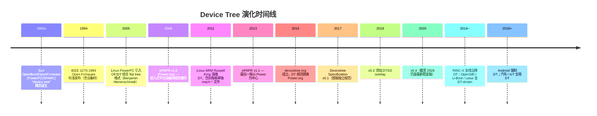

# 03-04 — DTS / DTB / FDT 语法、格式与 API 完整参考（含 FIT + OpenSBI 最简解析）

> **核心问题：** DTS / DTB / FDT 究竟是什么关系？设备树的"语法书"长什么样？M-mode 固件如何用最少代码读懂它？FIT 又是怎么把它当容器复用的？
>
> **一句话答案：** **DTS** 是源码（textual），**DTC** 把它编译成 **DTB**（二进制 blob），DTB 在内存中那一坨字节就叫 **FDT**（Flattened Device Tree，"扁平化的设备树"）。三者是同一棵设备树在不同存储形态下的称呼。**libfdt** 是读写 FDT 的标准 C 库，**FIT** 是把 DTB 格式当作镜像容器复用（kernel + dtb + ramdisk 打一个包），**OpenSBI `fdt_helper.c`** 是 M-mode 固件如何用 libfdt 抽硬件信息的最简范本。
>
> **本笔记定位：** 这是一篇**语法 + 格式 + API 参考手册**——配对 `03-03` 的"流程视角"。03-03 讲"一份 DTB 怎么从 dts 走到 driver probe"，本篇讲"那些字节本身的语法规则、二进制布局、读写 API、FIT 容器扩展、最简 parser 实现"。两篇互相补充。

---

## 0. 与 03-03 的分工

| 笔记 | 角度 | 内容 |
|------|------|------|
| **03-03 fdt-dts-boot-flow** | 横纵流程 | 5 阶段从 dts→dtb→bootloader→sbi→kernel；boot protocol；驱动绑定 |
| **03-04 (本篇)** | 语法/格式/API 参考 | DTS 完整语法书；DTB 二进制每字段含义；libfdt API 全表；FIT 完整规范；OpenSBI fdt_helper 精读 |


---

## 1. 顶层视野：DTS / DTB / FDT / FIT 四个术语精准辨析

很多文档混用术语让人懵。一表说清：

| 术语 | 全称 | 形态 | 大小典型 | 谁产生 / 谁消费 |
|------|------|------|----------|----------------|
| **DTS** | Device Tree Source | 文本 `.dts` | 几 KB | 人手写 / vendor 给 → DTC 消费 |
| **DTSI** | Device Tree Source Include | 文本 `.dtsi` | 几 KB | 复用片段（SoC 公共部分），被 `.dts` `/include/` |
| **DTSO** | Device Tree Source Overlay | 文本 `.dtso` | 几百 B | overlay 源码，编译成 `.dtbo` |
| **DTB** | Device Tree Blob | 二进制文件 `.dtb` | 几 KB ~ 几十 KB | DTC 产生 → bootloader / kernel 消费 |
| **DTBO** | Device Tree Blob Overlay | 二进制文件 `.dtbo` | 几百 B ~ 几 KB | dtc 产生 → 运行时 fdt_overlay_apply |
| **FDT** | Flattened Device Tree | 内存中那一坨字节 | 同 DTB | DTB 装进 RAM 后即 FDT；libfdt 操作的对象 |
| **FIT** | Flattened Image Tree | 二进制文件 `.itb` | 几 MB（含 kernel） | mkimage 产生 → U-Boot bootm 消费；**复用 FDT 二进制格式装多 payload** |
| **DT** | Device Tree | 抽象概念 | — | 整个体系的统称（"DT 子系统"，"DT 设计"）|

**关键：DTB == FDT** — 同一坨字节，在磁盘上叫 DTB，在内存里叫 FDT。FDT 强调"已经被加载到内存、可被 libfdt 操作"的状态。

**FIT == 一个特殊用途的 DTB** — FIT 的二进制格式跟 DTB 完全一样（同样的 magic、同样的 token 流），区别只是它的"语义"——根节点下不是描硬件，而是描镜像（`/images/...`、`/configurations/...`）。U-Boot mkimage 出来一个 `.itb`，用 `fdtdump` 都能查看其内部树。

---

## 2. 历史与版本演化



**关键演化节点：**
- **OpenFirmware 时代（1990s）** — Sun / Apple / IBM PowerPC 服务器，固件解析 forth 脚本得到设备树；目标是"plug-and-play 替代品"
- **Linux PowerPC 移植（2005）** — Ben Herrenschmidt 把 OF 的内存树扁平化序列化（"Flattened Device Tree"），boot 时 firmware 把它放在内存某地址传给 kernel；这就是今天 FDT 二进制格式的起源
- **ARM 大迁移（2011-2013）** — Linus Torvalds 公开斥责 ARM 子树"满地都是 mach-* 板级 hack 代码"，Russell King 借机强推 DT；同期 ARM Vendor 全部改造 → DT 时代正式到来
- **devicetree.org 独立（2016）** — DT 规范从 Power.org 剥离独立维护
- **DTC 与 libfdt 主仓库** — David Gibson（Red Hat）维护 [`dgibson/dtc`](https://github.com/dgibson/dtc) — 包含 `dtc`（编译器）、`libfdt`（运行时库）、`fdtdump/fdtget/fdtput/fdtoverlay` 工具链

**为什么 RISC-V 不走 ACPI？**
- ACPI 出生于 PC（x86），是 Microsoft+Intel 1996 推动，为 Windows + Plug-and-Play 设计
- DT 出生于嵌入式（PowerPC/SPARC/ARM），结构简单，无需运行时解释器（ACPI 有 AML 字节码）
- 服务器 ARM 走 ACPI（SBSA/SBBR），嵌入式 ARM 走 DT
- RISC-V 嵌入式默认 DT；服务器 RISC-V（如 SiFive Pro P550）未来可能走 ACPI（SBSA-style）

---

## 3. 横向对比：DT vs ACPI vs SMBIOS vs UEFI HOB vs Multiboot

| 维度 | Device Tree | ACPI | SMBIOS | UEFI HOB | Multiboot info |
|------|-------------|------|--------|----------|----------------|
| **出生** | 1994 OF / 2005 Linux | 1996 PC | 1995 PC | 2005 EDK2 | 1995 GRUB |
| **生态** | 嵌入式 / RISC-V / ARM SoC | x86 PC / 服务器 / ARM 服务器 | 各家 PC/服务器 | UEFI 内部 | OS 引导 |
| **语法** | 自己一套（DTS/DTB） | ASL → AML 字节码 | 表格（结构化） | 链表（Hand-Off Block） | 简单结构 |
| **解释器** | 无（直接读 blob） | 有（AML interpreter） | 无 | 无 | 无 |
| **大小** | 几 KB ~ 几十 KB | 几十 KB ~ 几 MB | 几 KB | 几 KB | 几百 B |
| **运行时修改** | overlay（受限） | DSDT/SSDT 加载 | 不可改 | 仅 PEI/DXE 阶段 | 不可改 |
| **代表项目** | Linux/U-Boot/OpenSBI/Zephyr | Windows/Linux ACPI/UEFI | dmidecode / Linux DMI | EDK2 / coreboot | xv6 / 教学 OS |

**核心取舍：**
- **DT** — 简单、静态、无解释器；适合嵌入式 / 不变硬件
- **ACPI** — 复杂、动态、有解释器；适合 PC / 多变配置 / 高级电源管理
- **SMBIOS** — 只描述静态信息（厂商、型号、CPU 数）；与 DT/ACPI 互补，不互斥

详见 `notes/00-12-device-driver-evolution.md` 第 X 节。

---

## 4. DTS 语法完整参考

以下按 [Devicetree Specification v0.4](https://www.devicetree.org/specifications/) 的章节顺序展开。

### 4.1 顶层文件结构

```dts
/dts-v1/;                           // 必须：版本声明
/plugin/;                           // 可选：表明这是 overlay
/memreserve/ 0x80000000 0x10000;    // 可选：保留物理内存

/include/ "common.dtsi"             // 可选：原生 include（注意：是 /include/，不是 #include）
#include "macros.h"                 // 可选：C 预处理（需配合 cpp）

/ {
    // 根节点的属性 + 子节点
};

&label {                            // 可选：在根之外通过 label 修补已存在节点
    new-prop = "added";
};
```

| 顶层指令 | 含义 |
|---------|------|
| `/dts-v1/;` | 版本号，目前唯一值；放第一行（强制） |
| `/plugin/;` | 标识此文件为 overlay 源码（DTSO） |
| `/memreserve/ <addr> <size>;` | 直接写到 mem_rsvmap block；保留这块物理 RAM 不被 OS 当普通内存用 |
| `/include/ "file.dtsi"` | DTC 原生 include（不需要预处理器） |
| `#include "file.h"` | C-preprocessor include；需要 `cpp -nostdinc -I... | dtc` 流水线 |

### 4.2 节点（Node）

**语法：**

```dts
[label:] node-name[@unit-address] {
    [properties...]
    [child nodes...]
};
```

**节点命名规则：**
- `node-name` 由 1-31 个字符构成：`[0-9a-zA-Z,._+-]`
- `@unit-address` 是该节点在父总线上的"地址"（通常对应 `reg` 第一个 cell）
- 同一父节点下，**每个 `name@addr` 必须唯一**
- 如果节点没 `reg`，省 `@addr`
- **根节点**特殊，名字就是 `/`

**示例：**

```dts
uart0: uart@10000000 {           // 节点名 uart，单元地址 10000000，标签 uart0
    reg = <0x10000000 0x100>;
    interrupts = <10>;
};
```

### 4.3 标签（Label）与 phandle

**标签** 是 DTS 源码里给节点起的"别名"：

```dts
plic: interrupt-controller@c000000 { ... };

uart@10000000 {
    interrupt-parent = <&plic>;   // 通过 &label 引用上面那个节点
    interrupts = <10>;
};
```

**phandle** 是 DTC 编译时自动给"被引用过的节点"生成的整数 ID（u32），写到那个节点的 `phandle` 属性中：

```
plic 节点编译后会自动多出：
    phandle = <0x01>;

uart 节点 interrupt-parent 编译后变为：
    interrupt-parent = <0x01>;     // 不再是 label 名，而是 phandle 数字
```

→ **运行时通过 `fdt_node_offset_by_phandle()` 反查节点 offset。**

### 4.4 属性（Property）

**语法：**

```dts
property-name = value;     // 有值
property-name;             // 无值（布尔属性，存在即真）
```

**属性名规则：** 1-31 字符，`[0-9a-zA-Z,._+?#-]`（注意可以含 `,` `#` `?`）。

**值类型完全列表：**

| 类型 | 语法 | 示例 | DTB 中存储 |
|------|------|------|-----------|
| **空（empty）** | `name;` | `interrupt-controller;` | len=0 |
| **u32** | `<value>` | `clock-frequency = <12500000>;` | 4 字节 BE |
| **u64** | `<u64-hi u64-lo>` | `reg = <0x1 0x80000000>;` (高 32 + 低 32) | 8 字节 BE |
| **prop-encoded-array** | `<v1 v2 v3 ...>` | `reg = <0x0 0x80000000 0x0 0x10000000>;` | 多个 u32 BE 拼接 |
| **string** | `"abc"` | `model = "QEMU virt";` | NUL 结尾字节串 |
| **stringlist** | `"a", "b", "c"` | `compatible = "ns16550a", "snps,dw-apb-uart";` | 多个 NUL 分隔字符串 |
| **bytestring** | `[01 23 45 67]` | `mac-address = [00 11 22 33 44 55];` | 原始字节 |
| **phandle** | `<&label>` | `interrupt-parent = <&plic>;` | 编译为 u32 phandle |
| **混合** | `<&phandle 1 2>, "label"` | 复合表达 | 拼接 |

**关键："Cell" 是 32-bit 的别名** —— DT 世界里说"3 cells"就是"3 个 u32"。

### 4.5 标准属性表（Devicetree Specification v0.4 §2.3）

每个节点可能有的"通用属性"：

| 属性 | 类型 | 含义 |
|------|------|------|
| **`compatible`** | stringlist | 设备/总线兼容性字符串列表，按"具体→通用"顺序；驱动靠它 match |
| **`model`** | string | 制造商型号字符串，如 `"sifive,fu740-c000"` |
| **`phandle`** | u32 | 节点的整数 ID（通常 dtc 自动生成）|
| **`status`** | string | `"okay"`(默认) / `"disabled"` / `"reserved"` / `"fail"` / `"fail-sss"` |
| **`#address-cells`** | u32 | 子节点 `reg` 中地址用几个 cell（典型 1 或 2）|
| **`#size-cells`** | u32 | 子节点 `reg` 中大小用几个 cell（典型 1 或 2）|
| **`reg`** | array | 总线上的资源（地址+大小对的列表）|
| **`virtual-reg`** | u32/u64 | 早期 boot stage 时该设备的虚拟地址（rare） |
| **`ranges`** | array / empty | 父子总线地址映射；空表示 1:1 直通 |
| **`dma-ranges`** | array | DMA 视角的地址映射 |
| **`name`** | string | （已废弃）节点名；现在 dtc 自动从 `node-name` 生成 |
| **`device_type`** | string | （半废弃）`"cpu"` / `"memory"` 等少数仍保留使用 |

### 4.6 必备节点（Devicetree Specification v0.4 §3）

#### `/`（root）

```dts
/ {
    #address-cells = <2>;        // 顶层用 64 位地址
    #size-cells = <2>;
    compatible = "vendor,board";
    model = "Vendor Board v1.0";
    ...
};
```

#### `/chosen` — boot-time 元数据

```dts
chosen {
    bootargs = "console=ttyS0 root=/dev/mmcblk0p2 rw";
    stdout-path = "serial0:115200n8";
    linux,initrd-start = <0x0 0x88000000>;
    linux,initrd-end   = <0x0 0x88c00000>;
    kaslr-seed = <0x12345678 0x9abcdef0>;
    boot-hartid = <0>;           // RISC-V 专用：哪个 hart 是 boot hart
    rng-seed = [01 02 03 ...];
};
```

**关键：bootloader 经常往 chosen 里写东西**（initrd 地址、KASLR 种子、entropy）；kernel 早期靠 chosen 拿到命令行。

#### `/aliases` — 别名表

```dts
aliases {
    serial0 = &uart0;
    serial1 = &uart1;
    ethernet0 = &eth0;
};
```

`stdout-path = "serial0:115200n8"` 中的 `serial0` 即查 aliases。

#### `/memory@<addr>` — 物理内存范围

```dts
memory@80000000 {
    device_type = "memory";       // 必须有这个属性
    reg = <0x0 0x80000000 0x0 0x10000000>;   // 256 MB at 0x80000000
};
```

**device_type = "memory"** 是 OS 找 RAM 的 marker（DT 历史包袱，几乎只对 cpu 和 memory 节点保留 device_type）。

#### `/cpus`

```dts
cpus {
    #address-cells = <1>;
    #size-cells = <0>;
    timebase-frequency = <10000000>;    // RISC-V 必须；ARM 不需要

    cpu@0 {
        device_type = "cpu";
        reg = <0>;                       // hart ID
        compatible = "riscv";
        riscv,isa = "rv64imafdc_sstc";
        mmu-type = "riscv,sv48";
        clock-frequency = <1000000000>;
        status = "okay";

        cpu0_intc: interrupt-controller {
            #interrupt-cells = <1>;
            interrupt-controller;
            compatible = "riscv,cpu-intc";
        };
    };

    cpu@1 { ... reg = <1>; ... };
};
```

#### `/reserved-memory` — 保留内存（带语义）

```dts
reserved-memory {
    #address-cells = <2>;
    #size-cells = <2>;
    ranges;

    secmon@e0000000 {
        reg = <0x0 0xe0000000 0x0 0x80000>;
        no-map;                  // 完全不映射进 OS 页表
    };

    cma@a0000000 {
        compatible = "shared-dma-pool";
        reusable;                // CMA 可被回收用作 DMA buffer
        size = <0x0 0x4000000>;
        alignment = <0x0 0x100000>;
        linux,cma-default;
    };
};
```

跟 mem_rsvmap 不同：mem_rsvmap 是"硬保留"无语义；reserved-memory 节点带语义（`no-map` / `reusable` / `compatible` 决定 driver）。

### 4.7 中断 binding

DT 中断模型是**树状**：每个设备指向 `interrupt-parent`（默认继承父节点的）。

```dts
plic: interrupt-controller@c000000 {
    #address-cells = <0>;
    #interrupt-cells = <1>;        // 此控制器的"interrupts"用几个 cell
    compatible = "riscv,plic0";
    reg = <0x0 0xc000000 0x0 0x4000000>;
    interrupt-controller;          // 布尔，标识这是中断控制器
    interrupts-extended = <&cpu0_intc 11 &cpu1_intc 11 ...>;
};

uart@10000000 {
    interrupt-parent = <&plic>;    // 我的中断走 plic
    interrupts = <10>;             // PLIC IRQ#10
};
```

| 属性 | 含义 |
|------|------|
| `interrupt-controller` | 布尔；说"我是中断控制器" |
| `#interrupt-cells` | 我的子用 `interrupts` 时每条中断用几个 cell |
| `interrupt-parent` | 我的中断输出到哪个控制器（phandle）|
| `interrupts` | 我连到 parent 的哪几条线（cell 数量取决于 parent 的 `#interrupt-cells`）|
| `interrupts-extended` | 替代 `interrupts`：每条线显式指 parent；可以同时连多个 parent |

### 4.8 `reg`、`#address-cells`、`#size-cells`、`ranges`

**`reg` 是子节点的属性，但其格式由 *父节点* 的 `#address-cells` / `#size-cells` 决定。**

```dts
soc {
    #address-cells = <2>;          // 子的 reg 地址用 2 cells (64-bit)
    #size-cells = <2>;             // 子的 reg 大小用 2 cells (64-bit)
    ranges;                        // 子的地址 1:1 映射到父（即 root）

    uart@10000000 {
        reg = <0x0 0x10000000 0x0 0x100>;   // addr=0x10000000, size=0x100
        //     ^^^^^^^^^^^^^^^^^ 2 cells   ^^^^^^^^^^^^ 2 cells
    };
};
```

**`ranges`：** 子总线地址 → 父总线地址 的映射。

```dts
pci@30000000 {
    #address-cells = <3>;          // PCI 地址 3 cells（PCI 地址语义）
    #size-cells = <2>;
    ranges = <0x02000000 0 0x40000000   0 0x40000000   0 0x40000000>;
    //       ^^^^^^^^^ child addr      ^^^^^^^^^^^^   ^^^^^^^^^^^^
    //                                  parent addr    size
    // 子节点的 0x40000000 区域 → 映射到父 (root) 的 0x40000000
};
```

`ranges;`（empty） 表示**直通**（identity mapping）。

### 4.9 DTS 预处理与高级语法

| 语法 | 含义 |
|------|------|
| `/include/ "file.dtsi"` | DTC 原生 include（必须用 `/include/`，**不带空格**）|
| `#include "macro.h"` | C 预处理 include；需 cpp 流水线 |
| `/delete-node/ &uart1;` | 从产物里删掉某节点 |
| `/delete-property/ "status";` | 在当前节点删掉某属性 |
| `/omit-if-no-ref/ pmu;` | 该节点若没人 phandle 引用就自动删掉（节省空间） |
| `/bits/ 8 <0x12 0x34>;` | 强制每个 cell 用 8/16/32/64 位（默认 32）|
| `&{/path/to/node}` | 通过路径引用节点（不需要 label） |

### 4.10 DTSO（Overlay）语法

**Overlay 是把"补丁"叠加到运行中的设备树**——典型场景：FPGA 加载新 IP、Pi GPIO 子卡、运行时增加 PCI 子设备。

```dts
/dts-v1/;
/plugin/;                          // 标识 overlay

/ {
    fragment@0 {
        target = <&i2c1>;          // 把下面的 __overlay__ 合并到 i2c1 节点

        __overlay__ {
            #address-cells = <1>;
            #size-cells = <0>;

            tmp75@48 {
                compatible = "ti,tmp75";
                reg = <0x48>;
                status = "okay";
            };
        };
    };

    fragment@1 {
        target-path = "/chosen";   // 也可以用路径而非 phandle
        __overlay__ {
            extra-bootarg = "debug";
        };
    };
};
```

**编译：** `dtc -@ -I dts -O dtb -o overlay.dtbo overlay.dts`（`-@` 标记 phandle 信息保留以供运行时 fixup）

**应用：** `fdt_overlay_apply(base_fdt, overlay_fdt)` (libfdt API) 或 `/sys/kernel/config/device-tree/overlays/` (Linux configfs)

---

## 5. DTB 二进制格式完整参考（FDT spec）

DTB 文件本身就是 FDT —— 直接 memcpy 到任何对齐 8 字节的内存地址即可被 libfdt 操作。

### 5.1 整体布局

```
┌──────────────────────────────┐  offset 0
│  Header (40 bytes, all BE)    │
├──────────────────────────────┤  offset = off_mem_rsvmap
│  Memory Reservation Block     │
│  fdt_reserve_entry[]          │
│  ...终止于 {0,0}              │
├──────────────────────────────┤  offset = off_dt_struct
│  Structure Block              │
│  token stream                 │
├──────────────────────────────┤  offset = off_dt_strings
│  Strings Block                │
│  NUL-separated strings        │
└──────────────────────────────┘  offset = totalsize
```

### 5.2 Header (40 字节，全 big-endian u32)

| Offset | Field | 含义 |
|--------|-------|------|
| 0  | `magic` | **0xD00DFEED** — DTB 标识 |
| 4  | `totalsize` | 整个 blob 的字节数 |
| 8  | `off_dt_struct` | structure block 起始 offset |
| 12 | `off_dt_strings` | strings block 起始 offset |
| 16 | `off_mem_rsvmap` | mem_rsvmap 起始 offset（必须 8 字节对齐） |
| 20 | `version` | 当前 = 17 |
| 24 | `last_comp_version` | 向下兼容到的最低版本（当前 = 16） |
| 28 | `boot_cpuid_phys` | boot CPU 物理 ID（v2+ 添加） |
| 32 | `size_dt_strings` | strings block 总大小（v3+ 添加） |
| 36 | `size_dt_struct` | structure block 总大小（v17 添加） |

**版本演化：** v1/v2/v3/v16/v17 — 字段递增；现代工具产物全是 v17。

### 5.3 Memory Reservation Block

8 字节对齐起，每条 16 字节：

```
struct fdt_reserve_entry {
    uint64_t address;     // BE
    uint64_t size;        // BE
};
```


### 5.4 Structure Block — token 流

每个 token 是 4 字节 big-endian u32：

| 值 | 名称 | 后跟数据 |
|----|------|----------|
| 0x00000001 | **FDT_BEGIN_NODE** | NUL 结尾节点名 + padding 到 4 字节对齐 |
| 0x00000002 | **FDT_END_NODE** | 无 |
| 0x00000003 | **FDT_PROP** | u32 len + u32 nameoff + value (len 字节) + padding |
| 0x00000004 | **FDT_NOP** | 无（占位符，可跳过） |
| 0x00000009 | **FDT_END** | 无（标识 structure block 结尾） |

**深度 = BEGIN_NODE 数 - END_NODE 数**；FDT_END 出现时深度必须为 0。

### 5.5 Strings Block

仅 NUL 分隔的字符串集合（去重）。`FDT_PROP` 中的 `nameoff` 字段是**到 strings block 起点的字节 offset**，指向某个属性名字符串。

**为什么单独存？** 同名属性（`reg`、`compatible`、`#address-cells`）在树里出现 N 次只占 1 份字符串空间，节省体积。

### 5.6 字节序与对齐铁律

1. **Header 全 big-endian**（不论 host 架构）
2. **token 全 BE**
3. **property value** 由 binding 决定字节序，但 DT 标准属性（reg/clock-frequency/...）默认 BE
4. **每个 token 起点必须 4 字节对齐**
5. **整个 FDT 起点必须 8 字节对齐**（libfdt 假设）
6. **mem_rsvmap 起点必须 8 字节对齐**

> **完整字节级 hexdump 演示** 见 `03-03 § 3 第 3 步`，本笔记不重复。

---

## 6. DTC 工具链

主仓库：[`github.com/dgibson/dtc`](https://github.com/dgibson/dtc)

| 工具 | 功能 |
|------|------|
| **dtc** | DT 编译器（双向：dts↔dtb；也支持 yaml） |
| **fdtdump** | 把 dtb 反汇编成可读 dts 风格输出 |
| **fdtget** | 从 dtb 取某属性值 |
| **fdtput** | 修改 dtb 某属性 |
| **fdtoverlay** | 把 overlay (.dtbo) 应用到 base.dtb 生成新 dtb |
| **convert-dtsv0** | 把老格式 v0 dts 升级到 v1 |
| **dtdiff** | 对比两份 dts/dtb |
| **fdtgrep** | 在 dtb 里 grep 节点/属性 |

**常用命令清单：**

```sh
# 编译
dtc -I dts -O dtb -o out.dtb in.dts
dtc -I dts -O dtb -O dtb -@ -o overlay.dtbo overlay.dtso  # overlay (-@ 保留 phandle 表)

# 反汇编（看二进制内容）
dtc -I dtb -O dts in.dtb | less
fdtdump in.dtb

# 取/改属性
fdtget in.dtb /chosen bootargs
fdtput -t s in.dtb /chosen bootargs "console=ttyS1"
fdtput -t x in.dtb /soc/uart@10000000 clock-frequency 0x927C00

# overlay 应用
fdtoverlay -i base.dtb -o merged.dtb overlay.dtbo

# diff 两个 dtb
dtdiff a.dtb b.dtb

# 验证（v1.7+）
dtc -I dtb -O dtb -o /dev/null in.dtb   # 无 warning 即合规

# yaml 中间格式（schema 验证用）
dtc -I dts -O yaml in.dts -o in.yaml
```

---

## 7. libfdt API 完整参考

主仓库：[`github.com/dgibson/dtc/tree/main/libfdt`](https://github.com/dgibson/dtc/tree/main/libfdt)

**libfdt 设计哲学：**
- **零分配**：所有操作 in-place 在用户给的 buffer 里
- **可在 freestanding 环境用**：仅依赖 memcpy / strlen 几个原语
- **只读 / 只写 / 顺序写 / inplace 修改 / overlay** 五种 API 风格分文件
- **Errno 风格返回 -FDT_ERR_***（负数为错误）

### 7.1 文件分组

| 文件 | 功能 | 何时用 |
|------|------|-------|
| **fdt.c** | 基础 token 遍历 | 所有 API 底层依赖 |
| **fdt_ro.c** | Read-Only 查询 | 99% 用户场景（kernel/SBI 常用）|
| **fdt_rw.c** | Read-Write（动态扩张缓冲）| 增删节点/属性 |
| **fdt_wip.c** | Write-In-Place（不改大小）| 仅修改属性值，不增删结构 |
| **fdt_sw.c** | Sequential Writer | 从零建一棵新树（kernel KEXEC、initrd 工具）|
| **fdt_overlay.c** | Overlay 应用 | 运行时叠加 dtbo |
| **fdt_addresses.c** | 地址翻译辅助 | 处理 ranges 的 bus → cpu 地址翻译 |
| **fdt_strerror.c** | 错误字符串 | 调试 |
| **fdt_empty_tree.c** | 创建空 FDT | 初始化用 |

### 7.2 高频 API 速查

#### 检查与初始化

```c
int fdt_check_header(const void *fdt);                  // 验 magic + version
int fdt_check_full(const void *fdt, size_t bufsize);    // 全量校验（耗时）
int fdt_open_into(const void *fdt, void *buf, int size); // 复制到大 buffer 准备修改
int fdt_pack(void *fdt);                                 // 紧缩，去掉 padding
int fdt_create_empty_tree(void *buf, int bufsize);       // 创建空树
```

#### 节点查找

```c
int fdt_path_offset(const void *fdt, const char *path);                    // "/soc/uart@10000000"
int fdt_subnode_offset(const void *fdt, int parent, const char *name);     // 按名字找子节点
int fdt_first_subnode(const void *fdt, int parent);
int fdt_next_subnode(const void *fdt, int prev);
int fdt_node_offset_by_compatible(const void *fdt, int start, const char *compat);
int fdt_node_offset_by_phandle(const void *fdt, uint32_t phandle);
int fdt_node_offset_by_prop_value(...);
int fdt_parent_offset(const void *fdt, int node);
```

#### 节点遍历宏（推荐）

```c
fdt_for_each_subnode(node, fdt, parent_offset) {
    // node 自动迭代 parent_offset 的每个子节点
}
```

#### 属性读取

```c
const void *fdt_getprop(const void *fdt, int node, const char *name, int *lenp);
const char *fdt_get_name(const void *fdt, int node, int *lenp);

uint32_t fdt32_to_cpu(uint32_t x);     // BE → host
uint64_t fdt64_to_cpu(uint64_t x);

// 字符串列表
int fdt_stringlist_count(...);
int fdt_stringlist_search(...);
int fdt_stringlist_contains(...);

// 地址 cell 数（处理 reg）
int fdt_address_cells(const void *fdt, int nodeoffset);
int fdt_size_cells(const void *fdt, int nodeoffset);
```

#### 属性写入

```c
// 通用（可能扩张缓冲）
int fdt_setprop(void *fdt, int node, const char *name, const void *val, int len);
int fdt_setprop_u32(void *fdt, int node, const char *name, uint32_t val);
int fdt_setprop_u64(void *fdt, int node, const char *name, uint64_t val);
int fdt_setprop_string(void *fdt, int node, const char *name, const char *s);
int fdt_appendprop(void *fdt, int node, const char *name, const void *val, int len);
int fdt_delprop(void *fdt, int node, const char *name);

// inplace（不改大小）
int fdt_setprop_inplace(void *fdt, int node, const char *name, const void *val, int len);
int fdt_nop_property(void *fdt, int node, const char *name);   // 改成 NOP token
```

#### 节点增删

```c
int fdt_add_subnode(void *fdt, int parent, const char *name);
int fdt_del_node(void *fdt, int node);
int fdt_nop_node(void *fdt, int node);
```

#### 内存保留区

```c
int fdt_num_mem_rsv(const void *fdt);
int fdt_get_mem_rsv(const void *fdt, int n, uint64_t *addr, uint64_t *size);
int fdt_add_mem_rsv(void *fdt, uint64_t addr, uint64_t size);
int fdt_del_mem_rsv(void *fdt, int n);
```

#### Sequential Writer（从零建树）

```c
fdt_create(buf, bufsize);
fdt_finish_reservemap(fdt);
fdt_begin_node(fdt, "");           // root
  fdt_property_string(fdt, "compatible", "my,board");
  fdt_begin_node(fdt, "chosen");
    fdt_property_string(fdt, "bootargs", "console=ttyS0");
  fdt_end_node(fdt);
fdt_end_node(fdt);
fdt_finish(fdt);
```

#### Overlay

```c
int fdt_overlay_apply(void *fdt, void *fdto);   // 应用 fdto overlay 到 fdt（fdt 必须用 fdt_open_into 预留空间）
```

#### 错误处理

```c
const char *fdt_strerror(int err);   // -FDT_ERR_NOTFOUND → "not found"
```

### 7.3 错误码（fdt.h）

| 宏 | 值 | 含义 |
|----|---|------|
| `FDT_ERR_NOTFOUND` | 1 | 节点/属性不存在 |
| `FDT_ERR_EXISTS` | 2 | 已存在 |
| `FDT_ERR_NOSPACE` | 3 | 缓冲区不够 |
| `FDT_ERR_BADOFFSET` | 4 | offset 不指向 token |
| `FDT_ERR_BADPATH` | 5 | path 格式错 |
| `FDT_ERR_BADPHANDLE` | 6 | phandle 无效 |
| `FDT_ERR_BADSTATE` | 7 | sw API 状态错 |
| `FDT_ERR_TRUNCATED` | 8 | blob 被截断 |
| `FDT_ERR_BADMAGIC` | 9 | magic ≠ 0xD00DFEED |
| `FDT_ERR_BADVERSION` | 10 | 版本不支持 |
| `FDT_ERR_BADSTRUCTURE` | 11 | structure block 损坏 |
| `FDT_ERR_BADLAYOUT` | 12 | header offset 不一致 |
| `FDT_ERR_INTERNAL` | 13 | libfdt 内部错 |

返回值约定：**> 0 是 offset，0 是 root，< 0 是负 errno**。永远 `if (rc < 0) return rc;` 检查。

---

## 8. OpenSBI `fdt_helper.c` 精读 — M-mode 最简 FDT 解析范本

文件：`/home/heke/tgln/stage2/material/sbi/opensbi/lib/utils/fdt/fdt_helper.c`（1166 行）

**这是 SBI 固件如何用 libfdt 抽硬件信息的"标准答案"**。任何要写 M-mode 固件的人都应当读一遍。

### 8.1 文件职责

封装 libfdt 提供 SBI 内部更高级的解析函数：
- 给定一个 device 节点，按 index 拿地址 + 大小（自动处理 #address-cells / #size-cells / ranges）
- 解析 `riscv,isa` 字符串得到扩展位图
- 识别各家 UART（ns16550 / sifive / shakti / renesas / gaisler / xilinx）
- 解析 PLIC / APLIC / IMSIC / ACLINT / PLMT / PLICSW 节点

### 8.2 核心函数一览（按调用频度）

| 函数 | 行号 | 作用 |
|------|------|------|
| `fdt_parse_phandle_with_args` | L36 | 拿 `<&phandle arg1 arg2>` 形式的属性，解 phandle + N args |
| `fdt_get_node_addr_size` | L125 | **🌟 核心**：从节点 reg 拿第 index 个地址 + 大小 |
| `fdt_get_node_addr_size_by_name` | L181 | 通过 `reg-names` 字符串列表按名取 |
| `fdt_parse_hart_id` | L225 | 从 cpu@N 拿 reg = hart ID |
| `fdt_parse_max_enabled_hart_id` | L277 | 扫所有 cpu@N，返回最大 enabled hartid |
| `fdt_parse_timebase_frequency` | L308 | 找 /cpus 的 timebase-frequency |
| `fdt_parse_isa_extensions` | L461 | 解析 riscv,isa 字符串 → 扩展位图 |
| `fdt_parse_uart_node` | L560 | ns16550 类型 UART |
| `fdt_parse_uart8250` | L593 | 标准 8250 UART（支持多家 compatible）|
| `fdt_parse_plic_node` / `fdt_parse_plic` | L879/903 | PLIC 中断控制器 |
| `fdt_parse_aplic_node` | L660 | APLIC（AIA 新规范）|
| `fdt_parse_imsic_node` | L799 | IMSIC（AIA 新规范）|
| `fdt_parse_aclint_node` | L971 | ACLINT（mtimer/sswi/mswi）|
| `fdt_parse_plmt_node` | L1040 | PLMT（platform-level machine timer） |
| `fdt_parse_plicsw_node` | L1096 | PLIC software interrupt |
| `fdt_parse_compat_addr` | L1152 | 用 compatible 字符串找节点取 base addr |

### 8.3 `fdt_get_node_addr_size` 逐行精读（L125-179）


```c
int fdt_get_node_addr_size(const void *fdt, int node, int index,
                           uint64_t *addr, uint64_t *size)
{
    int parent, len, i, rc;
    int cell_addr, cell_size;
    const fdt32_t *prop_addr, *prop_size;
    uint64_t temp = 0;

    if (!fdt || node < 0 || index < 0)
        return SBI_EINVAL;

    /* (1) 找父节点：reg 的 cell 数由父定义 */
    parent = fdt_parent_offset(fdt, node);
    if (parent < 0) return parent;

    /* (2) 从父节点读 #address-cells / #size-cells */
    cell_addr = fdt_address_cells(fdt, parent);
    if (cell_addr < 1) return SBI_ENODEV;
    cell_size = fdt_size_cells(fdt, parent);
    if (cell_size < 0) return SBI_ENODEV;

    /* (3) 拿 reg 属性 */
    prop_addr = fdt_getprop(fdt, node, "reg", &len);
    if (!prop_addr) return SBI_ENODEV;

    /* (4) 计算该 index 的偏移 */
    if ((len / sizeof(u32)) <= (index * (cell_addr + cell_size)))
        return SBI_EINVAL;
    prop_addr = prop_addr + (index * (cell_addr + cell_size));
    prop_size = prop_addr + cell_addr;

    /* (5) 组装 addr：cell_addr 个 32-bit cell 拼成 64-bit */
    if (addr) {
        for (i = 0; i < cell_addr; i++)
            temp = (temp << 32) | fdt32_to_cpu(*prop_addr++);

        /* (6) 沿父总线链 fdt_translate_address —— 处理 ranges */
        do {
            if (parent < 0) break;
            rc = fdt_translate_address(fdt, temp, parent, addr);
            if (rc) break;
            parent = fdt_parent_offset(fdt, parent);
            temp = *addr;
        } while (1);
    }

    /* (7) 组装 size：cell_size 个 32-bit cell 拼成 64-bit */
    temp = 0;
    if (size) {
        for (i = 0; i < cell_size; i++)
            temp = (temp << 32) | fdt32_to_cpu(*prop_size++);
        *size = temp;
    }
    return 0;
}
```

**学到的关键点：**
1. `reg` 的解读必须**先读父的 #address/#size-cells**——这是 DT 通用规则
2. 多 cell 拼 64-bit：`(hi << 32) | lo`，用 `fdt32_to_cpu` 转字节序
3. **ranges 链式翻译**：循环往上爬父节点，调 `fdt_translate_address` 应用 ranges 映射；终止条件是父无 ranges 或到 root
4. 返回 SBI 风格 errno（`-SBI_EINVAL` / `-SBI_ENODEV`），不直接传 libfdt 的


- 只支持 QEMU virt + 少数 SiFive 风格平台
- 只关心 UART base / CLINT base / timer-freq / hart 数量 / sstc

OpenSBI `fdt_helper.c` 是"产品级"完整版，支持：
- 全 RISC-V 中断控制器谱系（PLIC / APLIC / IMSIC）
- 全 ACLINT 子组件（mtimer / mswi / sswi / plmt / plicsw）
- 多家 UART / 多家 PMU
- 通用 reg/ranges 翻译（任意嵌套）

1. 当前阶段：保持 fdt_generic.zig 简洁
2. 下一阶段：参考 OpenSBI 抽 `getNodeAddrSize` / `parseHartId` 等通用函数

---

## 9. FIT (Flattened Image Tree) 完整参考

**FIT = "DTB 二进制格式 + 镜像描述语义"。** 文件后缀 `.itb`（image tree blob）；内部就是个 DTB，可以用 `fdtdump` 直接看。

**正式规范**（2024 年起脱离 U-Boot 独立维护）：[fitspec.osfw.foundation](https://fitspec.osfw.foundation/)

### 9.1 为什么要 FIT？

老 U-Boot 用 `uImage`（legacy image format）—— 64 字节 header + payload；缺点：
- 一次只能打一个文件
- 没签名机制
- 无法描述"一台机器多种 dtb 配置"

**FIT 解决：**
- ✅ 一个文件打多个 payload（kernel + N 个 dtb + initramfs + FPGA bitstream + signed 配置）
- ✅ 每个 image 自带 hash + signature
- ✅ 多 configuration（如 multi_v8 一个 itb 支持 N 个板子）
- ✅ 复用 DT 格式，工具链零成本（mkimage 即 dtc）

### 9.2 FIT 文件结构（its 源码）

```dts
/dts-v1/;

/ {
    description = "FIT image with kernel + dtb + initramfs";
    #address-cells = <1>;

    images {
        kernel-1 {                                      // 节点名任意
            description = "Linux 6.6";
            data = /incbin/("./Image");                 // 嵌入二进制文件
            type = "kernel";                            // 必填
            arch = "riscv";                             // 必填
            os = "linux";
            compression = "none";                       // none/gzip/bzip2/lzma/lzo/xz/zstd
            load = <0x80200000>;                        // 加载到这个物理地址
            entry = <0x80200000>;                       // jump 到这个地址
            hash-1 {                                    // 完整性
                algo = "sha256";
            };
        };

        fdt-virt {
            description = "QEMU virt DTB";
            data = /incbin/("./virt.dtb");
            type = "flat_dt";
            arch = "riscv";
            compression = "none";
            hash-1 { algo = "sha256"; };
        };

        ramdisk-1 {
            description = "buildroot rootfs";
            data = /incbin/("./rootfs.cpio.gz");
            type = "ramdisk";
            arch = "riscv";
            os = "linux";
            compression = "gzip";
            hash-1 { algo = "sha256"; };
        };
    };

    configurations {
        default = "conf-virt";

        conf-virt {
            description = "QEMU virt boot";
            kernel = "kernel-1";
            fdt = "fdt-virt";
            ramdisk = "ramdisk-1";
            signature {                                 // 可选签名
                algo = "sha256,rsa2048";
                key-name-hint = "dev";
                sign-images = "kernel", "fdt", "ramdisk";
            };
        };
    };
};
```

### 9.3 字段速查

#### `/images/<name>` 子节点字段

| 字段 | 类型 | 含义 | 必填 |
|------|------|------|------|
| `description` | string | 人类描述 | 推荐 |
| `data` | bytestring | 实际数据（用 `/incbin/` 嵌入文件）| ✅ |
| `type` | string | `kernel` / `flat_dt` / `ramdisk` / `fpga` / `firmware` / `script` / `loadables` | ✅ |
| `arch` | string | `riscv` / `arm` / `arm64` / `x86` / `ppc` / `loongarch` | ✅ |
| `os` | string | `linux` / `u-boot` / `vxworks` / ... | kernel/ramdisk 必填 |
| `compression` | string | `none` / `gzip` / `bzip2` / `lzma` / `lzo` / `xz` / `zstd` | ✅ |
| `load` | u32/u64 | 加载到的物理地址 | kernel/ramdisk |
| `entry` | u32/u64 | 跳转入口地址 | kernel |
| `hash-N` | 子节点 | 完整性校验（algo + value） | 推荐 |
| `signature-N` | 子节点 | 加密签名 | verified boot 必填 |

#### `/configurations/<name>` 子节点字段

| 字段 | 含义 |
|------|------|
| `description` | 人类描述 |
| `kernel` | 引用 /images/<name> 中 kernel 类型的某个 |
| `fdt` | 引用 dtb image |
| `ramdisk` | 引用 ramdisk image |
| `fpga` | 引用 FPGA bitstream image |
| `loadables` | 字符串列表，加载额外的 image（不参与跳转）|
| `signature` | 签名（保护这个配置不被篡改）|

### 9.4 mkimage 命令

```sh
# 编译 .its → .itb
mkimage -f kernel.its kernel.itb

# 列出 itb 内容
mkimage -l kernel.itb

# 检查 + 签名 itb（需要 .key + .crt）
mkimage -F -k keys -K u-boot.dtb -r kernel.itb

# u-boot 启动
=> tftp 0x80000000 kernel.itb
=> bootm 0x80000000#conf-virt    # # 后跟 configuration 名字
```

### 9.5 verified boot

`mkimage -k keys/ -K u-boot.dtb -r` 会：
1. 用 `keys/dev.key` 给 itb 签名
2. 把 `keys/dev.crt` 嵌入到 `u-boot.dtb`（`/signature/` 节点）

U-Boot 启动 itb 时：
1. 从自己的 dtb 拿到内嵌的公钥
2. 验 itb signature
3. 失败则拒绝启动

详见 `boot/u-boot/doc/usage/fit/sign-configs.rst` / `signature.rst`。


- **KuBoot** 必须实现 FIT loader（U-Boot 风格）

---

## 10. 常见 binding 速查

> Linux `Documentation/devicetree/bindings/*.yaml` 是权威清单（数千个）。这里列日常 SBI/U-Boot/Kernel 高频接触的：

### 10.1 总线类

| compatible | binding |
|-----------|---------|
| `simple-bus` | 子节点直接当独立设备处理（无总线协议）|
| `simple-mfd` | 多功能设备容器 |
| `syscon` | 系统寄存器组（其他节点通过 phandle 引用）|

### 10.2 串口

| compatible | 驱动 |
|-----------|------|
| `ns16550a` | 8250/16550 通用 |
| `snps,dw-apb-uart` | DesignWare（被 RV SoC 大量使用，如 SpacemiT K1）|
| `sifive,uart0` | SiFive UART |
| `arm,pl011` | ARM PrimeCell |
| `xlnx,xps-uartlite-1.00.a` | Xilinx UARTLite |

### 10.3 中断控制器

| compatible | 含义 |
|-----------|------|
| `riscv,cpu-intc` | RISC-V 每个 hart 自带的 intc |
| `riscv,plic0` / `sifive,plic-1.0.0` | PLIC |
| `riscv,aplic` | APLIC（AIA） |
| `riscv,imsics` | IMSIC（AIA） |
| `riscv,clint0` / `sifive,clint0` | CLINT |
| `riscv,aclint-mtimer` / `riscv,aclint-mswi` | ACLINT |
| `arm,gic-v3` | ARM GIC-v3 |

### 10.4 时钟 / pinctrl / GPIO

| compatible | 含义 |
|-----------|------|
| `fixed-clock` | 固定频率时钟源 |
| `clk-mux` | 时钟选择器 |
| `pinctrl-single` | 简单 pinctrl |
| `gpio-keys` | GPIO 按键 |
| `regulator-fixed` | 固定电压调节器 |

### 10.5 存储

| compatible | 含义 |
|-----------|------|
| `mmc-spi-slot` | SPI MMC |
| `jedec,spi-nor` | SPI NOR Flash |
| `virtio,mmio` | virtio MMIO 传输（QEMU 必备）|

详细完整列表见 `linux-fs/linux/Documentation/devicetree/bindings/` 或 [device-tree-org spec](https://www.devicetree.org/specifications/)。

---

## 11. QuickStart / Daily Use / 业界最佳实践

### 11.1 QuickStart（"能跑起来"）

```sh
# 1. 装工具
apt install device-tree-compiler         # 或 brew / pacman

# 2. 抓 QEMU 设备树
qemu-system-riscv64 -M virt,dumpdtb=virt.dtb -bios none

# 3. 看
fdtdump virt.dtb | head -40

# 4. 改 (sed-style)
fdtput -t s virt.dtb /chosen bootargs "console=ttyS0 debug"

# 5. 用改后的启动
qemu-system-riscv64 -M virt -dtb virt.dtb -bios opensbi -kernel Image -nographic
```

### 11.2 Daily Use（奇技淫巧）

| 场景 | 套路 |
|------|------|
| **快速看 DTB** | `dtc -I dtb -O dts file.dtb` 比 `fdtdump` 输出更可读 |
| **找某节点是否存在** | `fdtget file.dtb /soc/uart@10000000 compatible 2>/dev/null` 返回非零即没有 |
| **批量改属性** | 写个 .dtsi overlay，dtc 编 dtbo，运行时 `fdtoverlay` |
| **DTB 大小爆炸** | `fdt_pack(buf)` 紧缩；或 `dtc -O dtb` 时去掉 `-@`（不要 phandle 表）|
| **ARM/RISC-V 共用** | DTSI 抽出公共部分，DTS 引用 + 加 `compatible` 区分架构 |
| **debug DT 解析失败** | kernel cmdline `debug` + `earlycon` + look at `/sys/firmware/devicetree/base/` |
| **校验 DTB 合规** | `dt-validate -p schema.yaml file.dts` (需 dtschema package) |
| **动态加载** | configfs `/sys/kernel/config/device-tree/overlays/` |
| **kernel 找节点** | `of_find_node_by_path` / `of_find_compatible_node` / `for_each_compatible_node` |

### 11.3 业界最佳实践

**Linux 主线**
- 每个新外设入主线 **必须** 提交 binding YAML（`Documentation/devicetree/bindings/`）
- DTSI 分层：`riscv/sifive/fu740-c000.dtsi` (SoC 通用) → `riscv/sifive/hifive-unmatched-a00.dts` (板级)
- CI 用 `dtschema` + `dt-validate` 校验所有 DTS

**SiFive / 平头哥 / 算能**
- BSP 仓单独维护板级 DTS（如 `sifive/freedom-u-sdk` 中的 `unmatched.dts`）
- 同 SoC 多板共用 DTSI；上游主线后由 `arch/riscv/boot/dts/` 维护

**Android 项目**
- 启动前用 dtbo 把 vendor partition 的设备树 overlay 应用到 boot dtb（"DTBO partition"）
- AVB（Android Verified Boot）签名包括整个 DT

**汽车（Tesla, Mercedes EQ）**
- IVI 系统 U-Boot + DTB；DTB 来自 vendor BSP
- ECU 用 AUTOSAR 标准但底层若 Linux 仍是 DT

**Raspberry Pi**
- 用户配 `/boot/config.txt` 中的 `dtparam=` 和 `dtoverlay=` 选项
- bootcode.bin 加载 `bcm2711-rpi-4-b.dtb` + 应用 `overlays/*.dtbo`

**国产 SoC（RK3588 / TH1520 / K1）**
- vendor 提供 DTSI；社区（Armbian/openHarmony）做板级适配
- 经典坑：vendor BSP DTS 有大量私有 binding 不入主线 → 后期要清洗

---

## 12. 自己造一个 FDT 解析器的设计要点（OS 通用，不预设具体项目）

>
> 本节仅记录"如果要写一个 FDT 解析器，能从 libfdt / OpenSBI fdt_helper 学到什么设计要点"。

### 12.1 最小可用 FDT 解析器需要的能力

- 通用 reg 解析（处理 #address-cells / #size-cells / ranges 链式翻译）—— 参考 OpenSBI fdt_helper.c L125
- 全 RISC-V 中断控制器谱系（PLIC / APLIC / IMSIC）解析
- 全 ACLINT 子组件（mtimer / mswi / sswi / plmt / plicsw）解析
- 多家 UART / 多家 PMU 兼容

### 12.2 libfdt 设计哲学的可学之处

| 设计点 | 借鉴价值 |
|--------|---------|
| 零分配（一切操作 in-place 在用户给的 buffer）| 适合 freestanding / no_std 环境 |
| 5 文件分组（ro / rw / wip / sw / overlay）| 关注点分离，便于裁剪 |
| errno 风格返回 -FDT_ERR_* | C 兼容；Rust/Zig 实现可改 Result/error union |
| 不依赖 std，仅 memcpy / strlen | 任何 freestanding 都能用 |

### 12.3 用 Rust / Zig 重写 libfdt 的潜在改进

- 类型安全的 error 类型（替代负数 errno）
- comptime 校验 path 字符串格式
- iterator 风格遍历（替代手写循环）
- 内置 binding 表（compile-time 已知 compatible 字符串）
- 与 FIT 镜像工具共享底层 token parser


---

## 13. 专有名词词典

### DT 体系核心

| 术语 | 是什么 | 解决什么 | 哪里见过 | 与什么对照 |
|------|--------|---------|---------|-----------|
| **Device Tree (DT)** | 描述硬件拓扑的树形数据结构 | OS 不用硬编码"机器有哪些设备" | 嵌入式 / RV / ARM | ACPI / SMBIOS |
| **DTS** | DT Source（人写文本）| 让人读写 DT | `arch/*/boot/dts/` | C 头文件之于程序 |
| **DTSI** | DT Source Include | 复用 DT 片段 | SoC 公共部分 | C 头文件 |
| **DTSO** | DT Source Overlay | 运行时叠加 | Pi 子卡 / FPGA | 补丁 |
| **DTB** | DT Blob（二进制）| 让 OS 高效解析 | `/boot/*.dtb` | DTS 编译产物 |
| **DTBO** | DT Blob Overlay | 二进制 overlay | configfs | DTSO 编译产物 |
| **FDT** | Flattened DT（DTB 在内存中）| libfdt 操作的对象 | RAM 中 | DTB 同物 |
| **DTC** | Device Tree Compiler | DTS ↔ DTB 编译 | 命令行工具 | gcc 之于 C |
| **libfdt** | C 库读写 FDT | 给固件 / kernel 用 | OpenSBI / U-Boot / Linux | dtc 仓库子目录 |
| **phandle** | 节点的 u32 ID | DT 内部交叉引用 | DTC 自动生成 | C 指针 |
| **label** | DTS 中节点别名 | 写 `&label` 不写路径 | `uart0: uart@...` | C 变量名 |
| **binding** | 某 compatible 字符串的语义文档 | 驱动作者参考 | `Documentation/devicetree/bindings/*.yaml` | API 文档 |

### FIT / 启动相关

| 术语 | 是什么 | 何时用 |
|------|--------|-------|
| **FIT** | Flattened Image Tree | U-Boot 引导多 payload |
| **ITB** | Image Tree Blob | FIT 二进制后缀 |
| **ITS** | Image Tree Source | FIT 源码（DTS 风格）|
| **mkimage** | U-Boot 镜像工具 | 把 ITS 编 ITB |
| **uImage** | 老 U-Boot 镜像 | 已被 FIT 取代 |
| **vmlinuz** | 通用 kernel 镜像 | x86 / RV |
| **Image** | ARM/RV 解压后 raw kernel | 可直接启动 |
| **zImage** | 自解压 kernel | ARM 32 老平台 |

### libfdt 风格

| 术语 | 含义 |
|------|------|
| **node offset** | 节点在 structure block 中的字节偏移；libfdt 一切操作的句柄 |
| **prop offset** | 属性在 structure block 中的字节偏移 |
| **mem_rsvmap** | header 后那一段 reserve entries |
| **fdt_for_each_subnode** | 标准遍历宏 |
| **inplace** | 不改大小、不动 layout 的修改 |
| **packed** | 紧缩去 padding 的 fdt |

---

## 14. 练习题（动手验证）

### 练习 1（基础）：手写最小 DTS + 编译查看

写一份 30 行内的 `mini.dts` 描述：root + chosen + memory@80000000 + 一个 ns16550 uart。
- 用 `dtc -I dts -O dtb` 编译
- 用 `xxd mini.dtb | head -20` 比对 03-03 § 3.3 的 layout
- 用 `fdtdump mini.dtb` 验证语义

**自检：** 你能指出 `xxd` 输出中哪些字节是 magic、哪些是 token、哪些是 strings 吗？

### 练习 2（中级）：libfdt 写一个 dts→info 工具

写 `dump_uart.c`：
```c
#include <libfdt.h>
int main() {
    void *fdt = read_file("virt.dtb");
    if (fdt_check_header(fdt) < 0) return 1;
    
    int node = fdt_node_offset_by_compatible(fdt, -1, "ns16550a");
    if (node < 0) { printf("no uart\n"); return 1; }
    
    uint64_t addr, size;
    fdt_get_node_addr_size(fdt, node, 0, &addr, &size);   // 自己实现
    printf("UART: 0x%lx size 0x%lx\n", addr, size);
}
```

链接 `libfdt`（`-lfdt`）。

**自检：** 输出与 `fdtdump | grep -A 5 ns16550a` 中 reg 字段一致吗？

### 练习 3（进阶）：写一个 minimal FIT

写 `kernel.its` 装进 vmlinuz + virt.dtb；mkimage 编 itb；qemu 启动验证。

```sh
mkimage -f kernel.its kernel.itb
qemu-system-riscv64 -machine virt -bios opensbi -kernel kernel.itb -nographic
```

**自检：** 用 `mkimage -l kernel.itb` 看到 hash 是否 OK；qemu 是否进 kernel。


用 Zig（不依赖 libfdt）写 `parse_fdt.zig`：
- 读入 dtb 文件
- 解析 header
- 遍历 token 流
- 找到第一个 `compatible = "riscv,plic0"` 的节点
- 输出其 reg 地址


---

## 15. 本地资料对应

### DTC + libfdt 主仓库
- 本地：暂未直接 clone（dgibson/dtc）；可读 u-boot 内嵌的 libfdt：
  - `boot/u-boot/scripts/dtc/libfdt/` — 整套 libfdt（fdt.c / fdt_ro.c / fdt_rw.c / fdt_wip.c / fdt_sw.c / fdt_overlay.c / fdt_addresses.c / fdt_strerror.c / fdt_empty_tree.c / libfdt.h, 共 11 文件 ~5000 行 C）
  - `boot/u-boot/scripts/dtc/` — DTC 编译器主源码

### OpenSBI FDT 工具
- `sbi/opensbi/lib/utils/fdt/fdt_helper.c` — **本笔记 § 8 精读对象**（1166 行）
- `sbi/opensbi/lib/utils/fdt/fdt_fixup.c` — 给 kernel 修补 FDT
- `sbi/opensbi/lib/utils/fdt/fdt_domain.c` — domain 相关
- `sbi/opensbi/lib/utils/fdt/fdt_driver.c` — driver 注册（fdt-based）
- `sbi/opensbi/lib/utils/fdt/fdt_pmu.c` — PMU 解析
- `sbi/opensbi/lib/utils/fdt/Kconfig`


### U-Boot DT 与 FIT
- `boot/u-boot/include/fdt.h` / `fdt_support.h` / `fdtdec.h` / `fdt_region.h` — U-Boot DT helpers
- `boot/u-boot/common/fdt_support.c` — DT 修改运行时
- `boot/u-boot/common/image-fit.c` — FIT 解析与验证
- `boot/u-boot/doc/usage/fit/` — FIT 文档目录（21 文件，含 multi.rst / kernel_fdt.rst / sign-images.rst / sign-configs.rst / verified-boot.rst）

### Linux DT 子系统（rootfs/distro 中）
- `linux-fs/linux/Documentation/devicetree/usage-model.txt`
- `linux-fs/linux/Documentation/devicetree/bindings/` — 数千个 binding YAML
- `linux-fs/linux/drivers/of/fdt.c` — early scan + unflatten
- `linux-fs/linux/drivers/of/platform.c` — of_platform_populate
- `linux-fs/linux/drivers/of/overlay.c` — overlay 应用
- `linux-fs/linux/scripts/dtc/` — kernel 内嵌的 dtc

### 已有相关笔记
- [`03-03-fdt-dts-boot-flow.md`](03-03-fdt-dts-boot-flow.md) — 流程视角（5 阶段）
- [`03-10-u-boot-spl-source-walkthrough.md`](03-10-u-boot-spl-source-walkthrough.md) — SPL 中 DT/FIT 解析
- [`03-11-u-boot-proper-source-walkthrough.md`](03-11-u-boot-proper-source-walkthrough.md) — proper 中 image-fit.c

---

## 16. 进一步阅读

### 官方规范
- **[Devicetree Specification v0.4](https://www.devicetree.org/specifications/)** — DT 圣经，所有语法/格式细节的最终来源
- **[fitspec.osfw.foundation](https://fitspec.osfw.foundation/)** — FIT 独立规范（2024+）

### 主仓库源码
- **[dgibson/dtc](https://github.com/dgibson/dtc)** — DTC + libfdt 主仓库，参考实现
- **[U-Boot doc/usage/fit/](https://docs.u-boot.org/en/latest/usage/fit/)** — FIT 教程合集

### 教学资源
- Linux kernel `Documentation/devicetree/usage-model.txt` — 内核视角的 DT 模型
- Free Electrons "Device Tree for Dummies" slides
- Bootlin embedded Linux training（含 DT 章节）

### 接下来的笔记预告
- **03-09** (TODO) — DT bindings 实战合集（cpu / interrupt-controller / pinctrl / clock / regulator 全谱）
- **03-13** (TODO，等用户学完后由用户自定) — FDT 工具相关设计专题
- **04-XX** (现有) — kernel 侧的 of_find_node / of_platform_populate 见 `04-05-monolithic-kernels-walkthrough.md` Linux 部分

---

**回到学习路线：** 读完本笔记 + 03-03 + 02-05 后，你已经能：
- 看懂任意 dts/dtb 的每一字节
- 自己用 libfdt 写工具
- 设计自己的 FDT/FIT 工具的雏形（任何项目都用得上的能力）

下一步推荐进入 **u-boot SPL 源码 §10**（`03-10`）或 **u-boot proper §11**（`03-11`），那里 FDT/FIT 不再是孤立概念，而是真实跑在引导链中的活代码。
