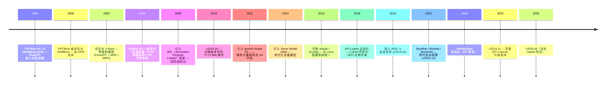
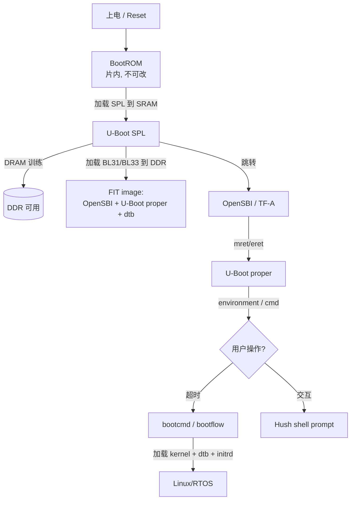
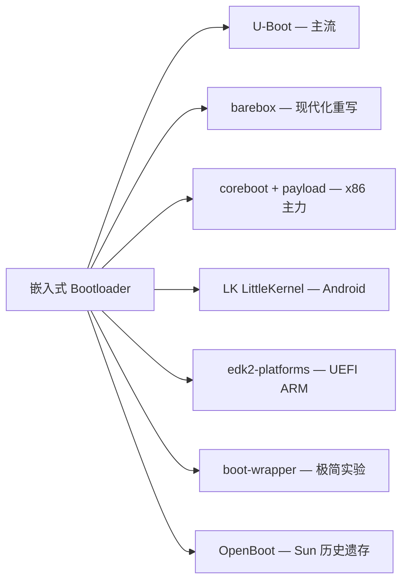

# 03-06 — U-Boot 全局总揽 → SPL / proper / dm / cmd / env / dts / FIT 逐层细化

> **核心问题：** U-Boot 这个 25 年项目（1999 至今）做了什么、怎么组织的？为什么 RISC-V 启动链上几乎离不开它？
>
> **一句话答案：** U-Boot 是嵌入式系统的"BIOS + Bootloader 二合一"，由 **SPL**（早期硬件初始化）和 **U-Boot proper**（交互式 bootloader）组成两阶段流水线，外加 driver model / 命令行 / 环境变量 / 设备树 / FIT 镜像 / 启动方法（bootflow）等若干基础设施。

- [03-03](03-03-fdt-dts-boot-flow.md) — FDT 在 boot 链中的传递（U-Boot 把 FIT.itb 解析后 `a1=&dtb` 传给 SBI）
- [03-02](03-02-boot-overview.md) — boot 层概览（U-Boot 在 BIOS/UEFI/SBI 派系中的位置）

---

## 1. 顶层视野：U-Boot 是什么、由谁组成

### 1.1 项目身份

```
官方仓库       https://source.denx.de/u-boot/u-boot
镜像仓库       https://github.com/u-boot/u-boot
本地路径       /home/heke/tgln/stage2/material/boot/u-boot/
首次发布       1999 (PPCBoot → U-Boot)
作者           Wolfgang Denk (DENX Software Engineering)
许可证         GPL-2.0+
当前 master 行数   约 200 万行 C / asm / Make / Kconfig / dts
活跃度         每月 100+ 提交，每两个月一个 release（v2025.04, v2025.10, ...）
```

### 1.2 顶层目录速查

```
u-boot/
├── README             ← 项目自述（一定先读 1500 行）
├── Makefile           ← Kbuild-style 主入口（2887 行）
├── Kconfig            ← 配置树根
├── Kbuild             ← Kbuild 规则
├── config.mk          ← 编译设置（CFLAGS / LDFLAGS）
│
├── arch/              ← 各架构 backend
│   ├── riscv/         ← RISC-V 移植
│   ├── arm/           ← ARM (Linux 用 U-Boot 最多的架构)
│   ├── x86/           ← coreboot payload 模式
│   ├── mips/, ppc/, sandbox/, sh/, ...
│
├── board/             ← 板级文件夹（公司/SoC/board）
│   ├── sifive/         ← SiFive Unmatched + Unleashed
│   ├── starfive/       ← VisionFive 1/2
│   ├── allwinner/      ← Sun20i (D1 Nezha) 等
│   ├── microchip/      ← MPFS Icicle 等
│   ├── ...100+ 厂商目录
│
├── configs/           ← 1500+ 个 *_defconfig 文件
│   ├── qemu-riscv64_smode_defconfig    ← QEMU virt + OpenSBI
│   ├── sifive_unmatched_defconfig
│   ├── visionfive2_defconfig
│   └── ...
│
├── common/            ← 跨架构公共代码
│   ├── spl/           ← SPL 框架（spl.c / spl_fit.c / spl_atf.c）
│   ├── command.c      ← 命令注册 + 解析
│   ├── env_*.c        ← 环境变量后端
│   ├── ...
│
├── cmd/               ← 所有内置命令实现
│   ├── bootm.c, booti.c, bootefi.c, ...     ← boot 系列
│   ├── load.c, save.c, mmc.c, nvme.c, ...   ← I/O 系列
│   ├── env.c, gpio.c, i2c.c, ...            ← 杂项
│   └── 几百个 .c
│
├── boot/              ← bootflow / bootm / FIT 解析
│   ├── bootflow.c     ← 现代启动管理（替代旧 bootcmd）
│   ├── bootm.c        ← Legacy multi-image boot
│   ├── boot_fit.c     ← FIT 镜像解析
│   ├── image-fit.c    ← FIT image 子系统
│   ├── pxe_utils.c    ← PXE / iPXE 网络启动
│   ├── ...
│
├── drivers/           ← driver model (DM) + 各类设备驱动
│   ├── core/          ← DM 核心（uclass, device, probe）
│   ├── serial/        ← UART driver
│   ├── mmc/, mtd/, nvme/, gpio/, i2c/, spi/, net/, ...
│   ├── 几百个子目录
│
├── dts/               ← 设备树编译规则（不是 .dts 源）
├── doc/               ← 文档（Sphinx，含 README.md 风格 + ReST）
│   ├── usage/         ← 用户手册
│   ├── develop/       ← 开发者指南
│   ├── arch/, board/, device-tree-bindings/
│
├── env/               ← env 后端实现（spi flash / mmc / fat / ext4）
├── fs/                ← 文件系统驱动（fat, ext2/4, btrfs, sandbox)
├── include/           ← 公共头文件
├── lib/               ← 库（libfdt, hash, crypto, rsa, qsort, ...）
├── net/               ← 网络栈（DHCP, TFTP, NFS, HTTPS）
├── tools/             ← Host-side 工具（mkimage, dtoc, kwbimage, ...）
├── post/              ← Power-On Self-Test 框架
├── disk/              ← 分区表（MBR, GPT, EFI）
├── api/               ← Externally callable API（让 Linux 调 U-Boot）
└── test/              ← 单元测试 + dm-test
```

### 1.3 设计风格

- **C 语言 + GNU 风格**（不是 Linux Coding Style，但接近——注释、缩进、命名）
- **Kbuild 复用**：U-Boot 的 Makefile/Kconfig 直接 fork 自 Linux，所以 `make menuconfig`、`make defconfig` 这些命令一模一样
- **driver model (DM)**：driver 模型 2014 年从零写的，比 Linux 简化（无 bus_type 抽象）
- **设备树驱动**：U-Boot 的所有外设都通过 dts 配置（与 Linux 共享 dts 源文件）
- **每个 .c 都可以是独立 cmd**：`cmd/foo.c` 自动注册 `foo` 命令到 prompt 输入（macro magic）

### 1.4 发展历史



#### 关键里程碑解读

**1999–2002 — 起源于 PowerPC**
Wolfgang Denk（DENX 公司创始人）写了 PPCBoot，专为 PowerPC 嵌入式系统设计。当时 ARM 嵌入式市场刚起步，每家公司都有自己的 bootloader（私有、不可移植）。PPCBoot 选 GPL，提供"开源、可移植"的替代品。

**2002 — 合并为 U-Boot**
"Universal Boot Loader"。统一 PPCBoot + ARMBoot 代码库，实现跨架构。从此 U-Boot 成为嵌入式 Linux 的事实标准 bootloader。

**2008 — SPL 引入**
随着 SoC 集成度增加（DDR 控制器、各种 IP），bootloader 自身变大；但片内 SRAM 容量没增长。"两阶段"启动成为必需。SPL 框架是这个时代的产物。

**2010.06 — 版本号变革**
之前是 1.x.y 三位号，发布频率不规律。改成 YYYY.MM（每两个月一个 release：04, 07, 10, 01）。这是 Linux 风格滚动 release 的版本号化体现。

**2014 — Driver Model**
之前 U-Boot 每个 driver 都是 ad-hoc 风格——结构体散落、init 顺序靠静态调用列表手工维护。DM 引入了 uclass / udevice / driver 三级抽象，与 Linux device model 神似但简化（无 bus_type）。十年间逐步把所有旧 driver 迁移到 DM——目前仍有少量 legacy driver 用 `compatible_legacy` 标记。

**2015 — Kbuild / Kconfig**
之前 U-Boot 用 `include/configs/<board>.h` 一个 header 文件配置所有 macro（"老式 BSP"风格）。每板一个 header，散乱、易冲突。切到 Kconfig 后用 `defconfig` 表达，与 Linux 同源。但**至今仍有大量板的 `include/configs/<board>.h` 未完全迁移**（叫 ".h conversion debt"），是老代码迁移的活化石。

**2018 — EFI Loader 主线**
U-Boot 反过来实现 UEFI 协议——可以把 U-Boot 作为"UEFI 应用环境"启动 EFI 应用（GRUB、Linux EFI stub、shim、systemd-boot）。这让"嵌入式 + 服务器"两个生态在 U-Boot 上汇合。

**2019 — RISC-V 主线**
SiFive HiFive Unleashed 量产引爆 RISC-V 嵌入式生态。U-Boot 加入 `arch/riscv/`，从 fu540 SoC 起步。

**2022 — Bootflow 革命** ⭐

#### 痛点：distro_bootcmd 这条 shell 脚本走到尽头

2017 年起的 **`distro_bootcmd`** 是 U-Boot 自家"通用 distro 启动协议"，本质是一坨 env 脚本。**实际长度**（典型 ARM/RISC-V SBC）：

```bash
# 节选典型 distro_bootcmd 风格脚本（实际更长，约 400 行 env script）
boot_targets=mmc0 mmc1 usb0 pxe dhcp

bootcmd=run distro_bootcmd

distro_bootcmd=
    scsi_need_init=;
    setenv nvme_need_init;
    for target in ${boot_targets};
    do
        run bootcmd_${target};
    done

bootcmd_mmc0=
    setenv devnum 0;
    run mmc_boot

mmc_boot=
    if mmc dev ${devnum}; then
        setenv devtype mmc;
        run scan_dev_for_boot_part;
    fi

scan_dev_for_boot_part=
    part list ${devtype} ${devnum} -bootable devplist;
    env exists devplist || setenv devplist 1;
    for distro_bootpart in ${devplist};
    do
        if fstype ${devtype} ${devnum}:${distro_bootpart} bootfstype;
        then
            run scan_dev_for_boot;
        fi;
    done;
    setenv devplist

scan_dev_for_boot=
    echo Scanning ${devtype} ${devnum}:${distro_bootpart}...;
    for prefix in ${boot_prefixes}; do
        run scan_dev_for_extlinux;
        run scan_dev_for_scripts;
    done;

scan_dev_for_extlinux=
    if test -e ${devtype} ${devnum}:${distro_bootpart} ${prefix}extlinux/extlinux.conf;
    then
        echo Found ${prefix}extlinux/extlinux.conf;
        run boot_extlinux;
        echo SCRIPT FAILED: continuing...;
    fi
... （后面还有 200+ 行 env 变量）
```

**6 个具体痛点**：

| # | 痛点 | 具体表现 |
|---|------|---------|
| 1 | **代码即字符串** | env script 是 shell-like 字符串，**无类型检查、无编译期错误**——拼错变量运行时才发现 |
| 2 | **占 env 空间巨大** | `printenv` 看 distro_bootcmd 输出几千字符，env 区（典型 16 KB-64 KB）被占用 30%+ |
| 3 | **跨板复制粘贴** | 每板的 boot_targets 不一样，distro_bootcmd 在 `include/config_distro_bootcmd.h` 里 `#define`，板子 `.h` 文件 `#include`——板间小差异要写一堆 `#ifdef` |
| 4 | **新启动方式难加** | 想加新启动方式（如新 fs / 新协议），要改这个 400 行 shell 脚本——容易破坏其他板 |
| 5 | **不能动态发现** | 启动方式硬编码在 boot_targets，新插的 USB 设备 / 新挂的 SD 卡需重启或手敲命令 |
| 6 | **调试困难** | 启动失败只能 `echo` 打印，不能 set breakpoint / dump 状态 |

#### 解药：bootstd / bootflow / bootmeth 三层 C 实现

2022 年（v2022.04）U-Boot 引入 **bootstd**（boot standard）框架，把"启动协议"从 env 脚本搬到 C 代码 + Driver Model。

**三层抽象**（核心创新）：

```
┌─────────────────────────────────────────────────┐
│ bootflow (一次启动尝试，bootmeth × bootdev 组合)│
│   ── boot/bootflow.c                            │
└──────────────┬───────────────────┬──────────────┘
               │                   │
        ┌──────▼──────┐     ┌──────▼──────┐
        │ bootmeth    │     │ bootdev     │
        │ 启动方法    │ ←→  │ 启动设备    │
        └─────────────┘     └─────────────┘
```

| 概念 | 含义 | 对比 |
|------|------|------|
| **bootdev** | 启动设备（mmc0 / usb0 / pxe / dhcp / nvme0 / sata0 / ...） | "在哪儿找 boot 文件" |
| **bootmeth** | 启动方法（extlinux / pxelinux / efi / android / cros / qfw / rauc / script / sandbox） | "怎么解析 boot 配置" |
| **bootflow** | bootmeth × bootdev 的笛卡尔积，每一对组合是一次尝试 | "试一下：mmc0 上有 extlinux.conf 吗？" |

#### bootmeth 全清单（U-Boot 2026.04）

| bootmeth | 何时用 | 配置文件 |
|----------|--------|---------|
| **extlinux** | 标准 Linux distro（Debian / Fedora / Ubuntu / Arch / OpenSUSE） | `/boot/extlinux/extlinux.conf` |
| **pxelinux** | PXE 网络启动（同 syslinux 风） | TFTP `pxelinux.cfg/<MAC>` |
| **efi** | UEFI Boot Manager / shim / grub.efi | EFI Boot#### NVRAM variable |
| **android** | Android boot.img 格式 | Android `boot.img` magic |
| **cros** | Chrome OS 验证启动 | Chrome OS partition 头 |
| **qfw** | QEMU firmware-config | QEMU `-fw_cfg` 接口 |
| **rauc** | RAUC A/B 升级框架 | RAUC bundle |
| **script** | 老式 boot.scr 脚本 | `boot.scr` mkimage 包装的 env script |
| **sandbox** | sandbox 测试 | host fs |
| **vbe** | Verified Boot for Embedded | VBE manifest |

#### 用法（命令对照）

| 旧 distro_bootcmd | 新 bootflow |
|------------------|------------|
| `run distro_bootcmd` （执行全部硬编码尝试） | `bootflow scan -lb` （扫描所有可启动项） |
| `printenv boot_targets` | `bootflow list` （列出找到的 bootflow） |
| `run bootcmd_mmc0` | `bootflow boot 0` （启动第一个） |
| 改 boot 顺序：`setenv boot_targets ...` | DT 配置 / `bootmeth order ...` |

#### 与 systemd-boot / EFI Boot Manager 类比

bootstd 设计哲学**直接学 UEFI Boot Manager + systemd-boot**：

| 项 | UEFI Boot Manager | systemd-boot | U-Boot bootstd |
|----|------------------|--------------|----------------|
| 启动条目从哪来 | NVRAM `Boot####` 变量 | `/boot/loader/entries/*.conf` 文件 | bootflow 扫 bootdev 自动发现 |
| 协议层 | EFI Loaded Image Protocol | UEFI 应用 (loader.efi) | bootmeth driver |
| 设备层 | EFI_BLOCK_IO / EFI_SIMPLE_FILE_SYSTEM | UEFI fs | bootdev driver (DM) |
| 用户面 | UEFI Setup / `efibootmgr` | `bootctl` | `bootflow scan/list/boot` |

#### 实例：从 distro_bootcmd 迁移到 bootflow

旧 env（节选 100 行）：
```bash
boot_targets=mmc0 mmc1 usb0 pxe
distro_bootcmd=for target in ${boot_targets}; do run bootcmd_${target}; done
bootcmd_mmc0=...
... (95 more lines)
```

新 DT 配置（10 行）：
```dts
/ {
    bootstd {
        compatible = "u-boot,boot-std";
        bootph-some-ram;

        bootmeth-order = "extlinux", "efi", "pxe";
        bootdev-order = "mmc0", "mmc1", "usb0";
    };
};
```

加上 `CONFIG_BOOTSTD_DEFAULTS=y`（v2024+ 默认开），启动后自动跑 `bootflow scan` —— **无需任何 env 脚本**。

#### bootflow 数据结构（C 实现，对照 shell 脚本看清晰多）

```c
// include/bootflow.h
struct bootflow {
    struct list_head bm_node;          // 链表挂在 bootmeth 上
    struct udevice *dev;               // 哪个 bootdev
    struct udevice *bootmeth;          // 哪个 bootmeth
    int part;                          // 分区号
    const char *fs_type;               // fs 类型字符串
    const char *fname;                 // 配置文件名
    char *buf;                         // 配置文件内容
    int size;
    int state;                         // 状态机
    char *name;                        // 显示名
    char *os_name;                     // OS 名
    char *cmdline;                     // 内核 cmdline
    void *bflags;                      // bootmeth 私有数据
    ...
};

enum bootflow_state {
    BOOTFLOWST_BASE,    // 初始
    BOOTFLOWST_MEDIA,   // 介质就绪
    BOOTFLOWST_PART,    // 分区识别
    BOOTFLOWST_FS,      // fs 识别
    BOOTFLOWST_FILE,    // 文件读取
    BOOTFLOWST_READY,   // 准备好启动
    BOOTFLOWST_BOOTED,  // 已启动
};
```

**对照 shell**：旧 distro_bootcmd 把这些状态全藏在 env 变量名约定里（`devtype` / `devnum` / `distro_bootpart` / ...），bootflow 改成显式 struct + 状态机，**可调试可单测**。

#### 时间线（distro_bootcmd → bootflow 的迁移）

| 版本 | 事件 |
|------|------|
| v2017.01 | distro_bootcmd 引入（统一 distro 启动） |
| v2022.04 | **bootstd / bootflow / bootmeth 引入**（C 实现并存） |
| v2023.01 | bootstd 默认开启可选 |
| v2024.04 | **distro_bootcmd 标记 deprecated**（新板子推荐用 bootstd） |
| v2024.10 | `CONFIG_BOOTSTD_DEFAULTS=y` 默认 |
| v2026 | distro_bootcmd 仍可用（兼容老板），但 mainline 板都用 bootstd |

#### KuBoot 借鉴

- ✅ **直接抄 bootstd 三层模型**（bootmeth / bootdev / bootflow）
- ✅ Zig comptime 生成 bootmeth 列表（替 DM 注册）
- ✅ 状态机用 Zig enum + tagged union（比 C 更安全）
- ❌ **不抄 distro_bootcmd 老式 env script**（KuBoot 一开始就 C++DM 风，没历史包袱）

详见 [03-08 § 6 bootstd](03-08-uboot-develop-manual.md#6-bootstd--新一代-distro-启动框架docdevelopbootstd) + [03-07 § 3.4 bootflow 用法](03-07-uboot-usage-manual.md#34-bootflow--bootstd新一代启动协议2022)。

### 1.5 版本演化（近 10 年技术亮点）

| 版本 | 年份 | 重大变化 |
|------|------|---------|
| v2014.10 | 2014 | Driver Model 引入 |
| v2015.04 | 2015 | Kconfig 切换 |
| v2017.01 | 2017 | Distro defaults 引入（`distro_bootcmd`）|
| v2018.05 | 2018 | EFI loader 主线化 |
| v2019.04 | 2019 | **RISC-V 支持** |
| v2020.01 | 2020 | UEFI Secure Boot 实现 |
| v2021.04 | 2021 | bloblist / spl_handoff 标准化 |
| v2022.04 | 2022 | bootstd / bootflow / bootmeth 引入 |
| v2023.01 | 2023 | Verified Boot 完整 |
| v2024.04 | 2024 | EFI capsule 在线升级 |
| v2025.04 | 2025 | Latest（笔记成文时） |

每个 release 含 ~1500 commits，日志在 `git log v2024.10..v2025.01` 看。

### 1.6 跨产业部署

U-Boot 装机量远超表面看到的——几乎每个跑 Linux 的嵌入式产品后面都有 U-Boot：

- **网络设备**：Cisco、华为、TP-Link、小米路由器
- **机顶盒**：Hisilicon、Amlogic 平台几乎全部
- **车机 / IVI**：Qualcomm 8155、NXP i.MX8、Renesas R-Car
- **工控 / PLC**：BeagleBone、industrial Pi 板大量采用
- **SBC / Maker**：Raspberry Pi（虽然 Pi 自家也有 boot stage，但常见 Pi 用 U-Boot 跳到 Linux）、Banana Pi、Orange Pi、StarFive VisionFive、SiFive Unmatched
- **嵌入式 RTOS**：FreeRTOS / Zephyr 设备很多用 U-Boot 作 first-stage

每个产品都有定制——所以"U-Boot 板支持"是一个庞大且持续维护的社区工作。详见 § 6.4。

---

## 2. 双阶段启动流水线：SPL + U-Boot proper



### 2.1 SPL 是什么

**Secondary Program Loader** — 一个**精简版 U-Boot**，几十 KB（典型 64KB 上限），跑在 SoC 内置 SRAM 中。原因：

- BootROM 容量太小（4-32KB），装不下 DRAM 训练 + 加载逻辑
- 但 BootROM 不能改（mask ROM 烧死）
- 所以 BootROM 加载 SPL → SPL 在 SRAM 跑 → SPL 训练 DRAM → SPL 加载完整 U-Boot

SPL 的核心责任：**让 DRAM 可用，把"真正的 bootloader"加载到 DRAM**。

### 2.2 U-Boot proper 是什么

完整功能的 bootloader：交互式命令行、环境变量、网络栈、文件系统、加密验证。SPL 加载它到 DRAM 后，OS 启动前的最后一段固件。

在 RISC-V 上，proper 跑在 **S-mode**（被 SBI 切下来的特权级）。proper 不需要再做硬件初始化（SPL 已做完），它只负责"找到 OS 镜像，构造 boot args，跳转"。

### 2.3 SPL 与 proper 的对比

| 维度 | SPL | U-Boot proper |
|------|-----|---------------|
| 大小 | ≤ 64 KB | 几 MB |
| 跑在哪 | SRAM | DRAM |
| 时机 | DRAM 未就绪 | DRAM 已就绪 |
| 特权级（RISC-V）| M-mode | S-mode |
| 功能 | DRAM 训练 + FIT 加载 + jump | 命令行 + env + 文件系统 + 网络 + 加载 OS |
| 配置 | `<board>_spl_defconfig` | `<board>_defconfig`（同名根） |
| 可选 | 是（小型 SoC 可省 SPL） | 否（除非 SPL 直接 chain-load OS）|

**注意：** 不是所有 SoC 都需要 SPL。x86 通常用 coreboot 替代。一些没有外部 DRAM 的 MCU 直接从 BootROM 跳到 U-Boot proper（DRAM 训练不需要）。

### 2.4 RISC-V 启动序列具体例子（SiFive HiFive Unmatched）

```
0. 上电
   ├── 5V 供电
   ├── PMU 初始化
   └── CPU clock 锁相

1. ZSBL（片内 ROM, ~4KB）
   ├── 读 hartid，非 boot hart 进 wfi
   ├── 检测 boot mode（GPIO 跳线 → SD/SPI/I2C/USB）
   └── 加载 FSBL = U-Boot SPL 到 SRAM (L2 cache as RAM)
       从 GPT 分区中名为 "uboot-spl" 的分区读取

2. U-Boot SPL（SRAM, 64KB）
   ├── 串口初始化（low-level UART）
   ├── DDR4 controller 寄存器配置
   ├── DDR PHY 训练（10+ 步骤）
   ├── 读 GPT 找名为 "uboot" 的分区 = FIT image (uboot.itb)
   ├── 解析 FIT
   │   ├── BL31 = OpenSBI fw_dynamic.bin → 加载到 0x80000000
   │   ├── BL33 = U-Boot proper → 加载到 0x80200000
   │   └── FDT  = device tree → 加载到 0x82200000
   └── 跳到 BL31 入口

3. OpenSBI (M-mode @ 0x80000000)
   ├── 设置 mtvec / medeleg / mideleg
   ├── PMP 配置（保护 OpenSBI 自己的内存）
   ├── 把自己注册为 fw_dynamic next stage = U-Boot proper
   └── mret → S-mode @ 0x80200000，a1 = fdt

4. U-Boot proper (S-mode @ 0x80200000)
   ├── relocate 自己到 DRAM 高地址
   ├── 初始化 driver model：发现 mmc, sd, nvme, network
   ├── 加载 environment（从 SPI flash 或 mmc partition）
   ├── 解析 bootcmd → 默认 "run distro_bootcmd"
   ├── distro_bootcmd 扫描 boot devices → 找 EFI app / extlinux.conf / boot.scr
   ├── 加载 kernel + initrd + dtb
   ├── booti / bootm / bootefi → 取决于 image 类型
   └── 跳到 Linux

5. Linux (S-mode)
```

整个过程从上电到 Linux login 大约 5-10 秒。

### 2.5 编译产物清单（一次 `make` 出哪些东西）

SPL 和 proper 是**同一份 u-boot 仓库源码、一次 `make` 同时编出**——通过 Kconfig `CONFIG_SPL=y` 启用 SPL，构建系统会同时跑两轮编译（一轮带 `CONFIG_SPL_BUILD=y` 编 SPL，一轮编 proper）。

```
u-boot/                                    # make 后产生
│
├── spl/                                   # ─── SPL 阶段产物 ───
│   ├── u-boot-spl                         # SPL ELF（带符号，调试用）
│   ├── u-boot-spl.bin                     # SPL stripped binary（QEMU `-bios` 用）
│   ├── u-boot-spl.dtb                     # SPL 用的 dtb（精简版）
│   ├── u-boot-spl.map                     # 链接 map
│   └── u-boot-spl-nodtb.bin               # 不带 dtb 的版本
│
├── u-boot                                 # ─── proper 阶段产物 ───
├── u-boot.bin                             # proper raw binary
├── u-boot-nodtb.bin                       # proper 不带 dtb
├── u-boot.dtb                             # proper 用的完整 dtb
├── u-boot.map                             # proper 链接 map
│
├── u-boot.itb                             # ─── FIT 镜像（SPL 加载的目标）───
│                                            包含 ① OpenSBI/RustSBI ② proper ③ dtb
│                                            是 SPL 启动后实际加载的"复合 image"
│
├── u-boot-with-spl.bin                    # ─── 二合一 binary（部分板用）───
│                                            SPL + proper 拼一起，烧到 SD 卡 / SPI flash
│                                            真硬件常用，QEMU 教程用 .itb
│
├── u-boot.img                             # 早期格式（带 mkimage header）
├── tools/                                 # 编译工具（mkimage, dumpimage, fit_check_sign）
└── ...
```

**配置区分**：

| Kconfig 选项 | 控制对象 | 示例 |
|--------------|----------|------|
| `CONFIG_SPL=y` | 启用 SPL 第二阶段编译 | qemu_riscv64_smode_defconfig |
| `CONFIG_SPL_*` | 仅在 SPL 镜像生效（裁剪用）| `CONFIG_SPL_MMC_SUPPORT=y` |
| 无 `_SPL_` 前缀 | proper 用 | `CONFIG_CMD_DHCP=y`（SPL 不需要 dhcp）|
| `CONFIG_SPL_TEXT_BASE=0x08000000` | SPL 链接地址（SRAM）| 真硬件 |
| `CONFIG_SYS_TEXT_BASE=0x80200000` | proper 链接地址（DRAM）| 同 OpenSBI 接力点 |

**一次 `make` 实际跑两轮**：

```bash
$ make qemu_riscv64_smode_defconfig
$ make -j$(nproc)
   CC      common/init/board_init.o          # proper 阶段
   ...
   CC      spl/common/init/board_init.o      # SPL 阶段（同源文件，不同编译标志）
   LD      spl/u-boot-spl
   OBJCOPY spl/u-boot-spl.bin
   LD      u-boot
   OBJCOPY u-boot.bin
   MKIMAGE u-boot.itb                        # 把 OpenSBI/proper/dtb 打包成 FIT
```

**SPL 和 proper 共享的源码** 通过 `#ifdef CONFIG_SPL_BUILD` 区分行为：

```c
// common/init/board_init.c
int board_early_init_f(void)
{
#ifdef CONFIG_SPL_BUILD
    // SPL 才跑：DRAM 训练
    return ddr_init();
#else
    // proper 才跑：driver model 启动
    return dm_init();
#endif
}
```

大部分文件 SPL 和 proper 共用，体积裁剪靠选项控制（SPL 不编 USB/网络/加密这些功能）。

---

## 3. SPL 深入

> **源码级精读已迁出：** 本节是概览版，源码层（reset → C 主链 → FIT 加载 → DDR 训练源码组织 → 链接脚本 → Kconfig） 见 [**03-10 — U-Boot SPL 源码精读**](03-10-u-boot-spl-source-walkthrough.md)（1546 行，逐文件逐行号）。本节保留作为入口和 DRAM 训练原理（§3.3）—— 训练原理与具体源码组织属于不同层次，原理放本笔记便于跨实现迁移到 KuBoot DDR 控制层。

### 3.1 SPL 框架代码

```
common/spl/
├── spl.c              ← SPL 主入口（board_init_r → spl_board_init → boot_from_devices）
├── spl_fit.c          ← FIT image 解析（核心！）
├── spl_atf.c          ← BL31 (TF-A / OpenSBI) handoff
├── spl_legacy.c       ← Legacy uImage 格式
├── spl_blk_fs.c       ← 通用块设备 + 文件系统加载
├── spl_fat.c, spl_ext.c  ← 特定文件系统
├── spl_mmc.c, spl_nvme.c, spl_nor.c, spl_spi.c, spl_usb.c, spl_net.c
└── ...
```

### 3.2 SPL 启动函数链

```c
// 简化版 — 实际有 board-specific weak overrides
void board_init_f(ulong dummy) {
    // F = first-stage SRAM init
    // 1. setup CPU stack
    // 2. dram_init() — 这里做 DDR 训练
    // 3. setup global data (gd) struct
    spl_board_init();
    board_init_r(NULL, 0);   // never returns
}

void board_init_r(gd_t *gd, ulong dummy) {
    // R = relocated (in DRAM)
    spl_board_init_r();
    boot_from_devices(spl_image_loaders);
    // ↓ 找到匹配的 device，调用其 .load_image()
    spl_perform_fixups(&spl_image);
    jump_to_image(&spl_image);   // jr to BL31 entry
}
```

`spl_image_loaders[]` 是个静态数组，按优先级列出：MMC → SPI → NOR → USB → NET。每个 loader 检查自己的设备是否有有效 image，找到就 load。

### 3.3 DRAM 训练（最重要、最难）

> **概念入门：** 00-02 § Layer 2.1 已经讲了"训练 ≠ 加载"+ 高层物理本质 + DDR4 8 步序列。本节深入工程层面（实际代码 / 寄存器 / 厂商 IP / 调参方法）。

#### 3.3.1 SPL 中的 DRAM 训练代码量与组织

绝大多数 SPL 代码量都在这里。例子：HiFive Unmatched 的 FU740 SoC 有 1500+ 行 DDR 训练代码：

```
arch/riscv/cpu/fu740/dram.c
arch/riscv/cpu/fu740/spl.c
board/sifive/unmatched/spl.c
drivers/ram/sifive/sifive_ddr.c       ← Cadence DDR controller registers
drivers/ddr/microchip/...              ← MPFS 用 Microsemi 控制器
```

DDR 训练**几乎全是寄存器写入序列**。看起来像这样：

```c
static void dram_phy_init(void) {
    writel(0x00000001, DDR_PHY_CALR);
    udelay(100);
    writel(BIT(0) | BIT(1), DDR_PHY_DCR);
    while (!(readl(DDR_PHY_PGSR0) & BIT(0)));   // wait for init done
    
    writel(0x12345678, DDR_PHY_DTPR0);           // 时序参数
    writel(0xabcdef01, DDR_PHY_DTPR1);
    
    writel(BIT(2), DDR_PHY_PIR);                  // start ZQ calibration
    while (!(readl(DDR_PHY_PGSR0) & BIT(2)));    // wait
    
    // ... 10 more steps ...
    
    writel(BIT(7), DDR_PHY_PIR);                  // start write leveling
    if (readl(DDR_PHY_PGSR0) & TRAINING_FAIL_MASK)
        printf("Write leveling failed\n");
    
    // ... etc ...
}
```

#### 3.3.2 SPL 完整 DRAM 训练流水线（从 SPL 进入到训练完成）

按 SPL 真实执行顺序：

```
[1] SPL 入口（来自 ZSBL 跳转，DRAM 还不能用）
       ↓
[2] dram_init() 调用 — 通常在 board_init_f() 早期
       ↓
[3] DDR 控制器上电 + 时钟使能
       ├─ pmc_setup_clocks()        启用 DDR PHY/Controller 时钟
       ├─ pmc_release_reset()        释放 DDR PHY reset 信号
       └─ udelay(100)                等 PLL 稳定
       ↓
[4] DDR 控制器配置（编程 timing 参数 + DRAM 几何）
       ├─ writel(DDRCTL_TRP, 0x...)   tRP / tRAS / tCL / tCWL 等 ~30 个时序
       ├─ writel(DDRCTL_GEOM, 0x...)  bank/row/col 数 + 总线宽度
       └─ writel(DDRCTL_REFRESH, ..)  自刷新参数
       ↓
[5] DDR 颗粒上电序列（JEDEC 规定）
       ├─ 拉 RESET#                   颗粒进 reset
       ├─ 等 200 us
       ├─ 释放 RESET#
       ├─ 设 CKE=1                    时钟使能
       ├─ MRS 命令序列                写 Mode Register MR0/MR1/MR2/MR3/MR4/MR5/MR6
       └─ ZQCL                         发起初始 ZQ calibration（终端电阻校准）
       ↓
[6] 启动 PHY 训练序列（依次执行，失败任何一步整体重试）
       ├─ ① CA Training              Command/Address bus 时序
       ├─ ② Write Leveling           DQS 与 CK 对齐
       ├─ ③ MPR Read                  通过 mode pattern register 测 DQ 偏移
       ├─ ④ Read DQ Training         扫各 DQ 找读窗口中心
       ├─ ⑤ Write DQ Training        扫各 DQ 找写窗口中心
       ├─ ⑥ Read/Write Data Eye      综合眼图收敛
       ├─ ⑦ VREF Training            找最佳参考电压
       └─ ⑧ DBI / CRC Training       DDR4+ 才有
       ↓
[7] 训练通过 → 写终值到 DDR PHY 寄存器（持久生效）
       ├─ 关闭 training mode
       ├─ 进入 normal operation mode
       └─ 启用 DDR 自动刷新（auto-refresh on）
       ↓
[8] 内存通了 → SPL memtest（可选，简单写读校验）
       └─ 写 0xAAAAAAAA / 0x55555555 / 0xDEADBEEF 到几个地址，回读对照
       ↓
[9] dram_init() 返回 → SPL 继续：复制 BSS / 初始化 malloc / 加载 FIT
```

**关键：每步训练都是"扫一组参数 → 测能否正确收发 → 收敛"**，不是简单写一个固定值。

#### 3.3.3 训练步骤详解（每步做什么）

**① CA Training (Command/Address)**
- DDR4 引入。早期 DDR3 没这步
- 控制器发各种 CMD 序列，用 DRAM 内部 lookup 验证
- 找到 CA bus 时序范围中心
- 失败原因：PCB CA 走线长度差异过大 / 阻抗不匹配

**② Write Leveling**
- **目的：让控制器送出的每根 DQS 与 CK 时钟对齐**（fly-by topology 中 CK 到不同 DRAM 颗粒延迟不同）
- 控制器扫描 DQS 延迟 0-360°
- DRAM 报告"DQS 与 CK 对齐"位置
- 写回 PHY 的"DQS skew" 寄存器
- 经典代码：`dwc_ddrphy_write_leveling()` ~200 行

**③ MPR Read (Multi-Purpose Register)**
- 用 DRAM 内置 MPR（含已知模式：0xAA, 0x55, 0xCC...）
- 不依赖外部测试图样
- 测 DQ 信号的初始偏移

**④ Read DQ Training (Per-DQ deskew)**
- 每根 DQ 信号独立校准
- 控制器扫 DQ 延迟（典型 64 step），看每 step 读出的数据是否正确
- 找出"误码率为 0 的窗口"边界（左 / 右 eye edge）
- 取窗口中心 = `(left + right) / 2`
- 写到 PHY 的"per-DQ delay" 寄存器（数据手册叫 BDLR / DLR / DXNGTR 等）

**⑤ Write DQ Training (Per-DQ deskew, write 方向)**
- 反向，控制器扫描"什么时候发数据让 DRAM 收对"
- 算法类似 Read DQ Training

**⑥ Read/Write Data Eye Training**
- 综合检查整体 eye opening
- 多次迭代（先 read 后 write 反复几次）
- 收敛判断：连续 2-3 次结果一致

**⑦ VREF Training (DDR4+)**
- DRAM 接收端有个内部参考电压 VREF（决定"高/低"判断阈值）
- 早期 DDR3 用外部 VREF 引脚（板上 voltage divider）
- DDR4+ 内部 VREF + 可调
- 训练：扫 VREF 电压 0.6V-1.0V，每个电压做 read DQ test，找误码率最低点
- 大约 100 个电压 step

**⑧ DBI / CRC Training (DDR4+)**
- DBI = Data Bus Inversion，传输前反转字节减少同时切换信号数（降低 SSO 噪声）
- CRC = 数据 + CRC8 校验
- 都需要单独训练时序

#### 3.3.4 厂商 IP 与控制器结构

实际 SoC 上 DDR 系统由 3 个独立 IP 组成：

```
┌────────────────────────────────────────────┐
│  CPU 总线 (AXI / TileLink)                  │
└──────────┬─────────────────────────────────┘
           ↓
┌────────────────────────────────────────────┐
│  ① DDR Controller (DDRCTL)                  │
│     - 接收 CPU 内存读写请求                 │
│     - 排序 / 合并 / refresh 调度            │
│     - 与 PHY 通过 DFI 协议沟通              │
│     - 厂商：Cadence Denali / Synopsys uMCTL2│
│            Northwest Logic / 自研           │
└──────────┬─────────────────────────────────┘
           ↓ DFI (DDR PHY Interface) 标准协议
┌────────────────────────────────────────────┐
│  ② DDR PHY (物理层)                         │
│     - 时序对齐 + 训练                        │
│     - DQS gating                             │
│     - 终端电阻控制 (ODT)                    │
│     - VREF 生成                              │
│     - 厂商：Synopsys DWC_ddrphy / Cadence   │
│            CDN_PHY / Rambus / WD            │
└──────────┬─────────────────────────────────┘
           ↓ DDR4/5 物理引脚
┌────────────────────────────────────────────┐
│  ③ DRAM 颗粒（Micron / Samsung / SK Hynix /│
│             长鑫 CXMT 等）                  │
└────────────────────────────────────────────┘
```

**绝大多数训练发生在 ② DDR PHY 与 ③ DRAM 颗粒之间**。① Controller 主要负责训练完成后的日常请求调度。

**寄存器值的来源（NDA 是常态）：**

1. **DDR PHY IP 厂商提供初始化序列文档**（Cadence / Synopsys / Andes / Rambus）—— **绝大多数 NDA**，没法公开 git
2. **SoC 厂商 reference code**（SiFive / StarFive / Allwinner / Microchip 在 BSP 中提供训练代码）
3. **逆向 + 调整**（FOSS 社区有时候逆向 BSP 拿初始值，社区维护的训练代码常基于此）
4. **DRAM 厂商提供颗粒 datasheet + JEDEC 时序**（tRP / tRAS / tCL 这些标准时序参数）

#### 3.3.5 DDR3 → DDR4 → DDR5 训练复杂度演进

| 标准 | 训练步骤数 | SPL 代码量 | 关键新增 |
|------|----------|----------|---------|
| DDR3 | 2-3（read / write leveling）| ~几百行 | Write Leveling 是新概念 |
| DDR4 | 6-8 | ~1-3K 行 | + CA training / VREF / DBI / CRC |
| DDR5 | 10+ | ~5K+ 行 | **双层训练**：PHY-side + DRAM die-side |
| LPDDR4 | 8-10 | ~3K 行 | + CK divisor + boot freq |
| LPDDR5 | 数十 | ~5K+ 行 | + WCK + 大量功耗优化训练 |

#### 3.3.6 训练失败时的诊断

```c
if (readl(DDR_PHY_PGSR0) & TRAINING_FAIL_MASK) {
    // PGSR0 (PHY General Status Register 0) bit 报告每步训练失败
    if (status & WLERR)  printf("Write Leveling failed\n");
    if (status & QSGERR) printf("DQS Gating failed\n");
    if (status & WLAERR) printf("Write Leveling Adjust failed\n");
    if (status & RDERR)  printf("Read DQ training failed\n");
    if (status & WDERR)  printf("Write DQ training failed\n");
    if (status & REERR)  printf("Read Eye training failed\n");
    if (status & WEERR)  printf("Write Eye training failed\n");
    if (status & VTERR)  printf("VREF training failed\n");
    panic("DDR training failed");
}
```

**典型失败原因：**
- PCB 信号完整性差（trace 长度不平衡 / 阻抗不匹配）
- DRAM 颗粒坏（少见但发生）
- 电源 ripple 大（VDD 不稳）
- 时钟 PLL 锁失败
- 板厂 layout 时没遵守 DDR 设计规则（DRC violation）

调试工具：
- **示波器测 DQ/DQS 眼图**（确认信号质量）
- **逻辑分析仪 trace DDR 总线**（看时序是否对齐）
- **打开 SPL DDR debug log**（输出每步训练的扫描结果 + 收敛中心值）
- **降速跑**（DDR4 3200 跑不过，先试 2400/2133/1600）

#### 3.3.7 KuBoot DRAM 训练策略（远期）

KuBoot 实现 DRAM 训练时**不会自己写 controller 训练代码**——会用通用 DDR PHY IP 文档 + 实测调参。这是最大的工程难点。

**借鉴策略：**
1. **复用厂商 driver**：u-boot upstream 已有 SiFive / StarFive / Allwinner 的开源训练代码，KuBoot 直接拿
2. **支持 board-specific override**：`plats/<board>/dram.zig` 可以覆盖默认训练参数
3. **加 KuRingDRAM benchmark**：训练完后跑标准 memtest 验证稳定性
4. **运行时 retraining hook**（远期）：温度变化时重新训练（DDR5 支持，DDR4 部分支持）

### 3.4 FIT image 加载

SPL 加载的"下一阶段"通常是 FIT 镜像，里面打包了 OpenSBI + U-Boot proper + dtb。`common/spl/spl_fit.c` 解析逻辑：

```c
int spl_load_simple_fit(struct spl_image_info *spl_image,
                         struct spl_load_info *info,
                         ulong sector, void *fit) {
    // 1. 解析 FIT header（其实是 DTB header）
    int images_node = fdt_path_offset(fit, "/images");
    int conf_node = fdt_path_offset(fit, "/configurations");
    
    // 2. 找 default configuration
    const char *def = fdt_getprop(fit, conf_node, "default", NULL);
    int conf = fdt_subnode_offset(fit, conf_node, def);
    
    // 3. 读 conf 里指向的 firmware / kernel / fdt / loadables
    const char *fw_name = fdt_getprop(fit, conf, "firmware", NULL);
    const char *kernel_name = fdt_getprop(fit, conf, "kernel", NULL);
    const char *fdt_name = fdt_getprop(fit, conf, "fdt", NULL);
    
    // 4. 对每个 image，从 FIT 中提取 .data，验证签名（如配置）
    spl_load_fit_image(spl_image, info, sector, fit, fw_name);
    spl_load_fit_image(...kernel...);
    spl_load_fit_image(...fdt...);
    
    // 5. 设置跳转目标 = firmware (BL31)
    spl_image->entry_point = fw_image_load_addr;
    spl_image->next_stage_arg = bl33_image_load_addr;  // 给 BL31 的"下一段"参数
    return 0;
}
```

详见 [03-03](03-03-fdt-dts-boot-flow.md) § 4.3 的 FIT 格式说明。

### 3.5 SPL 配置：`<board>_spl_defconfig`

每个支持 SPL 的板子有两个 defconfig：

```
configs/sifive_unmatched_defconfig          ← U-Boot proper config
configs/sifive_unmatched_spl_defconfig      ← SPL config（如果存在）
```

实际情况：U-Boot 现在多数把 SPL config 合并到主 defconfig 里，由 `CONFIG_SPL=y` 启用。`make sifive_unmatched_defconfig` 同时编译 SPL 和 proper。

### 3.6 SPL 与 ATF / OpenSBI 的关系

`spl_atf.c` 提供 "SPL → BL31 (TF-A 或 OpenSBI) handoff" 的标准协议：

```c
typedef struct bl31_params {
    param_header_t h;
    image_info_t *bl31_image_info;
    entry_point_info_t *bl32_ep_info;     // OP-TEE
    image_info_t *bl32_image_info;
    entry_point_info_t *bl33_ep_info;     // U-Boot proper
    image_info_t *bl33_image_info;
} bl31_params_t;

// SPL 填充这个结构，作为 a0 传给 BL31
bl31_params->bl33_ep_info = {
    .pc = 0x80200000,             // U-Boot proper entry
    .spsr = SPSR_64(EL2, ...)     // ARM only
};
spl_invoke_atf(bl31_params);     // jr to BL31
```

RISC-V 上 OpenSBI 用 `fw_dynamic` 协议，类似但 RISC-V-specific：

```c
struct fw_dynamic_info {
    unsigned long magic;          // 0x4942534f
    unsigned long version;
    unsigned long next_addr;       // U-Boot proper
    unsigned long next_mode;       // PRV_S (S-mode)
    unsigned long options;
    unsigned long boot_hart;
};
```


---

## 4. U-Boot proper 深入

> **源码级精读已迁出：** 本节是概览版，源码层（_start → board_init_f → relocate_code → board_init_r → main_loop → 命令系统 → DM → env → FIT → booti） 见 [**03-11 — U-Boot proper 源码精读**](03-11-u-boot-proper-source-walkthrough.md)（1731 行，含 26 条 KuBoot 自造 checklist）。本节保留作为入口和 DM/Env/Bootflow 概念解释。

### 4.1 启动流程

```c
// arch/riscv/cpu/start.S — 设置 sp、清 BSS、call board_init_f
_start:
    // ... save a0, a1 (mhartid, fdt) ...
    csrr t0, mhartid
    li sp, CONFIG_TEXT_BASE - sizeof(gd_t) - 8
    // ...
    jal board_init_f_alloc_reserve
    jal board_init_f
    jal relocate_code           // copy self to high DRAM
    jal board_init_r            // r = relocated, in final DRAM location

// common/board_r.c
void board_init_r(gd_t *new_gd, ulong dest_addr) {
    init_fnc_t init_sequence_r[] = {
        initr_caches,
        initr_reloc_global_data,
        initr_dm,                  // driver model probe
        initr_dm_devices,
        ...
        run_main_loop,             // 进入命令循环
    };
    for (init = init_sequence_r; *init; init++)
        (*init)();
}

// common/main.c
void main_loop(void) {
    bootstage_mark_name(...);
    
    // 检查 bootdelay
    char *s = env_get("bootcmd");
    int delay = env_get_ulong("bootdelay", 10, ...);
    if (delay >= 0 && abortboot(delay) == false) {
        run_command(s, 0);          // 自动启动
    }
    
    // 没自启动 → 进 hush shell
    cli_loop();
}
```

### 4.2 命令循环（Hush shell）

`cli_simple.c` / `cli_hush.c` 实现两种 shell：

- **simple**：早期 U-Boot，只支持单命令、变量替换
- **hush**：1990s 起源的 Busybox shell port，支持 if/else、for、while、变量、子 shell

启动时进入 prompt：

```
U-Boot 2025.04 (Mar 30 2025 - 12:00:00)

CPU: RV64IMACFD generic
DRAM: 1 GiB
Loading Environment from MMC ... OK
Net: eth0: ethernet@10090000
Working FDT set to 87e00000
Hit any key to stop autoboot:  3 0
=> mmc list
mmc@10050000: 0 (eMMC)
mmc@10050000: 1 (SD)
=> ls mmc 1:1 /
            extlinux/
        Image
        u-boot.itb
=> setenv bootargs "console=ttyS0 root=/dev/mmcblk0p3 rw"
=> ext4load mmc 1:1 80200000 Image
20480000 bytes read in 1234 ms
=> booti 80200000 - 87e00000
```

每个命令是 `cmd/<name>.c`，通过 `U_BOOT_CMD()` 宏注册：

```c
// cmd/booti.c
U_BOOT_CMD(booti, CONFIG_SYS_MAXARGS, 1, do_booti,
    "boot Linux image (booti)",
    "<addr> [initrd[:size]] [<fdt>]\n"
    "    - boot Linux 'Image' format kernel ...");
```

### 4.3 Driver Model (DM)

U-Boot DM 是一个**简化的 Linux device model**：

```
uclass (类，如 SERIAL)
   ↓
udevice (实例，如 ns16550 串口实例)
   ↓
driver (代码，如 ns16550 driver)
```

每个 driver 声明：

```c
static const struct udevice_id ns16550_serial_ids[] = {
    { .compatible = "ns16550a" },
    { }
};

U_BOOT_DRIVER(ns16550_serial) = {
    .name = "ns16550_serial",
    .id = UCLASS_SERIAL,
    .of_match = ns16550_serial_ids,
    .probe = ns16550_serial_probe,
    .ops = &ns16550_serial_ops,
    .priv_auto = sizeof(struct ns16550),
};
```

启动时 `dm_init_and_scan()` 遍历设备树，对每个节点查 compatible，找到匹配的 driver，调 `.probe()`。

`drivers/core/` 是 DM 核心；`drivers/serial/`、`drivers/mmc/` 等是按 uclass 分的具体驱动。

### 4.4 Environment（环境变量）

类似 BIOS Setup 中的"启动顺序、超时、自定义命令"，U-Boot 持久化在：

- SPI flash（最常见，独立分区或 fixed offset）
- MMC partition / FAT file (`uboot.env`)
- NOR flash
- NVRAM

操作：

```
=> printenv                 # 列出所有变量
=> setenv bootcmd "run distro_bootcmd"
=> saveenv                  # 写回持久化存储
=> env default -a -f        # 重置为 defaults
=> env import ...           # 从二进制 / 文本导入
```

环境变量是 U-Boot 配置的核心——`bootcmd`、`bootargs`、`fdt_addr_r`、`kernel_addr_r` 都是变量。改变量 = 改启动行为，无需重新编译。

### 4.5 设备树集成

U-Boot 内嵌 dtb（编译时打包），运行时也接受外部 dtb（FIT image 或 `fdt addr` 命令指定）。两套：

- **U-Boot 自己的 dtb**（`u-boot.dtb`）— 给 U-Boot DM 用，描述 U-Boot 看见的硬件
- **OS 用的 dtb**（FIT 中或独立加载）— 传给 Linux

通常两者源自同一份 `.dts` 但有 `u-boot.dtsi` overlay 加 U-Boot 特定属性（`u-boot,dm-pre-reloc` 等）。

`fdt` 命令行：
```
=> fdt addr 87e00000          # 选定 FDT
=> fdt list /soc/uart        # 列出 UART 节点属性
=> fdt set /chosen bootargs  "console=ttyS0"
=> bootm $kernel_addr_r - $fdt_addr_r
```

详细见 [03-03](03-03-fdt-dts-boot-flow.md) 全文。

### 4.6 FIT image 加载（U-Boot proper）

跟 SPL 用同一套 FIT 解析（`boot/image-fit.c`），但接口更丰富：

```
=> bootm $fit_addr#config-1            # bootm with FIT
=> tftp $kernel_addr_r kernel.itb     # network load
=> bootefi $efi_addr - $fdt_addr_r    # boot UEFI app
=> bootflow scan                       # scan for boot files
```

### 4.7 Bootflow（现代启动管理）

U-Boot 2022+ 引入的"启动管理"系统，替代旧的 `bootcmd` 一长串脚本：

```
bootmeth：协议（如 EFI, extlinux, syslinux, Android）
    ↓
bootflow：协议 + bootdev + 配置文件 = 一个候选 boot
    ↓
bootstd：自动扫描所有 bootmeth × bootdev 组合
```

```
=> bootflow scan
Scanning for bootflows ... 5 found
Showing all bootflows:
   #     Method    State        Uclass     Part   Name                Filename
  ---  -------  -------       --------  ----  ------------------  ----------------
    0  efi      ready         mmc           1   mmc 1:1            EFI/BOOT/BOOTRISCV64.EFI
    1  extlinux ready         mmc           1   mmc 1:1            /extlinux/extlinux.conf
    ...

=> bootflow boot 0           # boot the first found
```

KuBoot 实现时**直接采用 bootflow 而不是旧 bootcmd**——更现代、更易扩展。

---

## 5. 配置系统

### 5.1 Kconfig（与 Linux 同源）

```
$ make menuconfig
[*] CPU type: RISC-V (RV64I)
[*] Boot options
    [*]  Boot mode: SPL + Open SBI handover
    [*]  Use FIT image
[*] Drivers
    [*]  MMC support
    [*]  Ethernet support: SiFive Eth
[*] Filesystems
    [*]  ext4
    [*]  FAT
[*] Library routines
    [*]  Use libfdt
```

### 5.2 defconfig 工作流

```sh
make qemu-riscv64_smode_defconfig    # 选板配置
make menuconfig                       # 微调
make savedefconfig                    # 保存差异
mv defconfig configs/my_board_defconfig
make my_board_defconfig
make -j$(nproc)
```

### 5.3 boot 设备 fall-back

`include/configs/<board>.h` 用 `CONFIG_EXTRA_ENV_SETTINGS` 定义 fallback 启动顺序：

```c
#define CONFIG_EXTRA_ENV_SETTINGS \
    "fdt_addr_r=0x88000000\0" \
    "kernel_addr_r=0x80200000\0" \
    "ramdisk_addr_r=0x88300000\0" \
    "boot_targets=mmc1 mmc0 nvme usb dhcp pxe\0" \
    BOOTENV
```

`BOOTENV` 宏展开为遍历 `boot_targets` 的标准 distro_bootcmd。

---

## 6. RISC-V 在 U-Boot 中的地位

### 6.1 板支持

```
arch/riscv/cpu/
├── andes/         ← Andes AndesCore (32/64 位)
├── ast2700/        ← Aspeed BMC（带 RV64 management core）
├── cv1800b/        ← Sophgo CV1800B (Milk-V Duo)
├── fu540/          ← SiFive Unleashed (HiFive)
├── fu740/          ← SiFive Unmatched
├── generic/        ← QEMU virt + 通用 RISC-V SoC
├── jh7110/         ← StarFive VisionFive 2
├── k1/             ← SpacemiT K1（Banana Pi BPI-F3）
├── k230/           ← Kendryte K230
├── mpfs/           ← Microchip PolarFire SoC
└── th1520/         ← T-Head TH1520（LicheePi 4A）
```

### 6.2 QEMU 配置（学习首选）

```
configs/qemu-riscv64_defconfig              ← M-mode（不推荐，过时）
configs/qemu-riscv64_smode_defconfig        ← S-mode（与 OpenSBI 协作，推荐）
configs/qemu-riscv64_spl_defconfig          ← SPL + S-mode
configs/qemu-riscv64_smode_acpi_defconfig   ← 用 ACPI 取代 DT
```

最常用：

```sh
make qemu-riscv64_smode_defconfig
make -j$(nproc)
qemu-system-riscv64 -nographic -machine virt \
    -bios /path/to/opensbi/fw_jump.bin \
    -kernel u-boot.bin
```


U-Boot proper 启动时假设：
- a0 = mhartid，a1 = &dtb（这跟 Linux 接口一致）
- SBI 服务可用：可以 ecall 进 M-mode

U-Boot 中 RISC-V SBI 调用：

```
arch/riscv/lib/sbi.c
    sbi_ecall(...)              ← 通用 ecall wrapper
    sbi_remote_fence_i(...)
    sbi_send_ipi(...)
    sbi_console_putchar(...)    ← legacy DBCN
    sbi_set_timer(...)
```


### 6.4 U-Boot 完整 BSP 体系

U-Boot 一块板子的支持涉及**多个目录的协同**——不是单一文件。以 SiFive HiFive Unmatched 为例，完整 BSP 包含：

```
u-boot/
├── arch/riscv/cpu/fu740/                ← SoC-level
│   ├── Kconfig                            ← FU740-specific config (clock, IP)
│   ├── Makefile
│   ├── cpu.c                              ← print_cpuinfo
│   ├── dram.c                             ← DDR4 训练（关键 ~1500 行）
│   ├── spl.c                              ← FU740 SPL 入口
│   └── ...
│
├── arch/riscv/dts/                       ← 设备树
│   ├── fu740-c000.dtsi                    ← FU740 共享部分
│   ├── hifive-unmatched-a00.dts           ← Unmatched 板特定
│   ├── hifive-unmatched-a00-u-boot.dtsi   ← U-Boot overlay (加 u-boot,dm-pre-reloc)
│   └── Makefile
│
├── board/sifive/unmatched/               ← Board-level
│   ├── Kconfig                            ← board-specific options
│   ├── Makefile
│   ├── unmatched.c                        ← board_init / board_late_init
│   ├── spl.c                              ← board-specific SPL hooks
│   ├── MAINTAINERS                        ← 维护者
│   └── README                             ← board 说明
│
├── configs/sifive_unmatched_defconfig    ← 用户编译入口
│
├── drivers/                              ← 共享 driver
│   ├── pinctrl/sifive/                    ← FU740 pinmux
│   ├── ram/sifive/                        ← DDR controller driver
│   ├── clk/sifive/
│   ├── spi/sifive_spi.c
│   ├── serial/serial_sifive.c
│   ├── ...
│
├── doc/board/sifive/unmatched.rst        ← 板 documentation
└── include/configs/sifive-unmatched.h    ← legacy macros (逐步弃用)
```

**层次关系：**

```
configs/<board>_defconfig              ← 用户从这选
    ↓ 选择 SoC
arch/riscv/cpu/<soc>/                  ← SoC IP 共有部分
    ↓ 选择具体板
board/<vendor>/<board>/                ← 板特化部分
    ↓ 引用驱动
drivers/<class>/<vendor>_<chip>.c      ← 跨板共享 driver
    ↓ 配设备
arch/riscv/dts/<board>.dts             ← 描述硬件实例
```

#### 添加新板的工作清单（典型）

假设要加 "MyBoard" 用 FU740 + 同款 DDR + 不同 PHY：

1. **复制现有最近的板**：`cp -r board/sifive/unmatched board/myvendor/myboard`
2. **创建 dts**：`cp arch/riscv/dts/hifive-unmatched-a00.dts arch/riscv/dts/myboard.dts`，改 model/compatible
3. **创建 dtsi overlay**：`cp arch/riscv/dts/hifive-unmatched-a00-u-boot.dtsi arch/riscv/dts/myboard-u-boot.dtsi`
4. **写 board init 代码**：`board/myvendor/myboard/myboard.c`，实现 `board_init`、`board_late_init`、可能有 `dram_init` 重写
5. **创建 defconfig**：`cp configs/sifive_unmatched_defconfig configs/myboard_defconfig`，调整 `CONFIG_DEFAULT_DEVICE_TREE="myboard"`、`CONFIG_BOARD_SPECIFIC_OPTIONS=y` 等
6. **加 Kconfig 入口**：在 `board/myvendor/Kconfig` 加 `config TARGET_MYBOARD` 选项
7. **编译验证**：`make myboard_defconfig && make`

实际工作中"从已有板复制 + 改" 是 90% 的工作量。从零写新 SoC（DDR 训练等）是另外的工程量级。

#### Board-specific code 的钩子点

U-Boot 有大量 weak symbol 让 board code 重写默认行为：

```c
// board/myvendor/myboard/myboard.c

int board_init(void) {
    // 板特定 GPIO 配置、时钟设置
    return 0;
}

int board_late_init(void) {
    // 启动末期：设置环境变量、读 EEPROM 序列号
    env_set("board_serial", "1234");
    return 0;
}

// 重写 SPL 的 image 加载源
struct image_header *spl_get_load_buffer(ssize_t offset, size_t size) {
    // 自定义加载缓冲区
}

// 重写 DRAM 大小检测
int dram_init(void) {
    // 不用 SPL 训练值，从 DDR controller 读实际 size
    gd->ram_size = readl(DDR_SIZE_REG);
    return 0;
}
```

社区 best practice：**优先用设备树驱动行为**，只在 dts 表达不了时才在 .c 里写 board hook。

---

## 7. 用户如何自定义 U-Boot

### 7.1 三个层次的"自定义"

| 层次 | 谁做 | 改什么 | 编译 |
|------|------|--------|------|
| **L1: 运行时配置** | 终端用户 | environment 变量 (`bootcmd`, `bootargs`) | 不需重编 |
| **L2: 编译时配置** | 集成商 | Kconfig / defconfig | 需重编（几分钟）|
| **L3: 源码定制** | 板厂 / kernel hacker | 写新 driver / board code | 需开发周期（天-周）|

#### L1: 运行时定制

适合**改启动参数、临时调试、重定向 console**：

```
=> setenv bootargs "console=ttyS0,115200 root=/dev/mmcblk0p2 rw quiet"
=> setenv bootcmd "ext4load mmc 0:1 80200000 Image; booti 80200000 - 87e00000"
=> saveenv
=> reset
```

存档载体：
- **SPI flash**：最常见（独立分区或 fixed offset），断电保留
- **MMC FAT 文件**：`uboot.env` 在 ESP 中
- **NOR flash**：早期嵌入式

终端用户改的"自定义"99% 是这个层次。无需开发环境，只要能进 U-Boot prompt（或写脚本通过串口）。

#### L2: 编译时定制（典型工作流）

适合**给一批板出货、改默认行为、加/减驱动**：

```sh
cd u-boot/
make qemu-riscv64_smode_defconfig          # base
make menuconfig
# 在 TUI 里：
#   Drivers → Network → Enable NVMe → ON
#   Boot images → Enable bootflow → ON
#   Filesystems → ext4 → ON
make savedefconfig
mv defconfig configs/qemu-riscv64_custom_defconfig
make qemu-riscv64_custom_defconfig
make -j$(nproc)
```

调出来一个新 `defconfig` 文件，可以纳入 git，给团队/客户复用。

#### L3: 源码定制

需要 C 编程能力、设备树知识、SoC 文档。常见任务：

- 加一块新 SoC（厂商主导，几个月工作量）
- 加一个新 board（已有 SoC 上加新板，1-2 周）
- 加一个新 driver（如新型 SPI flash chip，1-3 天）
- 修改启动逻辑（如加自定义启动选项菜单）

### 7.2 编译时关键配置项

下面这些是"日常会改的 Kconfig 选项"：

```
# Boot loader specifics
CONFIG_TEXT_BASE=0x80200000           # U-Boot proper 入口地址
CONFIG_SYS_LOAD_ADDR=0x80200000       # 默认加载地址
CONFIG_SYS_BOOTM_LEN=0x10000000       # bootm 处理 image 上限大小
CONFIG_BOOTDELAY=2                     # 自动启动延时（按任意键停止）

# Console
CONFIG_DEFAULT_DEVICE_TREE="my-board"  # 内嵌 dtb 文件
CONFIG_CONSOLE_MUX=y                   # 多 console 同步输出
CONFIG_BAUDRATE=115200

# Networking
CONFIG_CMD_DHCP=y
CONFIG_CMD_TFTPBOOT=y
CONFIG_CMD_PING=y

# Storage
CONFIG_MMC=y
CONFIG_NVME=y
CONFIG_USB_STORAGE=y
CONFIG_FS_FAT=y
CONFIG_FS_EXT4=y

# Image formats
CONFIG_FIT=y                            # FIT image 支持
CONFIG_FIT_SIGNATURE=y                  # Verified Boot
CONFIG_LEGACY_IMAGE_FORMAT=y            # 旧 uImage 兼容

# SBI integration (RISC-V specific)
CONFIG_RISCV_SMODE=y                    # 跑在 S-mode
CONFIG_SBI=y                            # 启用 SBI 调用

# Bootflow / Bootmeth
CONFIG_BOOTSTD=y
CONFIG_CMD_BOOTFLOW=y
CONFIG_BOOTMETH_EFI=y
CONFIG_BOOTMETH_EXTLINUX=y
CONFIG_BOOTMETH_DISTRO=y

# SPL
CONFIG_SPL=y
CONFIG_SPL_FIT=y
CONFIG_SPL_OF_CONTROL=y
CONFIG_SPL_DRIVERS_MISC=y
```

### 7.3 自定义启动逻辑（常见三种）

**1. 修改默认 bootcmd（不重编）**

```
=> setenv bootcmd "ext4load mmc 0:1 80200000 Image; booti 80200000 - 87e00000"
=> saveenv
```

**2. 写自定义脚本（U-Boot script）**

```sh
# host 上写文本
cat > my_boot.cmd <<EOF
echo "Loading from network..."
dhcp
tftp 80200000 mykernel.itb
bootm 80200000#config-1
EOF
mkimage -C none -A riscv -T script -d my_boot.cmd boot.scr
# 把 boot.scr 放到 ESP，U-Boot 会自动找到执行
```

**3. 在 distro_bootcmd 上挂钩**

`distro_bootcmd` 是个长 if-elseif 链，按 `boot_targets` 顺序尝试。改 `boot_targets`：

```
=> setenv boot_targets "nvme0 mmc1 mmc0 dhcp"
=> saveenv
```

### 7.4 调试技巧

```
=> bdinfo                            # 打印 board info（DRAM 大小、relocaddr 等）
=> mw.l 80200000 0x12345678          # write long to memory
=> md.l 80200000 4                    # dump 4 longs
=> dm tree                            # 列出所有 DM 设备
=> dm uclass                          # 列出所有 uclass
=> bootflow scan -lv                  # 详细扫描启动项
=> printenv -e                        # 显示 EFI 变量
=> sf probe; sf erase 100000 10000   # SPI flash 操作
```

### 7.5 KuBoot 自定义思路


| 层次 | KuBoot 路径 |
|------|-------------|
| L1 | environment 完全继承 U-Boot 风格（兼容现有工具）|
| L3 | 板支持组织：直接抄 U-Boot 的 `arch/<arch>/cpu/<soc>/` + `board/<vendor>/<board>/` 三层结构（成熟方案）|

也即：**KuBoot 的 BSP 文件夹结构与 U-Boot 完全一致**，方便用户从 U-Boot 港 BSP 来 KuBoot 时尽量小改动。

---

## 8. KuBoot 借鉴点

设计 KuBoot 时考虑的几个 U-Boot 经验：

| U-Boot 做法 | KuBoot 借鉴 / 改进 |
|-------------|------------------|
| Kbuild + Kconfig | 借鉴 Kconfig；Build 用 Zig build system（因为 KuBoot 也用 Zig） |
| Driver model (DM) | 借鉴；可能进一步简化（KuBoot 目标设备种类比 U-Boot 少）|
| 设备树驱动一切 | 完全继承（[03-03](03-03-fdt-dts-boot-flow.md) 已详细讲）|
| FIT 镜像 | 完全继承标准 FIT 格式（兼容 OpenSBI 生态）|
| Hush shell 命令循环 | KuBoot 早期版本不写 shell；先做 noninteractive auto-boot；shell 是 long-term goal |
| Bootflow（替代 bootcmd）| 直接采用——比 bootcmd 长字符串好太多 |
| 1500+ defconfig 维护成本 | 限制：KuBoot 暂时支持 QEMU virt + 1-2 块板子，不追求覆盖度 |
| 25 年历史包袱 | 全无——从零写，目标 modern subset |

### KuBoot 第一阶段目标

```
1. SPL：能在 QEMU virt 中跑（QEMU 不需要 DRAM 训练，简化）
3. proper：启动到 banner + 自动 bootflow 扫描
4. proper：实现 ext4load + bootm + booti
```

跳过的：
- DRAM 训练（QEMU 不需要；上真硬件再搞）
- Hush shell（先做 noninteractive）
- 网络栈（现阶段不需要）
- Secure Boot（远期）

---

## 9. QuickStart / 新手入门 → 熟练 → 非常熟悉

三层进阶，每层目标明确：

| 层次 | 目标 | 时间投入 |
|------|------|---------|
| **入门**（QuickStart）| 能跑起来、能进 prompt、能完成 1 次完整 boot | 1-2 小时 |
| **熟练**（Daily Use Tricks）| 能用 environment / cmd 灵活操作；调试常见问题；写自定义脚本 | 3-5 天 |
| **非常熟悉**（Best Practices）| 改 driver、写 board、生产部署、Verified Boot、CI 集成 | 1-3 个月 |

---

### 9.1 入门：QuickStart 5 个练习

每题给环境、命令、预期输出、自检问题。

##### 练习 1：在 QEMU virt 上启动 U-Boot proper（30 分钟）

**目标：** 让 U-Boot 在 QEMU 跑起来，进 prompt。

**环境：** Linux/macOS + qemu-system-riscv64 + opensbi 二进制

```sh
# 1. 编译 U-Boot
cd boot/u-boot
make qemu-riscv64_smode_defconfig
make -j$(nproc)
# 产物：u-boot.bin（S-mode 二进制）

# 2. 启动 QEMU virt，OpenSBI 作为 BIOS，U-Boot 作为 -kernel
qemu-system-riscv64 -nographic -machine virt \
    -bios /usr/share/opensbi/lp64/generic/firmware/fw_jump.bin \
    -kernel u-boot.bin

# 应看到：
# OpenSBI v1.x ...
# U-Boot 2025.04 ...
# Hit any key to stop autoboot:  3 0
# =>
```

**自检：**
- 你看到了哪些行？（OpenSBI banner / U-Boot banner / DRAM size / 设备列表）
- `=> bdinfo` 输出的 `gd->ram_size` 是多少？
- `=> printenv` 列出多少个环境变量？

#### 练习 2：用 environment 改启动行为（15 分钟）

**目标：** 在不重编 U-Boot 的前提下改启动逻辑。

```sh
# 在 U-Boot prompt:
=> printenv myhello
=> echo $myhello
# QEMU 没有持久 env，所以 saveenv 会失败 — 这是正常的

# 改 bootcmd（自动启动命令）
=> setenv bootcmd "echo I am customized; sleep 3; reset"
=> reset
# 应该看到：I am customized → 等 3 秒 → 重启回 OpenSBI banner
```

**自检：**
- bootcmd 与 bootargs 的区别是什么？（bootcmd 是 U-Boot 命令脚本，bootargs 是给内核的命令行）
- 为什么 QEMU 上 saveenv 会 fail？（无 SPI flash 持久化设备）

#### 练习 3：用 FIT 镜像加载内核（45 分钟）

**目标：** 学会 mkimage 打包 FIT，理解 [03-03](03-03-fdt-dts-boot-flow.md) 描述的 FIT 格式。

```sh
# 假设你有 Image (Linux kernel) + virt.dtb + initrd.cpio.gz

cat > kernel.its <<'EOF'
/dts-v1/;
/ {
    description = "Linux kernel + DTB + initrd";
    images {
        kernel-1 {
            description = "Linux 6.x";
            data = /incbin/("Image");
            type = "kernel";
            arch = "riscv";
            os = "linux";
            compression = "none";
            load = <0x80200000>;
            entry = <0x80200000>;
        };
        fdt-1 {
            data = /incbin/("virt.dtb");
            type = "flat_dt";
            arch = "riscv";
            compression = "none";
            load = <0x82200000>;
        };
        ramdisk-1 {
            data = /incbin/("initrd.cpio.gz");
            type = "ramdisk";
            arch = "riscv";
            compression = "gzip";
            load = <0x83000000>;
        };
    };
    configurations {
        default = "conf-1";
        conf-1 {
            kernel = "kernel-1";
            fdt = "fdt-1";
            ramdisk = "ramdisk-1";
        };
    };
};
EOF

mkimage -f kernel.its kernel.itb
fdtdump kernel.itb | head -30  # 验证：FIT 本质就是 DTB
```

在 U-Boot 中加载：

```
=> loadx 87000000           # 通过 xmodem 接收（教学用）
=> bootm 87000000
```

**自检：**
- mkimage 编译时报"unable to read file Image" 是因为？（你没准备这些 input 文件 — 需要先有 Image / virt.dtb）
- FIT image 与 DTB 的关系是什么？（FIT 就是 DTB 格式 + 特定 schema）

#### 练习 4：写自己的 board defconfig（30 分钟）

**目标：** 体验编译时配置工作流。

```sh
cd u-boot
make qemu-riscv64_smode_defconfig
make menuconfig
# 在 TUI 改一些选项：
#   Boot images → CONFIG_BOOTSTD_DEFAULTS → ON
#   Networking → CONFIG_CMD_PING → ON
#   Drivers → CONFIG_NVME → OFF
make savedefconfig            # 写出 defconfig 文件（只含 diff）
diff configs/qemu-riscv64_smode_defconfig defconfig
# 看清你改了什么

cp defconfig configs/qemu-riscv64_my_defconfig
make qemu-riscv64_my_defconfig
make -j$(nproc)
# 现在编出来的就是你的定制版
```

**自检：**
- savedefconfig 输出的文件比 .config 小很多——为什么？（只保留与默认值的差异）
- 你的 my_defconfig 现在能不能 git diff 给同事？（能，纯文本，几十行）

#### 练习 5：跑一个完整 Linux 启动（60 分钟）

**目标：** End-to-end，U-Boot 在 QEMU 上启动 Linux + busybox。

```sh
# 用 buildroot 一键产
git clone --depth=1 https://gitlab.com/buildroot.org/buildroot.git
cd buildroot
make qemu_riscv64_virt_defconfig
make -j$(nproc)
# 产物：output/images/{Image, rootfs.ext2, fw_jump.bin}

# 启动（U-Boot 已经在前面练习中编好）
qemu-system-riscv64 -nographic -machine virt -m 256M \
    -bios output/images/fw_jump.bin \
    -kernel u-boot.bin \
    -drive file=output/images/rootfs.ext2,format=raw,id=hd0 \
    -device virtio-blk-device,drive=hd0

# U-Boot prompt 后输入：
=> setenv bootargs "console=ttyS0 root=/dev/vda ro"
=> virtio scan
=> ext4load virtio 0 80200000 /boot/Image
=> booti 80200000 - 87e00000
# Linux 启动 → buildroot login: root
```

**自检：**
- `virtio scan` 找到几个设备？
- 启动后 `cat /proc/cmdline` 看到的是什么？（你设的 bootargs）
- Linux 怎么知道 `root=/dev/vda`？（U-Boot 通过 bootargs 传给内核）

---

### 9.2 熟练：使用技巧 / 奇技淫巧

入门搞通后，下面这些 tips & tricks 能让你在日常排错和定制中事半功倍。

#### 调试套路

**串口分级输出 + early debug**
```
=> setenv loglevel 9          # debug 级日志
=> dm tree                     # 看 driver model 树
=> dm uclass -s                # 看每个 uclass 的设备
```

如果 U-Boot 在 banner 之前死掉（没有任何输出），打开 `CONFIG_DEBUG_UART`：
```
make menuconfig
  → Drivers → Serial drivers → CONFIG_DEBUG_UART → ON
  → CONFIG_DEBUG_UART_BASE=0x10000000  # 你的 UART MMIO 基址
```
这会绕过 driver model 直接 putchar 到 UART，能追到 `_start` 之前的死循环。

**bdinfo 看物理布局**
```
=> bdinfo
boot_params = 0x0000000000000000
DRAM bank   = 0x0000000000000000
-> start    = 0x0000000080000000
-> size     = 0x0000000010000000  ← 256 MB
flashstart  = 0x0000000000000000
flashsize   = 0x0000000000000000
relocaddr   = 0x000000008df40000  ← U-Boot 重定位到这里
reloc off   = 0x000000000df40000
```

**md / mw / mtest** 直接读写物理内存：
```
=> md.l 0x80200000 16       # dump 16 longs from 0x80200000
=> mw.l 0x80200000 0xdeadbeef
=> mtest 0x80100000 0x80200000  # 内存测试 1MB 段
```

#### 高效 cmd 组合

**chain command** — 一行多命令：
```
=> if test -n "$bootargs"; then echo "args set: $bootargs"; else echo "no args"; fi
=> for i in 0 1 2; do echo "iter $i"; done
```

**run** 调用环境变量内的命令脚本：
```
=> setenv my_boot 'echo Loading; tftp $kernel_addr_r Image; booti $kernel_addr_r - $fdt_addr_r'
=> run my_boot                # 执行 my_boot 变量里的命令链
```

**$ 动态变量** — bootargs 拼接 board 序列号：
```
=> setenv boardid 0x1234
=> setenv bootargs "console=ttyS0 boardid=$boardid"
```

#### 网络启动调试

**TFTP 失败时**：
```
=> setenv ipaddr 192.168.1.100
=> setenv serverip 192.168.1.1
=> setenv autoload no         # ping 不自动加载
=> ping 192.168.1.1           # 测试连通
=> tftp 0x80200000 Image      # 加载
```

**autoload 陷阱**：默认 `autoload=yes`，DHCP 后会自动 TFTP "kernel" 文件—— 一般要 `setenv autoload no` 关掉它。

#### 设备树调试

**fdt 命令直接修改 DT**：
```
=> fdt addr $fdt_addr_r
=> fdt resize 1024            # 预留 1024 字节扩展空间
=> fdt set /chosen bootargs "..."
=> fdt set /soc/uart status disabled
=> fdt list /                 # 列出根节点
=> fdt print /soc/clint       # 打印特定节点
=> bootm $kernel - $fdt       # 用修改后的 dtb 启动
```

**fdt overlay 应用**：
```
=> load mmc 0:1 $fdtoverlay_addr_r overlay.dtbo
=> fdt resize 8192            # 给 overlay 预留空间
=> fdt apply $fdtoverlay_addr_r
```

#### env 高级用法

**导出 / 导入 env**：
```
=> env export -t -s 0x4000 0x80100000      # 文本格式导出 4KB 到 0x80100000
=> env import -t 0x80100000 0x4000          # 从同位置导入
```

**编辑 env 文件**（不在 prompt）：
```sh
# host 上
mkenvimage -s 0x10000 -o uboot.env env.txt
# 然后写到 SPI flash 的 env partition
```

#### 镜像验证

**hash + verify**：
```
=> sha1sum 0x80200000 0x100   # 256 字节起 hash
=> hash sha256 0x80200000 0x100 0x80300000  # hash 写到 0x80300000
```

**FIT image 签名（生产路径）**：
```sh
# host 上签名
mkimage -f -K kernel.its -k keys/ -r kernel.itb
# U-Boot 用 kernel.its 中的 hash + 信任的公钥验证
```

#### 不为人知的小命令

```
=> coninfo            # 列出所有 console 设备 + I/O 状态
=> license            # 显示 GPL 信息
=> version            # 编译时间 + 编译器
=> reset              # 软重启
=> sysboot            # 用 syslinux/extlinux 配置启动
=> blkcache show      # 块缓存统计
=> bind / unbind      # 手动绑定 driver 到 device
=> clk dump           # 列出所有 clock 树
=> regulator list     # 列出所有 regulator
=> pinctrl list       # 列出所有 pinmux
```

---

### 9.3 非常熟悉：业界最佳实践（Best Practices）

实战级配置 / 安全 / CI / 部署经验，参考成熟开源 / 商业项目。

#### 1. Verified Boot 完整链路（生产必备）

```
┌────────────────────────────────────────────────────────┐
│  HRoT (硬件信任根) - SoC 内置 OEM 公钥 hash             │
│       ↓ 验证                                           │
│  BootROM (mask ROM, OEM 烧录)                         │
│       ↓ 验证 SPL 签名                                  │
│  SPL (signed by OEM private key)                      │
│       ↓ 验证 FIT 签名                                  │
│  FIT image (signed by distro key) — 含 OpenSBI/proper │
│       ↓ 验证 kernel signature                         │
│  Linux Kernel (signed by distro key)                  │
│       ↓ verify dm-verity rootfs hash                  │
│  rootfs (read-only, dm-verity protected)              │
└────────────────────────────────────────────────────────┘
```

参考实现：
- **Google ChromeOS** — Verified Boot 鼻祖，开源详细文档 [chromium.org Verified Boot](https://www.chromium.org/chromium-os/chromiumos-design-docs/verified-boot/)
- **Android AVB (Android Verified Boot)** — 移动设备 Verified Boot 标准
- **Microsoft Windows Secure Boot** — UEFI 路径
- **Linux Foundation U-Boot Verified Boot** — `doc/uImage.FIT/verified-boot.txt`

每段都用上一段的公钥验证下一段。私钥永远不在设备上。

#### 2. 双 banks / fail-safe boot

生产设备不能让 OTA 升级失败导致砖。最佳实践：

```
SPI flash:
├── partition: u-boot-spl (固定，不轻易改)
├── partition: u-boot-A (active)
├── partition: u-boot-B (standby)
├── partition: kernel-A
├── partition: kernel-B
└── partition: env (boot counter)
```

升级流程：
1. 写新版本到 B 分区
2. 设 boot count = 0，next_boot = B
3. 重启
4. 新版本启动 → 设 boot count = 0 + success flag
5. 如果失败重启 N 次，U-Boot 切回 A

参考：**Mender** (https://mender.io) / **RAUC** (https://rauc.io) —— 工业 OTA 框架，都基于 U-Boot env + 双分区。

#### 3. distroboot / Bootflow 的标准化

不要写自定义 bootcmd 长字符串。生产环境用 `distroboot` 或 `bootflow`：

```sh
# 在 U-Boot 配置中启用
CONFIG_BOOTSTD=y
CONFIG_BOOTMETH_EXTLINUX=y
CONFIG_BOOTMETH_EFI=y
CONFIG_BOOTMETH_DISTRO=y
```

`/boot/extlinux/extlinux.conf` 在 ESP / 启动分区：
```
default linux
prompt 0
timeout 30
label linux
    kernel /Image
    fdtdir /dtbs
    append console=ttyS0 root=/dev/mmcblk0p2
    initrd /initramfs.cpio.gz
```

U-Boot 启动时 `bootflow scan` 自动发现，无需 hard-code。**这是 Debian/Fedora/openSUSE 的 RISC-V port 的标准实践**。

#### 4. CI 集成（U-Boot 上游标准）

U-Boot 项目本身用 GitLab CI 跑：
- 全 1500+ defconfig 编译
- sandbox 单元测试（host 模拟运行 U-Boot）
- pytest 套件 (`test/py/`)
- buildman 多核分布式编译

```sh
# 本地复现 CI 检查
./tools/buildman/buildman --board qemu-riscv64
./test/py/test.py --bd sandbox --build
```

参考：[U-Boot GitLab CI config](https://source.denx.de/u-boot/u-boot/-/blob/master/.gitlab-ci.yml)

#### 5. defconfig 维护策略（大项目经验）

工业项目通常 fork U-Boot 后维护：

```
u-boot/
├── (upstream)
└── customer-overlay/
    ├── arch/...           ← 不动
    ├── board/customer/    ← 客户特有
    ├── configs/customer_*_defconfig
    └── meta/               ← Yocto 集成
```

最佳实践：
- **所有改动尽量上游**（push to denx.de）—— 减少本地维护负担
- **顶层 defconfig 用 select 表达 family**（见 `DEFCONFIG.md` § "Composing defconfigs"）
- **每月 rebase 一次 upstream**

#### 6. SPL 大小优化（关键）

SPL 容量限制（典型 32-64KB），每字节都金贵。Tricks：

```
CONFIG_SPL_SERIAL=y           # 必需
CONFIG_SPL_LIBCOMMON_SUPPORT=y # 必需
CONFIG_SPL_LIBGENERIC_SUPPORT=y # 必需

# 关掉非必需
CONFIG_SPL_BANNER_PRINT=n     # 省 ~200 字节
CONFIG_SPL_LIBDISK_SUPPORT=n  # 如果不需要 partition 解析
CONFIG_SPL_HASH=n             # 如果不做 SPL Verified Boot
CONFIG_SPL_USE_TINY_PRINTF=y  # 省 ~3KB
CONFIG_SPL_SYS_NO_VECTOR_TABLE=y  # 不用中断向量表

# size 优化
CONFIG_OPTIMIZE_INLINING=y
CONFIG_CC_OPTIMIZE_FOR_SIZE=y
```

工具检查 size：
```sh
$ riscv64-elf-size spl/u-boot-spl
   text    data     bss     dec     hex filename
  45123     782    8192   54097    d351 spl/u-boot-spl
# spl/u-boot-spl.bin 必须 ≤ SoC SRAM 大小
```

#### 7. 配置项命名规约

工业项目应当：
- 用 `CONFIG_VENDOR_BOARD_*` 作 board 私有 namespace
- 不要在 `include/configs/<board>.h` 加新 macro（已废弃，用 Kconfig）
- defconfig 文件命名：`vendor_board_variant_defconfig`

#### 8. 知名社区项目（学习样板）

| 项目 | 用 U-Boot 做什么 | 学习什么 |
|------|------------------|---------|
| **OpenWrt** | 路由器固件根 | 嵌入式 Linux distro 集成 |
| **Buildroot** | minimal Linux | 一键构建 SBC 系统 |
| **Yocto Project** | 工业级 Linux | meta-layer + bitbake 集成 |
| **OpenEuler/openKylin RISC-V** | 国产服务器 distro | RISC-V SBI + UEFI 集成 |
| **Debian/Fedora RISC-V** | 通用 RISC-V distro | distroboot 标准实现 |
| **Armbian** | ARM SBC distro | 大量 board defconfig 维护 |
| **PostmarketOS** | 移动设备社区 distro | Verified Boot + UEFI loader |

clone 任何一个，看它们怎么使用 U-Boot——这是真实生产路径。

#### 9. 安全 hardening checklist

生产固件必检：

- [ ] CONFIG_SYS_LONGHELP=n（去掉详细帮助文本，省空间 + 减少攻击面）
- [ ] CONFIG_AUTOBOOT_PROMPT 设短（减少手动启动窗口）
- [ ] CONFIG_AUTOBOOT_KEYED + CONFIG_AUTOBOOT_PROMPT="..." 要求按特定 key 才能 break
- [ ] env 不存敏感信息（密钥放安全 storage）
- [ ] CONFIG_FIT_SIGNATURE=y + 烧录公钥到 SPI flash 只读区
- [ ] CONFIG_OF_LIVE=y（live device tree，更安全）
- [ ] CONFIG_BOOTSTAGE=y（启动时序记录，安全审计）
- [ ] 关掉 CONFIG_CMD_MEMORY 在生产（mw / md 是反汇编后门）
- [ ] U-Boot 编译时 strip 调试符号

#### 10. 常用 host 工具

| 工具 | 用途 | 来源 |
|------|------|------|
| `mkimage` | 创建/查看 FIT、uImage、boot.scr | u-boot/tools/ |
| `dumpimage` | 反向解析 FIT 内容 | 同上 |
| `dtc` | DTS ↔ DTB 编译 | dtc 包 |
| `fdtdump` | DTB 反向 dump | 同上 |
| `mkenvimage` | 制作 env 二进制（直接刷到 flash）| u-boot/tools/ |
| `kwboot` | Marvell 板 SPI/UART 启动 | u-boot/tools/ |
| `usbboot` | NXP / Allwinner 板 USB 引导 | sunxi-tools / imx-loader |
| `picocom`/`minicom` | 串口终端 | distro 包 |
| `Win32DiskImager` / `balenaEtcher` / `dd` / `Rufus` | SD 卡 / U盘烧录 .img | Windows / 跨平台 / Linux / Windows |
| `bmaptool` | 稀疏镜像高效烧录 (Yocto 推荐) | python-bmaptool |
| `simg2img` / `img2simg` | Android sparse image ↔ raw | Android SDK |
| `genimage` | 编排多个分区生成 disk image | Buildroot |
| `mkfs.{vfat,ext4,squashfs,ubifs,...}` | 制作各种 fs 镜像 | distro 包 |
| `e2fsprogs` | ext2/3/4 工具集（mkfs.ext4 / fsck.ext4 / debugfs） | distro 包 |
| `mtd-utils` | NAND/NOR flash 工具（nandwrite / flash_erase） | distro 包 |
| `cpio` | initramfs 归档 | GNU cpio |
| `mksquashfs` | squashfs 文件系统 | squashfs-tools |
| `gpt-fdisk` / `parted` / `cgdisk` | GPT 分区操作 | distro 包 |
| `qemu-img` | QEMU 磁盘格式转换 (.img ↔ .qcow2 ↔ .vhd) | qemu |
| `mtools` | 不挂载操作 FAT32（mcopy / mdir）| distro 包 |
| `genext2fs` | 不需 root 创建 ext2 镜像 | distro 包 |
| `losetup` | Linux loopback 设备（操作 .img 内分区） | util-linux |
| `kpartx` | 多分区 .img 的 loop 映射 | multipath-tools |

---

## 10. 跨产业部署：U-Boot 在哪些领域、由谁在用

### 10.1 工业界（按市场领域）

#### 网络设备

- **Cisco**：路由器 / 交换机的下层固件
- **华为**：服务器 / 华为云硬件 / 鸿蒙路由
- **TP-Link / 小米路由器 / 腾达 / 锐捷**：消费级路由
- **网件 (Netgear) / 思科 Linksys**：欧美消费路由

#### 机顶盒与电视

- **Hisilicon (海思)**：90%+ 中国机顶盒
- **Amlogic (晶晨)**：90%+ Android TV / 小米盒子 / 当贝
- **MediaTek (联发科)**：日韩主流智能电视
- **Allwinner (全志)**：低端机顶盒

#### 移动 / 嵌入式

- **Qualcomm 8155 / SA8295**：高通车机平台（Tesla 早期、众多新势力）
- **NXP i.MX 8 / 9**：工控 / 医疗设备 / 物流终端
- **Renesas R-Car**：日系车厂 IVI（丰田 / 本田 / 日产）
- **Raspberry Pi**：Pi 自家 boot stage 之后跳到 U-Boot

#### 工控 / 边缘

- **BeagleBone**：开源工控板
- **Industrial Pi / Compulab IOT-GATE**：工业 IoT 网关
- **西门子 SIMATIC IPC227E**：欧洲工业 PC

#### SBC（单板计算机 / Maker）

- **Banana Pi / Orange Pi / Rock Pi**：中国 Maker 生态
- **SiFive HiFive Unmatched / Unleashed**：RISC-V SBC
- **StarFive VisionFive 1/2**：上海赛昉 RISC-V SBC
- **Milk-V Mars / Duo**：算能 RISC-V 系列

### 10.2 学术界

- **MIT / 加州大学伯克利**：xv6 / RISC-V 教学（OpenSBI 起源）
- **苏黎世理工 ETH**：低功耗 IoT SoC 研究
- **斯坦福**：Pip 微内核研究（基于 ARM TrustZone）

### 10.3 不同国家生态

| 区域 | 典型企业 / 项目 | 偏好 |
|------|----------------|------|
| **中国** | 华为 (HiSilicon) / 平头哥 (T-Head) / 算能 (Sophgo) / 全志 (Allwinner) / 瑞芯微 (Rockchip) / SpacemiT / 兆芯 / 龙芯 | 自研 SoC + 自主可控，RISC-V 押注重 |
| **欧美** | SiFive (Western Digital → 独立) / Andes (台湾，但 RISC-V 国际成员) / Tenstorrent (加拿大) / Imagination MIPS | 商业化 RISC-V IP 授权 |
| **日韩** | Renesas / NXP / SK Hynix / ESPRESSIF | 主流仍 ARM / 旧 MIPS，RISC-V 转型中 |
| **印度** | Shakti (IIT Madras) / Vega | 国家级 RISC-V 项目 |

### 10.4 跨架构覆盖

| 架构 | U-Boot 支持成熟度 | 典型 SoC |
|------|------------------|---------|
| **ARM** | 极成熟（占用户 70%+） | i.MX / Snapdragon / Tegra / Allwinner |
| **PowerPC** | 历史最早，仍维护 | 旧 Freescale QorIQ、IBM POWER 嵌入式 |
| **RISC-V** | 2019 主线，快速成熟 | SiFive / StarFive / Allwinner D1 |
| **MIPS** | 维护态，无新增 | 旧 OpenWrt / Ingenic |
| **x86** | 主要作 coreboot payload | Intel Quark / 工控板 |
| **SuperH (sh)** | 历史代码，几无新增 | Renesas SH 系列 |
| **m68k** | 历史保留 | 极旧设备 |
| **xtensa** | 较少 | ESP32 (但 ESP32 通常用 ESP-IDF 而非 U-Boot) |
| **sandbox** | 测试用 host 模拟 | 单元测试 |

### 10.5 不同领域的方案选择对比

| 领域 | 主流 boot 方案 | U-Boot 占有率 |
|------|---------------|---------------|
| 嵌入式 Linux | U-Boot | ~80% |
| Android（移动）| LK (LittleKernel) + U-Boot | ~50% |
| 数据中心 x86 | UEFI (EDK2) | ~95% |
| ARM 服务器 | UEFI (EDK2 ARM port) | ~90% |
| 自动驾驶 / IVI | U-Boot or 厂商定制 | ~60% |
| 微控制器 (MCU) | 直接 ROM bootloader（无 OS） | <5% |
| 超算 | UEFI / SLES BIOS | <1% |
| 卫星 / 航天 | RTEMS bootstrap / 厂商私有 | <1% |
| RISC-V 嵌入式 | U-Boot (SPL + proper) | ~95% |

### 10.6 替代方案与各自定位



为什么 U-Boot 仍是嵌入式主流：
- 25 年沉淀，几乎所有 SoC 厂商都贡献了 board 代码
- Kbuild + Kconfig 与 Linux 同源，开发者切换成本低
- FIT + Verified Boot 已是行业标准
- 社区活跃（每月 100+ commits）

什么时候不选 U-Boot：
- 微控制器无 OS：直接厂商 ROM bootloader / Zephyr
- Android：LK 更小、更专精
- 服务器：UEFI 是事实标准
- 高度定制：自研 bootloader（如 Apple iBoot、Google Trillium）

---

## 11. 涉及的文件格式词典

U-Boot 启动链上会遇到非常多种文件格式，每种都有自己的来历。下面按"是什么 / 来自哪 / 与谁竞争 / 何时用"四元结构展开。

### 11.1 内核镜像格式

#### `vmlinux`

ELF 格式，**未压缩、含调试符号**的内核完整二进制。

- **来自哪：** Linux make 编译产物（顶层 Makefile）
- **作用：** GDB 调试 / 反汇编参考；不能直接被 bootloader 加载（带 ELF header，不是裸代码）
- **何时用：** 调试 panic 时用 `addr2line` 查 mepc 对应代码行

#### `Image`

裸二进制格式，由 `vmlinux` 通过 `objcopy -O binary` 而来。

- **来自哪：** RISC-V / arm64 内核默认产物（早期 ARM 用 zImage，arm64 后切到 Image）
- **作用：** bootloader 直接加载到内存，跳到入口
- **大小：** 几 MB（未压缩）
- **何时用：** RISC-V / arm64 标准内核加载格式
- **U-Boot 命令：** `booti $kernel_addr_r - $fdt_addr_r`（专为 Image 设计）

#### `zImage`

zlib 压缩的 32-bit ARM 内核 + 自解压 stub。

- **来自哪：** 旧 ARM 32-bit 时代（Linux 2.x 起）
- **作用：** 节省 boot flash 空间，启动时自解压到 DDR
- **历史：** 32-bit ARM 主流；arm64 弃用（直接 Image 通常更快）
- **何时用：** 老 ARM 板 / 嵌入式 Linux 32-bit
- **U-Boot 命令：** `bootz $kernel_addr_r - $fdt_addr_r`

#### `bzImage`

x86 用的"big zImage"——压缩 + 自解压 + setup header。

- **来自哪：** Linux x86 唯一标准格式（Linux 1.x 起）
- **作用：** 兼容 BIOS Real Mode 启动 + 提供 boot protocol
- **历史：** 名字里的 "bz" 不是 bzip2，是 "big zImage"（vs 早期 32-bit zImage）
- **何时用：** 所有 PC Linux
- **加载者：** GRUB / SYSLINUX / kexec

#### `uImage`

U-Boot 专用的 wrapped 格式：`mkimage` 工具加 64 字节 header（含 magic / arch / OS / load addr / entry / CRC）。

- **来自哪：** U-Boot 1999 年起独有
- **作用：** bootloader 验证 header 决定怎么加载（含校验）
- **历史：** 早期默认；2018 后逐渐被 FIT image 替代
- **何时用：** legacy 嵌入式系统 / 老板支持
- **U-Boot 命令：** `bootm $kernel_addr_r`

#### `vmlinuz.efi`

EFI 应用版的内核（PE 格式 wrapping ELF）。

- **来自哪：** Linux 3.3+ "EFI stub" 特性（CONFIG_EFI_STUB=y）
- **作用：** 直接被 UEFI 启动（无需 GRUB 等中间层）
- **结构：** PE/COFF header + Linux 镜像 + EFI stub 入口
- **何时用：** 现代 PC / ARM 服务器 / EFI 启动 RISC-V
- **加载者：** UEFI BDS 直接 / U-Boot bootefi

#### `Image.gz` / `vmlinuz`

Image 的 gzip 压缩版，通常需要 bootloader 解压。

- **何时用：** RISC-V/ARM 上节省 storage；distro 标准包名（`vmlinuz-6.x.y`）
- **U-Boot：** `unzip $compressed $uncompressed && booti ...`

### 11.2 文件系统镜像

#### `initrd` / `initramfs`

启动早期的 RAM 文件系统，给内核 mount 真正 rootfs 之前用。

- **initrd**（旧）：内核把它作为 ramdisk block device，mount 后 pivot_root；Linux 2.0 起
- **initramfs**（新）：早期 RAM 文件系统，是内核必备组件；Linux 2.6 起
- **格式：** `cpio` 归档（GNU cpio newc format），可选 gzip / xz / lz4 / zstd 压缩
- **典型文件：** `initrd.img-6.5.0` / `initramfs-linux.img` / `rootfs.cpio.gz`
- **何时用：** 几乎所有 Linux 启动；用来加载 storage / network 驱动以 mount 真正 rootfs

#### `rootfs.cpio[.gz]`

initramfs 的具体形态——cpio 归档（可选 gzip）。

- **构造：**
  ```sh
  find . | cpio -o -H newc | gzip > rootfs.cpio.gz
  ```
- **历史：** cpio 是 1977 年 Unix 工具，与 tar 同期；UNIX SysV 偏 cpio，BSD 偏 tar；cpio 在 Linux 内核中受偏爱（更紧凑、stream-friendly）
- **何时用：** 内核内嵌 initramfs / U-Boot ramdisk 加载

#### `rootfs.ext2` / `rootfs.ext4`

完整的 ext2/4 文件系统镜像。

- **生成：** `mke2fs -t ext4 rootfs.img && mount rootfs.img /mnt && cp -a / /mnt && umount /mnt`
- **何时用：** 真正的 storage rootfs，启动后挂载（buildroot / Yocto 默认产物）
- **U-Boot 命令：** `ext4load mmc 0:1 $kernel_addr_r /Image`

#### `squashfs`

只读、压缩、随机访问的文件系统。

- **来自哪：** Linux 2.6.29 主线（OpenWrt 是它的最早大用户）
- **特性：** xz/lz4 压缩、deduplication、几乎不可写
- **何时用：** 路由器固件 / Live CD / Docker image base layer / SnapPackages
- **典型部署：** `/usr` 或 `/` 用 squashfs 读，`/var` 用 overlayfs 写

#### `iso9660`

光盘文件系统标准。

- **来自哪：** ISO 9660:1988 标准，CD-ROM 通用
- **何时用：** Linux installer ISO / Live USB
- **U-Boot 支持：** 部分（嵌入式很少用）

#### `FAT12 / FAT16 / FAT32`

微软文件系统，UEFI 强制要求 ESP 用 FAT32。

- **何时用：** UEFI 启动盘 / SD 卡 boot 分区 / 嵌入式日志盘
- **U-Boot 支持：** 完整（`fatload mmc 0:1 ... /file`）

### 11.3 设备树相关

#### `.dts` / `.dtsi`

设备树源码，C-like 文本。

- **dts**：完整定义；**dtsi**：Header 风格 include 文件（i = include）
- **来自哪：** OpenFirmware（IEEE 1275-1994）→ Linux Power 移植 → ARM 主流
- **详见 [03-03](03-03-fdt-dts-boot-flow.md)**

#### `.dtb`

DTS 编译后的二进制 FDT。

- **来自哪：** dtc 编译器输出
- **格式：** big-endian token stream + memory reservation block
- **何时用：** 几乎所有非 x86 嵌入式系统

#### `.dtbo`

设备树 overlay binary——运行时叠加到主 dtb 上。

- **何时用：** Raspberry Pi 配置 GPIO 子卡 / FPGA 动态加载

#### `.itb`

FIT image binary——本质是 DTB 但内容打包了多个 image（kernel + dtb + initrd + signatures）。

- **何时用：** U-Boot 现代 boot 标准、SPL → BL31 handoff
- **mkimage 工具构造**

### 11.4 二进制格式

#### `ELF`（Executable and Linkable Format）

Unix 系统标准可执行文件格式。

- **来自哪：** AT&T System V Release 4（1989）
- **特性：** sections + segments + dynamic linking + debug info
- **U-Boot 中：** `vmlinux` / `u-boot` ELF；不直接加载（先 objcopy 成 raw binary）

#### `PE/COFF`（Portable Executable / Common Object File Format）

Windows / UEFI 标准。

- **来自哪：** Microsoft / DEC VAX 起源
- **特性：** Sections + imports + relocations
- **何时用：** UEFI 应用（`.efi` 文件本质是 PE32+）

#### `bin` / raw binary

无 header 的纯字节序列。

- **生成：** `objcopy -O binary input.elf output.bin`

#### `srec` / `ihex`

Motorola S-record / Intel HEX 文本格式。

- **特性：** ASCII 表示二进制 + 校验
- **何时用：** 烧录器输入 / 旧式 EEPROM 编程

### 11.5 U-Boot 自身的产物

| 文件 | 含义 |
|------|------|
| `u-boot` | proper 的 ELF（含调试符号） |
| `u-boot.bin` | proper 的 raw binary |
| `u-boot.itb` | FIT image 包含 BL31 + proper + dtb |
| `spl/u-boot-spl` | SPL 的 ELF |
| `spl/u-boot-spl.bin` | SPL 的 raw binary |
| `u-boot.dtb` | proper 内嵌的设备树 |
| `u-boot-dtb.bin` | proper.bin + 内嵌 dtb |
| `u-boot-with-spl.bin` | SPL.bin + proper.bin（拼接，单一 image 烧录）|

### 11.6 启动方式术语

| 启动方式 | 含义 |
|---------|------|
| **boot** | U-Boot 命令，运行 `bootcmd` 环境变量 |
| **bootm** | 启动 multi-image 格式（含 uImage / FIT） |
| **booti** | 启动 Image 格式（arm64 / RISC-V） |
| **bootz** | 启动 zImage 格式（32-bit ARM）|
| **bootefi** | 启动 EFI 应用 |
| **bootp** | DHCP/BOOTP 网络启动 |
| **dhcp** | DHCP + TFTP 自动加载 |
| **tftp / tftpboot** | TFTP 网络下载 |
| **bootflow** | 现代启动管理（自动扫描 + 选择）|
| **distroboot** | 标准 Linux distro 启动协议 |
| **extlinux** | syslinux 风格启动配置（`extlinux.conf`）|
| **PXE** | 网络启动协议（DHCP + TFTP）|
| **iPXE** | 增强 PXE，支持 HTTPS / SAN |
| **kexec** | Linux 内核里启动新内核（绕过 bootloader）|
| **chainloading** | 一个 bootloader 加载下一个 bootloader |

### 11.7 引用 / 命令格式

#### `boot.scr` / `*.scr`

U-Boot 脚本镜像——`mkimage` 包装的命令文本。

- **构造：**
  ```sh
  mkimage -A riscv -T script -d boot.cmd boot.scr
  ```
- **作用：** distro 把启动逻辑放在 ESP 上，U-Boot 找到并执行
- **何时用：** 替代 hard-coded `bootcmd`

#### `extlinux.conf`

类 SysLinux 配置文件，`bootmeth_extlinux` 解析。

- **位置：** `/boot/extlinux/extlinux.conf` 或 `/extlinux/extlinux.conf`
- **格式：** key-value 文本
- **来自哪：** SysLinux/PXELinux 项目（PC Linux 安装常用）

#### `grub.cfg`

GRUB 的配置脚本（Lua-like 语法）。

- **位置：** `/boot/grub/grub.cfg`（自动生成，由 `grub-mkconfig`）
- **来自哪：** GNU GRUB
- **何时用：** PC / 服务器 Linux 默认

### 11.8 容器 / OS 镜像格式

| 格式 | 用途 |
|------|------|
| `.img` | 通用 raw disk image（dd 直接写）|
| `.iso` | iso9660 光盘镜像 |
| `.qcow2` | QEMU copy-on-write，节省空间 |
| `.vhd` / `.vhdx` | Microsoft 虚拟磁盘 |
| `.ova` / `.ovf` | VMware Open Virtualization Format |
| `.docker` 镜像 | OCI image format（layered tarball + manifest）|
| `.snap` / `.flatpak` | Linux 应用容器 |

---

## 12. 进一步阅读

### 9.1 U-Boot 官方资源

- `boot/u-boot/README` — 主 README，1500 行项目自述
- `boot/u-boot/doc/usage/` — 用户手册（命令参考、environment、boot methods）
- `boot/u-boot/doc/develop/` — 开发者指南（DM、SPL、Kconfig、FIT）
- `boot/u-boot/doc/arch/riscv.rst` — RISC-V 移植指南
- `boot/u-boot/doc/board/sifive/unmatched.rst` — SiFive Unmatched 详细启动步骤

### 9.2 教学

- [DENX U-Boot Documentation](https://docs.u-boot.org/)
- [Free Electrons / Bootlin slides](https://bootlin.com/training/embedded-linux/) — 嵌入式启动综合
- [SiFive U-Boot porting guide](https://github.com/sifive/freedom-u-sdk) — 真实硬件案例

### 9.3 本仓库相关

- `notes/03-03-fdt-dts-boot-flow.md` — 设备树传递（U-Boot 是关键节点）
- `notes/03-02-boot-overview.md` — boot 层全景，含 U-Boot 在生态中的位置
- `notes/00-01-material-index.md` — 全栈学习路径

### 9.4 下次笔记预告

- **笔记 15** — U-Boot 启动序列源码逐行：`arch/riscv/cpu/start.S` 解剖
- **笔记 16** — DRAM 训练：FU740 / JH7110 等具体 SoC 的 DDR 控制器编程
- **笔记 17** — FIT image 解析：`common/spl/spl_fit.c` + 实战 `mkimage`
- **笔记 18** — Bootflow / Bootmeth / Bootstd 现代启动管理
- **笔记 19** — KuBoot 设计文档（架构 + Kconfig + 实施路线图）

本笔记是入口；接下来按需深入子系统。优先级取决于 KuBoot 实施进度。
