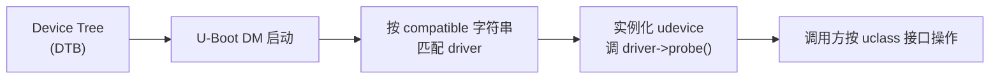
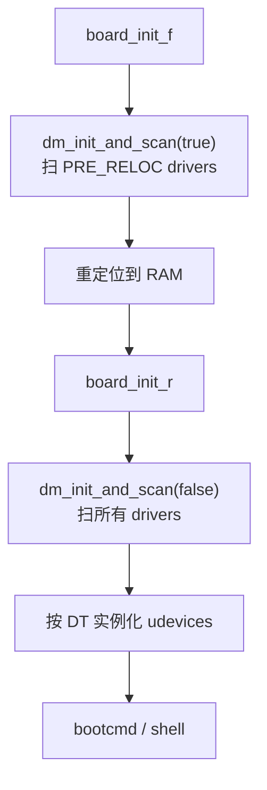

# 03-08 — U-Boot 开发者手册精读：从设计原则到驱动模型到测试与提交

> **核心问题：** 学会 U-Boot 的"用"之后（[03-07](03-07-uboot-usage-manual.md)），怎么"做"它？怎么写一个新 driver / 新 cmd / 新 board / 新 SPL backend？U-Boot 的设计原则有哪些铁律？为什么 driver model 长成那样？bootstd 是什么、为什么取代 distro_bootcmd？怎么写 patch / 跑 test / 提主线？本笔记全程精读 U-Boot 官方 `doc/develop/` 手册（184 文件）。
>
> **一句话答案：** U-Boot 开发的核心是 **"10 黄金法则" + "Driver Model (DM)" + "Kconfig 配置 + 设备树发现 + Makefile 拼装" + "patman 提补丁工作流"**。理解这 4 个支柱，就理解了 U-Boot 整个工程结构和 30 年累积的工程文化。
>
> **本笔记定位：** 03 大类 boot 第 18 篇 —— **开发者视角**。配 [03-07 使用手册](03-07-uboot-usage-manual.md)（使用视角）+ [03-10 SPL 源码](03-10-u-boot-spl-source-walkthrough.md) / [03-11 proper 源码](03-11-u-boot-proper-source-walkthrough.md)（实现细节，源码层）+ 远期 KuBoot 设计参考。

---

## 0. 学完本笔记你能做什么

| 能力 | 例子 |
|------|------|
| 看懂 U-Boot 任何 board 目录 | `board/<vendor>/<board>/{Kconfig, board.c, Makefile, MAINTAINERS, .env}` 全认识 |
| 写新 board port | 知道要创建哪些文件、改哪些 Kconfig、加哪些 dts |
| 写新 driver | 用 DM (Driver Model) 标准接口，知道 `U_BOOT_DRIVER` / uclass / udevice / `priv_auto` 等 |
| 写新 cmd | `U_BOOT_CMD` / `do_*` 函数 / help 字符串 |
| 写 SPL backend | 实现 `spl_*_load_image()` 并注册 |
| 跑 sandbox test | `make sandbox_defconfig && make && ./u-boot` 在 host 上跑 |
| 写 pytest test | `test/py/tests/test_*.py` 风格 |
| 提补丁 | `patman send` 一键 git format-patch + 改 commit log + 发邮件 |
| 看懂任何 U-Boot bug 报告 | mailing list 风格、checkpatch / coccinelle 输出 |

---

## 1. ⭐ U-Boot 设计的 10 黄金法则（doc/develop/designprinciples.rst）

读 U-Boot 任何代码前必须背的 **10 条铁律**，由 Wolfgang Denk（U-Boot 开山祖师）写定：

| # | 法则 | 内涵 |
|---|------|------|
| 1 | **Keep it Small** | U-Boot 必须能塞进 128 KiB ROM。非核心功能不进 |
| 2 | **Keep it Fast** | 尽快 boot OS。**lazy init**（用到啥才初始化啥），别启动 USB 直接进 boot Linux |
| 3 | **Keep it Simple** | 简单优于巧妙。新人能改 |
| 4 | **Keep it Portable** | 已 port 到 30+ 架构 / 数百板子。新代码必须考虑跨平台 |
| 5 | **Keep it Configurable** | Kconfig 让每板按需裁剪 |
| 6 | **Keep it Debuggable** | 单线程执行；早期串口输出；JTAG/BDM 友好；`debug() / log_debug()` 而非 printk 风混乱 |
| 7 | **Keep it Usable** | 同时服务 3 类用户：终端用户（不感知）/ 系统集成商（要功能多）/ board porter（要简单） |
| 8 | **Keep it Maintainable** | 避 `#ifdef` / 用 weak function / 严格 `codingstyle.rst` |
| 9 | **Keep it Beautiful** | 代码整洁 + 输出整洁（不要 `\r` 转圈） |
| 10 | **Keep it Open** | 所有代码上 mailing list，不接受闭源补丁 |

### 1.1 关键 lemma（推论）

- **Generic Code is Good Code** —— driver 别堆在 board/，放 drivers/ 下抽象 / 子类化
- **Initialize devices only when needed** —— 不 boot via USB 就别启动 USB
- **Avoid #ifdef** —— 用 weak fn / Kconfig 切分 / 文件级编译
- **Avoid assembly** —— 只有 reset 头几条 + DDR 训练 + stack 设置可汇编

### 1.2 这 10 条对 KuBoot 的指导意义

| KuBoot 设计抉择 | 受 U-Boot 哪条法则影响 |
|----------------|----------------------|
| Zig comptime + Kconfig 裁剪 | Keep it Configurable + Keep it Small |
| 不写 dynamic dispatch / GC | Keep it Simple + Keep it Debuggable |
| 跨架构 (RV64 / aarch64 / x86_64 / loongarch) | Keep it Portable |
| 注释直接引用 spec | Keep it Maintainable |
| MIT 协议 + 公开 GitHub | Keep it Open |

→ U-Boot 30 年验证的法则 **直接抄进 KuBoot 设计文档**。

---

## 2. ⭐ Driver Model (DM) — U-Boot 现代驱动框架（doc/develop/driver-model/）

### 2.1 为什么有 DM

U-Boot 早期（2002-2014）driver 都是各自硬编码：每板子写一个 `serial_init()` / `eth_init()` / `i2c_init()`，板间复用差，重复代码巨多。

**Linux Driver Model 思想引入**：抽象 driver 接口（uclass）+ device 实例（udevice）+ 通过 device tree 自动 probe driver，与 Linux 一致。

### 2.2 DM 三大概念



| 概念 | 解释 | 类比 Linux |
|------|------|-----------|
| **uclass** | 驱动类别（如 UCLASS_SERIAL / UCLASS_MMC / UCLASS_ETH / UCLASS_GPIO） | 子系统（drivers/serial/） |
| **driver** | 具体某硬件的驱动（如 `serial_pl011` / `mmc_sdhci` / `eth_e1000`） | 具体驱动（pl011.c） |
| **udevice** | driver 的运行实例（运行时分配） | `struct device *dev` |

### 2.3 driver 注册（U_BOOT_DRIVER 宏）

```c
// drivers/serial/serial_pl011.c
static const struct dm_serial_ops pl011_serial_ops = {
    .putc = pl011_serial_putc,
    .pending = pl011_serial_pending,
    .getc = pl011_serial_getc,
    .setbrg = pl011_serial_setbrg,
};

static const struct udevice_id pl011_serial_id[] = {
    {.compatible = "arm,pl011", .data = TYPE_PL011},
    {.compatible = "arm,sbsa-uart", .data = TYPE_PL011},
    {}
};

U_BOOT_DRIVER(serial_pl01x) = {
    .name        = "serial_pl01x",
    .id          = UCLASS_SERIAL,
    .of_match    = pl011_serial_id,
    .of_to_plat  = pl01x_serial_of_to_plat,
    .plat_auto   = sizeof(struct pl01x_serial_plat),
    .probe       = pl01x_serial_probe,
    .ops         = &pl011_serial_ops,
    .flags       = DM_FLAG_PRE_RELOC,
};
```

**关键字段**：
- `id` —— 属于哪个 uclass（决定调用接口）
- `of_match` —— 匹配 DT 中 `compatible` 字符串
- `of_to_plat` —— 从 DT 节点读 reg/clock/interrupt 到 plat 数据
- `plat_auto` —— 自动分配多大 plat 结构
- `probe` —— 设备初始化回调
- `ops` —— uclass 接口实现
- `flags` —— `DM_FLAG_PRE_RELOC` 表示重定位前可用（DDR 之前需要）

### 2.4 调用方代码（不依赖具体 driver）

```c
// 任何用 serial 的代码
struct udevice *dev;
uclass_first_device(UCLASS_SERIAL, &dev);
struct dm_serial_ops *ops = serial_get_ops(dev);
ops->putc(dev, 'A');
```

→ **调用方只看 uclass 接口**，driver 实例自动按 DT 选择 → driver 与 board 完全解耦。

### 2.5 DM 启动流程



详见 [03-11 U-Boot proper § 2-3](03-11-u-boot-proper-source-walkthrough.md)。

### 2.6 KuBoot 借鉴

- ✅ **必抄**：DM 思想（uclass + driver + udevice）
- ✅ **必抄**：DT 自动 probe
- ⚠️ **可改进**：U_BOOT_DRIVER 宏改成 Zig comptime metaprogramming（更安全）

---

## 3. ⭐ Device Tree 在 U-Boot 中的角色（doc/develop/devicetree/）

### 3.1 DT 控制 U-Boot 自身（of-control）

`CONFIG_OF_CONTROL=y` 让 U-Boot 用 DT 描述自己的硬件，而不是 C 宏：

```dts
// arch/riscv/dts/binman.dtsi 或 arch/riscv/dts/<board>.dts
serial0: serial@10000000 {
    compatible = "ns16550a";
    reg = <0x10000000 0x100>;
    clock-frequency = <3686400>;
    bootph-all;       // U-Boot 表示"所有阶段都需要这个 device"
};
```

**bootph-* 标记**（U-Boot 特有）：
- `bootph-pre-ram` — TPL/SPL 阶段
- `bootph-pre-sram` — 仅 TPL
- `bootph-some-ram` — SPL/proper
- `bootph-all` — 所有阶段

### 3.2 of-platdata（编译期 DT 转 C，doc/develop/driver-model/of-plat.rst）

SPL 阶段为节省空间，可用 **of-platdata**：编译期把 DT 节点转成 C 结构体，运行时不用解析 DTB → SPL 二进制能小 10 KB+。

### 3.3 livetree（运行时 DT 编辑）

`fdt set` 等命令运行时改 DT，传给 OS 用：

```bash
=> fdt addr ${fdt_addr_r}
=> fdt set /chosen/console "ttyS0,115200"
=> fdt rm /soc/i2c@40005400         # 禁用某节点
```

→ **同一固件 + 不同 DT 改动支持多硬件配置变体**。

---

## 4. SPL 实现深入（doc/develop/spl.rst）

### 4.1 SPL Kconfig 子系统

每个 SPL 功能都有独立 `CONFIG_SPL_<FEATURE>=y`（区别于 proper 的 `CONFIG_<FEATURE>`），让 SPL 只编进必要功能。

例：proper 全启 USB / Ethernet / DM-USB，但 SPL 只启 `CONFIG_SPL_MMC` + `CONFIG_SPL_FS_FAT` → SPL 二进制 30 KB，proper 800 KB。

### 4.2 SPL 主流程

```c
// common/spl/spl.c::board_init_r() - SPL 阶段
void board_init_r(gd_t *dummy1, ulong dummy2) {
    spl_set_bd();            // bd_info
    mem_malloc_init(...);    // 简单 heap
    ret = preloader_console_init();  // UART
    ret = spl_early_init();  // DM init (PRE_RELOC drivers)
    timer_init();
    boot_from_devices(...);  // 主循环：依次试 spl_boot_list[]
    jump_to_image_no_args(); // 跳到 U-Boot proper / Linux / TF-A
}
```

### 4.3 实现新 SPL backend

例：实现一个从某新 flash 加载的 SPL backend：

1. 创建 `common/spl/spl_<myfs>.c`
2. 实现 `spl_<myfs>_load_image(struct spl_image_info *spl_image, struct spl_boot_device *bootdev)`
3. 注册：`SPL_LOAD_IMAGE_METHOD("MYFS", 0, BOOT_DEVICE_MYFS, spl_<myfs>_load_image)`
4. Kconfig 加 `CONFIG_SPL_MYFS_SUPPORT`
5. 板子 `board_boot_order()` 加 `BOOT_DEVICE_MYFS`

详见 [03-10 SPL 源码精读 § 4](03-10-u-boot-spl-source-walkthrough.md)。

---

## 5. ⭐ Falcon Mode（doc/develop/falcon.rst, 599 行）

### 5.1 是什么

**Falcon Mode = SPL 直接 boot Linux 内核，绕过 U-Boot proper 阶段**。

普通：
```
ROM → SPL → U-Boot proper → bootcmd → Linux
```

Falcon：
```
ROM → SPL → Linux （直接！）
```

### 5.2 何时用

- **极致 boot 时间**（百毫秒级）：汽车 ECU / 工业控制 / 摄像头快速开机
- **省存储**：proper 那 800 KB 不放进 flash
- **production**：生产期固定启动一个 OS，不需要交互 shell

### 5.3 怎么做

```bash
# 1. 板子先用普通模式启动一次，把 Linux 配好
=> setenv bootargs root=/dev/mmcblk0p2 ...
=> fatload mmc 0:1 ${kernel_addr_r} Image
=> fatload mmc 0:1 ${fdt_addr_r} board.dtb

# 2. 让 SPL "记住" 这次启动配置：把 args 写到 flash
=> spl export fdt ${kernel_addr_r} - ${fdt_addr_r}

# 3. 在 SPL 里配 falcon mode
=> setenv boot_os yes
=> setenv falcon_args_file args.bin
=> setenv falcon_image_file uImage
=> saveenv

# 4. 重启：SPL 检测到 boot_os=yes → 直接加载 Linux + 跳转
```

### 5.4 Falcon Mode 的代价

- ❌ 失去交互 shell（无法进 U-Boot 命令行）
- ❌ 失去 distro 启动协议（无 PXE / extlinux 等）
- ❌ 调试困难（启动失败只能拆 SD 重做）
- ⚠️ 需要 fallback 机制（按 GPIO / 启动失败回普通模式）

### 5.5 KuBoot 借鉴

- ✅ KuBoot 必须支持 Falcon Mode 等价（"快启动 = SPL 直 boot OS"）
- ⚠️ 提供安全 fallback（hardware key / GPIO 检测）

---

## 6. ⭐ bootstd — 新一代 distro 启动框架（doc/develop/bootstd/）

### 6.1 为什么取代 distro_bootcmd

旧 `distro_bootcmd` 用 env script 实现，**问题**：
- 脚本巨长（400+ 行 env），不易维护
- 跨板子复制粘贴
- 不能动态发现新启动方式
- env 占空间大

**bootstd**（U-Boot 2022 引入）：用 C 代码 + DM 实现的"启动方法"统一框架。

### 6.2 bootstd 架构

```
bootstd
├── bootmeth (启动方法)
│   ├── extlinux  (类 syslinux 配置)
│   ├── pxelinux  (PXE)
│   ├── android   (Android boot.img)
│   ├── cros      (Chrome OS)
│   ├── qfw       (QEMU firmware-config)
│   ├── rauc      (RAUC A/B 升级)
│   ├── script    (执行 boot.scr)
│   ├── sandbox   (sandbox 测试)
│   └── efi       (UEFI Boot Manager)
│
├── bootdev (启动设备：MMC/USB/PXE/...)
│
└── bootflow (一次启动尝试，bootmeth × bootdev 组合)
```

### 6.3 用法

```bash
=> bootflow scan -lb         # 扫描所有 bootdev × bootmeth
=> bootflow list             # 列出可启动项
=> bootflow boot             # 启动第一个
```

### 6.4 添加新 bootmeth

实现 `bootmeth_ops` 即可：

```c
struct bootmeth_ops mybm_ops = {
    .check  = mybm_check,        // 这个 bootdev 我能 boot 吗
    .read_bootflow = mybm_read,  // 读 boot config
    .read_file = mybm_read_file, // 读 kernel/dtb/initrd
    .boot   = mybm_boot,         // 实际启动
};
```

### 6.5 KuBoot 借鉴

- ✅ **直接用 bootstd 模型**，不要 distro_bootcmd 脚本路线
- ✅ 抽象 bootmeth + bootdev + bootflow 三层
- ✅ Zig comptime 列举所有 bootmeth → 类似 DM 的 driver 注册

---

## 7. UEFI 实现（doc/develop/uefi/）

### 7.1 U-Boot 内置 UEFI

U-Boot 2017+ 内置完整 UEFI 实现（约 30K 行 C），让 U-Boot 兼作 UEFI 固件运行 grub.efi / Linux EFI stub。

### 7.2 实现的 UEFI 接口

| Boot Service | 实现状态 |
|--------------|---------|
| AllocatePages / FreePages | ✅ |
| LocateProtocol / HandleProtocol | ✅ |
| LoadImage / StartImage / Exit | ✅ |
| ExitBootServices | ✅ |
| Event / Timer | ✅ |

| Runtime Service | 实现状态 |
|----------------|---------|
| GetVariable / SetVariable | ✅ |
| GetTime / SetTime | ⚠️ 部分 |
| ResetSystem | ✅ |
| SetVirtualAddressMap | ✅ |
| Capsule Update | ✅ |

| Protocol | 实现 |
|---------|------|
| EFI_BLOCK_IO_PROTOCOL | ✅ |
| EFI_SIMPLE_FILE_SYSTEM_PROTOCOL (FAT) | ✅ |
| EFI_GRAPHICS_OUTPUT_PROTOCOL (GOP) | ✅ |
| EFI_NET_PROTOCOL | ✅ |
| EFI_LOADED_IMAGE_PROTOCOL | ✅ |
| EFI_DEVICE_PATH_PROTOCOL | ✅ |

→ **U-Boot 几乎是完整 UEFI 固件**（缺 SecureBoot 大部分 / HII 几乎没）。

### 7.3 启动 UEFI 应用

```bash
=> bootefi ${loadaddr}                    # 启动指定地址的 EFI 镜像
=> bootefi bootmgr                        # 走 EFI Boot Manager
=> efidebug boot dump                     # 列出 boot entries
=> efidebug boot add 0001 "Debian" mmc 0:1 EFI/debian/grubriscv64.efi
```

### 7.4 KuBoot 借鉴

- ✅ KuBoot 必须有 UEFI 兼容模式（让 KuEFI / grub.efi 能跑）
- ⚠️ SecureBoot 复杂度高，第一版可不做

---

## 8. Kconfig + Makefile 体系（doc/develop/kconfig.rst, makefiles.rst）

### 8.1 Kconfig 层级

```
Kconfig (top)
├── arch/<arch>/Kconfig
│   ├── arch/<arch>/cpu/<soc>/Kconfig
│   └── arch/<arch>/dts/Kconfig
├── board/<vendor>/<board>/Kconfig
├── common/Kconfig
├── drivers/<subsys>/Kconfig
├── lib/Kconfig
├── fs/<fs>/Kconfig
└── cmd/Kconfig
```

每板子有 `configs/<board>_defconfig` 文件，`make <board>_defconfig` 一键应用。

### 8.2 Kconfig 工作流

```bash
make qemu_riscv64_smode_defconfig    # 加载默认配置
make menuconfig                      # 交互式改
make savedefconfig                   # 保存简化版回 configs/
make olddefconfig                    # 升级 Kconfig 后同步
```

### 8.3 Makefile 关键

- 顶层 `Makefile` 调 Kbuild（同 Linux）
- 每子目录 `Makefile` 列 obj-y / obj-$(CONFIG_*)
- 链接脚本 `arch/<arch>/cpu/<soc>/u-boot.lds` (proper) + `u-boot-spl.lds` (SPL)
- `mkimage` 把 ELF 转成 `.bin` / `.itb` / 加 header

### 8.4 KuBoot 借鉴

- ⚠️ Makefile 替成 Zig build.zig + comptime 动态生成 module list

---

## 9. 内存管理 + 全局数据（doc/develop/memory.rst, lmb.rst, global_data.rst, init.rst）

### 9.1 三段式内存

```
┌──────────────────────────────────┐ ← RAM 顶
│ U-Boot proper (重定位后)          │
│  - text + data + bss              │
│  - heap (mem_malloc_init)         │
│  - stack                          │
├──────────────────────────────────┤
│ ... free RAM ...                 │
├──────────────────────────────────┤
│ kernel / dtb / ramdisk 加载区     │
├──────────────────────────────────┤ ← RAM 底
│ reserved (SBI / OpenSBI / TF-A)  │
└──────────────────────────────────┘
```

### 9.2 LMB (Logical Memory Block)

`include/lmb.h` 提供 boot 阶段简单 memory 分配器，记录"已用 / 已保留"区域，避免 kernel/dtb/ramdisk 加载冲突。

```c
struct lmb lmb;
lmb_init(&lmb);
lmb_reserve(&lmb, 0x80000000, 0x100000);  // 标记保留
lmb_alloc(&lmb, 0x1000, 0x1000);          // 分配
```

### 9.3 global_data (gd)

`gd` 是个全局指针指向 `struct global_data`，**所有 U-Boot 代码都能访问**：

```c
struct global_data {
    bd_t *bd;            // board info
    ulong flags;
    ulong baudrate;
    ulong cpu_clk;
    ulong mem_clk;
    ulong have_console;
    ulong env_addr;
    ulong env_valid;
    ulong ram_size;
    ulong relocaddr;
    void *new_gd;
    struct udevice *cur_serial_dev;
    ...
};
```

通过架构特定寄存器存（ARM r9 / RV gp / x86 fs），永远可读。

### 9.4 init 序列（init.rst）

`board_init_f` 的 `init_sequence_f[]` 是函数指针数组，依次调：
- `setup_mon_len`
- `mem_malloc_init`
- `early_console_init`
- `print_cpuinfo`
- `dram_init`
- `relocate_code`  ← 跳到 board_init_r

`board_init_r` 同理 `init_sequence_r[]`：
- `initr_caches`
- `initr_dm`            ← DM 初始化
- `initr_serial`
- `initr_env`
- `console_init_r`
- `initr_net`
- `main_loop`           ← 进 shell

详见 [03-11 § 3 init sequence](03-11-u-boot-proper-source-walkthrough.md)。

---

## 10. 命令系统（doc/develop/commands.rst）

### 10.1 U_BOOT_CMD 宏

```c
// cmd/mycmd.c
static int do_mycmd(struct cmd_tbl *cmdtp, int flag, int argc, char *const argv[])
{
    if (argc < 2)
        return CMD_RET_USAGE;
    printf("Hello %s\n", argv[1]);
    return CMD_RET_SUCCESS;
}

U_BOOT_CMD(
    mycmd,                      // 命令名
    2,                          // 最大 argc
    1,                          // repeatable (按 enter 重复执行)
    do_mycmd,                   // handler
    "say hello",                // 短帮助
    "<name>\n"                  // 长帮助
    "    Print hello to <name>"
);
```

链接器把所有 `U_BOOT_CMD` 收集到 `.u_boot_list_2_cmd` section，运行时遍历找匹配。

### 10.2 写新 cmd 步骤

1. 创建 `cmd/mycmd.c`
2. 写 `do_mycmd` + `U_BOOT_CMD`
3. `cmd/Kconfig` 加 `CONFIG_CMD_MYCMD`
4. `cmd/Makefile` 加 `obj-$(CONFIG_CMD_MYCMD) += mycmd.o`
5. 选板子 defconfig 加 `CONFIG_CMD_MYCMD=y`
6. 编译 + 烧录 + 测

### 10.3 KuBoot 借鉴

- ✅ 同样的 cmd 注册机制（Zig comptime 自动收集，比 U_BOOT_CMD 链接器 hack 干净）
- ✅ help 字符串规范

---

## 11. 事件 / 周期任务（doc/develop/event.rst, cyclic.rst）

### 11.1 event 系统

发布 - 订阅模式：

```c
// 订阅
EVENT_SPY(EVT_DM_POST_INIT_F, dm_init_done_handler);

// 发布
event_notify_null(EVT_DM_POST_INIT_F);
```

### 11.2 cyclic 系统

注册周期回调（如 watchdog feed）：

```c
struct cyclic_info my_cyclic;
cyclic_register(&my_cyclic, watchdog_feed, 1000000, "wdt");  // 每 1s
```

→ U-Boot 单线程，cyclic 在主循环里轮询，**不是真定时器中断**。

---

## 12. 日志系统（doc/develop/logging.rst）

### 12.1 log_*() 宏

```c
log_info("hello %d\n", 42);    // LOGL_INFO
log_warning("oops");            // LOGL_WARNING
log_err("fatal");               // LOGL_ERR
log_debug("debug %s\n", str);   // LOGL_DEBUG (默认不输出)
```

通过 `CONFIG_LOG_DEFAULT_LEVEL` 控制最低输出级。

### 12.2 log category

每文件可定义 `LOG_CATEGORY`，分类输出（drivers/serial/foo.c 用 LOGC_DRIVER）。

---

## 13. 测试体系（doc/develop/testing.rst, pytest/, tests_writing.rst）

### 13.1 三种测试

| 类型 | 工具 | 范围 |
|------|------|------|
| **C unit test** | `test/dm/` | DM driver / lib 函数 |
| **Sandbox test** | `make sandbox_defconfig && ./u-boot` | 在 host 上跑全 U-Boot（虚拟 hw） |
| **pytest** | `test/py/tests/` | 集成测试，调真机 / sandbox / QEMU |

### 13.2 sandbox 用法

```bash
make sandbox_defconfig
make
./u-boot                    # host 上启动 U-Boot
=> bdinfo                   # 命令在 host 跑
=> mmc list                 # 假 MMC
```

→ **不需要硬件就能测大部分功能**，CI 友好。

### 13.3 pytest 例

```python
# test/py/tests/test_mycmd.py
def test_mycmd(u_boot_console):
    response = u_boot_console.run_command("mycmd Alice")
    assert "Hello Alice" in response
```

```bash
make tests   # 跑所有 pytest（用 sandbox）
```

### 13.4 KuBoot 借鉴

- ✅ Zig 原生 `zig test` 替代 C unit test
- ✅ Zig sandbox build target（编译目标 = host x86_64-linux）跑 host 测试
- ✅ pytest（保留 Python 现有生态）

---

## 14. patman + sending patches（doc/develop/patman.rst, sending_patches.rst）

### 14.1 patman 工作流

U-Boot 是 mailing list 工作流（不接受 GitHub PR）：

```bash
# 在分支上写若干 commit
git log --oneline -5
abc123 board: add my-board support
def456 dts: add my-board dts
ghi789 doc: document my-board

# patman 自动：
# 1. git format-patch -5
# 2. 分析 commit 的 To: / Cc: tag
# 3. 加 cover letter
# 4. 发送到 u-boot mailing list
patman send -s
```

### 14.2 commit message 规范

```
subsystem: short summary (max 50 chars)

Detailed description here. Wrap at 72 chars.

Tests:
- Tested on FOO board
- make sandbox; make tests passes

```

### 14.3 必跑 check

```bash
scripts/checkpatch.pl --strict 0001-*.patch    # coding style
make tests                                      # sandbox 测试
make qcheck                                     # 快速配置检查
```

→ 不通过这两个 check **patch 会被 maintainer 直接退**。

### 14.4 KuBoot 借鉴

- ⚠️ 不抄 mailing list（KuBoot 用 GitHub PR + GitHub Actions CI）
- ✅ 抄 commit 规范 + checkpatch 等价（zig fmt + zig build test 自动跑）

---

## 15. 静态分析 + 重构工具（doc/develop/checkpatch.rst, coccinelle.rst, qconfig.rst）

| 工具 | 用途 |
|------|------|
| **checkpatch.pl** | coding style + 常见 bug pattern 扫描（来自 Linux） |
| **coccinelle** | 语义级重构（如批量改 API），脚本化 grep+rewrite |
| **qconfig.py** | 列出某 CONFIG 在哪些 board 启用 |
| **clang scan-build** | 静态分析 |

### 15.1 KuBoot 借鉴

- ✅ Zig 自带 `zig fmt`（替 checkpatch 部分功能）
- ✅ Zig 自带 build-time check（替 coccinelle）
- ⚠️ 跨 BSP 配置查询（替 qconfig）需自写工具

---

## 16. 其他重要 develop 主题（速览）

| 主题 | 文件 | 一句话 |
|------|------|--------|
| `board_best_practices.rst` | board/ 目录组织规范 | 一板一目录 + .env + Kconfig + dts + Makefile + MAINTAINERS |
| `bloblist.rst` | 阶段间数据传递（SPL→proper→OS） | 类似 EDK2 HOB |
| `bitbangmii.rst` | 软件 bit-bang MII 总线 | 没硬件 MDIO 时用 |
| `cedit.rst` | 配置编辑器框架 | UEFI HII 替代品 |
| `expo.rst` | 菜单 / 表单 UI 框架 | 启动菜单图形化 |
| `directories.rst` | 目录结构总览 | 18 顶级目录用途 |
| `vbe.rst` | Verified Boot for Embedded | A/B + 签名 boot |
| `smbios.rst` | SMBIOS 表生成 | 给 OS 用 |
| `printf.rst` | U-Boot printf 限制 | 不支持浮点 |
| `kconfig.rst` | Kconfig 用法 | 同 § 8 |
| `makefiles.rst` | Makefile 规范 | 同 § 8 |
| `gdb.rst` | GDB 调试 U-Boot | symbols + JTAG |
| `trace.rst` | 跟踪 U-Boot 函数调用 | ftrace 风 |
| `crash_dumps.rst` | 崩溃栈解析 | 帮 debug |

---

## 17. KuBoot 完整开发借鉴 checklist


| 必抄 | 一句话 |
|------|--------|
| ⭐ 10 黄金法则 | Keep it Small/Fast/Simple/Portable/Configurable/Debuggable/Usable/Maintainable/Beautiful/Open |
| ⭐ Driver Model | uclass + driver + udevice + DT 自动 probe |
| ⭐ Kconfig 配置 | Python kconfiglib，多层 Kconfig，每板 defconfig |
| ⭐ DT 控制 KuBoot 自身 | of-control 思想，bootph-* 等价标记 |
| ⭐ SPL/proper 分层 | 各自独立 Kconfig，SPL 极小 |
| ⭐ Falcon Mode 等价 | SPL 直 boot OS（极致快启）|
| ⭐ bootstd 风格 | bootmeth + bootdev + bootflow 三层 |
| ⭐ FIT 镜像支持 | kernel + DTB + initrd + signature 一体 |
| ⭐ UEFI 兼容模式 | 让 KuEFI / grub.efi 能跑 |
| ⭐ Sandbox 测试 | host 编译版本，CI 跑全 KuBoot 功能 |
| 重要 | global_data 等价（架构寄存器存全局指针） |
| 重要 | LMB 内存追踪（防 kernel/dtb 加载冲突） |
| 重要 | event + cyclic 框架 |
| 重要 | 分级 logging（log_*) |
| 重要 | 命令注册机制（Zig comptime 替 U_BOOT_CMD） |
| 改进 | GitHub PR + Actions CI 替 mailing list |
| 改进 | zig fmt 替 checkpatch + coccinelle |
| 改进 | 跨 BSP 配置查询工具 |

---

## 18. 进一步阅读

- **官方手册**：https://u-boot.readthedocs.io/en/latest/develop/
- **本地源码**：`/home/heke/tgln/stage2/material/boot/u-boot/doc/develop/`
- **U-Boot mailing list**：https://lists.denx.de/listinfo/u-boot
- **Patchwork**：https://patchwork.ozlabs.org/project/uboot/list/
- **本仓库相关**：[03-07 U-Boot 使用手册](03-07-uboot-usage-manual.md)（使用视角）+ [03-10 SPL 源码](03-10-u-boot-spl-source-walkthrough.md) + [03-11 proper 源码](03-11-u-boot-proper-source-walkthrough.md)（实现细节深入）+ [03-09 U-Boot 演化](03-09-uboot-evolution-case-study.md)（24 年历史）

---

## 19. 4 道练习题

1. **设计原则应用**：U-Boot 10 黄金法则中"Keep it Fast"要求 lazy init。给一段 U-Boot 启动代码，把"立即启动 USB / Ethernet / SATA"的部分识别出来，说明哪些违反 lazy init 原则、应该如何改？
2. **DM driver 设计**：你要给一个新型 SPI flash chip 写 driver，应该放在 `drivers/` 哪个子目录？用哪个 uclass？要实现哪些 ops？怎么注册？给出关键代码骨架。
3. **bootstd vs distro_bootcmd**：bootstd 用 C 实现 + DM 注册 bootmeth；distro_bootcmd 用 env script。两者各自优缺点是什么？为什么 U-Boot 要做这个迁移？KuBoot 应该选哪个模型，为什么？
4. **patman 工作流**：你给 U-Boot 提了个 4 commit 的 patch series（加新板子），patman 会自动收集哪些 To/Cc 信息？checkpatch 不通过会发生什么？怎么修后重发？
