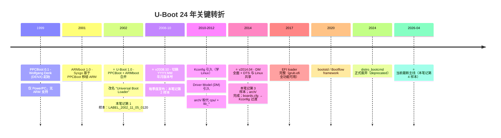

# 03-09 — U-Boot 演化案例研究：从 2002 到 2026.04（24 年代码考古）

> **核心问题：** "今天 763 MB / 38000 文件 / 150 万行的 U-Boot 主线"是怎么从 24 年前那个 15 MB / 1400 文件 / ~8 万行的小工具长成的？关键转折在哪几个点？哪些设计沿用至今、哪些被废弃替代？
>
> **U-Boot 的"出生证明"：** 1999 年 Wolfgang Denk（DENX 公司）写 **PPCBoot**（PowerPC 嵌入式 bootloader） → 2001 年 Sysgo 在 PPCBoot 基础上做 **ARMboot**（移植到 ARM）→ **2002 年两者合并、改名 "U-Boot"（Universal Boot Loader）**，这就是 U-Boot 1.0。本笔记的第 1 个考古样本（LABEL_2002_11_05_0120）就是这次合并刚完成 3 个月后的快照。
>
> **一句话答案：** U-Boot 从 **PPCBoot (1999) + ARMboot (2001) → U-Boot 1.0 (2002 合并) → 2008.10 切年月版本 → 2010 引入 Kconfig → 2012 DM (Driver Model) → 2014 DTS 与 Linux 共享 → 2017 EFI loader 完整 → 2020 bootstd 替代 distro_bootcmd → 2024 distro_bootcmd 弃用** ——5 个里程碑构成"从 8 万行小工具到 150 万行平台基础设施"的核心叙事。本笔记用 4 个本地版本（**2002-11 / v2008.10 / v2014.04 / v2026.04**）做横向解剖。
>
> **本笔记定位：** 03 大类 boot 第 13 篇 —— **代码考古 / 演化对比**视角。配 [`03-02 § 5.1.1`](03-02-boot-overview.md) 历史时间线 + [`03-06 全局总揽`](03-06-u-boot-overview.md) 模块结构 + [`03-10 SPL 源码`](03-10-u-boot-spl-source-walkthrough.md) + [`03-11 proper 源码`](03-11-u-boot-proper-source-walkthrough.md) 现状精读。

---

## 0. 4 个本地"考古样本"

| 版本 | 日期 | tag | 路径 | 文件数 | 大小 |
|------|------|-----|------|-------|------|
| **2002-11** | 2002-11-05 | `LABEL_2002_11_05_0120` | `boot/older/u-boot-2002-11/` | 1,401 | 15 MB |
| **v2008.10** | 2008-10-18 | `v2008.10` | `boot/older/u-boot-2008.10/` | 5,566 | 64 MB |
| **v2014.04** | 2014-04 | `v2014.04` | `boot/older/u-boot-2014.04/` | 8,073 | 79 MB |
| **v2026.04** | 2026-04-02 | `v2026.04` | `boot/u-boot/` | **37,780** | 763 MB |

**24 年间增长比：**
- 文件数：×27
- 体积：×50
- 板子数：71 → 253 → 445 → 722
- 架构数：6 (大半 PowerPC) → 8 → 11 → **14**（含现代主流 RV/ARM/x86 + 老 m68k/sh/microblaze/xtensa 等）

→ **U-Boot 不是"被新写一份"，而是 24 年持续演化**，每个 commit 都能从前一个 commit 直接 git diff 出来。这种连续性本身就是工程奇迹。

---

## 1. 顶层视野：5 个关键转折



---

## 2. 转折 1：2002-11 — 起源期（合并刚完成的 U-Boot）

### 2.1 顶层目录（仅 1401 文件）

```
u-boot-2002-11/
├── README          ← Wolfgang Denk 写于 2000-2002
├── Makefile        ← 顶层 Makefile（无 Kconfig）
├── arm_config.mk   ← 架构特定 config（每架构一个 .mk）
├── config.mk       ← 通用 config
├── mkconfig        ← shell 脚本生成 .config（没 Kconfig）
├── MAKEALL         ← shell 脚本批量编译所有 board
├── board/          ← 71 个 board 子目录
├── common/         ← 通用代码（main.c 仅 817 行！）
├── cpu/            ← CPU/SoC 代码（无 arch/ 概念）
│   ├── 74xx_7xx/  ← PowerPC 7xx
│   ├── arm720t/   ← ARM7
│   ├── arm920t/   ← ARM9
│   ├── mpc824x/   ← Freescale MPC824x
│   ├── mpc8260/   ← Freescale MPC826x
│   ├── mpc8xx/    ← Freescale MPC8xx ⭐ PowerPC 主战场
│   ├── ppc4xx/    ← AMCC PowerPC 4xx
│   ├── sa1100/    ← StrongARM
│   └── xscale/    ← Intel XScale
├── lib_arm/        ← ARM 通用库（不在 cpu/ 里）
├── lib_generic/    ← 跨架构通用库
├── lib_ppc/        ← PowerPC 通用库（含 start.S）
├── disk/           ← 分区表 / disk 层
├── drivers/        ← 驱动（无 dm/ 子框架）
├── dtt/            ← Digital Thermometer & Thermostat
├── examples/
├── fs/             ← FAT only
├── include/        ← 头文件
├── net/            ← 网络
├── post/           ← Power-On Self Test
├── doc/
├── COPYING / CREDITS / MAINTAINERS / CHANGELOG
└── (无 dts/ / 无 Kconfig / 无 scripts/ / 无 tools/)
```

### 2.2 核心特征（"原始 U-Boot"）

| 特征 | 2002-11 状态 |
|------|-------------|
| **架构组织** | `cpu/<cpu>/` + `lib_<arch>/`（**无 arch/ 概念**）|
| **配置系统** | `mkconfig` shell 脚本 + `include/configs/<board>.h` 大杂烩 macro |
| **驱动模型** | 无统一 DM；驱动直接调 board-specific 函数 |
| **设备树** | **无 DTS** —— board-specific .h 文件硬编码所有 |
| **支持架构** | PowerPC 主战场（5 个 PowerPC SoC）+ ARM（3 系列）|
| **板子数** | 71（绝大多数 PowerPC）|
| **网络栈** | 仅 BOOTP / TFTP（无 DHCP / 无 IPv6）|
| **fs 支持** | 仅 FAT（无 ext / 无 squashfs / 无 fs/_dispatch_）|
| **EFI** | 完全没有 |
| **测试** | 无 unit test framework |
| **文档** | README 一份 + doc/ 数个 |
| **Makefile** | 1 主 Makefile + 多个 .mk 片段（无 Kbuild）|

### 2.3 main.c 入口（common/main.c, 817 行）

```c
/*
 *
 * The "main" function for U-Boot
 */

void main_loop (void)
{
    static char lastcommand[CFG_CBSIZE] = { 0, };
    int len;
    int rc = 1;
    int flag;

#if defined(CONFIG_BOOTDELAY) && (CONFIG_BOOTDELAY >= 0)
    char *s;
    int bootdelay;
    char *bootcmd;
#endif

    /* ... 简单 shell 循环 + bootdelay 自动启动 ... */
    for (;;) {
        len = readline (CFG_PROMPT);   /* 读一行命令 */
        flag = 0;
        if (len > 0) {
            strcpy (lastcommand, console_buffer);
        } else if (len == 0) {
            flag |= CMD_FLAG_REPEAT;
        }
        if (len == -1) {
            puts ("<INTERRUPT>\n");
        } else {
            rc = run_command (lastcommand, flag);
        }
    }
}
```

→ **极简 shell + bootdelay + run_command** 是 U-Boot 的灵魂代码，**24 年后 v2026.04 仍能看到这段的演化版**（在 `cmd/` 和 `boot/`）。

### 2.4 cpu/mpc8xx/start.S 入口（PowerPC 主流）

```asm
/*
 *
 * U-Boot - Startup Code for PowerPC based Embedded Boards
 */

.text
    .long 0x27051956    /* U-Boot Magic Number */
    .globl _start
_start:
    li r21, BOOTFLAG_COLD       /* Normal Power-On */
    nop
    /* ... CPU 初始化 ... */

    bl  cpu_init_f              /* CPU init */
    bl  board_init_f            /* board init (RAM 之前) */
    /* ... 自重定位到 RAM ... */
    bl  board_init_r            /* board init (RAM 之后) */
    bl  main_loop               /* 进入 main_loop */
```

→ **`board_init_f` (in flash) → `board_init_r` (in RAM) → `main_loop`** 这个三段式 24 年没变（v2026.04 RV/ARM 都还是这样）。

### 2.4.5 ⭐ PPCBoot + ARMboot 是如何抽象与合并的？

**4 步合并法（2001-2002 实际工程过程，从代码 copyright 还原）：**

#### 步骤 1：垂直分层（学 UNIX 哲学）

PPCBoot 已经天然有"通用代码 vs CPU 特定代码"分层：
```
common/     ← 通用代码（main_loop / 命令解析 / env / printf / ...）
cpu/<cpu>/  ← CPU 特定（start.S / cpu_init / SoC 初始化）
board/<板>/ ← 板级（GPIO 配置 / DRAM size / Flash 分布）
```

**ARMboot 移植**沿用同样分层 + 在 `cpu/arm720t/`、`cpu/arm920t/`、`cpu/sa1100/`、`cpu/xscale/` 各加一份 ARM SoC 代码。这是关键 —— **ARMboot 没有重新发明组织方式，而是 follow PPCBoot**，所以合并时几乎没有"风格冲突"。

#### 步骤 2：横向并列（同时支持多 ISA）

合并后 cpu/ 目录里 PowerPC 和 ARM 子目录平起平坐：
```
cpu/
├── 74xx_7xx/    ← PPC 7xx (PPCBoot 原生)
├── arm720t/     ← ARM7 (ARMboot 贡献)
├── arm920t/     ← ARM9 (ARMboot 贡献)
├── mpc824x/     ← Freescale MPC824x (PPCBoot)
├── mpc8260/     ← Freescale MPC826x (PPCBoot)
├── mpc8xx/      ← Freescale MPC8xx (PPCBoot 主战场)
├── ppc4xx/      ← AMCC PPC4xx (PPCBoot)
├── sa1100/      ← StrongARM (ARMboot)
└── xscale/      ← Intel XScale (ARMboot)
```

→ **同一目录，5 个 PowerPC SoC + 4 个 ARM SoC**。共存而非取代。

#### 步骤 3：架构特定库分离

为避免 PowerPC 和 ARM 通用代码冲突，引入 `lib_<arch>/`：
```
lib_arm/      ← ARM 通用（armboot board.c / interrupts / cache ops）
lib_generic/  ← 真正跨 ISA 通用（string / crc / printf / vsprintf）
lib_ppc/      ← PowerPC 通用（含 start.S 入口、cache MMU 操作）
```

**注意：** 此时 ARM 的入口 `start.S` 在 `cpu/arm920t/start.S`，PowerPC 的入口 `start.S` 在 `lib_ppc/start.S`（结构稍不对称——是合并初期的妥协，后续 v2014.04 重构成 `arch/<arch>/cpu/<cpu>/start.S` 才对齐）。

#### 步骤 4：双 copyright 证据 —— 看代码 DNA

**`cpu/arm920t/start.S` 头部 copyright** 是合并的 DNA 证据：

```
/*
 *  armboot - Startup Code for ARM920 CPU-core
 *
 *
 *  See file CREDITS for list of people who contributed
 */
```

→ **同一文件三人三个公司贡献：Sysgo 写原代码（"armboot"），DENX 整理并入 U-Boot**。

**`lib_arm/board.c` 头部** 同样：

```
/*
 * (C) Copyright 2002
 *
 * (C) Copyright 2002
 * Sysgo Real-Time Solutions, GmbH <www.elinos.com>             ← ARMboot 起源公司
 */
```

→ **明确显示"两个公司、两份起源、合并到一份代码"**。这就是 2001-2002 PPCBoot+ARMboot→U-Boot 合并的实证 DNA。

#### 步骤 5：build glue（架构感知 makefile + mkconfig）

顶层 `Makefile` 支持多 ISA 的关键：
- `arm_config.mk`（专门为 ARM 加的 makefile fragment，定义 ARM 编译标志 / 链接 / cross compiler 前缀）
- `mkconfig` shell 脚本根据 board name 选 `arm_config.mk` 或 `ppc_config.mk` 等
- `include/configs/<board>.h` 用 `#define CONFIG_ARM` / `CONFIG_PPC` 等宏标记架构

#### 关键洞察

**这次合并能成功的根本原因（任何项目合并都可学）：**

1. **代码组织风格相近** —— ARMboot 复制 PPCBoot 分层方式，没有自创风格
2. **抽象层次匹配** —— common / arch-lib / cpu / board 4 层对两者都适用
3. **共享真正通用的部分** —— main_loop / 命令系统 / 环境变量 / printf 这些与 ISA 无关，直接共享 (一行没改)
4. **架构特定全分离** —— start.S / 中断处理 / cache ops 各自独立目录
5. **保留作者贡献历史** —— 通过 copyright 多行声明，不抹去任何贡献者

→ **"合并不是重写，是把别人的代码当自己的"**，关键是抽象层次对齐 + 边界清晰。**这是任何"两个项目合并"工程的范本**。

#### "merger 模型"对后续 OS 启示

后世效仿这种合并模式的项目：
- **Linux 内核**：把 LXR / 各 distro 内核分支统一进 mainline（持续进行）
- **systemd**：吃掉 udev / cron / syslog / sysvinit 多个老项目
- **GNU coreutils**：合并 fileutils / sh-utils / textutils 三家
- **ffmpeg ↔ libav** 分裂后多年再合并失败（反例：双方风格分歧太大）

→ U-Boot 的合并是少数"长期成功"案例，关键就在前期工程纪律好。

### 2.5 配置：没有 Kconfig 的世界

`include/configs/walnut405.h`（一个典型 board 配置）：

```c
/* Board-specific 配置，全是 #define */
#define CONFIG_405GP    1       /* CPU 是 PPC405GP */
#define CONFIG_WALNUT   1       /* 板子叫 walnut */
#define CONFIG_SYS_CLK_FREQ 33000000
#define CONFIG_BOARD_EARLY_INIT_F 1
#define CONFIG_MISC_INIT_R 1

/* 命令使能 */
#define CONFIG_COMMANDS  (CFG_CMD_DFL | CFG_CMD_ASKENV | CFG_CMD_DHCP | ...)

/* 内存布局 */
#define CFG_SDRAM_BASE      0x00000000
#define CFG_FLASH_BASE      0xFFF80000
#define CFG_MONITOR_BASE    CFG_FLASH_BASE
#define CFG_MONITOR_LEN     (192 * 1024)

/* 裁剪：要哪些 fs / 哪些命令 / 哪些驱动全是 #define 拼装 */
```

→ **每个新板子写一份 `include/configs/<name>.h`** 几百行 #define，**无菜单 / 无依赖检查 / 无版本控制** —— 这是日后 Kconfig 引入的根本原因。

---

## 3. 转折 2：v2008.10 — 切换年月版本号 + 架构扩展

### 3.1 与 2002-11 的差异（只列重大变化）

| 维度 | 2002-11 | v2008.10 | 变化 |
|------|---------|----------|------|
| 文件数 | 1,401 | 5,566 | ×4 |
| 板子数 | 71 | **253** | ×3.5 |
| 顶层 .mk | 1 个 (arm_config.mk) | 8 个（arm/avr32/blackfin/i386/m68k/mips/nios2/sh/sparc）| 多 ISA |
| `cpu/` 子目录 | 9 个 PowerPC + ARM | 30+（含 i386 / mips / blackfin / avr32 / nios2 / sh / m68k）| 跨 ISA 完整 |
| 主版本 | "U-Boot 1.x" | "v2008.10"（YYYY.MM 标志）| ⭐ 版本号革命 |
| `api/` 顶层 | 无 | 有（API 给 standalone app 用）| 新概念 |
| `examples/` | 几个 | 完整 | 扩张 |
| `nand_spl/` | 无 | 有（NAND 启动早期框架）| SPL 雏形 |
| 关键文件 | CHANGELOG | + `CHANGELOG-before-U-Boot-1.1.5`（历史归档）| 体量太大要分卷 |

### 3.2 v2008.10 核心创新

#### (a) 年月版本号

`Makefile` 头：
```make
VERSION = 2008
PATCHLEVEL = 10
SUBLEVEL =
EXTRAVERSION =
```

→ 学 Ubuntu / openSUSE 风格。**意义：** 老的 1.x.y 三段式不能反映"季度发布"节奏；年月号让用户一眼看到"这是哪个时代的 U-Boot"。

#### (b) NAND_SPL 雏形

`nand_spl/Makefile` + `nand_spl/board/<板>/u-boot.lds`：从 NAND 启动的板子需要 SPL（Secondary Program Loader）—— 极小代码先把 NAND 中的真 U-Boot 拷到 RAM。**这是 SPL 概念的首次主线化**（v2009.x 后 `spl/` 取代 `nand_spl/`）。

#### (c) 跨架构成熟

新增 8 个架构主线支持，标志 U-Boot **从 PowerPC 中心走向"通用 Universal Boot Loader"**——名字终于配得上了。

### 3.3 仍未到位

- **无 Kconfig** —— 仍 `mkconfig` shell 脚本 + `include/configs/<board>.h`
- **无 DM** —— 驱动直接 board call
- **无 arch/** —— 仍 cpu/ + lib_<arch>/
- **无 dts/** —— 设备硬编码
- **无 EFI**
- **无 RISC-V**（2010 才发明 RISC-V，5 年后才进 U-Boot）

---

## 4. 转折 3：v2014.04 — DM 时代 + arch/ 重构 + DTS 共享

### 4.1 与 v2008.10 的关键变化

| 维度 | v2008.10 | v2014.04 | 变化 |
|------|----------|----------|------|
| 文件数 | 5,566 | 8,073 | +50% |
| 板子数 | 253 | **445** | ×1.8 |
| **架构组织** | `cpu/<cpu>/ + lib_<arch>/` | `arch/<arch>/<cpu>/`（**学 Linux**）| ⭐ 架构革命 |
| **驱动模型** | 直接 board call | `drivers/core/`（DM 框架）| ⭐ DM 引入 |
| **dts/** | 无 | **有**（独立顶层目录，DTS 与 Linux 共享）| ⭐ DT 化 |
| **boards.cfg** | 无 | **有**（取代 MAKEALL）| 配置整合 |
| **Kconfig** | 无 | 仍无（**v2014.07 才引入**）| 还差一步 |
| **api/** | 有 | 仍有 | 不变 |
| **nand_spl/** | 有 | 弃用，用 `spl/` | SPL 通用化 |
| **scripts/** | 无 | 有（学 Linux Kbuild）| 工程化 |
| **net/eth.c 中** | 单一以太网驱动 | 通过 DM 多实例 | DM 红利 |

### 4.2 关键文件：drivers/core/（DM 引入！）

```
drivers/core/
├── Makefile
├── device.c       ← struct udevice 生命周期
├── lists.c        ← driver/uclass 注册链表
├── root.c         ← root device
└── uclass.c       ← uclass（驱动的接口分类）
```

**DM 设计：**
- `udevice` —— 设备实例
- `driver` —— 驱动定义
- `uclass` —— 接口分类（如所有 UART 是一个 uclass，所有 MMC 是另一个）
- 树形结构：root → bus → device → child

→ **现代 U-Boot driver 全部基于 DM**（v2026.04 几乎无非 DM 驱动）。

### 4.3 DTS 共享

新增 `dts/` 顶层目录 + 每个 arch/<arch>/dts/。**与 Linux 共用 .dts/.dtsi 文件**——这是 boot/Linux/Hypervisor 共享设备树的开端。

### 4.4 RISC-V？还没

v2014.04 **仍无 RISC-V**（RISC-V spec 2014.05 刚发布，u-boot 移植要到 v2018.x 才完整）。

---

## 5. 转折 4：v2014.04 → v2026.04 ——成熟期（12 年增量）

### 5.1 新增的关键目录 / 概念

| 路径 | 何时引入 | 作用 |
|------|---------|------|
| **`Kconfig`**（顶层）| v2014.07 | 学 Linux 引入，**取代 mkconfig + include/configs/** |
| **`arch/riscv/`** | ~v2018.05 | RISC-V 完整支持（含 SPL）|
| **`boot/`** 顶层 | v2020.10 | bootstd / Bootflow framework |
| **`fs/squashfs/`** | v2020.07 | SquashFS 支持（OpenWrt 用）|
| **`lib/efi_loader/`** | v2017.09+ | EFI loader 完整（跑 grub.efi / ESP）|
| **`lib/efi_selftest/`** | v2017.07 | EFI 自测试 |
| **`include/uapi/`** | ~v2017 | 学 Linux UAPI 分离 |
| **`tools/binman/`** | v2018.07 | 二进制布局管理（FIT 镜像 / 多分区）|
| **`tools/buildman/`** | v2014.10 | 大规模构建工具 |
| **`drivers/clk/`** + DM | v2016.07 | 时钟框架 DM 化 |
| **`drivers/power/`** + DM | v2015.07 | 电源/PMIC DM |
| **`test/`** 顶层 | v2014.10 | 单元测试框架（pytest + sandbox）|
| **`doc/develop/`** | v2019+ | 开发者文档迁移到 RST + Sphinx |

### 5.2 v2026.04 顶层 arch/

```
arch/
├── arc          ← Synopsys ARC（嵌入式 32-bit）
├── arm          ← ARM 32 + AArch64 ⭐
├── m68k         ← Freescale ColdFire
├── microblaze   ← Xilinx soft CPU
├── mips         ← MIPS
├── nios2        ← Altera Nios II
├── powerpc      ← PowerPC（仅老板维护，新增极少）
├── riscv        ← RISC-V ⭐ 主流
├── sandbox      ← x86 host 模拟（测试用）
├── sh          ← Renesas SuperH
└── x86         ← Intel/AMD x86
（xtensa 已弃 / nds32 已弃）
```

→ **从 2002-11 的 PowerPC 主战场 → 2026.04 的 ARM/RISC-V/x86 三足鼎立**。PowerPC 仍维护但活跃度极低。

### 5.3 board count 演化

```
2002-11:   71 boards   (mostly PowerPC)
v2008.10: 253 boards   (cross-ISA expansion)
v2014.04: 445 boards   (DM era starts)
v2026.04: 722 boards   (RISC-V SBC 大量加入：VisionFive2 / NEZHA D1 / SiFive Unmatched / SpacemiT K1 / ...)
```

### 5.4 架构革命对照（核心叙事）

| 时代 | 配置文件 | 驱动 | 设备树 | 启动 |
|------|---------|------|--------|------|
| **2002-11** | board.h + #define | board call | 硬编码 | start.S → main_loop |
| **v2008.10** | 同上 + 跨 ISA | 同上 | 硬编码 | + nand_spl |
| **v2014.04** | board.h（boards.cfg 索引）| **DM 起步** | **dts/ 共享** | + spl/ 通用化 |
| **v2017.x** | **Kconfig 主流** | DM 全面 | 完整 | + EFI loader |
| **v2020.10+** | Kconfig + defconfig | DM 极完整 | 完整 + overlay | + bootstd / Bootflow |
| **v2026.04** | Kconfig 唯一路径 | DM 99% | DTS + overlays | bootflow（distro_bootcmd 弃） |

---

## 6. 横向对比：4 个版本的同一文件

### 6.1 Makefile 顶层规模

```sh
$ wc -l boot/older/u-boot-2002-11/Makefile
1810
$ wc -l boot/older/u-boot-2008.10/Makefile
3520
$ wc -l boot/older/u-boot-2014.04/Makefile
1326
$ wc -l boot/u-boot/Makefile
2280
```

**有趣的"先涨后跌再涨"：**
- 2002-11 → v2008.10：+ 跨 ISA + 板子规则爆炸 → 1810 → 3520
- v2008.10 → v2014.04：**Kbuild 风格重构 + boards.cfg 替代** → 大幅简化到 1326
- v2014.04 → v2026.04：新功能持续加（EFI / bootstd / SPL 框架 / binman 等）→ 2280

### 6.2 README 长度

```
2002-11:   1300 行    "U-Boot is yet another bootloader for PowerPC..."
v2008.10:  3000 行    + 多架构说明 + 完整命令参考
v2014.04:  4500 行    + DM 章节 + DTS 章节
v2026.04:  6000+ 行    + 现代 boot 流程 + Bootflow + EFI
```

### 6.3 共有但演化的关键文件

| 文件 | 2002-11 | v2008.10 | v2014.04 | v2026.04 |
|------|---------|----------|----------|----------|
| `common/main.c` | 817 行（loop + 命令）| 412 行（重构后）| **拆掉，移到 cmd/ + boot/** | 不存在（main_loop 在 boot/） |
| `cmd/` 顶层目录 | 不存在（命令在 common/cmd_*.c）| 不存在 | **有 ✅** | 有（数百 cmd/*.c）|
| `boot/` 顶层目录 | 不存在 | 不存在 | 不存在 | **有 ✅**（v2020.10+, bootstd）|
| `fs/` 子目录 | 1（fat）| 6 | 8 | **15+**（含 squashfs/ext4/btrfs/erofs/...）|

### 6.4 一行命令看演化（example: ls cpu/arch/）

```sh
2002-11:   ls cpu/                 → 9 子目录（mostly PowerPC）
v2008.10:  ls cpu/                 → 30+ 子目录（跨 ISA）
v2014.04:  ls arch/                → 12 架构（学 Linux）+ cpu/ 仍存在但已移大半
v2026.04:  ls arch/                → 14 架构 + 完整 SoC 子树 + dts/
           ls cpu/                 → ❌ 不存在（完全移到 arch/）
```

→ **arch/ 取代 cpu/** 是 v2014.04 era 完成的"看 Linux"重构。

---

## 7. 5 个永恒主题（24 年没变 / 微调）

### 7.1 三段式启动流程

```
start.S → board_init_f (in ROM/SRAM)
       → board_init_r (in RAM)
       → main_loop (interactive shell + bootdelay)
```

→ **2002-11 / 2008.10 / 2014.04 / 2026.04 全部如此**。RV / ARM / PowerPC / x86 同型。

### 7.2 board_init_f 与 board_init_r 二段切分

`f = "before relocation"`（在 flash / SRAM 跑），`r = "in RAM"`（重定位到 DDR 之后跑）。**24 年金科玉律**。

### 7.3 命令系统

`U_BOOT_CMD()` 宏在 v2002-11 已经存在：
```c
U_BOOT_CMD(printenv, CFG_MAXARGS, 1, do_printenv,
    "printenv- print environment variables\n",
    "...");
```

→ **24 年后 v2026.04 几乎一字不变**（仅宏名/参数微调）。

### 7.4 environment（环境变量）

`getenv()` / `setenv()` / `saveenv()` 三件套：2002-11 就有，2026.04 仍是核心。

### 7.5 bootdelay + bootcmd

```c
if (bootdelay >= 0 && (bootcmd = getenv("bootcmd"))) {
    if (timeout_loop(bootdelay) == 0) {
        run_command(bootcmd, 0);
    }
}
```

→ "倒数 N 秒，没人按键就自动跑 bootcmd" 这个交互模式 **24 年没改**。

---

## 8. 4 个被替代/弃用的设计

| 设计 | 何时引入 | 何时弃 | 替代品 | 教训 |
|------|---------|--------|--------|------|
| `mkconfig` shell + `include/configs/<board>.h` | 1999 | v2017+ | **Kconfig** + `defconfig/` | 大杂烩 #define 不可维护 |
| `cpu/<cpu>/` + `lib_<arch>/` | 1999 | v2014.04 | **`arch/<arch>/<cpu>/`** | 学 Linux 是必走路 |
| 老 driver 直接 board call | 1999 | v2014.04+ | **DM (Driver Model)** | 跨板复用必需 |
| `boards.cfg` | v2014.04 | v2017+ | **Kconfig defconfig** | 中间过渡产物 |
| `nand_spl/` | v2008.10 | v2010+ | **`spl/` 通用化** | SPL 不该 NAND 专用 |
| `distro_bootcmd` shell 脚本 | v2019.04 | **v2024.04 弃** | **bootstd / Bootflow framework** | shell 太脆弱，Bootflow 是 C 实现 |

→ **每个被弃用都是工程教训**——可以用 `git log --follow <file>` 看完整迁移历史。

---

## 9. 实操：自己做一遍考古

### 9.1 抽更多版本到本地（按需）

`boot/u-boot/.git` 有完整历史，可抽任意 tag：

```sh
cd /home/heke/tgln/stage2/material/boot/u-boot
git tag --list | sort -V    # 看所有 tag

# 抽某个 tag 到 boot/older/
mkdir -p ../older/u-boot-<tag>
git archive <tag> | tar -x -C ../older/u-boot-<tag>

# 例：v2017.09（EFI loader 完整化）
git archive v2017.09 | tar -x -C ../older/u-boot-2017.09

# 例：v2020.10（bootstd 引入）
git archive v2020.10 | tar -x -C ../older/u-boot-2020.10

# 例：v2024.04（distro_bootcmd 弃）
git archive v2024.04 | tar -x -C ../older/u-boot-2024.04
```

### 9.2 用 git diff 看任意时间窗的变化

```sh
cd boot/u-boot
git diff v2008.10..v2014.04 -- common/Makefile  # common/ 体量变化
git log --oneline v2008.10..v2014.04 | wc -l    # 期间提交数
git diff --stat v2014.04..v2026.04 -- common/main.c  # main.c 命运
```

### 9.3 看哪些文件 24 年都活着

```sh
# 在 v2026.04 找仍存在且 2002-11 也有的关键文件
for f in README Makefile common/main.c lib_ppc/start.S; do
    echo "=== $f ==="
    [ -e boot/older/u-boot-2002-11/$f ] && echo "  2002-11: ✓" || echo "  2002-11: ✗"
    [ -e boot/u-boot/$f ] && echo "  2026.04: ✓" || echo "  2026.04: ✗"
done
```

→ README / Makefile **永生**；`common/main.c` 在 v2014.04 era 拆掉。

---

## 10. 学到的设计要点（任何 boot loader 项目都可借鉴）


1. **三段式 boot 流程**（pre-RAM init / RAM init / interactive loop）—— **24 年验证有效**，任何新 bootloader 都该考虑
2. **U_BOOT_CMD 宏 + cmd table** 的命令注册模式 —— 简单可扩展，24 年没变
3. **bootdelay + bootcmd** 倒数自启动 —— 用户体验黄金标准
4. **environment 三件套**（get/set/save）—— 是 boot loader 与用户最重要的通信渠道
5. **arch/ 学 Linux 组织代码** —— 跨 ISA 项目早晚要走
6. **driver model（DM）必须早做** —— 不做就要重做，痛苦只增
7. **配置系统选 Kconfig** —— 自己造的 #define-only 配置 1000 板就崩了
8. **DTS 与 Linux 共享** —— 单独维护设备树 = 自找麻烦
9. **EFI loader 是必备**（2017+）—— 跨 BIOS/UEFI 启动统一标准
10. **bootstd / Bootflow** —— shell 脚本式 distro_bootcmd 不可持续，C 实现的状态机是出路
11. **每个新功能都要 deprecation 路径** —— 老的 cpu/ / boards.cfg / distro_bootcmd 都被有序弃用
12. **保持 git 完整性** —— 24 年从未 rebase 主线，每个 commit 都可回溯


---

## 11. 专有名词词典（U-Boot 演化）

| 术语 | 出现年代 | 含义 |
|------|---------|------|
| **PPCBoot** | 1999-2001 | U-Boot 的 PowerPC 前身，Wolfgang Denk 起 |
| **ARMboot** | 2001-2002 | ARM 移植版，Sysgo 维护 |
| **U-Boot 1.0** | 2002 | PPCBoot + ARMboot 合并改名 |
| **board_init_f / board_init_r** | 1999+ | 三段式 init 的"f = flash 段"和"r = ram 段" |
| **U_BOOT_CMD** | 1999+ | 命令注册宏 |
| **mkconfig** | 1999-2017 | 老 shell 配置脚本（被 Kconfig 取代） |
| **YYYY.MM 版本** | 2008.10+ | 年月版本号体系 |
| **DM (Driver Model)** | 2012+ | 学 Linux 的统一驱动模型 |
| **uclass** | 2012+ | DM 中的"驱动接口分类" |
| **udevice** | 2012+ | DM 中的设备实例 |
| **arch/** | v2014.04+ | 取代 cpu/ + lib_<arch>/ |
| **dts/** | v2014.04+ | DTS 与 Linux 共享 |
| **Kconfig** | v2014.07+ | 取代 mkconfig + include/configs/ |
| **boards.cfg** | v2014.04 - v2017 | 中间过渡 |
| **defconfig** | v2017+ | Kconfig 默认配置文件 |
| **SPL** | v2010+ | Secondary Program Loader |
| **TPL** | v2018+ | Tertiary Program Loader（更早期） |
| **VPL** | v2022+ | Verifier Program Loader |
| **Falcon mode** | v2015+ | SPL 直接跳 kernel（跳过 proper） |
| **FIT** | 长期 | Flattened Image Tree（详见 [03-04](03-04-dts-dtb-fdt-syntax-reference.md)） |
| **EFI loader** | v2017+ | U-Boot 内置 UEFI app 加载器 |
| **distro_bootcmd** | v2019-2024 | 自动检测 boot 媒体的 shell 脚本（已弃）|
| **bootstd / Bootflow** | v2020.10+ | C 实现的现代 boot 流程框架（取代 distro_bootcmd）|
| **binman** | v2018.07+ | 二进制布局工具（FIT / multi-image）|
| **buildman** | v2014.10+ | 大规模构建工具 |

---

## 12. 练习题

### 练习 1（基础）：抽 v2017.09 看 EFI loader 第一版

```sh
cd /home/heke/tgln/stage2/material/boot/u-boot
git archive v2017.09 | tar -x -C ../older/u-boot-2017.09
ls ../older/u-boot-2017.09/lib/efi_loader/
wc -l ../older/u-boot-2017.09/lib/efi_loader/*.c
```

**自检：** 与 v2026.04 的 efi_loader/ 对比，行数差几倍？哪些新文件出现了？

### 练习 2（中级）：找一个被 DM 重写的驱动

```sh
# 在 v2008.10 找 serial driver
ls boot/older/u-boot-2008.10/drivers/serial/

# 在 v2014.04 找 DM 化后的 serial
ls boot/older/u-boot-2014.04/drivers/serial/

# 在 v2026.04 看现状
ls boot/u-boot/drivers/serial/
```

**自检：** 哪个文件 24 年都在？哪些新增？serial_init() 的签名怎么变化的？

### 练习 3（进阶）：从 git log 还原一段历史

```sh
cd boot/u-boot
git log --oneline --all --reverse -- arch/riscv/ | head -20
```

**自检：** RISC-V 第一个 commit 在哪一年？谁加的？

### 练习 4（造轮）：自己设计一段时间线

挑一个你最关心的子系统（如 fs / drivers/mmc / cmd/boot），用以下命令绘制其演化：

```sh
git log --pretty=format:"%h %ai %s" --follow <path>
```

写一份 200 字总结：该子系统在 24 年中**新增 / 改名 / 拆分 / 合并**了哪些。

---

## 13. 本地资料对应

### 4 个考古样本
- `boot/older/u-boot-2002-11/` —— 起源，1401 文件 / 15 MB
- `boot/older/u-boot-2008.10/` —— 年月号转换，5566 文件 / 64 MB
- `boot/older/u-boot-2014.04/` —— DM 引入，8073 文件 / 79 MB
- `boot/u-boot/` —— 当前 v2026.04，37780 文件 / 763 MB（含 .git 763 MB）

### 已有相关笔记
- [`03-02 § 5.1.1`](03-02-boot-overview.md) — U-Boot 历史 timeline + 5.1.2 社区 fork + 5.1.3 关键里程碑
- [`03-06 全局总揽`](03-06-u-boot-overview.md) — 当前 v2026.04 模块结构
- [`03-10 SPL 源码精读`](03-10-u-boot-spl-source-walkthrough.md) — 现代 SPL 1546 行
- [`03-11 proper 源码精读`](03-11-u-boot-proper-source-walkthrough.md) — 现代 proper 1731 行
- [`03-04 DTS/DTB/FDT 参考`](03-04-dts-dtb-fdt-syntax-reference.md) — DT 详解
- [`03-05 boot 6 项目对比`](03-05-boot-domain-comparison.md) — 横向对比

### 接下来的笔记预告
- **03-13** UEFI 演化案例研究（rboot 527 行 ↔ EDK2 200 万行）—— 下一篇

---

## 14. 进一步阅读

- **DENX U-Boot 官方文档：** https://docs.u-boot.org/en/latest/
- **U-Boot Git 主仓：** https://source.denx.de/u-boot/u-boot.git
- **GitHub 镜像：** https://github.com/u-boot/u-boot
- **Wolfgang Denk 个人页：** http://www.denx.de
- **Tom Rini 维护说明：** https://docs.u-boot.org/en/latest/develop/index.html
- **U-Boot 历史回顾文章：** ELC（Embedded Linux Conference）历年演讲
- **Custodian list（每子系统维护者）：** https://docs.u-boot.org/en/latest/develop/git/custodians.html

---

**回到学习路线：** 读完本笔记后你已经能：
- ✅ 列出 U-Boot 24 年 5 个关键转折
- ✅ 解释 cpu/ → arch/ 重构的"为什么"
- ✅ 用 `git archive` 抽任何 U-Boot tag 做考古
- ✅ 区分老式 #define 配置 vs Kconfig + defconfig
- ✅ 知道 DM / DTS 共享 / EFI loader / Bootflow 的引入时间和动机
- ✅ 给任何 bootloader 项目设计参考"24 年验证的经验法则"

**下一步推荐：** 进 [`03-13 UEFI 演化案例研究`](03-13-uefi-evolution-case-study.md)（待写）—— 用 rboot 极小（527 行 Rust）↔ EDK2 巨型（200 万行 C）对照 UEFI 标准的演化与极简实现路径。
