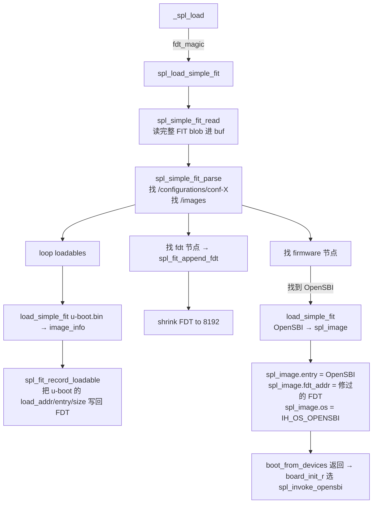
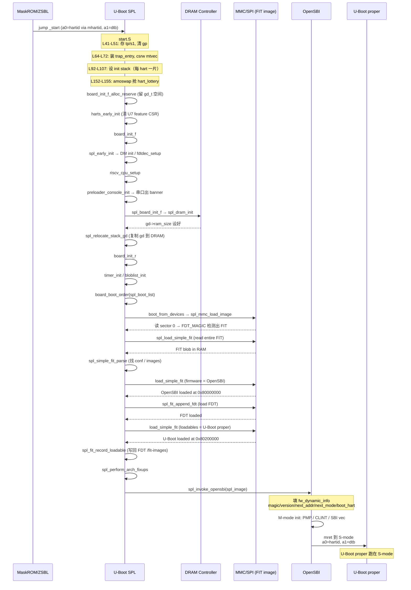
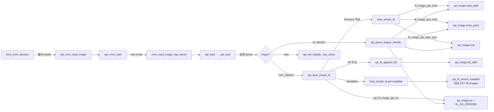

# 03-10 — U-Boot SPL 源码精读：从 reset 到 jumping_to_image

> **核心问题（Deep Questions）：**
> 1. 从 RISC-V reset 跳进 `_start` 之后，到底每一条汇编做了什么？为什么必须先把 `gp` 清零？
> 2. SPL 阶段为什么需要两套 stack（一套 SRAM 内 init stack、一套 DRAM 内运行 stack）？切换是怎么做的？
> 3. `struct spl_image_info` 这一坨字段在每个 backend 的填充顺序是什么？谁负责 `entry_point`？谁负责 `fdt_addr`？
> 4. FIT 镜像里 `firmware`/`loadables`/`fdt` 节点是按什么搜索顺序被 SPL 找到、加载、记录的？为什么 `loadables` 会写回 FDT？
> 5. SPL 跳转到 OpenSBI 的真实 ABI 是什么？`fw_dynamic_info`（含 `magic / version / next_addr / next_mode / boot_hart`）是怎么填的？
> 6. SPL 自己用什么链接脚本？`u-boot-spl.bin` 是怎么从 ELF 一路 strip / cat / mkimage 出来的？
> 7. 自己从零写一个 KuBoot SPL，最少要决定哪些事？（见 §11 checklist）
>
> **本笔记定位：** [03-06 U-Boot 全局总揽](03-06-u-boot-overview.md) §3 SPL 深入的**源码深化版**。03-06 讲"是什么 / 为什么"，本笔记讲"代码长这样 / 行号在哪 / 为什么这一行不写另一种"。涉及 DRAM 训练原理、FIT 镜像的语法/工具链、SPL/SBI 协作框架等，**不重复**讲，请回链 03-06。
>
> **基线版本：** U-Boot mainline `VERSION=2026 PATCHLEVEL=04`（参考本地 `boot/u-boot/Makefile:3-4`）。注意 v2024 之后 SPL 构建脚本 `scripts/Makefile.spl` 已重命名为 `scripts/Makefile.xpl`（统一处理 SPL/TPL/VPL，见 §7）。

---

## 0. 阅读前置

| 你应该掌握 | 推荐回看 |
|---|---|
| RISC-V 启动状态（M-mode / mhartid / mtvec） | [02-01 §1](02-01-boot-chain-and-sbi.md) |
| FDT 二进制结构（FDT_MAGIC / fdt_path_offset） | [02-05 §1](02-05-fdt-runtime-detection.md) |
| FIT/.its 语法、mkimage 用法 | [03-06 §3.4](03-06-u-boot-overview.md) |
| DDR 训练 PHY/Controller 概念 | [03-06 §3.3](03-06-u-boot-overview.md) |
| U-Boot DM (uclass / udevice) | [03-06 §2.3](03-06-u-boot-overview.md) |
| boot 6 项目对比（barebox/coreboot/edk2/...） | [03-05](03-05-boot-domain-comparison.md) |

**本笔记 grep 友好：** 所有源码行号引用都用 `path:LINE` 格式（GitHub / VSCode / vim 都能 jump-to）。

---

## 1. SPL 启动汇编 deep-dive — `arch/riscv/cpu/start.S` 逐段

源码：`boot/u-boot/arch/riscv/cpu/start.S`（465 行，由 RISC-V SPL 与 U-Boot proper **共用**；通过 `CONFIG_XPL_BUILD` 分裂）。

### 1.1 文件入口、宏定义、ABI 约定（L1-L33）

```asm
#ifdef CONFIG_32BIT
#define LREG    lw         /* RV32 用 lw/sw，操作 4 byte */
#define SREG    sw
#define REGBYTES        4
#define RELOC_TYPE      R_RISCV_32
#else
#define LREG    ld         /* RV64 用 ld/sd，操作 8 byte */
#define SREG    sd
#define REGBYTES        8
#define RELOC_TYPE      R_RISCV_64
#endif
```

**为什么这么写：** 一份 start.S 同时支持 RV32/RV64，靠 `CONFIG_32BIT` 宏切换 load/store 指令、寄存器宽度、ELF 重定位类型。**KuBoot 启发：** Zig 不需要这些 `#ifdef` —— 用 `comptime`/`@ptrFromInt`/`std.Target.Cpu.Arch` 就行，但启动汇编跑在 C ABI 上，绕不开。

### 1.2 `_start` —— 真正的入口点（L40-L51）

```asm
.globl _start
_start:
#if CONFIG_IS_ENABLED(RISCV_MMODE)
        csrr    a0, CSR_MHARTID    /* M-mode 自己读 mhartid 进 a0 */
#endif
        mv      tp, a0             /* tp = hart id（之后到处用）*/
        mv      s1, a1             /* s1 = dtb 指针（来自 ROM/上一级）*/
```

**逐句解读：**
- `csrr a0, mhartid` — RISC-V SPL 是 M-mode，CPU **自己**读 hart ID。S-mode 启动（u-boot proper 由 SBI 拉起）则参数 a0 已经是 hart ID（SBI 调用约定），不需要 csrr。
- `mv tp, a0` — RISC-V `tp`（thread pointer）寄存器在 U-Boot 全程**用作 hart id 缓存**。注释（L46-49）明确写："The thread pointer register is not modified by C code"。GCC/Clang 默认不会动 tp（除非启用 `-mtls-model`），所以可以"借用"。
- `mv s1, a1` — `s1` 是 callee-saved，把 DTB 指针先存进去，跨过后续 C 调用不丢。

**替代方案：** ARM64 同样存在但用 `x0/x1`；Zig SPL 可以用 `@import("std").atomic.Value` + 全局变量代替 tp 借用。

### 1.3 清 gp、装 trap、屏蔽中断（L52-L73）

```asm
        mv      gp, zero          /* 清空 gp 防早期 trap 解 GD */
        la      t0, trap_entry
        csrw    MODE_PREFIX(tvec), t0    /* 装 mtvec/stvec */
        csrw    MODE_PREFIX(ie), zero    /* 屏蔽全部中断 */
```

**为什么先清 gp：** U-Boot 的 trap handler 会通过 `gp`（指向 `gd_t`）打印 panic。如果 reset 时 gp 是 garbage，trap 会再 trap，跑飞。清零后 trap handler 检测到 `gd == NULL` 至少能 hang 住而不是跳到野地址。
**MODE_PREFIX：** 是宏，根据 `RISCV_MMODE`/`RISCV_SMODE` 展开为 `m` 或 `s`，所以同一份汇编自动写 `mtvec` 或 `stvec`。

### 1.4 SMP 情况下检查 hart 范围（L74-L88）

```asm
#if CONFIG_IS_ENABLED(SMP)
        li      t0, CONFIG_NR_CPUS
        bge     tp, t0, hart_out_of_bounds_loop  /* hart_id ≥ NR_CPUS 就 wfi */
        li      t0, MIE_MSIE
        csrs    MODE_PREFIX(ie), t0     /* 只允许 software interrupt（IPI）*/
#endif
```

**意义：** 多核启动时所有 hart 同时进 `_start`，超出编译期 `CONFIG_NR_CPUS` 的 hart 直接掉到 `hart_out_of_bounds_loop`（L426: `wfi; j hart_out_of_bounds_loop`）。允许 MSIE 是为了让 boot hart 之后能用 IPI 唤醒它们做 relocation。

### 1.5 配置 stack pointer（L89-L107）

```asm
call_board_init_f:
#if CONFIG_IS_ENABLED(HAVE_INIT_STACK)
        li      t0, CONFIG_VAL(STACK)         /* 板子提供 init stack 地址 */
#else
        li      t0, SYS_INIT_SP_ADDR          /* 否则用通用 SP */
#endif
        and     t0, t0, -16            /* 16-byte 对齐（RV64 ABI 要求）*/

#if CONFIG_IS_ENABLED(SMP)
        slli    t1, tp, CONFIG_STACK_SIZE_SHIFT
        sub     sp, t0, t1            /* 每个 hart 自己一片 stack */
#else
        mv      sp, t0
#endif
```

**SMP stack 布局：**
```
高地址  ┌──────────────┐ <- t0 = init stack top
        │ hart 0 stack │
        ├──────────────┤ <- t0 - (1<<SHIFT)
        │ hart 1 stack │
        ├──────────────┤ <- t0 - 2*(1<<SHIFT)
        │ hart 2 stack │
        ...
低地址
```

每个 hart 自己一块 stack，size = `1 << CONFIG_STACK_SIZE_SHIFT`（典型 13 = 8KB）。**这就是为什么 RISC-V SPL 跑在 SRAM 时大小受限** —— SRAM 只有 几十 KB 到 1 MB（如 SiFive FU740 的 L2 LIM 是 2 MB），N 个 hart 各自占 8KB，再加 BSS、代码本身，得抠门。

### 1.6 hart_lottery —— 谁来初始化 gd（L147-L211）

这是 RISC-V SPL **最精彩**的设计：所有 hart 都进 `_start`，但**只有一个**（"lottery winner"）继续往下跑做 init，其它的等。

```asm
#if !CONFIG_IS_ENABLED(XIP)
        la      t0, hart_lottery
        li      t1, 1
        amoswap.w s2, t1, 0(t0)     /* 原子交换：谁先到谁是 winner */
        bnez    s2, wait_for_gd_init /* s2 != 0 表示已被抢过 */
#else
        ...
#endif
```

**`amoswap.w s2, t1, 0(t0)` 语义：**
- 把内存 `*(uint32_t *)t0` 原子地换成 `t1`（=1），旧值塞进 `s2`。
- 第一个执行的 hart：内存原本 0，`s2 = 0` → fall through 继续 init。
- 后到的 hart：内存已经 1，`s2 = 1` → 跳到 `wait_for_gd_init`，等 gd 准备好。


### 1.7 board_init_f_alloc_reserve —— 给 gd 留空间（L125-L171）

```asm
call_board_init_f_0:
#if CONFIG_IS_ENABLED(SMP)
        li      t1, CONFIG_NR_CPUS
#else
        li      t1, 1
#endif
        slli    t1, t1, CONFIG_STACK_SIZE_SHIFT
        sub     a0, t0, t1            /* a0 = t0 - 全部 hart 栈空间 */
        jal     board_init_f_alloc_reserve  /* 在那之下分配 gd_t + early malloc */
        mv      s0, a0                /* s0 保存返回的 gd 指针 */

call_harts_early_init:
        jal     harts_early_init      /* 板子可重写：清 U7 feature disable CSR 等 */
```

`board_init_f_alloc_reserve` 是 `common/init/board_init.c` 里的 C 函数，定义返回值为新栈顶；它从给定地址向下分配 `gd_t`、early malloc pool（`SYS_MALLOC_F_LEN` 字节）等。

### 1.8 跳进 board_init_f（L213-L219）

```asm
#ifdef CONFIG_DEBUG_UART
        jal     debug_uart_init        /* 板子可选：极早 UART 用于打印初始化阶段 */
#endif

        mv      a0, zero               /* board_init_f(boot_flags=0) */
        la      t5, board_init_f
        jalr    t5
```

跳到 C 入口 `board_init_f`，**不返回**（return 进入 BSS 清空 + relocation 路径）。

### 1.9 spl_clear_bss + relocate stack + board_init_r（L221-L272）

```asm
#ifdef CONFIG_XPL_BUILD
spl_clear_bss:
        la      t0, __bss_start
        la      t1, __bss_end
        beq     t0, t1, spl_stack_gd_setup
spl_clear_bss_loop:
        SREG    zero, 0(t0)
        addi    t0, t0, REGBYTES
        blt     t0, t1, spl_clear_bss_loop

spl_stack_gd_setup:
        jal     spl_relocate_stack_gd  /* 把 gd 搬到 DRAM，新栈顶在 a0 */
        beqz    a0, spl_call_board_init_r  /* a0=0 表示不重定位 */
        mv      s0, a0
        ...
        mv      sp, s0
1:      mv      gp, s0                 /* 主 hart：新 gp = 新 gd */

spl_call_board_init_r:
        mv      a0, zero
        mv      a1, zero
        j       board_init_r           /* 不返回 */
#endif
```

**两阶段 stack 的来由：**
1. `board_init_f` 还在初始 SRAM stack 上跑 → 调 `spl_dram_init()` 训 DDR；
2. DDR ready 后 `spl_relocate_stack_gd()`（`common/spl/spl.c:920`）在 DRAM 顶分配新 gd_t + 新栈，memcpy 旧 gd 进去；
3. 切换 sp + gp，跳进 `board_init_r`，从此完全在 DRAM 上跑（栈大、可以做复杂的 MMC / FIT 解析）。

> **KuBoot 设计抉择：** Zig 完全可以省掉这步 —— 如果 SRAM 够大（>= 256KB），`board_init_r` 也跑在 SRAM 上。但**真实硬件**（K1/JH7110/FU740）SPL SRAM 只有 16-128 KB，FIT 解析需要几 MB malloc，必须切。

### 1.10 secondary_hart_loop（L449-L465）

```asm
secondary_hart_loop:
        wfi
#if CONFIG_IS_ENABLED(SMP)
        csrr    t0, MODE_PREFIX(ip)
#if CONFIG_IS_ENABLED(RISCV_MMODE)
        andi    t0, t0, MIE_MSIE
#else
        andi    t0, t0, SIE_SSIE
#endif
        beqz    t0, secondary_hart_loop  /* 不是 IPI 醒来就接着睡 */
        mv      a0, tp
        jal     handle_ipi               /* 处理 IPI（boot hart 通知做 relocate）*/
#endif
        j       secondary_hart_loop
```

**意义：** 输家 hart 一直 wfi 等 IPI；boot hart 把 SPL 重定位到 DRAM 后，通过 `smp_call_function` 发 IPI 让它们也做 relocate（搬运 stack 到 DRAM、装新的 trap_entry），见 L378-L401 的 `relocate_secondary_harts`。

---

## 2. SPL C 入口主链 — board_init_f → board_init_r

### 2.1 `board_init_f` —— 平台无关骨架（RISC-V 弱实现）

源码：`boot/u-boot/arch/riscv/lib/spl.c:22-37`

```c
__weak void board_init_f(ulong dummy)
{
    int ret;
    ret = spl_early_init();           /* 初始化 DM、bootstage */
    if (ret) panic("spl_early_init() failed: %d\n", ret);
    riscv_cpu_setup();                /* CSR 初始化（FPU、cache等）*/
    preloader_console_init();         /* 串口出 banner */
    ret = spl_board_init_f();         /* 板子的 DRAM 训练 + 板子初始化 */
    if (ret) panic("spl_board_init_f() failed: %d\n", ret);
}
```

`__weak` 修饰允许板子**整个覆写**这套流程（如 SoCFPGA 直接重写）。**典型路径只重写 `spl_board_init_f`**（弱默认见同文件 L17-20，return 0）。

### 2.2 `spl_early_init` 与 `spl_init`（共有逻辑）

源码：`common/spl/spl.c:474-572`

```c
static int spl_common_init(bool setup_malloc)
{
    /* 1. 设置 early malloc pool（CFG_MALLOC_F_ADDR / SYS_MALLOC_F_LEN）*/
    if (setup_malloc) {
        gd->malloc_base = CFG_MALLOC_F_ADDR;
        gd->malloc_limit = CONFIG_VAL(SYS_MALLOC_F_LEN);
    }
    bootstage_init(xpl_is_first_phase());
    if (!xpl_is_first_phase())
        bootstage_unstash_default();   /* TPL 把 bootstage 传给 SPL */
    if (CONFIG_IS_ENABLED(LOG))
        log_init();
    if (CONFIG_IS_ENABLED(OF_REAL))
        fdtdec_setup();                /* 找到内置 DTB（链接进 SPL 的 .dtb 段）*/
    if (CONFIG_IS_ENABLED(DM)) {
        dm_init_and_scan(!CONFIG_IS_ENABLED(OF_PLATDATA));
        dm_autoprobe();                /* 探测所有 SPL 需要的设备 */
    }
    return 0;
}
```

**关键点：**
- early malloc 是个 **bump allocator**（`common/dlmalloc.c` 的 `simple_malloc`），不能 free。够 SPL 用 + DM scan 用。
- `fdtdec_setup` 看 `gd->fdt_blob`：通常指向 SPL `.dtb` 链接进来的位置（`__dtb_dt_begin`）。
- `dm_autoprobe` 是 v2024+ 引入：自动 probe 所有 `DM_FLAG_PROBE_AFTER_BIND` 的设备，少写 `uclass_get_device`。

### 2.3 `spl_board_init_f` —— 真正干活的地方（板子专属）

参考 SiFive Unmatched 的实现：`boot/u-boot/board/sifive/unmatched/spl.c:133-171`

```c
int spl_board_init_f(void)
{
    int ret;
    ret = spl_dram_init();              /* DDR 训练 → uclass_get_device(UCLASS_RAM,0) */
    if (ret) goto end;
    spl_pwm_device_init();              /* 板载 LED */
    ret = spl_gemgxl_init();            /* PHY VSC8541 reset 序列 */
    ret = spl_usb_pcie_bridge_init();   /* USB-PCIe bridge ASM1042A reset */
    ret = spl_usb_hub_init();
    ret = spl_ulpi_init();
end:
    return ret;
}
```

而 `spl_dram_init` 在 `boot/u-boot/arch/riscv/cpu/fu740/spl.c:13-26`：

```c
int spl_dram_init(void)
{
    struct udevice *dev;
    int ret = uclass_get_device(UCLASS_RAM, 0, &dev);  /* 触发 SiFive DDR 驱动 probe */
    if (ret) {
        debug("DRAM init failed: %d\n", ret);
        return ret;
    }
    return 0;
}
```

**核心模式：DRAM 训练完全藏在 DM 里。** `uclass_get_device(UCLASS_RAM, 0, ...)` 触发的 probe 函数才是真正写 PHY/Controller 寄存器的地方（详细原理见 [03-06 §3.3](03-06-u-boot-overview.md)）。本地 SiFive DDR 驱动**未克隆**（`drivers/ddr/sifive/` 不存在），可参考 `drivers/ddr/altera/`、`drivers/ddr/imx/` 或 mainline upstream 的 `drivers/ddr/sifive/fu540_ddr.c`、`fu740_ddr.c`。

**对比 JH7110**（`arch/riscv/cpu/jh7110/spl.c:31-56`）多做了一步 EEPROM 读 DRAM 容量：

```c
size = get_ddr_size_from_eeprom();
if (check_ddr_size(size))
    gd->ram_size = size << 30;
ret = uclass_get_device(UCLASS_RAM, 0, &dev);
```

**对比 K1**（`arch/riscv/cpu/k1/dram.c:50-55`）只读 DDR 控制器寄存器查容量（DDR 由更早级 BootROM 训好了）：

```c
int dram_init(void)
{
    gd->ram_base = CFG_SYS_SDRAM_BASE;
    gd->ram_size = ddr_get_density() * SZ_1M;  /* 读 DDR_BASE+0x200 / +0x208 寄存器 */
    return 0;
}
```

**结论：DRAM 训练是 SPL 最 SoC-specific 的部分。** 三种典型形式：
1. **vendor closed blob**（K230/D1/RK35xx）：把 vendor 的 DRAM init 二进制 prepend 到 SPL；
2. **U-Boot 内驱动**（FU540/FU740/JH7110）：UCLASS_RAM 驱动调 PHY / Controller 寄存器；
3. **BootROM 已训完**（K1）：SPL 只读容量寄存器，不再训。

### 2.4 `board_init_r` —— 主驱动循环（共 ~180 行）

源码：`common/spl/spl.c:672-855`

```c
void board_init_r(gd_t *dummy1, ulong dummy2)
{
    u32 spl_boot_list[] = { BOOT_DEVICE_NONE × 5 };
    spl_jump_to_image_t jumper = &jump_to_image;
    struct spl_image_info spl_image;

    spl_set_bd();                              /* gd->bd = &bdata */
    if (IS_ENABLED(CONFIG_SPL_SYS_MALLOC))
        mem_malloc_init(SPL_SYS_MALLOC_START, SPL_SYS_MALLOC_SIZE);
    if (!(gd->flags & GD_FLG_SPL_INIT))
        spl_init();
    timer_init();
    bloblist_init();                           /* 可选：bloblist hand-off */
    if (CONFIG_IS_ENABLED(SOC_INIT))   spl_soc_init();
    if (CONFIG_IS_ENABLED(WDT))         initr_watchdog();
    if (CONFIG_IS_ENABLED(BOARD_INIT))  spl_board_init();

    memset(&spl_image, 0, sizeof(spl_image));
    spl_image.boot_device = BOOT_DEVICE_NONE;
    board_boot_order(spl_boot_list);           /* 板子重写：填 boot_list */

    ret = boot_from_devices(&spl_image, spl_boot_list, ARRAY_SIZE(spl_boot_list));
    if (ret) hang();

    spl_perform_arch_fixups(&spl_image);
    spl_perform_board_fixups(&spl_image);

    /* 根据 spl_image.os 选择 jumper */
    switch (spl_image.os) {
    case IH_OS_U_BOOT:               /* 默认就是 jump_to_image */
    case IH_OS_ARM_TRUSTED_FIRMWARE: jumper = &spl_invoke_atf;     break;
    case IH_OS_TEE:                  jumper = &jump_to_image_optee; break;
    case IH_OS_OPENSBI:              jumper = &spl_invoke_opensbi; break;
    case IH_OS_LINUX:                jumper = &jump_to_image_linux; break;
    }
    bloblist_finish();
    spl_board_prepare_for_boot();
    jumper(&spl_image);                        /* 不返回 */
}
```

`boot_from_devices`（同文件 L626-L670）按 `spl_boot_list` 顺序遍历所有注册过的 `spl_image_loader`，谁能成功 load 就用谁。注册机制见 §5。

---

## 3. 关键数据结构

### 3.1 `struct spl_image_info` —— 跨阶段消息总线

源码：`include/spl.h:284-314`

```c
struct spl_image_info {
    const char *name;        /* 调试用，"U-Boot" / "Linux" / "OpenSBI" */
    u8         os;           /* IH_OS_U_BOOT / IH_OS_OPENSBI / IH_OS_LINUX */
    ulong      load_addr;    /* 把 next 阶段加载到哪个物理地址 */
    ulong      entry_point;  /* next 阶段入口（一般等于 load_addr，FIT 可指定）*/
#if CONFIG_IS_ENABLED(LOAD_FIT) || CONFIG_IS_ENABLED(LOAD_FIT_FULL)
    void       *fdt_addr;    /* FIT 里 FDT 子节点 load 完毕的地址 */
#endif
    u32        boot_device;  /* BOOT_DEVICE_MMC1 / BOOT_DEVICE_SPI / ... */
    u32        offset;       /* 设备内偏移（raw 模式用）*/
    u32        size;         /* 加载多少字节 */
    ulong      fdt_size;
    u32        flags;        /* SPL_FIT_FOUND / SPL_COPY_PAYLOAD_ONLY */
    void       *arg;         /* 给下一阶段的 cmdline 或 boot args */
#ifdef CONFIG_SPL_LEGACY_IMAGE_CRC_CHECK
    ulong      dcrc_data;    /* legacy uImage 数据起点 */
    ulong      dcrc_length;  /* legacy uImage 数据长度 */
    ulong      dcrc;         /* 期待的 CRC32 */
#endif
#if CONFIG_IS_ENABLED(RELOC_LOADER)
    void       *buf, *fdt_buf, *fdt_start, *rcode_buf;
    uint       *stack_prot;
    ulong      reloc_offset;
#endif
};
```

**字段填充顺序**（典型 FIT/RISC-V 路径）：
1. `boot_from_devices` 调 `loader->load_image(spl_image, bootdev)` → 进入 `spl_mmc_load_image`；
2. `spl_mmc_load` → `mmc_load_image_raw_sector` → `_spl_load`（`include/spl_load.h:13`）；
3. `_spl_load` 读首 sector，根据 magic 判断 FIT / legacy / IMX：
   - FIT (`FDT_MAGIC = 0xd00dfeed`) → `spl_load_simple_fit` 填 `entry_point` / `load_addr` / `os` / `fdt_addr`；
   - legacy (`IH_MAGIC = 0x27051956`) → `spl_parse_image_header` 填字段；
   - raw → `spl_set_header_raw_uboot` 填 `load_addr = CONFIG_TEXT_BASE`、`entry_point = CONFIG_SYS_UBOOT_START`。
4. `spl_perform_arch_fixups` / `spl_perform_board_fixups` 给 board 最后改 `arg` / 注入 cmdline 的机会；
5. 最后 jumper 用 `entry_point` + `fdt_addr` 跳。

### 3.2 `struct global_data` (gd_t) —— 全局状态

源码：`include/asm-generic/global_data.h:40-` （RISC-V 部分附加在 `arch/riscv/include/asm/global_data.h:20-49`）

**SPL 阶段最关键字段：**

```c
struct global_data {
    struct bd_info  *bd;              /* dram banks 信息（line 44）*/
    struct global_data *new_gd;       /* relocate 后新 gd_t 地址 */
    const void      *fdt_blob;        /* SPL 自己的 DTB（非传给 OS 的）*/
    struct udevice  *cur_serial_dev;  /* 当前 console 设备 */
    phys_size_t     ram_size;
    phys_addr_t     ram_top;
    unsigned long   flags;            /* GD_FLG_RELOC / GD_FLG_SPL_INIT / ...*/
    unsigned long   relocaddr;        /* relocation 后的 _start 地址 */
    unsigned long   start_addr_sp;    /* 当前 stack pointer */
    unsigned long   reloc_off;        /* relocation offset = relocaddr - link_addr */
    unsigned int    baudrate;
    struct arch_global_data arch;     /* 架构专属（RISC-V: boot_hart / firmware_fdt_addr）*/
    /* ... */
};
```

**RISC-V `struct arch_global_data`**（`arch/riscv/include/asm/global_data.h:20-46`）：

```c
struct arch_global_data {
    long             boot_hart;          /* mhartid，由 start.S L175 写入 */
    phys_addr_t      firmware_fdt_addr;  /* DTB 地址（来自 a1 / s1）*/
#if CONFIG_IS_ENABLED(RISCV_ACLINT)
    void __iomem *aclint;
#endif
#if CONFIG_IS_ENABLED(SMP)
    struct ipi_data ipi[CONFIG_NR_CPUS];
#endif
#ifdef CONFIG_AVAILABLE_HARTS
    ulong            available_harts;    /* 实际跑起来的 hart 位图 */
#endif
    struct resume_data *resume;
};
```

`boot_hart` 是 SPL → OpenSBI → Linux 全程**每一阶段都关心**的字段。`spl_invoke_opensbi` 把它写进 `fw_dynamic_info.boot_hart`（见 §4.5）。

### 3.3 `struct legacy_img_hdr` —— uImage v1 头（64 byte）

源码：`include/image.h:325-338`

```c
#define IH_MAGIC  0x27051956     /* 1956-05-27, U-Boot 创始人 Wolfgang Denk 生日 */
#define IH_NMLEN  32

struct legacy_img_hdr {
    uint32_t  ih_magic;          /* 0x27051956（big-endian）*/
    uint32_t  ih_hcrc;           /* 头 CRC32（不含 ih_hcrc 自身字段）*/
    uint32_t  ih_time;           /* unix 时间戳 */
    uint32_t  ih_size;           /* 数据长度（不含本头）*/
    uint32_t  ih_load;           /* 加载到哪 */
    uint32_t  ih_ep;             /* 入口点 */
    uint32_t  ih_dcrc;           /* 数据 CRC32 */
    uint8_t   ih_os;             /* IH_OS_LINUX / IH_OS_U_BOOT / IH_OS_OPENSBI ... */
    uint8_t   ih_arch;           /* IH_ARCH_RISCV / IH_ARCH_ARM / ... */
    uint8_t   ih_type;           /* IH_TYPE_KERNEL / IH_TYPE_FIRMWARE / ... */
    uint8_t   ih_comp;           /* IH_COMP_NONE / GZIP / LZMA / ... */
    uint8_t   ih_name[IH_NMLEN]; /* "Linux-6.6" 之类 */
};
```

**所有字段 big-endian**（注释 L322 "all data in network byte order"）。这是 1990 年代 PowerPC 时代留下的传统。检测 magic 用 `image_get_magic(header) == IH_MAGIC`（ntohl）。

**FIT 头的 magic 不是 IH_MAGIC 而是 `FDT_MAGIC = 0xd00dfeed`**，因为 FIT 本质上就是个 device tree blob。`_spl_load` 用这两个 magic 区分两种格式（`include/spl_load.h:29-59`）。

### 3.4 `struct spl_load_info` —— Loader 抽象（很多 backend 共享）

源码：`include/spl.h:353-363`

```c
struct spl_load_info {
    spl_load_reader read;        /* 函数指针：从设备读 */
    void           *priv;        /* 给 reader 的私有数据（一般是 blk_desc *）*/
#if IS_ENABLED(CONFIG_SPL_LOAD_BLOCK)
    u16            bl_len;       /* 设备 block 大小（512/4096）*/
#endif
#if CONFIG_IS_ENABLED(BOOTMETH_VBE)
    u8             phase;        /* VBE phase: SPL/VPL/U-Boot */
    u8             fdt_update;
#endif
};

typedef ulong (*spl_load_reader)(struct spl_load_info *load, ulong sector,
                                 ulong count, void *buf);
```

**用法**（mmc 例，`common/spl/spl_mmc.c:19-27`）：

```c
static ulong h_spl_load_read(struct spl_load_info *load, ulong off,
                             ulong size, void *buf)
{
    struct blk_desc *bd = load->priv;
    lbaint_t sector = off >> bd->log2blksz;
    lbaint_t count  = size >> bd->log2blksz;
    return blk_dread(bd, sector, count, buf) << bd->log2blksz;
}

/* 使用 */
spl_load_init(&load, h_spl_load_read, bd, bd->blksz);
spl_load(spl_image, bootdev, &load, 0, sector << bd->log2blksz);
```

**意义：** 把"从某设备读字节"统一成 `read(load, off, size, buf)`。FIT 加载、legacy 加载、LZMA 加载都基于这个抽象。

### 3.5 `struct spl_image_loader` + `SPL_LOAD_IMAGE_METHOD` 注册宏

源码：`include/spl.h:794-844`

```c
struct spl_image_loader {
#ifdef CONFIG_SPL_LIBCOMMON_SUPPORT
    const char *name;            /* "MMC1" / "SPI" / "NOR" */
#endif
    uint       boot_device;      /* BOOT_DEVICE_MMC1 / BOOT_DEVICE_SPI / ... */
    int (*load_image)(struct spl_image_info *spl_image,
                      struct spl_boot_device *bootdev);
};

#define SPL_LOAD_IMAGE_METHOD(_name, _priority, _boot_device, _method) \
    SPL_LOAD_IMAGE(_boot_device ## _priority ## _method) = {       \
        .name = _name, .boot_device = _boot_device,                 \
        .load_image = _method,                                       \
    }
```

`SPL_LOAD_IMAGE_METHOD` 把每个 backend 注册到 linker section `.u_boot_list_2_spl_image_loader_*`。`boot_from_devices` 用 `ll_entry_start/count` 拿到所有 loader 的数组：

```c
struct spl_image_loader *drv =
    ll_entry_start(struct spl_image_loader, spl_image_loader);
const int n_ents =
    ll_entry_count(struct spl_image_loader, spl_image_loader);
```

这是 U-Boot 经典的 **linker_lists** 套路（类似 Linux kernel `__init` / `__exitcall`）。`u-boot-spl.lds:36-38`:

```ld
__u_boot_list : {
    KEEP(*(SORT(__u_boot_list*)));
} > .spl_mem
```

`KEEP` 防止 `--gc-sections` 删除；`SORT` 按 priority 字符串排序。

### 3.6 `struct spl_fit_info` —— FIT 解析上下文（spl_fit.c 内部）

源码：`common/spl/spl_fit.c:24-29`

```c
struct spl_fit_info {
    const void *fit;          /* FIT blob 地址（malloc 出来的）*/
    size_t      ext_data_offset; /* external data 起点（FIT 头后对齐 4）*/
    int         images_node;     /* /images 节点 fdt offset */
    int         conf_node;       /* /configurations/conf-X 节点 offset */
};
```

只在 spl_fit.c 内部使用，跨函数传递解析进度。

### 3.7 `struct fw_dynamic_info` —— SPL → OpenSBI ABI

源码：`include/opensbi.h`（U-Boot 这边的镜像），与 OpenSBI `firmware/include/fw_dynamic.h` 对齐。

```c
struct fw_dynamic_info {
    unsigned long magic;       /* 0x4942534f ("OSBI") */
    unsigned long version;     /* 当前 = 2 */
    unsigned long next_addr;   /* 下一阶段（U-Boot proper / Linux）入口 */
    unsigned long next_mode;   /* FW_DYNAMIC_INFO_NEXT_MODE_S = 1 (S-mode) */
    unsigned long options;     /* SBI_SCRATCH_NO_BOOT_PRINTS = 0x1 */
    unsigned long boot_hart;   /* RISC-V boot hart id */
};
```

SPL 在 a2 寄存器里传 `&fw_dynamic_info` 给 OpenSBI；a0=hartid, a1=dtb，详见 §4.5。

---

## 4. FIT 镜像加载源码 — `common/spl/spl_fit.c`

**整体流程图：**



### 4.1 入口 `spl_load_simple_fit`（`spl_fit.c:797-943`）

签名：

```c
int spl_load_simple_fit(struct spl_image_info *spl_image,
                        struct spl_load_info *info, ulong offset, void *fit);
```

- `info` 来自 backend（MMC/SPI/NOR），告诉它怎么读；
- `offset` 是 FIT 在设备上的 byte offset；
- `fit` 是已读到的 FIT 头一部分（用来探测）。

主流程（精简）：

```c
1. spl_simple_fit_read(&ctx, info, offset, fit);     /* 把整个 FIT blob 读进 malloc'd buf */
2. ctx.fit = spl_load_simple_fit_fix_load(ctx.fit);  /* 板子可重写做 fix（默认 noop）*/
3. spl_simple_fit_parse(&ctx);                       /* 找 conf_node + images_node */
4. node = spl_fit_get_image_node(&ctx, FIT_FIRMWARE_PROP, 0);  /* 优先 firmware */
5. if (node < 0 && OS_BOOT) node = ... FIT_KERNEL_PROP ...;
6. if (node < 0) node = ... "loadables" 第 0 个 ...;
7. load_simple_fit(info, offset, &ctx, node, spl_image);     /* 真正加载 firmware */
8. spl_fit_image_get_os(...) → 决定 spl_image->os
9. if (os_takes_devicetree(os)) spl_fit_append_fdt(spl_image, info, offset, &ctx);
10. for (index=0; loadables[index] exists; index++) {
       load_simple_fit → image_info;
       spl_fit_record_loadable → 把信息写回 FDT 的 /fit-images/<name> 节点;
    }
11. spl_image->flags |= SPL_FIT_FOUND;
```

**搜索顺序（关键设计）：**
1. `firmware` —— 优先（典型放 OpenSBI 或 ATF）；
2. 没 firmware 但有 `kernel` 且 `OS_BOOT`（Falcon mode）—— 直接跳 Linux；
3. 没上面两个 → 用 `loadables[0]`，并把后续 loadables 从 index=1 开始处理。

**这就是为什么 RISC-V FIT 里通常长这样**（`.its` 模板）：

```dts
/ {
    images {
        opensbi { type="firmware"; load=<0x80000000>; entry=<0x80000000>; ... };
        uboot   { type="standalone"; load=<0x80200000>; entry=<0x80200000>; ... };
        fdt-1   { type="flat_dt"; ... };
    };
    configurations {
        default = "conf-1";
        conf-1 {
            firmware  = "opensbi";
            loadables = "uboot";   /* SPL 加载完 firmware 后再加载这些 */
            fdt       = "fdt-1";
        };
    };
};
```

### 4.2 `load_simple_fit` —— 一个 image 节点的加载（`spl_fit.c:212-375`）

```c
static int load_simple_fit(struct spl_load_info *info, ulong fit_offset,
                           const struct spl_fit_info *ctx, int node,
                           struct spl_image_info *image_info)
{
    /* 1. 取 load 地址（FIT 节点 load 属性）*/
    if (fit_image_get_load(fit, node, &load_addr)) {
        if (!image_info->load_addr) return -ENOBUFS;   /* 必须有 fallback */
        load_addr = image_info->load_addr;
    }

    /* 2. 取数据偏移：data-position（FIT 内偏移）or data-offset（外部偏移）*/
    if (!fit_image_get_data_position(fit, node, &offset))
        external_data = true;
    else if (!fit_image_get_data_offset(fit, node, &offset)) {
        offset += ctx->ext_data_offset;
        external_data = true;
    }

    if (external_data) {
        fit_image_get_data_size(fit, node, &len);
        src_ptr = map_sysmem(ALIGN(load_addr, ARCH_DMA_MINALIGN), len);
        info->read(info, fit_offset + ALIGN_DOWN(offset, bl_len), size, src_ptr);
        src = src_ptr + overhead;
    } else {
        fit_image_get_emb_data(fit, node, &data, &length);   /* 数据嵌在 FIT 里 */
        src = (void *)data;
    }

    /* 3. 验证签名（可选）*/
    if (CONFIG_IS_ENABLED(FIT_SIGNATURE)) {
        fit_image_verify_with_data(fit, node, gd_fdt_blob(), src, length);
    }

    /* 4. 解压 + 拷贝到目标地址 */
    if (image_comp == IH_COMP_GZIP) gunzip(load_ptr, ...);
    else if (image_comp == IH_COMP_LZMA) image_decomp(...);
    else memmove(load_ptr, src, length);

    /* 5. 填回 image_info */
    image_info->load_addr = load_addr;
    image_info->size = length;
    fit_image_get_entry(fit, node, &entry_point);
    image_info->entry_point = entry_point;
    return 0;
}
```

**`external_data` vs embedded data：**
- **embedded**：FIT 里 `data = [...]` 直接放二进制。FIT 单文件就够，但变大。
- **external**：FIT 里只放 `data-offset` / `data-size`，二进制接在 FIT 头之后。`mkimage -E` 默认产生这种，便于增量更新（改 image 不需要改 FIT 头里的 hash 直接对内容算）。

### 4.3 `spl_fit_append_fdt` —— FDT 加在 image 之后（`spl_fit.c:395-515`）

```c
static int spl_fit_append_fdt(struct spl_image_info *spl_image,
                              struct spl_load_info *info, ulong offset,
                              const struct spl_fit_info *ctx)
{
    struct spl_image_info image_info;
    image_info.load_addr = ALIGN(spl_image->load_addr + spl_image->size, 8);

    int node = spl_fit_get_image_node(ctx, FIT_FDT_PROP, 0);
    if (node < 0) {
        /* FIT 没 fdt → 用 SPL 自己的 fdt_blob */
        size = fdt_totalsize(gd->fdt_blob);
        spl_image->fdt_addr = map_sysmem(image_info.load_addr, size);
        memcpy(spl_image->fdt_addr, gd->fdt_blob, size);
    } else {
        load_simple_fit(info, offset, ctx, node, &image_info);
        spl_image->fdt_addr = phys_to_virt(image_info.load_addr);
    }

#if CONFIG_IS_ENABLED(LOAD_FIT_APPLY_OVERLAY)
    /* 把 FIT 里 fdt-overlay-* 节点合并进 base FDT */
    for (index = 1; ; index++) {
        ret = spl_fit_get_image_name(ctx, FIT_FDT_PROP, index, &str);
        if (ret == -E2BIG) break;
        load_simple_fit(... → tmpbuffer);
        fdt_increase_size(spl_image->fdt_addr, image_info.size);
        fdt_overlay_apply_verbose(spl_image->fdt_addr, tmpbuffer);
    }
#endif

    fdt_shrink_to_minimum(spl_image->fdt_addr, 8192);  /* 留 8KB 给 fixup */
    return ret;
}
```

**为什么叫 "append"：** FDT 物理地址固定接在 firmware/kernel image 之后（`load_addr + size`，8 byte 对齐）。下一阶段（U-Boot / Linux）按 RISC-V 启动 ABI，期望从 a1 拿到 DTB 指针。

**多 FDT 选择：** `spl_fit_get_image_name` 用 `board_fit_config_name_match`（板子重写）来选 FIT 里多个 conf 节点中最匹配的那个 —— SiFive Unmatched 简单地返回 0（取第一个，`board/sifive/unmatched/spl.c:191-195`）。

### 4.4 `spl_fit_record_loadable` —— 把 loadable 写回 FDT（`spl_fit.c:517-537`）

```c
static int spl_fit_record_loadable(const struct spl_fit_info *ctx, int index,
                                   void *blob, struct spl_image_info *image)
{
    spl_fit_get_image_name(ctx, "loadables", index, &name);
    int node = spl_fit_get_image_node(ctx, "loadables", index);
    return fdt_record_loadable(blob, index, name,
                               image->load_addr, image->size,
                               image->entry_point,
                               fdt_getprop(ctx->fit, node, FIT_TYPE_PROP, NULL),
                               fdt_getprop(ctx->fit, node, FIT_OS_PROP, NULL),
                               fdt_getprop(ctx->fit, node, FIT_ARCH_PROP, NULL));
}
```

**写回 FDT 的目的：** OpenSBI 需要知道 U-Boot 在哪。SPL 把所有 loadable（U-Boot proper、Linux 等）的位置/大小/类型写到传给 OpenSBI 的 FDT 的 `/fit-images/<name>` 子节点。OpenSBI 启动时遍历这个子节点找 next stage。源码：`spl_opensbi_find_os_node`（`common/spl/spl_opensbi.c:24-45`）。

### 4.5 `spl_invoke_opensbi` —— 跳进 OpenSBI（`common/spl/spl_opensbi.c:47-131`）

```c
struct fw_dynamic_info opensbi_info;

void __noreturn spl_invoke_opensbi(struct spl_image_info *spl_image)
{
    int os_type = IS_ENABLED(LOAD_FIT_OPENSBI_OS_BOOT) ? IH_OS_LINUX : IH_OS_U_BOOT;

    /* 1. 在 FDT /fit-images 下找 next stage（U-Boot 或 Linux）*/
    spl_opensbi_find_os_node(spl_image->fdt_addr, &os_node, os_type);

    /* 2. 取 entry */
    fit_image_get_entry(spl_image->fdt_addr, os_node, &os_entry);

    /* 3. 填 fw_dynamic_info */
    opensbi_info.magic     = FW_DYNAMIC_INFO_MAGIC_VALUE;        /* 0x4942534f */
    opensbi_info.version   = FW_DYNAMIC_INFO_VERSION;             /* 2 */
    opensbi_info.next_addr = os_entry;
    opensbi_info.next_mode = FW_DYNAMIC_INFO_NEXT_MODE_S;         /* 1 = S-mode */
    opensbi_info.options   = CONFIG_SPL_OPENSBI_SCRATCH_OPTIONS;  /* 0x1 默认 */
    opensbi_info.boot_hart = gd->arch.boot_hart;

    /* 4. 多 hart 同步 */
#ifdef CONFIG_SPL_SMP
    smp_call_function((ulong)spl_image->entry_point,
                      (ulong)spl_image->fdt_addr,
                      (ulong)&opensbi_info, 1);   /* 让 secondary hart 也跳 */
#endif

    /* 5. main hart 跳 */
    invalidate_icache_all();
    typedef void __noreturn (*opensbi_entry_t)(ulong hartid, ulong dtb, ulong info);
    opensbi_entry_t entry = (opensbi_entry_t)spl_image->entry_point;
    entry(gd->arch.boot_hart, (ulong)spl_image->fdt_addr, (ulong)&opensbi_info);
}
```

**ABI**（与 OpenSBI `fw_dynamic.S` 对齐）：

| 寄存器 | 内容 |
|---|---|
| `a0` | hartid |
| `a1` | DTB 物理地址 |
| `a2` | `&fw_dynamic_info` |
| `pc` | OpenSBI 入口（fw_dynamic 的 `_start`）|

OpenSBI 看到 `a2` 里 magic 是 `OSBI` 就走 fw_dynamic 路径，从 `next_addr` 跳；如果 magic 不对，回退到 fw_jump（编译时 hardcoded next_addr）或 fw_payload（payload 直接 link 进 OpenSBI）。

---

## 5. 存储 backend — Loader 注册机制

### 5.1 全部 backend 一览

`common/spl/` 目录下凡是 `spl_<name>.c` 都是一个 backend。看清单：

| backend 文件 | 描述 | 注册的 BOOT_DEVICE |
|---|---|---|
| `spl_mmc.c`         | eMMC / SD 卡 | MMC1, MMC2, MMC2_2 |
| `spl_spi.c`         | SPI NOR Flash | SPI |
| `spl_nor.c`         | 并行 NOR Flash | NOR |
| `spl_nand.c`        | NAND Flash | NAND |
| `spl_net.c`         | 网络（TFTP / BOOTP） | NET |
| `spl_usb.c`         | USB Mass Storage | USB |
| `spl_sata.c`        | SATA | SATA |
| `spl_nvme.c`        | NVMe | NVME |
| `spl_ymodem.c`      | UART YMODEM 上传 | UART |
| `spl_semihosting.c` | ARM/RISC-V Semihosting | SEMIHOSTING |
| `spl_ram.c`         | RAM 已加载（开发用） | RAM |
| `spl_xip.c`         | XIP（不加载，原地执行） | XIP |
| `spl_bootrom.c`     | 回到 BootROM | BOOTROM |
| `spl_dfu.c`         | USB DFU | DFU |
| `spl_sdp.c`         | i.MX serial download | SDP |
| `spl_ubi.c`         | UBI on NAND | NAND_UBI |
| `spl_imx_container.c` | i.MX container | (内嵌) |
| `spl_optee.S`       | 跳进 OP-TEE 的汇编桩 | (jumper) |
| `spl_opensbi.c`     | 跳进 OpenSBI 的桩 | (jumper) |
| `spl_atf.c`         | 跳进 ATF/BL31 的桩 | (jumper) |

最后 3 个不是 loader 而是 jumper（在 `board_init_r` 里根据 `spl_image.os` 选择）。

### 5.2 注册过程示例（MMC）

`common/spl/spl_mmc.c:480-482`：

```c
SPL_LOAD_IMAGE_METHOD("MMC1",  0, BOOT_DEVICE_MMC1,   spl_mmc_load_image);
SPL_LOAD_IMAGE_METHOD("MMC2",  0, BOOT_DEVICE_MMC2,   spl_mmc_load_image);
SPL_LOAD_IMAGE_METHOD("MMC2_2",0, BOOT_DEVICE_MMC2_2, spl_mmc_load_image);
```

宏展开后：

```c
ll_entry_declare(struct spl_image_loader,
                 BOOT_DEVICE_MMC1_0_spl_mmc_load_image,
                 spl_image_loader) = {
    .name = "MMC1",
    .boot_device = BOOT_DEVICE_MMC1,
    .load_image = spl_mmc_load_image,
};
```

每个变量被放在专属 linker section（详见 `include/linker_lists.h`）。链接脚本 `__u_boot_list` 段把它们全收一起，运行时遍历即可。

### 5.3 板子选 boot device — `spl_boot_device` 与 `board_boot_order`

`board_init_r` 调 `board_boot_order(spl_boot_list)` 让板子填一个优先级数组（默认实现 `common/spl/spl.c:578-581` 只填一项 = `spl_boot_device()`）。

**SiFive Unmatched 实现**（`board/sifive/unmatched/spl.c:173-188`）：

```c
u32 spl_boot_device(void)
{
    u32 mode_select = readl((void *)MODE_SELECT_REG);   /* 0x10000 */
    u32 boot_device = mode_select & MODE_SELECT_MASK;
    switch (boot_device) {
    case MODE_SELECT_SPI: return BOOT_DEVICE_SPI;
    case MODE_SELECT_SD:  return BOOT_DEVICE_MMC1;
    default:              return BOOT_DEVICE_MMC1;
    }
}
```

读硬件拨码（PCB 上 DIP switch）决定从 SPI Flash 还是 SD 卡启动。

### 5.4 MMC backend 详细路径（最常用）

`spl_mmc_load_image` (`spl_mmc.c:459-478`) → `spl_mmc_load`（同文件 L369-L457）→ 根据 `spl_mmc_boot_mode()` 走 RAW/FS/EMMCBOOT 三条路：

**RAW 模式：**
```c
case MMCSD_MODE_RAW:
    raw_sect = spl_mmc_get_uboot_raw_sector(mmc, raw_sect);   /* 板子可改 */
    mmc_load_image_raw_sector(spl_image, bootdev, mmc,
                              raw_sect + spl_mmc_raw_uboot_offset(part));
```
→ `mmc_load_image_raw_sector`（L40-57）→ `spl_load`（即 `_spl_load`，`include/spl_load.h:13`）。

**FS 模式：**
```c
case MMCSD_MODE_FS:
    spl_mmc_do_fs_boot(spl_image, bootdev, mmc, filename);
```
→ `spl_mmc_fs_load` 试 FAT（`spl_load_image_fat`） / EXT4（`spl_load_image_ext`） / SquashFS（`spl_load_image_sqfs`）。

**EMMCBOOT 模式：** 切 eMMC 的 boot0/boot1 hardware partition，再走 RAW。

**关键 raw sector 配置：**
- `CONFIG_SYS_MMCSD_RAW_MODE_U_BOOT_SECTOR` —— FIT/u-boot.img 起始 LBA。
- `CONFIG_SYS_MMCSD_RAW_MODE_U_BOOT_PARTITION` —— GPT/MBR 分区号（如果不是裸偏移）。

---

## 6. DDR 训练源码组织（参考）

> **原理详见 [03-06 §3.3](03-06-u-boot-overview.md)**。本节只补：U-Boot 把 DDR init 放在哪、按什么模式组织。

### 6.1 总入口：UCLASS_RAM 驱动

DDR 控制器**驱动**实现 `udevice_id` + `ram_ops` 接口。例子：`drivers/ddr/imx/imx8m/ddr_init.c`、`drivers/ddr/altera/sdram_a10.c`。SiFive FU540/FU740 的驱动在 mainline 是 `drivers/ddr/sifive/`（**本地仓库未克隆**，可去 mainline 下载）。

驱动注册：

```c
static const struct udevice_id sifive_ddr_ids[] = {
    { .compatible = "sifive,fu740-c000-ddr" },
    { }
};
U_BOOT_DRIVER(sifive_ddr) = {
    .name      = "sifive_ddr",
    .id        = UCLASS_RAM,
    .of_match  = sifive_ddr_ids,
    .ops       = &sifive_ddr_ops,
    .probe     = sifive_ddr_probe,    /* 这里训 DDR */
    .priv_auto = sizeof(struct sifive_ddr_info),
};
```

`sifive_ddr_probe` 内做：
1. 写 PHY 寄存器（命令 → 训练时序）；
2. 读 PHY 状态等训练完成；
3. 写 DDR Controller（refresh、AC timing）；
4. 探测内存大小写回 `gd->ram_size`。

完整步骤参考 [03-06 §3.3](03-06-u-boot-overview.md)。

### 6.2 三种 DRAM init 形态（再次列出）

| 形态 | 例子 | SPL 工作量 |
|---|---|---|
| vendor blob prepend | Allwinner D1 / Rockchip RK35xx / K230 | 几乎无（blob 自己跑）|
| U-Boot 驱动 | SiFive FU740 / StarFive JH7110 | 写 PHY/Controller |
| BootROM 已训完 | SpacemiT K1 (BootROM 在 OpaqueROM) | 只读容量寄存器 |

---

## 7. SPL 链接脚本与镜像格式

### 7.1 RISC-V SPL linker script — `arch/riscv/cpu/u-boot-spl.lds`

完整文件（62 行）：

```ld
MEMORY { .spl_mem : ORIGIN = IMAGE_TEXT_BASE, LENGTH = IMAGE_MAX_SIZE }
MEMORY { .bss_mem : ORIGIN = CONFIG_SPL_BSS_START_ADDR,
                    LENGTH = CONFIG_SPL_BSS_MAX_SIZE }

OUTPUT_ARCH("riscv")
ENTRY(_start)

SECTIONS
{
    . = ALIGN(4);
    __image_copy_start = ADDR(.text);
    .text : {
        arch/riscv/cpu/start.o (.text)    /* start.o 必须在最前 */
        *(.text*)
    } > .spl_mem

    .rodata : { *(SORT_BY_ALIGNMENT(SORT_BY_NAME(.rodata*))) } > .spl_mem
    .data   : { *(.data*) } > .spl_mem

    __u_boot_list : { KEEP(*(SORT(__u_boot_list*))); } > .spl_mem

    .binman_sym_table : {
        __binman_sym_start = .;
        KEEP(*(SORT(.binman_sym*)));
        __binman_sym_end = .;
        . = ALIGN(8);
    } > .spl_mem

    _end = .;
    _image_binary_end = .;
    __image_copy_end = .;

    .bss : {
        __bss_start = .;
        *(.bss*)
        . = ALIGN(8);
        __bss_end = .;
    } > .bss_mem
}

ASSERT(_image_binary_end % 8 == 0,
       "_image_binary_end must be 8-byte aligned for device tree");
```

**关键点：**
- 两块 MEMORY 区：`.spl_mem`（IMAGE_TEXT_BASE/MAX_SIZE）+ `.bss_mem`（SPL_BSS_START_ADDR/MAX_SIZE）。**bss 通常和 .text 不在同一区** —— 因为 SPL 在 SRAM 跑、BSS 可以放 DRAM（一旦 DDR ready 就能写）。
- `ENTRY(_start)` —— ELF 入口。生成的 `u-boot-spl.bin`（裸 binary）扔进 binman 容器后从 0 偏移开始就是 `_start`。
- `IMAGE_TEXT_BASE` 是预处理时塞的（来自 `CONFIG_SPL_TEXT_BASE`），见 `scripts/Makefile.xpl:208-213`。
- `__u_boot_list` —— linker_lists 系统的栖息地。
- `__image_copy_start/end` —— 给 relocate_code 用，标记代码段范围。
- `_image_binary_end` 8 对齐 —— 因为 DTB **接在** binary 后面，必须 8 字节对齐（fdt_check_header 要求）。

### 7.2 SPL 输出文件链

```
                                         ┌─→ spl/u-boot-spl.dtb (SPL 自己的 DTB，板子选)
                                         │
spl/u-boot-spl (ELF, 含调试)             │  cat
        │                                ▼
        │ objcopy -O binary       ┌──────────────────┐
        ▼                         │ u-boot-spl.bin    │ <- 通用裸 binary
spl/u-boot-spl-nodtb.bin ────────►│  = nodtb + dtb    │
        │                         └──────────────────┘
        │ mkimage / SoC tools         │
        ▼                             │
SoC-specific header (sunxi-spl /     │
zynqimage / atmelimage / k230img / ...) ─→ vendor 期待的镜像
```

构建脚本：`scripts/Makefile.xpl`（v2026.04 名字。v2024 之前叫 `Makefile.spl`）。关键规则节选：

```makefile
# Line 56
SPL_BIN := u-boot-spl
SPL_NAME := spl

# Line 332-343
$(obj)/$(SPL_BIN)-dtb.bin: $(obj)/$(SPL_BIN)-nodtb.bin \
                          $(if $(CONFIG_$(PHASE_)SEPARATE_BSS),,$(obj)/$(SPL_BIN)-pad.bin) \
                          $(FINAL_DTB_CONTAINER)  FORCE
    $(call if_changed,cat)             # cat nodtb + (pad) + dtb → dtb.bin

$(obj)/$(SPL_BIN).bin: $(obj)/$(SPL_BIN)-dtb.bin FORCE
    $(call if_changed,copy)
```

**`-pad.bin`**：用 `dd if=/dev/zero` 生成对齐填充，保证 nodtb 的尾部到 BSS 起点对齐。

### 7.3 SPL header 形态举例

| SoC | header tool | 包含什么 |
|---|---|---|
| Allwinner sunxi | `mksunxiboot` (in tools/) | eGON.BL0 magic + 长度 + checksum |
| TI OMAP/Sitara | `mkimage -T omapimage` | TOC + GP header + entry |
| Xilinx Zynq | `mkimage -T zynqimage` | BootROM header + reg init list |
| Samsung Exynos | `mkexynosspl` | BL1 + checksum |
| Atmel SAMA | `mkimage -T atmelimage` | NAND PMECC params |
| **RISC-V SiFive/JH7110** | **无** —— 直接塞 binary | 由 ZSBL/MaskROM 直接 jump |
| RISC-V SpacemiT K1 | `mkblimg` | 自定义 K1 boot image header |
| RISC-V Allwinner D1 | `mksunxi_fit_image` | sunxi boot header + FIT |

**KuBoot 抉择：** 起步用 RISC-V QEMU virt → 不需要 header（QEMU 直接 load ELF）。真机移植再写 header 工具。

---

## 8. SPL Kconfig 体系 — 关键选项

### 8.1 顶层选项（`common/spl/Kconfig`）

| Symbol | 行号 | 作用 |
|---|---|---|
| `SPL_FRAMEWORK` | 22 | 主开关，启用 common/spl/spl.c 框架 |
| `SPL_TEXT_BASE` | 262 | SPL 链接基址（CONFIG_SPL_TEXT_BASE）|
| `SPL_BSS_START_ADDR` | 110 | BSS 起始（不与 .text 冲突）|
| `SPL_BSS_MAX_SIZE` | 147 | BSS 最大尺寸（RISC-V 默认 0x100000 = 1MB）|
| `SPL_MAX_SIZE` | (其它处) | SPL .text+rodata+data 最大尺寸 |
| `SPL_LDSCRIPT` | 241 | 链接脚本路径（默认 `arch/$(ARCH)/cpu/u-boot-spl.lds`）|
| `SPL_STACK` | 419 | SPL 初始 stack 顶 |
| `SPL_STACK_R` | 439 | 启用 stack relocation 到 DRAM |
| `SPL_STACK_R_ADDR` | 449 | DRAM 中 stack 顶 |
| `SPL_SYS_MALLOC_SIMPLE` | 381 | 用 simple_malloc（bump alloc）|
| `SPL_SYS_MALLOC_SIZE` | 491 | full malloc 池大小 |
| `SPL_BOARD_INIT` | 289 | 调用 spl_board_init |
| `SPL_SOC_INIT` | 282 | 调用 spl_soc_init |
| `SPL_OPENSBI` | 1709 | 启用 OpenSBI jumper（RISC-V M-mode）|
| `SPL_OPENSBI_LOAD_ADDR` | 1721 | OpenSBI 加载地址（U-Boot 不直接用，FIT 用）|
| `SPL_OPENSBI_SCRATCH_OPTIONS` | 1727 | 0x1=NO_BOOT_PRINTS / 0x2=DEBUG_PRINTS |

### 8.2 FIT 相关（`boot/Kconfig`）

| Symbol | 行号 | 作用 |
|---|---|---|
| `SPL_LOAD_FIT` | 227 | 简单 FIT 加载（不解析每个 image 的全 header）|
| `SPL_LOAD_FIT_FULL` | 289 | 完整 FIT 加载（支持验签、ramdisk、x86 setup）|
| `SPL_HAS_LOAD_FIT_ADDRESS` | 249 | FIT 静态加载地址（vs malloc）|
| `SPL_LOAD_FIT_ADDRESS` | 258 | FIT 静态地址值 |
| `SPL_LOAD_FIT_APPLY_OVERLAY` | 271 | 启用 DT overlay 合并 |
| `SPL_FIT_SIGNATURE` | (其它处) | RSA 验签 FIT |

### 8.3 平台/backend 选项

| Symbol | 作用 |
|---|---|
| `SPL_MMC` / `SPL_MMC_TINY` | MMC backend（tiny 版精简）|
| `SPL_SPI` / `SPL_SPI_LOAD` | SPI Flash backend |
| `SPL_NAND_SUPPORT` | NAND backend |
| `SPL_NET` | TFTP/BOOTP backend |
| `SPL_RAW_IMAGE_SUPPORT` | 接受 raw u-boot.bin（无 header）|
| `SPL_PANIC_ON_RAW_IMAGE` | 收到 raw image 直接 panic |
| `SPL_OS_BOOT` | Falcon mode（SPL 直接跳 Linux）|

### 8.4 调试选项

| Symbol | 作用 |
|---|---|
| `SPL_DEBUG` | 启用 debug() 打印 |
| `SPL_BANNER_PRINT` | 打印 "U-Boot SPL <ver>" |
| `SPL_DISPLAY_PRINT` | 打印板子自定义信息（spl_display_print）|
| `SPL_SYS_REPORT_STACK_F_USAGE` | 报告初始栈用了多少（0xaa 填充法）|
| `DEBUG_UART` + `DEBUG_UART_BASE` | 极早 UART（在 DM 起来前）|

---

## 9. 整体启动流程图

### 9.1 函数级时序图



### 9.2 数据流图（spl_image_info 字段填充）



---

## 10. 真实板差异（横向）

> **目的：理解 spl_dram_init / spl_boot_device / FIT 布局在每块板的差异**

### 10.1 SiFive Unmatched (FU740)

- **路径：** `board/sifive/unmatched/spl.c` + `arch/riscv/cpu/fu740/spl.c`
- **DDR：** UCLASS_RAM 驱动（mainline `drivers/ddr/sifive/fu740_ddr.c`，本地未克隆）
- **boot device：** 读 `0x10000`（MODE_SELECT_REG）的低 4 bit
  - `0x6` = SPI Flash → `BOOT_DEVICE_SPI`
  - `0xb` = SD 卡 → `BOOT_DEVICE_MMC1`
- **特色：** 板子有 PWM LED、USB hub、Gigabit PHY，SPL 阶段就要 reset/init
- **harts_early_init：** 写 `CSR_U74_FEATURE_DISABLE = 0x7c1` 为 0，开启所有 U74 特性

### 10.2 StarFive VisionFive2 (JH7110)

- **路径：** `board/starfive/visionfive2/spl.c` + `arch/riscv/cpu/jh7110/spl.c`
- **DDR：** UCLASS_RAM 驱动 + EEPROM 读容量（2/4/8/16 GB）
- **boot device：** 由 GPIO 拨码或 OTP 决定
- **特色：** SPL 必须先初始化 DDR clock controller（PLL）才能训 DRAM
- **harts_early_init：** 同 FU740（同 U74 核）

### 10.3 SpacemiT K1

- **路径：** `board/spacemit/bananapi-f3/` + `arch/riscv/cpu/k1/`
- **DDR：** **不训** —— BootROM 已训好，SPL 只读 `DDR_BASE+0x200` / `+0x208` 寄存器查容量（`arch/riscv/cpu/k1/dram.c:13-48`）
- **boot device：** 多种（SD / eMMC / NOR）
- **特色：**
  - 单板有 8 个 X60 核，SPL 先只用 boot hart；
  - K1 有自己的 image header 格式（mkblimg），mainline U-Boot 已支持
  - DRAM 容量：cs0_size + cs1_size，每个 size 由 16:5 bit 编码 0xd-0x11 → 512MB-8GB

### 10.4 横向对比表

| 维度 | FU740 | JH7110 | K1 | (参考 ARM) Allwinner D1 |
|---|---|---|---|---|
| boot ROM | ZSBL | 自家 BootROM | OpaqueROM | BROM |
| DDR 训练位置 | U-Boot SPL | U-Boot SPL | BootROM 已训完 | vendor blob prepend SPL |
| SPL 镜像格式 | 裸 bin | 裸 bin | mkblimg header | sunxi eGON.BL0 |
| 启动设备选择 | MODE_SELECT_REG | OTP/拨码 | 多模式 | eFuse |
| FIT 内常见 firmware | OpenSBI | OpenSBI | OpenSBI | OpenSBI |
| FIT 内 U-Boot proper | u-boot.bin | u-boot.bin | u-boot.bin | u-boot.bin |

---

## 11. 自造 KuBoot SPL Checklist（≥15 条）


### 体系结构与目标平台

- [ ] **1. 目标 ISA：** RV32 还是 RV64？是否需要双支持（U-Boot 用 `LREG/SREG` 宏的方式 vs Zig `comptime` 切换）。**推荐：先 RV64，简化第一版。**
- [ ] **2. 目标板：** QEMU `virt`（无 DRAM 训练 / BootROM 直接 load 到 0x80000000）→ SiFive Unmatched / VisionFive2（真硬件 + DDR 训练）→ K1（BootROM 已训）。**推荐路径：QEMU virt → JH7110 → K1。**

### 启动汇编

- [ ] **4. `_start` 写在哪？** Zig 的 `inline asm` + `export fn _start() callconv(.naked) noreturn`，或者写一个 `start.S` 用 `@embedFile`。**第一版用 `naked fn` + inline asm。**
- [ ] **5. hart_lottery：** 用 `amoswap.w` 抢占 boot hart。Zig 用 `@atomicRmw(u32, &hart_lottery, .Xchg, 1, .seq_cst)`。
- [ ] **6. trap handler：** 第一版可以是 `csrw mtvec, _start_hang`（无限循环），后续再写。
- [ ] **7. stack 布局：** 决定每个 hart 多大栈（默认 8KB），SRAM 中布局 + 16-byte 对齐。

### Global Data / 类型设计

- [ ] **8. `gd_t` 等价物：** Zig struct 含 `boot_hart`、`fdt_blob`、`ram_base`、`ram_size`、`flags`。Zig 优势：可以用 `extern struct` + `@fieldParentPtr` 实现 C ABI 兼容。
- [ ] **9. malloc：** SPL 阶段用 simple bump allocator（256 KB 足够）。`std.heap.FixedBufferAllocator`。
- [ ] **10. logging：** Zig `std.log` + 自定义 writer 写 UART MMIO。

### DRAM 训练（最难）

- [ ] **11. DRAM 训练策略：**
  - 第一版（QEMU virt）：跳过，QEMU 自带 RAM
  - 第二版（K1）：读 BootROM 训完的容量寄存器
  - 第三版（JH7110/FU740）：自己写 DDR PHY init（可参考 mainline `drivers/ddr/sifive/`）
- [ ] **12. UCLASS_RAM 等价物：** Zig 不需要 DM —— 直接调一个 `dram_init() !void` 即可。

### Loader & 镜像格式

- [ ] **13. backend 选择：** 第一版只支持 MMC RAW。Zig 实现：
  - SD/eMMC controller MMIO 驱动（最少 SDHCI / DesignWare MMC 之一）
  - block 读接口 → 复刻 `spl_load_reader` 函数指针思路
- [ ] **14. FIT 解析：** 直接用 libfdt（C 移植）或 Zig 重写一个最小 FDT parser（解析 magic / 路径 / `firmware`/`fdt`/`loadables` 三种节点即可）。**推荐：第一版直接 link C libfdt（`@cImport`）。**
- [ ] **15. 不支持 legacy uImage：** Zig 实现可以去掉 IH_MAGIC 检测，只支持 FIT，简化代码。
- [ ] **16. 验签：** 第一版 skip。第二版加 ed25519（Zig 标准库自带）。

### 跳转 ABI

- [ ] **18. 多 hart 跳转：** SMP 情况下用 IPI（`csrr mip` + `MSIE`）让其它 hart 跟着跳。第一版可以单核（hart_lottery 后让其它 hart wfi 永远）。

### 构建系统

- [ ] **19. Zig build：** `build.zig` 中 target = `riscv64-freestanding-none`，`code_model = .medium`，`pie = false`。链接脚本类似 `u-boot-spl.lds`：
  - 两个 MEMORY 区（SRAM .text / DRAM .bss）
  - `ENTRY(_start)`
  - 8 byte 对齐 `_image_binary_end`
- [ ] **20. 输出格式：** 第一版输出裸 `kuboot-spl.bin`（QEMU virt 直接 `qemu-system-riscv64 -bios kuboot-spl.bin`）。后续加 SoC 专属 header 工具（K1: `mkblimg`，sunxi: `mksunxiboot`）。
- [ ] **21. 镜像组装：** 用 `dd` / Zig 写一个简陋 binman 替代品，把 SPL + FIT 拼成可烧录的 SD 卡 image。

### 调试

- [ ] **23. 早期 UART：** 在 DM init 之前能打印（U-Boot 的 DEBUG_UART）。Zig 直接写 UART MMIO 即可。
- [ ] **24. bootstage：** 可选，能记录每个阶段时间戳（U-Boot 的 bootstage 系统）。

### 长期目标


---

## 12. 跨引用 + FAQ + 进一步阅读

### 12.1 跨引用

| 议题 | 笔记 |
|---|---|
| RISC-V 启动链全景（M/S/U mode、SBI 接口） | [02-01](02-01-boot-chain-and-sbi.md) |
| FDT 二进制结构 + 自动检测 | [02-05](02-05-fdt-runtime-detection.md) |
| FIT 语法 + DDR 训练原理 + SPL/SBI 协作 | [03-06](03-06-u-boot-overview.md) §3 |
| boot 6 项目对比 | [03-05](03-05-boot-domain-comparison.md) |
| barebox（U-Boot 风格分支） | [03-14](03-14-barebox-walkthrough.md) |
| EDK2 / UEFI 替代路径 | [03-12](03-12-edk2-walkthrough.md) |
| Zig 裸机 / 构建 | [01-05](01-05-zig-freestanding.md) / [01-02](01-02-zig-build.md) |

### 12.2 FAQ

**Q1. SPL 与 TPL / VPL 有什么关系？**
A. TPL（Tertiary Program Loader）是 SPL 之前再加一级（先 TPL → SPL → U-Boot）—— 用于 SRAM 极小的板子（< 32KB）：TPL 极简只做 DRAM init + 加载 SPL。VPL（Verified Program Loader）是 ChromeOS 风格验证启动链，用 OF_PLATDATA 极小化。RISC-V 上目前几乎不用 TPL/VPL。

**Q2. 为什么不直接让 U-Boot proper 当 SPL？**
A. SRAM 太小。U-Boot proper 通常 500KB-1MB（含全部命令、网络栈、shell），SPL 只允许 64KB-256KB（FU740 LIM 是 2MB 算大的）。SPL 必须裁剪到只够 boot device + DDR init + image loader。

**Q3. SPL 跑在 cache 启用还是禁用状态？**
A. 看板。RISC-V 一般 `_start` 时 cache 是启用的（fw_jump 路径），但 dcache 因 DDR 还没训不能放心用。`spl_relocate_stack_gd` 时通常 invalidate dcache + icache。`riscv_cpu_setup` 会做必要的 CSR 配置。

**Q4. CONFIG_SYS_LOAD_ADDR 和 CONFIG_TEXT_BASE 区别？**
A. `CONFIG_TEXT_BASE` = U-Boot proper 链接地址（运行地址）。`CONFIG_SYS_LOAD_ADDR` = SPL 临时 load 缓冲区。FIT image 解压用前者作为兜底。例如 RISC-V 上 `CONFIG_TEXT_BASE = 0x80200000`（U-Boot 自己），SPL 把 U-Boot 加载到这里。

**Q5. SPL 有 device tree 还是没有？**
A. **有自己的**。SPL 的 DTB 通常是裁剪版（去掉 SPL 不用的设备）链接进 `.bin`。SPL 跑起来用这个 DTB。**给下一阶段的 DTB 是另一个**——从 FIT 里加载或来自 BootROM (`s1`/`gd->arch.firmware_fdt_addr`)。

**Q6. 为什么 RISC-V SPL 要清 gp 而 ARM 没这个习惯？**
A. RISC-V `gp` 在 PIC 代码中作为 GOT base 用（`-msave-restore`），如果 ELF 加载时没有重定位 gp，引用全局变量会跑飞。U-Boot SPL 用 gp 指向 gd_t；trap handler 第一件事就是读 gp 取 gd 打印 panic。ARM 用 `r9` 作为 gd，ABI 不同。

**Q7. binman 是什么？**
A. U-Boot 的镜像打包工具（`tools/binman/`），用 binman.dts 描述如何把多个二进制（SPL / U-Boot / FIT / DTB / FW blob）拼成最终可烧录镜像。`scripts/Makefile.xpl` 在 SPL 构建末尾调它。RISC-V 板大多用它生成 `flash.bin` / `u-boot.itb`。

**Q8. SPL 如何处理 PMP？**

**Q9. xpl_phase() 和 CONFIG_XPL_BUILD 的关系？**
A. `CONFIG_XPL_BUILD` 是构建宏（编译时确定）：SPL/TPL/VPL 都会有它。`CONFIG_SPL_BUILD` / `CONFIG_TPL_BUILD` / `CONFIG_VPL_BUILD` 进一步区分。运行时 `xpl_phase()`（`include/spl.h:120-136`）返回 `enum xpl_phase_t` 让代码用 `if (xpl_phase() == PHASE_SPL)` 替代 `#ifdef`，提高可读性。

**Q10. 为什么 fdt_shrink_to_minimum 后还要预留 8192 字节？**
A. spl_fit_record_loadable 之后还要往 FDT 里**写**几个 `/fit-images/<name>` 子节点，需要空间。8KB 是经验值。如果 loadables 太多可能不够，得调大或自己 `fdt_increase_size`。

### 12.3 进一步阅读

**官方文档：**
- `boot/u-boot/doc/develop/spl.rst` —— U-Boot SPL 设计文档
- `boot/u-boot/doc/uImage.FIT/` —— FIT 镜像规范
- `boot/u-boot/doc/board/<vendor>/<board>.rst` —— 板子专属说明
- [https://fitspec.osfw.foundation/](https://fitspec.osfw.foundation/) —— FIT specification

**OpenSBI 视角：**
- `boot/opensbi/firmware/fw_dynamic.S` —— OpenSBI 接收 SPL 跳转的入口（M-mode）
- `boot/opensbi/firmware/include/fw_dynamic.h` —— `struct fw_dynamic_info` 定义

**论文 / 演讲：**
- "U-Boot Standard Boot" by Simon Glass（Embedded Linux Conference 2022）
- "RISC-V boot flow: SPL/OpenSBI/U-Boot/Linux" by Atish Patra
- "Building an SBC: from RISC-V CPU to Buildroot Linux"（StarFive 工程师社区演讲）

**对照阅读：**
- coreboot bootblock（参考 §[03-05](03-05-boot-domain-comparison.md) 横向对比）
- ARM Trusted Firmware bl1.S（U-Boot SPL 的 ARM 等价物）
- LinuxBoot u-root —— Linux kernel 当 boot loader

### 12.4 词典

| 术语 | 含义 |
|---|---|
| SPL | Secondary Program Loader，U-Boot 的第一段代码（在 BootROM 之后）|
| TPL | Tertiary Program Loader，TPL → SPL → U-Boot proper（三级启动）|
| VPL | Verified Program Loader，VBE 的验签变体 |
| Falcon mode | SPL 直接跳 Linux 跳过 U-Boot proper（CONFIG_SPL_OS_BOOT）|
| FIT | Flat Image Tree，基于 FDT 的多镜像容器格式 |
| ITB | FIT image 的常见后缀（u-boot.itb），等同 .fit |
| ITS | FIT source（device tree source 写的描述文件）|
| binman | U-Boot 镜像打包工具 |
| linker_lists | U-Boot 的链接节区机制（类似 Linux `__init`）|
| DM | Driver Model，U-Boot 的设备模型框架 |
| uclass | DM 的设备类抽象（UCLASS_RAM / UCLASS_MMC ...）|
| udevice | DM 的设备实例 |
| gd_t | global_data 全局结构（每 hart 通过 gp/r9 寄存器获取）|
| FW_DYNAMIC | OpenSBI 动态启动协议（SPL 通过 a2 传 fw_dynamic_info）|
| FW_JUMP | OpenSBI 编译时硬编码 next_addr 的版本 |
| FW_PAYLOAD | next-stage 直接 link 进 OpenSBI 的版本 |
| ZSBL | Zero Stage Bootloader（SiFive 在 mask ROM 里的代码）|
| BootROM | SoC 厂商烧死在芯片里的代码 |
| MaskROM | 同 BootROM，强调"流片时定型"|
| DDR PHY | DDR 物理接口，跟 PCB 走线/时序紧密相关 |
| DDR Controller | DDR 协议层，发命令、刷新 |
| amoswap | RISC-V 原子交换指令（A 扩展）|
| mhartid | RISC-V M-mode 下 hart ID 的 CSR |

---

## 附：源码引用速查表

> 本笔记引用了以下 U-Boot 源码（绝对路径，方便 jump-to）：

| 文件 | 行数范围 | 内容 |
|---|---|---|
| `boot/u-boot/Makefile` | 3-4 | 版本号 (VERSION=2026 PATCHLEVEL=04) |
| `boot/u-boot/arch/riscv/cpu/start.S` | 41-465 | RISC-V SPL/U-Boot 共用入口汇编 |
| `boot/u-boot/arch/riscv/lib/spl.c` | 22-62 | board_init_f / jump_to_image (RISC-V 弱实现) |
| `boot/u-boot/arch/riscv/cpu/fu740/spl.c` | 13-38 | SiFive FU740 spl_dram_init / harts_early_init |
| `boot/u-boot/arch/riscv/cpu/jh7110/spl.c` | 1-69 | StarFive JH7110 spl_dram_init（含 EEPROM）|
| `boot/u-boot/arch/riscv/cpu/k1/dram.c` | 13-90 | SpacemiT K1 dram_init（读 BootROM 训完结果）|
| `boot/u-boot/arch/riscv/cpu/u-boot-spl.lds` | 1-62 | RISC-V SPL 链接脚本 |
| `boot/u-boot/arch/riscv/include/asm/global_data.h` | 20-46 | RISC-V arch_global_data |
| `boot/u-boot/common/spl/spl.c` | 261-293 | spl_set_header_raw_uboot |
| `boot/u-boot/common/spl/spl.c` | 310-390 | spl_parse_image_header |
| `boot/u-boot/common/spl/spl.c` | 474-572 | spl_common_init / spl_early_init / spl_init |
| `boot/u-boot/common/spl/spl.c` | 589-670 | spl_load_image / boot_from_devices |
| `boot/u-boot/common/spl/spl.c` | 672-855 | board_init_r 主驱动循环 |
| `boot/u-boot/common/spl/spl.c` | 861-878 | preloader_console_init |
| `boot/u-boot/common/spl/spl.c` | 920-957 | spl_relocate_stack_gd |
| `boot/u-boot/common/spl/spl_fit.c` | 24-29 | struct spl_fit_info |
| `boot/u-boot/common/spl/spl_fit.c` | 212-375 | load_simple_fit |
| `boot/u-boot/common/spl/spl_fit.c` | 395-515 | spl_fit_append_fdt |
| `boot/u-boot/common/spl/spl_fit.c` | 517-537 | spl_fit_record_loadable |
| `boot/u-boot/common/spl/spl_fit.c` | 699-769 | spl_simple_fit_read |
| `boot/u-boot/common/spl/spl_fit.c` | 771-795 | spl_simple_fit_parse |
| `boot/u-boot/common/spl/spl_fit.c` | 797-943 | spl_load_simple_fit |
| `boot/u-boot/common/spl/spl_fit.c` | 946-1041 | spl_load_fit_image (LOAD_FIT_FULL 版) |
| `boot/u-boot/common/spl/spl_mmc.c` | 19-27 | h_spl_load_read |
| `boot/u-boot/common/spl/spl_mmc.c` | 40-57 | mmc_load_image_raw_sector |
| `boot/u-boot/common/spl/spl_mmc.c` | 369-457 | spl_mmc_load 主流程 |
| `boot/u-boot/common/spl/spl_mmc.c` | 459-482 | spl_mmc_load_image + SPL_LOAD_IMAGE_METHOD 注册 |
| `boot/u-boot/common/spl/spl_opensbi.c` | 24-45 | spl_opensbi_find_os_node |
| `boot/u-boot/common/spl/spl_opensbi.c` | 47-131 | spl_invoke_opensbi |
| `boot/u-boot/common/spl/Kconfig` | 22-1757 | SPL 顶层配置选项（详见 §8）|
| `boot/u-boot/board/sifive/unmatched/spl.c` | 133-196 | SiFive Unmatched spl_board_init_f / spl_boot_device |
| `boot/u-boot/include/spl.h` | 51-217 | xpl_phase / xpl_name 系列 |
| `boot/u-boot/include/spl.h` | 284-314 | struct spl_image_info |
| `boot/u-boot/include/spl.h` | 353-430 | struct spl_load_info / spl_load_init |
| `boot/u-boot/include/spl.h` | 794-848 | struct spl_image_loader / SPL_LOAD_IMAGE_METHOD |
| `boot/u-boot/include/spl_load.h` | 13-152 | _spl_load 内联实现（SPL 的 magic 检测核心）|
| `boot/u-boot/include/image.h` | 314-338 | IH_MAGIC / struct legacy_img_hdr |
| `boot/u-boot/include/asm-generic/global_data.h` | 40- | struct global_data (gd_t) |
| `boot/u-boot/scripts/Makefile.xpl` | 全文 (625 行) | SPL/TPL/VPL 构建脚本 (v2024+ 重命名自 Makefile.spl) |
| `boot/u-boot/boot/Kconfig` | 227-303 | SPL_LOAD_FIT 系列配置 |

---

> **写完了。下一步：动手用 Zig 实现 KuBoot SPL，第一目标 `qemu-system-riscv64 -bios kuboot-spl.bin -kernel kusbi.bin` 能 boot。**
